cola Report for GDS3690
==================

**Date**: 2019-12-25 20:51:22 CET, **cola version**: 1.3.2

----------------------------------------------------------------

<style type='text/css'>

body, td, th {
   font-family: Arial,Helvetica,sans-serif;
   background-color: white;
   font-size: 13px;
  max-width: 800px;
  margin: auto;
  margin-left:210px;
  padding: 0px 10px 0px 10px;
  border-left: 1px solid #EEEEEE;
  line-height: 150%;
}

tt, code, pre {
   font-family: 'DejaVu Sans Mono', 'Droid Sans Mono', 'Lucida Console', Consolas, Monaco, 

monospace;
}

h1 {
   font-size:2.2em;
}

h2 {
   font-size:1.8em;
}

h3 {
   font-size:1.4em;
}

h4 {
   font-size:1.0em;
}

h5 {
   font-size:0.9em;
}

h6 {
   font-size:0.8em;
}

a {
  text-decoration: none;
  color: #0366d6;
}

a:hover {
  text-decoration: underline;
}

a:visited {
   color: #0366d6;
}

pre, img {
  max-width: 100%;
}
pre {
  overflow-x: auto;
}
pre code {
   display: block; padding: 0.5em;
}

code {
  font-size: 92%;
  border: 1px solid #ccc;
}

code[class] {
  background-color: #F8F8F8;
}

table, td, th {
  border: 1px solid #ccc;
}

blockquote {
   color:#666666;
   margin:0;
   padding-left: 1em;
   border-left: 0.5em #EEE solid;
}

hr {
   height: 0px;
   border-bottom: none;
   border-top-width: thin;
   border-top-style: dotted;
   border-top-color: #999999;
}

@media print {
   * {
      background: transparent !important;
      color: black !important;
      filter:none !important;
      -ms-filter: none !important;
   }

   body {
      font-size:12pt;
      max-width:100%;
   }

   a, a:visited {
      text-decoration: underline;
   }

   hr {
      visibility: hidden;
      page-break-before: always;
   }

   pre, blockquote {
      padding-right: 1em;
      page-break-inside: avoid;
   }

   tr, img {
      page-break-inside: avoid;
   }

   img {
      max-width: 100% !important;
   }

   @page :left {
      margin: 15mm 20mm 15mm 10mm;
   }

   @page :right {
      margin: 15mm 10mm 15mm 20mm;
   }

   p, h2, h3 {
      orphans: 3; widows: 3;
   }

   h2, h3 {
      page-break-after: avoid;
   }
}
</style>


## Summary


All available functions which can be applied to this `res_list` object:


```r
res_list
```

```
#> A 'ConsensusPartitionList' object with 24 methods.
#>   On a matrix with 19559 rows and 153 columns.
#>   Top rows are extracted by 'SD, CV, MAD, ATC' methods.
#>   Subgroups are detected by 'hclust, kmeans, skmeans, pam, mclust, NMF' method.
#>   Number of partitions are tried for k = 2, 3, 4, 5, 6.
#>   Performed in total 30000 partitions by row resampling.
#> 
#> Following methods can be applied to this 'ConsensusPartitionList' object:
#>  [1] "cola_report"           "collect_classes"       "collect_plots"         "collect_stats"        
#>  [5] "colnames"              "functional_enrichment" "get_anno_col"          "get_anno"             
#>  [9] "get_classes"           "get_matrix"            "get_membership"        "get_stats"            
#> [13] "is_best_k"             "is_stable_k"           "ncol"                  "nrow"                 
#> [17] "rownames"              "show"                  "suggest_best_k"        "test_to_known_factors"
#> [21] "top_rows_heatmap"      "top_rows_overlap"     
#> 
#> You can get result for a single method by, e.g. object["SD", "hclust"] or object["SD:hclust"]
#> or a subset of methods by object[c("SD", "CV")], c("hclust", "kmeans")]
```

The call of `run_all_consensus_partition_methods()` was:


```
#> run_all_consensus_partition_methods(data = mat, mc.cores = 4, anno = anno)
```

Dimension of the input matrix:


```r
mat = get_matrix(res_list)
dim(mat)
```

```
#> [1] 19559   153
```

### Density distribution

The density distribution for each sample is visualized as in one column in the
following heatmap. The clustering is based on the distance which is the
Kolmogorov-Smirnov statistic between two distributions.


```r
library(ComplexHeatmap)
densityHeatmap(mat, top_annotation = HeatmapAnnotation(df = get_anno(res_list), 
    col = get_anno_col(res_list)), ylab = "value", cluster_columns = TRUE, show_column_names = FALSE,
    mc.cores = 4)
```


### Suggest the best k


Folowing table shows the best `k` (number of partitions) for each combination
of top-value methods and partition methods. Clicking on the method name in
the table goes to the section for a single combination of methods.

[The cola vignette](http://bioconductor.org/packages/devel/bioc/vignettes/cola/inst/doc/cola.html#toc_13)
explains the definition of the metrics used for determining the best
number of partitions.


```r
suggest_best_k(res_list)
```


|                            | The best k| 1-PAC| Mean silhouette| Concordance|   |Optional k |
|:---------------------------|----------:|-----:|---------------:|-----------:|:--|:----------|
|[SD:hclust](#SD-hclust)     |          5| 1.000|           1.000|       1.000|** |2,3,4      |
|[SD:skmeans](#SD-skmeans)   |          5| 1.000|           1.000|       0.999|** |2,3,4      |
|[SD:NMF](#SD-NMF)           |          5| 1.000|           1.000|       1.000|** |2,3,4      |
|[CV:skmeans](#CV-skmeans)   |          5| 1.000|           0.999|       0.998|** |2,3        |
|[CV:NMF](#CV-NMF)           |          5| 1.000|           1.000|       1.000|** |2,4        |
|[MAD:skmeans](#MAD-skmeans) |          5| 1.000|           1.000|       0.999|** |2,4        |
|[MAD:mclust](#MAD-mclust)   |          5| 1.000|           0.992|       0.997|** |4          |
|[MAD:NMF](#MAD-NMF)         |          5| 1.000|           1.000|       1.000|** |2,3        |
|[ATC:hclust](#ATC-hclust)   |          3| 1.000|           0.997|       0.999|** |2          |
|[ATC:pam](#ATC-pam)         |          6| 1.000|           0.989|       0.996|** |3,4,5      |
|[CV:pam](#CV-pam)           |          6| 0.979|           0.965|       0.967|** |2,3,4,5    |
|[MAD:pam](#MAD-pam)         |          6| 0.975|           0.975|       0.969|** |2,3,4,5    |
|[ATC:mclust](#ATC-mclust)   |          6| 0.973|           0.914|       0.953|** |4,5        |
|[SD:pam](#SD-pam)           |          6| 0.961|           0.922|       0.919|** |2,3,4,5    |
|[SD:mclust](#SD-mclust)     |          6| 0.936|           0.833|       0.907|*  |4,5        |
|[ATC:NMF](#ATC-NMF)         |          4| 0.932|           0.978|       0.913|*  |2,3        |
|[CV:mclust](#CV-mclust)     |          6| 0.918|           0.904|       0.920|*  |3,4,5      |
|[ATC:skmeans](#ATC-skmeans) |          5| 0.908|           0.981|       0.946|*  |4          |
|[MAD:hclust](#MAD-hclust)   |          5| 0.907|           0.996|       0.945|*  |2,3,4      |
|[CV:hclust](#CV-hclust)     |          5| 0.903|           0.997|       0.968|*  |2,3,4      |
|[ATC:kmeans](#ATC-kmeans)   |          3| 0.758|           0.966|       0.912|   |           |
|[SD:kmeans](#SD-kmeans)     |          5| 0.721|           0.960|       0.826|   |           |
|[CV:kmeans](#CV-kmeans)     |          5| 0.719|           0.954|       0.811|   |           |
|[MAD:kmeans](#MAD-kmeans)   |          5| 0.713|           0.953|       0.826|   |           |

\*\*: 1-PAC > 0.95, \*: 1-PAC > 0.9


### CDF of consensus matrices

Cumulative distribution function curves of consensus matrix for all methods.


```r
collect_plots(res_list, fun = plot_ecdf)
```


### Consensus heatmap

Consensus heatmaps for all methods. ([What is a consensus heatmap?](http://bioconductor.org/packages/devel/bioc/vignettes/cola/inst/doc/cola.html#toc_9))


<style type='text/css'>


.ui-helper-hidden {
	display: none;
}
.ui-helper-hidden-accessible {
	border: 0;
	clip: rect(0 0 0 0);
	height: 1px;
	margin: -1px;
	overflow: hidden;
	padding: 0;
	position: absolute;
	width: 1px;
}
.ui-helper-reset {
	margin: 0;
	padding: 0;
	border: 0;
	outline: 0;
	line-height: 1.3;
	text-decoration: none;
	font-size: 100%;
	list-style: none;
}
.ui-helper-clearfix:before,
.ui-helper-clearfix:after {
	content: "";
	display: table;
	border-collapse: collapse;
}
.ui-helper-clearfix:after {
	clear: both;
}
.ui-helper-zfix {
	width: 100%;
	height: 100%;
	top: 0;
	left: 0;
	position: absolute;
	opacity: 0;
	filter:Alpha(Opacity=0); 
}

.ui-front {
	z-index: 100;
}


.ui-state-disabled {
	cursor: default !important;
	pointer-events: none;
}


.ui-icon {
	display: inline-block;
	vertical-align: middle;
	margin-top: -.25em;
	position: relative;
	text-indent: -99999px;
	overflow: hidden;
	background-repeat: no-repeat;
}

.ui-widget-icon-block {
	left: 50%;
	margin-left: -8px;
	display: block;
}


.ui-widget-overlay {
	position: fixed;
	top: 0;
	left: 0;
	width: 100%;
	height: 100%;
}
.ui-accordion .ui-accordion-header {
	display: block;
	cursor: pointer;
	position: relative;
	margin: 2px 0 0 0;
	padding: .5em .5em .5em .7em;
	font-size: 100%;
}
.ui-accordion .ui-accordion-content {
	padding: 1em 2.2em;
	border-top: 0;
	overflow: auto;
}
.ui-autocomplete {
	position: absolute;
	top: 0;
	left: 0;
	cursor: default;
}
.ui-menu {
	list-style: none;
	padding: 0;
	margin: 0;
	display: block;
	outline: 0;
}
.ui-menu .ui-menu {
	position: absolute;
}
.ui-menu .ui-menu-item {
	margin: 0;
	cursor: pointer;
	
	list-style-image: url("data:image/gif;base64,R0lGODlhAQABAIAAAAAAAP///yH5BAEAAAAALAAAAAABAAEAAAIBRAA7");
}
.ui-menu .ui-menu-item-wrapper {
	position: relative;
	padding: 3px 1em 3px .4em;
}
.ui-menu .ui-menu-divider {
	margin: 5px 0;
	height: 0;
	font-size: 0;
	line-height: 0;
	border-width: 1px 0 0 0;
}
.ui-menu .ui-state-focus,
.ui-menu .ui-state-active {
	margin: -1px;
}


.ui-menu-icons {
	position: relative;
}
.ui-menu-icons .ui-menu-item-wrapper {
	padding-left: 2em;
}


.ui-menu .ui-icon {
	position: absolute;
	top: 0;
	bottom: 0;
	left: .2em;
	margin: auto 0;
}


.ui-menu .ui-menu-icon {
	left: auto;
	right: 0;
}
.ui-button {
	padding: .4em 1em;
	display: inline-block;
	position: relative;
	line-height: normal;
	margin-right: .1em;
	cursor: pointer;
	vertical-align: middle;
	text-align: center;
	-webkit-user-select: none;
	-moz-user-select: none;
	-ms-user-select: none;
	user-select: none;

	
	overflow: visible;
}

.ui-button,
.ui-button:link,
.ui-button:visited,
.ui-button:hover,
.ui-button:active {
	text-decoration: none;
}


.ui-button-icon-only {
	width: 2em;
	box-sizing: border-box;
	text-indent: -9999px;
	white-space: nowrap;
}


input.ui-button.ui-button-icon-only {
	text-indent: 0;
}


.ui-button-icon-only .ui-icon {
	position: absolute;
	top: 50%;
	left: 50%;
	margin-top: -8px;
	margin-left: -8px;
}

.ui-button.ui-icon-notext .ui-icon {
	padding: 0;
	width: 2.1em;
	height: 2.1em;
	text-indent: -9999px;
	white-space: nowrap;

}

input.ui-button.ui-icon-notext .ui-icon {
	width: auto;
	height: auto;
	text-indent: 0;
	white-space: normal;
	padding: .4em 1em;
}


input.ui-button::-moz-focus-inner,
button.ui-button::-moz-focus-inner {
	border: 0;
	padding: 0;
}
.ui-controlgroup {
	vertical-align: middle;
	display: inline-block;
}
.ui-controlgroup > .ui-controlgroup-item {
	float: left;
	margin-left: 0;
	margin-right: 0;
}
.ui-controlgroup > .ui-controlgroup-item:focus,
.ui-controlgroup > .ui-controlgroup-item.ui-visual-focus {
	z-index: 9999;
}
.ui-controlgroup-vertical > .ui-controlgroup-item {
	display: block;
	float: none;
	width: 100%;
	margin-top: 0;
	margin-bottom: 0;
	text-align: left;
}
.ui-controlgroup-vertical .ui-controlgroup-item {
	box-sizing: border-box;
}
.ui-controlgroup .ui-controlgroup-label {
	padding: .4em 1em;
}
.ui-controlgroup .ui-controlgroup-label span {
	font-size: 80%;
}
.ui-controlgroup-horizontal .ui-controlgroup-label + .ui-controlgroup-item {
	border-left: none;
}
.ui-controlgroup-vertical .ui-controlgroup-label + .ui-controlgroup-item {
	border-top: none;
}
.ui-controlgroup-horizontal .ui-controlgroup-label.ui-widget-content {
	border-right: none;
}
.ui-controlgroup-vertical .ui-controlgroup-label.ui-widget-content {
	border-bottom: none;
}


.ui-controlgroup-vertical .ui-spinner-input {

	
	width: 75%;
	width: calc( 100% - 2.4em );
}
.ui-controlgroup-vertical .ui-spinner .ui-spinner-up {
	border-top-style: solid;
}

.ui-checkboxradio-label .ui-icon-background {
	box-shadow: inset 1px 1px 1px #ccc;
	border-radius: .12em;
	border: none;
}
.ui-checkboxradio-radio-label .ui-icon-background {
	width: 16px;
	height: 16px;
	border-radius: 1em;
	overflow: visible;
	border: none;
}
.ui-checkboxradio-radio-label.ui-checkboxradio-checked .ui-icon,
.ui-checkboxradio-radio-label.ui-checkboxradio-checked:hover .ui-icon {
	background-image: none;
	width: 8px;
	height: 8px;
	border-width: 4px;
	border-style: solid;
}
.ui-checkboxradio-disabled {
	pointer-events: none;
}
.ui-datepicker {
	width: 17em;
	padding: .2em .2em 0;
	display: none;
}
.ui-datepicker .ui-datepicker-header {
	position: relative;
	padding: .2em 0;
}
.ui-datepicker .ui-datepicker-prev,
.ui-datepicker .ui-datepicker-next {
	position: absolute;
	top: 2px;
	width: 1.8em;
	height: 1.8em;
}
.ui-datepicker .ui-datepicker-prev-hover,
.ui-datepicker .ui-datepicker-next-hover {
	top: 1px;
}
.ui-datepicker .ui-datepicker-prev {
	left: 2px;
}
.ui-datepicker .ui-datepicker-next {
	right: 2px;
}
.ui-datepicker .ui-datepicker-prev-hover {
	left: 1px;
}
.ui-datepicker .ui-datepicker-next-hover {
	right: 1px;
}
.ui-datepicker .ui-datepicker-prev span,
.ui-datepicker .ui-datepicker-next span {
	display: block;
	position: absolute;
	left: 50%;
	margin-left: -8px;
	top: 50%;
	margin-top: -8px;
}
.ui-datepicker .ui-datepicker-title {
	margin: 0 2.3em;
	line-height: 1.8em;
	text-align: center;
}
.ui-datepicker .ui-datepicker-title select {
	font-size: 1em;
	margin: 1px 0;
}
.ui-datepicker select.ui-datepicker-month,
.ui-datepicker select.ui-datepicker-year {
	width: 45%;
}
.ui-datepicker table {
	width: 100%;
	font-size: .9em;
	border-collapse: collapse;
	margin: 0 0 .4em;
}
.ui-datepicker th {
	padding: .7em .3em;
	text-align: center;
	font-weight: bold;
	border: 0;
}
.ui-datepicker td {
	border: 0;
	padding: 1px;
}
.ui-datepicker td span,
.ui-datepicker td a {
	display: block;
	padding: .2em;
	text-align: right;
	text-decoration: none;
}
.ui-datepicker .ui-datepicker-buttonpane {
	background-image: none;
	margin: .7em 0 0 0;
	padding: 0 .2em;
	border-left: 0;
	border-right: 0;
	border-bottom: 0;
}
.ui-datepicker .ui-datepicker-buttonpane button {
	float: right;
	margin: .5em .2em .4em;
	cursor: pointer;
	padding: .2em .6em .3em .6em;
	width: auto;
	overflow: visible;
}
.ui-datepicker .ui-datepicker-buttonpane button.ui-datepicker-current {
	float: left;
}


.ui-datepicker.ui-datepicker-multi {
	width: auto;
}
.ui-datepicker-multi .ui-datepicker-group {
	float: left;
}
.ui-datepicker-multi .ui-datepicker-group table {
	width: 95%;
	margin: 0 auto .4em;
}
.ui-datepicker-multi-2 .ui-datepicker-group {
	width: 50%;
}
.ui-datepicker-multi-3 .ui-datepicker-group {
	width: 33.3%;
}
.ui-datepicker-multi-4 .ui-datepicker-group {
	width: 25%;
}
.ui-datepicker-multi .ui-datepicker-group-last .ui-datepicker-header,
.ui-datepicker-multi .ui-datepicker-group-middle .ui-datepicker-header {
	border-left-width: 0;
}
.ui-datepicker-multi .ui-datepicker-buttonpane {
	clear: left;
}
.ui-datepicker-row-break {
	clear: both;
	width: 100%;
	font-size: 0;
}


.ui-datepicker-rtl {
	direction: rtl;
}
.ui-datepicker-rtl .ui-datepicker-prev {
	right: 2px;
	left: auto;
}
.ui-datepicker-rtl .ui-datepicker-next {
	left: 2px;
	right: auto;
}
.ui-datepicker-rtl .ui-datepicker-prev:hover {
	right: 1px;
	left: auto;
}
.ui-datepicker-rtl .ui-datepicker-next:hover {
	left: 1px;
	right: auto;
}
.ui-datepicker-rtl .ui-datepicker-buttonpane {
	clear: right;
}
.ui-datepicker-rtl .ui-datepicker-buttonpane button {
	float: left;
}
.ui-datepicker-rtl .ui-datepicker-buttonpane button.ui-datepicker-current,
.ui-datepicker-rtl .ui-datepicker-group {
	float: right;
}
.ui-datepicker-rtl .ui-datepicker-group-last .ui-datepicker-header,
.ui-datepicker-rtl .ui-datepicker-group-middle .ui-datepicker-header {
	border-right-width: 0;
	border-left-width: 1px;
}


.ui-datepicker .ui-icon {
	display: block;
	text-indent: -99999px;
	overflow: hidden;
	background-repeat: no-repeat;
	left: .5em;
	top: .3em;
}
.ui-dialog {
	position: absolute;
	top: 0;
	left: 0;
	padding: .2em;
	outline: 0;
}
.ui-dialog .ui-dialog-titlebar {
	padding: .4em 1em;
	position: relative;
}
.ui-dialog .ui-dialog-title {
	float: left;
	margin: .1em 0;
	white-space: nowrap;
	width: 90%;
	overflow: hidden;
	text-overflow: ellipsis;
}
.ui-dialog .ui-dialog-titlebar-close {
	position: absolute;
	right: .3em;
	top: 50%;
	width: 20px;
	margin: -10px 0 0 0;
	padding: 1px;
	height: 20px;
}
.ui-dialog .ui-dialog-content {
	position: relative;
	border: 0;
	padding: .5em 1em;
	background: none;
	overflow: auto;
}
.ui-dialog .ui-dialog-buttonpane {
	text-align: left;
	border-width: 1px 0 0 0;
	background-image: none;
	margin-top: .5em;
	padding: .3em 1em .5em .4em;
}
.ui-dialog .ui-dialog-buttonpane .ui-dialog-buttonset {
	float: right;
}
.ui-dialog .ui-dialog-buttonpane button {
	margin: .5em .4em .5em 0;
	cursor: pointer;
}
.ui-dialog .ui-resizable-n {
	height: 2px;
	top: 0;
}
.ui-dialog .ui-resizable-e {
	width: 2px;
	right: 0;
}
.ui-dialog .ui-resizable-s {
	height: 2px;
	bottom: 0;
}
.ui-dialog .ui-resizable-w {
	width: 2px;
	left: 0;
}
.ui-dialog .ui-resizable-se,
.ui-dialog .ui-resizable-sw,
.ui-dialog .ui-resizable-ne,
.ui-dialog .ui-resizable-nw {
	width: 7px;
	height: 7px;
}
.ui-dialog .ui-resizable-se {
	right: 0;
	bottom: 0;
}
.ui-dialog .ui-resizable-sw {
	left: 0;
	bottom: 0;
}
.ui-dialog .ui-resizable-ne {
	right: 0;
	top: 0;
}
.ui-dialog .ui-resizable-nw {
	left: 0;
	top: 0;
}
.ui-draggable .ui-dialog-titlebar {
	cursor: move;
}
.ui-draggable-handle {
	-ms-touch-action: none;
	touch-action: none;
}
.ui-resizable {
	position: relative;
}
.ui-resizable-handle {
	position: absolute;
	font-size: 0.1px;
	display: block;
	-ms-touch-action: none;
	touch-action: none;
}
.ui-resizable-disabled .ui-resizable-handle,
.ui-resizable-autohide .ui-resizable-handle {
	display: none;
}
.ui-resizable-n {
	cursor: n-resize;
	height: 7px;
	width: 100%;
	top: -5px;
	left: 0;
}
.ui-resizable-s {
	cursor: s-resize;
	height: 7px;
	width: 100%;
	bottom: -5px;
	left: 0;
}
.ui-resizable-e {
	cursor: e-resize;
	width: 7px;
	right: -5px;
	top: 0;
	height: 100%;
}
.ui-resizable-w {
	cursor: w-resize;
	width: 7px;
	left: -5px;
	top: 0;
	height: 100%;
}
.ui-resizable-se {
	cursor: se-resize;
	width: 12px;
	height: 12px;
	right: 1px;
	bottom: 1px;
}
.ui-resizable-sw {
	cursor: sw-resize;
	width: 9px;
	height: 9px;
	left: -5px;
	bottom: -5px;
}
.ui-resizable-nw {
	cursor: nw-resize;
	width: 9px;
	height: 9px;
	left: -5px;
	top: -5px;
}
.ui-resizable-ne {
	cursor: ne-resize;
	width: 9px;
	height: 9px;
	right: -5px;
	top: -5px;
}
.ui-progressbar {
	height: 2em;
	text-align: left;
	overflow: hidden;
}
.ui-progressbar .ui-progressbar-value {
	margin: -1px;
	height: 100%;
}
.ui-progressbar .ui-progressbar-overlay {
	background: url("data:image/gif;base64,R0lGODlhKAAoAIABAAAAAP///yH/C05FVFNDQVBFMi4wAwEAAAAh+QQJAQABACwAAAAAKAAoAAACkYwNqXrdC52DS06a7MFZI+4FHBCKoDeWKXqymPqGqxvJrXZbMx7Ttc+w9XgU2FB3lOyQRWET2IFGiU9m1frDVpxZZc6bfHwv4c1YXP6k1Vdy292Fb6UkuvFtXpvWSzA+HycXJHUXiGYIiMg2R6W459gnWGfHNdjIqDWVqemH2ekpObkpOlppWUqZiqr6edqqWQAAIfkECQEAAQAsAAAAACgAKAAAApSMgZnGfaqcg1E2uuzDmmHUBR8Qil95hiPKqWn3aqtLsS18y7G1SzNeowWBENtQd+T1JktP05nzPTdJZlR6vUxNWWjV+vUWhWNkWFwxl9VpZRedYcflIOLafaa28XdsH/ynlcc1uPVDZxQIR0K25+cICCmoqCe5mGhZOfeYSUh5yJcJyrkZWWpaR8doJ2o4NYq62lAAACH5BAkBAAEALAAAAAAoACgAAAKVDI4Yy22ZnINRNqosw0Bv7i1gyHUkFj7oSaWlu3ovC8GxNso5fluz3qLVhBVeT/Lz7ZTHyxL5dDalQWPVOsQWtRnuwXaFTj9jVVh8pma9JjZ4zYSj5ZOyma7uuolffh+IR5aW97cHuBUXKGKXlKjn+DiHWMcYJah4N0lYCMlJOXipGRr5qdgoSTrqWSq6WFl2ypoaUAAAIfkECQEAAQAsAAAAACgAKAAAApaEb6HLgd/iO7FNWtcFWe+ufODGjRfoiJ2akShbueb0wtI50zm02pbvwfWEMWBQ1zKGlLIhskiEPm9R6vRXxV4ZzWT2yHOGpWMyorblKlNp8HmHEb/lCXjcW7bmtXP8Xt229OVWR1fod2eWqNfHuMjXCPkIGNileOiImVmCOEmoSfn3yXlJWmoHGhqp6ilYuWYpmTqKUgAAIfkECQEAAQAsAAAAACgAKAAAApiEH6kb58biQ3FNWtMFWW3eNVcojuFGfqnZqSebuS06w5V80/X02pKe8zFwP6EFWOT1lDFk8rGERh1TTNOocQ61Hm4Xm2VexUHpzjymViHrFbiELsefVrn6XKfnt2Q9G/+Xdie499XHd2g4h7ioOGhXGJboGAnXSBnoBwKYyfioubZJ2Hn0RuRZaflZOil56Zp6iioKSXpUAAAh+QQJAQABACwAAAAAKAAoAAACkoQRqRvnxuI7kU1a1UU5bd5tnSeOZXhmn5lWK3qNTWvRdQxP8qvaC+/yaYQzXO7BMvaUEmJRd3TsiMAgswmNYrSgZdYrTX6tSHGZO73ezuAw2uxuQ+BbeZfMxsexY35+/Qe4J1inV0g4x3WHuMhIl2jXOKT2Q+VU5fgoSUI52VfZyfkJGkha6jmY+aaYdirq+lQAACH5BAkBAAEALAAAAAAoACgAAAKWBIKpYe0L3YNKToqswUlvznigd4wiR4KhZrKt9Upqip61i9E3vMvxRdHlbEFiEXfk9YARYxOZZD6VQ2pUunBmtRXo1Lf8hMVVcNl8JafV38aM2/Fu5V16Bn63r6xt97j09+MXSFi4BniGFae3hzbH9+hYBzkpuUh5aZmHuanZOZgIuvbGiNeomCnaxxap2upaCZsq+1kAACH5BAkBAAEALAAAAAAoACgAAAKXjI8By5zf4kOxTVrXNVlv1X0d8IGZGKLnNpYtm8Lr9cqVeuOSvfOW79D9aDHizNhDJidFZhNydEahOaDH6nomtJjp1tutKoNWkvA6JqfRVLHU/QUfau9l2x7G54d1fl995xcIGAdXqMfBNadoYrhH+Mg2KBlpVpbluCiXmMnZ2Sh4GBqJ+ckIOqqJ6LmKSllZmsoq6wpQAAAh+QQJAQABACwAAAAAKAAoAAAClYx/oLvoxuJDkU1a1YUZbJ59nSd2ZXhWqbRa2/gF8Gu2DY3iqs7yrq+xBYEkYvFSM8aSSObE+ZgRl1BHFZNr7pRCavZ5BW2142hY3AN/zWtsmf12p9XxxFl2lpLn1rseztfXZjdIWIf2s5dItwjYKBgo9yg5pHgzJXTEeGlZuenpyPmpGQoKOWkYmSpaSnqKileI2FAAACH5BAkBAAEALAAAAAAoACgAAAKVjB+gu+jG4kORTVrVhRlsnn2dJ3ZleFaptFrb+CXmO9OozeL5VfP99HvAWhpiUdcwkpBH3825AwYdU8xTqlLGhtCosArKMpvfa1mMRae9VvWZfeB2XfPkeLmm18lUcBj+p5dnN8jXZ3YIGEhYuOUn45aoCDkp16hl5IjYJvjWKcnoGQpqyPlpOhr3aElaqrq56Bq7VAAAOw==");
	height: 100%;
	filter: alpha(opacity=25); 
	opacity: 0.25;
}
.ui-progressbar-indeterminate .ui-progressbar-value {
	background-image: none;
}
.ui-selectable {
	-ms-touch-action: none;
	touch-action: none;
}
.ui-selectable-helper {
	position: absolute;
	z-index: 100;
	border: 1px dotted black;
}
.ui-selectmenu-menu {
	padding: 0;
	margin: 0;
	position: absolute;
	top: 0;
	left: 0;
	display: none;
}
.ui-selectmenu-menu .ui-menu {
	overflow: auto;
	overflow-x: hidden;
	padding-bottom: 1px;
}
.ui-selectmenu-menu .ui-menu .ui-selectmenu-optgroup {
	font-size: 1em;
	font-weight: bold;
	line-height: 1.5;
	padding: 2px 0.4em;
	margin: 0.5em 0 0 0;
	height: auto;
	border: 0;
}
.ui-selectmenu-open {
	display: block;
}
.ui-selectmenu-text {
	display: block;
	margin-right: 20px;
	overflow: hidden;
	text-overflow: ellipsis;
}
.ui-selectmenu-button.ui-button {
	text-align: left;
	white-space: nowrap;
	width: 14em;
}
.ui-selectmenu-icon.ui-icon {
	float: right;
	margin-top: 0;
}
.ui-slider {
	position: relative;
	text-align: left;
}
.ui-slider .ui-slider-handle {
	position: absolute;
	z-index: 2;
	width: 1.2em;
	height: 1.2em;
	cursor: default;
	-ms-touch-action: none;
	touch-action: none;
}
.ui-slider .ui-slider-range {
	position: absolute;
	z-index: 1;
	font-size: .7em;
	display: block;
	border: 0;
	background-position: 0 0;
}


.ui-slider.ui-state-disabled .ui-slider-handle,
.ui-slider.ui-state-disabled .ui-slider-range {
	filter: inherit;
}

.ui-slider-horizontal {
	height: .8em;
}
.ui-slider-horizontal .ui-slider-handle {
	top: -.3em;
	margin-left: -.6em;
}
.ui-slider-horizontal .ui-slider-range {
	top: 0;
	height: 100%;
}
.ui-slider-horizontal .ui-slider-range-min {
	left: 0;
}
.ui-slider-horizontal .ui-slider-range-max {
	right: 0;
}

.ui-slider-vertical {
	width: .8em;
	height: 100px;
}
.ui-slider-vertical .ui-slider-handle {
	left: -.3em;
	margin-left: 0;
	margin-bottom: -.6em;
}
.ui-slider-vertical .ui-slider-range {
	left: 0;
	width: 100%;
}
.ui-slider-vertical .ui-slider-range-min {
	bottom: 0;
}
.ui-slider-vertical .ui-slider-range-max {
	top: 0;
}
.ui-sortable-handle {
	-ms-touch-action: none;
	touch-action: none;
}
.ui-spinner {
	position: relative;
	display: inline-block;
	overflow: hidden;
	padding: 0;
	vertical-align: middle;
}
.ui-spinner-input {
	border: none;
	background: none;
	color: inherit;
	padding: .222em 0;
	margin: .2em 0;
	vertical-align: middle;
	margin-left: .4em;
	margin-right: 2em;
}
.ui-spinner-button {
	width: 1.6em;
	height: 50%;
	font-size: .5em;
	padding: 0;
	margin: 0;
	text-align: center;
	position: absolute;
	cursor: default;
	display: block;
	overflow: hidden;
	right: 0;
}

.ui-spinner a.ui-spinner-button {
	border-top-style: none;
	border-bottom-style: none;
	border-right-style: none;
}
.ui-spinner-up {
	top: 0;
}
.ui-spinner-down {
	bottom: 0;
}
.ui-tabs {
	position: relative;
	padding: .2em;
}
.ui-tabs .ui-tabs-nav {
	margin: 0;
	padding: .2em .2em 0;
}
.ui-tabs .ui-tabs-nav li {
	list-style: none;
	float: left;
	position: relative;
	top: 0;
	margin: 1px .2em 0 0;
	border-bottom-width: 0;
	padding: 0;
	white-space: nowrap;
}
.ui-tabs .ui-tabs-nav .ui-tabs-anchor {
	float: left;
	padding: .5em 1em;
	text-decoration: none;
}
.ui-tabs .ui-tabs-nav li.ui-tabs-active {
	margin-bottom: -1px;
	padding-bottom: 1px;
}
.ui-tabs .ui-tabs-nav li.ui-tabs-active .ui-tabs-anchor,
.ui-tabs .ui-tabs-nav li.ui-state-disabled .ui-tabs-anchor,
.ui-tabs .ui-tabs-nav li.ui-tabs-loading .ui-tabs-anchor {
	cursor: text;
}
.ui-tabs-collapsible .ui-tabs-nav li.ui-tabs-active .ui-tabs-anchor {
	cursor: pointer;
}
.ui-tabs .ui-tabs-panel {
	display: block;
	border-width: 0;
	padding: 1em 1.4em;
	background: none;
}
.ui-tooltip {
	padding: 8px;
	position: absolute;
	z-index: 9999;
	max-width: 300px;
}
body .ui-tooltip {
	border-width: 2px;
}

.ui-widget {
	font-family: Arial,Helvetica,sans-serif;
	font-size: 1em;
}
.ui-widget .ui-widget {
	font-size: 1em;
}
.ui-widget input,
.ui-widget select,
.ui-widget textarea,
.ui-widget button {
	font-family: Arial,Helvetica,sans-serif;
	font-size: 1em;
}
.ui-widget.ui-widget-content {
	border: 1px solid #c5c5c5;
}
.ui-widget-content {
	border: 1px solid #dddddd;
	background: #ffffff;
	color: #333333;
}
.ui-widget-content a {
	color: #333333;
}
.ui-widget-header {
	border: 1px solid #dddddd;
	background: #e9e9e9;
	color: #333333;
	font-weight: bold;
}
.ui-widget-header a {
	color: #333333;
}


.ui-state-default,
.ui-widget-content .ui-state-default,
.ui-widget-header .ui-state-default,
.ui-button,


html .ui-button.ui-state-disabled:hover,
html .ui-button.ui-state-disabled:active {
	border: 1px solid #c5c5c5;
	background: #f6f6f6;
	font-weight: normal;
	color: #454545;
}
.ui-state-default a,
.ui-state-default a:link,
.ui-state-default a:visited,
a.ui-button,
a:link.ui-button,
a:visited.ui-button,
.ui-button {
	color: #454545;
	text-decoration: none;
}
.ui-state-hover,
.ui-widget-content .ui-state-hover,
.ui-widget-header .ui-state-hover,
.ui-state-focus,
.ui-widget-content .ui-state-focus,
.ui-widget-header .ui-state-focus,
.ui-button:hover,
.ui-button:focus {
	border: 1px solid #cccccc;
	background: #ededed;
	font-weight: normal;
	color: #2b2b2b;
}
.ui-state-hover a,
.ui-state-hover a:hover,
.ui-state-hover a:link,
.ui-state-hover a:visited,
.ui-state-focus a,
.ui-state-focus a:hover,
.ui-state-focus a:link,
.ui-state-focus a:visited,
a.ui-button:hover,
a.ui-button:focus {
	color: #2b2b2b;
	text-decoration: none;
}

.ui-visual-focus {
	box-shadow: 0 0 3px 1px rgb(94, 158, 214);
}
.ui-state-active,
.ui-widget-content .ui-state-active,
.ui-widget-header .ui-state-active,
a.ui-button:active,
.ui-button:active,
.ui-button.ui-state-active:hover {
	border: 1px solid #003eff;
	background: #007fff;
	font-weight: normal;
	color: #ffffff;
}
.ui-icon-background,
.ui-state-active .ui-icon-background {
	border: #003eff;
	background-color: #ffffff;
}
.ui-state-active a,
.ui-state-active a:link,
.ui-state-active a:visited {
	color: #ffffff;
	text-decoration: none;
}


.ui-state-highlight,
.ui-widget-content .ui-state-highlight,
.ui-widget-header .ui-state-highlight {
	border: 1px solid #dad55e;
	background: #fffa90;
	color: #777620;
}
.ui-state-checked {
	border: 1px solid #dad55e;
	background: #fffa90;
}
.ui-state-highlight a,
.ui-widget-content .ui-state-highlight a,
.ui-widget-header .ui-state-highlight a {
	color: #777620;
}
.ui-state-error,
.ui-widget-content .ui-state-error,
.ui-widget-header .ui-state-error {
	border: 1px solid #f1a899;
	background: #fddfdf;
	color: #5f3f3f;
}
.ui-state-error a,
.ui-widget-content .ui-state-error a,
.ui-widget-header .ui-state-error a {
	color: #5f3f3f;
}
.ui-state-error-text,
.ui-widget-content .ui-state-error-text,
.ui-widget-header .ui-state-error-text {
	color: #5f3f3f;
}
.ui-priority-primary,
.ui-widget-content .ui-priority-primary,
.ui-widget-header .ui-priority-primary {
	font-weight: bold;
}
.ui-priority-secondary,
.ui-widget-content .ui-priority-secondary,
.ui-widget-header .ui-priority-secondary {
	opacity: .7;
	filter:Alpha(Opacity=70); 
	font-weight: normal;
}
.ui-state-disabled,
.ui-widget-content .ui-state-disabled,
.ui-widget-header .ui-state-disabled {
	opacity: .35;
	filter:Alpha(Opacity=35); 
	background-image: none;
}
.ui-state-disabled .ui-icon {
	filter:Alpha(Opacity=35); 
}


.ui-icon {
	width: 16px;
	height: 16px;
}
.ui-icon,
.ui-widget-content .ui-icon {
	background-image: url("images/ui-icons_444444_256x240.png");
}
.ui-widget-header .ui-icon {
	background-image: url("images/ui-icons_444444_256x240.png");
}
.ui-state-hover .ui-icon,
.ui-state-focus .ui-icon,
.ui-button:hover .ui-icon,
.ui-button:focus .ui-icon {
	background-image: url("images/ui-icons_555555_256x240.png");
}
.ui-state-active .ui-icon,
.ui-button:active .ui-icon {
	background-image: url("images/ui-icons_ffffff_256x240.png");
}
.ui-state-highlight .ui-icon,
.ui-button .ui-state-highlight.ui-icon {
	background-image: url("images/ui-icons_777620_256x240.png");
}
.ui-state-error .ui-icon,
.ui-state-error-text .ui-icon {
	background-image: url("images/ui-icons_cc0000_256x240.png");
}
.ui-button .ui-icon {
	background-image: url("images/ui-icons_777777_256x240.png");
}


.ui-icon-blank { background-position: 16px 16px; }
.ui-icon-caret-1-n { background-position: 0 0; }
.ui-icon-caret-1-ne { background-position: -16px 0; }
.ui-icon-caret-1-e { background-position: -32px 0; }
.ui-icon-caret-1-se { background-position: -48px 0; }
.ui-icon-caret-1-s { background-position: -65px 0; }
.ui-icon-caret-1-sw { background-position: -80px 0; }
.ui-icon-caret-1-w { background-position: -96px 0; }
.ui-icon-caret-1-nw { background-position: -112px 0; }
.ui-icon-caret-2-n-s { background-position: -128px 0; }
.ui-icon-caret-2-e-w { background-position: -144px 0; }
.ui-icon-triangle-1-n { background-position: 0 -16px; }
.ui-icon-triangle-1-ne { background-position: -16px -16px; }
.ui-icon-triangle-1-e { background-position: -32px -16px; }
.ui-icon-triangle-1-se { background-position: -48px -16px; }
.ui-icon-triangle-1-s { background-position: -65px -16px; }
.ui-icon-triangle-1-sw { background-position: -80px -16px; }
.ui-icon-triangle-1-w { background-position: -96px -16px; }
.ui-icon-triangle-1-nw { background-position: -112px -16px; }
.ui-icon-triangle-2-n-s { background-position: -128px -16px; }
.ui-icon-triangle-2-e-w { background-position: -144px -16px; }
.ui-icon-arrow-1-n { background-position: 0 -32px; }
.ui-icon-arrow-1-ne { background-position: -16px -32px; }
.ui-icon-arrow-1-e { background-position: -32px -32px; }
.ui-icon-arrow-1-se { background-position: -48px -32px; }
.ui-icon-arrow-1-s { background-position: -65px -32px; }
.ui-icon-arrow-1-sw { background-position: -80px -32px; }
.ui-icon-arrow-1-w { background-position: -96px -32px; }
.ui-icon-arrow-1-nw { background-position: -112px -32px; }
.ui-icon-arrow-2-n-s { background-position: -128px -32px; }
.ui-icon-arrow-2-ne-sw { background-position: -144px -32px; }
.ui-icon-arrow-2-e-w { background-position: -160px -32px; }
.ui-icon-arrow-2-se-nw { background-position: -176px -32px; }
.ui-icon-arrowstop-1-n { background-position: -192px -32px; }
.ui-icon-arrowstop-1-e { background-position: -208px -32px; }
.ui-icon-arrowstop-1-s { background-position: -224px -32px; }
.ui-icon-arrowstop-1-w { background-position: -240px -32px; }
.ui-icon-arrowthick-1-n { background-position: 1px -48px; }
.ui-icon-arrowthick-1-ne { background-position: -16px -48px; }
.ui-icon-arrowthick-1-e { background-position: -32px -48px; }
.ui-icon-arrowthick-1-se { background-position: -48px -48px; }
.ui-icon-arrowthick-1-s { background-position: -64px -48px; }
.ui-icon-arrowthick-1-sw { background-position: -80px -48px; }
.ui-icon-arrowthick-1-w { background-position: -96px -48px; }
.ui-icon-arrowthick-1-nw { background-position: -112px -48px; }
.ui-icon-arrowthick-2-n-s { background-position: -128px -48px; }
.ui-icon-arrowthick-2-ne-sw { background-position: -144px -48px; }
.ui-icon-arrowthick-2-e-w { background-position: -160px -48px; }
.ui-icon-arrowthick-2-se-nw { background-position: -176px -48px; }
.ui-icon-arrowthickstop-1-n { background-position: -192px -48px; }
.ui-icon-arrowthickstop-1-e { background-position: -208px -48px; }
.ui-icon-arrowthickstop-1-s { background-position: -224px -48px; }
.ui-icon-arrowthickstop-1-w { background-position: -240px -48px; }
.ui-icon-arrowreturnthick-1-w { background-position: 0 -64px; }
.ui-icon-arrowreturnthick-1-n { background-position: -16px -64px; }
.ui-icon-arrowreturnthick-1-e { background-position: -32px -64px; }
.ui-icon-arrowreturnthick-1-s { background-position: -48px -64px; }
.ui-icon-arrowreturn-1-w { background-position: -64px -64px; }
.ui-icon-arrowreturn-1-n { background-position: -80px -64px; }
.ui-icon-arrowreturn-1-e { background-position: -96px -64px; }
.ui-icon-arrowreturn-1-s { background-position: -112px -64px; }
.ui-icon-arrowrefresh-1-w { background-position: -128px -64px; }
.ui-icon-arrowrefresh-1-n { background-position: -144px -64px; }
.ui-icon-arrowrefresh-1-e { background-position: -160px -64px; }
.ui-icon-arrowrefresh-1-s { background-position: -176px -64px; }
.ui-icon-arrow-4 { background-position: 0 -80px; }
.ui-icon-arrow-4-diag { background-position: -16px -80px; }
.ui-icon-extlink { background-position: -32px -80px; }
.ui-icon-newwin { background-position: -48px -80px; }
.ui-icon-refresh { background-position: -64px -80px; }
.ui-icon-shuffle { background-position: -80px -80px; }
.ui-icon-transfer-e-w { background-position: -96px -80px; }
.ui-icon-transferthick-e-w { background-position: -112px -80px; }
.ui-icon-folder-collapsed { background-position: 0 -96px; }
.ui-icon-folder-open { background-position: -16px -96px; }
.ui-icon-document { background-position: -32px -96px; }
.ui-icon-document-b { background-position: -48px -96px; }
.ui-icon-note { background-position: -64px -96px; }
.ui-icon-mail-closed { background-position: -80px -96px; }
.ui-icon-mail-open { background-position: -96px -96px; }
.ui-icon-suitcase { background-position: -112px -96px; }
.ui-icon-comment { background-position: -128px -96px; }
.ui-icon-person { background-position: -144px -96px; }
.ui-icon-print { background-position: -160px -96px; }
.ui-icon-trash { background-position: -176px -96px; }
.ui-icon-locked { background-position: -192px -96px; }
.ui-icon-unlocked { background-position: -208px -96px; }
.ui-icon-bookmark { background-position: -224px -96px; }
.ui-icon-tag { background-position: -240px -96px; }
.ui-icon-home { background-position: 0 -112px; }
.ui-icon-flag { background-position: -16px -112px; }
.ui-icon-calendar { background-position: -32px -112px; }
.ui-icon-cart { background-position: -48px -112px; }
.ui-icon-pencil { background-position: -64px -112px; }
.ui-icon-clock { background-position: -80px -112px; }
.ui-icon-disk { background-position: -96px -112px; }
.ui-icon-calculator { background-position: -112px -112px; }
.ui-icon-zoomin { background-position: -128px -112px; }
.ui-icon-zoomout { background-position: -144px -112px; }
.ui-icon-search { background-position: -160px -112px; }
.ui-icon-wrench { background-position: -176px -112px; }
.ui-icon-gear { background-position: -192px -112px; }
.ui-icon-heart { background-position: -208px -112px; }
.ui-icon-star { background-position: -224px -112px; }
.ui-icon-link { background-position: -240px -112px; }
.ui-icon-cancel { background-position: 0 -128px; }
.ui-icon-plus { background-position: -16px -128px; }
.ui-icon-plusthick { background-position: -32px -128px; }
.ui-icon-minus { background-position: -48px -128px; }
.ui-icon-minusthick { background-position: -64px -128px; }
.ui-icon-close { background-position: -80px -128px; }
.ui-icon-closethick { background-position: -96px -128px; }
.ui-icon-key { background-position: -112px -128px; }
.ui-icon-lightbulb { background-position: -128px -128px; }
.ui-icon-scissors { background-position: -144px -128px; }
.ui-icon-clipboard { background-position: -160px -128px; }
.ui-icon-copy { background-position: -176px -128px; }
.ui-icon-contact { background-position: -192px -128px; }
.ui-icon-image { background-position: -208px -128px; }
.ui-icon-video { background-position: -224px -128px; }
.ui-icon-script { background-position: -240px -128px; }
.ui-icon-alert { background-position: 0 -144px; }
.ui-icon-info { background-position: -16px -144px; }
.ui-icon-notice { background-position: -32px -144px; }
.ui-icon-help { background-position: -48px -144px; }
.ui-icon-check { background-position: -64px -144px; }
.ui-icon-bullet { background-position: -80px -144px; }
.ui-icon-radio-on { background-position: -96px -144px; }
.ui-icon-radio-off { background-position: -112px -144px; }
.ui-icon-pin-w { background-position: -128px -144px; }
.ui-icon-pin-s { background-position: -144px -144px; }
.ui-icon-play { background-position: 0 -160px; }
.ui-icon-pause { background-position: -16px -160px; }
.ui-icon-seek-next { background-position: -32px -160px; }
.ui-icon-seek-prev { background-position: -48px -160px; }
.ui-icon-seek-end { background-position: -64px -160px; }
.ui-icon-seek-start { background-position: -80px -160px; }

.ui-icon-seek-first { background-position: -80px -160px; }
.ui-icon-stop { background-position: -96px -160px; }
.ui-icon-eject { background-position: -112px -160px; }
.ui-icon-volume-off { background-position: -128px -160px; }
.ui-icon-volume-on { background-position: -144px -160px; }
.ui-icon-power { background-position: 0 -176px; }
.ui-icon-signal-diag { background-position: -16px -176px; }
.ui-icon-signal { background-position: -32px -176px; }
.ui-icon-battery-0 { background-position: -48px -176px; }
.ui-icon-battery-1 { background-position: -64px -176px; }
.ui-icon-battery-2 { background-position: -80px -176px; }
.ui-icon-battery-3 { background-position: -96px -176px; }
.ui-icon-circle-plus { background-position: 0 -192px; }
.ui-icon-circle-minus { background-position: -16px -192px; }
.ui-icon-circle-close { background-position: -32px -192px; }
.ui-icon-circle-triangle-e { background-position: -48px -192px; }
.ui-icon-circle-triangle-s { background-position: -64px -192px; }
.ui-icon-circle-triangle-w { background-position: -80px -192px; }
.ui-icon-circle-triangle-n { background-position: -96px -192px; }
.ui-icon-circle-arrow-e { background-position: -112px -192px; }
.ui-icon-circle-arrow-s { background-position: -128px -192px; }
.ui-icon-circle-arrow-w { background-position: -144px -192px; }
.ui-icon-circle-arrow-n { background-position: -160px -192px; }
.ui-icon-circle-zoomin { background-position: -176px -192px; }
.ui-icon-circle-zoomout { background-position: -192px -192px; }
.ui-icon-circle-check { background-position: -208px -192px; }
.ui-icon-circlesmall-plus { background-position: 0 -208px; }
.ui-icon-circlesmall-minus { background-position: -16px -208px; }
.ui-icon-circlesmall-close { background-position: -32px -208px; }
.ui-icon-squaresmall-plus { background-position: -48px -208px; }
.ui-icon-squaresmall-minus { background-position: -64px -208px; }
.ui-icon-squaresmall-close { background-position: -80px -208px; }
.ui-icon-grip-dotted-vertical { background-position: 0 -224px; }
.ui-icon-grip-dotted-horizontal { background-position: -16px -224px; }
.ui-icon-grip-solid-vertical { background-position: -32px -224px; }
.ui-icon-grip-solid-horizontal { background-position: -48px -224px; }
.ui-icon-gripsmall-diagonal-se { background-position: -64px -224px; }
.ui-icon-grip-diagonal-se { background-position: -80px -224px; }


.ui-corner-all,
.ui-corner-top,
.ui-corner-left,
.ui-corner-tl {
	border-top-left-radius: 3px;
}
.ui-corner-all,
.ui-corner-top,
.ui-corner-right,
.ui-corner-tr {
	border-top-right-radius: 3px;
}
.ui-corner-all,
.ui-corner-bottom,
.ui-corner-left,
.ui-corner-bl {
	border-bottom-left-radius: 3px;
}
.ui-corner-all,
.ui-corner-bottom,
.ui-corner-right,
.ui-corner-br {
	border-bottom-right-radius: 3px;
}


.ui-widget-overlay {
	background: #aaaaaa;
	opacity: .3;
	filter: Alpha(Opacity=30); 
}
.ui-widget-shadow {
	-webkit-box-shadow: 0px 0px 5px #666666;
	box-shadow: 0px 0px 5px #666666;
} 
</style>
<script src='js/jquery-1.12.4.js'></script>
<script src='js/jquery-ui.js'></script>

<script>
$( function() {
	$( '#tabs-collect-consensus-heatmap' ).tabs();
} );
</script>
<div id='tabs-collect-consensus-heatmap'>
<ul>
<li><a href='#tab-collect-consensus-heatmap-1'>k = 2</a></li>
<li><a href='#tab-collect-consensus-heatmap-2'>k = 3</a></li>
<li><a href='#tab-collect-consensus-heatmap-3'>k = 4</a></li>
<li><a href='#tab-collect-consensus-heatmap-4'>k = 5</a></li>
<li><a href='#tab-collect-consensus-heatmap-5'>k = 6</a></li>
</ul>
<div id='tab-collect-consensus-heatmap-1'>
<pre><code class="r">collect_plots(res_list, k = 2, fun = consensus_heatmap, mc.cores = 4)
</code></pre>

<p></p>

</div>
<div id='tab-collect-consensus-heatmap-2'>
<pre><code class="r">collect_plots(res_list, k = 3, fun = consensus_heatmap, mc.cores = 4)
</code></pre>

<p></p>

</div>
<div id='tab-collect-consensus-heatmap-3'>
<pre><code class="r">collect_plots(res_list, k = 4, fun = consensus_heatmap, mc.cores = 4)
</code></pre>

<p></p>

</div>
<div id='tab-collect-consensus-heatmap-4'>
<pre><code class="r">collect_plots(res_list, k = 5, fun = consensus_heatmap, mc.cores = 4)
</code></pre>

<p></p>

</div>
<div id='tab-collect-consensus-heatmap-5'>
<pre><code class="r">collect_plots(res_list, k = 6, fun = consensus_heatmap, mc.cores = 4)
</code></pre>

<p></p>

</div>
</div>


### Membership heatmap

Membership heatmaps for all methods. ([What is a membership heatmap?](http://bioconductor.org/packages/devel/bioc/vignettes/cola/inst/doc/cola.html#toc_12))


<script>
$( function() {
	$( '#tabs-collect-membership-heatmap' ).tabs();
} );
</script>
<div id='tabs-collect-membership-heatmap'>
<ul>
<li><a href='#tab-collect-membership-heatmap-1'>k = 2</a></li>
<li><a href='#tab-collect-membership-heatmap-2'>k = 3</a></li>
<li><a href='#tab-collect-membership-heatmap-3'>k = 4</a></li>
<li><a href='#tab-collect-membership-heatmap-4'>k = 5</a></li>
<li><a href='#tab-collect-membership-heatmap-5'>k = 6</a></li>
</ul>
<div id='tab-collect-membership-heatmap-1'>
<pre><code class="r">collect_plots(res_list, k = 2, fun = membership_heatmap, mc.cores = 4)
</code></pre>

<p>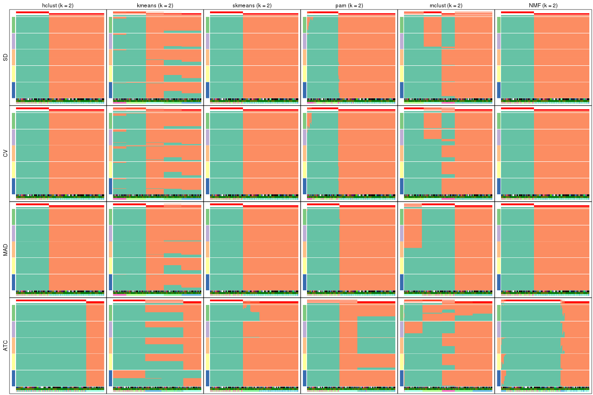</p>

</div>
<div id='tab-collect-membership-heatmap-2'>
<pre><code class="r">collect_plots(res_list, k = 3, fun = membership_heatmap, mc.cores = 4)
</code></pre>

<p></p>

</div>
<div id='tab-collect-membership-heatmap-3'>
<pre><code class="r">collect_plots(res_list, k = 4, fun = membership_heatmap, mc.cores = 4)
</code></pre>

<p></p>

</div>
<div id='tab-collect-membership-heatmap-4'>
<pre><code class="r">collect_plots(res_list, k = 5, fun = membership_heatmap, mc.cores = 4)
</code></pre>

<p></p>

</div>
<div id='tab-collect-membership-heatmap-5'>
<pre><code class="r">collect_plots(res_list, k = 6, fun = membership_heatmap, mc.cores = 4)
</code></pre>

<p></p>

</div>
</div>


### Signature heatmap

Signature heatmaps for all methods. ([What is a signature heatmap?](http://bioconductor.org/packages/devel/bioc/vignettes/cola/inst/doc/cola.html#toc_22))


Note in following heatmaps, rows are scaled.


<script>
$( function() {
	$( '#tabs-collect-get-signatures' ).tabs();
} );
</script>
<div id='tabs-collect-get-signatures'>
<ul>
<li><a href='#tab-collect-get-signatures-1'>k = 2</a></li>
<li><a href='#tab-collect-get-signatures-2'>k = 3</a></li>
<li><a href='#tab-collect-get-signatures-3'>k = 4</a></li>
<li><a href='#tab-collect-get-signatures-4'>k = 5</a></li>
<li><a href='#tab-collect-get-signatures-5'>k = 6</a></li>
</ul>
<div id='tab-collect-get-signatures-1'>
<pre><code class="r">collect_plots(res_list, k = 2, fun = get_signatures, mc.cores = 4)
</code></pre>

<p></p>

</div>
<div id='tab-collect-get-signatures-2'>
<pre><code class="r">collect_plots(res_list, k = 3, fun = get_signatures, mc.cores = 4)
</code></pre>

<p></p>

</div>
<div id='tab-collect-get-signatures-3'>
<pre><code class="r">collect_plots(res_list, k = 4, fun = get_signatures, mc.cores = 4)
</code></pre>

<p></p>

</div>
<div id='tab-collect-get-signatures-4'>
<pre><code class="r">collect_plots(res_list, k = 5, fun = get_signatures, mc.cores = 4)
</code></pre>

<p></p>

</div>
<div id='tab-collect-get-signatures-5'>
<pre><code class="r">collect_plots(res_list, k = 6, fun = get_signatures, mc.cores = 4)
</code></pre>

<p></p>

</div>
</div>


### Statistics table

The statistics used for measuring the stability of consensus partitioning.
([How are they
defined?](http://bioconductor.org/packages/devel/bioc/vignettes/cola/inst/doc/cola.html#toc_13))


<script>
$( function() {
	$( '#tabs-get-stats-from-consensus-partition-list' ).tabs();
} );
</script>
<div id='tabs-get-stats-from-consensus-partition-list'>
<ul>
<li><a href='#tab-get-stats-from-consensus-partition-list-1'>k = 2</a></li>
<li><a href='#tab-get-stats-from-consensus-partition-list-2'>k = 3</a></li>
<li><a href='#tab-get-stats-from-consensus-partition-list-3'>k = 4</a></li>
<li><a href='#tab-get-stats-from-consensus-partition-list-4'>k = 5</a></li>
<li><a href='#tab-get-stats-from-consensus-partition-list-5'>k = 6</a></li>
</ul>
<div id='tab-get-stats-from-consensus-partition-list-1'>
<pre><code class="r">get_stats(res_list, k = 2)
</code></pre>

<pre><code>#&gt;             k 1-PAC mean_silhouette concordance area_increased  Rand Jaccard
#&gt; SD:NMF      2 1.000           1.000       1.000          0.471 0.529   0.529
#&gt; CV:NMF      2 1.000           1.000       1.000          0.471 0.529   0.529
#&gt; MAD:NMF     2 1.000           1.000       1.000          0.471 0.529   0.529
#&gt; ATC:NMF     2 0.933           0.930       0.972          0.442 0.557   0.557
#&gt; SD:skmeans  2 1.000           1.000       1.000          0.471 0.529   0.529
#&gt; CV:skmeans  2 1.000           1.000       1.000          0.471 0.529   0.529
#&gt; MAD:skmeans 2 1.000           1.000       1.000          0.471 0.529   0.529
#&gt; ATC:skmeans 2 0.751           0.955       0.972          0.476 0.529   0.529
#&gt; SD:mclust   2 0.540           0.745       0.863          0.485 0.508   0.508
#&gt; CV:mclust   2 0.479           0.743       0.865          0.486 0.508   0.508
#&gt; MAD:mclust  2 0.675           0.806       0.903          0.482 0.508   0.508
#&gt; ATC:mclust  2 0.291           0.765       0.839          0.477 0.506   0.506
#&gt; SD:kmeans   2 0.508           0.873       0.878          0.434 0.529   0.529
#&gt; CV:kmeans   2 0.289           0.872       0.886          0.433 0.529   0.529
#&gt; MAD:kmeans  2 0.420           0.924       0.923          0.455 0.529   0.529
#&gt; ATC:kmeans  2 0.506           0.725       0.796          0.389 0.675   0.675
#&gt; SD:pam      2 1.000           0.984       0.992          0.459 0.540   0.540
#&gt; CV:pam      2 1.000           0.977       0.989          0.456 0.540   0.540
#&gt; MAD:pam     2 1.000           0.999       0.999          0.468 0.533   0.533
#&gt; ATC:pam     2 0.506           0.783       0.793          0.400 0.533   0.533
#&gt; SD:hclust   2 1.000           1.000       1.000          0.471 0.529   0.529
#&gt; CV:hclust   2 1.000           1.000       1.000          0.471 0.529   0.529
#&gt; MAD:hclust  2 1.000           1.000       1.000          0.471 0.529   0.529
#&gt; ATC:hclust  2 1.000           1.000       1.000          0.326 0.675   0.675
</code></pre>

</div>
<div id='tab-get-stats-from-consensus-partition-list-2'>
<pre><code class="r">get_stats(res_list, k = 3)
</code></pre>

<pre><code>#&gt;             k 1-PAC mean_silhouette concordance area_increased  Rand Jaccard
#&gt; SD:NMF      3 0.963           0.962       0.975          0.372 0.827   0.673
#&gt; CV:NMF      3 0.758           0.978       0.961          0.347 0.827   0.673
#&gt; MAD:NMF     3 0.969           0.954       0.977          0.382 0.827   0.673
#&gt; ATC:NMF     3 1.000           1.000       1.000          0.458 0.649   0.444
#&gt; SD:skmeans  3 1.000           0.997       0.996          0.367 0.827   0.673
#&gt; CV:skmeans  3 1.000           0.996       0.996          0.368 0.827   0.673
#&gt; MAD:skmeans 3 0.819           0.956       0.961          0.367 0.827   0.673
#&gt; ATC:skmeans 3 0.829           0.871       0.939          0.381 0.807   0.636
#&gt; SD:mclust   3 0.810           0.959       0.971          0.315 0.719   0.507
#&gt; CV:mclust   3 1.000           0.995       0.997          0.336 0.719   0.507
#&gt; MAD:mclust  3 0.828           0.896       0.934          0.294 0.842   0.689
#&gt; ATC:mclust  3 0.816           0.948       0.969          0.331 0.717   0.505
#&gt; SD:kmeans   3 0.669           0.886       0.824          0.374 0.827   0.673
#&gt; CV:kmeans   3 0.681           0.761       0.756          0.371 1.000   1.000
#&gt; MAD:kmeans  3 0.669           0.605       0.690          0.334 0.827   0.673
#&gt; ATC:kmeans  3 0.758           0.966       0.912          0.569 0.682   0.529
#&gt; SD:pam      3 0.990           0.974       0.987          0.399 0.819   0.664
#&gt; CV:pam      3 1.000           0.975       0.988          0.400 0.819   0.664
#&gt; MAD:pam     3 0.981           0.962       0.983          0.385 0.814   0.654
#&gt; ATC:pam     3 1.000           0.996       0.999          0.610 0.824   0.670
#&gt; SD:hclust   3 1.000           1.000       1.000          0.143 0.933   0.873
#&gt; CV:hclust   3 1.000           1.000       1.000          0.143 0.933   0.873
#&gt; MAD:hclust  3 1.000           0.999       0.999          0.143 0.933   0.873
#&gt; ATC:hclust  3 1.000           0.997       0.999          0.972 0.683   0.530
</code></pre>

</div>
<div id='tab-get-stats-from-consensus-partition-list-3'>
<pre><code class="r">get_stats(res_list, k = 4)
</code></pre>

<pre><code>#&gt;             k 1-PAC mean_silhouette concordance area_increased  Rand Jaccard
#&gt; SD:NMF      4 1.000           0.978       0.987         0.1066 0.933   0.811
#&gt; CV:NMF      4 1.000           0.998       0.999         0.1216 0.933   0.811
#&gt; MAD:NMF     4 0.877           0.946       0.946         0.1053 0.933   0.811
#&gt; ATC:NMF     4 0.932           0.978       0.913         0.0665 0.933   0.811
#&gt; SD:skmeans  4 1.000           0.990       0.976         0.1383 0.909   0.745
#&gt; CV:skmeans  4 0.842           0.979       0.951         0.1354 0.909   0.745
#&gt; MAD:skmeans 4 1.000           0.990       0.977         0.1383 0.909   0.745
#&gt; ATC:skmeans 4 1.000           1.000       1.000         0.1174 0.890   0.691
#&gt; SD:mclust   4 1.000           1.000       1.000         0.1163 0.939   0.825
#&gt; CV:mclust   4 1.000           1.000       1.000         0.0966 0.939   0.825
#&gt; MAD:mclust  4 1.000           1.000       1.000         0.1400 0.939   0.825
#&gt; ATC:mclust  4 1.000           0.989       0.984         0.1217 0.930   0.802
#&gt; SD:kmeans   4 0.667           0.855       0.774         0.1554 0.933   0.811
#&gt; CV:kmeans   4 0.652           0.846       0.757         0.1595 0.759   0.546
#&gt; MAD:kmeans  4 0.656           0.760       0.733         0.1472 0.819   0.594
#&gt; ATC:kmeans  4 0.831           0.830       0.812         0.1472 1.000   1.000
#&gt; SD:pam      4 1.000           0.988       0.994         0.1122 0.920   0.779
#&gt; CV:pam      4 1.000           1.000       1.000         0.1150 0.920   0.779
#&gt; MAD:pam     4 1.000           0.988       0.994         0.1393 0.904   0.732
#&gt; ATC:pam     4 1.000           0.997       0.999         0.1463 0.906   0.738
#&gt; SD:hclust   4 1.000           1.000       1.000         0.3216 0.827   0.625
#&gt; CV:hclust   4 1.000           1.000       1.000         0.3216 0.827   0.625
#&gt; MAD:hclust  4 1.000           1.000       1.000         0.3208 0.827   0.625
#&gt; ATC:hclust  4 1.000           0.997       0.999         0.0157 0.989   0.969
</code></pre>

</div>
<div id='tab-get-stats-from-consensus-partition-list-4'>
<pre><code class="r">get_stats(res_list, k = 5)
</code></pre>

<pre><code>#&gt;             k 1-PAC mean_silhouette concordance area_increased  Rand Jaccard
#&gt; SD:NMF      5 1.000           1.000       1.000         0.1215 0.909   0.686
#&gt; CV:NMF      5 1.000           1.000       1.000         0.1266 0.909   0.686
#&gt; MAD:NMF     5 1.000           1.000       1.000         0.1147 0.909   0.686
#&gt; ATC:NMF     5 0.851           0.973       0.895         0.1183 0.909   0.686
#&gt; SD:skmeans  5 1.000           1.000       0.999         0.0935 0.933   0.747
#&gt; CV:skmeans  5 1.000           0.999       0.998         0.0957 0.933   0.747
#&gt; MAD:skmeans 5 1.000           1.000       0.999         0.0935 0.933   0.747
#&gt; ATC:skmeans 5 0.908           0.981       0.946         0.0782 0.933   0.747
#&gt; SD:mclust   5 1.000           0.996       0.998         0.1262 0.910   0.689
#&gt; CV:mclust   5 1.000           0.996       0.995         0.1248 0.910   0.689
#&gt; MAD:mclust  5 1.000           0.992       0.997         0.1258 0.910   0.689
#&gt; ATC:mclust  5 1.000           0.960       0.984         0.1235 0.910   0.687
#&gt; SD:kmeans   5 0.721           0.960       0.826         0.0864 0.909   0.686
#&gt; CV:kmeans   5 0.719           0.954       0.811         0.0854 0.909   0.686
#&gt; MAD:kmeans  5 0.713           0.953       0.826         0.0786 0.842   0.557
#&gt; ATC:kmeans  5 0.783           0.942       0.791         0.0693 0.842   0.558
#&gt; SD:pam      5 1.000           1.000       1.000         0.1239 0.909   0.686
#&gt; CV:pam      5 1.000           1.000       1.000         0.1273 0.909   0.686
#&gt; MAD:pam     5 1.000           1.000       1.000         0.0865 0.929   0.733
#&gt; ATC:pam     5 1.000           0.995       0.998         0.0860 0.936   0.756
#&gt; SD:hclust   5 1.000           1.000       1.000         0.1273 0.909   0.686
#&gt; CV:hclust   5 0.903           0.997       0.968         0.1100 0.909   0.686
#&gt; MAD:hclust  5 0.907           0.996       0.945         0.0961 0.909   0.686
#&gt; ATC:hclust  5 0.821           0.909       0.891         0.1144 0.909   0.739
</code></pre>

</div>
<div id='tab-get-stats-from-consensus-partition-list-5'>
<pre><code class="r">get_stats(res_list, k = 6)
</code></pre>

<pre><code>#&gt;             k 1-PAC mean_silhouette concordance area_increased  Rand Jaccard
#&gt; SD:NMF      6 1.000           0.987       0.991        0.00352 1.000   1.000
#&gt; CV:NMF      6 1.000           0.973       0.989        0.00439 0.995   0.977
#&gt; MAD:NMF     6 1.000           0.988       0.990        0.00356 1.000   1.000
#&gt; ATC:NMF     6 0.943           0.958       0.938        0.03161 0.998   0.990
#&gt; SD:skmeans  6 0.971           0.955       0.956        0.01578 0.995   0.975
#&gt; CV:skmeans  6 0.971           0.978       0.978        0.01128 0.995   0.975
#&gt; MAD:skmeans 6 0.975           0.942       0.942        0.01847 1.000   1.000
#&gt; ATC:skmeans 6 0.898           0.973       0.911        0.02377 0.975   0.875
#&gt; SD:mclust   6 0.936           0.833       0.907       -0.00410 0.914   0.664
#&gt; CV:mclust   6 0.918           0.904       0.920        0.00567 0.989   0.945
#&gt; MAD:mclust  6 0.989           0.932       0.971        0.01694 0.991   0.957
#&gt; ATC:mclust  6 0.973           0.914       0.953        0.01512 0.986   0.929
#&gt; SD:kmeans   6 0.743           0.929       0.853        0.05674 1.000   1.000
#&gt; CV:kmeans   6 0.734           0.924       0.830        0.05027 1.000   1.000
#&gt; MAD:kmeans  6 0.745           0.918       0.831        0.04676 1.000   1.000
#&gt; ATC:kmeans  6 0.757           0.907       0.829        0.05105 1.000   1.000
#&gt; SD:pam      6 0.961           0.922       0.919        0.02086 0.989   0.943
#&gt; CV:pam      6 0.979           0.965       0.967        0.02706 0.977   0.885
#&gt; MAD:pam     6 0.975           0.975       0.969        0.02505 0.978   0.890
#&gt; ATC:pam     6 1.000           0.989       0.996        0.02749 0.978   0.891
#&gt; SD:hclust   6 1.000           0.978       0.990        0.00673 0.996   0.982
#&gt; CV:hclust   6 1.000           0.974       0.991        0.02300 0.995   0.974
#&gt; MAD:hclust  6 1.000           0.992       0.996        0.03414 0.996   0.982
#&gt; ATC:hclust  6 0.847           0.959       0.903        0.05995 0.939   0.760
</code></pre>

</div>
</div>

Following heatmap plots the partition for each combination of methods and the
lightness correspond to the silhouette scores for samples in each method. On
top the consensus subgroup is inferred from all methods by taking the mean
silhouette scores as weight.


<script>
$( function() {
	$( '#tabs-collect-stats-from-consensus-partition-list' ).tabs();
} );
</script>
<div id='tabs-collect-stats-from-consensus-partition-list'>
<ul>
<li><a href='#tab-collect-stats-from-consensus-partition-list-1'>k = 2</a></li>
<li><a href='#tab-collect-stats-from-consensus-partition-list-2'>k = 3</a></li>
<li><a href='#tab-collect-stats-from-consensus-partition-list-3'>k = 4</a></li>
<li><a href='#tab-collect-stats-from-consensus-partition-list-4'>k = 5</a></li>
<li><a href='#tab-collect-stats-from-consensus-partition-list-5'>k = 6</a></li>
</ul>
<div id='tab-collect-stats-from-consensus-partition-list-1'>
<pre><code class="r">collect_stats(res_list, k = 2)
</code></pre>

<p></p>

</div>
<div id='tab-collect-stats-from-consensus-partition-list-2'>
<pre><code class="r">collect_stats(res_list, k = 3)
</code></pre>

<p></p>

</div>
<div id='tab-collect-stats-from-consensus-partition-list-3'>
<pre><code class="r">collect_stats(res_list, k = 4)
</code></pre>

<p></p>

</div>
<div id='tab-collect-stats-from-consensus-partition-list-4'>
<pre><code class="r">collect_stats(res_list, k = 5)
</code></pre>

<p></p>

</div>
<div id='tab-collect-stats-from-consensus-partition-list-5'>
<pre><code class="r">collect_stats(res_list, k = 6)
</code></pre>

<p></p>

</div>
</div>

### Partition from all methods


Collect partitions from all methods:


<script>
$( function() {
	$( '#tabs-collect-classes-from-consensus-partition-list' ).tabs();
} );
</script>
<div id='tabs-collect-classes-from-consensus-partition-list'>
<ul>
<li><a href='#tab-collect-classes-from-consensus-partition-list-1'>k = 2</a></li>
<li><a href='#tab-collect-classes-from-consensus-partition-list-2'>k = 3</a></li>
<li><a href='#tab-collect-classes-from-consensus-partition-list-3'>k = 4</a></li>
<li><a href='#tab-collect-classes-from-consensus-partition-list-4'>k = 5</a></li>
<li><a href='#tab-collect-classes-from-consensus-partition-list-5'>k = 6</a></li>
</ul>
<div id='tab-collect-classes-from-consensus-partition-list-1'>
<pre><code class="r">collect_classes(res_list, k = 2)
</code></pre>

<p></p>

</div>
<div id='tab-collect-classes-from-consensus-partition-list-2'>
<pre><code class="r">collect_classes(res_list, k = 3)
</code></pre>

<p></p>

</div>
<div id='tab-collect-classes-from-consensus-partition-list-3'>
<pre><code class="r">collect_classes(res_list, k = 4)
</code></pre>

<p></p>

</div>
<div id='tab-collect-classes-from-consensus-partition-list-4'>
<pre><code class="r">collect_classes(res_list, k = 5)
</code></pre>

<p></p>

</div>
<div id='tab-collect-classes-from-consensus-partition-list-5'>
<pre><code class="r">collect_classes(res_list, k = 6)
</code></pre>

<p></p>

</div>
</div>


### Top rows overlap


Overlap of top rows from different top-row methods:


<script>
$( function() {
	$( '#tabs-top-rows-overlap-by-euler' ).tabs();
} );
</script>
<div id='tabs-top-rows-overlap-by-euler'>
<ul>
<li><a href='#tab-top-rows-overlap-by-euler-1'>top_n = 1000</a></li>
<li><a href='#tab-top-rows-overlap-by-euler-2'>top_n = 2000</a></li>
<li><a href='#tab-top-rows-overlap-by-euler-3'>top_n = 3000</a></li>
<li><a href='#tab-top-rows-overlap-by-euler-4'>top_n = 4000</a></li>
<li><a href='#tab-top-rows-overlap-by-euler-5'>top_n = 5000</a></li>
</ul>
<div id='tab-top-rows-overlap-by-euler-1'>
<pre><code class="r">top_rows_overlap(res_list, top_n = 1000, method = &quot;euler&quot;)
</code></pre>

<p></p>

</div>
<div id='tab-top-rows-overlap-by-euler-2'>
<pre><code class="r">top_rows_overlap(res_list, top_n = 2000, method = &quot;euler&quot;)
</code></pre>

<p></p>

</div>
<div id='tab-top-rows-overlap-by-euler-3'>
<pre><code class="r">top_rows_overlap(res_list, top_n = 3000, method = &quot;euler&quot;)
</code></pre>

<p></p>

</div>
<div id='tab-top-rows-overlap-by-euler-4'>
<pre><code class="r">top_rows_overlap(res_list, top_n = 4000, method = &quot;euler&quot;)
</code></pre>

<p></p>

</div>
<div id='tab-top-rows-overlap-by-euler-5'>
<pre><code class="r">top_rows_overlap(res_list, top_n = 5000, method = &quot;euler&quot;)
</code></pre>

<p></p>

</div>
</div>

Also visualize the correspondance of rankings between different top-row methods:


<script>
$( function() {
	$( '#tabs-top-rows-overlap-by-correspondance' ).tabs();
} );
</script>
<div id='tabs-top-rows-overlap-by-correspondance'>
<ul>
<li><a href='#tab-top-rows-overlap-by-correspondance-1'>top_n = 1000</a></li>
<li><a href='#tab-top-rows-overlap-by-correspondance-2'>top_n = 2000</a></li>
<li><a href='#tab-top-rows-overlap-by-correspondance-3'>top_n = 3000</a></li>
<li><a href='#tab-top-rows-overlap-by-correspondance-4'>top_n = 4000</a></li>
<li><a href='#tab-top-rows-overlap-by-correspondance-5'>top_n = 5000</a></li>
</ul>
<div id='tab-top-rows-overlap-by-correspondance-1'>
<pre><code class="r">top_rows_overlap(res_list, top_n = 1000, method = &quot;correspondance&quot;)
</code></pre>

<p></p>

</div>
<div id='tab-top-rows-overlap-by-correspondance-2'>
<pre><code class="r">top_rows_overlap(res_list, top_n = 2000, method = &quot;correspondance&quot;)
</code></pre>

<p></p>

</div>
<div id='tab-top-rows-overlap-by-correspondance-3'>
<pre><code class="r">top_rows_overlap(res_list, top_n = 3000, method = &quot;correspondance&quot;)
</code></pre>

<p></p>

</div>
<div id='tab-top-rows-overlap-by-correspondance-4'>
<pre><code class="r">top_rows_overlap(res_list, top_n = 4000, method = &quot;correspondance&quot;)
</code></pre>

<p></p>

</div>
<div id='tab-top-rows-overlap-by-correspondance-5'>
<pre><code class="r">top_rows_overlap(res_list, top_n = 5000, method = &quot;correspondance&quot;)
</code></pre>

<p></p>

</div>
</div>


Heatmaps of the top rows:


<script>
$( function() {
	$( '#tabs-top-rows-heatmap' ).tabs();
} );
</script>
<div id='tabs-top-rows-heatmap'>
<ul>
<li><a href='#tab-top-rows-heatmap-1'>top_n = 1000</a></li>
<li><a href='#tab-top-rows-heatmap-2'>top_n = 2000</a></li>
<li><a href='#tab-top-rows-heatmap-3'>top_n = 3000</a></li>
<li><a href='#tab-top-rows-heatmap-4'>top_n = 4000</a></li>
<li><a href='#tab-top-rows-heatmap-5'>top_n = 5000</a></li>
</ul>
<div id='tab-top-rows-heatmap-1'>
<pre><code class="r">top_rows_heatmap(res_list, top_n = 1000)
</code></pre>

<p></p>

</div>
<div id='tab-top-rows-heatmap-2'>
<pre><code class="r">top_rows_heatmap(res_list, top_n = 2000)
</code></pre>

<p></p>

</div>
<div id='tab-top-rows-heatmap-3'>
<pre><code class="r">top_rows_heatmap(res_list, top_n = 3000)
</code></pre>

<p></p>

</div>
<div id='tab-top-rows-heatmap-4'>
<pre><code class="r">top_rows_heatmap(res_list, top_n = 4000)
</code></pre>

<p></p>

</div>
<div id='tab-top-rows-heatmap-5'>
<pre><code class="r">top_rows_heatmap(res_list, top_n = 5000)
</code></pre>

<p></p>

</div>
</div>


### Test to known annotations


Test correlation between subgroups and known annotations. If the known
annotation is numeric, one-way ANOVA test is applied, and if the known
annotation is discrete, chi-squared contingency table test is applied.


<script>
$( function() {
	$( '#tabs-test-to-known-factors-from-consensus-partition-list' ).tabs();
} );
</script>
<div id='tabs-test-to-known-factors-from-consensus-partition-list'>
<ul>
<li><a href='#tab-test-to-known-factors-from-consensus-partition-list-1'>k = 2</a></li>
<li><a href='#tab-test-to-known-factors-from-consensus-partition-list-2'>k = 3</a></li>
<li><a href='#tab-test-to-known-factors-from-consensus-partition-list-3'>k = 4</a></li>
<li><a href='#tab-test-to-known-factors-from-consensus-partition-list-4'>k = 5</a></li>
<li><a href='#tab-test-to-known-factors-from-consensus-partition-list-5'>k = 6</a></li>
</ul>
<div id='tab-test-to-known-factors-from-consensus-partition-list-1'>
<pre><code class="r">test_to_known_factors(res_list, k = 2)
</code></pre>

<pre><code>#&gt;               n individual(p) disease.state(p) cell.type(p) k
#&gt; SD:NMF      153             1            1.000     4.63e-32 2
#&gt; CV:NMF      153             1            1.000     4.63e-32 2
#&gt; MAD:NMF     153             1            1.000     4.63e-32 2
#&gt; ATC:NMF     147             1            0.636     4.95e-24 2
#&gt; SD:skmeans  153             1            1.000     4.63e-32 2
#&gt; CV:skmeans  153             1            1.000     4.63e-32 2
#&gt; MAD:skmeans 153             1            1.000     4.63e-32 2
#&gt; ATC:skmeans 153             1            1.000     4.63e-32 2
#&gt; SD:mclust   130             1            1.000     5.41e-28 2
#&gt; CV:mclust   130             1            1.000     5.41e-28 2
#&gt; MAD:mclust  122             1            1.000     2.86e-26 2
#&gt; ATC:mclust  130             1            1.000     5.41e-28 2
#&gt; SD:kmeans   153             1            1.000     4.63e-32 2
#&gt; CV:kmeans   153             1            1.000     4.63e-32 2
#&gt; MAD:kmeans  153             1            1.000     4.63e-32 2
#&gt; ATC:kmeans  153             1            1.000     4.63e-32 2
#&gt; SD:pam      152             1            0.839     3.81e-30 2
#&gt; CV:pam      152             1            0.839     3.81e-30 2
#&gt; MAD:pam     153             1            1.000     3.54e-31 2
#&gt; ATC:pam     153             1            1.000     3.54e-31 2
#&gt; SD:hclust   153             1            1.000     4.63e-32 2
#&gt; CV:hclust   153             1            1.000     4.63e-32 2
#&gt; MAD:hclust  153             1            1.000     4.63e-32 2
#&gt; ATC:hclust  153             1            1.000     4.63e-32 2
</code></pre>

</div>
<div id='tab-test-to-known-factors-from-consensus-partition-list-2'>
<pre><code class="r">test_to_known_factors(res_list, k = 3)
</code></pre>

<pre><code>#&gt;               n individual(p) disease.state(p) cell.type(p) k
#&gt; SD:NMF      153             1            0.985     2.17e-61 3
#&gt; CV:NMF      153             1            0.985     2.17e-61 3
#&gt; MAD:NMF     151             1            0.984     1.55e-60 3
#&gt; ATC:NMF     153             1            0.985     2.17e-61 3
#&gt; SD:skmeans  153             1            0.985     2.17e-61 3
#&gt; CV:skmeans  153             1            0.985     2.17e-61 3
#&gt; MAD:skmeans 153             1            0.985     2.17e-61 3
#&gt; ATC:skmeans 151             1            0.900     1.67e-51 3
#&gt; SD:mclust   153             1            0.956     2.17e-61 3
#&gt; CV:mclust   153             1            0.956     2.17e-61 3
#&gt; MAD:mclust  153             1            0.956     2.17e-61 3
#&gt; ATC:mclust  153             1            0.946     1.66e-58 3
#&gt; SD:kmeans   153             1            0.985     2.17e-61 3
#&gt; CV:kmeans   153             1            1.000     4.63e-32 3
#&gt; MAD:kmeans  119             1            0.978     1.50e-48 3
#&gt; ATC:kmeans  153             1            0.981     2.32e-60 3
#&gt; SD:pam      153             1            0.856     1.44e-58 3
#&gt; CV:pam      153             1            0.856     1.44e-58 3
#&gt; MAD:pam     150             1            0.974     4.41e-59 3
#&gt; ATC:pam     153             1            0.981     2.32e-60 3
#&gt; SD:hclust   153             1            0.875     2.17e-61 3
#&gt; CV:hclust   153             1            0.875     2.17e-61 3
#&gt; MAD:hclust  153             1            0.875     2.17e-61 3
#&gt; ATC:hclust  153             1            0.937     2.02e-59 3
</code></pre>

</div>
<div id='tab-test-to-known-factors-from-consensus-partition-list-3'>
<pre><code class="r">test_to_known_factors(res_list, k = 4)
</code></pre>

<pre><code>#&gt;               n individual(p) disease.state(p) cell.type(p) k
#&gt; SD:NMF      153             1            0.964     1.16e-90 4
#&gt; CV:NMF      153             1            0.964     1.16e-90 4
#&gt; MAD:NMF     153             1            0.964     1.16e-90 4
#&gt; ATC:NMF     153             1            0.964     1.16e-90 4
#&gt; SD:skmeans  153             1            0.996     1.16e-90 4
#&gt; CV:skmeans  153             1            0.996     1.16e-90 4
#&gt; MAD:skmeans 153             1            0.996     1.16e-90 4
#&gt; ATC:skmeans 153             1            0.996     1.16e-90 4
#&gt; SD:mclust   153             1            0.964     1.16e-90 4
#&gt; CV:mclust   153             1            0.964     1.16e-90 4
#&gt; MAD:mclust  153             1            0.964     1.16e-90 4
#&gt; ATC:mclust  153             1            0.964     1.16e-90 4
#&gt; SD:kmeans   153             1            0.964     1.16e-90 4
#&gt; CV:kmeans   153             1            0.964     1.16e-90 4
#&gt; MAD:kmeans  153             1            0.985     2.17e-61 4
#&gt; ATC:kmeans  153             1            0.981     2.32e-60 4
#&gt; SD:pam      153             1            0.964     1.16e-90 4
#&gt; CV:pam      153             1            0.964     1.16e-90 4
#&gt; MAD:pam     152             1            0.983     1.39e-88 4
#&gt; ATC:pam     153             1            0.998     3.89e-89 4
#&gt; SD:hclust   153             1            0.964     1.16e-90 4
#&gt; CV:hclust   153             1            0.964     1.16e-90 4
#&gt; MAD:hclust  153             1            0.964     1.16e-90 4
#&gt; ATC:hclust  153             1            0.441     4.82e-60 4
</code></pre>

</div>
<div id='tab-test-to-known-factors-from-consensus-partition-list-4'>
<pre><code class="r">test_to_known_factors(res_list, k = 5)
</code></pre>

<pre><code>#&gt;               n individual(p) disease.state(p) cell.type(p) k
#&gt; SD:NMF      153             1            0.989    6.51e-120 5
#&gt; CV:NMF      153             1            0.989    6.51e-120 5
#&gt; MAD:NMF     153             1            0.989    6.51e-120 5
#&gt; ATC:NMF     153             1            0.989    6.51e-120 5
#&gt; SD:skmeans  153             1            0.989    6.51e-120 5
#&gt; CV:skmeans  153             1            0.989    6.51e-120 5
#&gt; MAD:skmeans 153             1            0.989    6.51e-120 5
#&gt; ATC:skmeans 153             1            0.989    6.51e-120 5
#&gt; SD:mclust   153             1            0.933    3.93e-116 5
#&gt; CV:mclust   153             1            0.933    3.93e-116 5
#&gt; MAD:mclust  152             1            0.887    3.04e-115 5
#&gt; ATC:mclust  149             1            0.982    1.61e-116 5
#&gt; SD:kmeans   153             1            0.989    6.51e-120 5
#&gt; CV:kmeans   153             1            0.989    6.51e-120 5
#&gt; MAD:kmeans  153             1            0.989    6.51e-120 5
#&gt; ATC:kmeans  153             1            0.998    1.57e-117 5
#&gt; SD:pam      153             1            0.989    6.51e-120 5
#&gt; CV:pam      153             1            0.989    6.51e-120 5
#&gt; MAD:pam     153             1            0.989    6.51e-120 5
#&gt; ATC:pam     153             1            0.998    1.57e-117 5
#&gt; SD:hclust   153             1            0.989    6.51e-120 5
#&gt; CV:hclust   153             1            0.989    6.51e-120 5
#&gt; MAD:hclust  153             1            0.989    6.51e-120 5
#&gt; ATC:hclust  153             1            0.605     2.71e-89 5
</code></pre>

</div>
<div id='tab-test-to-known-factors-from-consensus-partition-list-5'>
<pre><code class="r">test_to_known_factors(res_list, k = 6)
</code></pre>

<pre><code>#&gt;               n individual(p) disease.state(p) cell.type(p) k
#&gt; SD:NMF      153             1            0.989    6.51e-120 6
#&gt; CV:NMF      150             1            0.998    2.29e-117 6
#&gt; MAD:NMF     153             1            0.989    6.51e-120 6
#&gt; ATC:NMF     151             1            0.994    3.24e-118 6
#&gt; SD:skmeans  153             1            0.662    8.52e-117 6
#&gt; CV:skmeans  153             1            0.662    8.52e-117 6
#&gt; MAD:skmeans 153             1            0.989    6.51e-120 6
#&gt; ATC:skmeans 153             1            0.981    8.52e-117 6
#&gt; SD:mclust   130             1            0.285     4.25e-94 6
#&gt; CV:mclust   143             1            0.322    3.77e-106 6
#&gt; MAD:mclust  150             1            0.431    6.60e-113 6
#&gt; ATC:mclust  150             1            0.726    2.88e-114 6
#&gt; SD:kmeans   153             1            0.989    6.51e-120 6
#&gt; CV:kmeans   153             1            0.989    6.51e-120 6
#&gt; MAD:kmeans  153             1            0.989    6.51e-120 6
#&gt; ATC:kmeans  153             1            0.998    1.57e-117 6
#&gt; SD:pam      150             1            0.984    2.88e-114 6
#&gt; CV:pam      153             1            0.689    8.52e-117 6
#&gt; MAD:pam     153             1            0.822    8.52e-117 6
#&gt; ATC:pam     153             1            0.847    1.98e-114 6
#&gt; SD:hclust   152             1            0.728    5.94e-116 6
#&gt; CV:hclust   150             1            0.640    2.88e-114 6
#&gt; MAD:hclust  153             1            0.740    8.52e-117 6
#&gt; ATC:hclust  153             1            0.740    8.52e-117 6
</code></pre>

</div>
</div>


 
## Results for each method


---------------------------------------------------


### SD:hclust**


The object with results only for a single top-value method and a single partition method 
can be extracted as:

```r
res = res_list["SD", "hclust"]
# you can also extract it by
# res = res_list["SD:hclust"]
```

A summary of `res` and all the functions that can be applied to it:

```r
res
```

```
#> A 'ConsensusPartition' object with k = 2, 3, 4, 5, 6.
#>   On a matrix with 19559 rows and 153 columns.
#>   Top rows (1000, 2000, 3000, 4000, 5000) are extracted by 'SD' method.
#>   Subgroups are detected by 'hclust' method.
#>   Performed in total 1250 partitions by row resampling.
#>   Best k for subgroups seems to be 5.
#> 
#> Following methods can be applied to this 'ConsensusPartition' object:
#>  [1] "cola_report"             "collect_classes"         "collect_plots"          
#>  [4] "collect_stats"           "colnames"                "compare_signatures"     
#>  [7] "consensus_heatmap"       "dimension_reduction"     "functional_enrichment"  
#> [10] "get_anno_col"            "get_anno"                "get_classes"            
#> [13] "get_consensus"           "get_matrix"              "get_membership"         
#> [16] "get_param"               "get_signatures"          "get_stats"              
#> [19] "is_best_k"               "is_stable_k"             "membership_heatmap"     
#> [22] "ncol"                    "nrow"                    "plot_ecdf"              
#> [25] "rownames"                "select_partition_number" "show"                   
#> [28] "suggest_best_k"          "test_to_known_factors"
```

`collect_plots()` function collects all the plots made from `res` for all `k` (number of partitions)
into one single page to provide an easy and fast comparison between different `k`.

```r
collect_plots(res)
```


The plots are:

- The first row: a plot of the ECDF (empirical cumulative distribution
  function) curves of the consensus matrix for each `k` and the heatmap of
  predicted classes for each `k`.
- The second row: heatmaps of the consensus matrix for each `k`.
- The third row: heatmaps of the membership matrix for each `k`.
- The fouth row: heatmaps of the signatures for each `k`.

All the plots in panels can be made by individual functions and they are
plotted later in this section.

`select_partition_number()` produces several plots showing different
statistics for choosing "optimized" `k`. There are following statistics:

- ECDF curves of the consensus matrix for each `k`;
- 1-PAC. [The PAC
  score](https://en.wikipedia.org/wiki/Consensus_clustering#Over-interpretation_potential_of_consensus_clustering)
  measures the proportion of the ambiguous subgrouping.
- Mean silhouette score.
- Concordance. The mean probability of fiting the consensus class ids in all
  partitions.
- Area increased. Denote $A_k$ as the area under the ECDF curve for current
  `k`, the area increased is defined as $A_k - A_{k-1}$.
- Rand index. The percent of pairs of samples that are both in a same cluster
  or both are not in a same cluster in the partition of k and k-1.
- Jaccard index. The ratio of pairs of samples are both in a same cluster in
  the partition of k and k-1 and the pairs of samples are both in a same
  cluster in the partition k or k-1.

The detailed explanations of these statistics can be found in [the _cola_
vignette](http://bioconductor.org/packages/devel/bioc/vignettes/cola/inst/doc/cola.html#toc_13).

Generally speaking, lower PAC score, higher mean silhouette score or higher
concordance corresponds to better partition. Rand index and Jaccard index
measure how similar the current partition is compared to partition with `k-1`.
If they are too similar, we won't accept `k` is better than `k-1`.

```r
select_partition_number(res)
```


The numeric values for all these statistics can be obtained by `get_stats()`.

```r
get_stats(res)
```

```
#>   k 1-PAC mean_silhouette concordance area_increased  Rand Jaccard
#> 2 2     1           1.000        1.00        0.47112 0.529   0.529
#> 3 3     1           1.000        1.00        0.14261 0.933   0.873
#> 4 4     1           1.000        1.00        0.32159 0.827   0.625
#> 5 5     1           1.000        1.00        0.12728 0.909   0.686
#> 6 6     1           0.978        0.99        0.00673 0.996   0.982
```

`suggest_best_k()` suggests the best $k$ based on these statistics. The rules are as follows:

- All $k$ with Jaccard index larger than 0.95 are removed because increasing
  $k$ does not provide enough extra information. If all $k$ are removed, it is
  marked as no subgroup is detected.
- For all $k$ with 1-PAC score larger than 0.9, the maximal $k$ is taken as
  the best $k$, and other $k$ are marked as optional $k$.
- If it does not fit the second rule. The $k$ with the maximal vote of the
  highest 1-PAC score, highest mean silhouette, and highest concordance is
  taken as the best $k$.

```r
suggest_best_k(res)
```

```
#> [1] 5
#> attr(,"optional")
#> [1] 2 3 4
```

There is also optional best $k$ = 2 3 4 that is worth to check.

Following shows the table of the partitions (You need to click the **show/hide
code output** link to see it). The membership matrix (columns with name `p*`)
is inferred by
[`clue::cl_consensus()`](https://www.rdocumentation.org/link/cl_consensus?package=clue)
function with the `SE` method. Basically the value in the membership matrix
represents the probability to belong to a certain group. The finall class
label for an item is determined with the group with highest probability it
belongs to.

In `get_classes()` function, the entropy is calculated from the membership
matrix and the silhouette score is calculated from the consensus matrix.


<script>
$( function() {
	$( '#tabs-SD-hclust-get-classes' ).tabs();
} );
</script>
<div id='tabs-SD-hclust-get-classes'>
<ul>
<li><a href='#tab-SD-hclust-get-classes-1'>k = 2</a></li>
<li><a href='#tab-SD-hclust-get-classes-2'>k = 3</a></li>
<li><a href='#tab-SD-hclust-get-classes-3'>k = 4</a></li>
<li><a href='#tab-SD-hclust-get-classes-4'>k = 5</a></li>
<li><a href='#tab-SD-hclust-get-classes-5'>k = 6</a></li>
</ul>

<div id='tab-SD-hclust-get-classes-1'>
<p><a id='tab-SD-hclust-get-classes-1-a' style='color:#0366d6' href='#'>show/hide code output</a></p>
<pre><code class="r">cbind(get_classes(res, k = 2), get_membership(res, k = 2))
</code></pre>

<pre><code>#&gt;           class entropy silhouette p1 p2
#&gt; GSM247795     2       0          1  0  1
#&gt; GSM247854     2       0          1  0  1
#&gt; GSM247758     2       0          1  0  1
#&gt; GSM247742     1       0          1  1  0
#&gt; GSM247755     2       0          1  0  1
#&gt; GSM247841     1       0          1  1  0
#&gt; GSM247703     2       0          1  0  1
#&gt; GSM247739     2       0          1  0  1
#&gt; GSM247715     1       0          1  1  0
#&gt; GSM247829     2       0          1  0  1
#&gt; GSM247842     1       0          1  1  0
#&gt; GSM247805     2       0          1  0  1
#&gt; GSM247786     2       0          1  0  1
#&gt; GSM247812     2       0          1  0  1
#&gt; GSM247776     1       0          1  1  0
#&gt; GSM247850     1       0          1  1  0
#&gt; GSM247717     2       0          1  0  1
#&gt; GSM247784     2       0          1  0  1
#&gt; GSM247834     1       0          1  1  0
#&gt; GSM247783     2       0          1  0  1
#&gt; GSM247846     1       0          1  1  0
#&gt; GSM247822     2       0          1  0  1
#&gt; GSM247710     2       0          1  0  1
#&gt; GSM247713     1       0          1  1  0
#&gt; GSM247840     2       0          1  0  1
#&gt; GSM247733     1       0          1  1  0
#&gt; GSM247852     1       0          1  1  0
#&gt; GSM247790     2       0          1  0  1
#&gt; GSM247730     2       0          1  0  1
#&gt; GSM247824     2       0          1  0  1
#&gt; GSM247770     1       0          1  1  0
#&gt; GSM247711     2       0          1  0  1
#&gt; GSM247782     2       0          1  0  1
#&gt; GSM247836     1       0          1  1  0
#&gt; GSM247785     2       0          1  0  1
#&gt; GSM247847     1       0          1  1  0
#&gt; GSM247750     2       0          1  0  1
#&gt; GSM247788     2       0          1  0  1
#&gt; GSM247849     1       0          1  1  0
#&gt; GSM247772     2       0          1  0  1
#&gt; GSM247760     1       0          1  1  0
#&gt; GSM247764     2       0          1  0  1
#&gt; GSM247851     2       0          1  0  1
#&gt; GSM247714     2       0          1  0  1
#&gt; GSM247828     1       0          1  1  0
#&gt; GSM247704     2       0          1  0  1
#&gt; GSM247818     1       0          1  1  0
#&gt; GSM247823     2       0          1  0  1
#&gt; GSM247706     2       0          1  0  1
#&gt; GSM247835     2       0          1  0  1
#&gt; GSM247734     1       0          1  1  0
#&gt; GSM247819     2       0          1  0  1
#&gt; GSM247809     2       0          1  0  1
#&gt; GSM247830     2       0          1  0  1
#&gt; GSM247833     1       0          1  1  0
#&gt; GSM247738     2       0          1  0  1
#&gt; GSM247716     2       0          1  0  1
#&gt; GSM247747     2       0          1  0  1
#&gt; GSM247722     1       0          1  1  0
#&gt; GSM247816     2       0          1  0  1
#&gt; GSM247839     2       0          1  0  1
#&gt; GSM247821     1       0          1  1  0
#&gt; GSM247798     2       0          1  0  1
#&gt; GSM247838     1       0          1  1  0
#&gt; GSM247721     2       0          1  0  1
#&gt; GSM247781     2       0          1  0  1
#&gt; GSM247762     1       0          1  1  0
#&gt; GSM247825     2       0          1  0  1
#&gt; GSM247777     1       0          1  1  0
#&gt; GSM247761     2       0          1  0  1
#&gt; GSM247720     2       0          1  0  1
#&gt; GSM247814     2       0          1  0  1
#&gt; GSM247732     1       0          1  1  0
#&gt; GSM247708     2       0          1  0  1
#&gt; GSM247740     2       0          1  0  1
#&gt; GSM247749     1       0          1  1  0
#&gt; GSM247767     2       0          1  0  1
#&gt; GSM247748     1       0          1  1  0
#&gt; GSM247705     2       0          1  0  1
#&gt; GSM247746     2       0          1  0  1
#&gt; GSM247752     1       0          1  1  0
#&gt; GSM247769     2       0          1  0  1
#&gt; GSM247753     1       0          1  1  0
#&gt; GSM247723     2       0          1  0  1
#&gt; GSM247779     2       0          1  0  1
#&gt; GSM247756     1       0          1  1  0
#&gt; GSM247826     2       0          1  0  1
#&gt; GSM247775     1       0          1  1  0
#&gt; GSM247741     2       0          1  0  1
#&gt; GSM247799     2       0          1  0  1
#&gt; GSM247778     1       0          1  1  0
#&gt; GSM247806     2       0          1  0  1
#&gt; GSM247815     1       0          1  1  0
#&gt; GSM247735     2       0          1  0  1
#&gt; GSM247831     2       0          1  0  1
#&gt; GSM247845     1       0          1  1  0
#&gt; GSM247791     2       0          1  0  1
#&gt; GSM247780     1       0          1  1  0
#&gt; GSM247853     1       0          1  1  0
#&gt; GSM247800     2       0          1  0  1
#&gt; GSM247729     2       0          1  0  1
#&gt; GSM247810     1       0          1  1  0
#&gt; GSM247844     2       0          1  0  1
#&gt; GSM247793     1       0          1  1  0
#&gt; GSM247759     2       0          1  0  1
#&gt; GSM247724     2       0          1  0  1
#&gt; GSM247817     2       0          1  0  1
#&gt; GSM247727     1       0          1  1  0
#&gt; GSM247796     2       0          1  0  1
#&gt; GSM247725     2       0          1  0  1
#&gt; GSM247801     1       0          1  1  0
#&gt; GSM247731     2       0          1  0  1
#&gt; GSM247765     1       0          1  1  0
#&gt; GSM247792     2       0          1  0  1
#&gt; GSM247726     2       0          1  0  1
#&gt; GSM247803     1       0          1  1  0
#&gt; GSM247728     2       0          1  0  1
#&gt; GSM247768     1       0          1  1  0
#&gt; GSM247745     2       0          1  0  1
#&gt; GSM247855     2       0          1  0  1
#&gt; GSM247804     2       0          1  0  1
#&gt; GSM247774     1       0          1  1  0
#&gt; GSM247807     2       0          1  0  1
#&gt; GSM247813     1       0          1  1  0
#&gt; GSM247736     2       0          1  0  1
#&gt; GSM247712     2       0          1  0  1
#&gt; GSM247797     1       0          1  1  0
#&gt; GSM247743     2       0          1  0  1
#&gt; GSM247719     1       0          1  1  0
#&gt; GSM247707     2       0          1  0  1
#&gt; GSM247737     2       0          1  0  1
#&gt; GSM247827     2       0          1  0  1
#&gt; GSM247848     1       0          1  1  0
#&gt; GSM247794     2       0          1  0  1
#&gt; GSM247757     2       0          1  0  1
#&gt; GSM247744     1       0          1  1  0
#&gt; GSM247751     2       0          1  0  1
#&gt; GSM247837     1       0          1  1  0
#&gt; GSM247754     2       0          1  0  1
#&gt; GSM247789     2       0          1  0  1
#&gt; GSM247802     1       0          1  1  0
#&gt; GSM247771     2       0          1  0  1
#&gt; GSM247763     1       0          1  1  0
#&gt; GSM247808     2       0          1  0  1
#&gt; GSM247787     2       0          1  0  1
#&gt; GSM247843     1       0          1  1  0
#&gt; GSM247811     2       0          1  0  1
#&gt; GSM247773     1       0          1  1  0
#&gt; GSM247766     2       0          1  0  1
#&gt; GSM247718     2       0          1  0  1
#&gt; GSM247832     1       0          1  1  0
#&gt; GSM247709     2       0          1  0  1
#&gt; GSM247820     1       0          1  1  0
</code></pre>

<script>
$('#tab-SD-hclust-get-classes-1-a').parent().next().next().hide();
$('#tab-SD-hclust-get-classes-1-a').click(function(){
  $('#tab-SD-hclust-get-classes-1-a').parent().next().next().toggle();
  return(false);
});
</script>
</div>

<div id='tab-SD-hclust-get-classes-2'>
<p><a id='tab-SD-hclust-get-classes-2-a' style='color:#0366d6' href='#'>show/hide code output</a></p>
<pre><code class="r">cbind(get_classes(res, k = 3), get_membership(res, k = 3))
</code></pre>

<pre><code>#&gt;           class entropy silhouette p1 p2 p3
#&gt; GSM247795     2       0          1  0  1  0
#&gt; GSM247854     2       0          1  0  1  0
#&gt; GSM247758     2       0          1  0  1  0
#&gt; GSM247742     3       0          1  0  0  1
#&gt; GSM247755     2       0          1  0  1  0
#&gt; GSM247841     1       0          1  1  0  0
#&gt; GSM247703     2       0          1  0  1  0
#&gt; GSM247739     2       0          1  0  1  0
#&gt; GSM247715     3       0          1  0  0  1
#&gt; GSM247829     2       0          1  0  1  0
#&gt; GSM247842     1       0          1  1  0  0
#&gt; GSM247805     2       0          1  0  1  0
#&gt; GSM247786     2       0          1  0  1  0
#&gt; GSM247812     2       0          1  0  1  0
#&gt; GSM247776     1       0          1  1  0  0
#&gt; GSM247850     1       0          1  1  0  0
#&gt; GSM247717     2       0          1  0  1  0
#&gt; GSM247784     2       0          1  0  1  0
#&gt; GSM247834     3       0          1  0  0  1
#&gt; GSM247783     2       0          1  0  1  0
#&gt; GSM247846     1       0          1  1  0  0
#&gt; GSM247822     2       0          1  0  1  0
#&gt; GSM247710     2       0          1  0  1  0
#&gt; GSM247713     3       0          1  0  0  1
#&gt; GSM247840     2       0          1  0  1  0
#&gt; GSM247733     1       0          1  1  0  0
#&gt; GSM247852     1       0          1  1  0  0
#&gt; GSM247790     2       0          1  0  1  0
#&gt; GSM247730     2       0          1  0  1  0
#&gt; GSM247824     2       0          1  0  1  0
#&gt; GSM247770     1       0          1  1  0  0
#&gt; GSM247711     2       0          1  0  1  0
#&gt; GSM247782     2       0          1  0  1  0
#&gt; GSM247836     3       0          1  0  0  1
#&gt; GSM247785     2       0          1  0  1  0
#&gt; GSM247847     1       0          1  1  0  0
#&gt; GSM247750     2       0          1  0  1  0
#&gt; GSM247788     2       0          1  0  1  0
#&gt; GSM247849     3       0          1  0  0  1
#&gt; GSM247772     2       0          1  0  1  0
#&gt; GSM247760     1       0          1  1  0  0
#&gt; GSM247764     2       0          1  0  1  0
#&gt; GSM247851     2       0          1  0  1  0
#&gt; GSM247714     2       0          1  0  1  0
#&gt; GSM247828     3       0          1  0  0  1
#&gt; GSM247704     2       0          1  0  1  0
#&gt; GSM247818     1       0          1  1  0  0
#&gt; GSM247823     2       0          1  0  1  0
#&gt; GSM247706     2       0          1  0  1  0
#&gt; GSM247835     2       0          1  0  1  0
#&gt; GSM247734     1       0          1  1  0  0
#&gt; GSM247819     2       0          1  0  1  0
#&gt; GSM247809     2       0          1  0  1  0
#&gt; GSM247830     2       0          1  0  1  0
#&gt; GSM247833     1       0          1  1  0  0
#&gt; GSM247738     2       0          1  0  1  0
#&gt; GSM247716     2       0          1  0  1  0
#&gt; GSM247747     2       0          1  0  1  0
#&gt; GSM247722     1       0          1  1  0  0
#&gt; GSM247816     2       0          1  0  1  0
#&gt; GSM247839     2       0          1  0  1  0
#&gt; GSM247821     3       0          1  0  0  1
#&gt; GSM247798     2       0          1  0  1  0
#&gt; GSM247838     1       0          1  1  0  0
#&gt; GSM247721     2       0          1  0  1  0
#&gt; GSM247781     2       0          1  0  1  0
#&gt; GSM247762     3       0          1  0  0  1
#&gt; GSM247825     2       0          1  0  1  0
#&gt; GSM247777     1       0          1  1  0  0
#&gt; GSM247761     2       0          1  0  1  0
#&gt; GSM247720     2       0          1  0  1  0
#&gt; GSM247814     2       0          1  0  1  0
#&gt; GSM247732     1       0          1  1  0  0
#&gt; GSM247708     2       0          1  0  1  0
#&gt; GSM247740     2       0          1  0  1  0
#&gt; GSM247749     3       0          1  0  0  1
#&gt; GSM247767     2       0          1  0  1  0
#&gt; GSM247748     1       0          1  1  0  0
#&gt; GSM247705     2       0          1  0  1  0
#&gt; GSM247746     2       0          1  0  1  0
#&gt; GSM247752     3       0          1  0  0  1
#&gt; GSM247769     2       0          1  0  1  0
#&gt; GSM247753     1       0          1  1  0  0
#&gt; GSM247723     2       0          1  0  1  0
#&gt; GSM247779     2       0          1  0  1  0
#&gt; GSM247756     3       0          1  0  0  1
#&gt; GSM247826     2       0          1  0  1  0
#&gt; GSM247775     1       0          1  1  0  0
#&gt; GSM247741     2       0          1  0  1  0
#&gt; GSM247799     2       0          1  0  1  0
#&gt; GSM247778     3       0          1  0  0  1
#&gt; GSM247806     2       0          1  0  1  0
#&gt; GSM247815     1       0          1  1  0  0
#&gt; GSM247735     2       0          1  0  1  0
#&gt; GSM247831     2       0          1  0  1  0
#&gt; GSM247845     3       0          1  0  0  1
#&gt; GSM247791     2       0          1  0  1  0
#&gt; GSM247780     1       0          1  1  0  0
#&gt; GSM247853     1       0          1  1  0  0
#&gt; GSM247800     2       0          1  0  1  0
#&gt; GSM247729     2       0          1  0  1  0
#&gt; GSM247810     3       0          1  0  0  1
#&gt; GSM247844     2       0          1  0  1  0
#&gt; GSM247793     1       0          1  1  0  0
#&gt; GSM247759     2       0          1  0  1  0
#&gt; GSM247724     2       0          1  0  1  0
#&gt; GSM247817     2       0          1  0  1  0
#&gt; GSM247727     1       0          1  1  0  0
#&gt; GSM247796     2       0          1  0  1  0
#&gt; GSM247725     2       0          1  0  1  0
#&gt; GSM247801     3       0          1  0  0  1
#&gt; GSM247731     2       0          1  0  1  0
#&gt; GSM247765     1       0          1  1  0  0
#&gt; GSM247792     2       0          1  0  1  0
#&gt; GSM247726     2       0          1  0  1  0
#&gt; GSM247803     3       0          1  0  0  1
#&gt; GSM247728     2       0          1  0  1  0
#&gt; GSM247768     1       0          1  1  0  0
#&gt; GSM247745     2       0          1  0  1  0
#&gt; GSM247855     2       0          1  0  1  0
#&gt; GSM247804     2       0          1  0  1  0
#&gt; GSM247774     3       0          1  0  0  1
#&gt; GSM247807     2       0          1  0  1  0
#&gt; GSM247813     1       0          1  1  0  0
#&gt; GSM247736     2       0          1  0  1  0
#&gt; GSM247712     2       0          1  0  1  0
#&gt; GSM247797     3       0          1  0  0  1
#&gt; GSM247743     2       0          1  0  1  0
#&gt; GSM247719     1       0          1  1  0  0
#&gt; GSM247707     2       0          1  0  1  0
#&gt; GSM247737     2       0          1  0  1  0
#&gt; GSM247827     2       0          1  0  1  0
#&gt; GSM247848     1       0          1  1  0  0
#&gt; GSM247794     2       0          1  0  1  0
#&gt; GSM247757     2       0          1  0  1  0
#&gt; GSM247744     3       0          1  0  0  1
#&gt; GSM247751     2       0          1  0  1  0
#&gt; GSM247837     1       0          1  1  0  0
#&gt; GSM247754     2       0          1  0  1  0
#&gt; GSM247789     2       0          1  0  1  0
#&gt; GSM247802     3       0          1  0  0  1
#&gt; GSM247771     2       0          1  0  1  0
#&gt; GSM247763     1       0          1  1  0  0
#&gt; GSM247808     2       0          1  0  1  0
#&gt; GSM247787     2       0          1  0  1  0
#&gt; GSM247843     3       0          1  0  0  1
#&gt; GSM247811     2       0          1  0  1  0
#&gt; GSM247773     1       0          1  1  0  0
#&gt; GSM247766     2       0          1  0  1  0
#&gt; GSM247718     2       0          1  0  1  0
#&gt; GSM247832     3       0          1  0  0  1
#&gt; GSM247709     2       0          1  0  1  0
#&gt; GSM247820     1       0          1  1  0  0
</code></pre>

<script>
$('#tab-SD-hclust-get-classes-2-a').parent().next().next().hide();
$('#tab-SD-hclust-get-classes-2-a').click(function(){
  $('#tab-SD-hclust-get-classes-2-a').parent().next().next().toggle();
  return(false);
});
</script>
</div>

<div id='tab-SD-hclust-get-classes-3'>
<p><a id='tab-SD-hclust-get-classes-3-a' style='color:#0366d6' href='#'>show/hide code output</a></p>
<pre><code class="r">cbind(get_classes(res, k = 4), get_membership(res, k = 4))
</code></pre>

<pre><code>#&gt;           class entropy silhouette p1 p2 p3 p4
#&gt; GSM247795     2       0          1  0  1  0  0
#&gt; GSM247854     2       0          1  0  1  0  0
#&gt; GSM247758     2       0          1  0  1  0  0
#&gt; GSM247742     4       0          1  0  0  0  1
#&gt; GSM247755     3       0          1  0  0  1  0
#&gt; GSM247841     1       0          1  1  0  0  0
#&gt; GSM247703     2       0          1  0  1  0  0
#&gt; GSM247739     2       0          1  0  1  0  0
#&gt; GSM247715     4       0          1  0  0  0  1
#&gt; GSM247829     3       0          1  0  0  1  0
#&gt; GSM247842     1       0          1  1  0  0  0
#&gt; GSM247805     2       0          1  0  1  0  0
#&gt; GSM247786     2       0          1  0  1  0  0
#&gt; GSM247812     3       0          1  0  0  1  0
#&gt; GSM247776     1       0          1  1  0  0  0
#&gt; GSM247850     1       0          1  1  0  0  0
#&gt; GSM247717     2       0          1  0  1  0  0
#&gt; GSM247784     2       0          1  0  1  0  0
#&gt; GSM247834     4       0          1  0  0  0  1
#&gt; GSM247783     3       0          1  0  0  1  0
#&gt; GSM247846     1       0          1  1  0  0  0
#&gt; GSM247822     2       0          1  0  1  0  0
#&gt; GSM247710     2       0          1  0  1  0  0
#&gt; GSM247713     4       0          1  0  0  0  1
#&gt; GSM247840     3       0          1  0  0  1  0
#&gt; GSM247733     1       0          1  1  0  0  0
#&gt; GSM247852     1       0          1  1  0  0  0
#&gt; GSM247790     2       0          1  0  1  0  0
#&gt; GSM247730     2       0          1  0  1  0  0
#&gt; GSM247824     3       0          1  0  0  1  0
#&gt; GSM247770     1       0          1  1  0  0  0
#&gt; GSM247711     2       0          1  0  1  0  0
#&gt; GSM247782     2       0          1  0  1  0  0
#&gt; GSM247836     4       0          1  0  0  0  1
#&gt; GSM247785     3       0          1  0  0  1  0
#&gt; GSM247847     1       0          1  1  0  0  0
#&gt; GSM247750     2       0          1  0  1  0  0
#&gt; GSM247788     2       0          1  0  1  0  0
#&gt; GSM247849     4       0          1  0  0  0  1
#&gt; GSM247772     3       0          1  0  0  1  0
#&gt; GSM247760     1       0          1  1  0  0  0
#&gt; GSM247764     2       0          1  0  1  0  0
#&gt; GSM247851     2       0          1  0  1  0  0
#&gt; GSM247714     2       0          1  0  1  0  0
#&gt; GSM247828     4       0          1  0  0  0  1
#&gt; GSM247704     3       0          1  0  0  1  0
#&gt; GSM247818     1       0          1  1  0  0  0
#&gt; GSM247823     2       0          1  0  1  0  0
#&gt; GSM247706     2       0          1  0  1  0  0
#&gt; GSM247835     3       0          1  0  0  1  0
#&gt; GSM247734     1       0          1  1  0  0  0
#&gt; GSM247819     2       0          1  0  1  0  0
#&gt; GSM247809     2       0          1  0  1  0  0
#&gt; GSM247830     3       0          1  0  0  1  0
#&gt; GSM247833     1       0          1  1  0  0  0
#&gt; GSM247738     2       0          1  0  1  0  0
#&gt; GSM247716     2       0          1  0  1  0  0
#&gt; GSM247747     3       0          1  0  0  1  0
#&gt; GSM247722     1       0          1  1  0  0  0
#&gt; GSM247816     2       0          1  0  1  0  0
#&gt; GSM247839     2       0          1  0  1  0  0
#&gt; GSM247821     4       0          1  0  0  0  1
#&gt; GSM247798     3       0          1  0  0  1  0
#&gt; GSM247838     1       0          1  1  0  0  0
#&gt; GSM247721     2       0          1  0  1  0  0
#&gt; GSM247781     2       0          1  0  1  0  0
#&gt; GSM247762     4       0          1  0  0  0  1
#&gt; GSM247825     3       0          1  0  0  1  0
#&gt; GSM247777     1       0          1  1  0  0  0
#&gt; GSM247761     2       0          1  0  1  0  0
#&gt; GSM247720     2       0          1  0  1  0  0
#&gt; GSM247814     3       0          1  0  0  1  0
#&gt; GSM247732     1       0          1  1  0  0  0
#&gt; GSM247708     2       0          1  0  1  0  0
#&gt; GSM247740     2       0          1  0  1  0  0
#&gt; GSM247749     4       0          1  0  0  0  1
#&gt; GSM247767     3       0          1  0  0  1  0
#&gt; GSM247748     1       0          1  1  0  0  0
#&gt; GSM247705     2       0          1  0  1  0  0
#&gt; GSM247746     2       0          1  0  1  0  0
#&gt; GSM247752     4       0          1  0  0  0  1
#&gt; GSM247769     3       0          1  0  0  1  0
#&gt; GSM247753     1       0          1  1  0  0  0
#&gt; GSM247723     2       0          1  0  1  0  0
#&gt; GSM247779     2       0          1  0  1  0  0
#&gt; GSM247756     4       0          1  0  0  0  1
#&gt; GSM247826     3       0          1  0  0  1  0
#&gt; GSM247775     1       0          1  1  0  0  0
#&gt; GSM247741     2       0          1  0  1  0  0
#&gt; GSM247799     2       0          1  0  1  0  0
#&gt; GSM247778     4       0          1  0  0  0  1
#&gt; GSM247806     3       0          1  0  0  1  0
#&gt; GSM247815     1       0          1  1  0  0  0
#&gt; GSM247735     2       0          1  0  1  0  0
#&gt; GSM247831     2       0          1  0  1  0  0
#&gt; GSM247845     4       0          1  0  0  0  1
#&gt; GSM247791     3       0          1  0  0  1  0
#&gt; GSM247780     1       0          1  1  0  0  0
#&gt; GSM247853     1       0          1  1  0  0  0
#&gt; GSM247800     2       0          1  0  1  0  0
#&gt; GSM247729     2       0          1  0  1  0  0
#&gt; GSM247810     4       0          1  0  0  0  1
#&gt; GSM247844     3       0          1  0  0  1  0
#&gt; GSM247793     1       0          1  1  0  0  0
#&gt; GSM247759     2       0          1  0  1  0  0
#&gt; GSM247724     2       0          1  0  1  0  0
#&gt; GSM247817     3       0          1  0  0  1  0
#&gt; GSM247727     1       0          1  1  0  0  0
#&gt; GSM247796     2       0          1  0  1  0  0
#&gt; GSM247725     2       0          1  0  1  0  0
#&gt; GSM247801     4       0          1  0  0  0  1
#&gt; GSM247731     3       0          1  0  0  1  0
#&gt; GSM247765     1       0          1  1  0  0  0
#&gt; GSM247792     2       0          1  0  1  0  0
#&gt; GSM247726     2       0          1  0  1  0  0
#&gt; GSM247803     4       0          1  0  0  0  1
#&gt; GSM247728     3       0          1  0  0  1  0
#&gt; GSM247768     1       0          1  1  0  0  0
#&gt; GSM247745     2       0          1  0  1  0  0
#&gt; GSM247855     2       0          1  0  1  0  0
#&gt; GSM247804     2       0          1  0  1  0  0
#&gt; GSM247774     4       0          1  0  0  0  1
#&gt; GSM247807     3       0          1  0  0  1  0
#&gt; GSM247813     1       0          1  1  0  0  0
#&gt; GSM247736     2       0          1  0  1  0  0
#&gt; GSM247712     2       0          1  0  1  0  0
#&gt; GSM247797     4       0          1  0  0  0  1
#&gt; GSM247743     3       0          1  0  0  1  0
#&gt; GSM247719     1       0          1  1  0  0  0
#&gt; GSM247707     2       0          1  0  1  0  0
#&gt; GSM247737     2       0          1  0  1  0  0
#&gt; GSM247827     3       0          1  0  0  1  0
#&gt; GSM247848     1       0          1  1  0  0  0
#&gt; GSM247794     2       0          1  0  1  0  0
#&gt; GSM247757     2       0          1  0  1  0  0
#&gt; GSM247744     4       0          1  0  0  0  1
#&gt; GSM247751     3       0          1  0  0  1  0
#&gt; GSM247837     1       0          1  1  0  0  0
#&gt; GSM247754     2       0          1  0  1  0  0
#&gt; GSM247789     2       0          1  0  1  0  0
#&gt; GSM247802     4       0          1  0  0  0  1
#&gt; GSM247771     3       0          1  0  0  1  0
#&gt; GSM247763     1       0          1  1  0  0  0
#&gt; GSM247808     2       0          1  0  1  0  0
#&gt; GSM247787     2       0          1  0  1  0  0
#&gt; GSM247843     4       0          1  0  0  0  1
#&gt; GSM247811     3       0          1  0  0  1  0
#&gt; GSM247773     1       0          1  1  0  0  0
#&gt; GSM247766     2       0          1  0  1  0  0
#&gt; GSM247718     2       0          1  0  1  0  0
#&gt; GSM247832     4       0          1  0  0  0  1
#&gt; GSM247709     3       0          1  0  0  1  0
#&gt; GSM247820     1       0          1  1  0  0  0
</code></pre>

<script>
$('#tab-SD-hclust-get-classes-3-a').parent().next().next().hide();
$('#tab-SD-hclust-get-classes-3-a').click(function(){
  $('#tab-SD-hclust-get-classes-3-a').parent().next().next().toggle();
  return(false);
});
</script>
</div>

<div id='tab-SD-hclust-get-classes-4'>
<p><a id='tab-SD-hclust-get-classes-4-a' style='color:#0366d6' href='#'>show/hide code output</a></p>
<pre><code class="r">cbind(get_classes(res, k = 5), get_membership(res, k = 5))
</code></pre>

<pre><code>#&gt;           class entropy silhouette p1 p2 p3 p4 p5
#&gt; GSM247795     2       0          1  0  1  0  0  0
#&gt; GSM247854     2       0          1  0  1  0  0  0
#&gt; GSM247758     5       0          1  0  0  0  0  1
#&gt; GSM247742     4       0          1  0  0  0  1  0
#&gt; GSM247755     3       0          1  0  0  1  0  0
#&gt; GSM247841     1       0          1  1  0  0  0  0
#&gt; GSM247703     2       0          1  0  1  0  0  0
#&gt; GSM247739     5       0          1  0  0  0  0  1
#&gt; GSM247715     4       0          1  0  0  0  1  0
#&gt; GSM247829     3       0          1  0  0  1  0  0
#&gt; GSM247842     1       0          1  1  0  0  0  0
#&gt; GSM247805     2       0          1  0  1  0  0  0
#&gt; GSM247786     5       0          1  0  0  0  0  1
#&gt; GSM247812     3       0          1  0  0  1  0  0
#&gt; GSM247776     1       0          1  1  0  0  0  0
#&gt; GSM247850     1       0          1  1  0  0  0  0
#&gt; GSM247717     2       0          1  0  1  0  0  0
#&gt; GSM247784     5       0          1  0  0  0  0  1
#&gt; GSM247834     4       0          1  0  0  0  1  0
#&gt; GSM247783     3       0          1  0  0  1  0  0
#&gt; GSM247846     1       0          1  1  0  0  0  0
#&gt; GSM247822     2       0          1  0  1  0  0  0
#&gt; GSM247710     5       0          1  0  0  0  0  1
#&gt; GSM247713     4       0          1  0  0  0  1  0
#&gt; GSM247840     3       0          1  0  0  1  0  0
#&gt; GSM247733     1       0          1  1  0  0  0  0
#&gt; GSM247852     1       0          1  1  0  0  0  0
#&gt; GSM247790     2       0          1  0  1  0  0  0
#&gt; GSM247730     5       0          1  0  0  0  0  1
#&gt; GSM247824     3       0          1  0  0  1  0  0
#&gt; GSM247770     1       0          1  1  0  0  0  0
#&gt; GSM247711     2       0          1  0  1  0  0  0
#&gt; GSM247782     5       0          1  0  0  0  0  1
#&gt; GSM247836     4       0          1  0  0  0  1  0
#&gt; GSM247785     3       0          1  0  0  1  0  0
#&gt; GSM247847     1       0          1  1  0  0  0  0
#&gt; GSM247750     2       0          1  0  1  0  0  0
#&gt; GSM247788     5       0          1  0  0  0  0  1
#&gt; GSM247849     4       0          1  0  0  0  1  0
#&gt; GSM247772     3       0          1  0  0  1  0  0
#&gt; GSM247760     1       0          1  1  0  0  0  0
#&gt; GSM247764     2       0          1  0  1  0  0  0
#&gt; GSM247851     2       0          1  0  1  0  0  0
#&gt; GSM247714     5       0          1  0  0  0  0  1
#&gt; GSM247828     4       0          1  0  0  0  1  0
#&gt; GSM247704     3       0          1  0  0  1  0  0
#&gt; GSM247818     1       0          1  1  0  0  0  0
#&gt; GSM247823     2       0          1  0  1  0  0  0
#&gt; GSM247706     5       0          1  0  0  0  0  1
#&gt; GSM247835     3       0          1  0  0  1  0  0
#&gt; GSM247734     1       0          1  1  0  0  0  0
#&gt; GSM247819     2       0          1  0  1  0  0  0
#&gt; GSM247809     5       0          1  0  0  0  0  1
#&gt; GSM247830     3       0          1  0  0  1  0  0
#&gt; GSM247833     1       0          1  1  0  0  0  0
#&gt; GSM247738     2       0          1  0  1  0  0  0
#&gt; GSM247716     5       0          1  0  0  0  0  1
#&gt; GSM247747     3       0          1  0  0  1  0  0
#&gt; GSM247722     1       0          1  1  0  0  0  0
#&gt; GSM247816     2       0          1  0  1  0  0  0
#&gt; GSM247839     5       0          1  0  0  0  0  1
#&gt; GSM247821     4       0          1  0  0  0  1  0
#&gt; GSM247798     3       0          1  0  0  1  0  0
#&gt; GSM247838     1       0          1  1  0  0  0  0
#&gt; GSM247721     2       0          1  0  1  0  0  0
#&gt; GSM247781     5       0          1  0  0  0  0  1
#&gt; GSM247762     4       0          1  0  0  0  1  0
#&gt; GSM247825     3       0          1  0  0  1  0  0
#&gt; GSM247777     1       0          1  1  0  0  0  0
#&gt; GSM247761     2       0          1  0  1  0  0  0
#&gt; GSM247720     5       0          1  0  0  0  0  1
#&gt; GSM247814     3       0          1  0  0  1  0  0
#&gt; GSM247732     1       0          1  1  0  0  0  0
#&gt; GSM247708     2       0          1  0  1  0  0  0
#&gt; GSM247740     5       0          1  0  0  0  0  1
#&gt; GSM247749     4       0          1  0  0  0  1  0
#&gt; GSM247767     3       0          1  0  0  1  0  0
#&gt; GSM247748     1       0          1  1  0  0  0  0
#&gt; GSM247705     2       0          1  0  1  0  0  0
#&gt; GSM247746     5       0          1  0  0  0  0  1
#&gt; GSM247752     4       0          1  0  0  0  1  0
#&gt; GSM247769     3       0          1  0  0  1  0  0
#&gt; GSM247753     1       0          1  1  0  0  0  0
#&gt; GSM247723     2       0          1  0  1  0  0  0
#&gt; GSM247779     5       0          1  0  0  0  0  1
#&gt; GSM247756     4       0          1  0  0  0  1  0
#&gt; GSM247826     3       0          1  0  0  1  0  0
#&gt; GSM247775     1       0          1  1  0  0  0  0
#&gt; GSM247741     2       0          1  0  1  0  0  0
#&gt; GSM247799     5       0          1  0  0  0  0  1
#&gt; GSM247778     4       0          1  0  0  0  1  0
#&gt; GSM247806     3       0          1  0  0  1  0  0
#&gt; GSM247815     1       0          1  1  0  0  0  0
#&gt; GSM247735     2       0          1  0  1  0  0  0
#&gt; GSM247831     5       0          1  0  0  0  0  1
#&gt; GSM247845     4       0          1  0  0  0  1  0
#&gt; GSM247791     3       0          1  0  0  1  0  0
#&gt; GSM247780     1       0          1  1  0  0  0  0
#&gt; GSM247853     1       0          1  1  0  0  0  0
#&gt; GSM247800     2       0          1  0  1  0  0  0
#&gt; GSM247729     5       0          1  0  0  0  0  1
#&gt; GSM247810     4       0          1  0  0  0  1  0
#&gt; GSM247844     3       0          1  0  0  1  0  0
#&gt; GSM247793     1       0          1  1  0  0  0  0
#&gt; GSM247759     2       0          1  0  1  0  0  0
#&gt; GSM247724     5       0          1  0  0  0  0  1
#&gt; GSM247817     3       0          1  0  0  1  0  0
#&gt; GSM247727     1       0          1  1  0  0  0  0
#&gt; GSM247796     2       0          1  0  1  0  0  0
#&gt; GSM247725     5       0          1  0  0  0  0  1
#&gt; GSM247801     4       0          1  0  0  0  1  0
#&gt; GSM247731     3       0          1  0  0  1  0  0
#&gt; GSM247765     1       0          1  1  0  0  0  0
#&gt; GSM247792     2       0          1  0  1  0  0  0
#&gt; GSM247726     5       0          1  0  0  0  0  1
#&gt; GSM247803     4       0          1  0  0  0  1  0
#&gt; GSM247728     3       0          1  0  0  1  0  0
#&gt; GSM247768     1       0          1  1  0  0  0  0
#&gt; GSM247745     2       0          1  0  1  0  0  0
#&gt; GSM247855     2       0          1  0  1  0  0  0
#&gt; GSM247804     5       0          1  0  0  0  0  1
#&gt; GSM247774     4       0          1  0  0  0  1  0
#&gt; GSM247807     3       0          1  0  0  1  0  0
#&gt; GSM247813     1       0          1  1  0  0  0  0
#&gt; GSM247736     2       0          1  0  1  0  0  0
#&gt; GSM247712     5       0          1  0  0  0  0  1
#&gt; GSM247797     4       0          1  0  0  0  1  0
#&gt; GSM247743     3       0          1  0  0  1  0  0
#&gt; GSM247719     1       0          1  1  0  0  0  0
#&gt; GSM247707     2       0          1  0  1  0  0  0
#&gt; GSM247737     5       0          1  0  0  0  0  1
#&gt; GSM247827     3       0          1  0  0  1  0  0
#&gt; GSM247848     1       0          1  1  0  0  0  0
#&gt; GSM247794     2       0          1  0  1  0  0  0
#&gt; GSM247757     5       0          1  0  0  0  0  1
#&gt; GSM247744     4       0          1  0  0  0  1  0
#&gt; GSM247751     3       0          1  0  0  1  0  0
#&gt; GSM247837     1       0          1  1  0  0  0  0
#&gt; GSM247754     2       0          1  0  1  0  0  0
#&gt; GSM247789     5       0          1  0  0  0  0  1
#&gt; GSM247802     4       0          1  0  0  0  1  0
#&gt; GSM247771     3       0          1  0  0  1  0  0
#&gt; GSM247763     1       0          1  1  0  0  0  0
#&gt; GSM247808     2       0          1  0  1  0  0  0
#&gt; GSM247787     5       0          1  0  0  0  0  1
#&gt; GSM247843     4       0          1  0  0  0  1  0
#&gt; GSM247811     3       0          1  0  0  1  0  0
#&gt; GSM247773     1       0          1  1  0  0  0  0
#&gt; GSM247766     2       0          1  0  1  0  0  0
#&gt; GSM247718     5       0          1  0  0  0  0  1
#&gt; GSM247832     4       0          1  0  0  0  1  0
#&gt; GSM247709     3       0          1  0  0  1  0  0
#&gt; GSM247820     1       0          1  1  0  0  0  0
</code></pre>

<script>
$('#tab-SD-hclust-get-classes-4-a').parent().next().next().hide();
$('#tab-SD-hclust-get-classes-4-a').click(function(){
  $('#tab-SD-hclust-get-classes-4-a').parent().next().next().toggle();
  return(false);
});
</script>
</div>

<div id='tab-SD-hclust-get-classes-5'>
<p><a id='tab-SD-hclust-get-classes-5-a' style='color:#0366d6' href='#'>show/hide code output</a></p>
<pre><code class="r">cbind(get_classes(res, k = 6), get_membership(res, k = 6))
</code></pre>

<pre><code>#&gt;           class entropy silhouette p1 p2 p3    p4 p5    p6
#&gt; GSM247795     2   0.000      1.000  0  1  0 0.000  0 0.000
#&gt; GSM247854     2   0.000      1.000  0  1  0 0.000  0 0.000
#&gt; GSM247758     5   0.000      1.000  0  0  0 0.000  1 0.000
#&gt; GSM247742     4   0.000      0.922  0  0  0 1.000  0 0.000
#&gt; GSM247755     3   0.000      1.000  0  0  1 0.000  0 0.000
#&gt; GSM247841     1   0.000      1.000  1  0  0 0.000  0 0.000
#&gt; GSM247703     2   0.000      1.000  0  1  0 0.000  0 0.000
#&gt; GSM247739     5   0.000      1.000  0  0  0 0.000  1 0.000
#&gt; GSM247715     4   0.000      0.922  0  0  0 1.000  0 0.000
#&gt; GSM247829     3   0.000      1.000  0  0  1 0.000  0 0.000
#&gt; GSM247842     1   0.000      1.000  1  0  0 0.000  0 0.000
#&gt; GSM247805     2   0.000      1.000  0  1  0 0.000  0 0.000
#&gt; GSM247786     5   0.000      1.000  0  0  0 0.000  1 0.000
#&gt; GSM247812     3   0.000      1.000  0  0  1 0.000  0 0.000
#&gt; GSM247776     1   0.000      1.000  1  0  0 0.000  0 0.000
#&gt; GSM247850     1   0.000      1.000  1  0  0 0.000  0 0.000
#&gt; GSM247717     2   0.000      1.000  0  1  0 0.000  0 0.000
#&gt; GSM247784     5   0.000      1.000  0  0  0 0.000  1 0.000
#&gt; GSM247834     4   0.133      0.896  0  0  0 0.936  0 0.064
#&gt; GSM247783     3   0.000      1.000  0  0  1 0.000  0 0.000
#&gt; GSM247846     1   0.000      1.000  1  0  0 0.000  0 0.000
#&gt; GSM247822     2   0.000      1.000  0  1  0 0.000  0 0.000
#&gt; GSM247710     5   0.000      1.000  0  0  0 0.000  1 0.000
#&gt; GSM247713     4   0.352      0.574  0  0  0 0.676  0 0.324
#&gt; GSM247840     3   0.000      1.000  0  0  1 0.000  0 0.000
#&gt; GSM247733     1   0.000      1.000  1  0  0 0.000  0 0.000
#&gt; GSM247852     1   0.000      1.000  1  0  0 0.000  0 0.000
#&gt; GSM247790     2   0.000      1.000  0  1  0 0.000  0 0.000
#&gt; GSM247730     5   0.000      1.000  0  0  0 0.000  1 0.000
#&gt; GSM247824     3   0.000      1.000  0  0  1 0.000  0 0.000
#&gt; GSM247770     1   0.000      1.000  1  0  0 0.000  0 0.000
#&gt; GSM247711     2   0.000      1.000  0  1  0 0.000  0 0.000
#&gt; GSM247782     5   0.000      1.000  0  0  0 0.000  1 0.000
#&gt; GSM247836     4   0.000      0.922  0  0  0 1.000  0 0.000
#&gt; GSM247785     3   0.000      1.000  0  0  1 0.000  0 0.000
#&gt; GSM247847     1   0.000      1.000  1  0  0 0.000  0 0.000
#&gt; GSM247750     2   0.000      1.000  0  1  0 0.000  0 0.000
#&gt; GSM247788     5   0.000      1.000  0  0  0 0.000  1 0.000
#&gt; GSM247849     4   0.000      0.922  0  0  0 1.000  0 0.000
#&gt; GSM247772     3   0.000      1.000  0  0  1 0.000  0 0.000
#&gt; GSM247760     1   0.000      1.000  1  0  0 0.000  0 0.000
#&gt; GSM247764     2   0.000      1.000  0  1  0 0.000  0 0.000
#&gt; GSM247851     2   0.000      1.000  0  1  0 0.000  0 0.000
#&gt; GSM247714     5   0.000      1.000  0  0  0 0.000  1 0.000
#&gt; GSM247828     4   0.000      0.922  0  0  0 1.000  0 0.000
#&gt; GSM247704     3   0.000      1.000  0  0  1 0.000  0 0.000
#&gt; GSM247818     1   0.000      1.000  1  0  0 0.000  0 0.000
#&gt; GSM247823     2   0.000      1.000  0  1  0 0.000  0 0.000
#&gt; GSM247706     5   0.000      1.000  0  0  0 0.000  1 0.000
#&gt; GSM247835     3   0.000      1.000  0  0  1 0.000  0 0.000
#&gt; GSM247734     1   0.000      1.000  1  0  0 0.000  0 0.000
#&gt; GSM247819     2   0.000      1.000  0  1  0 0.000  0 0.000
#&gt; GSM247809     5   0.000      1.000  0  0  0 0.000  1 0.000
#&gt; GSM247830     3   0.000      1.000  0  0  1 0.000  0 0.000
#&gt; GSM247833     1   0.000      1.000  1  0  0 0.000  0 0.000
#&gt; GSM247738     2   0.000      1.000  0  1  0 0.000  0 0.000
#&gt; GSM247716     5   0.000      1.000  0  0  0 0.000  1 0.000
#&gt; GSM247747     3   0.000      1.000  0  0  1 0.000  0 0.000
#&gt; GSM247722     1   0.000      1.000  1  0  0 0.000  0 0.000
#&gt; GSM247816     2   0.000      1.000  0  1  0 0.000  0 0.000
#&gt; GSM247839     5   0.000      1.000  0  0  0 0.000  1 0.000
#&gt; GSM247821     4   0.000      0.922  0  0  0 1.000  0 0.000
#&gt; GSM247798     3   0.000      1.000  0  0  1 0.000  0 0.000
#&gt; GSM247838     1   0.000      1.000  1  0  0 0.000  0 0.000
#&gt; GSM247721     2   0.000      1.000  0  1  0 0.000  0 0.000
#&gt; GSM247781     5   0.000      1.000  0  0  0 0.000  1 0.000
#&gt; GSM247762     4   0.386      0.243  0  0  0 0.532  0 0.468
#&gt; GSM247825     3   0.000      1.000  0  0  1 0.000  0 0.000
#&gt; GSM247777     1   0.000      1.000  1  0  0 0.000  0 0.000
#&gt; GSM247761     2   0.000      1.000  0  1  0 0.000  0 0.000
#&gt; GSM247720     5   0.000      1.000  0  0  0 0.000  1 0.000
#&gt; GSM247814     3   0.000      1.000  0  0  1 0.000  0 0.000
#&gt; GSM247732     1   0.000      1.000  1  0  0 0.000  0 0.000
#&gt; GSM247708     2   0.000      1.000  0  1  0 0.000  0 0.000
#&gt; GSM247740     5   0.000      1.000  0  0  0 0.000  1 0.000
#&gt; GSM247749     4   0.144      0.891  0  0  0 0.928  0 0.072
#&gt; GSM247767     3   0.000      1.000  0  0  1 0.000  0 0.000
#&gt; GSM247748     1   0.000      1.000  1  0  0 0.000  0 0.000
#&gt; GSM247705     2   0.000      1.000  0  1  0 0.000  0 0.000
#&gt; GSM247746     5   0.000      1.000  0  0  0 0.000  1 0.000
#&gt; GSM247752     6   0.107      0.941  0  0  0 0.048  0 0.952
#&gt; GSM247769     3   0.000      1.000  0  0  1 0.000  0 0.000
#&gt; GSM247753     1   0.000      1.000  1  0  0 0.000  0 0.000
#&gt; GSM247723     2   0.000      1.000  0  1  0 0.000  0 0.000
#&gt; GSM247779     5   0.000      1.000  0  0  0 0.000  1 0.000
#&gt; GSM247756     4   0.000      0.922  0  0  0 1.000  0 0.000
#&gt; GSM247826     3   0.000      1.000  0  0  1 0.000  0 0.000
#&gt; GSM247775     1   0.000      1.000  1  0  0 0.000  0 0.000
#&gt; GSM247741     2   0.000      1.000  0  1  0 0.000  0 0.000
#&gt; GSM247799     5   0.000      1.000  0  0  0 0.000  1 0.000
#&gt; GSM247778     4   0.000      0.922  0  0  0 1.000  0 0.000
#&gt; GSM247806     3   0.000      1.000  0  0  1 0.000  0 0.000
#&gt; GSM247815     1   0.000      1.000  1  0  0 0.000  0 0.000
#&gt; GSM247735     2   0.000      1.000  0  1  0 0.000  0 0.000
#&gt; GSM247831     5   0.000      1.000  0  0  0 0.000  1 0.000
#&gt; GSM247845     4   0.000      0.922  0  0  0 1.000  0 0.000
#&gt; GSM247791     3   0.000      1.000  0  0  1 0.000  0 0.000
#&gt; GSM247780     1   0.000      1.000  1  0  0 0.000  0 0.000
#&gt; GSM247853     1   0.000      1.000  1  0  0 0.000  0 0.000
#&gt; GSM247800     2   0.000      1.000  0  1  0 0.000  0 0.000
#&gt; GSM247729     5   0.000      1.000  0  0  0 0.000  1 0.000
#&gt; GSM247810     4   0.127      0.898  0  0  0 0.940  0 0.060
#&gt; GSM247844     3   0.000      1.000  0  0  1 0.000  0 0.000
#&gt; GSM247793     1   0.000      1.000  1  0  0 0.000  0 0.000
#&gt; GSM247759     2   0.000      1.000  0  1  0 0.000  0 0.000
#&gt; GSM247724     5   0.000      1.000  0  0  0 0.000  1 0.000
#&gt; GSM247817     3   0.000      1.000  0  0  1 0.000  0 0.000
#&gt; GSM247727     1   0.000      1.000  1  0  0 0.000  0 0.000
#&gt; GSM247796     2   0.000      1.000  0  1  0 0.000  0 0.000
#&gt; GSM247725     5   0.000      1.000  0  0  0 0.000  1 0.000
#&gt; GSM247801     4   0.156      0.885  0  0  0 0.920  0 0.080
#&gt; GSM247731     3   0.000      1.000  0  0  1 0.000  0 0.000
#&gt; GSM247765     1   0.000      1.000  1  0  0 0.000  0 0.000
#&gt; GSM247792     2   0.000      1.000  0  1  0 0.000  0 0.000
#&gt; GSM247726     5   0.000      1.000  0  0  0 0.000  1 0.000
#&gt; GSM247803     6   0.000      0.944  0  0  0 0.000  0 1.000
#&gt; GSM247728     3   0.000      1.000  0  0  1 0.000  0 0.000
#&gt; GSM247768     1   0.000      1.000  1  0  0 0.000  0 0.000
#&gt; GSM247745     2   0.000      1.000  0  1  0 0.000  0 0.000
#&gt; GSM247855     2   0.000      1.000  0  1  0 0.000  0 0.000
#&gt; GSM247804     5   0.000      1.000  0  0  0 0.000  1 0.000
#&gt; GSM247774     4   0.000      0.922  0  0  0 1.000  0 0.000
#&gt; GSM247807     3   0.000      1.000  0  0  1 0.000  0 0.000
#&gt; GSM247813     1   0.000      1.000  1  0  0 0.000  0 0.000
#&gt; GSM247736     2   0.000      1.000  0  1  0 0.000  0 0.000
#&gt; GSM247712     5   0.000      1.000  0  0  0 0.000  1 0.000
#&gt; GSM247797     4   0.363      0.519  0  0  0 0.644  0 0.356
#&gt; GSM247743     3   0.000      1.000  0  0  1 0.000  0 0.000
#&gt; GSM247719     1   0.000      1.000  1  0  0 0.000  0 0.000
#&gt; GSM247707     2   0.000      1.000  0  1  0 0.000  0 0.000
#&gt; GSM247737     5   0.000      1.000  0  0  0 0.000  1 0.000
#&gt; GSM247827     3   0.000      1.000  0  0  1 0.000  0 0.000
#&gt; GSM247848     1   0.000      1.000  1  0  0 0.000  0 0.000
#&gt; GSM247794     2   0.000      1.000  0  1  0 0.000  0 0.000
#&gt; GSM247757     5   0.000      1.000  0  0  0 0.000  1 0.000
#&gt; GSM247744     4   0.000      0.922  0  0  0 1.000  0 0.000
#&gt; GSM247751     3   0.000      1.000  0  0  1 0.000  0 0.000
#&gt; GSM247837     1   0.000      1.000  1  0  0 0.000  0 0.000
#&gt; GSM247754     2   0.000      1.000  0  1  0 0.000  0 0.000
#&gt; GSM247789     5   0.000      1.000  0  0  0 0.000  1 0.000
#&gt; GSM247802     4   0.139      0.894  0  0  0 0.932  0 0.068
#&gt; GSM247771     3   0.000      1.000  0  0  1 0.000  0 0.000
#&gt; GSM247763     1   0.000      1.000  1  0  0 0.000  0 0.000
#&gt; GSM247808     2   0.000      1.000  0  1  0 0.000  0 0.000
#&gt; GSM247787     5   0.000      1.000  0  0  0 0.000  1 0.000
#&gt; GSM247843     4   0.000      0.922  0  0  0 1.000  0 0.000
#&gt; GSM247811     3   0.000      1.000  0  0  1 0.000  0 0.000
#&gt; GSM247773     1   0.000      1.000  1  0  0 0.000  0 0.000
#&gt; GSM247766     2   0.000      1.000  0  1  0 0.000  0 0.000
#&gt; GSM247718     5   0.000      1.000  0  0  0 0.000  1 0.000
#&gt; GSM247832     4   0.000      0.922  0  0  0 1.000  0 0.000
#&gt; GSM247709     3   0.000      1.000  0  0  1 0.000  0 0.000
#&gt; GSM247820     1   0.000      1.000  1  0  0 0.000  0 0.000
</code></pre>

<script>
$('#tab-SD-hclust-get-classes-5-a').parent().next().next().hide();
$('#tab-SD-hclust-get-classes-5-a').click(function(){
  $('#tab-SD-hclust-get-classes-5-a').parent().next().next().toggle();
  return(false);
});
</script>
</div>
</div>

Heatmaps for the consensus matrix. It visualizes the probability of two
samples to be in a same group.


<script>
$( function() {
	$( '#tabs-SD-hclust-consensus-heatmap' ).tabs();
} );
</script>
<div id='tabs-SD-hclust-consensus-heatmap'>
<ul>
<li><a href='#tab-SD-hclust-consensus-heatmap-1'>k = 2</a></li>
<li><a href='#tab-SD-hclust-consensus-heatmap-2'>k = 3</a></li>
<li><a href='#tab-SD-hclust-consensus-heatmap-3'>k = 4</a></li>
<li><a href='#tab-SD-hclust-consensus-heatmap-4'>k = 5</a></li>
<li><a href='#tab-SD-hclust-consensus-heatmap-5'>k = 6</a></li>
</ul>
<div id='tab-SD-hclust-consensus-heatmap-1'>
<pre><code class="r">consensus_heatmap(res, k = 2)
</code></pre>

<p></p>

</div>
<div id='tab-SD-hclust-consensus-heatmap-2'>
<pre><code class="r">consensus_heatmap(res, k = 3)
</code></pre>

<p></p>

</div>
<div id='tab-SD-hclust-consensus-heatmap-3'>
<pre><code class="r">consensus_heatmap(res, k = 4)
</code></pre>

<p></p>

</div>
<div id='tab-SD-hclust-consensus-heatmap-4'>
<pre><code class="r">consensus_heatmap(res, k = 5)
</code></pre>

<p></p>

</div>
<div id='tab-SD-hclust-consensus-heatmap-5'>
<pre><code class="r">consensus_heatmap(res, k = 6)
</code></pre>

<p></p>

</div>
</div>

Heatmaps for the membership of samples in all partitions to see how consistent they are:


<script>
$( function() {
	$( '#tabs-SD-hclust-membership-heatmap' ).tabs();
} );
</script>
<div id='tabs-SD-hclust-membership-heatmap'>
<ul>
<li><a href='#tab-SD-hclust-membership-heatmap-1'>k = 2</a></li>
<li><a href='#tab-SD-hclust-membership-heatmap-2'>k = 3</a></li>
<li><a href='#tab-SD-hclust-membership-heatmap-3'>k = 4</a></li>
<li><a href='#tab-SD-hclust-membership-heatmap-4'>k = 5</a></li>
<li><a href='#tab-SD-hclust-membership-heatmap-5'>k = 6</a></li>
</ul>
<div id='tab-SD-hclust-membership-heatmap-1'>
<pre><code class="r">membership_heatmap(res, k = 2)
</code></pre>

<p></p>

</div>
<div id='tab-SD-hclust-membership-heatmap-2'>
<pre><code class="r">membership_heatmap(res, k = 3)
</code></pre>

<p></p>

</div>
<div id='tab-SD-hclust-membership-heatmap-3'>
<pre><code class="r">membership_heatmap(res, k = 4)
</code></pre>

<p></p>

</div>
<div id='tab-SD-hclust-membership-heatmap-4'>
<pre><code class="r">membership_heatmap(res, k = 5)
</code></pre>

<p></p>

</div>
<div id='tab-SD-hclust-membership-heatmap-5'>
<pre><code class="r">membership_heatmap(res, k = 6)
</code></pre>

<p></p>

</div>
</div>

As soon as we have had the classes for columns, we can look for signatures
which are significantly different between classes which can be candidate marks
for certain classes. Following are the heatmaps for signatures.


Signature heatmaps where rows are scaled:


<script>
$( function() {
	$( '#tabs-SD-hclust-get-signatures' ).tabs();
} );
</script>
<div id='tabs-SD-hclust-get-signatures'>
<ul>
<li><a href='#tab-SD-hclust-get-signatures-1'>k = 2</a></li>
<li><a href='#tab-SD-hclust-get-signatures-2'>k = 3</a></li>
<li><a href='#tab-SD-hclust-get-signatures-3'>k = 4</a></li>
<li><a href='#tab-SD-hclust-get-signatures-4'>k = 5</a></li>
<li><a href='#tab-SD-hclust-get-signatures-5'>k = 6</a></li>
</ul>
<div id='tab-SD-hclust-get-signatures-1'>
<pre><code class="r">get_signatures(res, k = 2)
</code></pre>

<p></p>

</div>
<div id='tab-SD-hclust-get-signatures-2'>
<pre><code class="r">get_signatures(res, k = 3)
</code></pre>

<p></p>

</div>
<div id='tab-SD-hclust-get-signatures-3'>
<pre><code class="r">get_signatures(res, k = 4)
</code></pre>

<p></p>

</div>
<div id='tab-SD-hclust-get-signatures-4'>
<pre><code class="r">get_signatures(res, k = 5)
</code></pre>

<p></p>

</div>
<div id='tab-SD-hclust-get-signatures-5'>
<pre><code class="r">get_signatures(res, k = 6)
</code></pre>

<pre><code>#&gt; Error in mat[ceiling(1:nr/h_ratio), ceiling(1:nc/w_ratio), drop = FALSE]: subscript out of bounds
</code></pre>

<p></p>

</div>
</div>


Signature heatmaps where rows are not scaled:


<script>
$( function() {
	$( '#tabs-SD-hclust-get-signatures-no-scale' ).tabs();
} );
</script>
<div id='tabs-SD-hclust-get-signatures-no-scale'>
<ul>
<li><a href='#tab-SD-hclust-get-signatures-no-scale-1'>k = 2</a></li>
<li><a href='#tab-SD-hclust-get-signatures-no-scale-2'>k = 3</a></li>
<li><a href='#tab-SD-hclust-get-signatures-no-scale-3'>k = 4</a></li>
<li><a href='#tab-SD-hclust-get-signatures-no-scale-4'>k = 5</a></li>
<li><a href='#tab-SD-hclust-get-signatures-no-scale-5'>k = 6</a></li>
</ul>
<div id='tab-SD-hclust-get-signatures-no-scale-1'>
<pre><code class="r">get_signatures(res, k = 2, scale_rows = FALSE)
</code></pre>

<p></p>

</div>
<div id='tab-SD-hclust-get-signatures-no-scale-2'>
<pre><code class="r">get_signatures(res, k = 3, scale_rows = FALSE)
</code></pre>

<p></p>

</div>
<div id='tab-SD-hclust-get-signatures-no-scale-3'>
<pre><code class="r">get_signatures(res, k = 4, scale_rows = FALSE)
</code></pre>

<p></p>

</div>
<div id='tab-SD-hclust-get-signatures-no-scale-4'>
<pre><code class="r">get_signatures(res, k = 5, scale_rows = FALSE)
</code></pre>

<p></p>

</div>
<div id='tab-SD-hclust-get-signatures-no-scale-5'>
<pre><code class="r">get_signatures(res, k = 6, scale_rows = FALSE)
</code></pre>

<pre><code>#&gt; Error in mat[ceiling(1:nr/h_ratio), ceiling(1:nc/w_ratio), drop = FALSE]: subscript out of bounds
</code></pre>

<p></p>

</div>
</div>


Compare the overlap of signatures from different k:

```r
compare_signatures(res)
```


`get_signature()` returns a data frame invisibly. TO get the list of signatures, the function
call should be assigned to a variable explicitly. In following code, if `plot` argument is set
to `FALSE`, no heatmap is plotted while only the differential analysis is performed.

```r
# code only for demonstration
tb = get_signature(res, k = ..., plot = FALSE)
```

An example of the output of `tb` is:

```
#>   which_row         fdr    mean_1    mean_2 scaled_mean_1 scaled_mean_2 km
#> 1        38 0.042760348  8.373488  9.131774    -0.5533452     0.5164555  1
#> 2        40 0.018707592  7.106213  8.469186    -0.6173731     0.5762149  1
#> 3        55 0.019134737 10.221463 11.207825    -0.6159697     0.5749050  1
#> 4        59 0.006059896  5.921854  7.869574    -0.6899429     0.6439467  1
#> 5        60 0.018055526  8.928898 10.211722    -0.6204761     0.5791110  1
#> 6        98 0.009384629 15.714769 14.887706     0.6635654    -0.6193277  2
...
```

The columns in `tb` are:

1. `which_row`: row indices corresponding to the input matrix.
2. `fdr`: FDR for the differential test. 
3. `mean_x`: The mean value in group x.
4. `scaled_mean_x`: The mean value in group x after rows are scaled.
5. `km`: Row groups if k-means clustering is applied to rows.


UMAP plot which shows how samples are separated.


<script>
$( function() {
	$( '#tabs-SD-hclust-dimension-reduction' ).tabs();
} );
</script>
<div id='tabs-SD-hclust-dimension-reduction'>
<ul>
<li><a href='#tab-SD-hclust-dimension-reduction-1'>k = 2</a></li>
<li><a href='#tab-SD-hclust-dimension-reduction-2'>k = 3</a></li>
<li><a href='#tab-SD-hclust-dimension-reduction-3'>k = 4</a></li>
<li><a href='#tab-SD-hclust-dimension-reduction-4'>k = 5</a></li>
<li><a href='#tab-SD-hclust-dimension-reduction-5'>k = 6</a></li>
</ul>
<div id='tab-SD-hclust-dimension-reduction-1'>
<pre><code class="r">dimension_reduction(res, k = 2, method = &quot;UMAP&quot;)
</code></pre>

<p></p>

</div>
<div id='tab-SD-hclust-dimension-reduction-2'>
<pre><code class="r">dimension_reduction(res, k = 3, method = &quot;UMAP&quot;)
</code></pre>

<p></p>

</div>
<div id='tab-SD-hclust-dimension-reduction-3'>
<pre><code class="r">dimension_reduction(res, k = 4, method = &quot;UMAP&quot;)
</code></pre>

<p></p>

</div>
<div id='tab-SD-hclust-dimension-reduction-4'>
<pre><code class="r">dimension_reduction(res, k = 5, method = &quot;UMAP&quot;)
</code></pre>

<p></p>

</div>
<div id='tab-SD-hclust-dimension-reduction-5'>
<pre><code class="r">dimension_reduction(res, k = 6, method = &quot;UMAP&quot;)
</code></pre>

<p></p>

</div>
</div>


Following heatmap shows how subgroups are split when increasing `k`:

```r
collect_classes(res)
```


Test correlation between subgroups and known annotations. If the known
annotation is numeric, one-way ANOVA test is applied, and if the known
annotation is discrete, chi-squared contingency table test is applied.

```r
test_to_known_factors(res)
```

```
#>             n individual(p) disease.state(p) cell.type(p) k
#> SD:hclust 153             1            1.000     4.63e-32 2
#> SD:hclust 153             1            0.875     2.17e-61 3
#> SD:hclust 153             1            0.964     1.16e-90 4
#> SD:hclust 153             1            0.989    6.51e-120 5
#> SD:hclust 152             1            0.728    5.94e-116 6
```


If matrix rows can be associated to genes, consider to use `functional_enrichment(res,
...)` to perform function enrichment for the signature genes. See [this vignette](http://bioconductor.org/packages/devel/bioc/vignettes/cola/inst/doc/functional_enrichment.html) for more detailed explanations.


 

---------------------------------------------------


### SD:kmeans


The object with results only for a single top-value method and a single partition method 
can be extracted as:

```r
res = res_list["SD", "kmeans"]
# you can also extract it by
# res = res_list["SD:kmeans"]
```

A summary of `res` and all the functions that can be applied to it:

```r
res
```

```
#> A 'ConsensusPartition' object with k = 2, 3, 4, 5, 6.
#>   On a matrix with 19559 rows and 153 columns.
#>   Top rows (1000, 2000, 3000, 4000, 5000) are extracted by 'SD' method.
#>   Subgroups are detected by 'kmeans' method.
#>   Performed in total 1250 partitions by row resampling.
#>   Best k for subgroups seems to be 5.
#> 
#> Following methods can be applied to this 'ConsensusPartition' object:
#>  [1] "cola_report"             "collect_classes"         "collect_plots"          
#>  [4] "collect_stats"           "colnames"                "compare_signatures"     
#>  [7] "consensus_heatmap"       "dimension_reduction"     "functional_enrichment"  
#> [10] "get_anno_col"            "get_anno"                "get_classes"            
#> [13] "get_consensus"           "get_matrix"              "get_membership"         
#> [16] "get_param"               "get_signatures"          "get_stats"              
#> [19] "is_best_k"               "is_stable_k"             "membership_heatmap"     
#> [22] "ncol"                    "nrow"                    "plot_ecdf"              
#> [25] "rownames"                "select_partition_number" "show"                   
#> [28] "suggest_best_k"          "test_to_known_factors"
```

`collect_plots()` function collects all the plots made from `res` for all `k` (number of partitions)
into one single page to provide an easy and fast comparison between different `k`.

```r
collect_plots(res)
```


The plots are:

- The first row: a plot of the ECDF (empirical cumulative distribution
  function) curves of the consensus matrix for each `k` and the heatmap of
  predicted classes for each `k`.
- The second row: heatmaps of the consensus matrix for each `k`.
- The third row: heatmaps of the membership matrix for each `k`.
- The fouth row: heatmaps of the signatures for each `k`.

All the plots in panels can be made by individual functions and they are
plotted later in this section.

`select_partition_number()` produces several plots showing different
statistics for choosing "optimized" `k`. There are following statistics:

- ECDF curves of the consensus matrix for each `k`;
- 1-PAC. [The PAC
  score](https://en.wikipedia.org/wiki/Consensus_clustering#Over-interpretation_potential_of_consensus_clustering)
  measures the proportion of the ambiguous subgrouping.
- Mean silhouette score.
- Concordance. The mean probability of fiting the consensus class ids in all
  partitions.
- Area increased. Denote $A_k$ as the area under the ECDF curve for current
  `k`, the area increased is defined as $A_k - A_{k-1}$.
- Rand index. The percent of pairs of samples that are both in a same cluster
  or both are not in a same cluster in the partition of k and k-1.
- Jaccard index. The ratio of pairs of samples are both in a same cluster in
  the partition of k and k-1 and the pairs of samples are both in a same
  cluster in the partition k or k-1.

The detailed explanations of these statistics can be found in [the _cola_
vignette](http://bioconductor.org/packages/devel/bioc/vignettes/cola/inst/doc/cola.html#toc_13).

Generally speaking, lower PAC score, higher mean silhouette score or higher
concordance corresponds to better partition. Rand index and Jaccard index
measure how similar the current partition is compared to partition with `k-1`.
If they are too similar, we won't accept `k` is better than `k-1`.

```r
select_partition_number(res)
```

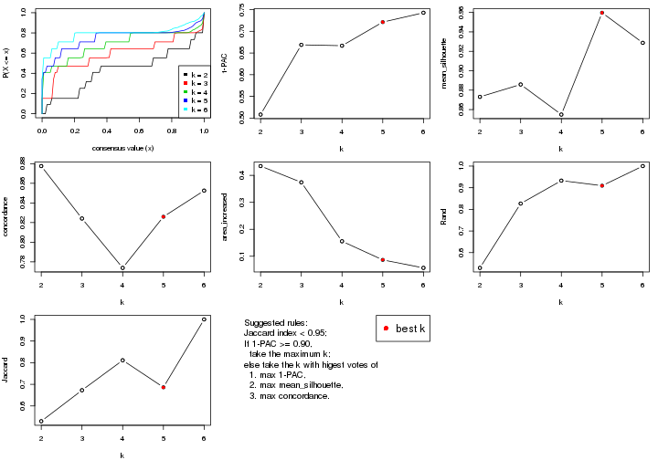

The numeric values for all these statistics can be obtained by `get_stats()`.

```r
get_stats(res)
```

```
#>   k 1-PAC mean_silhouette concordance area_increased  Rand Jaccard
#> 2 2 0.508           0.873       0.878         0.4345 0.529   0.529
#> 3 3 0.669           0.886       0.824         0.3742 0.827   0.673
#> 4 4 0.667           0.855       0.774         0.1554 0.933   0.811
#> 5 5 0.721           0.960       0.826         0.0864 0.909   0.686
#> 6 6 0.743           0.929       0.853         0.0567 1.000   1.000
```

`suggest_best_k()` suggests the best $k$ based on these statistics. The rules are as follows:

- All $k$ with Jaccard index larger than 0.95 are removed because increasing
  $k$ does not provide enough extra information. If all $k$ are removed, it is
  marked as no subgroup is detected.
- For all $k$ with 1-PAC score larger than 0.9, the maximal $k$ is taken as
  the best $k$, and other $k$ are marked as optional $k$.
- If it does not fit the second rule. The $k$ with the maximal vote of the
  highest 1-PAC score, highest mean silhouette, and highest concordance is
  taken as the best $k$.

```r
suggest_best_k(res)
```

```
#> [1] 5
```


Following shows the table of the partitions (You need to click the **show/hide
code output** link to see it). The membership matrix (columns with name `p*`)
is inferred by
[`clue::cl_consensus()`](https://www.rdocumentation.org/link/cl_consensus?package=clue)
function with the `SE` method. Basically the value in the membership matrix
represents the probability to belong to a certain group. The finall class
label for an item is determined with the group with highest probability it
belongs to.

In `get_classes()` function, the entropy is calculated from the membership
matrix and the silhouette score is calculated from the consensus matrix.


<script>
$( function() {
	$( '#tabs-SD-kmeans-get-classes' ).tabs();
} );
</script>
<div id='tabs-SD-kmeans-get-classes'>
<ul>
<li><a href='#tab-SD-kmeans-get-classes-1'>k = 2</a></li>
<li><a href='#tab-SD-kmeans-get-classes-2'>k = 3</a></li>
<li><a href='#tab-SD-kmeans-get-classes-3'>k = 4</a></li>
<li><a href='#tab-SD-kmeans-get-classes-4'>k = 5</a></li>
<li><a href='#tab-SD-kmeans-get-classes-5'>k = 6</a></li>
</ul>

<div id='tab-SD-kmeans-get-classes-1'>
<p><a id='tab-SD-kmeans-get-classes-1-a' style='color:#0366d6' href='#'>show/hide code output</a></p>
<pre><code class="r">cbind(get_classes(res, k = 2), get_membership(res, k = 2))
</code></pre>

<pre><code>#&gt;           class entropy silhouette    p1    p2
#&gt; GSM247795     2   0.000      0.858 0.000 1.000
#&gt; GSM247854     2   0.000      0.858 0.000 1.000
#&gt; GSM247758     2   0.430      0.813 0.088 0.912
#&gt; GSM247742     1   0.839      0.957 0.732 0.268
#&gt; GSM247755     2   0.781      0.780 0.232 0.768
#&gt; GSM247841     1   0.767      0.972 0.776 0.224
#&gt; GSM247703     2   0.000      0.858 0.000 1.000
#&gt; GSM247739     2   0.430      0.813 0.088 0.912
#&gt; GSM247715     1   0.839      0.957 0.732 0.268
#&gt; GSM247829     2   0.781      0.780 0.232 0.768
#&gt; GSM247842     1   0.767      0.972 0.776 0.224
#&gt; GSM247805     2   0.000      0.858 0.000 1.000
#&gt; GSM247786     2   0.430      0.813 0.088 0.912
#&gt; GSM247812     2   0.781      0.780 0.232 0.768
#&gt; GSM247776     1   0.767      0.972 0.776 0.224
#&gt; GSM247850     1   0.767      0.972 0.776 0.224
#&gt; GSM247717     2   0.000      0.858 0.000 1.000
#&gt; GSM247784     2   0.430      0.813 0.088 0.912
#&gt; GSM247834     1   0.839      0.957 0.732 0.268
#&gt; GSM247783     2   0.781      0.780 0.232 0.768
#&gt; GSM247846     1   0.767      0.972 0.776 0.224
#&gt; GSM247822     2   0.000      0.858 0.000 1.000
#&gt; GSM247710     2   0.430      0.813 0.088 0.912
#&gt; GSM247713     1   0.839      0.957 0.732 0.268
#&gt; GSM247840     2   0.781      0.780 0.232 0.768
#&gt; GSM247733     1   0.767      0.972 0.776 0.224
#&gt; GSM247852     1   0.767      0.972 0.776 0.224
#&gt; GSM247790     2   0.000      0.858 0.000 1.000
#&gt; GSM247730     2   0.430      0.813 0.088 0.912
#&gt; GSM247824     2   0.781      0.780 0.232 0.768
#&gt; GSM247770     1   0.767      0.972 0.776 0.224
#&gt; GSM247711     2   0.000      0.858 0.000 1.000
#&gt; GSM247782     2   0.430      0.813 0.088 0.912
#&gt; GSM247836     1   0.839      0.957 0.732 0.268
#&gt; GSM247785     2   0.781      0.780 0.232 0.768
#&gt; GSM247847     1   0.767      0.972 0.776 0.224
#&gt; GSM247750     2   0.000      0.858 0.000 1.000
#&gt; GSM247788     2   0.430      0.813 0.088 0.912
#&gt; GSM247849     1   0.839      0.957 0.732 0.268
#&gt; GSM247772     2   0.781      0.780 0.232 0.768
#&gt; GSM247760     1   0.767      0.972 0.776 0.224
#&gt; GSM247764     2   0.000      0.858 0.000 1.000
#&gt; GSM247851     2   0.000      0.858 0.000 1.000
#&gt; GSM247714     2   0.430      0.813 0.088 0.912
#&gt; GSM247828     1   0.839      0.957 0.732 0.268
#&gt; GSM247704     2   0.781      0.780 0.232 0.768
#&gt; GSM247818     1   0.767      0.972 0.776 0.224
#&gt; GSM247823     2   0.000      0.858 0.000 1.000
#&gt; GSM247706     2   0.430      0.813 0.088 0.912
#&gt; GSM247835     2   0.781      0.780 0.232 0.768
#&gt; GSM247734     1   0.767      0.972 0.776 0.224
#&gt; GSM247819     2   0.000      0.858 0.000 1.000
#&gt; GSM247809     2   0.430      0.813 0.088 0.912
#&gt; GSM247830     2   0.781      0.780 0.232 0.768
#&gt; GSM247833     1   0.767      0.972 0.776 0.224
#&gt; GSM247738     2   0.000      0.858 0.000 1.000
#&gt; GSM247716     2   0.430      0.813 0.088 0.912
#&gt; GSM247747     2   0.781      0.780 0.232 0.768
#&gt; GSM247722     1   0.767      0.972 0.776 0.224
#&gt; GSM247816     2   0.000      0.858 0.000 1.000
#&gt; GSM247839     2   0.430      0.813 0.088 0.912
#&gt; GSM247821     1   0.839      0.957 0.732 0.268
#&gt; GSM247798     2   0.781      0.780 0.232 0.768
#&gt; GSM247838     1   0.767      0.972 0.776 0.224
#&gt; GSM247721     2   0.000      0.858 0.000 1.000
#&gt; GSM247781     2   0.430      0.813 0.088 0.912
#&gt; GSM247762     1   0.839      0.957 0.732 0.268
#&gt; GSM247825     2   0.781      0.780 0.232 0.768
#&gt; GSM247777     1   0.767      0.972 0.776 0.224
#&gt; GSM247761     2   0.000      0.858 0.000 1.000
#&gt; GSM247720     2   0.430      0.813 0.088 0.912
#&gt; GSM247814     2   0.781      0.780 0.232 0.768
#&gt; GSM247732     1   0.767      0.972 0.776 0.224
#&gt; GSM247708     2   0.000      0.858 0.000 1.000
#&gt; GSM247740     2   0.430      0.813 0.088 0.912
#&gt; GSM247749     1   0.839      0.957 0.732 0.268
#&gt; GSM247767     2   0.781      0.780 0.232 0.768
#&gt; GSM247748     1   0.767      0.972 0.776 0.224
#&gt; GSM247705     2   0.000      0.858 0.000 1.000
#&gt; GSM247746     2   0.430      0.813 0.088 0.912
#&gt; GSM247752     1   0.839      0.957 0.732 0.268
#&gt; GSM247769     2   0.781      0.780 0.232 0.768
#&gt; GSM247753     1   0.767      0.972 0.776 0.224
#&gt; GSM247723     2   0.000      0.858 0.000 1.000
#&gt; GSM247779     2   0.430      0.813 0.088 0.912
#&gt; GSM247756     1   0.839      0.957 0.732 0.268
#&gt; GSM247826     2   0.781      0.780 0.232 0.768
#&gt; GSM247775     1   0.767      0.972 0.776 0.224
#&gt; GSM247741     2   0.000      0.858 0.000 1.000
#&gt; GSM247799     2   0.430      0.813 0.088 0.912
#&gt; GSM247778     1   0.839      0.957 0.732 0.268
#&gt; GSM247806     2   0.781      0.780 0.232 0.768
#&gt; GSM247815     1   0.767      0.972 0.776 0.224
#&gt; GSM247735     2   0.000      0.858 0.000 1.000
#&gt; GSM247831     2   0.430      0.813 0.088 0.912
#&gt; GSM247845     1   0.839      0.957 0.732 0.268
#&gt; GSM247791     2   0.781      0.780 0.232 0.768
#&gt; GSM247780     1   0.767      0.972 0.776 0.224
#&gt; GSM247853     1   0.767      0.972 0.776 0.224
#&gt; GSM247800     2   0.000      0.858 0.000 1.000
#&gt; GSM247729     2   0.430      0.813 0.088 0.912
#&gt; GSM247810     1   0.839      0.957 0.732 0.268
#&gt; GSM247844     2   0.781      0.780 0.232 0.768
#&gt; GSM247793     1   0.767      0.972 0.776 0.224
#&gt; GSM247759     2   0.000      0.858 0.000 1.000
#&gt; GSM247724     2   0.430      0.813 0.088 0.912
#&gt; GSM247817     2   0.781      0.780 0.232 0.768
#&gt; GSM247727     1   0.767      0.972 0.776 0.224
#&gt; GSM247796     2   0.000      0.858 0.000 1.000
#&gt; GSM247725     2   0.430      0.813 0.088 0.912
#&gt; GSM247801     1   0.839      0.957 0.732 0.268
#&gt; GSM247731     2   0.781      0.780 0.232 0.768
#&gt; GSM247765     1   0.767      0.972 0.776 0.224
#&gt; GSM247792     2   0.000      0.858 0.000 1.000
#&gt; GSM247726     2   0.430      0.813 0.088 0.912
#&gt; GSM247803     1   0.839      0.957 0.732 0.268
#&gt; GSM247728     2   0.781      0.780 0.232 0.768
#&gt; GSM247768     1   0.767      0.972 0.776 0.224
#&gt; GSM247745     2   0.000      0.858 0.000 1.000
#&gt; GSM247855     2   0.000      0.858 0.000 1.000
#&gt; GSM247804     2   0.430      0.813 0.088 0.912
#&gt; GSM247774     1   0.839      0.957 0.732 0.268
#&gt; GSM247807     2   0.781      0.780 0.232 0.768
#&gt; GSM247813     1   0.767      0.972 0.776 0.224
#&gt; GSM247736     2   0.000      0.858 0.000 1.000
#&gt; GSM247712     2   0.430      0.813 0.088 0.912
#&gt; GSM247797     1   0.839      0.957 0.732 0.268
#&gt; GSM247743     2   0.781      0.780 0.232 0.768
#&gt; GSM247719     1   0.767      0.972 0.776 0.224
#&gt; GSM247707     2   0.000      0.858 0.000 1.000
#&gt; GSM247737     2   0.430      0.813 0.088 0.912
#&gt; GSM247827     2   0.781      0.780 0.232 0.768
#&gt; GSM247848     1   0.767      0.972 0.776 0.224
#&gt; GSM247794     2   0.000      0.858 0.000 1.000
#&gt; GSM247757     2   0.430      0.813 0.088 0.912
#&gt; GSM247744     1   0.839      0.957 0.732 0.268
#&gt; GSM247751     2   0.781      0.780 0.232 0.768
#&gt; GSM247837     1   0.767      0.972 0.776 0.224
#&gt; GSM247754     2   0.000      0.858 0.000 1.000
#&gt; GSM247789     2   0.430      0.813 0.088 0.912
#&gt; GSM247802     1   0.839      0.957 0.732 0.268
#&gt; GSM247771     2   0.781      0.780 0.232 0.768
#&gt; GSM247763     1   0.767      0.972 0.776 0.224
#&gt; GSM247808     2   0.000      0.858 0.000 1.000
#&gt; GSM247787     2   0.430      0.813 0.088 0.912
#&gt; GSM247843     1   0.839      0.957 0.732 0.268
#&gt; GSM247811     2   0.781      0.780 0.232 0.768
#&gt; GSM247773     1   0.767      0.972 0.776 0.224
#&gt; GSM247766     2   0.000      0.858 0.000 1.000
#&gt; GSM247718     2   0.430      0.813 0.088 0.912
#&gt; GSM247832     1   0.839      0.957 0.732 0.268
#&gt; GSM247709     2   0.781      0.780 0.232 0.768
#&gt; GSM247820     1   0.767      0.972 0.776 0.224
</code></pre>

<script>
$('#tab-SD-kmeans-get-classes-1-a').parent().next().next().hide();
$('#tab-SD-kmeans-get-classes-1-a').click(function(){
  $('#tab-SD-kmeans-get-classes-1-a').parent().next().next().toggle();
  return(false);
});
</script>
</div>

<div id='tab-SD-kmeans-get-classes-2'>
<p><a id='tab-SD-kmeans-get-classes-2-a' style='color:#0366d6' href='#'>show/hide code output</a></p>
<pre><code class="r">cbind(get_classes(res, k = 3), get_membership(res, k = 3))
</code></pre>

<pre><code>#&gt;           class entropy silhouette    p1    p2    p3
#&gt; GSM247795     2  0.6192      0.852 0.000 0.580 0.420
#&gt; GSM247854     2  0.6192      0.852 0.000 0.580 0.420
#&gt; GSM247758     2  0.5431      0.854 0.000 0.716 0.284
#&gt; GSM247742     1  0.5926      0.837 0.644 0.356 0.000
#&gt; GSM247755     3  0.0592      0.983 0.012 0.000 0.988
#&gt; GSM247841     1  0.2261      0.894 0.932 0.068 0.000
#&gt; GSM247703     2  0.6192      0.852 0.000 0.580 0.420
#&gt; GSM247739     2  0.5431      0.854 0.000 0.716 0.284
#&gt; GSM247715     1  0.5926      0.837 0.644 0.356 0.000
#&gt; GSM247829     3  0.1163      0.982 0.028 0.000 0.972
#&gt; GSM247842     1  0.2261      0.894 0.932 0.068 0.000
#&gt; GSM247805     2  0.6192      0.852 0.000 0.580 0.420
#&gt; GSM247786     2  0.5431      0.854 0.000 0.716 0.284
#&gt; GSM247812     3  0.1411      0.978 0.036 0.000 0.964
#&gt; GSM247776     1  0.2261      0.894 0.932 0.068 0.000
#&gt; GSM247850     1  0.2261      0.894 0.932 0.068 0.000
#&gt; GSM247717     2  0.6192      0.852 0.000 0.580 0.420
#&gt; GSM247784     2  0.5431      0.854 0.000 0.716 0.284
#&gt; GSM247834     1  0.5926      0.837 0.644 0.356 0.000
#&gt; GSM247783     3  0.0424      0.982 0.008 0.000 0.992
#&gt; GSM247846     1  0.2261      0.894 0.932 0.068 0.000
#&gt; GSM247822     2  0.6192      0.852 0.000 0.580 0.420
#&gt; GSM247710     2  0.5431      0.854 0.000 0.716 0.284
#&gt; GSM247713     1  0.5926      0.837 0.644 0.356 0.000
#&gt; GSM247840     3  0.1529      0.977 0.040 0.000 0.960
#&gt; GSM247733     1  0.2261      0.894 0.932 0.068 0.000
#&gt; GSM247852     1  0.2261      0.894 0.932 0.068 0.000
#&gt; GSM247790     2  0.6140      0.853 0.000 0.596 0.404
#&gt; GSM247730     2  0.5431      0.854 0.000 0.716 0.284
#&gt; GSM247824     3  0.0747      0.983 0.016 0.000 0.984
#&gt; GSM247770     1  0.2261      0.894 0.932 0.068 0.000
#&gt; GSM247711     2  0.6192      0.852 0.000 0.580 0.420
#&gt; GSM247782     2  0.5431      0.854 0.000 0.716 0.284
#&gt; GSM247836     1  0.5926      0.837 0.644 0.356 0.000
#&gt; GSM247785     3  0.0424      0.984 0.008 0.000 0.992
#&gt; GSM247847     1  0.2261      0.894 0.932 0.068 0.000
#&gt; GSM247750     2  0.6192      0.852 0.000 0.580 0.420
#&gt; GSM247788     2  0.5431      0.854 0.000 0.716 0.284
#&gt; GSM247849     1  0.5926      0.837 0.644 0.356 0.000
#&gt; GSM247772     3  0.0747      0.983 0.016 0.000 0.984
#&gt; GSM247760     1  0.2261      0.894 0.932 0.068 0.000
#&gt; GSM247764     2  0.6192      0.852 0.000 0.580 0.420
#&gt; GSM247851     2  0.6192      0.852 0.000 0.580 0.420
#&gt; GSM247714     2  0.5431      0.854 0.000 0.716 0.284
#&gt; GSM247828     1  0.5926      0.837 0.644 0.356 0.000
#&gt; GSM247704     3  0.1643      0.978 0.044 0.000 0.956
#&gt; GSM247818     1  0.2261      0.894 0.932 0.068 0.000
#&gt; GSM247823     2  0.6192      0.852 0.000 0.580 0.420
#&gt; GSM247706     2  0.5431      0.854 0.000 0.716 0.284
#&gt; GSM247835     3  0.0424      0.982 0.008 0.000 0.992
#&gt; GSM247734     1  0.2261      0.894 0.932 0.068 0.000
#&gt; GSM247819     2  0.6192      0.852 0.000 0.580 0.420
#&gt; GSM247809     2  0.5431      0.854 0.000 0.716 0.284
#&gt; GSM247830     3  0.0892      0.981 0.020 0.000 0.980
#&gt; GSM247833     1  0.2261      0.894 0.932 0.068 0.000
#&gt; GSM247738     2  0.6192      0.852 0.000 0.580 0.420
#&gt; GSM247716     2  0.5431      0.854 0.000 0.716 0.284
#&gt; GSM247747     3  0.0892      0.983 0.020 0.000 0.980
#&gt; GSM247722     1  0.2261      0.894 0.932 0.068 0.000
#&gt; GSM247816     2  0.6192      0.852 0.000 0.580 0.420
#&gt; GSM247839     2  0.5431      0.854 0.000 0.716 0.284
#&gt; GSM247821     1  0.5926      0.837 0.644 0.356 0.000
#&gt; GSM247798     3  0.0892      0.983 0.020 0.000 0.980
#&gt; GSM247838     1  0.2261      0.894 0.932 0.068 0.000
#&gt; GSM247721     2  0.6192      0.852 0.000 0.580 0.420
#&gt; GSM247781     2  0.5431      0.854 0.000 0.716 0.284
#&gt; GSM247762     1  0.5926      0.837 0.644 0.356 0.000
#&gt; GSM247825     3  0.1411      0.979 0.036 0.000 0.964
#&gt; GSM247777     1  0.2261      0.894 0.932 0.068 0.000
#&gt; GSM247761     2  0.6192      0.852 0.000 0.580 0.420
#&gt; GSM247720     2  0.5431      0.854 0.000 0.716 0.284
#&gt; GSM247814     3  0.0892      0.983 0.020 0.000 0.980
#&gt; GSM247732     1  0.2261      0.894 0.932 0.068 0.000
#&gt; GSM247708     2  0.6192      0.852 0.000 0.580 0.420
#&gt; GSM247740     2  0.5431      0.854 0.000 0.716 0.284
#&gt; GSM247749     1  0.5926      0.837 0.644 0.356 0.000
#&gt; GSM247767     3  0.0747      0.983 0.016 0.000 0.984
#&gt; GSM247748     1  0.2261      0.894 0.932 0.068 0.000
#&gt; GSM247705     2  0.6192      0.852 0.000 0.580 0.420
#&gt; GSM247746     2  0.5431      0.854 0.000 0.716 0.284
#&gt; GSM247752     1  0.5926      0.837 0.644 0.356 0.000
#&gt; GSM247769     3  0.0747      0.983 0.016 0.000 0.984
#&gt; GSM247753     1  0.2261      0.894 0.932 0.068 0.000
#&gt; GSM247723     2  0.6192      0.852 0.000 0.580 0.420
#&gt; GSM247779     2  0.5431      0.854 0.000 0.716 0.284
#&gt; GSM247756     1  0.5926      0.837 0.644 0.356 0.000
#&gt; GSM247826     3  0.0592      0.983 0.012 0.000 0.988
#&gt; GSM247775     1  0.2261      0.894 0.932 0.068 0.000
#&gt; GSM247741     2  0.6192      0.852 0.000 0.580 0.420
#&gt; GSM247799     2  0.5431      0.854 0.000 0.716 0.284
#&gt; GSM247778     1  0.5926      0.837 0.644 0.356 0.000
#&gt; GSM247806     3  0.0424      0.982 0.008 0.000 0.992
#&gt; GSM247815     1  0.2261      0.894 0.932 0.068 0.000
#&gt; GSM247735     2  0.6192      0.852 0.000 0.580 0.420
#&gt; GSM247831     2  0.5431      0.854 0.000 0.716 0.284
#&gt; GSM247845     1  0.5926      0.837 0.644 0.356 0.000
#&gt; GSM247791     3  0.1163      0.980 0.028 0.000 0.972
#&gt; GSM247780     1  0.2261      0.894 0.932 0.068 0.000
#&gt; GSM247853     1  0.2261      0.894 0.932 0.068 0.000
#&gt; GSM247800     2  0.6192      0.852 0.000 0.580 0.420
#&gt; GSM247729     2  0.5431      0.854 0.000 0.716 0.284
#&gt; GSM247810     1  0.5926      0.837 0.644 0.356 0.000
#&gt; GSM247844     3  0.0892      0.983 0.020 0.000 0.980
#&gt; GSM247793     1  0.2261      0.894 0.932 0.068 0.000
#&gt; GSM247759     2  0.6192      0.852 0.000 0.580 0.420
#&gt; GSM247724     2  0.5431      0.854 0.000 0.716 0.284
#&gt; GSM247817     3  0.1163      0.983 0.028 0.000 0.972
#&gt; GSM247727     1  0.2261      0.894 0.932 0.068 0.000
#&gt; GSM247796     2  0.6192      0.852 0.000 0.580 0.420
#&gt; GSM247725     2  0.5431      0.854 0.000 0.716 0.284
#&gt; GSM247801     1  0.5926      0.837 0.644 0.356 0.000
#&gt; GSM247731     3  0.0424      0.982 0.008 0.000 0.992
#&gt; GSM247765     1  0.2261      0.894 0.932 0.068 0.000
#&gt; GSM247792     2  0.6192      0.852 0.000 0.580 0.420
#&gt; GSM247726     2  0.5431      0.854 0.000 0.716 0.284
#&gt; GSM247803     1  0.5926      0.837 0.644 0.356 0.000
#&gt; GSM247728     3  0.1289      0.980 0.032 0.000 0.968
#&gt; GSM247768     1  0.2261      0.894 0.932 0.068 0.000
#&gt; GSM247745     2  0.6192      0.852 0.000 0.580 0.420
#&gt; GSM247855     2  0.6192      0.852 0.000 0.580 0.420
#&gt; GSM247804     2  0.5431      0.854 0.000 0.716 0.284
#&gt; GSM247774     1  0.5926      0.837 0.644 0.356 0.000
#&gt; GSM247807     3  0.1289      0.980 0.032 0.000 0.968
#&gt; GSM247813     1  0.2261      0.894 0.932 0.068 0.000
#&gt; GSM247736     2  0.6192      0.852 0.000 0.580 0.420
#&gt; GSM247712     2  0.5431      0.854 0.000 0.716 0.284
#&gt; GSM247797     1  0.5926      0.837 0.644 0.356 0.000
#&gt; GSM247743     3  0.0592      0.982 0.012 0.000 0.988
#&gt; GSM247719     1  0.2261      0.894 0.932 0.068 0.000
#&gt; GSM247707     2  0.6192      0.852 0.000 0.580 0.420
#&gt; GSM247737     2  0.5431      0.854 0.000 0.716 0.284
#&gt; GSM247827     3  0.1289      0.979 0.032 0.000 0.968
#&gt; GSM247848     1  0.2261      0.894 0.932 0.068 0.000
#&gt; GSM247794     2  0.6192      0.852 0.000 0.580 0.420
#&gt; GSM247757     2  0.5431      0.854 0.000 0.716 0.284
#&gt; GSM247744     1  0.5926      0.837 0.644 0.356 0.000
#&gt; GSM247751     3  0.1289      0.980 0.032 0.000 0.968
#&gt; GSM247837     1  0.2261      0.894 0.932 0.068 0.000
#&gt; GSM247754     2  0.6192      0.852 0.000 0.580 0.420
#&gt; GSM247789     2  0.5431      0.854 0.000 0.716 0.284
#&gt; GSM247802     1  0.5926      0.837 0.644 0.356 0.000
#&gt; GSM247771     3  0.0424      0.982 0.008 0.000 0.992
#&gt; GSM247763     1  0.2261      0.894 0.932 0.068 0.000
#&gt; GSM247808     2  0.6192      0.852 0.000 0.580 0.420
#&gt; GSM247787     2  0.5431      0.854 0.000 0.716 0.284
#&gt; GSM247843     1  0.5926      0.837 0.644 0.356 0.000
#&gt; GSM247811     3  0.1289      0.980 0.032 0.000 0.968
#&gt; GSM247773     1  0.2261      0.894 0.932 0.068 0.000
#&gt; GSM247766     2  0.6192      0.852 0.000 0.580 0.420
#&gt; GSM247718     2  0.5431      0.854 0.000 0.716 0.284
#&gt; GSM247832     1  0.5926      0.837 0.644 0.356 0.000
#&gt; GSM247709     3  0.1753      0.976 0.048 0.000 0.952
#&gt; GSM247820     1  0.2261      0.894 0.932 0.068 0.000
</code></pre>

<script>
$('#tab-SD-kmeans-get-classes-2-a').parent().next().next().hide();
$('#tab-SD-kmeans-get-classes-2-a').click(function(){
  $('#tab-SD-kmeans-get-classes-2-a').parent().next().next().toggle();
  return(false);
});
</script>
</div>

<div id='tab-SD-kmeans-get-classes-3'>
<p><a id='tab-SD-kmeans-get-classes-3-a' style='color:#0366d6' href='#'>show/hide code output</a></p>
<pre><code class="r">cbind(get_classes(res, k = 4), get_membership(res, k = 4))
</code></pre>

<pre><code>#&gt;           class entropy silhouette    p1    p2    p3    p4
#&gt; GSM247795     2  0.6824      0.705 0.000 0.556 0.120 0.324
#&gt; GSM247854     2  0.6824      0.705 0.000 0.556 0.120 0.324
#&gt; GSM247758     2  0.0779      0.702 0.000 0.980 0.016 0.004
#&gt; GSM247742     4  0.6233      0.987 0.388 0.060 0.000 0.552
#&gt; GSM247755     3  0.3289      0.974 0.004 0.140 0.852 0.004
#&gt; GSM247841     1  0.1732      0.955 0.948 0.008 0.040 0.004
#&gt; GSM247703     2  0.6824      0.705 0.000 0.556 0.120 0.324
#&gt; GSM247739     2  0.0592      0.702 0.000 0.984 0.016 0.000
#&gt; GSM247715     4  0.6233      0.987 0.388 0.060 0.000 0.552
#&gt; GSM247829     3  0.3711      0.973 0.000 0.140 0.836 0.024
#&gt; GSM247842     1  0.1732      0.955 0.948 0.008 0.040 0.004
#&gt; GSM247805     2  0.6824      0.705 0.000 0.556 0.120 0.324
#&gt; GSM247786     2  0.0592      0.702 0.000 0.984 0.016 0.000
#&gt; GSM247812     3  0.5290      0.952 0.008 0.140 0.764 0.088
#&gt; GSM247776     1  0.1516      0.955 0.960 0.008 0.016 0.016
#&gt; GSM247850     1  0.1516      0.955 0.960 0.008 0.016 0.016
#&gt; GSM247717     2  0.6824      0.705 0.000 0.556 0.120 0.324
#&gt; GSM247784     2  0.0779      0.702 0.000 0.980 0.016 0.004
#&gt; GSM247834     4  0.6651      0.985 0.388 0.060 0.012 0.540
#&gt; GSM247783     3  0.3289      0.974 0.004 0.140 0.852 0.004
#&gt; GSM247846     1  0.1732      0.955 0.948 0.008 0.040 0.004
#&gt; GSM247822     2  0.6824      0.705 0.000 0.556 0.120 0.324
#&gt; GSM247710     2  0.0592      0.702 0.000 0.984 0.016 0.000
#&gt; GSM247713     4  0.7115      0.976 0.388 0.060 0.032 0.520
#&gt; GSM247840     3  0.5227      0.952 0.008 0.140 0.768 0.084
#&gt; GSM247733     1  0.0336      0.960 0.992 0.008 0.000 0.000
#&gt; GSM247852     1  0.0336      0.960 0.992 0.008 0.000 0.000
#&gt; GSM247790     2  0.6536      0.705 0.000 0.580 0.096 0.324
#&gt; GSM247730     2  0.0592      0.702 0.000 0.984 0.016 0.000
#&gt; GSM247824     3  0.3377      0.973 0.000 0.140 0.848 0.012
#&gt; GSM247770     1  0.1854      0.957 0.948 0.008 0.024 0.020
#&gt; GSM247711     2  0.6824      0.705 0.000 0.556 0.120 0.324
#&gt; GSM247782     2  0.0779      0.702 0.000 0.980 0.016 0.004
#&gt; GSM247836     4  0.6233      0.987 0.388 0.060 0.000 0.552
#&gt; GSM247785     3  0.3105      0.974 0.000 0.140 0.856 0.004
#&gt; GSM247847     1  0.2131      0.954 0.936 0.008 0.040 0.016
#&gt; GSM247750     2  0.6824      0.705 0.000 0.556 0.120 0.324
#&gt; GSM247788     2  0.0592      0.702 0.000 0.984 0.016 0.000
#&gt; GSM247849     4  0.6233      0.987 0.388 0.060 0.000 0.552
#&gt; GSM247772     3  0.2921      0.973 0.000 0.140 0.860 0.000
#&gt; GSM247760     1  0.1394      0.957 0.964 0.008 0.012 0.016
#&gt; GSM247764     2  0.6824      0.705 0.000 0.556 0.120 0.324
#&gt; GSM247851     2  0.6824      0.705 0.000 0.556 0.120 0.324
#&gt; GSM247714     2  0.0592      0.702 0.000 0.984 0.016 0.000
#&gt; GSM247828     4  0.6233      0.987 0.388 0.060 0.000 0.552
#&gt; GSM247704     3  0.5087      0.956 0.004 0.140 0.772 0.084
#&gt; GSM247818     1  0.0672      0.959 0.984 0.008 0.008 0.000
#&gt; GSM247823     2  0.6824      0.705 0.000 0.556 0.120 0.324
#&gt; GSM247706     2  0.0592      0.702 0.000 0.984 0.016 0.000
#&gt; GSM247835     3  0.3105      0.973 0.000 0.140 0.856 0.004
#&gt; GSM247734     1  0.1516      0.955 0.960 0.008 0.016 0.016
#&gt; GSM247819     2  0.6824      0.705 0.000 0.556 0.120 0.324
#&gt; GSM247809     2  0.0779      0.702 0.000 0.980 0.016 0.004
#&gt; GSM247830     3  0.3377      0.973 0.000 0.140 0.848 0.012
#&gt; GSM247833     1  0.1822      0.954 0.944 0.008 0.044 0.004
#&gt; GSM247738     2  0.6685      0.705 0.000 0.568 0.108 0.324
#&gt; GSM247716     2  0.0779      0.702 0.000 0.980 0.016 0.004
#&gt; GSM247747     3  0.3560      0.974 0.004 0.140 0.844 0.012
#&gt; GSM247722     1  0.2587      0.949 0.916 0.008 0.056 0.020
#&gt; GSM247816     2  0.6824      0.705 0.000 0.556 0.120 0.324
#&gt; GSM247839     2  0.0779      0.702 0.000 0.980 0.016 0.004
#&gt; GSM247821     4  0.6233      0.987 0.388 0.060 0.000 0.552
#&gt; GSM247798     3  0.3606      0.973 0.000 0.140 0.840 0.020
#&gt; GSM247838     1  0.2587      0.949 0.916 0.008 0.056 0.020
#&gt; GSM247721     2  0.6824      0.705 0.000 0.556 0.120 0.324
#&gt; GSM247781     2  0.0779      0.702 0.000 0.980 0.016 0.004
#&gt; GSM247762     4  0.7115      0.976 0.388 0.060 0.032 0.520
#&gt; GSM247825     3  0.4888      0.960 0.008 0.140 0.788 0.064
#&gt; GSM247777     1  0.1909      0.953 0.940 0.008 0.048 0.004
#&gt; GSM247761     2  0.6824      0.705 0.000 0.556 0.120 0.324
#&gt; GSM247720     2  0.0592      0.702 0.000 0.984 0.016 0.000
#&gt; GSM247814     3  0.3495      0.973 0.000 0.140 0.844 0.016
#&gt; GSM247732     1  0.0804      0.959 0.980 0.008 0.012 0.000
#&gt; GSM247708     2  0.6824      0.705 0.000 0.556 0.120 0.324
#&gt; GSM247740     2  0.0592      0.702 0.000 0.984 0.016 0.000
#&gt; GSM247749     4  0.6651      0.985 0.388 0.060 0.012 0.540
#&gt; GSM247767     3  0.3606      0.973 0.000 0.140 0.840 0.020
#&gt; GSM247748     1  0.0672      0.959 0.984 0.008 0.008 0.000
#&gt; GSM247705     2  0.6824      0.705 0.000 0.556 0.120 0.324
#&gt; GSM247746     2  0.0779      0.702 0.000 0.980 0.016 0.004
#&gt; GSM247752     4  0.7115      0.976 0.388 0.060 0.032 0.520
#&gt; GSM247769     3  0.3377      0.973 0.000 0.140 0.848 0.012
#&gt; GSM247753     1  0.1994      0.937 0.936 0.008 0.052 0.004
#&gt; GSM247723     2  0.6824      0.705 0.000 0.556 0.120 0.324
#&gt; GSM247779     2  0.0779      0.702 0.000 0.980 0.016 0.004
#&gt; GSM247756     4  0.6233      0.987 0.388 0.060 0.000 0.552
#&gt; GSM247826     3  0.3289      0.974 0.004 0.140 0.852 0.004
#&gt; GSM247775     1  0.1822      0.954 0.944 0.008 0.044 0.004
#&gt; GSM247741     2  0.6824      0.705 0.000 0.556 0.120 0.324
#&gt; GSM247799     2  0.0779      0.702 0.000 0.980 0.016 0.004
#&gt; GSM247778     4  0.6233      0.987 0.388 0.060 0.000 0.552
#&gt; GSM247806     3  0.3289      0.974 0.004 0.140 0.852 0.004
#&gt; GSM247815     1  0.2421      0.951 0.924 0.008 0.048 0.020
#&gt; GSM247735     2  0.6824      0.705 0.000 0.556 0.120 0.324
#&gt; GSM247831     2  0.0592      0.702 0.000 0.984 0.016 0.000
#&gt; GSM247845     4  0.6233      0.987 0.388 0.060 0.000 0.552
#&gt; GSM247791     3  0.5163      0.955 0.008 0.140 0.772 0.080
#&gt; GSM247780     1  0.1854      0.957 0.948 0.008 0.024 0.020
#&gt; GSM247853     1  0.1854      0.957 0.948 0.008 0.024 0.020
#&gt; GSM247800     2  0.6824      0.705 0.000 0.556 0.120 0.324
#&gt; GSM247729     2  0.0592      0.702 0.000 0.984 0.016 0.000
#&gt; GSM247810     4  0.6651      0.985 0.388 0.060 0.012 0.540
#&gt; GSM247844     3  0.3711      0.973 0.000 0.140 0.836 0.024
#&gt; GSM247793     1  0.0336      0.960 0.992 0.008 0.000 0.000
#&gt; GSM247759     2  0.6824      0.705 0.000 0.556 0.120 0.324
#&gt; GSM247724     2  0.0592      0.702 0.000 0.984 0.016 0.000
#&gt; GSM247817     3  0.3377      0.973 0.000 0.140 0.848 0.012
#&gt; GSM247727     1  0.0804      0.959 0.980 0.008 0.012 0.000
#&gt; GSM247796     2  0.6824      0.705 0.000 0.556 0.120 0.324
#&gt; GSM247725     2  0.0592      0.702 0.000 0.984 0.016 0.000
#&gt; GSM247801     4  0.7341      0.969 0.388 0.060 0.044 0.508
#&gt; GSM247731     3  0.3105      0.973 0.000 0.140 0.856 0.004
#&gt; GSM247765     1  0.1516      0.955 0.960 0.008 0.016 0.016
#&gt; GSM247792     2  0.6824      0.705 0.000 0.556 0.120 0.324
#&gt; GSM247726     2  0.0779      0.702 0.000 0.980 0.016 0.004
#&gt; GSM247803     4  0.7115      0.976 0.388 0.060 0.032 0.520
#&gt; GSM247728     3  0.4673      0.961 0.004 0.140 0.796 0.060
#&gt; GSM247768     1  0.1994      0.937 0.936 0.008 0.052 0.004
#&gt; GSM247745     2  0.6824      0.705 0.000 0.556 0.120 0.324
#&gt; GSM247855     2  0.6824      0.705 0.000 0.556 0.120 0.324
#&gt; GSM247804     2  0.0779      0.702 0.000 0.980 0.016 0.004
#&gt; GSM247774     4  0.6651      0.982 0.388 0.060 0.012 0.540
#&gt; GSM247807     3  0.5163      0.955 0.008 0.140 0.772 0.080
#&gt; GSM247813     1  0.2587      0.949 0.916 0.008 0.056 0.020
#&gt; GSM247736     2  0.6824      0.705 0.000 0.556 0.120 0.324
#&gt; GSM247712     2  0.0592      0.702 0.000 0.984 0.016 0.000
#&gt; GSM247797     4  0.7115      0.976 0.388 0.060 0.032 0.520
#&gt; GSM247743     3  0.3249      0.973 0.000 0.140 0.852 0.008
#&gt; GSM247719     1  0.0804      0.959 0.980 0.008 0.012 0.000
#&gt; GSM247707     2  0.6824      0.705 0.000 0.556 0.120 0.324
#&gt; GSM247737     2  0.0779      0.702 0.000 0.980 0.016 0.004
#&gt; GSM247827     3  0.4814      0.960 0.008 0.140 0.792 0.060
#&gt; GSM247848     1  0.1822      0.954 0.944 0.008 0.044 0.004
#&gt; GSM247794     2  0.6824      0.705 0.000 0.556 0.120 0.324
#&gt; GSM247757     2  0.0779      0.702 0.000 0.980 0.016 0.004
#&gt; GSM247744     4  0.6651      0.982 0.388 0.060 0.012 0.540
#&gt; GSM247751     3  0.4519      0.964 0.004 0.140 0.804 0.052
#&gt; GSM247837     1  0.1732      0.955 0.948 0.008 0.040 0.004
#&gt; GSM247754     2  0.6824      0.705 0.000 0.556 0.120 0.324
#&gt; GSM247789     2  0.0592      0.702 0.000 0.984 0.016 0.000
#&gt; GSM247802     4  0.6651      0.985 0.388 0.060 0.012 0.540
#&gt; GSM247771     3  0.3105      0.973 0.000 0.140 0.856 0.004
#&gt; GSM247763     1  0.1516      0.955 0.960 0.008 0.016 0.016
#&gt; GSM247808     2  0.6824      0.705 0.000 0.556 0.120 0.324
#&gt; GSM247787     2  0.0592      0.702 0.000 0.984 0.016 0.000
#&gt; GSM247843     4  0.6233      0.987 0.388 0.060 0.000 0.552
#&gt; GSM247811     3  0.5290      0.954 0.008 0.140 0.764 0.088
#&gt; GSM247773     1  0.0672      0.959 0.984 0.008 0.008 0.000
#&gt; GSM247766     2  0.6824      0.705 0.000 0.556 0.120 0.324
#&gt; GSM247718     2  0.0592      0.702 0.000 0.984 0.016 0.000
#&gt; GSM247832     4  0.6233      0.987 0.388 0.060 0.000 0.552
#&gt; GSM247709     3  0.5212      0.952 0.004 0.140 0.764 0.092
#&gt; GSM247820     1  0.0804      0.959 0.980 0.008 0.012 0.000
</code></pre>

<script>
$('#tab-SD-kmeans-get-classes-3-a').parent().next().next().hide();
$('#tab-SD-kmeans-get-classes-3-a').click(function(){
  $('#tab-SD-kmeans-get-classes-3-a').parent().next().next().toggle();
  return(false);
});
</script>
</div>

<div id='tab-SD-kmeans-get-classes-4'>
<p><a id='tab-SD-kmeans-get-classes-4-a' style='color:#0366d6' href='#'>show/hide code output</a></p>
<pre><code class="r">cbind(get_classes(res, k = 5), get_membership(res, k = 5))
</code></pre>

<pre><code>#&gt;           class entropy silhouette    p1    p2    p3    p4    p5
#&gt; GSM247795     2  0.5394      0.969 0.000 0.608 0.056 0.008 0.328
#&gt; GSM247854     2  0.5394      0.969 0.000 0.608 0.056 0.008 0.328
#&gt; GSM247758     5  0.0162      0.997 0.000 0.004 0.000 0.000 0.996
#&gt; GSM247742     4  0.4382      0.968 0.228 0.012 0.000 0.736 0.024
#&gt; GSM247755     3  0.2460      0.944 0.000 0.024 0.900 0.004 0.072
#&gt; GSM247841     1  0.1121      0.950 0.956 0.044 0.000 0.000 0.000
#&gt; GSM247703     2  0.5279      0.968 0.000 0.612 0.056 0.004 0.328
#&gt; GSM247739     5  0.0162      0.997 0.000 0.004 0.000 0.000 0.996
#&gt; GSM247715     4  0.4275      0.968 0.228 0.008 0.000 0.740 0.024
#&gt; GSM247829     3  0.3383      0.944 0.000 0.012 0.856 0.060 0.072
#&gt; GSM247842     1  0.1121      0.950 0.956 0.044 0.000 0.000 0.000
#&gt; GSM247805     2  0.5279      0.968 0.000 0.612 0.056 0.004 0.328
#&gt; GSM247786     5  0.0000      0.997 0.000 0.000 0.000 0.000 1.000
#&gt; GSM247812     3  0.5117      0.913 0.000 0.052 0.748 0.128 0.072
#&gt; GSM247776     1  0.1768      0.940 0.924 0.072 0.004 0.000 0.000
#&gt; GSM247850     1  0.1768      0.940 0.924 0.072 0.004 0.000 0.000
#&gt; GSM247717     2  0.5279      0.968 0.000 0.612 0.056 0.004 0.328
#&gt; GSM247784     5  0.0162      0.997 0.000 0.004 0.000 0.000 0.996
#&gt; GSM247834     4  0.5015      0.965 0.228 0.028 0.008 0.712 0.024
#&gt; GSM247783     3  0.2367      0.944 0.000 0.020 0.904 0.004 0.072
#&gt; GSM247846     1  0.1121      0.950 0.956 0.044 0.000 0.000 0.000
#&gt; GSM247822     2  0.6351      0.961 0.000 0.556 0.056 0.060 0.328
#&gt; GSM247710     5  0.0000      0.997 0.000 0.000 0.000 0.000 1.000
#&gt; GSM247713     4  0.5829      0.950 0.228 0.064 0.016 0.668 0.024
#&gt; GSM247840     3  0.5160      0.913 0.000 0.052 0.744 0.132 0.072
#&gt; GSM247733     1  0.0404      0.953 0.988 0.012 0.000 0.000 0.000
#&gt; GSM247852     1  0.0404      0.953 0.988 0.012 0.000 0.000 0.000
#&gt; GSM247790     2  0.5085      0.951 0.000 0.612 0.040 0.004 0.344
#&gt; GSM247730     5  0.0000      0.997 0.000 0.000 0.000 0.000 1.000
#&gt; GSM247824     3  0.2868      0.945 0.000 0.012 0.884 0.032 0.072
#&gt; GSM247770     1  0.2130      0.940 0.908 0.080 0.012 0.000 0.000
#&gt; GSM247711     2  0.5129      0.968 0.000 0.616 0.056 0.000 0.328
#&gt; GSM247782     5  0.0162      0.997 0.000 0.004 0.000 0.000 0.996
#&gt; GSM247836     4  0.4536      0.968 0.228 0.012 0.004 0.732 0.024
#&gt; GSM247785     3  0.2988      0.945 0.000 0.024 0.880 0.024 0.072
#&gt; GSM247847     1  0.1197      0.952 0.952 0.048 0.000 0.000 0.000
#&gt; GSM247750     2  0.5279      0.968 0.000 0.612 0.056 0.004 0.328
#&gt; GSM247788     5  0.0000      0.997 0.000 0.000 0.000 0.000 1.000
#&gt; GSM247849     4  0.4382      0.968 0.228 0.012 0.000 0.736 0.024
#&gt; GSM247772     3  0.2054      0.945 0.000 0.008 0.916 0.004 0.072
#&gt; GSM247760     1  0.1270      0.949 0.948 0.052 0.000 0.000 0.000
#&gt; GSM247764     2  0.6459      0.958 0.000 0.548 0.056 0.068 0.328
#&gt; GSM247851     2  0.6459      0.958 0.000 0.548 0.056 0.068 0.328
#&gt; GSM247714     5  0.0000      0.997 0.000 0.000 0.000 0.000 1.000
#&gt; GSM247828     4  0.4382      0.968 0.228 0.012 0.000 0.736 0.024
#&gt; GSM247704     3  0.5158      0.916 0.000 0.040 0.736 0.152 0.072
#&gt; GSM247818     1  0.0771      0.951 0.976 0.020 0.004 0.000 0.000
#&gt; GSM247823     2  0.6237      0.964 0.000 0.564 0.056 0.052 0.328
#&gt; GSM247706     5  0.0000      0.997 0.000 0.000 0.000 0.000 1.000
#&gt; GSM247835     3  0.2006      0.944 0.000 0.012 0.916 0.000 0.072
#&gt; GSM247734     1  0.1768      0.940 0.924 0.072 0.004 0.000 0.000
#&gt; GSM247819     2  0.6459      0.958 0.000 0.548 0.056 0.068 0.328
#&gt; GSM247809     5  0.0162      0.997 0.000 0.004 0.000 0.000 0.996
#&gt; GSM247830     3  0.3240      0.940 0.000 0.024 0.868 0.036 0.072
#&gt; GSM247833     1  0.1270      0.948 0.948 0.052 0.000 0.000 0.000
#&gt; GSM247738     2  0.5279      0.968 0.000 0.612 0.056 0.004 0.328
#&gt; GSM247716     5  0.0162      0.997 0.000 0.004 0.000 0.000 0.996
#&gt; GSM247747     3  0.3411      0.944 0.000 0.032 0.860 0.036 0.072
#&gt; GSM247722     1  0.1851      0.945 0.912 0.088 0.000 0.000 0.000
#&gt; GSM247816     2  0.5394      0.969 0.000 0.608 0.056 0.008 0.328
#&gt; GSM247839     5  0.0162      0.997 0.000 0.004 0.000 0.000 0.996
#&gt; GSM247821     4  0.4536      0.968 0.228 0.012 0.004 0.732 0.024
#&gt; GSM247798     3  0.3581      0.943 0.000 0.020 0.848 0.060 0.072
#&gt; GSM247838     1  0.1908      0.945 0.908 0.092 0.000 0.000 0.000
#&gt; GSM247721     2  0.5279      0.968 0.000 0.612 0.056 0.004 0.328
#&gt; GSM247781     5  0.0162      0.997 0.000 0.004 0.000 0.000 0.996
#&gt; GSM247762     4  0.6403      0.933 0.228 0.088 0.028 0.632 0.024
#&gt; GSM247825     3  0.4600      0.924 0.000 0.036 0.784 0.108 0.072
#&gt; GSM247777     1  0.1270      0.948 0.948 0.052 0.000 0.000 0.000
#&gt; GSM247761     2  0.5394      0.969 0.000 0.608 0.056 0.008 0.328
#&gt; GSM247720     5  0.0000      0.997 0.000 0.000 0.000 0.000 1.000
#&gt; GSM247814     3  0.3103      0.942 0.000 0.012 0.872 0.044 0.072
#&gt; GSM247732     1  0.0510      0.953 0.984 0.016 0.000 0.000 0.000
#&gt; GSM247708     2  0.5129      0.968 0.000 0.616 0.056 0.000 0.328
#&gt; GSM247740     5  0.0000      0.997 0.000 0.000 0.000 0.000 1.000
#&gt; GSM247749     4  0.5094      0.964 0.228 0.032 0.008 0.708 0.024
#&gt; GSM247767     3  0.3279      0.942 0.000 0.016 0.864 0.048 0.072
#&gt; GSM247748     1  0.0510      0.953 0.984 0.016 0.000 0.000 0.000
#&gt; GSM247705     2  0.6237      0.964 0.000 0.564 0.056 0.052 0.328
#&gt; GSM247746     5  0.0290      0.991 0.000 0.008 0.000 0.000 0.992
#&gt; GSM247752     4  0.6479      0.930 0.228 0.088 0.032 0.628 0.024
#&gt; GSM247769     3  0.3205      0.944 0.000 0.008 0.864 0.056 0.072
#&gt; GSM247753     1  0.2519      0.904 0.884 0.100 0.016 0.000 0.000
#&gt; GSM247723     2  0.6459      0.958 0.000 0.548 0.056 0.068 0.328
#&gt; GSM247779     5  0.0162      0.997 0.000 0.004 0.000 0.000 0.996
#&gt; GSM247756     4  0.4382      0.968 0.228 0.012 0.000 0.736 0.024
#&gt; GSM247826     3  0.2460      0.944 0.000 0.024 0.900 0.004 0.072
#&gt; GSM247775     1  0.1121      0.950 0.956 0.044 0.000 0.000 0.000
#&gt; GSM247741     2  0.6459      0.958 0.000 0.548 0.056 0.068 0.328
#&gt; GSM247799     5  0.0162      0.997 0.000 0.004 0.000 0.000 0.996
#&gt; GSM247778     4  0.4536      0.968 0.228 0.012 0.004 0.732 0.024
#&gt; GSM247806     3  0.2367      0.944 0.000 0.020 0.904 0.004 0.072
#&gt; GSM247815     1  0.1671      0.948 0.924 0.076 0.000 0.000 0.000
#&gt; GSM247735     2  0.6459      0.958 0.000 0.548 0.056 0.068 0.328
#&gt; GSM247831     5  0.0000      0.997 0.000 0.000 0.000 0.000 1.000
#&gt; GSM247845     4  0.4382      0.968 0.228 0.012 0.000 0.736 0.024
#&gt; GSM247791     3  0.4866      0.918 0.000 0.048 0.768 0.112 0.072
#&gt; GSM247780     1  0.1830      0.948 0.924 0.068 0.008 0.000 0.000
#&gt; GSM247853     1  0.1830      0.948 0.924 0.068 0.008 0.000 0.000
#&gt; GSM247800     2  0.6459      0.958 0.000 0.548 0.056 0.068 0.328
#&gt; GSM247729     5  0.0000      0.997 0.000 0.000 0.000 0.000 1.000
#&gt; GSM247810     4  0.5094      0.964 0.228 0.032 0.008 0.708 0.024
#&gt; GSM247844     3  0.3514      0.941 0.000 0.020 0.852 0.056 0.072
#&gt; GSM247793     1  0.0404      0.953 0.988 0.012 0.000 0.000 0.000
#&gt; GSM247759     2  0.6295      0.963 0.000 0.560 0.056 0.056 0.328
#&gt; GSM247724     5  0.0000      0.997 0.000 0.000 0.000 0.000 1.000
#&gt; GSM247817     3  0.3514      0.943 0.000 0.020 0.852 0.056 0.072
#&gt; GSM247727     1  0.0510      0.953 0.984 0.016 0.000 0.000 0.000
#&gt; GSM247796     2  0.6459      0.958 0.000 0.548 0.056 0.068 0.328
#&gt; GSM247725     5  0.0000      0.997 0.000 0.000 0.000 0.000 1.000
#&gt; GSM247801     4  0.6646      0.928 0.228 0.096 0.036 0.616 0.024
#&gt; GSM247731     3  0.2006      0.944 0.000 0.012 0.916 0.000 0.072
#&gt; GSM247765     1  0.1768      0.940 0.924 0.072 0.004 0.000 0.000
#&gt; GSM247792     2  0.6459      0.958 0.000 0.548 0.056 0.068 0.328
#&gt; GSM247726     5  0.0451      0.986 0.000 0.008 0.004 0.000 0.988
#&gt; GSM247803     4  0.6479      0.930 0.228 0.088 0.032 0.628 0.024
#&gt; GSM247728     3  0.4550      0.924 0.000 0.036 0.788 0.104 0.072
#&gt; GSM247768     1  0.2519      0.904 0.884 0.100 0.016 0.000 0.000
#&gt; GSM247745     2  0.5279      0.968 0.000 0.612 0.056 0.004 0.328
#&gt; GSM247855     2  0.5279      0.968 0.000 0.612 0.056 0.004 0.328
#&gt; GSM247804     5  0.0162      0.997 0.000 0.004 0.000 0.000 0.996
#&gt; GSM247774     4  0.4846      0.963 0.228 0.020 0.008 0.720 0.024
#&gt; GSM247807     3  0.4836      0.920 0.000 0.052 0.772 0.104 0.072
#&gt; GSM247813     1  0.1851      0.945 0.912 0.088 0.000 0.000 0.000
#&gt; GSM247736     2  0.5279      0.968 0.000 0.612 0.056 0.004 0.328
#&gt; GSM247712     5  0.0000      0.997 0.000 0.000 0.000 0.000 1.000
#&gt; GSM247797     4  0.6303      0.934 0.228 0.080 0.028 0.640 0.024
#&gt; GSM247743     3  0.2988      0.942 0.000 0.024 0.880 0.024 0.072
#&gt; GSM247719     1  0.0671      0.952 0.980 0.016 0.004 0.000 0.000
#&gt; GSM247707     2  0.5279      0.968 0.000 0.612 0.056 0.004 0.328
#&gt; GSM247737     5  0.0162      0.997 0.000 0.004 0.000 0.000 0.996
#&gt; GSM247827     3  0.4625      0.924 0.000 0.040 0.784 0.104 0.072
#&gt; GSM247848     1  0.1121      0.950 0.956 0.044 0.000 0.000 0.000
#&gt; GSM247794     2  0.5279      0.968 0.000 0.612 0.056 0.004 0.328
#&gt; GSM247757     5  0.0162      0.997 0.000 0.004 0.000 0.000 0.996
#&gt; GSM247744     4  0.4846      0.963 0.228 0.020 0.008 0.720 0.024
#&gt; GSM247751     3  0.4447      0.926 0.000 0.036 0.796 0.096 0.072
#&gt; GSM247837     1  0.1043      0.951 0.960 0.040 0.000 0.000 0.000
#&gt; GSM247754     2  0.6295      0.963 0.000 0.560 0.056 0.056 0.328
#&gt; GSM247789     5  0.0000      0.997 0.000 0.000 0.000 0.000 1.000
#&gt; GSM247802     4  0.5015      0.965 0.228 0.028 0.008 0.712 0.024
#&gt; GSM247771     3  0.2006      0.944 0.000 0.012 0.916 0.000 0.072
#&gt; GSM247763     1  0.1894      0.939 0.920 0.072 0.008 0.000 0.000
#&gt; GSM247808     2  0.5279      0.968 0.000 0.612 0.056 0.004 0.328
#&gt; GSM247787     5  0.0000      0.997 0.000 0.000 0.000 0.000 1.000
#&gt; GSM247843     4  0.4275      0.968 0.228 0.008 0.000 0.740 0.024
#&gt; GSM247811     3  0.5177      0.916 0.000 0.048 0.740 0.140 0.072
#&gt; GSM247773     1  0.0510      0.953 0.984 0.016 0.000 0.000 0.000
#&gt; GSM247766     2  0.6406      0.959 0.000 0.552 0.056 0.064 0.328
#&gt; GSM247718     5  0.0000      0.997 0.000 0.000 0.000 0.000 1.000
#&gt; GSM247832     4  0.4382      0.968 0.228 0.012 0.000 0.736 0.024
#&gt; GSM247709     3  0.5344      0.910 0.000 0.040 0.716 0.172 0.072
#&gt; GSM247820     1  0.0671      0.952 0.980 0.016 0.004 0.000 0.000
</code></pre>

<script>
$('#tab-SD-kmeans-get-classes-4-a').parent().next().next().hide();
$('#tab-SD-kmeans-get-classes-4-a').click(function(){
  $('#tab-SD-kmeans-get-classes-4-a').parent().next().next().toggle();
  return(false);
});
</script>
</div>

<div id='tab-SD-kmeans-get-classes-5'>
<p><a id='tab-SD-kmeans-get-classes-5-a' style='color:#0366d6' href='#'>show/hide code output</a></p>
<pre><code class="r">cbind(get_classes(res, k = 6), get_membership(res, k = 6))
</code></pre>

<pre><code>#&gt;           class entropy silhouette    p1    p2    p3    p4    p5    p6
#&gt; GSM247795     2  0.4192      0.923 0.000 0.740 0.048 0.004 0.200 0.008
#&gt; GSM247854     2  0.4192      0.923 0.000 0.740 0.048 0.004 0.200 0.008
#&gt; GSM247758     5  0.0717      0.979 0.000 0.008 0.000 0.000 0.976 0.016
#&gt; GSM247742     4  0.2356      0.966 0.100 0.004 0.000 0.884 0.004 0.008
#&gt; GSM247755     3  0.0810      0.917 0.000 0.004 0.976 0.004 0.008 0.008
#&gt; GSM247841     1  0.1625      0.924 0.928 0.012 0.000 0.000 0.000 0.060
#&gt; GSM247703     2  0.4663      0.917 0.000 0.720 0.048 0.012 0.200 0.020
#&gt; GSM247739     5  0.1268      0.971 0.000 0.008 0.000 0.004 0.952 0.036
#&gt; GSM247715     4  0.2213      0.966 0.100 0.008 0.000 0.888 0.004 0.000
#&gt; GSM247829     3  0.2467      0.916 0.000 0.004 0.880 0.008 0.008 0.100
#&gt; GSM247842     1  0.1657      0.924 0.928 0.016 0.000 0.000 0.000 0.056
#&gt; GSM247805     2  0.4580      0.918 0.000 0.724 0.048 0.012 0.200 0.016
#&gt; GSM247786     5  0.0777      0.971 0.000 0.000 0.000 0.004 0.972 0.024
#&gt; GSM247812     3  0.4432      0.866 0.000 0.036 0.720 0.016 0.008 0.220
#&gt; GSM247776     1  0.2165      0.915 0.884 0.008 0.000 0.000 0.000 0.108
#&gt; GSM247850     1  0.2165      0.915 0.884 0.008 0.000 0.000 0.000 0.108
#&gt; GSM247717     2  0.3806      0.922 0.000 0.752 0.048 0.000 0.200 0.000
#&gt; GSM247784     5  0.0717      0.979 0.000 0.008 0.000 0.000 0.976 0.016
#&gt; GSM247834     4  0.2828      0.964 0.100 0.024 0.000 0.864 0.004 0.008
#&gt; GSM247783     3  0.0696      0.917 0.000 0.004 0.980 0.004 0.008 0.004
#&gt; GSM247846     1  0.1719      0.924 0.924 0.016 0.000 0.000 0.000 0.060
#&gt; GSM247822     2  0.6597      0.899 0.000 0.584 0.048 0.048 0.200 0.120
#&gt; GSM247710     5  0.0000      0.979 0.000 0.000 0.000 0.000 1.000 0.000
#&gt; GSM247713     4  0.3735      0.950 0.100 0.056 0.000 0.816 0.004 0.024
#&gt; GSM247840     3  0.4458      0.865 0.000 0.036 0.716 0.016 0.008 0.224
#&gt; GSM247733     1  0.0972      0.925 0.964 0.008 0.000 0.000 0.000 0.028
#&gt; GSM247852     1  0.0806      0.925 0.972 0.008 0.000 0.000 0.000 0.020
#&gt; GSM247790     2  0.4718      0.915 0.000 0.716 0.044 0.016 0.204 0.020
#&gt; GSM247730     5  0.0000      0.979 0.000 0.000 0.000 0.000 1.000 0.000
#&gt; GSM247824     3  0.1584      0.917 0.000 0.000 0.928 0.000 0.008 0.064
#&gt; GSM247770     1  0.2446      0.915 0.864 0.012 0.000 0.000 0.000 0.124
#&gt; GSM247711     2  0.4580      0.918 0.000 0.724 0.048 0.016 0.200 0.012
#&gt; GSM247782     5  0.0717      0.979 0.000 0.008 0.000 0.000 0.976 0.016
#&gt; GSM247836     4  0.2456      0.966 0.100 0.004 0.000 0.880 0.004 0.012
#&gt; GSM247785     3  0.1196      0.919 0.000 0.000 0.952 0.000 0.008 0.040
#&gt; GSM247847     1  0.2039      0.926 0.904 0.020 0.000 0.000 0.000 0.076
#&gt; GSM247750     2  0.4751      0.917 0.000 0.716 0.048 0.016 0.200 0.020
#&gt; GSM247788     5  0.0000      0.979 0.000 0.000 0.000 0.000 1.000 0.000
#&gt; GSM247849     4  0.2356      0.966 0.100 0.004 0.000 0.884 0.004 0.008
#&gt; GSM247772     3  0.0767      0.919 0.000 0.000 0.976 0.004 0.008 0.012
#&gt; GSM247760     1  0.2214      0.918 0.888 0.016 0.000 0.000 0.000 0.096
#&gt; GSM247764     2  0.6957      0.889 0.000 0.544 0.048 0.056 0.200 0.152
#&gt; GSM247851     2  0.6957      0.889 0.000 0.544 0.048 0.056 0.200 0.152
#&gt; GSM247714     5  0.0000      0.979 0.000 0.000 0.000 0.000 1.000 0.000
#&gt; GSM247828     4  0.2456      0.966 0.100 0.004 0.000 0.880 0.004 0.012
#&gt; GSM247704     3  0.3672      0.868 0.000 0.000 0.688 0.000 0.008 0.304
#&gt; GSM247818     1  0.1049      0.924 0.960 0.008 0.000 0.000 0.000 0.032
#&gt; GSM247823     2  0.6243      0.907 0.000 0.612 0.048 0.032 0.200 0.108
#&gt; GSM247706     5  0.0000      0.979 0.000 0.000 0.000 0.000 1.000 0.000
#&gt; GSM247835     3  0.0551      0.917 0.000 0.004 0.984 0.004 0.008 0.000
#&gt; GSM247734     1  0.2212      0.915 0.880 0.008 0.000 0.000 0.000 0.112
#&gt; GSM247819     2  0.6739      0.889 0.000 0.560 0.048 0.040 0.200 0.152
#&gt; GSM247809     5  0.0717      0.979 0.000 0.008 0.000 0.000 0.976 0.016
#&gt; GSM247830     3  0.2107      0.913 0.000 0.008 0.916 0.016 0.008 0.052
#&gt; GSM247833     1  0.2119      0.922 0.904 0.036 0.000 0.000 0.000 0.060
#&gt; GSM247738     2  0.3806      0.922 0.000 0.752 0.048 0.000 0.200 0.000
#&gt; GSM247716     5  0.0717      0.979 0.000 0.008 0.000 0.000 0.976 0.016
#&gt; GSM247747     3  0.1849      0.919 0.000 0.008 0.932 0.020 0.008 0.032
#&gt; GSM247722     1  0.3172      0.909 0.816 0.036 0.000 0.000 0.000 0.148
#&gt; GSM247816     2  0.5287      0.920 0.000 0.684 0.048 0.016 0.200 0.052
#&gt; GSM247839     5  0.0717      0.979 0.000 0.008 0.000 0.000 0.976 0.016
#&gt; GSM247821     4  0.2456      0.966 0.100 0.012 0.000 0.880 0.004 0.004
#&gt; GSM247798     3  0.2662      0.913 0.000 0.004 0.868 0.012 0.008 0.108
#&gt; GSM247838     1  0.3139      0.909 0.816 0.032 0.000 0.000 0.000 0.152
#&gt; GSM247721     2  0.4751      0.917 0.000 0.716 0.048 0.016 0.200 0.020
#&gt; GSM247781     5  0.0717      0.979 0.000 0.008 0.000 0.000 0.976 0.016
#&gt; GSM247762     4  0.4812      0.916 0.100 0.088 0.000 0.744 0.004 0.064
#&gt; GSM247825     3  0.3161      0.883 0.000 0.000 0.776 0.000 0.008 0.216
#&gt; GSM247777     1  0.2106      0.921 0.904 0.032 0.000 0.000 0.000 0.064
#&gt; GSM247761     2  0.4396      0.922 0.000 0.732 0.048 0.008 0.200 0.012
#&gt; GSM247720     5  0.0777      0.971 0.000 0.000 0.000 0.004 0.972 0.024
#&gt; GSM247814     3  0.2144      0.914 0.000 0.004 0.908 0.012 0.008 0.068
#&gt; GSM247732     1  0.1418      0.925 0.944 0.032 0.000 0.000 0.000 0.024
#&gt; GSM247708     2  0.4084      0.922 0.000 0.744 0.048 0.004 0.200 0.004
#&gt; GSM247740     5  0.0777      0.971 0.000 0.000 0.000 0.004 0.972 0.024
#&gt; GSM247749     4  0.3006      0.963 0.100 0.028 0.000 0.856 0.004 0.012
#&gt; GSM247767     3  0.1970      0.917 0.000 0.000 0.900 0.000 0.008 0.092
#&gt; GSM247748     1  0.1049      0.924 0.960 0.008 0.000 0.000 0.000 0.032
#&gt; GSM247705     2  0.6540      0.907 0.000 0.588 0.048 0.044 0.200 0.120
#&gt; GSM247746     5  0.2149      0.916 0.000 0.004 0.000 0.004 0.888 0.104
#&gt; GSM247752     4  0.4859      0.915 0.100 0.092 0.000 0.740 0.004 0.064
#&gt; GSM247769     3  0.1970      0.919 0.000 0.000 0.900 0.000 0.008 0.092
#&gt; GSM247753     1  0.3352      0.854 0.812 0.032 0.008 0.000 0.000 0.148
#&gt; GSM247723     2  0.6679      0.891 0.000 0.568 0.048 0.040 0.200 0.144
#&gt; GSM247779     5  0.0717      0.979 0.000 0.008 0.000 0.000 0.976 0.016
#&gt; GSM247756     4  0.2356      0.966 0.100 0.004 0.000 0.884 0.004 0.008
#&gt; GSM247826     3  0.0551      0.918 0.000 0.000 0.984 0.004 0.008 0.004
#&gt; GSM247775     1  0.1802      0.923 0.916 0.012 0.000 0.000 0.000 0.072
#&gt; GSM247741     2  0.6679      0.890 0.000 0.564 0.048 0.036 0.200 0.152
#&gt; GSM247799     5  0.0717      0.979 0.000 0.008 0.000 0.000 0.976 0.016
#&gt; GSM247778     4  0.2456      0.966 0.100 0.012 0.000 0.880 0.004 0.004
#&gt; GSM247806     3  0.0696      0.917 0.000 0.004 0.980 0.004 0.008 0.004
#&gt; GSM247815     1  0.2750      0.914 0.844 0.020 0.000 0.000 0.000 0.136
#&gt; GSM247735     2  0.6679      0.890 0.000 0.564 0.048 0.036 0.200 0.152
#&gt; GSM247831     5  0.0000      0.979 0.000 0.000 0.000 0.000 1.000 0.000
#&gt; GSM247845     4  0.2356      0.966 0.100 0.004 0.000 0.884 0.004 0.008
#&gt; GSM247791     3  0.4293      0.872 0.000 0.036 0.740 0.016 0.008 0.200
#&gt; GSM247780     1  0.2263      0.921 0.884 0.016 0.000 0.000 0.000 0.100
#&gt; GSM247853     1  0.2214      0.922 0.888 0.016 0.000 0.000 0.000 0.096
#&gt; GSM247800     2  0.6739      0.889 0.000 0.560 0.048 0.040 0.200 0.152
#&gt; GSM247729     5  0.0000      0.979 0.000 0.000 0.000 0.000 1.000 0.000
#&gt; GSM247810     4  0.3006      0.963 0.100 0.028 0.000 0.856 0.004 0.012
#&gt; GSM247844     3  0.2518      0.912 0.000 0.004 0.880 0.012 0.008 0.096
#&gt; GSM247793     1  0.0622      0.927 0.980 0.008 0.000 0.000 0.000 0.012
#&gt; GSM247759     2  0.6204      0.907 0.000 0.616 0.048 0.032 0.200 0.104
#&gt; GSM247724     5  0.0000      0.979 0.000 0.000 0.000 0.000 1.000 0.000
#&gt; GSM247817     3  0.2417      0.915 0.000 0.004 0.888 0.012 0.008 0.088
#&gt; GSM247727     1  0.1418      0.925 0.944 0.032 0.000 0.000 0.000 0.024
#&gt; GSM247796     2  0.6739      0.889 0.000 0.560 0.048 0.040 0.200 0.152
#&gt; GSM247725     5  0.0000      0.979 0.000 0.000 0.000 0.000 1.000 0.000
#&gt; GSM247801     4  0.4913      0.921 0.100 0.092 0.000 0.736 0.004 0.068
#&gt; GSM247731     3  0.0696      0.917 0.000 0.004 0.980 0.004 0.008 0.004
#&gt; GSM247765     1  0.2212      0.916 0.880 0.008 0.000 0.000 0.000 0.112
#&gt; GSM247792     2  0.6847      0.889 0.000 0.556 0.048 0.052 0.200 0.144
#&gt; GSM247726     5  0.2149      0.916 0.000 0.004 0.000 0.004 0.888 0.104
#&gt; GSM247803     4  0.4859      0.915 0.100 0.092 0.000 0.740 0.004 0.064
#&gt; GSM247728     3  0.3190      0.881 0.000 0.000 0.772 0.000 0.008 0.220
#&gt; GSM247768     1  0.3352      0.854 0.812 0.032 0.008 0.000 0.000 0.148
#&gt; GSM247745     2  0.3945      0.922 0.000 0.748 0.048 0.004 0.200 0.000
#&gt; GSM247855     2  0.3945      0.922 0.000 0.748 0.048 0.004 0.200 0.000
#&gt; GSM247804     5  0.0717      0.979 0.000 0.008 0.000 0.000 0.976 0.016
#&gt; GSM247774     4  0.3259      0.953 0.100 0.020 0.000 0.844 0.004 0.032
#&gt; GSM247807     3  0.4263      0.874 0.000 0.036 0.744 0.016 0.008 0.196
#&gt; GSM247813     1  0.3101      0.909 0.820 0.032 0.000 0.000 0.000 0.148
#&gt; GSM247736     2  0.3945      0.922 0.000 0.748 0.048 0.004 0.200 0.000
#&gt; GSM247712     5  0.0777      0.971 0.000 0.000 0.000 0.004 0.972 0.024
#&gt; GSM247797     4  0.4286      0.934 0.100 0.080 0.000 0.780 0.004 0.036
#&gt; GSM247743     3  0.1490      0.916 0.000 0.004 0.948 0.016 0.008 0.024
#&gt; GSM247719     1  0.1418      0.925 0.944 0.032 0.000 0.000 0.000 0.024
#&gt; GSM247707     2  0.4751      0.917 0.000 0.716 0.048 0.016 0.200 0.020
#&gt; GSM247737     5  0.0717      0.979 0.000 0.008 0.000 0.000 0.976 0.016
#&gt; GSM247827     3  0.3133      0.883 0.000 0.000 0.780 0.000 0.008 0.212
#&gt; GSM247848     1  0.1951      0.922 0.908 0.016 0.000 0.000 0.000 0.076
#&gt; GSM247794     2  0.4663      0.917 0.000 0.720 0.048 0.012 0.200 0.020
#&gt; GSM247757     5  0.0717      0.979 0.000 0.008 0.000 0.000 0.976 0.016
#&gt; GSM247744     4  0.3259      0.953 0.100 0.020 0.000 0.844 0.004 0.032
#&gt; GSM247751     3  0.3133      0.885 0.000 0.000 0.780 0.000 0.008 0.212
#&gt; GSM247837     1  0.1745      0.923 0.920 0.012 0.000 0.000 0.000 0.068
#&gt; GSM247754     2  0.6164      0.907 0.000 0.620 0.048 0.032 0.200 0.100
#&gt; GSM247789     5  0.0000      0.979 0.000 0.000 0.000 0.000 1.000 0.000
#&gt; GSM247802     4  0.2828      0.964 0.100 0.024 0.000 0.864 0.004 0.008
#&gt; GSM247771     3  0.0551      0.917 0.000 0.004 0.984 0.004 0.008 0.000
#&gt; GSM247763     1  0.2212      0.915 0.880 0.008 0.000 0.000 0.000 0.112
#&gt; GSM247808     2  0.4084      0.922 0.000 0.744 0.048 0.004 0.200 0.004
#&gt; GSM247787     5  0.0777      0.971 0.000 0.000 0.000 0.004 0.972 0.024
#&gt; GSM247843     4  0.2213      0.966 0.100 0.008 0.000 0.888 0.004 0.000
#&gt; GSM247811     3  0.4549      0.868 0.000 0.040 0.708 0.016 0.008 0.228
#&gt; GSM247773     1  0.1049      0.924 0.960 0.008 0.000 0.000 0.000 0.032
#&gt; GSM247766     2  0.6708      0.889 0.000 0.560 0.048 0.036 0.200 0.156
#&gt; GSM247718     5  0.0777      0.971 0.000 0.000 0.000 0.004 0.972 0.024
#&gt; GSM247832     4  0.2356      0.966 0.100 0.004 0.000 0.884 0.004 0.008
#&gt; GSM247709     3  0.3827      0.865 0.000 0.004 0.680 0.000 0.008 0.308
#&gt; GSM247820     1  0.1418      0.925 0.944 0.032 0.000 0.000 0.000 0.024
</code></pre>

<script>
$('#tab-SD-kmeans-get-classes-5-a').parent().next().next().hide();
$('#tab-SD-kmeans-get-classes-5-a').click(function(){
  $('#tab-SD-kmeans-get-classes-5-a').parent().next().next().toggle();
  return(false);
});
</script>
</div>
</div>

Heatmaps for the consensus matrix. It visualizes the probability of two
samples to be in a same group.


<script>
$( function() {
	$( '#tabs-SD-kmeans-consensus-heatmap' ).tabs();
} );
</script>
<div id='tabs-SD-kmeans-consensus-heatmap'>
<ul>
<li><a href='#tab-SD-kmeans-consensus-heatmap-1'>k = 2</a></li>
<li><a href='#tab-SD-kmeans-consensus-heatmap-2'>k = 3</a></li>
<li><a href='#tab-SD-kmeans-consensus-heatmap-3'>k = 4</a></li>
<li><a href='#tab-SD-kmeans-consensus-heatmap-4'>k = 5</a></li>
<li><a href='#tab-SD-kmeans-consensus-heatmap-5'>k = 6</a></li>
</ul>
<div id='tab-SD-kmeans-consensus-heatmap-1'>
<pre><code class="r">consensus_heatmap(res, k = 2)
</code></pre>

<p></p>

</div>
<div id='tab-SD-kmeans-consensus-heatmap-2'>
<pre><code class="r">consensus_heatmap(res, k = 3)
</code></pre>

<p></p>

</div>
<div id='tab-SD-kmeans-consensus-heatmap-3'>
<pre><code class="r">consensus_heatmap(res, k = 4)
</code></pre>

<p></p>

</div>
<div id='tab-SD-kmeans-consensus-heatmap-4'>
<pre><code class="r">consensus_heatmap(res, k = 5)
</code></pre>

<p></p>

</div>
<div id='tab-SD-kmeans-consensus-heatmap-5'>
<pre><code class="r">consensus_heatmap(res, k = 6)
</code></pre>

<p></p>

</div>
</div>

Heatmaps for the membership of samples in all partitions to see how consistent they are:


<script>
$( function() {
	$( '#tabs-SD-kmeans-membership-heatmap' ).tabs();
} );
</script>
<div id='tabs-SD-kmeans-membership-heatmap'>
<ul>
<li><a href='#tab-SD-kmeans-membership-heatmap-1'>k = 2</a></li>
<li><a href='#tab-SD-kmeans-membership-heatmap-2'>k = 3</a></li>
<li><a href='#tab-SD-kmeans-membership-heatmap-3'>k = 4</a></li>
<li><a href='#tab-SD-kmeans-membership-heatmap-4'>k = 5</a></li>
<li><a href='#tab-SD-kmeans-membership-heatmap-5'>k = 6</a></li>
</ul>
<div id='tab-SD-kmeans-membership-heatmap-1'>
<pre><code class="r">membership_heatmap(res, k = 2)
</code></pre>

<p></p>

</div>
<div id='tab-SD-kmeans-membership-heatmap-2'>
<pre><code class="r">membership_heatmap(res, k = 3)
</code></pre>

<p></p>

</div>
<div id='tab-SD-kmeans-membership-heatmap-3'>
<pre><code class="r">membership_heatmap(res, k = 4)
</code></pre>

<p></p>

</div>
<div id='tab-SD-kmeans-membership-heatmap-4'>
<pre><code class="r">membership_heatmap(res, k = 5)
</code></pre>

<p></p>

</div>
<div id='tab-SD-kmeans-membership-heatmap-5'>
<pre><code class="r">membership_heatmap(res, k = 6)
</code></pre>

<p></p>

</div>
</div>

As soon as we have had the classes for columns, we can look for signatures
which are significantly different between classes which can be candidate marks
for certain classes. Following are the heatmaps for signatures.


Signature heatmaps where rows are scaled:


<script>
$( function() {
	$( '#tabs-SD-kmeans-get-signatures' ).tabs();
} );
</script>
<div id='tabs-SD-kmeans-get-signatures'>
<ul>
<li><a href='#tab-SD-kmeans-get-signatures-1'>k = 2</a></li>
<li><a href='#tab-SD-kmeans-get-signatures-2'>k = 3</a></li>
<li><a href='#tab-SD-kmeans-get-signatures-3'>k = 4</a></li>
<li><a href='#tab-SD-kmeans-get-signatures-4'>k = 5</a></li>
<li><a href='#tab-SD-kmeans-get-signatures-5'>k = 6</a></li>
</ul>
<div id='tab-SD-kmeans-get-signatures-1'>
<pre><code class="r">get_signatures(res, k = 2)
</code></pre>

<p></p>

</div>
<div id='tab-SD-kmeans-get-signatures-2'>
<pre><code class="r">get_signatures(res, k = 3)
</code></pre>

<p></p>

</div>
<div id='tab-SD-kmeans-get-signatures-3'>
<pre><code class="r">get_signatures(res, k = 4)
</code></pre>

<p></p>

</div>
<div id='tab-SD-kmeans-get-signatures-4'>
<pre><code class="r">get_signatures(res, k = 5)
</code></pre>

<p></p>

</div>
<div id='tab-SD-kmeans-get-signatures-5'>
<pre><code class="r">get_signatures(res, k = 6)
</code></pre>

<p></p>

</div>
</div>


Signature heatmaps where rows are not scaled:


<script>
$( function() {
	$( '#tabs-SD-kmeans-get-signatures-no-scale' ).tabs();
} );
</script>
<div id='tabs-SD-kmeans-get-signatures-no-scale'>
<ul>
<li><a href='#tab-SD-kmeans-get-signatures-no-scale-1'>k = 2</a></li>
<li><a href='#tab-SD-kmeans-get-signatures-no-scale-2'>k = 3</a></li>
<li><a href='#tab-SD-kmeans-get-signatures-no-scale-3'>k = 4</a></li>
<li><a href='#tab-SD-kmeans-get-signatures-no-scale-4'>k = 5</a></li>
<li><a href='#tab-SD-kmeans-get-signatures-no-scale-5'>k = 6</a></li>
</ul>
<div id='tab-SD-kmeans-get-signatures-no-scale-1'>
<pre><code class="r">get_signatures(res, k = 2, scale_rows = FALSE)
</code></pre>

<p></p>

</div>
<div id='tab-SD-kmeans-get-signatures-no-scale-2'>
<pre><code class="r">get_signatures(res, k = 3, scale_rows = FALSE)
</code></pre>

<p></p>

</div>
<div id='tab-SD-kmeans-get-signatures-no-scale-3'>
<pre><code class="r">get_signatures(res, k = 4, scale_rows = FALSE)
</code></pre>

<p></p>

</div>
<div id='tab-SD-kmeans-get-signatures-no-scale-4'>
<pre><code class="r">get_signatures(res, k = 5, scale_rows = FALSE)
</code></pre>

<p></p>

</div>
<div id='tab-SD-kmeans-get-signatures-no-scale-5'>
<pre><code class="r">get_signatures(res, k = 6, scale_rows = FALSE)
</code></pre>

<p></p>

</div>
</div>


Compare the overlap of signatures from different k:

```r
compare_signatures(res)
```


`get_signature()` returns a data frame invisibly. TO get the list of signatures, the function
call should be assigned to a variable explicitly. In following code, if `plot` argument is set
to `FALSE`, no heatmap is plotted while only the differential analysis is performed.

```r
# code only for demonstration
tb = get_signature(res, k = ..., plot = FALSE)
```

An example of the output of `tb` is:

```
#>   which_row         fdr    mean_1    mean_2 scaled_mean_1 scaled_mean_2 km
#> 1        38 0.042760348  8.373488  9.131774    -0.5533452     0.5164555  1
#> 2        40 0.018707592  7.106213  8.469186    -0.6173731     0.5762149  1
#> 3        55 0.019134737 10.221463 11.207825    -0.6159697     0.5749050  1
#> 4        59 0.006059896  5.921854  7.869574    -0.6899429     0.6439467  1
#> 5        60 0.018055526  8.928898 10.211722    -0.6204761     0.5791110  1
#> 6        98 0.009384629 15.714769 14.887706     0.6635654    -0.6193277  2
...
```

The columns in `tb` are:

1. `which_row`: row indices corresponding to the input matrix.
2. `fdr`: FDR for the differential test. 
3. `mean_x`: The mean value in group x.
4. `scaled_mean_x`: The mean value in group x after rows are scaled.
5. `km`: Row groups if k-means clustering is applied to rows.


UMAP plot which shows how samples are separated.


<script>
$( function() {
	$( '#tabs-SD-kmeans-dimension-reduction' ).tabs();
} );
</script>
<div id='tabs-SD-kmeans-dimension-reduction'>
<ul>
<li><a href='#tab-SD-kmeans-dimension-reduction-1'>k = 2</a></li>
<li><a href='#tab-SD-kmeans-dimension-reduction-2'>k = 3</a></li>
<li><a href='#tab-SD-kmeans-dimension-reduction-3'>k = 4</a></li>
<li><a href='#tab-SD-kmeans-dimension-reduction-4'>k = 5</a></li>
<li><a href='#tab-SD-kmeans-dimension-reduction-5'>k = 6</a></li>
</ul>
<div id='tab-SD-kmeans-dimension-reduction-1'>
<pre><code class="r">dimension_reduction(res, k = 2, method = &quot;UMAP&quot;)
</code></pre>

<p></p>

</div>
<div id='tab-SD-kmeans-dimension-reduction-2'>
<pre><code class="r">dimension_reduction(res, k = 3, method = &quot;UMAP&quot;)
</code></pre>

<p></p>

</div>
<div id='tab-SD-kmeans-dimension-reduction-3'>
<pre><code class="r">dimension_reduction(res, k = 4, method = &quot;UMAP&quot;)
</code></pre>

<p></p>

</div>
<div id='tab-SD-kmeans-dimension-reduction-4'>
<pre><code class="r">dimension_reduction(res, k = 5, method = &quot;UMAP&quot;)
</code></pre>

<p></p>

</div>
<div id='tab-SD-kmeans-dimension-reduction-5'>
<pre><code class="r">dimension_reduction(res, k = 6, method = &quot;UMAP&quot;)
</code></pre>

<p></p>

</div>
</div>


Following heatmap shows how subgroups are split when increasing `k`:

```r
collect_classes(res)
```


Test correlation between subgroups and known annotations. If the known
annotation is numeric, one-way ANOVA test is applied, and if the known
annotation is discrete, chi-squared contingency table test is applied.

```r
test_to_known_factors(res)
```

```
#>             n individual(p) disease.state(p) cell.type(p) k
#> SD:kmeans 153             1            1.000     4.63e-32 2
#> SD:kmeans 153             1            0.985     2.17e-61 3
#> SD:kmeans 153             1            0.964     1.16e-90 4
#> SD:kmeans 153             1            0.989    6.51e-120 5
#> SD:kmeans 153             1            0.989    6.51e-120 6
```


If matrix rows can be associated to genes, consider to use `functional_enrichment(res,
...)` to perform function enrichment for the signature genes. See [this vignette](http://bioconductor.org/packages/devel/bioc/vignettes/cola/inst/doc/functional_enrichment.html) for more detailed explanations.


 

---------------------------------------------------


### SD:skmeans**


The object with results only for a single top-value method and a single partition method 
can be extracted as:

```r
res = res_list["SD", "skmeans"]
# you can also extract it by
# res = res_list["SD:skmeans"]
```

A summary of `res` and all the functions that can be applied to it:

```r
res
```

```
#> A 'ConsensusPartition' object with k = 2, 3, 4, 5, 6.
#>   On a matrix with 19559 rows and 153 columns.
#>   Top rows (1000, 2000, 3000, 4000, 5000) are extracted by 'SD' method.
#>   Subgroups are detected by 'skmeans' method.
#>   Performed in total 1250 partitions by row resampling.
#>   Best k for subgroups seems to be 5.
#> 
#> Following methods can be applied to this 'ConsensusPartition' object:
#>  [1] "cola_report"             "collect_classes"         "collect_plots"          
#>  [4] "collect_stats"           "colnames"                "compare_signatures"     
#>  [7] "consensus_heatmap"       "dimension_reduction"     "functional_enrichment"  
#> [10] "get_anno_col"            "get_anno"                "get_classes"            
#> [13] "get_consensus"           "get_matrix"              "get_membership"         
#> [16] "get_param"               "get_signatures"          "get_stats"              
#> [19] "is_best_k"               "is_stable_k"             "membership_heatmap"     
#> [22] "ncol"                    "nrow"                    "plot_ecdf"              
#> [25] "rownames"                "select_partition_number" "show"                   
#> [28] "suggest_best_k"          "test_to_known_factors"
```

`collect_plots()` function collects all the plots made from `res` for all `k` (number of partitions)
into one single page to provide an easy and fast comparison between different `k`.

```r
collect_plots(res)
```


The plots are:

- The first row: a plot of the ECDF (empirical cumulative distribution
  function) curves of the consensus matrix for each `k` and the heatmap of
  predicted classes for each `k`.
- The second row: heatmaps of the consensus matrix for each `k`.
- The third row: heatmaps of the membership matrix for each `k`.
- The fouth row: heatmaps of the signatures for each `k`.

All the plots in panels can be made by individual functions and they are
plotted later in this section.

`select_partition_number()` produces several plots showing different
statistics for choosing "optimized" `k`. There are following statistics:

- ECDF curves of the consensus matrix for each `k`;
- 1-PAC. [The PAC
  score](https://en.wikipedia.org/wiki/Consensus_clustering#Over-interpretation_potential_of_consensus_clustering)
  measures the proportion of the ambiguous subgrouping.
- Mean silhouette score.
- Concordance. The mean probability of fiting the consensus class ids in all
  partitions.
- Area increased. Denote $A_k$ as the area under the ECDF curve for current
  `k`, the area increased is defined as $A_k - A_{k-1}$.
- Rand index. The percent of pairs of samples that are both in a same cluster
  or both are not in a same cluster in the partition of k and k-1.
- Jaccard index. The ratio of pairs of samples are both in a same cluster in
  the partition of k and k-1 and the pairs of samples are both in a same
  cluster in the partition k or k-1.

The detailed explanations of these statistics can be found in [the _cola_
vignette](http://bioconductor.org/packages/devel/bioc/vignettes/cola/inst/doc/cola.html#toc_13).

Generally speaking, lower PAC score, higher mean silhouette score or higher
concordance corresponds to better partition. Rand index and Jaccard index
measure how similar the current partition is compared to partition with `k-1`.
If they are too similar, we won't accept `k` is better than `k-1`.

```r
select_partition_number(res)
```


The numeric values for all these statistics can be obtained by `get_stats()`.

```r
get_stats(res)
```

```
#>   k 1-PAC mean_silhouette concordance area_increased  Rand Jaccard
#> 2 2 1.000           1.000       1.000         0.4711 0.529   0.529
#> 3 3 1.000           0.997       0.996         0.3675 0.827   0.673
#> 4 4 1.000           0.990       0.976         0.1383 0.909   0.745
#> 5 5 1.000           1.000       0.999         0.0935 0.933   0.747
#> 6 6 0.971           0.955       0.956         0.0158 0.995   0.975
```

`suggest_best_k()` suggests the best $k$ based on these statistics. The rules are as follows:

- All $k$ with Jaccard index larger than 0.95 are removed because increasing
  $k$ does not provide enough extra information. If all $k$ are removed, it is
  marked as no subgroup is detected.
- For all $k$ with 1-PAC score larger than 0.9, the maximal $k$ is taken as
  the best $k$, and other $k$ are marked as optional $k$.
- If it does not fit the second rule. The $k$ with the maximal vote of the
  highest 1-PAC score, highest mean silhouette, and highest concordance is
  taken as the best $k$.

```r
suggest_best_k(res)
```

```
#> [1] 5
#> attr(,"optional")
#> [1] 2 3 4
```

There is also optional best $k$ = 2 3 4 that is worth to check.

Following shows the table of the partitions (You need to click the **show/hide
code output** link to see it). The membership matrix (columns with name `p*`)
is inferred by
[`clue::cl_consensus()`](https://www.rdocumentation.org/link/cl_consensus?package=clue)
function with the `SE` method. Basically the value in the membership matrix
represents the probability to belong to a certain group. The finall class
label for an item is determined with the group with highest probability it
belongs to.

In `get_classes()` function, the entropy is calculated from the membership
matrix and the silhouette score is calculated from the consensus matrix.


<script>
$( function() {
	$( '#tabs-SD-skmeans-get-classes' ).tabs();
} );
</script>
<div id='tabs-SD-skmeans-get-classes'>
<ul>
<li><a href='#tab-SD-skmeans-get-classes-1'>k = 2</a></li>
<li><a href='#tab-SD-skmeans-get-classes-2'>k = 3</a></li>
<li><a href='#tab-SD-skmeans-get-classes-3'>k = 4</a></li>
<li><a href='#tab-SD-skmeans-get-classes-4'>k = 5</a></li>
<li><a href='#tab-SD-skmeans-get-classes-5'>k = 6</a></li>
</ul>

<div id='tab-SD-skmeans-get-classes-1'>
<p><a id='tab-SD-skmeans-get-classes-1-a' style='color:#0366d6' href='#'>show/hide code output</a></p>
<pre><code class="r">cbind(get_classes(res, k = 2), get_membership(res, k = 2))
</code></pre>

<pre><code>#&gt;           class entropy silhouette p1 p2
#&gt; GSM247795     2       0          1  0  1
#&gt; GSM247854     2       0          1  0  1
#&gt; GSM247758     2       0          1  0  1
#&gt; GSM247742     1       0          1  1  0
#&gt; GSM247755     2       0          1  0  1
#&gt; GSM247841     1       0          1  1  0
#&gt; GSM247703     2       0          1  0  1
#&gt; GSM247739     2       0          1  0  1
#&gt; GSM247715     1       0          1  1  0
#&gt; GSM247829     2       0          1  0  1
#&gt; GSM247842     1       0          1  1  0
#&gt; GSM247805     2       0          1  0  1
#&gt; GSM247786     2       0          1  0  1
#&gt; GSM247812     2       0          1  0  1
#&gt; GSM247776     1       0          1  1  0
#&gt; GSM247850     1       0          1  1  0
#&gt; GSM247717     2       0          1  0  1
#&gt; GSM247784     2       0          1  0  1
#&gt; GSM247834     1       0          1  1  0
#&gt; GSM247783     2       0          1  0  1
#&gt; GSM247846     1       0          1  1  0
#&gt; GSM247822     2       0          1  0  1
#&gt; GSM247710     2       0          1  0  1
#&gt; GSM247713     1       0          1  1  0
#&gt; GSM247840     2       0          1  0  1
#&gt; GSM247733     1       0          1  1  0
#&gt; GSM247852     1       0          1  1  0
#&gt; GSM247790     2       0          1  0  1
#&gt; GSM247730     2       0          1  0  1
#&gt; GSM247824     2       0          1  0  1
#&gt; GSM247770     1       0          1  1  0
#&gt; GSM247711     2       0          1  0  1
#&gt; GSM247782     2       0          1  0  1
#&gt; GSM247836     1       0          1  1  0
#&gt; GSM247785     2       0          1  0  1
#&gt; GSM247847     1       0          1  1  0
#&gt; GSM247750     2       0          1  0  1
#&gt; GSM247788     2       0          1  0  1
#&gt; GSM247849     1       0          1  1  0
#&gt; GSM247772     2       0          1  0  1
#&gt; GSM247760     1       0          1  1  0
#&gt; GSM247764     2       0          1  0  1
#&gt; GSM247851     2       0          1  0  1
#&gt; GSM247714     2       0          1  0  1
#&gt; GSM247828     1       0          1  1  0
#&gt; GSM247704     2       0          1  0  1
#&gt; GSM247818     1       0          1  1  0
#&gt; GSM247823     2       0          1  0  1
#&gt; GSM247706     2       0          1  0  1
#&gt; GSM247835     2       0          1  0  1
#&gt; GSM247734     1       0          1  1  0
#&gt; GSM247819     2       0          1  0  1
#&gt; GSM247809     2       0          1  0  1
#&gt; GSM247830     2       0          1  0  1
#&gt; GSM247833     1       0          1  1  0
#&gt; GSM247738     2       0          1  0  1
#&gt; GSM247716     2       0          1  0  1
#&gt; GSM247747     2       0          1  0  1
#&gt; GSM247722     1       0          1  1  0
#&gt; GSM247816     2       0          1  0  1
#&gt; GSM247839     2       0          1  0  1
#&gt; GSM247821     1       0          1  1  0
#&gt; GSM247798     2       0          1  0  1
#&gt; GSM247838     1       0          1  1  0
#&gt; GSM247721     2       0          1  0  1
#&gt; GSM247781     2       0          1  0  1
#&gt; GSM247762     1       0          1  1  0
#&gt; GSM247825     2       0          1  0  1
#&gt; GSM247777     1       0          1  1  0
#&gt; GSM247761     2       0          1  0  1
#&gt; GSM247720     2       0          1  0  1
#&gt; GSM247814     2       0          1  0  1
#&gt; GSM247732     1       0          1  1  0
#&gt; GSM247708     2       0          1  0  1
#&gt; GSM247740     2       0          1  0  1
#&gt; GSM247749     1       0          1  1  0
#&gt; GSM247767     2       0          1  0  1
#&gt; GSM247748     1       0          1  1  0
#&gt; GSM247705     2       0          1  0  1
#&gt; GSM247746     2       0          1  0  1
#&gt; GSM247752     1       0          1  1  0
#&gt; GSM247769     2       0          1  0  1
#&gt; GSM247753     1       0          1  1  0
#&gt; GSM247723     2       0          1  0  1
#&gt; GSM247779     2       0          1  0  1
#&gt; GSM247756     1       0          1  1  0
#&gt; GSM247826     2       0          1  0  1
#&gt; GSM247775     1       0          1  1  0
#&gt; GSM247741     2       0          1  0  1
#&gt; GSM247799     2       0          1  0  1
#&gt; GSM247778     1       0          1  1  0
#&gt; GSM247806     2       0          1  0  1
#&gt; GSM247815     1       0          1  1  0
#&gt; GSM247735     2       0          1  0  1
#&gt; GSM247831     2       0          1  0  1
#&gt; GSM247845     1       0          1  1  0
#&gt; GSM247791     2       0          1  0  1
#&gt; GSM247780     1       0          1  1  0
#&gt; GSM247853     1       0          1  1  0
#&gt; GSM247800     2       0          1  0  1
#&gt; GSM247729     2       0          1  0  1
#&gt; GSM247810     1       0          1  1  0
#&gt; GSM247844     2       0          1  0  1
#&gt; GSM247793     1       0          1  1  0
#&gt; GSM247759     2       0          1  0  1
#&gt; GSM247724     2       0          1  0  1
#&gt; GSM247817     2       0          1  0  1
#&gt; GSM247727     1       0          1  1  0
#&gt; GSM247796     2       0          1  0  1
#&gt; GSM247725     2       0          1  0  1
#&gt; GSM247801     1       0          1  1  0
#&gt; GSM247731     2       0          1  0  1
#&gt; GSM247765     1       0          1  1  0
#&gt; GSM247792     2       0          1  0  1
#&gt; GSM247726     2       0          1  0  1
#&gt; GSM247803     1       0          1  1  0
#&gt; GSM247728     2       0          1  0  1
#&gt; GSM247768     1       0          1  1  0
#&gt; GSM247745     2       0          1  0  1
#&gt; GSM247855     2       0          1  0  1
#&gt; GSM247804     2       0          1  0  1
#&gt; GSM247774     1       0          1  1  0
#&gt; GSM247807     2       0          1  0  1
#&gt; GSM247813     1       0          1  1  0
#&gt; GSM247736     2       0          1  0  1
#&gt; GSM247712     2       0          1  0  1
#&gt; GSM247797     1       0          1  1  0
#&gt; GSM247743     2       0          1  0  1
#&gt; GSM247719     1       0          1  1  0
#&gt; GSM247707     2       0          1  0  1
#&gt; GSM247737     2       0          1  0  1
#&gt; GSM247827     2       0          1  0  1
#&gt; GSM247848     1       0          1  1  0
#&gt; GSM247794     2       0          1  0  1
#&gt; GSM247757     2       0          1  0  1
#&gt; GSM247744     1       0          1  1  0
#&gt; GSM247751     2       0          1  0  1
#&gt; GSM247837     1       0          1  1  0
#&gt; GSM247754     2       0          1  0  1
#&gt; GSM247789     2       0          1  0  1
#&gt; GSM247802     1       0          1  1  0
#&gt; GSM247771     2       0          1  0  1
#&gt; GSM247763     1       0          1  1  0
#&gt; GSM247808     2       0          1  0  1
#&gt; GSM247787     2       0          1  0  1
#&gt; GSM247843     1       0          1  1  0
#&gt; GSM247811     2       0          1  0  1
#&gt; GSM247773     1       0          1  1  0
#&gt; GSM247766     2       0          1  0  1
#&gt; GSM247718     2       0          1  0  1
#&gt; GSM247832     1       0          1  1  0
#&gt; GSM247709     2       0          1  0  1
#&gt; GSM247820     1       0          1  1  0
</code></pre>

<script>
$('#tab-SD-skmeans-get-classes-1-a').parent().next().next().hide();
$('#tab-SD-skmeans-get-classes-1-a').click(function(){
  $('#tab-SD-skmeans-get-classes-1-a').parent().next().next().toggle();
  return(false);
});
</script>
</div>

<div id='tab-SD-skmeans-get-classes-2'>
<p><a id='tab-SD-skmeans-get-classes-2-a' style='color:#0366d6' href='#'>show/hide code output</a></p>
<pre><code class="r">cbind(get_classes(res, k = 3), get_membership(res, k = 3))
</code></pre>

<pre><code>#&gt;           class entropy silhouette p1    p2    p3
#&gt; GSM247795     2  0.0747      0.992  0 0.984 0.016
#&gt; GSM247854     2  0.0747      0.992  0 0.984 0.016
#&gt; GSM247758     2  0.0000      0.991  0 1.000 0.000
#&gt; GSM247742     1  0.0000      1.000  1 0.000 0.000
#&gt; GSM247755     3  0.0000      1.000  0 0.000 1.000
#&gt; GSM247841     1  0.0000      1.000  1 0.000 0.000
#&gt; GSM247703     2  0.0747      0.992  0 0.984 0.016
#&gt; GSM247739     2  0.0000      0.991  0 1.000 0.000
#&gt; GSM247715     1  0.0000      1.000  1 0.000 0.000
#&gt; GSM247829     3  0.0000      1.000  0 0.000 1.000
#&gt; GSM247842     1  0.0000      1.000  1 0.000 0.000
#&gt; GSM247805     2  0.0747      0.992  0 0.984 0.016
#&gt; GSM247786     2  0.0000      0.991  0 1.000 0.000
#&gt; GSM247812     3  0.0000      1.000  0 0.000 1.000
#&gt; GSM247776     1  0.0000      1.000  1 0.000 0.000
#&gt; GSM247850     1  0.0000      1.000  1 0.000 0.000
#&gt; GSM247717     2  0.0747      0.992  0 0.984 0.016
#&gt; GSM247784     2  0.0000      0.991  0 1.000 0.000
#&gt; GSM247834     1  0.0000      1.000  1 0.000 0.000
#&gt; GSM247783     3  0.0000      1.000  0 0.000 1.000
#&gt; GSM247846     1  0.0000      1.000  1 0.000 0.000
#&gt; GSM247822     2  0.0747      0.992  0 0.984 0.016
#&gt; GSM247710     2  0.0000      0.991  0 1.000 0.000
#&gt; GSM247713     1  0.0000      1.000  1 0.000 0.000
#&gt; GSM247840     3  0.0000      1.000  0 0.000 1.000
#&gt; GSM247733     1  0.0000      1.000  1 0.000 0.000
#&gt; GSM247852     1  0.0000      1.000  1 0.000 0.000
#&gt; GSM247790     2  0.0747      0.992  0 0.984 0.016
#&gt; GSM247730     2  0.0000      0.991  0 1.000 0.000
#&gt; GSM247824     3  0.0000      1.000  0 0.000 1.000
#&gt; GSM247770     1  0.0000      1.000  1 0.000 0.000
#&gt; GSM247711     2  0.0747      0.992  0 0.984 0.016
#&gt; GSM247782     2  0.0000      0.991  0 1.000 0.000
#&gt; GSM247836     1  0.0000      1.000  1 0.000 0.000
#&gt; GSM247785     3  0.0000      1.000  0 0.000 1.000
#&gt; GSM247847     1  0.0000      1.000  1 0.000 0.000
#&gt; GSM247750     2  0.0747      0.992  0 0.984 0.016
#&gt; GSM247788     2  0.0000      0.991  0 1.000 0.000
#&gt; GSM247849     1  0.0000      1.000  1 0.000 0.000
#&gt; GSM247772     3  0.0000      1.000  0 0.000 1.000
#&gt; GSM247760     1  0.0000      1.000  1 0.000 0.000
#&gt; GSM247764     2  0.0747      0.992  0 0.984 0.016
#&gt; GSM247851     2  0.0747      0.992  0 0.984 0.016
#&gt; GSM247714     2  0.0000      0.991  0 1.000 0.000
#&gt; GSM247828     1  0.0000      1.000  1 0.000 0.000
#&gt; GSM247704     3  0.0000      1.000  0 0.000 1.000
#&gt; GSM247818     1  0.0000      1.000  1 0.000 0.000
#&gt; GSM247823     2  0.0747      0.992  0 0.984 0.016
#&gt; GSM247706     2  0.0000      0.991  0 1.000 0.000
#&gt; GSM247835     3  0.0000      1.000  0 0.000 1.000
#&gt; GSM247734     1  0.0000      1.000  1 0.000 0.000
#&gt; GSM247819     2  0.0747      0.992  0 0.984 0.016
#&gt; GSM247809     2  0.0000      0.991  0 1.000 0.000
#&gt; GSM247830     3  0.0000      1.000  0 0.000 1.000
#&gt; GSM247833     1  0.0000      1.000  1 0.000 0.000
#&gt; GSM247738     2  0.0747      0.992  0 0.984 0.016
#&gt; GSM247716     2  0.0000      0.991  0 1.000 0.000
#&gt; GSM247747     3  0.0000      1.000  0 0.000 1.000
#&gt; GSM247722     1  0.0000      1.000  1 0.000 0.000
#&gt; GSM247816     2  0.0747      0.992  0 0.984 0.016
#&gt; GSM247839     2  0.0000      0.991  0 1.000 0.000
#&gt; GSM247821     1  0.0000      1.000  1 0.000 0.000
#&gt; GSM247798     3  0.0000      1.000  0 0.000 1.000
#&gt; GSM247838     1  0.0000      1.000  1 0.000 0.000
#&gt; GSM247721     2  0.0747      0.992  0 0.984 0.016
#&gt; GSM247781     2  0.0000      0.991  0 1.000 0.000
#&gt; GSM247762     1  0.0000      1.000  1 0.000 0.000
#&gt; GSM247825     3  0.0000      1.000  0 0.000 1.000
#&gt; GSM247777     1  0.0000      1.000  1 0.000 0.000
#&gt; GSM247761     2  0.0747      0.992  0 0.984 0.016
#&gt; GSM247720     2  0.0000      0.991  0 1.000 0.000
#&gt; GSM247814     3  0.0000      1.000  0 0.000 1.000
#&gt; GSM247732     1  0.0000      1.000  1 0.000 0.000
#&gt; GSM247708     2  0.0747      0.992  0 0.984 0.016
#&gt; GSM247740     2  0.0000      0.991  0 1.000 0.000
#&gt; GSM247749     1  0.0000      1.000  1 0.000 0.000
#&gt; GSM247767     3  0.0000      1.000  0 0.000 1.000
#&gt; GSM247748     1  0.0000      1.000  1 0.000 0.000
#&gt; GSM247705     2  0.0747      0.992  0 0.984 0.016
#&gt; GSM247746     2  0.0000      0.991  0 1.000 0.000
#&gt; GSM247752     1  0.0000      1.000  1 0.000 0.000
#&gt; GSM247769     3  0.0000      1.000  0 0.000 1.000
#&gt; GSM247753     1  0.0000      1.000  1 0.000 0.000
#&gt; GSM247723     2  0.0747      0.992  0 0.984 0.016
#&gt; GSM247779     2  0.0000      0.991  0 1.000 0.000
#&gt; GSM247756     1  0.0000      1.000  1 0.000 0.000
#&gt; GSM247826     3  0.0000      1.000  0 0.000 1.000
#&gt; GSM247775     1  0.0000      1.000  1 0.000 0.000
#&gt; GSM247741     2  0.0747      0.992  0 0.984 0.016
#&gt; GSM247799     2  0.0000      0.991  0 1.000 0.000
#&gt; GSM247778     1  0.0000      1.000  1 0.000 0.000
#&gt; GSM247806     3  0.0000      1.000  0 0.000 1.000
#&gt; GSM247815     1  0.0000      1.000  1 0.000 0.000
#&gt; GSM247735     2  0.0747      0.992  0 0.984 0.016
#&gt; GSM247831     2  0.0000      0.991  0 1.000 0.000
#&gt; GSM247845     1  0.0000      1.000  1 0.000 0.000
#&gt; GSM247791     3  0.0000      1.000  0 0.000 1.000
#&gt; GSM247780     1  0.0000      1.000  1 0.000 0.000
#&gt; GSM247853     1  0.0000      1.000  1 0.000 0.000
#&gt; GSM247800     2  0.0747      0.992  0 0.984 0.016
#&gt; GSM247729     2  0.0000      0.991  0 1.000 0.000
#&gt; GSM247810     1  0.0000      1.000  1 0.000 0.000
#&gt; GSM247844     3  0.0000      1.000  0 0.000 1.000
#&gt; GSM247793     1  0.0000      1.000  1 0.000 0.000
#&gt; GSM247759     2  0.0747      0.992  0 0.984 0.016
#&gt; GSM247724     2  0.0000      0.991  0 1.000 0.000
#&gt; GSM247817     3  0.0000      1.000  0 0.000 1.000
#&gt; GSM247727     1  0.0000      1.000  1 0.000 0.000
#&gt; GSM247796     2  0.0747      0.992  0 0.984 0.016
#&gt; GSM247725     2  0.0000      0.991  0 1.000 0.000
#&gt; GSM247801     1  0.0000      1.000  1 0.000 0.000
#&gt; GSM247731     3  0.0000      1.000  0 0.000 1.000
#&gt; GSM247765     1  0.0000      1.000  1 0.000 0.000
#&gt; GSM247792     2  0.0747      0.992  0 0.984 0.016
#&gt; GSM247726     2  0.0000      0.991  0 1.000 0.000
#&gt; GSM247803     1  0.0000      1.000  1 0.000 0.000
#&gt; GSM247728     3  0.0000      1.000  0 0.000 1.000
#&gt; GSM247768     1  0.0000      1.000  1 0.000 0.000
#&gt; GSM247745     2  0.0747      0.992  0 0.984 0.016
#&gt; GSM247855     2  0.0747      0.992  0 0.984 0.016
#&gt; GSM247804     2  0.0000      0.991  0 1.000 0.000
#&gt; GSM247774     1  0.0000      1.000  1 0.000 0.000
#&gt; GSM247807     3  0.0000      1.000  0 0.000 1.000
#&gt; GSM247813     1  0.0000      1.000  1 0.000 0.000
#&gt; GSM247736     2  0.0747      0.992  0 0.984 0.016
#&gt; GSM247712     2  0.0000      0.991  0 1.000 0.000
#&gt; GSM247797     1  0.0000      1.000  1 0.000 0.000
#&gt; GSM247743     3  0.0000      1.000  0 0.000 1.000
#&gt; GSM247719     1  0.0000      1.000  1 0.000 0.000
#&gt; GSM247707     2  0.0747      0.992  0 0.984 0.016
#&gt; GSM247737     2  0.0000      0.991  0 1.000 0.000
#&gt; GSM247827     3  0.0000      1.000  0 0.000 1.000
#&gt; GSM247848     1  0.0000      1.000  1 0.000 0.000
#&gt; GSM247794     2  0.0747      0.992  0 0.984 0.016
#&gt; GSM247757     2  0.0000      0.991  0 1.000 0.000
#&gt; GSM247744     1  0.0000      1.000  1 0.000 0.000
#&gt; GSM247751     3  0.0000      1.000  0 0.000 1.000
#&gt; GSM247837     1  0.0000      1.000  1 0.000 0.000
#&gt; GSM247754     2  0.0747      0.992  0 0.984 0.016
#&gt; GSM247789     2  0.0000      0.991  0 1.000 0.000
#&gt; GSM247802     1  0.0000      1.000  1 0.000 0.000
#&gt; GSM247771     3  0.0000      1.000  0 0.000 1.000
#&gt; GSM247763     1  0.0000      1.000  1 0.000 0.000
#&gt; GSM247808     2  0.0747      0.992  0 0.984 0.016
#&gt; GSM247787     2  0.0000      0.991  0 1.000 0.000
#&gt; GSM247843     1  0.0000      1.000  1 0.000 0.000
#&gt; GSM247811     3  0.0000      1.000  0 0.000 1.000
#&gt; GSM247773     1  0.0000      1.000  1 0.000 0.000
#&gt; GSM247766     2  0.0747      0.992  0 0.984 0.016
#&gt; GSM247718     2  0.0000      0.991  0 1.000 0.000
#&gt; GSM247832     1  0.0000      1.000  1 0.000 0.000
#&gt; GSM247709     3  0.0000      1.000  0 0.000 1.000
#&gt; GSM247820     1  0.0000      1.000  1 0.000 0.000
</code></pre>

<script>
$('#tab-SD-skmeans-get-classes-2-a').parent().next().next().hide();
$('#tab-SD-skmeans-get-classes-2-a').click(function(){
  $('#tab-SD-skmeans-get-classes-2-a').parent().next().next().toggle();
  return(false);
});
</script>
</div>

<div id='tab-SD-skmeans-get-classes-3'>
<p><a id='tab-SD-skmeans-get-classes-3-a' style='color:#0366d6' href='#'>show/hide code output</a></p>
<pre><code class="r">cbind(get_classes(res, k = 4), get_membership(res, k = 4))
</code></pre>

<pre><code>#&gt;           class entropy silhouette    p1    p2    p3    p4
#&gt; GSM247795     2   0.190      1.000 0.000 0.932 0.004 0.064
#&gt; GSM247854     2   0.190      1.000 0.000 0.932 0.004 0.064
#&gt; GSM247758     4   0.000      1.000 0.000 0.000 0.000 1.000
#&gt; GSM247742     1   0.179      0.966 0.932 0.068 0.000 0.000
#&gt; GSM247755     3   0.000      1.000 0.000 0.000 1.000 0.000
#&gt; GSM247841     1   0.000      0.977 1.000 0.000 0.000 0.000
#&gt; GSM247703     2   0.190      1.000 0.000 0.932 0.004 0.064
#&gt; GSM247739     4   0.000      1.000 0.000 0.000 0.000 1.000
#&gt; GSM247715     1   0.179      0.966 0.932 0.068 0.000 0.000
#&gt; GSM247829     3   0.000      1.000 0.000 0.000 1.000 0.000
#&gt; GSM247842     1   0.000      0.977 1.000 0.000 0.000 0.000
#&gt; GSM247805     2   0.190      1.000 0.000 0.932 0.004 0.064
#&gt; GSM247786     4   0.000      1.000 0.000 0.000 0.000 1.000
#&gt; GSM247812     3   0.000      1.000 0.000 0.000 1.000 0.000
#&gt; GSM247776     1   0.000      0.977 1.000 0.000 0.000 0.000
#&gt; GSM247850     1   0.000      0.977 1.000 0.000 0.000 0.000
#&gt; GSM247717     2   0.190      1.000 0.000 0.932 0.004 0.064
#&gt; GSM247784     4   0.000      1.000 0.000 0.000 0.000 1.000
#&gt; GSM247834     1   0.179      0.966 0.932 0.068 0.000 0.000
#&gt; GSM247783     3   0.000      1.000 0.000 0.000 1.000 0.000
#&gt; GSM247846     1   0.000      0.977 1.000 0.000 0.000 0.000
#&gt; GSM247822     2   0.190      1.000 0.000 0.932 0.004 0.064
#&gt; GSM247710     4   0.000      1.000 0.000 0.000 0.000 1.000
#&gt; GSM247713     1   0.179      0.966 0.932 0.068 0.000 0.000
#&gt; GSM247840     3   0.000      1.000 0.000 0.000 1.000 0.000
#&gt; GSM247733     1   0.000      0.977 1.000 0.000 0.000 0.000
#&gt; GSM247852     1   0.000      0.977 1.000 0.000 0.000 0.000
#&gt; GSM247790     2   0.190      1.000 0.000 0.932 0.004 0.064
#&gt; GSM247730     4   0.000      1.000 0.000 0.000 0.000 1.000
#&gt; GSM247824     3   0.000      1.000 0.000 0.000 1.000 0.000
#&gt; GSM247770     1   0.000      0.977 1.000 0.000 0.000 0.000
#&gt; GSM247711     2   0.190      1.000 0.000 0.932 0.004 0.064
#&gt; GSM247782     4   0.000      1.000 0.000 0.000 0.000 1.000
#&gt; GSM247836     1   0.179      0.966 0.932 0.068 0.000 0.000
#&gt; GSM247785     3   0.000      1.000 0.000 0.000 1.000 0.000
#&gt; GSM247847     1   0.000      0.977 1.000 0.000 0.000 0.000
#&gt; GSM247750     2   0.190      1.000 0.000 0.932 0.004 0.064
#&gt; GSM247788     4   0.000      1.000 0.000 0.000 0.000 1.000
#&gt; GSM247849     1   0.179      0.966 0.932 0.068 0.000 0.000
#&gt; GSM247772     3   0.000      1.000 0.000 0.000 1.000 0.000
#&gt; GSM247760     1   0.000      0.977 1.000 0.000 0.000 0.000
#&gt; GSM247764     2   0.190      1.000 0.000 0.932 0.004 0.064
#&gt; GSM247851     2   0.190      1.000 0.000 0.932 0.004 0.064
#&gt; GSM247714     4   0.000      1.000 0.000 0.000 0.000 1.000
#&gt; GSM247828     1   0.179      0.966 0.932 0.068 0.000 0.000
#&gt; GSM247704     3   0.000      1.000 0.000 0.000 1.000 0.000
#&gt; GSM247818     1   0.000      0.977 1.000 0.000 0.000 0.000
#&gt; GSM247823     2   0.190      1.000 0.000 0.932 0.004 0.064
#&gt; GSM247706     4   0.000      1.000 0.000 0.000 0.000 1.000
#&gt; GSM247835     3   0.000      1.000 0.000 0.000 1.000 0.000
#&gt; GSM247734     1   0.000      0.977 1.000 0.000 0.000 0.000
#&gt; GSM247819     2   0.190      1.000 0.000 0.932 0.004 0.064
#&gt; GSM247809     4   0.000      1.000 0.000 0.000 0.000 1.000
#&gt; GSM247830     3   0.000      1.000 0.000 0.000 1.000 0.000
#&gt; GSM247833     1   0.000      0.977 1.000 0.000 0.000 0.000
#&gt; GSM247738     2   0.190      1.000 0.000 0.932 0.004 0.064
#&gt; GSM247716     4   0.000      1.000 0.000 0.000 0.000 1.000
#&gt; GSM247747     3   0.000      1.000 0.000 0.000 1.000 0.000
#&gt; GSM247722     1   0.000      0.977 1.000 0.000 0.000 0.000
#&gt; GSM247816     2   0.190      1.000 0.000 0.932 0.004 0.064
#&gt; GSM247839     4   0.000      1.000 0.000 0.000 0.000 1.000
#&gt; GSM247821     1   0.179      0.966 0.932 0.068 0.000 0.000
#&gt; GSM247798     3   0.000      1.000 0.000 0.000 1.000 0.000
#&gt; GSM247838     1   0.000      0.977 1.000 0.000 0.000 0.000
#&gt; GSM247721     2   0.190      1.000 0.000 0.932 0.004 0.064
#&gt; GSM247781     4   0.000      1.000 0.000 0.000 0.000 1.000
#&gt; GSM247762     1   0.179      0.966 0.932 0.068 0.000 0.000
#&gt; GSM247825     3   0.000      1.000 0.000 0.000 1.000 0.000
#&gt; GSM247777     1   0.000      0.977 1.000 0.000 0.000 0.000
#&gt; GSM247761     2   0.190      1.000 0.000 0.932 0.004 0.064
#&gt; GSM247720     4   0.000      1.000 0.000 0.000 0.000 1.000
#&gt; GSM247814     3   0.000      1.000 0.000 0.000 1.000 0.000
#&gt; GSM247732     1   0.000      0.977 1.000 0.000 0.000 0.000
#&gt; GSM247708     2   0.190      1.000 0.000 0.932 0.004 0.064
#&gt; GSM247740     4   0.000      1.000 0.000 0.000 0.000 1.000
#&gt; GSM247749     1   0.179      0.966 0.932 0.068 0.000 0.000
#&gt; GSM247767     3   0.000      1.000 0.000 0.000 1.000 0.000
#&gt; GSM247748     1   0.000      0.977 1.000 0.000 0.000 0.000
#&gt; GSM247705     2   0.190      1.000 0.000 0.932 0.004 0.064
#&gt; GSM247746     4   0.000      1.000 0.000 0.000 0.000 1.000
#&gt; GSM247752     1   0.179      0.966 0.932 0.068 0.000 0.000
#&gt; GSM247769     3   0.000      1.000 0.000 0.000 1.000 0.000
#&gt; GSM247753     1   0.000      0.977 1.000 0.000 0.000 0.000
#&gt; GSM247723     2   0.190      1.000 0.000 0.932 0.004 0.064
#&gt; GSM247779     4   0.000      1.000 0.000 0.000 0.000 1.000
#&gt; GSM247756     1   0.179      0.966 0.932 0.068 0.000 0.000
#&gt; GSM247826     3   0.000      1.000 0.000 0.000 1.000 0.000
#&gt; GSM247775     1   0.000      0.977 1.000 0.000 0.000 0.000
#&gt; GSM247741     2   0.190      1.000 0.000 0.932 0.004 0.064
#&gt; GSM247799     4   0.000      1.000 0.000 0.000 0.000 1.000
#&gt; GSM247778     1   0.179      0.966 0.932 0.068 0.000 0.000
#&gt; GSM247806     3   0.000      1.000 0.000 0.000 1.000 0.000
#&gt; GSM247815     1   0.000      0.977 1.000 0.000 0.000 0.000
#&gt; GSM247735     2   0.190      1.000 0.000 0.932 0.004 0.064
#&gt; GSM247831     4   0.000      1.000 0.000 0.000 0.000 1.000
#&gt; GSM247845     1   0.179      0.966 0.932 0.068 0.000 0.000
#&gt; GSM247791     3   0.000      1.000 0.000 0.000 1.000 0.000
#&gt; GSM247780     1   0.000      0.977 1.000 0.000 0.000 0.000
#&gt; GSM247853     1   0.000      0.977 1.000 0.000 0.000 0.000
#&gt; GSM247800     2   0.190      1.000 0.000 0.932 0.004 0.064
#&gt; GSM247729     4   0.000      1.000 0.000 0.000 0.000 1.000
#&gt; GSM247810     1   0.179      0.966 0.932 0.068 0.000 0.000
#&gt; GSM247844     3   0.000      1.000 0.000 0.000 1.000 0.000
#&gt; GSM247793     1   0.000      0.977 1.000 0.000 0.000 0.000
#&gt; GSM247759     2   0.190      1.000 0.000 0.932 0.004 0.064
#&gt; GSM247724     4   0.000      1.000 0.000 0.000 0.000 1.000
#&gt; GSM247817     3   0.000      1.000 0.000 0.000 1.000 0.000
#&gt; GSM247727     1   0.000      0.977 1.000 0.000 0.000 0.000
#&gt; GSM247796     2   0.190      1.000 0.000 0.932 0.004 0.064
#&gt; GSM247725     4   0.000      1.000 0.000 0.000 0.000 1.000
#&gt; GSM247801     1   0.179      0.966 0.932 0.068 0.000 0.000
#&gt; GSM247731     3   0.000      1.000 0.000 0.000 1.000 0.000
#&gt; GSM247765     1   0.000      0.977 1.000 0.000 0.000 0.000
#&gt; GSM247792     2   0.190      1.000 0.000 0.932 0.004 0.064
#&gt; GSM247726     4   0.000      1.000 0.000 0.000 0.000 1.000
#&gt; GSM247803     1   0.179      0.966 0.932 0.068 0.000 0.000
#&gt; GSM247728     3   0.000      1.000 0.000 0.000 1.000 0.000
#&gt; GSM247768     1   0.000      0.977 1.000 0.000 0.000 0.000
#&gt; GSM247745     2   0.190      1.000 0.000 0.932 0.004 0.064
#&gt; GSM247855     2   0.190      1.000 0.000 0.932 0.004 0.064
#&gt; GSM247804     4   0.000      1.000 0.000 0.000 0.000 1.000
#&gt; GSM247774     1   0.179      0.966 0.932 0.068 0.000 0.000
#&gt; GSM247807     3   0.000      1.000 0.000 0.000 1.000 0.000
#&gt; GSM247813     1   0.000      0.977 1.000 0.000 0.000 0.000
#&gt; GSM247736     2   0.190      1.000 0.000 0.932 0.004 0.064
#&gt; GSM247712     4   0.000      1.000 0.000 0.000 0.000 1.000
#&gt; GSM247797     1   0.179      0.966 0.932 0.068 0.000 0.000
#&gt; GSM247743     3   0.000      1.000 0.000 0.000 1.000 0.000
#&gt; GSM247719     1   0.000      0.977 1.000 0.000 0.000 0.000
#&gt; GSM247707     2   0.190      1.000 0.000 0.932 0.004 0.064
#&gt; GSM247737     4   0.000      1.000 0.000 0.000 0.000 1.000
#&gt; GSM247827     3   0.000      1.000 0.000 0.000 1.000 0.000
#&gt; GSM247848     1   0.000      0.977 1.000 0.000 0.000 0.000
#&gt; GSM247794     2   0.190      1.000 0.000 0.932 0.004 0.064
#&gt; GSM247757     4   0.000      1.000 0.000 0.000 0.000 1.000
#&gt; GSM247744     1   0.179      0.966 0.932 0.068 0.000 0.000
#&gt; GSM247751     3   0.000      1.000 0.000 0.000 1.000 0.000
#&gt; GSM247837     1   0.000      0.977 1.000 0.000 0.000 0.000
#&gt; GSM247754     2   0.190      1.000 0.000 0.932 0.004 0.064
#&gt; GSM247789     4   0.000      1.000 0.000 0.000 0.000 1.000
#&gt; GSM247802     1   0.179      0.966 0.932 0.068 0.000 0.000
#&gt; GSM247771     3   0.000      1.000 0.000 0.000 1.000 0.000
#&gt; GSM247763     1   0.000      0.977 1.000 0.000 0.000 0.000
#&gt; GSM247808     2   0.190      1.000 0.000 0.932 0.004 0.064
#&gt; GSM247787     4   0.000      1.000 0.000 0.000 0.000 1.000
#&gt; GSM247843     1   0.179      0.966 0.932 0.068 0.000 0.000
#&gt; GSM247811     3   0.000      1.000 0.000 0.000 1.000 0.000
#&gt; GSM247773     1   0.000      0.977 1.000 0.000 0.000 0.000
#&gt; GSM247766     2   0.190      1.000 0.000 0.932 0.004 0.064
#&gt; GSM247718     4   0.000      1.000 0.000 0.000 0.000 1.000
#&gt; GSM247832     1   0.179      0.966 0.932 0.068 0.000 0.000
#&gt; GSM247709     3   0.000      1.000 0.000 0.000 1.000 0.000
#&gt; GSM247820     1   0.000      0.977 1.000 0.000 0.000 0.000
</code></pre>

<script>
$('#tab-SD-skmeans-get-classes-3-a').parent().next().next().hide();
$('#tab-SD-skmeans-get-classes-3-a').click(function(){
  $('#tab-SD-skmeans-get-classes-3-a').parent().next().next().toggle();
  return(false);
});
</script>
</div>

<div id='tab-SD-skmeans-get-classes-4'>
<p><a id='tab-SD-skmeans-get-classes-4-a' style='color:#0366d6' href='#'>show/hide code output</a></p>
<pre><code class="r">cbind(get_classes(res, k = 5), get_membership(res, k = 5))
</code></pre>

<pre><code>#&gt;           class entropy silhouette    p1    p2 p3    p4 p5
#&gt; GSM247795     2  0.0000      0.999 0.000 1.000  0 0.000  0
#&gt; GSM247854     2  0.0000      0.999 0.000 1.000  0 0.000  0
#&gt; GSM247758     5  0.0000      1.000 0.000 0.000  0 0.000  1
#&gt; GSM247742     4  0.0162      1.000 0.004 0.000  0 0.996  0
#&gt; GSM247755     3  0.0000      1.000 0.000 0.000  1 0.000  0
#&gt; GSM247841     1  0.0000      1.000 1.000 0.000  0 0.000  0
#&gt; GSM247703     2  0.0000      0.999 0.000 1.000  0 0.000  0
#&gt; GSM247739     5  0.0000      1.000 0.000 0.000  0 0.000  1
#&gt; GSM247715     4  0.0162      1.000 0.004 0.000  0 0.996  0
#&gt; GSM247829     3  0.0000      1.000 0.000 0.000  1 0.000  0
#&gt; GSM247842     1  0.0000      1.000 1.000 0.000  0 0.000  0
#&gt; GSM247805     2  0.0000      0.999 0.000 1.000  0 0.000  0
#&gt; GSM247786     5  0.0000      1.000 0.000 0.000  0 0.000  1
#&gt; GSM247812     3  0.0000      1.000 0.000 0.000  1 0.000  0
#&gt; GSM247776     1  0.0000      1.000 1.000 0.000  0 0.000  0
#&gt; GSM247850     1  0.0000      1.000 1.000 0.000  0 0.000  0
#&gt; GSM247717     2  0.0000      0.999 0.000 1.000  0 0.000  0
#&gt; GSM247784     5  0.0000      1.000 0.000 0.000  0 0.000  1
#&gt; GSM247834     4  0.0162      1.000 0.004 0.000  0 0.996  0
#&gt; GSM247783     3  0.0000      1.000 0.000 0.000  1 0.000  0
#&gt; GSM247846     1  0.0000      1.000 1.000 0.000  0 0.000  0
#&gt; GSM247822     2  0.0000      0.999 0.000 1.000  0 0.000  0
#&gt; GSM247710     5  0.0000      1.000 0.000 0.000  0 0.000  1
#&gt; GSM247713     4  0.0162      1.000 0.004 0.000  0 0.996  0
#&gt; GSM247840     3  0.0000      1.000 0.000 0.000  1 0.000  0
#&gt; GSM247733     1  0.0000      1.000 1.000 0.000  0 0.000  0
#&gt; GSM247852     1  0.0000      1.000 1.000 0.000  0 0.000  0
#&gt; GSM247790     2  0.0000      0.999 0.000 1.000  0 0.000  0
#&gt; GSM247730     5  0.0000      1.000 0.000 0.000  0 0.000  1
#&gt; GSM247824     3  0.0000      1.000 0.000 0.000  1 0.000  0
#&gt; GSM247770     1  0.0000      1.000 1.000 0.000  0 0.000  0
#&gt; GSM247711     2  0.0000      0.999 0.000 1.000  0 0.000  0
#&gt; GSM247782     5  0.0000      1.000 0.000 0.000  0 0.000  1
#&gt; GSM247836     4  0.0162      1.000 0.004 0.000  0 0.996  0
#&gt; GSM247785     3  0.0000      1.000 0.000 0.000  1 0.000  0
#&gt; GSM247847     1  0.0000      1.000 1.000 0.000  0 0.000  0
#&gt; GSM247750     2  0.0000      0.999 0.000 1.000  0 0.000  0
#&gt; GSM247788     5  0.0000      1.000 0.000 0.000  0 0.000  1
#&gt; GSM247849     4  0.0162      1.000 0.004 0.000  0 0.996  0
#&gt; GSM247772     3  0.0000      1.000 0.000 0.000  1 0.000  0
#&gt; GSM247760     1  0.0000      1.000 1.000 0.000  0 0.000  0
#&gt; GSM247764     2  0.0162      0.998 0.000 0.996  0 0.004  0
#&gt; GSM247851     2  0.0162      0.998 0.000 0.996  0 0.004  0
#&gt; GSM247714     5  0.0000      1.000 0.000 0.000  0 0.000  1
#&gt; GSM247828     4  0.0162      1.000 0.004 0.000  0 0.996  0
#&gt; GSM247704     3  0.0000      1.000 0.000 0.000  1 0.000  0
#&gt; GSM247818     1  0.0000      1.000 1.000 0.000  0 0.000  0
#&gt; GSM247823     2  0.0162      0.998 0.000 0.996  0 0.004  0
#&gt; GSM247706     5  0.0000      1.000 0.000 0.000  0 0.000  1
#&gt; GSM247835     3  0.0000      1.000 0.000 0.000  1 0.000  0
#&gt; GSM247734     1  0.0000      1.000 1.000 0.000  0 0.000  0
#&gt; GSM247819     2  0.0162      0.998 0.000 0.996  0 0.004  0
#&gt; GSM247809     5  0.0000      1.000 0.000 0.000  0 0.000  1
#&gt; GSM247830     3  0.0000      1.000 0.000 0.000  1 0.000  0
#&gt; GSM247833     1  0.0000      1.000 1.000 0.000  0 0.000  0
#&gt; GSM247738     2  0.0000      0.999 0.000 1.000  0 0.000  0
#&gt; GSM247716     5  0.0000      1.000 0.000 0.000  0 0.000  1
#&gt; GSM247747     3  0.0000      1.000 0.000 0.000  1 0.000  0
#&gt; GSM247722     1  0.0000      1.000 1.000 0.000  0 0.000  0
#&gt; GSM247816     2  0.0162      0.998 0.000 0.996  0 0.004  0
#&gt; GSM247839     5  0.0000      1.000 0.000 0.000  0 0.000  1
#&gt; GSM247821     4  0.0162      1.000 0.004 0.000  0 0.996  0
#&gt; GSM247798     3  0.0000      1.000 0.000 0.000  1 0.000  0
#&gt; GSM247838     1  0.0000      1.000 1.000 0.000  0 0.000  0
#&gt; GSM247721     2  0.0000      0.999 0.000 1.000  0 0.000  0
#&gt; GSM247781     5  0.0000      1.000 0.000 0.000  0 0.000  1
#&gt; GSM247762     4  0.0162      1.000 0.004 0.000  0 0.996  0
#&gt; GSM247825     3  0.0000      1.000 0.000 0.000  1 0.000  0
#&gt; GSM247777     1  0.0000      1.000 1.000 0.000  0 0.000  0
#&gt; GSM247761     2  0.0000      0.999 0.000 1.000  0 0.000  0
#&gt; GSM247720     5  0.0000      1.000 0.000 0.000  0 0.000  1
#&gt; GSM247814     3  0.0000      1.000 0.000 0.000  1 0.000  0
#&gt; GSM247732     1  0.0000      1.000 1.000 0.000  0 0.000  0
#&gt; GSM247708     2  0.0000      0.999 0.000 1.000  0 0.000  0
#&gt; GSM247740     5  0.0000      1.000 0.000 0.000  0 0.000  1
#&gt; GSM247749     4  0.0162      1.000 0.004 0.000  0 0.996  0
#&gt; GSM247767     3  0.0000      1.000 0.000 0.000  1 0.000  0
#&gt; GSM247748     1  0.0000      1.000 1.000 0.000  0 0.000  0
#&gt; GSM247705     2  0.0162      0.998 0.000 0.996  0 0.004  0
#&gt; GSM247746     5  0.0000      1.000 0.000 0.000  0 0.000  1
#&gt; GSM247752     4  0.0162      1.000 0.004 0.000  0 0.996  0
#&gt; GSM247769     3  0.0000      1.000 0.000 0.000  1 0.000  0
#&gt; GSM247753     1  0.0000      1.000 1.000 0.000  0 0.000  0
#&gt; GSM247723     2  0.0162      0.998 0.000 0.996  0 0.004  0
#&gt; GSM247779     5  0.0000      1.000 0.000 0.000  0 0.000  1
#&gt; GSM247756     4  0.0162      1.000 0.004 0.000  0 0.996  0
#&gt; GSM247826     3  0.0000      1.000 0.000 0.000  1 0.000  0
#&gt; GSM247775     1  0.0000      1.000 1.000 0.000  0 0.000  0
#&gt; GSM247741     2  0.0162      0.998 0.000 0.996  0 0.004  0
#&gt; GSM247799     5  0.0000      1.000 0.000 0.000  0 0.000  1
#&gt; GSM247778     4  0.0162      1.000 0.004 0.000  0 0.996  0
#&gt; GSM247806     3  0.0000      1.000 0.000 0.000  1 0.000  0
#&gt; GSM247815     1  0.0000      1.000 1.000 0.000  0 0.000  0
#&gt; GSM247735     2  0.0162      0.998 0.000 0.996  0 0.004  0
#&gt; GSM247831     5  0.0000      1.000 0.000 0.000  0 0.000  1
#&gt; GSM247845     4  0.0162      1.000 0.004 0.000  0 0.996  0
#&gt; GSM247791     3  0.0000      1.000 0.000 0.000  1 0.000  0
#&gt; GSM247780     1  0.0000      1.000 1.000 0.000  0 0.000  0
#&gt; GSM247853     1  0.0000      1.000 1.000 0.000  0 0.000  0
#&gt; GSM247800     2  0.0162      0.998 0.000 0.996  0 0.004  0
#&gt; GSM247729     5  0.0000      1.000 0.000 0.000  0 0.000  1
#&gt; GSM247810     4  0.0162      1.000 0.004 0.000  0 0.996  0
#&gt; GSM247844     3  0.0000      1.000 0.000 0.000  1 0.000  0
#&gt; GSM247793     1  0.0000      1.000 1.000 0.000  0 0.000  0
#&gt; GSM247759     2  0.0162      0.998 0.000 0.996  0 0.004  0
#&gt; GSM247724     5  0.0000      1.000 0.000 0.000  0 0.000  1
#&gt; GSM247817     3  0.0000      1.000 0.000 0.000  1 0.000  0
#&gt; GSM247727     1  0.0000      1.000 1.000 0.000  0 0.000  0
#&gt; GSM247796     2  0.0162      0.998 0.000 0.996  0 0.004  0
#&gt; GSM247725     5  0.0000      1.000 0.000 0.000  0 0.000  1
#&gt; GSM247801     4  0.0162      1.000 0.004 0.000  0 0.996  0
#&gt; GSM247731     3  0.0000      1.000 0.000 0.000  1 0.000  0
#&gt; GSM247765     1  0.0000      1.000 1.000 0.000  0 0.000  0
#&gt; GSM247792     2  0.0162      0.998 0.000 0.996  0 0.004  0
#&gt; GSM247726     5  0.0000      1.000 0.000 0.000  0 0.000  1
#&gt; GSM247803     4  0.0162      1.000 0.004 0.000  0 0.996  0
#&gt; GSM247728     3  0.0000      1.000 0.000 0.000  1 0.000  0
#&gt; GSM247768     1  0.0000      1.000 1.000 0.000  0 0.000  0
#&gt; GSM247745     2  0.0000      0.999 0.000 1.000  0 0.000  0
#&gt; GSM247855     2  0.0000      0.999 0.000 1.000  0 0.000  0
#&gt; GSM247804     5  0.0000      1.000 0.000 0.000  0 0.000  1
#&gt; GSM247774     4  0.0162      1.000 0.004 0.000  0 0.996  0
#&gt; GSM247807     3  0.0000      1.000 0.000 0.000  1 0.000  0
#&gt; GSM247813     1  0.0000      1.000 1.000 0.000  0 0.000  0
#&gt; GSM247736     2  0.0000      0.999 0.000 1.000  0 0.000  0
#&gt; GSM247712     5  0.0000      1.000 0.000 0.000  0 0.000  1
#&gt; GSM247797     4  0.0162      1.000 0.004 0.000  0 0.996  0
#&gt; GSM247743     3  0.0000      1.000 0.000 0.000  1 0.000  0
#&gt; GSM247719     1  0.0000      1.000 1.000 0.000  0 0.000  0
#&gt; GSM247707     2  0.0000      0.999 0.000 1.000  0 0.000  0
#&gt; GSM247737     5  0.0000      1.000 0.000 0.000  0 0.000  1
#&gt; GSM247827     3  0.0000      1.000 0.000 0.000  1 0.000  0
#&gt; GSM247848     1  0.0000      1.000 1.000 0.000  0 0.000  0
#&gt; GSM247794     2  0.0000      0.999 0.000 1.000  0 0.000  0
#&gt; GSM247757     5  0.0000      1.000 0.000 0.000  0 0.000  1
#&gt; GSM247744     4  0.0162      1.000 0.004 0.000  0 0.996  0
#&gt; GSM247751     3  0.0000      1.000 0.000 0.000  1 0.000  0
#&gt; GSM247837     1  0.0000      1.000 1.000 0.000  0 0.000  0
#&gt; GSM247754     2  0.0162      0.998 0.000 0.996  0 0.004  0
#&gt; GSM247789     5  0.0000      1.000 0.000 0.000  0 0.000  1
#&gt; GSM247802     4  0.0162      1.000 0.004 0.000  0 0.996  0
#&gt; GSM247771     3  0.0000      1.000 0.000 0.000  1 0.000  0
#&gt; GSM247763     1  0.0000      1.000 1.000 0.000  0 0.000  0
#&gt; GSM247808     2  0.0000      0.999 0.000 1.000  0 0.000  0
#&gt; GSM247787     5  0.0000      1.000 0.000 0.000  0 0.000  1
#&gt; GSM247843     4  0.0162      1.000 0.004 0.000  0 0.996  0
#&gt; GSM247811     3  0.0000      1.000 0.000 0.000  1 0.000  0
#&gt; GSM247773     1  0.0000      1.000 1.000 0.000  0 0.000  0
#&gt; GSM247766     2  0.0162      0.998 0.000 0.996  0 0.004  0
#&gt; GSM247718     5  0.0000      1.000 0.000 0.000  0 0.000  1
#&gt; GSM247832     4  0.0162      1.000 0.004 0.000  0 0.996  0
#&gt; GSM247709     3  0.0000      1.000 0.000 0.000  1 0.000  0
#&gt; GSM247820     1  0.0000      1.000 1.000 0.000  0 0.000  0
</code></pre>

<script>
$('#tab-SD-skmeans-get-classes-4-a').parent().next().next().hide();
$('#tab-SD-skmeans-get-classes-4-a').click(function(){
  $('#tab-SD-skmeans-get-classes-4-a').parent().next().next().toggle();
  return(false);
});
</script>
</div>

<div id='tab-SD-skmeans-get-classes-5'>
<p><a id='tab-SD-skmeans-get-classes-5-a' style='color:#0366d6' href='#'>show/hide code output</a></p>
<pre><code class="r">cbind(get_classes(res, k = 6), get_membership(res, k = 6))
</code></pre>

<pre><code>#&gt;           class entropy silhouette p1    p2 p3 p4    p5    p6
#&gt; GSM247795     2  0.0000      0.817  0 1.000  0  0 0.000 0.000
#&gt; GSM247854     2  0.0000      0.817  0 1.000  0  0 0.000 0.000
#&gt; GSM247758     5  0.0000      1.000  0 0.000  0  0 1.000 0.000
#&gt; GSM247742     4  0.0000      1.000  0 0.000  0  1 0.000 0.000
#&gt; GSM247755     3  0.0000      1.000  0 0.000  1  0 0.000 0.000
#&gt; GSM247841     1  0.0000      1.000  1 0.000  0  0 0.000 0.000
#&gt; GSM247703     2  0.0146      0.816  0 0.996  0  0 0.000 0.004
#&gt; GSM247739     5  0.0000      1.000  0 0.000  0  0 1.000 0.000
#&gt; GSM247715     4  0.0000      1.000  0 0.000  0  1 0.000 0.000
#&gt; GSM247829     3  0.0000      1.000  0 0.000  1  0 0.000 0.000
#&gt; GSM247842     1  0.0000      1.000  1 0.000  0  0 0.000 0.000
#&gt; GSM247805     2  0.0000      0.817  0 1.000  0  0 0.000 0.000
#&gt; GSM247786     5  0.0000      1.000  0 0.000  0  0 1.000 0.000
#&gt; GSM247812     3  0.0000      1.000  0 0.000  1  0 0.000 0.000
#&gt; GSM247776     1  0.0000      1.000  1 0.000  0  0 0.000 0.000
#&gt; GSM247850     1  0.0000      1.000  1 0.000  0  0 0.000 0.000
#&gt; GSM247717     2  0.0000      0.817  0 1.000  0  0 0.000 0.000
#&gt; GSM247784     5  0.0000      1.000  0 0.000  0  0 1.000 0.000
#&gt; GSM247834     4  0.0000      1.000  0 0.000  0  1 0.000 0.000
#&gt; GSM247783     3  0.0000      1.000  0 0.000  1  0 0.000 0.000
#&gt; GSM247846     1  0.0000      1.000  1 0.000  0  0 0.000 0.000
#&gt; GSM247822     2  0.3607      0.777  0 0.652  0  0 0.000 0.348
#&gt; GSM247710     5  0.0000      1.000  0 0.000  0  0 1.000 0.000
#&gt; GSM247713     4  0.0000      1.000  0 0.000  0  1 0.000 0.000
#&gt; GSM247840     3  0.0000      1.000  0 0.000  1  0 0.000 0.000
#&gt; GSM247733     1  0.0000      1.000  1 0.000  0  0 0.000 0.000
#&gt; GSM247852     1  0.0000      1.000  1 0.000  0  0 0.000 0.000
#&gt; GSM247790     2  0.0146      0.816  0 0.996  0  0 0.000 0.004
#&gt; GSM247730     5  0.0000      1.000  0 0.000  0  0 1.000 0.000
#&gt; GSM247824     3  0.0000      1.000  0 0.000  1  0 0.000 0.000
#&gt; GSM247770     1  0.0000      1.000  1 0.000  0  0 0.000 0.000
#&gt; GSM247711     2  0.0000      0.817  0 1.000  0  0 0.000 0.000
#&gt; GSM247782     5  0.0000      1.000  0 0.000  0  0 1.000 0.000
#&gt; GSM247836     4  0.0000      1.000  0 0.000  0  1 0.000 0.000
#&gt; GSM247785     3  0.0000      1.000  0 0.000  1  0 0.000 0.000
#&gt; GSM247847     1  0.0000      1.000  1 0.000  0  0 0.000 0.000
#&gt; GSM247750     2  0.0146      0.816  0 0.996  0  0 0.000 0.004
#&gt; GSM247788     5  0.0000      1.000  0 0.000  0  0 1.000 0.000
#&gt; GSM247849     4  0.0000      1.000  0 0.000  0  1 0.000 0.000
#&gt; GSM247772     3  0.0000      1.000  0 0.000  1  0 0.000 0.000
#&gt; GSM247760     1  0.0000      1.000  1 0.000  0  0 0.000 0.000
#&gt; GSM247764     2  0.3727      0.768  0 0.612  0  0 0.000 0.388
#&gt; GSM247851     2  0.3727      0.768  0 0.612  0  0 0.000 0.388
#&gt; GSM247714     5  0.0000      1.000  0 0.000  0  0 1.000 0.000
#&gt; GSM247828     4  0.0000      1.000  0 0.000  0  1 0.000 0.000
#&gt; GSM247704     3  0.0000      1.000  0 0.000  1  0 0.000 0.000
#&gt; GSM247818     1  0.0000      1.000  1 0.000  0  0 0.000 0.000
#&gt; GSM247823     2  0.3684      0.773  0 0.628  0  0 0.000 0.372
#&gt; GSM247706     5  0.0000      1.000  0 0.000  0  0 1.000 0.000
#&gt; GSM247835     3  0.0000      1.000  0 0.000  1  0 0.000 0.000
#&gt; GSM247734     1  0.0000      1.000  1 0.000  0  0 0.000 0.000
#&gt; GSM247819     2  0.3717      0.769  0 0.616  0  0 0.000 0.384
#&gt; GSM247809     5  0.0000      1.000  0 0.000  0  0 1.000 0.000
#&gt; GSM247830     3  0.0000      1.000  0 0.000  1  0 0.000 0.000
#&gt; GSM247833     1  0.0000      1.000  1 0.000  0  0 0.000 0.000
#&gt; GSM247738     2  0.0000      0.817  0 1.000  0  0 0.000 0.000
#&gt; GSM247716     5  0.0000      1.000  0 0.000  0  0 1.000 0.000
#&gt; GSM247747     3  0.0000      1.000  0 0.000  1  0 0.000 0.000
#&gt; GSM247722     1  0.0000      1.000  1 0.000  0  0 0.000 0.000
#&gt; GSM247816     2  0.2793      0.795  0 0.800  0  0 0.000 0.200
#&gt; GSM247839     5  0.0000      1.000  0 0.000  0  0 1.000 0.000
#&gt; GSM247821     4  0.0000      1.000  0 0.000  0  1 0.000 0.000
#&gt; GSM247798     3  0.0000      1.000  0 0.000  1  0 0.000 0.000
#&gt; GSM247838     1  0.0000      1.000  1 0.000  0  0 0.000 0.000
#&gt; GSM247721     2  0.0146      0.816  0 0.996  0  0 0.000 0.004
#&gt; GSM247781     5  0.0000      1.000  0 0.000  0  0 1.000 0.000
#&gt; GSM247762     4  0.0000      1.000  0 0.000  0  1 0.000 0.000
#&gt; GSM247825     3  0.0000      1.000  0 0.000  1  0 0.000 0.000
#&gt; GSM247777     1  0.0000      1.000  1 0.000  0  0 0.000 0.000
#&gt; GSM247761     2  0.0146      0.817  0 0.996  0  0 0.000 0.004
#&gt; GSM247720     5  0.0000      1.000  0 0.000  0  0 1.000 0.000
#&gt; GSM247814     3  0.0000      1.000  0 0.000  1  0 0.000 0.000
#&gt; GSM247732     1  0.0000      1.000  1 0.000  0  0 0.000 0.000
#&gt; GSM247708     2  0.0000      0.817  0 1.000  0  0 0.000 0.000
#&gt; GSM247740     5  0.0000      1.000  0 0.000  0  0 1.000 0.000
#&gt; GSM247749     4  0.0000      1.000  0 0.000  0  1 0.000 0.000
#&gt; GSM247767     3  0.0000      1.000  0 0.000  1  0 0.000 0.000
#&gt; GSM247748     1  0.0000      1.000  1 0.000  0  0 0.000 0.000
#&gt; GSM247705     2  0.3695      0.772  0 0.624  0  0 0.000 0.376
#&gt; GSM247746     6  0.3727      1.000  0 0.000  0  0 0.388 0.612
#&gt; GSM247752     4  0.0000      1.000  0 0.000  0  1 0.000 0.000
#&gt; GSM247769     3  0.0000      1.000  0 0.000  1  0 0.000 0.000
#&gt; GSM247753     1  0.0000      1.000  1 0.000  0  0 0.000 0.000
#&gt; GSM247723     2  0.3717      0.769  0 0.616  0  0 0.000 0.384
#&gt; GSM247779     5  0.0000      1.000  0 0.000  0  0 1.000 0.000
#&gt; GSM247756     4  0.0000      1.000  0 0.000  0  1 0.000 0.000
#&gt; GSM247826     3  0.0000      1.000  0 0.000  1  0 0.000 0.000
#&gt; GSM247775     1  0.0000      1.000  1 0.000  0  0 0.000 0.000
#&gt; GSM247741     2  0.3717      0.769  0 0.616  0  0 0.000 0.384
#&gt; GSM247799     5  0.0000      1.000  0 0.000  0  0 1.000 0.000
#&gt; GSM247778     4  0.0000      1.000  0 0.000  0  1 0.000 0.000
#&gt; GSM247806     3  0.0000      1.000  0 0.000  1  0 0.000 0.000
#&gt; GSM247815     1  0.0000      1.000  1 0.000  0  0 0.000 0.000
#&gt; GSM247735     2  0.3717      0.769  0 0.616  0  0 0.000 0.384
#&gt; GSM247831     5  0.0000      1.000  0 0.000  0  0 1.000 0.000
#&gt; GSM247845     4  0.0000      1.000  0 0.000  0  1 0.000 0.000
#&gt; GSM247791     3  0.0000      1.000  0 0.000  1  0 0.000 0.000
#&gt; GSM247780     1  0.0000      1.000  1 0.000  0  0 0.000 0.000
#&gt; GSM247853     1  0.0000      1.000  1 0.000  0  0 0.000 0.000
#&gt; GSM247800     2  0.3717      0.769  0 0.616  0  0 0.000 0.384
#&gt; GSM247729     5  0.0000      1.000  0 0.000  0  0 1.000 0.000
#&gt; GSM247810     4  0.0000      1.000  0 0.000  0  1 0.000 0.000
#&gt; GSM247844     3  0.0000      1.000  0 0.000  1  0 0.000 0.000
#&gt; GSM247793     1  0.0000      1.000  1 0.000  0  0 0.000 0.000
#&gt; GSM247759     2  0.3684      0.773  0 0.628  0  0 0.000 0.372
#&gt; GSM247724     5  0.0000      1.000  0 0.000  0  0 1.000 0.000
#&gt; GSM247817     3  0.0000      1.000  0 0.000  1  0 0.000 0.000
#&gt; GSM247727     1  0.0000      1.000  1 0.000  0  0 0.000 0.000
#&gt; GSM247796     2  0.3717      0.769  0 0.616  0  0 0.000 0.384
#&gt; GSM247725     5  0.0000      1.000  0 0.000  0  0 1.000 0.000
#&gt; GSM247801     4  0.0000      1.000  0 0.000  0  1 0.000 0.000
#&gt; GSM247731     3  0.0000      1.000  0 0.000  1  0 0.000 0.000
#&gt; GSM247765     1  0.0000      1.000  1 0.000  0  0 0.000 0.000
#&gt; GSM247792     2  0.3717      0.769  0 0.616  0  0 0.000 0.384
#&gt; GSM247726     6  0.3727      1.000  0 0.000  0  0 0.388 0.612
#&gt; GSM247803     4  0.0000      1.000  0 0.000  0  1 0.000 0.000
#&gt; GSM247728     3  0.0000      1.000  0 0.000  1  0 0.000 0.000
#&gt; GSM247768     1  0.0000      1.000  1 0.000  0  0 0.000 0.000
#&gt; GSM247745     2  0.0000      0.817  0 1.000  0  0 0.000 0.000
#&gt; GSM247855     2  0.0000      0.817  0 1.000  0  0 0.000 0.000
#&gt; GSM247804     5  0.0000      1.000  0 0.000  0  0 1.000 0.000
#&gt; GSM247774     4  0.0000      1.000  0 0.000  0  1 0.000 0.000
#&gt; GSM247807     3  0.0000      1.000  0 0.000  1  0 0.000 0.000
#&gt; GSM247813     1  0.0000      1.000  1 0.000  0  0 0.000 0.000
#&gt; GSM247736     2  0.0000      0.817  0 1.000  0  0 0.000 0.000
#&gt; GSM247712     5  0.0000      1.000  0 0.000  0  0 1.000 0.000
#&gt; GSM247797     4  0.0000      1.000  0 0.000  0  1 0.000 0.000
#&gt; GSM247743     3  0.0000      1.000  0 0.000  1  0 0.000 0.000
#&gt; GSM247719     1  0.0000      1.000  1 0.000  0  0 0.000 0.000
#&gt; GSM247707     2  0.0146      0.816  0 0.996  0  0 0.000 0.004
#&gt; GSM247737     5  0.0000      1.000  0 0.000  0  0 1.000 0.000
#&gt; GSM247827     3  0.0000      1.000  0 0.000  1  0 0.000 0.000
#&gt; GSM247848     1  0.0000      1.000  1 0.000  0  0 0.000 0.000
#&gt; GSM247794     2  0.0146      0.816  0 0.996  0  0 0.000 0.004
#&gt; GSM247757     5  0.0000      1.000  0 0.000  0  0 1.000 0.000
#&gt; GSM247744     4  0.0000      1.000  0 0.000  0  1 0.000 0.000
#&gt; GSM247751     3  0.0000      1.000  0 0.000  1  0 0.000 0.000
#&gt; GSM247837     1  0.0000      1.000  1 0.000  0  0 0.000 0.000
#&gt; GSM247754     2  0.3684      0.773  0 0.628  0  0 0.000 0.372
#&gt; GSM247789     5  0.0000      1.000  0 0.000  0  0 1.000 0.000
#&gt; GSM247802     4  0.0000      1.000  0 0.000  0  1 0.000 0.000
#&gt; GSM247771     3  0.0000      1.000  0 0.000  1  0 0.000 0.000
#&gt; GSM247763     1  0.0000      1.000  1 0.000  0  0 0.000 0.000
#&gt; GSM247808     2  0.0000      0.817  0 1.000  0  0 0.000 0.000
#&gt; GSM247787     5  0.0000      1.000  0 0.000  0  0 1.000 0.000
#&gt; GSM247843     4  0.0000      1.000  0 0.000  0  1 0.000 0.000
#&gt; GSM247811     3  0.0000      1.000  0 0.000  1  0 0.000 0.000
#&gt; GSM247773     1  0.0000      1.000  1 0.000  0  0 0.000 0.000
#&gt; GSM247766     2  0.3717      0.769  0 0.616  0  0 0.000 0.384
#&gt; GSM247718     5  0.0000      1.000  0 0.000  0  0 1.000 0.000
#&gt; GSM247832     4  0.0000      1.000  0 0.000  0  1 0.000 0.000
#&gt; GSM247709     3  0.0000      1.000  0 0.000  1  0 0.000 0.000
#&gt; GSM247820     1  0.0000      1.000  1 0.000  0  0 0.000 0.000
</code></pre>

<script>
$('#tab-SD-skmeans-get-classes-5-a').parent().next().next().hide();
$('#tab-SD-skmeans-get-classes-5-a').click(function(){
  $('#tab-SD-skmeans-get-classes-5-a').parent().next().next().toggle();
  return(false);
});
</script>
</div>
</div>

Heatmaps for the consensus matrix. It visualizes the probability of two
samples to be in a same group.


<script>
$( function() {
	$( '#tabs-SD-skmeans-consensus-heatmap' ).tabs();
} );
</script>
<div id='tabs-SD-skmeans-consensus-heatmap'>
<ul>
<li><a href='#tab-SD-skmeans-consensus-heatmap-1'>k = 2</a></li>
<li><a href='#tab-SD-skmeans-consensus-heatmap-2'>k = 3</a></li>
<li><a href='#tab-SD-skmeans-consensus-heatmap-3'>k = 4</a></li>
<li><a href='#tab-SD-skmeans-consensus-heatmap-4'>k = 5</a></li>
<li><a href='#tab-SD-skmeans-consensus-heatmap-5'>k = 6</a></li>
</ul>
<div id='tab-SD-skmeans-consensus-heatmap-1'>
<pre><code class="r">consensus_heatmap(res, k = 2)
</code></pre>

<p></p>

</div>
<div id='tab-SD-skmeans-consensus-heatmap-2'>
<pre><code class="r">consensus_heatmap(res, k = 3)
</code></pre>

<p></p>

</div>
<div id='tab-SD-skmeans-consensus-heatmap-3'>
<pre><code class="r">consensus_heatmap(res, k = 4)
</code></pre>

<p></p>

</div>
<div id='tab-SD-skmeans-consensus-heatmap-4'>
<pre><code class="r">consensus_heatmap(res, k = 5)
</code></pre>

<p></p>

</div>
<div id='tab-SD-skmeans-consensus-heatmap-5'>
<pre><code class="r">consensus_heatmap(res, k = 6)
</code></pre>

<p></p>

</div>
</div>

Heatmaps for the membership of samples in all partitions to see how consistent they are:


<script>
$( function() {
	$( '#tabs-SD-skmeans-membership-heatmap' ).tabs();
} );
</script>
<div id='tabs-SD-skmeans-membership-heatmap'>
<ul>
<li><a href='#tab-SD-skmeans-membership-heatmap-1'>k = 2</a></li>
<li><a href='#tab-SD-skmeans-membership-heatmap-2'>k = 3</a></li>
<li><a href='#tab-SD-skmeans-membership-heatmap-3'>k = 4</a></li>
<li><a href='#tab-SD-skmeans-membership-heatmap-4'>k = 5</a></li>
<li><a href='#tab-SD-skmeans-membership-heatmap-5'>k = 6</a></li>
</ul>
<div id='tab-SD-skmeans-membership-heatmap-1'>
<pre><code class="r">membership_heatmap(res, k = 2)
</code></pre>

<p></p>

</div>
<div id='tab-SD-skmeans-membership-heatmap-2'>
<pre><code class="r">membership_heatmap(res, k = 3)
</code></pre>

<p></p>

</div>
<div id='tab-SD-skmeans-membership-heatmap-3'>
<pre><code class="r">membership_heatmap(res, k = 4)
</code></pre>

<p></p>

</div>
<div id='tab-SD-skmeans-membership-heatmap-4'>
<pre><code class="r">membership_heatmap(res, k = 5)
</code></pre>

<p></p>

</div>
<div id='tab-SD-skmeans-membership-heatmap-5'>
<pre><code class="r">membership_heatmap(res, k = 6)
</code></pre>

<p></p>

</div>
</div>

As soon as we have had the classes for columns, we can look for signatures
which are significantly different between classes which can be candidate marks
for certain classes. Following are the heatmaps for signatures.


Signature heatmaps where rows are scaled:


<script>
$( function() {
	$( '#tabs-SD-skmeans-get-signatures' ).tabs();
} );
</script>
<div id='tabs-SD-skmeans-get-signatures'>
<ul>
<li><a href='#tab-SD-skmeans-get-signatures-1'>k = 2</a></li>
<li><a href='#tab-SD-skmeans-get-signatures-2'>k = 3</a></li>
<li><a href='#tab-SD-skmeans-get-signatures-3'>k = 4</a></li>
<li><a href='#tab-SD-skmeans-get-signatures-4'>k = 5</a></li>
<li><a href='#tab-SD-skmeans-get-signatures-5'>k = 6</a></li>
</ul>
<div id='tab-SD-skmeans-get-signatures-1'>
<pre><code class="r">get_signatures(res, k = 2)
</code></pre>

<p></p>

</div>
<div id='tab-SD-skmeans-get-signatures-2'>
<pre><code class="r">get_signatures(res, k = 3)
</code></pre>

<p></p>

</div>
<div id='tab-SD-skmeans-get-signatures-3'>
<pre><code class="r">get_signatures(res, k = 4)
</code></pre>

<p></p>

</div>
<div id='tab-SD-skmeans-get-signatures-4'>
<pre><code class="r">get_signatures(res, k = 5)
</code></pre>

<p></p>

</div>
<div id='tab-SD-skmeans-get-signatures-5'>
<pre><code class="r">get_signatures(res, k = 6)
</code></pre>

<pre><code>#&gt; Error in mat[ceiling(1:nr/h_ratio), ceiling(1:nc/w_ratio), drop = FALSE]: subscript out of bounds
</code></pre>

<p></p>

</div>
</div>


Signature heatmaps where rows are not scaled:


<script>
$( function() {
	$( '#tabs-SD-skmeans-get-signatures-no-scale' ).tabs();
} );
</script>
<div id='tabs-SD-skmeans-get-signatures-no-scale'>
<ul>
<li><a href='#tab-SD-skmeans-get-signatures-no-scale-1'>k = 2</a></li>
<li><a href='#tab-SD-skmeans-get-signatures-no-scale-2'>k = 3</a></li>
<li><a href='#tab-SD-skmeans-get-signatures-no-scale-3'>k = 4</a></li>
<li><a href='#tab-SD-skmeans-get-signatures-no-scale-4'>k = 5</a></li>
<li><a href='#tab-SD-skmeans-get-signatures-no-scale-5'>k = 6</a></li>
</ul>
<div id='tab-SD-skmeans-get-signatures-no-scale-1'>
<pre><code class="r">get_signatures(res, k = 2, scale_rows = FALSE)
</code></pre>

<p></p>

</div>
<div id='tab-SD-skmeans-get-signatures-no-scale-2'>
<pre><code class="r">get_signatures(res, k = 3, scale_rows = FALSE)
</code></pre>

<p></p>

</div>
<div id='tab-SD-skmeans-get-signatures-no-scale-3'>
<pre><code class="r">get_signatures(res, k = 4, scale_rows = FALSE)
</code></pre>

<p></p>

</div>
<div id='tab-SD-skmeans-get-signatures-no-scale-4'>
<pre><code class="r">get_signatures(res, k = 5, scale_rows = FALSE)
</code></pre>

<p></p>

</div>
<div id='tab-SD-skmeans-get-signatures-no-scale-5'>
<pre><code class="r">get_signatures(res, k = 6, scale_rows = FALSE)
</code></pre>

<p></p>

</div>
</div>


Compare the overlap of signatures from different k:

```r
compare_signatures(res)
```


`get_signature()` returns a data frame invisibly. TO get the list of signatures, the function
call should be assigned to a variable explicitly. In following code, if `plot` argument is set
to `FALSE`, no heatmap is plotted while only the differential analysis is performed.

```r
# code only for demonstration
tb = get_signature(res, k = ..., plot = FALSE)
```

An example of the output of `tb` is:

```
#>   which_row         fdr    mean_1    mean_2 scaled_mean_1 scaled_mean_2 km
#> 1        38 0.042760348  8.373488  9.131774    -0.5533452     0.5164555  1
#> 2        40 0.018707592  7.106213  8.469186    -0.6173731     0.5762149  1
#> 3        55 0.019134737 10.221463 11.207825    -0.6159697     0.5749050  1
#> 4        59 0.006059896  5.921854  7.869574    -0.6899429     0.6439467  1
#> 5        60 0.018055526  8.928898 10.211722    -0.6204761     0.5791110  1
#> 6        98 0.009384629 15.714769 14.887706     0.6635654    -0.6193277  2
...
```

The columns in `tb` are:

1. `which_row`: row indices corresponding to the input matrix.
2. `fdr`: FDR for the differential test. 
3. `mean_x`: The mean value in group x.
4. `scaled_mean_x`: The mean value in group x after rows are scaled.
5. `km`: Row groups if k-means clustering is applied to rows.


UMAP plot which shows how samples are separated.


<script>
$( function() {
	$( '#tabs-SD-skmeans-dimension-reduction' ).tabs();
} );
</script>
<div id='tabs-SD-skmeans-dimension-reduction'>
<ul>
<li><a href='#tab-SD-skmeans-dimension-reduction-1'>k = 2</a></li>
<li><a href='#tab-SD-skmeans-dimension-reduction-2'>k = 3</a></li>
<li><a href='#tab-SD-skmeans-dimension-reduction-3'>k = 4</a></li>
<li><a href='#tab-SD-skmeans-dimension-reduction-4'>k = 5</a></li>
<li><a href='#tab-SD-skmeans-dimension-reduction-5'>k = 6</a></li>
</ul>
<div id='tab-SD-skmeans-dimension-reduction-1'>
<pre><code class="r">dimension_reduction(res, k = 2, method = &quot;UMAP&quot;)
</code></pre>

<p></p>

</div>
<div id='tab-SD-skmeans-dimension-reduction-2'>
<pre><code class="r">dimension_reduction(res, k = 3, method = &quot;UMAP&quot;)
</code></pre>

<p></p>

</div>
<div id='tab-SD-skmeans-dimension-reduction-3'>
<pre><code class="r">dimension_reduction(res, k = 4, method = &quot;UMAP&quot;)
</code></pre>

<p>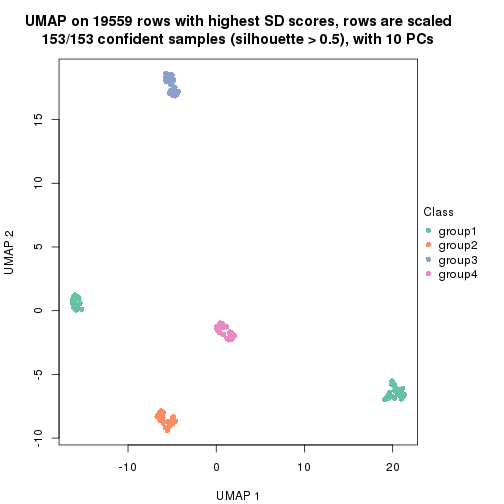</p>

</div>
<div id='tab-SD-skmeans-dimension-reduction-4'>
<pre><code class="r">dimension_reduction(res, k = 5, method = &quot;UMAP&quot;)
</code></pre>

<p></p>

</div>
<div id='tab-SD-skmeans-dimension-reduction-5'>
<pre><code class="r">dimension_reduction(res, k = 6, method = &quot;UMAP&quot;)
</code></pre>

<p></p>

</div>
</div>


Following heatmap shows how subgroups are split when increasing `k`:

```r
collect_classes(res)
```


Test correlation between subgroups and known annotations. If the known
annotation is numeric, one-way ANOVA test is applied, and if the known
annotation is discrete, chi-squared contingency table test is applied.

```r
test_to_known_factors(res)
```

```
#>              n individual(p) disease.state(p) cell.type(p) k
#> SD:skmeans 153             1            1.000     4.63e-32 2
#> SD:skmeans 153             1            0.985     2.17e-61 3
#> SD:skmeans 153             1            0.996     1.16e-90 4
#> SD:skmeans 153             1            0.989    6.51e-120 5
#> SD:skmeans 153             1            0.662    8.52e-117 6
```


If matrix rows can be associated to genes, consider to use `functional_enrichment(res,
...)` to perform function enrichment for the signature genes. See [this vignette](http://bioconductor.org/packages/devel/bioc/vignettes/cola/inst/doc/functional_enrichment.html) for more detailed explanations.


 

---------------------------------------------------


### SD:pam**


The object with results only for a single top-value method and a single partition method 
can be extracted as:

```r
res = res_list["SD", "pam"]
# you can also extract it by
# res = res_list["SD:pam"]
```

A summary of `res` and all the functions that can be applied to it:

```r
res
```

```
#> A 'ConsensusPartition' object with k = 2, 3, 4, 5, 6.
#>   On a matrix with 19559 rows and 153 columns.
#>   Top rows (1000, 2000, 3000, 4000, 5000) are extracted by 'SD' method.
#>   Subgroups are detected by 'pam' method.
#>   Performed in total 1250 partitions by row resampling.
#>   Best k for subgroups seems to be 6.
#> 
#> Following methods can be applied to this 'ConsensusPartition' object:
#>  [1] "cola_report"             "collect_classes"         "collect_plots"          
#>  [4] "collect_stats"           "colnames"                "compare_signatures"     
#>  [7] "consensus_heatmap"       "dimension_reduction"     "functional_enrichment"  
#> [10] "get_anno_col"            "get_anno"                "get_classes"            
#> [13] "get_consensus"           "get_matrix"              "get_membership"         
#> [16] "get_param"               "get_signatures"          "get_stats"              
#> [19] "is_best_k"               "is_stable_k"             "membership_heatmap"     
#> [22] "ncol"                    "nrow"                    "plot_ecdf"              
#> [25] "rownames"                "select_partition_number" "show"                   
#> [28] "suggest_best_k"          "test_to_known_factors"
```

`collect_plots()` function collects all the plots made from `res` for all `k` (number of partitions)
into one single page to provide an easy and fast comparison between different `k`.

```r
collect_plots(res)
```


The plots are:

- The first row: a plot of the ECDF (empirical cumulative distribution
  function) curves of the consensus matrix for each `k` and the heatmap of
  predicted classes for each `k`.
- The second row: heatmaps of the consensus matrix for each `k`.
- The third row: heatmaps of the membership matrix for each `k`.
- The fouth row: heatmaps of the signatures for each `k`.

All the plots in panels can be made by individual functions and they are
plotted later in this section.

`select_partition_number()` produces several plots showing different
statistics for choosing "optimized" `k`. There are following statistics:

- ECDF curves of the consensus matrix for each `k`;
- 1-PAC. [The PAC
  score](https://en.wikipedia.org/wiki/Consensus_clustering#Over-interpretation_potential_of_consensus_clustering)
  measures the proportion of the ambiguous subgrouping.
- Mean silhouette score.
- Concordance. The mean probability of fiting the consensus class ids in all
  partitions.
- Area increased. Denote $A_k$ as the area under the ECDF curve for current
  `k`, the area increased is defined as $A_k - A_{k-1}$.
- Rand index. The percent of pairs of samples that are both in a same cluster
  or both are not in a same cluster in the partition of k and k-1.
- Jaccard index. The ratio of pairs of samples are both in a same cluster in
  the partition of k and k-1 and the pairs of samples are both in a same
  cluster in the partition k or k-1.

The detailed explanations of these statistics can be found in [the _cola_
vignette](http://bioconductor.org/packages/devel/bioc/vignettes/cola/inst/doc/cola.html#toc_13).

Generally speaking, lower PAC score, higher mean silhouette score or higher
concordance corresponds to better partition. Rand index and Jaccard index
measure how similar the current partition is compared to partition with `k-1`.
If they are too similar, we won't accept `k` is better than `k-1`.

```r
select_partition_number(res)
```


The numeric values for all these statistics can be obtained by `get_stats()`.

```r
get_stats(res)
```

```
#>   k 1-PAC mean_silhouette concordance area_increased  Rand Jaccard
#> 2 2 1.000           0.984       0.992         0.4586 0.540   0.540
#> 3 3 0.990           0.974       0.987         0.3989 0.819   0.664
#> 4 4 1.000           0.988       0.994         0.1122 0.920   0.779
#> 5 5 1.000           1.000       1.000         0.1239 0.909   0.686
#> 6 6 0.961           0.922       0.919         0.0209 0.989   0.943
```

`suggest_best_k()` suggests the best $k$ based on these statistics. The rules are as follows:

- All $k$ with Jaccard index larger than 0.95 are removed because increasing
  $k$ does not provide enough extra information. If all $k$ are removed, it is
  marked as no subgroup is detected.
- For all $k$ with 1-PAC score larger than 0.9, the maximal $k$ is taken as
  the best $k$, and other $k$ are marked as optional $k$.
- If it does not fit the second rule. The $k$ with the maximal vote of the
  highest 1-PAC score, highest mean silhouette, and highest concordance is
  taken as the best $k$.

```r
suggest_best_k(res)
```

```
#> [1] 6
#> attr(,"optional")
#> [1] 2 3 4 5
```

There is also optional best $k$ = 2 3 4 5 that is worth to check.

Following shows the table of the partitions (You need to click the **show/hide
code output** link to see it). The membership matrix (columns with name `p*`)
is inferred by
[`clue::cl_consensus()`](https://www.rdocumentation.org/link/cl_consensus?package=clue)
function with the `SE` method. Basically the value in the membership matrix
represents the probability to belong to a certain group. The finall class
label for an item is determined with the group with highest probability it
belongs to.

In `get_classes()` function, the entropy is calculated from the membership
matrix and the silhouette score is calculated from the consensus matrix.


<script>
$( function() {
	$( '#tabs-SD-pam-get-classes' ).tabs();
} );
</script>
<div id='tabs-SD-pam-get-classes'>
<ul>
<li><a href='#tab-SD-pam-get-classes-1'>k = 2</a></li>
<li><a href='#tab-SD-pam-get-classes-2'>k = 3</a></li>
<li><a href='#tab-SD-pam-get-classes-3'>k = 4</a></li>
<li><a href='#tab-SD-pam-get-classes-4'>k = 5</a></li>
<li><a href='#tab-SD-pam-get-classes-5'>k = 6</a></li>
</ul>

<div id='tab-SD-pam-get-classes-1'>
<p><a id='tab-SD-pam-get-classes-1-a' style='color:#0366d6' href='#'>show/hide code output</a></p>
<pre><code class="r">cbind(get_classes(res, k = 2), get_membership(res, k = 2))
</code></pre>

<pre><code>#&gt;           class entropy silhouette    p1    p2
#&gt; GSM247795     2  0.0000      0.995 0.000 1.000
#&gt; GSM247854     2  0.0000      0.995 0.000 1.000
#&gt; GSM247758     2  0.0000      0.995 0.000 1.000
#&gt; GSM247742     1  0.0672      0.981 0.992 0.008
#&gt; GSM247755     2  0.0000      0.995 0.000 1.000
#&gt; GSM247841     1  0.0000      0.986 1.000 0.000
#&gt; GSM247703     2  0.0000      0.995 0.000 1.000
#&gt; GSM247739     2  0.0000      0.995 0.000 1.000
#&gt; GSM247715     1  0.0000      0.986 1.000 0.000
#&gt; GSM247829     2  0.0000      0.995 0.000 1.000
#&gt; GSM247842     1  0.0000      0.986 1.000 0.000
#&gt; GSM247805     2  0.0000      0.995 0.000 1.000
#&gt; GSM247786     2  0.0000      0.995 0.000 1.000
#&gt; GSM247812     2  0.0000      0.995 0.000 1.000
#&gt; GSM247776     1  0.0000      0.986 1.000 0.000
#&gt; GSM247850     1  0.0000      0.986 1.000 0.000
#&gt; GSM247717     2  0.0000      0.995 0.000 1.000
#&gt; GSM247784     2  0.0000      0.995 0.000 1.000
#&gt; GSM247834     1  0.3431      0.935 0.936 0.064
#&gt; GSM247783     2  0.0000      0.995 0.000 1.000
#&gt; GSM247846     1  0.0000      0.986 1.000 0.000
#&gt; GSM247822     2  0.0000      0.995 0.000 1.000
#&gt; GSM247710     2  0.0000      0.995 0.000 1.000
#&gt; GSM247713     1  0.2423      0.957 0.960 0.040
#&gt; GSM247840     2  0.0000      0.995 0.000 1.000
#&gt; GSM247733     1  0.0000      0.986 1.000 0.000
#&gt; GSM247852     1  0.0000      0.986 1.000 0.000
#&gt; GSM247790     2  0.0000      0.995 0.000 1.000
#&gt; GSM247730     2  0.0000      0.995 0.000 1.000
#&gt; GSM247824     2  0.0000      0.995 0.000 1.000
#&gt; GSM247770     1  0.0000      0.986 1.000 0.000
#&gt; GSM247711     2  0.0000      0.995 0.000 1.000
#&gt; GSM247782     2  0.0000      0.995 0.000 1.000
#&gt; GSM247836     1  0.1633      0.970 0.976 0.024
#&gt; GSM247785     2  0.0000      0.995 0.000 1.000
#&gt; GSM247847     1  0.0000      0.986 1.000 0.000
#&gt; GSM247750     2  0.0000      0.995 0.000 1.000
#&gt; GSM247788     2  0.0000      0.995 0.000 1.000
#&gt; GSM247849     1  0.0000      0.986 1.000 0.000
#&gt; GSM247772     2  0.0000      0.995 0.000 1.000
#&gt; GSM247760     1  0.0000      0.986 1.000 0.000
#&gt; GSM247764     2  0.0000      0.995 0.000 1.000
#&gt; GSM247851     2  0.0000      0.995 0.000 1.000
#&gt; GSM247714     2  0.0000      0.995 0.000 1.000
#&gt; GSM247828     1  0.0000      0.986 1.000 0.000
#&gt; GSM247704     2  0.0000      0.995 0.000 1.000
#&gt; GSM247818     1  0.0000      0.986 1.000 0.000
#&gt; GSM247823     2  0.0000      0.995 0.000 1.000
#&gt; GSM247706     2  0.0000      0.995 0.000 1.000
#&gt; GSM247835     2  0.0000      0.995 0.000 1.000
#&gt; GSM247734     1  0.0000      0.986 1.000 0.000
#&gt; GSM247819     2  0.0000      0.995 0.000 1.000
#&gt; GSM247809     2  0.0000      0.995 0.000 1.000
#&gt; GSM247830     2  0.0000      0.995 0.000 1.000
#&gt; GSM247833     1  0.0000      0.986 1.000 0.000
#&gt; GSM247738     2  0.0000      0.995 0.000 1.000
#&gt; GSM247716     2  0.0000      0.995 0.000 1.000
#&gt; GSM247747     2  0.0000      0.995 0.000 1.000
#&gt; GSM247722     1  0.0000      0.986 1.000 0.000
#&gt; GSM247816     2  0.0000      0.995 0.000 1.000
#&gt; GSM247839     2  0.0000      0.995 0.000 1.000
#&gt; GSM247821     1  0.1633      0.970 0.976 0.024
#&gt; GSM247798     2  0.0000      0.995 0.000 1.000
#&gt; GSM247838     1  0.0000      0.986 1.000 0.000
#&gt; GSM247721     2  0.0000      0.995 0.000 1.000
#&gt; GSM247781     2  0.0000      0.995 0.000 1.000
#&gt; GSM247762     2  0.9129      0.499 0.328 0.672
#&gt; GSM247825     2  0.0000      0.995 0.000 1.000
#&gt; GSM247777     1  0.0000      0.986 1.000 0.000
#&gt; GSM247761     2  0.0000      0.995 0.000 1.000
#&gt; GSM247720     2  0.0000      0.995 0.000 1.000
#&gt; GSM247814     2  0.0000      0.995 0.000 1.000
#&gt; GSM247732     1  0.0000      0.986 1.000 0.000
#&gt; GSM247708     2  0.0000      0.995 0.000 1.000
#&gt; GSM247740     2  0.0000      0.995 0.000 1.000
#&gt; GSM247749     1  0.2423      0.957 0.960 0.040
#&gt; GSM247767     2  0.0000      0.995 0.000 1.000
#&gt; GSM247748     1  0.0000      0.986 1.000 0.000
#&gt; GSM247705     2  0.0000      0.995 0.000 1.000
#&gt; GSM247746     2  0.0000      0.995 0.000 1.000
#&gt; GSM247752     2  0.4939      0.874 0.108 0.892
#&gt; GSM247769     2  0.0000      0.995 0.000 1.000
#&gt; GSM247753     1  0.0000      0.986 1.000 0.000
#&gt; GSM247723     2  0.0000      0.995 0.000 1.000
#&gt; GSM247779     2  0.0000      0.995 0.000 1.000
#&gt; GSM247756     1  0.0000      0.986 1.000 0.000
#&gt; GSM247826     2  0.0000      0.995 0.000 1.000
#&gt; GSM247775     1  0.0000      0.986 1.000 0.000
#&gt; GSM247741     2  0.0000      0.995 0.000 1.000
#&gt; GSM247799     2  0.0000      0.995 0.000 1.000
#&gt; GSM247778     1  0.0000      0.986 1.000 0.000
#&gt; GSM247806     2  0.0000      0.995 0.000 1.000
#&gt; GSM247815     1  0.0000      0.986 1.000 0.000
#&gt; GSM247735     2  0.0000      0.995 0.000 1.000
#&gt; GSM247831     2  0.0000      0.995 0.000 1.000
#&gt; GSM247845     1  0.0000      0.986 1.000 0.000
#&gt; GSM247791     2  0.0000      0.995 0.000 1.000
#&gt; GSM247780     1  0.0000      0.986 1.000 0.000
#&gt; GSM247853     1  0.0000      0.986 1.000 0.000
#&gt; GSM247800     2  0.0000      0.995 0.000 1.000
#&gt; GSM247729     2  0.0000      0.995 0.000 1.000
#&gt; GSM247810     1  0.6247      0.829 0.844 0.156
#&gt; GSM247844     2  0.0000      0.995 0.000 1.000
#&gt; GSM247793     1  0.0000      0.986 1.000 0.000
#&gt; GSM247759     2  0.0000      0.995 0.000 1.000
#&gt; GSM247724     2  0.0000      0.995 0.000 1.000
#&gt; GSM247817     2  0.0000      0.995 0.000 1.000
#&gt; GSM247727     1  0.0000      0.986 1.000 0.000
#&gt; GSM247796     2  0.0000      0.995 0.000 1.000
#&gt; GSM247725     2  0.0000      0.995 0.000 1.000
#&gt; GSM247801     1  0.6801      0.796 0.820 0.180
#&gt; GSM247731     2  0.0000      0.995 0.000 1.000
#&gt; GSM247765     1  0.0000      0.986 1.000 0.000
#&gt; GSM247792     2  0.0000      0.995 0.000 1.000
#&gt; GSM247726     2  0.0000      0.995 0.000 1.000
#&gt; GSM247803     2  0.0000      0.995 0.000 1.000
#&gt; GSM247728     2  0.0000      0.995 0.000 1.000
#&gt; GSM247768     1  0.0000      0.986 1.000 0.000
#&gt; GSM247745     2  0.0000      0.995 0.000 1.000
#&gt; GSM247855     2  0.0000      0.995 0.000 1.000
#&gt; GSM247804     2  0.0000      0.995 0.000 1.000
#&gt; GSM247774     1  0.5178      0.879 0.884 0.116
#&gt; GSM247807     2  0.0000      0.995 0.000 1.000
#&gt; GSM247813     1  0.0000      0.986 1.000 0.000
#&gt; GSM247736     2  0.0000      0.995 0.000 1.000
#&gt; GSM247712     2  0.0000      0.995 0.000 1.000
#&gt; GSM247797     1  0.3733      0.927 0.928 0.072
#&gt; GSM247743     2  0.0000      0.995 0.000 1.000
#&gt; GSM247719     1  0.0000      0.986 1.000 0.000
#&gt; GSM247707     2  0.0000      0.995 0.000 1.000
#&gt; GSM247737     2  0.0000      0.995 0.000 1.000
#&gt; GSM247827     2  0.0000      0.995 0.000 1.000
#&gt; GSM247848     1  0.0000      0.986 1.000 0.000
#&gt; GSM247794     2  0.0000      0.995 0.000 1.000
#&gt; GSM247757     2  0.0000      0.995 0.000 1.000
#&gt; GSM247744     1  0.1633      0.970 0.976 0.024
#&gt; GSM247751     2  0.0000      0.995 0.000 1.000
#&gt; GSM247837     1  0.0000      0.986 1.000 0.000
#&gt; GSM247754     2  0.0000      0.995 0.000 1.000
#&gt; GSM247789     2  0.0000      0.995 0.000 1.000
#&gt; GSM247802     1  0.0672      0.981 0.992 0.008
#&gt; GSM247771     2  0.0000      0.995 0.000 1.000
#&gt; GSM247763     1  0.0000      0.986 1.000 0.000
#&gt; GSM247808     2  0.0000      0.995 0.000 1.000
#&gt; GSM247787     2  0.0000      0.995 0.000 1.000
#&gt; GSM247843     1  0.0000      0.986 1.000 0.000
#&gt; GSM247811     2  0.0000      0.995 0.000 1.000
#&gt; GSM247773     1  0.0000      0.986 1.000 0.000
#&gt; GSM247766     2  0.0000      0.995 0.000 1.000
#&gt; GSM247718     2  0.0000      0.995 0.000 1.000
#&gt; GSM247832     1  0.0000      0.986 1.000 0.000
#&gt; GSM247709     2  0.0000      0.995 0.000 1.000
#&gt; GSM247820     1  0.0000      0.986 1.000 0.000
</code></pre>

<script>
$('#tab-SD-pam-get-classes-1-a').parent().next().next().hide();
$('#tab-SD-pam-get-classes-1-a').click(function(){
  $('#tab-SD-pam-get-classes-1-a').parent().next().next().toggle();
  return(false);
});
</script>
</div>

<div id='tab-SD-pam-get-classes-2'>
<p><a id='tab-SD-pam-get-classes-2-a' style='color:#0366d6' href='#'>show/hide code output</a></p>
<pre><code class="r">cbind(get_classes(res, k = 3), get_membership(res, k = 3))
</code></pre>

<pre><code>#&gt;           class entropy silhouette    p1    p2    p3
#&gt; GSM247795     2  0.0000      0.988 0.000 1.000 0.000
#&gt; GSM247854     2  0.0000      0.988 0.000 1.000 0.000
#&gt; GSM247758     2  0.0000      0.988 0.000 1.000 0.000
#&gt; GSM247742     1  0.1964      0.931 0.944 0.056 0.000
#&gt; GSM247755     3  0.0000      1.000 0.000 0.000 1.000
#&gt; GSM247841     1  0.0000      0.974 1.000 0.000 0.000
#&gt; GSM247703     2  0.0000      0.988 0.000 1.000 0.000
#&gt; GSM247739     2  0.0000      0.988 0.000 1.000 0.000
#&gt; GSM247715     1  0.0000      0.974 1.000 0.000 0.000
#&gt; GSM247829     3  0.0000      1.000 0.000 0.000 1.000
#&gt; GSM247842     1  0.0000      0.974 1.000 0.000 0.000
#&gt; GSM247805     2  0.0000      0.988 0.000 1.000 0.000
#&gt; GSM247786     2  0.0000      0.988 0.000 1.000 0.000
#&gt; GSM247812     3  0.0000      1.000 0.000 0.000 1.000
#&gt; GSM247776     1  0.0000      0.974 1.000 0.000 0.000
#&gt; GSM247850     1  0.0000      0.974 1.000 0.000 0.000
#&gt; GSM247717     2  0.0000      0.988 0.000 1.000 0.000
#&gt; GSM247784     2  0.0000      0.988 0.000 1.000 0.000
#&gt; GSM247834     1  0.3941      0.826 0.844 0.156 0.000
#&gt; GSM247783     3  0.0000      1.000 0.000 0.000 1.000
#&gt; GSM247846     1  0.0000      0.974 1.000 0.000 0.000
#&gt; GSM247822     2  0.0000      0.988 0.000 1.000 0.000
#&gt; GSM247710     2  0.0000      0.988 0.000 1.000 0.000
#&gt; GSM247713     1  0.2711      0.901 0.912 0.088 0.000
#&gt; GSM247840     3  0.0000      1.000 0.000 0.000 1.000
#&gt; GSM247733     1  0.0000      0.974 1.000 0.000 0.000
#&gt; GSM247852     1  0.0000      0.974 1.000 0.000 0.000
#&gt; GSM247790     2  0.0000      0.988 0.000 1.000 0.000
#&gt; GSM247730     2  0.0000      0.988 0.000 1.000 0.000
#&gt; GSM247824     3  0.0000      1.000 0.000 0.000 1.000
#&gt; GSM247770     1  0.0000      0.974 1.000 0.000 0.000
#&gt; GSM247711     2  0.0000      0.988 0.000 1.000 0.000
#&gt; GSM247782     2  0.0000      0.988 0.000 1.000 0.000
#&gt; GSM247836     1  0.0892      0.961 0.980 0.020 0.000
#&gt; GSM247785     3  0.0000      1.000 0.000 0.000 1.000
#&gt; GSM247847     1  0.0000      0.974 1.000 0.000 0.000
#&gt; GSM247750     2  0.0000      0.988 0.000 1.000 0.000
#&gt; GSM247788     2  0.0000      0.988 0.000 1.000 0.000
#&gt; GSM247849     1  0.0237      0.972 0.996 0.004 0.000
#&gt; GSM247772     3  0.0000      1.000 0.000 0.000 1.000
#&gt; GSM247760     1  0.0000      0.974 1.000 0.000 0.000
#&gt; GSM247764     2  0.3941      0.825 0.000 0.844 0.156
#&gt; GSM247851     2  0.3879      0.830 0.000 0.848 0.152
#&gt; GSM247714     2  0.0000      0.988 0.000 1.000 0.000
#&gt; GSM247828     1  0.0000      0.974 1.000 0.000 0.000
#&gt; GSM247704     3  0.0000      1.000 0.000 0.000 1.000
#&gt; GSM247818     1  0.0000      0.974 1.000 0.000 0.000
#&gt; GSM247823     2  0.0000      0.988 0.000 1.000 0.000
#&gt; GSM247706     2  0.0000      0.988 0.000 1.000 0.000
#&gt; GSM247835     3  0.0000      1.000 0.000 0.000 1.000
#&gt; GSM247734     1  0.0000      0.974 1.000 0.000 0.000
#&gt; GSM247819     2  0.4504      0.770 0.000 0.804 0.196
#&gt; GSM247809     2  0.0000      0.988 0.000 1.000 0.000
#&gt; GSM247830     3  0.0000      1.000 0.000 0.000 1.000
#&gt; GSM247833     1  0.0000      0.974 1.000 0.000 0.000
#&gt; GSM247738     2  0.0000      0.988 0.000 1.000 0.000
#&gt; GSM247716     2  0.0000      0.988 0.000 1.000 0.000
#&gt; GSM247747     3  0.0000      1.000 0.000 0.000 1.000
#&gt; GSM247722     1  0.0000      0.974 1.000 0.000 0.000
#&gt; GSM247816     2  0.0000      0.988 0.000 1.000 0.000
#&gt; GSM247839     2  0.0000      0.988 0.000 1.000 0.000
#&gt; GSM247821     1  0.2625      0.905 0.916 0.084 0.000
#&gt; GSM247798     3  0.0000      1.000 0.000 0.000 1.000
#&gt; GSM247838     1  0.0000      0.974 1.000 0.000 0.000
#&gt; GSM247721     2  0.0000      0.988 0.000 1.000 0.000
#&gt; GSM247781     2  0.0000      0.988 0.000 1.000 0.000
#&gt; GSM247762     2  0.0000      0.988 0.000 1.000 0.000
#&gt; GSM247825     3  0.0000      1.000 0.000 0.000 1.000
#&gt; GSM247777     1  0.0000      0.974 1.000 0.000 0.000
#&gt; GSM247761     2  0.0000      0.988 0.000 1.000 0.000
#&gt; GSM247720     2  0.0000      0.988 0.000 1.000 0.000
#&gt; GSM247814     3  0.0000      1.000 0.000 0.000 1.000
#&gt; GSM247732     1  0.0000      0.974 1.000 0.000 0.000
#&gt; GSM247708     2  0.0000      0.988 0.000 1.000 0.000
#&gt; GSM247740     2  0.0000      0.988 0.000 1.000 0.000
#&gt; GSM247749     1  0.3340      0.867 0.880 0.120 0.000
#&gt; GSM247767     3  0.0000      1.000 0.000 0.000 1.000
#&gt; GSM247748     1  0.0000      0.974 1.000 0.000 0.000
#&gt; GSM247705     2  0.2625      0.909 0.000 0.916 0.084
#&gt; GSM247746     2  0.0000      0.988 0.000 1.000 0.000
#&gt; GSM247752     2  0.0000      0.988 0.000 1.000 0.000
#&gt; GSM247769     3  0.0000      1.000 0.000 0.000 1.000
#&gt; GSM247753     1  0.0000      0.974 1.000 0.000 0.000
#&gt; GSM247723     2  0.0000      0.988 0.000 1.000 0.000
#&gt; GSM247779     2  0.0000      0.988 0.000 1.000 0.000
#&gt; GSM247756     1  0.0000      0.974 1.000 0.000 0.000
#&gt; GSM247826     3  0.0000      1.000 0.000 0.000 1.000
#&gt; GSM247775     1  0.0000      0.974 1.000 0.000 0.000
#&gt; GSM247741     2  0.0000      0.988 0.000 1.000 0.000
#&gt; GSM247799     2  0.0000      0.988 0.000 1.000 0.000
#&gt; GSM247778     1  0.0000      0.974 1.000 0.000 0.000
#&gt; GSM247806     3  0.0000      1.000 0.000 0.000 1.000
#&gt; GSM247815     1  0.0000      0.974 1.000 0.000 0.000
#&gt; GSM247735     2  0.0000      0.988 0.000 1.000 0.000
#&gt; GSM247831     2  0.0000      0.988 0.000 1.000 0.000
#&gt; GSM247845     1  0.0000      0.974 1.000 0.000 0.000
#&gt; GSM247791     3  0.0000      1.000 0.000 0.000 1.000
#&gt; GSM247780     1  0.0000      0.974 1.000 0.000 0.000
#&gt; GSM247853     1  0.0000      0.974 1.000 0.000 0.000
#&gt; GSM247800     2  0.0000      0.988 0.000 1.000 0.000
#&gt; GSM247729     2  0.0000      0.988 0.000 1.000 0.000
#&gt; GSM247810     1  0.4750      0.749 0.784 0.216 0.000
#&gt; GSM247844     3  0.0000      1.000 0.000 0.000 1.000
#&gt; GSM247793     1  0.0000      0.974 1.000 0.000 0.000
#&gt; GSM247759     2  0.0000      0.988 0.000 1.000 0.000
#&gt; GSM247724     2  0.0000      0.988 0.000 1.000 0.000
#&gt; GSM247817     3  0.0000      1.000 0.000 0.000 1.000
#&gt; GSM247727     1  0.0000      0.974 1.000 0.000 0.000
#&gt; GSM247796     2  0.0000      0.988 0.000 1.000 0.000
#&gt; GSM247725     2  0.0000      0.988 0.000 1.000 0.000
#&gt; GSM247801     1  0.4504      0.776 0.804 0.196 0.000
#&gt; GSM247731     3  0.0000      1.000 0.000 0.000 1.000
#&gt; GSM247765     1  0.0000      0.974 1.000 0.000 0.000
#&gt; GSM247792     2  0.1411      0.956 0.000 0.964 0.036
#&gt; GSM247726     2  0.0000      0.988 0.000 1.000 0.000
#&gt; GSM247803     2  0.0000      0.988 0.000 1.000 0.000
#&gt; GSM247728     3  0.0000      1.000 0.000 0.000 1.000
#&gt; GSM247768     1  0.0000      0.974 1.000 0.000 0.000
#&gt; GSM247745     2  0.0000      0.988 0.000 1.000 0.000
#&gt; GSM247855     2  0.0000      0.988 0.000 1.000 0.000
#&gt; GSM247804     2  0.0000      0.988 0.000 1.000 0.000
#&gt; GSM247774     1  0.2066      0.928 0.940 0.060 0.000
#&gt; GSM247807     3  0.0000      1.000 0.000 0.000 1.000
#&gt; GSM247813     1  0.0000      0.974 1.000 0.000 0.000
#&gt; GSM247736     2  0.0000      0.988 0.000 1.000 0.000
#&gt; GSM247712     2  0.0000      0.988 0.000 1.000 0.000
#&gt; GSM247797     1  0.3192      0.876 0.888 0.112 0.000
#&gt; GSM247743     3  0.0000      1.000 0.000 0.000 1.000
#&gt; GSM247719     1  0.0000      0.974 1.000 0.000 0.000
#&gt; GSM247707     2  0.0000      0.988 0.000 1.000 0.000
#&gt; GSM247737     2  0.0000      0.988 0.000 1.000 0.000
#&gt; GSM247827     3  0.0000      1.000 0.000 0.000 1.000
#&gt; GSM247848     1  0.0000      0.974 1.000 0.000 0.000
#&gt; GSM247794     2  0.0000      0.988 0.000 1.000 0.000
#&gt; GSM247757     2  0.0000      0.988 0.000 1.000 0.000
#&gt; GSM247744     1  0.1289      0.951 0.968 0.032 0.000
#&gt; GSM247751     3  0.0000      1.000 0.000 0.000 1.000
#&gt; GSM247837     1  0.0000      0.974 1.000 0.000 0.000
#&gt; GSM247754     2  0.0000      0.988 0.000 1.000 0.000
#&gt; GSM247789     2  0.0000      0.988 0.000 1.000 0.000
#&gt; GSM247802     1  0.1163      0.955 0.972 0.028 0.000
#&gt; GSM247771     3  0.0000      1.000 0.000 0.000 1.000
#&gt; GSM247763     1  0.0000      0.974 1.000 0.000 0.000
#&gt; GSM247808     2  0.0000      0.988 0.000 1.000 0.000
#&gt; GSM247787     2  0.0000      0.988 0.000 1.000 0.000
#&gt; GSM247843     1  0.0000      0.974 1.000 0.000 0.000
#&gt; GSM247811     3  0.0000      1.000 0.000 0.000 1.000
#&gt; GSM247773     1  0.0000      0.974 1.000 0.000 0.000
#&gt; GSM247766     2  0.3816      0.836 0.000 0.852 0.148
#&gt; GSM247718     2  0.0000      0.988 0.000 1.000 0.000
#&gt; GSM247832     1  0.0000      0.974 1.000 0.000 0.000
#&gt; GSM247709     3  0.0000      1.000 0.000 0.000 1.000
#&gt; GSM247820     1  0.0000      0.974 1.000 0.000 0.000
</code></pre>

<script>
$('#tab-SD-pam-get-classes-2-a').parent().next().next().hide();
$('#tab-SD-pam-get-classes-2-a').click(function(){
  $('#tab-SD-pam-get-classes-2-a').parent().next().next().toggle();
  return(false);
});
</script>
</div>

<div id='tab-SD-pam-get-classes-3'>
<p><a id='tab-SD-pam-get-classes-3-a' style='color:#0366d6' href='#'>show/hide code output</a></p>
<pre><code class="r">cbind(get_classes(res, k = 4), get_membership(res, k = 4))
</code></pre>

<pre><code>#&gt;           class entropy silhouette p1    p2    p3 p4
#&gt; GSM247795     2  0.0000      0.986  0 1.000 0.000  0
#&gt; GSM247854     2  0.0000      0.986  0 1.000 0.000  0
#&gt; GSM247758     2  0.0000      0.986  0 1.000 0.000  0
#&gt; GSM247742     4  0.0000      1.000  0 0.000 0.000  1
#&gt; GSM247755     3  0.0000      1.000  0 0.000 1.000  0
#&gt; GSM247841     1  0.0000      1.000  1 0.000 0.000  0
#&gt; GSM247703     2  0.0000      0.986  0 1.000 0.000  0
#&gt; GSM247739     2  0.0000      0.986  0 1.000 0.000  0
#&gt; GSM247715     4  0.0000      1.000  0 0.000 0.000  1
#&gt; GSM247829     3  0.0000      1.000  0 0.000 1.000  0
#&gt; GSM247842     1  0.0000      1.000  1 0.000 0.000  0
#&gt; GSM247805     2  0.0000      0.986  0 1.000 0.000  0
#&gt; GSM247786     2  0.0000      0.986  0 1.000 0.000  0
#&gt; GSM247812     3  0.0000      1.000  0 0.000 1.000  0
#&gt; GSM247776     1  0.0000      1.000  1 0.000 0.000  0
#&gt; GSM247850     1  0.0000      1.000  1 0.000 0.000  0
#&gt; GSM247717     2  0.0000      0.986  0 1.000 0.000  0
#&gt; GSM247784     2  0.0000      0.986  0 1.000 0.000  0
#&gt; GSM247834     4  0.0000      1.000  0 0.000 0.000  1
#&gt; GSM247783     3  0.0000      1.000  0 0.000 1.000  0
#&gt; GSM247846     1  0.0000      1.000  1 0.000 0.000  0
#&gt; GSM247822     2  0.0000      0.986  0 1.000 0.000  0
#&gt; GSM247710     2  0.0000      0.986  0 1.000 0.000  0
#&gt; GSM247713     4  0.0000      1.000  0 0.000 0.000  1
#&gt; GSM247840     3  0.0000      1.000  0 0.000 1.000  0
#&gt; GSM247733     1  0.0000      1.000  1 0.000 0.000  0
#&gt; GSM247852     1  0.0000      1.000  1 0.000 0.000  0
#&gt; GSM247790     2  0.0000      0.986  0 1.000 0.000  0
#&gt; GSM247730     2  0.0000      0.986  0 1.000 0.000  0
#&gt; GSM247824     3  0.0000      1.000  0 0.000 1.000  0
#&gt; GSM247770     1  0.0000      1.000  1 0.000 0.000  0
#&gt; GSM247711     2  0.0000      0.986  0 1.000 0.000  0
#&gt; GSM247782     2  0.0000      0.986  0 1.000 0.000  0
#&gt; GSM247836     4  0.0000      1.000  0 0.000 0.000  1
#&gt; GSM247785     3  0.0000      1.000  0 0.000 1.000  0
#&gt; GSM247847     1  0.0000      1.000  1 0.000 0.000  0
#&gt; GSM247750     2  0.0000      0.986  0 1.000 0.000  0
#&gt; GSM247788     2  0.0000      0.986  0 1.000 0.000  0
#&gt; GSM247849     4  0.0000      1.000  0 0.000 0.000  1
#&gt; GSM247772     3  0.0000      1.000  0 0.000 1.000  0
#&gt; GSM247760     1  0.0000      1.000  1 0.000 0.000  0
#&gt; GSM247764     2  0.3219      0.817  0 0.836 0.164  0
#&gt; GSM247851     2  0.3172      0.823  0 0.840 0.160  0
#&gt; GSM247714     2  0.0000      0.986  0 1.000 0.000  0
#&gt; GSM247828     4  0.0000      1.000  0 0.000 0.000  1
#&gt; GSM247704     3  0.0000      1.000  0 0.000 1.000  0
#&gt; GSM247818     1  0.0000      1.000  1 0.000 0.000  0
#&gt; GSM247823     2  0.0000      0.986  0 1.000 0.000  0
#&gt; GSM247706     2  0.0000      0.986  0 1.000 0.000  0
#&gt; GSM247835     3  0.0000      1.000  0 0.000 1.000  0
#&gt; GSM247734     1  0.0000      1.000  1 0.000 0.000  0
#&gt; GSM247819     2  0.3610      0.767  0 0.800 0.200  0
#&gt; GSM247809     2  0.0000      0.986  0 1.000 0.000  0
#&gt; GSM247830     3  0.0000      1.000  0 0.000 1.000  0
#&gt; GSM247833     1  0.0000      1.000  1 0.000 0.000  0
#&gt; GSM247738     2  0.0000      0.986  0 1.000 0.000  0
#&gt; GSM247716     2  0.0000      0.986  0 1.000 0.000  0
#&gt; GSM247747     3  0.0000      1.000  0 0.000 1.000  0
#&gt; GSM247722     1  0.0000      1.000  1 0.000 0.000  0
#&gt; GSM247816     2  0.0000      0.986  0 1.000 0.000  0
#&gt; GSM247839     2  0.0000      0.986  0 1.000 0.000  0
#&gt; GSM247821     4  0.0000      1.000  0 0.000 0.000  1
#&gt; GSM247798     3  0.0000      1.000  0 0.000 1.000  0
#&gt; GSM247838     1  0.0000      1.000  1 0.000 0.000  0
#&gt; GSM247721     2  0.0000      0.986  0 1.000 0.000  0
#&gt; GSM247781     2  0.0000      0.986  0 1.000 0.000  0
#&gt; GSM247762     4  0.0000      1.000  0 0.000 0.000  1
#&gt; GSM247825     3  0.0000      1.000  0 0.000 1.000  0
#&gt; GSM247777     1  0.0000      1.000  1 0.000 0.000  0
#&gt; GSM247761     2  0.0000      0.986  0 1.000 0.000  0
#&gt; GSM247720     2  0.0000      0.986  0 1.000 0.000  0
#&gt; GSM247814     3  0.0000      1.000  0 0.000 1.000  0
#&gt; GSM247732     1  0.0000      1.000  1 0.000 0.000  0
#&gt; GSM247708     2  0.0000      0.986  0 1.000 0.000  0
#&gt; GSM247740     2  0.0000      0.986  0 1.000 0.000  0
#&gt; GSM247749     4  0.0000      1.000  0 0.000 0.000  1
#&gt; GSM247767     3  0.0000      1.000  0 0.000 1.000  0
#&gt; GSM247748     1  0.0000      1.000  1 0.000 0.000  0
#&gt; GSM247705     2  0.2530      0.879  0 0.888 0.112  0
#&gt; GSM247746     2  0.0000      0.986  0 1.000 0.000  0
#&gt; GSM247752     4  0.0000      1.000  0 0.000 0.000  1
#&gt; GSM247769     3  0.0000      1.000  0 0.000 1.000  0
#&gt; GSM247753     1  0.0000      1.000  1 0.000 0.000  0
#&gt; GSM247723     2  0.0000      0.986  0 1.000 0.000  0
#&gt; GSM247779     2  0.0000      0.986  0 1.000 0.000  0
#&gt; GSM247756     4  0.0000      1.000  0 0.000 0.000  1
#&gt; GSM247826     3  0.0000      1.000  0 0.000 1.000  0
#&gt; GSM247775     1  0.0000      1.000  1 0.000 0.000  0
#&gt; GSM247741     2  0.0000      0.986  0 1.000 0.000  0
#&gt; GSM247799     2  0.0000      0.986  0 1.000 0.000  0
#&gt; GSM247778     4  0.0000      1.000  0 0.000 0.000  1
#&gt; GSM247806     3  0.0000      1.000  0 0.000 1.000  0
#&gt; GSM247815     1  0.0000      1.000  1 0.000 0.000  0
#&gt; GSM247735     2  0.0000      0.986  0 1.000 0.000  0
#&gt; GSM247831     2  0.0000      0.986  0 1.000 0.000  0
#&gt; GSM247845     4  0.0000      1.000  0 0.000 0.000  1
#&gt; GSM247791     3  0.0000      1.000  0 0.000 1.000  0
#&gt; GSM247780     1  0.0000      1.000  1 0.000 0.000  0
#&gt; GSM247853     1  0.0000      1.000  1 0.000 0.000  0
#&gt; GSM247800     2  0.0000      0.986  0 1.000 0.000  0
#&gt; GSM247729     2  0.0000      0.986  0 1.000 0.000  0
#&gt; GSM247810     4  0.0000      1.000  0 0.000 0.000  1
#&gt; GSM247844     3  0.0000      1.000  0 0.000 1.000  0
#&gt; GSM247793     1  0.0000      1.000  1 0.000 0.000  0
#&gt; GSM247759     2  0.0000      0.986  0 1.000 0.000  0
#&gt; GSM247724     2  0.0000      0.986  0 1.000 0.000  0
#&gt; GSM247817     3  0.0000      1.000  0 0.000 1.000  0
#&gt; GSM247727     1  0.0000      1.000  1 0.000 0.000  0
#&gt; GSM247796     2  0.0188      0.983  0 0.996 0.004  0
#&gt; GSM247725     2  0.0000      0.986  0 1.000 0.000  0
#&gt; GSM247801     4  0.0000      1.000  0 0.000 0.000  1
#&gt; GSM247731     3  0.0000      1.000  0 0.000 1.000  0
#&gt; GSM247765     1  0.0000      1.000  1 0.000 0.000  0
#&gt; GSM247792     2  0.1557      0.935  0 0.944 0.056  0
#&gt; GSM247726     2  0.0000      0.986  0 1.000 0.000  0
#&gt; GSM247803     4  0.0000      1.000  0 0.000 0.000  1
#&gt; GSM247728     3  0.0000      1.000  0 0.000 1.000  0
#&gt; GSM247768     1  0.0000      1.000  1 0.000 0.000  0
#&gt; GSM247745     2  0.0000      0.986  0 1.000 0.000  0
#&gt; GSM247855     2  0.0000      0.986  0 1.000 0.000  0
#&gt; GSM247804     2  0.0000      0.986  0 1.000 0.000  0
#&gt; GSM247774     4  0.0000      1.000  0 0.000 0.000  1
#&gt; GSM247807     3  0.0000      1.000  0 0.000 1.000  0
#&gt; GSM247813     1  0.0000      1.000  1 0.000 0.000  0
#&gt; GSM247736     2  0.0000      0.986  0 1.000 0.000  0
#&gt; GSM247712     2  0.0000      0.986  0 1.000 0.000  0
#&gt; GSM247797     4  0.0000      1.000  0 0.000 0.000  1
#&gt; GSM247743     3  0.0000      1.000  0 0.000 1.000  0
#&gt; GSM247719     1  0.0000      1.000  1 0.000 0.000  0
#&gt; GSM247707     2  0.0000      0.986  0 1.000 0.000  0
#&gt; GSM247737     2  0.0000      0.986  0 1.000 0.000  0
#&gt; GSM247827     3  0.0000      1.000  0 0.000 1.000  0
#&gt; GSM247848     1  0.0000      1.000  1 0.000 0.000  0
#&gt; GSM247794     2  0.0000      0.986  0 1.000 0.000  0
#&gt; GSM247757     2  0.0000      0.986  0 1.000 0.000  0
#&gt; GSM247744     4  0.0000      1.000  0 0.000 0.000  1
#&gt; GSM247751     3  0.0000      1.000  0 0.000 1.000  0
#&gt; GSM247837     1  0.0000      1.000  1 0.000 0.000  0
#&gt; GSM247754     2  0.0000      0.986  0 1.000 0.000  0
#&gt; GSM247789     2  0.0000      0.986  0 1.000 0.000  0
#&gt; GSM247802     4  0.0000      1.000  0 0.000 0.000  1
#&gt; GSM247771     3  0.0000      1.000  0 0.000 1.000  0
#&gt; GSM247763     1  0.0000      1.000  1 0.000 0.000  0
#&gt; GSM247808     2  0.0000      0.986  0 1.000 0.000  0
#&gt; GSM247787     2  0.0000      0.986  0 1.000 0.000  0
#&gt; GSM247843     4  0.0000      1.000  0 0.000 0.000  1
#&gt; GSM247811     3  0.0000      1.000  0 0.000 1.000  0
#&gt; GSM247773     1  0.0000      1.000  1 0.000 0.000  0
#&gt; GSM247766     2  0.3219      0.818  0 0.836 0.164  0
#&gt; GSM247718     2  0.0000      0.986  0 1.000 0.000  0
#&gt; GSM247832     4  0.0000      1.000  0 0.000 0.000  1
#&gt; GSM247709     3  0.0000      1.000  0 0.000 1.000  0
#&gt; GSM247820     1  0.0000      1.000  1 0.000 0.000  0
</code></pre>

<script>
$('#tab-SD-pam-get-classes-3-a').parent().next().next().hide();
$('#tab-SD-pam-get-classes-3-a').click(function(){
  $('#tab-SD-pam-get-classes-3-a').parent().next().next().toggle();
  return(false);
});
</script>
</div>

<div id='tab-SD-pam-get-classes-4'>
<p><a id='tab-SD-pam-get-classes-4-a' style='color:#0366d6' href='#'>show/hide code output</a></p>
<pre><code class="r">cbind(get_classes(res, k = 5), get_membership(res, k = 5))
</code></pre>

<pre><code>#&gt;           class entropy silhouette p1 p2 p3 p4 p5
#&gt; GSM247795     2       0          1  0  1  0  0  0
#&gt; GSM247854     2       0          1  0  1  0  0  0
#&gt; GSM247758     5       0          1  0  0  0  0  1
#&gt; GSM247742     4       0          1  0  0  0  1  0
#&gt; GSM247755     3       0          1  0  0  1  0  0
#&gt; GSM247841     1       0          1  1  0  0  0  0
#&gt; GSM247703     2       0          1  0  1  0  0  0
#&gt; GSM247739     5       0          1  0  0  0  0  1
#&gt; GSM247715     4       0          1  0  0  0  1  0
#&gt; GSM247829     3       0          1  0  0  1  0  0
#&gt; GSM247842     1       0          1  1  0  0  0  0
#&gt; GSM247805     2       0          1  0  1  0  0  0
#&gt; GSM247786     5       0          1  0  0  0  0  1
#&gt; GSM247812     3       0          1  0  0  1  0  0
#&gt; GSM247776     1       0          1  1  0  0  0  0
#&gt; GSM247850     1       0          1  1  0  0  0  0
#&gt; GSM247717     2       0          1  0  1  0  0  0
#&gt; GSM247784     5       0          1  0  0  0  0  1
#&gt; GSM247834     4       0          1  0  0  0  1  0
#&gt; GSM247783     3       0          1  0  0  1  0  0
#&gt; GSM247846     1       0          1  1  0  0  0  0
#&gt; GSM247822     2       0          1  0  1  0  0  0
#&gt; GSM247710     5       0          1  0  0  0  0  1
#&gt; GSM247713     4       0          1  0  0  0  1  0
#&gt; GSM247840     3       0          1  0  0  1  0  0
#&gt; GSM247733     1       0          1  1  0  0  0  0
#&gt; GSM247852     1       0          1  1  0  0  0  0
#&gt; GSM247790     2       0          1  0  1  0  0  0
#&gt; GSM247730     5       0          1  0  0  0  0  1
#&gt; GSM247824     3       0          1  0  0  1  0  0
#&gt; GSM247770     1       0          1  1  0  0  0  0
#&gt; GSM247711     2       0          1  0  1  0  0  0
#&gt; GSM247782     5       0          1  0  0  0  0  1
#&gt; GSM247836     4       0          1  0  0  0  1  0
#&gt; GSM247785     3       0          1  0  0  1  0  0
#&gt; GSM247847     1       0          1  1  0  0  0  0
#&gt; GSM247750     2       0          1  0  1  0  0  0
#&gt; GSM247788     5       0          1  0  0  0  0  1
#&gt; GSM247849     4       0          1  0  0  0  1  0
#&gt; GSM247772     3       0          1  0  0  1  0  0
#&gt; GSM247760     1       0          1  1  0  0  0  0
#&gt; GSM247764     2       0          1  0  1  0  0  0
#&gt; GSM247851     2       0          1  0  1  0  0  0
#&gt; GSM247714     5       0          1  0  0  0  0  1
#&gt; GSM247828     4       0          1  0  0  0  1  0
#&gt; GSM247704     3       0          1  0  0  1  0  0
#&gt; GSM247818     1       0          1  1  0  0  0  0
#&gt; GSM247823     2       0          1  0  1  0  0  0
#&gt; GSM247706     5       0          1  0  0  0  0  1
#&gt; GSM247835     3       0          1  0  0  1  0  0
#&gt; GSM247734     1       0          1  1  0  0  0  0
#&gt; GSM247819     2       0          1  0  1  0  0  0
#&gt; GSM247809     5       0          1  0  0  0  0  1
#&gt; GSM247830     3       0          1  0  0  1  0  0
#&gt; GSM247833     1       0          1  1  0  0  0  0
#&gt; GSM247738     2       0          1  0  1  0  0  0
#&gt; GSM247716     5       0          1  0  0  0  0  1
#&gt; GSM247747     3       0          1  0  0  1  0  0
#&gt; GSM247722     1       0          1  1  0  0  0  0
#&gt; GSM247816     2       0          1  0  1  0  0  0
#&gt; GSM247839     5       0          1  0  0  0  0  1
#&gt; GSM247821     4       0          1  0  0  0  1  0
#&gt; GSM247798     3       0          1  0  0  1  0  0
#&gt; GSM247838     1       0          1  1  0  0  0  0
#&gt; GSM247721     2       0          1  0  1  0  0  0
#&gt; GSM247781     5       0          1  0  0  0  0  1
#&gt; GSM247762     4       0          1  0  0  0  1  0
#&gt; GSM247825     3       0          1  0  0  1  0  0
#&gt; GSM247777     1       0          1  1  0  0  0  0
#&gt; GSM247761     2       0          1  0  1  0  0  0
#&gt; GSM247720     5       0          1  0  0  0  0  1
#&gt; GSM247814     3       0          1  0  0  1  0  0
#&gt; GSM247732     1       0          1  1  0  0  0  0
#&gt; GSM247708     2       0          1  0  1  0  0  0
#&gt; GSM247740     5       0          1  0  0  0  0  1
#&gt; GSM247749     4       0          1  0  0  0  1  0
#&gt; GSM247767     3       0          1  0  0  1  0  0
#&gt; GSM247748     1       0          1  1  0  0  0  0
#&gt; GSM247705     2       0          1  0  1  0  0  0
#&gt; GSM247746     5       0          1  0  0  0  0  1
#&gt; GSM247752     4       0          1  0  0  0  1  0
#&gt; GSM247769     3       0          1  0  0  1  0  0
#&gt; GSM247753     1       0          1  1  0  0  0  0
#&gt; GSM247723     2       0          1  0  1  0  0  0
#&gt; GSM247779     5       0          1  0  0  0  0  1
#&gt; GSM247756     4       0          1  0  0  0  1  0
#&gt; GSM247826     3       0          1  0  0  1  0  0
#&gt; GSM247775     1       0          1  1  0  0  0  0
#&gt; GSM247741     2       0          1  0  1  0  0  0
#&gt; GSM247799     5       0          1  0  0  0  0  1
#&gt; GSM247778     4       0          1  0  0  0  1  0
#&gt; GSM247806     3       0          1  0  0  1  0  0
#&gt; GSM247815     1       0          1  1  0  0  0  0
#&gt; GSM247735     2       0          1  0  1  0  0  0
#&gt; GSM247831     5       0          1  0  0  0  0  1
#&gt; GSM247845     4       0          1  0  0  0  1  0
#&gt; GSM247791     3       0          1  0  0  1  0  0
#&gt; GSM247780     1       0          1  1  0  0  0  0
#&gt; GSM247853     1       0          1  1  0  0  0  0
#&gt; GSM247800     2       0          1  0  1  0  0  0
#&gt; GSM247729     5       0          1  0  0  0  0  1
#&gt; GSM247810     4       0          1  0  0  0  1  0
#&gt; GSM247844     3       0          1  0  0  1  0  0
#&gt; GSM247793     1       0          1  1  0  0  0  0
#&gt; GSM247759     2       0          1  0  1  0  0  0
#&gt; GSM247724     5       0          1  0  0  0  0  1
#&gt; GSM247817     3       0          1  0  0  1  0  0
#&gt; GSM247727     1       0          1  1  0  0  0  0
#&gt; GSM247796     2       0          1  0  1  0  0  0
#&gt; GSM247725     5       0          1  0  0  0  0  1
#&gt; GSM247801     4       0          1  0  0  0  1  0
#&gt; GSM247731     3       0          1  0  0  1  0  0
#&gt; GSM247765     1       0          1  1  0  0  0  0
#&gt; GSM247792     2       0          1  0  1  0  0  0
#&gt; GSM247726     5       0          1  0  0  0  0  1
#&gt; GSM247803     4       0          1  0  0  0  1  0
#&gt; GSM247728     3       0          1  0  0  1  0  0
#&gt; GSM247768     1       0          1  1  0  0  0  0
#&gt; GSM247745     2       0          1  0  1  0  0  0
#&gt; GSM247855     2       0          1  0  1  0  0  0
#&gt; GSM247804     5       0          1  0  0  0  0  1
#&gt; GSM247774     4       0          1  0  0  0  1  0
#&gt; GSM247807     3       0          1  0  0  1  0  0
#&gt; GSM247813     1       0          1  1  0  0  0  0
#&gt; GSM247736     2       0          1  0  1  0  0  0
#&gt; GSM247712     5       0          1  0  0  0  0  1
#&gt; GSM247797     4       0          1  0  0  0  1  0
#&gt; GSM247743     3       0          1  0  0  1  0  0
#&gt; GSM247719     1       0          1  1  0  0  0  0
#&gt; GSM247707     2       0          1  0  1  0  0  0
#&gt; GSM247737     5       0          1  0  0  0  0  1
#&gt; GSM247827     3       0          1  0  0  1  0  0
#&gt; GSM247848     1       0          1  1  0  0  0  0
#&gt; GSM247794     2       0          1  0  1  0  0  0
#&gt; GSM247757     5       0          1  0  0  0  0  1
#&gt; GSM247744     4       0          1  0  0  0  1  0
#&gt; GSM247751     3       0          1  0  0  1  0  0
#&gt; GSM247837     1       0          1  1  0  0  0  0
#&gt; GSM247754     2       0          1  0  1  0  0  0
#&gt; GSM247789     5       0          1  0  0  0  0  1
#&gt; GSM247802     4       0          1  0  0  0  1  0
#&gt; GSM247771     3       0          1  0  0  1  0  0
#&gt; GSM247763     1       0          1  1  0  0  0  0
#&gt; GSM247808     2       0          1  0  1  0  0  0
#&gt; GSM247787     5       0          1  0  0  0  0  1
#&gt; GSM247843     4       0          1  0  0  0  1  0
#&gt; GSM247811     3       0          1  0  0  1  0  0
#&gt; GSM247773     1       0          1  1  0  0  0  0
#&gt; GSM247766     2       0          1  0  1  0  0  0
#&gt; GSM247718     5       0          1  0  0  0  0  1
#&gt; GSM247832     4       0          1  0  0  0  1  0
#&gt; GSM247709     3       0          1  0  0  1  0  0
#&gt; GSM247820     1       0          1  1  0  0  0  0
</code></pre>

<script>
$('#tab-SD-pam-get-classes-4-a').parent().next().next().hide();
$('#tab-SD-pam-get-classes-4-a').click(function(){
  $('#tab-SD-pam-get-classes-4-a').parent().next().next().toggle();
  return(false);
});
</script>
</div>

<div id='tab-SD-pam-get-classes-5'>
<p><a id='tab-SD-pam-get-classes-5-a' style='color:#0366d6' href='#'>show/hide code output</a></p>
<pre><code class="r">cbind(get_classes(res, k = 6), get_membership(res, k = 6))
</code></pre>

<pre><code>#&gt;           class entropy silhouette p1    p2 p3    p4 p5    p6
#&gt; GSM247795     2  0.0790      0.845  0 0.968  0 0.000  0 0.032
#&gt; GSM247854     2  0.0790      0.845  0 0.968  0 0.000  0 0.032
#&gt; GSM247758     5  0.0000      1.000  0 0.000  0 0.000  1 0.000
#&gt; GSM247742     4  0.0000      0.821  0 0.000  0 1.000  0 0.000
#&gt; GSM247755     3  0.0000      1.000  0 0.000  1 0.000  0 0.000
#&gt; GSM247841     1  0.0000      1.000  1 0.000  0 0.000  0 0.000
#&gt; GSM247703     2  0.2527      0.825  0 0.832  0 0.000  0 0.168
#&gt; GSM247739     5  0.0000      1.000  0 0.000  0 0.000  1 0.000
#&gt; GSM247715     4  0.2793      0.378  0 0.000  0 0.800  0 0.200
#&gt; GSM247829     3  0.0000      1.000  0 0.000  1 0.000  0 0.000
#&gt; GSM247842     1  0.0000      1.000  1 0.000  0 0.000  0 0.000
#&gt; GSM247805     2  0.2527      0.825  0 0.832  0 0.000  0 0.168
#&gt; GSM247786     5  0.0000      1.000  0 0.000  0 0.000  1 0.000
#&gt; GSM247812     3  0.0000      1.000  0 0.000  1 0.000  0 0.000
#&gt; GSM247776     1  0.0000      1.000  1 0.000  0 0.000  0 0.000
#&gt; GSM247850     1  0.0000      1.000  1 0.000  0 0.000  0 0.000
#&gt; GSM247717     2  0.0790      0.845  0 0.968  0 0.000  0 0.032
#&gt; GSM247784     5  0.0000      1.000  0 0.000  0 0.000  1 0.000
#&gt; GSM247834     6  0.3857      0.997  0 0.000  0 0.468  0 0.532
#&gt; GSM247783     3  0.0000      1.000  0 0.000  1 0.000  0 0.000
#&gt; GSM247846     1  0.0000      1.000  1 0.000  0 0.000  0 0.000
#&gt; GSM247822     2  0.2793      0.805  0 0.800  0 0.000  0 0.200
#&gt; GSM247710     5  0.0000      1.000  0 0.000  0 0.000  1 0.000
#&gt; GSM247713     6  0.3857      0.997  0 0.000  0 0.468  0 0.532
#&gt; GSM247840     3  0.0000      1.000  0 0.000  1 0.000  0 0.000
#&gt; GSM247733     1  0.0000      1.000  1 0.000  0 0.000  0 0.000
#&gt; GSM247852     1  0.0000      1.000  1 0.000  0 0.000  0 0.000
#&gt; GSM247790     2  0.2527      0.825  0 0.832  0 0.000  0 0.168
#&gt; GSM247730     5  0.0000      1.000  0 0.000  0 0.000  1 0.000
#&gt; GSM247824     3  0.0000      1.000  0 0.000  1 0.000  0 0.000
#&gt; GSM247770     1  0.0000      1.000  1 0.000  0 0.000  0 0.000
#&gt; GSM247711     2  0.0790      0.845  0 0.968  0 0.000  0 0.032
#&gt; GSM247782     5  0.0000      1.000  0 0.000  0 0.000  1 0.000
#&gt; GSM247836     4  0.0146      0.818  0 0.000  0 0.996  0 0.004
#&gt; GSM247785     3  0.0000      1.000  0 0.000  1 0.000  0 0.000
#&gt; GSM247847     1  0.0000      1.000  1 0.000  0 0.000  0 0.000
#&gt; GSM247750     2  0.2527      0.825  0 0.832  0 0.000  0 0.168
#&gt; GSM247788     5  0.0000      1.000  0 0.000  0 0.000  1 0.000
#&gt; GSM247849     4  0.0000      0.821  0 0.000  0 1.000  0 0.000
#&gt; GSM247772     3  0.0000      1.000  0 0.000  1 0.000  0 0.000
#&gt; GSM247760     1  0.0000      1.000  1 0.000  0 0.000  0 0.000
#&gt; GSM247764     2  0.3823      0.751  0 0.564  0 0.000  0 0.436
#&gt; GSM247851     2  0.3823      0.751  0 0.564  0 0.000  0 0.436
#&gt; GSM247714     5  0.0000      1.000  0 0.000  0 0.000  1 0.000
#&gt; GSM247828     4  0.0146      0.818  0 0.000  0 0.996  0 0.004
#&gt; GSM247704     3  0.0000      1.000  0 0.000  1 0.000  0 0.000
#&gt; GSM247818     1  0.0000      1.000  1 0.000  0 0.000  0 0.000
#&gt; GSM247823     2  0.2454      0.828  0 0.840  0 0.000  0 0.160
#&gt; GSM247706     5  0.0000      1.000  0 0.000  0 0.000  1 0.000
#&gt; GSM247835     3  0.0000      1.000  0 0.000  1 0.000  0 0.000
#&gt; GSM247734     1  0.0000      1.000  1 0.000  0 0.000  0 0.000
#&gt; GSM247819     2  0.3244      0.775  0 0.732  0 0.000  0 0.268
#&gt; GSM247809     5  0.0000      1.000  0 0.000  0 0.000  1 0.000
#&gt; GSM247830     3  0.0000      1.000  0 0.000  1 0.000  0 0.000
#&gt; GSM247833     1  0.0000      1.000  1 0.000  0 0.000  0 0.000
#&gt; GSM247738     2  0.0790      0.845  0 0.968  0 0.000  0 0.032
#&gt; GSM247716     5  0.0000      1.000  0 0.000  0 0.000  1 0.000
#&gt; GSM247747     3  0.0000      1.000  0 0.000  1 0.000  0 0.000
#&gt; GSM247722     1  0.0000      1.000  1 0.000  0 0.000  0 0.000
#&gt; GSM247816     2  0.2527      0.825  0 0.832  0 0.000  0 0.168
#&gt; GSM247839     5  0.0000      1.000  0 0.000  0 0.000  1 0.000
#&gt; GSM247821     6  0.3857      0.997  0 0.000  0 0.468  0 0.532
#&gt; GSM247798     3  0.0000      1.000  0 0.000  1 0.000  0 0.000
#&gt; GSM247838     1  0.0000      1.000  1 0.000  0 0.000  0 0.000
#&gt; GSM247721     2  0.2527      0.825  0 0.832  0 0.000  0 0.168
#&gt; GSM247781     5  0.0000      1.000  0 0.000  0 0.000  1 0.000
#&gt; GSM247762     4  0.3515     -0.316  0 0.000  0 0.676  0 0.324
#&gt; GSM247825     3  0.0000      1.000  0 0.000  1 0.000  0 0.000
#&gt; GSM247777     1  0.0000      1.000  1 0.000  0 0.000  0 0.000
#&gt; GSM247761     2  0.2527      0.825  0 0.832  0 0.000  0 0.168
#&gt; GSM247720     5  0.0000      1.000  0 0.000  0 0.000  1 0.000
#&gt; GSM247814     3  0.0000      1.000  0 0.000  1 0.000  0 0.000
#&gt; GSM247732     1  0.0000      1.000  1 0.000  0 0.000  0 0.000
#&gt; GSM247708     2  0.0000      0.846  0 1.000  0 0.000  0 0.000
#&gt; GSM247740     5  0.0000      1.000  0 0.000  0 0.000  1 0.000
#&gt; GSM247749     6  0.3857      0.997  0 0.000  0 0.468  0 0.532
#&gt; GSM247767     3  0.0000      1.000  0 0.000  1 0.000  0 0.000
#&gt; GSM247748     1  0.0000      1.000  1 0.000  0 0.000  0 0.000
#&gt; GSM247705     2  0.2527      0.825  0 0.832  0 0.000  0 0.168
#&gt; GSM247746     5  0.0000      1.000  0 0.000  0 0.000  1 0.000
#&gt; GSM247752     6  0.3857      0.997  0 0.000  0 0.468  0 0.532
#&gt; GSM247769     3  0.0000      1.000  0 0.000  1 0.000  0 0.000
#&gt; GSM247753     1  0.0000      1.000  1 0.000  0 0.000  0 0.000
#&gt; GSM247723     2  0.3409      0.769  0 0.700  0 0.000  0 0.300
#&gt; GSM247779     5  0.0000      1.000  0 0.000  0 0.000  1 0.000
#&gt; GSM247756     4  0.0000      0.821  0 0.000  0 1.000  0 0.000
#&gt; GSM247826     3  0.0000      1.000  0 0.000  1 0.000  0 0.000
#&gt; GSM247775     1  0.0000      1.000  1 0.000  0 0.000  0 0.000
#&gt; GSM247741     2  0.3409      0.769  0 0.700  0 0.000  0 0.300
#&gt; GSM247799     5  0.0000      1.000  0 0.000  0 0.000  1 0.000
#&gt; GSM247778     6  0.3857      0.997  0 0.000  0 0.468  0 0.532
#&gt; GSM247806     3  0.0000      1.000  0 0.000  1 0.000  0 0.000
#&gt; GSM247815     1  0.0000      1.000  1 0.000  0 0.000  0 0.000
#&gt; GSM247735     2  0.3409      0.769  0 0.700  0 0.000  0 0.300
#&gt; GSM247831     5  0.0000      1.000  0 0.000  0 0.000  1 0.000
#&gt; GSM247845     4  0.0000      0.821  0 0.000  0 1.000  0 0.000
#&gt; GSM247791     3  0.0000      1.000  0 0.000  1 0.000  0 0.000
#&gt; GSM247780     1  0.0000      1.000  1 0.000  0 0.000  0 0.000
#&gt; GSM247853     1  0.0000      1.000  1 0.000  0 0.000  0 0.000
#&gt; GSM247800     2  0.3409      0.769  0 0.700  0 0.000  0 0.300
#&gt; GSM247729     5  0.0000      1.000  0 0.000  0 0.000  1 0.000
#&gt; GSM247810     6  0.3857      0.997  0 0.000  0 0.468  0 0.532
#&gt; GSM247844     3  0.0000      1.000  0 0.000  1 0.000  0 0.000
#&gt; GSM247793     1  0.0000      1.000  1 0.000  0 0.000  0 0.000
#&gt; GSM247759     2  0.3371      0.771  0 0.708  0 0.000  0 0.292
#&gt; GSM247724     5  0.0000      1.000  0 0.000  0 0.000  1 0.000
#&gt; GSM247817     3  0.0000      1.000  0 0.000  1 0.000  0 0.000
#&gt; GSM247727     1  0.0000      1.000  1 0.000  0 0.000  0 0.000
#&gt; GSM247796     2  0.3371      0.771  0 0.708  0 0.000  0 0.292
#&gt; GSM247725     5  0.0000      1.000  0 0.000  0 0.000  1 0.000
#&gt; GSM247801     4  0.3866     -0.889  0 0.000  0 0.516  0 0.484
#&gt; GSM247731     3  0.0000      1.000  0 0.000  1 0.000  0 0.000
#&gt; GSM247765     1  0.0000      1.000  1 0.000  0 0.000  0 0.000
#&gt; GSM247792     2  0.3244      0.775  0 0.732  0 0.000  0 0.268
#&gt; GSM247726     5  0.0000      1.000  0 0.000  0 0.000  1 0.000
#&gt; GSM247803     6  0.3857      0.997  0 0.000  0 0.468  0 0.532
#&gt; GSM247728     3  0.0000      1.000  0 0.000  1 0.000  0 0.000
#&gt; GSM247768     1  0.0000      1.000  1 0.000  0 0.000  0 0.000
#&gt; GSM247745     2  0.0790      0.845  0 0.968  0 0.000  0 0.032
#&gt; GSM247855     2  0.0790      0.845  0 0.968  0 0.000  0 0.032
#&gt; GSM247804     5  0.0000      1.000  0 0.000  0 0.000  1 0.000
#&gt; GSM247774     4  0.0000      0.821  0 0.000  0 1.000  0 0.000
#&gt; GSM247807     3  0.0000      1.000  0 0.000  1 0.000  0 0.000
#&gt; GSM247813     1  0.0000      1.000  1 0.000  0 0.000  0 0.000
#&gt; GSM247736     2  0.0790      0.845  0 0.968  0 0.000  0 0.032
#&gt; GSM247712     5  0.0000      1.000  0 0.000  0 0.000  1 0.000
#&gt; GSM247797     6  0.3857      0.997  0 0.000  0 0.468  0 0.532
#&gt; GSM247743     3  0.0000      1.000  0 0.000  1 0.000  0 0.000
#&gt; GSM247719     1  0.0000      1.000  1 0.000  0 0.000  0 0.000
#&gt; GSM247707     2  0.2527      0.825  0 0.832  0 0.000  0 0.168
#&gt; GSM247737     5  0.0000      1.000  0 0.000  0 0.000  1 0.000
#&gt; GSM247827     3  0.0000      1.000  0 0.000  1 0.000  0 0.000
#&gt; GSM247848     1  0.0000      1.000  1 0.000  0 0.000  0 0.000
#&gt; GSM247794     2  0.2527      0.825  0 0.832  0 0.000  0 0.168
#&gt; GSM247757     5  0.0000      1.000  0 0.000  0 0.000  1 0.000
#&gt; GSM247744     4  0.0000      0.821  0 0.000  0 1.000  0 0.000
#&gt; GSM247751     3  0.0000      1.000  0 0.000  1 0.000  0 0.000
#&gt; GSM247837     1  0.0000      1.000  1 0.000  0 0.000  0 0.000
#&gt; GSM247754     2  0.0363      0.846  0 0.988  0 0.000  0 0.012
#&gt; GSM247789     5  0.0000      1.000  0 0.000  0 0.000  1 0.000
#&gt; GSM247802     6  0.3857      0.997  0 0.000  0 0.468  0 0.532
#&gt; GSM247771     3  0.0000      1.000  0 0.000  1 0.000  0 0.000
#&gt; GSM247763     1  0.0000      1.000  1 0.000  0 0.000  0 0.000
#&gt; GSM247808     2  0.0790      0.845  0 0.968  0 0.000  0 0.032
#&gt; GSM247787     5  0.0000      1.000  0 0.000  0 0.000  1 0.000
#&gt; GSM247843     6  0.3864      0.971  0 0.000  0 0.480  0 0.520
#&gt; GSM247811     3  0.0000      1.000  0 0.000  1 0.000  0 0.000
#&gt; GSM247773     1  0.0000      1.000  1 0.000  0 0.000  0 0.000
#&gt; GSM247766     2  0.3706      0.767  0 0.620  0 0.000  0 0.380
#&gt; GSM247718     5  0.0000      1.000  0 0.000  0 0.000  1 0.000
#&gt; GSM247832     4  0.0000      0.821  0 0.000  0 1.000  0 0.000
#&gt; GSM247709     3  0.0000      1.000  0 0.000  1 0.000  0 0.000
#&gt; GSM247820     1  0.0000      1.000  1 0.000  0 0.000  0 0.000
</code></pre>

<script>
$('#tab-SD-pam-get-classes-5-a').parent().next().next().hide();
$('#tab-SD-pam-get-classes-5-a').click(function(){
  $('#tab-SD-pam-get-classes-5-a').parent().next().next().toggle();
  return(false);
});
</script>
</div>
</div>

Heatmaps for the consensus matrix. It visualizes the probability of two
samples to be in a same group.


<script>
$( function() {
	$( '#tabs-SD-pam-consensus-heatmap' ).tabs();
} );
</script>
<div id='tabs-SD-pam-consensus-heatmap'>
<ul>
<li><a href='#tab-SD-pam-consensus-heatmap-1'>k = 2</a></li>
<li><a href='#tab-SD-pam-consensus-heatmap-2'>k = 3</a></li>
<li><a href='#tab-SD-pam-consensus-heatmap-3'>k = 4</a></li>
<li><a href='#tab-SD-pam-consensus-heatmap-4'>k = 5</a></li>
<li><a href='#tab-SD-pam-consensus-heatmap-5'>k = 6</a></li>
</ul>
<div id='tab-SD-pam-consensus-heatmap-1'>
<pre><code class="r">consensus_heatmap(res, k = 2)
</code></pre>

<p></p>

</div>
<div id='tab-SD-pam-consensus-heatmap-2'>
<pre><code class="r">consensus_heatmap(res, k = 3)
</code></pre>

<p></p>

</div>
<div id='tab-SD-pam-consensus-heatmap-3'>
<pre><code class="r">consensus_heatmap(res, k = 4)
</code></pre>

<p></p>

</div>
<div id='tab-SD-pam-consensus-heatmap-4'>
<pre><code class="r">consensus_heatmap(res, k = 5)
</code></pre>

<p></p>

</div>
<div id='tab-SD-pam-consensus-heatmap-5'>
<pre><code class="r">consensus_heatmap(res, k = 6)
</code></pre>

<p></p>

</div>
</div>

Heatmaps for the membership of samples in all partitions to see how consistent they are:


<script>
$( function() {
	$( '#tabs-SD-pam-membership-heatmap' ).tabs();
} );
</script>
<div id='tabs-SD-pam-membership-heatmap'>
<ul>
<li><a href='#tab-SD-pam-membership-heatmap-1'>k = 2</a></li>
<li><a href='#tab-SD-pam-membership-heatmap-2'>k = 3</a></li>
<li><a href='#tab-SD-pam-membership-heatmap-3'>k = 4</a></li>
<li><a href='#tab-SD-pam-membership-heatmap-4'>k = 5</a></li>
<li><a href='#tab-SD-pam-membership-heatmap-5'>k = 6</a></li>
</ul>
<div id='tab-SD-pam-membership-heatmap-1'>
<pre><code class="r">membership_heatmap(res, k = 2)
</code></pre>

<p></p>

</div>
<div id='tab-SD-pam-membership-heatmap-2'>
<pre><code class="r">membership_heatmap(res, k = 3)
</code></pre>

<p></p>

</div>
<div id='tab-SD-pam-membership-heatmap-3'>
<pre><code class="r">membership_heatmap(res, k = 4)
</code></pre>

<p></p>

</div>
<div id='tab-SD-pam-membership-heatmap-4'>
<pre><code class="r">membership_heatmap(res, k = 5)
</code></pre>

<p></p>

</div>
<div id='tab-SD-pam-membership-heatmap-5'>
<pre><code class="r">membership_heatmap(res, k = 6)
</code></pre>

<p></p>

</div>
</div>

As soon as we have had the classes for columns, we can look for signatures
which are significantly different between classes which can be candidate marks
for certain classes. Following are the heatmaps for signatures.


Signature heatmaps where rows are scaled:


<script>
$( function() {
	$( '#tabs-SD-pam-get-signatures' ).tabs();
} );
</script>
<div id='tabs-SD-pam-get-signatures'>
<ul>
<li><a href='#tab-SD-pam-get-signatures-1'>k = 2</a></li>
<li><a href='#tab-SD-pam-get-signatures-2'>k = 3</a></li>
<li><a href='#tab-SD-pam-get-signatures-3'>k = 4</a></li>
<li><a href='#tab-SD-pam-get-signatures-4'>k = 5</a></li>
<li><a href='#tab-SD-pam-get-signatures-5'>k = 6</a></li>
</ul>
<div id='tab-SD-pam-get-signatures-1'>
<pre><code class="r">get_signatures(res, k = 2)
</code></pre>

<pre><code>#&gt; Error in mat[ceiling(1:nr/h_ratio), ceiling(1:nc/w_ratio), drop = FALSE]: subscript out of bounds
</code></pre>

<p></p>

</div>
<div id='tab-SD-pam-get-signatures-2'>
<pre><code class="r">get_signatures(res, k = 3)
</code></pre>

<p>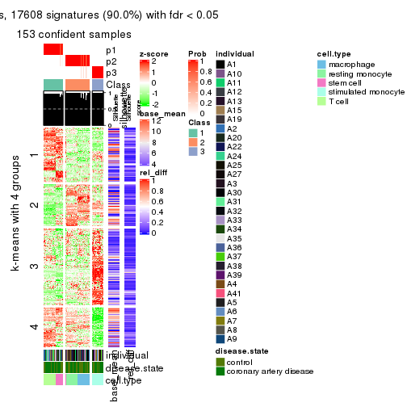</p>

</div>
<div id='tab-SD-pam-get-signatures-3'>
<pre><code class="r">get_signatures(res, k = 4)
</code></pre>

<p></p>

</div>
<div id='tab-SD-pam-get-signatures-4'>
<pre><code class="r">get_signatures(res, k = 5)
</code></pre>

<p></p>

</div>
<div id='tab-SD-pam-get-signatures-5'>
<pre><code class="r">get_signatures(res, k = 6)
</code></pre>

<pre><code>#&gt; Error in mat[ceiling(1:nr/h_ratio), ceiling(1:nc/w_ratio), drop = FALSE]: subscript out of bounds
</code></pre>

<p></p>

</div>
</div>


Signature heatmaps where rows are not scaled:


<script>
$( function() {
	$( '#tabs-SD-pam-get-signatures-no-scale' ).tabs();
} );
</script>
<div id='tabs-SD-pam-get-signatures-no-scale'>
<ul>
<li><a href='#tab-SD-pam-get-signatures-no-scale-1'>k = 2</a></li>
<li><a href='#tab-SD-pam-get-signatures-no-scale-2'>k = 3</a></li>
<li><a href='#tab-SD-pam-get-signatures-no-scale-3'>k = 4</a></li>
<li><a href='#tab-SD-pam-get-signatures-no-scale-4'>k = 5</a></li>
<li><a href='#tab-SD-pam-get-signatures-no-scale-5'>k = 6</a></li>
</ul>
<div id='tab-SD-pam-get-signatures-no-scale-1'>
<pre><code class="r">get_signatures(res, k = 2, scale_rows = FALSE)
</code></pre>

<pre><code>#&gt; Error in mat[ceiling(1:nr/h_ratio), ceiling(1:nc/w_ratio), drop = FALSE]: subscript out of bounds
</code></pre>

<p></p>

</div>
<div id='tab-SD-pam-get-signatures-no-scale-2'>
<pre><code class="r">get_signatures(res, k = 3, scale_rows = FALSE)
</code></pre>

<p></p>

</div>
<div id='tab-SD-pam-get-signatures-no-scale-3'>
<pre><code class="r">get_signatures(res, k = 4, scale_rows = FALSE)
</code></pre>

<p></p>

</div>
<div id='tab-SD-pam-get-signatures-no-scale-4'>
<pre><code class="r">get_signatures(res, k = 5, scale_rows = FALSE)
</code></pre>

<p></p>

</div>
<div id='tab-SD-pam-get-signatures-no-scale-5'>
<pre><code class="r">get_signatures(res, k = 6, scale_rows = FALSE)
</code></pre>

<p>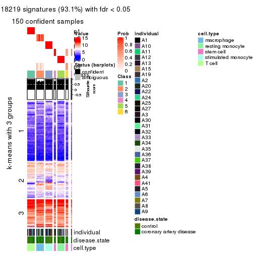</p>

</div>
</div>


Compare the overlap of signatures from different k:

```r
compare_signatures(res)
```


`get_signature()` returns a data frame invisibly. TO get the list of signatures, the function
call should be assigned to a variable explicitly. In following code, if `plot` argument is set
to `FALSE`, no heatmap is plotted while only the differential analysis is performed.

```r
# code only for demonstration
tb = get_signature(res, k = ..., plot = FALSE)
```

An example of the output of `tb` is:

```
#>   which_row         fdr    mean_1    mean_2 scaled_mean_1 scaled_mean_2 km
#> 1        38 0.042760348  8.373488  9.131774    -0.5533452     0.5164555  1
#> 2        40 0.018707592  7.106213  8.469186    -0.6173731     0.5762149  1
#> 3        55 0.019134737 10.221463 11.207825    -0.6159697     0.5749050  1
#> 4        59 0.006059896  5.921854  7.869574    -0.6899429     0.6439467  1
#> 5        60 0.018055526  8.928898 10.211722    -0.6204761     0.5791110  1
#> 6        98 0.009384629 15.714769 14.887706     0.6635654    -0.6193277  2
...
```

The columns in `tb` are:

1. `which_row`: row indices corresponding to the input matrix.
2. `fdr`: FDR for the differential test. 
3. `mean_x`: The mean value in group x.
4. `scaled_mean_x`: The mean value in group x after rows are scaled.
5. `km`: Row groups if k-means clustering is applied to rows.


UMAP plot which shows how samples are separated.


<script>
$( function() {
	$( '#tabs-SD-pam-dimension-reduction' ).tabs();
} );
</script>
<div id='tabs-SD-pam-dimension-reduction'>
<ul>
<li><a href='#tab-SD-pam-dimension-reduction-1'>k = 2</a></li>
<li><a href='#tab-SD-pam-dimension-reduction-2'>k = 3</a></li>
<li><a href='#tab-SD-pam-dimension-reduction-3'>k = 4</a></li>
<li><a href='#tab-SD-pam-dimension-reduction-4'>k = 5</a></li>
<li><a href='#tab-SD-pam-dimension-reduction-5'>k = 6</a></li>
</ul>
<div id='tab-SD-pam-dimension-reduction-1'>
<pre><code class="r">dimension_reduction(res, k = 2, method = &quot;UMAP&quot;)
</code></pre>

<p></p>

</div>
<div id='tab-SD-pam-dimension-reduction-2'>
<pre><code class="r">dimension_reduction(res, k = 3, method = &quot;UMAP&quot;)
</code></pre>

<p></p>

</div>
<div id='tab-SD-pam-dimension-reduction-3'>
<pre><code class="r">dimension_reduction(res, k = 4, method = &quot;UMAP&quot;)
</code></pre>

<p></p>

</div>
<div id='tab-SD-pam-dimension-reduction-4'>
<pre><code class="r">dimension_reduction(res, k = 5, method = &quot;UMAP&quot;)
</code></pre>

<p></p>

</div>
<div id='tab-SD-pam-dimension-reduction-5'>
<pre><code class="r">dimension_reduction(res, k = 6, method = &quot;UMAP&quot;)
</code></pre>

<p></p>

</div>
</div>


Following heatmap shows how subgroups are split when increasing `k`:

```r
collect_classes(res)
```


Test correlation between subgroups and known annotations. If the known
annotation is numeric, one-way ANOVA test is applied, and if the known
annotation is discrete, chi-squared contingency table test is applied.

```r
test_to_known_factors(res)
```

```
#>          n individual(p) disease.state(p) cell.type(p) k
#> SD:pam 152             1            0.839     3.81e-30 2
#> SD:pam 153             1            0.856     1.44e-58 3
#> SD:pam 153             1            0.964     1.16e-90 4
#> SD:pam 153             1            0.989    6.51e-120 5
#> SD:pam 150             1            0.984    2.88e-114 6
```


If matrix rows can be associated to genes, consider to use `functional_enrichment(res,
...)` to perform function enrichment for the signature genes. See [this vignette](http://bioconductor.org/packages/devel/bioc/vignettes/cola/inst/doc/functional_enrichment.html) for more detailed explanations.


 

---------------------------------------------------


### SD:mclust*


The object with results only for a single top-value method and a single partition method 
can be extracted as:

```r
res = res_list["SD", "mclust"]
# you can also extract it by
# res = res_list["SD:mclust"]
```

A summary of `res` and all the functions that can be applied to it:

```r
res
```

```
#> A 'ConsensusPartition' object with k = 2, 3, 4, 5, 6.
#>   On a matrix with 19559 rows and 153 columns.
#>   Top rows (1000, 2000, 3000, 4000, 5000) are extracted by 'SD' method.
#>   Subgroups are detected by 'mclust' method.
#>   Performed in total 1250 partitions by row resampling.
#>   Best k for subgroups seems to be 6.
#> 
#> Following methods can be applied to this 'ConsensusPartition' object:
#>  [1] "cola_report"             "collect_classes"         "collect_plots"          
#>  [4] "collect_stats"           "colnames"                "compare_signatures"     
#>  [7] "consensus_heatmap"       "dimension_reduction"     "functional_enrichment"  
#> [10] "get_anno_col"            "get_anno"                "get_classes"            
#> [13] "get_consensus"           "get_matrix"              "get_membership"         
#> [16] "get_param"               "get_signatures"          "get_stats"              
#> [19] "is_best_k"               "is_stable_k"             "membership_heatmap"     
#> [22] "ncol"                    "nrow"                    "plot_ecdf"              
#> [25] "rownames"                "select_partition_number" "show"                   
#> [28] "suggest_best_k"          "test_to_known_factors"
```

`collect_plots()` function collects all the plots made from `res` for all `k` (number of partitions)
into one single page to provide an easy and fast comparison between different `k`.

```r
collect_plots(res)
```


The plots are:

- The first row: a plot of the ECDF (empirical cumulative distribution
  function) curves of the consensus matrix for each `k` and the heatmap of
  predicted classes for each `k`.
- The second row: heatmaps of the consensus matrix for each `k`.
- The third row: heatmaps of the membership matrix for each `k`.
- The fouth row: heatmaps of the signatures for each `k`.

All the plots in panels can be made by individual functions and they are
plotted later in this section.

`select_partition_number()` produces several plots showing different
statistics for choosing "optimized" `k`. There are following statistics:

- ECDF curves of the consensus matrix for each `k`;
- 1-PAC. [The PAC
  score](https://en.wikipedia.org/wiki/Consensus_clustering#Over-interpretation_potential_of_consensus_clustering)
  measures the proportion of the ambiguous subgrouping.
- Mean silhouette score.
- Concordance. The mean probability of fiting the consensus class ids in all
  partitions.
- Area increased. Denote $A_k$ as the area under the ECDF curve for current
  `k`, the area increased is defined as $A_k - A_{k-1}$.
- Rand index. The percent of pairs of samples that are both in a same cluster
  or both are not in a same cluster in the partition of k and k-1.
- Jaccard index. The ratio of pairs of samples are both in a same cluster in
  the partition of k and k-1 and the pairs of samples are both in a same
  cluster in the partition k or k-1.

The detailed explanations of these statistics can be found in [the _cola_
vignette](http://bioconductor.org/packages/devel/bioc/vignettes/cola/inst/doc/cola.html#toc_13).

Generally speaking, lower PAC score, higher mean silhouette score or higher
concordance corresponds to better partition. Rand index and Jaccard index
measure how similar the current partition is compared to partition with `k-1`.
If they are too similar, we won't accept `k` is better than `k-1`.

```r
select_partition_number(res)
```


The numeric values for all these statistics can be obtained by `get_stats()`.

```r
get_stats(res)
```

```
#>   k 1-PAC mean_silhouette concordance area_increased  Rand Jaccard
#> 2 2 0.540           0.745       0.863         0.4847 0.508   0.508
#> 3 3 0.810           0.959       0.971         0.3150 0.719   0.507
#> 4 4 1.000           1.000       1.000         0.1163 0.939   0.825
#> 5 5 1.000           0.996       0.998         0.1262 0.910   0.689
#> 6 6 0.936           0.833       0.907        -0.0041 0.914   0.664
```

`suggest_best_k()` suggests the best $k$ based on these statistics. The rules are as follows:

- All $k$ with Jaccard index larger than 0.95 are removed because increasing
  $k$ does not provide enough extra information. If all $k$ are removed, it is
  marked as no subgroup is detected.
- For all $k$ with 1-PAC score larger than 0.9, the maximal $k$ is taken as
  the best $k$, and other $k$ are marked as optional $k$.
- If it does not fit the second rule. The $k$ with the maximal vote of the
  highest 1-PAC score, highest mean silhouette, and highest concordance is
  taken as the best $k$.

```r
suggest_best_k(res)
```

```
#> [1] 6
#> attr(,"optional")
#> [1] 4 5
```

There is also optional best $k$ = 4 5 that is worth to check.

Following shows the table of the partitions (You need to click the **show/hide
code output** link to see it). The membership matrix (columns with name `p*`)
is inferred by
[`clue::cl_consensus()`](https://www.rdocumentation.org/link/cl_consensus?package=clue)
function with the `SE` method. Basically the value in the membership matrix
represents the probability to belong to a certain group. The finall class
label for an item is determined with the group with highest probability it
belongs to.

In `get_classes()` function, the entropy is calculated from the membership
matrix and the silhouette score is calculated from the consensus matrix.


<script>
$( function() {
	$( '#tabs-SD-mclust-get-classes' ).tabs();
} );
</script>
<div id='tabs-SD-mclust-get-classes'>
<ul>
<li><a href='#tab-SD-mclust-get-classes-1'>k = 2</a></li>
<li><a href='#tab-SD-mclust-get-classes-2'>k = 3</a></li>
<li><a href='#tab-SD-mclust-get-classes-3'>k = 4</a></li>
<li><a href='#tab-SD-mclust-get-classes-4'>k = 5</a></li>
<li><a href='#tab-SD-mclust-get-classes-5'>k = 6</a></li>
</ul>

<div id='tab-SD-mclust-get-classes-1'>
<p><a id='tab-SD-mclust-get-classes-1-a' style='color:#0366d6' href='#'>show/hide code output</a></p>
<pre><code class="r">cbind(get_classes(res, k = 2), get_membership(res, k = 2))
</code></pre>

<pre><code>#&gt;           class entropy silhouette    p1    p2
#&gt; GSM247795     2   0.949      0.854 0.368 0.632
#&gt; GSM247854     2   0.949      0.854 0.368 0.632
#&gt; GSM247758     2   0.949      0.854 0.368 0.632
#&gt; GSM247742     2   0.278      0.493 0.048 0.952
#&gt; GSM247755     1   0.000      0.680 1.000 0.000
#&gt; GSM247841     1   0.949      0.764 0.632 0.368
#&gt; GSM247703     2   0.949      0.854 0.368 0.632
#&gt; GSM247739     2   0.949      0.854 0.368 0.632
#&gt; GSM247715     2   0.278      0.493 0.048 0.952
#&gt; GSM247829     1   0.000      0.680 1.000 0.000
#&gt; GSM247842     1   0.949      0.764 0.632 0.368
#&gt; GSM247805     2   0.949      0.854 0.368 0.632
#&gt; GSM247786     2   0.949      0.854 0.368 0.632
#&gt; GSM247812     1   0.000      0.680 1.000 0.000
#&gt; GSM247776     1   0.949      0.764 0.632 0.368
#&gt; GSM247850     1   0.949      0.764 0.632 0.368
#&gt; GSM247717     2   0.949      0.854 0.368 0.632
#&gt; GSM247784     2   0.949      0.854 0.368 0.632
#&gt; GSM247834     2   0.278      0.493 0.048 0.952
#&gt; GSM247783     1   0.000      0.680 1.000 0.000
#&gt; GSM247846     1   0.949      0.764 0.632 0.368
#&gt; GSM247822     2   0.949      0.854 0.368 0.632
#&gt; GSM247710     2   0.949      0.854 0.368 0.632
#&gt; GSM247713     2   0.278      0.493 0.048 0.952
#&gt; GSM247840     1   0.000      0.680 1.000 0.000
#&gt; GSM247733     1   0.949      0.764 0.632 0.368
#&gt; GSM247852     1   0.949      0.764 0.632 0.368
#&gt; GSM247790     2   0.949      0.854 0.368 0.632
#&gt; GSM247730     2   0.949      0.854 0.368 0.632
#&gt; GSM247824     1   0.000      0.680 1.000 0.000
#&gt; GSM247770     1   0.949      0.764 0.632 0.368
#&gt; GSM247711     2   0.949      0.854 0.368 0.632
#&gt; GSM247782     2   0.949      0.854 0.368 0.632
#&gt; GSM247836     2   0.278      0.493 0.048 0.952
#&gt; GSM247785     1   0.000      0.680 1.000 0.000
#&gt; GSM247847     1   0.949      0.764 0.632 0.368
#&gt; GSM247750     2   0.949      0.854 0.368 0.632
#&gt; GSM247788     2   0.949      0.854 0.368 0.632
#&gt; GSM247849     2   0.278      0.493 0.048 0.952
#&gt; GSM247772     1   0.000      0.680 1.000 0.000
#&gt; GSM247760     1   0.949      0.764 0.632 0.368
#&gt; GSM247764     2   0.949      0.854 0.368 0.632
#&gt; GSM247851     2   0.949      0.854 0.368 0.632
#&gt; GSM247714     2   0.949      0.854 0.368 0.632
#&gt; GSM247828     2   0.278      0.493 0.048 0.952
#&gt; GSM247704     1   0.000      0.680 1.000 0.000
#&gt; GSM247818     1   0.949      0.764 0.632 0.368
#&gt; GSM247823     2   0.949      0.854 0.368 0.632
#&gt; GSM247706     2   0.949      0.854 0.368 0.632
#&gt; GSM247835     1   0.000      0.680 1.000 0.000
#&gt; GSM247734     1   0.949      0.764 0.632 0.368
#&gt; GSM247819     2   0.949      0.854 0.368 0.632
#&gt; GSM247809     2   0.949      0.854 0.368 0.632
#&gt; GSM247830     1   0.000      0.680 1.000 0.000
#&gt; GSM247833     1   0.949      0.764 0.632 0.368
#&gt; GSM247738     2   0.949      0.854 0.368 0.632
#&gt; GSM247716     2   0.949      0.854 0.368 0.632
#&gt; GSM247747     1   0.000      0.680 1.000 0.000
#&gt; GSM247722     1   0.949      0.764 0.632 0.368
#&gt; GSM247816     2   0.949      0.854 0.368 0.632
#&gt; GSM247839     2   0.949      0.854 0.368 0.632
#&gt; GSM247821     2   0.278      0.493 0.048 0.952
#&gt; GSM247798     1   0.000      0.680 1.000 0.000
#&gt; GSM247838     1   0.949      0.764 0.632 0.368
#&gt; GSM247721     2   0.949      0.854 0.368 0.632
#&gt; GSM247781     2   0.949      0.854 0.368 0.632
#&gt; GSM247762     2   0.278      0.493 0.048 0.952
#&gt; GSM247825     1   0.000      0.680 1.000 0.000
#&gt; GSM247777     1   0.949      0.764 0.632 0.368
#&gt; GSM247761     2   0.949      0.854 0.368 0.632
#&gt; GSM247720     2   0.949      0.854 0.368 0.632
#&gt; GSM247814     1   0.000      0.680 1.000 0.000
#&gt; GSM247732     1   0.949      0.764 0.632 0.368
#&gt; GSM247708     2   0.949      0.854 0.368 0.632
#&gt; GSM247740     2   0.949      0.854 0.368 0.632
#&gt; GSM247749     2   0.278      0.493 0.048 0.952
#&gt; GSM247767     1   0.000      0.680 1.000 0.000
#&gt; GSM247748     1   0.949      0.764 0.632 0.368
#&gt; GSM247705     2   0.949      0.854 0.368 0.632
#&gt; GSM247746     2   0.949      0.854 0.368 0.632
#&gt; GSM247752     2   0.278      0.493 0.048 0.952
#&gt; GSM247769     1   0.000      0.680 1.000 0.000
#&gt; GSM247753     1   0.949      0.764 0.632 0.368
#&gt; GSM247723     2   0.949      0.854 0.368 0.632
#&gt; GSM247779     2   0.949      0.854 0.368 0.632
#&gt; GSM247756     2   0.278      0.493 0.048 0.952
#&gt; GSM247826     1   0.000      0.680 1.000 0.000
#&gt; GSM247775     1   0.949      0.764 0.632 0.368
#&gt; GSM247741     2   0.949      0.854 0.368 0.632
#&gt; GSM247799     2   0.949      0.854 0.368 0.632
#&gt; GSM247778     2   0.278      0.493 0.048 0.952
#&gt; GSM247806     1   0.000      0.680 1.000 0.000
#&gt; GSM247815     1   0.949      0.764 0.632 0.368
#&gt; GSM247735     2   0.949      0.854 0.368 0.632
#&gt; GSM247831     2   0.949      0.854 0.368 0.632
#&gt; GSM247845     2   0.278      0.493 0.048 0.952
#&gt; GSM247791     1   0.000      0.680 1.000 0.000
#&gt; GSM247780     1   0.949      0.764 0.632 0.368
#&gt; GSM247853     1   0.949      0.764 0.632 0.368
#&gt; GSM247800     2   0.949      0.854 0.368 0.632
#&gt; GSM247729     2   0.949      0.854 0.368 0.632
#&gt; GSM247810     2   0.278      0.493 0.048 0.952
#&gt; GSM247844     1   0.000      0.680 1.000 0.000
#&gt; GSM247793     1   0.949      0.764 0.632 0.368
#&gt; GSM247759     2   0.949      0.854 0.368 0.632
#&gt; GSM247724     2   0.949      0.854 0.368 0.632
#&gt; GSM247817     1   0.000      0.680 1.000 0.000
#&gt; GSM247727     1   0.949      0.764 0.632 0.368
#&gt; GSM247796     2   0.949      0.854 0.368 0.632
#&gt; GSM247725     2   0.949      0.854 0.368 0.632
#&gt; GSM247801     2   0.278      0.493 0.048 0.952
#&gt; GSM247731     1   0.000      0.680 1.000 0.000
#&gt; GSM247765     1   0.949      0.764 0.632 0.368
#&gt; GSM247792     2   0.949      0.854 0.368 0.632
#&gt; GSM247726     2   0.949      0.854 0.368 0.632
#&gt; GSM247803     2   0.278      0.493 0.048 0.952
#&gt; GSM247728     1   0.000      0.680 1.000 0.000
#&gt; GSM247768     1   0.949      0.764 0.632 0.368
#&gt; GSM247745     2   0.949      0.854 0.368 0.632
#&gt; GSM247855     2   0.949      0.854 0.368 0.632
#&gt; GSM247804     2   0.949      0.854 0.368 0.632
#&gt; GSM247774     2   0.278      0.493 0.048 0.952
#&gt; GSM247807     1   0.000      0.680 1.000 0.000
#&gt; GSM247813     1   0.949      0.764 0.632 0.368
#&gt; GSM247736     2   0.949      0.854 0.368 0.632
#&gt; GSM247712     2   0.949      0.854 0.368 0.632
#&gt; GSM247797     2   0.278      0.493 0.048 0.952
#&gt; GSM247743     1   0.000      0.680 1.000 0.000
#&gt; GSM247719     1   0.949      0.764 0.632 0.368
#&gt; GSM247707     2   0.949      0.854 0.368 0.632
#&gt; GSM247737     2   0.949      0.854 0.368 0.632
#&gt; GSM247827     1   0.000      0.680 1.000 0.000
#&gt; GSM247848     1   0.949      0.764 0.632 0.368
#&gt; GSM247794     2   0.949      0.854 0.368 0.632
#&gt; GSM247757     2   0.949      0.854 0.368 0.632
#&gt; GSM247744     2   0.278      0.493 0.048 0.952
#&gt; GSM247751     1   0.000      0.680 1.000 0.000
#&gt; GSM247837     1   0.949      0.764 0.632 0.368
#&gt; GSM247754     2   0.949      0.854 0.368 0.632
#&gt; GSM247789     2   0.949      0.854 0.368 0.632
#&gt; GSM247802     2   0.278      0.493 0.048 0.952
#&gt; GSM247771     1   0.000      0.680 1.000 0.000
#&gt; GSM247763     1   0.949      0.764 0.632 0.368
#&gt; GSM247808     2   0.949      0.854 0.368 0.632
#&gt; GSM247787     2   0.949      0.854 0.368 0.632
#&gt; GSM247843     2   0.278      0.493 0.048 0.952
#&gt; GSM247811     1   0.000      0.680 1.000 0.000
#&gt; GSM247773     1   0.949      0.764 0.632 0.368
#&gt; GSM247766     2   0.949      0.854 0.368 0.632
#&gt; GSM247718     2   0.949      0.854 0.368 0.632
#&gt; GSM247832     2   0.278      0.493 0.048 0.952
#&gt; GSM247709     1   0.000      0.680 1.000 0.000
#&gt; GSM247820     1   0.949      0.764 0.632 0.368
</code></pre>

<script>
$('#tab-SD-mclust-get-classes-1-a').parent().next().next().hide();
$('#tab-SD-mclust-get-classes-1-a').click(function(){
  $('#tab-SD-mclust-get-classes-1-a').parent().next().next().toggle();
  return(false);
});
</script>
</div>

<div id='tab-SD-mclust-get-classes-2'>
<p><a id='tab-SD-mclust-get-classes-2-a' style='color:#0366d6' href='#'>show/hide code output</a></p>
<pre><code class="r">cbind(get_classes(res, k = 3), get_membership(res, k = 3))
</code></pre>

<pre><code>#&gt;           class entropy silhouette p1    p2    p3
#&gt; GSM247795     2   0.000      1.000  0 1.000 0.000
#&gt; GSM247854     2   0.000      1.000  0 1.000 0.000
#&gt; GSM247758     2   0.000      1.000  0 1.000 0.000
#&gt; GSM247742     3   0.445      0.861  0 0.192 0.808
#&gt; GSM247755     3   0.000      0.898  0 0.000 1.000
#&gt; GSM247841     1   0.000      1.000  1 0.000 0.000
#&gt; GSM247703     2   0.000      1.000  0 1.000 0.000
#&gt; GSM247739     2   0.000      1.000  0 1.000 0.000
#&gt; GSM247715     3   0.445      0.861  0 0.192 0.808
#&gt; GSM247829     3   0.000      0.898  0 0.000 1.000
#&gt; GSM247842     1   0.000      1.000  1 0.000 0.000
#&gt; GSM247805     2   0.000      1.000  0 1.000 0.000
#&gt; GSM247786     2   0.000      1.000  0 1.000 0.000
#&gt; GSM247812     3   0.000      0.898  0 0.000 1.000
#&gt; GSM247776     1   0.000      1.000  1 0.000 0.000
#&gt; GSM247850     1   0.000      1.000  1 0.000 0.000
#&gt; GSM247717     2   0.000      1.000  0 1.000 0.000
#&gt; GSM247784     2   0.000      1.000  0 1.000 0.000
#&gt; GSM247834     3   0.445      0.861  0 0.192 0.808
#&gt; GSM247783     3   0.000      0.898  0 0.000 1.000
#&gt; GSM247846     1   0.000      1.000  1 0.000 0.000
#&gt; GSM247822     2   0.000      1.000  0 1.000 0.000
#&gt; GSM247710     2   0.000      1.000  0 1.000 0.000
#&gt; GSM247713     3   0.445      0.861  0 0.192 0.808
#&gt; GSM247840     3   0.000      0.898  0 0.000 1.000
#&gt; GSM247733     1   0.000      1.000  1 0.000 0.000
#&gt; GSM247852     1   0.000      1.000  1 0.000 0.000
#&gt; GSM247790     2   0.000      1.000  0 1.000 0.000
#&gt; GSM247730     2   0.000      1.000  0 1.000 0.000
#&gt; GSM247824     3   0.000      0.898  0 0.000 1.000
#&gt; GSM247770     1   0.000      1.000  1 0.000 0.000
#&gt; GSM247711     2   0.000      1.000  0 1.000 0.000
#&gt; GSM247782     2   0.000      1.000  0 1.000 0.000
#&gt; GSM247836     3   0.445      0.861  0 0.192 0.808
#&gt; GSM247785     3   0.000      0.898  0 0.000 1.000
#&gt; GSM247847     1   0.000      1.000  1 0.000 0.000
#&gt; GSM247750     2   0.000      1.000  0 1.000 0.000
#&gt; GSM247788     2   0.000      1.000  0 1.000 0.000
#&gt; GSM247849     3   0.445      0.861  0 0.192 0.808
#&gt; GSM247772     3   0.000      0.898  0 0.000 1.000
#&gt; GSM247760     1   0.000      1.000  1 0.000 0.000
#&gt; GSM247764     2   0.000      1.000  0 1.000 0.000
#&gt; GSM247851     2   0.000      1.000  0 1.000 0.000
#&gt; GSM247714     2   0.000      1.000  0 1.000 0.000
#&gt; GSM247828     3   0.445      0.861  0 0.192 0.808
#&gt; GSM247704     3   0.000      0.898  0 0.000 1.000
#&gt; GSM247818     1   0.000      1.000  1 0.000 0.000
#&gt; GSM247823     2   0.000      1.000  0 1.000 0.000
#&gt; GSM247706     2   0.000      1.000  0 1.000 0.000
#&gt; GSM247835     3   0.000      0.898  0 0.000 1.000
#&gt; GSM247734     1   0.000      1.000  1 0.000 0.000
#&gt; GSM247819     2   0.000      1.000  0 1.000 0.000
#&gt; GSM247809     2   0.000      1.000  0 1.000 0.000
#&gt; GSM247830     3   0.000      0.898  0 0.000 1.000
#&gt; GSM247833     1   0.000      1.000  1 0.000 0.000
#&gt; GSM247738     2   0.000      1.000  0 1.000 0.000
#&gt; GSM247716     2   0.000      1.000  0 1.000 0.000
#&gt; GSM247747     3   0.000      0.898  0 0.000 1.000
#&gt; GSM247722     1   0.000      1.000  1 0.000 0.000
#&gt; GSM247816     2   0.000      1.000  0 1.000 0.000
#&gt; GSM247839     2   0.000      1.000  0 1.000 0.000
#&gt; GSM247821     3   0.445      0.861  0 0.192 0.808
#&gt; GSM247798     3   0.000      0.898  0 0.000 1.000
#&gt; GSM247838     1   0.000      1.000  1 0.000 0.000
#&gt; GSM247721     2   0.000      1.000  0 1.000 0.000
#&gt; GSM247781     2   0.000      1.000  0 1.000 0.000
#&gt; GSM247762     3   0.445      0.861  0 0.192 0.808
#&gt; GSM247825     3   0.000      0.898  0 0.000 1.000
#&gt; GSM247777     1   0.000      1.000  1 0.000 0.000
#&gt; GSM247761     2   0.000      1.000  0 1.000 0.000
#&gt; GSM247720     2   0.000      1.000  0 1.000 0.000
#&gt; GSM247814     3   0.000      0.898  0 0.000 1.000
#&gt; GSM247732     1   0.000      1.000  1 0.000 0.000
#&gt; GSM247708     2   0.000      1.000  0 1.000 0.000
#&gt; GSM247740     2   0.000      1.000  0 1.000 0.000
#&gt; GSM247749     3   0.445      0.861  0 0.192 0.808
#&gt; GSM247767     3   0.000      0.898  0 0.000 1.000
#&gt; GSM247748     1   0.000      1.000  1 0.000 0.000
#&gt; GSM247705     2   0.000      1.000  0 1.000 0.000
#&gt; GSM247746     2   0.000      1.000  0 1.000 0.000
#&gt; GSM247752     3   0.445      0.861  0 0.192 0.808
#&gt; GSM247769     3   0.000      0.898  0 0.000 1.000
#&gt; GSM247753     1   0.000      1.000  1 0.000 0.000
#&gt; GSM247723     2   0.000      1.000  0 1.000 0.000
#&gt; GSM247779     2   0.000      1.000  0 1.000 0.000
#&gt; GSM247756     3   0.445      0.861  0 0.192 0.808
#&gt; GSM247826     3   0.000      0.898  0 0.000 1.000
#&gt; GSM247775     1   0.000      1.000  1 0.000 0.000
#&gt; GSM247741     2   0.000      1.000  0 1.000 0.000
#&gt; GSM247799     2   0.000      1.000  0 1.000 0.000
#&gt; GSM247778     3   0.445      0.861  0 0.192 0.808
#&gt; GSM247806     3   0.000      0.898  0 0.000 1.000
#&gt; GSM247815     1   0.000      1.000  1 0.000 0.000
#&gt; GSM247735     2   0.000      1.000  0 1.000 0.000
#&gt; GSM247831     2   0.000      1.000  0 1.000 0.000
#&gt; GSM247845     3   0.445      0.861  0 0.192 0.808
#&gt; GSM247791     3   0.000      0.898  0 0.000 1.000
#&gt; GSM247780     1   0.000      1.000  1 0.000 0.000
#&gt; GSM247853     1   0.000      1.000  1 0.000 0.000
#&gt; GSM247800     2   0.000      1.000  0 1.000 0.000
#&gt; GSM247729     2   0.000      1.000  0 1.000 0.000
#&gt; GSM247810     3   0.445      0.861  0 0.192 0.808
#&gt; GSM247844     3   0.000      0.898  0 0.000 1.000
#&gt; GSM247793     1   0.000      1.000  1 0.000 0.000
#&gt; GSM247759     2   0.000      1.000  0 1.000 0.000
#&gt; GSM247724     2   0.000      1.000  0 1.000 0.000
#&gt; GSM247817     3   0.000      0.898  0 0.000 1.000
#&gt; GSM247727     1   0.000      1.000  1 0.000 0.000
#&gt; GSM247796     2   0.000      1.000  0 1.000 0.000
#&gt; GSM247725     2   0.000      1.000  0 1.000 0.000
#&gt; GSM247801     3   0.445      0.861  0 0.192 0.808
#&gt; GSM247731     3   0.000      0.898  0 0.000 1.000
#&gt; GSM247765     1   0.000      1.000  1 0.000 0.000
#&gt; GSM247792     2   0.000      1.000  0 1.000 0.000
#&gt; GSM247726     2   0.000      1.000  0 1.000 0.000
#&gt; GSM247803     3   0.445      0.861  0 0.192 0.808
#&gt; GSM247728     3   0.000      0.898  0 0.000 1.000
#&gt; GSM247768     1   0.000      1.000  1 0.000 0.000
#&gt; GSM247745     2   0.000      1.000  0 1.000 0.000
#&gt; GSM247855     2   0.000      1.000  0 1.000 0.000
#&gt; GSM247804     2   0.000      1.000  0 1.000 0.000
#&gt; GSM247774     3   0.445      0.861  0 0.192 0.808
#&gt; GSM247807     3   0.000      0.898  0 0.000 1.000
#&gt; GSM247813     1   0.000      1.000  1 0.000 0.000
#&gt; GSM247736     2   0.000      1.000  0 1.000 0.000
#&gt; GSM247712     2   0.000      1.000  0 1.000 0.000
#&gt; GSM247797     3   0.445      0.861  0 0.192 0.808
#&gt; GSM247743     3   0.000      0.898  0 0.000 1.000
#&gt; GSM247719     1   0.000      1.000  1 0.000 0.000
#&gt; GSM247707     2   0.000      1.000  0 1.000 0.000
#&gt; GSM247737     2   0.000      1.000  0 1.000 0.000
#&gt; GSM247827     3   0.000      0.898  0 0.000 1.000
#&gt; GSM247848     1   0.000      1.000  1 0.000 0.000
#&gt; GSM247794     2   0.000      1.000  0 1.000 0.000
#&gt; GSM247757     2   0.000      1.000  0 1.000 0.000
#&gt; GSM247744     3   0.445      0.861  0 0.192 0.808
#&gt; GSM247751     3   0.000      0.898  0 0.000 1.000
#&gt; GSM247837     1   0.000      1.000  1 0.000 0.000
#&gt; GSM247754     2   0.000      1.000  0 1.000 0.000
#&gt; GSM247789     2   0.000      1.000  0 1.000 0.000
#&gt; GSM247802     3   0.445      0.861  0 0.192 0.808
#&gt; GSM247771     3   0.000      0.898  0 0.000 1.000
#&gt; GSM247763     1   0.000      1.000  1 0.000 0.000
#&gt; GSM247808     2   0.000      1.000  0 1.000 0.000
#&gt; GSM247787     2   0.000      1.000  0 1.000 0.000
#&gt; GSM247843     3   0.445      0.861  0 0.192 0.808
#&gt; GSM247811     3   0.000      0.898  0 0.000 1.000
#&gt; GSM247773     1   0.000      1.000  1 0.000 0.000
#&gt; GSM247766     2   0.000      1.000  0 1.000 0.000
#&gt; GSM247718     2   0.000      1.000  0 1.000 0.000
#&gt; GSM247832     3   0.445      0.861  0 0.192 0.808
#&gt; GSM247709     3   0.000      0.898  0 0.000 1.000
#&gt; GSM247820     1   0.000      1.000  1 0.000 0.000
</code></pre>

<script>
$('#tab-SD-mclust-get-classes-2-a').parent().next().next().hide();
$('#tab-SD-mclust-get-classes-2-a').click(function(){
  $('#tab-SD-mclust-get-classes-2-a').parent().next().next().toggle();
  return(false);
});
</script>
</div>

<div id='tab-SD-mclust-get-classes-3'>
<p><a id='tab-SD-mclust-get-classes-3-a' style='color:#0366d6' href='#'>show/hide code output</a></p>
<pre><code class="r">cbind(get_classes(res, k = 4), get_membership(res, k = 4))
</code></pre>

<pre><code>#&gt;           class entropy silhouette p1 p2 p3 p4
#&gt; GSM247795     2       0          1  0  1  0  0
#&gt; GSM247854     2       0          1  0  1  0  0
#&gt; GSM247758     2       0          1  0  1  0  0
#&gt; GSM247742     4       0          1  0  0  0  1
#&gt; GSM247755     3       0          1  0  0  1  0
#&gt; GSM247841     1       0          1  1  0  0  0
#&gt; GSM247703     2       0          1  0  1  0  0
#&gt; GSM247739     2       0          1  0  1  0  0
#&gt; GSM247715     4       0          1  0  0  0  1
#&gt; GSM247829     3       0          1  0  0  1  0
#&gt; GSM247842     1       0          1  1  0  0  0
#&gt; GSM247805     2       0          1  0  1  0  0
#&gt; GSM247786     2       0          1  0  1  0  0
#&gt; GSM247812     3       0          1  0  0  1  0
#&gt; GSM247776     1       0          1  1  0  0  0
#&gt; GSM247850     1       0          1  1  0  0  0
#&gt; GSM247717     2       0          1  0  1  0  0
#&gt; GSM247784     2       0          1  0  1  0  0
#&gt; GSM247834     4       0          1  0  0  0  1
#&gt; GSM247783     3       0          1  0  0  1  0
#&gt; GSM247846     1       0          1  1  0  0  0
#&gt; GSM247822     2       0          1  0  1  0  0
#&gt; GSM247710     2       0          1  0  1  0  0
#&gt; GSM247713     4       0          1  0  0  0  1
#&gt; GSM247840     3       0          1  0  0  1  0
#&gt; GSM247733     1       0          1  1  0  0  0
#&gt; GSM247852     1       0          1  1  0  0  0
#&gt; GSM247790     2       0          1  0  1  0  0
#&gt; GSM247730     2       0          1  0  1  0  0
#&gt; GSM247824     3       0          1  0  0  1  0
#&gt; GSM247770     1       0          1  1  0  0  0
#&gt; GSM247711     2       0          1  0  1  0  0
#&gt; GSM247782     2       0          1  0  1  0  0
#&gt; GSM247836     4       0          1  0  0  0  1
#&gt; GSM247785     3       0          1  0  0  1  0
#&gt; GSM247847     1       0          1  1  0  0  0
#&gt; GSM247750     2       0          1  0  1  0  0
#&gt; GSM247788     2       0          1  0  1  0  0
#&gt; GSM247849     4       0          1  0  0  0  1
#&gt; GSM247772     3       0          1  0  0  1  0
#&gt; GSM247760     1       0          1  1  0  0  0
#&gt; GSM247764     2       0          1  0  1  0  0
#&gt; GSM247851     2       0          1  0  1  0  0
#&gt; GSM247714     2       0          1  0  1  0  0
#&gt; GSM247828     4       0          1  0  0  0  1
#&gt; GSM247704     3       0          1  0  0  1  0
#&gt; GSM247818     1       0          1  1  0  0  0
#&gt; GSM247823     2       0          1  0  1  0  0
#&gt; GSM247706     2       0          1  0  1  0  0
#&gt; GSM247835     3       0          1  0  0  1  0
#&gt; GSM247734     1       0          1  1  0  0  0
#&gt; GSM247819     2       0          1  0  1  0  0
#&gt; GSM247809     2       0          1  0  1  0  0
#&gt; GSM247830     3       0          1  0  0  1  0
#&gt; GSM247833     1       0          1  1  0  0  0
#&gt; GSM247738     2       0          1  0  1  0  0
#&gt; GSM247716     2       0          1  0  1  0  0
#&gt; GSM247747     3       0          1  0  0  1  0
#&gt; GSM247722     1       0          1  1  0  0  0
#&gt; GSM247816     2       0          1  0  1  0  0
#&gt; GSM247839     2       0          1  0  1  0  0
#&gt; GSM247821     4       0          1  0  0  0  1
#&gt; GSM247798     3       0          1  0  0  1  0
#&gt; GSM247838     1       0          1  1  0  0  0
#&gt; GSM247721     2       0          1  0  1  0  0
#&gt; GSM247781     2       0          1  0  1  0  0
#&gt; GSM247762     4       0          1  0  0  0  1
#&gt; GSM247825     3       0          1  0  0  1  0
#&gt; GSM247777     1       0          1  1  0  0  0
#&gt; GSM247761     2       0          1  0  1  0  0
#&gt; GSM247720     2       0          1  0  1  0  0
#&gt; GSM247814     3       0          1  0  0  1  0
#&gt; GSM247732     1       0          1  1  0  0  0
#&gt; GSM247708     2       0          1  0  1  0  0
#&gt; GSM247740     2       0          1  0  1  0  0
#&gt; GSM247749     4       0          1  0  0  0  1
#&gt; GSM247767     3       0          1  0  0  1  0
#&gt; GSM247748     1       0          1  1  0  0  0
#&gt; GSM247705     2       0          1  0  1  0  0
#&gt; GSM247746     2       0          1  0  1  0  0
#&gt; GSM247752     4       0          1  0  0  0  1
#&gt; GSM247769     3       0          1  0  0  1  0
#&gt; GSM247753     1       0          1  1  0  0  0
#&gt; GSM247723     2       0          1  0  1  0  0
#&gt; GSM247779     2       0          1  0  1  0  0
#&gt; GSM247756     4       0          1  0  0  0  1
#&gt; GSM247826     3       0          1  0  0  1  0
#&gt; GSM247775     1       0          1  1  0  0  0
#&gt; GSM247741     2       0          1  0  1  0  0
#&gt; GSM247799     2       0          1  0  1  0  0
#&gt; GSM247778     4       0          1  0  0  0  1
#&gt; GSM247806     3       0          1  0  0  1  0
#&gt; GSM247815     1       0          1  1  0  0  0
#&gt; GSM247735     2       0          1  0  1  0  0
#&gt; GSM247831     2       0          1  0  1  0  0
#&gt; GSM247845     4       0          1  0  0  0  1
#&gt; GSM247791     3       0          1  0  0  1  0
#&gt; GSM247780     1       0          1  1  0  0  0
#&gt; GSM247853     1       0          1  1  0  0  0
#&gt; GSM247800     2       0          1  0  1  0  0
#&gt; GSM247729     2       0          1  0  1  0  0
#&gt; GSM247810     4       0          1  0  0  0  1
#&gt; GSM247844     3       0          1  0  0  1  0
#&gt; GSM247793     1       0          1  1  0  0  0
#&gt; GSM247759     2       0          1  0  1  0  0
#&gt; GSM247724     2       0          1  0  1  0  0
#&gt; GSM247817     3       0          1  0  0  1  0
#&gt; GSM247727     1       0          1  1  0  0  0
#&gt; GSM247796     2       0          1  0  1  0  0
#&gt; GSM247725     2       0          1  0  1  0  0
#&gt; GSM247801     4       0          1  0  0  0  1
#&gt; GSM247731     3       0          1  0  0  1  0
#&gt; GSM247765     1       0          1  1  0  0  0
#&gt; GSM247792     2       0          1  0  1  0  0
#&gt; GSM247726     2       0          1  0  1  0  0
#&gt; GSM247803     4       0          1  0  0  0  1
#&gt; GSM247728     3       0          1  0  0  1  0
#&gt; GSM247768     1       0          1  1  0  0  0
#&gt; GSM247745     2       0          1  0  1  0  0
#&gt; GSM247855     2       0          1  0  1  0  0
#&gt; GSM247804     2       0          1  0  1  0  0
#&gt; GSM247774     4       0          1  0  0  0  1
#&gt; GSM247807     3       0          1  0  0  1  0
#&gt; GSM247813     1       0          1  1  0  0  0
#&gt; GSM247736     2       0          1  0  1  0  0
#&gt; GSM247712     2       0          1  0  1  0  0
#&gt; GSM247797     4       0          1  0  0  0  1
#&gt; GSM247743     3       0          1  0  0  1  0
#&gt; GSM247719     1       0          1  1  0  0  0
#&gt; GSM247707     2       0          1  0  1  0  0
#&gt; GSM247737     2       0          1  0  1  0  0
#&gt; GSM247827     3       0          1  0  0  1  0
#&gt; GSM247848     1       0          1  1  0  0  0
#&gt; GSM247794     2       0          1  0  1  0  0
#&gt; GSM247757     2       0          1  0  1  0  0
#&gt; GSM247744     4       0          1  0  0  0  1
#&gt; GSM247751     3       0          1  0  0  1  0
#&gt; GSM247837     1       0          1  1  0  0  0
#&gt; GSM247754     2       0          1  0  1  0  0
#&gt; GSM247789     2       0          1  0  1  0  0
#&gt; GSM247802     4       0          1  0  0  0  1
#&gt; GSM247771     3       0          1  0  0  1  0
#&gt; GSM247763     1       0          1  1  0  0  0
#&gt; GSM247808     2       0          1  0  1  0  0
#&gt; GSM247787     2       0          1  0  1  0  0
#&gt; GSM247843     4       0          1  0  0  0  1
#&gt; GSM247811     3       0          1  0  0  1  0
#&gt; GSM247773     1       0          1  1  0  0  0
#&gt; GSM247766     2       0          1  0  1  0  0
#&gt; GSM247718     2       0          1  0  1  0  0
#&gt; GSM247832     4       0          1  0  0  0  1
#&gt; GSM247709     3       0          1  0  0  1  0
#&gt; GSM247820     1       0          1  1  0  0  0
</code></pre>

<script>
$('#tab-SD-mclust-get-classes-3-a').parent().next().next().hide();
$('#tab-SD-mclust-get-classes-3-a').click(function(){
  $('#tab-SD-mclust-get-classes-3-a').parent().next().next().toggle();
  return(false);
});
</script>
</div>

<div id='tab-SD-mclust-get-classes-4'>
<p><a id='tab-SD-mclust-get-classes-4-a' style='color:#0366d6' href='#'>show/hide code output</a></p>
<pre><code class="r">cbind(get_classes(res, k = 5), get_membership(res, k = 5))
</code></pre>

<pre><code>#&gt;           class entropy silhouette p1    p2 p3 p4    p5
#&gt; GSM247795     2  0.0000      0.994  0 1.000  0  0 0.000
#&gt; GSM247854     2  0.0000      0.994  0 1.000  0  0 0.000
#&gt; GSM247758     5  0.0000      0.997  0 0.000  0  0 1.000
#&gt; GSM247742     4  0.0000      1.000  0 0.000  0  1 0.000
#&gt; GSM247755     3  0.0000      1.000  0 0.000  1  0 0.000
#&gt; GSM247841     1  0.0000      1.000  1 0.000  0  0 0.000
#&gt; GSM247703     2  0.0000      0.994  0 1.000  0  0 0.000
#&gt; GSM247739     5  0.0000      0.997  0 0.000  0  0 1.000
#&gt; GSM247715     4  0.0000      1.000  0 0.000  0  1 0.000
#&gt; GSM247829     3  0.0000      1.000  0 0.000  1  0 0.000
#&gt; GSM247842     1  0.0000      1.000  1 0.000  0  0 0.000
#&gt; GSM247805     2  0.0000      0.994  0 1.000  0  0 0.000
#&gt; GSM247786     5  0.0000      0.997  0 0.000  0  0 1.000
#&gt; GSM247812     3  0.0000      1.000  0 0.000  1  0 0.000
#&gt; GSM247776     1  0.0000      1.000  1 0.000  0  0 0.000
#&gt; GSM247850     1  0.0000      1.000  1 0.000  0  0 0.000
#&gt; GSM247717     2  0.0000      0.994  0 1.000  0  0 0.000
#&gt; GSM247784     5  0.0000      0.997  0 0.000  0  0 1.000
#&gt; GSM247834     4  0.0000      1.000  0 0.000  0  1 0.000
#&gt; GSM247783     3  0.0000      1.000  0 0.000  1  0 0.000
#&gt; GSM247846     1  0.0000      1.000  1 0.000  0  0 0.000
#&gt; GSM247822     2  0.0000      0.994  0 1.000  0  0 0.000
#&gt; GSM247710     5  0.0000      0.997  0 0.000  0  0 1.000
#&gt; GSM247713     4  0.0000      1.000  0 0.000  0  1 0.000
#&gt; GSM247840     3  0.0000      1.000  0 0.000  1  0 0.000
#&gt; GSM247733     1  0.0000      1.000  1 0.000  0  0 0.000
#&gt; GSM247852     1  0.0000      1.000  1 0.000  0  0 0.000
#&gt; GSM247790     2  0.3003      0.768  0 0.812  0  0 0.188
#&gt; GSM247730     5  0.0000      0.997  0 0.000  0  0 1.000
#&gt; GSM247824     3  0.0000      1.000  0 0.000  1  0 0.000
#&gt; GSM247770     1  0.0000      1.000  1 0.000  0  0 0.000
#&gt; GSM247711     2  0.0000      0.994  0 1.000  0  0 0.000
#&gt; GSM247782     5  0.0000      0.997  0 0.000  0  0 1.000
#&gt; GSM247836     4  0.0000      1.000  0 0.000  0  1 0.000
#&gt; GSM247785     3  0.0000      1.000  0 0.000  1  0 0.000
#&gt; GSM247847     1  0.0000      1.000  1 0.000  0  0 0.000
#&gt; GSM247750     2  0.0000      0.994  0 1.000  0  0 0.000
#&gt; GSM247788     5  0.0404      0.987  0 0.012  0  0 0.988
#&gt; GSM247849     4  0.0000      1.000  0 0.000  0  1 0.000
#&gt; GSM247772     3  0.0000      1.000  0 0.000  1  0 0.000
#&gt; GSM247760     1  0.0000      1.000  1 0.000  0  0 0.000
#&gt; GSM247764     2  0.0000      0.994  0 1.000  0  0 0.000
#&gt; GSM247851     2  0.0000      0.994  0 1.000  0  0 0.000
#&gt; GSM247714     5  0.0000      0.997  0 0.000  0  0 1.000
#&gt; GSM247828     4  0.0000      1.000  0 0.000  0  1 0.000
#&gt; GSM247704     3  0.0000      1.000  0 0.000  1  0 0.000
#&gt; GSM247818     1  0.0000      1.000  1 0.000  0  0 0.000
#&gt; GSM247823     2  0.0000      0.994  0 1.000  0  0 0.000
#&gt; GSM247706     5  0.0000      0.997  0 0.000  0  0 1.000
#&gt; GSM247835     3  0.0000      1.000  0 0.000  1  0 0.000
#&gt; GSM247734     1  0.0000      1.000  1 0.000  0  0 0.000
#&gt; GSM247819     2  0.0000      0.994  0 1.000  0  0 0.000
#&gt; GSM247809     5  0.0404      0.987  0 0.012  0  0 0.988
#&gt; GSM247830     3  0.0000      1.000  0 0.000  1  0 0.000
#&gt; GSM247833     1  0.0000      1.000  1 0.000  0  0 0.000
#&gt; GSM247738     2  0.0162      0.990  0 0.996  0  0 0.004
#&gt; GSM247716     5  0.0000      0.997  0 0.000  0  0 1.000
#&gt; GSM247747     3  0.0000      1.000  0 0.000  1  0 0.000
#&gt; GSM247722     1  0.0000      1.000  1 0.000  0  0 0.000
#&gt; GSM247816     2  0.0000      0.994  0 1.000  0  0 0.000
#&gt; GSM247839     5  0.0000      0.997  0 0.000  0  0 1.000
#&gt; GSM247821     4  0.0000      1.000  0 0.000  0  1 0.000
#&gt; GSM247798     3  0.0000      1.000  0 0.000  1  0 0.000
#&gt; GSM247838     1  0.0000      1.000  1 0.000  0  0 0.000
#&gt; GSM247721     2  0.0000      0.994  0 1.000  0  0 0.000
#&gt; GSM247781     5  0.0000      0.997  0 0.000  0  0 1.000
#&gt; GSM247762     4  0.0000      1.000  0 0.000  0  1 0.000
#&gt; GSM247825     3  0.0000      1.000  0 0.000  1  0 0.000
#&gt; GSM247777     1  0.0000      1.000  1 0.000  0  0 0.000
#&gt; GSM247761     2  0.0000      0.994  0 1.000  0  0 0.000
#&gt; GSM247720     5  0.0000      0.997  0 0.000  0  0 1.000
#&gt; GSM247814     3  0.0000      1.000  0 0.000  1  0 0.000
#&gt; GSM247732     1  0.0000      1.000  1 0.000  0  0 0.000
#&gt; GSM247708     2  0.0000      0.994  0 1.000  0  0 0.000
#&gt; GSM247740     5  0.0000      0.997  0 0.000  0  0 1.000
#&gt; GSM247749     4  0.0000      1.000  0 0.000  0  1 0.000
#&gt; GSM247767     3  0.0000      1.000  0 0.000  1  0 0.000
#&gt; GSM247748     1  0.0000      1.000  1 0.000  0  0 0.000
#&gt; GSM247705     2  0.0000      0.994  0 1.000  0  0 0.000
#&gt; GSM247746     2  0.0404      0.983  0 0.988  0  0 0.012
#&gt; GSM247752     4  0.0000      1.000  0 0.000  0  1 0.000
#&gt; GSM247769     3  0.0000      1.000  0 0.000  1  0 0.000
#&gt; GSM247753     1  0.0000      1.000  1 0.000  0  0 0.000
#&gt; GSM247723     2  0.0000      0.994  0 1.000  0  0 0.000
#&gt; GSM247779     5  0.0000      0.997  0 0.000  0  0 1.000
#&gt; GSM247756     4  0.0000      1.000  0 0.000  0  1 0.000
#&gt; GSM247826     3  0.0000      1.000  0 0.000  1  0 0.000
#&gt; GSM247775     1  0.0000      1.000  1 0.000  0  0 0.000
#&gt; GSM247741     2  0.0000      0.994  0 1.000  0  0 0.000
#&gt; GSM247799     5  0.0510      0.983  0 0.016  0  0 0.984
#&gt; GSM247778     4  0.0000      1.000  0 0.000  0  1 0.000
#&gt; GSM247806     3  0.0000      1.000  0 0.000  1  0 0.000
#&gt; GSM247815     1  0.0000      1.000  1 0.000  0  0 0.000
#&gt; GSM247735     2  0.0000      0.994  0 1.000  0  0 0.000
#&gt; GSM247831     5  0.0000      0.997  0 0.000  0  0 1.000
#&gt; GSM247845     4  0.0000      1.000  0 0.000  0  1 0.000
#&gt; GSM247791     3  0.0000      1.000  0 0.000  1  0 0.000
#&gt; GSM247780     1  0.0000      1.000  1 0.000  0  0 0.000
#&gt; GSM247853     1  0.0000      1.000  1 0.000  0  0 0.000
#&gt; GSM247800     2  0.0000      0.994  0 1.000  0  0 0.000
#&gt; GSM247729     5  0.0000      0.997  0 0.000  0  0 1.000
#&gt; GSM247810     4  0.0000      1.000  0 0.000  0  1 0.000
#&gt; GSM247844     3  0.0000      1.000  0 0.000  1  0 0.000
#&gt; GSM247793     1  0.0000      1.000  1 0.000  0  0 0.000
#&gt; GSM247759     2  0.0000      0.994  0 1.000  0  0 0.000
#&gt; GSM247724     5  0.0000      0.997  0 0.000  0  0 1.000
#&gt; GSM247817     3  0.0000      1.000  0 0.000  1  0 0.000
#&gt; GSM247727     1  0.0000      1.000  1 0.000  0  0 0.000
#&gt; GSM247796     2  0.0000      0.994  0 1.000  0  0 0.000
#&gt; GSM247725     5  0.0000      0.997  0 0.000  0  0 1.000
#&gt; GSM247801     4  0.0000      1.000  0 0.000  0  1 0.000
#&gt; GSM247731     3  0.0000      1.000  0 0.000  1  0 0.000
#&gt; GSM247765     1  0.0000      1.000  1 0.000  0  0 0.000
#&gt; GSM247792     2  0.0000      0.994  0 1.000  0  0 0.000
#&gt; GSM247726     2  0.0404      0.983  0 0.988  0  0 0.012
#&gt; GSM247803     4  0.0000      1.000  0 0.000  0  1 0.000
#&gt; GSM247728     3  0.0000      1.000  0 0.000  1  0 0.000
#&gt; GSM247768     1  0.0000      1.000  1 0.000  0  0 0.000
#&gt; GSM247745     2  0.0000      0.994  0 1.000  0  0 0.000
#&gt; GSM247855     2  0.0000      0.994  0 1.000  0  0 0.000
#&gt; GSM247804     5  0.0000      0.997  0 0.000  0  0 1.000
#&gt; GSM247774     4  0.0000      1.000  0 0.000  0  1 0.000
#&gt; GSM247807     3  0.0000      1.000  0 0.000  1  0 0.000
#&gt; GSM247813     1  0.0000      1.000  1 0.000  0  0 0.000
#&gt; GSM247736     2  0.0000      0.994  0 1.000  0  0 0.000
#&gt; GSM247712     5  0.0000      0.997  0 0.000  0  0 1.000
#&gt; GSM247797     4  0.0000      1.000  0 0.000  0  1 0.000
#&gt; GSM247743     3  0.0000      1.000  0 0.000  1  0 0.000
#&gt; GSM247719     1  0.0000      1.000  1 0.000  0  0 0.000
#&gt; GSM247707     2  0.0000      0.994  0 1.000  0  0 0.000
#&gt; GSM247737     5  0.0000      0.997  0 0.000  0  0 1.000
#&gt; GSM247827     3  0.0000      1.000  0 0.000  1  0 0.000
#&gt; GSM247848     1  0.0000      1.000  1 0.000  0  0 0.000
#&gt; GSM247794     2  0.0000      0.994  0 1.000  0  0 0.000
#&gt; GSM247757     5  0.0000      0.997  0 0.000  0  0 1.000
#&gt; GSM247744     4  0.0000      1.000  0 0.000  0  1 0.000
#&gt; GSM247751     3  0.0000      1.000  0 0.000  1  0 0.000
#&gt; GSM247837     1  0.0000      1.000  1 0.000  0  0 0.000
#&gt; GSM247754     2  0.0000      0.994  0 1.000  0  0 0.000
#&gt; GSM247789     5  0.0000      0.997  0 0.000  0  0 1.000
#&gt; GSM247802     4  0.0000      1.000  0 0.000  0  1 0.000
#&gt; GSM247771     3  0.0000      1.000  0 0.000  1  0 0.000
#&gt; GSM247763     1  0.0000      1.000  1 0.000  0  0 0.000
#&gt; GSM247808     2  0.0000      0.994  0 1.000  0  0 0.000
#&gt; GSM247787     5  0.0000      0.997  0 0.000  0  0 1.000
#&gt; GSM247843     4  0.0000      1.000  0 0.000  0  1 0.000
#&gt; GSM247811     3  0.0000      1.000  0 0.000  1  0 0.000
#&gt; GSM247773     1  0.0000      1.000  1 0.000  0  0 0.000
#&gt; GSM247766     2  0.0000      0.994  0 1.000  0  0 0.000
#&gt; GSM247718     5  0.0880      0.966  0 0.032  0  0 0.968
#&gt; GSM247832     4  0.0000      1.000  0 0.000  0  1 0.000
#&gt; GSM247709     3  0.0000      1.000  0 0.000  1  0 0.000
#&gt; GSM247820     1  0.0000      1.000  1 0.000  0  0 0.000
</code></pre>

<script>
$('#tab-SD-mclust-get-classes-4-a').parent().next().next().hide();
$('#tab-SD-mclust-get-classes-4-a').click(function(){
  $('#tab-SD-mclust-get-classes-4-a').parent().next().next().toggle();
  return(false);
});
</script>
</div>

<div id='tab-SD-mclust-get-classes-5'>
<p><a id='tab-SD-mclust-get-classes-5-a' style='color:#0366d6' href='#'>show/hide code output</a></p>
<pre><code class="r">cbind(get_classes(res, k = 6), get_membership(res, k = 6))
</code></pre>

<pre><code>#&gt;           class entropy silhouette    p1    p2 p3 p4    p5    p6
#&gt; GSM247795     5  0.5887      0.379 0.000 0.392  0  0 0.408 0.200
#&gt; GSM247854     5  0.5887      0.379 0.000 0.392  0  0 0.408 0.200
#&gt; GSM247758     5  0.0000      0.648 0.000 0.000  0  0 1.000 0.000
#&gt; GSM247742     4  0.0000      1.000 0.000 0.000  0  1 0.000 0.000
#&gt; GSM247755     3  0.0000      1.000 0.000 0.000  1  0 0.000 0.000
#&gt; GSM247841     1  0.0000      0.999 1.000 0.000  0  0 0.000 0.000
#&gt; GSM247703     5  0.5870      0.380 0.000 0.392  0  0 0.412 0.196
#&gt; GSM247739     5  0.0000      0.648 0.000 0.000  0  0 1.000 0.000
#&gt; GSM247715     4  0.0000      1.000 0.000 0.000  0  1 0.000 0.000
#&gt; GSM247829     3  0.0000      1.000 0.000 0.000  1  0 0.000 0.000
#&gt; GSM247842     1  0.0000      0.999 1.000 0.000  0  0 0.000 0.000
#&gt; GSM247805     5  0.5871      0.376 0.000 0.396  0  0 0.408 0.196
#&gt; GSM247786     5  0.0000      0.648 0.000 0.000  0  0 1.000 0.000
#&gt; GSM247812     3  0.0000      1.000 0.000 0.000  1  0 0.000 0.000
#&gt; GSM247776     1  0.0000      0.999 1.000 0.000  0  0 0.000 0.000
#&gt; GSM247850     1  0.0000      0.999 1.000 0.000  0  0 0.000 0.000
#&gt; GSM247717     5  0.5887      0.379 0.000 0.392  0  0 0.408 0.200
#&gt; GSM247784     5  0.0000      0.648 0.000 0.000  0  0 1.000 0.000
#&gt; GSM247834     4  0.0000      1.000 0.000 0.000  0  1 0.000 0.000
#&gt; GSM247783     3  0.0000      1.000 0.000 0.000  1  0 0.000 0.000
#&gt; GSM247846     1  0.0000      0.999 1.000 0.000  0  0 0.000 0.000
#&gt; GSM247822     2  0.0146      0.955 0.000 0.996  0  0 0.000 0.004
#&gt; GSM247710     5  0.0000      0.648 0.000 0.000  0  0 1.000 0.000
#&gt; GSM247713     4  0.0000      1.000 0.000 0.000  0  1 0.000 0.000
#&gt; GSM247840     3  0.0000      1.000 0.000 0.000  1  0 0.000 0.000
#&gt; GSM247733     1  0.0000      0.999 1.000 0.000  0  0 0.000 0.000
#&gt; GSM247852     1  0.0000      0.999 1.000 0.000  0  0 0.000 0.000
#&gt; GSM247790     5  0.5771      0.388 0.000 0.380  0  0 0.444 0.176
#&gt; GSM247730     5  0.0000      0.648 0.000 0.000  0  0 1.000 0.000
#&gt; GSM247824     3  0.0000      1.000 0.000 0.000  1  0 0.000 0.000
#&gt; GSM247770     1  0.0000      0.999 1.000 0.000  0  0 0.000 0.000
#&gt; GSM247711     5  0.5887      0.379 0.000 0.392  0  0 0.408 0.200
#&gt; GSM247782     5  0.0000      0.648 0.000 0.000  0  0 1.000 0.000
#&gt; GSM247836     4  0.0000      1.000 0.000 0.000  0  1 0.000 0.000
#&gt; GSM247785     3  0.0000      1.000 0.000 0.000  1  0 0.000 0.000
#&gt; GSM247847     1  0.0000      0.999 1.000 0.000  0  0 0.000 0.000
#&gt; GSM247750     6  0.2462      0.779 0.000 0.028  0  0 0.096 0.876
#&gt; GSM247788     5  0.0146      0.647 0.000 0.004  0  0 0.996 0.000
#&gt; GSM247849     4  0.0000      1.000 0.000 0.000  0  1 0.000 0.000
#&gt; GSM247772     3  0.0000      1.000 0.000 0.000  1  0 0.000 0.000
#&gt; GSM247760     1  0.0000      0.999 1.000 0.000  0  0 0.000 0.000
#&gt; GSM247764     2  0.0458      0.964 0.000 0.984  0  0 0.000 0.016
#&gt; GSM247851     2  0.0458      0.964 0.000 0.984  0  0 0.000 0.016
#&gt; GSM247714     5  0.0000      0.648 0.000 0.000  0  0 1.000 0.000
#&gt; GSM247828     4  0.0000      1.000 0.000 0.000  0  1 0.000 0.000
#&gt; GSM247704     3  0.0000      1.000 0.000 0.000  1  0 0.000 0.000
#&gt; GSM247818     1  0.0000      0.999 1.000 0.000  0  0 0.000 0.000
#&gt; GSM247823     5  0.5871      0.375 0.000 0.396  0  0 0.408 0.196
#&gt; GSM247706     5  0.0000      0.648 0.000 0.000  0  0 1.000 0.000
#&gt; GSM247835     3  0.0000      1.000 0.000 0.000  1  0 0.000 0.000
#&gt; GSM247734     1  0.0000      0.999 1.000 0.000  0  0 0.000 0.000
#&gt; GSM247819     2  0.0458      0.964 0.000 0.984  0  0 0.000 0.016
#&gt; GSM247809     5  0.0363      0.644 0.000 0.000  0  0 0.988 0.012
#&gt; GSM247830     3  0.0000      1.000 0.000 0.000  1  0 0.000 0.000
#&gt; GSM247833     1  0.0000      0.999 1.000 0.000  0  0 0.000 0.000
#&gt; GSM247738     5  0.5887      0.379 0.000 0.392  0  0 0.408 0.200
#&gt; GSM247716     5  0.0000      0.648 0.000 0.000  0  0 1.000 0.000
#&gt; GSM247747     3  0.0000      1.000 0.000 0.000  1  0 0.000 0.000
#&gt; GSM247722     1  0.0000      0.999 1.000 0.000  0  0 0.000 0.000
#&gt; GSM247816     5  0.5901      0.369 0.000 0.388  0  0 0.408 0.204
#&gt; GSM247839     5  0.0000      0.648 0.000 0.000  0  0 1.000 0.000
#&gt; GSM247821     4  0.0000      1.000 0.000 0.000  0  1 0.000 0.000
#&gt; GSM247798     3  0.0000      1.000 0.000 0.000  1  0 0.000 0.000
#&gt; GSM247838     1  0.0000      0.999 1.000 0.000  0  0 0.000 0.000
#&gt; GSM247721     5  0.5855      0.376 0.000 0.400  0  0 0.408 0.192
#&gt; GSM247781     5  0.0000      0.648 0.000 0.000  0  0 1.000 0.000
#&gt; GSM247762     4  0.0000      1.000 0.000 0.000  0  1 0.000 0.000
#&gt; GSM247825     3  0.0000      1.000 0.000 0.000  1  0 0.000 0.000
#&gt; GSM247777     1  0.0000      0.999 1.000 0.000  0  0 0.000 0.000
#&gt; GSM247761     5  0.5871      0.377 0.000 0.396  0  0 0.408 0.196
#&gt; GSM247720     5  0.0000      0.648 0.000 0.000  0  0 1.000 0.000
#&gt; GSM247814     3  0.0000      1.000 0.000 0.000  1  0 0.000 0.000
#&gt; GSM247732     1  0.0000      0.999 1.000 0.000  0  0 0.000 0.000
#&gt; GSM247708     5  0.5887      0.377 0.000 0.392  0  0 0.408 0.200
#&gt; GSM247740     5  0.0000      0.648 0.000 0.000  0  0 1.000 0.000
#&gt; GSM247749     4  0.0000      1.000 0.000 0.000  0  1 0.000 0.000
#&gt; GSM247767     3  0.0000      1.000 0.000 0.000  1  0 0.000 0.000
#&gt; GSM247748     1  0.0000      0.999 1.000 0.000  0  0 0.000 0.000
#&gt; GSM247705     6  0.0865      0.912 0.000 0.036  0  0 0.000 0.964
#&gt; GSM247746     6  0.0547      0.918 0.000 0.020  0  0 0.000 0.980
#&gt; GSM247752     4  0.0000      1.000 0.000 0.000  0  1 0.000 0.000
#&gt; GSM247769     3  0.0000      1.000 0.000 0.000  1  0 0.000 0.000
#&gt; GSM247753     1  0.0632      0.978 0.976 0.000  0  0 0.000 0.024
#&gt; GSM247723     5  0.5929      0.373 0.000 0.380  0  0 0.408 0.212
#&gt; GSM247779     5  0.0000      0.648 0.000 0.000  0  0 1.000 0.000
#&gt; GSM247756     4  0.0000      1.000 0.000 0.000  0  1 0.000 0.000
#&gt; GSM247826     3  0.0000      1.000 0.000 0.000  1  0 0.000 0.000
#&gt; GSM247775     1  0.0000      0.999 1.000 0.000  0  0 0.000 0.000
#&gt; GSM247741     5  0.5941      0.370 0.000 0.376  0  0 0.408 0.216
#&gt; GSM247799     5  0.0458      0.640 0.000 0.000  0  0 0.984 0.016
#&gt; GSM247778     4  0.0000      1.000 0.000 0.000  0  1 0.000 0.000
#&gt; GSM247806     3  0.0000      1.000 0.000 0.000  1  0 0.000 0.000
#&gt; GSM247815     1  0.0000      0.999 1.000 0.000  0  0 0.000 0.000
#&gt; GSM247735     2  0.1663      0.877 0.000 0.912  0  0 0.000 0.088
#&gt; GSM247831     5  0.0000      0.648 0.000 0.000  0  0 1.000 0.000
#&gt; GSM247845     4  0.0000      1.000 0.000 0.000  0  1 0.000 0.000
#&gt; GSM247791     3  0.0000      1.000 0.000 0.000  1  0 0.000 0.000
#&gt; GSM247780     1  0.0000      0.999 1.000 0.000  0  0 0.000 0.000
#&gt; GSM247853     1  0.0000      0.999 1.000 0.000  0  0 0.000 0.000
#&gt; GSM247800     2  0.1141      0.941 0.000 0.948  0  0 0.000 0.052
#&gt; GSM247729     5  0.0000      0.648 0.000 0.000  0  0 1.000 0.000
#&gt; GSM247810     4  0.0000      1.000 0.000 0.000  0  1 0.000 0.000
#&gt; GSM247844     3  0.0000      1.000 0.000 0.000  1  0 0.000 0.000
#&gt; GSM247793     1  0.0000      0.999 1.000 0.000  0  0 0.000 0.000
#&gt; GSM247759     5  0.5887      0.379 0.000 0.392  0  0 0.408 0.200
#&gt; GSM247724     5  0.0000      0.648 0.000 0.000  0  0 1.000 0.000
#&gt; GSM247817     3  0.0000      1.000 0.000 0.000  1  0 0.000 0.000
#&gt; GSM247727     1  0.0000      0.999 1.000 0.000  0  0 0.000 0.000
#&gt; GSM247796     2  0.0458      0.964 0.000 0.984  0  0 0.000 0.016
#&gt; GSM247725     5  0.0000      0.648 0.000 0.000  0  0 1.000 0.000
#&gt; GSM247801     4  0.0000      1.000 0.000 0.000  0  1 0.000 0.000
#&gt; GSM247731     3  0.0000      1.000 0.000 0.000  1  0 0.000 0.000
#&gt; GSM247765     1  0.0000      0.999 1.000 0.000  0  0 0.000 0.000
#&gt; GSM247792     2  0.0790      0.952 0.000 0.968  0  0 0.000 0.032
#&gt; GSM247726     6  0.0547      0.918 0.000 0.020  0  0 0.000 0.980
#&gt; GSM247803     4  0.0000      1.000 0.000 0.000  0  1 0.000 0.000
#&gt; GSM247728     3  0.0000      1.000 0.000 0.000  1  0 0.000 0.000
#&gt; GSM247768     1  0.0632      0.978 0.976 0.000  0  0 0.000 0.024
#&gt; GSM247745     5  0.5887      0.379 0.000 0.392  0  0 0.408 0.200
#&gt; GSM247855     5  0.5887      0.379 0.000 0.392  0  0 0.408 0.200
#&gt; GSM247804     5  0.0000      0.648 0.000 0.000  0  0 1.000 0.000
#&gt; GSM247774     4  0.0000      1.000 0.000 0.000  0  1 0.000 0.000
#&gt; GSM247807     3  0.0000      1.000 0.000 0.000  1  0 0.000 0.000
#&gt; GSM247813     1  0.0000      0.999 1.000 0.000  0  0 0.000 0.000
#&gt; GSM247736     5  0.5887      0.379 0.000 0.392  0  0 0.408 0.200
#&gt; GSM247712     5  0.0000      0.648 0.000 0.000  0  0 1.000 0.000
#&gt; GSM247797     4  0.0000      1.000 0.000 0.000  0  1 0.000 0.000
#&gt; GSM247743     3  0.0000      1.000 0.000 0.000  1  0 0.000 0.000
#&gt; GSM247719     1  0.0000      0.999 1.000 0.000  0  0 0.000 0.000
#&gt; GSM247707     5  0.5855      0.376 0.000 0.400  0  0 0.408 0.192
#&gt; GSM247737     5  0.0000      0.648 0.000 0.000  0  0 1.000 0.000
#&gt; GSM247827     3  0.0000      1.000 0.000 0.000  1  0 0.000 0.000
#&gt; GSM247848     1  0.0000      0.999 1.000 0.000  0  0 0.000 0.000
#&gt; GSM247794     5  0.5901      0.374 0.000 0.388  0  0 0.408 0.204
#&gt; GSM247757     5  0.0000      0.648 0.000 0.000  0  0 1.000 0.000
#&gt; GSM247744     4  0.0000      1.000 0.000 0.000  0  1 0.000 0.000
#&gt; GSM247751     3  0.0000      1.000 0.000 0.000  1  0 0.000 0.000
#&gt; GSM247837     1  0.0000      0.999 1.000 0.000  0  0 0.000 0.000
#&gt; GSM247754     5  0.5941      0.365 0.000 0.376  0  0 0.408 0.216
#&gt; GSM247789     5  0.0000      0.648 0.000 0.000  0  0 1.000 0.000
#&gt; GSM247802     4  0.0000      1.000 0.000 0.000  0  1 0.000 0.000
#&gt; GSM247771     3  0.0000      1.000 0.000 0.000  1  0 0.000 0.000
#&gt; GSM247763     1  0.0000      0.999 1.000 0.000  0  0 0.000 0.000
#&gt; GSM247808     5  0.5887      0.379 0.000 0.392  0  0 0.408 0.200
#&gt; GSM247787     5  0.0000      0.648 0.000 0.000  0  0 1.000 0.000
#&gt; GSM247843     4  0.0000      1.000 0.000 0.000  0  1 0.000 0.000
#&gt; GSM247811     3  0.0000      1.000 0.000 0.000  1  0 0.000 0.000
#&gt; GSM247773     1  0.0000      0.999 1.000 0.000  0  0 0.000 0.000
#&gt; GSM247766     2  0.0937      0.942 0.000 0.960  0  0 0.000 0.040
#&gt; GSM247718     5  0.0458      0.642 0.000 0.000  0  0 0.984 0.016
#&gt; GSM247832     4  0.0000      1.000 0.000 0.000  0  1 0.000 0.000
#&gt; GSM247709     3  0.0000      1.000 0.000 0.000  1  0 0.000 0.000
#&gt; GSM247820     1  0.0000      0.999 1.000 0.000  0  0 0.000 0.000
</code></pre>

<script>
$('#tab-SD-mclust-get-classes-5-a').parent().next().next().hide();
$('#tab-SD-mclust-get-classes-5-a').click(function(){
  $('#tab-SD-mclust-get-classes-5-a').parent().next().next().toggle();
  return(false);
});
</script>
</div>
</div>

Heatmaps for the consensus matrix. It visualizes the probability of two
samples to be in a same group.


<script>
$( function() {
	$( '#tabs-SD-mclust-consensus-heatmap' ).tabs();
} );
</script>
<div id='tabs-SD-mclust-consensus-heatmap'>
<ul>
<li><a href='#tab-SD-mclust-consensus-heatmap-1'>k = 2</a></li>
<li><a href='#tab-SD-mclust-consensus-heatmap-2'>k = 3</a></li>
<li><a href='#tab-SD-mclust-consensus-heatmap-3'>k = 4</a></li>
<li><a href='#tab-SD-mclust-consensus-heatmap-4'>k = 5</a></li>
<li><a href='#tab-SD-mclust-consensus-heatmap-5'>k = 6</a></li>
</ul>
<div id='tab-SD-mclust-consensus-heatmap-1'>
<pre><code class="r">consensus_heatmap(res, k = 2)
</code></pre>

<p></p>

</div>
<div id='tab-SD-mclust-consensus-heatmap-2'>
<pre><code class="r">consensus_heatmap(res, k = 3)
</code></pre>

<p></p>

</div>
<div id='tab-SD-mclust-consensus-heatmap-3'>
<pre><code class="r">consensus_heatmap(res, k = 4)
</code></pre>

<p></p>

</div>
<div id='tab-SD-mclust-consensus-heatmap-4'>
<pre><code class="r">consensus_heatmap(res, k = 5)
</code></pre>

<p></p>

</div>
<div id='tab-SD-mclust-consensus-heatmap-5'>
<pre><code class="r">consensus_heatmap(res, k = 6)
</code></pre>

<p></p>

</div>
</div>

Heatmaps for the membership of samples in all partitions to see how consistent they are:


<script>
$( function() {
	$( '#tabs-SD-mclust-membership-heatmap' ).tabs();
} );
</script>
<div id='tabs-SD-mclust-membership-heatmap'>
<ul>
<li><a href='#tab-SD-mclust-membership-heatmap-1'>k = 2</a></li>
<li><a href='#tab-SD-mclust-membership-heatmap-2'>k = 3</a></li>
<li><a href='#tab-SD-mclust-membership-heatmap-3'>k = 4</a></li>
<li><a href='#tab-SD-mclust-membership-heatmap-4'>k = 5</a></li>
<li><a href='#tab-SD-mclust-membership-heatmap-5'>k = 6</a></li>
</ul>
<div id='tab-SD-mclust-membership-heatmap-1'>
<pre><code class="r">membership_heatmap(res, k = 2)
</code></pre>

<p></p>

</div>
<div id='tab-SD-mclust-membership-heatmap-2'>
<pre><code class="r">membership_heatmap(res, k = 3)
</code></pre>

<p></p>

</div>
<div id='tab-SD-mclust-membership-heatmap-3'>
<pre><code class="r">membership_heatmap(res, k = 4)
</code></pre>

<p></p>

</div>
<div id='tab-SD-mclust-membership-heatmap-4'>
<pre><code class="r">membership_heatmap(res, k = 5)
</code></pre>

<p></p>

</div>
<div id='tab-SD-mclust-membership-heatmap-5'>
<pre><code class="r">membership_heatmap(res, k = 6)
</code></pre>

<p></p>

</div>
</div>

As soon as we have had the classes for columns, we can look for signatures
which are significantly different between classes which can be candidate marks
for certain classes. Following are the heatmaps for signatures.


Signature heatmaps where rows are scaled:


<script>
$( function() {
	$( '#tabs-SD-mclust-get-signatures' ).tabs();
} );
</script>
<div id='tabs-SD-mclust-get-signatures'>
<ul>
<li><a href='#tab-SD-mclust-get-signatures-1'>k = 2</a></li>
<li><a href='#tab-SD-mclust-get-signatures-2'>k = 3</a></li>
<li><a href='#tab-SD-mclust-get-signatures-3'>k = 4</a></li>
<li><a href='#tab-SD-mclust-get-signatures-4'>k = 5</a></li>
<li><a href='#tab-SD-mclust-get-signatures-5'>k = 6</a></li>
</ul>
<div id='tab-SD-mclust-get-signatures-1'>
<pre><code class="r">get_signatures(res, k = 2)
</code></pre>

<p></p>

</div>
<div id='tab-SD-mclust-get-signatures-2'>
<pre><code class="r">get_signatures(res, k = 3)
</code></pre>

<p></p>

</div>
<div id='tab-SD-mclust-get-signatures-3'>
<pre><code class="r">get_signatures(res, k = 4)
</code></pre>

<p></p>

</div>
<div id='tab-SD-mclust-get-signatures-4'>
<pre><code class="r">get_signatures(res, k = 5)
</code></pre>

<p></p>

</div>
<div id='tab-SD-mclust-get-signatures-5'>
<pre><code class="r">get_signatures(res, k = 6)
</code></pre>

<pre><code>#&gt; Error in mat[ceiling(1:nr/h_ratio), ceiling(1:nc/w_ratio), drop = FALSE]: subscript out of bounds
</code></pre>

<p></p>

</div>
</div>


Signature heatmaps where rows are not scaled:


<script>
$( function() {
	$( '#tabs-SD-mclust-get-signatures-no-scale' ).tabs();
} );
</script>
<div id='tabs-SD-mclust-get-signatures-no-scale'>
<ul>
<li><a href='#tab-SD-mclust-get-signatures-no-scale-1'>k = 2</a></li>
<li><a href='#tab-SD-mclust-get-signatures-no-scale-2'>k = 3</a></li>
<li><a href='#tab-SD-mclust-get-signatures-no-scale-3'>k = 4</a></li>
<li><a href='#tab-SD-mclust-get-signatures-no-scale-4'>k = 5</a></li>
<li><a href='#tab-SD-mclust-get-signatures-no-scale-5'>k = 6</a></li>
</ul>
<div id='tab-SD-mclust-get-signatures-no-scale-1'>
<pre><code class="r">get_signatures(res, k = 2, scale_rows = FALSE)
</code></pre>

<p></p>

</div>
<div id='tab-SD-mclust-get-signatures-no-scale-2'>
<pre><code class="r">get_signatures(res, k = 3, scale_rows = FALSE)
</code></pre>

<p></p>

</div>
<div id='tab-SD-mclust-get-signatures-no-scale-3'>
<pre><code class="r">get_signatures(res, k = 4, scale_rows = FALSE)
</code></pre>

<p></p>

</div>
<div id='tab-SD-mclust-get-signatures-no-scale-4'>
<pre><code class="r">get_signatures(res, k = 5, scale_rows = FALSE)
</code></pre>

<p></p>

</div>
<div id='tab-SD-mclust-get-signatures-no-scale-5'>
<pre><code class="r">get_signatures(res, k = 6, scale_rows = FALSE)
</code></pre>

<p></p>

</div>
</div>


Compare the overlap of signatures from different k:

```r
compare_signatures(res)
```


`get_signature()` returns a data frame invisibly. TO get the list of signatures, the function
call should be assigned to a variable explicitly. In following code, if `plot` argument is set
to `FALSE`, no heatmap is plotted while only the differential analysis is performed.

```r
# code only for demonstration
tb = get_signature(res, k = ..., plot = FALSE)
```

An example of the output of `tb` is:

```
#>   which_row         fdr    mean_1    mean_2 scaled_mean_1 scaled_mean_2 km
#> 1        38 0.042760348  8.373488  9.131774    -0.5533452     0.5164555  1
#> 2        40 0.018707592  7.106213  8.469186    -0.6173731     0.5762149  1
#> 3        55 0.019134737 10.221463 11.207825    -0.6159697     0.5749050  1
#> 4        59 0.006059896  5.921854  7.869574    -0.6899429     0.6439467  1
#> 5        60 0.018055526  8.928898 10.211722    -0.6204761     0.5791110  1
#> 6        98 0.009384629 15.714769 14.887706     0.6635654    -0.6193277  2
...
```

The columns in `tb` are:

1. `which_row`: row indices corresponding to the input matrix.
2. `fdr`: FDR for the differential test. 
3. `mean_x`: The mean value in group x.
4. `scaled_mean_x`: The mean value in group x after rows are scaled.
5. `km`: Row groups if k-means clustering is applied to rows.


UMAP plot which shows how samples are separated.


<script>
$( function() {
	$( '#tabs-SD-mclust-dimension-reduction' ).tabs();
} );
</script>
<div id='tabs-SD-mclust-dimension-reduction'>
<ul>
<li><a href='#tab-SD-mclust-dimension-reduction-1'>k = 2</a></li>
<li><a href='#tab-SD-mclust-dimension-reduction-2'>k = 3</a></li>
<li><a href='#tab-SD-mclust-dimension-reduction-3'>k = 4</a></li>
<li><a href='#tab-SD-mclust-dimension-reduction-4'>k = 5</a></li>
<li><a href='#tab-SD-mclust-dimension-reduction-5'>k = 6</a></li>
</ul>
<div id='tab-SD-mclust-dimension-reduction-1'>
<pre><code class="r">dimension_reduction(res, k = 2, method = &quot;UMAP&quot;)
</code></pre>

<p></p>

</div>
<div id='tab-SD-mclust-dimension-reduction-2'>
<pre><code class="r">dimension_reduction(res, k = 3, method = &quot;UMAP&quot;)
</code></pre>

<p></p>

</div>
<div id='tab-SD-mclust-dimension-reduction-3'>
<pre><code class="r">dimension_reduction(res, k = 4, method = &quot;UMAP&quot;)
</code></pre>

<p></p>

</div>
<div id='tab-SD-mclust-dimension-reduction-4'>
<pre><code class="r">dimension_reduction(res, k = 5, method = &quot;UMAP&quot;)
</code></pre>

<p></p>

</div>
<div id='tab-SD-mclust-dimension-reduction-5'>
<pre><code class="r">dimension_reduction(res, k = 6, method = &quot;UMAP&quot;)
</code></pre>

<p></p>

</div>
</div>


Following heatmap shows how subgroups are split when increasing `k`:

```r
collect_classes(res)
```


Test correlation between subgroups and known annotations. If the known
annotation is numeric, one-way ANOVA test is applied, and if the known
annotation is discrete, chi-squared contingency table test is applied.

```r
test_to_known_factors(res)
```

```
#>             n individual(p) disease.state(p) cell.type(p) k
#> SD:mclust 130             1            1.000     5.41e-28 2
#> SD:mclust 153             1            0.956     2.17e-61 3
#> SD:mclust 153             1            0.964     1.16e-90 4
#> SD:mclust 153             1            0.933    3.93e-116 5
#> SD:mclust 130             1            0.285     4.25e-94 6
```


If matrix rows can be associated to genes, consider to use `functional_enrichment(res,
...)` to perform function enrichment for the signature genes. See [this vignette](http://bioconductor.org/packages/devel/bioc/vignettes/cola/inst/doc/functional_enrichment.html) for more detailed explanations.


 

---------------------------------------------------


### SD:NMF**


The object with results only for a single top-value method and a single partition method 
can be extracted as:

```r
res = res_list["SD", "NMF"]
# you can also extract it by
# res = res_list["SD:NMF"]
```

A summary of `res` and all the functions that can be applied to it:

```r
res
```

```
#> A 'ConsensusPartition' object with k = 2, 3, 4, 5, 6.
#>   On a matrix with 19559 rows and 153 columns.
#>   Top rows (1000, 2000, 3000, 4000, 5000) are extracted by 'SD' method.
#>   Subgroups are detected by 'NMF' method.
#>   Performed in total 1250 partitions by row resampling.
#>   Best k for subgroups seems to be 5.
#> 
#> Following methods can be applied to this 'ConsensusPartition' object:
#>  [1] "cola_report"             "collect_classes"         "collect_plots"          
#>  [4] "collect_stats"           "colnames"                "compare_signatures"     
#>  [7] "consensus_heatmap"       "dimension_reduction"     "functional_enrichment"  
#> [10] "get_anno_col"            "get_anno"                "get_classes"            
#> [13] "get_consensus"           "get_matrix"              "get_membership"         
#> [16] "get_param"               "get_signatures"          "get_stats"              
#> [19] "is_best_k"               "is_stable_k"             "membership_heatmap"     
#> [22] "ncol"                    "nrow"                    "plot_ecdf"              
#> [25] "rownames"                "select_partition_number" "show"                   
#> [28] "suggest_best_k"          "test_to_known_factors"
```

`collect_plots()` function collects all the plots made from `res` for all `k` (number of partitions)
into one single page to provide an easy and fast comparison between different `k`.

```r
collect_plots(res)
```


The plots are:

- The first row: a plot of the ECDF (empirical cumulative distribution
  function) curves of the consensus matrix for each `k` and the heatmap of
  predicted classes for each `k`.
- The second row: heatmaps of the consensus matrix for each `k`.
- The third row: heatmaps of the membership matrix for each `k`.
- The fouth row: heatmaps of the signatures for each `k`.

All the plots in panels can be made by individual functions and they are
plotted later in this section.

`select_partition_number()` produces several plots showing different
statistics for choosing "optimized" `k`. There are following statistics:

- ECDF curves of the consensus matrix for each `k`;
- 1-PAC. [The PAC
  score](https://en.wikipedia.org/wiki/Consensus_clustering#Over-interpretation_potential_of_consensus_clustering)
  measures the proportion of the ambiguous subgrouping.
- Mean silhouette score.
- Concordance. The mean probability of fiting the consensus class ids in all
  partitions.
- Area increased. Denote $A_k$ as the area under the ECDF curve for current
  `k`, the area increased is defined as $A_k - A_{k-1}$.
- Rand index. The percent of pairs of samples that are both in a same cluster
  or both are not in a same cluster in the partition of k and k-1.
- Jaccard index. The ratio of pairs of samples are both in a same cluster in
  the partition of k and k-1 and the pairs of samples are both in a same
  cluster in the partition k or k-1.

The detailed explanations of these statistics can be found in [the _cola_
vignette](http://bioconductor.org/packages/devel/bioc/vignettes/cola/inst/doc/cola.html#toc_13).

Generally speaking, lower PAC score, higher mean silhouette score or higher
concordance corresponds to better partition. Rand index and Jaccard index
measure how similar the current partition is compared to partition with `k-1`.
If they are too similar, we won't accept `k` is better than `k-1`.

```r
select_partition_number(res)
```


The numeric values for all these statistics can be obtained by `get_stats()`.

```r
get_stats(res)
```

```
#>   k 1-PAC mean_silhouette concordance area_increased  Rand Jaccard
#> 2 2 1.000           1.000       1.000        0.47112 0.529   0.529
#> 3 3 0.963           0.962       0.975        0.37167 0.827   0.673
#> 4 4 1.000           0.978       0.987        0.10658 0.933   0.811
#> 5 5 1.000           1.000       1.000        0.12149 0.909   0.686
#> 6 6 1.000           0.987       0.991        0.00352 1.000   1.000
```

`suggest_best_k()` suggests the best $k$ based on these statistics. The rules are as follows:

- All $k$ with Jaccard index larger than 0.95 are removed because increasing
  $k$ does not provide enough extra information. If all $k$ are removed, it is
  marked as no subgroup is detected.
- For all $k$ with 1-PAC score larger than 0.9, the maximal $k$ is taken as
  the best $k$, and other $k$ are marked as optional $k$.
- If it does not fit the second rule. The $k$ with the maximal vote of the
  highest 1-PAC score, highest mean silhouette, and highest concordance is
  taken as the best $k$.

```r
suggest_best_k(res)
```

```
#> [1] 5
#> attr(,"optional")
#> [1] 2 3 4
```

There is also optional best $k$ = 2 3 4 that is worth to check.

Following shows the table of the partitions (You need to click the **show/hide
code output** link to see it). The membership matrix (columns with name `p*`)
is inferred by
[`clue::cl_consensus()`](https://www.rdocumentation.org/link/cl_consensus?package=clue)
function with the `SE` method. Basically the value in the membership matrix
represents the probability to belong to a certain group. The finall class
label for an item is determined with the group with highest probability it
belongs to.

In `get_classes()` function, the entropy is calculated from the membership
matrix and the silhouette score is calculated from the consensus matrix.


<script>
$( function() {
	$( '#tabs-SD-NMF-get-classes' ).tabs();
} );
</script>
<div id='tabs-SD-NMF-get-classes'>
<ul>
<li><a href='#tab-SD-NMF-get-classes-1'>k = 2</a></li>
<li><a href='#tab-SD-NMF-get-classes-2'>k = 3</a></li>
<li><a href='#tab-SD-NMF-get-classes-3'>k = 4</a></li>
<li><a href='#tab-SD-NMF-get-classes-4'>k = 5</a></li>
<li><a href='#tab-SD-NMF-get-classes-5'>k = 6</a></li>
</ul>

<div id='tab-SD-NMF-get-classes-1'>
<p><a id='tab-SD-NMF-get-classes-1-a' style='color:#0366d6' href='#'>show/hide code output</a></p>
<pre><code class="r">cbind(get_classes(res, k = 2), get_membership(res, k = 2))
</code></pre>

<pre><code>#&gt;           class entropy silhouette p1 p2
#&gt; GSM247795     2       0          1  0  1
#&gt; GSM247854     2       0          1  0  1
#&gt; GSM247758     2       0          1  0  1
#&gt; GSM247742     1       0          1  1  0
#&gt; GSM247755     2       0          1  0  1
#&gt; GSM247841     1       0          1  1  0
#&gt; GSM247703     2       0          1  0  1
#&gt; GSM247739     2       0          1  0  1
#&gt; GSM247715     1       0          1  1  0
#&gt; GSM247829     2       0          1  0  1
#&gt; GSM247842     1       0          1  1  0
#&gt; GSM247805     2       0          1  0  1
#&gt; GSM247786     2       0          1  0  1
#&gt; GSM247812     2       0          1  0  1
#&gt; GSM247776     1       0          1  1  0
#&gt; GSM247850     1       0          1  1  0
#&gt; GSM247717     2       0          1  0  1
#&gt; GSM247784     2       0          1  0  1
#&gt; GSM247834     1       0          1  1  0
#&gt; GSM247783     2       0          1  0  1
#&gt; GSM247846     1       0          1  1  0
#&gt; GSM247822     2       0          1  0  1
#&gt; GSM247710     2       0          1  0  1
#&gt; GSM247713     1       0          1  1  0
#&gt; GSM247840     2       0          1  0  1
#&gt; GSM247733     1       0          1  1  0
#&gt; GSM247852     1       0          1  1  0
#&gt; GSM247790     2       0          1  0  1
#&gt; GSM247730     2       0          1  0  1
#&gt; GSM247824     2       0          1  0  1
#&gt; GSM247770     1       0          1  1  0
#&gt; GSM247711     2       0          1  0  1
#&gt; GSM247782     2       0          1  0  1
#&gt; GSM247836     1       0          1  1  0
#&gt; GSM247785     2       0          1  0  1
#&gt; GSM247847     1       0          1  1  0
#&gt; GSM247750     2       0          1  0  1
#&gt; GSM247788     2       0          1  0  1
#&gt; GSM247849     1       0          1  1  0
#&gt; GSM247772     2       0          1  0  1
#&gt; GSM247760     1       0          1  1  0
#&gt; GSM247764     2       0          1  0  1
#&gt; GSM247851     2       0          1  0  1
#&gt; GSM247714     2       0          1  0  1
#&gt; GSM247828     1       0          1  1  0
#&gt; GSM247704     2       0          1  0  1
#&gt; GSM247818     1       0          1  1  0
#&gt; GSM247823     2       0          1  0  1
#&gt; GSM247706     2       0          1  0  1
#&gt; GSM247835     2       0          1  0  1
#&gt; GSM247734     1       0          1  1  0
#&gt; GSM247819     2       0          1  0  1
#&gt; GSM247809     2       0          1  0  1
#&gt; GSM247830     2       0          1  0  1
#&gt; GSM247833     1       0          1  1  0
#&gt; GSM247738     2       0          1  0  1
#&gt; GSM247716     2       0          1  0  1
#&gt; GSM247747     2       0          1  0  1
#&gt; GSM247722     1       0          1  1  0
#&gt; GSM247816     2       0          1  0  1
#&gt; GSM247839     2       0          1  0  1
#&gt; GSM247821     1       0          1  1  0
#&gt; GSM247798     2       0          1  0  1
#&gt; GSM247838     1       0          1  1  0
#&gt; GSM247721     2       0          1  0  1
#&gt; GSM247781     2       0          1  0  1
#&gt; GSM247762     1       0          1  1  0
#&gt; GSM247825     2       0          1  0  1
#&gt; GSM247777     1       0          1  1  0
#&gt; GSM247761     2       0          1  0  1
#&gt; GSM247720     2       0          1  0  1
#&gt; GSM247814     2       0          1  0  1
#&gt; GSM247732     1       0          1  1  0
#&gt; GSM247708     2       0          1  0  1
#&gt; GSM247740     2       0          1  0  1
#&gt; GSM247749     1       0          1  1  0
#&gt; GSM247767     2       0          1  0  1
#&gt; GSM247748     1       0          1  1  0
#&gt; GSM247705     2       0          1  0  1
#&gt; GSM247746     2       0          1  0  1
#&gt; GSM247752     1       0          1  1  0
#&gt; GSM247769     2       0          1  0  1
#&gt; GSM247753     1       0          1  1  0
#&gt; GSM247723     2       0          1  0  1
#&gt; GSM247779     2       0          1  0  1
#&gt; GSM247756     1       0          1  1  0
#&gt; GSM247826     2       0          1  0  1
#&gt; GSM247775     1       0          1  1  0
#&gt; GSM247741     2       0          1  0  1
#&gt; GSM247799     2       0          1  0  1
#&gt; GSM247778     1       0          1  1  0
#&gt; GSM247806     2       0          1  0  1
#&gt; GSM247815     1       0          1  1  0
#&gt; GSM247735     2       0          1  0  1
#&gt; GSM247831     2       0          1  0  1
#&gt; GSM247845     1       0          1  1  0
#&gt; GSM247791     2       0          1  0  1
#&gt; GSM247780     1       0          1  1  0
#&gt; GSM247853     1       0          1  1  0
#&gt; GSM247800     2       0          1  0  1
#&gt; GSM247729     2       0          1  0  1
#&gt; GSM247810     1       0          1  1  0
#&gt; GSM247844     2       0          1  0  1
#&gt; GSM247793     1       0          1  1  0
#&gt; GSM247759     2       0          1  0  1
#&gt; GSM247724     2       0          1  0  1
#&gt; GSM247817     2       0          1  0  1
#&gt; GSM247727     1       0          1  1  0
#&gt; GSM247796     2       0          1  0  1
#&gt; GSM247725     2       0          1  0  1
#&gt; GSM247801     1       0          1  1  0
#&gt; GSM247731     2       0          1  0  1
#&gt; GSM247765     1       0          1  1  0
#&gt; GSM247792     2       0          1  0  1
#&gt; GSM247726     2       0          1  0  1
#&gt; GSM247803     1       0          1  1  0
#&gt; GSM247728     2       0          1  0  1
#&gt; GSM247768     1       0          1  1  0
#&gt; GSM247745     2       0          1  0  1
#&gt; GSM247855     2       0          1  0  1
#&gt; GSM247804     2       0          1  0  1
#&gt; GSM247774     1       0          1  1  0
#&gt; GSM247807     2       0          1  0  1
#&gt; GSM247813     1       0          1  1  0
#&gt; GSM247736     2       0          1  0  1
#&gt; GSM247712     2       0          1  0  1
#&gt; GSM247797     1       0          1  1  0
#&gt; GSM247743     2       0          1  0  1
#&gt; GSM247719     1       0          1  1  0
#&gt; GSM247707     2       0          1  0  1
#&gt; GSM247737     2       0          1  0  1
#&gt; GSM247827     2       0          1  0  1
#&gt; GSM247848     1       0          1  1  0
#&gt; GSM247794     2       0          1  0  1
#&gt; GSM247757     2       0          1  0  1
#&gt; GSM247744     1       0          1  1  0
#&gt; GSM247751     2       0          1  0  1
#&gt; GSM247837     1       0          1  1  0
#&gt; GSM247754     2       0          1  0  1
#&gt; GSM247789     2       0          1  0  1
#&gt; GSM247802     1       0          1  1  0
#&gt; GSM247771     2       0          1  0  1
#&gt; GSM247763     1       0          1  1  0
#&gt; GSM247808     2       0          1  0  1
#&gt; GSM247787     2       0          1  0  1
#&gt; GSM247843     1       0          1  1  0
#&gt; GSM247811     2       0          1  0  1
#&gt; GSM247773     1       0          1  1  0
#&gt; GSM247766     2       0          1  0  1
#&gt; GSM247718     2       0          1  0  1
#&gt; GSM247832     1       0          1  1  0
#&gt; GSM247709     2       0          1  0  1
#&gt; GSM247820     1       0          1  1  0
</code></pre>

<script>
$('#tab-SD-NMF-get-classes-1-a').parent().next().next().hide();
$('#tab-SD-NMF-get-classes-1-a').click(function(){
  $('#tab-SD-NMF-get-classes-1-a').parent().next().next().toggle();
  return(false);
});
</script>
</div>

<div id='tab-SD-NMF-get-classes-2'>
<p><a id='tab-SD-NMF-get-classes-2-a' style='color:#0366d6' href='#'>show/hide code output</a></p>
<pre><code class="r">cbind(get_classes(res, k = 3), get_membership(res, k = 3))
</code></pre>

<pre><code>#&gt;           class entropy silhouette    p1    p2    p3
#&gt; GSM247795     2  0.0000      0.966 0.000 1.000 0.000
#&gt; GSM247854     2  0.0000      0.966 0.000 1.000 0.000
#&gt; GSM247758     2  0.0000      0.966 0.000 1.000 0.000
#&gt; GSM247742     1  0.1031      0.979 0.976 0.000 0.024
#&gt; GSM247755     3  0.1031      1.000 0.000 0.024 0.976
#&gt; GSM247841     1  0.0000      0.984 1.000 0.000 0.000
#&gt; GSM247703     2  0.0000      0.966 0.000 1.000 0.000
#&gt; GSM247739     2  0.0000      0.966 0.000 1.000 0.000
#&gt; GSM247715     1  0.1031      0.979 0.976 0.000 0.024
#&gt; GSM247829     3  0.1031      1.000 0.000 0.024 0.976
#&gt; GSM247842     1  0.0000      0.984 1.000 0.000 0.000
#&gt; GSM247805     2  0.0000      0.966 0.000 1.000 0.000
#&gt; GSM247786     2  0.0000      0.966 0.000 1.000 0.000
#&gt; GSM247812     3  0.1031      1.000 0.000 0.024 0.976
#&gt; GSM247776     1  0.0000      0.984 1.000 0.000 0.000
#&gt; GSM247850     1  0.0000      0.984 1.000 0.000 0.000
#&gt; GSM247717     2  0.0000      0.966 0.000 1.000 0.000
#&gt; GSM247784     2  0.0000      0.966 0.000 1.000 0.000
#&gt; GSM247834     1  0.1031      0.979 0.976 0.000 0.024
#&gt; GSM247783     3  0.1031      1.000 0.000 0.024 0.976
#&gt; GSM247846     1  0.0000      0.984 1.000 0.000 0.000
#&gt; GSM247822     2  0.3412      0.862 0.000 0.876 0.124
#&gt; GSM247710     2  0.0000      0.966 0.000 1.000 0.000
#&gt; GSM247713     1  0.1031      0.979 0.976 0.000 0.024
#&gt; GSM247840     3  0.1031      1.000 0.000 0.024 0.976
#&gt; GSM247733     1  0.0000      0.984 1.000 0.000 0.000
#&gt; GSM247852     1  0.0000      0.984 1.000 0.000 0.000
#&gt; GSM247790     2  0.0000      0.966 0.000 1.000 0.000
#&gt; GSM247730     2  0.0000      0.966 0.000 1.000 0.000
#&gt; GSM247824     3  0.1031      1.000 0.000 0.024 0.976
#&gt; GSM247770     1  0.0000      0.984 1.000 0.000 0.000
#&gt; GSM247711     2  0.0000      0.966 0.000 1.000 0.000
#&gt; GSM247782     2  0.0000      0.966 0.000 1.000 0.000
#&gt; GSM247836     1  0.1031      0.979 0.976 0.000 0.024
#&gt; GSM247785     3  0.1031      1.000 0.000 0.024 0.976
#&gt; GSM247847     1  0.0000      0.984 1.000 0.000 0.000
#&gt; GSM247750     2  0.0000      0.966 0.000 1.000 0.000
#&gt; GSM247788     2  0.0000      0.966 0.000 1.000 0.000
#&gt; GSM247849     1  0.1031      0.979 0.976 0.000 0.024
#&gt; GSM247772     3  0.1031      1.000 0.000 0.024 0.976
#&gt; GSM247760     1  0.0000      0.984 1.000 0.000 0.000
#&gt; GSM247764     2  0.5327      0.665 0.000 0.728 0.272
#&gt; GSM247851     2  0.5431      0.644 0.000 0.716 0.284
#&gt; GSM247714     2  0.0000      0.966 0.000 1.000 0.000
#&gt; GSM247828     1  0.1031      0.979 0.976 0.000 0.024
#&gt; GSM247704     3  0.1031      1.000 0.000 0.024 0.976
#&gt; GSM247818     1  0.0000      0.984 1.000 0.000 0.000
#&gt; GSM247823     2  0.1964      0.926 0.000 0.944 0.056
#&gt; GSM247706     2  0.0000      0.966 0.000 1.000 0.000
#&gt; GSM247835     3  0.1031      1.000 0.000 0.024 0.976
#&gt; GSM247734     1  0.0000      0.984 1.000 0.000 0.000
#&gt; GSM247819     2  0.5178      0.692 0.000 0.744 0.256
#&gt; GSM247809     2  0.0000      0.966 0.000 1.000 0.000
#&gt; GSM247830     3  0.1031      1.000 0.000 0.024 0.976
#&gt; GSM247833     1  0.0000      0.984 1.000 0.000 0.000
#&gt; GSM247738     2  0.0000      0.966 0.000 1.000 0.000
#&gt; GSM247716     2  0.0000      0.966 0.000 1.000 0.000
#&gt; GSM247747     3  0.1031      1.000 0.000 0.024 0.976
#&gt; GSM247722     1  0.0000      0.984 1.000 0.000 0.000
#&gt; GSM247816     2  0.1031      0.951 0.000 0.976 0.024
#&gt; GSM247839     2  0.0000      0.966 0.000 1.000 0.000
#&gt; GSM247821     1  0.1031      0.979 0.976 0.000 0.024
#&gt; GSM247798     3  0.1031      1.000 0.000 0.024 0.976
#&gt; GSM247838     1  0.0000      0.984 1.000 0.000 0.000
#&gt; GSM247721     2  0.0000      0.966 0.000 1.000 0.000
#&gt; GSM247781     2  0.0000      0.966 0.000 1.000 0.000
#&gt; GSM247762     1  0.5167      0.788 0.804 0.172 0.024
#&gt; GSM247825     3  0.1031      1.000 0.000 0.024 0.976
#&gt; GSM247777     1  0.0000      0.984 1.000 0.000 0.000
#&gt; GSM247761     2  0.0237      0.964 0.000 0.996 0.004
#&gt; GSM247720     2  0.0000      0.966 0.000 1.000 0.000
#&gt; GSM247814     3  0.1031      1.000 0.000 0.024 0.976
#&gt; GSM247732     1  0.0000      0.984 1.000 0.000 0.000
#&gt; GSM247708     2  0.0000      0.966 0.000 1.000 0.000
#&gt; GSM247740     2  0.0000      0.966 0.000 1.000 0.000
#&gt; GSM247749     1  0.1031      0.979 0.976 0.000 0.024
#&gt; GSM247767     3  0.1031      1.000 0.000 0.024 0.976
#&gt; GSM247748     1  0.0000      0.984 1.000 0.000 0.000
#&gt; GSM247705     2  0.4235      0.804 0.000 0.824 0.176
#&gt; GSM247746     2  0.0000      0.966 0.000 1.000 0.000
#&gt; GSM247752     1  0.4994      0.804 0.816 0.160 0.024
#&gt; GSM247769     3  0.1031      1.000 0.000 0.024 0.976
#&gt; GSM247753     1  0.0000      0.984 1.000 0.000 0.000
#&gt; GSM247723     2  0.0424      0.961 0.000 0.992 0.008
#&gt; GSM247779     2  0.0000      0.966 0.000 1.000 0.000
#&gt; GSM247756     1  0.1031      0.979 0.976 0.000 0.024
#&gt; GSM247826     3  0.1031      1.000 0.000 0.024 0.976
#&gt; GSM247775     1  0.0000      0.984 1.000 0.000 0.000
#&gt; GSM247741     2  0.1529      0.939 0.000 0.960 0.040
#&gt; GSM247799     2  0.0000      0.966 0.000 1.000 0.000
#&gt; GSM247778     1  0.1031      0.979 0.976 0.000 0.024
#&gt; GSM247806     3  0.1031      1.000 0.000 0.024 0.976
#&gt; GSM247815     1  0.0000      0.984 1.000 0.000 0.000
#&gt; GSM247735     2  0.0592      0.959 0.000 0.988 0.012
#&gt; GSM247831     2  0.0000      0.966 0.000 1.000 0.000
#&gt; GSM247845     1  0.1031      0.979 0.976 0.000 0.024
#&gt; GSM247791     3  0.1031      1.000 0.000 0.024 0.976
#&gt; GSM247780     1  0.0000      0.984 1.000 0.000 0.000
#&gt; GSM247853     1  0.0000      0.984 1.000 0.000 0.000
#&gt; GSM247800     2  0.4062      0.818 0.000 0.836 0.164
#&gt; GSM247729     2  0.0000      0.966 0.000 1.000 0.000
#&gt; GSM247810     1  0.1031      0.979 0.976 0.000 0.024
#&gt; GSM247844     3  0.1031      1.000 0.000 0.024 0.976
#&gt; GSM247793     1  0.0000      0.984 1.000 0.000 0.000
#&gt; GSM247759     2  0.0747      0.956 0.000 0.984 0.016
#&gt; GSM247724     2  0.0000      0.966 0.000 1.000 0.000
#&gt; GSM247817     3  0.1031      1.000 0.000 0.024 0.976
#&gt; GSM247727     1  0.0000      0.984 1.000 0.000 0.000
#&gt; GSM247796     2  0.4399      0.789 0.000 0.812 0.188
#&gt; GSM247725     2  0.0000      0.966 0.000 1.000 0.000
#&gt; GSM247801     1  0.1031      0.979 0.976 0.000 0.024
#&gt; GSM247731     3  0.1031      1.000 0.000 0.024 0.976
#&gt; GSM247765     1  0.0000      0.984 1.000 0.000 0.000
#&gt; GSM247792     2  0.4452      0.784 0.000 0.808 0.192
#&gt; GSM247726     2  0.0892      0.948 0.000 0.980 0.020
#&gt; GSM247803     1  0.4342      0.853 0.856 0.120 0.024
#&gt; GSM247728     3  0.1031      1.000 0.000 0.024 0.976
#&gt; GSM247768     1  0.0000      0.984 1.000 0.000 0.000
#&gt; GSM247745     2  0.0000      0.966 0.000 1.000 0.000
#&gt; GSM247855     2  0.0000      0.966 0.000 1.000 0.000
#&gt; GSM247804     2  0.0000      0.966 0.000 1.000 0.000
#&gt; GSM247774     1  0.1031      0.979 0.976 0.000 0.024
#&gt; GSM247807     3  0.1031      1.000 0.000 0.024 0.976
#&gt; GSM247813     1  0.0000      0.984 1.000 0.000 0.000
#&gt; GSM247736     2  0.0000      0.966 0.000 1.000 0.000
#&gt; GSM247712     2  0.0000      0.966 0.000 1.000 0.000
#&gt; GSM247797     1  0.1031      0.979 0.976 0.000 0.024
#&gt; GSM247743     3  0.1031      1.000 0.000 0.024 0.976
#&gt; GSM247719     1  0.0000      0.984 1.000 0.000 0.000
#&gt; GSM247707     2  0.0000      0.966 0.000 1.000 0.000
#&gt; GSM247737     2  0.0000      0.966 0.000 1.000 0.000
#&gt; GSM247827     3  0.1031      1.000 0.000 0.024 0.976
#&gt; GSM247848     1  0.0000      0.984 1.000 0.000 0.000
#&gt; GSM247794     2  0.0000      0.966 0.000 1.000 0.000
#&gt; GSM247757     2  0.0000      0.966 0.000 1.000 0.000
#&gt; GSM247744     1  0.1031      0.979 0.976 0.000 0.024
#&gt; GSM247751     3  0.1031      1.000 0.000 0.024 0.976
#&gt; GSM247837     1  0.0000      0.984 1.000 0.000 0.000
#&gt; GSM247754     2  0.1163      0.948 0.000 0.972 0.028
#&gt; GSM247789     2  0.0000      0.966 0.000 1.000 0.000
#&gt; GSM247802     1  0.1031      0.979 0.976 0.000 0.024
#&gt; GSM247771     3  0.1031      1.000 0.000 0.024 0.976
#&gt; GSM247763     1  0.0000      0.984 1.000 0.000 0.000
#&gt; GSM247808     2  0.0000      0.966 0.000 1.000 0.000
#&gt; GSM247787     2  0.0000      0.966 0.000 1.000 0.000
#&gt; GSM247843     1  0.1031      0.979 0.976 0.000 0.024
#&gt; GSM247811     3  0.1031      1.000 0.000 0.024 0.976
#&gt; GSM247773     1  0.0000      0.984 1.000 0.000 0.000
#&gt; GSM247766     2  0.4931      0.729 0.000 0.768 0.232
#&gt; GSM247718     2  0.0000      0.966 0.000 1.000 0.000
#&gt; GSM247832     1  0.1031      0.979 0.976 0.000 0.024
#&gt; GSM247709     3  0.1031      1.000 0.000 0.024 0.976
#&gt; GSM247820     1  0.0000      0.984 1.000 0.000 0.000
</code></pre>

<script>
$('#tab-SD-NMF-get-classes-2-a').parent().next().next().hide();
$('#tab-SD-NMF-get-classes-2-a').click(function(){
  $('#tab-SD-NMF-get-classes-2-a').parent().next().next().toggle();
  return(false);
});
</script>
</div>

<div id='tab-SD-NMF-get-classes-3'>
<p><a id='tab-SD-NMF-get-classes-3-a' style='color:#0366d6' href='#'>show/hide code output</a></p>
<pre><code class="r">cbind(get_classes(res, k = 4), get_membership(res, k = 4))
</code></pre>

<pre><code>#&gt;           class entropy silhouette    p1    p2    p3    p4
#&gt; GSM247795     2  0.0000      0.972 0.000 1.000 0.000 0.000
#&gt; GSM247854     2  0.0000      0.972 0.000 1.000 0.000 0.000
#&gt; GSM247758     2  0.0336      0.972 0.000 0.992 0.000 0.008
#&gt; GSM247742     4  0.0336      0.999 0.008 0.000 0.000 0.992
#&gt; GSM247755     3  0.0000      1.000 0.000 0.000 1.000 0.000
#&gt; GSM247841     1  0.0000      1.000 1.000 0.000 0.000 0.000
#&gt; GSM247703     2  0.0000      0.972 0.000 1.000 0.000 0.000
#&gt; GSM247739     2  0.0336      0.972 0.000 0.992 0.000 0.008
#&gt; GSM247715     4  0.0336      0.999 0.008 0.000 0.000 0.992
#&gt; GSM247829     3  0.0000      1.000 0.000 0.000 1.000 0.000
#&gt; GSM247842     1  0.0000      1.000 1.000 0.000 0.000 0.000
#&gt; GSM247805     2  0.0000      0.972 0.000 1.000 0.000 0.000
#&gt; GSM247786     2  0.0336      0.972 0.000 0.992 0.000 0.008
#&gt; GSM247812     3  0.0000      1.000 0.000 0.000 1.000 0.000
#&gt; GSM247776     1  0.0000      1.000 1.000 0.000 0.000 0.000
#&gt; GSM247850     1  0.0000      1.000 1.000 0.000 0.000 0.000
#&gt; GSM247717     2  0.0000      0.972 0.000 1.000 0.000 0.000
#&gt; GSM247784     2  0.0336      0.972 0.000 0.992 0.000 0.008
#&gt; GSM247834     4  0.0336      0.999 0.008 0.000 0.000 0.992
#&gt; GSM247783     3  0.0000      1.000 0.000 0.000 1.000 0.000
#&gt; GSM247846     1  0.0000      1.000 1.000 0.000 0.000 0.000
#&gt; GSM247822     2  0.1637      0.926 0.000 0.940 0.060 0.000
#&gt; GSM247710     2  0.0336      0.972 0.000 0.992 0.000 0.008
#&gt; GSM247713     4  0.0336      0.999 0.008 0.000 0.000 0.992
#&gt; GSM247840     3  0.0000      1.000 0.000 0.000 1.000 0.000
#&gt; GSM247733     1  0.0000      1.000 1.000 0.000 0.000 0.000
#&gt; GSM247852     1  0.0000      1.000 1.000 0.000 0.000 0.000
#&gt; GSM247790     2  0.0000      0.972 0.000 1.000 0.000 0.000
#&gt; GSM247730     2  0.0336      0.972 0.000 0.992 0.000 0.008
#&gt; GSM247824     3  0.0000      1.000 0.000 0.000 1.000 0.000
#&gt; GSM247770     1  0.0000      1.000 1.000 0.000 0.000 0.000
#&gt; GSM247711     2  0.0000      0.972 0.000 1.000 0.000 0.000
#&gt; GSM247782     2  0.0336      0.972 0.000 0.992 0.000 0.008
#&gt; GSM247836     4  0.0336      0.999 0.008 0.000 0.000 0.992
#&gt; GSM247785     3  0.0000      1.000 0.000 0.000 1.000 0.000
#&gt; GSM247847     1  0.0000      1.000 1.000 0.000 0.000 0.000
#&gt; GSM247750     2  0.0000      0.972 0.000 1.000 0.000 0.000
#&gt; GSM247788     2  0.0336      0.972 0.000 0.992 0.000 0.008
#&gt; GSM247849     4  0.0336      0.999 0.008 0.000 0.000 0.992
#&gt; GSM247772     3  0.0000      1.000 0.000 0.000 1.000 0.000
#&gt; GSM247760     1  0.0000      1.000 1.000 0.000 0.000 0.000
#&gt; GSM247764     2  0.3764      0.754 0.000 0.784 0.216 0.000
#&gt; GSM247851     2  0.3873      0.737 0.000 0.772 0.228 0.000
#&gt; GSM247714     2  0.0336      0.972 0.000 0.992 0.000 0.008
#&gt; GSM247828     4  0.0336      0.999 0.008 0.000 0.000 0.992
#&gt; GSM247704     3  0.0000      1.000 0.000 0.000 1.000 0.000
#&gt; GSM247818     1  0.0000      1.000 1.000 0.000 0.000 0.000
#&gt; GSM247823     2  0.0592      0.962 0.000 0.984 0.016 0.000
#&gt; GSM247706     2  0.0336      0.972 0.000 0.992 0.000 0.008
#&gt; GSM247835     3  0.0000      1.000 0.000 0.000 1.000 0.000
#&gt; GSM247734     1  0.0000      1.000 1.000 0.000 0.000 0.000
#&gt; GSM247819     2  0.3688      0.765 0.000 0.792 0.208 0.000
#&gt; GSM247809     2  0.0336      0.972 0.000 0.992 0.000 0.008
#&gt; GSM247830     3  0.0000      1.000 0.000 0.000 1.000 0.000
#&gt; GSM247833     1  0.0000      1.000 1.000 0.000 0.000 0.000
#&gt; GSM247738     2  0.0000      0.972 0.000 1.000 0.000 0.000
#&gt; GSM247716     2  0.0336      0.972 0.000 0.992 0.000 0.008
#&gt; GSM247747     3  0.0000      1.000 0.000 0.000 1.000 0.000
#&gt; GSM247722     1  0.0000      1.000 1.000 0.000 0.000 0.000
#&gt; GSM247816     2  0.0000      0.972 0.000 1.000 0.000 0.000
#&gt; GSM247839     2  0.0336      0.972 0.000 0.992 0.000 0.008
#&gt; GSM247821     4  0.0336      0.999 0.008 0.000 0.000 0.992
#&gt; GSM247798     3  0.0000      1.000 0.000 0.000 1.000 0.000
#&gt; GSM247838     1  0.0000      1.000 1.000 0.000 0.000 0.000
#&gt; GSM247721     2  0.0000      0.972 0.000 1.000 0.000 0.000
#&gt; GSM247781     2  0.0336      0.972 0.000 0.992 0.000 0.008
#&gt; GSM247762     4  0.0000      0.991 0.000 0.000 0.000 1.000
#&gt; GSM247825     3  0.0000      1.000 0.000 0.000 1.000 0.000
#&gt; GSM247777     1  0.0000      1.000 1.000 0.000 0.000 0.000
#&gt; GSM247761     2  0.0000      0.972 0.000 1.000 0.000 0.000
#&gt; GSM247720     2  0.0336      0.972 0.000 0.992 0.000 0.008
#&gt; GSM247814     3  0.0000      1.000 0.000 0.000 1.000 0.000
#&gt; GSM247732     1  0.0000      1.000 1.000 0.000 0.000 0.000
#&gt; GSM247708     2  0.0000      0.972 0.000 1.000 0.000 0.000
#&gt; GSM247740     2  0.0336      0.972 0.000 0.992 0.000 0.008
#&gt; GSM247749     4  0.0336      0.999 0.008 0.000 0.000 0.992
#&gt; GSM247767     3  0.0000      1.000 0.000 0.000 1.000 0.000
#&gt; GSM247748     1  0.0000      1.000 1.000 0.000 0.000 0.000
#&gt; GSM247705     2  0.3569      0.782 0.000 0.804 0.196 0.000
#&gt; GSM247746     2  0.0336      0.972 0.000 0.992 0.000 0.008
#&gt; GSM247752     4  0.0000      0.991 0.000 0.000 0.000 1.000
#&gt; GSM247769     3  0.0000      1.000 0.000 0.000 1.000 0.000
#&gt; GSM247753     1  0.0000      1.000 1.000 0.000 0.000 0.000
#&gt; GSM247723     2  0.0000      0.972 0.000 1.000 0.000 0.000
#&gt; GSM247779     2  0.0336      0.972 0.000 0.992 0.000 0.008
#&gt; GSM247756     4  0.0336      0.999 0.008 0.000 0.000 0.992
#&gt; GSM247826     3  0.0000      1.000 0.000 0.000 1.000 0.000
#&gt; GSM247775     1  0.0000      1.000 1.000 0.000 0.000 0.000
#&gt; GSM247741     2  0.0188      0.970 0.000 0.996 0.004 0.000
#&gt; GSM247799     2  0.0336      0.972 0.000 0.992 0.000 0.008
#&gt; GSM247778     4  0.0336      0.999 0.008 0.000 0.000 0.992
#&gt; GSM247806     3  0.0000      1.000 0.000 0.000 1.000 0.000
#&gt; GSM247815     1  0.0000      1.000 1.000 0.000 0.000 0.000
#&gt; GSM247735     2  0.0000      0.972 0.000 1.000 0.000 0.000
#&gt; GSM247831     2  0.0336      0.972 0.000 0.992 0.000 0.008
#&gt; GSM247845     4  0.0336      0.999 0.008 0.000 0.000 0.992
#&gt; GSM247791     3  0.0000      1.000 0.000 0.000 1.000 0.000
#&gt; GSM247780     1  0.0000      1.000 1.000 0.000 0.000 0.000
#&gt; GSM247853     1  0.0000      1.000 1.000 0.000 0.000 0.000
#&gt; GSM247800     2  0.1940      0.912 0.000 0.924 0.076 0.000
#&gt; GSM247729     2  0.0336      0.972 0.000 0.992 0.000 0.008
#&gt; GSM247810     4  0.0336      0.999 0.008 0.000 0.000 0.992
#&gt; GSM247844     3  0.0000      1.000 0.000 0.000 1.000 0.000
#&gt; GSM247793     1  0.0000      1.000 1.000 0.000 0.000 0.000
#&gt; GSM247759     2  0.0000      0.972 0.000 1.000 0.000 0.000
#&gt; GSM247724     2  0.0336      0.972 0.000 0.992 0.000 0.008
#&gt; GSM247817     3  0.0000      1.000 0.000 0.000 1.000 0.000
#&gt; GSM247727     1  0.0000      1.000 1.000 0.000 0.000 0.000
#&gt; GSM247796     2  0.2647      0.869 0.000 0.880 0.120 0.000
#&gt; GSM247725     2  0.0336      0.972 0.000 0.992 0.000 0.008
#&gt; GSM247801     4  0.0336      0.999 0.008 0.000 0.000 0.992
#&gt; GSM247731     3  0.0000      1.000 0.000 0.000 1.000 0.000
#&gt; GSM247765     1  0.0000      1.000 1.000 0.000 0.000 0.000
#&gt; GSM247792     2  0.3528      0.787 0.000 0.808 0.192 0.000
#&gt; GSM247726     2  0.0469      0.970 0.000 0.988 0.000 0.012
#&gt; GSM247803     4  0.0000      0.991 0.000 0.000 0.000 1.000
#&gt; GSM247728     3  0.0000      1.000 0.000 0.000 1.000 0.000
#&gt; GSM247768     1  0.0000      1.000 1.000 0.000 0.000 0.000
#&gt; GSM247745     2  0.0000      0.972 0.000 1.000 0.000 0.000
#&gt; GSM247855     2  0.0000      0.972 0.000 1.000 0.000 0.000
#&gt; GSM247804     2  0.0336      0.972 0.000 0.992 0.000 0.008
#&gt; GSM247774     4  0.0336      0.999 0.008 0.000 0.000 0.992
#&gt; GSM247807     3  0.0000      1.000 0.000 0.000 1.000 0.000
#&gt; GSM247813     1  0.0000      1.000 1.000 0.000 0.000 0.000
#&gt; GSM247736     2  0.0000      0.972 0.000 1.000 0.000 0.000
#&gt; GSM247712     2  0.0336      0.972 0.000 0.992 0.000 0.008
#&gt; GSM247797     4  0.0336      0.999 0.008 0.000 0.000 0.992
#&gt; GSM247743     3  0.0000      1.000 0.000 0.000 1.000 0.000
#&gt; GSM247719     1  0.0000      1.000 1.000 0.000 0.000 0.000
#&gt; GSM247707     2  0.0000      0.972 0.000 1.000 0.000 0.000
#&gt; GSM247737     2  0.0336      0.972 0.000 0.992 0.000 0.008
#&gt; GSM247827     3  0.0000      1.000 0.000 0.000 1.000 0.000
#&gt; GSM247848     1  0.0000      1.000 1.000 0.000 0.000 0.000
#&gt; GSM247794     2  0.0000      0.972 0.000 1.000 0.000 0.000
#&gt; GSM247757     2  0.0336      0.972 0.000 0.992 0.000 0.008
#&gt; GSM247744     4  0.0336      0.999 0.008 0.000 0.000 0.992
#&gt; GSM247751     3  0.0000      1.000 0.000 0.000 1.000 0.000
#&gt; GSM247837     1  0.0000      1.000 1.000 0.000 0.000 0.000
#&gt; GSM247754     2  0.0336      0.968 0.000 0.992 0.008 0.000
#&gt; GSM247789     2  0.0336      0.972 0.000 0.992 0.000 0.008
#&gt; GSM247802     4  0.0336      0.999 0.008 0.000 0.000 0.992
#&gt; GSM247771     3  0.0000      1.000 0.000 0.000 1.000 0.000
#&gt; GSM247763     1  0.0000      1.000 1.000 0.000 0.000 0.000
#&gt; GSM247808     2  0.0000      0.972 0.000 1.000 0.000 0.000
#&gt; GSM247787     2  0.0336      0.972 0.000 0.992 0.000 0.008
#&gt; GSM247843     4  0.0336      0.999 0.008 0.000 0.000 0.992
#&gt; GSM247811     3  0.0000      1.000 0.000 0.000 1.000 0.000
#&gt; GSM247773     1  0.0000      1.000 1.000 0.000 0.000 0.000
#&gt; GSM247766     2  0.3528      0.787 0.000 0.808 0.192 0.000
#&gt; GSM247718     2  0.0336      0.972 0.000 0.992 0.000 0.008
#&gt; GSM247832     4  0.0336      0.999 0.008 0.000 0.000 0.992
#&gt; GSM247709     3  0.0000      1.000 0.000 0.000 1.000 0.000
#&gt; GSM247820     1  0.0000      1.000 1.000 0.000 0.000 0.000
</code></pre>

<script>
$('#tab-SD-NMF-get-classes-3-a').parent().next().next().hide();
$('#tab-SD-NMF-get-classes-3-a').click(function(){
  $('#tab-SD-NMF-get-classes-3-a').parent().next().next().toggle();
  return(false);
});
</script>
</div>

<div id='tab-SD-NMF-get-classes-4'>
<p><a id='tab-SD-NMF-get-classes-4-a' style='color:#0366d6' href='#'>show/hide code output</a></p>
<pre><code class="r">cbind(get_classes(res, k = 5), get_membership(res, k = 5))
</code></pre>

<pre><code>#&gt;           class entropy silhouette p1 p2 p3 p4 p5
#&gt; GSM247795     2       0          1  0  1  0  0  0
#&gt; GSM247854     2       0          1  0  1  0  0  0
#&gt; GSM247758     5       0          1  0  0  0  0  1
#&gt; GSM247742     4       0          1  0  0  0  1  0
#&gt; GSM247755     3       0          1  0  0  1  0  0
#&gt; GSM247841     1       0          1  1  0  0  0  0
#&gt; GSM247703     2       0          1  0  1  0  0  0
#&gt; GSM247739     5       0          1  0  0  0  0  1
#&gt; GSM247715     4       0          1  0  0  0  1  0
#&gt; GSM247829     3       0          1  0  0  1  0  0
#&gt; GSM247842     1       0          1  1  0  0  0  0
#&gt; GSM247805     2       0          1  0  1  0  0  0
#&gt; GSM247786     5       0          1  0  0  0  0  1
#&gt; GSM247812     3       0          1  0  0  1  0  0
#&gt; GSM247776     1       0          1  1  0  0  0  0
#&gt; GSM247850     1       0          1  1  0  0  0  0
#&gt; GSM247717     2       0          1  0  1  0  0  0
#&gt; GSM247784     5       0          1  0  0  0  0  1
#&gt; GSM247834     4       0          1  0  0  0  1  0
#&gt; GSM247783     3       0          1  0  0  1  0  0
#&gt; GSM247846     1       0          1  1  0  0  0  0
#&gt; GSM247822     2       0          1  0  1  0  0  0
#&gt; GSM247710     5       0          1  0  0  0  0  1
#&gt; GSM247713     4       0          1  0  0  0  1  0
#&gt; GSM247840     3       0          1  0  0  1  0  0
#&gt; GSM247733     1       0          1  1  0  0  0  0
#&gt; GSM247852     1       0          1  1  0  0  0  0
#&gt; GSM247790     2       0          1  0  1  0  0  0
#&gt; GSM247730     5       0          1  0  0  0  0  1
#&gt; GSM247824     3       0          1  0  0  1  0  0
#&gt; GSM247770     1       0          1  1  0  0  0  0
#&gt; GSM247711     2       0          1  0  1  0  0  0
#&gt; GSM247782     5       0          1  0  0  0  0  1
#&gt; GSM247836     4       0          1  0  0  0  1  0
#&gt; GSM247785     3       0          1  0  0  1  0  0
#&gt; GSM247847     1       0          1  1  0  0  0  0
#&gt; GSM247750     2       0          1  0  1  0  0  0
#&gt; GSM247788     5       0          1  0  0  0  0  1
#&gt; GSM247849     4       0          1  0  0  0  1  0
#&gt; GSM247772     3       0          1  0  0  1  0  0
#&gt; GSM247760     1       0          1  1  0  0  0  0
#&gt; GSM247764     2       0          1  0  1  0  0  0
#&gt; GSM247851     2       0          1  0  1  0  0  0
#&gt; GSM247714     5       0          1  0  0  0  0  1
#&gt; GSM247828     4       0          1  0  0  0  1  0
#&gt; GSM247704     3       0          1  0  0  1  0  0
#&gt; GSM247818     1       0          1  1  0  0  0  0
#&gt; GSM247823     2       0          1  0  1  0  0  0
#&gt; GSM247706     5       0          1  0  0  0  0  1
#&gt; GSM247835     3       0          1  0  0  1  0  0
#&gt; GSM247734     1       0          1  1  0  0  0  0
#&gt; GSM247819     2       0          1  0  1  0  0  0
#&gt; GSM247809     5       0          1  0  0  0  0  1
#&gt; GSM247830     3       0          1  0  0  1  0  0
#&gt; GSM247833     1       0          1  1  0  0  0  0
#&gt; GSM247738     2       0          1  0  1  0  0  0
#&gt; GSM247716     5       0          1  0  0  0  0  1
#&gt; GSM247747     3       0          1  0  0  1  0  0
#&gt; GSM247722     1       0          1  1  0  0  0  0
#&gt; GSM247816     2       0          1  0  1  0  0  0
#&gt; GSM247839     5       0          1  0  0  0  0  1
#&gt; GSM247821     4       0          1  0  0  0  1  0
#&gt; GSM247798     3       0          1  0  0  1  0  0
#&gt; GSM247838     1       0          1  1  0  0  0  0
#&gt; GSM247721     2       0          1  0  1  0  0  0
#&gt; GSM247781     5       0          1  0  0  0  0  1
#&gt; GSM247762     4       0          1  0  0  0  1  0
#&gt; GSM247825     3       0          1  0  0  1  0  0
#&gt; GSM247777     1       0          1  1  0  0  0  0
#&gt; GSM247761     2       0          1  0  1  0  0  0
#&gt; GSM247720     5       0          1  0  0  0  0  1
#&gt; GSM247814     3       0          1  0  0  1  0  0
#&gt; GSM247732     1       0          1  1  0  0  0  0
#&gt; GSM247708     2       0          1  0  1  0  0  0
#&gt; GSM247740     5       0          1  0  0  0  0  1
#&gt; GSM247749     4       0          1  0  0  0  1  0
#&gt; GSM247767     3       0          1  0  0  1  0  0
#&gt; GSM247748     1       0          1  1  0  0  0  0
#&gt; GSM247705     2       0          1  0  1  0  0  0
#&gt; GSM247746     5       0          1  0  0  0  0  1
#&gt; GSM247752     4       0          1  0  0  0  1  0
#&gt; GSM247769     3       0          1  0  0  1  0  0
#&gt; GSM247753     1       0          1  1  0  0  0  0
#&gt; GSM247723     2       0          1  0  1  0  0  0
#&gt; GSM247779     5       0          1  0  0  0  0  1
#&gt; GSM247756     4       0          1  0  0  0  1  0
#&gt; GSM247826     3       0          1  0  0  1  0  0
#&gt; GSM247775     1       0          1  1  0  0  0  0
#&gt; GSM247741     2       0          1  0  1  0  0  0
#&gt; GSM247799     5       0          1  0  0  0  0  1
#&gt; GSM247778     4       0          1  0  0  0  1  0
#&gt; GSM247806     3       0          1  0  0  1  0  0
#&gt; GSM247815     1       0          1  1  0  0  0  0
#&gt; GSM247735     2       0          1  0  1  0  0  0
#&gt; GSM247831     5       0          1  0  0  0  0  1
#&gt; GSM247845     4       0          1  0  0  0  1  0
#&gt; GSM247791     3       0          1  0  0  1  0  0
#&gt; GSM247780     1       0          1  1  0  0  0  0
#&gt; GSM247853     1       0          1  1  0  0  0  0
#&gt; GSM247800     2       0          1  0  1  0  0  0
#&gt; GSM247729     5       0          1  0  0  0  0  1
#&gt; GSM247810     4       0          1  0  0  0  1  0
#&gt; GSM247844     3       0          1  0  0  1  0  0
#&gt; GSM247793     1       0          1  1  0  0  0  0
#&gt; GSM247759     2       0          1  0  1  0  0  0
#&gt; GSM247724     5       0          1  0  0  0  0  1
#&gt; GSM247817     3       0          1  0  0  1  0  0
#&gt; GSM247727     1       0          1  1  0  0  0  0
#&gt; GSM247796     2       0          1  0  1  0  0  0
#&gt; GSM247725     5       0          1  0  0  0  0  1
#&gt; GSM247801     4       0          1  0  0  0  1  0
#&gt; GSM247731     3       0          1  0  0  1  0  0
#&gt; GSM247765     1       0          1  1  0  0  0  0
#&gt; GSM247792     2       0          1  0  1  0  0  0
#&gt; GSM247726     5       0          1  0  0  0  0  1
#&gt; GSM247803     4       0          1  0  0  0  1  0
#&gt; GSM247728     3       0          1  0  0  1  0  0
#&gt; GSM247768     1       0          1  1  0  0  0  0
#&gt; GSM247745     2       0          1  0  1  0  0  0
#&gt; GSM247855     2       0          1  0  1  0  0  0
#&gt; GSM247804     5       0          1  0  0  0  0  1
#&gt; GSM247774     4       0          1  0  0  0  1  0
#&gt; GSM247807     3       0          1  0  0  1  0  0
#&gt; GSM247813     1       0          1  1  0  0  0  0
#&gt; GSM247736     2       0          1  0  1  0  0  0
#&gt; GSM247712     5       0          1  0  0  0  0  1
#&gt; GSM247797     4       0          1  0  0  0  1  0
#&gt; GSM247743     3       0          1  0  0  1  0  0
#&gt; GSM247719     1       0          1  1  0  0  0  0
#&gt; GSM247707     2       0          1  0  1  0  0  0
#&gt; GSM247737     5       0          1  0  0  0  0  1
#&gt; GSM247827     3       0          1  0  0  1  0  0
#&gt; GSM247848     1       0          1  1  0  0  0  0
#&gt; GSM247794     2       0          1  0  1  0  0  0
#&gt; GSM247757     5       0          1  0  0  0  0  1
#&gt; GSM247744     4       0          1  0  0  0  1  0
#&gt; GSM247751     3       0          1  0  0  1  0  0
#&gt; GSM247837     1       0          1  1  0  0  0  0
#&gt; GSM247754     2       0          1  0  1  0  0  0
#&gt; GSM247789     5       0          1  0  0  0  0  1
#&gt; GSM247802     4       0          1  0  0  0  1  0
#&gt; GSM247771     3       0          1  0  0  1  0  0
#&gt; GSM247763     1       0          1  1  0  0  0  0
#&gt; GSM247808     2       0          1  0  1  0  0  0
#&gt; GSM247787     5       0          1  0  0  0  0  1
#&gt; GSM247843     4       0          1  0  0  0  1  0
#&gt; GSM247811     3       0          1  0  0  1  0  0
#&gt; GSM247773     1       0          1  1  0  0  0  0
#&gt; GSM247766     2       0          1  0  1  0  0  0
#&gt; GSM247718     5       0          1  0  0  0  0  1
#&gt; GSM247832     4       0          1  0  0  0  1  0
#&gt; GSM247709     3       0          1  0  0  1  0  0
#&gt; GSM247820     1       0          1  1  0  0  0  0
</code></pre>

<script>
$('#tab-SD-NMF-get-classes-4-a').parent().next().next().hide();
$('#tab-SD-NMF-get-classes-4-a').click(function(){
  $('#tab-SD-NMF-get-classes-4-a').parent().next().next().toggle();
  return(false);
});
</script>
</div>

<div id='tab-SD-NMF-get-classes-5'>
<p><a id='tab-SD-NMF-get-classes-5-a' style='color:#0366d6' href='#'>show/hide code output</a></p>
<pre><code class="r">cbind(get_classes(res, k = 6), get_membership(res, k = 6))
</code></pre>

<pre><code>#&gt;           class entropy silhouette p1    p2 p3    p4    p5 p6
#&gt; GSM247795     2  0.0000      0.998  0 1.000  0 0.000 0.000 NA
#&gt; GSM247854     2  0.0000      0.998  0 1.000  0 0.000 0.000 NA
#&gt; GSM247758     5  0.0363      0.982  0 0.000  0 0.000 0.988 NA
#&gt; GSM247742     4  0.0000      0.977  0 0.000  0 1.000 0.000 NA
#&gt; GSM247755     3  0.0000      1.000  0 0.000  1 0.000 0.000 NA
#&gt; GSM247841     1  0.0000      1.000  1 0.000  0 0.000 0.000 NA
#&gt; GSM247703     2  0.0000      0.998  0 1.000  0 0.000 0.000 NA
#&gt; GSM247739     5  0.0146      0.985  0 0.000  0 0.000 0.996 NA
#&gt; GSM247715     4  0.0000      0.977  0 0.000  0 1.000 0.000 NA
#&gt; GSM247829     3  0.0000      1.000  0 0.000  1 0.000 0.000 NA
#&gt; GSM247842     1  0.0000      1.000  1 0.000  0 0.000 0.000 NA
#&gt; GSM247805     2  0.0146      0.997  0 0.996  0 0.000 0.000 NA
#&gt; GSM247786     5  0.0146      0.985  0 0.000  0 0.000 0.996 NA
#&gt; GSM247812     3  0.0000      1.000  0 0.000  1 0.000 0.000 NA
#&gt; GSM247776     1  0.0000      1.000  1 0.000  0 0.000 0.000 NA
#&gt; GSM247850     1  0.0000      1.000  1 0.000  0 0.000 0.000 NA
#&gt; GSM247717     2  0.0000      0.998  0 1.000  0 0.000 0.000 NA
#&gt; GSM247784     5  0.0000      0.985  0 0.000  0 0.000 1.000 NA
#&gt; GSM247834     4  0.0000      0.977  0 0.000  0 1.000 0.000 NA
#&gt; GSM247783     3  0.0000      1.000  0 0.000  1 0.000 0.000 NA
#&gt; GSM247846     1  0.0000      1.000  1 0.000  0 0.000 0.000 NA
#&gt; GSM247822     2  0.0146      0.997  0 0.996  0 0.000 0.000 NA
#&gt; GSM247710     5  0.0146      0.985  0 0.000  0 0.000 0.996 NA
#&gt; GSM247713     4  0.0363      0.972  0 0.000  0 0.988 0.000 NA
#&gt; GSM247840     3  0.0000      1.000  0 0.000  1 0.000 0.000 NA
#&gt; GSM247733     1  0.0000      1.000  1 0.000  0 0.000 0.000 NA
#&gt; GSM247852     1  0.0000      1.000  1 0.000  0 0.000 0.000 NA
#&gt; GSM247790     2  0.0000      0.998  0 1.000  0 0.000 0.000 NA
#&gt; GSM247730     5  0.0000      0.985  0 0.000  0 0.000 1.000 NA
#&gt; GSM247824     3  0.0000      1.000  0 0.000  1 0.000 0.000 NA
#&gt; GSM247770     1  0.0000      1.000  1 0.000  0 0.000 0.000 NA
#&gt; GSM247711     2  0.0000      0.998  0 1.000  0 0.000 0.000 NA
#&gt; GSM247782     5  0.0363      0.983  0 0.000  0 0.000 0.988 NA
#&gt; GSM247836     4  0.0000      0.977  0 0.000  0 1.000 0.000 NA
#&gt; GSM247785     3  0.0000      1.000  0 0.000  1 0.000 0.000 NA
#&gt; GSM247847     1  0.0000      1.000  1 0.000  0 0.000 0.000 NA
#&gt; GSM247750     2  0.0146      0.997  0 0.996  0 0.000 0.000 NA
#&gt; GSM247788     5  0.0000      0.985  0 0.000  0 0.000 1.000 NA
#&gt; GSM247849     4  0.0000      0.977  0 0.000  0 1.000 0.000 NA
#&gt; GSM247772     3  0.0000      1.000  0 0.000  1 0.000 0.000 NA
#&gt; GSM247760     1  0.0000      1.000  1 0.000  0 0.000 0.000 NA
#&gt; GSM247764     2  0.0260      0.997  0 0.992  0 0.000 0.000 NA
#&gt; GSM247851     2  0.0260      0.997  0 0.992  0 0.000 0.000 NA
#&gt; GSM247714     5  0.0000      0.985  0 0.000  0 0.000 1.000 NA
#&gt; GSM247828     4  0.0000      0.977  0 0.000  0 1.000 0.000 NA
#&gt; GSM247704     3  0.0000      1.000  0 0.000  1 0.000 0.000 NA
#&gt; GSM247818     1  0.0000      1.000  1 0.000  0 0.000 0.000 NA
#&gt; GSM247823     2  0.0146      0.997  0 0.996  0 0.000 0.000 NA
#&gt; GSM247706     5  0.0260      0.984  0 0.000  0 0.000 0.992 NA
#&gt; GSM247835     3  0.0000      1.000  0 0.000  1 0.000 0.000 NA
#&gt; GSM247734     1  0.0000      1.000  1 0.000  0 0.000 0.000 NA
#&gt; GSM247819     2  0.0260      0.997  0 0.992  0 0.000 0.000 NA
#&gt; GSM247809     5  0.0146      0.984  0 0.000  0 0.000 0.996 NA
#&gt; GSM247830     3  0.0000      1.000  0 0.000  1 0.000 0.000 NA
#&gt; GSM247833     1  0.0000      1.000  1 0.000  0 0.000 0.000 NA
#&gt; GSM247738     2  0.0000      0.998  0 1.000  0 0.000 0.000 NA
#&gt; GSM247716     5  0.0260      0.983  0 0.000  0 0.000 0.992 NA
#&gt; GSM247747     3  0.0000      1.000  0 0.000  1 0.000 0.000 NA
#&gt; GSM247722     1  0.0000      1.000  1 0.000  0 0.000 0.000 NA
#&gt; GSM247816     2  0.0000      0.998  0 1.000  0 0.000 0.000 NA
#&gt; GSM247839     5  0.0146      0.984  0 0.000  0 0.000 0.996 NA
#&gt; GSM247821     4  0.0000      0.977  0 0.000  0 1.000 0.000 NA
#&gt; GSM247798     3  0.0000      1.000  0 0.000  1 0.000 0.000 NA
#&gt; GSM247838     1  0.0000      1.000  1 0.000  0 0.000 0.000 NA
#&gt; GSM247721     2  0.0146      0.997  0 0.996  0 0.000 0.000 NA
#&gt; GSM247781     5  0.0000      0.985  0 0.000  0 0.000 1.000 NA
#&gt; GSM247762     4  0.1007      0.955  0 0.000  0 0.956 0.000 NA
#&gt; GSM247825     3  0.0000      1.000  0 0.000  1 0.000 0.000 NA
#&gt; GSM247777     1  0.0000      1.000  1 0.000  0 0.000 0.000 NA
#&gt; GSM247761     2  0.0146      0.997  0 0.996  0 0.000 0.000 NA
#&gt; GSM247720     5  0.0146      0.984  0 0.000  0 0.000 0.996 NA
#&gt; GSM247814     3  0.0000      1.000  0 0.000  1 0.000 0.000 NA
#&gt; GSM247732     1  0.0000      1.000  1 0.000  0 0.000 0.000 NA
#&gt; GSM247708     2  0.0000      0.998  0 1.000  0 0.000 0.000 NA
#&gt; GSM247740     5  0.0000      0.985  0 0.000  0 0.000 1.000 NA
#&gt; GSM247749     4  0.0000      0.977  0 0.000  0 1.000 0.000 NA
#&gt; GSM247767     3  0.0000      1.000  0 0.000  1 0.000 0.000 NA
#&gt; GSM247748     1  0.0000      1.000  1 0.000  0 0.000 0.000 NA
#&gt; GSM247705     2  0.0146      0.997  0 0.996  0 0.000 0.000 NA
#&gt; GSM247746     5  0.0363      0.979  0 0.000  0 0.000 0.988 NA
#&gt; GSM247752     4  0.3151      0.818  0 0.000  0 0.748 0.000 NA
#&gt; GSM247769     3  0.0000      1.000  0 0.000  1 0.000 0.000 NA
#&gt; GSM247753     1  0.0000      1.000  1 0.000  0 0.000 0.000 NA
#&gt; GSM247723     2  0.0146      0.997  0 0.996  0 0.000 0.000 NA
#&gt; GSM247779     5  0.0146      0.985  0 0.000  0 0.000 0.996 NA
#&gt; GSM247756     4  0.0000      0.977  0 0.000  0 1.000 0.000 NA
#&gt; GSM247826     3  0.0000      1.000  0 0.000  1 0.000 0.000 NA
#&gt; GSM247775     1  0.0000      1.000  1 0.000  0 0.000 0.000 NA
#&gt; GSM247741     2  0.0146      0.997  0 0.996  0 0.000 0.000 NA
#&gt; GSM247799     5  0.0146      0.984  0 0.000  0 0.000 0.996 NA
#&gt; GSM247778     4  0.0000      0.977  0 0.000  0 1.000 0.000 NA
#&gt; GSM247806     3  0.0000      1.000  0 0.000  1 0.000 0.000 NA
#&gt; GSM247815     1  0.0000      1.000  1 0.000  0 0.000 0.000 NA
#&gt; GSM247735     2  0.0146      0.997  0 0.996  0 0.000 0.000 NA
#&gt; GSM247831     5  0.0146      0.985  0 0.000  0 0.000 0.996 NA
#&gt; GSM247845     4  0.0000      0.977  0 0.000  0 1.000 0.000 NA
#&gt; GSM247791     3  0.0000      1.000  0 0.000  1 0.000 0.000 NA
#&gt; GSM247780     1  0.0000      1.000  1 0.000  0 0.000 0.000 NA
#&gt; GSM247853     1  0.0000      1.000  1 0.000  0 0.000 0.000 NA
#&gt; GSM247800     2  0.0260      0.997  0 0.992  0 0.000 0.000 NA
#&gt; GSM247729     5  0.0000      0.985  0 0.000  0 0.000 1.000 NA
#&gt; GSM247810     4  0.0000      0.977  0 0.000  0 1.000 0.000 NA
#&gt; GSM247844     3  0.0000      1.000  0 0.000  1 0.000 0.000 NA
#&gt; GSM247793     1  0.0000      1.000  1 0.000  0 0.000 0.000 NA
#&gt; GSM247759     2  0.0146      0.997  0 0.996  0 0.000 0.000 NA
#&gt; GSM247724     5  0.0260      0.983  0 0.000  0 0.000 0.992 NA
#&gt; GSM247817     3  0.0000      1.000  0 0.000  1 0.000 0.000 NA
#&gt; GSM247727     1  0.0000      1.000  1 0.000  0 0.000 0.000 NA
#&gt; GSM247796     2  0.0260      0.997  0 0.992  0 0.000 0.000 NA
#&gt; GSM247725     5  0.0260      0.984  0 0.000  0 0.000 0.992 NA
#&gt; GSM247801     4  0.0000      0.977  0 0.000  0 1.000 0.000 NA
#&gt; GSM247731     3  0.0000      1.000  0 0.000  1 0.000 0.000 NA
#&gt; GSM247765     1  0.0000      1.000  1 0.000  0 0.000 0.000 NA
#&gt; GSM247792     2  0.0146      0.997  0 0.996  0 0.000 0.000 NA
#&gt; GSM247726     5  0.3838      0.538  0 0.000  0 0.000 0.552 NA
#&gt; GSM247803     4  0.3823      0.673  0 0.000  0 0.564 0.000 NA
#&gt; GSM247728     3  0.0000      1.000  0 0.000  1 0.000 0.000 NA
#&gt; GSM247768     1  0.0000      1.000  1 0.000  0 0.000 0.000 NA
#&gt; GSM247745     2  0.0000      0.998  0 1.000  0 0.000 0.000 NA
#&gt; GSM247855     2  0.0000      0.998  0 1.000  0 0.000 0.000 NA
#&gt; GSM247804     5  0.0146      0.984  0 0.000  0 0.000 0.996 NA
#&gt; GSM247774     4  0.0000      0.977  0 0.000  0 1.000 0.000 NA
#&gt; GSM247807     3  0.0000      1.000  0 0.000  1 0.000 0.000 NA
#&gt; GSM247813     1  0.0000      1.000  1 0.000  0 0.000 0.000 NA
#&gt; GSM247736     2  0.0000      0.998  0 1.000  0 0.000 0.000 NA
#&gt; GSM247712     5  0.0363      0.983  0 0.000  0 0.000 0.988 NA
#&gt; GSM247797     4  0.0260      0.974  0 0.000  0 0.992 0.000 NA
#&gt; GSM247743     3  0.0000      1.000  0 0.000  1 0.000 0.000 NA
#&gt; GSM247719     1  0.0000      1.000  1 0.000  0 0.000 0.000 NA
#&gt; GSM247707     2  0.0146      0.997  0 0.996  0 0.000 0.000 NA
#&gt; GSM247737     5  0.0000      0.985  0 0.000  0 0.000 1.000 NA
#&gt; GSM247827     3  0.0000      1.000  0 0.000  1 0.000 0.000 NA
#&gt; GSM247848     1  0.0000      1.000  1 0.000  0 0.000 0.000 NA
#&gt; GSM247794     2  0.0146      0.997  0 0.996  0 0.000 0.000 NA
#&gt; GSM247757     5  0.0260      0.984  0 0.000  0 0.000 0.992 NA
#&gt; GSM247744     4  0.0000      0.977  0 0.000  0 1.000 0.000 NA
#&gt; GSM247751     3  0.0000      1.000  0 0.000  1 0.000 0.000 NA
#&gt; GSM247837     1  0.0000      1.000  1 0.000  0 0.000 0.000 NA
#&gt; GSM247754     2  0.0000      0.998  0 1.000  0 0.000 0.000 NA
#&gt; GSM247789     5  0.0146      0.985  0 0.000  0 0.000 0.996 NA
#&gt; GSM247802     4  0.0000      0.977  0 0.000  0 1.000 0.000 NA
#&gt; GSM247771     3  0.0000      1.000  0 0.000  1 0.000 0.000 NA
#&gt; GSM247763     1  0.0000      1.000  1 0.000  0 0.000 0.000 NA
#&gt; GSM247808     2  0.0146      0.997  0 0.996  0 0.000 0.000 NA
#&gt; GSM247787     5  0.0260      0.984  0 0.000  0 0.000 0.992 NA
#&gt; GSM247843     4  0.0000      0.977  0 0.000  0 1.000 0.000 NA
#&gt; GSM247811     3  0.0000      1.000  0 0.000  1 0.000 0.000 NA
#&gt; GSM247773     1  0.0000      1.000  1 0.000  0 0.000 0.000 NA
#&gt; GSM247766     2  0.0146      0.997  0 0.996  0 0.000 0.000 NA
#&gt; GSM247718     5  0.0146      0.985  0 0.000  0 0.000 0.996 NA
#&gt; GSM247832     4  0.0000      0.977  0 0.000  0 1.000 0.000 NA
#&gt; GSM247709     3  0.0000      1.000  0 0.000  1 0.000 0.000 NA
#&gt; GSM247820     1  0.0000      1.000  1 0.000  0 0.000 0.000 NA
</code></pre>

<script>
$('#tab-SD-NMF-get-classes-5-a').parent().next().next().hide();
$('#tab-SD-NMF-get-classes-5-a').click(function(){
  $('#tab-SD-NMF-get-classes-5-a').parent().next().next().toggle();
  return(false);
});
</script>
</div>
</div>

Heatmaps for the consensus matrix. It visualizes the probability of two
samples to be in a same group.


<script>
$( function() {
	$( '#tabs-SD-NMF-consensus-heatmap' ).tabs();
} );
</script>
<div id='tabs-SD-NMF-consensus-heatmap'>
<ul>
<li><a href='#tab-SD-NMF-consensus-heatmap-1'>k = 2</a></li>
<li><a href='#tab-SD-NMF-consensus-heatmap-2'>k = 3</a></li>
<li><a href='#tab-SD-NMF-consensus-heatmap-3'>k = 4</a></li>
<li><a href='#tab-SD-NMF-consensus-heatmap-4'>k = 5</a></li>
<li><a href='#tab-SD-NMF-consensus-heatmap-5'>k = 6</a></li>
</ul>
<div id='tab-SD-NMF-consensus-heatmap-1'>
<pre><code class="r">consensus_heatmap(res, k = 2)
</code></pre>

<p></p>

</div>
<div id='tab-SD-NMF-consensus-heatmap-2'>
<pre><code class="r">consensus_heatmap(res, k = 3)
</code></pre>

<p></p>

</div>
<div id='tab-SD-NMF-consensus-heatmap-3'>
<pre><code class="r">consensus_heatmap(res, k = 4)
</code></pre>

<p></p>

</div>
<div id='tab-SD-NMF-consensus-heatmap-4'>
<pre><code class="r">consensus_heatmap(res, k = 5)
</code></pre>

<p></p>

</div>
<div id='tab-SD-NMF-consensus-heatmap-5'>
<pre><code class="r">consensus_heatmap(res, k = 6)
</code></pre>

<p></p>

</div>
</div>

Heatmaps for the membership of samples in all partitions to see how consistent they are:


<script>
$( function() {
	$( '#tabs-SD-NMF-membership-heatmap' ).tabs();
} );
</script>
<div id='tabs-SD-NMF-membership-heatmap'>
<ul>
<li><a href='#tab-SD-NMF-membership-heatmap-1'>k = 2</a></li>
<li><a href='#tab-SD-NMF-membership-heatmap-2'>k = 3</a></li>
<li><a href='#tab-SD-NMF-membership-heatmap-3'>k = 4</a></li>
<li><a href='#tab-SD-NMF-membership-heatmap-4'>k = 5</a></li>
<li><a href='#tab-SD-NMF-membership-heatmap-5'>k = 6</a></li>
</ul>
<div id='tab-SD-NMF-membership-heatmap-1'>
<pre><code class="r">membership_heatmap(res, k = 2)
</code></pre>

<p></p>

</div>
<div id='tab-SD-NMF-membership-heatmap-2'>
<pre><code class="r">membership_heatmap(res, k = 3)
</code></pre>

<p></p>

</div>
<div id='tab-SD-NMF-membership-heatmap-3'>
<pre><code class="r">membership_heatmap(res, k = 4)
</code></pre>

<p></p>

</div>
<div id='tab-SD-NMF-membership-heatmap-4'>
<pre><code class="r">membership_heatmap(res, k = 5)
</code></pre>

<p></p>

</div>
<div id='tab-SD-NMF-membership-heatmap-5'>
<pre><code class="r">membership_heatmap(res, k = 6)
</code></pre>

<p></p>

</div>
</div>

As soon as we have had the classes for columns, we can look for signatures
which are significantly different between classes which can be candidate marks
for certain classes. Following are the heatmaps for signatures.


Signature heatmaps where rows are scaled:


<script>
$( function() {
	$( '#tabs-SD-NMF-get-signatures' ).tabs();
} );
</script>
<div id='tabs-SD-NMF-get-signatures'>
<ul>
<li><a href='#tab-SD-NMF-get-signatures-1'>k = 2</a></li>
<li><a href='#tab-SD-NMF-get-signatures-2'>k = 3</a></li>
<li><a href='#tab-SD-NMF-get-signatures-3'>k = 4</a></li>
<li><a href='#tab-SD-NMF-get-signatures-4'>k = 5</a></li>
<li><a href='#tab-SD-NMF-get-signatures-5'>k = 6</a></li>
</ul>
<div id='tab-SD-NMF-get-signatures-1'>
<pre><code class="r">get_signatures(res, k = 2)
</code></pre>

<p></p>

</div>
<div id='tab-SD-NMF-get-signatures-2'>
<pre><code class="r">get_signatures(res, k = 3)
</code></pre>

<p></p>

</div>
<div id='tab-SD-NMF-get-signatures-3'>
<pre><code class="r">get_signatures(res, k = 4)
</code></pre>

<p></p>

</div>
<div id='tab-SD-NMF-get-signatures-4'>
<pre><code class="r">get_signatures(res, k = 5)
</code></pre>

<p></p>

</div>
<div id='tab-SD-NMF-get-signatures-5'>
<pre><code class="r">get_signatures(res, k = 6)
</code></pre>

<p></p>

</div>
</div>


Signature heatmaps where rows are not scaled:


<script>
$( function() {
	$( '#tabs-SD-NMF-get-signatures-no-scale' ).tabs();
} );
</script>
<div id='tabs-SD-NMF-get-signatures-no-scale'>
<ul>
<li><a href='#tab-SD-NMF-get-signatures-no-scale-1'>k = 2</a></li>
<li><a href='#tab-SD-NMF-get-signatures-no-scale-2'>k = 3</a></li>
<li><a href='#tab-SD-NMF-get-signatures-no-scale-3'>k = 4</a></li>
<li><a href='#tab-SD-NMF-get-signatures-no-scale-4'>k = 5</a></li>
<li><a href='#tab-SD-NMF-get-signatures-no-scale-5'>k = 6</a></li>
</ul>
<div id='tab-SD-NMF-get-signatures-no-scale-1'>
<pre><code class="r">get_signatures(res, k = 2, scale_rows = FALSE)
</code></pre>

<p></p>

</div>
<div id='tab-SD-NMF-get-signatures-no-scale-2'>
<pre><code class="r">get_signatures(res, k = 3, scale_rows = FALSE)
</code></pre>

<p></p>

</div>
<div id='tab-SD-NMF-get-signatures-no-scale-3'>
<pre><code class="r">get_signatures(res, k = 4, scale_rows = FALSE)
</code></pre>

<p></p>

</div>
<div id='tab-SD-NMF-get-signatures-no-scale-4'>
<pre><code class="r">get_signatures(res, k = 5, scale_rows = FALSE)
</code></pre>

<p></p>

</div>
<div id='tab-SD-NMF-get-signatures-no-scale-5'>
<pre><code class="r">get_signatures(res, k = 6, scale_rows = FALSE)
</code></pre>

<p></p>

</div>
</div>


Compare the overlap of signatures from different k:

```r
compare_signatures(res)
```


`get_signature()` returns a data frame invisibly. TO get the list of signatures, the function
call should be assigned to a variable explicitly. In following code, if `plot` argument is set
to `FALSE`, no heatmap is plotted while only the differential analysis is performed.

```r
# code only for demonstration
tb = get_signature(res, k = ..., plot = FALSE)
```

An example of the output of `tb` is:

```
#>   which_row         fdr    mean_1    mean_2 scaled_mean_1 scaled_mean_2 km
#> 1        38 0.042760348  8.373488  9.131774    -0.5533452     0.5164555  1
#> 2        40 0.018707592  7.106213  8.469186    -0.6173731     0.5762149  1
#> 3        55 0.019134737 10.221463 11.207825    -0.6159697     0.5749050  1
#> 4        59 0.006059896  5.921854  7.869574    -0.6899429     0.6439467  1
#> 5        60 0.018055526  8.928898 10.211722    -0.6204761     0.5791110  1
#> 6        98 0.009384629 15.714769 14.887706     0.6635654    -0.6193277  2
...
```

The columns in `tb` are:

1. `which_row`: row indices corresponding to the input matrix.
2. `fdr`: FDR for the differential test. 
3. `mean_x`: The mean value in group x.
4. `scaled_mean_x`: The mean value in group x after rows are scaled.
5. `km`: Row groups if k-means clustering is applied to rows.


UMAP plot which shows how samples are separated.


<script>
$( function() {
	$( '#tabs-SD-NMF-dimension-reduction' ).tabs();
} );
</script>
<div id='tabs-SD-NMF-dimension-reduction'>
<ul>
<li><a href='#tab-SD-NMF-dimension-reduction-1'>k = 2</a></li>
<li><a href='#tab-SD-NMF-dimension-reduction-2'>k = 3</a></li>
<li><a href='#tab-SD-NMF-dimension-reduction-3'>k = 4</a></li>
<li><a href='#tab-SD-NMF-dimension-reduction-4'>k = 5</a></li>
<li><a href='#tab-SD-NMF-dimension-reduction-5'>k = 6</a></li>
</ul>
<div id='tab-SD-NMF-dimension-reduction-1'>
<pre><code class="r">dimension_reduction(res, k = 2, method = &quot;UMAP&quot;)
</code></pre>

<p></p>

</div>
<div id='tab-SD-NMF-dimension-reduction-2'>
<pre><code class="r">dimension_reduction(res, k = 3, method = &quot;UMAP&quot;)
</code></pre>

<p></p>

</div>
<div id='tab-SD-NMF-dimension-reduction-3'>
<pre><code class="r">dimension_reduction(res, k = 4, method = &quot;UMAP&quot;)
</code></pre>

<p></p>

</div>
<div id='tab-SD-NMF-dimension-reduction-4'>
<pre><code class="r">dimension_reduction(res, k = 5, method = &quot;UMAP&quot;)
</code></pre>

<p></p>

</div>
<div id='tab-SD-NMF-dimension-reduction-5'>
<pre><code class="r">dimension_reduction(res, k = 6, method = &quot;UMAP&quot;)
</code></pre>

<p></p>

</div>
</div>


Following heatmap shows how subgroups are split when increasing `k`:

```r
collect_classes(res)
```


Test correlation between subgroups and known annotations. If the known
annotation is numeric, one-way ANOVA test is applied, and if the known
annotation is discrete, chi-squared contingency table test is applied.

```r
test_to_known_factors(res)
```

```
#>          n individual(p) disease.state(p) cell.type(p) k
#> SD:NMF 153             1            1.000     4.63e-32 2
#> SD:NMF 153             1            0.985     2.17e-61 3
#> SD:NMF 153             1            0.964     1.16e-90 4
#> SD:NMF 153             1            0.989    6.51e-120 5
#> SD:NMF 153             1            0.989    6.51e-120 6
```


If matrix rows can be associated to genes, consider to use `functional_enrichment(res,
...)` to perform function enrichment for the signature genes. See [this vignette](http://bioconductor.org/packages/devel/bioc/vignettes/cola/inst/doc/functional_enrichment.html) for more detailed explanations.


 

---------------------------------------------------


### CV:hclust*


The object with results only for a single top-value method and a single partition method 
can be extracted as:

```r
res = res_list["CV", "hclust"]
# you can also extract it by
# res = res_list["CV:hclust"]
```

A summary of `res` and all the functions that can be applied to it:

```r
res
```

```
#> A 'ConsensusPartition' object with k = 2, 3, 4, 5, 6.
#>   On a matrix with 19559 rows and 153 columns.
#>   Top rows (1000, 2000, 3000, 4000, 5000) are extracted by 'CV' method.
#>   Subgroups are detected by 'hclust' method.
#>   Performed in total 1250 partitions by row resampling.
#>   Best k for subgroups seems to be 5.
#> 
#> Following methods can be applied to this 'ConsensusPartition' object:
#>  [1] "cola_report"             "collect_classes"         "collect_plots"          
#>  [4] "collect_stats"           "colnames"                "compare_signatures"     
#>  [7] "consensus_heatmap"       "dimension_reduction"     "functional_enrichment"  
#> [10] "get_anno_col"            "get_anno"                "get_classes"            
#> [13] "get_consensus"           "get_matrix"              "get_membership"         
#> [16] "get_param"               "get_signatures"          "get_stats"              
#> [19] "is_best_k"               "is_stable_k"             "membership_heatmap"     
#> [22] "ncol"                    "nrow"                    "plot_ecdf"              
#> [25] "rownames"                "select_partition_number" "show"                   
#> [28] "suggest_best_k"          "test_to_known_factors"
```

`collect_plots()` function collects all the plots made from `res` for all `k` (number of partitions)
into one single page to provide an easy and fast comparison between different `k`.

```r
collect_plots(res)
```


The plots are:

- The first row: a plot of the ECDF (empirical cumulative distribution
  function) curves of the consensus matrix for each `k` and the heatmap of
  predicted classes for each `k`.
- The second row: heatmaps of the consensus matrix for each `k`.
- The third row: heatmaps of the membership matrix for each `k`.
- The fouth row: heatmaps of the signatures for each `k`.

All the plots in panels can be made by individual functions and they are
plotted later in this section.

`select_partition_number()` produces several plots showing different
statistics for choosing "optimized" `k`. There are following statistics:

- ECDF curves of the consensus matrix for each `k`;
- 1-PAC. [The PAC
  score](https://en.wikipedia.org/wiki/Consensus_clustering#Over-interpretation_potential_of_consensus_clustering)
  measures the proportion of the ambiguous subgrouping.
- Mean silhouette score.
- Concordance. The mean probability of fiting the consensus class ids in all
  partitions.
- Area increased. Denote $A_k$ as the area under the ECDF curve for current
  `k`, the area increased is defined as $A_k - A_{k-1}$.
- Rand index. The percent of pairs of samples that are both in a same cluster
  or both are not in a same cluster in the partition of k and k-1.
- Jaccard index. The ratio of pairs of samples are both in a same cluster in
  the partition of k and k-1 and the pairs of samples are both in a same
  cluster in the partition k or k-1.

The detailed explanations of these statistics can be found in [the _cola_
vignette](http://bioconductor.org/packages/devel/bioc/vignettes/cola/inst/doc/cola.html#toc_13).

Generally speaking, lower PAC score, higher mean silhouette score or higher
concordance corresponds to better partition. Rand index and Jaccard index
measure how similar the current partition is compared to partition with `k-1`.
If they are too similar, we won't accept `k` is better than `k-1`.

```r
select_partition_number(res)
```


The numeric values for all these statistics can be obtained by `get_stats()`.

```r
get_stats(res)
```

```
#>   k 1-PAC mean_silhouette concordance area_increased  Rand Jaccard
#> 2 2 1.000           1.000       1.000          0.471 0.529   0.529
#> 3 3 1.000           1.000       1.000          0.143 0.933   0.873
#> 4 4 1.000           1.000       1.000          0.322 0.827   0.625
#> 5 5 0.903           0.997       0.968          0.110 0.909   0.686
#> 6 6 1.000           0.974       0.991          0.023 0.995   0.974
```

`suggest_best_k()` suggests the best $k$ based on these statistics. The rules are as follows:

- All $k$ with Jaccard index larger than 0.95 are removed because increasing
  $k$ does not provide enough extra information. If all $k$ are removed, it is
  marked as no subgroup is detected.
- For all $k$ with 1-PAC score larger than 0.9, the maximal $k$ is taken as
  the best $k$, and other $k$ are marked as optional $k$.
- If it does not fit the second rule. The $k$ with the maximal vote of the
  highest 1-PAC score, highest mean silhouette, and highest concordance is
  taken as the best $k$.

```r
suggest_best_k(res)
```

```
#> [1] 5
#> attr(,"optional")
#> [1] 2 3 4
```

There is also optional best $k$ = 2 3 4 that is worth to check.

Following shows the table of the partitions (You need to click the **show/hide
code output** link to see it). The membership matrix (columns with name `p*`)
is inferred by
[`clue::cl_consensus()`](https://www.rdocumentation.org/link/cl_consensus?package=clue)
function with the `SE` method. Basically the value in the membership matrix
represents the probability to belong to a certain group. The finall class
label for an item is determined with the group with highest probability it
belongs to.

In `get_classes()` function, the entropy is calculated from the membership
matrix and the silhouette score is calculated from the consensus matrix.


<script>
$( function() {
	$( '#tabs-CV-hclust-get-classes' ).tabs();
} );
</script>
<div id='tabs-CV-hclust-get-classes'>
<ul>
<li><a href='#tab-CV-hclust-get-classes-1'>k = 2</a></li>
<li><a href='#tab-CV-hclust-get-classes-2'>k = 3</a></li>
<li><a href='#tab-CV-hclust-get-classes-3'>k = 4</a></li>
<li><a href='#tab-CV-hclust-get-classes-4'>k = 5</a></li>
<li><a href='#tab-CV-hclust-get-classes-5'>k = 6</a></li>
</ul>

<div id='tab-CV-hclust-get-classes-1'>
<p><a id='tab-CV-hclust-get-classes-1-a' style='color:#0366d6' href='#'>show/hide code output</a></p>
<pre><code class="r">cbind(get_classes(res, k = 2), get_membership(res, k = 2))
</code></pre>

<pre><code>#&gt;           class entropy silhouette p1 p2
#&gt; GSM247795     2       0          1  0  1
#&gt; GSM247854     2       0          1  0  1
#&gt; GSM247758     2       0          1  0  1
#&gt; GSM247742     1       0          1  1  0
#&gt; GSM247755     2       0          1  0  1
#&gt; GSM247841     1       0          1  1  0
#&gt; GSM247703     2       0          1  0  1
#&gt; GSM247739     2       0          1  0  1
#&gt; GSM247715     1       0          1  1  0
#&gt; GSM247829     2       0          1  0  1
#&gt; GSM247842     1       0          1  1  0
#&gt; GSM247805     2       0          1  0  1
#&gt; GSM247786     2       0          1  0  1
#&gt; GSM247812     2       0          1  0  1
#&gt; GSM247776     1       0          1  1  0
#&gt; GSM247850     1       0          1  1  0
#&gt; GSM247717     2       0          1  0  1
#&gt; GSM247784     2       0          1  0  1
#&gt; GSM247834     1       0          1  1  0
#&gt; GSM247783     2       0          1  0  1
#&gt; GSM247846     1       0          1  1  0
#&gt; GSM247822     2       0          1  0  1
#&gt; GSM247710     2       0          1  0  1
#&gt; GSM247713     1       0          1  1  0
#&gt; GSM247840     2       0          1  0  1
#&gt; GSM247733     1       0          1  1  0
#&gt; GSM247852     1       0          1  1  0
#&gt; GSM247790     2       0          1  0  1
#&gt; GSM247730     2       0          1  0  1
#&gt; GSM247824     2       0          1  0  1
#&gt; GSM247770     1       0          1  1  0
#&gt; GSM247711     2       0          1  0  1
#&gt; GSM247782     2       0          1  0  1
#&gt; GSM247836     1       0          1  1  0
#&gt; GSM247785     2       0          1  0  1
#&gt; GSM247847     1       0          1  1  0
#&gt; GSM247750     2       0          1  0  1
#&gt; GSM247788     2       0          1  0  1
#&gt; GSM247849     1       0          1  1  0
#&gt; GSM247772     2       0          1  0  1
#&gt; GSM247760     1       0          1  1  0
#&gt; GSM247764     2       0          1  0  1
#&gt; GSM247851     2       0          1  0  1
#&gt; GSM247714     2       0          1  0  1
#&gt; GSM247828     1       0          1  1  0
#&gt; GSM247704     2       0          1  0  1
#&gt; GSM247818     1       0          1  1  0
#&gt; GSM247823     2       0          1  0  1
#&gt; GSM247706     2       0          1  0  1
#&gt; GSM247835     2       0          1  0  1
#&gt; GSM247734     1       0          1  1  0
#&gt; GSM247819     2       0          1  0  1
#&gt; GSM247809     2       0          1  0  1
#&gt; GSM247830     2       0          1  0  1
#&gt; GSM247833     1       0          1  1  0
#&gt; GSM247738     2       0          1  0  1
#&gt; GSM247716     2       0          1  0  1
#&gt; GSM247747     2       0          1  0  1
#&gt; GSM247722     1       0          1  1  0
#&gt; GSM247816     2       0          1  0  1
#&gt; GSM247839     2       0          1  0  1
#&gt; GSM247821     1       0          1  1  0
#&gt; GSM247798     2       0          1  0  1
#&gt; GSM247838     1       0          1  1  0
#&gt; GSM247721     2       0          1  0  1
#&gt; GSM247781     2       0          1  0  1
#&gt; GSM247762     1       0          1  1  0
#&gt; GSM247825     2       0          1  0  1
#&gt; GSM247777     1       0          1  1  0
#&gt; GSM247761     2       0          1  0  1
#&gt; GSM247720     2       0          1  0  1
#&gt; GSM247814     2       0          1  0  1
#&gt; GSM247732     1       0          1  1  0
#&gt; GSM247708     2       0          1  0  1
#&gt; GSM247740     2       0          1  0  1
#&gt; GSM247749     1       0          1  1  0
#&gt; GSM247767     2       0          1  0  1
#&gt; GSM247748     1       0          1  1  0
#&gt; GSM247705     2       0          1  0  1
#&gt; GSM247746     2       0          1  0  1
#&gt; GSM247752     1       0          1  1  0
#&gt; GSM247769     2       0          1  0  1
#&gt; GSM247753     1       0          1  1  0
#&gt; GSM247723     2       0          1  0  1
#&gt; GSM247779     2       0          1  0  1
#&gt; GSM247756     1       0          1  1  0
#&gt; GSM247826     2       0          1  0  1
#&gt; GSM247775     1       0          1  1  0
#&gt; GSM247741     2       0          1  0  1
#&gt; GSM247799     2       0          1  0  1
#&gt; GSM247778     1       0          1  1  0
#&gt; GSM247806     2       0          1  0  1
#&gt; GSM247815     1       0          1  1  0
#&gt; GSM247735     2       0          1  0  1
#&gt; GSM247831     2       0          1  0  1
#&gt; GSM247845     1       0          1  1  0
#&gt; GSM247791     2       0          1  0  1
#&gt; GSM247780     1       0          1  1  0
#&gt; GSM247853     1       0          1  1  0
#&gt; GSM247800     2       0          1  0  1
#&gt; GSM247729     2       0          1  0  1
#&gt; GSM247810     1       0          1  1  0
#&gt; GSM247844     2       0          1  0  1
#&gt; GSM247793     1       0          1  1  0
#&gt; GSM247759     2       0          1  0  1
#&gt; GSM247724     2       0          1  0  1
#&gt; GSM247817     2       0          1  0  1
#&gt; GSM247727     1       0          1  1  0
#&gt; GSM247796     2       0          1  0  1
#&gt; GSM247725     2       0          1  0  1
#&gt; GSM247801     1       0          1  1  0
#&gt; GSM247731     2       0          1  0  1
#&gt; GSM247765     1       0          1  1  0
#&gt; GSM247792     2       0          1  0  1
#&gt; GSM247726     2       0          1  0  1
#&gt; GSM247803     1       0          1  1  0
#&gt; GSM247728     2       0          1  0  1
#&gt; GSM247768     1       0          1  1  0
#&gt; GSM247745     2       0          1  0  1
#&gt; GSM247855     2       0          1  0  1
#&gt; GSM247804     2       0          1  0  1
#&gt; GSM247774     1       0          1  1  0
#&gt; GSM247807     2       0          1  0  1
#&gt; GSM247813     1       0          1  1  0
#&gt; GSM247736     2       0          1  0  1
#&gt; GSM247712     2       0          1  0  1
#&gt; GSM247797     1       0          1  1  0
#&gt; GSM247743     2       0          1  0  1
#&gt; GSM247719     1       0          1  1  0
#&gt; GSM247707     2       0          1  0  1
#&gt; GSM247737     2       0          1  0  1
#&gt; GSM247827     2       0          1  0  1
#&gt; GSM247848     1       0          1  1  0
#&gt; GSM247794     2       0          1  0  1
#&gt; GSM247757     2       0          1  0  1
#&gt; GSM247744     1       0          1  1  0
#&gt; GSM247751     2       0          1  0  1
#&gt; GSM247837     1       0          1  1  0
#&gt; GSM247754     2       0          1  0  1
#&gt; GSM247789     2       0          1  0  1
#&gt; GSM247802     1       0          1  1  0
#&gt; GSM247771     2       0          1  0  1
#&gt; GSM247763     1       0          1  1  0
#&gt; GSM247808     2       0          1  0  1
#&gt; GSM247787     2       0          1  0  1
#&gt; GSM247843     1       0          1  1  0
#&gt; GSM247811     2       0          1  0  1
#&gt; GSM247773     1       0          1  1  0
#&gt; GSM247766     2       0          1  0  1
#&gt; GSM247718     2       0          1  0  1
#&gt; GSM247832     1       0          1  1  0
#&gt; GSM247709     2       0          1  0  1
#&gt; GSM247820     1       0          1  1  0
</code></pre>

<script>
$('#tab-CV-hclust-get-classes-1-a').parent().next().next().hide();
$('#tab-CV-hclust-get-classes-1-a').click(function(){
  $('#tab-CV-hclust-get-classes-1-a').parent().next().next().toggle();
  return(false);
});
</script>
</div>

<div id='tab-CV-hclust-get-classes-2'>
<p><a id='tab-CV-hclust-get-classes-2-a' style='color:#0366d6' href='#'>show/hide code output</a></p>
<pre><code class="r">cbind(get_classes(res, k = 3), get_membership(res, k = 3))
</code></pre>

<pre><code>#&gt;           class entropy silhouette p1 p2 p3
#&gt; GSM247795     2       0          1  0  1  0
#&gt; GSM247854     2       0          1  0  1  0
#&gt; GSM247758     2       0          1  0  1  0
#&gt; GSM247742     3       0          1  0  0  1
#&gt; GSM247755     2       0          1  0  1  0
#&gt; GSM247841     1       0          1  1  0  0
#&gt; GSM247703     2       0          1  0  1  0
#&gt; GSM247739     2       0          1  0  1  0
#&gt; GSM247715     3       0          1  0  0  1
#&gt; GSM247829     2       0          1  0  1  0
#&gt; GSM247842     1       0          1  1  0  0
#&gt; GSM247805     2       0          1  0  1  0
#&gt; GSM247786     2       0          1  0  1  0
#&gt; GSM247812     2       0          1  0  1  0
#&gt; GSM247776     1       0          1  1  0  0
#&gt; GSM247850     1       0          1  1  0  0
#&gt; GSM247717     2       0          1  0  1  0
#&gt; GSM247784     2       0          1  0  1  0
#&gt; GSM247834     3       0          1  0  0  1
#&gt; GSM247783     2       0          1  0  1  0
#&gt; GSM247846     1       0          1  1  0  0
#&gt; GSM247822     2       0          1  0  1  0
#&gt; GSM247710     2       0          1  0  1  0
#&gt; GSM247713     3       0          1  0  0  1
#&gt; GSM247840     2       0          1  0  1  0
#&gt; GSM247733     1       0          1  1  0  0
#&gt; GSM247852     1       0          1  1  0  0
#&gt; GSM247790     2       0          1  0  1  0
#&gt; GSM247730     2       0          1  0  1  0
#&gt; GSM247824     2       0          1  0  1  0
#&gt; GSM247770     1       0          1  1  0  0
#&gt; GSM247711     2       0          1  0  1  0
#&gt; GSM247782     2       0          1  0  1  0
#&gt; GSM247836     3       0          1  0  0  1
#&gt; GSM247785     2       0          1  0  1  0
#&gt; GSM247847     1       0          1  1  0  0
#&gt; GSM247750     2       0          1  0  1  0
#&gt; GSM247788     2       0          1  0  1  0
#&gt; GSM247849     3       0          1  0  0  1
#&gt; GSM247772     2       0          1  0  1  0
#&gt; GSM247760     1       0          1  1  0  0
#&gt; GSM247764     2       0          1  0  1  0
#&gt; GSM247851     2       0          1  0  1  0
#&gt; GSM247714     2       0          1  0  1  0
#&gt; GSM247828     3       0          1  0  0  1
#&gt; GSM247704     2       0          1  0  1  0
#&gt; GSM247818     1       0          1  1  0  0
#&gt; GSM247823     2       0          1  0  1  0
#&gt; GSM247706     2       0          1  0  1  0
#&gt; GSM247835     2       0          1  0  1  0
#&gt; GSM247734     1       0          1  1  0  0
#&gt; GSM247819     2       0          1  0  1  0
#&gt; GSM247809     2       0          1  0  1  0
#&gt; GSM247830     2       0          1  0  1  0
#&gt; GSM247833     1       0          1  1  0  0
#&gt; GSM247738     2       0          1  0  1  0
#&gt; GSM247716     2       0          1  0  1  0
#&gt; GSM247747     2       0          1  0  1  0
#&gt; GSM247722     1       0          1  1  0  0
#&gt; GSM247816     2       0          1  0  1  0
#&gt; GSM247839     2       0          1  0  1  0
#&gt; GSM247821     3       0          1  0  0  1
#&gt; GSM247798     2       0          1  0  1  0
#&gt; GSM247838     1       0          1  1  0  0
#&gt; GSM247721     2       0          1  0  1  0
#&gt; GSM247781     2       0          1  0  1  0
#&gt; GSM247762     3       0          1  0  0  1
#&gt; GSM247825     2       0          1  0  1  0
#&gt; GSM247777     1       0          1  1  0  0
#&gt; GSM247761     2       0          1  0  1  0
#&gt; GSM247720     2       0          1  0  1  0
#&gt; GSM247814     2       0          1  0  1  0
#&gt; GSM247732     1       0          1  1  0  0
#&gt; GSM247708     2       0          1  0  1  0
#&gt; GSM247740     2       0          1  0  1  0
#&gt; GSM247749     3       0          1  0  0  1
#&gt; GSM247767     2       0          1  0  1  0
#&gt; GSM247748     1       0          1  1  0  0
#&gt; GSM247705     2       0          1  0  1  0
#&gt; GSM247746     2       0          1  0  1  0
#&gt; GSM247752     3       0          1  0  0  1
#&gt; GSM247769     2       0          1  0  1  0
#&gt; GSM247753     1       0          1  1  0  0
#&gt; GSM247723     2       0          1  0  1  0
#&gt; GSM247779     2       0          1  0  1  0
#&gt; GSM247756     3       0          1  0  0  1
#&gt; GSM247826     2       0          1  0  1  0
#&gt; GSM247775     1       0          1  1  0  0
#&gt; GSM247741     2       0          1  0  1  0
#&gt; GSM247799     2       0          1  0  1  0
#&gt; GSM247778     3       0          1  0  0  1
#&gt; GSM247806     2       0          1  0  1  0
#&gt; GSM247815     1       0          1  1  0  0
#&gt; GSM247735     2       0          1  0  1  0
#&gt; GSM247831     2       0          1  0  1  0
#&gt; GSM247845     3       0          1  0  0  1
#&gt; GSM247791     2       0          1  0  1  0
#&gt; GSM247780     1       0          1  1  0  0
#&gt; GSM247853     1       0          1  1  0  0
#&gt; GSM247800     2       0          1  0  1  0
#&gt; GSM247729     2       0          1  0  1  0
#&gt; GSM247810     3       0          1  0  0  1
#&gt; GSM247844     2       0          1  0  1  0
#&gt; GSM247793     1       0          1  1  0  0
#&gt; GSM247759     2       0          1  0  1  0
#&gt; GSM247724     2       0          1  0  1  0
#&gt; GSM247817     2       0          1  0  1  0
#&gt; GSM247727     1       0          1  1  0  0
#&gt; GSM247796     2       0          1  0  1  0
#&gt; GSM247725     2       0          1  0  1  0
#&gt; GSM247801     3       0          1  0  0  1
#&gt; GSM247731     2       0          1  0  1  0
#&gt; GSM247765     1       0          1  1  0  0
#&gt; GSM247792     2       0          1  0  1  0
#&gt; GSM247726     2       0          1  0  1  0
#&gt; GSM247803     3       0          1  0  0  1
#&gt; GSM247728     2       0          1  0  1  0
#&gt; GSM247768     1       0          1  1  0  0
#&gt; GSM247745     2       0          1  0  1  0
#&gt; GSM247855     2       0          1  0  1  0
#&gt; GSM247804     2       0          1  0  1  0
#&gt; GSM247774     3       0          1  0  0  1
#&gt; GSM247807     2       0          1  0  1  0
#&gt; GSM247813     1       0          1  1  0  0
#&gt; GSM247736     2       0          1  0  1  0
#&gt; GSM247712     2       0          1  0  1  0
#&gt; GSM247797     3       0          1  0  0  1
#&gt; GSM247743     2       0          1  0  1  0
#&gt; GSM247719     1       0          1  1  0  0
#&gt; GSM247707     2       0          1  0  1  0
#&gt; GSM247737     2       0          1  0  1  0
#&gt; GSM247827     2       0          1  0  1  0
#&gt; GSM247848     1       0          1  1  0  0
#&gt; GSM247794     2       0          1  0  1  0
#&gt; GSM247757     2       0          1  0  1  0
#&gt; GSM247744     3       0          1  0  0  1
#&gt; GSM247751     2       0          1  0  1  0
#&gt; GSM247837     1       0          1  1  0  0
#&gt; GSM247754     2       0          1  0  1  0
#&gt; GSM247789     2       0          1  0  1  0
#&gt; GSM247802     3       0          1  0  0  1
#&gt; GSM247771     2       0          1  0  1  0
#&gt; GSM247763     1       0          1  1  0  0
#&gt; GSM247808     2       0          1  0  1  0
#&gt; GSM247787     2       0          1  0  1  0
#&gt; GSM247843     3       0          1  0  0  1
#&gt; GSM247811     2       0          1  0  1  0
#&gt; GSM247773     1       0          1  1  0  0
#&gt; GSM247766     2       0          1  0  1  0
#&gt; GSM247718     2       0          1  0  1  0
#&gt; GSM247832     3       0          1  0  0  1
#&gt; GSM247709     2       0          1  0  1  0
#&gt; GSM247820     1       0          1  1  0  0
</code></pre>

<script>
$('#tab-CV-hclust-get-classes-2-a').parent().next().next().hide();
$('#tab-CV-hclust-get-classes-2-a').click(function(){
  $('#tab-CV-hclust-get-classes-2-a').parent().next().next().toggle();
  return(false);
});
</script>
</div>

<div id='tab-CV-hclust-get-classes-3'>
<p><a id='tab-CV-hclust-get-classes-3-a' style='color:#0366d6' href='#'>show/hide code output</a></p>
<pre><code class="r">cbind(get_classes(res, k = 4), get_membership(res, k = 4))
</code></pre>

<pre><code>#&gt;           class entropy silhouette p1 p2 p3 p4
#&gt; GSM247795     2       0          1  0  1  0  0
#&gt; GSM247854     2       0          1  0  1  0  0
#&gt; GSM247758     2       0          1  0  1  0  0
#&gt; GSM247742     4       0          1  0  0  0  1
#&gt; GSM247755     3       0          1  0  0  1  0
#&gt; GSM247841     1       0          1  1  0  0  0
#&gt; GSM247703     2       0          1  0  1  0  0
#&gt; GSM247739     2       0          1  0  1  0  0
#&gt; GSM247715     4       0          1  0  0  0  1
#&gt; GSM247829     3       0          1  0  0  1  0
#&gt; GSM247842     1       0          1  1  0  0  0
#&gt; GSM247805     2       0          1  0  1  0  0
#&gt; GSM247786     2       0          1  0  1  0  0
#&gt; GSM247812     3       0          1  0  0  1  0
#&gt; GSM247776     1       0          1  1  0  0  0
#&gt; GSM247850     1       0          1  1  0  0  0
#&gt; GSM247717     2       0          1  0  1  0  0
#&gt; GSM247784     2       0          1  0  1  0  0
#&gt; GSM247834     4       0          1  0  0  0  1
#&gt; GSM247783     3       0          1  0  0  1  0
#&gt; GSM247846     1       0          1  1  0  0  0
#&gt; GSM247822     2       0          1  0  1  0  0
#&gt; GSM247710     2       0          1  0  1  0  0
#&gt; GSM247713     4       0          1  0  0  0  1
#&gt; GSM247840     3       0          1  0  0  1  0
#&gt; GSM247733     1       0          1  1  0  0  0
#&gt; GSM247852     1       0          1  1  0  0  0
#&gt; GSM247790     2       0          1  0  1  0  0
#&gt; GSM247730     2       0          1  0  1  0  0
#&gt; GSM247824     3       0          1  0  0  1  0
#&gt; GSM247770     1       0          1  1  0  0  0
#&gt; GSM247711     2       0          1  0  1  0  0
#&gt; GSM247782     2       0          1  0  1  0  0
#&gt; GSM247836     4       0          1  0  0  0  1
#&gt; GSM247785     3       0          1  0  0  1  0
#&gt; GSM247847     1       0          1  1  0  0  0
#&gt; GSM247750     2       0          1  0  1  0  0
#&gt; GSM247788     2       0          1  0  1  0  0
#&gt; GSM247849     4       0          1  0  0  0  1
#&gt; GSM247772     3       0          1  0  0  1  0
#&gt; GSM247760     1       0          1  1  0  0  0
#&gt; GSM247764     2       0          1  0  1  0  0
#&gt; GSM247851     2       0          1  0  1  0  0
#&gt; GSM247714     2       0          1  0  1  0  0
#&gt; GSM247828     4       0          1  0  0  0  1
#&gt; GSM247704     3       0          1  0  0  1  0
#&gt; GSM247818     1       0          1  1  0  0  0
#&gt; GSM247823     2       0          1  0  1  0  0
#&gt; GSM247706     2       0          1  0  1  0  0
#&gt; GSM247835     3       0          1  0  0  1  0
#&gt; GSM247734     1       0          1  1  0  0  0
#&gt; GSM247819     2       0          1  0  1  0  0
#&gt; GSM247809     2       0          1  0  1  0  0
#&gt; GSM247830     3       0          1  0  0  1  0
#&gt; GSM247833     1       0          1  1  0  0  0
#&gt; GSM247738     2       0          1  0  1  0  0
#&gt; GSM247716     2       0          1  0  1  0  0
#&gt; GSM247747     3       0          1  0  0  1  0
#&gt; GSM247722     1       0          1  1  0  0  0
#&gt; GSM247816     2       0          1  0  1  0  0
#&gt; GSM247839     2       0          1  0  1  0  0
#&gt; GSM247821     4       0          1  0  0  0  1
#&gt; GSM247798     3       0          1  0  0  1  0
#&gt; GSM247838     1       0          1  1  0  0  0
#&gt; GSM247721     2       0          1  0  1  0  0
#&gt; GSM247781     2       0          1  0  1  0  0
#&gt; GSM247762     4       0          1  0  0  0  1
#&gt; GSM247825     3       0          1  0  0  1  0
#&gt; GSM247777     1       0          1  1  0  0  0
#&gt; GSM247761     2       0          1  0  1  0  0
#&gt; GSM247720     2       0          1  0  1  0  0
#&gt; GSM247814     3       0          1  0  0  1  0
#&gt; GSM247732     1       0          1  1  0  0  0
#&gt; GSM247708     2       0          1  0  1  0  0
#&gt; GSM247740     2       0          1  0  1  0  0
#&gt; GSM247749     4       0          1  0  0  0  1
#&gt; GSM247767     3       0          1  0  0  1  0
#&gt; GSM247748     1       0          1  1  0  0  0
#&gt; GSM247705     2       0          1  0  1  0  0
#&gt; GSM247746     2       0          1  0  1  0  0
#&gt; GSM247752     4       0          1  0  0  0  1
#&gt; GSM247769     3       0          1  0  0  1  0
#&gt; GSM247753     1       0          1  1  0  0  0
#&gt; GSM247723     2       0          1  0  1  0  0
#&gt; GSM247779     2       0          1  0  1  0  0
#&gt; GSM247756     4       0          1  0  0  0  1
#&gt; GSM247826     3       0          1  0  0  1  0
#&gt; GSM247775     1       0          1  1  0  0  0
#&gt; GSM247741     2       0          1  0  1  0  0
#&gt; GSM247799     2       0          1  0  1  0  0
#&gt; GSM247778     4       0          1  0  0  0  1
#&gt; GSM247806     3       0          1  0  0  1  0
#&gt; GSM247815     1       0          1  1  0  0  0
#&gt; GSM247735     2       0          1  0  1  0  0
#&gt; GSM247831     2       0          1  0  1  0  0
#&gt; GSM247845     4       0          1  0  0  0  1
#&gt; GSM247791     3       0          1  0  0  1  0
#&gt; GSM247780     1       0          1  1  0  0  0
#&gt; GSM247853     1       0          1  1  0  0  0
#&gt; GSM247800     2       0          1  0  1  0  0
#&gt; GSM247729     2       0          1  0  1  0  0
#&gt; GSM247810     4       0          1  0  0  0  1
#&gt; GSM247844     3       0          1  0  0  1  0
#&gt; GSM247793     1       0          1  1  0  0  0
#&gt; GSM247759     2       0          1  0  1  0  0
#&gt; GSM247724     2       0          1  0  1  0  0
#&gt; GSM247817     3       0          1  0  0  1  0
#&gt; GSM247727     1       0          1  1  0  0  0
#&gt; GSM247796     2       0          1  0  1  0  0
#&gt; GSM247725     2       0          1  0  1  0  0
#&gt; GSM247801     4       0          1  0  0  0  1
#&gt; GSM247731     3       0          1  0  0  1  0
#&gt; GSM247765     1       0          1  1  0  0  0
#&gt; GSM247792     2       0          1  0  1  0  0
#&gt; GSM247726     2       0          1  0  1  0  0
#&gt; GSM247803     4       0          1  0  0  0  1
#&gt; GSM247728     3       0          1  0  0  1  0
#&gt; GSM247768     1       0          1  1  0  0  0
#&gt; GSM247745     2       0          1  0  1  0  0
#&gt; GSM247855     2       0          1  0  1  0  0
#&gt; GSM247804     2       0          1  0  1  0  0
#&gt; GSM247774     4       0          1  0  0  0  1
#&gt; GSM247807     3       0          1  0  0  1  0
#&gt; GSM247813     1       0          1  1  0  0  0
#&gt; GSM247736     2       0          1  0  1  0  0
#&gt; GSM247712     2       0          1  0  1  0  0
#&gt; GSM247797     4       0          1  0  0  0  1
#&gt; GSM247743     3       0          1  0  0  1  0
#&gt; GSM247719     1       0          1  1  0  0  0
#&gt; GSM247707     2       0          1  0  1  0  0
#&gt; GSM247737     2       0          1  0  1  0  0
#&gt; GSM247827     3       0          1  0  0  1  0
#&gt; GSM247848     1       0          1  1  0  0  0
#&gt; GSM247794     2       0          1  0  1  0  0
#&gt; GSM247757     2       0          1  0  1  0  0
#&gt; GSM247744     4       0          1  0  0  0  1
#&gt; GSM247751     3       0          1  0  0  1  0
#&gt; GSM247837     1       0          1  1  0  0  0
#&gt; GSM247754     2       0          1  0  1  0  0
#&gt; GSM247789     2       0          1  0  1  0  0
#&gt; GSM247802     4       0          1  0  0  0  1
#&gt; GSM247771     3       0          1  0  0  1  0
#&gt; GSM247763     1       0          1  1  0  0  0
#&gt; GSM247808     2       0          1  0  1  0  0
#&gt; GSM247787     2       0          1  0  1  0  0
#&gt; GSM247843     4       0          1  0  0  0  1
#&gt; GSM247811     3       0          1  0  0  1  0
#&gt; GSM247773     1       0          1  1  0  0  0
#&gt; GSM247766     2       0          1  0  1  0  0
#&gt; GSM247718     2       0          1  0  1  0  0
#&gt; GSM247832     4       0          1  0  0  0  1
#&gt; GSM247709     3       0          1  0  0  1  0
#&gt; GSM247820     1       0          1  1  0  0  0
</code></pre>

<script>
$('#tab-CV-hclust-get-classes-3-a').parent().next().next().hide();
$('#tab-CV-hclust-get-classes-3-a').click(function(){
  $('#tab-CV-hclust-get-classes-3-a').parent().next().next().toggle();
  return(false);
});
</script>
</div>

<div id='tab-CV-hclust-get-classes-4'>
<p><a id='tab-CV-hclust-get-classes-4-a' style='color:#0366d6' href='#'>show/hide code output</a></p>
<pre><code class="r">cbind(get_classes(res, k = 5), get_membership(res, k = 5))
</code></pre>

<pre><code>#&gt;           class entropy silhouette p1    p2 p3    p4    p5
#&gt; GSM247795     2  0.0000      1.000  0 1.000  0 0.000 0.000
#&gt; GSM247854     2  0.0000      1.000  0 1.000  0 0.000 0.000
#&gt; GSM247758     5  0.2561      1.000  0 0.144  0 0.000 0.856
#&gt; GSM247742     4  0.0000      0.989  0 0.000  0 1.000 0.000
#&gt; GSM247755     3  0.0000      1.000  0 0.000  1 0.000 0.000
#&gt; GSM247841     1  0.0000      1.000  1 0.000  0 0.000 0.000
#&gt; GSM247703     2  0.0000      1.000  0 1.000  0 0.000 0.000
#&gt; GSM247739     5  0.2561      1.000  0 0.144  0 0.000 0.856
#&gt; GSM247715     4  0.0000      0.989  0 0.000  0 1.000 0.000
#&gt; GSM247829     3  0.0000      1.000  0 0.000  1 0.000 0.000
#&gt; GSM247842     1  0.0000      1.000  1 0.000  0 0.000 0.000
#&gt; GSM247805     2  0.0000      1.000  0 1.000  0 0.000 0.000
#&gt; GSM247786     5  0.2561      1.000  0 0.144  0 0.000 0.856
#&gt; GSM247812     3  0.0000      1.000  0 0.000  1 0.000 0.000
#&gt; GSM247776     1  0.0000      1.000  1 0.000  0 0.000 0.000
#&gt; GSM247850     1  0.0000      1.000  1 0.000  0 0.000 0.000
#&gt; GSM247717     2  0.0000      1.000  0 1.000  0 0.000 0.000
#&gt; GSM247784     5  0.2561      1.000  0 0.144  0 0.000 0.856
#&gt; GSM247834     4  0.0000      0.989  0 0.000  0 1.000 0.000
#&gt; GSM247783     3  0.0000      1.000  0 0.000  1 0.000 0.000
#&gt; GSM247846     1  0.0000      1.000  1 0.000  0 0.000 0.000
#&gt; GSM247822     2  0.0000      1.000  0 1.000  0 0.000 0.000
#&gt; GSM247710     5  0.2561      1.000  0 0.144  0 0.000 0.856
#&gt; GSM247713     4  0.0000      0.989  0 0.000  0 1.000 0.000
#&gt; GSM247840     3  0.0000      1.000  0 0.000  1 0.000 0.000
#&gt; GSM247733     1  0.0000      1.000  1 0.000  0 0.000 0.000
#&gt; GSM247852     1  0.0000      1.000  1 0.000  0 0.000 0.000
#&gt; GSM247790     2  0.0000      1.000  0 1.000  0 0.000 0.000
#&gt; GSM247730     5  0.2561      1.000  0 0.144  0 0.000 0.856
#&gt; GSM247824     3  0.0000      1.000  0 0.000  1 0.000 0.000
#&gt; GSM247770     1  0.0000      1.000  1 0.000  0 0.000 0.000
#&gt; GSM247711     2  0.0000      1.000  0 1.000  0 0.000 0.000
#&gt; GSM247782     5  0.2561      1.000  0 0.144  0 0.000 0.856
#&gt; GSM247836     4  0.0000      0.989  0 0.000  0 1.000 0.000
#&gt; GSM247785     3  0.0000      1.000  0 0.000  1 0.000 0.000
#&gt; GSM247847     1  0.0000      1.000  1 0.000  0 0.000 0.000
#&gt; GSM247750     2  0.0000      1.000  0 1.000  0 0.000 0.000
#&gt; GSM247788     5  0.2561      1.000  0 0.144  0 0.000 0.856
#&gt; GSM247849     4  0.0000      0.989  0 0.000  0 1.000 0.000
#&gt; GSM247772     3  0.0000      1.000  0 0.000  1 0.000 0.000
#&gt; GSM247760     1  0.0000      1.000  1 0.000  0 0.000 0.000
#&gt; GSM247764     2  0.0000      1.000  0 1.000  0 0.000 0.000
#&gt; GSM247851     2  0.0000      1.000  0 1.000  0 0.000 0.000
#&gt; GSM247714     5  0.2561      1.000  0 0.144  0 0.000 0.856
#&gt; GSM247828     4  0.0000      0.989  0 0.000  0 1.000 0.000
#&gt; GSM247704     3  0.0000      1.000  0 0.000  1 0.000 0.000
#&gt; GSM247818     1  0.0000      1.000  1 0.000  0 0.000 0.000
#&gt; GSM247823     2  0.0000      1.000  0 1.000  0 0.000 0.000
#&gt; GSM247706     5  0.2561      1.000  0 0.144  0 0.000 0.856
#&gt; GSM247835     3  0.0000      1.000  0 0.000  1 0.000 0.000
#&gt; GSM247734     1  0.0000      1.000  1 0.000  0 0.000 0.000
#&gt; GSM247819     2  0.0000      1.000  0 1.000  0 0.000 0.000
#&gt; GSM247809     5  0.2561      1.000  0 0.144  0 0.000 0.856
#&gt; GSM247830     3  0.0000      1.000  0 0.000  1 0.000 0.000
#&gt; GSM247833     1  0.0000      1.000  1 0.000  0 0.000 0.000
#&gt; GSM247738     2  0.0000      1.000  0 1.000  0 0.000 0.000
#&gt; GSM247716     5  0.2561      1.000  0 0.144  0 0.000 0.856
#&gt; GSM247747     3  0.0000      1.000  0 0.000  1 0.000 0.000
#&gt; GSM247722     1  0.0000      1.000  1 0.000  0 0.000 0.000
#&gt; GSM247816     2  0.0000      1.000  0 1.000  0 0.000 0.000
#&gt; GSM247839     5  0.2561      1.000  0 0.144  0 0.000 0.856
#&gt; GSM247821     4  0.0000      0.989  0 0.000  0 1.000 0.000
#&gt; GSM247798     3  0.0000      1.000  0 0.000  1 0.000 0.000
#&gt; GSM247838     1  0.0000      1.000  1 0.000  0 0.000 0.000
#&gt; GSM247721     2  0.0000      1.000  0 1.000  0 0.000 0.000
#&gt; GSM247781     5  0.2561      1.000  0 0.144  0 0.000 0.856
#&gt; GSM247762     4  0.1732      0.948  0 0.000  0 0.920 0.080
#&gt; GSM247825     3  0.0000      1.000  0 0.000  1 0.000 0.000
#&gt; GSM247777     1  0.0000      1.000  1 0.000  0 0.000 0.000
#&gt; GSM247761     2  0.0000      1.000  0 1.000  0 0.000 0.000
#&gt; GSM247720     5  0.2561      1.000  0 0.144  0 0.000 0.856
#&gt; GSM247814     3  0.0000      1.000  0 0.000  1 0.000 0.000
#&gt; GSM247732     1  0.0000      1.000  1 0.000  0 0.000 0.000
#&gt; GSM247708     2  0.0000      1.000  0 1.000  0 0.000 0.000
#&gt; GSM247740     5  0.2561      1.000  0 0.144  0 0.000 0.856
#&gt; GSM247749     4  0.0000      0.989  0 0.000  0 1.000 0.000
#&gt; GSM247767     3  0.0000      1.000  0 0.000  1 0.000 0.000
#&gt; GSM247748     1  0.0000      1.000  1 0.000  0 0.000 0.000
#&gt; GSM247705     2  0.0000      1.000  0 1.000  0 0.000 0.000
#&gt; GSM247746     5  0.2561      1.000  0 0.144  0 0.000 0.856
#&gt; GSM247752     4  0.2561      0.910  0 0.000  0 0.856 0.144
#&gt; GSM247769     3  0.0000      1.000  0 0.000  1 0.000 0.000
#&gt; GSM247753     1  0.0000      1.000  1 0.000  0 0.000 0.000
#&gt; GSM247723     2  0.0000      1.000  0 1.000  0 0.000 0.000
#&gt; GSM247779     5  0.2561      1.000  0 0.144  0 0.000 0.856
#&gt; GSM247756     4  0.0000      0.989  0 0.000  0 1.000 0.000
#&gt; GSM247826     3  0.0000      1.000  0 0.000  1 0.000 0.000
#&gt; GSM247775     1  0.0000      1.000  1 0.000  0 0.000 0.000
#&gt; GSM247741     2  0.0000      1.000  0 1.000  0 0.000 0.000
#&gt; GSM247799     5  0.2561      1.000  0 0.144  0 0.000 0.856
#&gt; GSM247778     4  0.0000      0.989  0 0.000  0 1.000 0.000
#&gt; GSM247806     3  0.0000      1.000  0 0.000  1 0.000 0.000
#&gt; GSM247815     1  0.0000      1.000  1 0.000  0 0.000 0.000
#&gt; GSM247735     2  0.0000      1.000  0 1.000  0 0.000 0.000
#&gt; GSM247831     5  0.2561      1.000  0 0.144  0 0.000 0.856
#&gt; GSM247845     4  0.0000      0.989  0 0.000  0 1.000 0.000
#&gt; GSM247791     3  0.0000      1.000  0 0.000  1 0.000 0.000
#&gt; GSM247780     1  0.0000      1.000  1 0.000  0 0.000 0.000
#&gt; GSM247853     1  0.0000      1.000  1 0.000  0 0.000 0.000
#&gt; GSM247800     2  0.0000      1.000  0 1.000  0 0.000 0.000
#&gt; GSM247729     5  0.2561      1.000  0 0.144  0 0.000 0.856
#&gt; GSM247810     4  0.0000      0.989  0 0.000  0 1.000 0.000
#&gt; GSM247844     3  0.0000      1.000  0 0.000  1 0.000 0.000
#&gt; GSM247793     1  0.0000      1.000  1 0.000  0 0.000 0.000
#&gt; GSM247759     2  0.0000      1.000  0 1.000  0 0.000 0.000
#&gt; GSM247724     5  0.2561      1.000  0 0.144  0 0.000 0.856
#&gt; GSM247817     3  0.0000      1.000  0 0.000  1 0.000 0.000
#&gt; GSM247727     1  0.0000      1.000  1 0.000  0 0.000 0.000
#&gt; GSM247796     2  0.0000      1.000  0 1.000  0 0.000 0.000
#&gt; GSM247725     5  0.2561      1.000  0 0.144  0 0.000 0.856
#&gt; GSM247801     4  0.0162      0.987  0 0.000  0 0.996 0.004
#&gt; GSM247731     3  0.0000      1.000  0 0.000  1 0.000 0.000
#&gt; GSM247765     1  0.0000      1.000  1 0.000  0 0.000 0.000
#&gt; GSM247792     2  0.0000      1.000  0 1.000  0 0.000 0.000
#&gt; GSM247726     5  0.2561      1.000  0 0.144  0 0.000 0.856
#&gt; GSM247803     4  0.2561      0.910  0 0.000  0 0.856 0.144
#&gt; GSM247728     3  0.0000      1.000  0 0.000  1 0.000 0.000
#&gt; GSM247768     1  0.0000      1.000  1 0.000  0 0.000 0.000
#&gt; GSM247745     2  0.0000      1.000  0 1.000  0 0.000 0.000
#&gt; GSM247855     2  0.0000      1.000  0 1.000  0 0.000 0.000
#&gt; GSM247804     5  0.2561      1.000  0 0.144  0 0.000 0.856
#&gt; GSM247774     4  0.0000      0.989  0 0.000  0 1.000 0.000
#&gt; GSM247807     3  0.0000      1.000  0 0.000  1 0.000 0.000
#&gt; GSM247813     1  0.0000      1.000  1 0.000  0 0.000 0.000
#&gt; GSM247736     2  0.0000      1.000  0 1.000  0 0.000 0.000
#&gt; GSM247712     5  0.2561      1.000  0 0.144  0 0.000 0.856
#&gt; GSM247797     4  0.0162      0.987  0 0.000  0 0.996 0.004
#&gt; GSM247743     3  0.0000      1.000  0 0.000  1 0.000 0.000
#&gt; GSM247719     1  0.0000      1.000  1 0.000  0 0.000 0.000
#&gt; GSM247707     2  0.0000      1.000  0 1.000  0 0.000 0.000
#&gt; GSM247737     5  0.2561      1.000  0 0.144  0 0.000 0.856
#&gt; GSM247827     3  0.0000      1.000  0 0.000  1 0.000 0.000
#&gt; GSM247848     1  0.0000      1.000  1 0.000  0 0.000 0.000
#&gt; GSM247794     2  0.0000      1.000  0 1.000  0 0.000 0.000
#&gt; GSM247757     5  0.2561      1.000  0 0.144  0 0.000 0.856
#&gt; GSM247744     4  0.0000      0.989  0 0.000  0 1.000 0.000
#&gt; GSM247751     3  0.0000      1.000  0 0.000  1 0.000 0.000
#&gt; GSM247837     1  0.0000      1.000  1 0.000  0 0.000 0.000
#&gt; GSM247754     2  0.0000      1.000  0 1.000  0 0.000 0.000
#&gt; GSM247789     5  0.2561      1.000  0 0.144  0 0.000 0.856
#&gt; GSM247802     4  0.0000      0.989  0 0.000  0 1.000 0.000
#&gt; GSM247771     3  0.0000      1.000  0 0.000  1 0.000 0.000
#&gt; GSM247763     1  0.0000      1.000  1 0.000  0 0.000 0.000
#&gt; GSM247808     2  0.0000      1.000  0 1.000  0 0.000 0.000
#&gt; GSM247787     5  0.2561      1.000  0 0.144  0 0.000 0.856
#&gt; GSM247843     4  0.0000      0.989  0 0.000  0 1.000 0.000
#&gt; GSM247811     3  0.0000      1.000  0 0.000  1 0.000 0.000
#&gt; GSM247773     1  0.0000      1.000  1 0.000  0 0.000 0.000
#&gt; GSM247766     2  0.0000      1.000  0 1.000  0 0.000 0.000
#&gt; GSM247718     5  0.2561      1.000  0 0.144  0 0.000 0.856
#&gt; GSM247832     4  0.0000      0.989  0 0.000  0 1.000 0.000
#&gt; GSM247709     3  0.0000      1.000  0 0.000  1 0.000 0.000
#&gt; GSM247820     1  0.0000      1.000  1 0.000  0 0.000 0.000
</code></pre>

<script>
$('#tab-CV-hclust-get-classes-4-a').parent().next().next().hide();
$('#tab-CV-hclust-get-classes-4-a').click(function(){
  $('#tab-CV-hclust-get-classes-4-a').parent().next().next().toggle();
  return(false);
});
</script>
</div>

<div id='tab-CV-hclust-get-classes-5'>
<p><a id='tab-CV-hclust-get-classes-5-a' style='color:#0366d6' href='#'>show/hide code output</a></p>
<pre><code class="r">cbind(get_classes(res, k = 6), get_membership(res, k = 6))
</code></pre>

<pre><code>#&gt;           class entropy silhouette p1 p2 p3    p4 p5    p6
#&gt; GSM247795     2  0.0000   1.000000  0  1  0 0.000  0 0.000
#&gt; GSM247854     2  0.0000   1.000000  0  1  0 0.000  0 0.000
#&gt; GSM247758     5  0.0000   1.000000  0  0  0 0.000  1 0.000
#&gt; GSM247742     4  0.0000   0.937133  0  0  0 1.000  0 0.000
#&gt; GSM247755     3  0.0000   1.000000  0  0  1 0.000  0 0.000
#&gt; GSM247841     1  0.0000   1.000000  1  0  0 0.000  0 0.000
#&gt; GSM247703     2  0.0000   1.000000  0  1  0 0.000  0 0.000
#&gt; GSM247739     5  0.0000   1.000000  0  0  0 0.000  1 0.000
#&gt; GSM247715     4  0.0000   0.937133  0  0  0 1.000  0 0.000
#&gt; GSM247829     3  0.0000   1.000000  0  0  1 0.000  0 0.000
#&gt; GSM247842     1  0.0000   1.000000  1  0  0 0.000  0 0.000
#&gt; GSM247805     2  0.0000   1.000000  0  1  0 0.000  0 0.000
#&gt; GSM247786     5  0.0000   1.000000  0  0  0 0.000  1 0.000
#&gt; GSM247812     3  0.0000   1.000000  0  0  1 0.000  0 0.000
#&gt; GSM247776     1  0.0000   1.000000  1  0  0 0.000  0 0.000
#&gt; GSM247850     1  0.0000   1.000000  1  0  0 0.000  0 0.000
#&gt; GSM247717     2  0.0000   1.000000  0  1  0 0.000  0 0.000
#&gt; GSM247784     5  0.0000   1.000000  0  0  0 0.000  1 0.000
#&gt; GSM247834     4  0.0146   0.934961  0  0  0 0.996  0 0.004
#&gt; GSM247783     3  0.0000   1.000000  0  0  1 0.000  0 0.000
#&gt; GSM247846     1  0.0000   1.000000  1  0  0 0.000  0 0.000
#&gt; GSM247822     2  0.0000   1.000000  0  1  0 0.000  0 0.000
#&gt; GSM247710     5  0.0000   1.000000  0  0  0 0.000  1 0.000
#&gt; GSM247713     4  0.3747   0.222282  0  0  0 0.604  0 0.396
#&gt; GSM247840     3  0.0000   1.000000  0  0  1 0.000  0 0.000
#&gt; GSM247733     1  0.0000   1.000000  1  0  0 0.000  0 0.000
#&gt; GSM247852     1  0.0000   1.000000  1  0  0 0.000  0 0.000
#&gt; GSM247790     2  0.0000   1.000000  0  1  0 0.000  0 0.000
#&gt; GSM247730     5  0.0000   1.000000  0  0  0 0.000  1 0.000
#&gt; GSM247824     3  0.0000   1.000000  0  0  1 0.000  0 0.000
#&gt; GSM247770     1  0.0000   1.000000  1  0  0 0.000  0 0.000
#&gt; GSM247711     2  0.0000   1.000000  0  1  0 0.000  0 0.000
#&gt; GSM247782     5  0.0000   1.000000  0  0  0 0.000  1 0.000
#&gt; GSM247836     4  0.0000   0.937133  0  0  0 1.000  0 0.000
#&gt; GSM247785     3  0.0000   1.000000  0  0  1 0.000  0 0.000
#&gt; GSM247847     1  0.0000   1.000000  1  0  0 0.000  0 0.000
#&gt; GSM247750     2  0.0000   1.000000  0  1  0 0.000  0 0.000
#&gt; GSM247788     5  0.0000   1.000000  0  0  0 0.000  1 0.000
#&gt; GSM247849     4  0.0000   0.937133  0  0  0 1.000  0 0.000
#&gt; GSM247772     3  0.0000   1.000000  0  0  1 0.000  0 0.000
#&gt; GSM247760     1  0.0000   1.000000  1  0  0 0.000  0 0.000
#&gt; GSM247764     2  0.0000   1.000000  0  1  0 0.000  0 0.000
#&gt; GSM247851     2  0.0000   1.000000  0  1  0 0.000  0 0.000
#&gt; GSM247714     5  0.0000   1.000000  0  0  0 0.000  1 0.000
#&gt; GSM247828     4  0.0000   0.937133  0  0  0 1.000  0 0.000
#&gt; GSM247704     3  0.0000   1.000000  0  0  1 0.000  0 0.000
#&gt; GSM247818     1  0.0000   1.000000  1  0  0 0.000  0 0.000
#&gt; GSM247823     2  0.0000   1.000000  0  1  0 0.000  0 0.000
#&gt; GSM247706     5  0.0000   1.000000  0  0  0 0.000  1 0.000
#&gt; GSM247835     3  0.0000   1.000000  0  0  1 0.000  0 0.000
#&gt; GSM247734     1  0.0000   1.000000  1  0  0 0.000  0 0.000
#&gt; GSM247819     2  0.0000   1.000000  0  1  0 0.000  0 0.000
#&gt; GSM247809     5  0.0000   1.000000  0  0  0 0.000  1 0.000
#&gt; GSM247830     3  0.0000   1.000000  0  0  1 0.000  0 0.000
#&gt; GSM247833     1  0.0000   1.000000  1  0  0 0.000  0 0.000
#&gt; GSM247738     2  0.0000   1.000000  0  1  0 0.000  0 0.000
#&gt; GSM247716     5  0.0000   1.000000  0  0  0 0.000  1 0.000
#&gt; GSM247747     3  0.0000   1.000000  0  0  1 0.000  0 0.000
#&gt; GSM247722     1  0.0000   1.000000  1  0  0 0.000  0 0.000
#&gt; GSM247816     2  0.0000   1.000000  0  1  0 0.000  0 0.000
#&gt; GSM247839     5  0.0000   1.000000  0  0  0 0.000  1 0.000
#&gt; GSM247821     4  0.0000   0.937133  0  0  0 1.000  0 0.000
#&gt; GSM247798     3  0.0000   1.000000  0  0  1 0.000  0 0.000
#&gt; GSM247838     1  0.0000   1.000000  1  0  0 0.000  0 0.000
#&gt; GSM247721     2  0.0000   1.000000  0  1  0 0.000  0 0.000
#&gt; GSM247781     5  0.0000   1.000000  0  0  0 0.000  1 0.000
#&gt; GSM247762     6  0.3563   0.449803  0  0  0 0.336  0 0.664
#&gt; GSM247825     3  0.0000   1.000000  0  0  1 0.000  0 0.000
#&gt; GSM247777     1  0.0000   1.000000  1  0  0 0.000  0 0.000
#&gt; GSM247761     2  0.0000   1.000000  0  1  0 0.000  0 0.000
#&gt; GSM247720     5  0.0000   1.000000  0  0  0 0.000  1 0.000
#&gt; GSM247814     3  0.0000   1.000000  0  0  1 0.000  0 0.000
#&gt; GSM247732     1  0.0000   1.000000  1  0  0 0.000  0 0.000
#&gt; GSM247708     2  0.0000   1.000000  0  1  0 0.000  0 0.000
#&gt; GSM247740     5  0.0000   1.000000  0  0  0 0.000  1 0.000
#&gt; GSM247749     4  0.1327   0.880106  0  0  0 0.936  0 0.064
#&gt; GSM247767     3  0.0000   1.000000  0  0  1 0.000  0 0.000
#&gt; GSM247748     1  0.0000   1.000000  1  0  0 0.000  0 0.000
#&gt; GSM247705     2  0.0000   1.000000  0  1  0 0.000  0 0.000
#&gt; GSM247746     5  0.0000   1.000000  0  0  0 0.000  1 0.000
#&gt; GSM247752     6  0.0790   0.802543  0  0  0 0.032  0 0.968
#&gt; GSM247769     3  0.0000   1.000000  0  0  1 0.000  0 0.000
#&gt; GSM247753     1  0.0000   1.000000  1  0  0 0.000  0 0.000
#&gt; GSM247723     2  0.0000   1.000000  0  1  0 0.000  0 0.000
#&gt; GSM247779     5  0.0000   1.000000  0  0  0 0.000  1 0.000
#&gt; GSM247756     4  0.0000   0.937133  0  0  0 1.000  0 0.000
#&gt; GSM247826     3  0.0000   1.000000  0  0  1 0.000  0 0.000
#&gt; GSM247775     1  0.0000   1.000000  1  0  0 0.000  0 0.000
#&gt; GSM247741     2  0.0000   1.000000  0  1  0 0.000  0 0.000
#&gt; GSM247799     5  0.0000   1.000000  0  0  0 0.000  1 0.000
#&gt; GSM247778     4  0.0000   0.937133  0  0  0 1.000  0 0.000
#&gt; GSM247806     3  0.0000   1.000000  0  0  1 0.000  0 0.000
#&gt; GSM247815     1  0.0000   1.000000  1  0  0 0.000  0 0.000
#&gt; GSM247735     2  0.0000   1.000000  0  1  0 0.000  0 0.000
#&gt; GSM247831     5  0.0000   1.000000  0  0  0 0.000  1 0.000
#&gt; GSM247845     4  0.0000   0.937133  0  0  0 1.000  0 0.000
#&gt; GSM247791     3  0.0000   1.000000  0  0  1 0.000  0 0.000
#&gt; GSM247780     1  0.0000   1.000000  1  0  0 0.000  0 0.000
#&gt; GSM247853     1  0.0000   1.000000  1  0  0 0.000  0 0.000
#&gt; GSM247800     2  0.0000   1.000000  0  1  0 0.000  0 0.000
#&gt; GSM247729     5  0.0000   1.000000  0  0  0 0.000  1 0.000
#&gt; GSM247810     4  0.0146   0.934961  0  0  0 0.996  0 0.004
#&gt; GSM247844     3  0.0000   1.000000  0  0  1 0.000  0 0.000
#&gt; GSM247793     1  0.0000   1.000000  1  0  0 0.000  0 0.000
#&gt; GSM247759     2  0.0000   1.000000  0  1  0 0.000  0 0.000
#&gt; GSM247724     5  0.0000   1.000000  0  0  0 0.000  1 0.000
#&gt; GSM247817     3  0.0000   1.000000  0  0  1 0.000  0 0.000
#&gt; GSM247727     1  0.0000   1.000000  1  0  0 0.000  0 0.000
#&gt; GSM247796     2  0.0000   1.000000  0  1  0 0.000  0 0.000
#&gt; GSM247725     5  0.0000   1.000000  0  0  0 0.000  1 0.000
#&gt; GSM247801     4  0.0713   0.916084  0  0  0 0.972  0 0.028
#&gt; GSM247731     3  0.0000   1.000000  0  0  1 0.000  0 0.000
#&gt; GSM247765     1  0.0000   1.000000  1  0  0 0.000  0 0.000
#&gt; GSM247792     2  0.0000   1.000000  0  1  0 0.000  0 0.000
#&gt; GSM247726     5  0.0000   1.000000  0  0  0 0.000  1 0.000
#&gt; GSM247803     6  0.0000   0.791804  0  0  0 0.000  0 1.000
#&gt; GSM247728     3  0.0000   1.000000  0  0  1 0.000  0 0.000
#&gt; GSM247768     1  0.0000   1.000000  1  0  0 0.000  0 0.000
#&gt; GSM247745     2  0.0000   1.000000  0  1  0 0.000  0 0.000
#&gt; GSM247855     2  0.0000   1.000000  0  1  0 0.000  0 0.000
#&gt; GSM247804     5  0.0000   1.000000  0  0  0 0.000  1 0.000
#&gt; GSM247774     4  0.0000   0.937133  0  0  0 1.000  0 0.000
#&gt; GSM247807     3  0.0000   1.000000  0  0  1 0.000  0 0.000
#&gt; GSM247813     1  0.0000   1.000000  1  0  0 0.000  0 0.000
#&gt; GSM247736     2  0.0000   1.000000  0  1  0 0.000  0 0.000
#&gt; GSM247712     5  0.0000   1.000000  0  0  0 0.000  1 0.000
#&gt; GSM247797     4  0.3847   0.000622  0  0  0 0.544  0 0.456
#&gt; GSM247743     3  0.0000   1.000000  0  0  1 0.000  0 0.000
#&gt; GSM247719     1  0.0000   1.000000  1  0  0 0.000  0 0.000
#&gt; GSM247707     2  0.0000   1.000000  0  1  0 0.000  0 0.000
#&gt; GSM247737     5  0.0000   1.000000  0  0  0 0.000  1 0.000
#&gt; GSM247827     3  0.0000   1.000000  0  0  1 0.000  0 0.000
#&gt; GSM247848     1  0.0000   1.000000  1  0  0 0.000  0 0.000
#&gt; GSM247794     2  0.0000   1.000000  0  1  0 0.000  0 0.000
#&gt; GSM247757     5  0.0000   1.000000  0  0  0 0.000  1 0.000
#&gt; GSM247744     4  0.0000   0.937133  0  0  0 1.000  0 0.000
#&gt; GSM247751     3  0.0000   1.000000  0  0  1 0.000  0 0.000
#&gt; GSM247837     1  0.0000   1.000000  1  0  0 0.000  0 0.000
#&gt; GSM247754     2  0.0000   1.000000  0  1  0 0.000  0 0.000
#&gt; GSM247789     5  0.0000   1.000000  0  0  0 0.000  1 0.000
#&gt; GSM247802     4  0.1075   0.897953  0  0  0 0.952  0 0.048
#&gt; GSM247771     3  0.0000   1.000000  0  0  1 0.000  0 0.000
#&gt; GSM247763     1  0.0000   1.000000  1  0  0 0.000  0 0.000
#&gt; GSM247808     2  0.0000   1.000000  0  1  0 0.000  0 0.000
#&gt; GSM247787     5  0.0000   1.000000  0  0  0 0.000  1 0.000
#&gt; GSM247843     4  0.0000   0.937133  0  0  0 1.000  0 0.000
#&gt; GSM247811     3  0.0000   1.000000  0  0  1 0.000  0 0.000
#&gt; GSM247773     1  0.0000   1.000000  1  0  0 0.000  0 0.000
#&gt; GSM247766     2  0.0000   1.000000  0  1  0 0.000  0 0.000
#&gt; GSM247718     5  0.0000   1.000000  0  0  0 0.000  1 0.000
#&gt; GSM247832     4  0.0000   0.937133  0  0  0 1.000  0 0.000
#&gt; GSM247709     3  0.0000   1.000000  0  0  1 0.000  0 0.000
#&gt; GSM247820     1  0.0000   1.000000  1  0  0 0.000  0 0.000
</code></pre>

<script>
$('#tab-CV-hclust-get-classes-5-a').parent().next().next().hide();
$('#tab-CV-hclust-get-classes-5-a').click(function(){
  $('#tab-CV-hclust-get-classes-5-a').parent().next().next().toggle();
  return(false);
});
</script>
</div>
</div>

Heatmaps for the consensus matrix. It visualizes the probability of two
samples to be in a same group.


<script>
$( function() {
	$( '#tabs-CV-hclust-consensus-heatmap' ).tabs();
} );
</script>
<div id='tabs-CV-hclust-consensus-heatmap'>
<ul>
<li><a href='#tab-CV-hclust-consensus-heatmap-1'>k = 2</a></li>
<li><a href='#tab-CV-hclust-consensus-heatmap-2'>k = 3</a></li>
<li><a href='#tab-CV-hclust-consensus-heatmap-3'>k = 4</a></li>
<li><a href='#tab-CV-hclust-consensus-heatmap-4'>k = 5</a></li>
<li><a href='#tab-CV-hclust-consensus-heatmap-5'>k = 6</a></li>
</ul>
<div id='tab-CV-hclust-consensus-heatmap-1'>
<pre><code class="r">consensus_heatmap(res, k = 2)
</code></pre>

<p></p>

</div>
<div id='tab-CV-hclust-consensus-heatmap-2'>
<pre><code class="r">consensus_heatmap(res, k = 3)
</code></pre>

<p></p>

</div>
<div id='tab-CV-hclust-consensus-heatmap-3'>
<pre><code class="r">consensus_heatmap(res, k = 4)
</code></pre>

<p></p>

</div>
<div id='tab-CV-hclust-consensus-heatmap-4'>
<pre><code class="r">consensus_heatmap(res, k = 5)
</code></pre>

<p></p>

</div>
<div id='tab-CV-hclust-consensus-heatmap-5'>
<pre><code class="r">consensus_heatmap(res, k = 6)
</code></pre>

<p></p>

</div>
</div>

Heatmaps for the membership of samples in all partitions to see how consistent they are:


<script>
$( function() {
	$( '#tabs-CV-hclust-membership-heatmap' ).tabs();
} );
</script>
<div id='tabs-CV-hclust-membership-heatmap'>
<ul>
<li><a href='#tab-CV-hclust-membership-heatmap-1'>k = 2</a></li>
<li><a href='#tab-CV-hclust-membership-heatmap-2'>k = 3</a></li>
<li><a href='#tab-CV-hclust-membership-heatmap-3'>k = 4</a></li>
<li><a href='#tab-CV-hclust-membership-heatmap-4'>k = 5</a></li>
<li><a href='#tab-CV-hclust-membership-heatmap-5'>k = 6</a></li>
</ul>
<div id='tab-CV-hclust-membership-heatmap-1'>
<pre><code class="r">membership_heatmap(res, k = 2)
</code></pre>

<p></p>

</div>
<div id='tab-CV-hclust-membership-heatmap-2'>
<pre><code class="r">membership_heatmap(res, k = 3)
</code></pre>

<p></p>

</div>
<div id='tab-CV-hclust-membership-heatmap-3'>
<pre><code class="r">membership_heatmap(res, k = 4)
</code></pre>

<p></p>

</div>
<div id='tab-CV-hclust-membership-heatmap-4'>
<pre><code class="r">membership_heatmap(res, k = 5)
</code></pre>

<p></p>

</div>
<div id='tab-CV-hclust-membership-heatmap-5'>
<pre><code class="r">membership_heatmap(res, k = 6)
</code></pre>

<p></p>

</div>
</div>

As soon as we have had the classes for columns, we can look for signatures
which are significantly different between classes which can be candidate marks
for certain classes. Following are the heatmaps for signatures.


Signature heatmaps where rows are scaled:


<script>
$( function() {
	$( '#tabs-CV-hclust-get-signatures' ).tabs();
} );
</script>
<div id='tabs-CV-hclust-get-signatures'>
<ul>
<li><a href='#tab-CV-hclust-get-signatures-1'>k = 2</a></li>
<li><a href='#tab-CV-hclust-get-signatures-2'>k = 3</a></li>
<li><a href='#tab-CV-hclust-get-signatures-3'>k = 4</a></li>
<li><a href='#tab-CV-hclust-get-signatures-4'>k = 5</a></li>
<li><a href='#tab-CV-hclust-get-signatures-5'>k = 6</a></li>
</ul>
<div id='tab-CV-hclust-get-signatures-1'>
<pre><code class="r">get_signatures(res, k = 2)
</code></pre>

<p></p>

</div>
<div id='tab-CV-hclust-get-signatures-2'>
<pre><code class="r">get_signatures(res, k = 3)
</code></pre>

<p></p>

</div>
<div id='tab-CV-hclust-get-signatures-3'>
<pre><code class="r">get_signatures(res, k = 4)
</code></pre>

<p></p>

</div>
<div id='tab-CV-hclust-get-signatures-4'>
<pre><code class="r">get_signatures(res, k = 5)
</code></pre>

<p></p>

</div>
<div id='tab-CV-hclust-get-signatures-5'>
<pre><code class="r">get_signatures(res, k = 6)
</code></pre>

<pre><code>#&gt; Error in mat[ceiling(1:nr/h_ratio), ceiling(1:nc/w_ratio), drop = FALSE]: subscript out of bounds
</code></pre>

<p></p>

</div>
</div>


Signature heatmaps where rows are not scaled:


<script>
$( function() {
	$( '#tabs-CV-hclust-get-signatures-no-scale' ).tabs();
} );
</script>
<div id='tabs-CV-hclust-get-signatures-no-scale'>
<ul>
<li><a href='#tab-CV-hclust-get-signatures-no-scale-1'>k = 2</a></li>
<li><a href='#tab-CV-hclust-get-signatures-no-scale-2'>k = 3</a></li>
<li><a href='#tab-CV-hclust-get-signatures-no-scale-3'>k = 4</a></li>
<li><a href='#tab-CV-hclust-get-signatures-no-scale-4'>k = 5</a></li>
<li><a href='#tab-CV-hclust-get-signatures-no-scale-5'>k = 6</a></li>
</ul>
<div id='tab-CV-hclust-get-signatures-no-scale-1'>
<pre><code class="r">get_signatures(res, k = 2, scale_rows = FALSE)
</code></pre>

<p></p>

</div>
<div id='tab-CV-hclust-get-signatures-no-scale-2'>
<pre><code class="r">get_signatures(res, k = 3, scale_rows = FALSE)
</code></pre>

<p></p>

</div>
<div id='tab-CV-hclust-get-signatures-no-scale-3'>
<pre><code class="r">get_signatures(res, k = 4, scale_rows = FALSE)
</code></pre>

<p></p>

</div>
<div id='tab-CV-hclust-get-signatures-no-scale-4'>
<pre><code class="r">get_signatures(res, k = 5, scale_rows = FALSE)
</code></pre>

<p></p>

</div>
<div id='tab-CV-hclust-get-signatures-no-scale-5'>
<pre><code class="r">get_signatures(res, k = 6, scale_rows = FALSE)
</code></pre>

<pre><code>#&gt; Error in mat[ceiling(1:nr/h_ratio), ceiling(1:nc/w_ratio), drop = FALSE]: subscript out of bounds
</code></pre>

<p></p>

</div>
</div>


Compare the overlap of signatures from different k:

```r
compare_signatures(res)
```

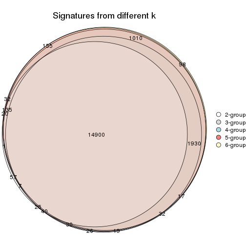

`get_signature()` returns a data frame invisibly. TO get the list of signatures, the function
call should be assigned to a variable explicitly. In following code, if `plot` argument is set
to `FALSE`, no heatmap is plotted while only the differential analysis is performed.

```r
# code only for demonstration
tb = get_signature(res, k = ..., plot = FALSE)
```

An example of the output of `tb` is:

```
#>   which_row         fdr    mean_1    mean_2 scaled_mean_1 scaled_mean_2 km
#> 1        38 0.042760348  8.373488  9.131774    -0.5533452     0.5164555  1
#> 2        40 0.018707592  7.106213  8.469186    -0.6173731     0.5762149  1
#> 3        55 0.019134737 10.221463 11.207825    -0.6159697     0.5749050  1
#> 4        59 0.006059896  5.921854  7.869574    -0.6899429     0.6439467  1
#> 5        60 0.018055526  8.928898 10.211722    -0.6204761     0.5791110  1
#> 6        98 0.009384629 15.714769 14.887706     0.6635654    -0.6193277  2
...
```

The columns in `tb` are:

1. `which_row`: row indices corresponding to the input matrix.
2. `fdr`: FDR for the differential test. 
3. `mean_x`: The mean value in group x.
4. `scaled_mean_x`: The mean value in group x after rows are scaled.
5. `km`: Row groups if k-means clustering is applied to rows.


UMAP plot which shows how samples are separated.


<script>
$( function() {
	$( '#tabs-CV-hclust-dimension-reduction' ).tabs();
} );
</script>
<div id='tabs-CV-hclust-dimension-reduction'>
<ul>
<li><a href='#tab-CV-hclust-dimension-reduction-1'>k = 2</a></li>
<li><a href='#tab-CV-hclust-dimension-reduction-2'>k = 3</a></li>
<li><a href='#tab-CV-hclust-dimension-reduction-3'>k = 4</a></li>
<li><a href='#tab-CV-hclust-dimension-reduction-4'>k = 5</a></li>
<li><a href='#tab-CV-hclust-dimension-reduction-5'>k = 6</a></li>
</ul>
<div id='tab-CV-hclust-dimension-reduction-1'>
<pre><code class="r">dimension_reduction(res, k = 2, method = &quot;UMAP&quot;)
</code></pre>

<p></p>

</div>
<div id='tab-CV-hclust-dimension-reduction-2'>
<pre><code class="r">dimension_reduction(res, k = 3, method = &quot;UMAP&quot;)
</code></pre>

<p></p>

</div>
<div id='tab-CV-hclust-dimension-reduction-3'>
<pre><code class="r">dimension_reduction(res, k = 4, method = &quot;UMAP&quot;)
</code></pre>

<p></p>

</div>
<div id='tab-CV-hclust-dimension-reduction-4'>
<pre><code class="r">dimension_reduction(res, k = 5, method = &quot;UMAP&quot;)
</code></pre>

<p></p>

</div>
<div id='tab-CV-hclust-dimension-reduction-5'>
<pre><code class="r">dimension_reduction(res, k = 6, method = &quot;UMAP&quot;)
</code></pre>

<p></p>

</div>
</div>


Following heatmap shows how subgroups are split when increasing `k`:

```r
collect_classes(res)
```


Test correlation between subgroups and known annotations. If the known
annotation is numeric, one-way ANOVA test is applied, and if the known
annotation is discrete, chi-squared contingency table test is applied.

```r
test_to_known_factors(res)
```

```
#>             n individual(p) disease.state(p) cell.type(p) k
#> CV:hclust 153             1            1.000     4.63e-32 2
#> CV:hclust 153             1            0.875     2.17e-61 3
#> CV:hclust 153             1            0.964     1.16e-90 4
#> CV:hclust 153             1            0.989    6.51e-120 5
#> CV:hclust 150             1            0.640    2.88e-114 6
```


If matrix rows can be associated to genes, consider to use `functional_enrichment(res,
...)` to perform function enrichment for the signature genes. See [this vignette](http://bioconductor.org/packages/devel/bioc/vignettes/cola/inst/doc/functional_enrichment.html) for more detailed explanations.


 

---------------------------------------------------


### CV:kmeans


The object with results only for a single top-value method and a single partition method 
can be extracted as:

```r
res = res_list["CV", "kmeans"]
# you can also extract it by
# res = res_list["CV:kmeans"]
```

A summary of `res` and all the functions that can be applied to it:

```r
res
```

```
#> A 'ConsensusPartition' object with k = 2, 3, 4, 5, 6.
#>   On a matrix with 19559 rows and 153 columns.
#>   Top rows (1000, 2000, 3000, 4000, 5000) are extracted by 'CV' method.
#>   Subgroups are detected by 'kmeans' method.
#>   Performed in total 1250 partitions by row resampling.
#>   Best k for subgroups seems to be 5.
#> 
#> Following methods can be applied to this 'ConsensusPartition' object:
#>  [1] "cola_report"             "collect_classes"         "collect_plots"          
#>  [4] "collect_stats"           "colnames"                "compare_signatures"     
#>  [7] "consensus_heatmap"       "dimension_reduction"     "functional_enrichment"  
#> [10] "get_anno_col"            "get_anno"                "get_classes"            
#> [13] "get_consensus"           "get_matrix"              "get_membership"         
#> [16] "get_param"               "get_signatures"          "get_stats"              
#> [19] "is_best_k"               "is_stable_k"             "membership_heatmap"     
#> [22] "ncol"                    "nrow"                    "plot_ecdf"              
#> [25] "rownames"                "select_partition_number" "show"                   
#> [28] "suggest_best_k"          "test_to_known_factors"
```

`collect_plots()` function collects all the plots made from `res` for all `k` (number of partitions)
into one single page to provide an easy and fast comparison between different `k`.

```r
collect_plots(res)
```


The plots are:

- The first row: a plot of the ECDF (empirical cumulative distribution
  function) curves of the consensus matrix for each `k` and the heatmap of
  predicted classes for each `k`.
- The second row: heatmaps of the consensus matrix for each `k`.
- The third row: heatmaps of the membership matrix for each `k`.
- The fouth row: heatmaps of the signatures for each `k`.

All the plots in panels can be made by individual functions and they are
plotted later in this section.

`select_partition_number()` produces several plots showing different
statistics for choosing "optimized" `k`. There are following statistics:

- ECDF curves of the consensus matrix for each `k`;
- 1-PAC. [The PAC
  score](https://en.wikipedia.org/wiki/Consensus_clustering#Over-interpretation_potential_of_consensus_clustering)
  measures the proportion of the ambiguous subgrouping.
- Mean silhouette score.
- Concordance. The mean probability of fiting the consensus class ids in all
  partitions.
- Area increased. Denote $A_k$ as the area under the ECDF curve for current
  `k`, the area increased is defined as $A_k - A_{k-1}$.
- Rand index. The percent of pairs of samples that are both in a same cluster
  or both are not in a same cluster in the partition of k and k-1.
- Jaccard index. The ratio of pairs of samples are both in a same cluster in
  the partition of k and k-1 and the pairs of samples are both in a same
  cluster in the partition k or k-1.

The detailed explanations of these statistics can be found in [the _cola_
vignette](http://bioconductor.org/packages/devel/bioc/vignettes/cola/inst/doc/cola.html#toc_13).

Generally speaking, lower PAC score, higher mean silhouette score or higher
concordance corresponds to better partition. Rand index and Jaccard index
measure how similar the current partition is compared to partition with `k-1`.
If they are too similar, we won't accept `k` is better than `k-1`.

```r
select_partition_number(res)
```


The numeric values for all these statistics can be obtained by `get_stats()`.

```r
get_stats(res)
```

```
#>   k 1-PAC mean_silhouette concordance area_increased  Rand Jaccard
#> 2 2 0.289           0.872       0.886         0.4333 0.529   0.529
#> 3 3 0.681           0.761       0.756         0.3705 1.000   1.000
#> 4 4 0.652           0.846       0.757         0.1595 0.759   0.546
#> 5 5 0.719           0.954       0.811         0.0854 0.909   0.686
#> 6 6 0.734           0.924       0.830         0.0503 1.000   1.000
```

`suggest_best_k()` suggests the best $k$ based on these statistics. The rules are as follows:

- All $k$ with Jaccard index larger than 0.95 are removed because increasing
  $k$ does not provide enough extra information. If all $k$ are removed, it is
  marked as no subgroup is detected.
- For all $k$ with 1-PAC score larger than 0.9, the maximal $k$ is taken as
  the best $k$, and other $k$ are marked as optional $k$.
- If it does not fit the second rule. The $k$ with the maximal vote of the
  highest 1-PAC score, highest mean silhouette, and highest concordance is
  taken as the best $k$.

```r
suggest_best_k(res)
```

```
#> [1] 5
```


Following shows the table of the partitions (You need to click the **show/hide
code output** link to see it). The membership matrix (columns with name `p*`)
is inferred by
[`clue::cl_consensus()`](https://www.rdocumentation.org/link/cl_consensus?package=clue)
function with the `SE` method. Basically the value in the membership matrix
represents the probability to belong to a certain group. The finall class
label for an item is determined with the group with highest probability it
belongs to.

In `get_classes()` function, the entropy is calculated from the membership
matrix and the silhouette score is calculated from the consensus matrix.


<script>
$( function() {
	$( '#tabs-CV-kmeans-get-classes' ).tabs();
} );
</script>
<div id='tabs-CV-kmeans-get-classes'>
<ul>
<li><a href='#tab-CV-kmeans-get-classes-1'>k = 2</a></li>
<li><a href='#tab-CV-kmeans-get-classes-2'>k = 3</a></li>
<li><a href='#tab-CV-kmeans-get-classes-3'>k = 4</a></li>
<li><a href='#tab-CV-kmeans-get-classes-4'>k = 5</a></li>
<li><a href='#tab-CV-kmeans-get-classes-5'>k = 6</a></li>
</ul>

<div id='tab-CV-kmeans-get-classes-1'>
<p><a id='tab-CV-kmeans-get-classes-1-a' style='color:#0366d6' href='#'>show/hide code output</a></p>
<pre><code class="r">cbind(get_classes(res, k = 2), get_membership(res, k = 2))
</code></pre>

<pre><code>#&gt;           class entropy silhouette    p1    p2
#&gt; GSM247795     2   0.000      0.879 0.000 1.000
#&gt; GSM247854     2   0.000      0.879 0.000 1.000
#&gt; GSM247758     2   0.482      0.827 0.104 0.896
#&gt; GSM247742     1   0.850      0.895 0.724 0.276
#&gt; GSM247755     2   0.671      0.822 0.176 0.824
#&gt; GSM247841     1   0.671      0.936 0.824 0.176
#&gt; GSM247703     2   0.000      0.879 0.000 1.000
#&gt; GSM247739     2   0.482      0.827 0.104 0.896
#&gt; GSM247715     1   0.850      0.895 0.724 0.276
#&gt; GSM247829     2   0.671      0.822 0.176 0.824
#&gt; GSM247842     1   0.671      0.936 0.824 0.176
#&gt; GSM247805     2   0.000      0.879 0.000 1.000
#&gt; GSM247786     2   0.482      0.827 0.104 0.896
#&gt; GSM247812     2   0.671      0.822 0.176 0.824
#&gt; GSM247776     1   0.671      0.936 0.824 0.176
#&gt; GSM247850     1   0.671      0.936 0.824 0.176
#&gt; GSM247717     2   0.000      0.879 0.000 1.000
#&gt; GSM247784     2   0.482      0.827 0.104 0.896
#&gt; GSM247834     1   0.850      0.895 0.724 0.276
#&gt; GSM247783     2   0.671      0.822 0.176 0.824
#&gt; GSM247846     1   0.671      0.936 0.824 0.176
#&gt; GSM247822     2   0.000      0.879 0.000 1.000
#&gt; GSM247710     2   0.482      0.827 0.104 0.896
#&gt; GSM247713     1   0.850      0.895 0.724 0.276
#&gt; GSM247840     2   0.671      0.822 0.176 0.824
#&gt; GSM247733     1   0.671      0.936 0.824 0.176
#&gt; GSM247852     1   0.671      0.936 0.824 0.176
#&gt; GSM247790     2   0.000      0.879 0.000 1.000
#&gt; GSM247730     2   0.482      0.827 0.104 0.896
#&gt; GSM247824     2   0.671      0.822 0.176 0.824
#&gt; GSM247770     1   0.671      0.936 0.824 0.176
#&gt; GSM247711     2   0.000      0.879 0.000 1.000
#&gt; GSM247782     2   0.482      0.827 0.104 0.896
#&gt; GSM247836     1   0.850      0.895 0.724 0.276
#&gt; GSM247785     2   0.671      0.822 0.176 0.824
#&gt; GSM247847     1   0.671      0.936 0.824 0.176
#&gt; GSM247750     2   0.000      0.879 0.000 1.000
#&gt; GSM247788     2   0.482      0.827 0.104 0.896
#&gt; GSM247849     1   0.850      0.895 0.724 0.276
#&gt; GSM247772     2   0.671      0.822 0.176 0.824
#&gt; GSM247760     1   0.671      0.936 0.824 0.176
#&gt; GSM247764     2   0.000      0.879 0.000 1.000
#&gt; GSM247851     2   0.000      0.879 0.000 1.000
#&gt; GSM247714     2   0.482      0.827 0.104 0.896
#&gt; GSM247828     1   0.850      0.895 0.724 0.276
#&gt; GSM247704     2   0.671      0.822 0.176 0.824
#&gt; GSM247818     1   0.671      0.936 0.824 0.176
#&gt; GSM247823     2   0.000      0.879 0.000 1.000
#&gt; GSM247706     2   0.482      0.827 0.104 0.896
#&gt; GSM247835     2   0.671      0.822 0.176 0.824
#&gt; GSM247734     1   0.671      0.936 0.824 0.176
#&gt; GSM247819     2   0.000      0.879 0.000 1.000
#&gt; GSM247809     2   0.482      0.827 0.104 0.896
#&gt; GSM247830     2   0.671      0.822 0.176 0.824
#&gt; GSM247833     1   0.671      0.936 0.824 0.176
#&gt; GSM247738     2   0.000      0.879 0.000 1.000
#&gt; GSM247716     2   0.482      0.827 0.104 0.896
#&gt; GSM247747     2   0.671      0.822 0.176 0.824
#&gt; GSM247722     1   0.671      0.936 0.824 0.176
#&gt; GSM247816     2   0.000      0.879 0.000 1.000
#&gt; GSM247839     2   0.482      0.827 0.104 0.896
#&gt; GSM247821     1   0.850      0.895 0.724 0.276
#&gt; GSM247798     2   0.671      0.822 0.176 0.824
#&gt; GSM247838     1   0.671      0.936 0.824 0.176
#&gt; GSM247721     2   0.000      0.879 0.000 1.000
#&gt; GSM247781     2   0.482      0.827 0.104 0.896
#&gt; GSM247762     1   0.850      0.895 0.724 0.276
#&gt; GSM247825     2   0.671      0.822 0.176 0.824
#&gt; GSM247777     1   0.671      0.936 0.824 0.176
#&gt; GSM247761     2   0.000      0.879 0.000 1.000
#&gt; GSM247720     2   0.482      0.827 0.104 0.896
#&gt; GSM247814     2   0.671      0.822 0.176 0.824
#&gt; GSM247732     1   0.671      0.936 0.824 0.176
#&gt; GSM247708     2   0.000      0.879 0.000 1.000
#&gt; GSM247740     2   0.482      0.827 0.104 0.896
#&gt; GSM247749     1   0.850      0.895 0.724 0.276
#&gt; GSM247767     2   0.671      0.822 0.176 0.824
#&gt; GSM247748     1   0.671      0.936 0.824 0.176
#&gt; GSM247705     2   0.000      0.879 0.000 1.000
#&gt; GSM247746     2   0.482      0.827 0.104 0.896
#&gt; GSM247752     1   0.850      0.895 0.724 0.276
#&gt; GSM247769     2   0.671      0.822 0.176 0.824
#&gt; GSM247753     1   0.671      0.936 0.824 0.176
#&gt; GSM247723     2   0.000      0.879 0.000 1.000
#&gt; GSM247779     2   0.482      0.827 0.104 0.896
#&gt; GSM247756     1   0.850      0.895 0.724 0.276
#&gt; GSM247826     2   0.671      0.822 0.176 0.824
#&gt; GSM247775     1   0.671      0.936 0.824 0.176
#&gt; GSM247741     2   0.000      0.879 0.000 1.000
#&gt; GSM247799     2   0.482      0.827 0.104 0.896
#&gt; GSM247778     1   0.850      0.895 0.724 0.276
#&gt; GSM247806     2   0.671      0.822 0.176 0.824
#&gt; GSM247815     1   0.671      0.936 0.824 0.176
#&gt; GSM247735     2   0.000      0.879 0.000 1.000
#&gt; GSM247831     2   0.482      0.827 0.104 0.896
#&gt; GSM247845     1   0.850      0.895 0.724 0.276
#&gt; GSM247791     2   0.671      0.822 0.176 0.824
#&gt; GSM247780     1   0.671      0.936 0.824 0.176
#&gt; GSM247853     1   0.671      0.936 0.824 0.176
#&gt; GSM247800     2   0.000      0.879 0.000 1.000
#&gt; GSM247729     2   0.482      0.827 0.104 0.896
#&gt; GSM247810     1   0.850      0.895 0.724 0.276
#&gt; GSM247844     2   0.671      0.822 0.176 0.824
#&gt; GSM247793     1   0.671      0.936 0.824 0.176
#&gt; GSM247759     2   0.000      0.879 0.000 1.000
#&gt; GSM247724     2   0.482      0.827 0.104 0.896
#&gt; GSM247817     2   0.671      0.822 0.176 0.824
#&gt; GSM247727     1   0.671      0.936 0.824 0.176
#&gt; GSM247796     2   0.000      0.879 0.000 1.000
#&gt; GSM247725     2   0.482      0.827 0.104 0.896
#&gt; GSM247801     1   0.850      0.895 0.724 0.276
#&gt; GSM247731     2   0.671      0.822 0.176 0.824
#&gt; GSM247765     1   0.671      0.936 0.824 0.176
#&gt; GSM247792     2   0.000      0.879 0.000 1.000
#&gt; GSM247726     2   0.482      0.827 0.104 0.896
#&gt; GSM247803     1   0.850      0.895 0.724 0.276
#&gt; GSM247728     2   0.671      0.822 0.176 0.824
#&gt; GSM247768     1   0.671      0.936 0.824 0.176
#&gt; GSM247745     2   0.000      0.879 0.000 1.000
#&gt; GSM247855     2   0.000      0.879 0.000 1.000
#&gt; GSM247804     2   0.482      0.827 0.104 0.896
#&gt; GSM247774     1   0.850      0.895 0.724 0.276
#&gt; GSM247807     2   0.671      0.822 0.176 0.824
#&gt; GSM247813     1   0.671      0.936 0.824 0.176
#&gt; GSM247736     2   0.000      0.879 0.000 1.000
#&gt; GSM247712     2   0.482      0.827 0.104 0.896
#&gt; GSM247797     1   0.850      0.895 0.724 0.276
#&gt; GSM247743     2   0.671      0.822 0.176 0.824
#&gt; GSM247719     1   0.671      0.936 0.824 0.176
#&gt; GSM247707     2   0.000      0.879 0.000 1.000
#&gt; GSM247737     2   0.482      0.827 0.104 0.896
#&gt; GSM247827     2   0.671      0.822 0.176 0.824
#&gt; GSM247848     1   0.671      0.936 0.824 0.176
#&gt; GSM247794     2   0.000      0.879 0.000 1.000
#&gt; GSM247757     2   0.482      0.827 0.104 0.896
#&gt; GSM247744     1   0.850      0.895 0.724 0.276
#&gt; GSM247751     2   0.671      0.822 0.176 0.824
#&gt; GSM247837     1   0.671      0.936 0.824 0.176
#&gt; GSM247754     2   0.000      0.879 0.000 1.000
#&gt; GSM247789     2   0.482      0.827 0.104 0.896
#&gt; GSM247802     1   0.850      0.895 0.724 0.276
#&gt; GSM247771     2   0.671      0.822 0.176 0.824
#&gt; GSM247763     1   0.671      0.936 0.824 0.176
#&gt; GSM247808     2   0.000      0.879 0.000 1.000
#&gt; GSM247787     2   0.482      0.827 0.104 0.896
#&gt; GSM247843     1   0.850      0.895 0.724 0.276
#&gt; GSM247811     2   0.671      0.822 0.176 0.824
#&gt; GSM247773     1   0.671      0.936 0.824 0.176
#&gt; GSM247766     2   0.000      0.879 0.000 1.000
#&gt; GSM247718     2   0.482      0.827 0.104 0.896
#&gt; GSM247832     1   0.850      0.895 0.724 0.276
#&gt; GSM247709     2   0.671      0.822 0.176 0.824
#&gt; GSM247820     1   0.671      0.936 0.824 0.176
</code></pre>

<script>
$('#tab-CV-kmeans-get-classes-1-a').parent().next().next().hide();
$('#tab-CV-kmeans-get-classes-1-a').click(function(){
  $('#tab-CV-kmeans-get-classes-1-a').parent().next().next().toggle();
  return(false);
});
</script>
</div>

<div id='tab-CV-kmeans-get-classes-2'>
<p><a id='tab-CV-kmeans-get-classes-2-a' style='color:#0366d6' href='#'>show/hide code output</a></p>
<pre><code class="r">cbind(get_classes(res, k = 3), get_membership(res, k = 3))
</code></pre>

<pre><code>#&gt;           class entropy silhouette    p1    p2 p3
#&gt; GSM247795     2  0.0000      0.780 0.000 1.000 NA
#&gt; GSM247854     2  0.0000      0.780 0.000 1.000 NA
#&gt; GSM247758     2  0.5092      0.743 0.020 0.804 NA
#&gt; GSM247742     1  0.7760      0.796 0.580 0.060 NA
#&gt; GSM247755     2  0.6678      0.616 0.008 0.512 NA
#&gt; GSM247841     1  0.1878      0.866 0.952 0.044 NA
#&gt; GSM247703     2  0.0000      0.780 0.000 1.000 NA
#&gt; GSM247739     2  0.5092      0.743 0.020 0.804 NA
#&gt; GSM247715     1  0.7760      0.796 0.580 0.060 NA
#&gt; GSM247829     2  0.6678      0.616 0.008 0.512 NA
#&gt; GSM247842     1  0.1878      0.866 0.952 0.044 NA
#&gt; GSM247805     2  0.0000      0.780 0.000 1.000 NA
#&gt; GSM247786     2  0.5092      0.743 0.020 0.804 NA
#&gt; GSM247812     2  0.7476      0.615 0.036 0.512 NA
#&gt; GSM247776     1  0.2063      0.866 0.948 0.044 NA
#&gt; GSM247850     1  0.2063      0.866 0.948 0.044 NA
#&gt; GSM247717     2  0.0000      0.780 0.000 1.000 NA
#&gt; GSM247784     2  0.5092      0.743 0.020 0.804 NA
#&gt; GSM247834     1  0.7760      0.796 0.580 0.060 NA
#&gt; GSM247783     2  0.6678      0.616 0.008 0.512 NA
#&gt; GSM247846     1  0.2063      0.866 0.948 0.044 NA
#&gt; GSM247822     2  0.0000      0.780 0.000 1.000 NA
#&gt; GSM247710     2  0.5092      0.743 0.020 0.804 NA
#&gt; GSM247713     1  0.7760      0.796 0.580 0.060 NA
#&gt; GSM247840     2  0.7476      0.615 0.036 0.512 NA
#&gt; GSM247733     1  0.1878      0.866 0.952 0.044 NA
#&gt; GSM247852     1  0.1878      0.866 0.952 0.044 NA
#&gt; GSM247790     2  0.0424      0.779 0.000 0.992 NA
#&gt; GSM247730     2  0.5092      0.743 0.020 0.804 NA
#&gt; GSM247824     2  0.6819      0.616 0.012 0.512 NA
#&gt; GSM247770     1  0.2063      0.866 0.948 0.044 NA
#&gt; GSM247711     2  0.0000      0.780 0.000 1.000 NA
#&gt; GSM247782     2  0.5092      0.743 0.020 0.804 NA
#&gt; GSM247836     1  0.7760      0.796 0.580 0.060 NA
#&gt; GSM247785     2  0.6678      0.616 0.008 0.512 NA
#&gt; GSM247847     1  0.2229      0.866 0.944 0.044 NA
#&gt; GSM247750     2  0.0000      0.780 0.000 1.000 NA
#&gt; GSM247788     2  0.5092      0.743 0.020 0.804 NA
#&gt; GSM247849     1  0.7760      0.796 0.580 0.060 NA
#&gt; GSM247772     2  0.6518      0.616 0.004 0.512 NA
#&gt; GSM247760     1  0.2063      0.866 0.948 0.044 NA
#&gt; GSM247764     2  0.0000      0.780 0.000 1.000 NA
#&gt; GSM247851     2  0.0000      0.780 0.000 1.000 NA
#&gt; GSM247714     2  0.5092      0.743 0.020 0.804 NA
#&gt; GSM247828     1  0.7760      0.796 0.580 0.060 NA
#&gt; GSM247704     2  0.7283      0.615 0.028 0.512 NA
#&gt; GSM247818     1  0.1878      0.866 0.952 0.044 NA
#&gt; GSM247823     2  0.0000      0.780 0.000 1.000 NA
#&gt; GSM247706     2  0.5092      0.743 0.020 0.804 NA
#&gt; GSM247835     2  0.6518      0.616 0.004 0.512 NA
#&gt; GSM247734     1  0.2063      0.866 0.948 0.044 NA
#&gt; GSM247819     2  0.0000      0.780 0.000 1.000 NA
#&gt; GSM247809     2  0.5092      0.743 0.020 0.804 NA
#&gt; GSM247830     2  0.6518      0.616 0.004 0.512 NA
#&gt; GSM247833     1  0.1878      0.866 0.952 0.044 NA
#&gt; GSM247738     2  0.0237      0.780 0.000 0.996 NA
#&gt; GSM247716     2  0.5092      0.743 0.020 0.804 NA
#&gt; GSM247747     2  0.6518      0.616 0.004 0.512 NA
#&gt; GSM247722     1  0.2229      0.866 0.944 0.044 NA
#&gt; GSM247816     2  0.0000      0.780 0.000 1.000 NA
#&gt; GSM247839     2  0.5092      0.743 0.020 0.804 NA
#&gt; GSM247821     1  0.7760      0.796 0.580 0.060 NA
#&gt; GSM247798     2  0.6518      0.616 0.004 0.512 NA
#&gt; GSM247838     1  0.2229      0.866 0.944 0.044 NA
#&gt; GSM247721     2  0.0000      0.780 0.000 1.000 NA
#&gt; GSM247781     2  0.5092      0.743 0.020 0.804 NA
#&gt; GSM247762     1  0.7760      0.796 0.580 0.060 NA
#&gt; GSM247825     2  0.7178      0.616 0.024 0.512 NA
#&gt; GSM247777     1  0.1878      0.866 0.952 0.044 NA
#&gt; GSM247761     2  0.0000      0.780 0.000 1.000 NA
#&gt; GSM247720     2  0.5092      0.743 0.020 0.804 NA
#&gt; GSM247814     2  0.6678      0.616 0.008 0.512 NA
#&gt; GSM247732     1  0.1878      0.866 0.952 0.044 NA
#&gt; GSM247708     2  0.0000      0.780 0.000 1.000 NA
#&gt; GSM247740     2  0.5092      0.743 0.020 0.804 NA
#&gt; GSM247749     1  0.7760      0.796 0.580 0.060 NA
#&gt; GSM247767     2  0.6678      0.616 0.008 0.512 NA
#&gt; GSM247748     1  0.1878      0.866 0.952 0.044 NA
#&gt; GSM247705     2  0.0000      0.780 0.000 1.000 NA
#&gt; GSM247746     2  0.5092      0.743 0.020 0.804 NA
#&gt; GSM247752     1  0.7760      0.796 0.580 0.060 NA
#&gt; GSM247769     2  0.6518      0.616 0.004 0.512 NA
#&gt; GSM247753     1  0.1878      0.866 0.952 0.044 NA
#&gt; GSM247723     2  0.0000      0.780 0.000 1.000 NA
#&gt; GSM247779     2  0.5092      0.743 0.020 0.804 NA
#&gt; GSM247756     1  0.7760      0.796 0.580 0.060 NA
#&gt; GSM247826     2  0.6518      0.616 0.004 0.512 NA
#&gt; GSM247775     1  0.1878      0.866 0.952 0.044 NA
#&gt; GSM247741     2  0.0000      0.780 0.000 1.000 NA
#&gt; GSM247799     2  0.5092      0.743 0.020 0.804 NA
#&gt; GSM247778     1  0.7760      0.796 0.580 0.060 NA
#&gt; GSM247806     2  0.6678      0.616 0.008 0.512 NA
#&gt; GSM247815     1  0.2229      0.866 0.944 0.044 NA
#&gt; GSM247735     2  0.0000      0.780 0.000 1.000 NA
#&gt; GSM247831     2  0.5092      0.743 0.020 0.804 NA
#&gt; GSM247845     1  0.7760      0.796 0.580 0.060 NA
#&gt; GSM247791     2  0.7476      0.615 0.036 0.512 NA
#&gt; GSM247780     1  0.2063      0.866 0.948 0.044 NA
#&gt; GSM247853     1  0.2063      0.866 0.948 0.044 NA
#&gt; GSM247800     2  0.0000      0.780 0.000 1.000 NA
#&gt; GSM247729     2  0.5092      0.743 0.020 0.804 NA
#&gt; GSM247810     1  0.7760      0.796 0.580 0.060 NA
#&gt; GSM247844     2  0.6819      0.616 0.012 0.512 NA
#&gt; GSM247793     1  0.1878      0.866 0.952 0.044 NA
#&gt; GSM247759     2  0.0000      0.780 0.000 1.000 NA
#&gt; GSM247724     2  0.5092      0.743 0.020 0.804 NA
#&gt; GSM247817     2  0.6678      0.616 0.008 0.512 NA
#&gt; GSM247727     1  0.1878      0.866 0.952 0.044 NA
#&gt; GSM247796     2  0.0000      0.780 0.000 1.000 NA
#&gt; GSM247725     2  0.5092      0.743 0.020 0.804 NA
#&gt; GSM247801     1  0.7760      0.796 0.580 0.060 NA
#&gt; GSM247731     2  0.6678      0.616 0.008 0.512 NA
#&gt; GSM247765     1  0.2063      0.866 0.948 0.044 NA
#&gt; GSM247792     2  0.0000      0.780 0.000 1.000 NA
#&gt; GSM247726     2  0.5092      0.743 0.020 0.804 NA
#&gt; GSM247803     1  0.7760      0.796 0.580 0.060 NA
#&gt; GSM247728     2  0.7178      0.616 0.024 0.512 NA
#&gt; GSM247768     1  0.1878      0.866 0.952 0.044 NA
#&gt; GSM247745     2  0.0000      0.780 0.000 1.000 NA
#&gt; GSM247855     2  0.0000      0.780 0.000 1.000 NA
#&gt; GSM247804     2  0.5092      0.743 0.020 0.804 NA
#&gt; GSM247774     1  0.7760      0.796 0.580 0.060 NA
#&gt; GSM247807     2  0.7476      0.615 0.036 0.512 NA
#&gt; GSM247813     1  0.2229      0.866 0.944 0.044 NA
#&gt; GSM247736     2  0.0000      0.780 0.000 1.000 NA
#&gt; GSM247712     2  0.5092      0.743 0.020 0.804 NA
#&gt; GSM247797     1  0.7760      0.796 0.580 0.060 NA
#&gt; GSM247743     2  0.6518      0.616 0.004 0.512 NA
#&gt; GSM247719     1  0.1878      0.866 0.952 0.044 NA
#&gt; GSM247707     2  0.0000      0.780 0.000 1.000 NA
#&gt; GSM247737     2  0.5092      0.743 0.020 0.804 NA
#&gt; GSM247827     2  0.7067      0.616 0.020 0.512 NA
#&gt; GSM247848     1  0.1878      0.866 0.952 0.044 NA
#&gt; GSM247794     2  0.0000      0.780 0.000 1.000 NA
#&gt; GSM247757     2  0.5092      0.743 0.020 0.804 NA
#&gt; GSM247744     1  0.7760      0.796 0.580 0.060 NA
#&gt; GSM247751     2  0.6948      0.616 0.016 0.512 NA
#&gt; GSM247837     1  0.1878      0.866 0.952 0.044 NA
#&gt; GSM247754     2  0.0000      0.780 0.000 1.000 NA
#&gt; GSM247789     2  0.5092      0.743 0.020 0.804 NA
#&gt; GSM247802     1  0.7760      0.796 0.580 0.060 NA
#&gt; GSM247771     2  0.6678      0.616 0.008 0.512 NA
#&gt; GSM247763     1  0.2063      0.866 0.948 0.044 NA
#&gt; GSM247808     2  0.0000      0.780 0.000 1.000 NA
#&gt; GSM247787     2  0.5092      0.743 0.020 0.804 NA
#&gt; GSM247843     1  0.7760      0.796 0.580 0.060 NA
#&gt; GSM247811     2  0.7476      0.615 0.036 0.512 NA
#&gt; GSM247773     1  0.1878      0.866 0.952 0.044 NA
#&gt; GSM247766     2  0.0000      0.780 0.000 1.000 NA
#&gt; GSM247718     2  0.5092      0.743 0.020 0.804 NA
#&gt; GSM247832     1  0.7760      0.796 0.580 0.060 NA
#&gt; GSM247709     2  0.7382      0.615 0.032 0.512 NA
#&gt; GSM247820     1  0.1878      0.866 0.952 0.044 NA
</code></pre>

<script>
$('#tab-CV-kmeans-get-classes-2-a').parent().next().next().hide();
$('#tab-CV-kmeans-get-classes-2-a').click(function(){
  $('#tab-CV-kmeans-get-classes-2-a').parent().next().next().toggle();
  return(false);
});
</script>
</div>

<div id='tab-CV-kmeans-get-classes-3'>
<p><a id='tab-CV-kmeans-get-classes-3-a' style='color:#0366d6' href='#'>show/hide code output</a></p>
<pre><code class="r">cbind(get_classes(res, k = 4), get_membership(res, k = 4))
</code></pre>

<pre><code>#&gt;           class entropy silhouette    p1    p2    p3    p4
#&gt; GSM247795     2  0.0000      0.685 0.000 1.000 0.000 0.000
#&gt; GSM247854     2  0.0000      0.685 0.000 1.000 0.000 0.000
#&gt; GSM247758     2  0.7232      0.685 0.000 0.516 0.164 0.320
#&gt; GSM247742     4  0.5472      0.985 0.440 0.016 0.000 0.544
#&gt; GSM247755     3  0.4422      0.956 0.000 0.256 0.736 0.008
#&gt; GSM247841     1  0.1182      0.974 0.968 0.016 0.016 0.000
#&gt; GSM247703     2  0.0000      0.685 0.000 1.000 0.000 0.000
#&gt; GSM247739     2  0.7232      0.685 0.000 0.516 0.164 0.320
#&gt; GSM247715     4  0.5472      0.985 0.440 0.016 0.000 0.544
#&gt; GSM247829     3  0.5937      0.953 0.016 0.256 0.680 0.048
#&gt; GSM247842     1  0.1297      0.973 0.964 0.016 0.020 0.000
#&gt; GSM247805     2  0.0000      0.685 0.000 1.000 0.000 0.000
#&gt; GSM247786     2  0.7232      0.685 0.000 0.516 0.164 0.320
#&gt; GSM247812     3  0.6829      0.930 0.004 0.256 0.604 0.136
#&gt; GSM247776     1  0.1182      0.973 0.968 0.016 0.016 0.000
#&gt; GSM247850     1  0.1182      0.973 0.968 0.016 0.016 0.000
#&gt; GSM247717     2  0.0000      0.685 0.000 1.000 0.000 0.000
#&gt; GSM247784     2  0.7232      0.685 0.000 0.516 0.164 0.320
#&gt; GSM247834     4  0.5472      0.985 0.440 0.016 0.000 0.544
#&gt; GSM247783     3  0.4422      0.956 0.000 0.256 0.736 0.008
#&gt; GSM247846     1  0.1297      0.973 0.964 0.016 0.020 0.000
#&gt; GSM247822     2  0.0000      0.685 0.000 1.000 0.000 0.000
#&gt; GSM247710     2  0.7232      0.685 0.000 0.516 0.164 0.320
#&gt; GSM247713     4  0.6574      0.960 0.440 0.016 0.044 0.500
#&gt; GSM247840     3  0.6786      0.930 0.004 0.256 0.608 0.132
#&gt; GSM247733     1  0.1059      0.971 0.972 0.016 0.012 0.000
#&gt; GSM247852     1  0.1059      0.971 0.972 0.016 0.012 0.000
#&gt; GSM247790     2  0.0921      0.685 0.000 0.972 0.028 0.000
#&gt; GSM247730     2  0.7232      0.685 0.000 0.516 0.164 0.320
#&gt; GSM247824     3  0.4661      0.957 0.000 0.256 0.728 0.016
#&gt; GSM247770     1  0.1297      0.973 0.964 0.016 0.020 0.000
#&gt; GSM247711     2  0.0000      0.685 0.000 1.000 0.000 0.000
#&gt; GSM247782     2  0.7232      0.685 0.000 0.516 0.164 0.320
#&gt; GSM247836     4  0.5472      0.985 0.440 0.016 0.000 0.544
#&gt; GSM247785     3  0.4661      0.957 0.000 0.256 0.728 0.016
#&gt; GSM247847     1  0.1406      0.974 0.960 0.016 0.024 0.000
#&gt; GSM247750     2  0.0000      0.685 0.000 1.000 0.000 0.000
#&gt; GSM247788     2  0.7232      0.685 0.000 0.516 0.164 0.320
#&gt; GSM247849     4  0.5472      0.985 0.440 0.016 0.000 0.544
#&gt; GSM247772     3  0.4283      0.957 0.000 0.256 0.740 0.004
#&gt; GSM247760     1  0.1059      0.974 0.972 0.016 0.012 0.000
#&gt; GSM247764     2  0.0000      0.685 0.000 1.000 0.000 0.000
#&gt; GSM247851     2  0.0000      0.685 0.000 1.000 0.000 0.000
#&gt; GSM247714     2  0.7232      0.685 0.000 0.516 0.164 0.320
#&gt; GSM247828     4  0.5472      0.985 0.440 0.016 0.000 0.544
#&gt; GSM247704     3  0.6902      0.936 0.012 0.256 0.612 0.120
#&gt; GSM247818     1  0.1059      0.971 0.972 0.016 0.012 0.000
#&gt; GSM247823     2  0.0000      0.685 0.000 1.000 0.000 0.000
#&gt; GSM247706     2  0.7232      0.685 0.000 0.516 0.164 0.320
#&gt; GSM247835     3  0.4283      0.957 0.000 0.256 0.740 0.004
#&gt; GSM247734     1  0.1182      0.973 0.968 0.016 0.016 0.000
#&gt; GSM247819     2  0.0000      0.685 0.000 1.000 0.000 0.000
#&gt; GSM247809     2  0.7232      0.685 0.000 0.516 0.164 0.320
#&gt; GSM247830     3  0.5185      0.954 0.008 0.256 0.712 0.024
#&gt; GSM247833     1  0.1510      0.971 0.956 0.016 0.028 0.000
#&gt; GSM247738     2  0.0921      0.685 0.000 0.972 0.028 0.000
#&gt; GSM247716     2  0.7232      0.685 0.000 0.516 0.164 0.320
#&gt; GSM247747     3  0.5234      0.956 0.004 0.256 0.708 0.032
#&gt; GSM247722     1  0.1798      0.969 0.944 0.016 0.040 0.000
#&gt; GSM247816     2  0.0000      0.685 0.000 1.000 0.000 0.000
#&gt; GSM247839     2  0.7232      0.685 0.000 0.516 0.164 0.320
#&gt; GSM247821     4  0.5472      0.985 0.440 0.016 0.000 0.544
#&gt; GSM247798     3  0.5607      0.953 0.016 0.256 0.696 0.032
#&gt; GSM247838     1  0.1798      0.969 0.944 0.016 0.040 0.000
#&gt; GSM247721     2  0.0000      0.685 0.000 1.000 0.000 0.000
#&gt; GSM247781     2  0.7232      0.685 0.000 0.516 0.164 0.320
#&gt; GSM247762     4  0.6574      0.960 0.440 0.016 0.044 0.500
#&gt; GSM247825     3  0.6636      0.936 0.008 0.256 0.628 0.108
#&gt; GSM247777     1  0.1510      0.971 0.956 0.016 0.028 0.000
#&gt; GSM247761     2  0.0000      0.685 0.000 1.000 0.000 0.000
#&gt; GSM247720     2  0.7232      0.685 0.000 0.516 0.164 0.320
#&gt; GSM247814     3  0.5859      0.953 0.016 0.256 0.684 0.044
#&gt; GSM247732     1  0.1406      0.970 0.960 0.016 0.024 0.000
#&gt; GSM247708     2  0.0000      0.685 0.000 1.000 0.000 0.000
#&gt; GSM247740     2  0.7232      0.685 0.000 0.516 0.164 0.320
#&gt; GSM247749     4  0.5472      0.985 0.440 0.016 0.000 0.544
#&gt; GSM247767     3  0.4946      0.957 0.004 0.256 0.720 0.020
#&gt; GSM247748     1  0.1059      0.971 0.972 0.016 0.012 0.000
#&gt; GSM247705     2  0.0000      0.685 0.000 1.000 0.000 0.000
#&gt; GSM247746     2  0.7232      0.685 0.000 0.516 0.164 0.320
#&gt; GSM247752     4  0.6574      0.960 0.440 0.016 0.044 0.500
#&gt; GSM247769     3  0.4422      0.956 0.000 0.256 0.736 0.008
#&gt; GSM247753     1  0.1798      0.955 0.944 0.016 0.040 0.000
#&gt; GSM247723     2  0.0000      0.685 0.000 1.000 0.000 0.000
#&gt; GSM247779     2  0.7232      0.685 0.000 0.516 0.164 0.320
#&gt; GSM247756     4  0.5472      0.985 0.440 0.016 0.000 0.544
#&gt; GSM247826     3  0.4283      0.957 0.000 0.256 0.740 0.004
#&gt; GSM247775     1  0.1182      0.974 0.968 0.016 0.016 0.000
#&gt; GSM247741     2  0.0000      0.685 0.000 1.000 0.000 0.000
#&gt; GSM247799     2  0.7232      0.685 0.000 0.516 0.164 0.320
#&gt; GSM247778     4  0.5472      0.985 0.440 0.016 0.000 0.544
#&gt; GSM247806     3  0.4422      0.956 0.000 0.256 0.736 0.008
#&gt; GSM247815     1  0.1406      0.973 0.960 0.016 0.024 0.000
#&gt; GSM247735     2  0.0000      0.685 0.000 1.000 0.000 0.000
#&gt; GSM247831     2  0.7232      0.685 0.000 0.516 0.164 0.320
#&gt; GSM247845     4  0.5472      0.985 0.440 0.016 0.000 0.544
#&gt; GSM247791     3  0.6829      0.930 0.004 0.256 0.604 0.136
#&gt; GSM247780     1  0.1406      0.973 0.960 0.016 0.024 0.000
#&gt; GSM247853     1  0.1510      0.973 0.956 0.016 0.028 0.000
#&gt; GSM247800     2  0.0000      0.685 0.000 1.000 0.000 0.000
#&gt; GSM247729     2  0.7232      0.685 0.000 0.516 0.164 0.320
#&gt; GSM247810     4  0.5472      0.985 0.440 0.016 0.000 0.544
#&gt; GSM247844     3  0.5859      0.953 0.016 0.256 0.684 0.044
#&gt; GSM247793     1  0.0592      0.975 0.984 0.016 0.000 0.000
#&gt; GSM247759     2  0.0000      0.685 0.000 1.000 0.000 0.000
#&gt; GSM247724     2  0.7232      0.685 0.000 0.516 0.164 0.320
#&gt; GSM247817     3  0.5607      0.953 0.016 0.256 0.696 0.032
#&gt; GSM247727     1  0.1406      0.970 0.960 0.016 0.024 0.000
#&gt; GSM247796     2  0.0000      0.685 0.000 1.000 0.000 0.000
#&gt; GSM247725     2  0.7232      0.685 0.000 0.516 0.164 0.320
#&gt; GSM247801     4  0.6574      0.960 0.440 0.016 0.044 0.500
#&gt; GSM247731     3  0.4283      0.956 0.000 0.256 0.740 0.004
#&gt; GSM247765     1  0.1182      0.973 0.968 0.016 0.016 0.000
#&gt; GSM247792     2  0.0000      0.685 0.000 1.000 0.000 0.000
#&gt; GSM247726     2  0.7232      0.685 0.000 0.516 0.164 0.320
#&gt; GSM247803     4  0.6574      0.960 0.440 0.016 0.044 0.500
#&gt; GSM247728     3  0.6221      0.939 0.000 0.256 0.644 0.100
#&gt; GSM247768     1  0.1798      0.955 0.944 0.016 0.040 0.000
#&gt; GSM247745     2  0.0000      0.685 0.000 1.000 0.000 0.000
#&gt; GSM247855     2  0.0000      0.685 0.000 1.000 0.000 0.000
#&gt; GSM247804     2  0.7232      0.685 0.000 0.516 0.164 0.320
#&gt; GSM247774     4  0.5472      0.985 0.440 0.016 0.000 0.544
#&gt; GSM247807     3  0.6872      0.929 0.004 0.256 0.600 0.140
#&gt; GSM247813     1  0.1798      0.969 0.944 0.016 0.040 0.000
#&gt; GSM247736     2  0.0000      0.685 0.000 1.000 0.000 0.000
#&gt; GSM247712     2  0.7232      0.685 0.000 0.516 0.164 0.320
#&gt; GSM247797     4  0.6574      0.960 0.440 0.016 0.044 0.500
#&gt; GSM247743     3  0.4946      0.955 0.004 0.256 0.720 0.020
#&gt; GSM247719     1  0.1406      0.970 0.960 0.016 0.024 0.000
#&gt; GSM247707     2  0.0000      0.685 0.000 1.000 0.000 0.000
#&gt; GSM247737     2  0.7232      0.685 0.000 0.516 0.164 0.320
#&gt; GSM247827     3  0.6221      0.939 0.000 0.256 0.644 0.100
#&gt; GSM247848     1  0.1406      0.974 0.960 0.016 0.024 0.000
#&gt; GSM247794     2  0.0000      0.685 0.000 1.000 0.000 0.000
#&gt; GSM247757     2  0.7232      0.685 0.000 0.516 0.164 0.320
#&gt; GSM247744     4  0.5472      0.985 0.440 0.016 0.000 0.544
#&gt; GSM247751     3  0.5744      0.949 0.000 0.256 0.676 0.068
#&gt; GSM247837     1  0.1182      0.974 0.968 0.016 0.016 0.000
#&gt; GSM247754     2  0.0000      0.685 0.000 1.000 0.000 0.000
#&gt; GSM247789     2  0.7232      0.685 0.000 0.516 0.164 0.320
#&gt; GSM247802     4  0.5888      0.979 0.440 0.016 0.012 0.532
#&gt; GSM247771     3  0.4283      0.956 0.000 0.256 0.740 0.004
#&gt; GSM247763     1  0.1182      0.973 0.968 0.016 0.016 0.000
#&gt; GSM247808     2  0.0000      0.685 0.000 1.000 0.000 0.000
#&gt; GSM247787     2  0.7232      0.685 0.000 0.516 0.164 0.320
#&gt; GSM247843     4  0.5472      0.985 0.440 0.016 0.000 0.544
#&gt; GSM247811     3  0.6993      0.927 0.004 0.256 0.588 0.152
#&gt; GSM247773     1  0.1059      0.971 0.972 0.016 0.012 0.000
#&gt; GSM247766     2  0.0000      0.685 0.000 1.000 0.000 0.000
#&gt; GSM247718     2  0.7232      0.685 0.000 0.516 0.164 0.320
#&gt; GSM247832     4  0.5472      0.985 0.440 0.016 0.000 0.544
#&gt; GSM247709     3  0.7081      0.931 0.012 0.256 0.596 0.136
#&gt; GSM247820     1  0.1406      0.970 0.960 0.016 0.024 0.000
</code></pre>

<script>
$('#tab-CV-kmeans-get-classes-3-a').parent().next().next().hide();
$('#tab-CV-kmeans-get-classes-3-a').click(function(){
  $('#tab-CV-kmeans-get-classes-3-a').parent().next().next().toggle();
  return(false);
});
</script>
</div>

<div id='tab-CV-kmeans-get-classes-4'>
<p><a id='tab-CV-kmeans-get-classes-4-a' style='color:#0366d6' href='#'>show/hide code output</a></p>
<pre><code class="r">cbind(get_classes(res, k = 5), get_membership(res, k = 5))
</code></pre>

<pre><code>#&gt;           class entropy silhouette    p1    p2    p3    p4    p5
#&gt; GSM247795     2  0.0290      0.969 0.008 0.992 0.000 0.000 0.000
#&gt; GSM247854     2  0.0290      0.969 0.008 0.992 0.000 0.000 0.000
#&gt; GSM247758     5  0.4886      0.986 0.004 0.352 0.020 0.004 0.620
#&gt; GSM247742     4  0.0451      0.977 0.000 0.008 0.000 0.988 0.004
#&gt; GSM247755     3  0.3723      0.934 0.004 0.160 0.808 0.004 0.024
#&gt; GSM247841     1  0.5483      0.938 0.680 0.004 0.020 0.228 0.068
#&gt; GSM247703     2  0.0404      0.967 0.012 0.988 0.000 0.000 0.000
#&gt; GSM247739     5  0.4798      0.986 0.004 0.352 0.016 0.004 0.624
#&gt; GSM247715     4  0.0290      0.977 0.000 0.008 0.000 0.992 0.000
#&gt; GSM247829     3  0.4904      0.930 0.032 0.160 0.748 0.000 0.060
#&gt; GSM247842     1  0.5568      0.936 0.676 0.004 0.024 0.228 0.068
#&gt; GSM247805     2  0.0404      0.967 0.012 0.988 0.000 0.000 0.000
#&gt; GSM247786     5  0.4333      0.989 0.000 0.352 0.004 0.004 0.640
#&gt; GSM247812     3  0.6675      0.891 0.140 0.160 0.624 0.004 0.072
#&gt; GSM247776     1  0.4848      0.939 0.716 0.004 0.012 0.228 0.040
#&gt; GSM247850     1  0.4848      0.939 0.716 0.004 0.012 0.228 0.040
#&gt; GSM247717     2  0.0162      0.968 0.004 0.996 0.000 0.000 0.000
#&gt; GSM247784     5  0.4886      0.986 0.004 0.352 0.020 0.004 0.620
#&gt; GSM247834     4  0.0451      0.977 0.000 0.008 0.004 0.988 0.000
#&gt; GSM247783     3  0.3381      0.933 0.004 0.160 0.820 0.000 0.016
#&gt; GSM247846     1  0.5483      0.937 0.680 0.004 0.020 0.228 0.068
#&gt; GSM247822     2  0.1270      0.961 0.052 0.948 0.000 0.000 0.000
#&gt; GSM247710     5  0.4333      0.989 0.000 0.352 0.004 0.004 0.640
#&gt; GSM247713     4  0.2158      0.949 0.000 0.008 0.052 0.920 0.020
#&gt; GSM247840     3  0.6637      0.891 0.136 0.160 0.628 0.004 0.072
#&gt; GSM247733     1  0.4430      0.942 0.736 0.004 0.008 0.228 0.024
#&gt; GSM247852     1  0.4129      0.944 0.748 0.004 0.004 0.228 0.016
#&gt; GSM247790     2  0.0566      0.964 0.012 0.984 0.000 0.000 0.004
#&gt; GSM247730     5  0.4333      0.989 0.000 0.352 0.004 0.004 0.640
#&gt; GSM247824     3  0.3403      0.934 0.008 0.160 0.820 0.000 0.012
#&gt; GSM247770     1  0.4945      0.939 0.712 0.004 0.016 0.228 0.040
#&gt; GSM247711     2  0.0290      0.968 0.008 0.992 0.000 0.000 0.000
#&gt; GSM247782     5  0.4886      0.986 0.004 0.352 0.020 0.004 0.620
#&gt; GSM247836     4  0.0579      0.977 0.000 0.008 0.000 0.984 0.008
#&gt; GSM247785     3  0.3450      0.934 0.004 0.160 0.820 0.008 0.008
#&gt; GSM247847     1  0.5700      0.938 0.664 0.004 0.020 0.228 0.084
#&gt; GSM247750     2  0.0404      0.967 0.012 0.988 0.000 0.000 0.000
#&gt; GSM247788     5  0.4333      0.989 0.000 0.352 0.004 0.004 0.640
#&gt; GSM247849     4  0.0451      0.977 0.000 0.008 0.000 0.988 0.004
#&gt; GSM247772     3  0.3381      0.934 0.000 0.160 0.820 0.004 0.016
#&gt; GSM247760     1  0.4918      0.939 0.712 0.004 0.012 0.228 0.044
#&gt; GSM247764     2  0.1478      0.959 0.064 0.936 0.000 0.000 0.000
#&gt; GSM247851     2  0.1478      0.959 0.064 0.936 0.000 0.000 0.000
#&gt; GSM247714     5  0.4333      0.989 0.000 0.352 0.004 0.004 0.640
#&gt; GSM247828     4  0.0579      0.977 0.000 0.008 0.000 0.984 0.008
#&gt; GSM247704     3  0.6605      0.897 0.092 0.160 0.636 0.004 0.108
#&gt; GSM247818     1  0.4619      0.941 0.728 0.004 0.012 0.228 0.028
#&gt; GSM247823     2  0.1197      0.964 0.048 0.952 0.000 0.000 0.000
#&gt; GSM247706     5  0.4333      0.989 0.000 0.352 0.004 0.004 0.640
#&gt; GSM247835     3  0.3319      0.933 0.000 0.160 0.820 0.000 0.020
#&gt; GSM247734     1  0.4918      0.939 0.712 0.004 0.012 0.228 0.044
#&gt; GSM247819     2  0.1410      0.959 0.060 0.940 0.000 0.000 0.000
#&gt; GSM247809     5  0.4886      0.986 0.004 0.352 0.020 0.004 0.620
#&gt; GSM247830     3  0.4495      0.926 0.016 0.160 0.768 0.000 0.056
#&gt; GSM247833     1  0.5510      0.933 0.680 0.004 0.024 0.228 0.064
#&gt; GSM247738     2  0.0324      0.967 0.004 0.992 0.000 0.000 0.004
#&gt; GSM247716     5  0.4886      0.986 0.004 0.352 0.020 0.004 0.620
#&gt; GSM247747     3  0.4385      0.930 0.020 0.160 0.776 0.000 0.044
#&gt; GSM247722     1  0.5964      0.931 0.648 0.004 0.028 0.228 0.092
#&gt; GSM247816     2  0.0609      0.968 0.020 0.980 0.000 0.000 0.000
#&gt; GSM247839     5  0.4886      0.986 0.004 0.352 0.020 0.004 0.620
#&gt; GSM247821     4  0.0579      0.977 0.000 0.008 0.000 0.984 0.008
#&gt; GSM247798     3  0.4783      0.927 0.028 0.160 0.760 0.004 0.048
#&gt; GSM247838     1  0.5964      0.931 0.648 0.004 0.028 0.228 0.092
#&gt; GSM247721     2  0.0290      0.968 0.008 0.992 0.000 0.000 0.000
#&gt; GSM247781     5  0.4886      0.986 0.004 0.352 0.020 0.004 0.620
#&gt; GSM247762     4  0.2321      0.945 0.000 0.008 0.056 0.912 0.024
#&gt; GSM247825     3  0.6209      0.902 0.072 0.160 0.668 0.004 0.096
#&gt; GSM247777     1  0.5510      0.933 0.680 0.004 0.024 0.228 0.064
#&gt; GSM247761     2  0.0162      0.968 0.004 0.996 0.000 0.000 0.000
#&gt; GSM247720     5  0.4333      0.989 0.000 0.352 0.004 0.004 0.640
#&gt; GSM247814     3  0.4981      0.927 0.036 0.160 0.744 0.000 0.060
#&gt; GSM247732     1  0.4536      0.945 0.732 0.004 0.012 0.228 0.024
#&gt; GSM247708     2  0.0000      0.969 0.000 1.000 0.000 0.000 0.000
#&gt; GSM247740     5  0.4333      0.989 0.000 0.352 0.004 0.004 0.640
#&gt; GSM247749     4  0.0613      0.977 0.000 0.008 0.004 0.984 0.004
#&gt; GSM247767     3  0.3798      0.934 0.024 0.160 0.804 0.000 0.012
#&gt; GSM247748     1  0.4430      0.942 0.736 0.004 0.008 0.228 0.024
#&gt; GSM247705     2  0.1341      0.964 0.056 0.944 0.000 0.000 0.000
#&gt; GSM247746     5  0.4883      0.971 0.000 0.348 0.028 0.004 0.620
#&gt; GSM247752     4  0.2562      0.938 0.000 0.008 0.060 0.900 0.032
#&gt; GSM247769     3  0.3293      0.934 0.008 0.160 0.824 0.000 0.008
#&gt; GSM247753     1  0.5623      0.927 0.676 0.004 0.036 0.228 0.056
#&gt; GSM247723     2  0.1410      0.959 0.060 0.940 0.000 0.000 0.000
#&gt; GSM247779     5  0.4886      0.986 0.004 0.352 0.020 0.004 0.620
#&gt; GSM247756     4  0.0451      0.977 0.000 0.008 0.000 0.988 0.004
#&gt; GSM247826     3  0.3566      0.935 0.000 0.160 0.812 0.004 0.024
#&gt; GSM247775     1  0.5705      0.938 0.668 0.004 0.028 0.228 0.072
#&gt; GSM247741     2  0.1410      0.959 0.060 0.940 0.000 0.000 0.000
#&gt; GSM247799     5  0.4886      0.986 0.004 0.352 0.020 0.004 0.620
#&gt; GSM247778     4  0.0451      0.977 0.000 0.008 0.000 0.988 0.004
#&gt; GSM247806     3  0.3381      0.933 0.004 0.160 0.820 0.000 0.016
#&gt; GSM247815     1  0.5915      0.937 0.652 0.004 0.028 0.228 0.088
#&gt; GSM247735     2  0.1410      0.959 0.060 0.940 0.000 0.000 0.000
#&gt; GSM247831     5  0.4333      0.989 0.000 0.352 0.004 0.004 0.640
#&gt; GSM247845     4  0.0451      0.977 0.000 0.008 0.000 0.988 0.004
#&gt; GSM247791     3  0.6675      0.891 0.140 0.160 0.624 0.004 0.072
#&gt; GSM247780     1  0.4668      0.941 0.724 0.004 0.008 0.228 0.036
#&gt; GSM247853     1  0.4668      0.941 0.724 0.004 0.008 0.228 0.036
#&gt; GSM247800     2  0.1410      0.959 0.060 0.940 0.000 0.000 0.000
#&gt; GSM247729     5  0.4333      0.989 0.000 0.352 0.004 0.004 0.640
#&gt; GSM247810     4  0.0613      0.977 0.000 0.008 0.004 0.984 0.004
#&gt; GSM247844     3  0.5117      0.926 0.040 0.160 0.736 0.000 0.064
#&gt; GSM247793     1  0.4129      0.945 0.748 0.004 0.004 0.228 0.016
#&gt; GSM247759     2  0.1197      0.964 0.048 0.952 0.000 0.000 0.000
#&gt; GSM247724     5  0.4333      0.989 0.000 0.352 0.004 0.004 0.640
#&gt; GSM247817     3  0.4783      0.927 0.028 0.160 0.760 0.004 0.048
#&gt; GSM247727     1  0.4536      0.945 0.732 0.004 0.012 0.228 0.024
#&gt; GSM247796     2  0.1410      0.959 0.060 0.940 0.000 0.000 0.000
#&gt; GSM247725     5  0.4333      0.989 0.000 0.352 0.004 0.004 0.640
#&gt; GSM247801     4  0.2576      0.943 0.000 0.008 0.056 0.900 0.036
#&gt; GSM247731     3  0.3280      0.933 0.004 0.160 0.824 0.000 0.012
#&gt; GSM247765     1  0.5213      0.939 0.696 0.004 0.016 0.228 0.056
#&gt; GSM247792     2  0.1410      0.959 0.060 0.940 0.000 0.000 0.000
#&gt; GSM247726     5  0.4929      0.957 0.000 0.340 0.032 0.004 0.624
#&gt; GSM247803     4  0.2562      0.938 0.000 0.008 0.060 0.900 0.032
#&gt; GSM247728     3  0.5995      0.905 0.064 0.160 0.684 0.004 0.088
#&gt; GSM247768     1  0.5623      0.927 0.676 0.004 0.036 0.228 0.056
#&gt; GSM247745     2  0.0000      0.969 0.000 1.000 0.000 0.000 0.000
#&gt; GSM247855     2  0.0000      0.969 0.000 1.000 0.000 0.000 0.000
#&gt; GSM247804     5  0.4886      0.986 0.004 0.352 0.020 0.004 0.620
#&gt; GSM247774     4  0.0693      0.975 0.000 0.008 0.000 0.980 0.012
#&gt; GSM247807     3  0.6637      0.891 0.136 0.160 0.628 0.004 0.072
#&gt; GSM247813     1  0.5964      0.931 0.648 0.004 0.028 0.228 0.092
#&gt; GSM247736     2  0.0000      0.969 0.000 1.000 0.000 0.000 0.000
#&gt; GSM247712     5  0.4333      0.989 0.000 0.352 0.004 0.004 0.640
#&gt; GSM247797     4  0.2321      0.945 0.000 0.008 0.056 0.912 0.024
#&gt; GSM247743     3  0.4218      0.929 0.016 0.160 0.784 0.000 0.040
#&gt; GSM247719     1  0.4536      0.945 0.732 0.004 0.012 0.228 0.024
#&gt; GSM247707     2  0.0290      0.968 0.008 0.992 0.000 0.000 0.000
#&gt; GSM247737     5  0.4886      0.986 0.004 0.352 0.020 0.004 0.620
#&gt; GSM247827     3  0.6104      0.905 0.060 0.160 0.680 0.008 0.092
#&gt; GSM247848     1  0.5568      0.936 0.676 0.004 0.024 0.228 0.068
#&gt; GSM247794     2  0.0404      0.967 0.012 0.988 0.000 0.000 0.000
#&gt; GSM247757     5  0.4886      0.986 0.004 0.352 0.020 0.004 0.620
#&gt; GSM247744     4  0.0693      0.975 0.000 0.008 0.000 0.980 0.012
#&gt; GSM247751     3  0.5650      0.914 0.052 0.160 0.708 0.004 0.076
#&gt; GSM247837     1  0.5483      0.938 0.680 0.004 0.020 0.228 0.068
#&gt; GSM247754     2  0.1197      0.963 0.048 0.952 0.000 0.000 0.000
#&gt; GSM247789     5  0.4333      0.989 0.000 0.352 0.004 0.004 0.640
#&gt; GSM247802     4  0.0798      0.974 0.000 0.008 0.016 0.976 0.000
#&gt; GSM247771     3  0.3280      0.933 0.004 0.160 0.824 0.000 0.012
#&gt; GSM247763     1  0.4848      0.939 0.716 0.004 0.012 0.228 0.040
#&gt; GSM247808     2  0.0000      0.969 0.000 1.000 0.000 0.000 0.000
#&gt; GSM247787     5  0.4333      0.989 0.000 0.352 0.004 0.004 0.640
#&gt; GSM247843     4  0.0290      0.977 0.000 0.008 0.000 0.992 0.000
#&gt; GSM247811     3  0.6701      0.890 0.148 0.160 0.612 0.000 0.080
#&gt; GSM247773     1  0.4430      0.942 0.736 0.004 0.008 0.228 0.024
#&gt; GSM247766     2  0.1410      0.959 0.060 0.940 0.000 0.000 0.000
#&gt; GSM247718     5  0.4333      0.989 0.000 0.352 0.004 0.004 0.640
#&gt; GSM247832     4  0.0451      0.977 0.000 0.008 0.000 0.988 0.004
#&gt; GSM247709     3  0.6742      0.895 0.100 0.160 0.624 0.004 0.112
#&gt; GSM247820     1  0.4536      0.945 0.732 0.004 0.012 0.228 0.024
</code></pre>

<script>
$('#tab-CV-kmeans-get-classes-4-a').parent().next().next().hide();
$('#tab-CV-kmeans-get-classes-4-a').click(function(){
  $('#tab-CV-kmeans-get-classes-4-a').parent().next().next().toggle();
  return(false);
});
</script>
</div>

<div id='tab-CV-kmeans-get-classes-5'>
<p><a id='tab-CV-kmeans-get-classes-5-a' style='color:#0366d6' href='#'>show/hide code output</a></p>
<pre><code class="r">cbind(get_classes(res, k = 6), get_membership(res, k = 6))
</code></pre>

<pre><code>#&gt;           class entropy silhouette    p1    p2    p3    p4    p5 p6
#&gt; GSM247795     2  0.5388      0.919 0.000 0.652 0.056 0.008 0.236 NA
#&gt; GSM247854     2  0.5388      0.919 0.000 0.652 0.056 0.008 0.236 NA
#&gt; GSM247758     5  0.0458      0.981 0.000 0.000 0.000 0.000 0.984 NA
#&gt; GSM247742     4  0.3429      0.952 0.128 0.028 0.000 0.824 0.012 NA
#&gt; GSM247755     3  0.1804      0.907 0.000 0.016 0.936 0.008 0.020 NA
#&gt; GSM247841     1  0.2164      0.923 0.908 0.028 0.008 0.000 0.000 NA
#&gt; GSM247703     2  0.5317      0.914 0.000 0.660 0.056 0.016 0.236 NA
#&gt; GSM247739     5  0.0632      0.980 0.000 0.000 0.000 0.000 0.976 NA
#&gt; GSM247715     4  0.2489      0.953 0.128 0.000 0.000 0.860 0.012 NA
#&gt; GSM247829     3  0.3522      0.901 0.000 0.024 0.844 0.044 0.020 NA
#&gt; GSM247842     1  0.2377      0.920 0.892 0.024 0.008 0.000 0.000 NA
#&gt; GSM247805     2  0.5137      0.914 0.000 0.668 0.056 0.008 0.236 NA
#&gt; GSM247786     5  0.0458      0.977 0.000 0.000 0.000 0.000 0.984 NA
#&gt; GSM247812     3  0.4468      0.855 0.000 0.016 0.680 0.008 0.020 NA
#&gt; GSM247776     1  0.2249      0.918 0.900 0.032 0.004 0.000 0.000 NA
#&gt; GSM247850     1  0.2307      0.917 0.896 0.032 0.004 0.000 0.000 NA
#&gt; GSM247717     2  0.4507      0.916 0.000 0.696 0.056 0.000 0.236 NA
#&gt; GSM247784     5  0.0458      0.981 0.000 0.000 0.000 0.000 0.984 NA
#&gt; GSM247834     4  0.3094      0.951 0.128 0.012 0.000 0.840 0.012 NA
#&gt; GSM247783     3  0.1508      0.906 0.000 0.012 0.948 0.004 0.020 NA
#&gt; GSM247846     1  0.2322      0.921 0.896 0.024 0.008 0.000 0.000 NA
#&gt; GSM247822     2  0.6478      0.906 0.000 0.580 0.056 0.040 0.236 NA
#&gt; GSM247710     5  0.0000      0.982 0.000 0.000 0.000 0.000 1.000 NA
#&gt; GSM247713     4  0.5003      0.912 0.128 0.064 0.000 0.732 0.012 NA
#&gt; GSM247840     3  0.4401      0.852 0.000 0.012 0.680 0.008 0.020 NA
#&gt; GSM247733     1  0.1074      0.928 0.960 0.012 0.000 0.000 0.000 NA
#&gt; GSM247852     1  0.0935      0.928 0.964 0.004 0.000 0.000 0.000 NA
#&gt; GSM247790     2  0.5329      0.909 0.000 0.656 0.048 0.020 0.244 NA
#&gt; GSM247730     5  0.0000      0.982 0.000 0.000 0.000 0.000 1.000 NA
#&gt; GSM247824     3  0.1911      0.909 0.000 0.012 0.928 0.004 0.020 NA
#&gt; GSM247770     1  0.2307      0.918 0.896 0.032 0.004 0.000 0.000 NA
#&gt; GSM247711     2  0.4731      0.915 0.000 0.688 0.056 0.004 0.236 NA
#&gt; GSM247782     5  0.0458      0.981 0.000 0.000 0.000 0.000 0.984 NA
#&gt; GSM247836     4  0.3271      0.953 0.128 0.020 0.000 0.832 0.012 NA
#&gt; GSM247785     3  0.2051      0.908 0.000 0.012 0.920 0.004 0.020 NA
#&gt; GSM247847     1  0.2454      0.926 0.884 0.020 0.008 0.000 0.000 NA
#&gt; GSM247750     2  0.5398      0.913 0.000 0.656 0.056 0.020 0.236 NA
#&gt; GSM247788     5  0.0000      0.982 0.000 0.000 0.000 0.000 1.000 NA
#&gt; GSM247849     4  0.3503      0.952 0.128 0.032 0.000 0.820 0.012 NA
#&gt; GSM247772     3  0.1520      0.909 0.000 0.008 0.948 0.008 0.020 NA
#&gt; GSM247760     1  0.2094      0.918 0.908 0.024 0.004 0.000 0.000 NA
#&gt; GSM247764     2  0.7134      0.891 0.000 0.504 0.056 0.044 0.236 NA
#&gt; GSM247851     2  0.7134      0.891 0.000 0.504 0.056 0.044 0.236 NA
#&gt; GSM247714     5  0.0000      0.982 0.000 0.000 0.000 0.000 1.000 NA
#&gt; GSM247828     4  0.3271      0.953 0.128 0.020 0.000 0.832 0.012 NA
#&gt; GSM247704     3  0.4458      0.863 0.000 0.004 0.688 0.024 0.020 NA
#&gt; GSM247818     1  0.1218      0.925 0.956 0.012 0.004 0.000 0.000 NA
#&gt; GSM247823     2  0.6659      0.908 0.000 0.556 0.056 0.032 0.236 NA
#&gt; GSM247706     5  0.0000      0.982 0.000 0.000 0.000 0.000 1.000 NA
#&gt; GSM247835     3  0.1425      0.907 0.000 0.012 0.952 0.008 0.020 NA
#&gt; GSM247734     1  0.2249      0.918 0.900 0.032 0.004 0.000 0.000 NA
#&gt; GSM247819     2  0.6997      0.890 0.000 0.520 0.056 0.040 0.236 NA
#&gt; GSM247809     5  0.0692      0.980 0.000 0.000 0.000 0.004 0.976 NA
#&gt; GSM247830     3  0.2863      0.901 0.000 0.032 0.884 0.044 0.020 NA
#&gt; GSM247833     1  0.2445      0.917 0.872 0.020 0.000 0.000 0.000 NA
#&gt; GSM247738     2  0.4438      0.913 0.000 0.696 0.048 0.000 0.244 NA
#&gt; GSM247716     5  0.0692      0.980 0.000 0.000 0.000 0.004 0.976 NA
#&gt; GSM247747     3  0.2701      0.904 0.000 0.028 0.892 0.044 0.020 NA
#&gt; GSM247722     1  0.2907      0.914 0.828 0.020 0.000 0.000 0.000 NA
#&gt; GSM247816     2  0.6010      0.917 0.000 0.612 0.056 0.020 0.236 NA
#&gt; GSM247839     5  0.0692      0.980 0.000 0.000 0.000 0.004 0.976 NA
#&gt; GSM247821     4  0.3271      0.953 0.128 0.020 0.000 0.832 0.012 NA
#&gt; GSM247798     3  0.3429      0.901 0.000 0.028 0.852 0.048 0.020 NA
#&gt; GSM247838     1  0.2907      0.914 0.828 0.020 0.000 0.000 0.000 NA
#&gt; GSM247721     2  0.4813      0.915 0.000 0.684 0.056 0.004 0.236 NA
#&gt; GSM247781     5  0.0458      0.981 0.000 0.000 0.000 0.000 0.984 NA
#&gt; GSM247762     4  0.5413      0.901 0.128 0.076 0.000 0.700 0.012 NA
#&gt; GSM247825     3  0.3780      0.869 0.000 0.004 0.728 0.000 0.020 NA
#&gt; GSM247777     1  0.2587      0.916 0.868 0.020 0.004 0.000 0.000 NA
#&gt; GSM247761     2  0.5089      0.916 0.000 0.672 0.056 0.012 0.236 NA
#&gt; GSM247720     5  0.0547      0.976 0.000 0.000 0.000 0.000 0.980 NA
#&gt; GSM247814     3  0.3530      0.900 0.000 0.024 0.844 0.048 0.020 NA
#&gt; GSM247732     1  0.1913      0.924 0.908 0.012 0.000 0.000 0.000 NA
#&gt; GSM247708     2  0.4656      0.917 0.000 0.692 0.056 0.008 0.236 NA
#&gt; GSM247740     5  0.0363      0.979 0.000 0.000 0.000 0.000 0.988 NA
#&gt; GSM247749     4  0.2773      0.952 0.128 0.004 0.000 0.852 0.012 NA
#&gt; GSM247767     3  0.1976      0.909 0.000 0.008 0.928 0.024 0.020 NA
#&gt; GSM247748     1  0.0820      0.927 0.972 0.012 0.000 0.000 0.000 NA
#&gt; GSM247705     2  0.6893      0.909 0.000 0.540 0.056 0.048 0.236 NA
#&gt; GSM247746     5  0.2070      0.903 0.000 0.008 0.000 0.000 0.892 NA
#&gt; GSM247752     4  0.5771      0.879 0.128 0.068 0.000 0.664 0.012 NA
#&gt; GSM247769     3  0.1452      0.910 0.000 0.000 0.948 0.012 0.020 NA
#&gt; GSM247753     1  0.2828      0.887 0.864 0.060 0.004 0.000 0.000 NA
#&gt; GSM247723     2  0.7025      0.891 0.000 0.516 0.056 0.040 0.236 NA
#&gt; GSM247779     5  0.0458      0.981 0.000 0.000 0.000 0.000 0.984 NA
#&gt; GSM247756     4  0.3352      0.952 0.128 0.024 0.000 0.828 0.012 NA
#&gt; GSM247826     3  0.1602      0.909 0.000 0.016 0.944 0.004 0.020 NA
#&gt; GSM247775     1  0.2285      0.922 0.900 0.028 0.008 0.000 0.000 NA
#&gt; GSM247741     2  0.6997      0.890 0.000 0.520 0.056 0.040 0.236 NA
#&gt; GSM247799     5  0.0458      0.981 0.000 0.000 0.000 0.000 0.984 NA
#&gt; GSM247778     4  0.2631      0.953 0.128 0.004 0.000 0.856 0.012 NA
#&gt; GSM247806     3  0.1508      0.906 0.000 0.012 0.948 0.004 0.020 NA
#&gt; GSM247815     1  0.2604      0.925 0.872 0.028 0.004 0.000 0.000 NA
#&gt; GSM247735     2  0.6997      0.890 0.000 0.520 0.056 0.040 0.236 NA
#&gt; GSM247831     5  0.0000      0.982 0.000 0.000 0.000 0.000 1.000 NA
#&gt; GSM247845     4  0.3271      0.953 0.128 0.020 0.000 0.832 0.012 NA
#&gt; GSM247791     3  0.4468      0.855 0.000 0.016 0.680 0.008 0.020 NA
#&gt; GSM247780     1  0.2088      0.921 0.904 0.028 0.000 0.000 0.000 NA
#&gt; GSM247853     1  0.2255      0.921 0.892 0.028 0.000 0.000 0.000 NA
#&gt; GSM247800     2  0.6997      0.890 0.000 0.520 0.056 0.040 0.236 NA
#&gt; GSM247729     5  0.0000      0.982 0.000 0.000 0.000 0.000 1.000 NA
#&gt; GSM247810     4  0.2773      0.952 0.128 0.004 0.000 0.852 0.012 NA
#&gt; GSM247844     3  0.3587      0.899 0.000 0.024 0.840 0.048 0.020 NA
#&gt; GSM247793     1  0.0520      0.928 0.984 0.008 0.000 0.000 0.000 NA
#&gt; GSM247759     2  0.6594      0.907 0.000 0.560 0.056 0.028 0.236 NA
#&gt; GSM247724     5  0.0291      0.981 0.000 0.000 0.000 0.004 0.992 NA
#&gt; GSM247817     3  0.3429      0.901 0.000 0.028 0.852 0.048 0.020 NA
#&gt; GSM247727     1  0.1913      0.924 0.908 0.012 0.000 0.000 0.000 NA
#&gt; GSM247796     2  0.6997      0.890 0.000 0.520 0.056 0.040 0.236 NA
#&gt; GSM247725     5  0.0000      0.982 0.000 0.000 0.000 0.000 1.000 NA
#&gt; GSM247801     4  0.5883      0.901 0.128 0.120 0.004 0.664 0.012 NA
#&gt; GSM247731     3  0.1414      0.906 0.000 0.012 0.952 0.004 0.020 NA
#&gt; GSM247765     1  0.2249      0.918 0.900 0.032 0.004 0.000 0.000 NA
#&gt; GSM247792     2  0.7052      0.890 0.000 0.512 0.056 0.040 0.236 NA
#&gt; GSM247726     5  0.2553      0.858 0.000 0.008 0.000 0.000 0.848 NA
#&gt; GSM247803     4  0.5771      0.879 0.128 0.068 0.000 0.664 0.012 NA
#&gt; GSM247728     3  0.3791      0.875 0.000 0.008 0.756 0.004 0.020 NA
#&gt; GSM247768     1  0.2828      0.887 0.864 0.060 0.004 0.000 0.000 NA
#&gt; GSM247745     2  0.4305      0.917 0.000 0.704 0.056 0.004 0.236 NA
#&gt; GSM247855     2  0.4305      0.917 0.000 0.704 0.056 0.004 0.236 NA
#&gt; GSM247804     5  0.0458      0.981 0.000 0.000 0.000 0.000 0.984 NA
#&gt; GSM247774     4  0.4133      0.946 0.128 0.056 0.004 0.788 0.012 NA
#&gt; GSM247807     3  0.4500      0.857 0.000 0.016 0.688 0.012 0.020 NA
#&gt; GSM247813     1  0.2945      0.914 0.824 0.020 0.000 0.000 0.000 NA
#&gt; GSM247736     2  0.4305      0.917 0.000 0.704 0.056 0.004 0.236 NA
#&gt; GSM247712     5  0.0547      0.976 0.000 0.000 0.000 0.000 0.980 NA
#&gt; GSM247797     4  0.5314      0.905 0.128 0.080 0.000 0.708 0.012 NA
#&gt; GSM247743     3  0.2608      0.903 0.000 0.028 0.896 0.044 0.020 NA
#&gt; GSM247719     1  0.1913      0.924 0.908 0.012 0.000 0.000 0.000 NA
#&gt; GSM247707     2  0.5099      0.915 0.000 0.672 0.056 0.016 0.236 NA
#&gt; GSM247737     5  0.0458      0.981 0.000 0.000 0.000 0.000 0.984 NA
#&gt; GSM247827     3  0.3652      0.876 0.000 0.008 0.760 0.000 0.020 NA
#&gt; GSM247848     1  0.2510      0.920 0.884 0.028 0.008 0.000 0.000 NA
#&gt; GSM247794     2  0.5231      0.914 0.000 0.664 0.056 0.012 0.236 NA
#&gt; GSM247757     5  0.0458      0.981 0.000 0.000 0.000 0.000 0.984 NA
#&gt; GSM247744     4  0.4133      0.946 0.128 0.056 0.004 0.788 0.012 NA
#&gt; GSM247751     3  0.3438      0.885 0.000 0.008 0.788 0.000 0.020 NA
#&gt; GSM247837     1  0.2164      0.923 0.908 0.028 0.008 0.000 0.000 NA
#&gt; GSM247754     2  0.6721      0.905 0.000 0.552 0.056 0.036 0.236 NA
#&gt; GSM247789     5  0.0000      0.982 0.000 0.000 0.000 0.000 1.000 NA
#&gt; GSM247802     4  0.3461      0.948 0.128 0.016 0.000 0.824 0.012 NA
#&gt; GSM247771     3  0.1414      0.906 0.000 0.012 0.952 0.004 0.020 NA
#&gt; GSM247763     1  0.2249      0.918 0.900 0.032 0.004 0.000 0.000 NA
#&gt; GSM247808     2  0.4549      0.917 0.000 0.696 0.056 0.008 0.236 NA
#&gt; GSM247787     5  0.0458      0.977 0.000 0.000 0.000 0.000 0.984 NA
#&gt; GSM247843     4  0.2489      0.953 0.128 0.000 0.000 0.860 0.012 NA
#&gt; GSM247811     3  0.4679      0.857 0.000 0.012 0.676 0.024 0.020 NA
#&gt; GSM247773     1  0.0909      0.926 0.968 0.012 0.000 0.000 0.000 NA
#&gt; GSM247766     2  0.6997      0.890 0.000 0.520 0.056 0.040 0.236 NA
#&gt; GSM247718     5  0.0458      0.977 0.000 0.000 0.000 0.000 0.984 NA
#&gt; GSM247832     4  0.3503      0.952 0.128 0.032 0.000 0.820 0.012 NA
#&gt; GSM247709     3  0.4520      0.858 0.000 0.004 0.676 0.024 0.020 NA
#&gt; GSM247820     1  0.1967      0.924 0.904 0.012 0.000 0.000 0.000 NA
</code></pre>

<script>
$('#tab-CV-kmeans-get-classes-5-a').parent().next().next().hide();
$('#tab-CV-kmeans-get-classes-5-a').click(function(){
  $('#tab-CV-kmeans-get-classes-5-a').parent().next().next().toggle();
  return(false);
});
</script>
</div>
</div>

Heatmaps for the consensus matrix. It visualizes the probability of two
samples to be in a same group.


<script>
$( function() {
	$( '#tabs-CV-kmeans-consensus-heatmap' ).tabs();
} );
</script>
<div id='tabs-CV-kmeans-consensus-heatmap'>
<ul>
<li><a href='#tab-CV-kmeans-consensus-heatmap-1'>k = 2</a></li>
<li><a href='#tab-CV-kmeans-consensus-heatmap-2'>k = 3</a></li>
<li><a href='#tab-CV-kmeans-consensus-heatmap-3'>k = 4</a></li>
<li><a href='#tab-CV-kmeans-consensus-heatmap-4'>k = 5</a></li>
<li><a href='#tab-CV-kmeans-consensus-heatmap-5'>k = 6</a></li>
</ul>
<div id='tab-CV-kmeans-consensus-heatmap-1'>
<pre><code class="r">consensus_heatmap(res, k = 2)
</code></pre>

<p></p>

</div>
<div id='tab-CV-kmeans-consensus-heatmap-2'>
<pre><code class="r">consensus_heatmap(res, k = 3)
</code></pre>

<p></p>

</div>
<div id='tab-CV-kmeans-consensus-heatmap-3'>
<pre><code class="r">consensus_heatmap(res, k = 4)
</code></pre>

<p></p>

</div>
<div id='tab-CV-kmeans-consensus-heatmap-4'>
<pre><code class="r">consensus_heatmap(res, k = 5)
</code></pre>

<p></p>

</div>
<div id='tab-CV-kmeans-consensus-heatmap-5'>
<pre><code class="r">consensus_heatmap(res, k = 6)
</code></pre>

<p></p>

</div>
</div>

Heatmaps for the membership of samples in all partitions to see how consistent they are:


<script>
$( function() {
	$( '#tabs-CV-kmeans-membership-heatmap' ).tabs();
} );
</script>
<div id='tabs-CV-kmeans-membership-heatmap'>
<ul>
<li><a href='#tab-CV-kmeans-membership-heatmap-1'>k = 2</a></li>
<li><a href='#tab-CV-kmeans-membership-heatmap-2'>k = 3</a></li>
<li><a href='#tab-CV-kmeans-membership-heatmap-3'>k = 4</a></li>
<li><a href='#tab-CV-kmeans-membership-heatmap-4'>k = 5</a></li>
<li><a href='#tab-CV-kmeans-membership-heatmap-5'>k = 6</a></li>
</ul>
<div id='tab-CV-kmeans-membership-heatmap-1'>
<pre><code class="r">membership_heatmap(res, k = 2)
</code></pre>

<p></p>

</div>
<div id='tab-CV-kmeans-membership-heatmap-2'>
<pre><code class="r">membership_heatmap(res, k = 3)
</code></pre>

<p></p>

</div>
<div id='tab-CV-kmeans-membership-heatmap-3'>
<pre><code class="r">membership_heatmap(res, k = 4)
</code></pre>

<p></p>

</div>
<div id='tab-CV-kmeans-membership-heatmap-4'>
<pre><code class="r">membership_heatmap(res, k = 5)
</code></pre>

<p></p>

</div>
<div id='tab-CV-kmeans-membership-heatmap-5'>
<pre><code class="r">membership_heatmap(res, k = 6)
</code></pre>

<p></p>

</div>
</div>

As soon as we have had the classes for columns, we can look for signatures
which are significantly different between classes which can be candidate marks
for certain classes. Following are the heatmaps for signatures.


Signature heatmaps where rows are scaled:


<script>
$( function() {
	$( '#tabs-CV-kmeans-get-signatures' ).tabs();
} );
</script>
<div id='tabs-CV-kmeans-get-signatures'>
<ul>
<li><a href='#tab-CV-kmeans-get-signatures-1'>k = 2</a></li>
<li><a href='#tab-CV-kmeans-get-signatures-2'>k = 3</a></li>
<li><a href='#tab-CV-kmeans-get-signatures-3'>k = 4</a></li>
<li><a href='#tab-CV-kmeans-get-signatures-4'>k = 5</a></li>
<li><a href='#tab-CV-kmeans-get-signatures-5'>k = 6</a></li>
</ul>
<div id='tab-CV-kmeans-get-signatures-1'>
<pre><code class="r">get_signatures(res, k = 2)
</code></pre>

<p></p>

</div>
<div id='tab-CV-kmeans-get-signatures-2'>
<pre><code class="r">get_signatures(res, k = 3)
</code></pre>

<p></p>

</div>
<div id='tab-CV-kmeans-get-signatures-3'>
<pre><code class="r">get_signatures(res, k = 4)
</code></pre>

<p></p>

</div>
<div id='tab-CV-kmeans-get-signatures-4'>
<pre><code class="r">get_signatures(res, k = 5)
</code></pre>

<p></p>

</div>
<div id='tab-CV-kmeans-get-signatures-5'>
<pre><code class="r">get_signatures(res, k = 6)
</code></pre>

<p></p>

</div>
</div>


Signature heatmaps where rows are not scaled:


<script>
$( function() {
	$( '#tabs-CV-kmeans-get-signatures-no-scale' ).tabs();
} );
</script>
<div id='tabs-CV-kmeans-get-signatures-no-scale'>
<ul>
<li><a href='#tab-CV-kmeans-get-signatures-no-scale-1'>k = 2</a></li>
<li><a href='#tab-CV-kmeans-get-signatures-no-scale-2'>k = 3</a></li>
<li><a href='#tab-CV-kmeans-get-signatures-no-scale-3'>k = 4</a></li>
<li><a href='#tab-CV-kmeans-get-signatures-no-scale-4'>k = 5</a></li>
<li><a href='#tab-CV-kmeans-get-signatures-no-scale-5'>k = 6</a></li>
</ul>
<div id='tab-CV-kmeans-get-signatures-no-scale-1'>
<pre><code class="r">get_signatures(res, k = 2, scale_rows = FALSE)
</code></pre>

<p></p>

</div>
<div id='tab-CV-kmeans-get-signatures-no-scale-2'>
<pre><code class="r">get_signatures(res, k = 3, scale_rows = FALSE)
</code></pre>

<p></p>

</div>
<div id='tab-CV-kmeans-get-signatures-no-scale-3'>
<pre><code class="r">get_signatures(res, k = 4, scale_rows = FALSE)
</code></pre>

<p></p>

</div>
<div id='tab-CV-kmeans-get-signatures-no-scale-4'>
<pre><code class="r">get_signatures(res, k = 5, scale_rows = FALSE)
</code></pre>

<p></p>

</div>
<div id='tab-CV-kmeans-get-signatures-no-scale-5'>
<pre><code class="r">get_signatures(res, k = 6, scale_rows = FALSE)
</code></pre>

<p></p>

</div>
</div>


Compare the overlap of signatures from different k:

```r
compare_signatures(res)
```


`get_signature()` returns a data frame invisibly. TO get the list of signatures, the function
call should be assigned to a variable explicitly. In following code, if `plot` argument is set
to `FALSE`, no heatmap is plotted while only the differential analysis is performed.

```r
# code only for demonstration
tb = get_signature(res, k = ..., plot = FALSE)
```

An example of the output of `tb` is:

```
#>   which_row         fdr    mean_1    mean_2 scaled_mean_1 scaled_mean_2 km
#> 1        38 0.042760348  8.373488  9.131774    -0.5533452     0.5164555  1
#> 2        40 0.018707592  7.106213  8.469186    -0.6173731     0.5762149  1
#> 3        55 0.019134737 10.221463 11.207825    -0.6159697     0.5749050  1
#> 4        59 0.006059896  5.921854  7.869574    -0.6899429     0.6439467  1
#> 5        60 0.018055526  8.928898 10.211722    -0.6204761     0.5791110  1
#> 6        98 0.009384629 15.714769 14.887706     0.6635654    -0.6193277  2
...
```

The columns in `tb` are:

1. `which_row`: row indices corresponding to the input matrix.
2. `fdr`: FDR for the differential test. 
3. `mean_x`: The mean value in group x.
4. `scaled_mean_x`: The mean value in group x after rows are scaled.
5. `km`: Row groups if k-means clustering is applied to rows.


UMAP plot which shows how samples are separated.


<script>
$( function() {
	$( '#tabs-CV-kmeans-dimension-reduction' ).tabs();
} );
</script>
<div id='tabs-CV-kmeans-dimension-reduction'>
<ul>
<li><a href='#tab-CV-kmeans-dimension-reduction-1'>k = 2</a></li>
<li><a href='#tab-CV-kmeans-dimension-reduction-2'>k = 3</a></li>
<li><a href='#tab-CV-kmeans-dimension-reduction-3'>k = 4</a></li>
<li><a href='#tab-CV-kmeans-dimension-reduction-4'>k = 5</a></li>
<li><a href='#tab-CV-kmeans-dimension-reduction-5'>k = 6</a></li>
</ul>
<div id='tab-CV-kmeans-dimension-reduction-1'>
<pre><code class="r">dimension_reduction(res, k = 2, method = &quot;UMAP&quot;)
</code></pre>

<p>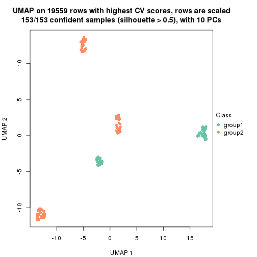</p>

</div>
<div id='tab-CV-kmeans-dimension-reduction-2'>
<pre><code class="r">dimension_reduction(res, k = 3, method = &quot;UMAP&quot;)
</code></pre>

<p></p>

</div>
<div id='tab-CV-kmeans-dimension-reduction-3'>
<pre><code class="r">dimension_reduction(res, k = 4, method = &quot;UMAP&quot;)
</code></pre>

<p></p>

</div>
<div id='tab-CV-kmeans-dimension-reduction-4'>
<pre><code class="r">dimension_reduction(res, k = 5, method = &quot;UMAP&quot;)
</code></pre>

<p></p>

</div>
<div id='tab-CV-kmeans-dimension-reduction-5'>
<pre><code class="r">dimension_reduction(res, k = 6, method = &quot;UMAP&quot;)
</code></pre>

<p></p>

</div>
</div>


Following heatmap shows how subgroups are split when increasing `k`:

```r
collect_classes(res)
```


Test correlation between subgroups and known annotations. If the known
annotation is numeric, one-way ANOVA test is applied, and if the known
annotation is discrete, chi-squared contingency table test is applied.

```r
test_to_known_factors(res)
```

```
#>             n individual(p) disease.state(p) cell.type(p) k
#> CV:kmeans 153             1            1.000     4.63e-32 2
#> CV:kmeans 153             1            1.000     4.63e-32 3
#> CV:kmeans 153             1            0.964     1.16e-90 4
#> CV:kmeans 153             1            0.989    6.51e-120 5
#> CV:kmeans 153             1            0.989    6.51e-120 6
```


If matrix rows can be associated to genes, consider to use `functional_enrichment(res,
...)` to perform function enrichment for the signature genes. See [this vignette](http://bioconductor.org/packages/devel/bioc/vignettes/cola/inst/doc/functional_enrichment.html) for more detailed explanations.


 

---------------------------------------------------


### CV:skmeans**


The object with results only for a single top-value method and a single partition method 
can be extracted as:

```r
res = res_list["CV", "skmeans"]
# you can also extract it by
# res = res_list["CV:skmeans"]
```

A summary of `res` and all the functions that can be applied to it:

```r
res
```

```
#> A 'ConsensusPartition' object with k = 2, 3, 4, 5, 6.
#>   On a matrix with 19559 rows and 153 columns.
#>   Top rows (1000, 2000, 3000, 4000, 5000) are extracted by 'CV' method.
#>   Subgroups are detected by 'skmeans' method.
#>   Performed in total 1250 partitions by row resampling.
#>   Best k for subgroups seems to be 5.
#> 
#> Following methods can be applied to this 'ConsensusPartition' object:
#>  [1] "cola_report"             "collect_classes"         "collect_plots"          
#>  [4] "collect_stats"           "colnames"                "compare_signatures"     
#>  [7] "consensus_heatmap"       "dimension_reduction"     "functional_enrichment"  
#> [10] "get_anno_col"            "get_anno"                "get_classes"            
#> [13] "get_consensus"           "get_matrix"              "get_membership"         
#> [16] "get_param"               "get_signatures"          "get_stats"              
#> [19] "is_best_k"               "is_stable_k"             "membership_heatmap"     
#> [22] "ncol"                    "nrow"                    "plot_ecdf"              
#> [25] "rownames"                "select_partition_number" "show"                   
#> [28] "suggest_best_k"          "test_to_known_factors"
```

`collect_plots()` function collects all the plots made from `res` for all `k` (number of partitions)
into one single page to provide an easy and fast comparison between different `k`.

```r
collect_plots(res)
```

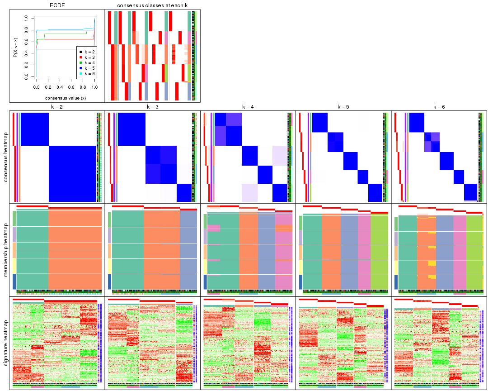

The plots are:

- The first row: a plot of the ECDF (empirical cumulative distribution
  function) curves of the consensus matrix for each `k` and the heatmap of
  predicted classes for each `k`.
- The second row: heatmaps of the consensus matrix for each `k`.
- The third row: heatmaps of the membership matrix for each `k`.
- The fouth row: heatmaps of the signatures for each `k`.

All the plots in panels can be made by individual functions and they are
plotted later in this section.

`select_partition_number()` produces several plots showing different
statistics for choosing "optimized" `k`. There are following statistics:

- ECDF curves of the consensus matrix for each `k`;
- 1-PAC. [The PAC
  score](https://en.wikipedia.org/wiki/Consensus_clustering#Over-interpretation_potential_of_consensus_clustering)
  measures the proportion of the ambiguous subgrouping.
- Mean silhouette score.
- Concordance. The mean probability of fiting the consensus class ids in all
  partitions.
- Area increased. Denote $A_k$ as the area under the ECDF curve for current
  `k`, the area increased is defined as $A_k - A_{k-1}$.
- Rand index. The percent of pairs of samples that are both in a same cluster
  or both are not in a same cluster in the partition of k and k-1.
- Jaccard index. The ratio of pairs of samples are both in a same cluster in
  the partition of k and k-1 and the pairs of samples are both in a same
  cluster in the partition k or k-1.

The detailed explanations of these statistics can be found in [the _cola_
vignette](http://bioconductor.org/packages/devel/bioc/vignettes/cola/inst/doc/cola.html#toc_13).

Generally speaking, lower PAC score, higher mean silhouette score or higher
concordance corresponds to better partition. Rand index and Jaccard index
measure how similar the current partition is compared to partition with `k-1`.
If they are too similar, we won't accept `k` is better than `k-1`.

```r
select_partition_number(res)
```


The numeric values for all these statistics can be obtained by `get_stats()`.

```r
get_stats(res)
```

```
#>   k 1-PAC mean_silhouette concordance area_increased  Rand Jaccard
#> 2 2 1.000           1.000       1.000         0.4711 0.529   0.529
#> 3 3 1.000           0.996       0.996         0.3677 0.827   0.673
#> 4 4 0.842           0.979       0.951         0.1354 0.909   0.745
#> 5 5 1.000           0.999       0.998         0.0957 0.933   0.747
#> 6 6 0.971           0.978       0.978         0.0113 0.995   0.975
```

`suggest_best_k()` suggests the best $k$ based on these statistics. The rules are as follows:

- All $k$ with Jaccard index larger than 0.95 are removed because increasing
  $k$ does not provide enough extra information. If all $k$ are removed, it is
  marked as no subgroup is detected.
- For all $k$ with 1-PAC score larger than 0.9, the maximal $k$ is taken as
  the best $k$, and other $k$ are marked as optional $k$.
- If it does not fit the second rule. The $k$ with the maximal vote of the
  highest 1-PAC score, highest mean silhouette, and highest concordance is
  taken as the best $k$.

```r
suggest_best_k(res)
```

```
#> [1] 5
#> attr(,"optional")
#> [1] 2 3
```

There is also optional best $k$ = 2 3 that is worth to check.

Following shows the table of the partitions (You need to click the **show/hide
code output** link to see it). The membership matrix (columns with name `p*`)
is inferred by
[`clue::cl_consensus()`](https://www.rdocumentation.org/link/cl_consensus?package=clue)
function with the `SE` method. Basically the value in the membership matrix
represents the probability to belong to a certain group. The finall class
label for an item is determined with the group with highest probability it
belongs to.

In `get_classes()` function, the entropy is calculated from the membership
matrix and the silhouette score is calculated from the consensus matrix.


<script>
$( function() {
	$( '#tabs-CV-skmeans-get-classes' ).tabs();
} );
</script>
<div id='tabs-CV-skmeans-get-classes'>
<ul>
<li><a href='#tab-CV-skmeans-get-classes-1'>k = 2</a></li>
<li><a href='#tab-CV-skmeans-get-classes-2'>k = 3</a></li>
<li><a href='#tab-CV-skmeans-get-classes-3'>k = 4</a></li>
<li><a href='#tab-CV-skmeans-get-classes-4'>k = 5</a></li>
<li><a href='#tab-CV-skmeans-get-classes-5'>k = 6</a></li>
</ul>

<div id='tab-CV-skmeans-get-classes-1'>
<p><a id='tab-CV-skmeans-get-classes-1-a' style='color:#0366d6' href='#'>show/hide code output</a></p>
<pre><code class="r">cbind(get_classes(res, k = 2), get_membership(res, k = 2))
</code></pre>

<pre><code>#&gt;           class entropy silhouette p1 p2
#&gt; GSM247795     2       0          1  0  1
#&gt; GSM247854     2       0          1  0  1
#&gt; GSM247758     2       0          1  0  1
#&gt; GSM247742     1       0          1  1  0
#&gt; GSM247755     2       0          1  0  1
#&gt; GSM247841     1       0          1  1  0
#&gt; GSM247703     2       0          1  0  1
#&gt; GSM247739     2       0          1  0  1
#&gt; GSM247715     1       0          1  1  0
#&gt; GSM247829     2       0          1  0  1
#&gt; GSM247842     1       0          1  1  0
#&gt; GSM247805     2       0          1  0  1
#&gt; GSM247786     2       0          1  0  1
#&gt; GSM247812     2       0          1  0  1
#&gt; GSM247776     1       0          1  1  0
#&gt; GSM247850     1       0          1  1  0
#&gt; GSM247717     2       0          1  0  1
#&gt; GSM247784     2       0          1  0  1
#&gt; GSM247834     1       0          1  1  0
#&gt; GSM247783     2       0          1  0  1
#&gt; GSM247846     1       0          1  1  0
#&gt; GSM247822     2       0          1  0  1
#&gt; GSM247710     2       0          1  0  1
#&gt; GSM247713     1       0          1  1  0
#&gt; GSM247840     2       0          1  0  1
#&gt; GSM247733     1       0          1  1  0
#&gt; GSM247852     1       0          1  1  0
#&gt; GSM247790     2       0          1  0  1
#&gt; GSM247730     2       0          1  0  1
#&gt; GSM247824     2       0          1  0  1
#&gt; GSM247770     1       0          1  1  0
#&gt; GSM247711     2       0          1  0  1
#&gt; GSM247782     2       0          1  0  1
#&gt; GSM247836     1       0          1  1  0
#&gt; GSM247785     2       0          1  0  1
#&gt; GSM247847     1       0          1  1  0
#&gt; GSM247750     2       0          1  0  1
#&gt; GSM247788     2       0          1  0  1
#&gt; GSM247849     1       0          1  1  0
#&gt; GSM247772     2       0          1  0  1
#&gt; GSM247760     1       0          1  1  0
#&gt; GSM247764     2       0          1  0  1
#&gt; GSM247851     2       0          1  0  1
#&gt; GSM247714     2       0          1  0  1
#&gt; GSM247828     1       0          1  1  0
#&gt; GSM247704     2       0          1  0  1
#&gt; GSM247818     1       0          1  1  0
#&gt; GSM247823     2       0          1  0  1
#&gt; GSM247706     2       0          1  0  1
#&gt; GSM247835     2       0          1  0  1
#&gt; GSM247734     1       0          1  1  0
#&gt; GSM247819     2       0          1  0  1
#&gt; GSM247809     2       0          1  0  1
#&gt; GSM247830     2       0          1  0  1
#&gt; GSM247833     1       0          1  1  0
#&gt; GSM247738     2       0          1  0  1
#&gt; GSM247716     2       0          1  0  1
#&gt; GSM247747     2       0          1  0  1
#&gt; GSM247722     1       0          1  1  0
#&gt; GSM247816     2       0          1  0  1
#&gt; GSM247839     2       0          1  0  1
#&gt; GSM247821     1       0          1  1  0
#&gt; GSM247798     2       0          1  0  1
#&gt; GSM247838     1       0          1  1  0
#&gt; GSM247721     2       0          1  0  1
#&gt; GSM247781     2       0          1  0  1
#&gt; GSM247762     1       0          1  1  0
#&gt; GSM247825     2       0          1  0  1
#&gt; GSM247777     1       0          1  1  0
#&gt; GSM247761     2       0          1  0  1
#&gt; GSM247720     2       0          1  0  1
#&gt; GSM247814     2       0          1  0  1
#&gt; GSM247732     1       0          1  1  0
#&gt; GSM247708     2       0          1  0  1
#&gt; GSM247740     2       0          1  0  1
#&gt; GSM247749     1       0          1  1  0
#&gt; GSM247767     2       0          1  0  1
#&gt; GSM247748     1       0          1  1  0
#&gt; GSM247705     2       0          1  0  1
#&gt; GSM247746     2       0          1  0  1
#&gt; GSM247752     1       0          1  1  0
#&gt; GSM247769     2       0          1  0  1
#&gt; GSM247753     1       0          1  1  0
#&gt; GSM247723     2       0          1  0  1
#&gt; GSM247779     2       0          1  0  1
#&gt; GSM247756     1       0          1  1  0
#&gt; GSM247826     2       0          1  0  1
#&gt; GSM247775     1       0          1  1  0
#&gt; GSM247741     2       0          1  0  1
#&gt; GSM247799     2       0          1  0  1
#&gt; GSM247778     1       0          1  1  0
#&gt; GSM247806     2       0          1  0  1
#&gt; GSM247815     1       0          1  1  0
#&gt; GSM247735     2       0          1  0  1
#&gt; GSM247831     2       0          1  0  1
#&gt; GSM247845     1       0          1  1  0
#&gt; GSM247791     2       0          1  0  1
#&gt; GSM247780     1       0          1  1  0
#&gt; GSM247853     1       0          1  1  0
#&gt; GSM247800     2       0          1  0  1
#&gt; GSM247729     2       0          1  0  1
#&gt; GSM247810     1       0          1  1  0
#&gt; GSM247844     2       0          1  0  1
#&gt; GSM247793     1       0          1  1  0
#&gt; GSM247759     2       0          1  0  1
#&gt; GSM247724     2       0          1  0  1
#&gt; GSM247817     2       0          1  0  1
#&gt; GSM247727     1       0          1  1  0
#&gt; GSM247796     2       0          1  0  1
#&gt; GSM247725     2       0          1  0  1
#&gt; GSM247801     1       0          1  1  0
#&gt; GSM247731     2       0          1  0  1
#&gt; GSM247765     1       0          1  1  0
#&gt; GSM247792     2       0          1  0  1
#&gt; GSM247726     2       0          1  0  1
#&gt; GSM247803     1       0          1  1  0
#&gt; GSM247728     2       0          1  0  1
#&gt; GSM247768     1       0          1  1  0
#&gt; GSM247745     2       0          1  0  1
#&gt; GSM247855     2       0          1  0  1
#&gt; GSM247804     2       0          1  0  1
#&gt; GSM247774     1       0          1  1  0
#&gt; GSM247807     2       0          1  0  1
#&gt; GSM247813     1       0          1  1  0
#&gt; GSM247736     2       0          1  0  1
#&gt; GSM247712     2       0          1  0  1
#&gt; GSM247797     1       0          1  1  0
#&gt; GSM247743     2       0          1  0  1
#&gt; GSM247719     1       0          1  1  0
#&gt; GSM247707     2       0          1  0  1
#&gt; GSM247737     2       0          1  0  1
#&gt; GSM247827     2       0          1  0  1
#&gt; GSM247848     1       0          1  1  0
#&gt; GSM247794     2       0          1  0  1
#&gt; GSM247757     2       0          1  0  1
#&gt; GSM247744     1       0          1  1  0
#&gt; GSM247751     2       0          1  0  1
#&gt; GSM247837     1       0          1  1  0
#&gt; GSM247754     2       0          1  0  1
#&gt; GSM247789     2       0          1  0  1
#&gt; GSM247802     1       0          1  1  0
#&gt; GSM247771     2       0          1  0  1
#&gt; GSM247763     1       0          1  1  0
#&gt; GSM247808     2       0          1  0  1
#&gt; GSM247787     2       0          1  0  1
#&gt; GSM247843     1       0          1  1  0
#&gt; GSM247811     2       0          1  0  1
#&gt; GSM247773     1       0          1  1  0
#&gt; GSM247766     2       0          1  0  1
#&gt; GSM247718     2       0          1  0  1
#&gt; GSM247832     1       0          1  1  0
#&gt; GSM247709     2       0          1  0  1
#&gt; GSM247820     1       0          1  1  0
</code></pre>

<script>
$('#tab-CV-skmeans-get-classes-1-a').parent().next().next().hide();
$('#tab-CV-skmeans-get-classes-1-a').click(function(){
  $('#tab-CV-skmeans-get-classes-1-a').parent().next().next().toggle();
  return(false);
});
</script>
</div>

<div id='tab-CV-skmeans-get-classes-2'>
<p><a id='tab-CV-skmeans-get-classes-2-a' style='color:#0366d6' href='#'>show/hide code output</a></p>
<pre><code class="r">cbind(get_classes(res, k = 3), get_membership(res, k = 3))
</code></pre>

<pre><code>#&gt;           class entropy silhouette p1    p2    p3
#&gt; GSM247795     2  0.0747      0.991  0 0.984 0.016
#&gt; GSM247854     2  0.0747      0.991  0 0.984 0.016
#&gt; GSM247758     2  0.0237      0.990  0 0.996 0.004
#&gt; GSM247742     1  0.0000      1.000  1 0.000 0.000
#&gt; GSM247755     3  0.0000      1.000  0 0.000 1.000
#&gt; GSM247841     1  0.0000      1.000  1 0.000 0.000
#&gt; GSM247703     2  0.0747      0.991  0 0.984 0.016
#&gt; GSM247739     2  0.0237      0.990  0 0.996 0.004
#&gt; GSM247715     1  0.0000      1.000  1 0.000 0.000
#&gt; GSM247829     3  0.0000      1.000  0 0.000 1.000
#&gt; GSM247842     1  0.0000      1.000  1 0.000 0.000
#&gt; GSM247805     2  0.0747      0.991  0 0.984 0.016
#&gt; GSM247786     2  0.0237      0.990  0 0.996 0.004
#&gt; GSM247812     3  0.0000      1.000  0 0.000 1.000
#&gt; GSM247776     1  0.0000      1.000  1 0.000 0.000
#&gt; GSM247850     1  0.0000      1.000  1 0.000 0.000
#&gt; GSM247717     2  0.0747      0.991  0 0.984 0.016
#&gt; GSM247784     2  0.0237      0.990  0 0.996 0.004
#&gt; GSM247834     1  0.0000      1.000  1 0.000 0.000
#&gt; GSM247783     3  0.0000      1.000  0 0.000 1.000
#&gt; GSM247846     1  0.0000      1.000  1 0.000 0.000
#&gt; GSM247822     2  0.0747      0.991  0 0.984 0.016
#&gt; GSM247710     2  0.0237      0.990  0 0.996 0.004
#&gt; GSM247713     1  0.0000      1.000  1 0.000 0.000
#&gt; GSM247840     3  0.0000      1.000  0 0.000 1.000
#&gt; GSM247733     1  0.0000      1.000  1 0.000 0.000
#&gt; GSM247852     1  0.0000      1.000  1 0.000 0.000
#&gt; GSM247790     2  0.0747      0.991  0 0.984 0.016
#&gt; GSM247730     2  0.0237      0.990  0 0.996 0.004
#&gt; GSM247824     3  0.0000      1.000  0 0.000 1.000
#&gt; GSM247770     1  0.0000      1.000  1 0.000 0.000
#&gt; GSM247711     2  0.0747      0.991  0 0.984 0.016
#&gt; GSM247782     2  0.0237      0.990  0 0.996 0.004
#&gt; GSM247836     1  0.0000      1.000  1 0.000 0.000
#&gt; GSM247785     3  0.0000      1.000  0 0.000 1.000
#&gt; GSM247847     1  0.0000      1.000  1 0.000 0.000
#&gt; GSM247750     2  0.0747      0.991  0 0.984 0.016
#&gt; GSM247788     2  0.0237      0.990  0 0.996 0.004
#&gt; GSM247849     1  0.0000      1.000  1 0.000 0.000
#&gt; GSM247772     3  0.0000      1.000  0 0.000 1.000
#&gt; GSM247760     1  0.0000      1.000  1 0.000 0.000
#&gt; GSM247764     2  0.0747      0.991  0 0.984 0.016
#&gt; GSM247851     2  0.0747      0.991  0 0.984 0.016
#&gt; GSM247714     2  0.0237      0.990  0 0.996 0.004
#&gt; GSM247828     1  0.0000      1.000  1 0.000 0.000
#&gt; GSM247704     3  0.0000      1.000  0 0.000 1.000
#&gt; GSM247818     1  0.0000      1.000  1 0.000 0.000
#&gt; GSM247823     2  0.0747      0.991  0 0.984 0.016
#&gt; GSM247706     2  0.0237      0.990  0 0.996 0.004
#&gt; GSM247835     3  0.0000      1.000  0 0.000 1.000
#&gt; GSM247734     1  0.0000      1.000  1 0.000 0.000
#&gt; GSM247819     2  0.0747      0.991  0 0.984 0.016
#&gt; GSM247809     2  0.0237      0.990  0 0.996 0.004
#&gt; GSM247830     3  0.0000      1.000  0 0.000 1.000
#&gt; GSM247833     1  0.0000      1.000  1 0.000 0.000
#&gt; GSM247738     2  0.0747      0.991  0 0.984 0.016
#&gt; GSM247716     2  0.0237      0.990  0 0.996 0.004
#&gt; GSM247747     3  0.0000      1.000  0 0.000 1.000
#&gt; GSM247722     1  0.0000      1.000  1 0.000 0.000
#&gt; GSM247816     2  0.0747      0.991  0 0.984 0.016
#&gt; GSM247839     2  0.0237      0.990  0 0.996 0.004
#&gt; GSM247821     1  0.0000      1.000  1 0.000 0.000
#&gt; GSM247798     3  0.0000      1.000  0 0.000 1.000
#&gt; GSM247838     1  0.0000      1.000  1 0.000 0.000
#&gt; GSM247721     2  0.0747      0.991  0 0.984 0.016
#&gt; GSM247781     2  0.0237      0.990  0 0.996 0.004
#&gt; GSM247762     1  0.0000      1.000  1 0.000 0.000
#&gt; GSM247825     3  0.0000      1.000  0 0.000 1.000
#&gt; GSM247777     1  0.0000      1.000  1 0.000 0.000
#&gt; GSM247761     2  0.0747      0.991  0 0.984 0.016
#&gt; GSM247720     2  0.0237      0.990  0 0.996 0.004
#&gt; GSM247814     3  0.0000      1.000  0 0.000 1.000
#&gt; GSM247732     1  0.0000      1.000  1 0.000 0.000
#&gt; GSM247708     2  0.0747      0.991  0 0.984 0.016
#&gt; GSM247740     2  0.0237      0.990  0 0.996 0.004
#&gt; GSM247749     1  0.0000      1.000  1 0.000 0.000
#&gt; GSM247767     3  0.0000      1.000  0 0.000 1.000
#&gt; GSM247748     1  0.0000      1.000  1 0.000 0.000
#&gt; GSM247705     2  0.0747      0.991  0 0.984 0.016
#&gt; GSM247746     2  0.0237      0.990  0 0.996 0.004
#&gt; GSM247752     1  0.0000      1.000  1 0.000 0.000
#&gt; GSM247769     3  0.0000      1.000  0 0.000 1.000
#&gt; GSM247753     1  0.0000      1.000  1 0.000 0.000
#&gt; GSM247723     2  0.0747      0.991  0 0.984 0.016
#&gt; GSM247779     2  0.0237      0.990  0 0.996 0.004
#&gt; GSM247756     1  0.0000      1.000  1 0.000 0.000
#&gt; GSM247826     3  0.0000      1.000  0 0.000 1.000
#&gt; GSM247775     1  0.0000      1.000  1 0.000 0.000
#&gt; GSM247741     2  0.0747      0.991  0 0.984 0.016
#&gt; GSM247799     2  0.0237      0.990  0 0.996 0.004
#&gt; GSM247778     1  0.0000      1.000  1 0.000 0.000
#&gt; GSM247806     3  0.0000      1.000  0 0.000 1.000
#&gt; GSM247815     1  0.0000      1.000  1 0.000 0.000
#&gt; GSM247735     2  0.0747      0.991  0 0.984 0.016
#&gt; GSM247831     2  0.0237      0.990  0 0.996 0.004
#&gt; GSM247845     1  0.0000      1.000  1 0.000 0.000
#&gt; GSM247791     3  0.0000      1.000  0 0.000 1.000
#&gt; GSM247780     1  0.0000      1.000  1 0.000 0.000
#&gt; GSM247853     1  0.0000      1.000  1 0.000 0.000
#&gt; GSM247800     2  0.0747      0.991  0 0.984 0.016
#&gt; GSM247729     2  0.0237      0.990  0 0.996 0.004
#&gt; GSM247810     1  0.0000      1.000  1 0.000 0.000
#&gt; GSM247844     3  0.0000      1.000  0 0.000 1.000
#&gt; GSM247793     1  0.0000      1.000  1 0.000 0.000
#&gt; GSM247759     2  0.0747      0.991  0 0.984 0.016
#&gt; GSM247724     2  0.0237      0.990  0 0.996 0.004
#&gt; GSM247817     3  0.0000      1.000  0 0.000 1.000
#&gt; GSM247727     1  0.0000      1.000  1 0.000 0.000
#&gt; GSM247796     2  0.0747      0.991  0 0.984 0.016
#&gt; GSM247725     2  0.0237      0.990  0 0.996 0.004
#&gt; GSM247801     1  0.0000      1.000  1 0.000 0.000
#&gt; GSM247731     3  0.0000      1.000  0 0.000 1.000
#&gt; GSM247765     1  0.0000      1.000  1 0.000 0.000
#&gt; GSM247792     2  0.0747      0.991  0 0.984 0.016
#&gt; GSM247726     2  0.0237      0.990  0 0.996 0.004
#&gt; GSM247803     1  0.0000      1.000  1 0.000 0.000
#&gt; GSM247728     3  0.0000      1.000  0 0.000 1.000
#&gt; GSM247768     1  0.0000      1.000  1 0.000 0.000
#&gt; GSM247745     2  0.0747      0.991  0 0.984 0.016
#&gt; GSM247855     2  0.0747      0.991  0 0.984 0.016
#&gt; GSM247804     2  0.0237      0.990  0 0.996 0.004
#&gt; GSM247774     1  0.0000      1.000  1 0.000 0.000
#&gt; GSM247807     3  0.0000      1.000  0 0.000 1.000
#&gt; GSM247813     1  0.0000      1.000  1 0.000 0.000
#&gt; GSM247736     2  0.0747      0.991  0 0.984 0.016
#&gt; GSM247712     2  0.0237      0.990  0 0.996 0.004
#&gt; GSM247797     1  0.0000      1.000  1 0.000 0.000
#&gt; GSM247743     3  0.0000      1.000  0 0.000 1.000
#&gt; GSM247719     1  0.0000      1.000  1 0.000 0.000
#&gt; GSM247707     2  0.0747      0.991  0 0.984 0.016
#&gt; GSM247737     2  0.0237      0.990  0 0.996 0.004
#&gt; GSM247827     3  0.0000      1.000  0 0.000 1.000
#&gt; GSM247848     1  0.0000      1.000  1 0.000 0.000
#&gt; GSM247794     2  0.0747      0.991  0 0.984 0.016
#&gt; GSM247757     2  0.0237      0.990  0 0.996 0.004
#&gt; GSM247744     1  0.0000      1.000  1 0.000 0.000
#&gt; GSM247751     3  0.0000      1.000  0 0.000 1.000
#&gt; GSM247837     1  0.0000      1.000  1 0.000 0.000
#&gt; GSM247754     2  0.0747      0.991  0 0.984 0.016
#&gt; GSM247789     2  0.0237      0.990  0 0.996 0.004
#&gt; GSM247802     1  0.0000      1.000  1 0.000 0.000
#&gt; GSM247771     3  0.0000      1.000  0 0.000 1.000
#&gt; GSM247763     1  0.0000      1.000  1 0.000 0.000
#&gt; GSM247808     2  0.0747      0.991  0 0.984 0.016
#&gt; GSM247787     2  0.0237      0.990  0 0.996 0.004
#&gt; GSM247843     1  0.0000      1.000  1 0.000 0.000
#&gt; GSM247811     3  0.0000      1.000  0 0.000 1.000
#&gt; GSM247773     1  0.0000      1.000  1 0.000 0.000
#&gt; GSM247766     2  0.0747      0.991  0 0.984 0.016
#&gt; GSM247718     2  0.0237      0.990  0 0.996 0.004
#&gt; GSM247832     1  0.0000      1.000  1 0.000 0.000
#&gt; GSM247709     3  0.0000      1.000  0 0.000 1.000
#&gt; GSM247820     1  0.0000      1.000  1 0.000 0.000
</code></pre>

<script>
$('#tab-CV-skmeans-get-classes-2-a').parent().next().next().hide();
$('#tab-CV-skmeans-get-classes-2-a').click(function(){
  $('#tab-CV-skmeans-get-classes-2-a').parent().next().next().toggle();
  return(false);
});
</script>
</div>

<div id='tab-CV-skmeans-get-classes-3'>
<p><a id='tab-CV-skmeans-get-classes-3-a' style='color:#0366d6' href='#'>show/hide code output</a></p>
<pre><code class="r">cbind(get_classes(res, k = 4), get_membership(res, k = 4))
</code></pre>

<pre><code>#&gt;           class entropy silhouette   p1   p2    p3    p4
#&gt; GSM247795     2   0.305      1.000 0.00 0.86 0.004 0.136
#&gt; GSM247854     2   0.305      1.000 0.00 0.86 0.004 0.136
#&gt; GSM247758     4   0.000      1.000 0.00 0.00 0.000 1.000
#&gt; GSM247742     1   0.292      0.928 0.86 0.14 0.000 0.000
#&gt; GSM247755     3   0.000      1.000 0.00 0.00 1.000 0.000
#&gt; GSM247841     1   0.000      0.952 1.00 0.00 0.000 0.000
#&gt; GSM247703     2   0.305      1.000 0.00 0.86 0.004 0.136
#&gt; GSM247739     4   0.000      1.000 0.00 0.00 0.000 1.000
#&gt; GSM247715     1   0.292      0.928 0.86 0.14 0.000 0.000
#&gt; GSM247829     3   0.000      1.000 0.00 0.00 1.000 0.000
#&gt; GSM247842     1   0.000      0.952 1.00 0.00 0.000 0.000
#&gt; GSM247805     2   0.305      1.000 0.00 0.86 0.004 0.136
#&gt; GSM247786     4   0.000      1.000 0.00 0.00 0.000 1.000
#&gt; GSM247812     3   0.000      1.000 0.00 0.00 1.000 0.000
#&gt; GSM247776     1   0.000      0.952 1.00 0.00 0.000 0.000
#&gt; GSM247850     1   0.000      0.952 1.00 0.00 0.000 0.000
#&gt; GSM247717     2   0.305      1.000 0.00 0.86 0.004 0.136
#&gt; GSM247784     4   0.000      1.000 0.00 0.00 0.000 1.000
#&gt; GSM247834     1   0.292      0.928 0.86 0.14 0.000 0.000
#&gt; GSM247783     3   0.000      1.000 0.00 0.00 1.000 0.000
#&gt; GSM247846     1   0.000      0.952 1.00 0.00 0.000 0.000
#&gt; GSM247822     2   0.305      1.000 0.00 0.86 0.004 0.136
#&gt; GSM247710     4   0.000      1.000 0.00 0.00 0.000 1.000
#&gt; GSM247713     1   0.292      0.928 0.86 0.14 0.000 0.000
#&gt; GSM247840     3   0.000      1.000 0.00 0.00 1.000 0.000
#&gt; GSM247733     1   0.000      0.952 1.00 0.00 0.000 0.000
#&gt; GSM247852     1   0.000      0.952 1.00 0.00 0.000 0.000
#&gt; GSM247790     2   0.305      1.000 0.00 0.86 0.004 0.136
#&gt; GSM247730     4   0.000      1.000 0.00 0.00 0.000 1.000
#&gt; GSM247824     3   0.000      1.000 0.00 0.00 1.000 0.000
#&gt; GSM247770     1   0.000      0.952 1.00 0.00 0.000 0.000
#&gt; GSM247711     2   0.305      1.000 0.00 0.86 0.004 0.136
#&gt; GSM247782     4   0.000      1.000 0.00 0.00 0.000 1.000
#&gt; GSM247836     1   0.292      0.928 0.86 0.14 0.000 0.000
#&gt; GSM247785     3   0.000      1.000 0.00 0.00 1.000 0.000
#&gt; GSM247847     1   0.000      0.952 1.00 0.00 0.000 0.000
#&gt; GSM247750     2   0.305      1.000 0.00 0.86 0.004 0.136
#&gt; GSM247788     4   0.000      1.000 0.00 0.00 0.000 1.000
#&gt; GSM247849     1   0.292      0.928 0.86 0.14 0.000 0.000
#&gt; GSM247772     3   0.000      1.000 0.00 0.00 1.000 0.000
#&gt; GSM247760     1   0.000      0.952 1.00 0.00 0.000 0.000
#&gt; GSM247764     2   0.305      1.000 0.00 0.86 0.004 0.136
#&gt; GSM247851     2   0.305      1.000 0.00 0.86 0.004 0.136
#&gt; GSM247714     4   0.000      1.000 0.00 0.00 0.000 1.000
#&gt; GSM247828     1   0.292      0.928 0.86 0.14 0.000 0.000
#&gt; GSM247704     3   0.000      1.000 0.00 0.00 1.000 0.000
#&gt; GSM247818     1   0.000      0.952 1.00 0.00 0.000 0.000
#&gt; GSM247823     2   0.305      1.000 0.00 0.86 0.004 0.136
#&gt; GSM247706     4   0.000      1.000 0.00 0.00 0.000 1.000
#&gt; GSM247835     3   0.000      1.000 0.00 0.00 1.000 0.000
#&gt; GSM247734     1   0.000      0.952 1.00 0.00 0.000 0.000
#&gt; GSM247819     2   0.305      1.000 0.00 0.86 0.004 0.136
#&gt; GSM247809     4   0.000      1.000 0.00 0.00 0.000 1.000
#&gt; GSM247830     3   0.000      1.000 0.00 0.00 1.000 0.000
#&gt; GSM247833     1   0.000      0.952 1.00 0.00 0.000 0.000
#&gt; GSM247738     2   0.305      1.000 0.00 0.86 0.004 0.136
#&gt; GSM247716     4   0.000      1.000 0.00 0.00 0.000 1.000
#&gt; GSM247747     3   0.000      1.000 0.00 0.00 1.000 0.000
#&gt; GSM247722     1   0.000      0.952 1.00 0.00 0.000 0.000
#&gt; GSM247816     2   0.305      1.000 0.00 0.86 0.004 0.136
#&gt; GSM247839     4   0.000      1.000 0.00 0.00 0.000 1.000
#&gt; GSM247821     1   0.292      0.928 0.86 0.14 0.000 0.000
#&gt; GSM247798     3   0.000      1.000 0.00 0.00 1.000 0.000
#&gt; GSM247838     1   0.000      0.952 1.00 0.00 0.000 0.000
#&gt; GSM247721     2   0.305      1.000 0.00 0.86 0.004 0.136
#&gt; GSM247781     4   0.000      1.000 0.00 0.00 0.000 1.000
#&gt; GSM247762     1   0.292      0.928 0.86 0.14 0.000 0.000
#&gt; GSM247825     3   0.000      1.000 0.00 0.00 1.000 0.000
#&gt; GSM247777     1   0.000      0.952 1.00 0.00 0.000 0.000
#&gt; GSM247761     2   0.305      1.000 0.00 0.86 0.004 0.136
#&gt; GSM247720     4   0.000      1.000 0.00 0.00 0.000 1.000
#&gt; GSM247814     3   0.000      1.000 0.00 0.00 1.000 0.000
#&gt; GSM247732     1   0.000      0.952 1.00 0.00 0.000 0.000
#&gt; GSM247708     2   0.305      1.000 0.00 0.86 0.004 0.136
#&gt; GSM247740     4   0.000      1.000 0.00 0.00 0.000 1.000
#&gt; GSM247749     1   0.292      0.928 0.86 0.14 0.000 0.000
#&gt; GSM247767     3   0.000      1.000 0.00 0.00 1.000 0.000
#&gt; GSM247748     1   0.000      0.952 1.00 0.00 0.000 0.000
#&gt; GSM247705     2   0.305      1.000 0.00 0.86 0.004 0.136
#&gt; GSM247746     4   0.000      1.000 0.00 0.00 0.000 1.000
#&gt; GSM247752     1   0.292      0.928 0.86 0.14 0.000 0.000
#&gt; GSM247769     3   0.000      1.000 0.00 0.00 1.000 0.000
#&gt; GSM247753     1   0.000      0.952 1.00 0.00 0.000 0.000
#&gt; GSM247723     2   0.305      1.000 0.00 0.86 0.004 0.136
#&gt; GSM247779     4   0.000      1.000 0.00 0.00 0.000 1.000
#&gt; GSM247756     1   0.292      0.928 0.86 0.14 0.000 0.000
#&gt; GSM247826     3   0.000      1.000 0.00 0.00 1.000 0.000
#&gt; GSM247775     1   0.000      0.952 1.00 0.00 0.000 0.000
#&gt; GSM247741     2   0.305      1.000 0.00 0.86 0.004 0.136
#&gt; GSM247799     4   0.000      1.000 0.00 0.00 0.000 1.000
#&gt; GSM247778     1   0.292      0.928 0.86 0.14 0.000 0.000
#&gt; GSM247806     3   0.000      1.000 0.00 0.00 1.000 0.000
#&gt; GSM247815     1   0.000      0.952 1.00 0.00 0.000 0.000
#&gt; GSM247735     2   0.305      1.000 0.00 0.86 0.004 0.136
#&gt; GSM247831     4   0.000      1.000 0.00 0.00 0.000 1.000
#&gt; GSM247845     1   0.292      0.928 0.86 0.14 0.000 0.000
#&gt; GSM247791     3   0.000      1.000 0.00 0.00 1.000 0.000
#&gt; GSM247780     1   0.000      0.952 1.00 0.00 0.000 0.000
#&gt; GSM247853     1   0.000      0.952 1.00 0.00 0.000 0.000
#&gt; GSM247800     2   0.305      1.000 0.00 0.86 0.004 0.136
#&gt; GSM247729     4   0.000      1.000 0.00 0.00 0.000 1.000
#&gt; GSM247810     1   0.292      0.928 0.86 0.14 0.000 0.000
#&gt; GSM247844     3   0.000      1.000 0.00 0.00 1.000 0.000
#&gt; GSM247793     1   0.000      0.952 1.00 0.00 0.000 0.000
#&gt; GSM247759     2   0.305      1.000 0.00 0.86 0.004 0.136
#&gt; GSM247724     4   0.000      1.000 0.00 0.00 0.000 1.000
#&gt; GSM247817     3   0.000      1.000 0.00 0.00 1.000 0.000
#&gt; GSM247727     1   0.000      0.952 1.00 0.00 0.000 0.000
#&gt; GSM247796     2   0.305      1.000 0.00 0.86 0.004 0.136
#&gt; GSM247725     4   0.000      1.000 0.00 0.00 0.000 1.000
#&gt; GSM247801     1   0.292      0.928 0.86 0.14 0.000 0.000
#&gt; GSM247731     3   0.000      1.000 0.00 0.00 1.000 0.000
#&gt; GSM247765     1   0.000      0.952 1.00 0.00 0.000 0.000
#&gt; GSM247792     2   0.305      1.000 0.00 0.86 0.004 0.136
#&gt; GSM247726     4   0.000      1.000 0.00 0.00 0.000 1.000
#&gt; GSM247803     1   0.292      0.928 0.86 0.14 0.000 0.000
#&gt; GSM247728     3   0.000      1.000 0.00 0.00 1.000 0.000
#&gt; GSM247768     1   0.000      0.952 1.00 0.00 0.000 0.000
#&gt; GSM247745     2   0.305      1.000 0.00 0.86 0.004 0.136
#&gt; GSM247855     2   0.305      1.000 0.00 0.86 0.004 0.136
#&gt; GSM247804     4   0.000      1.000 0.00 0.00 0.000 1.000
#&gt; GSM247774     1   0.292      0.928 0.86 0.14 0.000 0.000
#&gt; GSM247807     3   0.000      1.000 0.00 0.00 1.000 0.000
#&gt; GSM247813     1   0.000      0.952 1.00 0.00 0.000 0.000
#&gt; GSM247736     2   0.305      1.000 0.00 0.86 0.004 0.136
#&gt; GSM247712     4   0.000      1.000 0.00 0.00 0.000 1.000
#&gt; GSM247797     1   0.292      0.928 0.86 0.14 0.000 0.000
#&gt; GSM247743     3   0.000      1.000 0.00 0.00 1.000 0.000
#&gt; GSM247719     1   0.000      0.952 1.00 0.00 0.000 0.000
#&gt; GSM247707     2   0.305      1.000 0.00 0.86 0.004 0.136
#&gt; GSM247737     4   0.000      1.000 0.00 0.00 0.000 1.000
#&gt; GSM247827     3   0.000      1.000 0.00 0.00 1.000 0.000
#&gt; GSM247848     1   0.000      0.952 1.00 0.00 0.000 0.000
#&gt; GSM247794     2   0.305      1.000 0.00 0.86 0.004 0.136
#&gt; GSM247757     4   0.000      1.000 0.00 0.00 0.000 1.000
#&gt; GSM247744     1   0.292      0.928 0.86 0.14 0.000 0.000
#&gt; GSM247751     3   0.000      1.000 0.00 0.00 1.000 0.000
#&gt; GSM247837     1   0.000      0.952 1.00 0.00 0.000 0.000
#&gt; GSM247754     2   0.305      1.000 0.00 0.86 0.004 0.136
#&gt; GSM247789     4   0.000      1.000 0.00 0.00 0.000 1.000
#&gt; GSM247802     1   0.292      0.928 0.86 0.14 0.000 0.000
#&gt; GSM247771     3   0.000      1.000 0.00 0.00 1.000 0.000
#&gt; GSM247763     1   0.000      0.952 1.00 0.00 0.000 0.000
#&gt; GSM247808     2   0.305      1.000 0.00 0.86 0.004 0.136
#&gt; GSM247787     4   0.000      1.000 0.00 0.00 0.000 1.000
#&gt; GSM247843     1   0.292      0.928 0.86 0.14 0.000 0.000
#&gt; GSM247811     3   0.000      1.000 0.00 0.00 1.000 0.000
#&gt; GSM247773     1   0.000      0.952 1.00 0.00 0.000 0.000
#&gt; GSM247766     2   0.305      1.000 0.00 0.86 0.004 0.136
#&gt; GSM247718     4   0.000      1.000 0.00 0.00 0.000 1.000
#&gt; GSM247832     1   0.292      0.928 0.86 0.14 0.000 0.000
#&gt; GSM247709     3   0.000      1.000 0.00 0.00 1.000 0.000
#&gt; GSM247820     1   0.000      0.952 1.00 0.00 0.000 0.000
</code></pre>

<script>
$('#tab-CV-skmeans-get-classes-3-a').parent().next().next().hide();
$('#tab-CV-skmeans-get-classes-3-a').click(function(){
  $('#tab-CV-skmeans-get-classes-3-a').parent().next().next().toggle();
  return(false);
});
</script>
</div>

<div id='tab-CV-skmeans-get-classes-4'>
<p><a id='tab-CV-skmeans-get-classes-4-a' style='color:#0366d6' href='#'>show/hide code output</a></p>
<pre><code class="r">cbind(get_classes(res, k = 5), get_membership(res, k = 5))
</code></pre>

<pre><code>#&gt;           class entropy silhouette    p1    p2 p3    p4 p5
#&gt; GSM247795     2  0.0000      0.997 0.000 1.000  0 0.000  0
#&gt; GSM247854     2  0.0000      0.997 0.000 1.000  0 0.000  0
#&gt; GSM247758     5  0.0000      1.000 0.000 0.000  0 0.000  1
#&gt; GSM247742     4  0.0290      1.000 0.008 0.000  0 0.992  0
#&gt; GSM247755     3  0.0000      1.000 0.000 0.000  1 0.000  0
#&gt; GSM247841     1  0.0000      1.000 1.000 0.000  0 0.000  0
#&gt; GSM247703     2  0.0000      0.997 0.000 1.000  0 0.000  0
#&gt; GSM247739     5  0.0000      1.000 0.000 0.000  0 0.000  1
#&gt; GSM247715     4  0.0290      1.000 0.008 0.000  0 0.992  0
#&gt; GSM247829     3  0.0000      1.000 0.000 0.000  1 0.000  0
#&gt; GSM247842     1  0.0000      1.000 1.000 0.000  0 0.000  0
#&gt; GSM247805     2  0.0000      0.997 0.000 1.000  0 0.000  0
#&gt; GSM247786     5  0.0000      1.000 0.000 0.000  0 0.000  1
#&gt; GSM247812     3  0.0000      1.000 0.000 0.000  1 0.000  0
#&gt; GSM247776     1  0.0000      1.000 1.000 0.000  0 0.000  0
#&gt; GSM247850     1  0.0000      1.000 1.000 0.000  0 0.000  0
#&gt; GSM247717     2  0.0000      0.997 0.000 1.000  0 0.000  0
#&gt; GSM247784     5  0.0000      1.000 0.000 0.000  0 0.000  1
#&gt; GSM247834     4  0.0290      1.000 0.008 0.000  0 0.992  0
#&gt; GSM247783     3  0.0000      1.000 0.000 0.000  1 0.000  0
#&gt; GSM247846     1  0.0000      1.000 1.000 0.000  0 0.000  0
#&gt; GSM247822     2  0.0290      0.997 0.000 0.992  0 0.008  0
#&gt; GSM247710     5  0.0000      1.000 0.000 0.000  0 0.000  1
#&gt; GSM247713     4  0.0290      1.000 0.008 0.000  0 0.992  0
#&gt; GSM247840     3  0.0000      1.000 0.000 0.000  1 0.000  0
#&gt; GSM247733     1  0.0000      1.000 1.000 0.000  0 0.000  0
#&gt; GSM247852     1  0.0000      1.000 1.000 0.000  0 0.000  0
#&gt; GSM247790     2  0.0000      0.997 0.000 1.000  0 0.000  0
#&gt; GSM247730     5  0.0000      1.000 0.000 0.000  0 0.000  1
#&gt; GSM247824     3  0.0000      1.000 0.000 0.000  1 0.000  0
#&gt; GSM247770     1  0.0000      1.000 1.000 0.000  0 0.000  0
#&gt; GSM247711     2  0.0000      0.997 0.000 1.000  0 0.000  0
#&gt; GSM247782     5  0.0000      1.000 0.000 0.000  0 0.000  1
#&gt; GSM247836     4  0.0290      1.000 0.008 0.000  0 0.992  0
#&gt; GSM247785     3  0.0000      1.000 0.000 0.000  1 0.000  0
#&gt; GSM247847     1  0.0000      1.000 1.000 0.000  0 0.000  0
#&gt; GSM247750     2  0.0000      0.997 0.000 1.000  0 0.000  0
#&gt; GSM247788     5  0.0000      1.000 0.000 0.000  0 0.000  1
#&gt; GSM247849     4  0.0290      1.000 0.008 0.000  0 0.992  0
#&gt; GSM247772     3  0.0000      1.000 0.000 0.000  1 0.000  0
#&gt; GSM247760     1  0.0000      1.000 1.000 0.000  0 0.000  0
#&gt; GSM247764     2  0.0290      0.997 0.000 0.992  0 0.008  0
#&gt; GSM247851     2  0.0290      0.997 0.000 0.992  0 0.008  0
#&gt; GSM247714     5  0.0000      1.000 0.000 0.000  0 0.000  1
#&gt; GSM247828     4  0.0290      1.000 0.008 0.000  0 0.992  0
#&gt; GSM247704     3  0.0000      1.000 0.000 0.000  1 0.000  0
#&gt; GSM247818     1  0.0000      1.000 1.000 0.000  0 0.000  0
#&gt; GSM247823     2  0.0290      0.997 0.000 0.992  0 0.008  0
#&gt; GSM247706     5  0.0000      1.000 0.000 0.000  0 0.000  1
#&gt; GSM247835     3  0.0000      1.000 0.000 0.000  1 0.000  0
#&gt; GSM247734     1  0.0000      1.000 1.000 0.000  0 0.000  0
#&gt; GSM247819     2  0.0290      0.997 0.000 0.992  0 0.008  0
#&gt; GSM247809     5  0.0000      1.000 0.000 0.000  0 0.000  1
#&gt; GSM247830     3  0.0000      1.000 0.000 0.000  1 0.000  0
#&gt; GSM247833     1  0.0000      1.000 1.000 0.000  0 0.000  0
#&gt; GSM247738     2  0.0000      0.997 0.000 1.000  0 0.000  0
#&gt; GSM247716     5  0.0000      1.000 0.000 0.000  0 0.000  1
#&gt; GSM247747     3  0.0000      1.000 0.000 0.000  1 0.000  0
#&gt; GSM247722     1  0.0000      1.000 1.000 0.000  0 0.000  0
#&gt; GSM247816     2  0.0162      0.997 0.000 0.996  0 0.004  0
#&gt; GSM247839     5  0.0000      1.000 0.000 0.000  0 0.000  1
#&gt; GSM247821     4  0.0290      1.000 0.008 0.000  0 0.992  0
#&gt; GSM247798     3  0.0000      1.000 0.000 0.000  1 0.000  0
#&gt; GSM247838     1  0.0000      1.000 1.000 0.000  0 0.000  0
#&gt; GSM247721     2  0.0000      0.997 0.000 1.000  0 0.000  0
#&gt; GSM247781     5  0.0000      1.000 0.000 0.000  0 0.000  1
#&gt; GSM247762     4  0.0290      1.000 0.008 0.000  0 0.992  0
#&gt; GSM247825     3  0.0000      1.000 0.000 0.000  1 0.000  0
#&gt; GSM247777     1  0.0000      1.000 1.000 0.000  0 0.000  0
#&gt; GSM247761     2  0.0000      0.997 0.000 1.000  0 0.000  0
#&gt; GSM247720     5  0.0000      1.000 0.000 0.000  0 0.000  1
#&gt; GSM247814     3  0.0000      1.000 0.000 0.000  1 0.000  0
#&gt; GSM247732     1  0.0000      1.000 1.000 0.000  0 0.000  0
#&gt; GSM247708     2  0.0000      0.997 0.000 1.000  0 0.000  0
#&gt; GSM247740     5  0.0000      1.000 0.000 0.000  0 0.000  1
#&gt; GSM247749     4  0.0290      1.000 0.008 0.000  0 0.992  0
#&gt; GSM247767     3  0.0000      1.000 0.000 0.000  1 0.000  0
#&gt; GSM247748     1  0.0000      1.000 1.000 0.000  0 0.000  0
#&gt; GSM247705     2  0.0290      0.997 0.000 0.992  0 0.008  0
#&gt; GSM247746     5  0.0000      1.000 0.000 0.000  0 0.000  1
#&gt; GSM247752     4  0.0290      1.000 0.008 0.000  0 0.992  0
#&gt; GSM247769     3  0.0000      1.000 0.000 0.000  1 0.000  0
#&gt; GSM247753     1  0.0000      1.000 1.000 0.000  0 0.000  0
#&gt; GSM247723     2  0.0290      0.997 0.000 0.992  0 0.008  0
#&gt; GSM247779     5  0.0000      1.000 0.000 0.000  0 0.000  1
#&gt; GSM247756     4  0.0290      1.000 0.008 0.000  0 0.992  0
#&gt; GSM247826     3  0.0000      1.000 0.000 0.000  1 0.000  0
#&gt; GSM247775     1  0.0000      1.000 1.000 0.000  0 0.000  0
#&gt; GSM247741     2  0.0290      0.997 0.000 0.992  0 0.008  0
#&gt; GSM247799     5  0.0000      1.000 0.000 0.000  0 0.000  1
#&gt; GSM247778     4  0.0290      1.000 0.008 0.000  0 0.992  0
#&gt; GSM247806     3  0.0000      1.000 0.000 0.000  1 0.000  0
#&gt; GSM247815     1  0.0000      1.000 1.000 0.000  0 0.000  0
#&gt; GSM247735     2  0.0290      0.997 0.000 0.992  0 0.008  0
#&gt; GSM247831     5  0.0000      1.000 0.000 0.000  0 0.000  1
#&gt; GSM247845     4  0.0290      1.000 0.008 0.000  0 0.992  0
#&gt; GSM247791     3  0.0000      1.000 0.000 0.000  1 0.000  0
#&gt; GSM247780     1  0.0000      1.000 1.000 0.000  0 0.000  0
#&gt; GSM247853     1  0.0000      1.000 1.000 0.000  0 0.000  0
#&gt; GSM247800     2  0.0290      0.997 0.000 0.992  0 0.008  0
#&gt; GSM247729     5  0.0000      1.000 0.000 0.000  0 0.000  1
#&gt; GSM247810     4  0.0290      1.000 0.008 0.000  0 0.992  0
#&gt; GSM247844     3  0.0000      1.000 0.000 0.000  1 0.000  0
#&gt; GSM247793     1  0.0000      1.000 1.000 0.000  0 0.000  0
#&gt; GSM247759     2  0.0290      0.997 0.000 0.992  0 0.008  0
#&gt; GSM247724     5  0.0000      1.000 0.000 0.000  0 0.000  1
#&gt; GSM247817     3  0.0000      1.000 0.000 0.000  1 0.000  0
#&gt; GSM247727     1  0.0000      1.000 1.000 0.000  0 0.000  0
#&gt; GSM247796     2  0.0290      0.997 0.000 0.992  0 0.008  0
#&gt; GSM247725     5  0.0000      1.000 0.000 0.000  0 0.000  1
#&gt; GSM247801     4  0.0290      1.000 0.008 0.000  0 0.992  0
#&gt; GSM247731     3  0.0000      1.000 0.000 0.000  1 0.000  0
#&gt; GSM247765     1  0.0000      1.000 1.000 0.000  0 0.000  0
#&gt; GSM247792     2  0.0290      0.997 0.000 0.992  0 0.008  0
#&gt; GSM247726     5  0.0000      1.000 0.000 0.000  0 0.000  1
#&gt; GSM247803     4  0.0290      1.000 0.008 0.000  0 0.992  0
#&gt; GSM247728     3  0.0000      1.000 0.000 0.000  1 0.000  0
#&gt; GSM247768     1  0.0000      1.000 1.000 0.000  0 0.000  0
#&gt; GSM247745     2  0.0000      0.997 0.000 1.000  0 0.000  0
#&gt; GSM247855     2  0.0000      0.997 0.000 1.000  0 0.000  0
#&gt; GSM247804     5  0.0000      1.000 0.000 0.000  0 0.000  1
#&gt; GSM247774     4  0.0290      1.000 0.008 0.000  0 0.992  0
#&gt; GSM247807     3  0.0000      1.000 0.000 0.000  1 0.000  0
#&gt; GSM247813     1  0.0000      1.000 1.000 0.000  0 0.000  0
#&gt; GSM247736     2  0.0000      0.997 0.000 1.000  0 0.000  0
#&gt; GSM247712     5  0.0000      1.000 0.000 0.000  0 0.000  1
#&gt; GSM247797     4  0.0290      1.000 0.008 0.000  0 0.992  0
#&gt; GSM247743     3  0.0000      1.000 0.000 0.000  1 0.000  0
#&gt; GSM247719     1  0.0000      1.000 1.000 0.000  0 0.000  0
#&gt; GSM247707     2  0.0000      0.997 0.000 1.000  0 0.000  0
#&gt; GSM247737     5  0.0000      1.000 0.000 0.000  0 0.000  1
#&gt; GSM247827     3  0.0000      1.000 0.000 0.000  1 0.000  0
#&gt; GSM247848     1  0.0000      1.000 1.000 0.000  0 0.000  0
#&gt; GSM247794     2  0.0000      0.997 0.000 1.000  0 0.000  0
#&gt; GSM247757     5  0.0000      1.000 0.000 0.000  0 0.000  1
#&gt; GSM247744     4  0.0290      1.000 0.008 0.000  0 0.992  0
#&gt; GSM247751     3  0.0000      1.000 0.000 0.000  1 0.000  0
#&gt; GSM247837     1  0.0000      1.000 1.000 0.000  0 0.000  0
#&gt; GSM247754     2  0.0290      0.997 0.000 0.992  0 0.008  0
#&gt; GSM247789     5  0.0000      1.000 0.000 0.000  0 0.000  1
#&gt; GSM247802     4  0.0290      1.000 0.008 0.000  0 0.992  0
#&gt; GSM247771     3  0.0000      1.000 0.000 0.000  1 0.000  0
#&gt; GSM247763     1  0.0000      1.000 1.000 0.000  0 0.000  0
#&gt; GSM247808     2  0.0000      0.997 0.000 1.000  0 0.000  0
#&gt; GSM247787     5  0.0000      1.000 0.000 0.000  0 0.000  1
#&gt; GSM247843     4  0.0290      1.000 0.008 0.000  0 0.992  0
#&gt; GSM247811     3  0.0000      1.000 0.000 0.000  1 0.000  0
#&gt; GSM247773     1  0.0000      1.000 1.000 0.000  0 0.000  0
#&gt; GSM247766     2  0.0290      0.997 0.000 0.992  0 0.008  0
#&gt; GSM247718     5  0.0000      1.000 0.000 0.000  0 0.000  1
#&gt; GSM247832     4  0.0290      1.000 0.008 0.000  0 0.992  0
#&gt; GSM247709     3  0.0000      1.000 0.000 0.000  1 0.000  0
#&gt; GSM247820     1  0.0000      1.000 1.000 0.000  0 0.000  0
</code></pre>

<script>
$('#tab-CV-skmeans-get-classes-4-a').parent().next().next().hide();
$('#tab-CV-skmeans-get-classes-4-a').click(function(){
  $('#tab-CV-skmeans-get-classes-4-a').parent().next().next().toggle();
  return(false);
});
</script>
</div>

<div id='tab-CV-skmeans-get-classes-5'>
<p><a id='tab-CV-skmeans-get-classes-5-a' style='color:#0366d6' href='#'>show/hide code output</a></p>
<pre><code class="r">cbind(get_classes(res, k = 6), get_membership(res, k = 6))
</code></pre>

<pre><code>#&gt;           class entropy silhouette p1    p2 p3 p4    p5    p6
#&gt; GSM247795     2  0.2491      0.913  0 0.836  0  0 0.000 0.164
#&gt; GSM247854     2  0.2491      0.913  0 0.836  0  0 0.000 0.164
#&gt; GSM247758     5  0.0000      1.000  0 0.000  0  0 1.000 0.000
#&gt; GSM247742     4  0.0000      1.000  0 0.000  0  1 0.000 0.000
#&gt; GSM247755     3  0.0000      1.000  0 0.000  1  0 0.000 0.000
#&gt; GSM247841     1  0.0000      1.000  1 0.000  0  0 0.000 0.000
#&gt; GSM247703     2  0.2597      0.913  0 0.824  0  0 0.000 0.176
#&gt; GSM247739     5  0.0000      1.000  0 0.000  0  0 1.000 0.000
#&gt; GSM247715     4  0.0000      1.000  0 0.000  0  1 0.000 0.000
#&gt; GSM247829     3  0.0000      1.000  0 0.000  1  0 0.000 0.000
#&gt; GSM247842     1  0.0000      1.000  1 0.000  0  0 0.000 0.000
#&gt; GSM247805     2  0.2597      0.913  0 0.824  0  0 0.000 0.176
#&gt; GSM247786     5  0.0000      1.000  0 0.000  0  0 1.000 0.000
#&gt; GSM247812     3  0.0000      1.000  0 0.000  1  0 0.000 0.000
#&gt; GSM247776     1  0.0000      1.000  1 0.000  0  0 0.000 0.000
#&gt; GSM247850     1  0.0000      1.000  1 0.000  0  0 0.000 0.000
#&gt; GSM247717     2  0.2597      0.913  0 0.824  0  0 0.000 0.176
#&gt; GSM247784     5  0.0000      1.000  0 0.000  0  0 1.000 0.000
#&gt; GSM247834     4  0.0000      1.000  0 0.000  0  1 0.000 0.000
#&gt; GSM247783     3  0.0000      1.000  0 0.000  1  0 0.000 0.000
#&gt; GSM247846     1  0.0000      1.000  1 0.000  0  0 0.000 0.000
#&gt; GSM247822     2  0.1267      0.893  0 0.940  0  0 0.000 0.060
#&gt; GSM247710     5  0.0000      1.000  0 0.000  0  0 1.000 0.000
#&gt; GSM247713     4  0.0000      1.000  0 0.000  0  1 0.000 0.000
#&gt; GSM247840     3  0.0000      1.000  0 0.000  1  0 0.000 0.000
#&gt; GSM247733     1  0.0000      1.000  1 0.000  0  0 0.000 0.000
#&gt; GSM247852     1  0.0000      1.000  1 0.000  0  0 0.000 0.000
#&gt; GSM247790     2  0.2597      0.913  0 0.824  0  0 0.000 0.176
#&gt; GSM247730     5  0.0000      1.000  0 0.000  0  0 1.000 0.000
#&gt; GSM247824     3  0.0000      1.000  0 0.000  1  0 0.000 0.000
#&gt; GSM247770     1  0.0000      1.000  1 0.000  0  0 0.000 0.000
#&gt; GSM247711     2  0.2597      0.913  0 0.824  0  0 0.000 0.176
#&gt; GSM247782     5  0.0000      1.000  0 0.000  0  0 1.000 0.000
#&gt; GSM247836     4  0.0000      1.000  0 0.000  0  1 0.000 0.000
#&gt; GSM247785     3  0.0000      1.000  0 0.000  1  0 0.000 0.000
#&gt; GSM247847     1  0.0000      1.000  1 0.000  0  0 0.000 0.000
#&gt; GSM247750     2  0.2597      0.913  0 0.824  0  0 0.000 0.176
#&gt; GSM247788     5  0.0000      1.000  0 0.000  0  0 1.000 0.000
#&gt; GSM247849     4  0.0000      1.000  0 0.000  0  1 0.000 0.000
#&gt; GSM247772     3  0.0000      1.000  0 0.000  1  0 0.000 0.000
#&gt; GSM247760     1  0.0000      1.000  1 0.000  0  0 0.000 0.000
#&gt; GSM247764     2  0.0547      0.885  0 0.980  0  0 0.000 0.020
#&gt; GSM247851     2  0.0547      0.885  0 0.980  0  0 0.000 0.020
#&gt; GSM247714     5  0.0000      1.000  0 0.000  0  0 1.000 0.000
#&gt; GSM247828     4  0.0000      1.000  0 0.000  0  1 0.000 0.000
#&gt; GSM247704     3  0.0000      1.000  0 0.000  1  0 0.000 0.000
#&gt; GSM247818     1  0.0000      1.000  1 0.000  0  0 0.000 0.000
#&gt; GSM247823     2  0.0000      0.891  0 1.000  0  0 0.000 0.000
#&gt; GSM247706     5  0.0000      1.000  0 0.000  0  0 1.000 0.000
#&gt; GSM247835     3  0.0000      1.000  0 0.000  1  0 0.000 0.000
#&gt; GSM247734     1  0.0000      1.000  1 0.000  0  0 0.000 0.000
#&gt; GSM247819     2  0.0547      0.885  0 0.980  0  0 0.000 0.020
#&gt; GSM247809     5  0.0000      1.000  0 0.000  0  0 1.000 0.000
#&gt; GSM247830     3  0.0000      1.000  0 0.000  1  0 0.000 0.000
#&gt; GSM247833     1  0.0000      1.000  1 0.000  0  0 0.000 0.000
#&gt; GSM247738     2  0.2597      0.913  0 0.824  0  0 0.000 0.176
#&gt; GSM247716     5  0.0000      1.000  0 0.000  0  0 1.000 0.000
#&gt; GSM247747     3  0.0000      1.000  0 0.000  1  0 0.000 0.000
#&gt; GSM247722     1  0.0000      1.000  1 0.000  0  0 0.000 0.000
#&gt; GSM247816     2  0.2178      0.910  0 0.868  0  0 0.000 0.132
#&gt; GSM247839     5  0.0000      1.000  0 0.000  0  0 1.000 0.000
#&gt; GSM247821     4  0.0000      1.000  0 0.000  0  1 0.000 0.000
#&gt; GSM247798     3  0.0000      1.000  0 0.000  1  0 0.000 0.000
#&gt; GSM247838     1  0.0000      1.000  1 0.000  0  0 0.000 0.000
#&gt; GSM247721     2  0.2597      0.913  0 0.824  0  0 0.000 0.176
#&gt; GSM247781     5  0.0000      1.000  0 0.000  0  0 1.000 0.000
#&gt; GSM247762     4  0.0000      1.000  0 0.000  0  1 0.000 0.000
#&gt; GSM247825     3  0.0000      1.000  0 0.000  1  0 0.000 0.000
#&gt; GSM247777     1  0.0000      1.000  1 0.000  0  0 0.000 0.000
#&gt; GSM247761     2  0.2562      0.913  0 0.828  0  0 0.000 0.172
#&gt; GSM247720     5  0.0000      1.000  0 0.000  0  0 1.000 0.000
#&gt; GSM247814     3  0.0000      1.000  0 0.000  1  0 0.000 0.000
#&gt; GSM247732     1  0.0000      1.000  1 0.000  0  0 0.000 0.000
#&gt; GSM247708     2  0.2597      0.913  0 0.824  0  0 0.000 0.176
#&gt; GSM247740     5  0.0000      1.000  0 0.000  0  0 1.000 0.000
#&gt; GSM247749     4  0.0000      1.000  0 0.000  0  1 0.000 0.000
#&gt; GSM247767     3  0.0000      1.000  0 0.000  1  0 0.000 0.000
#&gt; GSM247748     1  0.0000      1.000  1 0.000  0  0 0.000 0.000
#&gt; GSM247705     2  0.0000      0.891  0 1.000  0  0 0.000 0.000
#&gt; GSM247746     6  0.2762      1.000  0 0.000  0  0 0.196 0.804
#&gt; GSM247752     4  0.0000      1.000  0 0.000  0  1 0.000 0.000
#&gt; GSM247769     3  0.0000      1.000  0 0.000  1  0 0.000 0.000
#&gt; GSM247753     1  0.0000      1.000  1 0.000  0  0 0.000 0.000
#&gt; GSM247723     2  0.0547      0.885  0 0.980  0  0 0.000 0.020
#&gt; GSM247779     5  0.0000      1.000  0 0.000  0  0 1.000 0.000
#&gt; GSM247756     4  0.0000      1.000  0 0.000  0  1 0.000 0.000
#&gt; GSM247826     3  0.0000      1.000  0 0.000  1  0 0.000 0.000
#&gt; GSM247775     1  0.0000      1.000  1 0.000  0  0 0.000 0.000
#&gt; GSM247741     2  0.0547      0.885  0 0.980  0  0 0.000 0.020
#&gt; GSM247799     5  0.0000      1.000  0 0.000  0  0 1.000 0.000
#&gt; GSM247778     4  0.0000      1.000  0 0.000  0  1 0.000 0.000
#&gt; GSM247806     3  0.0000      1.000  0 0.000  1  0 0.000 0.000
#&gt; GSM247815     1  0.0000      1.000  1 0.000  0  0 0.000 0.000
#&gt; GSM247735     2  0.0547      0.885  0 0.980  0  0 0.000 0.020
#&gt; GSM247831     5  0.0000      1.000  0 0.000  0  0 1.000 0.000
#&gt; GSM247845     4  0.0000      1.000  0 0.000  0  1 0.000 0.000
#&gt; GSM247791     3  0.0000      1.000  0 0.000  1  0 0.000 0.000
#&gt; GSM247780     1  0.0000      1.000  1 0.000  0  0 0.000 0.000
#&gt; GSM247853     1  0.0000      1.000  1 0.000  0  0 0.000 0.000
#&gt; GSM247800     2  0.0547      0.885  0 0.980  0  0 0.000 0.020
#&gt; GSM247729     5  0.0000      1.000  0 0.000  0  0 1.000 0.000
#&gt; GSM247810     4  0.0000      1.000  0 0.000  0  1 0.000 0.000
#&gt; GSM247844     3  0.0000      1.000  0 0.000  1  0 0.000 0.000
#&gt; GSM247793     1  0.0000      1.000  1 0.000  0  0 0.000 0.000
#&gt; GSM247759     2  0.0000      0.891  0 1.000  0  0 0.000 0.000
#&gt; GSM247724     5  0.0000      1.000  0 0.000  0  0 1.000 0.000
#&gt; GSM247817     3  0.0000      1.000  0 0.000  1  0 0.000 0.000
#&gt; GSM247727     1  0.0000      1.000  1 0.000  0  0 0.000 0.000
#&gt; GSM247796     2  0.0547      0.885  0 0.980  0  0 0.000 0.020
#&gt; GSM247725     5  0.0000      1.000  0 0.000  0  0 1.000 0.000
#&gt; GSM247801     4  0.0000      1.000  0 0.000  0  1 0.000 0.000
#&gt; GSM247731     3  0.0000      1.000  0 0.000  1  0 0.000 0.000
#&gt; GSM247765     1  0.0000      1.000  1 0.000  0  0 0.000 0.000
#&gt; GSM247792     2  0.0547      0.885  0 0.980  0  0 0.000 0.020
#&gt; GSM247726     6  0.2762      1.000  0 0.000  0  0 0.196 0.804
#&gt; GSM247803     4  0.0000      1.000  0 0.000  0  1 0.000 0.000
#&gt; GSM247728     3  0.0000      1.000  0 0.000  1  0 0.000 0.000
#&gt; GSM247768     1  0.0000      1.000  1 0.000  0  0 0.000 0.000
#&gt; GSM247745     2  0.2597      0.913  0 0.824  0  0 0.000 0.176
#&gt; GSM247855     2  0.2597      0.913  0 0.824  0  0 0.000 0.176
#&gt; GSM247804     5  0.0000      1.000  0 0.000  0  0 1.000 0.000
#&gt; GSM247774     4  0.0000      1.000  0 0.000  0  1 0.000 0.000
#&gt; GSM247807     3  0.0000      1.000  0 0.000  1  0 0.000 0.000
#&gt; GSM247813     1  0.0000      1.000  1 0.000  0  0 0.000 0.000
#&gt; GSM247736     2  0.2597      0.913  0 0.824  0  0 0.000 0.176
#&gt; GSM247712     5  0.0000      1.000  0 0.000  0  0 1.000 0.000
#&gt; GSM247797     4  0.0000      1.000  0 0.000  0  1 0.000 0.000
#&gt; GSM247743     3  0.0000      1.000  0 0.000  1  0 0.000 0.000
#&gt; GSM247719     1  0.0000      1.000  1 0.000  0  0 0.000 0.000
#&gt; GSM247707     2  0.2597      0.913  0 0.824  0  0 0.000 0.176
#&gt; GSM247737     5  0.0000      1.000  0 0.000  0  0 1.000 0.000
#&gt; GSM247827     3  0.0000      1.000  0 0.000  1  0 0.000 0.000
#&gt; GSM247848     1  0.0000      1.000  1 0.000  0  0 0.000 0.000
#&gt; GSM247794     2  0.2597      0.913  0 0.824  0  0 0.000 0.176
#&gt; GSM247757     5  0.0000      1.000  0 0.000  0  0 1.000 0.000
#&gt; GSM247744     4  0.0000      1.000  0 0.000  0  1 0.000 0.000
#&gt; GSM247751     3  0.0000      1.000  0 0.000  1  0 0.000 0.000
#&gt; GSM247837     1  0.0000      1.000  1 0.000  0  0 0.000 0.000
#&gt; GSM247754     2  0.0260      0.889  0 0.992  0  0 0.000 0.008
#&gt; GSM247789     5  0.0000      1.000  0 0.000  0  0 1.000 0.000
#&gt; GSM247802     4  0.0000      1.000  0 0.000  0  1 0.000 0.000
#&gt; GSM247771     3  0.0000      1.000  0 0.000  1  0 0.000 0.000
#&gt; GSM247763     1  0.0000      1.000  1 0.000  0  0 0.000 0.000
#&gt; GSM247808     2  0.2664      0.913  0 0.816  0  0 0.000 0.184
#&gt; GSM247787     5  0.0000      1.000  0 0.000  0  0 1.000 0.000
#&gt; GSM247843     4  0.0000      1.000  0 0.000  0  1 0.000 0.000
#&gt; GSM247811     3  0.0000      1.000  0 0.000  1  0 0.000 0.000
#&gt; GSM247773     1  0.0000      1.000  1 0.000  0  0 0.000 0.000
#&gt; GSM247766     2  0.0547      0.885  0 0.980  0  0 0.000 0.020
#&gt; GSM247718     5  0.0000      1.000  0 0.000  0  0 1.000 0.000
#&gt; GSM247832     4  0.0000      1.000  0 0.000  0  1 0.000 0.000
#&gt; GSM247709     3  0.0000      1.000  0 0.000  1  0 0.000 0.000
#&gt; GSM247820     1  0.0000      1.000  1 0.000  0  0 0.000 0.000
</code></pre>

<script>
$('#tab-CV-skmeans-get-classes-5-a').parent().next().next().hide();
$('#tab-CV-skmeans-get-classes-5-a').click(function(){
  $('#tab-CV-skmeans-get-classes-5-a').parent().next().next().toggle();
  return(false);
});
</script>
</div>
</div>

Heatmaps for the consensus matrix. It visualizes the probability of two
samples to be in a same group.


<script>
$( function() {
	$( '#tabs-CV-skmeans-consensus-heatmap' ).tabs();
} );
</script>
<div id='tabs-CV-skmeans-consensus-heatmap'>
<ul>
<li><a href='#tab-CV-skmeans-consensus-heatmap-1'>k = 2</a></li>
<li><a href='#tab-CV-skmeans-consensus-heatmap-2'>k = 3</a></li>
<li><a href='#tab-CV-skmeans-consensus-heatmap-3'>k = 4</a></li>
<li><a href='#tab-CV-skmeans-consensus-heatmap-4'>k = 5</a></li>
<li><a href='#tab-CV-skmeans-consensus-heatmap-5'>k = 6</a></li>
</ul>
<div id='tab-CV-skmeans-consensus-heatmap-1'>
<pre><code class="r">consensus_heatmap(res, k = 2)
</code></pre>

<p></p>

</div>
<div id='tab-CV-skmeans-consensus-heatmap-2'>
<pre><code class="r">consensus_heatmap(res, k = 3)
</code></pre>

<p></p>

</div>
<div id='tab-CV-skmeans-consensus-heatmap-3'>
<pre><code class="r">consensus_heatmap(res, k = 4)
</code></pre>

<p></p>

</div>
<div id='tab-CV-skmeans-consensus-heatmap-4'>
<pre><code class="r">consensus_heatmap(res, k = 5)
</code></pre>

<p></p>

</div>
<div id='tab-CV-skmeans-consensus-heatmap-5'>
<pre><code class="r">consensus_heatmap(res, k = 6)
</code></pre>

<p></p>

</div>
</div>

Heatmaps for the membership of samples in all partitions to see how consistent they are:


<script>
$( function() {
	$( '#tabs-CV-skmeans-membership-heatmap' ).tabs();
} );
</script>
<div id='tabs-CV-skmeans-membership-heatmap'>
<ul>
<li><a href='#tab-CV-skmeans-membership-heatmap-1'>k = 2</a></li>
<li><a href='#tab-CV-skmeans-membership-heatmap-2'>k = 3</a></li>
<li><a href='#tab-CV-skmeans-membership-heatmap-3'>k = 4</a></li>
<li><a href='#tab-CV-skmeans-membership-heatmap-4'>k = 5</a></li>
<li><a href='#tab-CV-skmeans-membership-heatmap-5'>k = 6</a></li>
</ul>
<div id='tab-CV-skmeans-membership-heatmap-1'>
<pre><code class="r">membership_heatmap(res, k = 2)
</code></pre>

<p></p>

</div>
<div id='tab-CV-skmeans-membership-heatmap-2'>
<pre><code class="r">membership_heatmap(res, k = 3)
</code></pre>

<p></p>

</div>
<div id='tab-CV-skmeans-membership-heatmap-3'>
<pre><code class="r">membership_heatmap(res, k = 4)
</code></pre>

<p></p>

</div>
<div id='tab-CV-skmeans-membership-heatmap-4'>
<pre><code class="r">membership_heatmap(res, k = 5)
</code></pre>

<p></p>

</div>
<div id='tab-CV-skmeans-membership-heatmap-5'>
<pre><code class="r">membership_heatmap(res, k = 6)
</code></pre>

<p></p>

</div>
</div>

As soon as we have had the classes for columns, we can look for signatures
which are significantly different between classes which can be candidate marks
for certain classes. Following are the heatmaps for signatures.


Signature heatmaps where rows are scaled:


<script>
$( function() {
	$( '#tabs-CV-skmeans-get-signatures' ).tabs();
} );
</script>
<div id='tabs-CV-skmeans-get-signatures'>
<ul>
<li><a href='#tab-CV-skmeans-get-signatures-1'>k = 2</a></li>
<li><a href='#tab-CV-skmeans-get-signatures-2'>k = 3</a></li>
<li><a href='#tab-CV-skmeans-get-signatures-3'>k = 4</a></li>
<li><a href='#tab-CV-skmeans-get-signatures-4'>k = 5</a></li>
<li><a href='#tab-CV-skmeans-get-signatures-5'>k = 6</a></li>
</ul>
<div id='tab-CV-skmeans-get-signatures-1'>
<pre><code class="r">get_signatures(res, k = 2)
</code></pre>

<p></p>

</div>
<div id='tab-CV-skmeans-get-signatures-2'>
<pre><code class="r">get_signatures(res, k = 3)
</code></pre>

<p></p>

</div>
<div id='tab-CV-skmeans-get-signatures-3'>
<pre><code class="r">get_signatures(res, k = 4)
</code></pre>

<p></p>

</div>
<div id='tab-CV-skmeans-get-signatures-4'>
<pre><code class="r">get_signatures(res, k = 5)
</code></pre>

<p></p>

</div>
<div id='tab-CV-skmeans-get-signatures-5'>
<pre><code class="r">get_signatures(res, k = 6)
</code></pre>

<pre><code>#&gt; Error in mat[ceiling(1:nr/h_ratio), ceiling(1:nc/w_ratio), drop = FALSE]: subscript out of bounds
</code></pre>

<p></p>

</div>
</div>


Signature heatmaps where rows are not scaled:


<script>
$( function() {
	$( '#tabs-CV-skmeans-get-signatures-no-scale' ).tabs();
} );
</script>
<div id='tabs-CV-skmeans-get-signatures-no-scale'>
<ul>
<li><a href='#tab-CV-skmeans-get-signatures-no-scale-1'>k = 2</a></li>
<li><a href='#tab-CV-skmeans-get-signatures-no-scale-2'>k = 3</a></li>
<li><a href='#tab-CV-skmeans-get-signatures-no-scale-3'>k = 4</a></li>
<li><a href='#tab-CV-skmeans-get-signatures-no-scale-4'>k = 5</a></li>
<li><a href='#tab-CV-skmeans-get-signatures-no-scale-5'>k = 6</a></li>
</ul>
<div id='tab-CV-skmeans-get-signatures-no-scale-1'>
<pre><code class="r">get_signatures(res, k = 2, scale_rows = FALSE)
</code></pre>

<p></p>

</div>
<div id='tab-CV-skmeans-get-signatures-no-scale-2'>
<pre><code class="r">get_signatures(res, k = 3, scale_rows = FALSE)
</code></pre>

<p></p>

</div>
<div id='tab-CV-skmeans-get-signatures-no-scale-3'>
<pre><code class="r">get_signatures(res, k = 4, scale_rows = FALSE)
</code></pre>

<p></p>

</div>
<div id='tab-CV-skmeans-get-signatures-no-scale-4'>
<pre><code class="r">get_signatures(res, k = 5, scale_rows = FALSE)
</code></pre>

<p></p>

</div>
<div id='tab-CV-skmeans-get-signatures-no-scale-5'>
<pre><code class="r">get_signatures(res, k = 6, scale_rows = FALSE)
</code></pre>

<p></p>

</div>
</div>


Compare the overlap of signatures from different k:

```r
compare_signatures(res)
```


`get_signature()` returns a data frame invisibly. TO get the list of signatures, the function
call should be assigned to a variable explicitly. In following code, if `plot` argument is set
to `FALSE`, no heatmap is plotted while only the differential analysis is performed.

```r
# code only for demonstration
tb = get_signature(res, k = ..., plot = FALSE)
```

An example of the output of `tb` is:

```
#>   which_row         fdr    mean_1    mean_2 scaled_mean_1 scaled_mean_2 km
#> 1        38 0.042760348  8.373488  9.131774    -0.5533452     0.5164555  1
#> 2        40 0.018707592  7.106213  8.469186    -0.6173731     0.5762149  1
#> 3        55 0.019134737 10.221463 11.207825    -0.6159697     0.5749050  1
#> 4        59 0.006059896  5.921854  7.869574    -0.6899429     0.6439467  1
#> 5        60 0.018055526  8.928898 10.211722    -0.6204761     0.5791110  1
#> 6        98 0.009384629 15.714769 14.887706     0.6635654    -0.6193277  2
...
```

The columns in `tb` are:

1. `which_row`: row indices corresponding to the input matrix.
2. `fdr`: FDR for the differential test. 
3. `mean_x`: The mean value in group x.
4. `scaled_mean_x`: The mean value in group x after rows are scaled.
5. `km`: Row groups if k-means clustering is applied to rows.


UMAP plot which shows how samples are separated.


<script>
$( function() {
	$( '#tabs-CV-skmeans-dimension-reduction' ).tabs();
} );
</script>
<div id='tabs-CV-skmeans-dimension-reduction'>
<ul>
<li><a href='#tab-CV-skmeans-dimension-reduction-1'>k = 2</a></li>
<li><a href='#tab-CV-skmeans-dimension-reduction-2'>k = 3</a></li>
<li><a href='#tab-CV-skmeans-dimension-reduction-3'>k = 4</a></li>
<li><a href='#tab-CV-skmeans-dimension-reduction-4'>k = 5</a></li>
<li><a href='#tab-CV-skmeans-dimension-reduction-5'>k = 6</a></li>
</ul>
<div id='tab-CV-skmeans-dimension-reduction-1'>
<pre><code class="r">dimension_reduction(res, k = 2, method = &quot;UMAP&quot;)
</code></pre>

<p></p>

</div>
<div id='tab-CV-skmeans-dimension-reduction-2'>
<pre><code class="r">dimension_reduction(res, k = 3, method = &quot;UMAP&quot;)
</code></pre>

<p></p>

</div>
<div id='tab-CV-skmeans-dimension-reduction-3'>
<pre><code class="r">dimension_reduction(res, k = 4, method = &quot;UMAP&quot;)
</code></pre>

<p></p>

</div>
<div id='tab-CV-skmeans-dimension-reduction-4'>
<pre><code class="r">dimension_reduction(res, k = 5, method = &quot;UMAP&quot;)
</code></pre>

<p></p>

</div>
<div id='tab-CV-skmeans-dimension-reduction-5'>
<pre><code class="r">dimension_reduction(res, k = 6, method = &quot;UMAP&quot;)
</code></pre>

<p></p>

</div>
</div>


Following heatmap shows how subgroups are split when increasing `k`:

```r
collect_classes(res)
```


Test correlation between subgroups and known annotations. If the known
annotation is numeric, one-way ANOVA test is applied, and if the known
annotation is discrete, chi-squared contingency table test is applied.

```r
test_to_known_factors(res)
```

```
#>              n individual(p) disease.state(p) cell.type(p) k
#> CV:skmeans 153             1            1.000     4.63e-32 2
#> CV:skmeans 153             1            0.985     2.17e-61 3
#> CV:skmeans 153             1            0.996     1.16e-90 4
#> CV:skmeans 153             1            0.989    6.51e-120 5
#> CV:skmeans 153             1            0.662    8.52e-117 6
```


If matrix rows can be associated to genes, consider to use `functional_enrichment(res,
...)` to perform function enrichment for the signature genes. See [this vignette](http://bioconductor.org/packages/devel/bioc/vignettes/cola/inst/doc/functional_enrichment.html) for more detailed explanations.


 

---------------------------------------------------


### CV:pam**


The object with results only for a single top-value method and a single partition method 
can be extracted as:

```r
res = res_list["CV", "pam"]
# you can also extract it by
# res = res_list["CV:pam"]
```

A summary of `res` and all the functions that can be applied to it:

```r
res
```

```
#> A 'ConsensusPartition' object with k = 2, 3, 4, 5, 6.
#>   On a matrix with 19559 rows and 153 columns.
#>   Top rows (1000, 2000, 3000, 4000, 5000) are extracted by 'CV' method.
#>   Subgroups are detected by 'pam' method.
#>   Performed in total 1250 partitions by row resampling.
#>   Best k for subgroups seems to be 6.
#> 
#> Following methods can be applied to this 'ConsensusPartition' object:
#>  [1] "cola_report"             "collect_classes"         "collect_plots"          
#>  [4] "collect_stats"           "colnames"                "compare_signatures"     
#>  [7] "consensus_heatmap"       "dimension_reduction"     "functional_enrichment"  
#> [10] "get_anno_col"            "get_anno"                "get_classes"            
#> [13] "get_consensus"           "get_matrix"              "get_membership"         
#> [16] "get_param"               "get_signatures"          "get_stats"              
#> [19] "is_best_k"               "is_stable_k"             "membership_heatmap"     
#> [22] "ncol"                    "nrow"                    "plot_ecdf"              
#> [25] "rownames"                "select_partition_number" "show"                   
#> [28] "suggest_best_k"          "test_to_known_factors"
```

`collect_plots()` function collects all the plots made from `res` for all `k` (number of partitions)
into one single page to provide an easy and fast comparison between different `k`.

```r
collect_plots(res)
```


The plots are:

- The first row: a plot of the ECDF (empirical cumulative distribution
  function) curves of the consensus matrix for each `k` and the heatmap of
  predicted classes for each `k`.
- The second row: heatmaps of the consensus matrix for each `k`.
- The third row: heatmaps of the membership matrix for each `k`.
- The fouth row: heatmaps of the signatures for each `k`.

All the plots in panels can be made by individual functions and they are
plotted later in this section.

`select_partition_number()` produces several plots showing different
statistics for choosing "optimized" `k`. There are following statistics:

- ECDF curves of the consensus matrix for each `k`;
- 1-PAC. [The PAC
  score](https://en.wikipedia.org/wiki/Consensus_clustering#Over-interpretation_potential_of_consensus_clustering)
  measures the proportion of the ambiguous subgrouping.
- Mean silhouette score.
- Concordance. The mean probability of fiting the consensus class ids in all
  partitions.
- Area increased. Denote $A_k$ as the area under the ECDF curve for current
  `k`, the area increased is defined as $A_k - A_{k-1}$.
- Rand index. The percent of pairs of samples that are both in a same cluster
  or both are not in a same cluster in the partition of k and k-1.
- Jaccard index. The ratio of pairs of samples are both in a same cluster in
  the partition of k and k-1 and the pairs of samples are both in a same
  cluster in the partition k or k-1.

The detailed explanations of these statistics can be found in [the _cola_
vignette](http://bioconductor.org/packages/devel/bioc/vignettes/cola/inst/doc/cola.html#toc_13).

Generally speaking, lower PAC score, higher mean silhouette score or higher
concordance corresponds to better partition. Rand index and Jaccard index
measure how similar the current partition is compared to partition with `k-1`.
If they are too similar, we won't accept `k` is better than `k-1`.

```r
select_partition_number(res)
```


The numeric values for all these statistics can be obtained by `get_stats()`.

```r
get_stats(res)
```

```
#>   k 1-PAC mean_silhouette concordance area_increased  Rand Jaccard
#> 2 2 1.000           0.977       0.989         0.4557 0.540   0.540
#> 3 3 1.000           0.975       0.988         0.4000 0.819   0.664
#> 4 4 1.000           1.000       1.000         0.1150 0.920   0.779
#> 5 5 1.000           1.000       1.000         0.1273 0.909   0.686
#> 6 6 0.979           0.965       0.967         0.0271 0.977   0.885
```

`suggest_best_k()` suggests the best $k$ based on these statistics. The rules are as follows:

- All $k$ with Jaccard index larger than 0.95 are removed because increasing
  $k$ does not provide enough extra information. If all $k$ are removed, it is
  marked as no subgroup is detected.
- For all $k$ with 1-PAC score larger than 0.9, the maximal $k$ is taken as
  the best $k$, and other $k$ are marked as optional $k$.
- If it does not fit the second rule. The $k$ with the maximal vote of the
  highest 1-PAC score, highest mean silhouette, and highest concordance is
  taken as the best $k$.

```r
suggest_best_k(res)
```

```
#> [1] 6
#> attr(,"optional")
#> [1] 2 3 4 5
```

There is also optional best $k$ = 2 3 4 5 that is worth to check.

Following shows the table of the partitions (You need to click the **show/hide
code output** link to see it). The membership matrix (columns with name `p*`)
is inferred by
[`clue::cl_consensus()`](https://www.rdocumentation.org/link/cl_consensus?package=clue)
function with the `SE` method. Basically the value in the membership matrix
represents the probability to belong to a certain group. The finall class
label for an item is determined with the group with highest probability it
belongs to.

In `get_classes()` function, the entropy is calculated from the membership
matrix and the silhouette score is calculated from the consensus matrix.


<script>
$( function() {
	$( '#tabs-CV-pam-get-classes' ).tabs();
} );
</script>
<div id='tabs-CV-pam-get-classes'>
<ul>
<li><a href='#tab-CV-pam-get-classes-1'>k = 2</a></li>
<li><a href='#tab-CV-pam-get-classes-2'>k = 3</a></li>
<li><a href='#tab-CV-pam-get-classes-3'>k = 4</a></li>
<li><a href='#tab-CV-pam-get-classes-4'>k = 5</a></li>
<li><a href='#tab-CV-pam-get-classes-5'>k = 6</a></li>
</ul>

<div id='tab-CV-pam-get-classes-1'>
<p><a id='tab-CV-pam-get-classes-1-a' style='color:#0366d6' href='#'>show/hide code output</a></p>
<pre><code class="r">cbind(get_classes(res, k = 2), get_membership(res, k = 2))
</code></pre>

<pre><code>#&gt;           class entropy silhouette    p1    p2
#&gt; GSM247795     2  0.0000      0.996 0.000 1.000
#&gt; GSM247854     2  0.0000      0.996 0.000 1.000
#&gt; GSM247758     2  0.0000      0.996 0.000 1.000
#&gt; GSM247742     1  0.0000      0.975 1.000 0.000
#&gt; GSM247755     2  0.0000      0.996 0.000 1.000
#&gt; GSM247841     1  0.0000      0.975 1.000 0.000
#&gt; GSM247703     2  0.0000      0.996 0.000 1.000
#&gt; GSM247739     2  0.0000      0.996 0.000 1.000
#&gt; GSM247715     1  0.0000      0.975 1.000 0.000
#&gt; GSM247829     2  0.0000      0.996 0.000 1.000
#&gt; GSM247842     1  0.0000      0.975 1.000 0.000
#&gt; GSM247805     2  0.0000      0.996 0.000 1.000
#&gt; GSM247786     2  0.0000      0.996 0.000 1.000
#&gt; GSM247812     2  0.0000      0.996 0.000 1.000
#&gt; GSM247776     1  0.0000      0.975 1.000 0.000
#&gt; GSM247850     1  0.0000      0.975 1.000 0.000
#&gt; GSM247717     2  0.0000      0.996 0.000 1.000
#&gt; GSM247784     2  0.0000      0.996 0.000 1.000
#&gt; GSM247834     1  0.6801      0.803 0.820 0.180
#&gt; GSM247783     2  0.0000      0.996 0.000 1.000
#&gt; GSM247846     1  0.0000      0.975 1.000 0.000
#&gt; GSM247822     2  0.0000      0.996 0.000 1.000
#&gt; GSM247710     2  0.0000      0.996 0.000 1.000
#&gt; GSM247713     1  0.5408      0.868 0.876 0.124
#&gt; GSM247840     2  0.0000      0.996 0.000 1.000
#&gt; GSM247733     1  0.0000      0.975 1.000 0.000
#&gt; GSM247852     1  0.0000      0.975 1.000 0.000
#&gt; GSM247790     2  0.0000      0.996 0.000 1.000
#&gt; GSM247730     2  0.0000      0.996 0.000 1.000
#&gt; GSM247824     2  0.0000      0.996 0.000 1.000
#&gt; GSM247770     1  0.0000      0.975 1.000 0.000
#&gt; GSM247711     2  0.0000      0.996 0.000 1.000
#&gt; GSM247782     2  0.0000      0.996 0.000 1.000
#&gt; GSM247836     1  0.0000      0.975 1.000 0.000
#&gt; GSM247785     2  0.0000      0.996 0.000 1.000
#&gt; GSM247847     1  0.0000      0.975 1.000 0.000
#&gt; GSM247750     2  0.0000      0.996 0.000 1.000
#&gt; GSM247788     2  0.0000      0.996 0.000 1.000
#&gt; GSM247849     1  0.0000      0.975 1.000 0.000
#&gt; GSM247772     2  0.0000      0.996 0.000 1.000
#&gt; GSM247760     1  0.0000      0.975 1.000 0.000
#&gt; GSM247764     2  0.0000      0.996 0.000 1.000
#&gt; GSM247851     2  0.0000      0.996 0.000 1.000
#&gt; GSM247714     2  0.0000      0.996 0.000 1.000
#&gt; GSM247828     1  0.0000      0.975 1.000 0.000
#&gt; GSM247704     2  0.0000      0.996 0.000 1.000
#&gt; GSM247818     1  0.0000      0.975 1.000 0.000
#&gt; GSM247823     2  0.0000      0.996 0.000 1.000
#&gt; GSM247706     2  0.0000      0.996 0.000 1.000
#&gt; GSM247835     2  0.0000      0.996 0.000 1.000
#&gt; GSM247734     1  0.0000      0.975 1.000 0.000
#&gt; GSM247819     2  0.0000      0.996 0.000 1.000
#&gt; GSM247809     2  0.0000      0.996 0.000 1.000
#&gt; GSM247830     2  0.0000      0.996 0.000 1.000
#&gt; GSM247833     1  0.0000      0.975 1.000 0.000
#&gt; GSM247738     2  0.0000      0.996 0.000 1.000
#&gt; GSM247716     2  0.0000      0.996 0.000 1.000
#&gt; GSM247747     2  0.0000      0.996 0.000 1.000
#&gt; GSM247722     1  0.0000      0.975 1.000 0.000
#&gt; GSM247816     2  0.0000      0.996 0.000 1.000
#&gt; GSM247839     2  0.0000      0.996 0.000 1.000
#&gt; GSM247821     1  0.0000      0.975 1.000 0.000
#&gt; GSM247798     2  0.0000      0.996 0.000 1.000
#&gt; GSM247838     1  0.0000      0.975 1.000 0.000
#&gt; GSM247721     2  0.0000      0.996 0.000 1.000
#&gt; GSM247781     2  0.0000      0.996 0.000 1.000
#&gt; GSM247762     2  0.9323      0.435 0.348 0.652
#&gt; GSM247825     2  0.0000      0.996 0.000 1.000
#&gt; GSM247777     1  0.0000      0.975 1.000 0.000
#&gt; GSM247761     2  0.0000      0.996 0.000 1.000
#&gt; GSM247720     2  0.0000      0.996 0.000 1.000
#&gt; GSM247814     2  0.0000      0.996 0.000 1.000
#&gt; GSM247732     1  0.0000      0.975 1.000 0.000
#&gt; GSM247708     2  0.0000      0.996 0.000 1.000
#&gt; GSM247740     2  0.0000      0.996 0.000 1.000
#&gt; GSM247749     1  0.4161      0.906 0.916 0.084
#&gt; GSM247767     2  0.0000      0.996 0.000 1.000
#&gt; GSM247748     1  0.0000      0.975 1.000 0.000
#&gt; GSM247705     2  0.0000      0.996 0.000 1.000
#&gt; GSM247746     2  0.0000      0.996 0.000 1.000
#&gt; GSM247752     2  0.0000      0.996 0.000 1.000
#&gt; GSM247769     2  0.0000      0.996 0.000 1.000
#&gt; GSM247753     1  0.0000      0.975 1.000 0.000
#&gt; GSM247723     2  0.0000      0.996 0.000 1.000
#&gt; GSM247779     2  0.0000      0.996 0.000 1.000
#&gt; GSM247756     1  0.0000      0.975 1.000 0.000
#&gt; GSM247826     2  0.0000      0.996 0.000 1.000
#&gt; GSM247775     1  0.0000      0.975 1.000 0.000
#&gt; GSM247741     2  0.0000      0.996 0.000 1.000
#&gt; GSM247799     2  0.0000      0.996 0.000 1.000
#&gt; GSM247778     1  0.0000      0.975 1.000 0.000
#&gt; GSM247806     2  0.0000      0.996 0.000 1.000
#&gt; GSM247815     1  0.0000      0.975 1.000 0.000
#&gt; GSM247735     2  0.0000      0.996 0.000 1.000
#&gt; GSM247831     2  0.0000      0.996 0.000 1.000
#&gt; GSM247845     1  0.0000      0.975 1.000 0.000
#&gt; GSM247791     2  0.0000      0.996 0.000 1.000
#&gt; GSM247780     1  0.0000      0.975 1.000 0.000
#&gt; GSM247853     1  0.0000      0.975 1.000 0.000
#&gt; GSM247800     2  0.0000      0.996 0.000 1.000
#&gt; GSM247729     2  0.0000      0.996 0.000 1.000
#&gt; GSM247810     1  0.7056      0.787 0.808 0.192
#&gt; GSM247844     2  0.0000      0.996 0.000 1.000
#&gt; GSM247793     1  0.0000      0.975 1.000 0.000
#&gt; GSM247759     2  0.0000      0.996 0.000 1.000
#&gt; GSM247724     2  0.0000      0.996 0.000 1.000
#&gt; GSM247817     2  0.0000      0.996 0.000 1.000
#&gt; GSM247727     1  0.0000      0.975 1.000 0.000
#&gt; GSM247796     2  0.0000      0.996 0.000 1.000
#&gt; GSM247725     2  0.0000      0.996 0.000 1.000
#&gt; GSM247801     1  0.7883      0.721 0.764 0.236
#&gt; GSM247731     2  0.0000      0.996 0.000 1.000
#&gt; GSM247765     1  0.0000      0.975 1.000 0.000
#&gt; GSM247792     2  0.0000      0.996 0.000 1.000
#&gt; GSM247726     2  0.0000      0.996 0.000 1.000
#&gt; GSM247803     2  0.0000      0.996 0.000 1.000
#&gt; GSM247728     2  0.0000      0.996 0.000 1.000
#&gt; GSM247768     1  0.0000      0.975 1.000 0.000
#&gt; GSM247745     2  0.0000      0.996 0.000 1.000
#&gt; GSM247855     2  0.0000      0.996 0.000 1.000
#&gt; GSM247804     2  0.0000      0.996 0.000 1.000
#&gt; GSM247774     1  0.7219      0.776 0.800 0.200
#&gt; GSM247807     2  0.0000      0.996 0.000 1.000
#&gt; GSM247813     1  0.0000      0.975 1.000 0.000
#&gt; GSM247736     2  0.0000      0.996 0.000 1.000
#&gt; GSM247712     2  0.0000      0.996 0.000 1.000
#&gt; GSM247797     1  0.6438      0.823 0.836 0.164
#&gt; GSM247743     2  0.0000      0.996 0.000 1.000
#&gt; GSM247719     1  0.0000      0.975 1.000 0.000
#&gt; GSM247707     2  0.0000      0.996 0.000 1.000
#&gt; GSM247737     2  0.0000      0.996 0.000 1.000
#&gt; GSM247827     2  0.0000      0.996 0.000 1.000
#&gt; GSM247848     1  0.0000      0.975 1.000 0.000
#&gt; GSM247794     2  0.0000      0.996 0.000 1.000
#&gt; GSM247757     2  0.0000      0.996 0.000 1.000
#&gt; GSM247744     1  0.5737      0.855 0.864 0.136
#&gt; GSM247751     2  0.0000      0.996 0.000 1.000
#&gt; GSM247837     1  0.0000      0.975 1.000 0.000
#&gt; GSM247754     2  0.0000      0.996 0.000 1.000
#&gt; GSM247789     2  0.0000      0.996 0.000 1.000
#&gt; GSM247802     1  0.0672      0.969 0.992 0.008
#&gt; GSM247771     2  0.0000      0.996 0.000 1.000
#&gt; GSM247763     1  0.0000      0.975 1.000 0.000
#&gt; GSM247808     2  0.0000      0.996 0.000 1.000
#&gt; GSM247787     2  0.0000      0.996 0.000 1.000
#&gt; GSM247843     1  0.0000      0.975 1.000 0.000
#&gt; GSM247811     2  0.0000      0.996 0.000 1.000
#&gt; GSM247773     1  0.0000      0.975 1.000 0.000
#&gt; GSM247766     2  0.0000      0.996 0.000 1.000
#&gt; GSM247718     2  0.0000      0.996 0.000 1.000
#&gt; GSM247832     1  0.0000      0.975 1.000 0.000
#&gt; GSM247709     2  0.0000      0.996 0.000 1.000
#&gt; GSM247820     1  0.0000      0.975 1.000 0.000
</code></pre>

<script>
$('#tab-CV-pam-get-classes-1-a').parent().next().next().hide();
$('#tab-CV-pam-get-classes-1-a').click(function(){
  $('#tab-CV-pam-get-classes-1-a').parent().next().next().toggle();
  return(false);
});
</script>
</div>

<div id='tab-CV-pam-get-classes-2'>
<p><a id='tab-CV-pam-get-classes-2-a' style='color:#0366d6' href='#'>show/hide code output</a></p>
<pre><code class="r">cbind(get_classes(res, k = 3), get_membership(res, k = 3))
</code></pre>

<pre><code>#&gt;           class entropy silhouette    p1    p2    p3
#&gt; GSM247795     2  0.0000      1.000 0.000 1.000 0.000
#&gt; GSM247854     2  0.0000      1.000 0.000 1.000 0.000
#&gt; GSM247758     2  0.0000      1.000 0.000 1.000 0.000
#&gt; GSM247742     1  0.2537      0.897 0.920 0.080 0.000
#&gt; GSM247755     3  0.0000      1.000 0.000 0.000 1.000
#&gt; GSM247841     1  0.0000      0.960 1.000 0.000 0.000
#&gt; GSM247703     2  0.0000      1.000 0.000 1.000 0.000
#&gt; GSM247739     2  0.0000      1.000 0.000 1.000 0.000
#&gt; GSM247715     1  0.0000      0.960 1.000 0.000 0.000
#&gt; GSM247829     3  0.0000      1.000 0.000 0.000 1.000
#&gt; GSM247842     1  0.0000      0.960 1.000 0.000 0.000
#&gt; GSM247805     2  0.0000      1.000 0.000 1.000 0.000
#&gt; GSM247786     2  0.0000      1.000 0.000 1.000 0.000
#&gt; GSM247812     3  0.0000      1.000 0.000 0.000 1.000
#&gt; GSM247776     1  0.0000      0.960 1.000 0.000 0.000
#&gt; GSM247850     1  0.0000      0.960 1.000 0.000 0.000
#&gt; GSM247717     2  0.0000      1.000 0.000 1.000 0.000
#&gt; GSM247784     2  0.0000      1.000 0.000 1.000 0.000
#&gt; GSM247834     1  0.5291      0.683 0.732 0.268 0.000
#&gt; GSM247783     3  0.0000      1.000 0.000 0.000 1.000
#&gt; GSM247846     1  0.0000      0.960 1.000 0.000 0.000
#&gt; GSM247822     2  0.0000      1.000 0.000 1.000 0.000
#&gt; GSM247710     2  0.0000      1.000 0.000 1.000 0.000
#&gt; GSM247713     1  0.4291      0.796 0.820 0.180 0.000
#&gt; GSM247840     3  0.0000      1.000 0.000 0.000 1.000
#&gt; GSM247733     1  0.0000      0.960 1.000 0.000 0.000
#&gt; GSM247852     1  0.0000      0.960 1.000 0.000 0.000
#&gt; GSM247790     2  0.0000      1.000 0.000 1.000 0.000
#&gt; GSM247730     2  0.0000      1.000 0.000 1.000 0.000
#&gt; GSM247824     3  0.0000      1.000 0.000 0.000 1.000
#&gt; GSM247770     1  0.0000      0.960 1.000 0.000 0.000
#&gt; GSM247711     2  0.0000      1.000 0.000 1.000 0.000
#&gt; GSM247782     2  0.0000      1.000 0.000 1.000 0.000
#&gt; GSM247836     1  0.0592      0.953 0.988 0.012 0.000
#&gt; GSM247785     3  0.0000      1.000 0.000 0.000 1.000
#&gt; GSM247847     1  0.0000      0.960 1.000 0.000 0.000
#&gt; GSM247750     2  0.0000      1.000 0.000 1.000 0.000
#&gt; GSM247788     2  0.0000      1.000 0.000 1.000 0.000
#&gt; GSM247849     1  0.0747      0.950 0.984 0.016 0.000
#&gt; GSM247772     3  0.0000      1.000 0.000 0.000 1.000
#&gt; GSM247760     1  0.0000      0.960 1.000 0.000 0.000
#&gt; GSM247764     2  0.0000      1.000 0.000 1.000 0.000
#&gt; GSM247851     2  0.0000      1.000 0.000 1.000 0.000
#&gt; GSM247714     2  0.0000      1.000 0.000 1.000 0.000
#&gt; GSM247828     1  0.0237      0.958 0.996 0.004 0.000
#&gt; GSM247704     3  0.0000      1.000 0.000 0.000 1.000
#&gt; GSM247818     1  0.0000      0.960 1.000 0.000 0.000
#&gt; GSM247823     2  0.0000      1.000 0.000 1.000 0.000
#&gt; GSM247706     2  0.0000      1.000 0.000 1.000 0.000
#&gt; GSM247835     3  0.0000      1.000 0.000 0.000 1.000
#&gt; GSM247734     1  0.0000      0.960 1.000 0.000 0.000
#&gt; GSM247819     2  0.0237      0.996 0.000 0.996 0.004
#&gt; GSM247809     2  0.0000      1.000 0.000 1.000 0.000
#&gt; GSM247830     3  0.0000      1.000 0.000 0.000 1.000
#&gt; GSM247833     1  0.0000      0.960 1.000 0.000 0.000
#&gt; GSM247738     2  0.0000      1.000 0.000 1.000 0.000
#&gt; GSM247716     2  0.0000      1.000 0.000 1.000 0.000
#&gt; GSM247747     3  0.0000      1.000 0.000 0.000 1.000
#&gt; GSM247722     1  0.0000      0.960 1.000 0.000 0.000
#&gt; GSM247816     2  0.0000      1.000 0.000 1.000 0.000
#&gt; GSM247839     2  0.0000      1.000 0.000 1.000 0.000
#&gt; GSM247821     1  0.1860      0.923 0.948 0.052 0.000
#&gt; GSM247798     3  0.0000      1.000 0.000 0.000 1.000
#&gt; GSM247838     1  0.0000      0.960 1.000 0.000 0.000
#&gt; GSM247721     2  0.0000      1.000 0.000 1.000 0.000
#&gt; GSM247781     2  0.0000      1.000 0.000 1.000 0.000
#&gt; GSM247762     2  0.0000      1.000 0.000 1.000 0.000
#&gt; GSM247825     3  0.0000      1.000 0.000 0.000 1.000
#&gt; GSM247777     1  0.0000      0.960 1.000 0.000 0.000
#&gt; GSM247761     2  0.0000      1.000 0.000 1.000 0.000
#&gt; GSM247720     2  0.0000      1.000 0.000 1.000 0.000
#&gt; GSM247814     3  0.0000      1.000 0.000 0.000 1.000
#&gt; GSM247732     1  0.0000      0.960 1.000 0.000 0.000
#&gt; GSM247708     2  0.0000      1.000 0.000 1.000 0.000
#&gt; GSM247740     2  0.0000      1.000 0.000 1.000 0.000
#&gt; GSM247749     1  0.4654      0.764 0.792 0.208 0.000
#&gt; GSM247767     3  0.0000      1.000 0.000 0.000 1.000
#&gt; GSM247748     1  0.0000      0.960 1.000 0.000 0.000
#&gt; GSM247705     2  0.0000      1.000 0.000 1.000 0.000
#&gt; GSM247746     2  0.0000      1.000 0.000 1.000 0.000
#&gt; GSM247752     2  0.0000      1.000 0.000 1.000 0.000
#&gt; GSM247769     3  0.0000      1.000 0.000 0.000 1.000
#&gt; GSM247753     1  0.0000      0.960 1.000 0.000 0.000
#&gt; GSM247723     2  0.0000      1.000 0.000 1.000 0.000
#&gt; GSM247779     2  0.0000      1.000 0.000 1.000 0.000
#&gt; GSM247756     1  0.0000      0.960 1.000 0.000 0.000
#&gt; GSM247826     3  0.0000      1.000 0.000 0.000 1.000
#&gt; GSM247775     1  0.0000      0.960 1.000 0.000 0.000
#&gt; GSM247741     2  0.0000      1.000 0.000 1.000 0.000
#&gt; GSM247799     2  0.0000      1.000 0.000 1.000 0.000
#&gt; GSM247778     1  0.0592      0.953 0.988 0.012 0.000
#&gt; GSM247806     3  0.0000      1.000 0.000 0.000 1.000
#&gt; GSM247815     1  0.0000      0.960 1.000 0.000 0.000
#&gt; GSM247735     2  0.0000      1.000 0.000 1.000 0.000
#&gt; GSM247831     2  0.0000      1.000 0.000 1.000 0.000
#&gt; GSM247845     1  0.0237      0.958 0.996 0.004 0.000
#&gt; GSM247791     3  0.0000      1.000 0.000 0.000 1.000
#&gt; GSM247780     1  0.0000      0.960 1.000 0.000 0.000
#&gt; GSM247853     1  0.0000      0.960 1.000 0.000 0.000
#&gt; GSM247800     2  0.0000      1.000 0.000 1.000 0.000
#&gt; GSM247729     2  0.0000      1.000 0.000 1.000 0.000
#&gt; GSM247810     1  0.5291      0.683 0.732 0.268 0.000
#&gt; GSM247844     3  0.0000      1.000 0.000 0.000 1.000
#&gt; GSM247793     1  0.0000      0.960 1.000 0.000 0.000
#&gt; GSM247759     2  0.0000      1.000 0.000 1.000 0.000
#&gt; GSM247724     2  0.0000      1.000 0.000 1.000 0.000
#&gt; GSM247817     3  0.0000      1.000 0.000 0.000 1.000
#&gt; GSM247727     1  0.0000      0.960 1.000 0.000 0.000
#&gt; GSM247796     2  0.0000      1.000 0.000 1.000 0.000
#&gt; GSM247725     2  0.0000      1.000 0.000 1.000 0.000
#&gt; GSM247801     1  0.4842      0.744 0.776 0.224 0.000
#&gt; GSM247731     3  0.0000      1.000 0.000 0.000 1.000
#&gt; GSM247765     1  0.0000      0.960 1.000 0.000 0.000
#&gt; GSM247792     2  0.0000      1.000 0.000 1.000 0.000
#&gt; GSM247726     2  0.0000      1.000 0.000 1.000 0.000
#&gt; GSM247803     2  0.0000      1.000 0.000 1.000 0.000
#&gt; GSM247728     3  0.0000      1.000 0.000 0.000 1.000
#&gt; GSM247768     1  0.0000      0.960 1.000 0.000 0.000
#&gt; GSM247745     2  0.0000      1.000 0.000 1.000 0.000
#&gt; GSM247855     2  0.0000      1.000 0.000 1.000 0.000
#&gt; GSM247804     2  0.0000      1.000 0.000 1.000 0.000
#&gt; GSM247774     1  0.4002      0.818 0.840 0.160 0.000
#&gt; GSM247807     3  0.0000      1.000 0.000 0.000 1.000
#&gt; GSM247813     1  0.0000      0.960 1.000 0.000 0.000
#&gt; GSM247736     2  0.0000      1.000 0.000 1.000 0.000
#&gt; GSM247712     2  0.0000      1.000 0.000 1.000 0.000
#&gt; GSM247797     1  0.4452      0.783 0.808 0.192 0.000
#&gt; GSM247743     3  0.0000      1.000 0.000 0.000 1.000
#&gt; GSM247719     1  0.0000      0.960 1.000 0.000 0.000
#&gt; GSM247707     2  0.0000      1.000 0.000 1.000 0.000
#&gt; GSM247737     2  0.0000      1.000 0.000 1.000 0.000
#&gt; GSM247827     3  0.0000      1.000 0.000 0.000 1.000
#&gt; GSM247848     1  0.0000      0.960 1.000 0.000 0.000
#&gt; GSM247794     2  0.0000      1.000 0.000 1.000 0.000
#&gt; GSM247757     2  0.0000      1.000 0.000 1.000 0.000
#&gt; GSM247744     1  0.1860      0.923 0.948 0.052 0.000
#&gt; GSM247751     3  0.0000      1.000 0.000 0.000 1.000
#&gt; GSM247837     1  0.0000      0.960 1.000 0.000 0.000
#&gt; GSM247754     2  0.0000      1.000 0.000 1.000 0.000
#&gt; GSM247789     2  0.0000      1.000 0.000 1.000 0.000
#&gt; GSM247802     1  0.1753      0.926 0.952 0.048 0.000
#&gt; GSM247771     3  0.0000      1.000 0.000 0.000 1.000
#&gt; GSM247763     1  0.0000      0.960 1.000 0.000 0.000
#&gt; GSM247808     2  0.0000      1.000 0.000 1.000 0.000
#&gt; GSM247787     2  0.0000      1.000 0.000 1.000 0.000
#&gt; GSM247843     1  0.0000      0.960 1.000 0.000 0.000
#&gt; GSM247811     3  0.0000      1.000 0.000 0.000 1.000
#&gt; GSM247773     1  0.0000      0.960 1.000 0.000 0.000
#&gt; GSM247766     2  0.0000      1.000 0.000 1.000 0.000
#&gt; GSM247718     2  0.0000      1.000 0.000 1.000 0.000
#&gt; GSM247832     1  0.0237      0.958 0.996 0.004 0.000
#&gt; GSM247709     3  0.0000      1.000 0.000 0.000 1.000
#&gt; GSM247820     1  0.0000      0.960 1.000 0.000 0.000
</code></pre>

<script>
$('#tab-CV-pam-get-classes-2-a').parent().next().next().hide();
$('#tab-CV-pam-get-classes-2-a').click(function(){
  $('#tab-CV-pam-get-classes-2-a').parent().next().next().toggle();
  return(false);
});
</script>
</div>

<div id='tab-CV-pam-get-classes-3'>
<p><a id='tab-CV-pam-get-classes-3-a' style='color:#0366d6' href='#'>show/hide code output</a></p>
<pre><code class="r">cbind(get_classes(res, k = 4), get_membership(res, k = 4))
</code></pre>

<pre><code>#&gt;           class entropy silhouette p1 p2 p3 p4
#&gt; GSM247795     2       0          1  0  1  0  0
#&gt; GSM247854     2       0          1  0  1  0  0
#&gt; GSM247758     2       0          1  0  1  0  0
#&gt; GSM247742     4       0          1  0  0  0  1
#&gt; GSM247755     3       0          1  0  0  1  0
#&gt; GSM247841     1       0          1  1  0  0  0
#&gt; GSM247703     2       0          1  0  1  0  0
#&gt; GSM247739     2       0          1  0  1  0  0
#&gt; GSM247715     4       0          1  0  0  0  1
#&gt; GSM247829     3       0          1  0  0  1  0
#&gt; GSM247842     1       0          1  1  0  0  0
#&gt; GSM247805     2       0          1  0  1  0  0
#&gt; GSM247786     2       0          1  0  1  0  0
#&gt; GSM247812     3       0          1  0  0  1  0
#&gt; GSM247776     1       0          1  1  0  0  0
#&gt; GSM247850     1       0          1  1  0  0  0
#&gt; GSM247717     2       0          1  0  1  0  0
#&gt; GSM247784     2       0          1  0  1  0  0
#&gt; GSM247834     4       0          1  0  0  0  1
#&gt; GSM247783     3       0          1  0  0  1  0
#&gt; GSM247846     1       0          1  1  0  0  0
#&gt; GSM247822     2       0          1  0  1  0  0
#&gt; GSM247710     2       0          1  0  1  0  0
#&gt; GSM247713     4       0          1  0  0  0  1
#&gt; GSM247840     3       0          1  0  0  1  0
#&gt; GSM247733     1       0          1  1  0  0  0
#&gt; GSM247852     1       0          1  1  0  0  0
#&gt; GSM247790     2       0          1  0  1  0  0
#&gt; GSM247730     2       0          1  0  1  0  0
#&gt; GSM247824     3       0          1  0  0  1  0
#&gt; GSM247770     1       0          1  1  0  0  0
#&gt; GSM247711     2       0          1  0  1  0  0
#&gt; GSM247782     2       0          1  0  1  0  0
#&gt; GSM247836     4       0          1  0  0  0  1
#&gt; GSM247785     3       0          1  0  0  1  0
#&gt; GSM247847     1       0          1  1  0  0  0
#&gt; GSM247750     2       0          1  0  1  0  0
#&gt; GSM247788     2       0          1  0  1  0  0
#&gt; GSM247849     4       0          1  0  0  0  1
#&gt; GSM247772     3       0          1  0  0  1  0
#&gt; GSM247760     1       0          1  1  0  0  0
#&gt; GSM247764     2       0          1  0  1  0  0
#&gt; GSM247851     2       0          1  0  1  0  0
#&gt; GSM247714     2       0          1  0  1  0  0
#&gt; GSM247828     4       0          1  0  0  0  1
#&gt; GSM247704     3       0          1  0  0  1  0
#&gt; GSM247818     1       0          1  1  0  0  0
#&gt; GSM247823     2       0          1  0  1  0  0
#&gt; GSM247706     2       0          1  0  1  0  0
#&gt; GSM247835     3       0          1  0  0  1  0
#&gt; GSM247734     1       0          1  1  0  0  0
#&gt; GSM247819     2       0          1  0  1  0  0
#&gt; GSM247809     2       0          1  0  1  0  0
#&gt; GSM247830     3       0          1  0  0  1  0
#&gt; GSM247833     1       0          1  1  0  0  0
#&gt; GSM247738     2       0          1  0  1  0  0
#&gt; GSM247716     2       0          1  0  1  0  0
#&gt; GSM247747     3       0          1  0  0  1  0
#&gt; GSM247722     1       0          1  1  0  0  0
#&gt; GSM247816     2       0          1  0  1  0  0
#&gt; GSM247839     2       0          1  0  1  0  0
#&gt; GSM247821     4       0          1  0  0  0  1
#&gt; GSM247798     3       0          1  0  0  1  0
#&gt; GSM247838     1       0          1  1  0  0  0
#&gt; GSM247721     2       0          1  0  1  0  0
#&gt; GSM247781     2       0          1  0  1  0  0
#&gt; GSM247762     4       0          1  0  0  0  1
#&gt; GSM247825     3       0          1  0  0  1  0
#&gt; GSM247777     1       0          1  1  0  0  0
#&gt; GSM247761     2       0          1  0  1  0  0
#&gt; GSM247720     2       0          1  0  1  0  0
#&gt; GSM247814     3       0          1  0  0  1  0
#&gt; GSM247732     1       0          1  1  0  0  0
#&gt; GSM247708     2       0          1  0  1  0  0
#&gt; GSM247740     2       0          1  0  1  0  0
#&gt; GSM247749     4       0          1  0  0  0  1
#&gt; GSM247767     3       0          1  0  0  1  0
#&gt; GSM247748     1       0          1  1  0  0  0
#&gt; GSM247705     2       0          1  0  1  0  0
#&gt; GSM247746     2       0          1  0  1  0  0
#&gt; GSM247752     4       0          1  0  0  0  1
#&gt; GSM247769     3       0          1  0  0  1  0
#&gt; GSM247753     1       0          1  1  0  0  0
#&gt; GSM247723     2       0          1  0  1  0  0
#&gt; GSM247779     2       0          1  0  1  0  0
#&gt; GSM247756     4       0          1  0  0  0  1
#&gt; GSM247826     3       0          1  0  0  1  0
#&gt; GSM247775     1       0          1  1  0  0  0
#&gt; GSM247741     2       0          1  0  1  0  0
#&gt; GSM247799     2       0          1  0  1  0  0
#&gt; GSM247778     4       0          1  0  0  0  1
#&gt; GSM247806     3       0          1  0  0  1  0
#&gt; GSM247815     1       0          1  1  0  0  0
#&gt; GSM247735     2       0          1  0  1  0  0
#&gt; GSM247831     2       0          1  0  1  0  0
#&gt; GSM247845     4       0          1  0  0  0  1
#&gt; GSM247791     3       0          1  0  0  1  0
#&gt; GSM247780     1       0          1  1  0  0  0
#&gt; GSM247853     1       0          1  1  0  0  0
#&gt; GSM247800     2       0          1  0  1  0  0
#&gt; GSM247729     2       0          1  0  1  0  0
#&gt; GSM247810     4       0          1  0  0  0  1
#&gt; GSM247844     3       0          1  0  0  1  0
#&gt; GSM247793     1       0          1  1  0  0  0
#&gt; GSM247759     2       0          1  0  1  0  0
#&gt; GSM247724     2       0          1  0  1  0  0
#&gt; GSM247817     3       0          1  0  0  1  0
#&gt; GSM247727     1       0          1  1  0  0  0
#&gt; GSM247796     2       0          1  0  1  0  0
#&gt; GSM247725     2       0          1  0  1  0  0
#&gt; GSM247801     4       0          1  0  0  0  1
#&gt; GSM247731     3       0          1  0  0  1  0
#&gt; GSM247765     1       0          1  1  0  0  0
#&gt; GSM247792     2       0          1  0  1  0  0
#&gt; GSM247726     2       0          1  0  1  0  0
#&gt; GSM247803     4       0          1  0  0  0  1
#&gt; GSM247728     3       0          1  0  0  1  0
#&gt; GSM247768     1       0          1  1  0  0  0
#&gt; GSM247745     2       0          1  0  1  0  0
#&gt; GSM247855     2       0          1  0  1  0  0
#&gt; GSM247804     2       0          1  0  1  0  0
#&gt; GSM247774     4       0          1  0  0  0  1
#&gt; GSM247807     3       0          1  0  0  1  0
#&gt; GSM247813     1       0          1  1  0  0  0
#&gt; GSM247736     2       0          1  0  1  0  0
#&gt; GSM247712     2       0          1  0  1  0  0
#&gt; GSM247797     4       0          1  0  0  0  1
#&gt; GSM247743     3       0          1  0  0  1  0
#&gt; GSM247719     1       0          1  1  0  0  0
#&gt; GSM247707     2       0          1  0  1  0  0
#&gt; GSM247737     2       0          1  0  1  0  0
#&gt; GSM247827     3       0          1  0  0  1  0
#&gt; GSM247848     1       0          1  1  0  0  0
#&gt; GSM247794     2       0          1  0  1  0  0
#&gt; GSM247757     2       0          1  0  1  0  0
#&gt; GSM247744     4       0          1  0  0  0  1
#&gt; GSM247751     3       0          1  0  0  1  0
#&gt; GSM247837     1       0          1  1  0  0  0
#&gt; GSM247754     2       0          1  0  1  0  0
#&gt; GSM247789     2       0          1  0  1  0  0
#&gt; GSM247802     4       0          1  0  0  0  1
#&gt; GSM247771     3       0          1  0  0  1  0
#&gt; GSM247763     1       0          1  1  0  0  0
#&gt; GSM247808     2       0          1  0  1  0  0
#&gt; GSM247787     2       0          1  0  1  0  0
#&gt; GSM247843     4       0          1  0  0  0  1
#&gt; GSM247811     3       0          1  0  0  1  0
#&gt; GSM247773     1       0          1  1  0  0  0
#&gt; GSM247766     2       0          1  0  1  0  0
#&gt; GSM247718     2       0          1  0  1  0  0
#&gt; GSM247832     4       0          1  0  0  0  1
#&gt; GSM247709     3       0          1  0  0  1  0
#&gt; GSM247820     1       0          1  1  0  0  0
</code></pre>

<script>
$('#tab-CV-pam-get-classes-3-a').parent().next().next().hide();
$('#tab-CV-pam-get-classes-3-a').click(function(){
  $('#tab-CV-pam-get-classes-3-a').parent().next().next().toggle();
  return(false);
});
</script>
</div>

<div id='tab-CV-pam-get-classes-4'>
<p><a id='tab-CV-pam-get-classes-4-a' style='color:#0366d6' href='#'>show/hide code output</a></p>
<pre><code class="r">cbind(get_classes(res, k = 5), get_membership(res, k = 5))
</code></pre>

<pre><code>#&gt;           class entropy silhouette p1 p2 p3 p4 p5
#&gt; GSM247795     2       0          1  0  1  0  0  0
#&gt; GSM247854     2       0          1  0  1  0  0  0
#&gt; GSM247758     5       0          1  0  0  0  0  1
#&gt; GSM247742     4       0          1  0  0  0  1  0
#&gt; GSM247755     3       0          1  0  0  1  0  0
#&gt; GSM247841     1       0          1  1  0  0  0  0
#&gt; GSM247703     2       0          1  0  1  0  0  0
#&gt; GSM247739     5       0          1  0  0  0  0  1
#&gt; GSM247715     4       0          1  0  0  0  1  0
#&gt; GSM247829     3       0          1  0  0  1  0  0
#&gt; GSM247842     1       0          1  1  0  0  0  0
#&gt; GSM247805     2       0          1  0  1  0  0  0
#&gt; GSM247786     5       0          1  0  0  0  0  1
#&gt; GSM247812     3       0          1  0  0  1  0  0
#&gt; GSM247776     1       0          1  1  0  0  0  0
#&gt; GSM247850     1       0          1  1  0  0  0  0
#&gt; GSM247717     2       0          1  0  1  0  0  0
#&gt; GSM247784     5       0          1  0  0  0  0  1
#&gt; GSM247834     4       0          1  0  0  0  1  0
#&gt; GSM247783     3       0          1  0  0  1  0  0
#&gt; GSM247846     1       0          1  1  0  0  0  0
#&gt; GSM247822     2       0          1  0  1  0  0  0
#&gt; GSM247710     5       0          1  0  0  0  0  1
#&gt; GSM247713     4       0          1  0  0  0  1  0
#&gt; GSM247840     3       0          1  0  0  1  0  0
#&gt; GSM247733     1       0          1  1  0  0  0  0
#&gt; GSM247852     1       0          1  1  0  0  0  0
#&gt; GSM247790     2       0          1  0  1  0  0  0
#&gt; GSM247730     5       0          1  0  0  0  0  1
#&gt; GSM247824     3       0          1  0  0  1  0  0
#&gt; GSM247770     1       0          1  1  0  0  0  0
#&gt; GSM247711     2       0          1  0  1  0  0  0
#&gt; GSM247782     5       0          1  0  0  0  0  1
#&gt; GSM247836     4       0          1  0  0  0  1  0
#&gt; GSM247785     3       0          1  0  0  1  0  0
#&gt; GSM247847     1       0          1  1  0  0  0  0
#&gt; GSM247750     2       0          1  0  1  0  0  0
#&gt; GSM247788     5       0          1  0  0  0  0  1
#&gt; GSM247849     4       0          1  0  0  0  1  0
#&gt; GSM247772     3       0          1  0  0  1  0  0
#&gt; GSM247760     1       0          1  1  0  0  0  0
#&gt; GSM247764     2       0          1  0  1  0  0  0
#&gt; GSM247851     2       0          1  0  1  0  0  0
#&gt; GSM247714     5       0          1  0  0  0  0  1
#&gt; GSM247828     4       0          1  0  0  0  1  0
#&gt; GSM247704     3       0          1  0  0  1  0  0
#&gt; GSM247818     1       0          1  1  0  0  0  0
#&gt; GSM247823     2       0          1  0  1  0  0  0
#&gt; GSM247706     5       0          1  0  0  0  0  1
#&gt; GSM247835     3       0          1  0  0  1  0  0
#&gt; GSM247734     1       0          1  1  0  0  0  0
#&gt; GSM247819     2       0          1  0  1  0  0  0
#&gt; GSM247809     5       0          1  0  0  0  0  1
#&gt; GSM247830     3       0          1  0  0  1  0  0
#&gt; GSM247833     1       0          1  1  0  0  0  0
#&gt; GSM247738     2       0          1  0  1  0  0  0
#&gt; GSM247716     5       0          1  0  0  0  0  1
#&gt; GSM247747     3       0          1  0  0  1  0  0
#&gt; GSM247722     1       0          1  1  0  0  0  0
#&gt; GSM247816     2       0          1  0  1  0  0  0
#&gt; GSM247839     5       0          1  0  0  0  0  1
#&gt; GSM247821     4       0          1  0  0  0  1  0
#&gt; GSM247798     3       0          1  0  0  1  0  0
#&gt; GSM247838     1       0          1  1  0  0  0  0
#&gt; GSM247721     2       0          1  0  1  0  0  0
#&gt; GSM247781     5       0          1  0  0  0  0  1
#&gt; GSM247762     4       0          1  0  0  0  1  0
#&gt; GSM247825     3       0          1  0  0  1  0  0
#&gt; GSM247777     1       0          1  1  0  0  0  0
#&gt; GSM247761     2       0          1  0  1  0  0  0
#&gt; GSM247720     5       0          1  0  0  0  0  1
#&gt; GSM247814     3       0          1  0  0  1  0  0
#&gt; GSM247732     1       0          1  1  0  0  0  0
#&gt; GSM247708     2       0          1  0  1  0  0  0
#&gt; GSM247740     5       0          1  0  0  0  0  1
#&gt; GSM247749     4       0          1  0  0  0  1  0
#&gt; GSM247767     3       0          1  0  0  1  0  0
#&gt; GSM247748     1       0          1  1  0  0  0  0
#&gt; GSM247705     2       0          1  0  1  0  0  0
#&gt; GSM247746     5       0          1  0  0  0  0  1
#&gt; GSM247752     4       0          1  0  0  0  1  0
#&gt; GSM247769     3       0          1  0  0  1  0  0
#&gt; GSM247753     1       0          1  1  0  0  0  0
#&gt; GSM247723     2       0          1  0  1  0  0  0
#&gt; GSM247779     5       0          1  0  0  0  0  1
#&gt; GSM247756     4       0          1  0  0  0  1  0
#&gt; GSM247826     3       0          1  0  0  1  0  0
#&gt; GSM247775     1       0          1  1  0  0  0  0
#&gt; GSM247741     2       0          1  0  1  0  0  0
#&gt; GSM247799     5       0          1  0  0  0  0  1
#&gt; GSM247778     4       0          1  0  0  0  1  0
#&gt; GSM247806     3       0          1  0  0  1  0  0
#&gt; GSM247815     1       0          1  1  0  0  0  0
#&gt; GSM247735     2       0          1  0  1  0  0  0
#&gt; GSM247831     5       0          1  0  0  0  0  1
#&gt; GSM247845     4       0          1  0  0  0  1  0
#&gt; GSM247791     3       0          1  0  0  1  0  0
#&gt; GSM247780     1       0          1  1  0  0  0  0
#&gt; GSM247853     1       0          1  1  0  0  0  0
#&gt; GSM247800     2       0          1  0  1  0  0  0
#&gt; GSM247729     5       0          1  0  0  0  0  1
#&gt; GSM247810     4       0          1  0  0  0  1  0
#&gt; GSM247844     3       0          1  0  0  1  0  0
#&gt; GSM247793     1       0          1  1  0  0  0  0
#&gt; GSM247759     2       0          1  0  1  0  0  0
#&gt; GSM247724     5       0          1  0  0  0  0  1
#&gt; GSM247817     3       0          1  0  0  1  0  0
#&gt; GSM247727     1       0          1  1  0  0  0  0
#&gt; GSM247796     2       0          1  0  1  0  0  0
#&gt; GSM247725     5       0          1  0  0  0  0  1
#&gt; GSM247801     4       0          1  0  0  0  1  0
#&gt; GSM247731     3       0          1  0  0  1  0  0
#&gt; GSM247765     1       0          1  1  0  0  0  0
#&gt; GSM247792     2       0          1  0  1  0  0  0
#&gt; GSM247726     5       0          1  0  0  0  0  1
#&gt; GSM247803     4       0          1  0  0  0  1  0
#&gt; GSM247728     3       0          1  0  0  1  0  0
#&gt; GSM247768     1       0          1  1  0  0  0  0
#&gt; GSM247745     2       0          1  0  1  0  0  0
#&gt; GSM247855     2       0          1  0  1  0  0  0
#&gt; GSM247804     5       0          1  0  0  0  0  1
#&gt; GSM247774     4       0          1  0  0  0  1  0
#&gt; GSM247807     3       0          1  0  0  1  0  0
#&gt; GSM247813     1       0          1  1  0  0  0  0
#&gt; GSM247736     2       0          1  0  1  0  0  0
#&gt; GSM247712     5       0          1  0  0  0  0  1
#&gt; GSM247797     4       0          1  0  0  0  1  0
#&gt; GSM247743     3       0          1  0  0  1  0  0
#&gt; GSM247719     1       0          1  1  0  0  0  0
#&gt; GSM247707     2       0          1  0  1  0  0  0
#&gt; GSM247737     5       0          1  0  0  0  0  1
#&gt; GSM247827     3       0          1  0  0  1  0  0
#&gt; GSM247848     1       0          1  1  0  0  0  0
#&gt; GSM247794     2       0          1  0  1  0  0  0
#&gt; GSM247757     5       0          1  0  0  0  0  1
#&gt; GSM247744     4       0          1  0  0  0  1  0
#&gt; GSM247751     3       0          1  0  0  1  0  0
#&gt; GSM247837     1       0          1  1  0  0  0  0
#&gt; GSM247754     2       0          1  0  1  0  0  0
#&gt; GSM247789     5       0          1  0  0  0  0  1
#&gt; GSM247802     4       0          1  0  0  0  1  0
#&gt; GSM247771     3       0          1  0  0  1  0  0
#&gt; GSM247763     1       0          1  1  0  0  0  0
#&gt; GSM247808     2       0          1  0  1  0  0  0
#&gt; GSM247787     5       0          1  0  0  0  0  1
#&gt; GSM247843     4       0          1  0  0  0  1  0
#&gt; GSM247811     3       0          1  0  0  1  0  0
#&gt; GSM247773     1       0          1  1  0  0  0  0
#&gt; GSM247766     2       0          1  0  1  0  0  0
#&gt; GSM247718     5       0          1  0  0  0  0  1
#&gt; GSM247832     4       0          1  0  0  0  1  0
#&gt; GSM247709     3       0          1  0  0  1  0  0
#&gt; GSM247820     1       0          1  1  0  0  0  0
</code></pre>

<script>
$('#tab-CV-pam-get-classes-4-a').parent().next().next().hide();
$('#tab-CV-pam-get-classes-4-a').click(function(){
  $('#tab-CV-pam-get-classes-4-a').parent().next().next().toggle();
  return(false);
});
</script>
</div>

<div id='tab-CV-pam-get-classes-5'>
<p><a id='tab-CV-pam-get-classes-5-a' style='color:#0366d6' href='#'>show/hide code output</a></p>
<pre><code class="r">cbind(get_classes(res, k = 6), get_membership(res, k = 6))
</code></pre>

<pre><code>#&gt;           class entropy silhouette p1    p2 p3    p4 p5    p6
#&gt; GSM247795     2  0.2697      0.863  0 0.812  0 0.000  0 0.188
#&gt; GSM247854     2  0.2697      0.863  0 0.812  0 0.000  0 0.188
#&gt; GSM247758     5  0.0000      1.000  0 0.000  0 0.000  1 0.000
#&gt; GSM247742     4  0.1387      0.962  0 0.000  0 0.932  0 0.068
#&gt; GSM247755     3  0.0000      1.000  0 0.000  1 0.000  0 0.000
#&gt; GSM247841     1  0.0000      1.000  1 0.000  0 0.000  0 0.000
#&gt; GSM247703     2  0.0000      0.893  0 1.000  0 0.000  0 0.000
#&gt; GSM247739     5  0.0000      1.000  0 0.000  0 0.000  1 0.000
#&gt; GSM247715     4  0.1141      0.964  0 0.000  0 0.948  0 0.052
#&gt; GSM247829     3  0.0000      1.000  0 0.000  1 0.000  0 0.000
#&gt; GSM247842     1  0.0000      1.000  1 0.000  0 0.000  0 0.000
#&gt; GSM247805     2  0.0000      0.893  0 1.000  0 0.000  0 0.000
#&gt; GSM247786     5  0.0000      1.000  0 0.000  0 0.000  1 0.000
#&gt; GSM247812     3  0.0000      1.000  0 0.000  1 0.000  0 0.000
#&gt; GSM247776     1  0.0000      1.000  1 0.000  0 0.000  0 0.000
#&gt; GSM247850     1  0.0000      1.000  1 0.000  0 0.000  0 0.000
#&gt; GSM247717     2  0.2527      0.873  0 0.832  0 0.000  0 0.168
#&gt; GSM247784     5  0.0000      1.000  0 0.000  0 0.000  1 0.000
#&gt; GSM247834     4  0.0547      0.967  0 0.000  0 0.980  0 0.020
#&gt; GSM247783     3  0.0000      1.000  0 0.000  1 0.000  0 0.000
#&gt; GSM247846     1  0.0000      1.000  1 0.000  0 0.000  0 0.000
#&gt; GSM247822     6  0.3351      0.830  0 0.288  0 0.000  0 0.712
#&gt; GSM247710     5  0.0000      1.000  0 0.000  0 0.000  1 0.000
#&gt; GSM247713     4  0.0547      0.967  0 0.000  0 0.980  0 0.020
#&gt; GSM247840     3  0.0000      1.000  0 0.000  1 0.000  0 0.000
#&gt; GSM247733     1  0.0000      1.000  1 0.000  0 0.000  0 0.000
#&gt; GSM247852     1  0.0000      1.000  1 0.000  0 0.000  0 0.000
#&gt; GSM247790     2  0.0000      0.893  0 1.000  0 0.000  0 0.000
#&gt; GSM247730     5  0.0000      1.000  0 0.000  0 0.000  1 0.000
#&gt; GSM247824     3  0.0000      1.000  0 0.000  1 0.000  0 0.000
#&gt; GSM247770     1  0.0000      1.000  1 0.000  0 0.000  0 0.000
#&gt; GSM247711     2  0.2491      0.874  0 0.836  0 0.000  0 0.164
#&gt; GSM247782     5  0.0000      1.000  0 0.000  0 0.000  1 0.000
#&gt; GSM247836     4  0.1141      0.964  0 0.000  0 0.948  0 0.052
#&gt; GSM247785     3  0.0000      1.000  0 0.000  1 0.000  0 0.000
#&gt; GSM247847     1  0.0000      1.000  1 0.000  0 0.000  0 0.000
#&gt; GSM247750     2  0.0363      0.890  0 0.988  0 0.000  0 0.012
#&gt; GSM247788     5  0.0000      1.000  0 0.000  0 0.000  1 0.000
#&gt; GSM247849     4  0.1387      0.962  0 0.000  0 0.932  0 0.068
#&gt; GSM247772     3  0.0000      1.000  0 0.000  1 0.000  0 0.000
#&gt; GSM247760     1  0.0000      1.000  1 0.000  0 0.000  0 0.000
#&gt; GSM247764     6  0.3175      0.850  0 0.256  0 0.000  0 0.744
#&gt; GSM247851     6  0.3175      0.850  0 0.256  0 0.000  0 0.744
#&gt; GSM247714     5  0.0000      1.000  0 0.000  0 0.000  1 0.000
#&gt; GSM247828     4  0.1141      0.964  0 0.000  0 0.948  0 0.052
#&gt; GSM247704     3  0.0000      1.000  0 0.000  1 0.000  0 0.000
#&gt; GSM247818     1  0.0000      1.000  1 0.000  0 0.000  0 0.000
#&gt; GSM247823     2  0.1501      0.840  0 0.924  0 0.000  0 0.076
#&gt; GSM247706     5  0.0000      1.000  0 0.000  0 0.000  1 0.000
#&gt; GSM247835     3  0.0000      1.000  0 0.000  1 0.000  0 0.000
#&gt; GSM247734     1  0.0000      1.000  1 0.000  0 0.000  0 0.000
#&gt; GSM247819     6  0.2823      0.884  0 0.204  0 0.000  0 0.796
#&gt; GSM247809     5  0.0000      1.000  0 0.000  0 0.000  1 0.000
#&gt; GSM247830     3  0.0000      1.000  0 0.000  1 0.000  0 0.000
#&gt; GSM247833     1  0.0000      1.000  1 0.000  0 0.000  0 0.000
#&gt; GSM247738     2  0.2527      0.873  0 0.832  0 0.000  0 0.168
#&gt; GSM247716     5  0.0000      1.000  0 0.000  0 0.000  1 0.000
#&gt; GSM247747     3  0.0000      1.000  0 0.000  1 0.000  0 0.000
#&gt; GSM247722     1  0.0000      1.000  1 0.000  0 0.000  0 0.000
#&gt; GSM247816     2  0.0547      0.887  0 0.980  0 0.000  0 0.020
#&gt; GSM247839     5  0.0000      1.000  0 0.000  0 0.000  1 0.000
#&gt; GSM247821     4  0.0000      0.969  0 0.000  0 1.000  0 0.000
#&gt; GSM247798     3  0.0000      1.000  0 0.000  1 0.000  0 0.000
#&gt; GSM247838     1  0.0000      1.000  1 0.000  0 0.000  0 0.000
#&gt; GSM247721     2  0.0260      0.895  0 0.992  0 0.000  0 0.008
#&gt; GSM247781     5  0.0000      1.000  0 0.000  0 0.000  1 0.000
#&gt; GSM247762     4  0.0865      0.967  0 0.000  0 0.964  0 0.036
#&gt; GSM247825     3  0.0000      1.000  0 0.000  1 0.000  0 0.000
#&gt; GSM247777     1  0.0000      1.000  1 0.000  0 0.000  0 0.000
#&gt; GSM247761     2  0.0000      0.893  0 1.000  0 0.000  0 0.000
#&gt; GSM247720     5  0.0000      1.000  0 0.000  0 0.000  1 0.000
#&gt; GSM247814     3  0.0000      1.000  0 0.000  1 0.000  0 0.000
#&gt; GSM247732     1  0.0000      1.000  1 0.000  0 0.000  0 0.000
#&gt; GSM247708     2  0.1141      0.889  0 0.948  0 0.000  0 0.052
#&gt; GSM247740     5  0.0000      1.000  0 0.000  0 0.000  1 0.000
#&gt; GSM247749     4  0.0547      0.967  0 0.000  0 0.980  0 0.020
#&gt; GSM247767     3  0.0000      1.000  0 0.000  1 0.000  0 0.000
#&gt; GSM247748     1  0.0000      1.000  1 0.000  0 0.000  0 0.000
#&gt; GSM247705     2  0.0547      0.887  0 0.980  0 0.000  0 0.020
#&gt; GSM247746     5  0.0000      1.000  0 0.000  0 0.000  1 0.000
#&gt; GSM247752     4  0.0547      0.967  0 0.000  0 0.980  0 0.020
#&gt; GSM247769     3  0.0000      1.000  0 0.000  1 0.000  0 0.000
#&gt; GSM247753     1  0.0000      1.000  1 0.000  0 0.000  0 0.000
#&gt; GSM247723     6  0.1663      0.872  0 0.088  0 0.000  0 0.912
#&gt; GSM247779     5  0.0000      1.000  0 0.000  0 0.000  1 0.000
#&gt; GSM247756     4  0.1387      0.962  0 0.000  0 0.932  0 0.068
#&gt; GSM247826     3  0.0000      1.000  0 0.000  1 0.000  0 0.000
#&gt; GSM247775     1  0.0000      1.000  1 0.000  0 0.000  0 0.000
#&gt; GSM247741     6  0.1663      0.872  0 0.088  0 0.000  0 0.912
#&gt; GSM247799     5  0.0000      1.000  0 0.000  0 0.000  1 0.000
#&gt; GSM247778     4  0.0000      0.969  0 0.000  0 1.000  0 0.000
#&gt; GSM247806     3  0.0000      1.000  0 0.000  1 0.000  0 0.000
#&gt; GSM247815     1  0.0000      1.000  1 0.000  0 0.000  0 0.000
#&gt; GSM247735     6  0.1663      0.872  0 0.088  0 0.000  0 0.912
#&gt; GSM247831     5  0.0000      1.000  0 0.000  0 0.000  1 0.000
#&gt; GSM247845     4  0.1387      0.962  0 0.000  0 0.932  0 0.068
#&gt; GSM247791     3  0.0000      1.000  0 0.000  1 0.000  0 0.000
#&gt; GSM247780     1  0.0000      1.000  1 0.000  0 0.000  0 0.000
#&gt; GSM247853     1  0.0000      1.000  1 0.000  0 0.000  0 0.000
#&gt; GSM247800     6  0.1663      0.872  0 0.088  0 0.000  0 0.912
#&gt; GSM247729     5  0.0000      1.000  0 0.000  0 0.000  1 0.000
#&gt; GSM247810     4  0.0547      0.967  0 0.000  0 0.980  0 0.020
#&gt; GSM247844     3  0.0000      1.000  0 0.000  1 0.000  0 0.000
#&gt; GSM247793     1  0.0000      1.000  1 0.000  0 0.000  0 0.000
#&gt; GSM247759     6  0.3706      0.589  0 0.380  0 0.000  0 0.620
#&gt; GSM247724     5  0.0000      1.000  0 0.000  0 0.000  1 0.000
#&gt; GSM247817     3  0.0000      1.000  0 0.000  1 0.000  0 0.000
#&gt; GSM247727     1  0.0000      1.000  1 0.000  0 0.000  0 0.000
#&gt; GSM247796     6  0.2092      0.882  0 0.124  0 0.000  0 0.876
#&gt; GSM247725     5  0.0000      1.000  0 0.000  0 0.000  1 0.000
#&gt; GSM247801     4  0.0865      0.967  0 0.000  0 0.964  0 0.036
#&gt; GSM247731     3  0.0000      1.000  0 0.000  1 0.000  0 0.000
#&gt; GSM247765     1  0.0000      1.000  1 0.000  0 0.000  0 0.000
#&gt; GSM247792     6  0.2823      0.883  0 0.204  0 0.000  0 0.796
#&gt; GSM247726     5  0.0000      1.000  0 0.000  0 0.000  1 0.000
#&gt; GSM247803     4  0.0547      0.967  0 0.000  0 0.980  0 0.020
#&gt; GSM247728     3  0.0000      1.000  0 0.000  1 0.000  0 0.000
#&gt; GSM247768     1  0.0000      1.000  1 0.000  0 0.000  0 0.000
#&gt; GSM247745     2  0.2527      0.873  0 0.832  0 0.000  0 0.168
#&gt; GSM247855     2  0.2527      0.873  0 0.832  0 0.000  0 0.168
#&gt; GSM247804     5  0.0000      1.000  0 0.000  0 0.000  1 0.000
#&gt; GSM247774     4  0.1387      0.962  0 0.000  0 0.932  0 0.068
#&gt; GSM247807     3  0.0000      1.000  0 0.000  1 0.000  0 0.000
#&gt; GSM247813     1  0.0000      1.000  1 0.000  0 0.000  0 0.000
#&gt; GSM247736     2  0.2527      0.873  0 0.832  0 0.000  0 0.168
#&gt; GSM247712     5  0.0000      1.000  0 0.000  0 0.000  1 0.000
#&gt; GSM247797     4  0.0547      0.967  0 0.000  0 0.980  0 0.020
#&gt; GSM247743     3  0.0000      1.000  0 0.000  1 0.000  0 0.000
#&gt; GSM247719     1  0.0000      1.000  1 0.000  0 0.000  0 0.000
#&gt; GSM247707     2  0.0000      0.893  0 1.000  0 0.000  0 0.000
#&gt; GSM247737     5  0.0000      1.000  0 0.000  0 0.000  1 0.000
#&gt; GSM247827     3  0.0000      1.000  0 0.000  1 0.000  0 0.000
#&gt; GSM247848     1  0.0000      1.000  1 0.000  0 0.000  0 0.000
#&gt; GSM247794     2  0.0000      0.893  0 1.000  0 0.000  0 0.000
#&gt; GSM247757     5  0.0000      1.000  0 0.000  0 0.000  1 0.000
#&gt; GSM247744     4  0.1387      0.962  0 0.000  0 0.932  0 0.068
#&gt; GSM247751     3  0.0000      1.000  0 0.000  1 0.000  0 0.000
#&gt; GSM247837     1  0.0000      1.000  1 0.000  0 0.000  0 0.000
#&gt; GSM247754     2  0.1814      0.888  0 0.900  0 0.000  0 0.100
#&gt; GSM247789     5  0.0000      1.000  0 0.000  0 0.000  1 0.000
#&gt; GSM247802     4  0.0865      0.967  0 0.000  0 0.964  0 0.036
#&gt; GSM247771     3  0.0000      1.000  0 0.000  1 0.000  0 0.000
#&gt; GSM247763     1  0.0000      1.000  1 0.000  0 0.000  0 0.000
#&gt; GSM247808     2  0.2527      0.873  0 0.832  0 0.000  0 0.168
#&gt; GSM247787     5  0.0000      1.000  0 0.000  0 0.000  1 0.000
#&gt; GSM247843     4  0.0000      0.969  0 0.000  0 1.000  0 0.000
#&gt; GSM247811     3  0.0000      1.000  0 0.000  1 0.000  0 0.000
#&gt; GSM247773     1  0.0000      1.000  1 0.000  0 0.000  0 0.000
#&gt; GSM247766     6  0.2912      0.882  0 0.216  0 0.000  0 0.784
#&gt; GSM247718     5  0.0000      1.000  0 0.000  0 0.000  1 0.000
#&gt; GSM247832     4  0.1387      0.962  0 0.000  0 0.932  0 0.068
#&gt; GSM247709     3  0.0000      1.000  0 0.000  1 0.000  0 0.000
#&gt; GSM247820     1  0.0000      1.000  1 0.000  0 0.000  0 0.000
</code></pre>

<script>
$('#tab-CV-pam-get-classes-5-a').parent().next().next().hide();
$('#tab-CV-pam-get-classes-5-a').click(function(){
  $('#tab-CV-pam-get-classes-5-a').parent().next().next().toggle();
  return(false);
});
</script>
</div>
</div>

Heatmaps for the consensus matrix. It visualizes the probability of two
samples to be in a same group.


<script>
$( function() {
	$( '#tabs-CV-pam-consensus-heatmap' ).tabs();
} );
</script>
<div id='tabs-CV-pam-consensus-heatmap'>
<ul>
<li><a href='#tab-CV-pam-consensus-heatmap-1'>k = 2</a></li>
<li><a href='#tab-CV-pam-consensus-heatmap-2'>k = 3</a></li>
<li><a href='#tab-CV-pam-consensus-heatmap-3'>k = 4</a></li>
<li><a href='#tab-CV-pam-consensus-heatmap-4'>k = 5</a></li>
<li><a href='#tab-CV-pam-consensus-heatmap-5'>k = 6</a></li>
</ul>
<div id='tab-CV-pam-consensus-heatmap-1'>
<pre><code class="r">consensus_heatmap(res, k = 2)
</code></pre>

<p></p>

</div>
<div id='tab-CV-pam-consensus-heatmap-2'>
<pre><code class="r">consensus_heatmap(res, k = 3)
</code></pre>

<p></p>

</div>
<div id='tab-CV-pam-consensus-heatmap-3'>
<pre><code class="r">consensus_heatmap(res, k = 4)
</code></pre>

<p></p>

</div>
<div id='tab-CV-pam-consensus-heatmap-4'>
<pre><code class="r">consensus_heatmap(res, k = 5)
</code></pre>

<p></p>

</div>
<div id='tab-CV-pam-consensus-heatmap-5'>
<pre><code class="r">consensus_heatmap(res, k = 6)
</code></pre>

<p></p>

</div>
</div>

Heatmaps for the membership of samples in all partitions to see how consistent they are:


<script>
$( function() {
	$( '#tabs-CV-pam-membership-heatmap' ).tabs();
} );
</script>
<div id='tabs-CV-pam-membership-heatmap'>
<ul>
<li><a href='#tab-CV-pam-membership-heatmap-1'>k = 2</a></li>
<li><a href='#tab-CV-pam-membership-heatmap-2'>k = 3</a></li>
<li><a href='#tab-CV-pam-membership-heatmap-3'>k = 4</a></li>
<li><a href='#tab-CV-pam-membership-heatmap-4'>k = 5</a></li>
<li><a href='#tab-CV-pam-membership-heatmap-5'>k = 6</a></li>
</ul>
<div id='tab-CV-pam-membership-heatmap-1'>
<pre><code class="r">membership_heatmap(res, k = 2)
</code></pre>

<p></p>

</div>
<div id='tab-CV-pam-membership-heatmap-2'>
<pre><code class="r">membership_heatmap(res, k = 3)
</code></pre>

<p></p>

</div>
<div id='tab-CV-pam-membership-heatmap-3'>
<pre><code class="r">membership_heatmap(res, k = 4)
</code></pre>

<p></p>

</div>
<div id='tab-CV-pam-membership-heatmap-4'>
<pre><code class="r">membership_heatmap(res, k = 5)
</code></pre>

<p></p>

</div>
<div id='tab-CV-pam-membership-heatmap-5'>
<pre><code class="r">membership_heatmap(res, k = 6)
</code></pre>

<p></p>

</div>
</div>

As soon as we have had the classes for columns, we can look for signatures
which are significantly different between classes which can be candidate marks
for certain classes. Following are the heatmaps for signatures.


Signature heatmaps where rows are scaled:


<script>
$( function() {
	$( '#tabs-CV-pam-get-signatures' ).tabs();
} );
</script>
<div id='tabs-CV-pam-get-signatures'>
<ul>
<li><a href='#tab-CV-pam-get-signatures-1'>k = 2</a></li>
<li><a href='#tab-CV-pam-get-signatures-2'>k = 3</a></li>
<li><a href='#tab-CV-pam-get-signatures-3'>k = 4</a></li>
<li><a href='#tab-CV-pam-get-signatures-4'>k = 5</a></li>
<li><a href='#tab-CV-pam-get-signatures-5'>k = 6</a></li>
</ul>
<div id='tab-CV-pam-get-signatures-1'>
<pre><code class="r">get_signatures(res, k = 2)
</code></pre>

<pre><code>#&gt; Error in mat[ceiling(1:nr/h_ratio), ceiling(1:nc/w_ratio), drop = FALSE]: subscript out of bounds
</code></pre>

<p></p>

</div>
<div id='tab-CV-pam-get-signatures-2'>
<pre><code class="r">get_signatures(res, k = 3)
</code></pre>

<p></p>

</div>
<div id='tab-CV-pam-get-signatures-3'>
<pre><code class="r">get_signatures(res, k = 4)
</code></pre>

<p></p>

</div>
<div id='tab-CV-pam-get-signatures-4'>
<pre><code class="r">get_signatures(res, k = 5)
</code></pre>

<p></p>

</div>
<div id='tab-CV-pam-get-signatures-5'>
<pre><code class="r">get_signatures(res, k = 6)
</code></pre>

<p></p>

</div>
</div>


Signature heatmaps where rows are not scaled:


<script>
$( function() {
	$( '#tabs-CV-pam-get-signatures-no-scale' ).tabs();
} );
</script>
<div id='tabs-CV-pam-get-signatures-no-scale'>
<ul>
<li><a href='#tab-CV-pam-get-signatures-no-scale-1'>k = 2</a></li>
<li><a href='#tab-CV-pam-get-signatures-no-scale-2'>k = 3</a></li>
<li><a href='#tab-CV-pam-get-signatures-no-scale-3'>k = 4</a></li>
<li><a href='#tab-CV-pam-get-signatures-no-scale-4'>k = 5</a></li>
<li><a href='#tab-CV-pam-get-signatures-no-scale-5'>k = 6</a></li>
</ul>
<div id='tab-CV-pam-get-signatures-no-scale-1'>
<pre><code class="r">get_signatures(res, k = 2, scale_rows = FALSE)
</code></pre>

<pre><code>#&gt; Error in mat[ceiling(1:nr/h_ratio), ceiling(1:nc/w_ratio), drop = FALSE]: subscript out of bounds
</code></pre>

<p></p>

</div>
<div id='tab-CV-pam-get-signatures-no-scale-2'>
<pre><code class="r">get_signatures(res, k = 3, scale_rows = FALSE)
</code></pre>

<p></p>

</div>
<div id='tab-CV-pam-get-signatures-no-scale-3'>
<pre><code class="r">get_signatures(res, k = 4, scale_rows = FALSE)
</code></pre>

<p></p>

</div>
<div id='tab-CV-pam-get-signatures-no-scale-4'>
<pre><code class="r">get_signatures(res, k = 5, scale_rows = FALSE)
</code></pre>

<p></p>

</div>
<div id='tab-CV-pam-get-signatures-no-scale-5'>
<pre><code class="r">get_signatures(res, k = 6, scale_rows = FALSE)
</code></pre>

<p></p>

</div>
</div>


Compare the overlap of signatures from different k:

```r
compare_signatures(res)
```


`get_signature()` returns a data frame invisibly. TO get the list of signatures, the function
call should be assigned to a variable explicitly. In following code, if `plot` argument is set
to `FALSE`, no heatmap is plotted while only the differential analysis is performed.

```r
# code only for demonstration
tb = get_signature(res, k = ..., plot = FALSE)
```

An example of the output of `tb` is:

```
#>   which_row         fdr    mean_1    mean_2 scaled_mean_1 scaled_mean_2 km
#> 1        38 0.042760348  8.373488  9.131774    -0.5533452     0.5164555  1
#> 2        40 0.018707592  7.106213  8.469186    -0.6173731     0.5762149  1
#> 3        55 0.019134737 10.221463 11.207825    -0.6159697     0.5749050  1
#> 4        59 0.006059896  5.921854  7.869574    -0.6899429     0.6439467  1
#> 5        60 0.018055526  8.928898 10.211722    -0.6204761     0.5791110  1
#> 6        98 0.009384629 15.714769 14.887706     0.6635654    -0.6193277  2
...
```

The columns in `tb` are:

1. `which_row`: row indices corresponding to the input matrix.
2. `fdr`: FDR for the differential test. 
3. `mean_x`: The mean value in group x.
4. `scaled_mean_x`: The mean value in group x after rows are scaled.
5. `km`: Row groups if k-means clustering is applied to rows.


UMAP plot which shows how samples are separated.


<script>
$( function() {
	$( '#tabs-CV-pam-dimension-reduction' ).tabs();
} );
</script>
<div id='tabs-CV-pam-dimension-reduction'>
<ul>
<li><a href='#tab-CV-pam-dimension-reduction-1'>k = 2</a></li>
<li><a href='#tab-CV-pam-dimension-reduction-2'>k = 3</a></li>
<li><a href='#tab-CV-pam-dimension-reduction-3'>k = 4</a></li>
<li><a href='#tab-CV-pam-dimension-reduction-4'>k = 5</a></li>
<li><a href='#tab-CV-pam-dimension-reduction-5'>k = 6</a></li>
</ul>
<div id='tab-CV-pam-dimension-reduction-1'>
<pre><code class="r">dimension_reduction(res, k = 2, method = &quot;UMAP&quot;)
</code></pre>

<p></p>

</div>
<div id='tab-CV-pam-dimension-reduction-2'>
<pre><code class="r">dimension_reduction(res, k = 3, method = &quot;UMAP&quot;)
</code></pre>

<p></p>

</div>
<div id='tab-CV-pam-dimension-reduction-3'>
<pre><code class="r">dimension_reduction(res, k = 4, method = &quot;UMAP&quot;)
</code></pre>

<p></p>

</div>
<div id='tab-CV-pam-dimension-reduction-4'>
<pre><code class="r">dimension_reduction(res, k = 5, method = &quot;UMAP&quot;)
</code></pre>

<p></p>

</div>
<div id='tab-CV-pam-dimension-reduction-5'>
<pre><code class="r">dimension_reduction(res, k = 6, method = &quot;UMAP&quot;)
</code></pre>

<p></p>

</div>
</div>


Following heatmap shows how subgroups are split when increasing `k`:

```r
collect_classes(res)
```


Test correlation between subgroups and known annotations. If the known
annotation is numeric, one-way ANOVA test is applied, and if the known
annotation is discrete, chi-squared contingency table test is applied.

```r
test_to_known_factors(res)
```

```
#>          n individual(p) disease.state(p) cell.type(p) k
#> CV:pam 152             1            0.839     3.81e-30 2
#> CV:pam 153             1            0.856     1.44e-58 3
#> CV:pam 153             1            0.964     1.16e-90 4
#> CV:pam 153             1            0.989    6.51e-120 5
#> CV:pam 153             1            0.689    8.52e-117 6
```


If matrix rows can be associated to genes, consider to use `functional_enrichment(res,
...)` to perform function enrichment for the signature genes. See [this vignette](http://bioconductor.org/packages/devel/bioc/vignettes/cola/inst/doc/functional_enrichment.html) for more detailed explanations.


 

---------------------------------------------------


### CV:mclust*


The object with results only for a single top-value method and a single partition method 
can be extracted as:

```r
res = res_list["CV", "mclust"]
# you can also extract it by
# res = res_list["CV:mclust"]
```

A summary of `res` and all the functions that can be applied to it:

```r
res
```

```
#> A 'ConsensusPartition' object with k = 2, 3, 4, 5, 6.
#>   On a matrix with 19559 rows and 153 columns.
#>   Top rows (1000, 2000, 3000, 4000, 5000) are extracted by 'CV' method.
#>   Subgroups are detected by 'mclust' method.
#>   Performed in total 1250 partitions by row resampling.
#>   Best k for subgroups seems to be 6.
#> 
#> Following methods can be applied to this 'ConsensusPartition' object:
#>  [1] "cola_report"             "collect_classes"         "collect_plots"          
#>  [4] "collect_stats"           "colnames"                "compare_signatures"     
#>  [7] "consensus_heatmap"       "dimension_reduction"     "functional_enrichment"  
#> [10] "get_anno_col"            "get_anno"                "get_classes"            
#> [13] "get_consensus"           "get_matrix"              "get_membership"         
#> [16] "get_param"               "get_signatures"          "get_stats"              
#> [19] "is_best_k"               "is_stable_k"             "membership_heatmap"     
#> [22] "ncol"                    "nrow"                    "plot_ecdf"              
#> [25] "rownames"                "select_partition_number" "show"                   
#> [28] "suggest_best_k"          "test_to_known_factors"
```

`collect_plots()` function collects all the plots made from `res` for all `k` (number of partitions)
into one single page to provide an easy and fast comparison between different `k`.

```r
collect_plots(res)
```


The plots are:

- The first row: a plot of the ECDF (empirical cumulative distribution
  function) curves of the consensus matrix for each `k` and the heatmap of
  predicted classes for each `k`.
- The second row: heatmaps of the consensus matrix for each `k`.
- The third row: heatmaps of the membership matrix for each `k`.
- The fouth row: heatmaps of the signatures for each `k`.

All the plots in panels can be made by individual functions and they are
plotted later in this section.

`select_partition_number()` produces several plots showing different
statistics for choosing "optimized" `k`. There are following statistics:

- ECDF curves of the consensus matrix for each `k`;
- 1-PAC. [The PAC
  score](https://en.wikipedia.org/wiki/Consensus_clustering#Over-interpretation_potential_of_consensus_clustering)
  measures the proportion of the ambiguous subgrouping.
- Mean silhouette score.
- Concordance. The mean probability of fiting the consensus class ids in all
  partitions.
- Area increased. Denote $A_k$ as the area under the ECDF curve for current
  `k`, the area increased is defined as $A_k - A_{k-1}$.
- Rand index. The percent of pairs of samples that are both in a same cluster
  or both are not in a same cluster in the partition of k and k-1.
- Jaccard index. The ratio of pairs of samples are both in a same cluster in
  the partition of k and k-1 and the pairs of samples are both in a same
  cluster in the partition k or k-1.

The detailed explanations of these statistics can be found in [the _cola_
vignette](http://bioconductor.org/packages/devel/bioc/vignettes/cola/inst/doc/cola.html#toc_13).

Generally speaking, lower PAC score, higher mean silhouette score or higher
concordance corresponds to better partition. Rand index and Jaccard index
measure how similar the current partition is compared to partition with `k-1`.
If they are too similar, we won't accept `k` is better than `k-1`.

```r
select_partition_number(res)
```


The numeric values for all these statistics can be obtained by `get_stats()`.

```r
get_stats(res)
```

```
#>   k 1-PAC mean_silhouette concordance area_increased  Rand Jaccard
#> 2 2 0.479           0.743       0.865        0.48576 0.508   0.508
#> 3 3 1.000           0.995       0.997        0.33551 0.719   0.507
#> 4 4 1.000           1.000       1.000        0.09665 0.939   0.825
#> 5 5 1.000           0.996       0.995        0.12482 0.910   0.689
#> 6 6 0.918           0.904       0.920        0.00567 0.989   0.945
```

`suggest_best_k()` suggests the best $k$ based on these statistics. The rules are as follows:

- All $k$ with Jaccard index larger than 0.95 are removed because increasing
  $k$ does not provide enough extra information. If all $k$ are removed, it is
  marked as no subgroup is detected.
- For all $k$ with 1-PAC score larger than 0.9, the maximal $k$ is taken as
  the best $k$, and other $k$ are marked as optional $k$.
- If it does not fit the second rule. The $k$ with the maximal vote of the
  highest 1-PAC score, highest mean silhouette, and highest concordance is
  taken as the best $k$.

```r
suggest_best_k(res)
```

```
#> [1] 6
#> attr(,"optional")
#> [1] 3 4 5
```

There is also optional best $k$ = 3 4 5 that is worth to check.

Following shows the table of the partitions (You need to click the **show/hide
code output** link to see it). The membership matrix (columns with name `p*`)
is inferred by
[`clue::cl_consensus()`](https://www.rdocumentation.org/link/cl_consensus?package=clue)
function with the `SE` method. Basically the value in the membership matrix
represents the probability to belong to a certain group. The finall class
label for an item is determined with the group with highest probability it
belongs to.

In `get_classes()` function, the entropy is calculated from the membership
matrix and the silhouette score is calculated from the consensus matrix.


<script>
$( function() {
	$( '#tabs-CV-mclust-get-classes' ).tabs();
} );
</script>
<div id='tabs-CV-mclust-get-classes'>
<ul>
<li><a href='#tab-CV-mclust-get-classes-1'>k = 2</a></li>
<li><a href='#tab-CV-mclust-get-classes-2'>k = 3</a></li>
<li><a href='#tab-CV-mclust-get-classes-3'>k = 4</a></li>
<li><a href='#tab-CV-mclust-get-classes-4'>k = 5</a></li>
<li><a href='#tab-CV-mclust-get-classes-5'>k = 6</a></li>
</ul>

<div id='tab-CV-mclust-get-classes-1'>
<p><a id='tab-CV-mclust-get-classes-1-a' style='color:#0366d6' href='#'>show/hide code output</a></p>
<pre><code class="r">cbind(get_classes(res, k = 2), get_membership(res, k = 2))
</code></pre>

<pre><code>#&gt;           class entropy silhouette    p1    p2
#&gt; GSM247795     2   0.000      0.847 0.000 1.000
#&gt; GSM247854     2   0.000      0.847 0.000 1.000
#&gt; GSM247758     2   0.000      0.847 0.000 1.000
#&gt; GSM247742     2   0.998      0.396 0.472 0.528
#&gt; GSM247755     1   0.900      0.728 0.684 0.316
#&gt; GSM247841     1   0.000      0.795 1.000 0.000
#&gt; GSM247703     2   0.000      0.847 0.000 1.000
#&gt; GSM247739     2   0.000      0.847 0.000 1.000
#&gt; GSM247715     2   0.998      0.396 0.472 0.528
#&gt; GSM247829     1   0.900      0.728 0.684 0.316
#&gt; GSM247842     1   0.000      0.795 1.000 0.000
#&gt; GSM247805     2   0.000      0.847 0.000 1.000
#&gt; GSM247786     2   0.000      0.847 0.000 1.000
#&gt; GSM247812     1   0.900      0.728 0.684 0.316
#&gt; GSM247776     1   0.000      0.795 1.000 0.000
#&gt; GSM247850     1   0.000      0.795 1.000 0.000
#&gt; GSM247717     2   0.000      0.847 0.000 1.000
#&gt; GSM247784     2   0.000      0.847 0.000 1.000
#&gt; GSM247834     2   0.998      0.396 0.472 0.528
#&gt; GSM247783     1   0.900      0.728 0.684 0.316
#&gt; GSM247846     1   0.000      0.795 1.000 0.000
#&gt; GSM247822     2   0.000      0.847 0.000 1.000
#&gt; GSM247710     2   0.000      0.847 0.000 1.000
#&gt; GSM247713     2   0.998      0.396 0.472 0.528
#&gt; GSM247840     1   0.900      0.728 0.684 0.316
#&gt; GSM247733     1   0.000      0.795 1.000 0.000
#&gt; GSM247852     1   0.000      0.795 1.000 0.000
#&gt; GSM247790     2   0.000      0.847 0.000 1.000
#&gt; GSM247730     2   0.000      0.847 0.000 1.000
#&gt; GSM247824     1   0.900      0.728 0.684 0.316
#&gt; GSM247770     1   0.000      0.795 1.000 0.000
#&gt; GSM247711     2   0.000      0.847 0.000 1.000
#&gt; GSM247782     2   0.000      0.847 0.000 1.000
#&gt; GSM247836     2   0.998      0.396 0.472 0.528
#&gt; GSM247785     1   0.900      0.728 0.684 0.316
#&gt; GSM247847     1   0.000      0.795 1.000 0.000
#&gt; GSM247750     2   0.000      0.847 0.000 1.000
#&gt; GSM247788     2   0.000      0.847 0.000 1.000
#&gt; GSM247849     2   0.998      0.396 0.472 0.528
#&gt; GSM247772     1   0.900      0.728 0.684 0.316
#&gt; GSM247760     1   0.000      0.795 1.000 0.000
#&gt; GSM247764     2   0.000      0.847 0.000 1.000
#&gt; GSM247851     2   0.000      0.847 0.000 1.000
#&gt; GSM247714     2   0.000      0.847 0.000 1.000
#&gt; GSM247828     2   0.998      0.396 0.472 0.528
#&gt; GSM247704     1   0.900      0.728 0.684 0.316
#&gt; GSM247818     1   0.000      0.795 1.000 0.000
#&gt; GSM247823     2   0.000      0.847 0.000 1.000
#&gt; GSM247706     2   0.000      0.847 0.000 1.000
#&gt; GSM247835     1   0.900      0.728 0.684 0.316
#&gt; GSM247734     1   0.000      0.795 1.000 0.000
#&gt; GSM247819     2   0.000      0.847 0.000 1.000
#&gt; GSM247809     2   0.000      0.847 0.000 1.000
#&gt; GSM247830     1   0.900      0.728 0.684 0.316
#&gt; GSM247833     1   0.000      0.795 1.000 0.000
#&gt; GSM247738     2   0.000      0.847 0.000 1.000
#&gt; GSM247716     2   0.000      0.847 0.000 1.000
#&gt; GSM247747     1   0.900      0.728 0.684 0.316
#&gt; GSM247722     1   0.000      0.795 1.000 0.000
#&gt; GSM247816     2   0.000      0.847 0.000 1.000
#&gt; GSM247839     2   0.000      0.847 0.000 1.000
#&gt; GSM247821     2   0.998      0.396 0.472 0.528
#&gt; GSM247798     1   0.900      0.728 0.684 0.316
#&gt; GSM247838     1   0.000      0.795 1.000 0.000
#&gt; GSM247721     2   0.000      0.847 0.000 1.000
#&gt; GSM247781     2   0.000      0.847 0.000 1.000
#&gt; GSM247762     2   0.998      0.396 0.472 0.528
#&gt; GSM247825     1   0.900      0.728 0.684 0.316
#&gt; GSM247777     1   0.000      0.795 1.000 0.000
#&gt; GSM247761     2   0.000      0.847 0.000 1.000
#&gt; GSM247720     2   0.000      0.847 0.000 1.000
#&gt; GSM247814     1   0.900      0.728 0.684 0.316
#&gt; GSM247732     1   0.000      0.795 1.000 0.000
#&gt; GSM247708     2   0.000      0.847 0.000 1.000
#&gt; GSM247740     2   0.000      0.847 0.000 1.000
#&gt; GSM247749     2   0.998      0.396 0.472 0.528
#&gt; GSM247767     1   0.900      0.728 0.684 0.316
#&gt; GSM247748     1   0.000      0.795 1.000 0.000
#&gt; GSM247705     2   0.000      0.847 0.000 1.000
#&gt; GSM247746     2   0.000      0.847 0.000 1.000
#&gt; GSM247752     2   0.998      0.396 0.472 0.528
#&gt; GSM247769     1   0.900      0.728 0.684 0.316
#&gt; GSM247753     1   0.000      0.795 1.000 0.000
#&gt; GSM247723     2   0.000      0.847 0.000 1.000
#&gt; GSM247779     2   0.000      0.847 0.000 1.000
#&gt; GSM247756     2   0.998      0.396 0.472 0.528
#&gt; GSM247826     1   0.900      0.728 0.684 0.316
#&gt; GSM247775     1   0.000      0.795 1.000 0.000
#&gt; GSM247741     2   0.000      0.847 0.000 1.000
#&gt; GSM247799     2   0.000      0.847 0.000 1.000
#&gt; GSM247778     2   0.998      0.396 0.472 0.528
#&gt; GSM247806     1   0.900      0.728 0.684 0.316
#&gt; GSM247815     1   0.000      0.795 1.000 0.000
#&gt; GSM247735     2   0.000      0.847 0.000 1.000
#&gt; GSM247831     2   0.000      0.847 0.000 1.000
#&gt; GSM247845     2   0.998      0.396 0.472 0.528
#&gt; GSM247791     1   0.900      0.728 0.684 0.316
#&gt; GSM247780     1   0.000      0.795 1.000 0.000
#&gt; GSM247853     1   0.000      0.795 1.000 0.000
#&gt; GSM247800     2   0.000      0.847 0.000 1.000
#&gt; GSM247729     2   0.000      0.847 0.000 1.000
#&gt; GSM247810     2   0.998      0.396 0.472 0.528
#&gt; GSM247844     1   0.900      0.728 0.684 0.316
#&gt; GSM247793     1   0.000      0.795 1.000 0.000
#&gt; GSM247759     2   0.000      0.847 0.000 1.000
#&gt; GSM247724     2   0.000      0.847 0.000 1.000
#&gt; GSM247817     1   0.900      0.728 0.684 0.316
#&gt; GSM247727     1   0.000      0.795 1.000 0.000
#&gt; GSM247796     2   0.000      0.847 0.000 1.000
#&gt; GSM247725     2   0.000      0.847 0.000 1.000
#&gt; GSM247801     2   0.998      0.396 0.472 0.528
#&gt; GSM247731     1   0.900      0.728 0.684 0.316
#&gt; GSM247765     1   0.000      0.795 1.000 0.000
#&gt; GSM247792     2   0.000      0.847 0.000 1.000
#&gt; GSM247726     2   0.000      0.847 0.000 1.000
#&gt; GSM247803     2   0.998      0.396 0.472 0.528
#&gt; GSM247728     1   0.900      0.728 0.684 0.316
#&gt; GSM247768     1   0.000      0.795 1.000 0.000
#&gt; GSM247745     2   0.000      0.847 0.000 1.000
#&gt; GSM247855     2   0.000      0.847 0.000 1.000
#&gt; GSM247804     2   0.000      0.847 0.000 1.000
#&gt; GSM247774     2   0.998      0.396 0.472 0.528
#&gt; GSM247807     1   0.900      0.728 0.684 0.316
#&gt; GSM247813     1   0.000      0.795 1.000 0.000
#&gt; GSM247736     2   0.000      0.847 0.000 1.000
#&gt; GSM247712     2   0.000      0.847 0.000 1.000
#&gt; GSM247797     2   0.998      0.396 0.472 0.528
#&gt; GSM247743     1   0.900      0.728 0.684 0.316
#&gt; GSM247719     1   0.000      0.795 1.000 0.000
#&gt; GSM247707     2   0.000      0.847 0.000 1.000
#&gt; GSM247737     2   0.000      0.847 0.000 1.000
#&gt; GSM247827     1   0.900      0.728 0.684 0.316
#&gt; GSM247848     1   0.000      0.795 1.000 0.000
#&gt; GSM247794     2   0.000      0.847 0.000 1.000
#&gt; GSM247757     2   0.000      0.847 0.000 1.000
#&gt; GSM247744     2   0.998      0.396 0.472 0.528
#&gt; GSM247751     1   0.900      0.728 0.684 0.316
#&gt; GSM247837     1   0.000      0.795 1.000 0.000
#&gt; GSM247754     2   0.000      0.847 0.000 1.000
#&gt; GSM247789     2   0.000      0.847 0.000 1.000
#&gt; GSM247802     2   0.998      0.396 0.472 0.528
#&gt; GSM247771     1   0.900      0.728 0.684 0.316
#&gt; GSM247763     1   0.000      0.795 1.000 0.000
#&gt; GSM247808     2   0.000      0.847 0.000 1.000
#&gt; GSM247787     2   0.000      0.847 0.000 1.000
#&gt; GSM247843     2   0.998      0.396 0.472 0.528
#&gt; GSM247811     1   0.900      0.728 0.684 0.316
#&gt; GSM247773     1   0.000      0.795 1.000 0.000
#&gt; GSM247766     2   0.000      0.847 0.000 1.000
#&gt; GSM247718     2   0.000      0.847 0.000 1.000
#&gt; GSM247832     2   0.998      0.396 0.472 0.528
#&gt; GSM247709     1   0.900      0.728 0.684 0.316
#&gt; GSM247820     1   0.000      0.795 1.000 0.000
</code></pre>

<script>
$('#tab-CV-mclust-get-classes-1-a').parent().next().next().hide();
$('#tab-CV-mclust-get-classes-1-a').click(function(){
  $('#tab-CV-mclust-get-classes-1-a').parent().next().next().toggle();
  return(false);
});
</script>
</div>

<div id='tab-CV-mclust-get-classes-2'>
<p><a id='tab-CV-mclust-get-classes-2-a' style='color:#0366d6' href='#'>show/hide code output</a></p>
<pre><code class="r">cbind(get_classes(res, k = 3), get_membership(res, k = 3))
</code></pre>

<pre><code>#&gt;           class entropy silhouette    p1    p2   p3
#&gt; GSM247795     2  0.0000      1.000 0.000 1.000 0.00
#&gt; GSM247854     2  0.0000      1.000 0.000 1.000 0.00
#&gt; GSM247758     2  0.0000      1.000 0.000 1.000 0.00
#&gt; GSM247742     3  0.0892      0.986 0.000 0.020 0.98
#&gt; GSM247755     3  0.0000      0.990 0.000 0.000 1.00
#&gt; GSM247841     1  0.0000      0.999 1.000 0.000 0.00
#&gt; GSM247703     2  0.0000      1.000 0.000 1.000 0.00
#&gt; GSM247739     2  0.0000      1.000 0.000 1.000 0.00
#&gt; GSM247715     3  0.0892      0.986 0.000 0.020 0.98
#&gt; GSM247829     3  0.0000      0.990 0.000 0.000 1.00
#&gt; GSM247842     1  0.0000      0.999 1.000 0.000 0.00
#&gt; GSM247805     2  0.0000      1.000 0.000 1.000 0.00
#&gt; GSM247786     2  0.0000      1.000 0.000 1.000 0.00
#&gt; GSM247812     3  0.0000      0.990 0.000 0.000 1.00
#&gt; GSM247776     1  0.0000      0.999 1.000 0.000 0.00
#&gt; GSM247850     1  0.0000      0.999 1.000 0.000 0.00
#&gt; GSM247717     2  0.0000      1.000 0.000 1.000 0.00
#&gt; GSM247784     2  0.0000      1.000 0.000 1.000 0.00
#&gt; GSM247834     3  0.0892      0.986 0.000 0.020 0.98
#&gt; GSM247783     3  0.0000      0.990 0.000 0.000 1.00
#&gt; GSM247846     1  0.0000      0.999 1.000 0.000 0.00
#&gt; GSM247822     2  0.0000      1.000 0.000 1.000 0.00
#&gt; GSM247710     2  0.0000      1.000 0.000 1.000 0.00
#&gt; GSM247713     3  0.0892      0.986 0.000 0.020 0.98
#&gt; GSM247840     3  0.0000      0.990 0.000 0.000 1.00
#&gt; GSM247733     1  0.0000      0.999 1.000 0.000 0.00
#&gt; GSM247852     1  0.0000      0.999 1.000 0.000 0.00
#&gt; GSM247790     2  0.0000      1.000 0.000 1.000 0.00
#&gt; GSM247730     2  0.0000      1.000 0.000 1.000 0.00
#&gt; GSM247824     3  0.0000      0.990 0.000 0.000 1.00
#&gt; GSM247770     1  0.0000      0.999 1.000 0.000 0.00
#&gt; GSM247711     2  0.0000      1.000 0.000 1.000 0.00
#&gt; GSM247782     2  0.0000      1.000 0.000 1.000 0.00
#&gt; GSM247836     3  0.0892      0.986 0.000 0.020 0.98
#&gt; GSM247785     3  0.0000      0.990 0.000 0.000 1.00
#&gt; GSM247847     1  0.0000      0.999 1.000 0.000 0.00
#&gt; GSM247750     2  0.0000      1.000 0.000 1.000 0.00
#&gt; GSM247788     2  0.0000      1.000 0.000 1.000 0.00
#&gt; GSM247849     3  0.0892      0.986 0.000 0.020 0.98
#&gt; GSM247772     3  0.0000      0.990 0.000 0.000 1.00
#&gt; GSM247760     1  0.0000      0.999 1.000 0.000 0.00
#&gt; GSM247764     2  0.0000      1.000 0.000 1.000 0.00
#&gt; GSM247851     2  0.0000      1.000 0.000 1.000 0.00
#&gt; GSM247714     2  0.0000      1.000 0.000 1.000 0.00
#&gt; GSM247828     3  0.0892      0.986 0.000 0.020 0.98
#&gt; GSM247704     3  0.0000      0.990 0.000 0.000 1.00
#&gt; GSM247818     1  0.0000      0.999 1.000 0.000 0.00
#&gt; GSM247823     2  0.0000      1.000 0.000 1.000 0.00
#&gt; GSM247706     2  0.0000      1.000 0.000 1.000 0.00
#&gt; GSM247835     3  0.0000      0.990 0.000 0.000 1.00
#&gt; GSM247734     1  0.0000      0.999 1.000 0.000 0.00
#&gt; GSM247819     2  0.0000      1.000 0.000 1.000 0.00
#&gt; GSM247809     2  0.0000      1.000 0.000 1.000 0.00
#&gt; GSM247830     3  0.0000      0.990 0.000 0.000 1.00
#&gt; GSM247833     1  0.0000      0.999 1.000 0.000 0.00
#&gt; GSM247738     2  0.0000      1.000 0.000 1.000 0.00
#&gt; GSM247716     2  0.0000      1.000 0.000 1.000 0.00
#&gt; GSM247747     3  0.0000      0.990 0.000 0.000 1.00
#&gt; GSM247722     1  0.0000      0.999 1.000 0.000 0.00
#&gt; GSM247816     2  0.0000      1.000 0.000 1.000 0.00
#&gt; GSM247839     2  0.0000      1.000 0.000 1.000 0.00
#&gt; GSM247821     3  0.0892      0.986 0.000 0.020 0.98
#&gt; GSM247798     3  0.0000      0.990 0.000 0.000 1.00
#&gt; GSM247838     1  0.0000      0.999 1.000 0.000 0.00
#&gt; GSM247721     2  0.0000      1.000 0.000 1.000 0.00
#&gt; GSM247781     2  0.0000      1.000 0.000 1.000 0.00
#&gt; GSM247762     3  0.0892      0.986 0.000 0.020 0.98
#&gt; GSM247825     3  0.0000      0.990 0.000 0.000 1.00
#&gt; GSM247777     1  0.0000      0.999 1.000 0.000 0.00
#&gt; GSM247761     2  0.0000      1.000 0.000 1.000 0.00
#&gt; GSM247720     2  0.0000      1.000 0.000 1.000 0.00
#&gt; GSM247814     3  0.0000      0.990 0.000 0.000 1.00
#&gt; GSM247732     1  0.0000      0.999 1.000 0.000 0.00
#&gt; GSM247708     2  0.0000      1.000 0.000 1.000 0.00
#&gt; GSM247740     2  0.0000      1.000 0.000 1.000 0.00
#&gt; GSM247749     3  0.0892      0.986 0.000 0.020 0.98
#&gt; GSM247767     3  0.0000      0.990 0.000 0.000 1.00
#&gt; GSM247748     1  0.0000      0.999 1.000 0.000 0.00
#&gt; GSM247705     2  0.0000      1.000 0.000 1.000 0.00
#&gt; GSM247746     2  0.0000      1.000 0.000 1.000 0.00
#&gt; GSM247752     3  0.0892      0.986 0.000 0.020 0.98
#&gt; GSM247769     3  0.0000      0.990 0.000 0.000 1.00
#&gt; GSM247753     1  0.0747      0.981 0.984 0.016 0.00
#&gt; GSM247723     2  0.0000      1.000 0.000 1.000 0.00
#&gt; GSM247779     2  0.0000      1.000 0.000 1.000 0.00
#&gt; GSM247756     3  0.0892      0.986 0.000 0.020 0.98
#&gt; GSM247826     3  0.0000      0.990 0.000 0.000 1.00
#&gt; GSM247775     1  0.0000      0.999 1.000 0.000 0.00
#&gt; GSM247741     2  0.0000      1.000 0.000 1.000 0.00
#&gt; GSM247799     2  0.0000      1.000 0.000 1.000 0.00
#&gt; GSM247778     3  0.0892      0.986 0.000 0.020 0.98
#&gt; GSM247806     3  0.0000      0.990 0.000 0.000 1.00
#&gt; GSM247815     1  0.0000      0.999 1.000 0.000 0.00
#&gt; GSM247735     2  0.0000      1.000 0.000 1.000 0.00
#&gt; GSM247831     2  0.0000      1.000 0.000 1.000 0.00
#&gt; GSM247845     3  0.0892      0.986 0.000 0.020 0.98
#&gt; GSM247791     3  0.0000      0.990 0.000 0.000 1.00
#&gt; GSM247780     1  0.0000      0.999 1.000 0.000 0.00
#&gt; GSM247853     1  0.0000      0.999 1.000 0.000 0.00
#&gt; GSM247800     2  0.0000      1.000 0.000 1.000 0.00
#&gt; GSM247729     2  0.0000      1.000 0.000 1.000 0.00
#&gt; GSM247810     3  0.0892      0.986 0.000 0.020 0.98
#&gt; GSM247844     3  0.0000      0.990 0.000 0.000 1.00
#&gt; GSM247793     1  0.0000      0.999 1.000 0.000 0.00
#&gt; GSM247759     2  0.0000      1.000 0.000 1.000 0.00
#&gt; GSM247724     2  0.0000      1.000 0.000 1.000 0.00
#&gt; GSM247817     3  0.0000      0.990 0.000 0.000 1.00
#&gt; GSM247727     1  0.0000      0.999 1.000 0.000 0.00
#&gt; GSM247796     2  0.0000      1.000 0.000 1.000 0.00
#&gt; GSM247725     2  0.0000      1.000 0.000 1.000 0.00
#&gt; GSM247801     3  0.0892      0.986 0.000 0.020 0.98
#&gt; GSM247731     3  0.0000      0.990 0.000 0.000 1.00
#&gt; GSM247765     1  0.0000      0.999 1.000 0.000 0.00
#&gt; GSM247792     2  0.0000      1.000 0.000 1.000 0.00
#&gt; GSM247726     2  0.0000      1.000 0.000 1.000 0.00
#&gt; GSM247803     3  0.0892      0.986 0.000 0.020 0.98
#&gt; GSM247728     3  0.0000      0.990 0.000 0.000 1.00
#&gt; GSM247768     1  0.0747      0.981 0.984 0.016 0.00
#&gt; GSM247745     2  0.0000      1.000 0.000 1.000 0.00
#&gt; GSM247855     2  0.0000      1.000 0.000 1.000 0.00
#&gt; GSM247804     2  0.0000      1.000 0.000 1.000 0.00
#&gt; GSM247774     3  0.0892      0.986 0.000 0.020 0.98
#&gt; GSM247807     3  0.0000      0.990 0.000 0.000 1.00
#&gt; GSM247813     1  0.0000      0.999 1.000 0.000 0.00
#&gt; GSM247736     2  0.0000      1.000 0.000 1.000 0.00
#&gt; GSM247712     2  0.0000      1.000 0.000 1.000 0.00
#&gt; GSM247797     3  0.0892      0.986 0.000 0.020 0.98
#&gt; GSM247743     3  0.0000      0.990 0.000 0.000 1.00
#&gt; GSM247719     1  0.0000      0.999 1.000 0.000 0.00
#&gt; GSM247707     2  0.0000      1.000 0.000 1.000 0.00
#&gt; GSM247737     2  0.0000      1.000 0.000 1.000 0.00
#&gt; GSM247827     3  0.0000      0.990 0.000 0.000 1.00
#&gt; GSM247848     1  0.0000      0.999 1.000 0.000 0.00
#&gt; GSM247794     2  0.0000      1.000 0.000 1.000 0.00
#&gt; GSM247757     2  0.0000      1.000 0.000 1.000 0.00
#&gt; GSM247744     3  0.0892      0.986 0.000 0.020 0.98
#&gt; GSM247751     3  0.0000      0.990 0.000 0.000 1.00
#&gt; GSM247837     1  0.0000      0.999 1.000 0.000 0.00
#&gt; GSM247754     2  0.0000      1.000 0.000 1.000 0.00
#&gt; GSM247789     2  0.0000      1.000 0.000 1.000 0.00
#&gt; GSM247802     3  0.0892      0.986 0.000 0.020 0.98
#&gt; GSM247771     3  0.0000      0.990 0.000 0.000 1.00
#&gt; GSM247763     1  0.0000      0.999 1.000 0.000 0.00
#&gt; GSM247808     2  0.0000      1.000 0.000 1.000 0.00
#&gt; GSM247787     2  0.0000      1.000 0.000 1.000 0.00
#&gt; GSM247843     3  0.0892      0.986 0.000 0.020 0.98
#&gt; GSM247811     3  0.0000      0.990 0.000 0.000 1.00
#&gt; GSM247773     1  0.0000      0.999 1.000 0.000 0.00
#&gt; GSM247766     2  0.0000      1.000 0.000 1.000 0.00
#&gt; GSM247718     2  0.0000      1.000 0.000 1.000 0.00
#&gt; GSM247832     3  0.0892      0.986 0.000 0.020 0.98
#&gt; GSM247709     3  0.0000      0.990 0.000 0.000 1.00
#&gt; GSM247820     1  0.0000      0.999 1.000 0.000 0.00
</code></pre>

<script>
$('#tab-CV-mclust-get-classes-2-a').parent().next().next().hide();
$('#tab-CV-mclust-get-classes-2-a').click(function(){
  $('#tab-CV-mclust-get-classes-2-a').parent().next().next().toggle();
  return(false);
});
</script>
</div>

<div id='tab-CV-mclust-get-classes-3'>
<p><a id='tab-CV-mclust-get-classes-3-a' style='color:#0366d6' href='#'>show/hide code output</a></p>
<pre><code class="r">cbind(get_classes(res, k = 4), get_membership(res, k = 4))
</code></pre>

<pre><code>#&gt;           class entropy silhouette p1    p2 p3    p4
#&gt; GSM247795     2  0.0000      1.000  0 1.000  0 0.000
#&gt; GSM247854     2  0.0000      1.000  0 1.000  0 0.000
#&gt; GSM247758     2  0.0000      1.000  0 1.000  0 0.000
#&gt; GSM247742     4  0.0000      1.000  0 0.000  0 1.000
#&gt; GSM247755     3  0.0000      1.000  0 0.000  1 0.000
#&gt; GSM247841     1  0.0000      1.000  1 0.000  0 0.000
#&gt; GSM247703     2  0.0000      1.000  0 1.000  0 0.000
#&gt; GSM247739     2  0.0000      1.000  0 1.000  0 0.000
#&gt; GSM247715     4  0.0000      1.000  0 0.000  0 1.000
#&gt; GSM247829     3  0.0000      1.000  0 0.000  1 0.000
#&gt; GSM247842     1  0.0000      1.000  1 0.000  0 0.000
#&gt; GSM247805     2  0.0000      1.000  0 1.000  0 0.000
#&gt; GSM247786     2  0.0000      1.000  0 1.000  0 0.000
#&gt; GSM247812     3  0.0000      1.000  0 0.000  1 0.000
#&gt; GSM247776     1  0.0000      1.000  1 0.000  0 0.000
#&gt; GSM247850     1  0.0000      1.000  1 0.000  0 0.000
#&gt; GSM247717     2  0.0000      1.000  0 1.000  0 0.000
#&gt; GSM247784     2  0.0000      1.000  0 1.000  0 0.000
#&gt; GSM247834     4  0.0000      1.000  0 0.000  0 1.000
#&gt; GSM247783     3  0.0000      1.000  0 0.000  1 0.000
#&gt; GSM247846     1  0.0000      1.000  1 0.000  0 0.000
#&gt; GSM247822     2  0.0000      1.000  0 1.000  0 0.000
#&gt; GSM247710     2  0.0000      1.000  0 1.000  0 0.000
#&gt; GSM247713     4  0.0000      1.000  0 0.000  0 1.000
#&gt; GSM247840     3  0.0000      1.000  0 0.000  1 0.000
#&gt; GSM247733     1  0.0000      1.000  1 0.000  0 0.000
#&gt; GSM247852     1  0.0000      1.000  1 0.000  0 0.000
#&gt; GSM247790     2  0.0000      1.000  0 1.000  0 0.000
#&gt; GSM247730     2  0.0000      1.000  0 1.000  0 0.000
#&gt; GSM247824     3  0.0000      1.000  0 0.000  1 0.000
#&gt; GSM247770     1  0.0000      1.000  1 0.000  0 0.000
#&gt; GSM247711     2  0.0000      1.000  0 1.000  0 0.000
#&gt; GSM247782     2  0.0000      1.000  0 1.000  0 0.000
#&gt; GSM247836     4  0.0000      1.000  0 0.000  0 1.000
#&gt; GSM247785     3  0.0000      1.000  0 0.000  1 0.000
#&gt; GSM247847     1  0.0000      1.000  1 0.000  0 0.000
#&gt; GSM247750     2  0.0000      1.000  0 1.000  0 0.000
#&gt; GSM247788     2  0.0000      1.000  0 1.000  0 0.000
#&gt; GSM247849     4  0.0000      1.000  0 0.000  0 1.000
#&gt; GSM247772     3  0.0000      1.000  0 0.000  1 0.000
#&gt; GSM247760     1  0.0000      1.000  1 0.000  0 0.000
#&gt; GSM247764     2  0.0000      1.000  0 1.000  0 0.000
#&gt; GSM247851     2  0.0000      1.000  0 1.000  0 0.000
#&gt; GSM247714     2  0.0000      1.000  0 1.000  0 0.000
#&gt; GSM247828     4  0.0000      1.000  0 0.000  0 1.000
#&gt; GSM247704     3  0.0000      1.000  0 0.000  1 0.000
#&gt; GSM247818     1  0.0000      1.000  1 0.000  0 0.000
#&gt; GSM247823     2  0.0000      1.000  0 1.000  0 0.000
#&gt; GSM247706     2  0.0000      1.000  0 1.000  0 0.000
#&gt; GSM247835     3  0.0000      1.000  0 0.000  1 0.000
#&gt; GSM247734     1  0.0000      1.000  1 0.000  0 0.000
#&gt; GSM247819     2  0.0000      1.000  0 1.000  0 0.000
#&gt; GSM247809     2  0.0000      1.000  0 1.000  0 0.000
#&gt; GSM247830     3  0.0000      1.000  0 0.000  1 0.000
#&gt; GSM247833     1  0.0000      1.000  1 0.000  0 0.000
#&gt; GSM247738     2  0.0000      1.000  0 1.000  0 0.000
#&gt; GSM247716     2  0.0000      1.000  0 1.000  0 0.000
#&gt; GSM247747     3  0.0000      1.000  0 0.000  1 0.000
#&gt; GSM247722     1  0.0000      1.000  1 0.000  0 0.000
#&gt; GSM247816     2  0.0000      1.000  0 1.000  0 0.000
#&gt; GSM247839     2  0.0000      1.000  0 1.000  0 0.000
#&gt; GSM247821     4  0.0000      1.000  0 0.000  0 1.000
#&gt; GSM247798     3  0.0000      1.000  0 0.000  1 0.000
#&gt; GSM247838     1  0.0000      1.000  1 0.000  0 0.000
#&gt; GSM247721     2  0.0000      1.000  0 1.000  0 0.000
#&gt; GSM247781     2  0.0000      1.000  0 1.000  0 0.000
#&gt; GSM247762     4  0.0000      1.000  0 0.000  0 1.000
#&gt; GSM247825     3  0.0000      1.000  0 0.000  1 0.000
#&gt; GSM247777     1  0.0000      1.000  1 0.000  0 0.000
#&gt; GSM247761     2  0.0000      1.000  0 1.000  0 0.000
#&gt; GSM247720     2  0.0000      1.000  0 1.000  0 0.000
#&gt; GSM247814     3  0.0000      1.000  0 0.000  1 0.000
#&gt; GSM247732     1  0.0000      1.000  1 0.000  0 0.000
#&gt; GSM247708     2  0.0000      1.000  0 1.000  0 0.000
#&gt; GSM247740     2  0.0000      1.000  0 1.000  0 0.000
#&gt; GSM247749     4  0.0000      1.000  0 0.000  0 1.000
#&gt; GSM247767     3  0.0000      1.000  0 0.000  1 0.000
#&gt; GSM247748     1  0.0000      1.000  1 0.000  0 0.000
#&gt; GSM247705     2  0.0000      1.000  0 1.000  0 0.000
#&gt; GSM247746     2  0.0188      0.996  0 0.996  0 0.004
#&gt; GSM247752     4  0.0000      1.000  0 0.000  0 1.000
#&gt; GSM247769     3  0.0000      1.000  0 0.000  1 0.000
#&gt; GSM247753     1  0.0000      1.000  1 0.000  0 0.000
#&gt; GSM247723     2  0.0000      1.000  0 1.000  0 0.000
#&gt; GSM247779     2  0.0000      1.000  0 1.000  0 0.000
#&gt; GSM247756     4  0.0000      1.000  0 0.000  0 1.000
#&gt; GSM247826     3  0.0000      1.000  0 0.000  1 0.000
#&gt; GSM247775     1  0.0000      1.000  1 0.000  0 0.000
#&gt; GSM247741     2  0.0000      1.000  0 1.000  0 0.000
#&gt; GSM247799     2  0.0000      1.000  0 1.000  0 0.000
#&gt; GSM247778     4  0.0000      1.000  0 0.000  0 1.000
#&gt; GSM247806     3  0.0000      1.000  0 0.000  1 0.000
#&gt; GSM247815     1  0.0000      1.000  1 0.000  0 0.000
#&gt; GSM247735     2  0.0000      1.000  0 1.000  0 0.000
#&gt; GSM247831     2  0.0000      1.000  0 1.000  0 0.000
#&gt; GSM247845     4  0.0000      1.000  0 0.000  0 1.000
#&gt; GSM247791     3  0.0000      1.000  0 0.000  1 0.000
#&gt; GSM247780     1  0.0000      1.000  1 0.000  0 0.000
#&gt; GSM247853     1  0.0000      1.000  1 0.000  0 0.000
#&gt; GSM247800     2  0.0000      1.000  0 1.000  0 0.000
#&gt; GSM247729     2  0.0000      1.000  0 1.000  0 0.000
#&gt; GSM247810     4  0.0000      1.000  0 0.000  0 1.000
#&gt; GSM247844     3  0.0000      1.000  0 0.000  1 0.000
#&gt; GSM247793     1  0.0000      1.000  1 0.000  0 0.000
#&gt; GSM247759     2  0.0000      1.000  0 1.000  0 0.000
#&gt; GSM247724     2  0.0000      1.000  0 1.000  0 0.000
#&gt; GSM247817     3  0.0000      1.000  0 0.000  1 0.000
#&gt; GSM247727     1  0.0000      1.000  1 0.000  0 0.000
#&gt; GSM247796     2  0.0000      1.000  0 1.000  0 0.000
#&gt; GSM247725     2  0.0000      1.000  0 1.000  0 0.000
#&gt; GSM247801     4  0.0000      1.000  0 0.000  0 1.000
#&gt; GSM247731     3  0.0000      1.000  0 0.000  1 0.000
#&gt; GSM247765     1  0.0000      1.000  1 0.000  0 0.000
#&gt; GSM247792     2  0.0000      1.000  0 1.000  0 0.000
#&gt; GSM247726     2  0.0188      0.996  0 0.996  0 0.004
#&gt; GSM247803     4  0.0000      1.000  0 0.000  0 1.000
#&gt; GSM247728     3  0.0000      1.000  0 0.000  1 0.000
#&gt; GSM247768     1  0.0000      1.000  1 0.000  0 0.000
#&gt; GSM247745     2  0.0000      1.000  0 1.000  0 0.000
#&gt; GSM247855     2  0.0000      1.000  0 1.000  0 0.000
#&gt; GSM247804     2  0.0000      1.000  0 1.000  0 0.000
#&gt; GSM247774     4  0.0000      1.000  0 0.000  0 1.000
#&gt; GSM247807     3  0.0000      1.000  0 0.000  1 0.000
#&gt; GSM247813     1  0.0000      1.000  1 0.000  0 0.000
#&gt; GSM247736     2  0.0000      1.000  0 1.000  0 0.000
#&gt; GSM247712     2  0.0000      1.000  0 1.000  0 0.000
#&gt; GSM247797     4  0.0000      1.000  0 0.000  0 1.000
#&gt; GSM247743     3  0.0000      1.000  0 0.000  1 0.000
#&gt; GSM247719     1  0.0000      1.000  1 0.000  0 0.000
#&gt; GSM247707     2  0.0000      1.000  0 1.000  0 0.000
#&gt; GSM247737     2  0.0000      1.000  0 1.000  0 0.000
#&gt; GSM247827     3  0.0000      1.000  0 0.000  1 0.000
#&gt; GSM247848     1  0.0000      1.000  1 0.000  0 0.000
#&gt; GSM247794     2  0.0000      1.000  0 1.000  0 0.000
#&gt; GSM247757     2  0.0000      1.000  0 1.000  0 0.000
#&gt; GSM247744     4  0.0000      1.000  0 0.000  0 1.000
#&gt; GSM247751     3  0.0000      1.000  0 0.000  1 0.000
#&gt; GSM247837     1  0.0000      1.000  1 0.000  0 0.000
#&gt; GSM247754     2  0.0000      1.000  0 1.000  0 0.000
#&gt; GSM247789     2  0.0000      1.000  0 1.000  0 0.000
#&gt; GSM247802     4  0.0000      1.000  0 0.000  0 1.000
#&gt; GSM247771     3  0.0000      1.000  0 0.000  1 0.000
#&gt; GSM247763     1  0.0000      1.000  1 0.000  0 0.000
#&gt; GSM247808     2  0.0000      1.000  0 1.000  0 0.000
#&gt; GSM247787     2  0.0000      1.000  0 1.000  0 0.000
#&gt; GSM247843     4  0.0000      1.000  0 0.000  0 1.000
#&gt; GSM247811     3  0.0000      1.000  0 0.000  1 0.000
#&gt; GSM247773     1  0.0000      1.000  1 0.000  0 0.000
#&gt; GSM247766     2  0.0000      1.000  0 1.000  0 0.000
#&gt; GSM247718     2  0.0000      1.000  0 1.000  0 0.000
#&gt; GSM247832     4  0.0000      1.000  0 0.000  0 1.000
#&gt; GSM247709     3  0.0000      1.000  0 0.000  1 0.000
#&gt; GSM247820     1  0.0000      1.000  1 0.000  0 0.000
</code></pre>

<script>
$('#tab-CV-mclust-get-classes-3-a').parent().next().next().hide();
$('#tab-CV-mclust-get-classes-3-a').click(function(){
  $('#tab-CV-mclust-get-classes-3-a').parent().next().next().toggle();
  return(false);
});
</script>
</div>

<div id='tab-CV-mclust-get-classes-4'>
<p><a id='tab-CV-mclust-get-classes-4-a' style='color:#0366d6' href='#'>show/hide code output</a></p>
<pre><code class="r">cbind(get_classes(res, k = 5), get_membership(res, k = 5))
</code></pre>

<pre><code>#&gt;           class entropy silhouette    p1    p2 p3 p4    p5
#&gt; GSM247795     2  0.0404      0.989 0.000 0.988  0  0 0.012
#&gt; GSM247854     2  0.0404      0.989 0.000 0.988  0  0 0.012
#&gt; GSM247758     5  0.0404      0.999 0.000 0.012  0  0 0.988
#&gt; GSM247742     4  0.0000      1.000 0.000 0.000  0  1 0.000
#&gt; GSM247755     3  0.0000      1.000 0.000 0.000  1  0 0.000
#&gt; GSM247841     1  0.0000      1.000 1.000 0.000  0  0 0.000
#&gt; GSM247703     2  0.0404      0.989 0.000 0.988  0  0 0.012
#&gt; GSM247739     5  0.0404      0.999 0.000 0.012  0  0 0.988
#&gt; GSM247715     4  0.0000      1.000 0.000 0.000  0  1 0.000
#&gt; GSM247829     3  0.0000      1.000 0.000 0.000  1  0 0.000
#&gt; GSM247842     1  0.0000      1.000 1.000 0.000  0  0 0.000
#&gt; GSM247805     2  0.0404      0.989 0.000 0.988  0  0 0.012
#&gt; GSM247786     5  0.0404      0.999 0.000 0.012  0  0 0.988
#&gt; GSM247812     3  0.0000      1.000 0.000 0.000  1  0 0.000
#&gt; GSM247776     1  0.0000      1.000 1.000 0.000  0  0 0.000
#&gt; GSM247850     1  0.0000      1.000 1.000 0.000  0  0 0.000
#&gt; GSM247717     2  0.0404      0.989 0.000 0.988  0  0 0.012
#&gt; GSM247784     5  0.0404      0.999 0.000 0.012  0  0 0.988
#&gt; GSM247834     4  0.0000      1.000 0.000 0.000  0  1 0.000
#&gt; GSM247783     3  0.0000      1.000 0.000 0.000  1  0 0.000
#&gt; GSM247846     1  0.0000      1.000 1.000 0.000  0  0 0.000
#&gt; GSM247822     2  0.0000      0.990 0.000 1.000  0  0 0.000
#&gt; GSM247710     5  0.0404      0.999 0.000 0.012  0  0 0.988
#&gt; GSM247713     4  0.0000      1.000 0.000 0.000  0  1 0.000
#&gt; GSM247840     3  0.0000      1.000 0.000 0.000  1  0 0.000
#&gt; GSM247733     1  0.0000      1.000 1.000 0.000  0  0 0.000
#&gt; GSM247852     1  0.0000      1.000 1.000 0.000  0  0 0.000
#&gt; GSM247790     2  0.2020      0.898 0.000 0.900  0  0 0.100
#&gt; GSM247730     5  0.0404      0.999 0.000 0.012  0  0 0.988
#&gt; GSM247824     3  0.0000      1.000 0.000 0.000  1  0 0.000
#&gt; GSM247770     1  0.0000      1.000 1.000 0.000  0  0 0.000
#&gt; GSM247711     2  0.0404      0.989 0.000 0.988  0  0 0.012
#&gt; GSM247782     5  0.0404      0.999 0.000 0.012  0  0 0.988
#&gt; GSM247836     4  0.0000      1.000 0.000 0.000  0  1 0.000
#&gt; GSM247785     3  0.0000      1.000 0.000 0.000  1  0 0.000
#&gt; GSM247847     1  0.0000      1.000 1.000 0.000  0  0 0.000
#&gt; GSM247750     2  0.0290      0.984 0.000 0.992  0  0 0.008
#&gt; GSM247788     5  0.0404      0.999 0.000 0.012  0  0 0.988
#&gt; GSM247849     4  0.0000      1.000 0.000 0.000  0  1 0.000
#&gt; GSM247772     3  0.0000      1.000 0.000 0.000  1  0 0.000
#&gt; GSM247760     1  0.0000      1.000 1.000 0.000  0  0 0.000
#&gt; GSM247764     2  0.0000      0.990 0.000 1.000  0  0 0.000
#&gt; GSM247851     2  0.0000      0.990 0.000 1.000  0  0 0.000
#&gt; GSM247714     5  0.0404      0.999 0.000 0.012  0  0 0.988
#&gt; GSM247828     4  0.0000      1.000 0.000 0.000  0  1 0.000
#&gt; GSM247704     3  0.0000      1.000 0.000 0.000  1  0 0.000
#&gt; GSM247818     1  0.0000      1.000 1.000 0.000  0  0 0.000
#&gt; GSM247823     2  0.0000      0.990 0.000 1.000  0  0 0.000
#&gt; GSM247706     5  0.0404      0.999 0.000 0.012  0  0 0.988
#&gt; GSM247835     3  0.0000      1.000 0.000 0.000  1  0 0.000
#&gt; GSM247734     1  0.0000      1.000 1.000 0.000  0  0 0.000
#&gt; GSM247819     2  0.0000      0.990 0.000 1.000  0  0 0.000
#&gt; GSM247809     5  0.0404      0.999 0.000 0.012  0  0 0.988
#&gt; GSM247830     3  0.0000      1.000 0.000 0.000  1  0 0.000
#&gt; GSM247833     1  0.0000      1.000 1.000 0.000  0  0 0.000
#&gt; GSM247738     2  0.0963      0.968 0.000 0.964  0  0 0.036
#&gt; GSM247716     5  0.0404      0.999 0.000 0.012  0  0 0.988
#&gt; GSM247747     3  0.0000      1.000 0.000 0.000  1  0 0.000
#&gt; GSM247722     1  0.0000      1.000 1.000 0.000  0  0 0.000
#&gt; GSM247816     2  0.0000      0.990 0.000 1.000  0  0 0.000
#&gt; GSM247839     5  0.0404      0.999 0.000 0.012  0  0 0.988
#&gt; GSM247821     4  0.0000      1.000 0.000 0.000  0  1 0.000
#&gt; GSM247798     3  0.0000      1.000 0.000 0.000  1  0 0.000
#&gt; GSM247838     1  0.0000      1.000 1.000 0.000  0  0 0.000
#&gt; GSM247721     2  0.0404      0.989 0.000 0.988  0  0 0.012
#&gt; GSM247781     5  0.0404      0.999 0.000 0.012  0  0 0.988
#&gt; GSM247762     4  0.0000      1.000 0.000 0.000  0  1 0.000
#&gt; GSM247825     3  0.0000      1.000 0.000 0.000  1  0 0.000
#&gt; GSM247777     1  0.0000      1.000 1.000 0.000  0  0 0.000
#&gt; GSM247761     2  0.0404      0.989 0.000 0.988  0  0 0.012
#&gt; GSM247720     5  0.0404      0.999 0.000 0.012  0  0 0.988
#&gt; GSM247814     3  0.0000      1.000 0.000 0.000  1  0 0.000
#&gt; GSM247732     1  0.0000      1.000 1.000 0.000  0  0 0.000
#&gt; GSM247708     2  0.0404      0.989 0.000 0.988  0  0 0.012
#&gt; GSM247740     5  0.0404      0.999 0.000 0.012  0  0 0.988
#&gt; GSM247749     4  0.0000      1.000 0.000 0.000  0  1 0.000
#&gt; GSM247767     3  0.0000      1.000 0.000 0.000  1  0 0.000
#&gt; GSM247748     1  0.0000      1.000 1.000 0.000  0  0 0.000
#&gt; GSM247705     2  0.0162      0.987 0.000 0.996  0  0 0.004
#&gt; GSM247746     2  0.0703      0.978 0.000 0.976  0  0 0.024
#&gt; GSM247752     4  0.0000      1.000 0.000 0.000  0  1 0.000
#&gt; GSM247769     3  0.0000      1.000 0.000 0.000  1  0 0.000
#&gt; GSM247753     1  0.0290      0.994 0.992 0.000  0  0 0.008
#&gt; GSM247723     2  0.0000      0.990 0.000 1.000  0  0 0.000
#&gt; GSM247779     5  0.0404      0.999 0.000 0.012  0  0 0.988
#&gt; GSM247756     4  0.0000      1.000 0.000 0.000  0  1 0.000
#&gt; GSM247826     3  0.0000      1.000 0.000 0.000  1  0 0.000
#&gt; GSM247775     1  0.0000      1.000 1.000 0.000  0  0 0.000
#&gt; GSM247741     2  0.0000      0.990 0.000 1.000  0  0 0.000
#&gt; GSM247799     5  0.0162      0.990 0.000 0.004  0  0 0.996
#&gt; GSM247778     4  0.0000      1.000 0.000 0.000  0  1 0.000
#&gt; GSM247806     3  0.0000      1.000 0.000 0.000  1  0 0.000
#&gt; GSM247815     1  0.0000      1.000 1.000 0.000  0  0 0.000
#&gt; GSM247735     2  0.0000      0.990 0.000 1.000  0  0 0.000
#&gt; GSM247831     5  0.0404      0.999 0.000 0.012  0  0 0.988
#&gt; GSM247845     4  0.0000      1.000 0.000 0.000  0  1 0.000
#&gt; GSM247791     3  0.0000      1.000 0.000 0.000  1  0 0.000
#&gt; GSM247780     1  0.0000      1.000 1.000 0.000  0  0 0.000
#&gt; GSM247853     1  0.0000      1.000 1.000 0.000  0  0 0.000
#&gt; GSM247800     2  0.0000      0.990 0.000 1.000  0  0 0.000
#&gt; GSM247729     5  0.0404      0.999 0.000 0.012  0  0 0.988
#&gt; GSM247810     4  0.0000      1.000 0.000 0.000  0  1 0.000
#&gt; GSM247844     3  0.0000      1.000 0.000 0.000  1  0 0.000
#&gt; GSM247793     1  0.0000      1.000 1.000 0.000  0  0 0.000
#&gt; GSM247759     2  0.0404      0.989 0.000 0.988  0  0 0.012
#&gt; GSM247724     5  0.0404      0.999 0.000 0.012  0  0 0.988
#&gt; GSM247817     3  0.0000      1.000 0.000 0.000  1  0 0.000
#&gt; GSM247727     1  0.0000      1.000 1.000 0.000  0  0 0.000
#&gt; GSM247796     2  0.0000      0.990 0.000 1.000  0  0 0.000
#&gt; GSM247725     5  0.0404      0.999 0.000 0.012  0  0 0.988
#&gt; GSM247801     4  0.0000      1.000 0.000 0.000  0  1 0.000
#&gt; GSM247731     3  0.0000      1.000 0.000 0.000  1  0 0.000
#&gt; GSM247765     1  0.0000      1.000 1.000 0.000  0  0 0.000
#&gt; GSM247792     2  0.0000      0.990 0.000 1.000  0  0 0.000
#&gt; GSM247726     2  0.0703      0.978 0.000 0.976  0  0 0.024
#&gt; GSM247803     4  0.0000      1.000 0.000 0.000  0  1 0.000
#&gt; GSM247728     3  0.0000      1.000 0.000 0.000  1  0 0.000
#&gt; GSM247768     1  0.0290      0.994 0.992 0.000  0  0 0.008
#&gt; GSM247745     2  0.0404      0.989 0.000 0.988  0  0 0.012
#&gt; GSM247855     2  0.0404      0.989 0.000 0.988  0  0 0.012
#&gt; GSM247804     5  0.0404      0.999 0.000 0.012  0  0 0.988
#&gt; GSM247774     4  0.0000      1.000 0.000 0.000  0  1 0.000
#&gt; GSM247807     3  0.0000      1.000 0.000 0.000  1  0 0.000
#&gt; GSM247813     1  0.0000      1.000 1.000 0.000  0  0 0.000
#&gt; GSM247736     2  0.0404      0.989 0.000 0.988  0  0 0.012
#&gt; GSM247712     5  0.0404      0.999 0.000 0.012  0  0 0.988
#&gt; GSM247797     4  0.0000      1.000 0.000 0.000  0  1 0.000
#&gt; GSM247743     3  0.0000      1.000 0.000 0.000  1  0 0.000
#&gt; GSM247719     1  0.0000      1.000 1.000 0.000  0  0 0.000
#&gt; GSM247707     2  0.0404      0.989 0.000 0.988  0  0 0.012
#&gt; GSM247737     5  0.0404      0.999 0.000 0.012  0  0 0.988
#&gt; GSM247827     3  0.0000      1.000 0.000 0.000  1  0 0.000
#&gt; GSM247848     1  0.0000      1.000 1.000 0.000  0  0 0.000
#&gt; GSM247794     2  0.0000      0.990 0.000 1.000  0  0 0.000
#&gt; GSM247757     5  0.0404      0.999 0.000 0.012  0  0 0.988
#&gt; GSM247744     4  0.0000      1.000 0.000 0.000  0  1 0.000
#&gt; GSM247751     3  0.0000      1.000 0.000 0.000  1  0 0.000
#&gt; GSM247837     1  0.0000      1.000 1.000 0.000  0  0 0.000
#&gt; GSM247754     2  0.0000      0.990 0.000 1.000  0  0 0.000
#&gt; GSM247789     5  0.0404      0.999 0.000 0.012  0  0 0.988
#&gt; GSM247802     4  0.0000      1.000 0.000 0.000  0  1 0.000
#&gt; GSM247771     3  0.0000      1.000 0.000 0.000  1  0 0.000
#&gt; GSM247763     1  0.0000      1.000 1.000 0.000  0  0 0.000
#&gt; GSM247808     2  0.0162      0.990 0.000 0.996  0  0 0.004
#&gt; GSM247787     5  0.0404      0.999 0.000 0.012  0  0 0.988
#&gt; GSM247843     4  0.0000      1.000 0.000 0.000  0  1 0.000
#&gt; GSM247811     3  0.0000      1.000 0.000 0.000  1  0 0.000
#&gt; GSM247773     1  0.0000      1.000 1.000 0.000  0  0 0.000
#&gt; GSM247766     2  0.0000      0.990 0.000 1.000  0  0 0.000
#&gt; GSM247718     5  0.0880      0.977 0.000 0.032  0  0 0.968
#&gt; GSM247832     4  0.0000      1.000 0.000 0.000  0  1 0.000
#&gt; GSM247709     3  0.0000      1.000 0.000 0.000  1  0 0.000
#&gt; GSM247820     1  0.0000      1.000 1.000 0.000  0  0 0.000
</code></pre>

<script>
$('#tab-CV-mclust-get-classes-4-a').parent().next().next().hide();
$('#tab-CV-mclust-get-classes-4-a').click(function(){
  $('#tab-CV-mclust-get-classes-4-a').parent().next().next().toggle();
  return(false);
});
</script>
</div>

<div id='tab-CV-mclust-get-classes-5'>
<p><a id='tab-CV-mclust-get-classes-5-a' style='color:#0366d6' href='#'>show/hide code output</a></p>
<pre><code class="r">cbind(get_classes(res, k = 6), get_membership(res, k = 6))
</code></pre>

<pre><code>#&gt;           class entropy silhouette   p1    p2 p3    p4    p5    p6
#&gt; GSM247795     2  0.3151      0.732 0.00 0.748  0 0.000 0.252 0.000
#&gt; GSM247854     2  0.3151      0.732 0.00 0.748  0 0.000 0.252 0.000
#&gt; GSM247758     5  0.0000      0.995 0.00 0.000  0 0.000 1.000 0.000
#&gt; GSM247742     4  0.0000      1.000 0.00 0.000  0 1.000 0.000 0.000
#&gt; GSM247755     3  0.0000      1.000 0.00 0.000  1 0.000 0.000 0.000
#&gt; GSM247841     1  0.0000      0.999 1.00 0.000  0 0.000 0.000 0.000
#&gt; GSM247703     2  0.3290      0.729 0.00 0.744  0 0.000 0.252 0.004
#&gt; GSM247739     5  0.0000      0.995 0.00 0.000  0 0.000 1.000 0.000
#&gt; GSM247715     4  0.0000      1.000 0.00 0.000  0 1.000 0.000 0.000
#&gt; GSM247829     3  0.0000      1.000 0.00 0.000  1 0.000 0.000 0.000
#&gt; GSM247842     1  0.0000      0.999 1.00 0.000  0 0.000 0.000 0.000
#&gt; GSM247805     2  0.3151      0.732 0.00 0.748  0 0.000 0.252 0.000
#&gt; GSM247786     5  0.0000      0.995 0.00 0.000  0 0.000 1.000 0.000
#&gt; GSM247812     3  0.0000      1.000 0.00 0.000  1 0.000 0.000 0.000
#&gt; GSM247776     1  0.0000      0.999 1.00 0.000  0 0.000 0.000 0.000
#&gt; GSM247850     1  0.0000      0.999 1.00 0.000  0 0.000 0.000 0.000
#&gt; GSM247717     2  0.3151      0.732 0.00 0.748  0 0.000 0.252 0.000
#&gt; GSM247784     5  0.0000      0.995 0.00 0.000  0 0.000 1.000 0.000
#&gt; GSM247834     4  0.0000      1.000 0.00 0.000  0 1.000 0.000 0.000
#&gt; GSM247783     3  0.0000      1.000 0.00 0.000  1 0.000 0.000 0.000
#&gt; GSM247846     1  0.0000      0.999 1.00 0.000  0 0.000 0.000 0.000
#&gt; GSM247822     2  0.3314      0.254 0.00 0.740  0 0.000 0.004 0.256
#&gt; GSM247710     5  0.0000      0.995 0.00 0.000  0 0.000 1.000 0.000
#&gt; GSM247713     4  0.0000      1.000 0.00 0.000  0 1.000 0.000 0.000
#&gt; GSM247840     3  0.0000      1.000 0.00 0.000  1 0.000 0.000 0.000
#&gt; GSM247733     1  0.0000      0.999 1.00 0.000  0 0.000 0.000 0.000
#&gt; GSM247852     1  0.0000      0.999 1.00 0.000  0 0.000 0.000 0.000
#&gt; GSM247790     2  0.5639      0.329 0.00 0.536  0 0.000 0.252 0.212
#&gt; GSM247730     5  0.0000      0.995 0.00 0.000  0 0.000 1.000 0.000
#&gt; GSM247824     3  0.0000      1.000 0.00 0.000  1 0.000 0.000 0.000
#&gt; GSM247770     1  0.0000      0.999 1.00 0.000  0 0.000 0.000 0.000
#&gt; GSM247711     2  0.3151      0.732 0.00 0.748  0 0.000 0.252 0.000
#&gt; GSM247782     5  0.0000      0.995 0.00 0.000  0 0.000 1.000 0.000
#&gt; GSM247836     4  0.0000      1.000 0.00 0.000  0 1.000 0.000 0.000
#&gt; GSM247785     3  0.0000      1.000 0.00 0.000  1 0.000 0.000 0.000
#&gt; GSM247847     1  0.0000      0.999 1.00 0.000  0 0.000 0.000 0.000
#&gt; GSM247750     6  0.5404      0.634 0.00 0.312  0 0.000 0.140 0.548
#&gt; GSM247788     5  0.0790      0.954 0.00 0.032  0 0.000 0.968 0.000
#&gt; GSM247849     4  0.0000      1.000 0.00 0.000  0 1.000 0.000 0.000
#&gt; GSM247772     3  0.0000      1.000 0.00 0.000  1 0.000 0.000 0.000
#&gt; GSM247760     1  0.0000      0.999 1.00 0.000  0 0.000 0.000 0.000
#&gt; GSM247764     2  0.3547      0.236 0.00 0.696  0 0.000 0.004 0.300
#&gt; GSM247851     2  0.3528      0.242 0.00 0.700  0 0.000 0.004 0.296
#&gt; GSM247714     5  0.0000      0.995 0.00 0.000  0 0.000 1.000 0.000
#&gt; GSM247828     4  0.0000      1.000 0.00 0.000  0 1.000 0.000 0.000
#&gt; GSM247704     3  0.0000      1.000 0.00 0.000  1 0.000 0.000 0.000
#&gt; GSM247818     1  0.0000      0.999 1.00 0.000  0 0.000 0.000 0.000
#&gt; GSM247823     2  0.3470      0.726 0.00 0.740  0 0.000 0.248 0.012
#&gt; GSM247706     5  0.0000      0.995 0.00 0.000  0 0.000 1.000 0.000
#&gt; GSM247835     3  0.0000      1.000 0.00 0.000  1 0.000 0.000 0.000
#&gt; GSM247734     1  0.0000      0.999 1.00 0.000  0 0.000 0.000 0.000
#&gt; GSM247819     2  0.3528      0.242 0.00 0.700  0 0.000 0.004 0.296
#&gt; GSM247809     5  0.0000      0.995 0.00 0.000  0 0.000 1.000 0.000
#&gt; GSM247830     3  0.0000      1.000 0.00 0.000  1 0.000 0.000 0.000
#&gt; GSM247833     1  0.0000      0.999 1.00 0.000  0 0.000 0.000 0.000
#&gt; GSM247738     2  0.3151      0.732 0.00 0.748  0 0.000 0.252 0.000
#&gt; GSM247716     5  0.0000      0.995 0.00 0.000  0 0.000 1.000 0.000
#&gt; GSM247747     3  0.0000      1.000 0.00 0.000  1 0.000 0.000 0.000
#&gt; GSM247722     1  0.0000      0.999 1.00 0.000  0 0.000 0.000 0.000
#&gt; GSM247816     2  0.3265      0.730 0.00 0.748  0 0.000 0.248 0.004
#&gt; GSM247839     5  0.0000      0.995 0.00 0.000  0 0.000 1.000 0.000
#&gt; GSM247821     4  0.0000      1.000 0.00 0.000  0 1.000 0.000 0.000
#&gt; GSM247798     3  0.0000      1.000 0.00 0.000  1 0.000 0.000 0.000
#&gt; GSM247838     1  0.0000      0.999 1.00 0.000  0 0.000 0.000 0.000
#&gt; GSM247721     2  0.3151      0.732 0.00 0.748  0 0.000 0.252 0.000
#&gt; GSM247781     5  0.0000      0.995 0.00 0.000  0 0.000 1.000 0.000
#&gt; GSM247762     4  0.0146      0.997 0.00 0.004  0 0.996 0.000 0.000
#&gt; GSM247825     3  0.0000      1.000 0.00 0.000  1 0.000 0.000 0.000
#&gt; GSM247777     1  0.0000      0.999 1.00 0.000  0 0.000 0.000 0.000
#&gt; GSM247761     2  0.3151      0.732 0.00 0.748  0 0.000 0.252 0.000
#&gt; GSM247720     5  0.0000      0.995 0.00 0.000  0 0.000 1.000 0.000
#&gt; GSM247814     3  0.0000      1.000 0.00 0.000  1 0.000 0.000 0.000
#&gt; GSM247732     1  0.0000      0.999 1.00 0.000  0 0.000 0.000 0.000
#&gt; GSM247708     2  0.3151      0.732 0.00 0.748  0 0.000 0.252 0.000
#&gt; GSM247740     5  0.0000      0.995 0.00 0.000  0 0.000 1.000 0.000
#&gt; GSM247749     4  0.0000      1.000 0.00 0.000  0 1.000 0.000 0.000
#&gt; GSM247767     3  0.0000      1.000 0.00 0.000  1 0.000 0.000 0.000
#&gt; GSM247748     1  0.0000      0.999 1.00 0.000  0 0.000 0.000 0.000
#&gt; GSM247705     6  0.3659      0.809 0.00 0.364  0 0.000 0.000 0.636
#&gt; GSM247746     6  0.3288      0.852 0.00 0.276  0 0.000 0.000 0.724
#&gt; GSM247752     4  0.0146      0.997 0.00 0.004  0 0.996 0.000 0.000
#&gt; GSM247769     3  0.0000      1.000 0.00 0.000  1 0.000 0.000 0.000
#&gt; GSM247753     1  0.0547      0.981 0.98 0.000  0 0.000 0.000 0.020
#&gt; GSM247723     2  0.4913      0.651 0.00 0.636  0 0.000 0.252 0.112
#&gt; GSM247779     5  0.0000      0.995 0.00 0.000  0 0.000 1.000 0.000
#&gt; GSM247756     4  0.0000      1.000 0.00 0.000  0 1.000 0.000 0.000
#&gt; GSM247826     3  0.0000      1.000 0.00 0.000  1 0.000 0.000 0.000
#&gt; GSM247775     1  0.0000      0.999 1.00 0.000  0 0.000 0.000 0.000
#&gt; GSM247741     2  0.4473      0.686 0.00 0.676  0 0.000 0.252 0.072
#&gt; GSM247799     5  0.0865      0.961 0.00 0.000  0 0.000 0.964 0.036
#&gt; GSM247778     4  0.0000      1.000 0.00 0.000  0 1.000 0.000 0.000
#&gt; GSM247806     3  0.0000      1.000 0.00 0.000  1 0.000 0.000 0.000
#&gt; GSM247815     1  0.0000      0.999 1.00 0.000  0 0.000 0.000 0.000
#&gt; GSM247735     2  0.0291      0.385 0.00 0.992  0 0.000 0.004 0.004
#&gt; GSM247831     5  0.0000      0.995 0.00 0.000  0 0.000 1.000 0.000
#&gt; GSM247845     4  0.0000      1.000 0.00 0.000  0 1.000 0.000 0.000
#&gt; GSM247791     3  0.0000      1.000 0.00 0.000  1 0.000 0.000 0.000
#&gt; GSM247780     1  0.0000      0.999 1.00 0.000  0 0.000 0.000 0.000
#&gt; GSM247853     1  0.0000      0.999 1.00 0.000  0 0.000 0.000 0.000
#&gt; GSM247800     2  0.3448      0.250 0.00 0.716  0 0.000 0.004 0.280
#&gt; GSM247729     5  0.0000      0.995 0.00 0.000  0 0.000 1.000 0.000
#&gt; GSM247810     4  0.0000      1.000 0.00 0.000  0 1.000 0.000 0.000
#&gt; GSM247844     3  0.0000      1.000 0.00 0.000  1 0.000 0.000 0.000
#&gt; GSM247793     1  0.0000      0.999 1.00 0.000  0 0.000 0.000 0.000
#&gt; GSM247759     2  0.3151      0.732 0.00 0.748  0 0.000 0.252 0.000
#&gt; GSM247724     5  0.0000      0.995 0.00 0.000  0 0.000 1.000 0.000
#&gt; GSM247817     3  0.0000      1.000 0.00 0.000  1 0.000 0.000 0.000
#&gt; GSM247727     1  0.0000      0.999 1.00 0.000  0 0.000 0.000 0.000
#&gt; GSM247796     2  0.3528      0.243 0.00 0.700  0 0.000 0.004 0.296
#&gt; GSM247725     5  0.0000      0.995 0.00 0.000  0 0.000 1.000 0.000
#&gt; GSM247801     4  0.0000      1.000 0.00 0.000  0 1.000 0.000 0.000
#&gt; GSM247731     3  0.0000      1.000 0.00 0.000  1 0.000 0.000 0.000
#&gt; GSM247765     1  0.0000      0.999 1.00 0.000  0 0.000 0.000 0.000
#&gt; GSM247792     2  0.3601      0.219 0.00 0.684  0 0.000 0.004 0.312
#&gt; GSM247726     6  0.3288      0.852 0.00 0.276  0 0.000 0.000 0.724
#&gt; GSM247803     4  0.0146      0.997 0.00 0.004  0 0.996 0.000 0.000
#&gt; GSM247728     3  0.0000      1.000 0.00 0.000  1 0.000 0.000 0.000
#&gt; GSM247768     1  0.0547      0.981 0.98 0.000  0 0.000 0.000 0.020
#&gt; GSM247745     2  0.3151      0.732 0.00 0.748  0 0.000 0.252 0.000
#&gt; GSM247855     2  0.3151      0.732 0.00 0.748  0 0.000 0.252 0.000
#&gt; GSM247804     5  0.0000      0.995 0.00 0.000  0 0.000 1.000 0.000
#&gt; GSM247774     4  0.0000      1.000 0.00 0.000  0 1.000 0.000 0.000
#&gt; GSM247807     3  0.0000      1.000 0.00 0.000  1 0.000 0.000 0.000
#&gt; GSM247813     1  0.0000      0.999 1.00 0.000  0 0.000 0.000 0.000
#&gt; GSM247736     2  0.3151      0.732 0.00 0.748  0 0.000 0.252 0.000
#&gt; GSM247712     5  0.0000      0.995 0.00 0.000  0 0.000 1.000 0.000
#&gt; GSM247797     4  0.0000      1.000 0.00 0.000  0 1.000 0.000 0.000
#&gt; GSM247743     3  0.0000      1.000 0.00 0.000  1 0.000 0.000 0.000
#&gt; GSM247719     1  0.0000      0.999 1.00 0.000  0 0.000 0.000 0.000
#&gt; GSM247707     2  0.3290      0.731 0.00 0.744  0 0.000 0.252 0.004
#&gt; GSM247737     5  0.0000      0.995 0.00 0.000  0 0.000 1.000 0.000
#&gt; GSM247827     3  0.0000      1.000 0.00 0.000  1 0.000 0.000 0.000
#&gt; GSM247848     1  0.0000      0.999 1.00 0.000  0 0.000 0.000 0.000
#&gt; GSM247794     2  0.3770      0.705 0.00 0.728  0 0.000 0.244 0.028
#&gt; GSM247757     5  0.0000      0.995 0.00 0.000  0 0.000 1.000 0.000
#&gt; GSM247744     4  0.0000      1.000 0.00 0.000  0 1.000 0.000 0.000
#&gt; GSM247751     3  0.0000      1.000 0.00 0.000  1 0.000 0.000 0.000
#&gt; GSM247837     1  0.0000      0.999 1.00 0.000  0 0.000 0.000 0.000
#&gt; GSM247754     2  0.3494      0.726 0.00 0.736  0 0.000 0.252 0.012
#&gt; GSM247789     5  0.0000      0.995 0.00 0.000  0 0.000 1.000 0.000
#&gt; GSM247802     4  0.0000      1.000 0.00 0.000  0 1.000 0.000 0.000
#&gt; GSM247771     3  0.0000      1.000 0.00 0.000  1 0.000 0.000 0.000
#&gt; GSM247763     1  0.0000      0.999 1.00 0.000  0 0.000 0.000 0.000
#&gt; GSM247808     2  0.3151      0.732 0.00 0.748  0 0.000 0.252 0.000
#&gt; GSM247787     5  0.0000      0.995 0.00 0.000  0 0.000 1.000 0.000
#&gt; GSM247843     4  0.0000      1.000 0.00 0.000  0 1.000 0.000 0.000
#&gt; GSM247811     3  0.0000      1.000 0.00 0.000  1 0.000 0.000 0.000
#&gt; GSM247773     1  0.0000      0.999 1.00 0.000  0 0.000 0.000 0.000
#&gt; GSM247766     2  0.3565      0.232 0.00 0.692  0 0.000 0.004 0.304
#&gt; GSM247718     5  0.1075      0.932 0.00 0.048  0 0.000 0.952 0.000
#&gt; GSM247832     4  0.0000      1.000 0.00 0.000  0 1.000 0.000 0.000
#&gt; GSM247709     3  0.0000      1.000 0.00 0.000  1 0.000 0.000 0.000
#&gt; GSM247820     1  0.0000      0.999 1.00 0.000  0 0.000 0.000 0.000
</code></pre>

<script>
$('#tab-CV-mclust-get-classes-5-a').parent().next().next().hide();
$('#tab-CV-mclust-get-classes-5-a').click(function(){
  $('#tab-CV-mclust-get-classes-5-a').parent().next().next().toggle();
  return(false);
});
</script>
</div>
</div>

Heatmaps for the consensus matrix. It visualizes the probability of two
samples to be in a same group.


<script>
$( function() {
	$( '#tabs-CV-mclust-consensus-heatmap' ).tabs();
} );
</script>
<div id='tabs-CV-mclust-consensus-heatmap'>
<ul>
<li><a href='#tab-CV-mclust-consensus-heatmap-1'>k = 2</a></li>
<li><a href='#tab-CV-mclust-consensus-heatmap-2'>k = 3</a></li>
<li><a href='#tab-CV-mclust-consensus-heatmap-3'>k = 4</a></li>
<li><a href='#tab-CV-mclust-consensus-heatmap-4'>k = 5</a></li>
<li><a href='#tab-CV-mclust-consensus-heatmap-5'>k = 6</a></li>
</ul>
<div id='tab-CV-mclust-consensus-heatmap-1'>
<pre><code class="r">consensus_heatmap(res, k = 2)
</code></pre>

<p></p>

</div>
<div id='tab-CV-mclust-consensus-heatmap-2'>
<pre><code class="r">consensus_heatmap(res, k = 3)
</code></pre>

<p></p>

</div>
<div id='tab-CV-mclust-consensus-heatmap-3'>
<pre><code class="r">consensus_heatmap(res, k = 4)
</code></pre>

<p></p>

</div>
<div id='tab-CV-mclust-consensus-heatmap-4'>
<pre><code class="r">consensus_heatmap(res, k = 5)
</code></pre>

<p></p>

</div>
<div id='tab-CV-mclust-consensus-heatmap-5'>
<pre><code class="r">consensus_heatmap(res, k = 6)
</code></pre>

<p></p>

</div>
</div>

Heatmaps for the membership of samples in all partitions to see how consistent they are:


<script>
$( function() {
	$( '#tabs-CV-mclust-membership-heatmap' ).tabs();
} );
</script>
<div id='tabs-CV-mclust-membership-heatmap'>
<ul>
<li><a href='#tab-CV-mclust-membership-heatmap-1'>k = 2</a></li>
<li><a href='#tab-CV-mclust-membership-heatmap-2'>k = 3</a></li>
<li><a href='#tab-CV-mclust-membership-heatmap-3'>k = 4</a></li>
<li><a href='#tab-CV-mclust-membership-heatmap-4'>k = 5</a></li>
<li><a href='#tab-CV-mclust-membership-heatmap-5'>k = 6</a></li>
</ul>
<div id='tab-CV-mclust-membership-heatmap-1'>
<pre><code class="r">membership_heatmap(res, k = 2)
</code></pre>

<p></p>

</div>
<div id='tab-CV-mclust-membership-heatmap-2'>
<pre><code class="r">membership_heatmap(res, k = 3)
</code></pre>

<p></p>

</div>
<div id='tab-CV-mclust-membership-heatmap-3'>
<pre><code class="r">membership_heatmap(res, k = 4)
</code></pre>

<p></p>

</div>
<div id='tab-CV-mclust-membership-heatmap-4'>
<pre><code class="r">membership_heatmap(res, k = 5)
</code></pre>

<p></p>

</div>
<div id='tab-CV-mclust-membership-heatmap-5'>
<pre><code class="r">membership_heatmap(res, k = 6)
</code></pre>

<p></p>

</div>
</div>

As soon as we have had the classes for columns, we can look for signatures
which are significantly different between classes which can be candidate marks
for certain classes. Following are the heatmaps for signatures.


Signature heatmaps where rows are scaled:


<script>
$( function() {
	$( '#tabs-CV-mclust-get-signatures' ).tabs();
} );
</script>
<div id='tabs-CV-mclust-get-signatures'>
<ul>
<li><a href='#tab-CV-mclust-get-signatures-1'>k = 2</a></li>
<li><a href='#tab-CV-mclust-get-signatures-2'>k = 3</a></li>
<li><a href='#tab-CV-mclust-get-signatures-3'>k = 4</a></li>
<li><a href='#tab-CV-mclust-get-signatures-4'>k = 5</a></li>
<li><a href='#tab-CV-mclust-get-signatures-5'>k = 6</a></li>
</ul>
<div id='tab-CV-mclust-get-signatures-1'>
<pre><code class="r">get_signatures(res, k = 2)
</code></pre>

<p></p>

</div>
<div id='tab-CV-mclust-get-signatures-2'>
<pre><code class="r">get_signatures(res, k = 3)
</code></pre>

<p></p>

</div>
<div id='tab-CV-mclust-get-signatures-3'>
<pre><code class="r">get_signatures(res, k = 4)
</code></pre>

<p></p>

</div>
<div id='tab-CV-mclust-get-signatures-4'>
<pre><code class="r">get_signatures(res, k = 5)
</code></pre>

<p></p>

</div>
<div id='tab-CV-mclust-get-signatures-5'>
<pre><code class="r">get_signatures(res, k = 6)
</code></pre>

<pre><code>#&gt; Error in mat[ceiling(1:nr/h_ratio), ceiling(1:nc/w_ratio), drop = FALSE]: subscript out of bounds
</code></pre>

<p></p>

</div>
</div>


Signature heatmaps where rows are not scaled:


<script>
$( function() {
	$( '#tabs-CV-mclust-get-signatures-no-scale' ).tabs();
} );
</script>
<div id='tabs-CV-mclust-get-signatures-no-scale'>
<ul>
<li><a href='#tab-CV-mclust-get-signatures-no-scale-1'>k = 2</a></li>
<li><a href='#tab-CV-mclust-get-signatures-no-scale-2'>k = 3</a></li>
<li><a href='#tab-CV-mclust-get-signatures-no-scale-3'>k = 4</a></li>
<li><a href='#tab-CV-mclust-get-signatures-no-scale-4'>k = 5</a></li>
<li><a href='#tab-CV-mclust-get-signatures-no-scale-5'>k = 6</a></li>
</ul>
<div id='tab-CV-mclust-get-signatures-no-scale-1'>
<pre><code class="r">get_signatures(res, k = 2, scale_rows = FALSE)
</code></pre>

<p></p>

</div>
<div id='tab-CV-mclust-get-signatures-no-scale-2'>
<pre><code class="r">get_signatures(res, k = 3, scale_rows = FALSE)
</code></pre>

<p></p>

</div>
<div id='tab-CV-mclust-get-signatures-no-scale-3'>
<pre><code class="r">get_signatures(res, k = 4, scale_rows = FALSE)
</code></pre>

<p></p>

</div>
<div id='tab-CV-mclust-get-signatures-no-scale-4'>
<pre><code class="r">get_signatures(res, k = 5, scale_rows = FALSE)
</code></pre>

<p></p>

</div>
<div id='tab-CV-mclust-get-signatures-no-scale-5'>
<pre><code class="r">get_signatures(res, k = 6, scale_rows = FALSE)
</code></pre>

<p></p>

</div>
</div>


Compare the overlap of signatures from different k:

```r
compare_signatures(res)
```


`get_signature()` returns a data frame invisibly. TO get the list of signatures, the function
call should be assigned to a variable explicitly. In following code, if `plot` argument is set
to `FALSE`, no heatmap is plotted while only the differential analysis is performed.

```r
# code only for demonstration
tb = get_signature(res, k = ..., plot = FALSE)
```

An example of the output of `tb` is:

```
#>   which_row         fdr    mean_1    mean_2 scaled_mean_1 scaled_mean_2 km
#> 1        38 0.042760348  8.373488  9.131774    -0.5533452     0.5164555  1
#> 2        40 0.018707592  7.106213  8.469186    -0.6173731     0.5762149  1
#> 3        55 0.019134737 10.221463 11.207825    -0.6159697     0.5749050  1
#> 4        59 0.006059896  5.921854  7.869574    -0.6899429     0.6439467  1
#> 5        60 0.018055526  8.928898 10.211722    -0.6204761     0.5791110  1
#> 6        98 0.009384629 15.714769 14.887706     0.6635654    -0.6193277  2
...
```

The columns in `tb` are:

1. `which_row`: row indices corresponding to the input matrix.
2. `fdr`: FDR for the differential test. 
3. `mean_x`: The mean value in group x.
4. `scaled_mean_x`: The mean value in group x after rows are scaled.
5. `km`: Row groups if k-means clustering is applied to rows.


UMAP plot which shows how samples are separated.


<script>
$( function() {
	$( '#tabs-CV-mclust-dimension-reduction' ).tabs();
} );
</script>
<div id='tabs-CV-mclust-dimension-reduction'>
<ul>
<li><a href='#tab-CV-mclust-dimension-reduction-1'>k = 2</a></li>
<li><a href='#tab-CV-mclust-dimension-reduction-2'>k = 3</a></li>
<li><a href='#tab-CV-mclust-dimension-reduction-3'>k = 4</a></li>
<li><a href='#tab-CV-mclust-dimension-reduction-4'>k = 5</a></li>
<li><a href='#tab-CV-mclust-dimension-reduction-5'>k = 6</a></li>
</ul>
<div id='tab-CV-mclust-dimension-reduction-1'>
<pre><code class="r">dimension_reduction(res, k = 2, method = &quot;UMAP&quot;)
</code></pre>

<p></p>

</div>
<div id='tab-CV-mclust-dimension-reduction-2'>
<pre><code class="r">dimension_reduction(res, k = 3, method = &quot;UMAP&quot;)
</code></pre>

<p></p>

</div>
<div id='tab-CV-mclust-dimension-reduction-3'>
<pre><code class="r">dimension_reduction(res, k = 4, method = &quot;UMAP&quot;)
</code></pre>

<p></p>

</div>
<div id='tab-CV-mclust-dimension-reduction-4'>
<pre><code class="r">dimension_reduction(res, k = 5, method = &quot;UMAP&quot;)
</code></pre>

<p></p>

</div>
<div id='tab-CV-mclust-dimension-reduction-5'>
<pre><code class="r">dimension_reduction(res, k = 6, method = &quot;UMAP&quot;)
</code></pre>

<p></p>

</div>
</div>


Following heatmap shows how subgroups are split when increasing `k`:

```r
collect_classes(res)
```


Test correlation between subgroups and known annotations. If the known
annotation is numeric, one-way ANOVA test is applied, and if the known
annotation is discrete, chi-squared contingency table test is applied.

```r
test_to_known_factors(res)
```

```
#>             n individual(p) disease.state(p) cell.type(p) k
#> CV:mclust 130             1            1.000     5.41e-28 2
#> CV:mclust 153             1            0.956     2.17e-61 3
#> CV:mclust 153             1            0.964     1.16e-90 4
#> CV:mclust 153             1            0.933    3.93e-116 5
#> CV:mclust 143             1            0.322    3.77e-106 6
```


If matrix rows can be associated to genes, consider to use `functional_enrichment(res,
...)` to perform function enrichment for the signature genes. See [this vignette](http://bioconductor.org/packages/devel/bioc/vignettes/cola/inst/doc/functional_enrichment.html) for more detailed explanations.


 

---------------------------------------------------


### CV:NMF**


The object with results only for a single top-value method and a single partition method 
can be extracted as:

```r
res = res_list["CV", "NMF"]
# you can also extract it by
# res = res_list["CV:NMF"]
```

A summary of `res` and all the functions that can be applied to it:

```r
res
```

```
#> A 'ConsensusPartition' object with k = 2, 3, 4, 5, 6.
#>   On a matrix with 19559 rows and 153 columns.
#>   Top rows (1000, 2000, 3000, 4000, 5000) are extracted by 'CV' method.
#>   Subgroups are detected by 'NMF' method.
#>   Performed in total 1250 partitions by row resampling.
#>   Best k for subgroups seems to be 5.
#> 
#> Following methods can be applied to this 'ConsensusPartition' object:
#>  [1] "cola_report"             "collect_classes"         "collect_plots"          
#>  [4] "collect_stats"           "colnames"                "compare_signatures"     
#>  [7] "consensus_heatmap"       "dimension_reduction"     "functional_enrichment"  
#> [10] "get_anno_col"            "get_anno"                "get_classes"            
#> [13] "get_consensus"           "get_matrix"              "get_membership"         
#> [16] "get_param"               "get_signatures"          "get_stats"              
#> [19] "is_best_k"               "is_stable_k"             "membership_heatmap"     
#> [22] "ncol"                    "nrow"                    "plot_ecdf"              
#> [25] "rownames"                "select_partition_number" "show"                   
#> [28] "suggest_best_k"          "test_to_known_factors"
```

`collect_plots()` function collects all the plots made from `res` for all `k` (number of partitions)
into one single page to provide an easy and fast comparison between different `k`.

```r
collect_plots(res)
```


The plots are:

- The first row: a plot of the ECDF (empirical cumulative distribution
  function) curves of the consensus matrix for each `k` and the heatmap of
  predicted classes for each `k`.
- The second row: heatmaps of the consensus matrix for each `k`.
- The third row: heatmaps of the membership matrix for each `k`.
- The fouth row: heatmaps of the signatures for each `k`.

All the plots in panels can be made by individual functions and they are
plotted later in this section.

`select_partition_number()` produces several plots showing different
statistics for choosing "optimized" `k`. There are following statistics:

- ECDF curves of the consensus matrix for each `k`;
- 1-PAC. [The PAC
  score](https://en.wikipedia.org/wiki/Consensus_clustering#Over-interpretation_potential_of_consensus_clustering)
  measures the proportion of the ambiguous subgrouping.
- Mean silhouette score.
- Concordance. The mean probability of fiting the consensus class ids in all
  partitions.
- Area increased. Denote $A_k$ as the area under the ECDF curve for current
  `k`, the area increased is defined as $A_k - A_{k-1}$.
- Rand index. The percent of pairs of samples that are both in a same cluster
  or both are not in a same cluster in the partition of k and k-1.
- Jaccard index. The ratio of pairs of samples are both in a same cluster in
  the partition of k and k-1 and the pairs of samples are both in a same
  cluster in the partition k or k-1.

The detailed explanations of these statistics can be found in [the _cola_
vignette](http://bioconductor.org/packages/devel/bioc/vignettes/cola/inst/doc/cola.html#toc_13).

Generally speaking, lower PAC score, higher mean silhouette score or higher
concordance corresponds to better partition. Rand index and Jaccard index
measure how similar the current partition is compared to partition with `k-1`.
If they are too similar, we won't accept `k` is better than `k-1`.

```r
select_partition_number(res)
```


The numeric values for all these statistics can be obtained by `get_stats()`.

```r
get_stats(res)
```

```
#>   k 1-PAC mean_silhouette concordance area_increased  Rand Jaccard
#> 2 2 1.000           1.000       1.000        0.47112 0.529   0.529
#> 3 3 0.758           0.978       0.961        0.34724 0.827   0.673
#> 4 4 1.000           0.998       0.999        0.12155 0.933   0.811
#> 5 5 1.000           1.000       1.000        0.12659 0.909   0.686
#> 6 6 1.000           0.973       0.989        0.00439 0.995   0.977
```

`suggest_best_k()` suggests the best $k$ based on these statistics. The rules are as follows:

- All $k$ with Jaccard index larger than 0.95 are removed because increasing
  $k$ does not provide enough extra information. If all $k$ are removed, it is
  marked as no subgroup is detected.
- For all $k$ with 1-PAC score larger than 0.9, the maximal $k$ is taken as
  the best $k$, and other $k$ are marked as optional $k$.
- If it does not fit the second rule. The $k$ with the maximal vote of the
  highest 1-PAC score, highest mean silhouette, and highest concordance is
  taken as the best $k$.

```r
suggest_best_k(res)
```

```
#> [1] 5
#> attr(,"optional")
#> [1] 2 4
```

There is also optional best $k$ = 2 4 that is worth to check.

Following shows the table of the partitions (You need to click the **show/hide
code output** link to see it). The membership matrix (columns with name `p*`)
is inferred by
[`clue::cl_consensus()`](https://www.rdocumentation.org/link/cl_consensus?package=clue)
function with the `SE` method. Basically the value in the membership matrix
represents the probability to belong to a certain group. The finall class
label for an item is determined with the group with highest probability it
belongs to.

In `get_classes()` function, the entropy is calculated from the membership
matrix and the silhouette score is calculated from the consensus matrix.


<script>
$( function() {
	$( '#tabs-CV-NMF-get-classes' ).tabs();
} );
</script>
<div id='tabs-CV-NMF-get-classes'>
<ul>
<li><a href='#tab-CV-NMF-get-classes-1'>k = 2</a></li>
<li><a href='#tab-CV-NMF-get-classes-2'>k = 3</a></li>
<li><a href='#tab-CV-NMF-get-classes-3'>k = 4</a></li>
<li><a href='#tab-CV-NMF-get-classes-4'>k = 5</a></li>
<li><a href='#tab-CV-NMF-get-classes-5'>k = 6</a></li>
</ul>

<div id='tab-CV-NMF-get-classes-1'>
<p><a id='tab-CV-NMF-get-classes-1-a' style='color:#0366d6' href='#'>show/hide code output</a></p>
<pre><code class="r">cbind(get_classes(res, k = 2), get_membership(res, k = 2))
</code></pre>

<pre><code>#&gt;           class entropy silhouette p1 p2
#&gt; GSM247795     2       0          1  0  1
#&gt; GSM247854     2       0          1  0  1
#&gt; GSM247758     2       0          1  0  1
#&gt; GSM247742     1       0          1  1  0
#&gt; GSM247755     2       0          1  0  1
#&gt; GSM247841     1       0          1  1  0
#&gt; GSM247703     2       0          1  0  1
#&gt; GSM247739     2       0          1  0  1
#&gt; GSM247715     1       0          1  1  0
#&gt; GSM247829     2       0          1  0  1
#&gt; GSM247842     1       0          1  1  0
#&gt; GSM247805     2       0          1  0  1
#&gt; GSM247786     2       0          1  0  1
#&gt; GSM247812     2       0          1  0  1
#&gt; GSM247776     1       0          1  1  0
#&gt; GSM247850     1       0          1  1  0
#&gt; GSM247717     2       0          1  0  1
#&gt; GSM247784     2       0          1  0  1
#&gt; GSM247834     1       0          1  1  0
#&gt; GSM247783     2       0          1  0  1
#&gt; GSM247846     1       0          1  1  0
#&gt; GSM247822     2       0          1  0  1
#&gt; GSM247710     2       0          1  0  1
#&gt; GSM247713     1       0          1  1  0
#&gt; GSM247840     2       0          1  0  1
#&gt; GSM247733     1       0          1  1  0
#&gt; GSM247852     1       0          1  1  0
#&gt; GSM247790     2       0          1  0  1
#&gt; GSM247730     2       0          1  0  1
#&gt; GSM247824     2       0          1  0  1
#&gt; GSM247770     1       0          1  1  0
#&gt; GSM247711     2       0          1  0  1
#&gt; GSM247782     2       0          1  0  1
#&gt; GSM247836     1       0          1  1  0
#&gt; GSM247785     2       0          1  0  1
#&gt; GSM247847     1       0          1  1  0
#&gt; GSM247750     2       0          1  0  1
#&gt; GSM247788     2       0          1  0  1
#&gt; GSM247849     1       0          1  1  0
#&gt; GSM247772     2       0          1  0  1
#&gt; GSM247760     1       0          1  1  0
#&gt; GSM247764     2       0          1  0  1
#&gt; GSM247851     2       0          1  0  1
#&gt; GSM247714     2       0          1  0  1
#&gt; GSM247828     1       0          1  1  0
#&gt; GSM247704     2       0          1  0  1
#&gt; GSM247818     1       0          1  1  0
#&gt; GSM247823     2       0          1  0  1
#&gt; GSM247706     2       0          1  0  1
#&gt; GSM247835     2       0          1  0  1
#&gt; GSM247734     1       0          1  1  0
#&gt; GSM247819     2       0          1  0  1
#&gt; GSM247809     2       0          1  0  1
#&gt; GSM247830     2       0          1  0  1
#&gt; GSM247833     1       0          1  1  0
#&gt; GSM247738     2       0          1  0  1
#&gt; GSM247716     2       0          1  0  1
#&gt; GSM247747     2       0          1  0  1
#&gt; GSM247722     1       0          1  1  0
#&gt; GSM247816     2       0          1  0  1
#&gt; GSM247839     2       0          1  0  1
#&gt; GSM247821     1       0          1  1  0
#&gt; GSM247798     2       0          1  0  1
#&gt; GSM247838     1       0          1  1  0
#&gt; GSM247721     2       0          1  0  1
#&gt; GSM247781     2       0          1  0  1
#&gt; GSM247762     1       0          1  1  0
#&gt; GSM247825     2       0          1  0  1
#&gt; GSM247777     1       0          1  1  0
#&gt; GSM247761     2       0          1  0  1
#&gt; GSM247720     2       0          1  0  1
#&gt; GSM247814     2       0          1  0  1
#&gt; GSM247732     1       0          1  1  0
#&gt; GSM247708     2       0          1  0  1
#&gt; GSM247740     2       0          1  0  1
#&gt; GSM247749     1       0          1  1  0
#&gt; GSM247767     2       0          1  0  1
#&gt; GSM247748     1       0          1  1  0
#&gt; GSM247705     2       0          1  0  1
#&gt; GSM247746     2       0          1  0  1
#&gt; GSM247752     1       0          1  1  0
#&gt; GSM247769     2       0          1  0  1
#&gt; GSM247753     1       0          1  1  0
#&gt; GSM247723     2       0          1  0  1
#&gt; GSM247779     2       0          1  0  1
#&gt; GSM247756     1       0          1  1  0
#&gt; GSM247826     2       0          1  0  1
#&gt; GSM247775     1       0          1  1  0
#&gt; GSM247741     2       0          1  0  1
#&gt; GSM247799     2       0          1  0  1
#&gt; GSM247778     1       0          1  1  0
#&gt; GSM247806     2       0          1  0  1
#&gt; GSM247815     1       0          1  1  0
#&gt; GSM247735     2       0          1  0  1
#&gt; GSM247831     2       0          1  0  1
#&gt; GSM247845     1       0          1  1  0
#&gt; GSM247791     2       0          1  0  1
#&gt; GSM247780     1       0          1  1  0
#&gt; GSM247853     1       0          1  1  0
#&gt; GSM247800     2       0          1  0  1
#&gt; GSM247729     2       0          1  0  1
#&gt; GSM247810     1       0          1  1  0
#&gt; GSM247844     2       0          1  0  1
#&gt; GSM247793     1       0          1  1  0
#&gt; GSM247759     2       0          1  0  1
#&gt; GSM247724     2       0          1  0  1
#&gt; GSM247817     2       0          1  0  1
#&gt; GSM247727     1       0          1  1  0
#&gt; GSM247796     2       0          1  0  1
#&gt; GSM247725     2       0          1  0  1
#&gt; GSM247801     1       0          1  1  0
#&gt; GSM247731     2       0          1  0  1
#&gt; GSM247765     1       0          1  1  0
#&gt; GSM247792     2       0          1  0  1
#&gt; GSM247726     2       0          1  0  1
#&gt; GSM247803     1       0          1  1  0
#&gt; GSM247728     2       0          1  0  1
#&gt; GSM247768     1       0          1  1  0
#&gt; GSM247745     2       0          1  0  1
#&gt; GSM247855     2       0          1  0  1
#&gt; GSM247804     2       0          1  0  1
#&gt; GSM247774     1       0          1  1  0
#&gt; GSM247807     2       0          1  0  1
#&gt; GSM247813     1       0          1  1  0
#&gt; GSM247736     2       0          1  0  1
#&gt; GSM247712     2       0          1  0  1
#&gt; GSM247797     1       0          1  1  0
#&gt; GSM247743     2       0          1  0  1
#&gt; GSM247719     1       0          1  1  0
#&gt; GSM247707     2       0          1  0  1
#&gt; GSM247737     2       0          1  0  1
#&gt; GSM247827     2       0          1  0  1
#&gt; GSM247848     1       0          1  1  0
#&gt; GSM247794     2       0          1  0  1
#&gt; GSM247757     2       0          1  0  1
#&gt; GSM247744     1       0          1  1  0
#&gt; GSM247751     2       0          1  0  1
#&gt; GSM247837     1       0          1  1  0
#&gt; GSM247754     2       0          1  0  1
#&gt; GSM247789     2       0          1  0  1
#&gt; GSM247802     1       0          1  1  0
#&gt; GSM247771     2       0          1  0  1
#&gt; GSM247763     1       0          1  1  0
#&gt; GSM247808     2       0          1  0  1
#&gt; GSM247787     2       0          1  0  1
#&gt; GSM247843     1       0          1  1  0
#&gt; GSM247811     2       0          1  0  1
#&gt; GSM247773     1       0          1  1  0
#&gt; GSM247766     2       0          1  0  1
#&gt; GSM247718     2       0          1  0  1
#&gt; GSM247832     1       0          1  1  0
#&gt; GSM247709     2       0          1  0  1
#&gt; GSM247820     1       0          1  1  0
</code></pre>

<script>
$('#tab-CV-NMF-get-classes-1-a').parent().next().next().hide();
$('#tab-CV-NMF-get-classes-1-a').click(function(){
  $('#tab-CV-NMF-get-classes-1-a').parent().next().next().toggle();
  return(false);
});
</script>
</div>

<div id='tab-CV-NMF-get-classes-2'>
<p><a id='tab-CV-NMF-get-classes-2-a' style='color:#0366d6' href='#'>show/hide code output</a></p>
<pre><code class="r">cbind(get_classes(res, k = 3), get_membership(res, k = 3))
</code></pre>

<pre><code>#&gt;           class entropy silhouette    p1    p2    p3
#&gt; GSM247795     2  0.0000      0.993 0.000 1.000 0.000
#&gt; GSM247854     2  0.0000      0.993 0.000 1.000 0.000
#&gt; GSM247758     2  0.0000      0.993 0.000 1.000 0.000
#&gt; GSM247742     1  0.3038      0.947 0.896 0.000 0.104
#&gt; GSM247755     3  0.3038      1.000 0.000 0.104 0.896
#&gt; GSM247841     1  0.0000      0.965 1.000 0.000 0.000
#&gt; GSM247703     2  0.0000      0.993 0.000 1.000 0.000
#&gt; GSM247739     2  0.0000      0.993 0.000 1.000 0.000
#&gt; GSM247715     1  0.3038      0.947 0.896 0.000 0.104
#&gt; GSM247829     3  0.3038      1.000 0.000 0.104 0.896
#&gt; GSM247842     1  0.0000      0.965 1.000 0.000 0.000
#&gt; GSM247805     2  0.0000      0.993 0.000 1.000 0.000
#&gt; GSM247786     2  0.0000      0.993 0.000 1.000 0.000
#&gt; GSM247812     3  0.3038      1.000 0.000 0.104 0.896
#&gt; GSM247776     1  0.0000      0.965 1.000 0.000 0.000
#&gt; GSM247850     1  0.0000      0.965 1.000 0.000 0.000
#&gt; GSM247717     2  0.0000      0.993 0.000 1.000 0.000
#&gt; GSM247784     2  0.0000      0.993 0.000 1.000 0.000
#&gt; GSM247834     1  0.3038      0.947 0.896 0.000 0.104
#&gt; GSM247783     3  0.3038      1.000 0.000 0.104 0.896
#&gt; GSM247846     1  0.0000      0.965 1.000 0.000 0.000
#&gt; GSM247822     2  0.0000      0.993 0.000 1.000 0.000
#&gt; GSM247710     2  0.0000      0.993 0.000 1.000 0.000
#&gt; GSM247713     1  0.3038      0.947 0.896 0.000 0.104
#&gt; GSM247840     3  0.3038      1.000 0.000 0.104 0.896
#&gt; GSM247733     1  0.0000      0.965 1.000 0.000 0.000
#&gt; GSM247852     1  0.0000      0.965 1.000 0.000 0.000
#&gt; GSM247790     2  0.0000      0.993 0.000 1.000 0.000
#&gt; GSM247730     2  0.0000      0.993 0.000 1.000 0.000
#&gt; GSM247824     3  0.3038      1.000 0.000 0.104 0.896
#&gt; GSM247770     1  0.0000      0.965 1.000 0.000 0.000
#&gt; GSM247711     2  0.0000      0.993 0.000 1.000 0.000
#&gt; GSM247782     2  0.0000      0.993 0.000 1.000 0.000
#&gt; GSM247836     1  0.3038      0.947 0.896 0.000 0.104
#&gt; GSM247785     3  0.3038      1.000 0.000 0.104 0.896
#&gt; GSM247847     1  0.0000      0.965 1.000 0.000 0.000
#&gt; GSM247750     2  0.0000      0.993 0.000 1.000 0.000
#&gt; GSM247788     2  0.0000      0.993 0.000 1.000 0.000
#&gt; GSM247849     1  0.3038      0.947 0.896 0.000 0.104
#&gt; GSM247772     3  0.3038      1.000 0.000 0.104 0.896
#&gt; GSM247760     1  0.0000      0.965 1.000 0.000 0.000
#&gt; GSM247764     2  0.2711      0.895 0.000 0.912 0.088
#&gt; GSM247851     2  0.3038      0.874 0.000 0.896 0.104
#&gt; GSM247714     2  0.0000      0.993 0.000 1.000 0.000
#&gt; GSM247828     1  0.3038      0.947 0.896 0.000 0.104
#&gt; GSM247704     3  0.3038      1.000 0.000 0.104 0.896
#&gt; GSM247818     1  0.0000      0.965 1.000 0.000 0.000
#&gt; GSM247823     2  0.0000      0.993 0.000 1.000 0.000
#&gt; GSM247706     2  0.0000      0.993 0.000 1.000 0.000
#&gt; GSM247835     3  0.3038      1.000 0.000 0.104 0.896
#&gt; GSM247734     1  0.0000      0.965 1.000 0.000 0.000
#&gt; GSM247819     2  0.1964      0.934 0.000 0.944 0.056
#&gt; GSM247809     2  0.0000      0.993 0.000 1.000 0.000
#&gt; GSM247830     3  0.3038      1.000 0.000 0.104 0.896
#&gt; GSM247833     1  0.0000      0.965 1.000 0.000 0.000
#&gt; GSM247738     2  0.0000      0.993 0.000 1.000 0.000
#&gt; GSM247716     2  0.0000      0.993 0.000 1.000 0.000
#&gt; GSM247747     3  0.3038      1.000 0.000 0.104 0.896
#&gt; GSM247722     1  0.0000      0.965 1.000 0.000 0.000
#&gt; GSM247816     2  0.0000      0.993 0.000 1.000 0.000
#&gt; GSM247839     2  0.0000      0.993 0.000 1.000 0.000
#&gt; GSM247821     1  0.3038      0.947 0.896 0.000 0.104
#&gt; GSM247798     3  0.3038      1.000 0.000 0.104 0.896
#&gt; GSM247838     1  0.0000      0.965 1.000 0.000 0.000
#&gt; GSM247721     2  0.0000      0.993 0.000 1.000 0.000
#&gt; GSM247781     2  0.0000      0.993 0.000 1.000 0.000
#&gt; GSM247762     1  0.3038      0.947 0.896 0.000 0.104
#&gt; GSM247825     3  0.3038      1.000 0.000 0.104 0.896
#&gt; GSM247777     1  0.0000      0.965 1.000 0.000 0.000
#&gt; GSM247761     2  0.0000      0.993 0.000 1.000 0.000
#&gt; GSM247720     2  0.0000      0.993 0.000 1.000 0.000
#&gt; GSM247814     3  0.3038      1.000 0.000 0.104 0.896
#&gt; GSM247732     1  0.0000      0.965 1.000 0.000 0.000
#&gt; GSM247708     2  0.0000      0.993 0.000 1.000 0.000
#&gt; GSM247740     2  0.0000      0.993 0.000 1.000 0.000
#&gt; GSM247749     1  0.3038      0.947 0.896 0.000 0.104
#&gt; GSM247767     3  0.3038      1.000 0.000 0.104 0.896
#&gt; GSM247748     1  0.0000      0.965 1.000 0.000 0.000
#&gt; GSM247705     2  0.0000      0.993 0.000 1.000 0.000
#&gt; GSM247746     2  0.0237      0.988 0.000 0.996 0.004
#&gt; GSM247752     1  0.3038      0.947 0.896 0.000 0.104
#&gt; GSM247769     3  0.3038      1.000 0.000 0.104 0.896
#&gt; GSM247753     1  0.0000      0.965 1.000 0.000 0.000
#&gt; GSM247723     2  0.0000      0.993 0.000 1.000 0.000
#&gt; GSM247779     2  0.0000      0.993 0.000 1.000 0.000
#&gt; GSM247756     1  0.3038      0.947 0.896 0.000 0.104
#&gt; GSM247826     3  0.3038      1.000 0.000 0.104 0.896
#&gt; GSM247775     1  0.0000      0.965 1.000 0.000 0.000
#&gt; GSM247741     2  0.0000      0.993 0.000 1.000 0.000
#&gt; GSM247799     2  0.0000      0.993 0.000 1.000 0.000
#&gt; GSM247778     1  0.3038      0.947 0.896 0.000 0.104
#&gt; GSM247806     3  0.3038      1.000 0.000 0.104 0.896
#&gt; GSM247815     1  0.0000      0.965 1.000 0.000 0.000
#&gt; GSM247735     2  0.0000      0.993 0.000 1.000 0.000
#&gt; GSM247831     2  0.0000      0.993 0.000 1.000 0.000
#&gt; GSM247845     1  0.3038      0.947 0.896 0.000 0.104
#&gt; GSM247791     3  0.3038      1.000 0.000 0.104 0.896
#&gt; GSM247780     1  0.0000      0.965 1.000 0.000 0.000
#&gt; GSM247853     1  0.0000      0.965 1.000 0.000 0.000
#&gt; GSM247800     2  0.0000      0.993 0.000 1.000 0.000
#&gt; GSM247729     2  0.0000      0.993 0.000 1.000 0.000
#&gt; GSM247810     1  0.3038      0.947 0.896 0.000 0.104
#&gt; GSM247844     3  0.3038      1.000 0.000 0.104 0.896
#&gt; GSM247793     1  0.0000      0.965 1.000 0.000 0.000
#&gt; GSM247759     2  0.0000      0.993 0.000 1.000 0.000
#&gt; GSM247724     2  0.0000      0.993 0.000 1.000 0.000
#&gt; GSM247817     3  0.3038      1.000 0.000 0.104 0.896
#&gt; GSM247727     1  0.0000      0.965 1.000 0.000 0.000
#&gt; GSM247796     2  0.0237      0.989 0.000 0.996 0.004
#&gt; GSM247725     2  0.0000      0.993 0.000 1.000 0.000
#&gt; GSM247801     1  0.3038      0.947 0.896 0.000 0.104
#&gt; GSM247731     3  0.3038      1.000 0.000 0.104 0.896
#&gt; GSM247765     1  0.0000      0.965 1.000 0.000 0.000
#&gt; GSM247792     2  0.1289      0.961 0.000 0.968 0.032
#&gt; GSM247726     2  0.3038      0.866 0.000 0.896 0.104
#&gt; GSM247803     1  0.3038      0.947 0.896 0.000 0.104
#&gt; GSM247728     3  0.3038      1.000 0.000 0.104 0.896
#&gt; GSM247768     1  0.0000      0.965 1.000 0.000 0.000
#&gt; GSM247745     2  0.0000      0.993 0.000 1.000 0.000
#&gt; GSM247855     2  0.0000      0.993 0.000 1.000 0.000
#&gt; GSM247804     2  0.0000      0.993 0.000 1.000 0.000
#&gt; GSM247774     1  0.3038      0.947 0.896 0.000 0.104
#&gt; GSM247807     3  0.3038      1.000 0.000 0.104 0.896
#&gt; GSM247813     1  0.0000      0.965 1.000 0.000 0.000
#&gt; GSM247736     2  0.0000      0.993 0.000 1.000 0.000
#&gt; GSM247712     2  0.0000      0.993 0.000 1.000 0.000
#&gt; GSM247797     1  0.3038      0.947 0.896 0.000 0.104
#&gt; GSM247743     3  0.3038      1.000 0.000 0.104 0.896
#&gt; GSM247719     1  0.0000      0.965 1.000 0.000 0.000
#&gt; GSM247707     2  0.0000      0.993 0.000 1.000 0.000
#&gt; GSM247737     2  0.0000      0.993 0.000 1.000 0.000
#&gt; GSM247827     3  0.3038      1.000 0.000 0.104 0.896
#&gt; GSM247848     1  0.0000      0.965 1.000 0.000 0.000
#&gt; GSM247794     2  0.0000      0.993 0.000 1.000 0.000
#&gt; GSM247757     2  0.0000      0.993 0.000 1.000 0.000
#&gt; GSM247744     1  0.3038      0.947 0.896 0.000 0.104
#&gt; GSM247751     3  0.3038      1.000 0.000 0.104 0.896
#&gt; GSM247837     1  0.0000      0.965 1.000 0.000 0.000
#&gt; GSM247754     2  0.0000      0.993 0.000 1.000 0.000
#&gt; GSM247789     2  0.0000      0.993 0.000 1.000 0.000
#&gt; GSM247802     1  0.3038      0.947 0.896 0.000 0.104
#&gt; GSM247771     3  0.3038      1.000 0.000 0.104 0.896
#&gt; GSM247763     1  0.0000      0.965 1.000 0.000 0.000
#&gt; GSM247808     2  0.0000      0.993 0.000 1.000 0.000
#&gt; GSM247787     2  0.0000      0.993 0.000 1.000 0.000
#&gt; GSM247843     1  0.3038      0.947 0.896 0.000 0.104
#&gt; GSM247811     3  0.3038      1.000 0.000 0.104 0.896
#&gt; GSM247773     1  0.0000      0.965 1.000 0.000 0.000
#&gt; GSM247766     2  0.0592      0.981 0.000 0.988 0.012
#&gt; GSM247718     2  0.0000      0.993 0.000 1.000 0.000
#&gt; GSM247832     1  0.3038      0.947 0.896 0.000 0.104
#&gt; GSM247709     3  0.3038      1.000 0.000 0.104 0.896
#&gt; GSM247820     1  0.0000      0.965 1.000 0.000 0.000
</code></pre>

<script>
$('#tab-CV-NMF-get-classes-2-a').parent().next().next().hide();
$('#tab-CV-NMF-get-classes-2-a').click(function(){
  $('#tab-CV-NMF-get-classes-2-a').parent().next().next().toggle();
  return(false);
});
</script>
</div>

<div id='tab-CV-NMF-get-classes-3'>
<p><a id='tab-CV-NMF-get-classes-3-a' style='color:#0366d6' href='#'>show/hide code output</a></p>
<pre><code class="r">cbind(get_classes(res, k = 4), get_membership(res, k = 4))
</code></pre>

<pre><code>#&gt;           class entropy silhouette p1    p2    p3    p4
#&gt; GSM247795     2  0.0000      0.998  0 1.000 0.000 0.000
#&gt; GSM247854     2  0.0000      0.998  0 1.000 0.000 0.000
#&gt; GSM247758     2  0.0000      0.998  0 1.000 0.000 0.000
#&gt; GSM247742     4  0.0000      1.000  0 0.000 0.000 1.000
#&gt; GSM247755     3  0.0000      1.000  0 0.000 1.000 0.000
#&gt; GSM247841     1  0.0000      1.000  1 0.000 0.000 0.000
#&gt; GSM247703     2  0.0000      0.998  0 1.000 0.000 0.000
#&gt; GSM247739     2  0.0000      0.998  0 1.000 0.000 0.000
#&gt; GSM247715     4  0.0000      1.000  0 0.000 0.000 1.000
#&gt; GSM247829     3  0.0000      1.000  0 0.000 1.000 0.000
#&gt; GSM247842     1  0.0000      1.000  1 0.000 0.000 0.000
#&gt; GSM247805     2  0.0000      0.998  0 1.000 0.000 0.000
#&gt; GSM247786     2  0.0000      0.998  0 1.000 0.000 0.000
#&gt; GSM247812     3  0.0000      1.000  0 0.000 1.000 0.000
#&gt; GSM247776     1  0.0000      1.000  1 0.000 0.000 0.000
#&gt; GSM247850     1  0.0000      1.000  1 0.000 0.000 0.000
#&gt; GSM247717     2  0.0000      0.998  0 1.000 0.000 0.000
#&gt; GSM247784     2  0.0000      0.998  0 1.000 0.000 0.000
#&gt; GSM247834     4  0.0000      1.000  0 0.000 0.000 1.000
#&gt; GSM247783     3  0.0000      1.000  0 0.000 1.000 0.000
#&gt; GSM247846     1  0.0000      1.000  1 0.000 0.000 0.000
#&gt; GSM247822     2  0.0000      0.998  0 1.000 0.000 0.000
#&gt; GSM247710     2  0.0000      0.998  0 1.000 0.000 0.000
#&gt; GSM247713     4  0.0000      1.000  0 0.000 0.000 1.000
#&gt; GSM247840     3  0.0000      1.000  0 0.000 1.000 0.000
#&gt; GSM247733     1  0.0000      1.000  1 0.000 0.000 0.000
#&gt; GSM247852     1  0.0000      1.000  1 0.000 0.000 0.000
#&gt; GSM247790     2  0.0000      0.998  0 1.000 0.000 0.000
#&gt; GSM247730     2  0.0000      0.998  0 1.000 0.000 0.000
#&gt; GSM247824     3  0.0000      1.000  0 0.000 1.000 0.000
#&gt; GSM247770     1  0.0000      1.000  1 0.000 0.000 0.000
#&gt; GSM247711     2  0.0000      0.998  0 1.000 0.000 0.000
#&gt; GSM247782     2  0.0000      0.998  0 1.000 0.000 0.000
#&gt; GSM247836     4  0.0000      1.000  0 0.000 0.000 1.000
#&gt; GSM247785     3  0.0000      1.000  0 0.000 1.000 0.000
#&gt; GSM247847     1  0.0000      1.000  1 0.000 0.000 0.000
#&gt; GSM247750     2  0.0000      0.998  0 1.000 0.000 0.000
#&gt; GSM247788     2  0.0000      0.998  0 1.000 0.000 0.000
#&gt; GSM247849     4  0.0000      1.000  0 0.000 0.000 1.000
#&gt; GSM247772     3  0.0000      1.000  0 0.000 1.000 0.000
#&gt; GSM247760     1  0.0000      1.000  1 0.000 0.000 0.000
#&gt; GSM247764     2  0.0921      0.970  0 0.972 0.028 0.000
#&gt; GSM247851     2  0.1302      0.954  0 0.956 0.044 0.000
#&gt; GSM247714     2  0.0000      0.998  0 1.000 0.000 0.000
#&gt; GSM247828     4  0.0000      1.000  0 0.000 0.000 1.000
#&gt; GSM247704     3  0.0000      1.000  0 0.000 1.000 0.000
#&gt; GSM247818     1  0.0000      1.000  1 0.000 0.000 0.000
#&gt; GSM247823     2  0.0000      0.998  0 1.000 0.000 0.000
#&gt; GSM247706     2  0.0000      0.998  0 1.000 0.000 0.000
#&gt; GSM247835     3  0.0000      1.000  0 0.000 1.000 0.000
#&gt; GSM247734     1  0.0000      1.000  1 0.000 0.000 0.000
#&gt; GSM247819     2  0.0336      0.990  0 0.992 0.008 0.000
#&gt; GSM247809     2  0.0000      0.998  0 1.000 0.000 0.000
#&gt; GSM247830     3  0.0000      1.000  0 0.000 1.000 0.000
#&gt; GSM247833     1  0.0000      1.000  1 0.000 0.000 0.000
#&gt; GSM247738     2  0.0000      0.998  0 1.000 0.000 0.000
#&gt; GSM247716     2  0.0000      0.998  0 1.000 0.000 0.000
#&gt; GSM247747     3  0.0000      1.000  0 0.000 1.000 0.000
#&gt; GSM247722     1  0.0000      1.000  1 0.000 0.000 0.000
#&gt; GSM247816     2  0.0000      0.998  0 1.000 0.000 0.000
#&gt; GSM247839     2  0.0000      0.998  0 1.000 0.000 0.000
#&gt; GSM247821     4  0.0000      1.000  0 0.000 0.000 1.000
#&gt; GSM247798     3  0.0000      1.000  0 0.000 1.000 0.000
#&gt; GSM247838     1  0.0000      1.000  1 0.000 0.000 0.000
#&gt; GSM247721     2  0.0000      0.998  0 1.000 0.000 0.000
#&gt; GSM247781     2  0.0000      0.998  0 1.000 0.000 0.000
#&gt; GSM247762     4  0.0000      1.000  0 0.000 0.000 1.000
#&gt; GSM247825     3  0.0000      1.000  0 0.000 1.000 0.000
#&gt; GSM247777     1  0.0000      1.000  1 0.000 0.000 0.000
#&gt; GSM247761     2  0.0000      0.998  0 1.000 0.000 0.000
#&gt; GSM247720     2  0.0000      0.998  0 1.000 0.000 0.000
#&gt; GSM247814     3  0.0000      1.000  0 0.000 1.000 0.000
#&gt; GSM247732     1  0.0000      1.000  1 0.000 0.000 0.000
#&gt; GSM247708     2  0.0000      0.998  0 1.000 0.000 0.000
#&gt; GSM247740     2  0.0000      0.998  0 1.000 0.000 0.000
#&gt; GSM247749     4  0.0000      1.000  0 0.000 0.000 1.000
#&gt; GSM247767     3  0.0000      1.000  0 0.000 1.000 0.000
#&gt; GSM247748     1  0.0000      1.000  1 0.000 0.000 0.000
#&gt; GSM247705     2  0.0000      0.998  0 1.000 0.000 0.000
#&gt; GSM247746     2  0.0000      0.998  0 1.000 0.000 0.000
#&gt; GSM247752     4  0.0000      1.000  0 0.000 0.000 1.000
#&gt; GSM247769     3  0.0000      1.000  0 0.000 1.000 0.000
#&gt; GSM247753     1  0.0000      1.000  1 0.000 0.000 0.000
#&gt; GSM247723     2  0.0000      0.998  0 1.000 0.000 0.000
#&gt; GSM247779     2  0.0000      0.998  0 1.000 0.000 0.000
#&gt; GSM247756     4  0.0000      1.000  0 0.000 0.000 1.000
#&gt; GSM247826     3  0.0000      1.000  0 0.000 1.000 0.000
#&gt; GSM247775     1  0.0000      1.000  1 0.000 0.000 0.000
#&gt; GSM247741     2  0.0000      0.998  0 1.000 0.000 0.000
#&gt; GSM247799     2  0.0000      0.998  0 1.000 0.000 0.000
#&gt; GSM247778     4  0.0000      1.000  0 0.000 0.000 1.000
#&gt; GSM247806     3  0.0000      1.000  0 0.000 1.000 0.000
#&gt; GSM247815     1  0.0000      1.000  1 0.000 0.000 0.000
#&gt; GSM247735     2  0.0000      0.998  0 1.000 0.000 0.000
#&gt; GSM247831     2  0.0000      0.998  0 1.000 0.000 0.000
#&gt; GSM247845     4  0.0000      1.000  0 0.000 0.000 1.000
#&gt; GSM247791     3  0.0000      1.000  0 0.000 1.000 0.000
#&gt; GSM247780     1  0.0000      1.000  1 0.000 0.000 0.000
#&gt; GSM247853     1  0.0000      1.000  1 0.000 0.000 0.000
#&gt; GSM247800     2  0.0000      0.998  0 1.000 0.000 0.000
#&gt; GSM247729     2  0.0000      0.998  0 1.000 0.000 0.000
#&gt; GSM247810     4  0.0000      1.000  0 0.000 0.000 1.000
#&gt; GSM247844     3  0.0000      1.000  0 0.000 1.000 0.000
#&gt; GSM247793     1  0.0000      1.000  1 0.000 0.000 0.000
#&gt; GSM247759     2  0.0000      0.998  0 1.000 0.000 0.000
#&gt; GSM247724     2  0.0000      0.998  0 1.000 0.000 0.000
#&gt; GSM247817     3  0.0000      1.000  0 0.000 1.000 0.000
#&gt; GSM247727     1  0.0000      1.000  1 0.000 0.000 0.000
#&gt; GSM247796     2  0.0000      0.998  0 1.000 0.000 0.000
#&gt; GSM247725     2  0.0000      0.998  0 1.000 0.000 0.000
#&gt; GSM247801     4  0.0000      1.000  0 0.000 0.000 1.000
#&gt; GSM247731     3  0.0000      1.000  0 0.000 1.000 0.000
#&gt; GSM247765     1  0.0000      1.000  1 0.000 0.000 0.000
#&gt; GSM247792     2  0.0188      0.994  0 0.996 0.004 0.000
#&gt; GSM247726     2  0.1716      0.932  0 0.936 0.000 0.064
#&gt; GSM247803     4  0.0000      1.000  0 0.000 0.000 1.000
#&gt; GSM247728     3  0.0000      1.000  0 0.000 1.000 0.000
#&gt; GSM247768     1  0.0000      1.000  1 0.000 0.000 0.000
#&gt; GSM247745     2  0.0000      0.998  0 1.000 0.000 0.000
#&gt; GSM247855     2  0.0000      0.998  0 1.000 0.000 0.000
#&gt; GSM247804     2  0.0000      0.998  0 1.000 0.000 0.000
#&gt; GSM247774     4  0.0000      1.000  0 0.000 0.000 1.000
#&gt; GSM247807     3  0.0000      1.000  0 0.000 1.000 0.000
#&gt; GSM247813     1  0.0000      1.000  1 0.000 0.000 0.000
#&gt; GSM247736     2  0.0000      0.998  0 1.000 0.000 0.000
#&gt; GSM247712     2  0.0000      0.998  0 1.000 0.000 0.000
#&gt; GSM247797     4  0.0000      1.000  0 0.000 0.000 1.000
#&gt; GSM247743     3  0.0000      1.000  0 0.000 1.000 0.000
#&gt; GSM247719     1  0.0000      1.000  1 0.000 0.000 0.000
#&gt; GSM247707     2  0.0000      0.998  0 1.000 0.000 0.000
#&gt; GSM247737     2  0.0000      0.998  0 1.000 0.000 0.000
#&gt; GSM247827     3  0.0000      1.000  0 0.000 1.000 0.000
#&gt; GSM247848     1  0.0000      1.000  1 0.000 0.000 0.000
#&gt; GSM247794     2  0.0000      0.998  0 1.000 0.000 0.000
#&gt; GSM247757     2  0.0000      0.998  0 1.000 0.000 0.000
#&gt; GSM247744     4  0.0000      1.000  0 0.000 0.000 1.000
#&gt; GSM247751     3  0.0000      1.000  0 0.000 1.000 0.000
#&gt; GSM247837     1  0.0000      1.000  1 0.000 0.000 0.000
#&gt; GSM247754     2  0.0000      0.998  0 1.000 0.000 0.000
#&gt; GSM247789     2  0.0000      0.998  0 1.000 0.000 0.000
#&gt; GSM247802     4  0.0000      1.000  0 0.000 0.000 1.000
#&gt; GSM247771     3  0.0000      1.000  0 0.000 1.000 0.000
#&gt; GSM247763     1  0.0000      1.000  1 0.000 0.000 0.000
#&gt; GSM247808     2  0.0000      0.998  0 1.000 0.000 0.000
#&gt; GSM247787     2  0.0000      0.998  0 1.000 0.000 0.000
#&gt; GSM247843     4  0.0000      1.000  0 0.000 0.000 1.000
#&gt; GSM247811     3  0.0000      1.000  0 0.000 1.000 0.000
#&gt; GSM247773     1  0.0000      1.000  1 0.000 0.000 0.000
#&gt; GSM247766     2  0.0000      0.998  0 1.000 0.000 0.000
#&gt; GSM247718     2  0.0000      0.998  0 1.000 0.000 0.000
#&gt; GSM247832     4  0.0000      1.000  0 0.000 0.000 1.000
#&gt; GSM247709     3  0.0000      1.000  0 0.000 1.000 0.000
#&gt; GSM247820     1  0.0000      1.000  1 0.000 0.000 0.000
</code></pre>

<script>
$('#tab-CV-NMF-get-classes-3-a').parent().next().next().hide();
$('#tab-CV-NMF-get-classes-3-a').click(function(){
  $('#tab-CV-NMF-get-classes-3-a').parent().next().next().toggle();
  return(false);
});
</script>
</div>

<div id='tab-CV-NMF-get-classes-4'>
<p><a id='tab-CV-NMF-get-classes-4-a' style='color:#0366d6' href='#'>show/hide code output</a></p>
<pre><code class="r">cbind(get_classes(res, k = 5), get_membership(res, k = 5))
</code></pre>

<pre><code>#&gt;           class entropy silhouette p1 p2 p3 p4 p5
#&gt; GSM247795     2       0          1  0  1  0  0  0
#&gt; GSM247854     2       0          1  0  1  0  0  0
#&gt; GSM247758     5       0          1  0  0  0  0  1
#&gt; GSM247742     4       0          1  0  0  0  1  0
#&gt; GSM247755     3       0          1  0  0  1  0  0
#&gt; GSM247841     1       0          1  1  0  0  0  0
#&gt; GSM247703     2       0          1  0  1  0  0  0
#&gt; GSM247739     5       0          1  0  0  0  0  1
#&gt; GSM247715     4       0          1  0  0  0  1  0
#&gt; GSM247829     3       0          1  0  0  1  0  0
#&gt; GSM247842     1       0          1  1  0  0  0  0
#&gt; GSM247805     2       0          1  0  1  0  0  0
#&gt; GSM247786     5       0          1  0  0  0  0  1
#&gt; GSM247812     3       0          1  0  0  1  0  0
#&gt; GSM247776     1       0          1  1  0  0  0  0
#&gt; GSM247850     1       0          1  1  0  0  0  0
#&gt; GSM247717     2       0          1  0  1  0  0  0
#&gt; GSM247784     5       0          1  0  0  0  0  1
#&gt; GSM247834     4       0          1  0  0  0  1  0
#&gt; GSM247783     3       0          1  0  0  1  0  0
#&gt; GSM247846     1       0          1  1  0  0  0  0
#&gt; GSM247822     2       0          1  0  1  0  0  0
#&gt; GSM247710     5       0          1  0  0  0  0  1
#&gt; GSM247713     4       0          1  0  0  0  1  0
#&gt; GSM247840     3       0          1  0  0  1  0  0
#&gt; GSM247733     1       0          1  1  0  0  0  0
#&gt; GSM247852     1       0          1  1  0  0  0  0
#&gt; GSM247790     2       0          1  0  1  0  0  0
#&gt; GSM247730     5       0          1  0  0  0  0  1
#&gt; GSM247824     3       0          1  0  0  1  0  0
#&gt; GSM247770     1       0          1  1  0  0  0  0
#&gt; GSM247711     2       0          1  0  1  0  0  0
#&gt; GSM247782     5       0          1  0  0  0  0  1
#&gt; GSM247836     4       0          1  0  0  0  1  0
#&gt; GSM247785     3       0          1  0  0  1  0  0
#&gt; GSM247847     1       0          1  1  0  0  0  0
#&gt; GSM247750     2       0          1  0  1  0  0  0
#&gt; GSM247788     5       0          1  0  0  0  0  1
#&gt; GSM247849     4       0          1  0  0  0  1  0
#&gt; GSM247772     3       0          1  0  0  1  0  0
#&gt; GSM247760     1       0          1  1  0  0  0  0
#&gt; GSM247764     2       0          1  0  1  0  0  0
#&gt; GSM247851     2       0          1  0  1  0  0  0
#&gt; GSM247714     5       0          1  0  0  0  0  1
#&gt; GSM247828     4       0          1  0  0  0  1  0
#&gt; GSM247704     3       0          1  0  0  1  0  0
#&gt; GSM247818     1       0          1  1  0  0  0  0
#&gt; GSM247823     2       0          1  0  1  0  0  0
#&gt; GSM247706     5       0          1  0  0  0  0  1
#&gt; GSM247835     3       0          1  0  0  1  0  0
#&gt; GSM247734     1       0          1  1  0  0  0  0
#&gt; GSM247819     2       0          1  0  1  0  0  0
#&gt; GSM247809     5       0          1  0  0  0  0  1
#&gt; GSM247830     3       0          1  0  0  1  0  0
#&gt; GSM247833     1       0          1  1  0  0  0  0
#&gt; GSM247738     2       0          1  0  1  0  0  0
#&gt; GSM247716     5       0          1  0  0  0  0  1
#&gt; GSM247747     3       0          1  0  0  1  0  0
#&gt; GSM247722     1       0          1  1  0  0  0  0
#&gt; GSM247816     2       0          1  0  1  0  0  0
#&gt; GSM247839     5       0          1  0  0  0  0  1
#&gt; GSM247821     4       0          1  0  0  0  1  0
#&gt; GSM247798     3       0          1  0  0  1  0  0
#&gt; GSM247838     1       0          1  1  0  0  0  0
#&gt; GSM247721     2       0          1  0  1  0  0  0
#&gt; GSM247781     5       0          1  0  0  0  0  1
#&gt; GSM247762     4       0          1  0  0  0  1  0
#&gt; GSM247825     3       0          1  0  0  1  0  0
#&gt; GSM247777     1       0          1  1  0  0  0  0
#&gt; GSM247761     2       0          1  0  1  0  0  0
#&gt; GSM247720     5       0          1  0  0  0  0  1
#&gt; GSM247814     3       0          1  0  0  1  0  0
#&gt; GSM247732     1       0          1  1  0  0  0  0
#&gt; GSM247708     2       0          1  0  1  0  0  0
#&gt; GSM247740     5       0          1  0  0  0  0  1
#&gt; GSM247749     4       0          1  0  0  0  1  0
#&gt; GSM247767     3       0          1  0  0  1  0  0
#&gt; GSM247748     1       0          1  1  0  0  0  0
#&gt; GSM247705     2       0          1  0  1  0  0  0
#&gt; GSM247746     5       0          1  0  0  0  0  1
#&gt; GSM247752     4       0          1  0  0  0  1  0
#&gt; GSM247769     3       0          1  0  0  1  0  0
#&gt; GSM247753     1       0          1  1  0  0  0  0
#&gt; GSM247723     2       0          1  0  1  0  0  0
#&gt; GSM247779     5       0          1  0  0  0  0  1
#&gt; GSM247756     4       0          1  0  0  0  1  0
#&gt; GSM247826     3       0          1  0  0  1  0  0
#&gt; GSM247775     1       0          1  1  0  0  0  0
#&gt; GSM247741     2       0          1  0  1  0  0  0
#&gt; GSM247799     5       0          1  0  0  0  0  1
#&gt; GSM247778     4       0          1  0  0  0  1  0
#&gt; GSM247806     3       0          1  0  0  1  0  0
#&gt; GSM247815     1       0          1  1  0  0  0  0
#&gt; GSM247735     2       0          1  0  1  0  0  0
#&gt; GSM247831     5       0          1  0  0  0  0  1
#&gt; GSM247845     4       0          1  0  0  0  1  0
#&gt; GSM247791     3       0          1  0  0  1  0  0
#&gt; GSM247780     1       0          1  1  0  0  0  0
#&gt; GSM247853     1       0          1  1  0  0  0  0
#&gt; GSM247800     2       0          1  0  1  0  0  0
#&gt; GSM247729     5       0          1  0  0  0  0  1
#&gt; GSM247810     4       0          1  0  0  0  1  0
#&gt; GSM247844     3       0          1  0  0  1  0  0
#&gt; GSM247793     1       0          1  1  0  0  0  0
#&gt; GSM247759     2       0          1  0  1  0  0  0
#&gt; GSM247724     5       0          1  0  0  0  0  1
#&gt; GSM247817     3       0          1  0  0  1  0  0
#&gt; GSM247727     1       0          1  1  0  0  0  0
#&gt; GSM247796     2       0          1  0  1  0  0  0
#&gt; GSM247725     5       0          1  0  0  0  0  1
#&gt; GSM247801     4       0          1  0  0  0  1  0
#&gt; GSM247731     3       0          1  0  0  1  0  0
#&gt; GSM247765     1       0          1  1  0  0  0  0
#&gt; GSM247792     2       0          1  0  1  0  0  0
#&gt; GSM247726     5       0          1  0  0  0  0  1
#&gt; GSM247803     4       0          1  0  0  0  1  0
#&gt; GSM247728     3       0          1  0  0  1  0  0
#&gt; GSM247768     1       0          1  1  0  0  0  0
#&gt; GSM247745     2       0          1  0  1  0  0  0
#&gt; GSM247855     2       0          1  0  1  0  0  0
#&gt; GSM247804     5       0          1  0  0  0  0  1
#&gt; GSM247774     4       0          1  0  0  0  1  0
#&gt; GSM247807     3       0          1  0  0  1  0  0
#&gt; GSM247813     1       0          1  1  0  0  0  0
#&gt; GSM247736     2       0          1  0  1  0  0  0
#&gt; GSM247712     5       0          1  0  0  0  0  1
#&gt; GSM247797     4       0          1  0  0  0  1  0
#&gt; GSM247743     3       0          1  0  0  1  0  0
#&gt; GSM247719     1       0          1  1  0  0  0  0
#&gt; GSM247707     2       0          1  0  1  0  0  0
#&gt; GSM247737     5       0          1  0  0  0  0  1
#&gt; GSM247827     3       0          1  0  0  1  0  0
#&gt; GSM247848     1       0          1  1  0  0  0  0
#&gt; GSM247794     2       0          1  0  1  0  0  0
#&gt; GSM247757     5       0          1  0  0  0  0  1
#&gt; GSM247744     4       0          1  0  0  0  1  0
#&gt; GSM247751     3       0          1  0  0  1  0  0
#&gt; GSM247837     1       0          1  1  0  0  0  0
#&gt; GSM247754     2       0          1  0  1  0  0  0
#&gt; GSM247789     5       0          1  0  0  0  0  1
#&gt; GSM247802     4       0          1  0  0  0  1  0
#&gt; GSM247771     3       0          1  0  0  1  0  0
#&gt; GSM247763     1       0          1  1  0  0  0  0
#&gt; GSM247808     2       0          1  0  1  0  0  0
#&gt; GSM247787     5       0          1  0  0  0  0  1
#&gt; GSM247843     4       0          1  0  0  0  1  0
#&gt; GSM247811     3       0          1  0  0  1  0  0
#&gt; GSM247773     1       0          1  1  0  0  0  0
#&gt; GSM247766     2       0          1  0  1  0  0  0
#&gt; GSM247718     5       0          1  0  0  0  0  1
#&gt; GSM247832     4       0          1  0  0  0  1  0
#&gt; GSM247709     3       0          1  0  0  1  0  0
#&gt; GSM247820     1       0          1  1  0  0  0  0
</code></pre>

<script>
$('#tab-CV-NMF-get-classes-4-a').parent().next().next().hide();
$('#tab-CV-NMF-get-classes-4-a').click(function(){
  $('#tab-CV-NMF-get-classes-4-a').parent().next().next().toggle();
  return(false);
});
</script>
</div>

<div id='tab-CV-NMF-get-classes-5'>
<p><a id='tab-CV-NMF-get-classes-5-a' style='color:#0366d6' href='#'>show/hide code output</a></p>
<pre><code class="r">cbind(get_classes(res, k = 6), get_membership(res, k = 6))
</code></pre>

<pre><code>#&gt;           class entropy silhouette p1    p2 p3    p4    p5    p6
#&gt; GSM247795     2  0.0000     0.9949  0 1.000  0 0.000 0.000 0.000
#&gt; GSM247854     2  0.0000     0.9949  0 1.000  0 0.000 0.000 0.000
#&gt; GSM247758     5  0.0000     0.9997  0 0.000  0 0.000 1.000 0.000
#&gt; GSM247742     4  0.0146     0.9659  0 0.000  0 0.996 0.000 0.004
#&gt; GSM247755     3  0.0000     1.0000  0 0.000  1 0.000 0.000 0.000
#&gt; GSM247841     1  0.0000     1.0000  1 0.000  0 0.000 0.000 0.000
#&gt; GSM247703     2  0.0000     0.9949  0 1.000  0 0.000 0.000 0.000
#&gt; GSM247739     5  0.0000     0.9997  0 0.000  0 0.000 1.000 0.000
#&gt; GSM247715     4  0.0146     0.9659  0 0.000  0 0.996 0.000 0.004
#&gt; GSM247829     3  0.0000     1.0000  0 0.000  1 0.000 0.000 0.000
#&gt; GSM247842     1  0.0000     1.0000  1 0.000  0 0.000 0.000 0.000
#&gt; GSM247805     2  0.0000     0.9949  0 1.000  0 0.000 0.000 0.000
#&gt; GSM247786     5  0.0000     0.9997  0 0.000  0 0.000 1.000 0.000
#&gt; GSM247812     3  0.0000     1.0000  0 0.000  1 0.000 0.000 0.000
#&gt; GSM247776     1  0.0000     1.0000  1 0.000  0 0.000 0.000 0.000
#&gt; GSM247850     1  0.0000     1.0000  1 0.000  0 0.000 0.000 0.000
#&gt; GSM247717     2  0.0000     0.9949  0 1.000  0 0.000 0.000 0.000
#&gt; GSM247784     5  0.0000     0.9997  0 0.000  0 0.000 1.000 0.000
#&gt; GSM247834     4  0.0146     0.9668  0 0.000  0 0.996 0.000 0.004
#&gt; GSM247783     3  0.0000     1.0000  0 0.000  1 0.000 0.000 0.000
#&gt; GSM247846     1  0.0000     1.0000  1 0.000  0 0.000 0.000 0.000
#&gt; GSM247822     2  0.0260     0.9940  0 0.992  0 0.000 0.000 0.008
#&gt; GSM247710     5  0.0000     0.9997  0 0.000  0 0.000 1.000 0.000
#&gt; GSM247713     4  0.0547     0.9550  0 0.000  0 0.980 0.000 0.020
#&gt; GSM247840     3  0.0000     1.0000  0 0.000  1 0.000 0.000 0.000
#&gt; GSM247733     1  0.0000     1.0000  1 0.000  0 0.000 0.000 0.000
#&gt; GSM247852     1  0.0000     1.0000  1 0.000  0 0.000 0.000 0.000
#&gt; GSM247790     2  0.0000     0.9949  0 1.000  0 0.000 0.000 0.000
#&gt; GSM247730     5  0.0000     0.9997  0 0.000  0 0.000 1.000 0.000
#&gt; GSM247824     3  0.0000     1.0000  0 0.000  1 0.000 0.000 0.000
#&gt; GSM247770     1  0.0000     1.0000  1 0.000  0 0.000 0.000 0.000
#&gt; GSM247711     2  0.0000     0.9949  0 1.000  0 0.000 0.000 0.000
#&gt; GSM247782     5  0.0000     0.9997  0 0.000  0 0.000 1.000 0.000
#&gt; GSM247836     4  0.0146     0.9659  0 0.000  0 0.996 0.000 0.004
#&gt; GSM247785     3  0.0000     1.0000  0 0.000  1 0.000 0.000 0.000
#&gt; GSM247847     1  0.0000     1.0000  1 0.000  0 0.000 0.000 0.000
#&gt; GSM247750     2  0.0000     0.9949  0 1.000  0 0.000 0.000 0.000
#&gt; GSM247788     5  0.0000     0.9997  0 0.000  0 0.000 1.000 0.000
#&gt; GSM247849     4  0.0000     0.9674  0 0.000  0 1.000 0.000 0.000
#&gt; GSM247772     3  0.0000     1.0000  0 0.000  1 0.000 0.000 0.000
#&gt; GSM247760     1  0.0000     1.0000  1 0.000  0 0.000 0.000 0.000
#&gt; GSM247764     2  0.0363     0.9932  0 0.988  0 0.000 0.000 0.012
#&gt; GSM247851     2  0.0363     0.9932  0 0.988  0 0.000 0.000 0.012
#&gt; GSM247714     5  0.0000     0.9997  0 0.000  0 0.000 1.000 0.000
#&gt; GSM247828     4  0.0000     0.9674  0 0.000  0 1.000 0.000 0.000
#&gt; GSM247704     3  0.0000     1.0000  0 0.000  1 0.000 0.000 0.000
#&gt; GSM247818     1  0.0000     1.0000  1 0.000  0 0.000 0.000 0.000
#&gt; GSM247823     2  0.0458     0.9916  0 0.984  0 0.000 0.000 0.016
#&gt; GSM247706     5  0.0000     0.9997  0 0.000  0 0.000 1.000 0.000
#&gt; GSM247835     3  0.0000     1.0000  0 0.000  1 0.000 0.000 0.000
#&gt; GSM247734     1  0.0000     1.0000  1 0.000  0 0.000 0.000 0.000
#&gt; GSM247819     2  0.0363     0.9932  0 0.988  0 0.000 0.000 0.012
#&gt; GSM247809     5  0.0000     0.9997  0 0.000  0 0.000 1.000 0.000
#&gt; GSM247830     3  0.0000     1.0000  0 0.000  1 0.000 0.000 0.000
#&gt; GSM247833     1  0.0000     1.0000  1 0.000  0 0.000 0.000 0.000
#&gt; GSM247738     2  0.0146     0.9930  0 0.996  0 0.000 0.000 0.004
#&gt; GSM247716     5  0.0000     0.9997  0 0.000  0 0.000 1.000 0.000
#&gt; GSM247747     3  0.0000     1.0000  0 0.000  1 0.000 0.000 0.000
#&gt; GSM247722     1  0.0000     1.0000  1 0.000  0 0.000 0.000 0.000
#&gt; GSM247816     2  0.0000     0.9949  0 1.000  0 0.000 0.000 0.000
#&gt; GSM247839     5  0.0000     0.9997  0 0.000  0 0.000 1.000 0.000
#&gt; GSM247821     4  0.0146     0.9668  0 0.000  0 0.996 0.000 0.004
#&gt; GSM247798     3  0.0000     1.0000  0 0.000  1 0.000 0.000 0.000
#&gt; GSM247838     1  0.0000     1.0000  1 0.000  0 0.000 0.000 0.000
#&gt; GSM247721     2  0.0000     0.9949  0 1.000  0 0.000 0.000 0.000
#&gt; GSM247781     5  0.0000     0.9997  0 0.000  0 0.000 1.000 0.000
#&gt; GSM247762     4  0.1957     0.8414  0 0.000  0 0.888 0.000 0.112
#&gt; GSM247825     3  0.0000     1.0000  0 0.000  1 0.000 0.000 0.000
#&gt; GSM247777     1  0.0000     1.0000  1 0.000  0 0.000 0.000 0.000
#&gt; GSM247761     2  0.0000     0.9949  0 1.000  0 0.000 0.000 0.000
#&gt; GSM247720     5  0.0000     0.9997  0 0.000  0 0.000 1.000 0.000
#&gt; GSM247814     3  0.0000     1.0000  0 0.000  1 0.000 0.000 0.000
#&gt; GSM247732     1  0.0000     1.0000  1 0.000  0 0.000 0.000 0.000
#&gt; GSM247708     2  0.0000     0.9949  0 1.000  0 0.000 0.000 0.000
#&gt; GSM247740     5  0.0000     0.9997  0 0.000  0 0.000 1.000 0.000
#&gt; GSM247749     4  0.0146     0.9668  0 0.000  0 0.996 0.000 0.004
#&gt; GSM247767     3  0.0000     1.0000  0 0.000  1 0.000 0.000 0.000
#&gt; GSM247748     1  0.0000     1.0000  1 0.000  0 0.000 0.000 0.000
#&gt; GSM247705     2  0.0363     0.9932  0 0.988  0 0.000 0.000 0.012
#&gt; GSM247746     5  0.0260     0.9902  0 0.000  0 0.000 0.992 0.008
#&gt; GSM247752     4  0.3531     0.3900  0 0.000  0 0.672 0.000 0.328
#&gt; GSM247769     3  0.0000     1.0000  0 0.000  1 0.000 0.000 0.000
#&gt; GSM247753     1  0.0000     1.0000  1 0.000  0 0.000 0.000 0.000
#&gt; GSM247723     2  0.0458     0.9914  0 0.984  0 0.000 0.000 0.016
#&gt; GSM247779     5  0.0000     0.9997  0 0.000  0 0.000 1.000 0.000
#&gt; GSM247756     4  0.0000     0.9674  0 0.000  0 1.000 0.000 0.000
#&gt; GSM247826     3  0.0000     1.0000  0 0.000  1 0.000 0.000 0.000
#&gt; GSM247775     1  0.0000     1.0000  1 0.000  0 0.000 0.000 0.000
#&gt; GSM247741     2  0.0363     0.9932  0 0.988  0 0.000 0.000 0.012
#&gt; GSM247799     5  0.0000     0.9997  0 0.000  0 0.000 1.000 0.000
#&gt; GSM247778     4  0.0000     0.9674  0 0.000  0 1.000 0.000 0.000
#&gt; GSM247806     3  0.0000     1.0000  0 0.000  1 0.000 0.000 0.000
#&gt; GSM247815     1  0.0000     1.0000  1 0.000  0 0.000 0.000 0.000
#&gt; GSM247735     2  0.0363     0.9932  0 0.988  0 0.000 0.000 0.012
#&gt; GSM247831     5  0.0000     0.9997  0 0.000  0 0.000 1.000 0.000
#&gt; GSM247845     4  0.0000     0.9674  0 0.000  0 1.000 0.000 0.000
#&gt; GSM247791     3  0.0000     1.0000  0 0.000  1 0.000 0.000 0.000
#&gt; GSM247780     1  0.0000     1.0000  1 0.000  0 0.000 0.000 0.000
#&gt; GSM247853     1  0.0000     1.0000  1 0.000  0 0.000 0.000 0.000
#&gt; GSM247800     2  0.0458     0.9914  0 0.984  0 0.000 0.000 0.016
#&gt; GSM247729     5  0.0000     0.9997  0 0.000  0 0.000 1.000 0.000
#&gt; GSM247810     4  0.0146     0.9668  0 0.000  0 0.996 0.000 0.004
#&gt; GSM247844     3  0.0000     1.0000  0 0.000  1 0.000 0.000 0.000
#&gt; GSM247793     1  0.0000     1.0000  1 0.000  0 0.000 0.000 0.000
#&gt; GSM247759     2  0.0363     0.9932  0 0.988  0 0.000 0.000 0.012
#&gt; GSM247724     5  0.0000     0.9997  0 0.000  0 0.000 1.000 0.000
#&gt; GSM247817     3  0.0000     1.0000  0 0.000  1 0.000 0.000 0.000
#&gt; GSM247727     1  0.0000     1.0000  1 0.000  0 0.000 0.000 0.000
#&gt; GSM247796     2  0.0458     0.9914  0 0.984  0 0.000 0.000 0.016
#&gt; GSM247725     5  0.0000     0.9997  0 0.000  0 0.000 1.000 0.000
#&gt; GSM247801     4  0.0146     0.9668  0 0.000  0 0.996 0.000 0.004
#&gt; GSM247731     3  0.0000     1.0000  0 0.000  1 0.000 0.000 0.000
#&gt; GSM247765     1  0.0000     1.0000  1 0.000  0 0.000 0.000 0.000
#&gt; GSM247792     2  0.0363     0.9932  0 0.988  0 0.000 0.000 0.012
#&gt; GSM247726     6  0.3971    -0.0764  0 0.000  0 0.004 0.448 0.548
#&gt; GSM247803     6  0.3866    -0.3185  0 0.000  0 0.484 0.000 0.516
#&gt; GSM247728     3  0.0000     1.0000  0 0.000  1 0.000 0.000 0.000
#&gt; GSM247768     1  0.0000     1.0000  1 0.000  0 0.000 0.000 0.000
#&gt; GSM247745     2  0.0000     0.9949  0 1.000  0 0.000 0.000 0.000
#&gt; GSM247855     2  0.0000     0.9949  0 1.000  0 0.000 0.000 0.000
#&gt; GSM247804     5  0.0000     0.9997  0 0.000  0 0.000 1.000 0.000
#&gt; GSM247774     4  0.0865     0.9356  0 0.000  0 0.964 0.000 0.036
#&gt; GSM247807     3  0.0000     1.0000  0 0.000  1 0.000 0.000 0.000
#&gt; GSM247813     1  0.0000     1.0000  1 0.000  0 0.000 0.000 0.000
#&gt; GSM247736     2  0.0000     0.9949  0 1.000  0 0.000 0.000 0.000
#&gt; GSM247712     5  0.0000     0.9997  0 0.000  0 0.000 1.000 0.000
#&gt; GSM247797     4  0.0547     0.9550  0 0.000  0 0.980 0.000 0.020
#&gt; GSM247743     3  0.0000     1.0000  0 0.000  1 0.000 0.000 0.000
#&gt; GSM247719     1  0.0000     1.0000  1 0.000  0 0.000 0.000 0.000
#&gt; GSM247707     2  0.0000     0.9949  0 1.000  0 0.000 0.000 0.000
#&gt; GSM247737     5  0.0000     0.9997  0 0.000  0 0.000 1.000 0.000
#&gt; GSM247827     3  0.0000     1.0000  0 0.000  1 0.000 0.000 0.000
#&gt; GSM247848     1  0.0000     1.0000  1 0.000  0 0.000 0.000 0.000
#&gt; GSM247794     2  0.0000     0.9949  0 1.000  0 0.000 0.000 0.000
#&gt; GSM247757     5  0.0000     0.9997  0 0.000  0 0.000 1.000 0.000
#&gt; GSM247744     4  0.0146     0.9659  0 0.000  0 0.996 0.000 0.004
#&gt; GSM247751     3  0.0000     1.0000  0 0.000  1 0.000 0.000 0.000
#&gt; GSM247837     1  0.0000     1.0000  1 0.000  0 0.000 0.000 0.000
#&gt; GSM247754     2  0.0363     0.9932  0 0.988  0 0.000 0.000 0.012
#&gt; GSM247789     5  0.0000     0.9997  0 0.000  0 0.000 1.000 0.000
#&gt; GSM247802     4  0.0146     0.9668  0 0.000  0 0.996 0.000 0.004
#&gt; GSM247771     3  0.0000     1.0000  0 0.000  1 0.000 0.000 0.000
#&gt; GSM247763     1  0.0000     1.0000  1 0.000  0 0.000 0.000 0.000
#&gt; GSM247808     2  0.0000     0.9949  0 1.000  0 0.000 0.000 0.000
#&gt; GSM247787     5  0.0000     0.9997  0 0.000  0 0.000 1.000 0.000
#&gt; GSM247843     4  0.0000     0.9674  0 0.000  0 1.000 0.000 0.000
#&gt; GSM247811     3  0.0000     1.0000  0 0.000  1 0.000 0.000 0.000
#&gt; GSM247773     1  0.0000     1.0000  1 0.000  0 0.000 0.000 0.000
#&gt; GSM247766     2  0.0363     0.9932  0 0.988  0 0.000 0.000 0.012
#&gt; GSM247718     5  0.0000     0.9997  0 0.000  0 0.000 1.000 0.000
#&gt; GSM247832     4  0.0000     0.9674  0 0.000  0 1.000 0.000 0.000
#&gt; GSM247709     3  0.0000     1.0000  0 0.000  1 0.000 0.000 0.000
#&gt; GSM247820     1  0.0000     1.0000  1 0.000  0 0.000 0.000 0.000
</code></pre>

<script>
$('#tab-CV-NMF-get-classes-5-a').parent().next().next().hide();
$('#tab-CV-NMF-get-classes-5-a').click(function(){
  $('#tab-CV-NMF-get-classes-5-a').parent().next().next().toggle();
  return(false);
});
</script>
</div>
</div>

Heatmaps for the consensus matrix. It visualizes the probability of two
samples to be in a same group.


<script>
$( function() {
	$( '#tabs-CV-NMF-consensus-heatmap' ).tabs();
} );
</script>
<div id='tabs-CV-NMF-consensus-heatmap'>
<ul>
<li><a href='#tab-CV-NMF-consensus-heatmap-1'>k = 2</a></li>
<li><a href='#tab-CV-NMF-consensus-heatmap-2'>k = 3</a></li>
<li><a href='#tab-CV-NMF-consensus-heatmap-3'>k = 4</a></li>
<li><a href='#tab-CV-NMF-consensus-heatmap-4'>k = 5</a></li>
<li><a href='#tab-CV-NMF-consensus-heatmap-5'>k = 6</a></li>
</ul>
<div id='tab-CV-NMF-consensus-heatmap-1'>
<pre><code class="r">consensus_heatmap(res, k = 2)
</code></pre>

<p></p>

</div>
<div id='tab-CV-NMF-consensus-heatmap-2'>
<pre><code class="r">consensus_heatmap(res, k = 3)
</code></pre>

<p></p>

</div>
<div id='tab-CV-NMF-consensus-heatmap-3'>
<pre><code class="r">consensus_heatmap(res, k = 4)
</code></pre>

<p></p>

</div>
<div id='tab-CV-NMF-consensus-heatmap-4'>
<pre><code class="r">consensus_heatmap(res, k = 5)
</code></pre>

<p></p>

</div>
<div id='tab-CV-NMF-consensus-heatmap-5'>
<pre><code class="r">consensus_heatmap(res, k = 6)
</code></pre>

<p></p>

</div>
</div>

Heatmaps for the membership of samples in all partitions to see how consistent they are:


<script>
$( function() {
	$( '#tabs-CV-NMF-membership-heatmap' ).tabs();
} );
</script>
<div id='tabs-CV-NMF-membership-heatmap'>
<ul>
<li><a href='#tab-CV-NMF-membership-heatmap-1'>k = 2</a></li>
<li><a href='#tab-CV-NMF-membership-heatmap-2'>k = 3</a></li>
<li><a href='#tab-CV-NMF-membership-heatmap-3'>k = 4</a></li>
<li><a href='#tab-CV-NMF-membership-heatmap-4'>k = 5</a></li>
<li><a href='#tab-CV-NMF-membership-heatmap-5'>k = 6</a></li>
</ul>
<div id='tab-CV-NMF-membership-heatmap-1'>
<pre><code class="r">membership_heatmap(res, k = 2)
</code></pre>

<p></p>

</div>
<div id='tab-CV-NMF-membership-heatmap-2'>
<pre><code class="r">membership_heatmap(res, k = 3)
</code></pre>

<p></p>

</div>
<div id='tab-CV-NMF-membership-heatmap-3'>
<pre><code class="r">membership_heatmap(res, k = 4)
</code></pre>

<p></p>

</div>
<div id='tab-CV-NMF-membership-heatmap-4'>
<pre><code class="r">membership_heatmap(res, k = 5)
</code></pre>

<p></p>

</div>
<div id='tab-CV-NMF-membership-heatmap-5'>
<pre><code class="r">membership_heatmap(res, k = 6)
</code></pre>

<p></p>

</div>
</div>

As soon as we have had the classes for columns, we can look for signatures
which are significantly different between classes which can be candidate marks
for certain classes. Following are the heatmaps for signatures.


Signature heatmaps where rows are scaled:


<script>
$( function() {
	$( '#tabs-CV-NMF-get-signatures' ).tabs();
} );
</script>
<div id='tabs-CV-NMF-get-signatures'>
<ul>
<li><a href='#tab-CV-NMF-get-signatures-1'>k = 2</a></li>
<li><a href='#tab-CV-NMF-get-signatures-2'>k = 3</a></li>
<li><a href='#tab-CV-NMF-get-signatures-3'>k = 4</a></li>
<li><a href='#tab-CV-NMF-get-signatures-4'>k = 5</a></li>
<li><a href='#tab-CV-NMF-get-signatures-5'>k = 6</a></li>
</ul>
<div id='tab-CV-NMF-get-signatures-1'>
<pre><code class="r">get_signatures(res, k = 2)
</code></pre>

<p></p>

</div>
<div id='tab-CV-NMF-get-signatures-2'>
<pre><code class="r">get_signatures(res, k = 3)
</code></pre>

<p></p>

</div>
<div id='tab-CV-NMF-get-signatures-3'>
<pre><code class="r">get_signatures(res, k = 4)
</code></pre>

<p></p>

</div>
<div id='tab-CV-NMF-get-signatures-4'>
<pre><code class="r">get_signatures(res, k = 5)
</code></pre>

<p></p>

</div>
<div id='tab-CV-NMF-get-signatures-5'>
<pre><code class="r">get_signatures(res, k = 6)
</code></pre>

<pre><code>#&gt; Error in mat[ceiling(1:nr/h_ratio), ceiling(1:nc/w_ratio), drop = FALSE]: subscript out of bounds
</code></pre>

<p></p>

</div>
</div>


Signature heatmaps where rows are not scaled:


<script>
$( function() {
	$( '#tabs-CV-NMF-get-signatures-no-scale' ).tabs();
} );
</script>
<div id='tabs-CV-NMF-get-signatures-no-scale'>
<ul>
<li><a href='#tab-CV-NMF-get-signatures-no-scale-1'>k = 2</a></li>
<li><a href='#tab-CV-NMF-get-signatures-no-scale-2'>k = 3</a></li>
<li><a href='#tab-CV-NMF-get-signatures-no-scale-3'>k = 4</a></li>
<li><a href='#tab-CV-NMF-get-signatures-no-scale-4'>k = 5</a></li>
<li><a href='#tab-CV-NMF-get-signatures-no-scale-5'>k = 6</a></li>
</ul>
<div id='tab-CV-NMF-get-signatures-no-scale-1'>
<pre><code class="r">get_signatures(res, k = 2, scale_rows = FALSE)
</code></pre>

<p></p>

</div>
<div id='tab-CV-NMF-get-signatures-no-scale-2'>
<pre><code class="r">get_signatures(res, k = 3, scale_rows = FALSE)
</code></pre>

<p></p>

</div>
<div id='tab-CV-NMF-get-signatures-no-scale-3'>
<pre><code class="r">get_signatures(res, k = 4, scale_rows = FALSE)
</code></pre>

<p></p>

</div>
<div id='tab-CV-NMF-get-signatures-no-scale-4'>
<pre><code class="r">get_signatures(res, k = 5, scale_rows = FALSE)
</code></pre>

<p></p>

</div>
<div id='tab-CV-NMF-get-signatures-no-scale-5'>
<pre><code class="r">get_signatures(res, k = 6, scale_rows = FALSE)
</code></pre>

<p></p>

</div>
</div>


Compare the overlap of signatures from different k:

```r
compare_signatures(res)
```

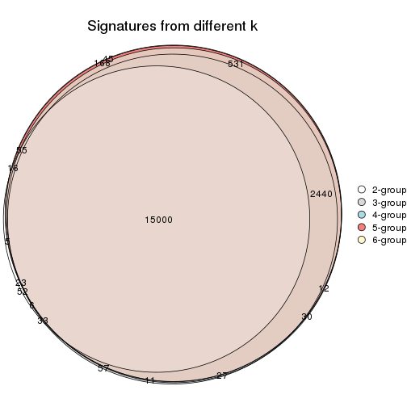

`get_signature()` returns a data frame invisibly. TO get the list of signatures, the function
call should be assigned to a variable explicitly. In following code, if `plot` argument is set
to `FALSE`, no heatmap is plotted while only the differential analysis is performed.

```r
# code only for demonstration
tb = get_signature(res, k = ..., plot = FALSE)
```

An example of the output of `tb` is:

```
#>   which_row         fdr    mean_1    mean_2 scaled_mean_1 scaled_mean_2 km
#> 1        38 0.042760348  8.373488  9.131774    -0.5533452     0.5164555  1
#> 2        40 0.018707592  7.106213  8.469186    -0.6173731     0.5762149  1
#> 3        55 0.019134737 10.221463 11.207825    -0.6159697     0.5749050  1
#> 4        59 0.006059896  5.921854  7.869574    -0.6899429     0.6439467  1
#> 5        60 0.018055526  8.928898 10.211722    -0.6204761     0.5791110  1
#> 6        98 0.009384629 15.714769 14.887706     0.6635654    -0.6193277  2
...
```

The columns in `tb` are:

1. `which_row`: row indices corresponding to the input matrix.
2. `fdr`: FDR for the differential test. 
3. `mean_x`: The mean value in group x.
4. `scaled_mean_x`: The mean value in group x after rows are scaled.
5. `km`: Row groups if k-means clustering is applied to rows.


UMAP plot which shows how samples are separated.


<script>
$( function() {
	$( '#tabs-CV-NMF-dimension-reduction' ).tabs();
} );
</script>
<div id='tabs-CV-NMF-dimension-reduction'>
<ul>
<li><a href='#tab-CV-NMF-dimension-reduction-1'>k = 2</a></li>
<li><a href='#tab-CV-NMF-dimension-reduction-2'>k = 3</a></li>
<li><a href='#tab-CV-NMF-dimension-reduction-3'>k = 4</a></li>
<li><a href='#tab-CV-NMF-dimension-reduction-4'>k = 5</a></li>
<li><a href='#tab-CV-NMF-dimension-reduction-5'>k = 6</a></li>
</ul>
<div id='tab-CV-NMF-dimension-reduction-1'>
<pre><code class="r">dimension_reduction(res, k = 2, method = &quot;UMAP&quot;)
</code></pre>

<p></p>

</div>
<div id='tab-CV-NMF-dimension-reduction-2'>
<pre><code class="r">dimension_reduction(res, k = 3, method = &quot;UMAP&quot;)
</code></pre>

<p></p>

</div>
<div id='tab-CV-NMF-dimension-reduction-3'>
<pre><code class="r">dimension_reduction(res, k = 4, method = &quot;UMAP&quot;)
</code></pre>

<p></p>

</div>
<div id='tab-CV-NMF-dimension-reduction-4'>
<pre><code class="r">dimension_reduction(res, k = 5, method = &quot;UMAP&quot;)
</code></pre>

<p></p>

</div>
<div id='tab-CV-NMF-dimension-reduction-5'>
<pre><code class="r">dimension_reduction(res, k = 6, method = &quot;UMAP&quot;)
</code></pre>

<p></p>

</div>
</div>


Following heatmap shows how subgroups are split when increasing `k`:

```r
collect_classes(res)
```


Test correlation between subgroups and known annotations. If the known
annotation is numeric, one-way ANOVA test is applied, and if the known
annotation is discrete, chi-squared contingency table test is applied.

```r
test_to_known_factors(res)
```

```
#>          n individual(p) disease.state(p) cell.type(p) k
#> CV:NMF 153             1            1.000     4.63e-32 2
#> CV:NMF 153             1            0.985     2.17e-61 3
#> CV:NMF 153             1            0.964     1.16e-90 4
#> CV:NMF 153             1            0.989    6.51e-120 5
#> CV:NMF 150             1            0.998    2.29e-117 6
```


If matrix rows can be associated to genes, consider to use `functional_enrichment(res,
...)` to perform function enrichment for the signature genes. See [this vignette](http://bioconductor.org/packages/devel/bioc/vignettes/cola/inst/doc/functional_enrichment.html) for more detailed explanations.


 

---------------------------------------------------


### MAD:hclust*


The object with results only for a single top-value method and a single partition method 
can be extracted as:

```r
res = res_list["MAD", "hclust"]
# you can also extract it by
# res = res_list["MAD:hclust"]
```

A summary of `res` and all the functions that can be applied to it:

```r
res
```

```
#> A 'ConsensusPartition' object with k = 2, 3, 4, 5, 6.
#>   On a matrix with 19559 rows and 153 columns.
#>   Top rows (1000, 2000, 3000, 4000, 5000) are extracted by 'MAD' method.
#>   Subgroups are detected by 'hclust' method.
#>   Performed in total 1250 partitions by row resampling.
#>   Best k for subgroups seems to be 5.
#> 
#> Following methods can be applied to this 'ConsensusPartition' object:
#>  [1] "cola_report"             "collect_classes"         "collect_plots"          
#>  [4] "collect_stats"           "colnames"                "compare_signatures"     
#>  [7] "consensus_heatmap"       "dimension_reduction"     "functional_enrichment"  
#> [10] "get_anno_col"            "get_anno"                "get_classes"            
#> [13] "get_consensus"           "get_matrix"              "get_membership"         
#> [16] "get_param"               "get_signatures"          "get_stats"              
#> [19] "is_best_k"               "is_stable_k"             "membership_heatmap"     
#> [22] "ncol"                    "nrow"                    "plot_ecdf"              
#> [25] "rownames"                "select_partition_number" "show"                   
#> [28] "suggest_best_k"          "test_to_known_factors"
```

`collect_plots()` function collects all the plots made from `res` for all `k` (number of partitions)
into one single page to provide an easy and fast comparison between different `k`.

```r
collect_plots(res)
```


The plots are:

- The first row: a plot of the ECDF (empirical cumulative distribution
  function) curves of the consensus matrix for each `k` and the heatmap of
  predicted classes for each `k`.
- The second row: heatmaps of the consensus matrix for each `k`.
- The third row: heatmaps of the membership matrix for each `k`.
- The fouth row: heatmaps of the signatures for each `k`.

All the plots in panels can be made by individual functions and they are
plotted later in this section.

`select_partition_number()` produces several plots showing different
statistics for choosing "optimized" `k`. There are following statistics:

- ECDF curves of the consensus matrix for each `k`;
- 1-PAC. [The PAC
  score](https://en.wikipedia.org/wiki/Consensus_clustering#Over-interpretation_potential_of_consensus_clustering)
  measures the proportion of the ambiguous subgrouping.
- Mean silhouette score.
- Concordance. The mean probability of fiting the consensus class ids in all
  partitions.
- Area increased. Denote $A_k$ as the area under the ECDF curve for current
  `k`, the area increased is defined as $A_k - A_{k-1}$.
- Rand index. The percent of pairs of samples that are both in a same cluster
  or both are not in a same cluster in the partition of k and k-1.
- Jaccard index. The ratio of pairs of samples are both in a same cluster in
  the partition of k and k-1 and the pairs of samples are both in a same
  cluster in the partition k or k-1.

The detailed explanations of these statistics can be found in [the _cola_
vignette](http://bioconductor.org/packages/devel/bioc/vignettes/cola/inst/doc/cola.html#toc_13).

Generally speaking, lower PAC score, higher mean silhouette score or higher
concordance corresponds to better partition. Rand index and Jaccard index
measure how similar the current partition is compared to partition with `k-1`.
If they are too similar, we won't accept `k` is better than `k-1`.

```r
select_partition_number(res)
```


The numeric values for all these statistics can be obtained by `get_stats()`.

```r
get_stats(res)
```

```
#>   k 1-PAC mean_silhouette concordance area_increased  Rand Jaccard
#> 2 2 1.000           1.000       1.000         0.4711 0.529   0.529
#> 3 3 1.000           0.999       0.999         0.1433 0.933   0.873
#> 4 4 1.000           1.000       1.000         0.3208 0.827   0.625
#> 5 5 0.907           0.996       0.945         0.0961 0.909   0.686
#> 6 6 1.000           0.992       0.996         0.0341 0.996   0.982
```

`suggest_best_k()` suggests the best $k$ based on these statistics. The rules are as follows:

- All $k$ with Jaccard index larger than 0.95 are removed because increasing
  $k$ does not provide enough extra information. If all $k$ are removed, it is
  marked as no subgroup is detected.
- For all $k$ with 1-PAC score larger than 0.9, the maximal $k$ is taken as
  the best $k$, and other $k$ are marked as optional $k$.
- If it does not fit the second rule. The $k$ with the maximal vote of the
  highest 1-PAC score, highest mean silhouette, and highest concordance is
  taken as the best $k$.

```r
suggest_best_k(res)
```

```
#> [1] 5
#> attr(,"optional")
#> [1] 2 3 4
```

There is also optional best $k$ = 2 3 4 that is worth to check.

Following shows the table of the partitions (You need to click the **show/hide
code output** link to see it). The membership matrix (columns with name `p*`)
is inferred by
[`clue::cl_consensus()`](https://www.rdocumentation.org/link/cl_consensus?package=clue)
function with the `SE` method. Basically the value in the membership matrix
represents the probability to belong to a certain group. The finall class
label for an item is determined with the group with highest probability it
belongs to.

In `get_classes()` function, the entropy is calculated from the membership
matrix and the silhouette score is calculated from the consensus matrix.


<script>
$( function() {
	$( '#tabs-MAD-hclust-get-classes' ).tabs();
} );
</script>
<div id='tabs-MAD-hclust-get-classes'>
<ul>
<li><a href='#tab-MAD-hclust-get-classes-1'>k = 2</a></li>
<li><a href='#tab-MAD-hclust-get-classes-2'>k = 3</a></li>
<li><a href='#tab-MAD-hclust-get-classes-3'>k = 4</a></li>
<li><a href='#tab-MAD-hclust-get-classes-4'>k = 5</a></li>
<li><a href='#tab-MAD-hclust-get-classes-5'>k = 6</a></li>
</ul>

<div id='tab-MAD-hclust-get-classes-1'>
<p><a id='tab-MAD-hclust-get-classes-1-a' style='color:#0366d6' href='#'>show/hide code output</a></p>
<pre><code class="r">cbind(get_classes(res, k = 2), get_membership(res, k = 2))
</code></pre>

<pre><code>#&gt;           class entropy silhouette p1 p2
#&gt; GSM247795     2       0          1  0  1
#&gt; GSM247854     2       0          1  0  1
#&gt; GSM247758     2       0          1  0  1
#&gt; GSM247742     1       0          1  1  0
#&gt; GSM247755     2       0          1  0  1
#&gt; GSM247841     1       0          1  1  0
#&gt; GSM247703     2       0          1  0  1
#&gt; GSM247739     2       0          1  0  1
#&gt; GSM247715     1       0          1  1  0
#&gt; GSM247829     2       0          1  0  1
#&gt; GSM247842     1       0          1  1  0
#&gt; GSM247805     2       0          1  0  1
#&gt; GSM247786     2       0          1  0  1
#&gt; GSM247812     2       0          1  0  1
#&gt; GSM247776     1       0          1  1  0
#&gt; GSM247850     1       0          1  1  0
#&gt; GSM247717     2       0          1  0  1
#&gt; GSM247784     2       0          1  0  1
#&gt; GSM247834     1       0          1  1  0
#&gt; GSM247783     2       0          1  0  1
#&gt; GSM247846     1       0          1  1  0
#&gt; GSM247822     2       0          1  0  1
#&gt; GSM247710     2       0          1  0  1
#&gt; GSM247713     1       0          1  1  0
#&gt; GSM247840     2       0          1  0  1
#&gt; GSM247733     1       0          1  1  0
#&gt; GSM247852     1       0          1  1  0
#&gt; GSM247790     2       0          1  0  1
#&gt; GSM247730     2       0          1  0  1
#&gt; GSM247824     2       0          1  0  1
#&gt; GSM247770     1       0          1  1  0
#&gt; GSM247711     2       0          1  0  1
#&gt; GSM247782     2       0          1  0  1
#&gt; GSM247836     1       0          1  1  0
#&gt; GSM247785     2       0          1  0  1
#&gt; GSM247847     1       0          1  1  0
#&gt; GSM247750     2       0          1  0  1
#&gt; GSM247788     2       0          1  0  1
#&gt; GSM247849     1       0          1  1  0
#&gt; GSM247772     2       0          1  0  1
#&gt; GSM247760     1       0          1  1  0
#&gt; GSM247764     2       0          1  0  1
#&gt; GSM247851     2       0          1  0  1
#&gt; GSM247714     2       0          1  0  1
#&gt; GSM247828     1       0          1  1  0
#&gt; GSM247704     2       0          1  0  1
#&gt; GSM247818     1       0          1  1  0
#&gt; GSM247823     2       0          1  0  1
#&gt; GSM247706     2       0          1  0  1
#&gt; GSM247835     2       0          1  0  1
#&gt; GSM247734     1       0          1  1  0
#&gt; GSM247819     2       0          1  0  1
#&gt; GSM247809     2       0          1  0  1
#&gt; GSM247830     2       0          1  0  1
#&gt; GSM247833     1       0          1  1  0
#&gt; GSM247738     2       0          1  0  1
#&gt; GSM247716     2       0          1  0  1
#&gt; GSM247747     2       0          1  0  1
#&gt; GSM247722     1       0          1  1  0
#&gt; GSM247816     2       0          1  0  1
#&gt; GSM247839     2       0          1  0  1
#&gt; GSM247821     1       0          1  1  0
#&gt; GSM247798     2       0          1  0  1
#&gt; GSM247838     1       0          1  1  0
#&gt; GSM247721     2       0          1  0  1
#&gt; GSM247781     2       0          1  0  1
#&gt; GSM247762     1       0          1  1  0
#&gt; GSM247825     2       0          1  0  1
#&gt; GSM247777     1       0          1  1  0
#&gt; GSM247761     2       0          1  0  1
#&gt; GSM247720     2       0          1  0  1
#&gt; GSM247814     2       0          1  0  1
#&gt; GSM247732     1       0          1  1  0
#&gt; GSM247708     2       0          1  0  1
#&gt; GSM247740     2       0          1  0  1
#&gt; GSM247749     1       0          1  1  0
#&gt; GSM247767     2       0          1  0  1
#&gt; GSM247748     1       0          1  1  0
#&gt; GSM247705     2       0          1  0  1
#&gt; GSM247746     2       0          1  0  1
#&gt; GSM247752     1       0          1  1  0
#&gt; GSM247769     2       0          1  0  1
#&gt; GSM247753     1       0          1  1  0
#&gt; GSM247723     2       0          1  0  1
#&gt; GSM247779     2       0          1  0  1
#&gt; GSM247756     1       0          1  1  0
#&gt; GSM247826     2       0          1  0  1
#&gt; GSM247775     1       0          1  1  0
#&gt; GSM247741     2       0          1  0  1
#&gt; GSM247799     2       0          1  0  1
#&gt; GSM247778     1       0          1  1  0
#&gt; GSM247806     2       0          1  0  1
#&gt; GSM247815     1       0          1  1  0
#&gt; GSM247735     2       0          1  0  1
#&gt; GSM247831     2       0          1  0  1
#&gt; GSM247845     1       0          1  1  0
#&gt; GSM247791     2       0          1  0  1
#&gt; GSM247780     1       0          1  1  0
#&gt; GSM247853     1       0          1  1  0
#&gt; GSM247800     2       0          1  0  1
#&gt; GSM247729     2       0          1  0  1
#&gt; GSM247810     1       0          1  1  0
#&gt; GSM247844     2       0          1  0  1
#&gt; GSM247793     1       0          1  1  0
#&gt; GSM247759     2       0          1  0  1
#&gt; GSM247724     2       0          1  0  1
#&gt; GSM247817     2       0          1  0  1
#&gt; GSM247727     1       0          1  1  0
#&gt; GSM247796     2       0          1  0  1
#&gt; GSM247725     2       0          1  0  1
#&gt; GSM247801     1       0          1  1  0
#&gt; GSM247731     2       0          1  0  1
#&gt; GSM247765     1       0          1  1  0
#&gt; GSM247792     2       0          1  0  1
#&gt; GSM247726     2       0          1  0  1
#&gt; GSM247803     1       0          1  1  0
#&gt; GSM247728     2       0          1  0  1
#&gt; GSM247768     1       0          1  1  0
#&gt; GSM247745     2       0          1  0  1
#&gt; GSM247855     2       0          1  0  1
#&gt; GSM247804     2       0          1  0  1
#&gt; GSM247774     1       0          1  1  0
#&gt; GSM247807     2       0          1  0  1
#&gt; GSM247813     1       0          1  1  0
#&gt; GSM247736     2       0          1  0  1
#&gt; GSM247712     2       0          1  0  1
#&gt; GSM247797     1       0          1  1  0
#&gt; GSM247743     2       0          1  0  1
#&gt; GSM247719     1       0          1  1  0
#&gt; GSM247707     2       0          1  0  1
#&gt; GSM247737     2       0          1  0  1
#&gt; GSM247827     2       0          1  0  1
#&gt; GSM247848     1       0          1  1  0
#&gt; GSM247794     2       0          1  0  1
#&gt; GSM247757     2       0          1  0  1
#&gt; GSM247744     1       0          1  1  0
#&gt; GSM247751     2       0          1  0  1
#&gt; GSM247837     1       0          1  1  0
#&gt; GSM247754     2       0          1  0  1
#&gt; GSM247789     2       0          1  0  1
#&gt; GSM247802     1       0          1  1  0
#&gt; GSM247771     2       0          1  0  1
#&gt; GSM247763     1       0          1  1  0
#&gt; GSM247808     2       0          1  0  1
#&gt; GSM247787     2       0          1  0  1
#&gt; GSM247843     1       0          1  1  0
#&gt; GSM247811     2       0          1  0  1
#&gt; GSM247773     1       0          1  1  0
#&gt; GSM247766     2       0          1  0  1
#&gt; GSM247718     2       0          1  0  1
#&gt; GSM247832     1       0          1  1  0
#&gt; GSM247709     2       0          1  0  1
#&gt; GSM247820     1       0          1  1  0
</code></pre>

<script>
$('#tab-MAD-hclust-get-classes-1-a').parent().next().next().hide();
$('#tab-MAD-hclust-get-classes-1-a').click(function(){
  $('#tab-MAD-hclust-get-classes-1-a').parent().next().next().toggle();
  return(false);
});
</script>
</div>

<div id='tab-MAD-hclust-get-classes-2'>
<p><a id='tab-MAD-hclust-get-classes-2-a' style='color:#0366d6' href='#'>show/hide code output</a></p>
<pre><code class="r">cbind(get_classes(res, k = 3), get_membership(res, k = 3))
</code></pre>

<pre><code>#&gt;           class entropy silhouette    p1    p2    p3
#&gt; GSM247795     2  0.0000      0.999 0.000 1.000 0.000
#&gt; GSM247854     2  0.0000      0.999 0.000 1.000 0.000
#&gt; GSM247758     2  0.0000      0.999 0.000 1.000 0.000
#&gt; GSM247742     3  0.0237      1.000 0.004 0.000 0.996
#&gt; GSM247755     2  0.0237      0.998 0.000 0.996 0.004
#&gt; GSM247841     1  0.0000      1.000 1.000 0.000 0.000
#&gt; GSM247703     2  0.0000      0.999 0.000 1.000 0.000
#&gt; GSM247739     2  0.0000      0.999 0.000 1.000 0.000
#&gt; GSM247715     3  0.0237      1.000 0.004 0.000 0.996
#&gt; GSM247829     2  0.0237      0.998 0.000 0.996 0.004
#&gt; GSM247842     1  0.0000      1.000 1.000 0.000 0.000
#&gt; GSM247805     2  0.0000      0.999 0.000 1.000 0.000
#&gt; GSM247786     2  0.0000      0.999 0.000 1.000 0.000
#&gt; GSM247812     2  0.0237      0.998 0.000 0.996 0.004
#&gt; GSM247776     1  0.0000      1.000 1.000 0.000 0.000
#&gt; GSM247850     1  0.0000      1.000 1.000 0.000 0.000
#&gt; GSM247717     2  0.0000      0.999 0.000 1.000 0.000
#&gt; GSM247784     2  0.0000      0.999 0.000 1.000 0.000
#&gt; GSM247834     3  0.0237      1.000 0.004 0.000 0.996
#&gt; GSM247783     2  0.0237      0.998 0.000 0.996 0.004
#&gt; GSM247846     1  0.0000      1.000 1.000 0.000 0.000
#&gt; GSM247822     2  0.0000      0.999 0.000 1.000 0.000
#&gt; GSM247710     2  0.0000      0.999 0.000 1.000 0.000
#&gt; GSM247713     3  0.0237      1.000 0.004 0.000 0.996
#&gt; GSM247840     2  0.0237      0.998 0.000 0.996 0.004
#&gt; GSM247733     1  0.0000      1.000 1.000 0.000 0.000
#&gt; GSM247852     1  0.0000      1.000 1.000 0.000 0.000
#&gt; GSM247790     2  0.0000      0.999 0.000 1.000 0.000
#&gt; GSM247730     2  0.0000      0.999 0.000 1.000 0.000
#&gt; GSM247824     2  0.0237      0.998 0.000 0.996 0.004
#&gt; GSM247770     1  0.0000      1.000 1.000 0.000 0.000
#&gt; GSM247711     2  0.0000      0.999 0.000 1.000 0.000
#&gt; GSM247782     2  0.0000      0.999 0.000 1.000 0.000
#&gt; GSM247836     3  0.0237      1.000 0.004 0.000 0.996
#&gt; GSM247785     2  0.0237      0.998 0.000 0.996 0.004
#&gt; GSM247847     1  0.0000      1.000 1.000 0.000 0.000
#&gt; GSM247750     2  0.0000      0.999 0.000 1.000 0.000
#&gt; GSM247788     2  0.0000      0.999 0.000 1.000 0.000
#&gt; GSM247849     3  0.0237      1.000 0.004 0.000 0.996
#&gt; GSM247772     2  0.0237      0.998 0.000 0.996 0.004
#&gt; GSM247760     1  0.0000      1.000 1.000 0.000 0.000
#&gt; GSM247764     2  0.0000      0.999 0.000 1.000 0.000
#&gt; GSM247851     2  0.0000      0.999 0.000 1.000 0.000
#&gt; GSM247714     2  0.0000      0.999 0.000 1.000 0.000
#&gt; GSM247828     3  0.0237      1.000 0.004 0.000 0.996
#&gt; GSM247704     2  0.0237      0.998 0.000 0.996 0.004
#&gt; GSM247818     1  0.0000      1.000 1.000 0.000 0.000
#&gt; GSM247823     2  0.0000      0.999 0.000 1.000 0.000
#&gt; GSM247706     2  0.0000      0.999 0.000 1.000 0.000
#&gt; GSM247835     2  0.0237      0.998 0.000 0.996 0.004
#&gt; GSM247734     1  0.0000      1.000 1.000 0.000 0.000
#&gt; GSM247819     2  0.0000      0.999 0.000 1.000 0.000
#&gt; GSM247809     2  0.0000      0.999 0.000 1.000 0.000
#&gt; GSM247830     2  0.0237      0.998 0.000 0.996 0.004
#&gt; GSM247833     1  0.0000      1.000 1.000 0.000 0.000
#&gt; GSM247738     2  0.0000      0.999 0.000 1.000 0.000
#&gt; GSM247716     2  0.0000      0.999 0.000 1.000 0.000
#&gt; GSM247747     2  0.0237      0.998 0.000 0.996 0.004
#&gt; GSM247722     1  0.0000      1.000 1.000 0.000 0.000
#&gt; GSM247816     2  0.0000      0.999 0.000 1.000 0.000
#&gt; GSM247839     2  0.0000      0.999 0.000 1.000 0.000
#&gt; GSM247821     3  0.0237      1.000 0.004 0.000 0.996
#&gt; GSM247798     2  0.0237      0.998 0.000 0.996 0.004
#&gt; GSM247838     1  0.0000      1.000 1.000 0.000 0.000
#&gt; GSM247721     2  0.0000      0.999 0.000 1.000 0.000
#&gt; GSM247781     2  0.0000      0.999 0.000 1.000 0.000
#&gt; GSM247762     3  0.0237      1.000 0.004 0.000 0.996
#&gt; GSM247825     2  0.0237      0.998 0.000 0.996 0.004
#&gt; GSM247777     1  0.0000      1.000 1.000 0.000 0.000
#&gt; GSM247761     2  0.0000      0.999 0.000 1.000 0.000
#&gt; GSM247720     2  0.0000      0.999 0.000 1.000 0.000
#&gt; GSM247814     2  0.0237      0.998 0.000 0.996 0.004
#&gt; GSM247732     1  0.0000      1.000 1.000 0.000 0.000
#&gt; GSM247708     2  0.0000      0.999 0.000 1.000 0.000
#&gt; GSM247740     2  0.0000      0.999 0.000 1.000 0.000
#&gt; GSM247749     3  0.0237      1.000 0.004 0.000 0.996
#&gt; GSM247767     2  0.0237      0.998 0.000 0.996 0.004
#&gt; GSM247748     1  0.0000      1.000 1.000 0.000 0.000
#&gt; GSM247705     2  0.0000      0.999 0.000 1.000 0.000
#&gt; GSM247746     2  0.0000      0.999 0.000 1.000 0.000
#&gt; GSM247752     3  0.0237      1.000 0.004 0.000 0.996
#&gt; GSM247769     2  0.0237      0.998 0.000 0.996 0.004
#&gt; GSM247753     1  0.0000      1.000 1.000 0.000 0.000
#&gt; GSM247723     2  0.0000      0.999 0.000 1.000 0.000
#&gt; GSM247779     2  0.0000      0.999 0.000 1.000 0.000
#&gt; GSM247756     3  0.0237      1.000 0.004 0.000 0.996
#&gt; GSM247826     2  0.0237      0.998 0.000 0.996 0.004
#&gt; GSM247775     1  0.0000      1.000 1.000 0.000 0.000
#&gt; GSM247741     2  0.0000      0.999 0.000 1.000 0.000
#&gt; GSM247799     2  0.0000      0.999 0.000 1.000 0.000
#&gt; GSM247778     3  0.0237      1.000 0.004 0.000 0.996
#&gt; GSM247806     2  0.0237      0.998 0.000 0.996 0.004
#&gt; GSM247815     1  0.0000      1.000 1.000 0.000 0.000
#&gt; GSM247735     2  0.0000      0.999 0.000 1.000 0.000
#&gt; GSM247831     2  0.0000      0.999 0.000 1.000 0.000
#&gt; GSM247845     3  0.0237      1.000 0.004 0.000 0.996
#&gt; GSM247791     2  0.0237      0.998 0.000 0.996 0.004
#&gt; GSM247780     1  0.0000      1.000 1.000 0.000 0.000
#&gt; GSM247853     1  0.0000      1.000 1.000 0.000 0.000
#&gt; GSM247800     2  0.0000      0.999 0.000 1.000 0.000
#&gt; GSM247729     2  0.0000      0.999 0.000 1.000 0.000
#&gt; GSM247810     3  0.0237      1.000 0.004 0.000 0.996
#&gt; GSM247844     2  0.0237      0.998 0.000 0.996 0.004
#&gt; GSM247793     1  0.0000      1.000 1.000 0.000 0.000
#&gt; GSM247759     2  0.0000      0.999 0.000 1.000 0.000
#&gt; GSM247724     2  0.0000      0.999 0.000 1.000 0.000
#&gt; GSM247817     2  0.0237      0.998 0.000 0.996 0.004
#&gt; GSM247727     1  0.0000      1.000 1.000 0.000 0.000
#&gt; GSM247796     2  0.0000      0.999 0.000 1.000 0.000
#&gt; GSM247725     2  0.0000      0.999 0.000 1.000 0.000
#&gt; GSM247801     3  0.0237      1.000 0.004 0.000 0.996
#&gt; GSM247731     2  0.0237      0.998 0.000 0.996 0.004
#&gt; GSM247765     1  0.0000      1.000 1.000 0.000 0.000
#&gt; GSM247792     2  0.0000      0.999 0.000 1.000 0.000
#&gt; GSM247726     2  0.0000      0.999 0.000 1.000 0.000
#&gt; GSM247803     3  0.0237      1.000 0.004 0.000 0.996
#&gt; GSM247728     2  0.0237      0.998 0.000 0.996 0.004
#&gt; GSM247768     1  0.0000      1.000 1.000 0.000 0.000
#&gt; GSM247745     2  0.0000      0.999 0.000 1.000 0.000
#&gt; GSM247855     2  0.0000      0.999 0.000 1.000 0.000
#&gt; GSM247804     2  0.0000      0.999 0.000 1.000 0.000
#&gt; GSM247774     3  0.0237      1.000 0.004 0.000 0.996
#&gt; GSM247807     2  0.0237      0.998 0.000 0.996 0.004
#&gt; GSM247813     1  0.0000      1.000 1.000 0.000 0.000
#&gt; GSM247736     2  0.0000      0.999 0.000 1.000 0.000
#&gt; GSM247712     2  0.0000      0.999 0.000 1.000 0.000
#&gt; GSM247797     3  0.0237      1.000 0.004 0.000 0.996
#&gt; GSM247743     2  0.0237      0.998 0.000 0.996 0.004
#&gt; GSM247719     1  0.0000      1.000 1.000 0.000 0.000
#&gt; GSM247707     2  0.0000      0.999 0.000 1.000 0.000
#&gt; GSM247737     2  0.0000      0.999 0.000 1.000 0.000
#&gt; GSM247827     2  0.0237      0.998 0.000 0.996 0.004
#&gt; GSM247848     1  0.0000      1.000 1.000 0.000 0.000
#&gt; GSM247794     2  0.0000      0.999 0.000 1.000 0.000
#&gt; GSM247757     2  0.0000      0.999 0.000 1.000 0.000
#&gt; GSM247744     3  0.0237      1.000 0.004 0.000 0.996
#&gt; GSM247751     2  0.0237      0.998 0.000 0.996 0.004
#&gt; GSM247837     1  0.0000      1.000 1.000 0.000 0.000
#&gt; GSM247754     2  0.0000      0.999 0.000 1.000 0.000
#&gt; GSM247789     2  0.0000      0.999 0.000 1.000 0.000
#&gt; GSM247802     3  0.0237      1.000 0.004 0.000 0.996
#&gt; GSM247771     2  0.0237      0.998 0.000 0.996 0.004
#&gt; GSM247763     1  0.0000      1.000 1.000 0.000 0.000
#&gt; GSM247808     2  0.0000      0.999 0.000 1.000 0.000
#&gt; GSM247787     2  0.0000      0.999 0.000 1.000 0.000
#&gt; GSM247843     3  0.0237      1.000 0.004 0.000 0.996
#&gt; GSM247811     2  0.0237      0.998 0.000 0.996 0.004
#&gt; GSM247773     1  0.0000      1.000 1.000 0.000 0.000
#&gt; GSM247766     2  0.0000      0.999 0.000 1.000 0.000
#&gt; GSM247718     2  0.0000      0.999 0.000 1.000 0.000
#&gt; GSM247832     3  0.0237      1.000 0.004 0.000 0.996
#&gt; GSM247709     2  0.0237      0.998 0.000 0.996 0.004
#&gt; GSM247820     1  0.0000      1.000 1.000 0.000 0.000
</code></pre>

<script>
$('#tab-MAD-hclust-get-classes-2-a').parent().next().next().hide();
$('#tab-MAD-hclust-get-classes-2-a').click(function(){
  $('#tab-MAD-hclust-get-classes-2-a').parent().next().next().toggle();
  return(false);
});
</script>
</div>

<div id='tab-MAD-hclust-get-classes-3'>
<p><a id='tab-MAD-hclust-get-classes-3-a' style='color:#0366d6' href='#'>show/hide code output</a></p>
<pre><code class="r">cbind(get_classes(res, k = 4), get_membership(res, k = 4))
</code></pre>

<pre><code>#&gt;           class entropy silhouette p1 p2 p3 p4
#&gt; GSM247795     2       0          1  0  1  0  0
#&gt; GSM247854     2       0          1  0  1  0  0
#&gt; GSM247758     2       0          1  0  1  0  0
#&gt; GSM247742     4       0          1  0  0  0  1
#&gt; GSM247755     3       0          1  0  0  1  0
#&gt; GSM247841     1       0          1  1  0  0  0
#&gt; GSM247703     2       0          1  0  1  0  0
#&gt; GSM247739     2       0          1  0  1  0  0
#&gt; GSM247715     4       0          1  0  0  0  1
#&gt; GSM247829     3       0          1  0  0  1  0
#&gt; GSM247842     1       0          1  1  0  0  0
#&gt; GSM247805     2       0          1  0  1  0  0
#&gt; GSM247786     2       0          1  0  1  0  0
#&gt; GSM247812     3       0          1  0  0  1  0
#&gt; GSM247776     1       0          1  1  0  0  0
#&gt; GSM247850     1       0          1  1  0  0  0
#&gt; GSM247717     2       0          1  0  1  0  0
#&gt; GSM247784     2       0          1  0  1  0  0
#&gt; GSM247834     4       0          1  0  0  0  1
#&gt; GSM247783     3       0          1  0  0  1  0
#&gt; GSM247846     1       0          1  1  0  0  0
#&gt; GSM247822     2       0          1  0  1  0  0
#&gt; GSM247710     2       0          1  0  1  0  0
#&gt; GSM247713     4       0          1  0  0  0  1
#&gt; GSM247840     3       0          1  0  0  1  0
#&gt; GSM247733     1       0          1  1  0  0  0
#&gt; GSM247852     1       0          1  1  0  0  0
#&gt; GSM247790     2       0          1  0  1  0  0
#&gt; GSM247730     2       0          1  0  1  0  0
#&gt; GSM247824     3       0          1  0  0  1  0
#&gt; GSM247770     1       0          1  1  0  0  0
#&gt; GSM247711     2       0          1  0  1  0  0
#&gt; GSM247782     2       0          1  0  1  0  0
#&gt; GSM247836     4       0          1  0  0  0  1
#&gt; GSM247785     3       0          1  0  0  1  0
#&gt; GSM247847     1       0          1  1  0  0  0
#&gt; GSM247750     2       0          1  0  1  0  0
#&gt; GSM247788     2       0          1  0  1  0  0
#&gt; GSM247849     4       0          1  0  0  0  1
#&gt; GSM247772     3       0          1  0  0  1  0
#&gt; GSM247760     1       0          1  1  0  0  0
#&gt; GSM247764     2       0          1  0  1  0  0
#&gt; GSM247851     2       0          1  0  1  0  0
#&gt; GSM247714     2       0          1  0  1  0  0
#&gt; GSM247828     4       0          1  0  0  0  1
#&gt; GSM247704     3       0          1  0  0  1  0
#&gt; GSM247818     1       0          1  1  0  0  0
#&gt; GSM247823     2       0          1  0  1  0  0
#&gt; GSM247706     2       0          1  0  1  0  0
#&gt; GSM247835     3       0          1  0  0  1  0
#&gt; GSM247734     1       0          1  1  0  0  0
#&gt; GSM247819     2       0          1  0  1  0  0
#&gt; GSM247809     2       0          1  0  1  0  0
#&gt; GSM247830     3       0          1  0  0  1  0
#&gt; GSM247833     1       0          1  1  0  0  0
#&gt; GSM247738     2       0          1  0  1  0  0
#&gt; GSM247716     2       0          1  0  1  0  0
#&gt; GSM247747     3       0          1  0  0  1  0
#&gt; GSM247722     1       0          1  1  0  0  0
#&gt; GSM247816     2       0          1  0  1  0  0
#&gt; GSM247839     2       0          1  0  1  0  0
#&gt; GSM247821     4       0          1  0  0  0  1
#&gt; GSM247798     3       0          1  0  0  1  0
#&gt; GSM247838     1       0          1  1  0  0  0
#&gt; GSM247721     2       0          1  0  1  0  0
#&gt; GSM247781     2       0          1  0  1  0  0
#&gt; GSM247762     4       0          1  0  0  0  1
#&gt; GSM247825     3       0          1  0  0  1  0
#&gt; GSM247777     1       0          1  1  0  0  0
#&gt; GSM247761     2       0          1  0  1  0  0
#&gt; GSM247720     2       0          1  0  1  0  0
#&gt; GSM247814     3       0          1  0  0  1  0
#&gt; GSM247732     1       0          1  1  0  0  0
#&gt; GSM247708     2       0          1  0  1  0  0
#&gt; GSM247740     2       0          1  0  1  0  0
#&gt; GSM247749     4       0          1  0  0  0  1
#&gt; GSM247767     3       0          1  0  0  1  0
#&gt; GSM247748     1       0          1  1  0  0  0
#&gt; GSM247705     2       0          1  0  1  0  0
#&gt; GSM247746     2       0          1  0  1  0  0
#&gt; GSM247752     4       0          1  0  0  0  1
#&gt; GSM247769     3       0          1  0  0  1  0
#&gt; GSM247753     1       0          1  1  0  0  0
#&gt; GSM247723     2       0          1  0  1  0  0
#&gt; GSM247779     2       0          1  0  1  0  0
#&gt; GSM247756     4       0          1  0  0  0  1
#&gt; GSM247826     3       0          1  0  0  1  0
#&gt; GSM247775     1       0          1  1  0  0  0
#&gt; GSM247741     2       0          1  0  1  0  0
#&gt; GSM247799     2       0          1  0  1  0  0
#&gt; GSM247778     4       0          1  0  0  0  1
#&gt; GSM247806     3       0          1  0  0  1  0
#&gt; GSM247815     1       0          1  1  0  0  0
#&gt; GSM247735     2       0          1  0  1  0  0
#&gt; GSM247831     2       0          1  0  1  0  0
#&gt; GSM247845     4       0          1  0  0  0  1
#&gt; GSM247791     3       0          1  0  0  1  0
#&gt; GSM247780     1       0          1  1  0  0  0
#&gt; GSM247853     1       0          1  1  0  0  0
#&gt; GSM247800     2       0          1  0  1  0  0
#&gt; GSM247729     2       0          1  0  1  0  0
#&gt; GSM247810     4       0          1  0  0  0  1
#&gt; GSM247844     3       0          1  0  0  1  0
#&gt; GSM247793     1       0          1  1  0  0  0
#&gt; GSM247759     2       0          1  0  1  0  0
#&gt; GSM247724     2       0          1  0  1  0  0
#&gt; GSM247817     3       0          1  0  0  1  0
#&gt; GSM247727     1       0          1  1  0  0  0
#&gt; GSM247796     2       0          1  0  1  0  0
#&gt; GSM247725     2       0          1  0  1  0  0
#&gt; GSM247801     4       0          1  0  0  0  1
#&gt; GSM247731     3       0          1  0  0  1  0
#&gt; GSM247765     1       0          1  1  0  0  0
#&gt; GSM247792     2       0          1  0  1  0  0
#&gt; GSM247726     2       0          1  0  1  0  0
#&gt; GSM247803     4       0          1  0  0  0  1
#&gt; GSM247728     3       0          1  0  0  1  0
#&gt; GSM247768     1       0          1  1  0  0  0
#&gt; GSM247745     2       0          1  0  1  0  0
#&gt; GSM247855     2       0          1  0  1  0  0
#&gt; GSM247804     2       0          1  0  1  0  0
#&gt; GSM247774     4       0          1  0  0  0  1
#&gt; GSM247807     3       0          1  0  0  1  0
#&gt; GSM247813     1       0          1  1  0  0  0
#&gt; GSM247736     2       0          1  0  1  0  0
#&gt; GSM247712     2       0          1  0  1  0  0
#&gt; GSM247797     4       0          1  0  0  0  1
#&gt; GSM247743     3       0          1  0  0  1  0
#&gt; GSM247719     1       0          1  1  0  0  0
#&gt; GSM247707     2       0          1  0  1  0  0
#&gt; GSM247737     2       0          1  0  1  0  0
#&gt; GSM247827     3       0          1  0  0  1  0
#&gt; GSM247848     1       0          1  1  0  0  0
#&gt; GSM247794     2       0          1  0  1  0  0
#&gt; GSM247757     2       0          1  0  1  0  0
#&gt; GSM247744     4       0          1  0  0  0  1
#&gt; GSM247751     3       0          1  0  0  1  0
#&gt; GSM247837     1       0          1  1  0  0  0
#&gt; GSM247754     2       0          1  0  1  0  0
#&gt; GSM247789     2       0          1  0  1  0  0
#&gt; GSM247802     4       0          1  0  0  0  1
#&gt; GSM247771     3       0          1  0  0  1  0
#&gt; GSM247763     1       0          1  1  0  0  0
#&gt; GSM247808     2       0          1  0  1  0  0
#&gt; GSM247787     2       0          1  0  1  0  0
#&gt; GSM247843     4       0          1  0  0  0  1
#&gt; GSM247811     3       0          1  0  0  1  0
#&gt; GSM247773     1       0          1  1  0  0  0
#&gt; GSM247766     2       0          1  0  1  0  0
#&gt; GSM247718     2       0          1  0  1  0  0
#&gt; GSM247832     4       0          1  0  0  0  1
#&gt; GSM247709     3       0          1  0  0  1  0
#&gt; GSM247820     1       0          1  1  0  0  0
</code></pre>

<script>
$('#tab-MAD-hclust-get-classes-3-a').parent().next().next().hide();
$('#tab-MAD-hclust-get-classes-3-a').click(function(){
  $('#tab-MAD-hclust-get-classes-3-a').parent().next().next().toggle();
  return(false);
});
</script>
</div>

<div id='tab-MAD-hclust-get-classes-4'>
<p><a id='tab-MAD-hclust-get-classes-4-a' style='color:#0366d6' href='#'>show/hide code output</a></p>
<pre><code class="r">cbind(get_classes(res, k = 5), get_membership(res, k = 5))
</code></pre>

<pre><code>#&gt;           class entropy silhouette p1    p2 p3    p4    p5
#&gt; GSM247795     2   0.353      1.000  0 0.744  0 0.000 0.256
#&gt; GSM247854     2   0.353      1.000  0 0.744  0 0.000 0.256
#&gt; GSM247758     5   0.000      1.000  0 0.000  0 0.000 1.000
#&gt; GSM247742     4   0.000      0.985  0 0.000  0 1.000 0.000
#&gt; GSM247755     3   0.000      1.000  0 0.000  1 0.000 0.000
#&gt; GSM247841     1   0.000      1.000  1 0.000  0 0.000 0.000
#&gt; GSM247703     2   0.353      1.000  0 0.744  0 0.000 0.256
#&gt; GSM247739     5   0.000      1.000  0 0.000  0 0.000 1.000
#&gt; GSM247715     4   0.000      0.985  0 0.000  0 1.000 0.000
#&gt; GSM247829     3   0.000      1.000  0 0.000  1 0.000 0.000
#&gt; GSM247842     1   0.000      1.000  1 0.000  0 0.000 0.000
#&gt; GSM247805     2   0.353      1.000  0 0.744  0 0.000 0.256
#&gt; GSM247786     5   0.000      1.000  0 0.000  0 0.000 1.000
#&gt; GSM247812     3   0.000      1.000  0 0.000  1 0.000 0.000
#&gt; GSM247776     1   0.000      1.000  1 0.000  0 0.000 0.000
#&gt; GSM247850     1   0.000      1.000  1 0.000  0 0.000 0.000
#&gt; GSM247717     2   0.353      1.000  0 0.744  0 0.000 0.256
#&gt; GSM247784     5   0.000      1.000  0 0.000  0 0.000 1.000
#&gt; GSM247834     4   0.000      0.985  0 0.000  0 1.000 0.000
#&gt; GSM247783     3   0.000      1.000  0 0.000  1 0.000 0.000
#&gt; GSM247846     1   0.000      1.000  1 0.000  0 0.000 0.000
#&gt; GSM247822     2   0.353      1.000  0 0.744  0 0.000 0.256
#&gt; GSM247710     5   0.000      1.000  0 0.000  0 0.000 1.000
#&gt; GSM247713     4   0.000      0.985  0 0.000  0 1.000 0.000
#&gt; GSM247840     3   0.000      1.000  0 0.000  1 0.000 0.000
#&gt; GSM247733     1   0.000      1.000  1 0.000  0 0.000 0.000
#&gt; GSM247852     1   0.000      1.000  1 0.000  0 0.000 0.000
#&gt; GSM247790     2   0.353      1.000  0 0.744  0 0.000 0.256
#&gt; GSM247730     5   0.000      1.000  0 0.000  0 0.000 1.000
#&gt; GSM247824     3   0.000      1.000  0 0.000  1 0.000 0.000
#&gt; GSM247770     1   0.000      1.000  1 0.000  0 0.000 0.000
#&gt; GSM247711     2   0.353      1.000  0 0.744  0 0.000 0.256
#&gt; GSM247782     5   0.000      1.000  0 0.000  0 0.000 1.000
#&gt; GSM247836     4   0.000      0.985  0 0.000  0 1.000 0.000
#&gt; GSM247785     3   0.000      1.000  0 0.000  1 0.000 0.000
#&gt; GSM247847     1   0.000      1.000  1 0.000  0 0.000 0.000
#&gt; GSM247750     2   0.353      1.000  0 0.744  0 0.000 0.256
#&gt; GSM247788     5   0.000      1.000  0 0.000  0 0.000 1.000
#&gt; GSM247849     4   0.000      0.985  0 0.000  0 1.000 0.000
#&gt; GSM247772     3   0.000      1.000  0 0.000  1 0.000 0.000
#&gt; GSM247760     1   0.000      1.000  1 0.000  0 0.000 0.000
#&gt; GSM247764     2   0.353      1.000  0 0.744  0 0.000 0.256
#&gt; GSM247851     2   0.353      1.000  0 0.744  0 0.000 0.256
#&gt; GSM247714     5   0.000      1.000  0 0.000  0 0.000 1.000
#&gt; GSM247828     4   0.000      0.985  0 0.000  0 1.000 0.000
#&gt; GSM247704     3   0.000      1.000  0 0.000  1 0.000 0.000
#&gt; GSM247818     1   0.000      1.000  1 0.000  0 0.000 0.000
#&gt; GSM247823     2   0.353      1.000  0 0.744  0 0.000 0.256
#&gt; GSM247706     5   0.000      1.000  0 0.000  0 0.000 1.000
#&gt; GSM247835     3   0.000      1.000  0 0.000  1 0.000 0.000
#&gt; GSM247734     1   0.000      1.000  1 0.000  0 0.000 0.000
#&gt; GSM247819     2   0.353      1.000  0 0.744  0 0.000 0.256
#&gt; GSM247809     5   0.000      1.000  0 0.000  0 0.000 1.000
#&gt; GSM247830     3   0.000      1.000  0 0.000  1 0.000 0.000
#&gt; GSM247833     1   0.000      1.000  1 0.000  0 0.000 0.000
#&gt; GSM247738     2   0.353      1.000  0 0.744  0 0.000 0.256
#&gt; GSM247716     5   0.000      1.000  0 0.000  0 0.000 1.000
#&gt; GSM247747     3   0.000      1.000  0 0.000  1 0.000 0.000
#&gt; GSM247722     1   0.000      1.000  1 0.000  0 0.000 0.000
#&gt; GSM247816     2   0.353      1.000  0 0.744  0 0.000 0.256
#&gt; GSM247839     5   0.000      1.000  0 0.000  0 0.000 1.000
#&gt; GSM247821     4   0.000      0.985  0 0.000  0 1.000 0.000
#&gt; GSM247798     3   0.000      1.000  0 0.000  1 0.000 0.000
#&gt; GSM247838     1   0.000      1.000  1 0.000  0 0.000 0.000
#&gt; GSM247721     2   0.353      1.000  0 0.744  0 0.000 0.256
#&gt; GSM247781     5   0.000      1.000  0 0.000  0 0.000 1.000
#&gt; GSM247762     4   0.000      0.985  0 0.000  0 1.000 0.000
#&gt; GSM247825     3   0.000      1.000  0 0.000  1 0.000 0.000
#&gt; GSM247777     1   0.000      1.000  1 0.000  0 0.000 0.000
#&gt; GSM247761     2   0.353      1.000  0 0.744  0 0.000 0.256
#&gt; GSM247720     5   0.000      1.000  0 0.000  0 0.000 1.000
#&gt; GSM247814     3   0.000      1.000  0 0.000  1 0.000 0.000
#&gt; GSM247732     1   0.000      1.000  1 0.000  0 0.000 0.000
#&gt; GSM247708     2   0.353      1.000  0 0.744  0 0.000 0.256
#&gt; GSM247740     5   0.000      1.000  0 0.000  0 0.000 1.000
#&gt; GSM247749     4   0.000      0.985  0 0.000  0 1.000 0.000
#&gt; GSM247767     3   0.000      1.000  0 0.000  1 0.000 0.000
#&gt; GSM247748     1   0.000      1.000  1 0.000  0 0.000 0.000
#&gt; GSM247705     2   0.353      1.000  0 0.744  0 0.000 0.256
#&gt; GSM247746     5   0.000      1.000  0 0.000  0 0.000 1.000
#&gt; GSM247752     4   0.353      0.825  0 0.256  0 0.744 0.000
#&gt; GSM247769     3   0.000      1.000  0 0.000  1 0.000 0.000
#&gt; GSM247753     1   0.000      1.000  1 0.000  0 0.000 0.000
#&gt; GSM247723     2   0.353      1.000  0 0.744  0 0.000 0.256
#&gt; GSM247779     5   0.000      1.000  0 0.000  0 0.000 1.000
#&gt; GSM247756     4   0.000      0.985  0 0.000  0 1.000 0.000
#&gt; GSM247826     3   0.000      1.000  0 0.000  1 0.000 0.000
#&gt; GSM247775     1   0.000      1.000  1 0.000  0 0.000 0.000
#&gt; GSM247741     2   0.353      1.000  0 0.744  0 0.000 0.256
#&gt; GSM247799     5   0.000      1.000  0 0.000  0 0.000 1.000
#&gt; GSM247778     4   0.000      0.985  0 0.000  0 1.000 0.000
#&gt; GSM247806     3   0.000      1.000  0 0.000  1 0.000 0.000
#&gt; GSM247815     1   0.000      1.000  1 0.000  0 0.000 0.000
#&gt; GSM247735     2   0.353      1.000  0 0.744  0 0.000 0.256
#&gt; GSM247831     5   0.000      1.000  0 0.000  0 0.000 1.000
#&gt; GSM247845     4   0.000      0.985  0 0.000  0 1.000 0.000
#&gt; GSM247791     3   0.000      1.000  0 0.000  1 0.000 0.000
#&gt; GSM247780     1   0.000      1.000  1 0.000  0 0.000 0.000
#&gt; GSM247853     1   0.000      1.000  1 0.000  0 0.000 0.000
#&gt; GSM247800     2   0.353      1.000  0 0.744  0 0.000 0.256
#&gt; GSM247729     5   0.000      1.000  0 0.000  0 0.000 1.000
#&gt; GSM247810     4   0.000      0.985  0 0.000  0 1.000 0.000
#&gt; GSM247844     3   0.000      1.000  0 0.000  1 0.000 0.000
#&gt; GSM247793     1   0.000      1.000  1 0.000  0 0.000 0.000
#&gt; GSM247759     2   0.353      1.000  0 0.744  0 0.000 0.256
#&gt; GSM247724     5   0.000      1.000  0 0.000  0 0.000 1.000
#&gt; GSM247817     3   0.000      1.000  0 0.000  1 0.000 0.000
#&gt; GSM247727     1   0.000      1.000  1 0.000  0 0.000 0.000
#&gt; GSM247796     2   0.353      1.000  0 0.744  0 0.000 0.256
#&gt; GSM247725     5   0.000      1.000  0 0.000  0 0.000 1.000
#&gt; GSM247801     4   0.000      0.985  0 0.000  0 1.000 0.000
#&gt; GSM247731     3   0.000      1.000  0 0.000  1 0.000 0.000
#&gt; GSM247765     1   0.000      1.000  1 0.000  0 0.000 0.000
#&gt; GSM247792     2   0.353      1.000  0 0.744  0 0.000 0.256
#&gt; GSM247726     5   0.000      1.000  0 0.000  0 0.000 1.000
#&gt; GSM247803     4   0.353      0.825  0 0.256  0 0.744 0.000
#&gt; GSM247728     3   0.000      1.000  0 0.000  1 0.000 0.000
#&gt; GSM247768     1   0.000      1.000  1 0.000  0 0.000 0.000
#&gt; GSM247745     2   0.353      1.000  0 0.744  0 0.000 0.256
#&gt; GSM247855     2   0.353      1.000  0 0.744  0 0.000 0.256
#&gt; GSM247804     5   0.000      1.000  0 0.000  0 0.000 1.000
#&gt; GSM247774     4   0.000      0.985  0 0.000  0 1.000 0.000
#&gt; GSM247807     3   0.000      1.000  0 0.000  1 0.000 0.000
#&gt; GSM247813     1   0.000      1.000  1 0.000  0 0.000 0.000
#&gt; GSM247736     2   0.353      1.000  0 0.744  0 0.000 0.256
#&gt; GSM247712     5   0.000      1.000  0 0.000  0 0.000 1.000
#&gt; GSM247797     4   0.000      0.985  0 0.000  0 1.000 0.000
#&gt; GSM247743     3   0.000      1.000  0 0.000  1 0.000 0.000
#&gt; GSM247719     1   0.000      1.000  1 0.000  0 0.000 0.000
#&gt; GSM247707     2   0.353      1.000  0 0.744  0 0.000 0.256
#&gt; GSM247737     5   0.000      1.000  0 0.000  0 0.000 1.000
#&gt; GSM247827     3   0.000      1.000  0 0.000  1 0.000 0.000
#&gt; GSM247848     1   0.000      1.000  1 0.000  0 0.000 0.000
#&gt; GSM247794     2   0.353      1.000  0 0.744  0 0.000 0.256
#&gt; GSM247757     5   0.000      1.000  0 0.000  0 0.000 1.000
#&gt; GSM247744     4   0.000      0.985  0 0.000  0 1.000 0.000
#&gt; GSM247751     3   0.000      1.000  0 0.000  1 0.000 0.000
#&gt; GSM247837     1   0.000      1.000  1 0.000  0 0.000 0.000
#&gt; GSM247754     2   0.353      1.000  0 0.744  0 0.000 0.256
#&gt; GSM247789     5   0.000      1.000  0 0.000  0 0.000 1.000
#&gt; GSM247802     4   0.000      0.985  0 0.000  0 1.000 0.000
#&gt; GSM247771     3   0.000      1.000  0 0.000  1 0.000 0.000
#&gt; GSM247763     1   0.000      1.000  1 0.000  0 0.000 0.000
#&gt; GSM247808     2   0.353      1.000  0 0.744  0 0.000 0.256
#&gt; GSM247787     5   0.000      1.000  0 0.000  0 0.000 1.000
#&gt; GSM247843     4   0.000      0.985  0 0.000  0 1.000 0.000
#&gt; GSM247811     3   0.000      1.000  0 0.000  1 0.000 0.000
#&gt; GSM247773     1   0.000      1.000  1 0.000  0 0.000 0.000
#&gt; GSM247766     2   0.353      1.000  0 0.744  0 0.000 0.256
#&gt; GSM247718     5   0.000      1.000  0 0.000  0 0.000 1.000
#&gt; GSM247832     4   0.000      0.985  0 0.000  0 1.000 0.000
#&gt; GSM247709     3   0.000      1.000  0 0.000  1 0.000 0.000
#&gt; GSM247820     1   0.000      1.000  1 0.000  0 0.000 0.000
</code></pre>

<script>
$('#tab-MAD-hclust-get-classes-4-a').parent().next().next().hide();
$('#tab-MAD-hclust-get-classes-4-a').click(function(){
  $('#tab-MAD-hclust-get-classes-4-a').parent().next().next().toggle();
  return(false);
});
</script>
</div>

<div id='tab-MAD-hclust-get-classes-5'>
<p><a id='tab-MAD-hclust-get-classes-5-a' style='color:#0366d6' href='#'>show/hide code output</a></p>
<pre><code class="r">cbind(get_classes(res, k = 6), get_membership(res, k = 6))
</code></pre>

<pre><code>#&gt;           class entropy silhouette p1 p2 p3    p4 p5    p6
#&gt; GSM247795     2  0.0000      1.000  0  1  0 0.000  0 0.000
#&gt; GSM247854     2  0.0000      1.000  0  1  0 0.000  0 0.000
#&gt; GSM247758     5  0.0000      1.000  0  0  0 0.000  1 0.000
#&gt; GSM247742     4  0.0000      0.970  0  0  0 1.000  0 0.000
#&gt; GSM247755     3  0.0000      1.000  0  0  1 0.000  0 0.000
#&gt; GSM247841     1  0.0000      1.000  1  0  0 0.000  0 0.000
#&gt; GSM247703     2  0.0000      1.000  0  1  0 0.000  0 0.000
#&gt; GSM247739     5  0.0000      1.000  0  0  0 0.000  1 0.000
#&gt; GSM247715     4  0.0000      0.970  0  0  0 1.000  0 0.000
#&gt; GSM247829     3  0.0000      1.000  0  0  1 0.000  0 0.000
#&gt; GSM247842     1  0.0000      1.000  1  0  0 0.000  0 0.000
#&gt; GSM247805     2  0.0000      1.000  0  1  0 0.000  0 0.000
#&gt; GSM247786     5  0.0000      1.000  0  0  0 0.000  1 0.000
#&gt; GSM247812     3  0.0000      1.000  0  0  1 0.000  0 0.000
#&gt; GSM247776     1  0.0000      1.000  1  0  0 0.000  0 0.000
#&gt; GSM247850     1  0.0000      1.000  1  0  0 0.000  0 0.000
#&gt; GSM247717     2  0.0000      1.000  0  1  0 0.000  0 0.000
#&gt; GSM247784     5  0.0000      1.000  0  0  0 0.000  1 0.000
#&gt; GSM247834     4  0.0260      0.967  0  0  0 0.992  0 0.008
#&gt; GSM247783     3  0.0000      1.000  0  0  1 0.000  0 0.000
#&gt; GSM247846     1  0.0000      1.000  1  0  0 0.000  0 0.000
#&gt; GSM247822     2  0.0000      1.000  0  1  0 0.000  0 0.000
#&gt; GSM247710     5  0.0000      1.000  0  0  0 0.000  1 0.000
#&gt; GSM247713     4  0.0632      0.956  0  0  0 0.976  0 0.024
#&gt; GSM247840     3  0.0000      1.000  0  0  1 0.000  0 0.000
#&gt; GSM247733     1  0.0000      1.000  1  0  0 0.000  0 0.000
#&gt; GSM247852     1  0.0000      1.000  1  0  0 0.000  0 0.000
#&gt; GSM247790     2  0.0000      1.000  0  1  0 0.000  0 0.000
#&gt; GSM247730     5  0.0000      1.000  0  0  0 0.000  1 0.000
#&gt; GSM247824     3  0.0000      1.000  0  0  1 0.000  0 0.000
#&gt; GSM247770     1  0.0000      1.000  1  0  0 0.000  0 0.000
#&gt; GSM247711     2  0.0000      1.000  0  1  0 0.000  0 0.000
#&gt; GSM247782     5  0.0000      1.000  0  0  0 0.000  1 0.000
#&gt; GSM247836     4  0.0000      0.970  0  0  0 1.000  0 0.000
#&gt; GSM247785     3  0.0000      1.000  0  0  1 0.000  0 0.000
#&gt; GSM247847     1  0.0000      1.000  1  0  0 0.000  0 0.000
#&gt; GSM247750     2  0.0000      1.000  0  1  0 0.000  0 0.000
#&gt; GSM247788     5  0.0000      1.000  0  0  0 0.000  1 0.000
#&gt; GSM247849     4  0.0000      0.970  0  0  0 1.000  0 0.000
#&gt; GSM247772     3  0.0000      1.000  0  0  1 0.000  0 0.000
#&gt; GSM247760     1  0.0000      1.000  1  0  0 0.000  0 0.000
#&gt; GSM247764     2  0.0000      1.000  0  1  0 0.000  0 0.000
#&gt; GSM247851     2  0.0000      1.000  0  1  0 0.000  0 0.000
#&gt; GSM247714     5  0.0000      1.000  0  0  0 0.000  1 0.000
#&gt; GSM247828     4  0.0000      0.970  0  0  0 1.000  0 0.000
#&gt; GSM247704     3  0.0000      1.000  0  0  1 0.000  0 0.000
#&gt; GSM247818     1  0.0000      1.000  1  0  0 0.000  0 0.000
#&gt; GSM247823     2  0.0000      1.000  0  1  0 0.000  0 0.000
#&gt; GSM247706     5  0.0000      1.000  0  0  0 0.000  1 0.000
#&gt; GSM247835     3  0.0000      1.000  0  0  1 0.000  0 0.000
#&gt; GSM247734     1  0.0000      1.000  1  0  0 0.000  0 0.000
#&gt; GSM247819     2  0.0000      1.000  0  1  0 0.000  0 0.000
#&gt; GSM247809     5  0.0000      1.000  0  0  0 0.000  1 0.000
#&gt; GSM247830     3  0.0000      1.000  0  0  1 0.000  0 0.000
#&gt; GSM247833     1  0.0000      1.000  1  0  0 0.000  0 0.000
#&gt; GSM247738     2  0.0000      1.000  0  1  0 0.000  0 0.000
#&gt; GSM247716     5  0.0000      1.000  0  0  0 0.000  1 0.000
#&gt; GSM247747     3  0.0000      1.000  0  0  1 0.000  0 0.000
#&gt; GSM247722     1  0.0000      1.000  1  0  0 0.000  0 0.000
#&gt; GSM247816     2  0.0000      1.000  0  1  0 0.000  0 0.000
#&gt; GSM247839     5  0.0000      1.000  0  0  0 0.000  1 0.000
#&gt; GSM247821     4  0.0000      0.970  0  0  0 1.000  0 0.000
#&gt; GSM247798     3  0.0000      1.000  0  0  1 0.000  0 0.000
#&gt; GSM247838     1  0.0000      1.000  1  0  0 0.000  0 0.000
#&gt; GSM247721     2  0.0000      1.000  0  1  0 0.000  0 0.000
#&gt; GSM247781     5  0.0000      1.000  0  0  0 0.000  1 0.000
#&gt; GSM247762     4  0.3050      0.729  0  0  0 0.764  0 0.236
#&gt; GSM247825     3  0.0000      1.000  0  0  1 0.000  0 0.000
#&gt; GSM247777     1  0.0000      1.000  1  0  0 0.000  0 0.000
#&gt; GSM247761     2  0.0000      1.000  0  1  0 0.000  0 0.000
#&gt; GSM247720     5  0.0000      1.000  0  0  0 0.000  1 0.000
#&gt; GSM247814     3  0.0000      1.000  0  0  1 0.000  0 0.000
#&gt; GSM247732     1  0.0000      1.000  1  0  0 0.000  0 0.000
#&gt; GSM247708     2  0.0000      1.000  0  1  0 0.000  0 0.000
#&gt; GSM247740     5  0.0000      1.000  0  0  0 0.000  1 0.000
#&gt; GSM247749     4  0.0000      0.970  0  0  0 1.000  0 0.000
#&gt; GSM247767     3  0.0000      1.000  0  0  1 0.000  0 0.000
#&gt; GSM247748     1  0.0000      1.000  1  0  0 0.000  0 0.000
#&gt; GSM247705     2  0.0000      1.000  0  1  0 0.000  0 0.000
#&gt; GSM247746     5  0.0000      1.000  0  0  0 0.000  1 0.000
#&gt; GSM247752     6  0.0000      1.000  0  0  0 0.000  0 1.000
#&gt; GSM247769     3  0.0000      1.000  0  0  1 0.000  0 0.000
#&gt; GSM247753     1  0.0000      1.000  1  0  0 0.000  0 0.000
#&gt; GSM247723     2  0.0000      1.000  0  1  0 0.000  0 0.000
#&gt; GSM247779     5  0.0000      1.000  0  0  0 0.000  1 0.000
#&gt; GSM247756     4  0.0000      0.970  0  0  0 1.000  0 0.000
#&gt; GSM247826     3  0.0000      1.000  0  0  1 0.000  0 0.000
#&gt; GSM247775     1  0.0000      1.000  1  0  0 0.000  0 0.000
#&gt; GSM247741     2  0.0000      1.000  0  1  0 0.000  0 0.000
#&gt; GSM247799     5  0.0000      1.000  0  0  0 0.000  1 0.000
#&gt; GSM247778     4  0.0000      0.970  0  0  0 1.000  0 0.000
#&gt; GSM247806     3  0.0000      1.000  0  0  1 0.000  0 0.000
#&gt; GSM247815     1  0.0000      1.000  1  0  0 0.000  0 0.000
#&gt; GSM247735     2  0.0000      1.000  0  1  0 0.000  0 0.000
#&gt; GSM247831     5  0.0000      1.000  0  0  0 0.000  1 0.000
#&gt; GSM247845     4  0.0000      0.970  0  0  0 1.000  0 0.000
#&gt; GSM247791     3  0.0000      1.000  0  0  1 0.000  0 0.000
#&gt; GSM247780     1  0.0000      1.000  1  0  0 0.000  0 0.000
#&gt; GSM247853     1  0.0000      1.000  1  0  0 0.000  0 0.000
#&gt; GSM247800     2  0.0000      1.000  0  1  0 0.000  0 0.000
#&gt; GSM247729     5  0.0000      1.000  0  0  0 0.000  1 0.000
#&gt; GSM247810     4  0.0146      0.969  0  0  0 0.996  0 0.004
#&gt; GSM247844     3  0.0000      1.000  0  0  1 0.000  0 0.000
#&gt; GSM247793     1  0.0000      1.000  1  0  0 0.000  0 0.000
#&gt; GSM247759     2  0.0000      1.000  0  1  0 0.000  0 0.000
#&gt; GSM247724     5  0.0000      1.000  0  0  0 0.000  1 0.000
#&gt; GSM247817     3  0.0000      1.000  0  0  1 0.000  0 0.000
#&gt; GSM247727     1  0.0000      1.000  1  0  0 0.000  0 0.000
#&gt; GSM247796     2  0.0000      1.000  0  1  0 0.000  0 0.000
#&gt; GSM247725     5  0.0000      1.000  0  0  0 0.000  1 0.000
#&gt; GSM247801     4  0.2300      0.843  0  0  0 0.856  0 0.144
#&gt; GSM247731     3  0.0000      1.000  0  0  1 0.000  0 0.000
#&gt; GSM247765     1  0.0000      1.000  1  0  0 0.000  0 0.000
#&gt; GSM247792     2  0.0000      1.000  0  1  0 0.000  0 0.000
#&gt; GSM247726     5  0.0000      1.000  0  0  0 0.000  1 0.000
#&gt; GSM247803     6  0.0000      1.000  0  0  0 0.000  0 1.000
#&gt; GSM247728     3  0.0000      1.000  0  0  1 0.000  0 0.000
#&gt; GSM247768     1  0.0000      1.000  1  0  0 0.000  0 0.000
#&gt; GSM247745     2  0.0000      1.000  0  1  0 0.000  0 0.000
#&gt; GSM247855     2  0.0000      1.000  0  1  0 0.000  0 0.000
#&gt; GSM247804     5  0.0000      1.000  0  0  0 0.000  1 0.000
#&gt; GSM247774     4  0.0000      0.970  0  0  0 1.000  0 0.000
#&gt; GSM247807     3  0.0000      1.000  0  0  1 0.000  0 0.000
#&gt; GSM247813     1  0.0000      1.000  1  0  0 0.000  0 0.000
#&gt; GSM247736     2  0.0000      1.000  0  1  0 0.000  0 0.000
#&gt; GSM247712     5  0.0000      1.000  0  0  0 0.000  1 0.000
#&gt; GSM247797     4  0.2491      0.824  0  0  0 0.836  0 0.164
#&gt; GSM247743     3  0.0000      1.000  0  0  1 0.000  0 0.000
#&gt; GSM247719     1  0.0000      1.000  1  0  0 0.000  0 0.000
#&gt; GSM247707     2  0.0000      1.000  0  1  0 0.000  0 0.000
#&gt; GSM247737     5  0.0000      1.000  0  0  0 0.000  1 0.000
#&gt; GSM247827     3  0.0000      1.000  0  0  1 0.000  0 0.000
#&gt; GSM247848     1  0.0000      1.000  1  0  0 0.000  0 0.000
#&gt; GSM247794     2  0.0000      1.000  0  1  0 0.000  0 0.000
#&gt; GSM247757     5  0.0000      1.000  0  0  0 0.000  1 0.000
#&gt; GSM247744     4  0.0000      0.970  0  0  0 1.000  0 0.000
#&gt; GSM247751     3  0.0000      1.000  0  0  1 0.000  0 0.000
#&gt; GSM247837     1  0.0000      1.000  1  0  0 0.000  0 0.000
#&gt; GSM247754     2  0.0000      1.000  0  1  0 0.000  0 0.000
#&gt; GSM247789     5  0.0000      1.000  0  0  0 0.000  1 0.000
#&gt; GSM247802     4  0.0260      0.967  0  0  0 0.992  0 0.008
#&gt; GSM247771     3  0.0000      1.000  0  0  1 0.000  0 0.000
#&gt; GSM247763     1  0.0000      1.000  1  0  0 0.000  0 0.000
#&gt; GSM247808     2  0.0000      1.000  0  1  0 0.000  0 0.000
#&gt; GSM247787     5  0.0000      1.000  0  0  0 0.000  1 0.000
#&gt; GSM247843     4  0.0000      0.970  0  0  0 1.000  0 0.000
#&gt; GSM247811     3  0.0000      1.000  0  0  1 0.000  0 0.000
#&gt; GSM247773     1  0.0000      1.000  1  0  0 0.000  0 0.000
#&gt; GSM247766     2  0.0000      1.000  0  1  0 0.000  0 0.000
#&gt; GSM247718     5  0.0000      1.000  0  0  0 0.000  1 0.000
#&gt; GSM247832     4  0.0000      0.970  0  0  0 1.000  0 0.000
#&gt; GSM247709     3  0.0000      1.000  0  0  1 0.000  0 0.000
#&gt; GSM247820     1  0.0000      1.000  1  0  0 0.000  0 0.000
</code></pre>

<script>
$('#tab-MAD-hclust-get-classes-5-a').parent().next().next().hide();
$('#tab-MAD-hclust-get-classes-5-a').click(function(){
  $('#tab-MAD-hclust-get-classes-5-a').parent().next().next().toggle();
  return(false);
});
</script>
</div>
</div>

Heatmaps for the consensus matrix. It visualizes the probability of two
samples to be in a same group.


<script>
$( function() {
	$( '#tabs-MAD-hclust-consensus-heatmap' ).tabs();
} );
</script>
<div id='tabs-MAD-hclust-consensus-heatmap'>
<ul>
<li><a href='#tab-MAD-hclust-consensus-heatmap-1'>k = 2</a></li>
<li><a href='#tab-MAD-hclust-consensus-heatmap-2'>k = 3</a></li>
<li><a href='#tab-MAD-hclust-consensus-heatmap-3'>k = 4</a></li>
<li><a href='#tab-MAD-hclust-consensus-heatmap-4'>k = 5</a></li>
<li><a href='#tab-MAD-hclust-consensus-heatmap-5'>k = 6</a></li>
</ul>
<div id='tab-MAD-hclust-consensus-heatmap-1'>
<pre><code class="r">consensus_heatmap(res, k = 2)
</code></pre>

<p></p>

</div>
<div id='tab-MAD-hclust-consensus-heatmap-2'>
<pre><code class="r">consensus_heatmap(res, k = 3)
</code></pre>

<p></p>

</div>
<div id='tab-MAD-hclust-consensus-heatmap-3'>
<pre><code class="r">consensus_heatmap(res, k = 4)
</code></pre>

<p></p>

</div>
<div id='tab-MAD-hclust-consensus-heatmap-4'>
<pre><code class="r">consensus_heatmap(res, k = 5)
</code></pre>

<p>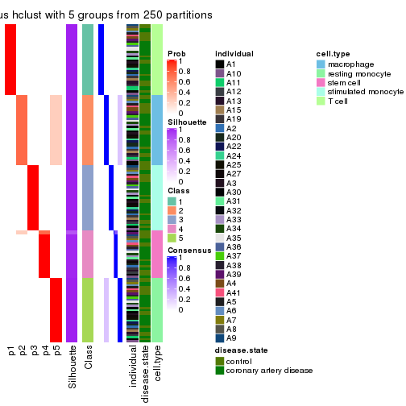</p>

</div>
<div id='tab-MAD-hclust-consensus-heatmap-5'>
<pre><code class="r">consensus_heatmap(res, k = 6)
</code></pre>

<p></p>

</div>
</div>

Heatmaps for the membership of samples in all partitions to see how consistent they are:


<script>
$( function() {
	$( '#tabs-MAD-hclust-membership-heatmap' ).tabs();
} );
</script>
<div id='tabs-MAD-hclust-membership-heatmap'>
<ul>
<li><a href='#tab-MAD-hclust-membership-heatmap-1'>k = 2</a></li>
<li><a href='#tab-MAD-hclust-membership-heatmap-2'>k = 3</a></li>
<li><a href='#tab-MAD-hclust-membership-heatmap-3'>k = 4</a></li>
<li><a href='#tab-MAD-hclust-membership-heatmap-4'>k = 5</a></li>
<li><a href='#tab-MAD-hclust-membership-heatmap-5'>k = 6</a></li>
</ul>
<div id='tab-MAD-hclust-membership-heatmap-1'>
<pre><code class="r">membership_heatmap(res, k = 2)
</code></pre>

<p></p>

</div>
<div id='tab-MAD-hclust-membership-heatmap-2'>
<pre><code class="r">membership_heatmap(res, k = 3)
</code></pre>

<p></p>

</div>
<div id='tab-MAD-hclust-membership-heatmap-3'>
<pre><code class="r">membership_heatmap(res, k = 4)
</code></pre>

<p></p>

</div>
<div id='tab-MAD-hclust-membership-heatmap-4'>
<pre><code class="r">membership_heatmap(res, k = 5)
</code></pre>

<p></p>

</div>
<div id='tab-MAD-hclust-membership-heatmap-5'>
<pre><code class="r">membership_heatmap(res, k = 6)
</code></pre>

<p></p>

</div>
</div>

As soon as we have had the classes for columns, we can look for signatures
which are significantly different between classes which can be candidate marks
for certain classes. Following are the heatmaps for signatures.


Signature heatmaps where rows are scaled:


<script>
$( function() {
	$( '#tabs-MAD-hclust-get-signatures' ).tabs();
} );
</script>
<div id='tabs-MAD-hclust-get-signatures'>
<ul>
<li><a href='#tab-MAD-hclust-get-signatures-1'>k = 2</a></li>
<li><a href='#tab-MAD-hclust-get-signatures-2'>k = 3</a></li>
<li><a href='#tab-MAD-hclust-get-signatures-3'>k = 4</a></li>
<li><a href='#tab-MAD-hclust-get-signatures-4'>k = 5</a></li>
<li><a href='#tab-MAD-hclust-get-signatures-5'>k = 6</a></li>
</ul>
<div id='tab-MAD-hclust-get-signatures-1'>
<pre><code class="r">get_signatures(res, k = 2)
</code></pre>

<p></p>

</div>
<div id='tab-MAD-hclust-get-signatures-2'>
<pre><code class="r">get_signatures(res, k = 3)
</code></pre>

<p></p>

</div>
<div id='tab-MAD-hclust-get-signatures-3'>
<pre><code class="r">get_signatures(res, k = 4)
</code></pre>

<p></p>

</div>
<div id='tab-MAD-hclust-get-signatures-4'>
<pre><code class="r">get_signatures(res, k = 5)
</code></pre>

<p></p>

</div>
<div id='tab-MAD-hclust-get-signatures-5'>
<pre><code class="r">get_signatures(res, k = 6)
</code></pre>

<pre><code>#&gt; Error in mat[ceiling(1:nr/h_ratio), ceiling(1:nc/w_ratio), drop = FALSE]: subscript out of bounds
</code></pre>

<p></p>

</div>
</div>


Signature heatmaps where rows are not scaled:


<script>
$( function() {
	$( '#tabs-MAD-hclust-get-signatures-no-scale' ).tabs();
} );
</script>
<div id='tabs-MAD-hclust-get-signatures-no-scale'>
<ul>
<li><a href='#tab-MAD-hclust-get-signatures-no-scale-1'>k = 2</a></li>
<li><a href='#tab-MAD-hclust-get-signatures-no-scale-2'>k = 3</a></li>
<li><a href='#tab-MAD-hclust-get-signatures-no-scale-3'>k = 4</a></li>
<li><a href='#tab-MAD-hclust-get-signatures-no-scale-4'>k = 5</a></li>
<li><a href='#tab-MAD-hclust-get-signatures-no-scale-5'>k = 6</a></li>
</ul>
<div id='tab-MAD-hclust-get-signatures-no-scale-1'>
<pre><code class="r">get_signatures(res, k = 2, scale_rows = FALSE)
</code></pre>

<p></p>

</div>
<div id='tab-MAD-hclust-get-signatures-no-scale-2'>
<pre><code class="r">get_signatures(res, k = 3, scale_rows = FALSE)
</code></pre>

<p></p>

</div>
<div id='tab-MAD-hclust-get-signatures-no-scale-3'>
<pre><code class="r">get_signatures(res, k = 4, scale_rows = FALSE)
</code></pre>

<p></p>

</div>
<div id='tab-MAD-hclust-get-signatures-no-scale-4'>
<pre><code class="r">get_signatures(res, k = 5, scale_rows = FALSE)
</code></pre>

<p></p>

</div>
<div id='tab-MAD-hclust-get-signatures-no-scale-5'>
<pre><code class="r">get_signatures(res, k = 6, scale_rows = FALSE)
</code></pre>

<p></p>

</div>
</div>


Compare the overlap of signatures from different k:

```r
compare_signatures(res)
```


`get_signature()` returns a data frame invisibly. TO get the list of signatures, the function
call should be assigned to a variable explicitly. In following code, if `plot` argument is set
to `FALSE`, no heatmap is plotted while only the differential analysis is performed.

```r
# code only for demonstration
tb = get_signature(res, k = ..., plot = FALSE)
```

An example of the output of `tb` is:

```
#>   which_row         fdr    mean_1    mean_2 scaled_mean_1 scaled_mean_2 km
#> 1        38 0.042760348  8.373488  9.131774    -0.5533452     0.5164555  1
#> 2        40 0.018707592  7.106213  8.469186    -0.6173731     0.5762149  1
#> 3        55 0.019134737 10.221463 11.207825    -0.6159697     0.5749050  1
#> 4        59 0.006059896  5.921854  7.869574    -0.6899429     0.6439467  1
#> 5        60 0.018055526  8.928898 10.211722    -0.6204761     0.5791110  1
#> 6        98 0.009384629 15.714769 14.887706     0.6635654    -0.6193277  2
...
```

The columns in `tb` are:

1. `which_row`: row indices corresponding to the input matrix.
2. `fdr`: FDR for the differential test. 
3. `mean_x`: The mean value in group x.
4. `scaled_mean_x`: The mean value in group x after rows are scaled.
5. `km`: Row groups if k-means clustering is applied to rows.


UMAP plot which shows how samples are separated.


<script>
$( function() {
	$( '#tabs-MAD-hclust-dimension-reduction' ).tabs();
} );
</script>
<div id='tabs-MAD-hclust-dimension-reduction'>
<ul>
<li><a href='#tab-MAD-hclust-dimension-reduction-1'>k = 2</a></li>
<li><a href='#tab-MAD-hclust-dimension-reduction-2'>k = 3</a></li>
<li><a href='#tab-MAD-hclust-dimension-reduction-3'>k = 4</a></li>
<li><a href='#tab-MAD-hclust-dimension-reduction-4'>k = 5</a></li>
<li><a href='#tab-MAD-hclust-dimension-reduction-5'>k = 6</a></li>
</ul>
<div id='tab-MAD-hclust-dimension-reduction-1'>
<pre><code class="r">dimension_reduction(res, k = 2, method = &quot;UMAP&quot;)
</code></pre>

<p></p>

</div>
<div id='tab-MAD-hclust-dimension-reduction-2'>
<pre><code class="r">dimension_reduction(res, k = 3, method = &quot;UMAP&quot;)
</code></pre>

<p></p>

</div>
<div id='tab-MAD-hclust-dimension-reduction-3'>
<pre><code class="r">dimension_reduction(res, k = 4, method = &quot;UMAP&quot;)
</code></pre>

<p></p>

</div>
<div id='tab-MAD-hclust-dimension-reduction-4'>
<pre><code class="r">dimension_reduction(res, k = 5, method = &quot;UMAP&quot;)
</code></pre>

<p></p>

</div>
<div id='tab-MAD-hclust-dimension-reduction-5'>
<pre><code class="r">dimension_reduction(res, k = 6, method = &quot;UMAP&quot;)
</code></pre>

<p></p>

</div>
</div>


Following heatmap shows how subgroups are split when increasing `k`:

```r
collect_classes(res)
```


Test correlation between subgroups and known annotations. If the known
annotation is numeric, one-way ANOVA test is applied, and if the known
annotation is discrete, chi-squared contingency table test is applied.

```r
test_to_known_factors(res)
```

```
#>              n individual(p) disease.state(p) cell.type(p) k
#> MAD:hclust 153             1            1.000     4.63e-32 2
#> MAD:hclust 153             1            0.875     2.17e-61 3
#> MAD:hclust 153             1            0.964     1.16e-90 4
#> MAD:hclust 153             1            0.989    6.51e-120 5
#> MAD:hclust 153             1            0.740    8.52e-117 6
```


If matrix rows can be associated to genes, consider to use `functional_enrichment(res,
...)` to perform function enrichment for the signature genes. See [this vignette](http://bioconductor.org/packages/devel/bioc/vignettes/cola/inst/doc/functional_enrichment.html) for more detailed explanations.


 

---------------------------------------------------


### MAD:kmeans


The object with results only for a single top-value method and a single partition method 
can be extracted as:

```r
res = res_list["MAD", "kmeans"]
# you can also extract it by
# res = res_list["MAD:kmeans"]
```

A summary of `res` and all the functions that can be applied to it:

```r
res
```

```
#> A 'ConsensusPartition' object with k = 2, 3, 4, 5, 6.
#>   On a matrix with 19559 rows and 153 columns.
#>   Top rows (1000, 2000, 3000, 4000, 5000) are extracted by 'MAD' method.
#>   Subgroups are detected by 'kmeans' method.
#>   Performed in total 1250 partitions by row resampling.
#>   Best k for subgroups seems to be 5.
#> 
#> Following methods can be applied to this 'ConsensusPartition' object:
#>  [1] "cola_report"             "collect_classes"         "collect_plots"          
#>  [4] "collect_stats"           "colnames"                "compare_signatures"     
#>  [7] "consensus_heatmap"       "dimension_reduction"     "functional_enrichment"  
#> [10] "get_anno_col"            "get_anno"                "get_classes"            
#> [13] "get_consensus"           "get_matrix"              "get_membership"         
#> [16] "get_param"               "get_signatures"          "get_stats"              
#> [19] "is_best_k"               "is_stable_k"             "membership_heatmap"     
#> [22] "ncol"                    "nrow"                    "plot_ecdf"              
#> [25] "rownames"                "select_partition_number" "show"                   
#> [28] "suggest_best_k"          "test_to_known_factors"
```

`collect_plots()` function collects all the plots made from `res` for all `k` (number of partitions)
into one single page to provide an easy and fast comparison between different `k`.

```r
collect_plots(res)
```


The plots are:

- The first row: a plot of the ECDF (empirical cumulative distribution
  function) curves of the consensus matrix for each `k` and the heatmap of
  predicted classes for each `k`.
- The second row: heatmaps of the consensus matrix for each `k`.
- The third row: heatmaps of the membership matrix for each `k`.
- The fouth row: heatmaps of the signatures for each `k`.

All the plots in panels can be made by individual functions and they are
plotted later in this section.

`select_partition_number()` produces several plots showing different
statistics for choosing "optimized" `k`. There are following statistics:

- ECDF curves of the consensus matrix for each `k`;
- 1-PAC. [The PAC
  score](https://en.wikipedia.org/wiki/Consensus_clustering#Over-interpretation_potential_of_consensus_clustering)
  measures the proportion of the ambiguous subgrouping.
- Mean silhouette score.
- Concordance. The mean probability of fiting the consensus class ids in all
  partitions.
- Area increased. Denote $A_k$ as the area under the ECDF curve for current
  `k`, the area increased is defined as $A_k - A_{k-1}$.
- Rand index. The percent of pairs of samples that are both in a same cluster
  or both are not in a same cluster in the partition of k and k-1.
- Jaccard index. The ratio of pairs of samples are both in a same cluster in
  the partition of k and k-1 and the pairs of samples are both in a same
  cluster in the partition k or k-1.

The detailed explanations of these statistics can be found in [the _cola_
vignette](http://bioconductor.org/packages/devel/bioc/vignettes/cola/inst/doc/cola.html#toc_13).

Generally speaking, lower PAC score, higher mean silhouette score or higher
concordance corresponds to better partition. Rand index and Jaccard index
measure how similar the current partition is compared to partition with `k-1`.
If they are too similar, we won't accept `k` is better than `k-1`.

```r
select_partition_number(res)
```


The numeric values for all these statistics can be obtained by `get_stats()`.

```r
get_stats(res)
```

```
#>   k 1-PAC mean_silhouette concordance area_increased  Rand Jaccard
#> 2 2 0.420           0.924       0.923         0.4553 0.529   0.529
#> 3 3 0.669           0.605       0.690         0.3339 0.827   0.673
#> 4 4 0.656           0.760       0.733         0.1472 0.819   0.594
#> 5 5 0.713           0.953       0.826         0.0786 0.842   0.557
#> 6 6 0.745           0.918       0.831         0.0468 1.000   1.000
```

`suggest_best_k()` suggests the best $k$ based on these statistics. The rules are as follows:

- All $k$ with Jaccard index larger than 0.95 are removed because increasing
  $k$ does not provide enough extra information. If all $k$ are removed, it is
  marked as no subgroup is detected.
- For all $k$ with 1-PAC score larger than 0.9, the maximal $k$ is taken as
  the best $k$, and other $k$ are marked as optional $k$.
- If it does not fit the second rule. The $k$ with the maximal vote of the
  highest 1-PAC score, highest mean silhouette, and highest concordance is
  taken as the best $k$.

```r
suggest_best_k(res)
```

```
#> [1] 5
```


Following shows the table of the partitions (You need to click the **show/hide
code output** link to see it). The membership matrix (columns with name `p*`)
is inferred by
[`clue::cl_consensus()`](https://www.rdocumentation.org/link/cl_consensus?package=clue)
function with the `SE` method. Basically the value in the membership matrix
represents the probability to belong to a certain group. The finall class
label for an item is determined with the group with highest probability it
belongs to.

In `get_classes()` function, the entropy is calculated from the membership
matrix and the silhouette score is calculated from the consensus matrix.


<script>
$( function() {
	$( '#tabs-MAD-kmeans-get-classes' ).tabs();
} );
</script>
<div id='tabs-MAD-kmeans-get-classes'>
<ul>
<li><a href='#tab-MAD-kmeans-get-classes-1'>k = 2</a></li>
<li><a href='#tab-MAD-kmeans-get-classes-2'>k = 3</a></li>
<li><a href='#tab-MAD-kmeans-get-classes-3'>k = 4</a></li>
<li><a href='#tab-MAD-kmeans-get-classes-4'>k = 5</a></li>
<li><a href='#tab-MAD-kmeans-get-classes-5'>k = 6</a></li>
</ul>

<div id='tab-MAD-kmeans-get-classes-1'>
<p><a id='tab-MAD-kmeans-get-classes-1-a' style='color:#0366d6' href='#'>show/hide code output</a></p>
<pre><code class="r">cbind(get_classes(res, k = 2), get_membership(res, k = 2))
</code></pre>

<pre><code>#&gt;           class entropy silhouette    p1    p2
#&gt; GSM247795     2  0.5408      0.909 0.124 0.876
#&gt; GSM247854     2  0.5408      0.909 0.124 0.876
#&gt; GSM247758     2  0.7883      0.859 0.236 0.764
#&gt; GSM247742     1  0.0376      0.997 0.996 0.004
#&gt; GSM247755     2  0.0672      0.871 0.008 0.992
#&gt; GSM247841     1  0.0000      0.998 1.000 0.000
#&gt; GSM247703     2  0.5408      0.909 0.124 0.876
#&gt; GSM247739     2  0.7883      0.859 0.236 0.764
#&gt; GSM247715     1  0.0376      0.997 0.996 0.004
#&gt; GSM247829     2  0.0672      0.871 0.008 0.992
#&gt; GSM247842     1  0.0000      0.998 1.000 0.000
#&gt; GSM247805     2  0.5408      0.909 0.124 0.876
#&gt; GSM247786     2  0.7883      0.859 0.236 0.764
#&gt; GSM247812     2  0.0672      0.871 0.008 0.992
#&gt; GSM247776     1  0.0000      0.998 1.000 0.000
#&gt; GSM247850     1  0.0000      0.998 1.000 0.000
#&gt; GSM247717     2  0.5408      0.909 0.124 0.876
#&gt; GSM247784     2  0.7883      0.859 0.236 0.764
#&gt; GSM247834     1  0.0376      0.997 0.996 0.004
#&gt; GSM247783     2  0.0672      0.871 0.008 0.992
#&gt; GSM247846     1  0.0000      0.998 1.000 0.000
#&gt; GSM247822     2  0.5408      0.909 0.124 0.876
#&gt; GSM247710     2  0.7883      0.859 0.236 0.764
#&gt; GSM247713     1  0.0376      0.997 0.996 0.004
#&gt; GSM247840     2  0.0672      0.871 0.008 0.992
#&gt; GSM247733     1  0.0000      0.998 1.000 0.000
#&gt; GSM247852     1  0.0000      0.998 1.000 0.000
#&gt; GSM247790     2  0.5408      0.909 0.124 0.876
#&gt; GSM247730     2  0.7883      0.859 0.236 0.764
#&gt; GSM247824     2  0.0672      0.871 0.008 0.992
#&gt; GSM247770     1  0.0000      0.998 1.000 0.000
#&gt; GSM247711     2  0.5408      0.909 0.124 0.876
#&gt; GSM247782     2  0.7883      0.859 0.236 0.764
#&gt; GSM247836     1  0.0376      0.997 0.996 0.004
#&gt; GSM247785     2  0.0672      0.871 0.008 0.992
#&gt; GSM247847     1  0.0000      0.998 1.000 0.000
#&gt; GSM247750     2  0.5408      0.909 0.124 0.876
#&gt; GSM247788     2  0.7883      0.859 0.236 0.764
#&gt; GSM247849     1  0.0376      0.997 0.996 0.004
#&gt; GSM247772     2  0.0672      0.871 0.008 0.992
#&gt; GSM247760     1  0.0000      0.998 1.000 0.000
#&gt; GSM247764     2  0.5408      0.909 0.124 0.876
#&gt; GSM247851     2  0.5408      0.909 0.124 0.876
#&gt; GSM247714     2  0.7883      0.859 0.236 0.764
#&gt; GSM247828     1  0.0376      0.997 0.996 0.004
#&gt; GSM247704     2  0.0672      0.871 0.008 0.992
#&gt; GSM247818     1  0.0000      0.998 1.000 0.000
#&gt; GSM247823     2  0.5408      0.909 0.124 0.876
#&gt; GSM247706     2  0.7883      0.859 0.236 0.764
#&gt; GSM247835     2  0.0672      0.871 0.008 0.992
#&gt; GSM247734     1  0.0000      0.998 1.000 0.000
#&gt; GSM247819     2  0.5408      0.909 0.124 0.876
#&gt; GSM247809     2  0.7883      0.859 0.236 0.764
#&gt; GSM247830     2  0.0672      0.871 0.008 0.992
#&gt; GSM247833     1  0.0000      0.998 1.000 0.000
#&gt; GSM247738     2  0.5408      0.909 0.124 0.876
#&gt; GSM247716     2  0.7883      0.859 0.236 0.764
#&gt; GSM247747     2  0.0672      0.871 0.008 0.992
#&gt; GSM247722     1  0.0000      0.998 1.000 0.000
#&gt; GSM247816     2  0.5408      0.909 0.124 0.876
#&gt; GSM247839     2  0.7883      0.859 0.236 0.764
#&gt; GSM247821     1  0.0376      0.997 0.996 0.004
#&gt; GSM247798     2  0.0672      0.871 0.008 0.992
#&gt; GSM247838     1  0.0000      0.998 1.000 0.000
#&gt; GSM247721     2  0.5408      0.909 0.124 0.876
#&gt; GSM247781     2  0.7883      0.859 0.236 0.764
#&gt; GSM247762     1  0.0376      0.997 0.996 0.004
#&gt; GSM247825     2  0.0672      0.871 0.008 0.992
#&gt; GSM247777     1  0.0000      0.998 1.000 0.000
#&gt; GSM247761     2  0.5408      0.909 0.124 0.876
#&gt; GSM247720     2  0.7883      0.859 0.236 0.764
#&gt; GSM247814     2  0.0672      0.871 0.008 0.992
#&gt; GSM247732     1  0.0000      0.998 1.000 0.000
#&gt; GSM247708     2  0.5408      0.909 0.124 0.876
#&gt; GSM247740     2  0.7883      0.859 0.236 0.764
#&gt; GSM247749     1  0.0376      0.997 0.996 0.004
#&gt; GSM247767     2  0.0672      0.871 0.008 0.992
#&gt; GSM247748     1  0.0000      0.998 1.000 0.000
#&gt; GSM247705     2  0.5408      0.909 0.124 0.876
#&gt; GSM247746     2  0.7883      0.859 0.236 0.764
#&gt; GSM247752     1  0.0376      0.997 0.996 0.004
#&gt; GSM247769     2  0.0672      0.871 0.008 0.992
#&gt; GSM247753     1  0.0000      0.998 1.000 0.000
#&gt; GSM247723     2  0.5408      0.909 0.124 0.876
#&gt; GSM247779     2  0.7883      0.859 0.236 0.764
#&gt; GSM247756     1  0.0376      0.997 0.996 0.004
#&gt; GSM247826     2  0.0672      0.871 0.008 0.992
#&gt; GSM247775     1  0.0000      0.998 1.000 0.000
#&gt; GSM247741     2  0.5408      0.909 0.124 0.876
#&gt; GSM247799     2  0.7883      0.859 0.236 0.764
#&gt; GSM247778     1  0.0376      0.997 0.996 0.004
#&gt; GSM247806     2  0.0672      0.871 0.008 0.992
#&gt; GSM247815     1  0.0000      0.998 1.000 0.000
#&gt; GSM247735     2  0.5408      0.909 0.124 0.876
#&gt; GSM247831     2  0.7883      0.859 0.236 0.764
#&gt; GSM247845     1  0.0376      0.997 0.996 0.004
#&gt; GSM247791     2  0.0672      0.871 0.008 0.992
#&gt; GSM247780     1  0.0000      0.998 1.000 0.000
#&gt; GSM247853     1  0.0000      0.998 1.000 0.000
#&gt; GSM247800     2  0.5408      0.909 0.124 0.876
#&gt; GSM247729     2  0.7883      0.859 0.236 0.764
#&gt; GSM247810     1  0.0376      0.997 0.996 0.004
#&gt; GSM247844     2  0.0672      0.871 0.008 0.992
#&gt; GSM247793     1  0.0000      0.998 1.000 0.000
#&gt; GSM247759     2  0.5408      0.909 0.124 0.876
#&gt; GSM247724     2  0.7883      0.859 0.236 0.764
#&gt; GSM247817     2  0.0672      0.871 0.008 0.992
#&gt; GSM247727     1  0.0000      0.998 1.000 0.000
#&gt; GSM247796     2  0.5408      0.909 0.124 0.876
#&gt; GSM247725     2  0.7883      0.859 0.236 0.764
#&gt; GSM247801     1  0.0376      0.997 0.996 0.004
#&gt; GSM247731     2  0.0672      0.871 0.008 0.992
#&gt; GSM247765     1  0.0000      0.998 1.000 0.000
#&gt; GSM247792     2  0.5408      0.909 0.124 0.876
#&gt; GSM247726     2  0.7883      0.859 0.236 0.764
#&gt; GSM247803     1  0.0376      0.997 0.996 0.004
#&gt; GSM247728     2  0.0672      0.871 0.008 0.992
#&gt; GSM247768     1  0.0000      0.998 1.000 0.000
#&gt; GSM247745     2  0.5408      0.909 0.124 0.876
#&gt; GSM247855     2  0.5408      0.909 0.124 0.876
#&gt; GSM247804     2  0.7883      0.859 0.236 0.764
#&gt; GSM247774     1  0.0376      0.997 0.996 0.004
#&gt; GSM247807     2  0.0672      0.871 0.008 0.992
#&gt; GSM247813     1  0.0000      0.998 1.000 0.000
#&gt; GSM247736     2  0.5408      0.909 0.124 0.876
#&gt; GSM247712     2  0.7883      0.859 0.236 0.764
#&gt; GSM247797     1  0.0376      0.997 0.996 0.004
#&gt; GSM247743     2  0.0672      0.871 0.008 0.992
#&gt; GSM247719     1  0.0000      0.998 1.000 0.000
#&gt; GSM247707     2  0.5408      0.909 0.124 0.876
#&gt; GSM247737     2  0.7883      0.859 0.236 0.764
#&gt; GSM247827     2  0.0672      0.871 0.008 0.992
#&gt; GSM247848     1  0.0000      0.998 1.000 0.000
#&gt; GSM247794     2  0.5408      0.909 0.124 0.876
#&gt; GSM247757     2  0.7883      0.859 0.236 0.764
#&gt; GSM247744     1  0.0376      0.997 0.996 0.004
#&gt; GSM247751     2  0.0672      0.871 0.008 0.992
#&gt; GSM247837     1  0.0000      0.998 1.000 0.000
#&gt; GSM247754     2  0.5408      0.909 0.124 0.876
#&gt; GSM247789     2  0.7883      0.859 0.236 0.764
#&gt; GSM247802     1  0.0376      0.997 0.996 0.004
#&gt; GSM247771     2  0.0672      0.871 0.008 0.992
#&gt; GSM247763     1  0.0000      0.998 1.000 0.000
#&gt; GSM247808     2  0.5408      0.909 0.124 0.876
#&gt; GSM247787     2  0.7883      0.859 0.236 0.764
#&gt; GSM247843     1  0.0376      0.997 0.996 0.004
#&gt; GSM247811     2  0.0672      0.871 0.008 0.992
#&gt; GSM247773     1  0.0000      0.998 1.000 0.000
#&gt; GSM247766     2  0.5408      0.909 0.124 0.876
#&gt; GSM247718     2  0.5946      0.902 0.144 0.856
#&gt; GSM247832     1  0.0376      0.997 0.996 0.004
#&gt; GSM247709     2  0.0672      0.871 0.008 0.992
#&gt; GSM247820     1  0.0000      0.998 1.000 0.000
</code></pre>

<script>
$('#tab-MAD-kmeans-get-classes-1-a').parent().next().next().hide();
$('#tab-MAD-kmeans-get-classes-1-a').click(function(){
  $('#tab-MAD-kmeans-get-classes-1-a').parent().next().next().toggle();
  return(false);
});
</script>
</div>

<div id='tab-MAD-kmeans-get-classes-2'>
<p><a id='tab-MAD-kmeans-get-classes-2-a' style='color:#0366d6' href='#'>show/hide code output</a></p>
<pre><code class="r">cbind(get_classes(res, k = 3), get_membership(res, k = 3))
</code></pre>

<pre><code>#&gt;           class entropy silhouette    p1    p2    p3
#&gt; GSM247795     3  0.6954     -0.135 0.016 0.484 0.500
#&gt; GSM247854     3  0.6954     -0.135 0.016 0.484 0.500
#&gt; GSM247758     2  0.6603      1.000 0.020 0.648 0.332
#&gt; GSM247742     1  0.5835      0.832 0.660 0.340 0.000
#&gt; GSM247755     3  0.0000      0.540 0.000 0.000 1.000
#&gt; GSM247841     1  0.0000      0.891 1.000 0.000 0.000
#&gt; GSM247703     3  0.6954     -0.135 0.016 0.484 0.500
#&gt; GSM247739     2  0.6603      1.000 0.020 0.648 0.332
#&gt; GSM247715     1  0.5835      0.832 0.660 0.340 0.000
#&gt; GSM247829     3  0.0424      0.539 0.000 0.008 0.992
#&gt; GSM247842     1  0.0000      0.891 1.000 0.000 0.000
#&gt; GSM247805     3  0.6954     -0.135 0.016 0.484 0.500
#&gt; GSM247786     2  0.6603      1.000 0.020 0.648 0.332
#&gt; GSM247812     3  0.0592      0.539 0.000 0.012 0.988
#&gt; GSM247776     1  0.0000      0.891 1.000 0.000 0.000
#&gt; GSM247850     1  0.0000      0.891 1.000 0.000 0.000
#&gt; GSM247717     3  0.6954     -0.135 0.016 0.484 0.500
#&gt; GSM247784     2  0.6603      1.000 0.020 0.648 0.332
#&gt; GSM247834     1  0.5835      0.832 0.660 0.340 0.000
#&gt; GSM247783     3  0.0000      0.540 0.000 0.000 1.000
#&gt; GSM247846     1  0.0000      0.891 1.000 0.000 0.000
#&gt; GSM247822     3  0.6954     -0.135 0.016 0.484 0.500
#&gt; GSM247710     2  0.6603      1.000 0.020 0.648 0.332
#&gt; GSM247713     1  0.5835      0.832 0.660 0.340 0.000
#&gt; GSM247840     3  0.0592      0.539 0.000 0.012 0.988
#&gt; GSM247733     1  0.0000      0.891 1.000 0.000 0.000
#&gt; GSM247852     1  0.0000      0.891 1.000 0.000 0.000
#&gt; GSM247790     3  0.6954     -0.135 0.016 0.484 0.500
#&gt; GSM247730     2  0.6603      1.000 0.020 0.648 0.332
#&gt; GSM247824     3  0.0000      0.540 0.000 0.000 1.000
#&gt; GSM247770     1  0.0000      0.891 1.000 0.000 0.000
#&gt; GSM247711     3  0.6954     -0.135 0.016 0.484 0.500
#&gt; GSM247782     2  0.6603      1.000 0.020 0.648 0.332
#&gt; GSM247836     1  0.5835      0.832 0.660 0.340 0.000
#&gt; GSM247785     3  0.0000      0.540 0.000 0.000 1.000
#&gt; GSM247847     1  0.0000      0.891 1.000 0.000 0.000
#&gt; GSM247750     3  0.6954     -0.135 0.016 0.484 0.500
#&gt; GSM247788     2  0.6603      1.000 0.020 0.648 0.332
#&gt; GSM247849     1  0.5835      0.832 0.660 0.340 0.000
#&gt; GSM247772     3  0.0000      0.540 0.000 0.000 1.000
#&gt; GSM247760     1  0.0000      0.891 1.000 0.000 0.000
#&gt; GSM247764     3  0.6954     -0.135 0.016 0.484 0.500
#&gt; GSM247851     3  0.6954     -0.135 0.016 0.484 0.500
#&gt; GSM247714     2  0.6603      1.000 0.020 0.648 0.332
#&gt; GSM247828     1  0.5835      0.832 0.660 0.340 0.000
#&gt; GSM247704     3  0.0747      0.538 0.000 0.016 0.984
#&gt; GSM247818     1  0.0000      0.891 1.000 0.000 0.000
#&gt; GSM247823     3  0.6954     -0.135 0.016 0.484 0.500
#&gt; GSM247706     2  0.6603      1.000 0.020 0.648 0.332
#&gt; GSM247835     3  0.0000      0.540 0.000 0.000 1.000
#&gt; GSM247734     1  0.0000      0.891 1.000 0.000 0.000
#&gt; GSM247819     3  0.6954     -0.135 0.016 0.484 0.500
#&gt; GSM247809     2  0.6603      1.000 0.020 0.648 0.332
#&gt; GSM247830     3  0.0237      0.540 0.000 0.004 0.996
#&gt; GSM247833     1  0.0000      0.891 1.000 0.000 0.000
#&gt; GSM247738     3  0.6954     -0.135 0.016 0.484 0.500
#&gt; GSM247716     2  0.6603      1.000 0.020 0.648 0.332
#&gt; GSM247747     3  0.0424      0.539 0.000 0.008 0.992
#&gt; GSM247722     1  0.0000      0.891 1.000 0.000 0.000
#&gt; GSM247816     3  0.6954     -0.135 0.016 0.484 0.500
#&gt; GSM247839     2  0.6603      1.000 0.020 0.648 0.332
#&gt; GSM247821     1  0.5835      0.832 0.660 0.340 0.000
#&gt; GSM247798     3  0.0747      0.538 0.000 0.016 0.984
#&gt; GSM247838     1  0.0000      0.891 1.000 0.000 0.000
#&gt; GSM247721     3  0.6954     -0.135 0.016 0.484 0.500
#&gt; GSM247781     2  0.6603      1.000 0.020 0.648 0.332
#&gt; GSM247762     1  0.5835      0.832 0.660 0.340 0.000
#&gt; GSM247825     3  0.0237      0.540 0.000 0.004 0.996
#&gt; GSM247777     1  0.0000      0.891 1.000 0.000 0.000
#&gt; GSM247761     3  0.6954     -0.135 0.016 0.484 0.500
#&gt; GSM247720     2  0.6603      1.000 0.020 0.648 0.332
#&gt; GSM247814     3  0.0424      0.539 0.000 0.008 0.992
#&gt; GSM247732     1  0.0000      0.891 1.000 0.000 0.000
#&gt; GSM247708     3  0.6954     -0.135 0.016 0.484 0.500
#&gt; GSM247740     2  0.6603      1.000 0.020 0.648 0.332
#&gt; GSM247749     1  0.5835      0.832 0.660 0.340 0.000
#&gt; GSM247767     3  0.0747      0.538 0.000 0.016 0.984
#&gt; GSM247748     1  0.0000      0.891 1.000 0.000 0.000
#&gt; GSM247705     3  0.6954     -0.135 0.016 0.484 0.500
#&gt; GSM247746     2  0.6603      1.000 0.020 0.648 0.332
#&gt; GSM247752     1  0.5835      0.832 0.660 0.340 0.000
#&gt; GSM247769     3  0.0000      0.540 0.000 0.000 1.000
#&gt; GSM247753     1  0.0000      0.891 1.000 0.000 0.000
#&gt; GSM247723     3  0.6954     -0.135 0.016 0.484 0.500
#&gt; GSM247779     2  0.6603      1.000 0.020 0.648 0.332
#&gt; GSM247756     1  0.5835      0.832 0.660 0.340 0.000
#&gt; GSM247826     3  0.0000      0.540 0.000 0.000 1.000
#&gt; GSM247775     1  0.0000      0.891 1.000 0.000 0.000
#&gt; GSM247741     3  0.6954     -0.135 0.016 0.484 0.500
#&gt; GSM247799     2  0.6603      1.000 0.020 0.648 0.332
#&gt; GSM247778     1  0.5835      0.832 0.660 0.340 0.000
#&gt; GSM247806     3  0.0000      0.540 0.000 0.000 1.000
#&gt; GSM247815     1  0.0000      0.891 1.000 0.000 0.000
#&gt; GSM247735     3  0.6954     -0.135 0.016 0.484 0.500
#&gt; GSM247831     2  0.6603      1.000 0.020 0.648 0.332
#&gt; GSM247845     1  0.5835      0.832 0.660 0.340 0.000
#&gt; GSM247791     3  0.0592      0.539 0.000 0.012 0.988
#&gt; GSM247780     1  0.0000      0.891 1.000 0.000 0.000
#&gt; GSM247853     1  0.0000      0.891 1.000 0.000 0.000
#&gt; GSM247800     3  0.6954     -0.135 0.016 0.484 0.500
#&gt; GSM247729     2  0.6603      1.000 0.020 0.648 0.332
#&gt; GSM247810     1  0.5835      0.832 0.660 0.340 0.000
#&gt; GSM247844     3  0.0747      0.538 0.000 0.016 0.984
#&gt; GSM247793     1  0.0000      0.891 1.000 0.000 0.000
#&gt; GSM247759     3  0.6954     -0.135 0.016 0.484 0.500
#&gt; GSM247724     2  0.6603      1.000 0.020 0.648 0.332
#&gt; GSM247817     3  0.0424      0.539 0.000 0.008 0.992
#&gt; GSM247727     1  0.0000      0.891 1.000 0.000 0.000
#&gt; GSM247796     3  0.6954     -0.135 0.016 0.484 0.500
#&gt; GSM247725     2  0.6603      1.000 0.020 0.648 0.332
#&gt; GSM247801     1  0.5835      0.832 0.660 0.340 0.000
#&gt; GSM247731     3  0.0000      0.540 0.000 0.000 1.000
#&gt; GSM247765     1  0.0000      0.891 1.000 0.000 0.000
#&gt; GSM247792     3  0.6954     -0.135 0.016 0.484 0.500
#&gt; GSM247726     2  0.6603      1.000 0.020 0.648 0.332
#&gt; GSM247803     1  0.5835      0.832 0.660 0.340 0.000
#&gt; GSM247728     3  0.0000      0.540 0.000 0.000 1.000
#&gt; GSM247768     1  0.0000      0.891 1.000 0.000 0.000
#&gt; GSM247745     3  0.6954     -0.135 0.016 0.484 0.500
#&gt; GSM247855     3  0.6954     -0.135 0.016 0.484 0.500
#&gt; GSM247804     2  0.6603      1.000 0.020 0.648 0.332
#&gt; GSM247774     1  0.5835      0.832 0.660 0.340 0.000
#&gt; GSM247807     3  0.0592      0.539 0.000 0.012 0.988
#&gt; GSM247813     1  0.0000      0.891 1.000 0.000 0.000
#&gt; GSM247736     3  0.6954     -0.135 0.016 0.484 0.500
#&gt; GSM247712     2  0.6603      1.000 0.020 0.648 0.332
#&gt; GSM247797     1  0.5835      0.832 0.660 0.340 0.000
#&gt; GSM247743     3  0.0237      0.540 0.000 0.004 0.996
#&gt; GSM247719     1  0.0000      0.891 1.000 0.000 0.000
#&gt; GSM247707     3  0.6954     -0.135 0.016 0.484 0.500
#&gt; GSM247737     2  0.6603      1.000 0.020 0.648 0.332
#&gt; GSM247827     3  0.0000      0.540 0.000 0.000 1.000
#&gt; GSM247848     1  0.0000      0.891 1.000 0.000 0.000
#&gt; GSM247794     3  0.6954     -0.135 0.016 0.484 0.500
#&gt; GSM247757     2  0.6603      1.000 0.020 0.648 0.332
#&gt; GSM247744     1  0.5835      0.832 0.660 0.340 0.000
#&gt; GSM247751     3  0.0000      0.540 0.000 0.000 1.000
#&gt; GSM247837     1  0.0000      0.891 1.000 0.000 0.000
#&gt; GSM247754     3  0.6954     -0.135 0.016 0.484 0.500
#&gt; GSM247789     2  0.6603      1.000 0.020 0.648 0.332
#&gt; GSM247802     1  0.5835      0.832 0.660 0.340 0.000
#&gt; GSM247771     3  0.0000      0.540 0.000 0.000 1.000
#&gt; GSM247763     1  0.0000      0.891 1.000 0.000 0.000
#&gt; GSM247808     3  0.6954     -0.135 0.016 0.484 0.500
#&gt; GSM247787     2  0.6603      1.000 0.020 0.648 0.332
#&gt; GSM247843     1  0.5835      0.832 0.660 0.340 0.000
#&gt; GSM247811     3  0.0747      0.538 0.000 0.016 0.984
#&gt; GSM247773     1  0.0000      0.891 1.000 0.000 0.000
#&gt; GSM247766     3  0.6954     -0.135 0.016 0.484 0.500
#&gt; GSM247718     2  0.6603      1.000 0.020 0.648 0.332
#&gt; GSM247832     1  0.5835      0.832 0.660 0.340 0.000
#&gt; GSM247709     3  0.0747      0.538 0.000 0.016 0.984
#&gt; GSM247820     1  0.0000      0.891 1.000 0.000 0.000
</code></pre>

<script>
$('#tab-MAD-kmeans-get-classes-2-a').parent().next().next().hide();
$('#tab-MAD-kmeans-get-classes-2-a').click(function(){
  $('#tab-MAD-kmeans-get-classes-2-a').parent().next().next().toggle();
  return(false);
});
</script>
</div>

<div id='tab-MAD-kmeans-get-classes-3'>
<p><a id='tab-MAD-kmeans-get-classes-3-a' style='color:#0366d6' href='#'>show/hide code output</a></p>
<pre><code class="r">cbind(get_classes(res, k = 4), get_membership(res, k = 4))
</code></pre>

<pre><code>#&gt;           class entropy silhouette    p1    p2    p3    p4
#&gt; GSM247795     2  0.7220      0.647 0.000 0.472 0.144 0.384
#&gt; GSM247854     2  0.7220      0.647 0.000 0.472 0.144 0.384
#&gt; GSM247758     2  0.0592      0.652 0.000 0.984 0.016 0.000
#&gt; GSM247742     1  0.5760      0.727 0.520 0.020 0.004 0.456
#&gt; GSM247755     3  0.2867      0.960 0.000 0.104 0.884 0.012
#&gt; GSM247841     1  0.0336      0.819 0.992 0.000 0.008 0.000
#&gt; GSM247703     2  0.7220      0.647 0.000 0.472 0.144 0.384
#&gt; GSM247739     2  0.0592      0.652 0.000 0.984 0.016 0.000
#&gt; GSM247715     1  0.5995      0.727 0.520 0.020 0.012 0.448
#&gt; GSM247829     3  0.3758      0.961 0.000 0.104 0.848 0.048
#&gt; GSM247842     1  0.0524      0.819 0.988 0.000 0.008 0.004
#&gt; GSM247805     2  0.7220      0.647 0.000 0.472 0.144 0.384
#&gt; GSM247786     2  0.0592      0.652 0.000 0.984 0.016 0.000
#&gt; GSM247812     3  0.5160      0.936 0.000 0.104 0.760 0.136
#&gt; GSM247776     1  0.0817      0.819 0.976 0.000 0.024 0.000
#&gt; GSM247850     1  0.0707      0.819 0.980 0.000 0.020 0.000
#&gt; GSM247717     2  0.7220      0.647 0.000 0.472 0.144 0.384
#&gt; GSM247784     2  0.0592      0.652 0.000 0.984 0.016 0.000
#&gt; GSM247834     1  0.5995      0.727 0.520 0.020 0.012 0.448
#&gt; GSM247783     3  0.2737      0.960 0.000 0.104 0.888 0.008
#&gt; GSM247846     1  0.0657      0.820 0.984 0.000 0.012 0.004
#&gt; GSM247822     2  0.7220      0.647 0.000 0.472 0.144 0.384
#&gt; GSM247710     2  0.0592      0.652 0.000 0.984 0.016 0.000
#&gt; GSM247713     1  0.5995      0.727 0.520 0.020 0.012 0.448
#&gt; GSM247840     3  0.5058      0.936 0.000 0.104 0.768 0.128
#&gt; GSM247733     1  0.0188      0.819 0.996 0.000 0.004 0.000
#&gt; GSM247852     1  0.0336      0.819 0.992 0.000 0.008 0.000
#&gt; GSM247790     2  0.7220      0.647 0.000 0.472 0.144 0.384
#&gt; GSM247730     2  0.0592      0.652 0.000 0.984 0.016 0.000
#&gt; GSM247824     3  0.2867      0.960 0.000 0.104 0.884 0.012
#&gt; GSM247770     1  0.0921      0.819 0.972 0.000 0.028 0.000
#&gt; GSM247711     2  0.7220      0.647 0.000 0.472 0.144 0.384
#&gt; GSM247782     2  0.0592      0.652 0.000 0.984 0.016 0.000
#&gt; GSM247836     1  0.5594      0.727 0.520 0.020 0.000 0.460
#&gt; GSM247785     3  0.2737      0.960 0.000 0.104 0.888 0.008
#&gt; GSM247847     1  0.0895      0.820 0.976 0.000 0.020 0.004
#&gt; GSM247750     2  0.7220      0.647 0.000 0.472 0.144 0.384
#&gt; GSM247788     2  0.0592      0.652 0.000 0.984 0.016 0.000
#&gt; GSM247849     1  0.5760      0.727 0.520 0.020 0.004 0.456
#&gt; GSM247772     3  0.2737      0.960 0.000 0.104 0.888 0.008
#&gt; GSM247760     1  0.0817      0.819 0.976 0.000 0.024 0.000
#&gt; GSM247764     2  0.7220      0.647 0.000 0.472 0.144 0.384
#&gt; GSM247851     2  0.7220      0.647 0.000 0.472 0.144 0.384
#&gt; GSM247714     2  0.0592      0.652 0.000 0.984 0.016 0.000
#&gt; GSM247828     1  0.5594      0.727 0.520 0.020 0.000 0.460
#&gt; GSM247704     3  0.4898      0.942 0.000 0.104 0.780 0.116
#&gt; GSM247818     1  0.0921      0.817 0.972 0.000 0.028 0.000
#&gt; GSM247823     2  0.7220      0.647 0.000 0.472 0.144 0.384
#&gt; GSM247706     2  0.0592      0.652 0.000 0.984 0.016 0.000
#&gt; GSM247835     3  0.2737      0.960 0.000 0.104 0.888 0.008
#&gt; GSM247734     1  0.0817      0.819 0.976 0.000 0.024 0.000
#&gt; GSM247819     2  0.7220      0.647 0.000 0.472 0.144 0.384
#&gt; GSM247809     2  0.0592      0.652 0.000 0.984 0.016 0.000
#&gt; GSM247830     3  0.3099      0.960 0.000 0.104 0.876 0.020
#&gt; GSM247833     1  0.0779      0.819 0.980 0.000 0.016 0.004
#&gt; GSM247738     2  0.7220      0.647 0.000 0.472 0.144 0.384
#&gt; GSM247716     2  0.0592      0.652 0.000 0.984 0.016 0.000
#&gt; GSM247747     3  0.3587      0.961 0.000 0.104 0.856 0.040
#&gt; GSM247722     1  0.1305      0.818 0.960 0.000 0.036 0.004
#&gt; GSM247816     2  0.7220      0.647 0.000 0.472 0.144 0.384
#&gt; GSM247839     2  0.0592      0.652 0.000 0.984 0.016 0.000
#&gt; GSM247821     1  0.5995      0.727 0.520 0.020 0.012 0.448
#&gt; GSM247798     3  0.4608      0.947 0.000 0.104 0.800 0.096
#&gt; GSM247838     1  0.1305      0.818 0.960 0.000 0.036 0.004
#&gt; GSM247721     2  0.7220      0.647 0.000 0.472 0.144 0.384
#&gt; GSM247781     2  0.0592      0.652 0.000 0.984 0.016 0.000
#&gt; GSM247762     1  0.6095      0.727 0.520 0.020 0.016 0.444
#&gt; GSM247825     3  0.4144      0.957 0.000 0.104 0.828 0.068
#&gt; GSM247777     1  0.0524      0.819 0.988 0.000 0.008 0.004
#&gt; GSM247761     2  0.7220      0.647 0.000 0.472 0.144 0.384
#&gt; GSM247720     2  0.0592      0.652 0.000 0.984 0.016 0.000
#&gt; GSM247814     3  0.3587      0.960 0.000 0.104 0.856 0.040
#&gt; GSM247732     1  0.0779      0.819 0.980 0.000 0.016 0.004
#&gt; GSM247708     2  0.7220      0.647 0.000 0.472 0.144 0.384
#&gt; GSM247740     2  0.0592      0.652 0.000 0.984 0.016 0.000
#&gt; GSM247749     1  0.5995      0.727 0.520 0.020 0.012 0.448
#&gt; GSM247767     3  0.4728      0.948 0.000 0.104 0.792 0.104
#&gt; GSM247748     1  0.0336      0.819 0.992 0.000 0.008 0.000
#&gt; GSM247705     2  0.7220      0.647 0.000 0.472 0.144 0.384
#&gt; GSM247746     2  0.0592      0.652 0.000 0.984 0.016 0.000
#&gt; GSM247752     1  0.6355      0.727 0.520 0.020 0.028 0.432
#&gt; GSM247769     3  0.3205      0.962 0.000 0.104 0.872 0.024
#&gt; GSM247753     1  0.1022      0.816 0.968 0.000 0.032 0.000
#&gt; GSM247723     2  0.7220      0.647 0.000 0.472 0.144 0.384
#&gt; GSM247779     2  0.0592      0.652 0.000 0.984 0.016 0.000
#&gt; GSM247756     1  0.5594      0.727 0.520 0.020 0.000 0.460
#&gt; GSM247826     3  0.2737      0.960 0.000 0.104 0.888 0.008
#&gt; GSM247775     1  0.0336      0.819 0.992 0.000 0.008 0.000
#&gt; GSM247741     2  0.7220      0.647 0.000 0.472 0.144 0.384
#&gt; GSM247799     2  0.0592      0.652 0.000 0.984 0.016 0.000
#&gt; GSM247778     1  0.5995      0.727 0.520 0.020 0.012 0.448
#&gt; GSM247806     3  0.2867      0.960 0.000 0.104 0.884 0.012
#&gt; GSM247815     1  0.0817      0.819 0.976 0.000 0.024 0.000
#&gt; GSM247735     2  0.7220      0.647 0.000 0.472 0.144 0.384
#&gt; GSM247831     2  0.0592      0.652 0.000 0.984 0.016 0.000
#&gt; GSM247845     1  0.5594      0.727 0.520 0.020 0.000 0.460
#&gt; GSM247791     3  0.5160      0.936 0.000 0.104 0.760 0.136
#&gt; GSM247780     1  0.1109      0.819 0.968 0.000 0.028 0.004
#&gt; GSM247853     1  0.1109      0.819 0.968 0.000 0.028 0.004
#&gt; GSM247800     2  0.7220      0.647 0.000 0.472 0.144 0.384
#&gt; GSM247729     2  0.0592      0.652 0.000 0.984 0.016 0.000
#&gt; GSM247810     1  0.5995      0.727 0.520 0.020 0.012 0.448
#&gt; GSM247844     3  0.4608      0.947 0.000 0.104 0.800 0.096
#&gt; GSM247793     1  0.0188      0.819 0.996 0.000 0.004 0.000
#&gt; GSM247759     2  0.7220      0.647 0.000 0.472 0.144 0.384
#&gt; GSM247724     2  0.0592      0.652 0.000 0.984 0.016 0.000
#&gt; GSM247817     3  0.3587      0.960 0.000 0.104 0.856 0.040
#&gt; GSM247727     1  0.0779      0.819 0.980 0.000 0.016 0.004
#&gt; GSM247796     2  0.7220      0.647 0.000 0.472 0.144 0.384
#&gt; GSM247725     2  0.0592      0.652 0.000 0.984 0.016 0.000
#&gt; GSM247801     1  0.6187      0.727 0.520 0.020 0.020 0.440
#&gt; GSM247731     3  0.2737      0.960 0.000 0.104 0.888 0.008
#&gt; GSM247765     1  0.0817      0.819 0.976 0.000 0.024 0.000
#&gt; GSM247792     2  0.7220      0.647 0.000 0.472 0.144 0.384
#&gt; GSM247726     2  0.0592      0.652 0.000 0.984 0.016 0.000
#&gt; GSM247803     1  0.6355      0.727 0.520 0.020 0.028 0.432
#&gt; GSM247728     3  0.3840      0.956 0.000 0.104 0.844 0.052
#&gt; GSM247768     1  0.1022      0.816 0.968 0.000 0.032 0.000
#&gt; GSM247745     2  0.7220      0.647 0.000 0.472 0.144 0.384
#&gt; GSM247855     2  0.7220      0.647 0.000 0.472 0.144 0.384
#&gt; GSM247804     2  0.0592      0.652 0.000 0.984 0.016 0.000
#&gt; GSM247774     1  0.5885      0.728 0.520 0.020 0.008 0.452
#&gt; GSM247807     3  0.5110      0.936 0.000 0.104 0.764 0.132
#&gt; GSM247813     1  0.1209      0.819 0.964 0.000 0.032 0.004
#&gt; GSM247736     2  0.7220      0.647 0.000 0.472 0.144 0.384
#&gt; GSM247712     2  0.0592      0.652 0.000 0.984 0.016 0.000
#&gt; GSM247797     1  0.6095      0.727 0.520 0.020 0.016 0.444
#&gt; GSM247743     3  0.2867      0.960 0.000 0.104 0.884 0.012
#&gt; GSM247719     1  0.0779      0.819 0.980 0.000 0.016 0.004
#&gt; GSM247707     2  0.7220      0.647 0.000 0.472 0.144 0.384
#&gt; GSM247737     2  0.0592      0.652 0.000 0.984 0.016 0.000
#&gt; GSM247827     3  0.3674      0.957 0.000 0.104 0.852 0.044
#&gt; GSM247848     1  0.0657      0.819 0.984 0.000 0.012 0.004
#&gt; GSM247794     2  0.7220      0.647 0.000 0.472 0.144 0.384
#&gt; GSM247757     2  0.0592      0.652 0.000 0.984 0.016 0.000
#&gt; GSM247744     1  0.5885      0.728 0.520 0.020 0.008 0.452
#&gt; GSM247751     3  0.3840      0.956 0.000 0.104 0.844 0.052
#&gt; GSM247837     1  0.0336      0.819 0.992 0.000 0.008 0.000
#&gt; GSM247754     2  0.7220      0.647 0.000 0.472 0.144 0.384
#&gt; GSM247789     2  0.0592      0.652 0.000 0.984 0.016 0.000
#&gt; GSM247802     1  0.5995      0.727 0.520 0.020 0.012 0.448
#&gt; GSM247771     3  0.2737      0.960 0.000 0.104 0.888 0.008
#&gt; GSM247763     1  0.0921      0.819 0.972 0.000 0.028 0.000
#&gt; GSM247808     2  0.7220      0.647 0.000 0.472 0.144 0.384
#&gt; GSM247787     2  0.0592      0.652 0.000 0.984 0.016 0.000
#&gt; GSM247843     1  0.5995      0.727 0.520 0.020 0.012 0.448
#&gt; GSM247811     3  0.5209      0.934 0.000 0.104 0.756 0.140
#&gt; GSM247773     1  0.0336      0.819 0.992 0.000 0.008 0.000
#&gt; GSM247766     2  0.7220      0.647 0.000 0.472 0.144 0.384
#&gt; GSM247718     2  0.0592      0.652 0.000 0.984 0.016 0.000
#&gt; GSM247832     1  0.5760      0.727 0.520 0.020 0.004 0.456
#&gt; GSM247709     3  0.5160      0.935 0.000 0.104 0.760 0.136
#&gt; GSM247820     1  0.0895      0.819 0.976 0.000 0.020 0.004
</code></pre>

<script>
$('#tab-MAD-kmeans-get-classes-3-a').parent().next().next().hide();
$('#tab-MAD-kmeans-get-classes-3-a').click(function(){
  $('#tab-MAD-kmeans-get-classes-3-a').parent().next().next().toggle();
  return(false);
});
</script>
</div>

<div id='tab-MAD-kmeans-get-classes-4'>
<p><a id='tab-MAD-kmeans-get-classes-4-a' style='color:#0366d6' href='#'>show/hide code output</a></p>
<pre><code class="r">cbind(get_classes(res, k = 5), get_membership(res, k = 5))
</code></pre>

<pre><code>#&gt;           class entropy silhouette    p1    p2    p3    p4    p5
#&gt; GSM247795     2  0.6003      0.961 0.024 0.644 0.144 0.000 0.188
#&gt; GSM247854     2  0.6003      0.961 0.024 0.644 0.144 0.000 0.188
#&gt; GSM247758     5  0.1608      0.976 0.000 0.000 0.072 0.000 0.928
#&gt; GSM247742     4  0.0290      0.974 0.000 0.000 0.000 0.992 0.008
#&gt; GSM247755     3  0.0162      0.953 0.004 0.000 0.996 0.000 0.000
#&gt; GSM247841     1  0.4423      0.944 0.684 0.012 0.000 0.296 0.008
#&gt; GSM247703     2  0.6382      0.957 0.036 0.628 0.144 0.004 0.188
#&gt; GSM247739     5  0.3605      0.941 0.056 0.024 0.072 0.000 0.848
#&gt; GSM247715     4  0.1117      0.974 0.000 0.020 0.000 0.964 0.016
#&gt; GSM247829     3  0.2125      0.952 0.052 0.024 0.920 0.004 0.000
#&gt; GSM247842     1  0.4735      0.945 0.668 0.032 0.000 0.296 0.004
#&gt; GSM247805     2  0.6382      0.957 0.036 0.628 0.144 0.004 0.188
#&gt; GSM247786     5  0.3605      0.941 0.056 0.024 0.072 0.000 0.848
#&gt; GSM247812     3  0.3291      0.921 0.120 0.040 0.840 0.000 0.000
#&gt; GSM247776     1  0.5587      0.931 0.620 0.072 0.000 0.296 0.012
#&gt; GSM247850     1  0.5691      0.932 0.612 0.080 0.000 0.296 0.012
#&gt; GSM247717     2  0.6154      0.960 0.024 0.640 0.144 0.004 0.188
#&gt; GSM247784     5  0.1608      0.976 0.000 0.000 0.072 0.000 0.928
#&gt; GSM247834     4  0.1117      0.974 0.000 0.020 0.000 0.964 0.016
#&gt; GSM247783     3  0.0162      0.953 0.004 0.000 0.996 0.000 0.000
#&gt; GSM247846     1  0.4809      0.946 0.664 0.036 0.000 0.296 0.004
#&gt; GSM247822     2  0.6697      0.945 0.068 0.604 0.144 0.000 0.184
#&gt; GSM247710     5  0.1608      0.976 0.000 0.000 0.072 0.000 0.928
#&gt; GSM247713     4  0.1117      0.974 0.000 0.020 0.000 0.964 0.016
#&gt; GSM247840     3  0.3242      0.923 0.116 0.040 0.844 0.000 0.000
#&gt; GSM247733     1  0.4926      0.943 0.660 0.036 0.000 0.296 0.008
#&gt; GSM247852     1  0.4949      0.942 0.656 0.044 0.000 0.296 0.004
#&gt; GSM247790     2  0.6117      0.952 0.036 0.644 0.132 0.000 0.188
#&gt; GSM247730     5  0.1608      0.976 0.000 0.000 0.072 0.000 0.928
#&gt; GSM247824     3  0.0162      0.953 0.004 0.000 0.996 0.000 0.000
#&gt; GSM247770     1  0.5691      0.930 0.612 0.080 0.000 0.296 0.012
#&gt; GSM247711     2  0.5599      0.962 0.008 0.664 0.144 0.000 0.184
#&gt; GSM247782     5  0.1608      0.976 0.000 0.000 0.072 0.000 0.928
#&gt; GSM247836     4  0.0451      0.974 0.000 0.004 0.000 0.988 0.008
#&gt; GSM247785     3  0.0162      0.953 0.004 0.000 0.996 0.000 0.000
#&gt; GSM247847     1  0.5299      0.946 0.640 0.052 0.000 0.296 0.012
#&gt; GSM247750     2  0.6232      0.958 0.036 0.632 0.144 0.000 0.188
#&gt; GSM247788     5  0.1608      0.976 0.000 0.000 0.072 0.000 0.928
#&gt; GSM247849     4  0.0451      0.973 0.000 0.004 0.000 0.988 0.008
#&gt; GSM247772     3  0.0451      0.952 0.008 0.004 0.988 0.000 0.000
#&gt; GSM247760     1  0.5640      0.930 0.616 0.076 0.000 0.296 0.012
#&gt; GSM247764     2  0.6950      0.942 0.088 0.584 0.144 0.000 0.184
#&gt; GSM247851     2  0.6950      0.942 0.088 0.584 0.144 0.000 0.184
#&gt; GSM247714     5  0.1608      0.976 0.000 0.000 0.072 0.000 0.928
#&gt; GSM247828     4  0.0290      0.974 0.000 0.000 0.000 0.992 0.008
#&gt; GSM247704     3  0.2983      0.932 0.096 0.040 0.864 0.000 0.000
#&gt; GSM247818     1  0.4880      0.937 0.664 0.028 0.000 0.296 0.012
#&gt; GSM247823     2  0.6583      0.960 0.048 0.616 0.144 0.004 0.188
#&gt; GSM247706     5  0.1608      0.976 0.000 0.000 0.072 0.000 0.928
#&gt; GSM247835     3  0.0613      0.952 0.008 0.004 0.984 0.004 0.000
#&gt; GSM247734     1  0.5640      0.930 0.616 0.076 0.000 0.296 0.012
#&gt; GSM247819     2  0.6952      0.941 0.076 0.592 0.144 0.004 0.184
#&gt; GSM247809     5  0.1608      0.976 0.000 0.000 0.072 0.000 0.928
#&gt; GSM247830     3  0.1106      0.951 0.012 0.024 0.964 0.000 0.000
#&gt; GSM247833     1  0.4949      0.944 0.656 0.044 0.000 0.296 0.004
#&gt; GSM247738     2  0.6154      0.960 0.024 0.640 0.144 0.004 0.188
#&gt; GSM247716     5  0.1608      0.976 0.000 0.000 0.072 0.000 0.928
#&gt; GSM247747     3  0.1828      0.953 0.028 0.032 0.936 0.004 0.000
#&gt; GSM247722     1  0.5826      0.931 0.596 0.100 0.000 0.296 0.008
#&gt; GSM247816     2  0.6583      0.960 0.048 0.616 0.144 0.004 0.188
#&gt; GSM247839     5  0.1608      0.976 0.000 0.000 0.072 0.000 0.928
#&gt; GSM247821     4  0.1117      0.974 0.000 0.020 0.000 0.964 0.016
#&gt; GSM247798     3  0.2661      0.940 0.056 0.056 0.888 0.000 0.000
#&gt; GSM247838     1  0.5870      0.931 0.592 0.104 0.000 0.296 0.008
#&gt; GSM247721     2  0.5799      0.961 0.016 0.656 0.144 0.000 0.184
#&gt; GSM247781     5  0.1608      0.976 0.000 0.000 0.072 0.000 0.928
#&gt; GSM247762     4  0.1965      0.940 0.000 0.052 0.000 0.924 0.024
#&gt; GSM247825     3  0.2206      0.946 0.068 0.016 0.912 0.004 0.000
#&gt; GSM247777     1  0.4880      0.944 0.660 0.040 0.000 0.296 0.004
#&gt; GSM247761     2  0.6382      0.957 0.036 0.628 0.144 0.004 0.188
#&gt; GSM247720     5  0.3605      0.941 0.056 0.024 0.072 0.000 0.848
#&gt; GSM247814     3  0.1822      0.951 0.024 0.036 0.936 0.004 0.000
#&gt; GSM247732     1  0.5078      0.943 0.648 0.052 0.000 0.296 0.004
#&gt; GSM247708     2  0.5481      0.962 0.004 0.668 0.144 0.000 0.184
#&gt; GSM247740     5  0.3605      0.941 0.056 0.024 0.072 0.000 0.848
#&gt; GSM247749     4  0.1117      0.974 0.000 0.020 0.000 0.964 0.016
#&gt; GSM247767     3  0.2149      0.945 0.048 0.036 0.916 0.000 0.000
#&gt; GSM247748     1  0.4610      0.941 0.676 0.020 0.000 0.296 0.008
#&gt; GSM247705     2  0.6583      0.959 0.048 0.616 0.144 0.004 0.188
#&gt; GSM247746     5  0.3691      0.939 0.056 0.028 0.072 0.000 0.844
#&gt; GSM247752     4  0.2569      0.936 0.000 0.068 0.000 0.892 0.040
#&gt; GSM247769     3  0.0693      0.955 0.012 0.008 0.980 0.000 0.000
#&gt; GSM247753     1  0.5379      0.929 0.640 0.036 0.000 0.296 0.028
#&gt; GSM247723     2  0.7098      0.943 0.088 0.580 0.144 0.004 0.184
#&gt; GSM247779     5  0.1608      0.976 0.000 0.000 0.072 0.000 0.928
#&gt; GSM247756     4  0.0290      0.974 0.000 0.000 0.000 0.992 0.008
#&gt; GSM247826     3  0.0613      0.952 0.008 0.004 0.984 0.004 0.000
#&gt; GSM247775     1  0.4520      0.942 0.680 0.016 0.000 0.296 0.008
#&gt; GSM247741     2  0.6803      0.941 0.076 0.596 0.144 0.000 0.184
#&gt; GSM247799     5  0.1608      0.976 0.000 0.000 0.072 0.000 0.928
#&gt; GSM247778     4  0.1117      0.974 0.000 0.020 0.000 0.964 0.016
#&gt; GSM247806     3  0.0324      0.953 0.004 0.000 0.992 0.004 0.000
#&gt; GSM247815     1  0.5640      0.930 0.616 0.076 0.000 0.296 0.012
#&gt; GSM247735     2  0.6803      0.941 0.076 0.596 0.144 0.000 0.184
#&gt; GSM247831     5  0.1608      0.976 0.000 0.000 0.072 0.000 0.928
#&gt; GSM247845     4  0.0290      0.974 0.000 0.000 0.000 0.992 0.008
#&gt; GSM247791     3  0.3291      0.921 0.120 0.040 0.840 0.000 0.000
#&gt; GSM247780     1  0.5781      0.934 0.600 0.096 0.000 0.296 0.008
#&gt; GSM247853     1  0.5735      0.936 0.604 0.092 0.000 0.296 0.008
#&gt; GSM247800     2  0.6803      0.941 0.076 0.596 0.144 0.000 0.184
#&gt; GSM247729     5  0.1608      0.976 0.000 0.000 0.072 0.000 0.928
#&gt; GSM247810     4  0.1117      0.974 0.000 0.020 0.000 0.964 0.016
#&gt; GSM247844     3  0.2729      0.939 0.056 0.060 0.884 0.000 0.000
#&gt; GSM247793     1  0.4318      0.944 0.688 0.008 0.000 0.296 0.008
#&gt; GSM247759     2  0.6382      0.960 0.036 0.628 0.144 0.004 0.188
#&gt; GSM247724     5  0.1608      0.976 0.000 0.000 0.072 0.000 0.928
#&gt; GSM247817     3  0.1750      0.951 0.028 0.036 0.936 0.000 0.000
#&gt; GSM247727     1  0.5078      0.943 0.648 0.052 0.000 0.296 0.004
#&gt; GSM247796     2  0.6952      0.941 0.076 0.592 0.144 0.004 0.184
#&gt; GSM247725     5  0.1608      0.976 0.000 0.000 0.072 0.000 0.928
#&gt; GSM247801     4  0.1725      0.949 0.000 0.044 0.000 0.936 0.020
#&gt; GSM247731     3  0.0162      0.953 0.004 0.000 0.996 0.000 0.000
#&gt; GSM247765     1  0.5640      0.931 0.616 0.076 0.000 0.296 0.012
#&gt; GSM247792     2  0.6902      0.941 0.084 0.588 0.144 0.000 0.184
#&gt; GSM247726     5  0.3566      0.932 0.056 0.028 0.064 0.000 0.852
#&gt; GSM247803     4  0.2569      0.936 0.000 0.068 0.000 0.892 0.040
#&gt; GSM247728     3  0.1357      0.949 0.048 0.004 0.948 0.000 0.000
#&gt; GSM247768     1  0.5379      0.929 0.640 0.036 0.000 0.296 0.028
#&gt; GSM247745     2  0.5329      0.962 0.000 0.672 0.144 0.000 0.184
#&gt; GSM247855     2  0.5329      0.962 0.000 0.672 0.144 0.000 0.184
#&gt; GSM247804     5  0.1608      0.976 0.000 0.000 0.072 0.000 0.928
#&gt; GSM247774     4  0.0579      0.972 0.000 0.008 0.000 0.984 0.008
#&gt; GSM247807     3  0.3267      0.924 0.112 0.044 0.844 0.000 0.000
#&gt; GSM247813     1  0.5870      0.931 0.592 0.104 0.000 0.296 0.008
#&gt; GSM247736     2  0.5481      0.962 0.004 0.668 0.144 0.000 0.184
#&gt; GSM247712     5  0.3605      0.941 0.056 0.024 0.072 0.000 0.848
#&gt; GSM247797     4  0.1648      0.951 0.000 0.040 0.000 0.940 0.020
#&gt; GSM247743     3  0.1059      0.952 0.008 0.020 0.968 0.004 0.000
#&gt; GSM247719     1  0.5140      0.942 0.644 0.056 0.000 0.296 0.004
#&gt; GSM247707     2  0.5799      0.961 0.016 0.656 0.144 0.000 0.184
#&gt; GSM247737     5  0.1608      0.976 0.000 0.000 0.072 0.000 0.928
#&gt; GSM247827     3  0.1717      0.948 0.052 0.008 0.936 0.004 0.000
#&gt; GSM247848     1  0.5131      0.942 0.648 0.048 0.000 0.296 0.008
#&gt; GSM247794     2  0.6382      0.957 0.036 0.628 0.144 0.004 0.188
#&gt; GSM247757     5  0.1608      0.976 0.000 0.000 0.072 0.000 0.928
#&gt; GSM247744     4  0.0451      0.973 0.000 0.004 0.000 0.988 0.008
#&gt; GSM247751     3  0.1197      0.950 0.048 0.000 0.952 0.000 0.000
#&gt; GSM247837     1  0.4520      0.942 0.680 0.016 0.000 0.296 0.008
#&gt; GSM247754     2  0.6203      0.962 0.028 0.640 0.144 0.004 0.184
#&gt; GSM247789     5  0.1608      0.976 0.000 0.000 0.072 0.000 0.928
#&gt; GSM247802     4  0.1117      0.974 0.000 0.020 0.000 0.964 0.016
#&gt; GSM247771     3  0.0162      0.953 0.004 0.000 0.996 0.000 0.000
#&gt; GSM247763     1  0.5640      0.930 0.616 0.076 0.000 0.296 0.012
#&gt; GSM247808     2  0.5329      0.962 0.000 0.672 0.144 0.000 0.184
#&gt; GSM247787     5  0.3605      0.941 0.056 0.024 0.072 0.000 0.848
#&gt; GSM247843     4  0.1117      0.974 0.000 0.020 0.000 0.964 0.016
#&gt; GSM247811     3  0.3527      0.919 0.116 0.056 0.828 0.000 0.000
#&gt; GSM247773     1  0.4610      0.941 0.676 0.020 0.000 0.296 0.008
#&gt; GSM247766     2  0.6803      0.941 0.076 0.596 0.144 0.000 0.184
#&gt; GSM247718     5  0.3605      0.941 0.056 0.024 0.072 0.000 0.848
#&gt; GSM247832     4  0.0451      0.973 0.000 0.004 0.000 0.988 0.008
#&gt; GSM247709     3  0.3409      0.922 0.112 0.052 0.836 0.000 0.000
#&gt; GSM247820     1  0.5257      0.941 0.640 0.056 0.000 0.296 0.008
</code></pre>

<script>
$('#tab-MAD-kmeans-get-classes-4-a').parent().next().next().hide();
$('#tab-MAD-kmeans-get-classes-4-a').click(function(){
  $('#tab-MAD-kmeans-get-classes-4-a').parent().next().next().toggle();
  return(false);
});
</script>
</div>

<div id='tab-MAD-kmeans-get-classes-5'>
<p><a id='tab-MAD-kmeans-get-classes-5-a' style='color:#0366d6' href='#'>show/hide code output</a></p>
<pre><code class="r">cbind(get_classes(res, k = 6), get_membership(res, k = 6))
</code></pre>

<pre><code>#&gt;           class entropy silhouette    p1    p2    p3    p4    p5    p6
#&gt; GSM247795     2  0.4291      0.915 0.012 0.736 0.064 0.000 0.188 0.000
#&gt; GSM247854     2  0.4291      0.915 0.012 0.736 0.064 0.000 0.188 0.000
#&gt; GSM247758     5  0.0000      0.965 0.000 0.000 0.000 0.000 1.000 0.000
#&gt; GSM247742     4  0.0551      0.946 0.000 0.008 0.004 0.984 0.004 0.000
#&gt; GSM247755     3  0.1396      0.917 0.012 0.004 0.952 0.000 0.024 0.008
#&gt; GSM247841     1  0.3558      0.922 0.792 0.028 0.000 0.168 0.000 0.012
#&gt; GSM247703     2  0.4998      0.912 0.036 0.704 0.064 0.000 0.188 0.008
#&gt; GSM247739     5  0.2485      0.916 0.024 0.008 0.000 0.000 0.884 0.084
#&gt; GSM247715     4  0.1629      0.947 0.000 0.028 0.004 0.940 0.004 0.024
#&gt; GSM247829     3  0.3376      0.917 0.020 0.004 0.828 0.000 0.024 0.124
#&gt; GSM247842     1  0.3134      0.926 0.808 0.000 0.000 0.168 0.000 0.024
#&gt; GSM247805     2  0.4860      0.913 0.028 0.712 0.064 0.000 0.188 0.008
#&gt; GSM247786     5  0.2485      0.916 0.024 0.008 0.000 0.000 0.884 0.084
#&gt; GSM247812     3  0.5073      0.871 0.072 0.016 0.700 0.000 0.024 0.188
#&gt; GSM247776     1  0.4959      0.908 0.692 0.012 0.004 0.168 0.000 0.124
#&gt; GSM247850     1  0.4744      0.911 0.708 0.008 0.004 0.168 0.000 0.112
#&gt; GSM247717     2  0.4195      0.915 0.008 0.740 0.064 0.000 0.188 0.000
#&gt; GSM247784     5  0.0146      0.964 0.004 0.000 0.000 0.000 0.996 0.000
#&gt; GSM247834     4  0.1710      0.947 0.000 0.028 0.004 0.936 0.004 0.028
#&gt; GSM247783     3  0.1138      0.917 0.012 0.004 0.960 0.000 0.024 0.000
#&gt; GSM247846     1  0.3487      0.929 0.788 0.000 0.000 0.168 0.000 0.044
#&gt; GSM247822     2  0.6626      0.866 0.008 0.536 0.064 0.000 0.188 0.204
#&gt; GSM247710     5  0.0000      0.965 0.000 0.000 0.000 0.000 1.000 0.000
#&gt; GSM247713     4  0.1786      0.947 0.000 0.032 0.004 0.932 0.004 0.028
#&gt; GSM247840     3  0.5073      0.871 0.072 0.016 0.700 0.000 0.024 0.188
#&gt; GSM247733     1  0.3888      0.922 0.776 0.028 0.000 0.168 0.000 0.028
#&gt; GSM247852     1  0.3648      0.923 0.788 0.016 0.000 0.168 0.000 0.028
#&gt; GSM247790     2  0.4983      0.909 0.036 0.708 0.056 0.000 0.188 0.012
#&gt; GSM247730     5  0.0000      0.965 0.000 0.000 0.000 0.000 1.000 0.000
#&gt; GSM247824     3  0.1630      0.920 0.016 0.000 0.940 0.000 0.024 0.020
#&gt; GSM247770     1  0.4939      0.908 0.688 0.008 0.004 0.168 0.000 0.132
#&gt; GSM247711     2  0.4786      0.916 0.008 0.716 0.064 0.000 0.188 0.024
#&gt; GSM247782     5  0.0146      0.964 0.004 0.000 0.000 0.000 0.996 0.000
#&gt; GSM247836     4  0.0748      0.948 0.000 0.016 0.004 0.976 0.004 0.000
#&gt; GSM247785     3  0.1353      0.919 0.012 0.000 0.952 0.000 0.024 0.012
#&gt; GSM247847     1  0.3869      0.929 0.768 0.004 0.000 0.168 0.000 0.060
#&gt; GSM247750     2  0.5093      0.912 0.036 0.700 0.064 0.000 0.188 0.012
#&gt; GSM247788     5  0.0146      0.964 0.004 0.000 0.000 0.000 0.996 0.000
#&gt; GSM247849     4  0.0748      0.945 0.000 0.016 0.004 0.976 0.004 0.000
#&gt; GSM247772     3  0.1251      0.916 0.008 0.000 0.956 0.000 0.024 0.012
#&gt; GSM247760     1  0.4959      0.908 0.692 0.012 0.004 0.168 0.000 0.124
#&gt; GSM247764     2  0.6813      0.855 0.008 0.496 0.064 0.000 0.188 0.244
#&gt; GSM247851     2  0.6813      0.855 0.008 0.496 0.064 0.000 0.188 0.244
#&gt; GSM247714     5  0.0000      0.965 0.000 0.000 0.000 0.000 1.000 0.000
#&gt; GSM247828     4  0.0405      0.947 0.000 0.008 0.000 0.988 0.004 0.000
#&gt; GSM247704     3  0.4449      0.885 0.044 0.000 0.716 0.000 0.024 0.216
#&gt; GSM247818     1  0.4425      0.909 0.748 0.052 0.004 0.168 0.000 0.028
#&gt; GSM247823     2  0.5668      0.912 0.032 0.668 0.064 0.000 0.188 0.048
#&gt; GSM247706     5  0.0000      0.965 0.000 0.000 0.000 0.000 1.000 0.000
#&gt; GSM247835     3  0.1138      0.916 0.004 0.000 0.960 0.000 0.024 0.012
#&gt; GSM247734     1  0.4959      0.908 0.692 0.012 0.004 0.168 0.000 0.124
#&gt; GSM247819     2  0.6550      0.857 0.000 0.512 0.064 0.000 0.188 0.236
#&gt; GSM247809     5  0.0291      0.963 0.004 0.000 0.000 0.000 0.992 0.004
#&gt; GSM247830     3  0.2479      0.914 0.012 0.012 0.900 0.000 0.024 0.052
#&gt; GSM247833     1  0.4206      0.922 0.748 0.004 0.004 0.172 0.000 0.072
#&gt; GSM247738     2  0.4291      0.915 0.012 0.736 0.064 0.000 0.188 0.000
#&gt; GSM247716     5  0.0291      0.963 0.004 0.000 0.000 0.000 0.992 0.004
#&gt; GSM247747     3  0.2805      0.920 0.024 0.012 0.884 0.000 0.024 0.056
#&gt; GSM247722     1  0.5134      0.905 0.660 0.012 0.000 0.172 0.000 0.156
#&gt; GSM247816     2  0.5546      0.913 0.032 0.676 0.064 0.000 0.188 0.040
#&gt; GSM247839     5  0.0291      0.963 0.004 0.000 0.000 0.000 0.992 0.004
#&gt; GSM247821     4  0.1786      0.947 0.000 0.032 0.004 0.932 0.004 0.028
#&gt; GSM247798     3  0.4191      0.900 0.040 0.012 0.776 0.000 0.024 0.148
#&gt; GSM247838     1  0.5134      0.905 0.660 0.012 0.000 0.172 0.000 0.156
#&gt; GSM247721     2  0.5025      0.916 0.012 0.704 0.064 0.000 0.188 0.032
#&gt; GSM247781     5  0.0000      0.965 0.000 0.000 0.000 0.000 1.000 0.000
#&gt; GSM247762     4  0.3395      0.868 0.000 0.056 0.000 0.816 0.004 0.124
#&gt; GSM247825     3  0.3509      0.911 0.032 0.000 0.816 0.000 0.024 0.128
#&gt; GSM247777     1  0.3691      0.922 0.780 0.004 0.000 0.168 0.000 0.048
#&gt; GSM247761     2  0.4860      0.913 0.028 0.712 0.064 0.000 0.188 0.008
#&gt; GSM247720     5  0.2485      0.916 0.024 0.008 0.000 0.000 0.884 0.084
#&gt; GSM247814     3  0.3329      0.914 0.028 0.012 0.848 0.000 0.024 0.088
#&gt; GSM247732     1  0.4151      0.920 0.756 0.008 0.004 0.172 0.000 0.060
#&gt; GSM247708     2  0.4786      0.916 0.008 0.716 0.064 0.000 0.188 0.024
#&gt; GSM247740     5  0.2485      0.916 0.024 0.008 0.000 0.000 0.884 0.084
#&gt; GSM247749     4  0.1786      0.947 0.000 0.032 0.004 0.932 0.004 0.028
#&gt; GSM247767     3  0.3831      0.908 0.036 0.008 0.804 0.000 0.024 0.128
#&gt; GSM247748     1  0.3631      0.921 0.788 0.032 0.000 0.168 0.000 0.012
#&gt; GSM247705     2  0.5734      0.912 0.036 0.664 0.064 0.000 0.188 0.048
#&gt; GSM247746     5  0.3062      0.889 0.024 0.016 0.000 0.000 0.844 0.116
#&gt; GSM247752     4  0.3999      0.861 0.000 0.072 0.000 0.760 0.004 0.164
#&gt; GSM247769     3  0.2135      0.923 0.012 0.004 0.916 0.000 0.024 0.044
#&gt; GSM247753     1  0.4853      0.899 0.716 0.088 0.008 0.168 0.000 0.020
#&gt; GSM247723     2  0.6588      0.862 0.004 0.528 0.064 0.000 0.188 0.216
#&gt; GSM247779     5  0.0000      0.965 0.000 0.000 0.000 0.000 1.000 0.000
#&gt; GSM247756     4  0.0405      0.947 0.000 0.008 0.000 0.988 0.004 0.000
#&gt; GSM247826     3  0.1138      0.916 0.004 0.000 0.960 0.000 0.024 0.012
#&gt; GSM247775     1  0.3631      0.920 0.788 0.032 0.000 0.168 0.000 0.012
#&gt; GSM247741     2  0.6533      0.858 0.000 0.516 0.064 0.000 0.188 0.232
#&gt; GSM247799     5  0.0146      0.964 0.004 0.000 0.000 0.000 0.996 0.000
#&gt; GSM247778     4  0.1786      0.947 0.000 0.032 0.004 0.932 0.004 0.028
#&gt; GSM247806     3  0.1149      0.918 0.008 0.000 0.960 0.000 0.024 0.008
#&gt; GSM247815     1  0.4920      0.910 0.696 0.012 0.004 0.168 0.000 0.120
#&gt; GSM247735     2  0.6533      0.859 0.000 0.516 0.064 0.000 0.188 0.232
#&gt; GSM247831     5  0.0000      0.965 0.000 0.000 0.000 0.000 1.000 0.000
#&gt; GSM247845     4  0.0405      0.947 0.000 0.008 0.000 0.988 0.004 0.000
#&gt; GSM247791     3  0.5123      0.870 0.076 0.016 0.696 0.000 0.024 0.188
#&gt; GSM247780     1  0.4874      0.911 0.684 0.008 0.000 0.168 0.000 0.140
#&gt; GSM247853     1  0.4764      0.915 0.696 0.008 0.000 0.168 0.000 0.128
#&gt; GSM247800     2  0.6550      0.857 0.000 0.512 0.064 0.000 0.188 0.236
#&gt; GSM247729     5  0.0000      0.965 0.000 0.000 0.000 0.000 1.000 0.000
#&gt; GSM247810     4  0.1786      0.947 0.000 0.032 0.004 0.932 0.004 0.028
#&gt; GSM247844     3  0.4115      0.900 0.040 0.012 0.784 0.000 0.024 0.140
#&gt; GSM247793     1  0.3492      0.927 0.796 0.020 0.000 0.168 0.000 0.016
#&gt; GSM247759     2  0.5327      0.913 0.020 0.688 0.064 0.000 0.188 0.040
#&gt; GSM247724     5  0.0291      0.963 0.004 0.000 0.000 0.000 0.992 0.004
#&gt; GSM247817     3  0.3093      0.913 0.024 0.012 0.864 0.000 0.024 0.076
#&gt; GSM247727     1  0.4151      0.920 0.756 0.008 0.004 0.172 0.000 0.060
#&gt; GSM247796     2  0.6550      0.857 0.000 0.512 0.064 0.000 0.188 0.236
#&gt; GSM247725     5  0.0000      0.965 0.000 0.000 0.000 0.000 1.000 0.000
#&gt; GSM247801     4  0.2734      0.906 0.000 0.052 0.004 0.876 0.004 0.064
#&gt; GSM247731     3  0.1138      0.917 0.012 0.004 0.960 0.000 0.024 0.000
#&gt; GSM247765     1  0.5269      0.910 0.680 0.032 0.004 0.168 0.000 0.116
#&gt; GSM247792     2  0.6813      0.855 0.008 0.496 0.064 0.000 0.188 0.244
#&gt; GSM247726     5  0.3192      0.883 0.024 0.020 0.000 0.000 0.836 0.120
#&gt; GSM247803     4  0.4051      0.858 0.000 0.076 0.000 0.756 0.004 0.164
#&gt; GSM247728     3  0.3140      0.910 0.024 0.000 0.844 0.000 0.024 0.108
#&gt; GSM247768     1  0.4931      0.897 0.712 0.088 0.008 0.168 0.000 0.024
#&gt; GSM247745     2  0.4678      0.916 0.004 0.720 0.064 0.000 0.188 0.024
#&gt; GSM247855     2  0.4678      0.916 0.004 0.720 0.064 0.000 0.188 0.024
#&gt; GSM247804     5  0.0146      0.964 0.004 0.000 0.000 0.000 0.996 0.000
#&gt; GSM247774     4  0.0982      0.944 0.000 0.020 0.004 0.968 0.004 0.004
#&gt; GSM247807     3  0.5123      0.874 0.076 0.016 0.696 0.000 0.024 0.188
#&gt; GSM247813     1  0.5071      0.906 0.668 0.012 0.000 0.168 0.000 0.152
#&gt; GSM247736     2  0.4678      0.916 0.004 0.720 0.064 0.000 0.188 0.024
#&gt; GSM247712     5  0.2485      0.916 0.024 0.008 0.000 0.000 0.884 0.084
#&gt; GSM247797     4  0.2662      0.908 0.000 0.044 0.004 0.880 0.004 0.068
#&gt; GSM247743     3  0.1856      0.916 0.008 0.008 0.932 0.000 0.024 0.028
#&gt; GSM247719     1  0.4151      0.920 0.756 0.008 0.004 0.172 0.000 0.060
#&gt; GSM247707     2  0.5272      0.916 0.024 0.692 0.064 0.000 0.188 0.032
#&gt; GSM247737     5  0.0000      0.965 0.000 0.000 0.000 0.000 1.000 0.000
#&gt; GSM247827     3  0.2916      0.912 0.020 0.000 0.860 0.000 0.024 0.096
#&gt; GSM247848     1  0.3648      0.923 0.788 0.016 0.000 0.168 0.000 0.028
#&gt; GSM247794     2  0.4860      0.913 0.028 0.712 0.064 0.000 0.188 0.008
#&gt; GSM247757     5  0.0000      0.965 0.000 0.000 0.000 0.000 1.000 0.000
#&gt; GSM247744     4  0.0798      0.945 0.000 0.012 0.004 0.976 0.004 0.004
#&gt; GSM247751     3  0.3046      0.912 0.024 0.000 0.852 0.000 0.024 0.100
#&gt; GSM247837     1  0.3648      0.920 0.788 0.028 0.000 0.168 0.000 0.016
#&gt; GSM247754     2  0.5304      0.914 0.004 0.680 0.064 0.000 0.188 0.064
#&gt; GSM247789     5  0.0146      0.964 0.004 0.000 0.000 0.000 0.996 0.000
#&gt; GSM247802     4  0.1629      0.947 0.000 0.028 0.004 0.940 0.004 0.024
#&gt; GSM247771     3  0.1138      0.917 0.012 0.004 0.960 0.000 0.024 0.000
#&gt; GSM247763     1  0.4997      0.908 0.688 0.012 0.004 0.168 0.000 0.128
#&gt; GSM247808     2  0.4678      0.916 0.004 0.720 0.064 0.000 0.188 0.024
#&gt; GSM247787     5  0.2485      0.916 0.024 0.008 0.000 0.000 0.884 0.084
#&gt; GSM247843     4  0.1629      0.947 0.000 0.028 0.004 0.940 0.004 0.024
#&gt; GSM247811     3  0.5310      0.866 0.080 0.020 0.680 0.000 0.024 0.196
#&gt; GSM247773     1  0.3631      0.921 0.788 0.032 0.000 0.168 0.000 0.012
#&gt; GSM247766     2  0.6567      0.857 0.000 0.508 0.064 0.000 0.188 0.240
#&gt; GSM247718     5  0.2485      0.916 0.024 0.008 0.000 0.000 0.884 0.084
#&gt; GSM247832     4  0.0748      0.945 0.000 0.016 0.004 0.976 0.004 0.000
#&gt; GSM247709     3  0.4774      0.874 0.048 0.004 0.688 0.000 0.024 0.236
#&gt; GSM247820     1  0.4314      0.919 0.744 0.008 0.004 0.172 0.000 0.072
</code></pre>

<script>
$('#tab-MAD-kmeans-get-classes-5-a').parent().next().next().hide();
$('#tab-MAD-kmeans-get-classes-5-a').click(function(){
  $('#tab-MAD-kmeans-get-classes-5-a').parent().next().next().toggle();
  return(false);
});
</script>
</div>
</div>

Heatmaps for the consensus matrix. It visualizes the probability of two
samples to be in a same group.


<script>
$( function() {
	$( '#tabs-MAD-kmeans-consensus-heatmap' ).tabs();
} );
</script>
<div id='tabs-MAD-kmeans-consensus-heatmap'>
<ul>
<li><a href='#tab-MAD-kmeans-consensus-heatmap-1'>k = 2</a></li>
<li><a href='#tab-MAD-kmeans-consensus-heatmap-2'>k = 3</a></li>
<li><a href='#tab-MAD-kmeans-consensus-heatmap-3'>k = 4</a></li>
<li><a href='#tab-MAD-kmeans-consensus-heatmap-4'>k = 5</a></li>
<li><a href='#tab-MAD-kmeans-consensus-heatmap-5'>k = 6</a></li>
</ul>
<div id='tab-MAD-kmeans-consensus-heatmap-1'>
<pre><code class="r">consensus_heatmap(res, k = 2)
</code></pre>

<p></p>

</div>
<div id='tab-MAD-kmeans-consensus-heatmap-2'>
<pre><code class="r">consensus_heatmap(res, k = 3)
</code></pre>

<p></p>

</div>
<div id='tab-MAD-kmeans-consensus-heatmap-3'>
<pre><code class="r">consensus_heatmap(res, k = 4)
</code></pre>

<p></p>

</div>
<div id='tab-MAD-kmeans-consensus-heatmap-4'>
<pre><code class="r">consensus_heatmap(res, k = 5)
</code></pre>

<p></p>

</div>
<div id='tab-MAD-kmeans-consensus-heatmap-5'>
<pre><code class="r">consensus_heatmap(res, k = 6)
</code></pre>

<p></p>

</div>
</div>

Heatmaps for the membership of samples in all partitions to see how consistent they are:


<script>
$( function() {
	$( '#tabs-MAD-kmeans-membership-heatmap' ).tabs();
} );
</script>
<div id='tabs-MAD-kmeans-membership-heatmap'>
<ul>
<li><a href='#tab-MAD-kmeans-membership-heatmap-1'>k = 2</a></li>
<li><a href='#tab-MAD-kmeans-membership-heatmap-2'>k = 3</a></li>
<li><a href='#tab-MAD-kmeans-membership-heatmap-3'>k = 4</a></li>
<li><a href='#tab-MAD-kmeans-membership-heatmap-4'>k = 5</a></li>
<li><a href='#tab-MAD-kmeans-membership-heatmap-5'>k = 6</a></li>
</ul>
<div id='tab-MAD-kmeans-membership-heatmap-1'>
<pre><code class="r">membership_heatmap(res, k = 2)
</code></pre>

<p></p>

</div>
<div id='tab-MAD-kmeans-membership-heatmap-2'>
<pre><code class="r">membership_heatmap(res, k = 3)
</code></pre>

<p></p>

</div>
<div id='tab-MAD-kmeans-membership-heatmap-3'>
<pre><code class="r">membership_heatmap(res, k = 4)
</code></pre>

<p></p>

</div>
<div id='tab-MAD-kmeans-membership-heatmap-4'>
<pre><code class="r">membership_heatmap(res, k = 5)
</code></pre>

<p></p>

</div>
<div id='tab-MAD-kmeans-membership-heatmap-5'>
<pre><code class="r">membership_heatmap(res, k = 6)
</code></pre>

<p></p>

</div>
</div>

As soon as we have had the classes for columns, we can look for signatures
which are significantly different between classes which can be candidate marks
for certain classes. Following are the heatmaps for signatures.


Signature heatmaps where rows are scaled:


<script>
$( function() {
	$( '#tabs-MAD-kmeans-get-signatures' ).tabs();
} );
</script>
<div id='tabs-MAD-kmeans-get-signatures'>
<ul>
<li><a href='#tab-MAD-kmeans-get-signatures-1'>k = 2</a></li>
<li><a href='#tab-MAD-kmeans-get-signatures-2'>k = 3</a></li>
<li><a href='#tab-MAD-kmeans-get-signatures-3'>k = 4</a></li>
<li><a href='#tab-MAD-kmeans-get-signatures-4'>k = 5</a></li>
<li><a href='#tab-MAD-kmeans-get-signatures-5'>k = 6</a></li>
</ul>
<div id='tab-MAD-kmeans-get-signatures-1'>
<pre><code class="r">get_signatures(res, k = 2)
</code></pre>

<p></p>

</div>
<div id='tab-MAD-kmeans-get-signatures-2'>
<pre><code class="r">get_signatures(res, k = 3)
</code></pre>

<p></p>

</div>
<div id='tab-MAD-kmeans-get-signatures-3'>
<pre><code class="r">get_signatures(res, k = 4)
</code></pre>

<p></p>

</div>
<div id='tab-MAD-kmeans-get-signatures-4'>
<pre><code class="r">get_signatures(res, k = 5)
</code></pre>

<p></p>

</div>
<div id='tab-MAD-kmeans-get-signatures-5'>
<pre><code class="r">get_signatures(res, k = 6)
</code></pre>

<p></p>

</div>
</div>


Signature heatmaps where rows are not scaled:


<script>
$( function() {
	$( '#tabs-MAD-kmeans-get-signatures-no-scale' ).tabs();
} );
</script>
<div id='tabs-MAD-kmeans-get-signatures-no-scale'>
<ul>
<li><a href='#tab-MAD-kmeans-get-signatures-no-scale-1'>k = 2</a></li>
<li><a href='#tab-MAD-kmeans-get-signatures-no-scale-2'>k = 3</a></li>
<li><a href='#tab-MAD-kmeans-get-signatures-no-scale-3'>k = 4</a></li>
<li><a href='#tab-MAD-kmeans-get-signatures-no-scale-4'>k = 5</a></li>
<li><a href='#tab-MAD-kmeans-get-signatures-no-scale-5'>k = 6</a></li>
</ul>
<div id='tab-MAD-kmeans-get-signatures-no-scale-1'>
<pre><code class="r">get_signatures(res, k = 2, scale_rows = FALSE)
</code></pre>

<p></p>

</div>
<div id='tab-MAD-kmeans-get-signatures-no-scale-2'>
<pre><code class="r">get_signatures(res, k = 3, scale_rows = FALSE)
</code></pre>

<p></p>

</div>
<div id='tab-MAD-kmeans-get-signatures-no-scale-3'>
<pre><code class="r">get_signatures(res, k = 4, scale_rows = FALSE)
</code></pre>

<p>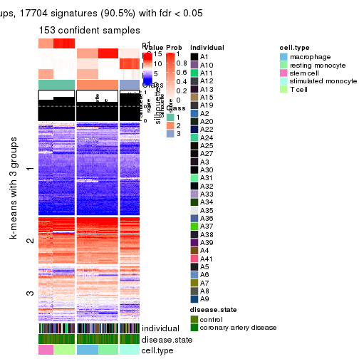</p>

</div>
<div id='tab-MAD-kmeans-get-signatures-no-scale-4'>
<pre><code class="r">get_signatures(res, k = 5, scale_rows = FALSE)
</code></pre>

<p></p>

</div>
<div id='tab-MAD-kmeans-get-signatures-no-scale-5'>
<pre><code class="r">get_signatures(res, k = 6, scale_rows = FALSE)
</code></pre>

<p></p>

</div>
</div>


Compare the overlap of signatures from different k:

```r
compare_signatures(res)
```


`get_signature()` returns a data frame invisibly. TO get the list of signatures, the function
call should be assigned to a variable explicitly. In following code, if `plot` argument is set
to `FALSE`, no heatmap is plotted while only the differential analysis is performed.

```r
# code only for demonstration
tb = get_signature(res, k = ..., plot = FALSE)
```

An example of the output of `tb` is:

```
#>   which_row         fdr    mean_1    mean_2 scaled_mean_1 scaled_mean_2 km
#> 1        38 0.042760348  8.373488  9.131774    -0.5533452     0.5164555  1
#> 2        40 0.018707592  7.106213  8.469186    -0.6173731     0.5762149  1
#> 3        55 0.019134737 10.221463 11.207825    -0.6159697     0.5749050  1
#> 4        59 0.006059896  5.921854  7.869574    -0.6899429     0.6439467  1
#> 5        60 0.018055526  8.928898 10.211722    -0.6204761     0.5791110  1
#> 6        98 0.009384629 15.714769 14.887706     0.6635654    -0.6193277  2
...
```

The columns in `tb` are:

1. `which_row`: row indices corresponding to the input matrix.
2. `fdr`: FDR for the differential test. 
3. `mean_x`: The mean value in group x.
4. `scaled_mean_x`: The mean value in group x after rows are scaled.
5. `km`: Row groups if k-means clustering is applied to rows.


UMAP plot which shows how samples are separated.


<script>
$( function() {
	$( '#tabs-MAD-kmeans-dimension-reduction' ).tabs();
} );
</script>
<div id='tabs-MAD-kmeans-dimension-reduction'>
<ul>
<li><a href='#tab-MAD-kmeans-dimension-reduction-1'>k = 2</a></li>
<li><a href='#tab-MAD-kmeans-dimension-reduction-2'>k = 3</a></li>
<li><a href='#tab-MAD-kmeans-dimension-reduction-3'>k = 4</a></li>
<li><a href='#tab-MAD-kmeans-dimension-reduction-4'>k = 5</a></li>
<li><a href='#tab-MAD-kmeans-dimension-reduction-5'>k = 6</a></li>
</ul>
<div id='tab-MAD-kmeans-dimension-reduction-1'>
<pre><code class="r">dimension_reduction(res, k = 2, method = &quot;UMAP&quot;)
</code></pre>

<p></p>

</div>
<div id='tab-MAD-kmeans-dimension-reduction-2'>
<pre><code class="r">dimension_reduction(res, k = 3, method = &quot;UMAP&quot;)
</code></pre>

<p></p>

</div>
<div id='tab-MAD-kmeans-dimension-reduction-3'>
<pre><code class="r">dimension_reduction(res, k = 4, method = &quot;UMAP&quot;)
</code></pre>

<p></p>

</div>
<div id='tab-MAD-kmeans-dimension-reduction-4'>
<pre><code class="r">dimension_reduction(res, k = 5, method = &quot;UMAP&quot;)
</code></pre>

<p></p>

</div>
<div id='tab-MAD-kmeans-dimension-reduction-5'>
<pre><code class="r">dimension_reduction(res, k = 6, method = &quot;UMAP&quot;)
</code></pre>

<p></p>

</div>
</div>


Following heatmap shows how subgroups are split when increasing `k`:

```r
collect_classes(res)
```


Test correlation between subgroups and known annotations. If the known
annotation is numeric, one-way ANOVA test is applied, and if the known
annotation is discrete, chi-squared contingency table test is applied.

```r
test_to_known_factors(res)
```

```
#>              n individual(p) disease.state(p) cell.type(p) k
#> MAD:kmeans 153             1            1.000     4.63e-32 2
#> MAD:kmeans 119             1            0.978     1.50e-48 3
#> MAD:kmeans 153             1            0.985     2.17e-61 4
#> MAD:kmeans 153             1            0.989    6.51e-120 5
#> MAD:kmeans 153             1            0.989    6.51e-120 6
```


If matrix rows can be associated to genes, consider to use `functional_enrichment(res,
...)` to perform function enrichment for the signature genes. See [this vignette](http://bioconductor.org/packages/devel/bioc/vignettes/cola/inst/doc/functional_enrichment.html) for more detailed explanations.


 

---------------------------------------------------


### MAD:skmeans**


The object with results only for a single top-value method and a single partition method 
can be extracted as:

```r
res = res_list["MAD", "skmeans"]
# you can also extract it by
# res = res_list["MAD:skmeans"]
```

A summary of `res` and all the functions that can be applied to it:

```r
res
```

```
#> A 'ConsensusPartition' object with k = 2, 3, 4, 5, 6.
#>   On a matrix with 19559 rows and 153 columns.
#>   Top rows (1000, 2000, 3000, 4000, 5000) are extracted by 'MAD' method.
#>   Subgroups are detected by 'skmeans' method.
#>   Performed in total 1250 partitions by row resampling.
#>   Best k for subgroups seems to be 5.
#> 
#> Following methods can be applied to this 'ConsensusPartition' object:
#>  [1] "cola_report"             "collect_classes"         "collect_plots"          
#>  [4] "collect_stats"           "colnames"                "compare_signatures"     
#>  [7] "consensus_heatmap"       "dimension_reduction"     "functional_enrichment"  
#> [10] "get_anno_col"            "get_anno"                "get_classes"            
#> [13] "get_consensus"           "get_matrix"              "get_membership"         
#> [16] "get_param"               "get_signatures"          "get_stats"              
#> [19] "is_best_k"               "is_stable_k"             "membership_heatmap"     
#> [22] "ncol"                    "nrow"                    "plot_ecdf"              
#> [25] "rownames"                "select_partition_number" "show"                   
#> [28] "suggest_best_k"          "test_to_known_factors"
```

`collect_plots()` function collects all the plots made from `res` for all `k` (number of partitions)
into one single page to provide an easy and fast comparison between different `k`.

```r
collect_plots(res)
```


The plots are:

- The first row: a plot of the ECDF (empirical cumulative distribution
  function) curves of the consensus matrix for each `k` and the heatmap of
  predicted classes for each `k`.
- The second row: heatmaps of the consensus matrix for each `k`.
- The third row: heatmaps of the membership matrix for each `k`.
- The fouth row: heatmaps of the signatures for each `k`.

All the plots in panels can be made by individual functions and they are
plotted later in this section.

`select_partition_number()` produces several plots showing different
statistics for choosing "optimized" `k`. There are following statistics:

- ECDF curves of the consensus matrix for each `k`;
- 1-PAC. [The PAC
  score](https://en.wikipedia.org/wiki/Consensus_clustering#Over-interpretation_potential_of_consensus_clustering)
  measures the proportion of the ambiguous subgrouping.
- Mean silhouette score.
- Concordance. The mean probability of fiting the consensus class ids in all
  partitions.
- Area increased. Denote $A_k$ as the area under the ECDF curve for current
  `k`, the area increased is defined as $A_k - A_{k-1}$.
- Rand index. The percent of pairs of samples that are both in a same cluster
  or both are not in a same cluster in the partition of k and k-1.
- Jaccard index. The ratio of pairs of samples are both in a same cluster in
  the partition of k and k-1 and the pairs of samples are both in a same
  cluster in the partition k or k-1.

The detailed explanations of these statistics can be found in [the _cola_
vignette](http://bioconductor.org/packages/devel/bioc/vignettes/cola/inst/doc/cola.html#toc_13).

Generally speaking, lower PAC score, higher mean silhouette score or higher
concordance corresponds to better partition. Rand index and Jaccard index
measure how similar the current partition is compared to partition with `k-1`.
If they are too similar, we won't accept `k` is better than `k-1`.

```r
select_partition_number(res)
```


The numeric values for all these statistics can be obtained by `get_stats()`.

```r
get_stats(res)
```

```
#>   k 1-PAC mean_silhouette concordance area_increased  Rand Jaccard
#> 2 2 1.000           1.000       1.000         0.4711 0.529   0.529
#> 3 3 0.819           0.956       0.961         0.3675 0.827   0.673
#> 4 4 1.000           0.990       0.977         0.1383 0.909   0.745
#> 5 5 1.000           1.000       0.999         0.0935 0.933   0.747
#> 6 6 0.975           0.942       0.942         0.0185 1.000   1.000
```

`suggest_best_k()` suggests the best $k$ based on these statistics. The rules are as follows:

- All $k$ with Jaccard index larger than 0.95 are removed because increasing
  $k$ does not provide enough extra information. If all $k$ are removed, it is
  marked as no subgroup is detected.
- For all $k$ with 1-PAC score larger than 0.9, the maximal $k$ is taken as
  the best $k$, and other $k$ are marked as optional $k$.
- If it does not fit the second rule. The $k$ with the maximal vote of the
  highest 1-PAC score, highest mean silhouette, and highest concordance is
  taken as the best $k$.

```r
suggest_best_k(res)
```

```
#> [1] 5
#> attr(,"optional")
#> [1] 2 4
```

There is also optional best $k$ = 2 4 that is worth to check.

Following shows the table of the partitions (You need to click the **show/hide
code output** link to see it). The membership matrix (columns with name `p*`)
is inferred by
[`clue::cl_consensus()`](https://www.rdocumentation.org/link/cl_consensus?package=clue)
function with the `SE` method. Basically the value in the membership matrix
represents the probability to belong to a certain group. The finall class
label for an item is determined with the group with highest probability it
belongs to.

In `get_classes()` function, the entropy is calculated from the membership
matrix and the silhouette score is calculated from the consensus matrix.


<script>
$( function() {
	$( '#tabs-MAD-skmeans-get-classes' ).tabs();
} );
</script>
<div id='tabs-MAD-skmeans-get-classes'>
<ul>
<li><a href='#tab-MAD-skmeans-get-classes-1'>k = 2</a></li>
<li><a href='#tab-MAD-skmeans-get-classes-2'>k = 3</a></li>
<li><a href='#tab-MAD-skmeans-get-classes-3'>k = 4</a></li>
<li><a href='#tab-MAD-skmeans-get-classes-4'>k = 5</a></li>
<li><a href='#tab-MAD-skmeans-get-classes-5'>k = 6</a></li>
</ul>

<div id='tab-MAD-skmeans-get-classes-1'>
<p><a id='tab-MAD-skmeans-get-classes-1-a' style='color:#0366d6' href='#'>show/hide code output</a></p>
<pre><code class="r">cbind(get_classes(res, k = 2), get_membership(res, k = 2))
</code></pre>

<pre><code>#&gt;           class entropy silhouette p1 p2
#&gt; GSM247795     2       0          1  0  1
#&gt; GSM247854     2       0          1  0  1
#&gt; GSM247758     2       0          1  0  1
#&gt; GSM247742     1       0          1  1  0
#&gt; GSM247755     2       0          1  0  1
#&gt; GSM247841     1       0          1  1  0
#&gt; GSM247703     2       0          1  0  1
#&gt; GSM247739     2       0          1  0  1
#&gt; GSM247715     1       0          1  1  0
#&gt; GSM247829     2       0          1  0  1
#&gt; GSM247842     1       0          1  1  0
#&gt; GSM247805     2       0          1  0  1
#&gt; GSM247786     2       0          1  0  1
#&gt; GSM247812     2       0          1  0  1
#&gt; GSM247776     1       0          1  1  0
#&gt; GSM247850     1       0          1  1  0
#&gt; GSM247717     2       0          1  0  1
#&gt; GSM247784     2       0          1  0  1
#&gt; GSM247834     1       0          1  1  0
#&gt; GSM247783     2       0          1  0  1
#&gt; GSM247846     1       0          1  1  0
#&gt; GSM247822     2       0          1  0  1
#&gt; GSM247710     2       0          1  0  1
#&gt; GSM247713     1       0          1  1  0
#&gt; GSM247840     2       0          1  0  1
#&gt; GSM247733     1       0          1  1  0
#&gt; GSM247852     1       0          1  1  0
#&gt; GSM247790     2       0          1  0  1
#&gt; GSM247730     2       0          1  0  1
#&gt; GSM247824     2       0          1  0  1
#&gt; GSM247770     1       0          1  1  0
#&gt; GSM247711     2       0          1  0  1
#&gt; GSM247782     2       0          1  0  1
#&gt; GSM247836     1       0          1  1  0
#&gt; GSM247785     2       0          1  0  1
#&gt; GSM247847     1       0          1  1  0
#&gt; GSM247750     2       0          1  0  1
#&gt; GSM247788     2       0          1  0  1
#&gt; GSM247849     1       0          1  1  0
#&gt; GSM247772     2       0          1  0  1
#&gt; GSM247760     1       0          1  1  0
#&gt; GSM247764     2       0          1  0  1
#&gt; GSM247851     2       0          1  0  1
#&gt; GSM247714     2       0          1  0  1
#&gt; GSM247828     1       0          1  1  0
#&gt; GSM247704     2       0          1  0  1
#&gt; GSM247818     1       0          1  1  0
#&gt; GSM247823     2       0          1  0  1
#&gt; GSM247706     2       0          1  0  1
#&gt; GSM247835     2       0          1  0  1
#&gt; GSM247734     1       0          1  1  0
#&gt; GSM247819     2       0          1  0  1
#&gt; GSM247809     2       0          1  0  1
#&gt; GSM247830     2       0          1  0  1
#&gt; GSM247833     1       0          1  1  0
#&gt; GSM247738     2       0          1  0  1
#&gt; GSM247716     2       0          1  0  1
#&gt; GSM247747     2       0          1  0  1
#&gt; GSM247722     1       0          1  1  0
#&gt; GSM247816     2       0          1  0  1
#&gt; GSM247839     2       0          1  0  1
#&gt; GSM247821     1       0          1  1  0
#&gt; GSM247798     2       0          1  0  1
#&gt; GSM247838     1       0          1  1  0
#&gt; GSM247721     2       0          1  0  1
#&gt; GSM247781     2       0          1  0  1
#&gt; GSM247762     1       0          1  1  0
#&gt; GSM247825     2       0          1  0  1
#&gt; GSM247777     1       0          1  1  0
#&gt; GSM247761     2       0          1  0  1
#&gt; GSM247720     2       0          1  0  1
#&gt; GSM247814     2       0          1  0  1
#&gt; GSM247732     1       0          1  1  0
#&gt; GSM247708     2       0          1  0  1
#&gt; GSM247740     2       0          1  0  1
#&gt; GSM247749     1       0          1  1  0
#&gt; GSM247767     2       0          1  0  1
#&gt; GSM247748     1       0          1  1  0
#&gt; GSM247705     2       0          1  0  1
#&gt; GSM247746     2       0          1  0  1
#&gt; GSM247752     1       0          1  1  0
#&gt; GSM247769     2       0          1  0  1
#&gt; GSM247753     1       0          1  1  0
#&gt; GSM247723     2       0          1  0  1
#&gt; GSM247779     2       0          1  0  1
#&gt; GSM247756     1       0          1  1  0
#&gt; GSM247826     2       0          1  0  1
#&gt; GSM247775     1       0          1  1  0
#&gt; GSM247741     2       0          1  0  1
#&gt; GSM247799     2       0          1  0  1
#&gt; GSM247778     1       0          1  1  0
#&gt; GSM247806     2       0          1  0  1
#&gt; GSM247815     1       0          1  1  0
#&gt; GSM247735     2       0          1  0  1
#&gt; GSM247831     2       0          1  0  1
#&gt; GSM247845     1       0          1  1  0
#&gt; GSM247791     2       0          1  0  1
#&gt; GSM247780     1       0          1  1  0
#&gt; GSM247853     1       0          1  1  0
#&gt; GSM247800     2       0          1  0  1
#&gt; GSM247729     2       0          1  0  1
#&gt; GSM247810     1       0          1  1  0
#&gt; GSM247844     2       0          1  0  1
#&gt; GSM247793     1       0          1  1  0
#&gt; GSM247759     2       0          1  0  1
#&gt; GSM247724     2       0          1  0  1
#&gt; GSM247817     2       0          1  0  1
#&gt; GSM247727     1       0          1  1  0
#&gt; GSM247796     2       0          1  0  1
#&gt; GSM247725     2       0          1  0  1
#&gt; GSM247801     1       0          1  1  0
#&gt; GSM247731     2       0          1  0  1
#&gt; GSM247765     1       0          1  1  0
#&gt; GSM247792     2       0          1  0  1
#&gt; GSM247726     2       0          1  0  1
#&gt; GSM247803     1       0          1  1  0
#&gt; GSM247728     2       0          1  0  1
#&gt; GSM247768     1       0          1  1  0
#&gt; GSM247745     2       0          1  0  1
#&gt; GSM247855     2       0          1  0  1
#&gt; GSM247804     2       0          1  0  1
#&gt; GSM247774     1       0          1  1  0
#&gt; GSM247807     2       0          1  0  1
#&gt; GSM247813     1       0          1  1  0
#&gt; GSM247736     2       0          1  0  1
#&gt; GSM247712     2       0          1  0  1
#&gt; GSM247797     1       0          1  1  0
#&gt; GSM247743     2       0          1  0  1
#&gt; GSM247719     1       0          1  1  0
#&gt; GSM247707     2       0          1  0  1
#&gt; GSM247737     2       0          1  0  1
#&gt; GSM247827     2       0          1  0  1
#&gt; GSM247848     1       0          1  1  0
#&gt; GSM247794     2       0          1  0  1
#&gt; GSM247757     2       0          1  0  1
#&gt; GSM247744     1       0          1  1  0
#&gt; GSM247751     2       0          1  0  1
#&gt; GSM247837     1       0          1  1  0
#&gt; GSM247754     2       0          1  0  1
#&gt; GSM247789     2       0          1  0  1
#&gt; GSM247802     1       0          1  1  0
#&gt; GSM247771     2       0          1  0  1
#&gt; GSM247763     1       0          1  1  0
#&gt; GSM247808     2       0          1  0  1
#&gt; GSM247787     2       0          1  0  1
#&gt; GSM247843     1       0          1  1  0
#&gt; GSM247811     2       0          1  0  1
#&gt; GSM247773     1       0          1  1  0
#&gt; GSM247766     2       0          1  0  1
#&gt; GSM247718     2       0          1  0  1
#&gt; GSM247832     1       0          1  1  0
#&gt; GSM247709     2       0          1  0  1
#&gt; GSM247820     1       0          1  1  0
</code></pre>

<script>
$('#tab-MAD-skmeans-get-classes-1-a').parent().next().next().hide();
$('#tab-MAD-skmeans-get-classes-1-a').click(function(){
  $('#tab-MAD-skmeans-get-classes-1-a').parent().next().next().toggle();
  return(false);
});
</script>
</div>

<div id='tab-MAD-skmeans-get-classes-2'>
<p><a id='tab-MAD-skmeans-get-classes-2-a' style='color:#0366d6' href='#'>show/hide code output</a></p>
<pre><code class="r">cbind(get_classes(res, k = 3), get_membership(res, k = 3))
</code></pre>

<pre><code>#&gt;           class entropy silhouette p1    p2    p3
#&gt; GSM247795     2   0.424      0.897  0 0.824 0.176
#&gt; GSM247854     2   0.424      0.897  0 0.824 0.176
#&gt; GSM247758     2   0.000      0.895  0 1.000 0.000
#&gt; GSM247742     1   0.000      1.000  1 0.000 0.000
#&gt; GSM247755     3   0.000      1.000  0 0.000 1.000
#&gt; GSM247841     1   0.000      1.000  1 0.000 0.000
#&gt; GSM247703     2   0.424      0.897  0 0.824 0.176
#&gt; GSM247739     2   0.000      0.895  0 1.000 0.000
#&gt; GSM247715     1   0.000      1.000  1 0.000 0.000
#&gt; GSM247829     3   0.000      1.000  0 0.000 1.000
#&gt; GSM247842     1   0.000      1.000  1 0.000 0.000
#&gt; GSM247805     2   0.424      0.897  0 0.824 0.176
#&gt; GSM247786     2   0.000      0.895  0 1.000 0.000
#&gt; GSM247812     3   0.000      1.000  0 0.000 1.000
#&gt; GSM247776     1   0.000      1.000  1 0.000 0.000
#&gt; GSM247850     1   0.000      1.000  1 0.000 0.000
#&gt; GSM247717     2   0.424      0.897  0 0.824 0.176
#&gt; GSM247784     2   0.000      0.895  0 1.000 0.000
#&gt; GSM247834     1   0.000      1.000  1 0.000 0.000
#&gt; GSM247783     3   0.000      1.000  0 0.000 1.000
#&gt; GSM247846     1   0.000      1.000  1 0.000 0.000
#&gt; GSM247822     2   0.424      0.897  0 0.824 0.176
#&gt; GSM247710     2   0.000      0.895  0 1.000 0.000
#&gt; GSM247713     1   0.000      1.000  1 0.000 0.000
#&gt; GSM247840     3   0.000      1.000  0 0.000 1.000
#&gt; GSM247733     1   0.000      1.000  1 0.000 0.000
#&gt; GSM247852     1   0.000      1.000  1 0.000 0.000
#&gt; GSM247790     2   0.424      0.897  0 0.824 0.176
#&gt; GSM247730     2   0.000      0.895  0 1.000 0.000
#&gt; GSM247824     3   0.000      1.000  0 0.000 1.000
#&gt; GSM247770     1   0.000      1.000  1 0.000 0.000
#&gt; GSM247711     2   0.424      0.897  0 0.824 0.176
#&gt; GSM247782     2   0.000      0.895  0 1.000 0.000
#&gt; GSM247836     1   0.000      1.000  1 0.000 0.000
#&gt; GSM247785     3   0.000      1.000  0 0.000 1.000
#&gt; GSM247847     1   0.000      1.000  1 0.000 0.000
#&gt; GSM247750     2   0.424      0.897  0 0.824 0.176
#&gt; GSM247788     2   0.000      0.895  0 1.000 0.000
#&gt; GSM247849     1   0.000      1.000  1 0.000 0.000
#&gt; GSM247772     3   0.000      1.000  0 0.000 1.000
#&gt; GSM247760     1   0.000      1.000  1 0.000 0.000
#&gt; GSM247764     2   0.424      0.897  0 0.824 0.176
#&gt; GSM247851     2   0.424      0.897  0 0.824 0.176
#&gt; GSM247714     2   0.000      0.895  0 1.000 0.000
#&gt; GSM247828     1   0.000      1.000  1 0.000 0.000
#&gt; GSM247704     3   0.000      1.000  0 0.000 1.000
#&gt; GSM247818     1   0.000      1.000  1 0.000 0.000
#&gt; GSM247823     2   0.424      0.897  0 0.824 0.176
#&gt; GSM247706     2   0.000      0.895  0 1.000 0.000
#&gt; GSM247835     3   0.000      1.000  0 0.000 1.000
#&gt; GSM247734     1   0.000      1.000  1 0.000 0.000
#&gt; GSM247819     2   0.424      0.897  0 0.824 0.176
#&gt; GSM247809     2   0.000      0.895  0 1.000 0.000
#&gt; GSM247830     3   0.000      1.000  0 0.000 1.000
#&gt; GSM247833     1   0.000      1.000  1 0.000 0.000
#&gt; GSM247738     2   0.424      0.897  0 0.824 0.176
#&gt; GSM247716     2   0.000      0.895  0 1.000 0.000
#&gt; GSM247747     3   0.000      1.000  0 0.000 1.000
#&gt; GSM247722     1   0.000      1.000  1 0.000 0.000
#&gt; GSM247816     2   0.424      0.897  0 0.824 0.176
#&gt; GSM247839     2   0.000      0.895  0 1.000 0.000
#&gt; GSM247821     1   0.000      1.000  1 0.000 0.000
#&gt; GSM247798     3   0.000      1.000  0 0.000 1.000
#&gt; GSM247838     1   0.000      1.000  1 0.000 0.000
#&gt; GSM247721     2   0.424      0.897  0 0.824 0.176
#&gt; GSM247781     2   0.000      0.895  0 1.000 0.000
#&gt; GSM247762     1   0.000      1.000  1 0.000 0.000
#&gt; GSM247825     3   0.000      1.000  0 0.000 1.000
#&gt; GSM247777     1   0.000      1.000  1 0.000 0.000
#&gt; GSM247761     2   0.424      0.897  0 0.824 0.176
#&gt; GSM247720     2   0.000      0.895  0 1.000 0.000
#&gt; GSM247814     3   0.000      1.000  0 0.000 1.000
#&gt; GSM247732     1   0.000      1.000  1 0.000 0.000
#&gt; GSM247708     2   0.424      0.897  0 0.824 0.176
#&gt; GSM247740     2   0.000      0.895  0 1.000 0.000
#&gt; GSM247749     1   0.000      1.000  1 0.000 0.000
#&gt; GSM247767     3   0.000      1.000  0 0.000 1.000
#&gt; GSM247748     1   0.000      1.000  1 0.000 0.000
#&gt; GSM247705     2   0.424      0.897  0 0.824 0.176
#&gt; GSM247746     2   0.000      0.895  0 1.000 0.000
#&gt; GSM247752     1   0.000      1.000  1 0.000 0.000
#&gt; GSM247769     3   0.000      1.000  0 0.000 1.000
#&gt; GSM247753     1   0.000      1.000  1 0.000 0.000
#&gt; GSM247723     2   0.424      0.897  0 0.824 0.176
#&gt; GSM247779     2   0.000      0.895  0 1.000 0.000
#&gt; GSM247756     1   0.000      1.000  1 0.000 0.000
#&gt; GSM247826     3   0.000      1.000  0 0.000 1.000
#&gt; GSM247775     1   0.000      1.000  1 0.000 0.000
#&gt; GSM247741     2   0.424      0.897  0 0.824 0.176
#&gt; GSM247799     2   0.000      0.895  0 1.000 0.000
#&gt; GSM247778     1   0.000      1.000  1 0.000 0.000
#&gt; GSM247806     3   0.000      1.000  0 0.000 1.000
#&gt; GSM247815     1   0.000      1.000  1 0.000 0.000
#&gt; GSM247735     2   0.424      0.897  0 0.824 0.176
#&gt; GSM247831     2   0.000      0.895  0 1.000 0.000
#&gt; GSM247845     1   0.000      1.000  1 0.000 0.000
#&gt; GSM247791     3   0.000      1.000  0 0.000 1.000
#&gt; GSM247780     1   0.000      1.000  1 0.000 0.000
#&gt; GSM247853     1   0.000      1.000  1 0.000 0.000
#&gt; GSM247800     2   0.424      0.897  0 0.824 0.176
#&gt; GSM247729     2   0.000      0.895  0 1.000 0.000
#&gt; GSM247810     1   0.000      1.000  1 0.000 0.000
#&gt; GSM247844     3   0.000      1.000  0 0.000 1.000
#&gt; GSM247793     1   0.000      1.000  1 0.000 0.000
#&gt; GSM247759     2   0.424      0.897  0 0.824 0.176
#&gt; GSM247724     2   0.000      0.895  0 1.000 0.000
#&gt; GSM247817     3   0.000      1.000  0 0.000 1.000
#&gt; GSM247727     1   0.000      1.000  1 0.000 0.000
#&gt; GSM247796     2   0.424      0.897  0 0.824 0.176
#&gt; GSM247725     2   0.000      0.895  0 1.000 0.000
#&gt; GSM247801     1   0.000      1.000  1 0.000 0.000
#&gt; GSM247731     3   0.000      1.000  0 0.000 1.000
#&gt; GSM247765     1   0.000      1.000  1 0.000 0.000
#&gt; GSM247792     2   0.424      0.897  0 0.824 0.176
#&gt; GSM247726     2   0.000      0.895  0 1.000 0.000
#&gt; GSM247803     1   0.000      1.000  1 0.000 0.000
#&gt; GSM247728     3   0.000      1.000  0 0.000 1.000
#&gt; GSM247768     1   0.000      1.000  1 0.000 0.000
#&gt; GSM247745     2   0.424      0.897  0 0.824 0.176
#&gt; GSM247855     2   0.424      0.897  0 0.824 0.176
#&gt; GSM247804     2   0.000      0.895  0 1.000 0.000
#&gt; GSM247774     1   0.000      1.000  1 0.000 0.000
#&gt; GSM247807     3   0.000      1.000  0 0.000 1.000
#&gt; GSM247813     1   0.000      1.000  1 0.000 0.000
#&gt; GSM247736     2   0.424      0.897  0 0.824 0.176
#&gt; GSM247712     2   0.000      0.895  0 1.000 0.000
#&gt; GSM247797     1   0.000      1.000  1 0.000 0.000
#&gt; GSM247743     3   0.000      1.000  0 0.000 1.000
#&gt; GSM247719     1   0.000      1.000  1 0.000 0.000
#&gt; GSM247707     2   0.424      0.897  0 0.824 0.176
#&gt; GSM247737     2   0.000      0.895  0 1.000 0.000
#&gt; GSM247827     3   0.000      1.000  0 0.000 1.000
#&gt; GSM247848     1   0.000      1.000  1 0.000 0.000
#&gt; GSM247794     2   0.424      0.897  0 0.824 0.176
#&gt; GSM247757     2   0.000      0.895  0 1.000 0.000
#&gt; GSM247744     1   0.000      1.000  1 0.000 0.000
#&gt; GSM247751     3   0.000      1.000  0 0.000 1.000
#&gt; GSM247837     1   0.000      1.000  1 0.000 0.000
#&gt; GSM247754     2   0.424      0.897  0 0.824 0.176
#&gt; GSM247789     2   0.000      0.895  0 1.000 0.000
#&gt; GSM247802     1   0.000      1.000  1 0.000 0.000
#&gt; GSM247771     3   0.000      1.000  0 0.000 1.000
#&gt; GSM247763     1   0.000      1.000  1 0.000 0.000
#&gt; GSM247808     2   0.424      0.897  0 0.824 0.176
#&gt; GSM247787     2   0.000      0.895  0 1.000 0.000
#&gt; GSM247843     1   0.000      1.000  1 0.000 0.000
#&gt; GSM247811     3   0.000      1.000  0 0.000 1.000
#&gt; GSM247773     1   0.000      1.000  1 0.000 0.000
#&gt; GSM247766     2   0.424      0.897  0 0.824 0.176
#&gt; GSM247718     2   0.000      0.895  0 1.000 0.000
#&gt; GSM247832     1   0.000      1.000  1 0.000 0.000
#&gt; GSM247709     3   0.000      1.000  0 0.000 1.000
#&gt; GSM247820     1   0.000      1.000  1 0.000 0.000
</code></pre>

<script>
$('#tab-MAD-skmeans-get-classes-2-a').parent().next().next().hide();
$('#tab-MAD-skmeans-get-classes-2-a').click(function(){
  $('#tab-MAD-skmeans-get-classes-2-a').parent().next().next().toggle();
  return(false);
});
</script>
</div>

<div id='tab-MAD-skmeans-get-classes-3'>
<p><a id='tab-MAD-skmeans-get-classes-3-a' style='color:#0366d6' href='#'>show/hide code output</a></p>
<pre><code class="r">cbind(get_classes(res, k = 4), get_membership(res, k = 4))
</code></pre>

<pre><code>#&gt;           class entropy silhouette    p1    p2 p3    p4
#&gt; GSM247795     2   0.000      1.000 0.000 1.000  0 0.000
#&gt; GSM247854     2   0.000      1.000 0.000 1.000  0 0.000
#&gt; GSM247758     4   0.172      1.000 0.000 0.064  0 0.936
#&gt; GSM247742     1   0.172      0.968 0.936 0.000  0 0.064
#&gt; GSM247755     3   0.000      1.000 0.000 0.000  1 0.000
#&gt; GSM247841     1   0.000      0.978 1.000 0.000  0 0.000
#&gt; GSM247703     2   0.000      1.000 0.000 1.000  0 0.000
#&gt; GSM247739     4   0.172      1.000 0.000 0.064  0 0.936
#&gt; GSM247715     1   0.172      0.968 0.936 0.000  0 0.064
#&gt; GSM247829     3   0.000      1.000 0.000 0.000  1 0.000
#&gt; GSM247842     1   0.000      0.978 1.000 0.000  0 0.000
#&gt; GSM247805     2   0.000      1.000 0.000 1.000  0 0.000
#&gt; GSM247786     4   0.172      1.000 0.000 0.064  0 0.936
#&gt; GSM247812     3   0.000      1.000 0.000 0.000  1 0.000
#&gt; GSM247776     1   0.000      0.978 1.000 0.000  0 0.000
#&gt; GSM247850     1   0.000      0.978 1.000 0.000  0 0.000
#&gt; GSM247717     2   0.000      1.000 0.000 1.000  0 0.000
#&gt; GSM247784     4   0.172      1.000 0.000 0.064  0 0.936
#&gt; GSM247834     1   0.172      0.968 0.936 0.000  0 0.064
#&gt; GSM247783     3   0.000      1.000 0.000 0.000  1 0.000
#&gt; GSM247846     1   0.000      0.978 1.000 0.000  0 0.000
#&gt; GSM247822     2   0.000      1.000 0.000 1.000  0 0.000
#&gt; GSM247710     4   0.172      1.000 0.000 0.064  0 0.936
#&gt; GSM247713     1   0.172      0.968 0.936 0.000  0 0.064
#&gt; GSM247840     3   0.000      1.000 0.000 0.000  1 0.000
#&gt; GSM247733     1   0.000      0.978 1.000 0.000  0 0.000
#&gt; GSM247852     1   0.000      0.978 1.000 0.000  0 0.000
#&gt; GSM247790     2   0.000      1.000 0.000 1.000  0 0.000
#&gt; GSM247730     4   0.172      1.000 0.000 0.064  0 0.936
#&gt; GSM247824     3   0.000      1.000 0.000 0.000  1 0.000
#&gt; GSM247770     1   0.000      0.978 1.000 0.000  0 0.000
#&gt; GSM247711     2   0.000      1.000 0.000 1.000  0 0.000
#&gt; GSM247782     4   0.172      1.000 0.000 0.064  0 0.936
#&gt; GSM247836     1   0.172      0.968 0.936 0.000  0 0.064
#&gt; GSM247785     3   0.000      1.000 0.000 0.000  1 0.000
#&gt; GSM247847     1   0.000      0.978 1.000 0.000  0 0.000
#&gt; GSM247750     2   0.000      1.000 0.000 1.000  0 0.000
#&gt; GSM247788     4   0.172      1.000 0.000 0.064  0 0.936
#&gt; GSM247849     1   0.172      0.968 0.936 0.000  0 0.064
#&gt; GSM247772     3   0.000      1.000 0.000 0.000  1 0.000
#&gt; GSM247760     1   0.000      0.978 1.000 0.000  0 0.000
#&gt; GSM247764     2   0.000      1.000 0.000 1.000  0 0.000
#&gt; GSM247851     2   0.000      1.000 0.000 1.000  0 0.000
#&gt; GSM247714     4   0.172      1.000 0.000 0.064  0 0.936
#&gt; GSM247828     1   0.172      0.968 0.936 0.000  0 0.064
#&gt; GSM247704     3   0.000      1.000 0.000 0.000  1 0.000
#&gt; GSM247818     1   0.000      0.978 1.000 0.000  0 0.000
#&gt; GSM247823     2   0.000      1.000 0.000 1.000  0 0.000
#&gt; GSM247706     4   0.172      1.000 0.000 0.064  0 0.936
#&gt; GSM247835     3   0.000      1.000 0.000 0.000  1 0.000
#&gt; GSM247734     1   0.000      0.978 1.000 0.000  0 0.000
#&gt; GSM247819     2   0.000      1.000 0.000 1.000  0 0.000
#&gt; GSM247809     4   0.172      1.000 0.000 0.064  0 0.936
#&gt; GSM247830     3   0.000      1.000 0.000 0.000  1 0.000
#&gt; GSM247833     1   0.000      0.978 1.000 0.000  0 0.000
#&gt; GSM247738     2   0.000      1.000 0.000 1.000  0 0.000
#&gt; GSM247716     4   0.172      1.000 0.000 0.064  0 0.936
#&gt; GSM247747     3   0.000      1.000 0.000 0.000  1 0.000
#&gt; GSM247722     1   0.000      0.978 1.000 0.000  0 0.000
#&gt; GSM247816     2   0.000      1.000 0.000 1.000  0 0.000
#&gt; GSM247839     4   0.172      1.000 0.000 0.064  0 0.936
#&gt; GSM247821     1   0.172      0.968 0.936 0.000  0 0.064
#&gt; GSM247798     3   0.000      1.000 0.000 0.000  1 0.000
#&gt; GSM247838     1   0.000      0.978 1.000 0.000  0 0.000
#&gt; GSM247721     2   0.000      1.000 0.000 1.000  0 0.000
#&gt; GSM247781     4   0.172      1.000 0.000 0.064  0 0.936
#&gt; GSM247762     1   0.172      0.968 0.936 0.000  0 0.064
#&gt; GSM247825     3   0.000      1.000 0.000 0.000  1 0.000
#&gt; GSM247777     1   0.000      0.978 1.000 0.000  0 0.000
#&gt; GSM247761     2   0.000      1.000 0.000 1.000  0 0.000
#&gt; GSM247720     4   0.172      1.000 0.000 0.064  0 0.936
#&gt; GSM247814     3   0.000      1.000 0.000 0.000  1 0.000
#&gt; GSM247732     1   0.000      0.978 1.000 0.000  0 0.000
#&gt; GSM247708     2   0.000      1.000 0.000 1.000  0 0.000
#&gt; GSM247740     4   0.172      1.000 0.000 0.064  0 0.936
#&gt; GSM247749     1   0.172      0.968 0.936 0.000  0 0.064
#&gt; GSM247767     3   0.000      1.000 0.000 0.000  1 0.000
#&gt; GSM247748     1   0.000      0.978 1.000 0.000  0 0.000
#&gt; GSM247705     2   0.000      1.000 0.000 1.000  0 0.000
#&gt; GSM247746     4   0.172      1.000 0.000 0.064  0 0.936
#&gt; GSM247752     1   0.172      0.968 0.936 0.000  0 0.064
#&gt; GSM247769     3   0.000      1.000 0.000 0.000  1 0.000
#&gt; GSM247753     1   0.000      0.978 1.000 0.000  0 0.000
#&gt; GSM247723     2   0.000      1.000 0.000 1.000  0 0.000
#&gt; GSM247779     4   0.172      1.000 0.000 0.064  0 0.936
#&gt; GSM247756     1   0.172      0.968 0.936 0.000  0 0.064
#&gt; GSM247826     3   0.000      1.000 0.000 0.000  1 0.000
#&gt; GSM247775     1   0.000      0.978 1.000 0.000  0 0.000
#&gt; GSM247741     2   0.000      1.000 0.000 1.000  0 0.000
#&gt; GSM247799     4   0.172      1.000 0.000 0.064  0 0.936
#&gt; GSM247778     1   0.172      0.968 0.936 0.000  0 0.064
#&gt; GSM247806     3   0.000      1.000 0.000 0.000  1 0.000
#&gt; GSM247815     1   0.000      0.978 1.000 0.000  0 0.000
#&gt; GSM247735     2   0.000      1.000 0.000 1.000  0 0.000
#&gt; GSM247831     4   0.172      1.000 0.000 0.064  0 0.936
#&gt; GSM247845     1   0.172      0.968 0.936 0.000  0 0.064
#&gt; GSM247791     3   0.000      1.000 0.000 0.000  1 0.000
#&gt; GSM247780     1   0.000      0.978 1.000 0.000  0 0.000
#&gt; GSM247853     1   0.000      0.978 1.000 0.000  0 0.000
#&gt; GSM247800     2   0.000      1.000 0.000 1.000  0 0.000
#&gt; GSM247729     4   0.172      1.000 0.000 0.064  0 0.936
#&gt; GSM247810     1   0.172      0.968 0.936 0.000  0 0.064
#&gt; GSM247844     3   0.000      1.000 0.000 0.000  1 0.000
#&gt; GSM247793     1   0.000      0.978 1.000 0.000  0 0.000
#&gt; GSM247759     2   0.000      1.000 0.000 1.000  0 0.000
#&gt; GSM247724     4   0.172      1.000 0.000 0.064  0 0.936
#&gt; GSM247817     3   0.000      1.000 0.000 0.000  1 0.000
#&gt; GSM247727     1   0.000      0.978 1.000 0.000  0 0.000
#&gt; GSM247796     2   0.000      1.000 0.000 1.000  0 0.000
#&gt; GSM247725     4   0.172      1.000 0.000 0.064  0 0.936
#&gt; GSM247801     1   0.172      0.968 0.936 0.000  0 0.064
#&gt; GSM247731     3   0.000      1.000 0.000 0.000  1 0.000
#&gt; GSM247765     1   0.000      0.978 1.000 0.000  0 0.000
#&gt; GSM247792     2   0.000      1.000 0.000 1.000  0 0.000
#&gt; GSM247726     4   0.172      1.000 0.000 0.064  0 0.936
#&gt; GSM247803     1   0.172      0.968 0.936 0.000  0 0.064
#&gt; GSM247728     3   0.000      1.000 0.000 0.000  1 0.000
#&gt; GSM247768     1   0.000      0.978 1.000 0.000  0 0.000
#&gt; GSM247745     2   0.000      1.000 0.000 1.000  0 0.000
#&gt; GSM247855     2   0.000      1.000 0.000 1.000  0 0.000
#&gt; GSM247804     4   0.172      1.000 0.000 0.064  0 0.936
#&gt; GSM247774     1   0.172      0.968 0.936 0.000  0 0.064
#&gt; GSM247807     3   0.000      1.000 0.000 0.000  1 0.000
#&gt; GSM247813     1   0.000      0.978 1.000 0.000  0 0.000
#&gt; GSM247736     2   0.000      1.000 0.000 1.000  0 0.000
#&gt; GSM247712     4   0.172      1.000 0.000 0.064  0 0.936
#&gt; GSM247797     1   0.172      0.968 0.936 0.000  0 0.064
#&gt; GSM247743     3   0.000      1.000 0.000 0.000  1 0.000
#&gt; GSM247719     1   0.000      0.978 1.000 0.000  0 0.000
#&gt; GSM247707     2   0.000      1.000 0.000 1.000  0 0.000
#&gt; GSM247737     4   0.172      1.000 0.000 0.064  0 0.936
#&gt; GSM247827     3   0.000      1.000 0.000 0.000  1 0.000
#&gt; GSM247848     1   0.000      0.978 1.000 0.000  0 0.000
#&gt; GSM247794     2   0.000      1.000 0.000 1.000  0 0.000
#&gt; GSM247757     4   0.172      1.000 0.000 0.064  0 0.936
#&gt; GSM247744     1   0.172      0.968 0.936 0.000  0 0.064
#&gt; GSM247751     3   0.000      1.000 0.000 0.000  1 0.000
#&gt; GSM247837     1   0.000      0.978 1.000 0.000  0 0.000
#&gt; GSM247754     2   0.000      1.000 0.000 1.000  0 0.000
#&gt; GSM247789     4   0.172      1.000 0.000 0.064  0 0.936
#&gt; GSM247802     1   0.172      0.968 0.936 0.000  0 0.064
#&gt; GSM247771     3   0.000      1.000 0.000 0.000  1 0.000
#&gt; GSM247763     1   0.000      0.978 1.000 0.000  0 0.000
#&gt; GSM247808     2   0.000      1.000 0.000 1.000  0 0.000
#&gt; GSM247787     4   0.172      1.000 0.000 0.064  0 0.936
#&gt; GSM247843     1   0.172      0.968 0.936 0.000  0 0.064
#&gt; GSM247811     3   0.000      1.000 0.000 0.000  1 0.000
#&gt; GSM247773     1   0.000      0.978 1.000 0.000  0 0.000
#&gt; GSM247766     2   0.000      1.000 0.000 1.000  0 0.000
#&gt; GSM247718     4   0.172      1.000 0.000 0.064  0 0.936
#&gt; GSM247832     1   0.172      0.968 0.936 0.000  0 0.064
#&gt; GSM247709     3   0.000      1.000 0.000 0.000  1 0.000
#&gt; GSM247820     1   0.000      0.978 1.000 0.000  0 0.000
</code></pre>

<script>
$('#tab-MAD-skmeans-get-classes-3-a').parent().next().next().hide();
$('#tab-MAD-skmeans-get-classes-3-a').click(function(){
  $('#tab-MAD-skmeans-get-classes-3-a').parent().next().next().toggle();
  return(false);
});
</script>
</div>

<div id='tab-MAD-skmeans-get-classes-4'>
<p><a id='tab-MAD-skmeans-get-classes-4-a' style='color:#0366d6' href='#'>show/hide code output</a></p>
<pre><code class="r">cbind(get_classes(res, k = 5), get_membership(res, k = 5))
</code></pre>

<pre><code>#&gt;           class entropy silhouette    p1    p2 p3    p4 p5
#&gt; GSM247795     2  0.0000      0.999 0.000 1.000  0 0.000  0
#&gt; GSM247854     2  0.0000      0.999 0.000 1.000  0 0.000  0
#&gt; GSM247758     5  0.0000      1.000 0.000 0.000  0 0.000  1
#&gt; GSM247742     4  0.0162      1.000 0.004 0.000  0 0.996  0
#&gt; GSM247755     3  0.0000      1.000 0.000 0.000  1 0.000  0
#&gt; GSM247841     1  0.0000      1.000 1.000 0.000  0 0.000  0
#&gt; GSM247703     2  0.0000      0.999 0.000 1.000  0 0.000  0
#&gt; GSM247739     5  0.0000      1.000 0.000 0.000  0 0.000  1
#&gt; GSM247715     4  0.0162      1.000 0.004 0.000  0 0.996  0
#&gt; GSM247829     3  0.0000      1.000 0.000 0.000  1 0.000  0
#&gt; GSM247842     1  0.0000      1.000 1.000 0.000  0 0.000  0
#&gt; GSM247805     2  0.0000      0.999 0.000 1.000  0 0.000  0
#&gt; GSM247786     5  0.0000      1.000 0.000 0.000  0 0.000  1
#&gt; GSM247812     3  0.0000      1.000 0.000 0.000  1 0.000  0
#&gt; GSM247776     1  0.0000      1.000 1.000 0.000  0 0.000  0
#&gt; GSM247850     1  0.0000      1.000 1.000 0.000  0 0.000  0
#&gt; GSM247717     2  0.0000      0.999 0.000 1.000  0 0.000  0
#&gt; GSM247784     5  0.0000      1.000 0.000 0.000  0 0.000  1
#&gt; GSM247834     4  0.0162      1.000 0.004 0.000  0 0.996  0
#&gt; GSM247783     3  0.0000      1.000 0.000 0.000  1 0.000  0
#&gt; GSM247846     1  0.0000      1.000 1.000 0.000  0 0.000  0
#&gt; GSM247822     2  0.0162      0.998 0.000 0.996  0 0.004  0
#&gt; GSM247710     5  0.0000      1.000 0.000 0.000  0 0.000  1
#&gt; GSM247713     4  0.0162      1.000 0.004 0.000  0 0.996  0
#&gt; GSM247840     3  0.0000      1.000 0.000 0.000  1 0.000  0
#&gt; GSM247733     1  0.0000      1.000 1.000 0.000  0 0.000  0
#&gt; GSM247852     1  0.0000      1.000 1.000 0.000  0 0.000  0
#&gt; GSM247790     2  0.0000      0.999 0.000 1.000  0 0.000  0
#&gt; GSM247730     5  0.0000      1.000 0.000 0.000  0 0.000  1
#&gt; GSM247824     3  0.0000      1.000 0.000 0.000  1 0.000  0
#&gt; GSM247770     1  0.0000      1.000 1.000 0.000  0 0.000  0
#&gt; GSM247711     2  0.0000      0.999 0.000 1.000  0 0.000  0
#&gt; GSM247782     5  0.0000      1.000 0.000 0.000  0 0.000  1
#&gt; GSM247836     4  0.0162      1.000 0.004 0.000  0 0.996  0
#&gt; GSM247785     3  0.0000      1.000 0.000 0.000  1 0.000  0
#&gt; GSM247847     1  0.0000      1.000 1.000 0.000  0 0.000  0
#&gt; GSM247750     2  0.0000      0.999 0.000 1.000  0 0.000  0
#&gt; GSM247788     5  0.0000      1.000 0.000 0.000  0 0.000  1
#&gt; GSM247849     4  0.0162      1.000 0.004 0.000  0 0.996  0
#&gt; GSM247772     3  0.0000      1.000 0.000 0.000  1 0.000  0
#&gt; GSM247760     1  0.0000      1.000 1.000 0.000  0 0.000  0
#&gt; GSM247764     2  0.0162      0.998 0.000 0.996  0 0.004  0
#&gt; GSM247851     2  0.0162      0.998 0.000 0.996  0 0.004  0
#&gt; GSM247714     5  0.0000      1.000 0.000 0.000  0 0.000  1
#&gt; GSM247828     4  0.0162      1.000 0.004 0.000  0 0.996  0
#&gt; GSM247704     3  0.0000      1.000 0.000 0.000  1 0.000  0
#&gt; GSM247818     1  0.0000      1.000 1.000 0.000  0 0.000  0
#&gt; GSM247823     2  0.0162      0.998 0.000 0.996  0 0.004  0
#&gt; GSM247706     5  0.0000      1.000 0.000 0.000  0 0.000  1
#&gt; GSM247835     3  0.0000      1.000 0.000 0.000  1 0.000  0
#&gt; GSM247734     1  0.0000      1.000 1.000 0.000  0 0.000  0
#&gt; GSM247819     2  0.0162      0.998 0.000 0.996  0 0.004  0
#&gt; GSM247809     5  0.0000      1.000 0.000 0.000  0 0.000  1
#&gt; GSM247830     3  0.0000      1.000 0.000 0.000  1 0.000  0
#&gt; GSM247833     1  0.0000      1.000 1.000 0.000  0 0.000  0
#&gt; GSM247738     2  0.0000      0.999 0.000 1.000  0 0.000  0
#&gt; GSM247716     5  0.0000      1.000 0.000 0.000  0 0.000  1
#&gt; GSM247747     3  0.0000      1.000 0.000 0.000  1 0.000  0
#&gt; GSM247722     1  0.0000      1.000 1.000 0.000  0 0.000  0
#&gt; GSM247816     2  0.0162      0.998 0.000 0.996  0 0.004  0
#&gt; GSM247839     5  0.0000      1.000 0.000 0.000  0 0.000  1
#&gt; GSM247821     4  0.0162      1.000 0.004 0.000  0 0.996  0
#&gt; GSM247798     3  0.0000      1.000 0.000 0.000  1 0.000  0
#&gt; GSM247838     1  0.0000      1.000 1.000 0.000  0 0.000  0
#&gt; GSM247721     2  0.0000      0.999 0.000 1.000  0 0.000  0
#&gt; GSM247781     5  0.0000      1.000 0.000 0.000  0 0.000  1
#&gt; GSM247762     4  0.0162      1.000 0.004 0.000  0 0.996  0
#&gt; GSM247825     3  0.0000      1.000 0.000 0.000  1 0.000  0
#&gt; GSM247777     1  0.0000      1.000 1.000 0.000  0 0.000  0
#&gt; GSM247761     2  0.0000      0.999 0.000 1.000  0 0.000  0
#&gt; GSM247720     5  0.0000      1.000 0.000 0.000  0 0.000  1
#&gt; GSM247814     3  0.0000      1.000 0.000 0.000  1 0.000  0
#&gt; GSM247732     1  0.0000      1.000 1.000 0.000  0 0.000  0
#&gt; GSM247708     2  0.0000      0.999 0.000 1.000  0 0.000  0
#&gt; GSM247740     5  0.0000      1.000 0.000 0.000  0 0.000  1
#&gt; GSM247749     4  0.0162      1.000 0.004 0.000  0 0.996  0
#&gt; GSM247767     3  0.0000      1.000 0.000 0.000  1 0.000  0
#&gt; GSM247748     1  0.0000      1.000 1.000 0.000  0 0.000  0
#&gt; GSM247705     2  0.0162      0.998 0.000 0.996  0 0.004  0
#&gt; GSM247746     5  0.0000      1.000 0.000 0.000  0 0.000  1
#&gt; GSM247752     4  0.0162      1.000 0.004 0.000  0 0.996  0
#&gt; GSM247769     3  0.0000      1.000 0.000 0.000  1 0.000  0
#&gt; GSM247753     1  0.0000      1.000 1.000 0.000  0 0.000  0
#&gt; GSM247723     2  0.0162      0.998 0.000 0.996  0 0.004  0
#&gt; GSM247779     5  0.0000      1.000 0.000 0.000  0 0.000  1
#&gt; GSM247756     4  0.0162      1.000 0.004 0.000  0 0.996  0
#&gt; GSM247826     3  0.0000      1.000 0.000 0.000  1 0.000  0
#&gt; GSM247775     1  0.0000      1.000 1.000 0.000  0 0.000  0
#&gt; GSM247741     2  0.0162      0.998 0.000 0.996  0 0.004  0
#&gt; GSM247799     5  0.0000      1.000 0.000 0.000  0 0.000  1
#&gt; GSM247778     4  0.0162      1.000 0.004 0.000  0 0.996  0
#&gt; GSM247806     3  0.0000      1.000 0.000 0.000  1 0.000  0
#&gt; GSM247815     1  0.0000      1.000 1.000 0.000  0 0.000  0
#&gt; GSM247735     2  0.0162      0.998 0.000 0.996  0 0.004  0
#&gt; GSM247831     5  0.0000      1.000 0.000 0.000  0 0.000  1
#&gt; GSM247845     4  0.0162      1.000 0.004 0.000  0 0.996  0
#&gt; GSM247791     3  0.0000      1.000 0.000 0.000  1 0.000  0
#&gt; GSM247780     1  0.0000      1.000 1.000 0.000  0 0.000  0
#&gt; GSM247853     1  0.0000      1.000 1.000 0.000  0 0.000  0
#&gt; GSM247800     2  0.0162      0.998 0.000 0.996  0 0.004  0
#&gt; GSM247729     5  0.0000      1.000 0.000 0.000  0 0.000  1
#&gt; GSM247810     4  0.0162      1.000 0.004 0.000  0 0.996  0
#&gt; GSM247844     3  0.0000      1.000 0.000 0.000  1 0.000  0
#&gt; GSM247793     1  0.0000      1.000 1.000 0.000  0 0.000  0
#&gt; GSM247759     2  0.0162      0.998 0.000 0.996  0 0.004  0
#&gt; GSM247724     5  0.0000      1.000 0.000 0.000  0 0.000  1
#&gt; GSM247817     3  0.0000      1.000 0.000 0.000  1 0.000  0
#&gt; GSM247727     1  0.0000      1.000 1.000 0.000  0 0.000  0
#&gt; GSM247796     2  0.0162      0.998 0.000 0.996  0 0.004  0
#&gt; GSM247725     5  0.0000      1.000 0.000 0.000  0 0.000  1
#&gt; GSM247801     4  0.0162      1.000 0.004 0.000  0 0.996  0
#&gt; GSM247731     3  0.0000      1.000 0.000 0.000  1 0.000  0
#&gt; GSM247765     1  0.0000      1.000 1.000 0.000  0 0.000  0
#&gt; GSM247792     2  0.0162      0.998 0.000 0.996  0 0.004  0
#&gt; GSM247726     5  0.0000      1.000 0.000 0.000  0 0.000  1
#&gt; GSM247803     4  0.0162      1.000 0.004 0.000  0 0.996  0
#&gt; GSM247728     3  0.0000      1.000 0.000 0.000  1 0.000  0
#&gt; GSM247768     1  0.0000      1.000 1.000 0.000  0 0.000  0
#&gt; GSM247745     2  0.0000      0.999 0.000 1.000  0 0.000  0
#&gt; GSM247855     2  0.0000      0.999 0.000 1.000  0 0.000  0
#&gt; GSM247804     5  0.0000      1.000 0.000 0.000  0 0.000  1
#&gt; GSM247774     4  0.0162      1.000 0.004 0.000  0 0.996  0
#&gt; GSM247807     3  0.0000      1.000 0.000 0.000  1 0.000  0
#&gt; GSM247813     1  0.0000      1.000 1.000 0.000  0 0.000  0
#&gt; GSM247736     2  0.0000      0.999 0.000 1.000  0 0.000  0
#&gt; GSM247712     5  0.0000      1.000 0.000 0.000  0 0.000  1
#&gt; GSM247797     4  0.0162      1.000 0.004 0.000  0 0.996  0
#&gt; GSM247743     3  0.0000      1.000 0.000 0.000  1 0.000  0
#&gt; GSM247719     1  0.0000      1.000 1.000 0.000  0 0.000  0
#&gt; GSM247707     2  0.0000      0.999 0.000 1.000  0 0.000  0
#&gt; GSM247737     5  0.0000      1.000 0.000 0.000  0 0.000  1
#&gt; GSM247827     3  0.0000      1.000 0.000 0.000  1 0.000  0
#&gt; GSM247848     1  0.0000      1.000 1.000 0.000  0 0.000  0
#&gt; GSM247794     2  0.0000      0.999 0.000 1.000  0 0.000  0
#&gt; GSM247757     5  0.0000      1.000 0.000 0.000  0 0.000  1
#&gt; GSM247744     4  0.0162      1.000 0.004 0.000  0 0.996  0
#&gt; GSM247751     3  0.0000      1.000 0.000 0.000  1 0.000  0
#&gt; GSM247837     1  0.0000      1.000 1.000 0.000  0 0.000  0
#&gt; GSM247754     2  0.0162      0.998 0.000 0.996  0 0.004  0
#&gt; GSM247789     5  0.0000      1.000 0.000 0.000  0 0.000  1
#&gt; GSM247802     4  0.0162      1.000 0.004 0.000  0 0.996  0
#&gt; GSM247771     3  0.0000      1.000 0.000 0.000  1 0.000  0
#&gt; GSM247763     1  0.0000      1.000 1.000 0.000  0 0.000  0
#&gt; GSM247808     2  0.0000      0.999 0.000 1.000  0 0.000  0
#&gt; GSM247787     5  0.0000      1.000 0.000 0.000  0 0.000  1
#&gt; GSM247843     4  0.0162      1.000 0.004 0.000  0 0.996  0
#&gt; GSM247811     3  0.0000      1.000 0.000 0.000  1 0.000  0
#&gt; GSM247773     1  0.0000      1.000 1.000 0.000  0 0.000  0
#&gt; GSM247766     2  0.0162      0.998 0.000 0.996  0 0.004  0
#&gt; GSM247718     5  0.0000      1.000 0.000 0.000  0 0.000  1
#&gt; GSM247832     4  0.0162      1.000 0.004 0.000  0 0.996  0
#&gt; GSM247709     3  0.0000      1.000 0.000 0.000  1 0.000  0
#&gt; GSM247820     1  0.0000      1.000 1.000 0.000  0 0.000  0
</code></pre>

<script>
$('#tab-MAD-skmeans-get-classes-4-a').parent().next().next().hide();
$('#tab-MAD-skmeans-get-classes-4-a').click(function(){
  $('#tab-MAD-skmeans-get-classes-4-a').parent().next().next().toggle();
  return(false);
});
</script>
</div>

<div id='tab-MAD-skmeans-get-classes-5'>
<p><a id='tab-MAD-skmeans-get-classes-5-a' style='color:#0366d6' href='#'>show/hide code output</a></p>
<pre><code class="r">cbind(get_classes(res, k = 6), get_membership(res, k = 6))
</code></pre>

<pre><code>#&gt;           class entropy silhouette p1    p2 p3    p4    p5    p6
#&gt; GSM247795     2  0.0146      0.814  0 0.996  0 0.000 0.000 0.004
#&gt; GSM247854     2  0.0146      0.814  0 0.996  0 0.000 0.000 0.004
#&gt; GSM247758     5  0.0000      0.977  0 0.000  0 0.000 1.000 0.000
#&gt; GSM247742     4  0.0547      0.982  0 0.000  0 0.980 0.000 0.020
#&gt; GSM247755     3  0.0000      1.000  0 0.000  1 0.000 0.000 0.000
#&gt; GSM247841     1  0.0000      1.000  1 0.000  0 0.000 0.000 0.000
#&gt; GSM247703     2  0.0363      0.811  0 0.988  0 0.000 0.000 0.012
#&gt; GSM247739     5  0.0547      0.970  0 0.000  0 0.000 0.980 0.020
#&gt; GSM247715     4  0.0146      0.982  0 0.000  0 0.996 0.000 0.004
#&gt; GSM247829     3  0.0000      1.000  0 0.000  1 0.000 0.000 0.000
#&gt; GSM247842     1  0.0000      1.000  1 0.000  0 0.000 0.000 0.000
#&gt; GSM247805     2  0.0547      0.814  0 0.980  0 0.000 0.000 0.020
#&gt; GSM247786     5  0.0547      0.970  0 0.000  0 0.000 0.980 0.020
#&gt; GSM247812     3  0.0000      1.000  0 0.000  1 0.000 0.000 0.000
#&gt; GSM247776     1  0.0000      1.000  1 0.000  0 0.000 0.000 0.000
#&gt; GSM247850     1  0.0000      1.000  1 0.000  0 0.000 0.000 0.000
#&gt; GSM247717     2  0.0146      0.814  0 0.996  0 0.000 0.000 0.004
#&gt; GSM247784     5  0.0000      0.977  0 0.000  0 0.000 1.000 0.000
#&gt; GSM247834     4  0.0146      0.982  0 0.000  0 0.996 0.000 0.004
#&gt; GSM247783     3  0.0000      1.000  0 0.000  1 0.000 0.000 0.000
#&gt; GSM247846     1  0.0000      1.000  1 0.000  0 0.000 0.000 0.000
#&gt; GSM247822     2  0.3817      0.782  0 0.568  0 0.000 0.000 0.432
#&gt; GSM247710     5  0.0000      0.977  0 0.000  0 0.000 1.000 0.000
#&gt; GSM247713     4  0.0146      0.982  0 0.000  0 0.996 0.000 0.004
#&gt; GSM247840     3  0.0000      1.000  0 0.000  1 0.000 0.000 0.000
#&gt; GSM247733     1  0.0000      1.000  1 0.000  0 0.000 0.000 0.000
#&gt; GSM247852     1  0.0000      1.000  1 0.000  0 0.000 0.000 0.000
#&gt; GSM247790     2  0.0146      0.813  0 0.996  0 0.000 0.000 0.004
#&gt; GSM247730     5  0.0000      0.977  0 0.000  0 0.000 1.000 0.000
#&gt; GSM247824     3  0.0000      1.000  0 0.000  1 0.000 0.000 0.000
#&gt; GSM247770     1  0.0000      1.000  1 0.000  0 0.000 0.000 0.000
#&gt; GSM247711     2  0.0547      0.816  0 0.980  0 0.000 0.000 0.020
#&gt; GSM247782     5  0.0000      0.977  0 0.000  0 0.000 1.000 0.000
#&gt; GSM247836     4  0.0000      0.982  0 0.000  0 1.000 0.000 0.000
#&gt; GSM247785     3  0.0000      1.000  0 0.000  1 0.000 0.000 0.000
#&gt; GSM247847     1  0.0000      1.000  1 0.000  0 0.000 0.000 0.000
#&gt; GSM247750     2  0.0146      0.813  0 0.996  0 0.000 0.000 0.004
#&gt; GSM247788     5  0.0000      0.977  0 0.000  0 0.000 1.000 0.000
#&gt; GSM247849     4  0.0547      0.982  0 0.000  0 0.980 0.000 0.020
#&gt; GSM247772     3  0.0000      1.000  0 0.000  1 0.000 0.000 0.000
#&gt; GSM247760     1  0.0000      1.000  1 0.000  0 0.000 0.000 0.000
#&gt; GSM247764     2  0.3860      0.773  0 0.528  0 0.000 0.000 0.472
#&gt; GSM247851     2  0.3860      0.773  0 0.528  0 0.000 0.000 0.472
#&gt; GSM247714     5  0.0000      0.977  0 0.000  0 0.000 1.000 0.000
#&gt; GSM247828     4  0.0547      0.982  0 0.000  0 0.980 0.000 0.020
#&gt; GSM247704     3  0.0000      1.000  0 0.000  1 0.000 0.000 0.000
#&gt; GSM247818     1  0.0000      1.000  1 0.000  0 0.000 0.000 0.000
#&gt; GSM247823     2  0.3782      0.783  0 0.588  0 0.000 0.000 0.412
#&gt; GSM247706     5  0.0000      0.977  0 0.000  0 0.000 1.000 0.000
#&gt; GSM247835     3  0.0000      1.000  0 0.000  1 0.000 0.000 0.000
#&gt; GSM247734     1  0.0000      1.000  1 0.000  0 0.000 0.000 0.000
#&gt; GSM247819     2  0.3862      0.773  0 0.524  0 0.000 0.000 0.476
#&gt; GSM247809     5  0.0000      0.977  0 0.000  0 0.000 1.000 0.000
#&gt; GSM247830     3  0.0000      1.000  0 0.000  1 0.000 0.000 0.000
#&gt; GSM247833     1  0.0000      1.000  1 0.000  0 0.000 0.000 0.000
#&gt; GSM247738     2  0.0363      0.811  0 0.988  0 0.000 0.000 0.012
#&gt; GSM247716     5  0.0000      0.977  0 0.000  0 0.000 1.000 0.000
#&gt; GSM247747     3  0.0000      1.000  0 0.000  1 0.000 0.000 0.000
#&gt; GSM247722     1  0.0000      1.000  1 0.000  0 0.000 0.000 0.000
#&gt; GSM247816     2  0.3244      0.798  0 0.732  0 0.000 0.000 0.268
#&gt; GSM247839     5  0.0000      0.977  0 0.000  0 0.000 1.000 0.000
#&gt; GSM247821     4  0.0146      0.982  0 0.000  0 0.996 0.000 0.004
#&gt; GSM247798     3  0.0000      1.000  0 0.000  1 0.000 0.000 0.000
#&gt; GSM247838     1  0.0000      1.000  1 0.000  0 0.000 0.000 0.000
#&gt; GSM247721     2  0.0458      0.816  0 0.984  0 0.000 0.000 0.016
#&gt; GSM247781     5  0.0000      0.977  0 0.000  0 0.000 1.000 0.000
#&gt; GSM247762     4  0.0865      0.977  0 0.000  0 0.964 0.000 0.036
#&gt; GSM247825     3  0.0000      1.000  0 0.000  1 0.000 0.000 0.000
#&gt; GSM247777     1  0.0000      1.000  1 0.000  0 0.000 0.000 0.000
#&gt; GSM247761     2  0.0865      0.816  0 0.964  0 0.000 0.000 0.036
#&gt; GSM247720     5  0.0547      0.970  0 0.000  0 0.000 0.980 0.020
#&gt; GSM247814     3  0.0000      1.000  0 0.000  1 0.000 0.000 0.000
#&gt; GSM247732     1  0.0000      1.000  1 0.000  0 0.000 0.000 0.000
#&gt; GSM247708     2  0.0458      0.816  0 0.984  0 0.000 0.000 0.016
#&gt; GSM247740     5  0.0547      0.970  0 0.000  0 0.000 0.980 0.020
#&gt; GSM247749     4  0.0146      0.982  0 0.000  0 0.996 0.000 0.004
#&gt; GSM247767     3  0.0000      1.000  0 0.000  1 0.000 0.000 0.000
#&gt; GSM247748     1  0.0000      1.000  1 0.000  0 0.000 0.000 0.000
#&gt; GSM247705     2  0.3843      0.774  0 0.548  0 0.000 0.000 0.452
#&gt; GSM247746     5  0.3309      0.760  0 0.000  0 0.000 0.720 0.280
#&gt; GSM247752     4  0.1501      0.943  0 0.000  0 0.924 0.000 0.076
#&gt; GSM247769     3  0.0000      1.000  0 0.000  1 0.000 0.000 0.000
#&gt; GSM247753     1  0.0000      1.000  1 0.000  0 0.000 0.000 0.000
#&gt; GSM247723     2  0.3862      0.773  0 0.524  0 0.000 0.000 0.476
#&gt; GSM247779     5  0.0000      0.977  0 0.000  0 0.000 1.000 0.000
#&gt; GSM247756     4  0.0547      0.982  0 0.000  0 0.980 0.000 0.020
#&gt; GSM247826     3  0.0000      1.000  0 0.000  1 0.000 0.000 0.000
#&gt; GSM247775     1  0.0000      1.000  1 0.000  0 0.000 0.000 0.000
#&gt; GSM247741     2  0.3860      0.773  0 0.528  0 0.000 0.000 0.472
#&gt; GSM247799     5  0.0000      0.977  0 0.000  0 0.000 1.000 0.000
#&gt; GSM247778     4  0.0146      0.982  0 0.000  0 0.996 0.000 0.004
#&gt; GSM247806     3  0.0000      1.000  0 0.000  1 0.000 0.000 0.000
#&gt; GSM247815     1  0.0000      1.000  1 0.000  0 0.000 0.000 0.000
#&gt; GSM247735     2  0.3860      0.773  0 0.528  0 0.000 0.000 0.472
#&gt; GSM247831     5  0.0000      0.977  0 0.000  0 0.000 1.000 0.000
#&gt; GSM247845     4  0.0547      0.982  0 0.000  0 0.980 0.000 0.020
#&gt; GSM247791     3  0.0000      1.000  0 0.000  1 0.000 0.000 0.000
#&gt; GSM247780     1  0.0000      1.000  1 0.000  0 0.000 0.000 0.000
#&gt; GSM247853     1  0.0000      1.000  1 0.000  0 0.000 0.000 0.000
#&gt; GSM247800     2  0.3860      0.773  0 0.528  0 0.000 0.000 0.472
#&gt; GSM247729     5  0.0000      0.977  0 0.000  0 0.000 1.000 0.000
#&gt; GSM247810     4  0.0146      0.982  0 0.000  0 0.996 0.000 0.004
#&gt; GSM247844     3  0.0000      1.000  0 0.000  1 0.000 0.000 0.000
#&gt; GSM247793     1  0.0000      1.000  1 0.000  0 0.000 0.000 0.000
#&gt; GSM247759     2  0.3810      0.780  0 0.572  0 0.000 0.000 0.428
#&gt; GSM247724     5  0.0000      0.977  0 0.000  0 0.000 1.000 0.000
#&gt; GSM247817     3  0.0000      1.000  0 0.000  1 0.000 0.000 0.000
#&gt; GSM247727     1  0.0000      1.000  1 0.000  0 0.000 0.000 0.000
#&gt; GSM247796     2  0.3862      0.773  0 0.524  0 0.000 0.000 0.476
#&gt; GSM247725     5  0.0000      0.977  0 0.000  0 0.000 1.000 0.000
#&gt; GSM247801     4  0.0713      0.980  0 0.000  0 0.972 0.000 0.028
#&gt; GSM247731     3  0.0000      1.000  0 0.000  1 0.000 0.000 0.000
#&gt; GSM247765     1  0.0000      1.000  1 0.000  0 0.000 0.000 0.000
#&gt; GSM247792     2  0.3860      0.773  0 0.528  0 0.000 0.000 0.472
#&gt; GSM247726     5  0.3857      0.559  0 0.000  0 0.000 0.532 0.468
#&gt; GSM247803     4  0.2883      0.838  0 0.000  0 0.788 0.000 0.212
#&gt; GSM247728     3  0.0000      1.000  0 0.000  1 0.000 0.000 0.000
#&gt; GSM247768     1  0.0000      1.000  1 0.000  0 0.000 0.000 0.000
#&gt; GSM247745     2  0.0458      0.816  0 0.984  0 0.000 0.000 0.016
#&gt; GSM247855     2  0.0458      0.816  0 0.984  0 0.000 0.000 0.016
#&gt; GSM247804     5  0.0000      0.977  0 0.000  0 0.000 1.000 0.000
#&gt; GSM247774     4  0.0547      0.982  0 0.000  0 0.980 0.000 0.020
#&gt; GSM247807     3  0.0000      1.000  0 0.000  1 0.000 0.000 0.000
#&gt; GSM247813     1  0.0000      1.000  1 0.000  0 0.000 0.000 0.000
#&gt; GSM247736     2  0.0458      0.816  0 0.984  0 0.000 0.000 0.016
#&gt; GSM247712     5  0.0547      0.970  0 0.000  0 0.000 0.980 0.020
#&gt; GSM247797     4  0.0713      0.980  0 0.000  0 0.972 0.000 0.028
#&gt; GSM247743     3  0.0000      1.000  0 0.000  1 0.000 0.000 0.000
#&gt; GSM247719     1  0.0000      1.000  1 0.000  0 0.000 0.000 0.000
#&gt; GSM247707     2  0.0632      0.816  0 0.976  0 0.000 0.000 0.024
#&gt; GSM247737     5  0.0000      0.977  0 0.000  0 0.000 1.000 0.000
#&gt; GSM247827     3  0.0000      1.000  0 0.000  1 0.000 0.000 0.000
#&gt; GSM247848     1  0.0000      1.000  1 0.000  0 0.000 0.000 0.000
#&gt; GSM247794     2  0.0632      0.814  0 0.976  0 0.000 0.000 0.024
#&gt; GSM247757     5  0.0000      0.977  0 0.000  0 0.000 1.000 0.000
#&gt; GSM247744     4  0.0547      0.982  0 0.000  0 0.980 0.000 0.020
#&gt; GSM247751     3  0.0000      1.000  0 0.000  1 0.000 0.000 0.000
#&gt; GSM247837     1  0.0000      1.000  1 0.000  0 0.000 0.000 0.000
#&gt; GSM247754     2  0.3854      0.776  0 0.536  0 0.000 0.000 0.464
#&gt; GSM247789     5  0.0000      0.977  0 0.000  0 0.000 1.000 0.000
#&gt; GSM247802     4  0.0146      0.982  0 0.000  0 0.996 0.000 0.004
#&gt; GSM247771     3  0.0000      1.000  0 0.000  1 0.000 0.000 0.000
#&gt; GSM247763     1  0.0000      1.000  1 0.000  0 0.000 0.000 0.000
#&gt; GSM247808     2  0.0632      0.816  0 0.976  0 0.000 0.000 0.024
#&gt; GSM247787     5  0.0547      0.970  0 0.000  0 0.000 0.980 0.020
#&gt; GSM247843     4  0.0146      0.982  0 0.000  0 0.996 0.000 0.004
#&gt; GSM247811     3  0.0000      1.000  0 0.000  1 0.000 0.000 0.000
#&gt; GSM247773     1  0.0000      1.000  1 0.000  0 0.000 0.000 0.000
#&gt; GSM247766     2  0.3860      0.773  0 0.528  0 0.000 0.000 0.472
#&gt; GSM247718     5  0.0547      0.970  0 0.000  0 0.000 0.980 0.020
#&gt; GSM247832     4  0.0547      0.982  0 0.000  0 0.980 0.000 0.020
#&gt; GSM247709     3  0.0000      1.000  0 0.000  1 0.000 0.000 0.000
#&gt; GSM247820     1  0.0000      1.000  1 0.000  0 0.000 0.000 0.000
</code></pre>

<script>
$('#tab-MAD-skmeans-get-classes-5-a').parent().next().next().hide();
$('#tab-MAD-skmeans-get-classes-5-a').click(function(){
  $('#tab-MAD-skmeans-get-classes-5-a').parent().next().next().toggle();
  return(false);
});
</script>
</div>
</div>

Heatmaps for the consensus matrix. It visualizes the probability of two
samples to be in a same group.


<script>
$( function() {
	$( '#tabs-MAD-skmeans-consensus-heatmap' ).tabs();
} );
</script>
<div id='tabs-MAD-skmeans-consensus-heatmap'>
<ul>
<li><a href='#tab-MAD-skmeans-consensus-heatmap-1'>k = 2</a></li>
<li><a href='#tab-MAD-skmeans-consensus-heatmap-2'>k = 3</a></li>
<li><a href='#tab-MAD-skmeans-consensus-heatmap-3'>k = 4</a></li>
<li><a href='#tab-MAD-skmeans-consensus-heatmap-4'>k = 5</a></li>
<li><a href='#tab-MAD-skmeans-consensus-heatmap-5'>k = 6</a></li>
</ul>
<div id='tab-MAD-skmeans-consensus-heatmap-1'>
<pre><code class="r">consensus_heatmap(res, k = 2)
</code></pre>

<p></p>

</div>
<div id='tab-MAD-skmeans-consensus-heatmap-2'>
<pre><code class="r">consensus_heatmap(res, k = 3)
</code></pre>

<p>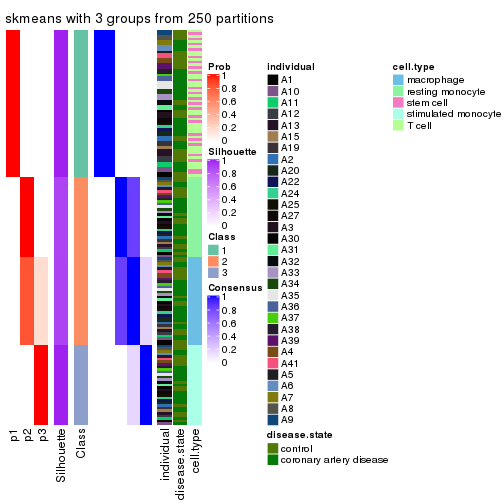</p>

</div>
<div id='tab-MAD-skmeans-consensus-heatmap-3'>
<pre><code class="r">consensus_heatmap(res, k = 4)
</code></pre>

<p></p>

</div>
<div id='tab-MAD-skmeans-consensus-heatmap-4'>
<pre><code class="r">consensus_heatmap(res, k = 5)
</code></pre>

<p></p>

</div>
<div id='tab-MAD-skmeans-consensus-heatmap-5'>
<pre><code class="r">consensus_heatmap(res, k = 6)
</code></pre>

<p></p>

</div>
</div>

Heatmaps for the membership of samples in all partitions to see how consistent they are:


<script>
$( function() {
	$( '#tabs-MAD-skmeans-membership-heatmap' ).tabs();
} );
</script>
<div id='tabs-MAD-skmeans-membership-heatmap'>
<ul>
<li><a href='#tab-MAD-skmeans-membership-heatmap-1'>k = 2</a></li>
<li><a href='#tab-MAD-skmeans-membership-heatmap-2'>k = 3</a></li>
<li><a href='#tab-MAD-skmeans-membership-heatmap-3'>k = 4</a></li>
<li><a href='#tab-MAD-skmeans-membership-heatmap-4'>k = 5</a></li>
<li><a href='#tab-MAD-skmeans-membership-heatmap-5'>k = 6</a></li>
</ul>
<div id='tab-MAD-skmeans-membership-heatmap-1'>
<pre><code class="r">membership_heatmap(res, k = 2)
</code></pre>

<p></p>

</div>
<div id='tab-MAD-skmeans-membership-heatmap-2'>
<pre><code class="r">membership_heatmap(res, k = 3)
</code></pre>

<p></p>

</div>
<div id='tab-MAD-skmeans-membership-heatmap-3'>
<pre><code class="r">membership_heatmap(res, k = 4)
</code></pre>

<p></p>

</div>
<div id='tab-MAD-skmeans-membership-heatmap-4'>
<pre><code class="r">membership_heatmap(res, k = 5)
</code></pre>

<p></p>

</div>
<div id='tab-MAD-skmeans-membership-heatmap-5'>
<pre><code class="r">membership_heatmap(res, k = 6)
</code></pre>

<p></p>

</div>
</div>

As soon as we have had the classes for columns, we can look for signatures
which are significantly different between classes which can be candidate marks
for certain classes. Following are the heatmaps for signatures.


Signature heatmaps where rows are scaled:


<script>
$( function() {
	$( '#tabs-MAD-skmeans-get-signatures' ).tabs();
} );
</script>
<div id='tabs-MAD-skmeans-get-signatures'>
<ul>
<li><a href='#tab-MAD-skmeans-get-signatures-1'>k = 2</a></li>
<li><a href='#tab-MAD-skmeans-get-signatures-2'>k = 3</a></li>
<li><a href='#tab-MAD-skmeans-get-signatures-3'>k = 4</a></li>
<li><a href='#tab-MAD-skmeans-get-signatures-4'>k = 5</a></li>
<li><a href='#tab-MAD-skmeans-get-signatures-5'>k = 6</a></li>
</ul>
<div id='tab-MAD-skmeans-get-signatures-1'>
<pre><code class="r">get_signatures(res, k = 2)
</code></pre>

<p></p>

</div>
<div id='tab-MAD-skmeans-get-signatures-2'>
<pre><code class="r">get_signatures(res, k = 3)
</code></pre>

<p></p>

</div>
<div id='tab-MAD-skmeans-get-signatures-3'>
<pre><code class="r">get_signatures(res, k = 4)
</code></pre>

<p></p>

</div>
<div id='tab-MAD-skmeans-get-signatures-4'>
<pre><code class="r">get_signatures(res, k = 5)
</code></pre>

<p></p>

</div>
<div id='tab-MAD-skmeans-get-signatures-5'>
<pre><code class="r">get_signatures(res, k = 6)
</code></pre>

<p></p>

</div>
</div>


Signature heatmaps where rows are not scaled:


<script>
$( function() {
	$( '#tabs-MAD-skmeans-get-signatures-no-scale' ).tabs();
} );
</script>
<div id='tabs-MAD-skmeans-get-signatures-no-scale'>
<ul>
<li><a href='#tab-MAD-skmeans-get-signatures-no-scale-1'>k = 2</a></li>
<li><a href='#tab-MAD-skmeans-get-signatures-no-scale-2'>k = 3</a></li>
<li><a href='#tab-MAD-skmeans-get-signatures-no-scale-3'>k = 4</a></li>
<li><a href='#tab-MAD-skmeans-get-signatures-no-scale-4'>k = 5</a></li>
<li><a href='#tab-MAD-skmeans-get-signatures-no-scale-5'>k = 6</a></li>
</ul>
<div id='tab-MAD-skmeans-get-signatures-no-scale-1'>
<pre><code class="r">get_signatures(res, k = 2, scale_rows = FALSE)
</code></pre>

<p></p>

</div>
<div id='tab-MAD-skmeans-get-signatures-no-scale-2'>
<pre><code class="r">get_signatures(res, k = 3, scale_rows = FALSE)
</code></pre>

<p></p>

</div>
<div id='tab-MAD-skmeans-get-signatures-no-scale-3'>
<pre><code class="r">get_signatures(res, k = 4, scale_rows = FALSE)
</code></pre>

<p></p>

</div>
<div id='tab-MAD-skmeans-get-signatures-no-scale-4'>
<pre><code class="r">get_signatures(res, k = 5, scale_rows = FALSE)
</code></pre>

<p></p>

</div>
<div id='tab-MAD-skmeans-get-signatures-no-scale-5'>
<pre><code class="r">get_signatures(res, k = 6, scale_rows = FALSE)
</code></pre>

<p></p>

</div>
</div>


Compare the overlap of signatures from different k:

```r
compare_signatures(res)
```


`get_signature()` returns a data frame invisibly. TO get the list of signatures, the function
call should be assigned to a variable explicitly. In following code, if `plot` argument is set
to `FALSE`, no heatmap is plotted while only the differential analysis is performed.

```r
# code only for demonstration
tb = get_signature(res, k = ..., plot = FALSE)
```

An example of the output of `tb` is:

```
#>   which_row         fdr    mean_1    mean_2 scaled_mean_1 scaled_mean_2 km
#> 1        38 0.042760348  8.373488  9.131774    -0.5533452     0.5164555  1
#> 2        40 0.018707592  7.106213  8.469186    -0.6173731     0.5762149  1
#> 3        55 0.019134737 10.221463 11.207825    -0.6159697     0.5749050  1
#> 4        59 0.006059896  5.921854  7.869574    -0.6899429     0.6439467  1
#> 5        60 0.018055526  8.928898 10.211722    -0.6204761     0.5791110  1
#> 6        98 0.009384629 15.714769 14.887706     0.6635654    -0.6193277  2
...
```

The columns in `tb` are:

1. `which_row`: row indices corresponding to the input matrix.
2. `fdr`: FDR for the differential test. 
3. `mean_x`: The mean value in group x.
4. `scaled_mean_x`: The mean value in group x after rows are scaled.
5. `km`: Row groups if k-means clustering is applied to rows.


UMAP plot which shows how samples are separated.


<script>
$( function() {
	$( '#tabs-MAD-skmeans-dimension-reduction' ).tabs();
} );
</script>
<div id='tabs-MAD-skmeans-dimension-reduction'>
<ul>
<li><a href='#tab-MAD-skmeans-dimension-reduction-1'>k = 2</a></li>
<li><a href='#tab-MAD-skmeans-dimension-reduction-2'>k = 3</a></li>
<li><a href='#tab-MAD-skmeans-dimension-reduction-3'>k = 4</a></li>
<li><a href='#tab-MAD-skmeans-dimension-reduction-4'>k = 5</a></li>
<li><a href='#tab-MAD-skmeans-dimension-reduction-5'>k = 6</a></li>
</ul>
<div id='tab-MAD-skmeans-dimension-reduction-1'>
<pre><code class="r">dimension_reduction(res, k = 2, method = &quot;UMAP&quot;)
</code></pre>

<p></p>

</div>
<div id='tab-MAD-skmeans-dimension-reduction-2'>
<pre><code class="r">dimension_reduction(res, k = 3, method = &quot;UMAP&quot;)
</code></pre>

<p></p>

</div>
<div id='tab-MAD-skmeans-dimension-reduction-3'>
<pre><code class="r">dimension_reduction(res, k = 4, method = &quot;UMAP&quot;)
</code></pre>

<p></p>

</div>
<div id='tab-MAD-skmeans-dimension-reduction-4'>
<pre><code class="r">dimension_reduction(res, k = 5, method = &quot;UMAP&quot;)
</code></pre>

<p></p>

</div>
<div id='tab-MAD-skmeans-dimension-reduction-5'>
<pre><code class="r">dimension_reduction(res, k = 6, method = &quot;UMAP&quot;)
</code></pre>

<p></p>

</div>
</div>


Following heatmap shows how subgroups are split when increasing `k`:

```r
collect_classes(res)
```


Test correlation between subgroups and known annotations. If the known
annotation is numeric, one-way ANOVA test is applied, and if the known
annotation is discrete, chi-squared contingency table test is applied.

```r
test_to_known_factors(res)
```

```
#>               n individual(p) disease.state(p) cell.type(p) k
#> MAD:skmeans 153             1            1.000     4.63e-32 2
#> MAD:skmeans 153             1            0.985     2.17e-61 3
#> MAD:skmeans 153             1            0.996     1.16e-90 4
#> MAD:skmeans 153             1            0.989    6.51e-120 5
#> MAD:skmeans 153             1            0.989    6.51e-120 6
```


If matrix rows can be associated to genes, consider to use `functional_enrichment(res,
...)` to perform function enrichment for the signature genes. See [this vignette](http://bioconductor.org/packages/devel/bioc/vignettes/cola/inst/doc/functional_enrichment.html) for more detailed explanations.


 

---------------------------------------------------


### MAD:pam**


The object with results only for a single top-value method and a single partition method 
can be extracted as:

```r
res = res_list["MAD", "pam"]
# you can also extract it by
# res = res_list["MAD:pam"]
```

A summary of `res` and all the functions that can be applied to it:

```r
res
```

```
#> A 'ConsensusPartition' object with k = 2, 3, 4, 5, 6.
#>   On a matrix with 19559 rows and 153 columns.
#>   Top rows (1000, 2000, 3000, 4000, 5000) are extracted by 'MAD' method.
#>   Subgroups are detected by 'pam' method.
#>   Performed in total 1250 partitions by row resampling.
#>   Best k for subgroups seems to be 6.
#> 
#> Following methods can be applied to this 'ConsensusPartition' object:
#>  [1] "cola_report"             "collect_classes"         "collect_plots"          
#>  [4] "collect_stats"           "colnames"                "compare_signatures"     
#>  [7] "consensus_heatmap"       "dimension_reduction"     "functional_enrichment"  
#> [10] "get_anno_col"            "get_anno"                "get_classes"            
#> [13] "get_consensus"           "get_matrix"              "get_membership"         
#> [16] "get_param"               "get_signatures"          "get_stats"              
#> [19] "is_best_k"               "is_stable_k"             "membership_heatmap"     
#> [22] "ncol"                    "nrow"                    "plot_ecdf"              
#> [25] "rownames"                "select_partition_number" "show"                   
#> [28] "suggest_best_k"          "test_to_known_factors"
```

`collect_plots()` function collects all the plots made from `res` for all `k` (number of partitions)
into one single page to provide an easy and fast comparison between different `k`.

```r
collect_plots(res)
```


The plots are:

- The first row: a plot of the ECDF (empirical cumulative distribution
  function) curves of the consensus matrix for each `k` and the heatmap of
  predicted classes for each `k`.
- The second row: heatmaps of the consensus matrix for each `k`.
- The third row: heatmaps of the membership matrix for each `k`.
- The fouth row: heatmaps of the signatures for each `k`.

All the plots in panels can be made by individual functions and they are
plotted later in this section.

`select_partition_number()` produces several plots showing different
statistics for choosing "optimized" `k`. There are following statistics:

- ECDF curves of the consensus matrix for each `k`;
- 1-PAC. [The PAC
  score](https://en.wikipedia.org/wiki/Consensus_clustering#Over-interpretation_potential_of_consensus_clustering)
  measures the proportion of the ambiguous subgrouping.
- Mean silhouette score.
- Concordance. The mean probability of fiting the consensus class ids in all
  partitions.
- Area increased. Denote $A_k$ as the area under the ECDF curve for current
  `k`, the area increased is defined as $A_k - A_{k-1}$.
- Rand index. The percent of pairs of samples that are both in a same cluster
  or both are not in a same cluster in the partition of k and k-1.
- Jaccard index. The ratio of pairs of samples are both in a same cluster in
  the partition of k and k-1 and the pairs of samples are both in a same
  cluster in the partition k or k-1.

The detailed explanations of these statistics can be found in [the _cola_
vignette](http://bioconductor.org/packages/devel/bioc/vignettes/cola/inst/doc/cola.html#toc_13).

Generally speaking, lower PAC score, higher mean silhouette score or higher
concordance corresponds to better partition. Rand index and Jaccard index
measure how similar the current partition is compared to partition with `k-1`.
If they are too similar, we won't accept `k` is better than `k-1`.

```r
select_partition_number(res)
```


The numeric values for all these statistics can be obtained by `get_stats()`.

```r
get_stats(res)
```

```
#>   k 1-PAC mean_silhouette concordance area_increased  Rand Jaccard
#> 2 2 1.000           0.999       0.999         0.4679 0.533   0.533
#> 3 3 0.981           0.962       0.983         0.3848 0.814   0.654
#> 4 4 1.000           0.988       0.994         0.1393 0.904   0.732
#> 5 5 1.000           1.000       1.000         0.0865 0.929   0.733
#> 6 6 0.975           0.975       0.969         0.0251 0.978   0.890
```

`suggest_best_k()` suggests the best $k$ based on these statistics. The rules are as follows:

- All $k$ with Jaccard index larger than 0.95 are removed because increasing
  $k$ does not provide enough extra information. If all $k$ are removed, it is
  marked as no subgroup is detected.
- For all $k$ with 1-PAC score larger than 0.9, the maximal $k$ is taken as
  the best $k$, and other $k$ are marked as optional $k$.
- If it does not fit the second rule. The $k$ with the maximal vote of the
  highest 1-PAC score, highest mean silhouette, and highest concordance is
  taken as the best $k$.

```r
suggest_best_k(res)
```

```
#> [1] 6
#> attr(,"optional")
#> [1] 2 3 4 5
```

There is also optional best $k$ = 2 3 4 5 that is worth to check.

Following shows the table of the partitions (You need to click the **show/hide
code output** link to see it). The membership matrix (columns with name `p*`)
is inferred by
[`clue::cl_consensus()`](https://www.rdocumentation.org/link/cl_consensus?package=clue)
function with the `SE` method. Basically the value in the membership matrix
represents the probability to belong to a certain group. The finall class
label for an item is determined with the group with highest probability it
belongs to.

In `get_classes()` function, the entropy is calculated from the membership
matrix and the silhouette score is calculated from the consensus matrix.


<script>
$( function() {
	$( '#tabs-MAD-pam-get-classes' ).tabs();
} );
</script>
<div id='tabs-MAD-pam-get-classes'>
<ul>
<li><a href='#tab-MAD-pam-get-classes-1'>k = 2</a></li>
<li><a href='#tab-MAD-pam-get-classes-2'>k = 3</a></li>
<li><a href='#tab-MAD-pam-get-classes-3'>k = 4</a></li>
<li><a href='#tab-MAD-pam-get-classes-4'>k = 5</a></li>
<li><a href='#tab-MAD-pam-get-classes-5'>k = 6</a></li>
</ul>

<div id='tab-MAD-pam-get-classes-1'>
<p><a id='tab-MAD-pam-get-classes-1-a' style='color:#0366d6' href='#'>show/hide code output</a></p>
<pre><code class="r">cbind(get_classes(res, k = 2), get_membership(res, k = 2))
</code></pre>

<pre><code>#&gt;           class entropy silhouette    p1    p2
#&gt; GSM247795     2   0.000      0.999 0.000 1.000
#&gt; GSM247854     2   0.000      0.999 0.000 1.000
#&gt; GSM247758     2   0.000      0.999 0.000 1.000
#&gt; GSM247742     1   0.000      1.000 1.000 0.000
#&gt; GSM247755     2   0.000      0.999 0.000 1.000
#&gt; GSM247841     1   0.000      1.000 1.000 0.000
#&gt; GSM247703     2   0.000      0.999 0.000 1.000
#&gt; GSM247739     2   0.000      0.999 0.000 1.000
#&gt; GSM247715     1   0.000      1.000 1.000 0.000
#&gt; GSM247829     2   0.000      0.999 0.000 1.000
#&gt; GSM247842     1   0.000      1.000 1.000 0.000
#&gt; GSM247805     2   0.000      0.999 0.000 1.000
#&gt; GSM247786     2   0.000      0.999 0.000 1.000
#&gt; GSM247812     2   0.000      0.999 0.000 1.000
#&gt; GSM247776     1   0.000      1.000 1.000 0.000
#&gt; GSM247850     1   0.000      1.000 1.000 0.000
#&gt; GSM247717     2   0.000      0.999 0.000 1.000
#&gt; GSM247784     2   0.000      0.999 0.000 1.000
#&gt; GSM247834     1   0.000      1.000 1.000 0.000
#&gt; GSM247783     2   0.000      0.999 0.000 1.000
#&gt; GSM247846     1   0.000      1.000 1.000 0.000
#&gt; GSM247822     2   0.000      0.999 0.000 1.000
#&gt; GSM247710     2   0.000      0.999 0.000 1.000
#&gt; GSM247713     1   0.000      1.000 1.000 0.000
#&gt; GSM247840     2   0.000      0.999 0.000 1.000
#&gt; GSM247733     1   0.000      1.000 1.000 0.000
#&gt; GSM247852     1   0.000      1.000 1.000 0.000
#&gt; GSM247790     2   0.000      0.999 0.000 1.000
#&gt; GSM247730     2   0.000      0.999 0.000 1.000
#&gt; GSM247824     2   0.000      0.999 0.000 1.000
#&gt; GSM247770     1   0.000      1.000 1.000 0.000
#&gt; GSM247711     2   0.000      0.999 0.000 1.000
#&gt; GSM247782     2   0.000      0.999 0.000 1.000
#&gt; GSM247836     1   0.000      1.000 1.000 0.000
#&gt; GSM247785     2   0.000      0.999 0.000 1.000
#&gt; GSM247847     1   0.000      1.000 1.000 0.000
#&gt; GSM247750     2   0.000      0.999 0.000 1.000
#&gt; GSM247788     2   0.000      0.999 0.000 1.000
#&gt; GSM247849     1   0.000      1.000 1.000 0.000
#&gt; GSM247772     2   0.000      0.999 0.000 1.000
#&gt; GSM247760     1   0.000      1.000 1.000 0.000
#&gt; GSM247764     2   0.000      0.999 0.000 1.000
#&gt; GSM247851     2   0.000      0.999 0.000 1.000
#&gt; GSM247714     2   0.000      0.999 0.000 1.000
#&gt; GSM247828     1   0.000      1.000 1.000 0.000
#&gt; GSM247704     2   0.000      0.999 0.000 1.000
#&gt; GSM247818     1   0.000      1.000 1.000 0.000
#&gt; GSM247823     2   0.000      0.999 0.000 1.000
#&gt; GSM247706     2   0.000      0.999 0.000 1.000
#&gt; GSM247835     2   0.000      0.999 0.000 1.000
#&gt; GSM247734     1   0.000      1.000 1.000 0.000
#&gt; GSM247819     2   0.000      0.999 0.000 1.000
#&gt; GSM247809     2   0.000      0.999 0.000 1.000
#&gt; GSM247830     2   0.000      0.999 0.000 1.000
#&gt; GSM247833     1   0.000      1.000 1.000 0.000
#&gt; GSM247738     2   0.000      0.999 0.000 1.000
#&gt; GSM247716     2   0.000      0.999 0.000 1.000
#&gt; GSM247747     2   0.000      0.999 0.000 1.000
#&gt; GSM247722     1   0.000      1.000 1.000 0.000
#&gt; GSM247816     2   0.000      0.999 0.000 1.000
#&gt; GSM247839     2   0.000      0.999 0.000 1.000
#&gt; GSM247821     1   0.000      1.000 1.000 0.000
#&gt; GSM247798     2   0.000      0.999 0.000 1.000
#&gt; GSM247838     1   0.000      1.000 1.000 0.000
#&gt; GSM247721     2   0.000      0.999 0.000 1.000
#&gt; GSM247781     2   0.000      0.999 0.000 1.000
#&gt; GSM247762     1   0.000      1.000 1.000 0.000
#&gt; GSM247825     2   0.000      0.999 0.000 1.000
#&gt; GSM247777     1   0.000      1.000 1.000 0.000
#&gt; GSM247761     2   0.000      0.999 0.000 1.000
#&gt; GSM247720     2   0.000      0.999 0.000 1.000
#&gt; GSM247814     2   0.000      0.999 0.000 1.000
#&gt; GSM247732     1   0.000      1.000 1.000 0.000
#&gt; GSM247708     2   0.000      0.999 0.000 1.000
#&gt; GSM247740     2   0.000      0.999 0.000 1.000
#&gt; GSM247749     1   0.000      1.000 1.000 0.000
#&gt; GSM247767     2   0.000      0.999 0.000 1.000
#&gt; GSM247748     1   0.000      1.000 1.000 0.000
#&gt; GSM247705     2   0.000      0.999 0.000 1.000
#&gt; GSM247746     2   0.000      0.999 0.000 1.000
#&gt; GSM247752     1   0.163      0.975 0.976 0.024
#&gt; GSM247769     2   0.000      0.999 0.000 1.000
#&gt; GSM247753     1   0.000      1.000 1.000 0.000
#&gt; GSM247723     2   0.000      0.999 0.000 1.000
#&gt; GSM247779     2   0.000      0.999 0.000 1.000
#&gt; GSM247756     1   0.000      1.000 1.000 0.000
#&gt; GSM247826     2   0.000      0.999 0.000 1.000
#&gt; GSM247775     1   0.000      1.000 1.000 0.000
#&gt; GSM247741     2   0.000      0.999 0.000 1.000
#&gt; GSM247799     2   0.000      0.999 0.000 1.000
#&gt; GSM247778     1   0.000      1.000 1.000 0.000
#&gt; GSM247806     2   0.000      0.999 0.000 1.000
#&gt; GSM247815     1   0.000      1.000 1.000 0.000
#&gt; GSM247735     2   0.000      0.999 0.000 1.000
#&gt; GSM247831     2   0.000      0.999 0.000 1.000
#&gt; GSM247845     1   0.000      1.000 1.000 0.000
#&gt; GSM247791     2   0.000      0.999 0.000 1.000
#&gt; GSM247780     1   0.000      1.000 1.000 0.000
#&gt; GSM247853     1   0.000      1.000 1.000 0.000
#&gt; GSM247800     2   0.000      0.999 0.000 1.000
#&gt; GSM247729     2   0.000      0.999 0.000 1.000
#&gt; GSM247810     1   0.000      1.000 1.000 0.000
#&gt; GSM247844     2   0.000      0.999 0.000 1.000
#&gt; GSM247793     1   0.000      1.000 1.000 0.000
#&gt; GSM247759     2   0.000      0.999 0.000 1.000
#&gt; GSM247724     2   0.000      0.999 0.000 1.000
#&gt; GSM247817     2   0.000      0.999 0.000 1.000
#&gt; GSM247727     1   0.000      1.000 1.000 0.000
#&gt; GSM247796     2   0.000      0.999 0.000 1.000
#&gt; GSM247725     2   0.000      0.999 0.000 1.000
#&gt; GSM247801     1   0.000      1.000 1.000 0.000
#&gt; GSM247731     2   0.000      0.999 0.000 1.000
#&gt; GSM247765     1   0.000      1.000 1.000 0.000
#&gt; GSM247792     2   0.000      0.999 0.000 1.000
#&gt; GSM247726     2   0.000      0.999 0.000 1.000
#&gt; GSM247803     2   0.388      0.918 0.076 0.924
#&gt; GSM247728     2   0.000      0.999 0.000 1.000
#&gt; GSM247768     1   0.000      1.000 1.000 0.000
#&gt; GSM247745     2   0.000      0.999 0.000 1.000
#&gt; GSM247855     2   0.000      0.999 0.000 1.000
#&gt; GSM247804     2   0.000      0.999 0.000 1.000
#&gt; GSM247774     1   0.000      1.000 1.000 0.000
#&gt; GSM247807     2   0.000      0.999 0.000 1.000
#&gt; GSM247813     1   0.000      1.000 1.000 0.000
#&gt; GSM247736     2   0.000      0.999 0.000 1.000
#&gt; GSM247712     2   0.000      0.999 0.000 1.000
#&gt; GSM247797     1   0.000      1.000 1.000 0.000
#&gt; GSM247743     2   0.000      0.999 0.000 1.000
#&gt; GSM247719     1   0.000      1.000 1.000 0.000
#&gt; GSM247707     2   0.000      0.999 0.000 1.000
#&gt; GSM247737     2   0.000      0.999 0.000 1.000
#&gt; GSM247827     2   0.000      0.999 0.000 1.000
#&gt; GSM247848     1   0.000      1.000 1.000 0.000
#&gt; GSM247794     2   0.000      0.999 0.000 1.000
#&gt; GSM247757     2   0.000      0.999 0.000 1.000
#&gt; GSM247744     1   0.000      1.000 1.000 0.000
#&gt; GSM247751     2   0.000      0.999 0.000 1.000
#&gt; GSM247837     1   0.000      1.000 1.000 0.000
#&gt; GSM247754     2   0.000      0.999 0.000 1.000
#&gt; GSM247789     2   0.000      0.999 0.000 1.000
#&gt; GSM247802     1   0.000      1.000 1.000 0.000
#&gt; GSM247771     2   0.000      0.999 0.000 1.000
#&gt; GSM247763     1   0.000      1.000 1.000 0.000
#&gt; GSM247808     2   0.000      0.999 0.000 1.000
#&gt; GSM247787     2   0.000      0.999 0.000 1.000
#&gt; GSM247843     1   0.000      1.000 1.000 0.000
#&gt; GSM247811     2   0.000      0.999 0.000 1.000
#&gt; GSM247773     1   0.000      1.000 1.000 0.000
#&gt; GSM247766     2   0.000      0.999 0.000 1.000
#&gt; GSM247718     2   0.000      0.999 0.000 1.000
#&gt; GSM247832     1   0.000      1.000 1.000 0.000
#&gt; GSM247709     2   0.000      0.999 0.000 1.000
#&gt; GSM247820     1   0.000      1.000 1.000 0.000
</code></pre>

<script>
$('#tab-MAD-pam-get-classes-1-a').parent().next().next().hide();
$('#tab-MAD-pam-get-classes-1-a').click(function(){
  $('#tab-MAD-pam-get-classes-1-a').parent().next().next().toggle();
  return(false);
});
</script>
</div>

<div id='tab-MAD-pam-get-classes-2'>
<p><a id='tab-MAD-pam-get-classes-2-a' style='color:#0366d6' href='#'>show/hide code output</a></p>
<pre><code class="r">cbind(get_classes(res, k = 3), get_membership(res, k = 3))
</code></pre>

<pre><code>#&gt;           class entropy silhouette    p1    p2    p3
#&gt; GSM247795     2  0.0000      0.960 0.000 1.000 0.000
#&gt; GSM247854     2  0.0000      0.960 0.000 1.000 0.000
#&gt; GSM247758     2  0.0000      0.960 0.000 1.000 0.000
#&gt; GSM247742     1  0.0000      1.000 1.000 0.000 0.000
#&gt; GSM247755     3  0.0000      1.000 0.000 0.000 1.000
#&gt; GSM247841     1  0.0000      1.000 1.000 0.000 0.000
#&gt; GSM247703     2  0.0000      0.960 0.000 1.000 0.000
#&gt; GSM247739     2  0.0000      0.960 0.000 1.000 0.000
#&gt; GSM247715     1  0.0000      1.000 1.000 0.000 0.000
#&gt; GSM247829     3  0.0000      1.000 0.000 0.000 1.000
#&gt; GSM247842     1  0.0000      1.000 1.000 0.000 0.000
#&gt; GSM247805     2  0.0000      0.960 0.000 1.000 0.000
#&gt; GSM247786     2  0.0000      0.960 0.000 1.000 0.000
#&gt; GSM247812     3  0.0000      1.000 0.000 0.000 1.000
#&gt; GSM247776     1  0.0000      1.000 1.000 0.000 0.000
#&gt; GSM247850     1  0.0000      1.000 1.000 0.000 0.000
#&gt; GSM247717     2  0.0000      0.960 0.000 1.000 0.000
#&gt; GSM247784     2  0.0000      0.960 0.000 1.000 0.000
#&gt; GSM247834     1  0.0000      1.000 1.000 0.000 0.000
#&gt; GSM247783     3  0.0000      1.000 0.000 0.000 1.000
#&gt; GSM247846     1  0.0000      1.000 1.000 0.000 0.000
#&gt; GSM247822     2  0.2066      0.912 0.000 0.940 0.060
#&gt; GSM247710     2  0.0000      0.960 0.000 1.000 0.000
#&gt; GSM247713     1  0.0000      1.000 1.000 0.000 0.000
#&gt; GSM247840     3  0.0000      1.000 0.000 0.000 1.000
#&gt; GSM247733     1  0.0000      1.000 1.000 0.000 0.000
#&gt; GSM247852     1  0.0000      1.000 1.000 0.000 0.000
#&gt; GSM247790     2  0.0000      0.960 0.000 1.000 0.000
#&gt; GSM247730     2  0.0000      0.960 0.000 1.000 0.000
#&gt; GSM247824     3  0.0000      1.000 0.000 0.000 1.000
#&gt; GSM247770     1  0.0000      1.000 1.000 0.000 0.000
#&gt; GSM247711     2  0.0000      0.960 0.000 1.000 0.000
#&gt; GSM247782     2  0.0000      0.960 0.000 1.000 0.000
#&gt; GSM247836     1  0.0000      1.000 1.000 0.000 0.000
#&gt; GSM247785     3  0.0000      1.000 0.000 0.000 1.000
#&gt; GSM247847     1  0.0000      1.000 1.000 0.000 0.000
#&gt; GSM247750     2  0.0000      0.960 0.000 1.000 0.000
#&gt; GSM247788     2  0.0000      0.960 0.000 1.000 0.000
#&gt; GSM247849     1  0.0000      1.000 1.000 0.000 0.000
#&gt; GSM247772     3  0.0000      1.000 0.000 0.000 1.000
#&gt; GSM247760     1  0.0000      1.000 1.000 0.000 0.000
#&gt; GSM247764     2  0.4555      0.767 0.000 0.800 0.200
#&gt; GSM247851     2  0.4555      0.767 0.000 0.800 0.200
#&gt; GSM247714     2  0.0000      0.960 0.000 1.000 0.000
#&gt; GSM247828     1  0.0000      1.000 1.000 0.000 0.000
#&gt; GSM247704     3  0.0000      1.000 0.000 0.000 1.000
#&gt; GSM247818     1  0.0000      1.000 1.000 0.000 0.000
#&gt; GSM247823     2  0.0000      0.960 0.000 1.000 0.000
#&gt; GSM247706     2  0.0000      0.960 0.000 1.000 0.000
#&gt; GSM247835     3  0.0000      1.000 0.000 0.000 1.000
#&gt; GSM247734     1  0.0000      1.000 1.000 0.000 0.000
#&gt; GSM247819     2  0.6095      0.420 0.000 0.608 0.392
#&gt; GSM247809     2  0.0000      0.960 0.000 1.000 0.000
#&gt; GSM247830     3  0.0000      1.000 0.000 0.000 1.000
#&gt; GSM247833     1  0.0000      1.000 1.000 0.000 0.000
#&gt; GSM247738     2  0.0000      0.960 0.000 1.000 0.000
#&gt; GSM247716     2  0.0000      0.960 0.000 1.000 0.000
#&gt; GSM247747     3  0.0000      1.000 0.000 0.000 1.000
#&gt; GSM247722     1  0.0000      1.000 1.000 0.000 0.000
#&gt; GSM247816     2  0.0000      0.960 0.000 1.000 0.000
#&gt; GSM247839     2  0.0000      0.960 0.000 1.000 0.000
#&gt; GSM247821     1  0.0000      1.000 1.000 0.000 0.000
#&gt; GSM247798     3  0.0000      1.000 0.000 0.000 1.000
#&gt; GSM247838     1  0.0000      1.000 1.000 0.000 0.000
#&gt; GSM247721     2  0.0000      0.960 0.000 1.000 0.000
#&gt; GSM247781     2  0.0000      0.960 0.000 1.000 0.000
#&gt; GSM247762     1  0.0237      0.995 0.996 0.004 0.000
#&gt; GSM247825     3  0.0000      1.000 0.000 0.000 1.000
#&gt; GSM247777     1  0.0000      1.000 1.000 0.000 0.000
#&gt; GSM247761     2  0.0000      0.960 0.000 1.000 0.000
#&gt; GSM247720     2  0.0000      0.960 0.000 1.000 0.000
#&gt; GSM247814     3  0.0000      1.000 0.000 0.000 1.000
#&gt; GSM247732     1  0.0000      1.000 1.000 0.000 0.000
#&gt; GSM247708     2  0.0000      0.960 0.000 1.000 0.000
#&gt; GSM247740     2  0.0000      0.960 0.000 1.000 0.000
#&gt; GSM247749     1  0.0000      1.000 1.000 0.000 0.000
#&gt; GSM247767     3  0.0000      1.000 0.000 0.000 1.000
#&gt; GSM247748     1  0.0000      1.000 1.000 0.000 0.000
#&gt; GSM247705     2  0.4605      0.762 0.000 0.796 0.204
#&gt; GSM247746     2  0.0000      0.960 0.000 1.000 0.000
#&gt; GSM247752     2  0.6225      0.277 0.432 0.568 0.000
#&gt; GSM247769     3  0.0000      1.000 0.000 0.000 1.000
#&gt; GSM247753     1  0.0000      1.000 1.000 0.000 0.000
#&gt; GSM247723     2  0.0000      0.960 0.000 1.000 0.000
#&gt; GSM247779     2  0.0000      0.960 0.000 1.000 0.000
#&gt; GSM247756     1  0.0000      1.000 1.000 0.000 0.000
#&gt; GSM247826     3  0.0000      1.000 0.000 0.000 1.000
#&gt; GSM247775     1  0.0000      1.000 1.000 0.000 0.000
#&gt; GSM247741     2  0.0000      0.960 0.000 1.000 0.000
#&gt; GSM247799     2  0.0000      0.960 0.000 1.000 0.000
#&gt; GSM247778     1  0.0000      1.000 1.000 0.000 0.000
#&gt; GSM247806     3  0.0000      1.000 0.000 0.000 1.000
#&gt; GSM247815     1  0.0000      1.000 1.000 0.000 0.000
#&gt; GSM247735     2  0.0000      0.960 0.000 1.000 0.000
#&gt; GSM247831     2  0.0000      0.960 0.000 1.000 0.000
#&gt; GSM247845     1  0.0000      1.000 1.000 0.000 0.000
#&gt; GSM247791     3  0.0000      1.000 0.000 0.000 1.000
#&gt; GSM247780     1  0.0000      1.000 1.000 0.000 0.000
#&gt; GSM247853     1  0.0000      1.000 1.000 0.000 0.000
#&gt; GSM247800     2  0.4178      0.801 0.000 0.828 0.172
#&gt; GSM247729     2  0.0000      0.960 0.000 1.000 0.000
#&gt; GSM247810     1  0.0000      1.000 1.000 0.000 0.000
#&gt; GSM247844     3  0.0000      1.000 0.000 0.000 1.000
#&gt; GSM247793     1  0.0000      1.000 1.000 0.000 0.000
#&gt; GSM247759     2  0.0000      0.960 0.000 1.000 0.000
#&gt; GSM247724     2  0.0000      0.960 0.000 1.000 0.000
#&gt; GSM247817     3  0.0000      1.000 0.000 0.000 1.000
#&gt; GSM247727     1  0.0000      1.000 1.000 0.000 0.000
#&gt; GSM247796     2  0.4974      0.717 0.000 0.764 0.236
#&gt; GSM247725     2  0.0000      0.960 0.000 1.000 0.000
#&gt; GSM247801     1  0.0000      1.000 1.000 0.000 0.000
#&gt; GSM247731     3  0.0000      1.000 0.000 0.000 1.000
#&gt; GSM247765     1  0.0000      1.000 1.000 0.000 0.000
#&gt; GSM247792     2  0.4504      0.772 0.000 0.804 0.196
#&gt; GSM247726     2  0.0000      0.960 0.000 1.000 0.000
#&gt; GSM247803     2  0.3038      0.860 0.104 0.896 0.000
#&gt; GSM247728     3  0.0000      1.000 0.000 0.000 1.000
#&gt; GSM247768     1  0.0000      1.000 1.000 0.000 0.000
#&gt; GSM247745     2  0.0000      0.960 0.000 1.000 0.000
#&gt; GSM247855     2  0.0000      0.960 0.000 1.000 0.000
#&gt; GSM247804     2  0.0000      0.960 0.000 1.000 0.000
#&gt; GSM247774     1  0.0000      1.000 1.000 0.000 0.000
#&gt; GSM247807     3  0.0000      1.000 0.000 0.000 1.000
#&gt; GSM247813     1  0.0000      1.000 1.000 0.000 0.000
#&gt; GSM247736     2  0.0000      0.960 0.000 1.000 0.000
#&gt; GSM247712     2  0.0000      0.960 0.000 1.000 0.000
#&gt; GSM247797     1  0.0000      1.000 1.000 0.000 0.000
#&gt; GSM247743     3  0.0000      1.000 0.000 0.000 1.000
#&gt; GSM247719     1  0.0000      1.000 1.000 0.000 0.000
#&gt; GSM247707     2  0.0000      0.960 0.000 1.000 0.000
#&gt; GSM247737     2  0.0000      0.960 0.000 1.000 0.000
#&gt; GSM247827     3  0.0000      1.000 0.000 0.000 1.000
#&gt; GSM247848     1  0.0000      1.000 1.000 0.000 0.000
#&gt; GSM247794     2  0.0000      0.960 0.000 1.000 0.000
#&gt; GSM247757     2  0.0000      0.960 0.000 1.000 0.000
#&gt; GSM247744     1  0.0000      1.000 1.000 0.000 0.000
#&gt; GSM247751     3  0.0000      1.000 0.000 0.000 1.000
#&gt; GSM247837     1  0.0000      1.000 1.000 0.000 0.000
#&gt; GSM247754     2  0.0237      0.957 0.000 0.996 0.004
#&gt; GSM247789     2  0.0000      0.960 0.000 1.000 0.000
#&gt; GSM247802     1  0.0000      1.000 1.000 0.000 0.000
#&gt; GSM247771     3  0.0000      1.000 0.000 0.000 1.000
#&gt; GSM247763     1  0.0000      1.000 1.000 0.000 0.000
#&gt; GSM247808     2  0.0000      0.960 0.000 1.000 0.000
#&gt; GSM247787     2  0.0000      0.960 0.000 1.000 0.000
#&gt; GSM247843     1  0.0000      1.000 1.000 0.000 0.000
#&gt; GSM247811     3  0.0000      1.000 0.000 0.000 1.000
#&gt; GSM247773     1  0.0000      1.000 1.000 0.000 0.000
#&gt; GSM247766     2  0.6079      0.430 0.000 0.612 0.388
#&gt; GSM247718     2  0.0000      0.960 0.000 1.000 0.000
#&gt; GSM247832     1  0.0000      1.000 1.000 0.000 0.000
#&gt; GSM247709     3  0.0000      1.000 0.000 0.000 1.000
#&gt; GSM247820     1  0.0000      1.000 1.000 0.000 0.000
</code></pre>

<script>
$('#tab-MAD-pam-get-classes-2-a').parent().next().next().hide();
$('#tab-MAD-pam-get-classes-2-a').click(function(){
  $('#tab-MAD-pam-get-classes-2-a').parent().next().next().toggle();
  return(false);
});
</script>
</div>

<div id='tab-MAD-pam-get-classes-3'>
<p><a id='tab-MAD-pam-get-classes-3-a' style='color:#0366d6' href='#'>show/hide code output</a></p>
<pre><code class="r">cbind(get_classes(res, k = 4), get_membership(res, k = 4))
</code></pre>

<pre><code>#&gt;           class entropy silhouette    p1    p2 p3    p4
#&gt; GSM247795     2  0.0000      0.980 0.000 1.000  0 0.000
#&gt; GSM247854     2  0.0000      0.980 0.000 1.000  0 0.000
#&gt; GSM247758     4  0.0188      1.000 0.000 0.004  0 0.996
#&gt; GSM247742     1  0.0188      0.997 0.996 0.000  0 0.004
#&gt; GSM247755     3  0.0000      1.000 0.000 0.000  1 0.000
#&gt; GSM247841     1  0.0000      0.998 1.000 0.000  0 0.000
#&gt; GSM247703     2  0.0000      0.980 0.000 1.000  0 0.000
#&gt; GSM247739     4  0.0188      1.000 0.000 0.004  0 0.996
#&gt; GSM247715     1  0.0188      0.997 0.996 0.000  0 0.004
#&gt; GSM247829     3  0.0000      1.000 0.000 0.000  1 0.000
#&gt; GSM247842     1  0.0000      0.998 1.000 0.000  0 0.000
#&gt; GSM247805     2  0.0000      0.980 0.000 1.000  0 0.000
#&gt; GSM247786     4  0.0188      1.000 0.000 0.004  0 0.996
#&gt; GSM247812     3  0.0000      1.000 0.000 0.000  1 0.000
#&gt; GSM247776     1  0.0000      0.998 1.000 0.000  0 0.000
#&gt; GSM247850     1  0.0000      0.998 1.000 0.000  0 0.000
#&gt; GSM247717     2  0.0000      0.980 0.000 1.000  0 0.000
#&gt; GSM247784     4  0.0188      1.000 0.000 0.004  0 0.996
#&gt; GSM247834     1  0.0188      0.997 0.996 0.000  0 0.004
#&gt; GSM247783     3  0.0000      1.000 0.000 0.000  1 0.000
#&gt; GSM247846     1  0.0000      0.998 1.000 0.000  0 0.000
#&gt; GSM247822     2  0.0000      0.980 0.000 1.000  0 0.000
#&gt; GSM247710     4  0.0188      1.000 0.000 0.004  0 0.996
#&gt; GSM247713     1  0.0188      0.997 0.996 0.000  0 0.004
#&gt; GSM247840     3  0.0000      1.000 0.000 0.000  1 0.000
#&gt; GSM247733     1  0.0000      0.998 1.000 0.000  0 0.000
#&gt; GSM247852     1  0.0000      0.998 1.000 0.000  0 0.000
#&gt; GSM247790     2  0.0000      0.980 0.000 1.000  0 0.000
#&gt; GSM247730     4  0.0188      1.000 0.000 0.004  0 0.996
#&gt; GSM247824     3  0.0000      1.000 0.000 0.000  1 0.000
#&gt; GSM247770     1  0.0000      0.998 1.000 0.000  0 0.000
#&gt; GSM247711     2  0.0000      0.980 0.000 1.000  0 0.000
#&gt; GSM247782     4  0.0188      1.000 0.000 0.004  0 0.996
#&gt; GSM247836     1  0.0188      0.997 0.996 0.000  0 0.004
#&gt; GSM247785     3  0.0000      1.000 0.000 0.000  1 0.000
#&gt; GSM247847     1  0.0000      0.998 1.000 0.000  0 0.000
#&gt; GSM247750     2  0.0000      0.980 0.000 1.000  0 0.000
#&gt; GSM247788     4  0.0188      1.000 0.000 0.004  0 0.996
#&gt; GSM247849     1  0.0188      0.997 0.996 0.000  0 0.004
#&gt; GSM247772     3  0.0000      1.000 0.000 0.000  1 0.000
#&gt; GSM247760     1  0.0000      0.998 1.000 0.000  0 0.000
#&gt; GSM247764     2  0.0000      0.980 0.000 1.000  0 0.000
#&gt; GSM247851     2  0.0000      0.980 0.000 1.000  0 0.000
#&gt; GSM247714     4  0.0188      1.000 0.000 0.004  0 0.996
#&gt; GSM247828     1  0.0188      0.997 0.996 0.000  0 0.004
#&gt; GSM247704     3  0.0000      1.000 0.000 0.000  1 0.000
#&gt; GSM247818     1  0.0000      0.998 1.000 0.000  0 0.000
#&gt; GSM247823     2  0.0000      0.980 0.000 1.000  0 0.000
#&gt; GSM247706     4  0.0188      1.000 0.000 0.004  0 0.996
#&gt; GSM247835     3  0.0000      1.000 0.000 0.000  1 0.000
#&gt; GSM247734     1  0.0000      0.998 1.000 0.000  0 0.000
#&gt; GSM247819     2  0.0000      0.980 0.000 1.000  0 0.000
#&gt; GSM247809     4  0.0188      1.000 0.000 0.004  0 0.996
#&gt; GSM247830     3  0.0000      1.000 0.000 0.000  1 0.000
#&gt; GSM247833     1  0.0000      0.998 1.000 0.000  0 0.000
#&gt; GSM247738     2  0.0000      0.980 0.000 1.000  0 0.000
#&gt; GSM247716     4  0.0188      1.000 0.000 0.004  0 0.996
#&gt; GSM247747     3  0.0000      1.000 0.000 0.000  1 0.000
#&gt; GSM247722     1  0.0000      0.998 1.000 0.000  0 0.000
#&gt; GSM247816     2  0.0000      0.980 0.000 1.000  0 0.000
#&gt; GSM247839     4  0.0188      1.000 0.000 0.004  0 0.996
#&gt; GSM247821     1  0.0188      0.997 0.996 0.000  0 0.004
#&gt; GSM247798     3  0.0000      1.000 0.000 0.000  1 0.000
#&gt; GSM247838     1  0.0000      0.998 1.000 0.000  0 0.000
#&gt; GSM247721     2  0.0000      0.980 0.000 1.000  0 0.000
#&gt; GSM247781     4  0.0188      1.000 0.000 0.004  0 0.996
#&gt; GSM247762     1  0.1576      0.948 0.948 0.048  0 0.004
#&gt; GSM247825     3  0.0000      1.000 0.000 0.000  1 0.000
#&gt; GSM247777     1  0.0000      0.998 1.000 0.000  0 0.000
#&gt; GSM247761     2  0.0000      0.980 0.000 1.000  0 0.000
#&gt; GSM247720     4  0.0188      1.000 0.000 0.004  0 0.996
#&gt; GSM247814     3  0.0000      1.000 0.000 0.000  1 0.000
#&gt; GSM247732     1  0.0000      0.998 1.000 0.000  0 0.000
#&gt; GSM247708     2  0.0000      0.980 0.000 1.000  0 0.000
#&gt; GSM247740     4  0.0188      1.000 0.000 0.004  0 0.996
#&gt; GSM247749     1  0.0188      0.997 0.996 0.000  0 0.004
#&gt; GSM247767     3  0.0000      1.000 0.000 0.000  1 0.000
#&gt; GSM247748     1  0.0000      0.998 1.000 0.000  0 0.000
#&gt; GSM247705     2  0.0000      0.980 0.000 1.000  0 0.000
#&gt; GSM247746     4  0.0188      1.000 0.000 0.004  0 0.996
#&gt; GSM247752     2  0.6449      0.559 0.232 0.636  0 0.132
#&gt; GSM247769     3  0.0000      1.000 0.000 0.000  1 0.000
#&gt; GSM247753     1  0.0000      0.998 1.000 0.000  0 0.000
#&gt; GSM247723     2  0.0000      0.980 0.000 1.000  0 0.000
#&gt; GSM247779     4  0.0188      1.000 0.000 0.004  0 0.996
#&gt; GSM247756     1  0.0188      0.997 0.996 0.000  0 0.004
#&gt; GSM247826     3  0.0000      1.000 0.000 0.000  1 0.000
#&gt; GSM247775     1  0.0000      0.998 1.000 0.000  0 0.000
#&gt; GSM247741     2  0.0000      0.980 0.000 1.000  0 0.000
#&gt; GSM247799     4  0.0188      1.000 0.000 0.004  0 0.996
#&gt; GSM247778     1  0.0188      0.997 0.996 0.000  0 0.004
#&gt; GSM247806     3  0.0000      1.000 0.000 0.000  1 0.000
#&gt; GSM247815     1  0.0000      0.998 1.000 0.000  0 0.000
#&gt; GSM247735     2  0.0000      0.980 0.000 1.000  0 0.000
#&gt; GSM247831     4  0.0188      1.000 0.000 0.004  0 0.996
#&gt; GSM247845     1  0.0188      0.997 0.996 0.000  0 0.004
#&gt; GSM247791     3  0.0000      1.000 0.000 0.000  1 0.000
#&gt; GSM247780     1  0.0000      0.998 1.000 0.000  0 0.000
#&gt; GSM247853     1  0.0000      0.998 1.000 0.000  0 0.000
#&gt; GSM247800     2  0.0000      0.980 0.000 1.000  0 0.000
#&gt; GSM247729     4  0.0188      1.000 0.000 0.004  0 0.996
#&gt; GSM247810     1  0.0188      0.997 0.996 0.000  0 0.004
#&gt; GSM247844     3  0.0000      1.000 0.000 0.000  1 0.000
#&gt; GSM247793     1  0.0000      0.998 1.000 0.000  0 0.000
#&gt; GSM247759     2  0.0000      0.980 0.000 1.000  0 0.000
#&gt; GSM247724     4  0.0188      1.000 0.000 0.004  0 0.996
#&gt; GSM247817     3  0.0000      1.000 0.000 0.000  1 0.000
#&gt; GSM247727     1  0.0000      0.998 1.000 0.000  0 0.000
#&gt; GSM247796     2  0.0000      0.980 0.000 1.000  0 0.000
#&gt; GSM247725     4  0.0188      1.000 0.000 0.004  0 0.996
#&gt; GSM247801     1  0.0188      0.997 0.996 0.000  0 0.004
#&gt; GSM247731     3  0.0000      1.000 0.000 0.000  1 0.000
#&gt; GSM247765     1  0.0000      0.998 1.000 0.000  0 0.000
#&gt; GSM247792     2  0.0000      0.980 0.000 1.000  0 0.000
#&gt; GSM247726     4  0.0188      1.000 0.000 0.004  0 0.996
#&gt; GSM247803     2  0.4800      0.492 0.004 0.656  0 0.340
#&gt; GSM247728     3  0.0000      1.000 0.000 0.000  1 0.000
#&gt; GSM247768     1  0.0000      0.998 1.000 0.000  0 0.000
#&gt; GSM247745     2  0.0000      0.980 0.000 1.000  0 0.000
#&gt; GSM247855     2  0.0000      0.980 0.000 1.000  0 0.000
#&gt; GSM247804     4  0.0188      1.000 0.000 0.004  0 0.996
#&gt; GSM247774     1  0.0188      0.997 0.996 0.000  0 0.004
#&gt; GSM247807     3  0.0000      1.000 0.000 0.000  1 0.000
#&gt; GSM247813     1  0.0000      0.998 1.000 0.000  0 0.000
#&gt; GSM247736     2  0.0000      0.980 0.000 1.000  0 0.000
#&gt; GSM247712     4  0.0188      1.000 0.000 0.004  0 0.996
#&gt; GSM247797     1  0.0188      0.997 0.996 0.000  0 0.004
#&gt; GSM247743     3  0.0000      1.000 0.000 0.000  1 0.000
#&gt; GSM247719     1  0.0000      0.998 1.000 0.000  0 0.000
#&gt; GSM247707     2  0.0000      0.980 0.000 1.000  0 0.000
#&gt; GSM247737     4  0.0188      1.000 0.000 0.004  0 0.996
#&gt; GSM247827     3  0.0000      1.000 0.000 0.000  1 0.000
#&gt; GSM247848     1  0.0000      0.998 1.000 0.000  0 0.000
#&gt; GSM247794     2  0.0000      0.980 0.000 1.000  0 0.000
#&gt; GSM247757     4  0.0188      1.000 0.000 0.004  0 0.996
#&gt; GSM247744     1  0.0188      0.997 0.996 0.000  0 0.004
#&gt; GSM247751     3  0.0000      1.000 0.000 0.000  1 0.000
#&gt; GSM247837     1  0.0000      0.998 1.000 0.000  0 0.000
#&gt; GSM247754     2  0.0000      0.980 0.000 1.000  0 0.000
#&gt; GSM247789     4  0.0188      1.000 0.000 0.004  0 0.996
#&gt; GSM247802     1  0.0188      0.997 0.996 0.000  0 0.004
#&gt; GSM247771     3  0.0000      1.000 0.000 0.000  1 0.000
#&gt; GSM247763     1  0.0000      0.998 1.000 0.000  0 0.000
#&gt; GSM247808     2  0.0000      0.980 0.000 1.000  0 0.000
#&gt; GSM247787     4  0.0188      1.000 0.000 0.004  0 0.996
#&gt; GSM247843     1  0.0188      0.997 0.996 0.000  0 0.004
#&gt; GSM247811     3  0.0000      1.000 0.000 0.000  1 0.000
#&gt; GSM247773     1  0.0000      0.998 1.000 0.000  0 0.000
#&gt; GSM247766     2  0.0000      0.980 0.000 1.000  0 0.000
#&gt; GSM247718     4  0.0188      1.000 0.000 0.004  0 0.996
#&gt; GSM247832     1  0.0188      0.997 0.996 0.000  0 0.004
#&gt; GSM247709     3  0.0000      1.000 0.000 0.000  1 0.000
#&gt; GSM247820     1  0.0000      0.998 1.000 0.000  0 0.000
</code></pre>

<script>
$('#tab-MAD-pam-get-classes-3-a').parent().next().next().hide();
$('#tab-MAD-pam-get-classes-3-a').click(function(){
  $('#tab-MAD-pam-get-classes-3-a').parent().next().next().toggle();
  return(false);
});
</script>
</div>

<div id='tab-MAD-pam-get-classes-4'>
<p><a id='tab-MAD-pam-get-classes-4-a' style='color:#0366d6' href='#'>show/hide code output</a></p>
<pre><code class="r">cbind(get_classes(res, k = 5), get_membership(res, k = 5))
</code></pre>

<pre><code>#&gt;           class entropy silhouette p1 p2 p3 p4 p5
#&gt; GSM247795     2       0          1  0  1  0  0  0
#&gt; GSM247854     2       0          1  0  1  0  0  0
#&gt; GSM247758     5       0          1  0  0  0  0  1
#&gt; GSM247742     4       0          1  0  0  0  1  0
#&gt; GSM247755     3       0          1  0  0  1  0  0
#&gt; GSM247841     1       0          1  1  0  0  0  0
#&gt; GSM247703     2       0          1  0  1  0  0  0
#&gt; GSM247739     5       0          1  0  0  0  0  1
#&gt; GSM247715     4       0          1  0  0  0  1  0
#&gt; GSM247829     3       0          1  0  0  1  0  0
#&gt; GSM247842     1       0          1  1  0  0  0  0
#&gt; GSM247805     2       0          1  0  1  0  0  0
#&gt; GSM247786     5       0          1  0  0  0  0  1
#&gt; GSM247812     3       0          1  0  0  1  0  0
#&gt; GSM247776     1       0          1  1  0  0  0  0
#&gt; GSM247850     1       0          1  1  0  0  0  0
#&gt; GSM247717     2       0          1  0  1  0  0  0
#&gt; GSM247784     5       0          1  0  0  0  0  1
#&gt; GSM247834     4       0          1  0  0  0  1  0
#&gt; GSM247783     3       0          1  0  0  1  0  0
#&gt; GSM247846     1       0          1  1  0  0  0  0
#&gt; GSM247822     2       0          1  0  1  0  0  0
#&gt; GSM247710     5       0          1  0  0  0  0  1
#&gt; GSM247713     4       0          1  0  0  0  1  0
#&gt; GSM247840     3       0          1  0  0  1  0  0
#&gt; GSM247733     1       0          1  1  0  0  0  0
#&gt; GSM247852     1       0          1  1  0  0  0  0
#&gt; GSM247790     2       0          1  0  1  0  0  0
#&gt; GSM247730     5       0          1  0  0  0  0  1
#&gt; GSM247824     3       0          1  0  0  1  0  0
#&gt; GSM247770     1       0          1  1  0  0  0  0
#&gt; GSM247711     2       0          1  0  1  0  0  0
#&gt; GSM247782     5       0          1  0  0  0  0  1
#&gt; GSM247836     4       0          1  0  0  0  1  0
#&gt; GSM247785     3       0          1  0  0  1  0  0
#&gt; GSM247847     1       0          1  1  0  0  0  0
#&gt; GSM247750     2       0          1  0  1  0  0  0
#&gt; GSM247788     5       0          1  0  0  0  0  1
#&gt; GSM247849     4       0          1  0  0  0  1  0
#&gt; GSM247772     3       0          1  0  0  1  0  0
#&gt; GSM247760     1       0          1  1  0  0  0  0
#&gt; GSM247764     2       0          1  0  1  0  0  0
#&gt; GSM247851     2       0          1  0  1  0  0  0
#&gt; GSM247714     5       0          1  0  0  0  0  1
#&gt; GSM247828     4       0          1  0  0  0  1  0
#&gt; GSM247704     3       0          1  0  0  1  0  0
#&gt; GSM247818     1       0          1  1  0  0  0  0
#&gt; GSM247823     2       0          1  0  1  0  0  0
#&gt; GSM247706     5       0          1  0  0  0  0  1
#&gt; GSM247835     3       0          1  0  0  1  0  0
#&gt; GSM247734     1       0          1  1  0  0  0  0
#&gt; GSM247819     2       0          1  0  1  0  0  0
#&gt; GSM247809     5       0          1  0  0  0  0  1
#&gt; GSM247830     3       0          1  0  0  1  0  0
#&gt; GSM247833     1       0          1  1  0  0  0  0
#&gt; GSM247738     2       0          1  0  1  0  0  0
#&gt; GSM247716     5       0          1  0  0  0  0  1
#&gt; GSM247747     3       0          1  0  0  1  0  0
#&gt; GSM247722     1       0          1  1  0  0  0  0
#&gt; GSM247816     2       0          1  0  1  0  0  0
#&gt; GSM247839     5       0          1  0  0  0  0  1
#&gt; GSM247821     4       0          1  0  0  0  1  0
#&gt; GSM247798     3       0          1  0  0  1  0  0
#&gt; GSM247838     1       0          1  1  0  0  0  0
#&gt; GSM247721     2       0          1  0  1  0  0  0
#&gt; GSM247781     5       0          1  0  0  0  0  1
#&gt; GSM247762     4       0          1  0  0  0  1  0
#&gt; GSM247825     3       0          1  0  0  1  0  0
#&gt; GSM247777     1       0          1  1  0  0  0  0
#&gt; GSM247761     2       0          1  0  1  0  0  0
#&gt; GSM247720     5       0          1  0  0  0  0  1
#&gt; GSM247814     3       0          1  0  0  1  0  0
#&gt; GSM247732     1       0          1  1  0  0  0  0
#&gt; GSM247708     2       0          1  0  1  0  0  0
#&gt; GSM247740     5       0          1  0  0  0  0  1
#&gt; GSM247749     4       0          1  0  0  0  1  0
#&gt; GSM247767     3       0          1  0  0  1  0  0
#&gt; GSM247748     1       0          1  1  0  0  0  0
#&gt; GSM247705     2       0          1  0  1  0  0  0
#&gt; GSM247746     5       0          1  0  0  0  0  1
#&gt; GSM247752     4       0          1  0  0  0  1  0
#&gt; GSM247769     3       0          1  0  0  1  0  0
#&gt; GSM247753     1       0          1  1  0  0  0  0
#&gt; GSM247723     2       0          1  0  1  0  0  0
#&gt; GSM247779     5       0          1  0  0  0  0  1
#&gt; GSM247756     4       0          1  0  0  0  1  0
#&gt; GSM247826     3       0          1  0  0  1  0  0
#&gt; GSM247775     1       0          1  1  0  0  0  0
#&gt; GSM247741     2       0          1  0  1  0  0  0
#&gt; GSM247799     5       0          1  0  0  0  0  1
#&gt; GSM247778     4       0          1  0  0  0  1  0
#&gt; GSM247806     3       0          1  0  0  1  0  0
#&gt; GSM247815     1       0          1  1  0  0  0  0
#&gt; GSM247735     2       0          1  0  1  0  0  0
#&gt; GSM247831     5       0          1  0  0  0  0  1
#&gt; GSM247845     4       0          1  0  0  0  1  0
#&gt; GSM247791     3       0          1  0  0  1  0  0
#&gt; GSM247780     1       0          1  1  0  0  0  0
#&gt; GSM247853     1       0          1  1  0  0  0  0
#&gt; GSM247800     2       0          1  0  1  0  0  0
#&gt; GSM247729     5       0          1  0  0  0  0  1
#&gt; GSM247810     4       0          1  0  0  0  1  0
#&gt; GSM247844     3       0          1  0  0  1  0  0
#&gt; GSM247793     1       0          1  1  0  0  0  0
#&gt; GSM247759     2       0          1  0  1  0  0  0
#&gt; GSM247724     5       0          1  0  0  0  0  1
#&gt; GSM247817     3       0          1  0  0  1  0  0
#&gt; GSM247727     1       0          1  1  0  0  0  0
#&gt; GSM247796     2       0          1  0  1  0  0  0
#&gt; GSM247725     5       0          1  0  0  0  0  1
#&gt; GSM247801     4       0          1  0  0  0  1  0
#&gt; GSM247731     3       0          1  0  0  1  0  0
#&gt; GSM247765     1       0          1  1  0  0  0  0
#&gt; GSM247792     2       0          1  0  1  0  0  0
#&gt; GSM247726     5       0          1  0  0  0  0  1
#&gt; GSM247803     4       0          1  0  0  0  1  0
#&gt; GSM247728     3       0          1  0  0  1  0  0
#&gt; GSM247768     1       0          1  1  0  0  0  0
#&gt; GSM247745     2       0          1  0  1  0  0  0
#&gt; GSM247855     2       0          1  0  1  0  0  0
#&gt; GSM247804     5       0          1  0  0  0  0  1
#&gt; GSM247774     4       0          1  0  0  0  1  0
#&gt; GSM247807     3       0          1  0  0  1  0  0
#&gt; GSM247813     1       0          1  1  0  0  0  0
#&gt; GSM247736     2       0          1  0  1  0  0  0
#&gt; GSM247712     5       0          1  0  0  0  0  1
#&gt; GSM247797     4       0          1  0  0  0  1  0
#&gt; GSM247743     3       0          1  0  0  1  0  0
#&gt; GSM247719     1       0          1  1  0  0  0  0
#&gt; GSM247707     2       0          1  0  1  0  0  0
#&gt; GSM247737     5       0          1  0  0  0  0  1
#&gt; GSM247827     3       0          1  0  0  1  0  0
#&gt; GSM247848     1       0          1  1  0  0  0  0
#&gt; GSM247794     2       0          1  0  1  0  0  0
#&gt; GSM247757     5       0          1  0  0  0  0  1
#&gt; GSM247744     4       0          1  0  0  0  1  0
#&gt; GSM247751     3       0          1  0  0  1  0  0
#&gt; GSM247837     1       0          1  1  0  0  0  0
#&gt; GSM247754     2       0          1  0  1  0  0  0
#&gt; GSM247789     5       0          1  0  0  0  0  1
#&gt; GSM247802     4       0          1  0  0  0  1  0
#&gt; GSM247771     3       0          1  0  0  1  0  0
#&gt; GSM247763     1       0          1  1  0  0  0  0
#&gt; GSM247808     2       0          1  0  1  0  0  0
#&gt; GSM247787     5       0          1  0  0  0  0  1
#&gt; GSM247843     4       0          1  0  0  0  1  0
#&gt; GSM247811     3       0          1  0  0  1  0  0
#&gt; GSM247773     1       0          1  1  0  0  0  0
#&gt; GSM247766     2       0          1  0  1  0  0  0
#&gt; GSM247718     5       0          1  0  0  0  0  1
#&gt; GSM247832     4       0          1  0  0  0  1  0
#&gt; GSM247709     3       0          1  0  0  1  0  0
#&gt; GSM247820     1       0          1  1  0  0  0  0
</code></pre>

<script>
$('#tab-MAD-pam-get-classes-4-a').parent().next().next().hide();
$('#tab-MAD-pam-get-classes-4-a').click(function(){
  $('#tab-MAD-pam-get-classes-4-a').parent().next().next().toggle();
  return(false);
});
</script>
</div>

<div id='tab-MAD-pam-get-classes-5'>
<p><a id='tab-MAD-pam-get-classes-5-a' style='color:#0366d6' href='#'>show/hide code output</a></p>
<pre><code class="r">cbind(get_classes(res, k = 6), get_membership(res, k = 6))
</code></pre>

<pre><code>#&gt;           class entropy silhouette p1    p2 p3    p4 p5    p6
#&gt; GSM247795     2  0.1663      0.935  0 0.912  0 0.000  0 0.088
#&gt; GSM247854     2  0.1663      0.935  0 0.912  0 0.000  0 0.088
#&gt; GSM247758     5  0.0000      1.000  0 0.000  0 0.000  1 0.000
#&gt; GSM247742     4  0.0260      0.930  0 0.000  0 0.992  0 0.008
#&gt; GSM247755     3  0.0000      1.000  0 0.000  1 0.000  0 0.000
#&gt; GSM247841     1  0.0000      1.000  1 0.000  0 0.000  0 0.000
#&gt; GSM247703     2  0.0000      0.940  0 1.000  0 0.000  0 0.000
#&gt; GSM247739     5  0.0000      1.000  0 0.000  0 0.000  1 0.000
#&gt; GSM247715     4  0.2260      0.943  0 0.000  0 0.860  0 0.140
#&gt; GSM247829     3  0.0000      1.000  0 0.000  1 0.000  0 0.000
#&gt; GSM247842     1  0.0000      1.000  1 0.000  0 0.000  0 0.000
#&gt; GSM247805     2  0.0000      0.940  0 1.000  0 0.000  0 0.000
#&gt; GSM247786     5  0.0000      1.000  0 0.000  0 0.000  1 0.000
#&gt; GSM247812     3  0.0000      1.000  0 0.000  1 0.000  0 0.000
#&gt; GSM247776     1  0.0000      1.000  1 0.000  0 0.000  0 0.000
#&gt; GSM247850     1  0.0000      1.000  1 0.000  0 0.000  0 0.000
#&gt; GSM247717     2  0.1663      0.935  0 0.912  0 0.000  0 0.088
#&gt; GSM247784     5  0.0000      1.000  0 0.000  0 0.000  1 0.000
#&gt; GSM247834     4  0.2260      0.943  0 0.000  0 0.860  0 0.140
#&gt; GSM247783     3  0.0000      1.000  0 0.000  1 0.000  0 0.000
#&gt; GSM247846     1  0.0000      1.000  1 0.000  0 0.000  0 0.000
#&gt; GSM247822     6  0.2454      0.948  0 0.160  0 0.000  0 0.840
#&gt; GSM247710     5  0.0000      1.000  0 0.000  0 0.000  1 0.000
#&gt; GSM247713     4  0.2260      0.943  0 0.000  0 0.860  0 0.140
#&gt; GSM247840     3  0.0000      1.000  0 0.000  1 0.000  0 0.000
#&gt; GSM247733     1  0.0000      1.000  1 0.000  0 0.000  0 0.000
#&gt; GSM247852     1  0.0000      1.000  1 0.000  0 0.000  0 0.000
#&gt; GSM247790     2  0.0000      0.940  0 1.000  0 0.000  0 0.000
#&gt; GSM247730     5  0.0000      1.000  0 0.000  0 0.000  1 0.000
#&gt; GSM247824     3  0.0000      1.000  0 0.000  1 0.000  0 0.000
#&gt; GSM247770     1  0.0000      1.000  1 0.000  0 0.000  0 0.000
#&gt; GSM247711     2  0.1663      0.935  0 0.912  0 0.000  0 0.088
#&gt; GSM247782     5  0.0000      1.000  0 0.000  0 0.000  1 0.000
#&gt; GSM247836     4  0.1444      0.941  0 0.000  0 0.928  0 0.072
#&gt; GSM247785     3  0.0000      1.000  0 0.000  1 0.000  0 0.000
#&gt; GSM247847     1  0.0000      1.000  1 0.000  0 0.000  0 0.000
#&gt; GSM247750     2  0.0000      0.940  0 1.000  0 0.000  0 0.000
#&gt; GSM247788     5  0.0000      1.000  0 0.000  0 0.000  1 0.000
#&gt; GSM247849     4  0.0363      0.930  0 0.000  0 0.988  0 0.012
#&gt; GSM247772     3  0.0000      1.000  0 0.000  1 0.000  0 0.000
#&gt; GSM247760     1  0.0000      1.000  1 0.000  0 0.000  0 0.000
#&gt; GSM247764     6  0.3620      0.777  0 0.352  0 0.000  0 0.648
#&gt; GSM247851     6  0.3620      0.777  0 0.352  0 0.000  0 0.648
#&gt; GSM247714     5  0.0000      1.000  0 0.000  0 0.000  1 0.000
#&gt; GSM247828     4  0.1444      0.941  0 0.000  0 0.928  0 0.072
#&gt; GSM247704     3  0.0000      1.000  0 0.000  1 0.000  0 0.000
#&gt; GSM247818     1  0.0000      1.000  1 0.000  0 0.000  0 0.000
#&gt; GSM247823     2  0.0000      0.940  0 1.000  0 0.000  0 0.000
#&gt; GSM247706     5  0.0000      1.000  0 0.000  0 0.000  1 0.000
#&gt; GSM247835     3  0.0000      1.000  0 0.000  1 0.000  0 0.000
#&gt; GSM247734     1  0.0000      1.000  1 0.000  0 0.000  0 0.000
#&gt; GSM247819     6  0.2378      0.953  0 0.152  0 0.000  0 0.848
#&gt; GSM247809     5  0.0000      1.000  0 0.000  0 0.000  1 0.000
#&gt; GSM247830     3  0.0000      1.000  0 0.000  1 0.000  0 0.000
#&gt; GSM247833     1  0.0000      1.000  1 0.000  0 0.000  0 0.000
#&gt; GSM247738     2  0.1663      0.935  0 0.912  0 0.000  0 0.088
#&gt; GSM247716     5  0.0000      1.000  0 0.000  0 0.000  1 0.000
#&gt; GSM247747     3  0.0000      1.000  0 0.000  1 0.000  0 0.000
#&gt; GSM247722     1  0.0000      1.000  1 0.000  0 0.000  0 0.000
#&gt; GSM247816     2  0.0000      0.940  0 1.000  0 0.000  0 0.000
#&gt; GSM247839     5  0.0000      1.000  0 0.000  0 0.000  1 0.000
#&gt; GSM247821     4  0.2260      0.943  0 0.000  0 0.860  0 0.140
#&gt; GSM247798     3  0.0000      1.000  0 0.000  1 0.000  0 0.000
#&gt; GSM247838     1  0.0000      1.000  1 0.000  0 0.000  0 0.000
#&gt; GSM247721     2  0.0000      0.940  0 1.000  0 0.000  0 0.000
#&gt; GSM247781     5  0.0000      1.000  0 0.000  0 0.000  1 0.000
#&gt; GSM247762     4  0.0363      0.930  0 0.000  0 0.988  0 0.012
#&gt; GSM247825     3  0.0000      1.000  0 0.000  1 0.000  0 0.000
#&gt; GSM247777     1  0.0000      1.000  1 0.000  0 0.000  0 0.000
#&gt; GSM247761     2  0.0000      0.940  0 1.000  0 0.000  0 0.000
#&gt; GSM247720     5  0.0000      1.000  0 0.000  0 0.000  1 0.000
#&gt; GSM247814     3  0.0000      1.000  0 0.000  1 0.000  0 0.000
#&gt; GSM247732     1  0.0000      1.000  1 0.000  0 0.000  0 0.000
#&gt; GSM247708     2  0.1075      0.941  0 0.952  0 0.000  0 0.048
#&gt; GSM247740     5  0.0000      1.000  0 0.000  0 0.000  1 0.000
#&gt; GSM247749     4  0.2260      0.943  0 0.000  0 0.860  0 0.140
#&gt; GSM247767     3  0.0000      1.000  0 0.000  1 0.000  0 0.000
#&gt; GSM247748     1  0.0000      1.000  1 0.000  0 0.000  0 0.000
#&gt; GSM247705     2  0.0000      0.940  0 1.000  0 0.000  0 0.000
#&gt; GSM247746     5  0.0000      1.000  0 0.000  0 0.000  1 0.000
#&gt; GSM247752     4  0.2300      0.942  0 0.000  0 0.856  0 0.144
#&gt; GSM247769     3  0.0000      1.000  0 0.000  1 0.000  0 0.000
#&gt; GSM247753     1  0.0000      1.000  1 0.000  0 0.000  0 0.000
#&gt; GSM247723     6  0.2378      0.953  0 0.152  0 0.000  0 0.848
#&gt; GSM247779     5  0.0000      1.000  0 0.000  0 0.000  1 0.000
#&gt; GSM247756     4  0.0260      0.930  0 0.000  0 0.992  0 0.008
#&gt; GSM247826     3  0.0000      1.000  0 0.000  1 0.000  0 0.000
#&gt; GSM247775     1  0.0000      1.000  1 0.000  0 0.000  0 0.000
#&gt; GSM247741     6  0.2378      0.953  0 0.152  0 0.000  0 0.848
#&gt; GSM247799     5  0.0000      1.000  0 0.000  0 0.000  1 0.000
#&gt; GSM247778     4  0.2260      0.943  0 0.000  0 0.860  0 0.140
#&gt; GSM247806     3  0.0000      1.000  0 0.000  1 0.000  0 0.000
#&gt; GSM247815     1  0.0000      1.000  1 0.000  0 0.000  0 0.000
#&gt; GSM247735     6  0.2378      0.953  0 0.152  0 0.000  0 0.848
#&gt; GSM247831     5  0.0000      1.000  0 0.000  0 0.000  1 0.000
#&gt; GSM247845     4  0.0260      0.930  0 0.000  0 0.992  0 0.008
#&gt; GSM247791     3  0.0000      1.000  0 0.000  1 0.000  0 0.000
#&gt; GSM247780     1  0.0000      1.000  1 0.000  0 0.000  0 0.000
#&gt; GSM247853     1  0.0000      1.000  1 0.000  0 0.000  0 0.000
#&gt; GSM247800     6  0.2378      0.953  0 0.152  0 0.000  0 0.848
#&gt; GSM247729     5  0.0000      1.000  0 0.000  0 0.000  1 0.000
#&gt; GSM247810     4  0.2260      0.943  0 0.000  0 0.860  0 0.140
#&gt; GSM247844     3  0.0000      1.000  0 0.000  1 0.000  0 0.000
#&gt; GSM247793     1  0.0000      1.000  1 0.000  0 0.000  0 0.000
#&gt; GSM247759     2  0.2135      0.893  0 0.872  0 0.000  0 0.128
#&gt; GSM247724     5  0.0000      1.000  0 0.000  0 0.000  1 0.000
#&gt; GSM247817     3  0.0000      1.000  0 0.000  1 0.000  0 0.000
#&gt; GSM247727     1  0.0000      1.000  1 0.000  0 0.000  0 0.000
#&gt; GSM247796     6  0.2378      0.953  0 0.152  0 0.000  0 0.848
#&gt; GSM247725     5  0.0000      1.000  0 0.000  0 0.000  1 0.000
#&gt; GSM247801     4  0.0363      0.930  0 0.000  0 0.988  0 0.012
#&gt; GSM247731     3  0.0000      1.000  0 0.000  1 0.000  0 0.000
#&gt; GSM247765     1  0.0000      1.000  1 0.000  0 0.000  0 0.000
#&gt; GSM247792     6  0.2378      0.953  0 0.152  0 0.000  0 0.848
#&gt; GSM247726     5  0.0000      1.000  0 0.000  0 0.000  1 0.000
#&gt; GSM247803     4  0.2300      0.942  0 0.000  0 0.856  0 0.144
#&gt; GSM247728     3  0.0000      1.000  0 0.000  1 0.000  0 0.000
#&gt; GSM247768     1  0.0000      1.000  1 0.000  0 0.000  0 0.000
#&gt; GSM247745     2  0.1663      0.935  0 0.912  0 0.000  0 0.088
#&gt; GSM247855     2  0.1663      0.935  0 0.912  0 0.000  0 0.088
#&gt; GSM247804     5  0.0000      1.000  0 0.000  0 0.000  1 0.000
#&gt; GSM247774     4  0.0260      0.930  0 0.000  0 0.992  0 0.008
#&gt; GSM247807     3  0.0000      1.000  0 0.000  1 0.000  0 0.000
#&gt; GSM247813     1  0.0000      1.000  1 0.000  0 0.000  0 0.000
#&gt; GSM247736     2  0.1663      0.935  0 0.912  0 0.000  0 0.088
#&gt; GSM247712     5  0.0000      1.000  0 0.000  0 0.000  1 0.000
#&gt; GSM247797     4  0.2300      0.942  0 0.000  0 0.856  0 0.144
#&gt; GSM247743     3  0.0000      1.000  0 0.000  1 0.000  0 0.000
#&gt; GSM247719     1  0.0000      1.000  1 0.000  0 0.000  0 0.000
#&gt; GSM247707     2  0.0000      0.940  0 1.000  0 0.000  0 0.000
#&gt; GSM247737     5  0.0000      1.000  0 0.000  0 0.000  1 0.000
#&gt; GSM247827     3  0.0000      1.000  0 0.000  1 0.000  0 0.000
#&gt; GSM247848     1  0.0000      1.000  1 0.000  0 0.000  0 0.000
#&gt; GSM247794     2  0.0000      0.940  0 1.000  0 0.000  0 0.000
#&gt; GSM247757     5  0.0000      1.000  0 0.000  0 0.000  1 0.000
#&gt; GSM247744     4  0.0146      0.931  0 0.000  0 0.996  0 0.004
#&gt; GSM247751     3  0.0000      1.000  0 0.000  1 0.000  0 0.000
#&gt; GSM247837     1  0.0000      1.000  1 0.000  0 0.000  0 0.000
#&gt; GSM247754     2  0.1444      0.936  0 0.928  0 0.000  0 0.072
#&gt; GSM247789     5  0.0000      1.000  0 0.000  0 0.000  1 0.000
#&gt; GSM247802     4  0.1444      0.938  0 0.000  0 0.928  0 0.072
#&gt; GSM247771     3  0.0000      1.000  0 0.000  1 0.000  0 0.000
#&gt; GSM247763     1  0.0000      1.000  1 0.000  0 0.000  0 0.000
#&gt; GSM247808     2  0.1663      0.935  0 0.912  0 0.000  0 0.088
#&gt; GSM247787     5  0.0000      1.000  0 0.000  0 0.000  1 0.000
#&gt; GSM247843     4  0.2260      0.943  0 0.000  0 0.860  0 0.140
#&gt; GSM247811     3  0.0000      1.000  0 0.000  1 0.000  0 0.000
#&gt; GSM247773     1  0.0000      1.000  1 0.000  0 0.000  0 0.000
#&gt; GSM247766     6  0.2597      0.937  0 0.176  0 0.000  0 0.824
#&gt; GSM247718     5  0.0000      1.000  0 0.000  0 0.000  1 0.000
#&gt; GSM247832     4  0.0260      0.930  0 0.000  0 0.992  0 0.008
#&gt; GSM247709     3  0.0000      1.000  0 0.000  1 0.000  0 0.000
#&gt; GSM247820     1  0.0000      1.000  1 0.000  0 0.000  0 0.000
</code></pre>

<script>
$('#tab-MAD-pam-get-classes-5-a').parent().next().next().hide();
$('#tab-MAD-pam-get-classes-5-a').click(function(){
  $('#tab-MAD-pam-get-classes-5-a').parent().next().next().toggle();
  return(false);
});
</script>
</div>
</div>

Heatmaps for the consensus matrix. It visualizes the probability of two
samples to be in a same group.


<script>
$( function() {
	$( '#tabs-MAD-pam-consensus-heatmap' ).tabs();
} );
</script>
<div id='tabs-MAD-pam-consensus-heatmap'>
<ul>
<li><a href='#tab-MAD-pam-consensus-heatmap-1'>k = 2</a></li>
<li><a href='#tab-MAD-pam-consensus-heatmap-2'>k = 3</a></li>
<li><a href='#tab-MAD-pam-consensus-heatmap-3'>k = 4</a></li>
<li><a href='#tab-MAD-pam-consensus-heatmap-4'>k = 5</a></li>
<li><a href='#tab-MAD-pam-consensus-heatmap-5'>k = 6</a></li>
</ul>
<div id='tab-MAD-pam-consensus-heatmap-1'>
<pre><code class="r">consensus_heatmap(res, k = 2)
</code></pre>

<p></p>

</div>
<div id='tab-MAD-pam-consensus-heatmap-2'>
<pre><code class="r">consensus_heatmap(res, k = 3)
</code></pre>

<p></p>

</div>
<div id='tab-MAD-pam-consensus-heatmap-3'>
<pre><code class="r">consensus_heatmap(res, k = 4)
</code></pre>

<p></p>

</div>
<div id='tab-MAD-pam-consensus-heatmap-4'>
<pre><code class="r">consensus_heatmap(res, k = 5)
</code></pre>

<p></p>

</div>
<div id='tab-MAD-pam-consensus-heatmap-5'>
<pre><code class="r">consensus_heatmap(res, k = 6)
</code></pre>

<p></p>

</div>
</div>

Heatmaps for the membership of samples in all partitions to see how consistent they are:


<script>
$( function() {
	$( '#tabs-MAD-pam-membership-heatmap' ).tabs();
} );
</script>
<div id='tabs-MAD-pam-membership-heatmap'>
<ul>
<li><a href='#tab-MAD-pam-membership-heatmap-1'>k = 2</a></li>
<li><a href='#tab-MAD-pam-membership-heatmap-2'>k = 3</a></li>
<li><a href='#tab-MAD-pam-membership-heatmap-3'>k = 4</a></li>
<li><a href='#tab-MAD-pam-membership-heatmap-4'>k = 5</a></li>
<li><a href='#tab-MAD-pam-membership-heatmap-5'>k = 6</a></li>
</ul>
<div id='tab-MAD-pam-membership-heatmap-1'>
<pre><code class="r">membership_heatmap(res, k = 2)
</code></pre>

<p></p>

</div>
<div id='tab-MAD-pam-membership-heatmap-2'>
<pre><code class="r">membership_heatmap(res, k = 3)
</code></pre>

<p></p>

</div>
<div id='tab-MAD-pam-membership-heatmap-3'>
<pre><code class="r">membership_heatmap(res, k = 4)
</code></pre>

<p></p>

</div>
<div id='tab-MAD-pam-membership-heatmap-4'>
<pre><code class="r">membership_heatmap(res, k = 5)
</code></pre>

<p></p>

</div>
<div id='tab-MAD-pam-membership-heatmap-5'>
<pre><code class="r">membership_heatmap(res, k = 6)
</code></pre>

<p></p>

</div>
</div>

As soon as we have had the classes for columns, we can look for signatures
which are significantly different between classes which can be candidate marks
for certain classes. Following are the heatmaps for signatures.


Signature heatmaps where rows are scaled:


<script>
$( function() {
	$( '#tabs-MAD-pam-get-signatures' ).tabs();
} );
</script>
<div id='tabs-MAD-pam-get-signatures'>
<ul>
<li><a href='#tab-MAD-pam-get-signatures-1'>k = 2</a></li>
<li><a href='#tab-MAD-pam-get-signatures-2'>k = 3</a></li>
<li><a href='#tab-MAD-pam-get-signatures-3'>k = 4</a></li>
<li><a href='#tab-MAD-pam-get-signatures-4'>k = 5</a></li>
<li><a href='#tab-MAD-pam-get-signatures-5'>k = 6</a></li>
</ul>
<div id='tab-MAD-pam-get-signatures-1'>
<pre><code class="r">get_signatures(res, k = 2)
</code></pre>

<p></p>

</div>
<div id='tab-MAD-pam-get-signatures-2'>
<pre><code class="r">get_signatures(res, k = 3)
</code></pre>

<pre><code>#&gt; Error in mat[ceiling(1:nr/h_ratio), ceiling(1:nc/w_ratio), drop = FALSE]: subscript out of bounds
</code></pre>

<p></p>

</div>
<div id='tab-MAD-pam-get-signatures-3'>
<pre><code class="r">get_signatures(res, k = 4)
</code></pre>

<pre><code>#&gt; Error in mat[ceiling(1:nr/h_ratio), ceiling(1:nc/w_ratio), drop = FALSE]: subscript out of bounds
</code></pre>

<p></p>

</div>
<div id='tab-MAD-pam-get-signatures-4'>
<pre><code class="r">get_signatures(res, k = 5)
</code></pre>

<p></p>

</div>
<div id='tab-MAD-pam-get-signatures-5'>
<pre><code class="r">get_signatures(res, k = 6)
</code></pre>

<p></p>

</div>
</div>


Signature heatmaps where rows are not scaled:


<script>
$( function() {
	$( '#tabs-MAD-pam-get-signatures-no-scale' ).tabs();
} );
</script>
<div id='tabs-MAD-pam-get-signatures-no-scale'>
<ul>
<li><a href='#tab-MAD-pam-get-signatures-no-scale-1'>k = 2</a></li>
<li><a href='#tab-MAD-pam-get-signatures-no-scale-2'>k = 3</a></li>
<li><a href='#tab-MAD-pam-get-signatures-no-scale-3'>k = 4</a></li>
<li><a href='#tab-MAD-pam-get-signatures-no-scale-4'>k = 5</a></li>
<li><a href='#tab-MAD-pam-get-signatures-no-scale-5'>k = 6</a></li>
</ul>
<div id='tab-MAD-pam-get-signatures-no-scale-1'>
<pre><code class="r">get_signatures(res, k = 2, scale_rows = FALSE)
</code></pre>

<p></p>

</div>
<div id='tab-MAD-pam-get-signatures-no-scale-2'>
<pre><code class="r">get_signatures(res, k = 3, scale_rows = FALSE)
</code></pre>

<p></p>

</div>
<div id='tab-MAD-pam-get-signatures-no-scale-3'>
<pre><code class="r">get_signatures(res, k = 4, scale_rows = FALSE)
</code></pre>

<pre><code>#&gt; Error in mat[ceiling(1:nr/h_ratio), ceiling(1:nc/w_ratio), drop = FALSE]: subscript out of bounds
</code></pre>

<p></p>

</div>
<div id='tab-MAD-pam-get-signatures-no-scale-4'>
<pre><code class="r">get_signatures(res, k = 5, scale_rows = FALSE)
</code></pre>

<p></p>

</div>
<div id='tab-MAD-pam-get-signatures-no-scale-5'>
<pre><code class="r">get_signatures(res, k = 6, scale_rows = FALSE)
</code></pre>

<p></p>

</div>
</div>


Compare the overlap of signatures from different k:

```r
compare_signatures(res)
```


`get_signature()` returns a data frame invisibly. TO get the list of signatures, the function
call should be assigned to a variable explicitly. In following code, if `plot` argument is set
to `FALSE`, no heatmap is plotted while only the differential analysis is performed.

```r
# code only for demonstration
tb = get_signature(res, k = ..., plot = FALSE)
```

An example of the output of `tb` is:

```
#>   which_row         fdr    mean_1    mean_2 scaled_mean_1 scaled_mean_2 km
#> 1        38 0.042760348  8.373488  9.131774    -0.5533452     0.5164555  1
#> 2        40 0.018707592  7.106213  8.469186    -0.6173731     0.5762149  1
#> 3        55 0.019134737 10.221463 11.207825    -0.6159697     0.5749050  1
#> 4        59 0.006059896  5.921854  7.869574    -0.6899429     0.6439467  1
#> 5        60 0.018055526  8.928898 10.211722    -0.6204761     0.5791110  1
#> 6        98 0.009384629 15.714769 14.887706     0.6635654    -0.6193277  2
...
```

The columns in `tb` are:

1. `which_row`: row indices corresponding to the input matrix.
2. `fdr`: FDR for the differential test. 
3. `mean_x`: The mean value in group x.
4. `scaled_mean_x`: The mean value in group x after rows are scaled.
5. `km`: Row groups if k-means clustering is applied to rows.


UMAP plot which shows how samples are separated.


<script>
$( function() {
	$( '#tabs-MAD-pam-dimension-reduction' ).tabs();
} );
</script>
<div id='tabs-MAD-pam-dimension-reduction'>
<ul>
<li><a href='#tab-MAD-pam-dimension-reduction-1'>k = 2</a></li>
<li><a href='#tab-MAD-pam-dimension-reduction-2'>k = 3</a></li>
<li><a href='#tab-MAD-pam-dimension-reduction-3'>k = 4</a></li>
<li><a href='#tab-MAD-pam-dimension-reduction-4'>k = 5</a></li>
<li><a href='#tab-MAD-pam-dimension-reduction-5'>k = 6</a></li>
</ul>
<div id='tab-MAD-pam-dimension-reduction-1'>
<pre><code class="r">dimension_reduction(res, k = 2, method = &quot;UMAP&quot;)
</code></pre>

<p></p>

</div>
<div id='tab-MAD-pam-dimension-reduction-2'>
<pre><code class="r">dimension_reduction(res, k = 3, method = &quot;UMAP&quot;)
</code></pre>

<p></p>

</div>
<div id='tab-MAD-pam-dimension-reduction-3'>
<pre><code class="r">dimension_reduction(res, k = 4, method = &quot;UMAP&quot;)
</code></pre>

<p></p>

</div>
<div id='tab-MAD-pam-dimension-reduction-4'>
<pre><code class="r">dimension_reduction(res, k = 5, method = &quot;UMAP&quot;)
</code></pre>

<p></p>

</div>
<div id='tab-MAD-pam-dimension-reduction-5'>
<pre><code class="r">dimension_reduction(res, k = 6, method = &quot;UMAP&quot;)
</code></pre>

<p></p>

</div>
</div>


Following heatmap shows how subgroups are split when increasing `k`:

```r
collect_classes(res)
```


Test correlation between subgroups and known annotations. If the known
annotation is numeric, one-way ANOVA test is applied, and if the known
annotation is discrete, chi-squared contingency table test is applied.

```r
test_to_known_factors(res)
```

```
#>           n individual(p) disease.state(p) cell.type(p) k
#> MAD:pam 153             1            1.000     3.54e-31 2
#> MAD:pam 150             1            0.974     4.41e-59 3
#> MAD:pam 152             1            0.983     1.39e-88 4
#> MAD:pam 153             1            0.989    6.51e-120 5
#> MAD:pam 153             1            0.822    8.52e-117 6
```


If matrix rows can be associated to genes, consider to use `functional_enrichment(res,
...)` to perform function enrichment for the signature genes. See [this vignette](http://bioconductor.org/packages/devel/bioc/vignettes/cola/inst/doc/functional_enrichment.html) for more detailed explanations.


 

---------------------------------------------------


### MAD:mclust**


The object with results only for a single top-value method and a single partition method 
can be extracted as:

```r
res = res_list["MAD", "mclust"]
# you can also extract it by
# res = res_list["MAD:mclust"]
```

A summary of `res` and all the functions that can be applied to it:

```r
res
```

```
#> A 'ConsensusPartition' object with k = 2, 3, 4, 5, 6.
#>   On a matrix with 19559 rows and 153 columns.
#>   Top rows (1000, 2000, 3000, 4000, 5000) are extracted by 'MAD' method.
#>   Subgroups are detected by 'mclust' method.
#>   Performed in total 1250 partitions by row resampling.
#>   Best k for subgroups seems to be 5.
#> 
#> Following methods can be applied to this 'ConsensusPartition' object:
#>  [1] "cola_report"             "collect_classes"         "collect_plots"          
#>  [4] "collect_stats"           "colnames"                "compare_signatures"     
#>  [7] "consensus_heatmap"       "dimension_reduction"     "functional_enrichment"  
#> [10] "get_anno_col"            "get_anno"                "get_classes"            
#> [13] "get_consensus"           "get_matrix"              "get_membership"         
#> [16] "get_param"               "get_signatures"          "get_stats"              
#> [19] "is_best_k"               "is_stable_k"             "membership_heatmap"     
#> [22] "ncol"                    "nrow"                    "plot_ecdf"              
#> [25] "rownames"                "select_partition_number" "show"                   
#> [28] "suggest_best_k"          "test_to_known_factors"
```

`collect_plots()` function collects all the plots made from `res` for all `k` (number of partitions)
into one single page to provide an easy and fast comparison between different `k`.

```r
collect_plots(res)
```


The plots are:

- The first row: a plot of the ECDF (empirical cumulative distribution
  function) curves of the consensus matrix for each `k` and the heatmap of
  predicted classes for each `k`.
- The second row: heatmaps of the consensus matrix for each `k`.
- The third row: heatmaps of the membership matrix for each `k`.
- The fouth row: heatmaps of the signatures for each `k`.

All the plots in panels can be made by individual functions and they are
plotted later in this section.

`select_partition_number()` produces several plots showing different
statistics for choosing "optimized" `k`. There are following statistics:

- ECDF curves of the consensus matrix for each `k`;
- 1-PAC. [The PAC
  score](https://en.wikipedia.org/wiki/Consensus_clustering#Over-interpretation_potential_of_consensus_clustering)
  measures the proportion of the ambiguous subgrouping.
- Mean silhouette score.
- Concordance. The mean probability of fiting the consensus class ids in all
  partitions.
- Area increased. Denote $A_k$ as the area under the ECDF curve for current
  `k`, the area increased is defined as $A_k - A_{k-1}$.
- Rand index. The percent of pairs of samples that are both in a same cluster
  or both are not in a same cluster in the partition of k and k-1.
- Jaccard index. The ratio of pairs of samples are both in a same cluster in
  the partition of k and k-1 and the pairs of samples are both in a same
  cluster in the partition k or k-1.

The detailed explanations of these statistics can be found in [the _cola_
vignette](http://bioconductor.org/packages/devel/bioc/vignettes/cola/inst/doc/cola.html#toc_13).

Generally speaking, lower PAC score, higher mean silhouette score or higher
concordance corresponds to better partition. Rand index and Jaccard index
measure how similar the current partition is compared to partition with `k-1`.
If they are too similar, we won't accept `k` is better than `k-1`.

```r
select_partition_number(res)
```


The numeric values for all these statistics can be obtained by `get_stats()`.

```r
get_stats(res)
```

```
#>   k 1-PAC mean_silhouette concordance area_increased  Rand Jaccard
#> 2 2 0.675           0.806       0.903         0.4822 0.508   0.508
#> 3 3 0.828           0.896       0.934         0.2942 0.842   0.689
#> 4 4 1.000           1.000       1.000         0.1400 0.939   0.825
#> 5 5 1.000           0.992       0.997         0.1258 0.910   0.689
#> 6 6 0.989           0.932       0.971         0.0169 0.991   0.957
```

`suggest_best_k()` suggests the best $k$ based on these statistics. The rules are as follows:

- All $k$ with Jaccard index larger than 0.95 are removed because increasing
  $k$ does not provide enough extra information. If all $k$ are removed, it is
  marked as no subgroup is detected.
- For all $k$ with 1-PAC score larger than 0.9, the maximal $k$ is taken as
  the best $k$, and other $k$ are marked as optional $k$.
- If it does not fit the second rule. The $k$ with the maximal vote of the
  highest 1-PAC score, highest mean silhouette, and highest concordance is
  taken as the best $k$.

```r
suggest_best_k(res)
```

```
#> [1] 5
#> attr(,"optional")
#> [1] 4
```

There is also optional best $k$ = 4 that is worth to check.

Following shows the table of the partitions (You need to click the **show/hide
code output** link to see it). The membership matrix (columns with name `p*`)
is inferred by
[`clue::cl_consensus()`](https://www.rdocumentation.org/link/cl_consensus?package=clue)
function with the `SE` method. Basically the value in the membership matrix
represents the probability to belong to a certain group. The finall class
label for an item is determined with the group with highest probability it
belongs to.

In `get_classes()` function, the entropy is calculated from the membership
matrix and the silhouette score is calculated from the consensus matrix.


<script>
$( function() {
	$( '#tabs-MAD-mclust-get-classes' ).tabs();
} );
</script>
<div id='tabs-MAD-mclust-get-classes'>
<ul>
<li><a href='#tab-MAD-mclust-get-classes-1'>k = 2</a></li>
<li><a href='#tab-MAD-mclust-get-classes-2'>k = 3</a></li>
<li><a href='#tab-MAD-mclust-get-classes-3'>k = 4</a></li>
<li><a href='#tab-MAD-mclust-get-classes-4'>k = 5</a></li>
<li><a href='#tab-MAD-mclust-get-classes-5'>k = 6</a></li>
</ul>

<div id='tab-MAD-mclust-get-classes-1'>
<p><a id='tab-MAD-mclust-get-classes-1-a' style='color:#0366d6' href='#'>show/hide code output</a></p>
<pre><code class="r">cbind(get_classes(res, k = 2), get_membership(res, k = 2))
</code></pre>

<pre><code>#&gt;           class entropy silhouette   p1   p2
#&gt; GSM247795     2   0.000      1.000 0.00 1.00
#&gt; GSM247854     2   0.000      1.000 0.00 1.00
#&gt; GSM247758     2   0.000      1.000 0.00 1.00
#&gt; GSM247742     1   0.000      0.809 1.00 0.00
#&gt; GSM247755     1   0.999      0.395 0.52 0.48
#&gt; GSM247841     1   0.000      0.809 1.00 0.00
#&gt; GSM247703     2   0.000      1.000 0.00 1.00
#&gt; GSM247739     2   0.000      1.000 0.00 1.00
#&gt; GSM247715     1   0.000      0.809 1.00 0.00
#&gt; GSM247829     1   0.999      0.395 0.52 0.48
#&gt; GSM247842     1   0.000      0.809 1.00 0.00
#&gt; GSM247805     2   0.000      1.000 0.00 1.00
#&gt; GSM247786     2   0.000      1.000 0.00 1.00
#&gt; GSM247812     1   0.999      0.395 0.52 0.48
#&gt; GSM247776     1   0.000      0.809 1.00 0.00
#&gt; GSM247850     1   0.000      0.809 1.00 0.00
#&gt; GSM247717     2   0.000      1.000 0.00 1.00
#&gt; GSM247784     2   0.000      1.000 0.00 1.00
#&gt; GSM247834     1   0.000      0.809 1.00 0.00
#&gt; GSM247783     1   0.999      0.395 0.52 0.48
#&gt; GSM247846     1   0.000      0.809 1.00 0.00
#&gt; GSM247822     2   0.000      1.000 0.00 1.00
#&gt; GSM247710     2   0.000      1.000 0.00 1.00
#&gt; GSM247713     1   0.000      0.809 1.00 0.00
#&gt; GSM247840     1   0.999      0.395 0.52 0.48
#&gt; GSM247733     1   0.000      0.809 1.00 0.00
#&gt; GSM247852     1   0.000      0.809 1.00 0.00
#&gt; GSM247790     2   0.000      1.000 0.00 1.00
#&gt; GSM247730     2   0.000      1.000 0.00 1.00
#&gt; GSM247824     1   0.999      0.395 0.52 0.48
#&gt; GSM247770     1   0.000      0.809 1.00 0.00
#&gt; GSM247711     2   0.000      1.000 0.00 1.00
#&gt; GSM247782     2   0.000      1.000 0.00 1.00
#&gt; GSM247836     1   0.000      0.809 1.00 0.00
#&gt; GSM247785     1   0.999      0.395 0.52 0.48
#&gt; GSM247847     1   0.000      0.809 1.00 0.00
#&gt; GSM247750     2   0.000      1.000 0.00 1.00
#&gt; GSM247788     2   0.000      1.000 0.00 1.00
#&gt; GSM247849     1   0.000      0.809 1.00 0.00
#&gt; GSM247772     1   0.999      0.395 0.52 0.48
#&gt; GSM247760     1   0.000      0.809 1.00 0.00
#&gt; GSM247764     2   0.000      1.000 0.00 1.00
#&gt; GSM247851     2   0.000      1.000 0.00 1.00
#&gt; GSM247714     2   0.000      1.000 0.00 1.00
#&gt; GSM247828     1   0.000      0.809 1.00 0.00
#&gt; GSM247704     1   0.999      0.395 0.52 0.48
#&gt; GSM247818     1   0.000      0.809 1.00 0.00
#&gt; GSM247823     2   0.000      1.000 0.00 1.00
#&gt; GSM247706     2   0.000      1.000 0.00 1.00
#&gt; GSM247835     1   0.999      0.395 0.52 0.48
#&gt; GSM247734     1   0.000      0.809 1.00 0.00
#&gt; GSM247819     2   0.000      1.000 0.00 1.00
#&gt; GSM247809     2   0.000      1.000 0.00 1.00
#&gt; GSM247830     1   0.999      0.395 0.52 0.48
#&gt; GSM247833     1   0.000      0.809 1.00 0.00
#&gt; GSM247738     2   0.000      1.000 0.00 1.00
#&gt; GSM247716     2   0.000      1.000 0.00 1.00
#&gt; GSM247747     1   0.999      0.395 0.52 0.48
#&gt; GSM247722     1   0.000      0.809 1.00 0.00
#&gt; GSM247816     2   0.000      1.000 0.00 1.00
#&gt; GSM247839     2   0.000      1.000 0.00 1.00
#&gt; GSM247821     1   0.000      0.809 1.00 0.00
#&gt; GSM247798     1   0.999      0.395 0.52 0.48
#&gt; GSM247838     1   0.000      0.809 1.00 0.00
#&gt; GSM247721     2   0.000      1.000 0.00 1.00
#&gt; GSM247781     2   0.000      1.000 0.00 1.00
#&gt; GSM247762     1   0.000      0.809 1.00 0.00
#&gt; GSM247825     1   0.999      0.395 0.52 0.48
#&gt; GSM247777     1   0.000      0.809 1.00 0.00
#&gt; GSM247761     2   0.000      1.000 0.00 1.00
#&gt; GSM247720     2   0.000      1.000 0.00 1.00
#&gt; GSM247814     1   0.999      0.395 0.52 0.48
#&gt; GSM247732     1   0.000      0.809 1.00 0.00
#&gt; GSM247708     2   0.000      1.000 0.00 1.00
#&gt; GSM247740     2   0.000      1.000 0.00 1.00
#&gt; GSM247749     1   0.000      0.809 1.00 0.00
#&gt; GSM247767     1   0.999      0.395 0.52 0.48
#&gt; GSM247748     1   0.000      0.809 1.00 0.00
#&gt; GSM247705     2   0.000      1.000 0.00 1.00
#&gt; GSM247746     2   0.000      1.000 0.00 1.00
#&gt; GSM247752     1   0.000      0.809 1.00 0.00
#&gt; GSM247769     1   0.999      0.395 0.52 0.48
#&gt; GSM247753     1   0.000      0.809 1.00 0.00
#&gt; GSM247723     2   0.000      1.000 0.00 1.00
#&gt; GSM247779     2   0.000      1.000 0.00 1.00
#&gt; GSM247756     1   0.000      0.809 1.00 0.00
#&gt; GSM247826     1   0.999      0.395 0.52 0.48
#&gt; GSM247775     1   0.000      0.809 1.00 0.00
#&gt; GSM247741     2   0.000      1.000 0.00 1.00
#&gt; GSM247799     2   0.000      1.000 0.00 1.00
#&gt; GSM247778     1   0.000      0.809 1.00 0.00
#&gt; GSM247806     1   0.999      0.395 0.52 0.48
#&gt; GSM247815     1   0.000      0.809 1.00 0.00
#&gt; GSM247735     2   0.000      1.000 0.00 1.00
#&gt; GSM247831     2   0.000      1.000 0.00 1.00
#&gt; GSM247845     1   0.000      0.809 1.00 0.00
#&gt; GSM247791     1   0.999      0.395 0.52 0.48
#&gt; GSM247780     1   0.000      0.809 1.00 0.00
#&gt; GSM247853     1   0.000      0.809 1.00 0.00
#&gt; GSM247800     2   0.000      1.000 0.00 1.00
#&gt; GSM247729     2   0.000      1.000 0.00 1.00
#&gt; GSM247810     1   0.000      0.809 1.00 0.00
#&gt; GSM247844     1   0.999      0.395 0.52 0.48
#&gt; GSM247793     1   0.000      0.809 1.00 0.00
#&gt; GSM247759     2   0.000      1.000 0.00 1.00
#&gt; GSM247724     2   0.000      1.000 0.00 1.00
#&gt; GSM247817     1   0.999      0.395 0.52 0.48
#&gt; GSM247727     1   0.000      0.809 1.00 0.00
#&gt; GSM247796     2   0.000      1.000 0.00 1.00
#&gt; GSM247725     2   0.000      1.000 0.00 1.00
#&gt; GSM247801     1   0.000      0.809 1.00 0.00
#&gt; GSM247731     1   0.999      0.395 0.52 0.48
#&gt; GSM247765     1   0.000      0.809 1.00 0.00
#&gt; GSM247792     2   0.000      1.000 0.00 1.00
#&gt; GSM247726     2   0.000      1.000 0.00 1.00
#&gt; GSM247803     1   0.000      0.809 1.00 0.00
#&gt; GSM247728     1   0.999      0.395 0.52 0.48
#&gt; GSM247768     1   0.000      0.809 1.00 0.00
#&gt; GSM247745     2   0.000      1.000 0.00 1.00
#&gt; GSM247855     2   0.000      1.000 0.00 1.00
#&gt; GSM247804     2   0.000      1.000 0.00 1.00
#&gt; GSM247774     1   0.000      0.809 1.00 0.00
#&gt; GSM247807     1   0.999      0.395 0.52 0.48
#&gt; GSM247813     1   0.000      0.809 1.00 0.00
#&gt; GSM247736     2   0.000      1.000 0.00 1.00
#&gt; GSM247712     2   0.000      1.000 0.00 1.00
#&gt; GSM247797     1   0.000      0.809 1.00 0.00
#&gt; GSM247743     1   0.999      0.395 0.52 0.48
#&gt; GSM247719     1   0.000      0.809 1.00 0.00
#&gt; GSM247707     2   0.000      1.000 0.00 1.00
#&gt; GSM247737     2   0.000      1.000 0.00 1.00
#&gt; GSM247827     1   0.999      0.395 0.52 0.48
#&gt; GSM247848     1   0.000      0.809 1.00 0.00
#&gt; GSM247794     2   0.000      1.000 0.00 1.00
#&gt; GSM247757     2   0.000      1.000 0.00 1.00
#&gt; GSM247744     1   0.000      0.809 1.00 0.00
#&gt; GSM247751     1   0.999      0.395 0.52 0.48
#&gt; GSM247837     1   0.000      0.809 1.00 0.00
#&gt; GSM247754     2   0.000      1.000 0.00 1.00
#&gt; GSM247789     2   0.000      1.000 0.00 1.00
#&gt; GSM247802     1   0.000      0.809 1.00 0.00
#&gt; GSM247771     1   0.999      0.395 0.52 0.48
#&gt; GSM247763     1   0.000      0.809 1.00 0.00
#&gt; GSM247808     2   0.000      1.000 0.00 1.00
#&gt; GSM247787     2   0.000      1.000 0.00 1.00
#&gt; GSM247843     1   0.000      0.809 1.00 0.00
#&gt; GSM247811     1   0.999      0.395 0.52 0.48
#&gt; GSM247773     1   0.000      0.809 1.00 0.00
#&gt; GSM247766     2   0.000      1.000 0.00 1.00
#&gt; GSM247718     2   0.000      1.000 0.00 1.00
#&gt; GSM247832     1   0.000      0.809 1.00 0.00
#&gt; GSM247709     1   0.999      0.395 0.52 0.48
#&gt; GSM247820     1   0.000      0.809 1.00 0.00
</code></pre>

<script>
$('#tab-MAD-mclust-get-classes-1-a').parent().next().next().hide();
$('#tab-MAD-mclust-get-classes-1-a').click(function(){
  $('#tab-MAD-mclust-get-classes-1-a').parent().next().next().toggle();
  return(false);
});
</script>
</div>

<div id='tab-MAD-mclust-get-classes-2'>
<p><a id='tab-MAD-mclust-get-classes-2-a' style='color:#0366d6' href='#'>show/hide code output</a></p>
<pre><code class="r">cbind(get_classes(res, k = 3), get_membership(res, k = 3))
</code></pre>

<pre><code>#&gt;           class entropy silhouette    p1    p2    p3
#&gt; GSM247795     2  0.0237      0.997 0.000 0.996 0.004
#&gt; GSM247854     2  0.0237      0.997 0.000 0.996 0.004
#&gt; GSM247758     2  0.0000      0.997 0.000 1.000 0.000
#&gt; GSM247742     3  0.7475      0.618 0.044 0.376 0.580
#&gt; GSM247755     3  0.0424      0.778 0.000 0.008 0.992
#&gt; GSM247841     1  0.0000      1.000 1.000 0.000 0.000
#&gt; GSM247703     2  0.0237      0.997 0.000 0.996 0.004
#&gt; GSM247739     2  0.0000      0.997 0.000 1.000 0.000
#&gt; GSM247715     3  0.7475      0.618 0.044 0.376 0.580
#&gt; GSM247829     3  0.0424      0.778 0.000 0.008 0.992
#&gt; GSM247842     1  0.0000      1.000 1.000 0.000 0.000
#&gt; GSM247805     2  0.0237      0.997 0.000 0.996 0.004
#&gt; GSM247786     2  0.0000      0.997 0.000 1.000 0.000
#&gt; GSM247812     3  0.0424      0.778 0.000 0.008 0.992
#&gt; GSM247776     1  0.0000      1.000 1.000 0.000 0.000
#&gt; GSM247850     1  0.0000      1.000 1.000 0.000 0.000
#&gt; GSM247717     2  0.0237      0.997 0.000 0.996 0.004
#&gt; GSM247784     2  0.0000      0.997 0.000 1.000 0.000
#&gt; GSM247834     3  0.7475      0.618 0.044 0.376 0.580
#&gt; GSM247783     3  0.0424      0.778 0.000 0.008 0.992
#&gt; GSM247846     1  0.0000      1.000 1.000 0.000 0.000
#&gt; GSM247822     2  0.0237      0.997 0.000 0.996 0.004
#&gt; GSM247710     2  0.0000      0.997 0.000 1.000 0.000
#&gt; GSM247713     3  0.7475      0.618 0.044 0.376 0.580
#&gt; GSM247840     3  0.0424      0.778 0.000 0.008 0.992
#&gt; GSM247733     1  0.0000      1.000 1.000 0.000 0.000
#&gt; GSM247852     1  0.0000      1.000 1.000 0.000 0.000
#&gt; GSM247790     2  0.0237      0.997 0.000 0.996 0.004
#&gt; GSM247730     2  0.0000      0.997 0.000 1.000 0.000
#&gt; GSM247824     3  0.0424      0.778 0.000 0.008 0.992
#&gt; GSM247770     1  0.0000      1.000 1.000 0.000 0.000
#&gt; GSM247711     2  0.0237      0.997 0.000 0.996 0.004
#&gt; GSM247782     2  0.0000      0.997 0.000 1.000 0.000
#&gt; GSM247836     3  0.7475      0.618 0.044 0.376 0.580
#&gt; GSM247785     3  0.0424      0.778 0.000 0.008 0.992
#&gt; GSM247847     1  0.0000      1.000 1.000 0.000 0.000
#&gt; GSM247750     2  0.0592      0.990 0.000 0.988 0.012
#&gt; GSM247788     2  0.0000      0.997 0.000 1.000 0.000
#&gt; GSM247849     3  0.7475      0.618 0.044 0.376 0.580
#&gt; GSM247772     3  0.0424      0.778 0.000 0.008 0.992
#&gt; GSM247760     1  0.0000      1.000 1.000 0.000 0.000
#&gt; GSM247764     2  0.0237      0.997 0.000 0.996 0.004
#&gt; GSM247851     2  0.0237      0.997 0.000 0.996 0.004
#&gt; GSM247714     2  0.0000      0.997 0.000 1.000 0.000
#&gt; GSM247828     3  0.7475      0.618 0.044 0.376 0.580
#&gt; GSM247704     3  0.0424      0.778 0.000 0.008 0.992
#&gt; GSM247818     1  0.0000      1.000 1.000 0.000 0.000
#&gt; GSM247823     2  0.0237      0.997 0.000 0.996 0.004
#&gt; GSM247706     2  0.0000      0.997 0.000 1.000 0.000
#&gt; GSM247835     3  0.0424      0.778 0.000 0.008 0.992
#&gt; GSM247734     1  0.0000      1.000 1.000 0.000 0.000
#&gt; GSM247819     2  0.0237      0.997 0.000 0.996 0.004
#&gt; GSM247809     2  0.0000      0.997 0.000 1.000 0.000
#&gt; GSM247830     3  0.0424      0.778 0.000 0.008 0.992
#&gt; GSM247833     1  0.0000      1.000 1.000 0.000 0.000
#&gt; GSM247738     2  0.0237      0.997 0.000 0.996 0.004
#&gt; GSM247716     2  0.0000      0.997 0.000 1.000 0.000
#&gt; GSM247747     3  0.0424      0.778 0.000 0.008 0.992
#&gt; GSM247722     1  0.0000      1.000 1.000 0.000 0.000
#&gt; GSM247816     2  0.0237      0.997 0.000 0.996 0.004
#&gt; GSM247839     2  0.0000      0.997 0.000 1.000 0.000
#&gt; GSM247821     3  0.7475      0.618 0.044 0.376 0.580
#&gt; GSM247798     3  0.0424      0.778 0.000 0.008 0.992
#&gt; GSM247838     1  0.0000      1.000 1.000 0.000 0.000
#&gt; GSM247721     2  0.0237      0.997 0.000 0.996 0.004
#&gt; GSM247781     2  0.0000      0.997 0.000 1.000 0.000
#&gt; GSM247762     3  0.7395      0.615 0.040 0.380 0.580
#&gt; GSM247825     3  0.0424      0.778 0.000 0.008 0.992
#&gt; GSM247777     1  0.0000      1.000 1.000 0.000 0.000
#&gt; GSM247761     2  0.0237      0.997 0.000 0.996 0.004
#&gt; GSM247720     2  0.0000      0.997 0.000 1.000 0.000
#&gt; GSM247814     3  0.0424      0.778 0.000 0.008 0.992
#&gt; GSM247732     1  0.0000      1.000 1.000 0.000 0.000
#&gt; GSM247708     2  0.0237      0.997 0.000 0.996 0.004
#&gt; GSM247740     2  0.0000      0.997 0.000 1.000 0.000
#&gt; GSM247749     3  0.7475      0.618 0.044 0.376 0.580
#&gt; GSM247767     3  0.0424      0.778 0.000 0.008 0.992
#&gt; GSM247748     1  0.0000      1.000 1.000 0.000 0.000
#&gt; GSM247705     2  0.0592      0.990 0.000 0.988 0.012
#&gt; GSM247746     2  0.0592      0.988 0.000 0.988 0.012
#&gt; GSM247752     3  0.7395      0.615 0.040 0.380 0.580
#&gt; GSM247769     3  0.0424      0.778 0.000 0.008 0.992
#&gt; GSM247753     1  0.0000      1.000 1.000 0.000 0.000
#&gt; GSM247723     2  0.0237      0.997 0.000 0.996 0.004
#&gt; GSM247779     2  0.0000      0.997 0.000 1.000 0.000
#&gt; GSM247756     3  0.7475      0.618 0.044 0.376 0.580
#&gt; GSM247826     3  0.0424      0.778 0.000 0.008 0.992
#&gt; GSM247775     1  0.0000      1.000 1.000 0.000 0.000
#&gt; GSM247741     2  0.0237      0.997 0.000 0.996 0.004
#&gt; GSM247799     2  0.0000      0.997 0.000 1.000 0.000
#&gt; GSM247778     3  0.7475      0.618 0.044 0.376 0.580
#&gt; GSM247806     3  0.0424      0.778 0.000 0.008 0.992
#&gt; GSM247815     1  0.0000      1.000 1.000 0.000 0.000
#&gt; GSM247735     2  0.0237      0.997 0.000 0.996 0.004
#&gt; GSM247831     2  0.0000      0.997 0.000 1.000 0.000
#&gt; GSM247845     3  0.7475      0.618 0.044 0.376 0.580
#&gt; GSM247791     3  0.0424      0.778 0.000 0.008 0.992
#&gt; GSM247780     1  0.0000      1.000 1.000 0.000 0.000
#&gt; GSM247853     1  0.0000      1.000 1.000 0.000 0.000
#&gt; GSM247800     2  0.0237      0.997 0.000 0.996 0.004
#&gt; GSM247729     2  0.0000      0.997 0.000 1.000 0.000
#&gt; GSM247810     3  0.7475      0.618 0.044 0.376 0.580
#&gt; GSM247844     3  0.0424      0.778 0.000 0.008 0.992
#&gt; GSM247793     1  0.0000      1.000 1.000 0.000 0.000
#&gt; GSM247759     2  0.0237      0.997 0.000 0.996 0.004
#&gt; GSM247724     2  0.0000      0.997 0.000 1.000 0.000
#&gt; GSM247817     3  0.0424      0.778 0.000 0.008 0.992
#&gt; GSM247727     1  0.0000      1.000 1.000 0.000 0.000
#&gt; GSM247796     2  0.0237      0.997 0.000 0.996 0.004
#&gt; GSM247725     2  0.0000      0.997 0.000 1.000 0.000
#&gt; GSM247801     3  0.7475      0.618 0.044 0.376 0.580
#&gt; GSM247731     3  0.0424      0.778 0.000 0.008 0.992
#&gt; GSM247765     1  0.0000      1.000 1.000 0.000 0.000
#&gt; GSM247792     2  0.0237      0.997 0.000 0.996 0.004
#&gt; GSM247726     2  0.0747      0.984 0.000 0.984 0.016
#&gt; GSM247803     3  0.7395      0.615 0.040 0.380 0.580
#&gt; GSM247728     3  0.0424      0.778 0.000 0.008 0.992
#&gt; GSM247768     1  0.0000      1.000 1.000 0.000 0.000
#&gt; GSM247745     2  0.0237      0.997 0.000 0.996 0.004
#&gt; GSM247855     2  0.0237      0.997 0.000 0.996 0.004
#&gt; GSM247804     2  0.0000      0.997 0.000 1.000 0.000
#&gt; GSM247774     3  0.7475      0.618 0.044 0.376 0.580
#&gt; GSM247807     3  0.0424      0.778 0.000 0.008 0.992
#&gt; GSM247813     1  0.0000      1.000 1.000 0.000 0.000
#&gt; GSM247736     2  0.0237      0.997 0.000 0.996 0.004
#&gt; GSM247712     2  0.0000      0.997 0.000 1.000 0.000
#&gt; GSM247797     3  0.7475      0.618 0.044 0.376 0.580
#&gt; GSM247743     3  0.0424      0.778 0.000 0.008 0.992
#&gt; GSM247719     1  0.0000      1.000 1.000 0.000 0.000
#&gt; GSM247707     2  0.0237      0.997 0.000 0.996 0.004
#&gt; GSM247737     2  0.0000      0.997 0.000 1.000 0.000
#&gt; GSM247827     3  0.0424      0.778 0.000 0.008 0.992
#&gt; GSM247848     1  0.0000      1.000 1.000 0.000 0.000
#&gt; GSM247794     2  0.0237      0.997 0.000 0.996 0.004
#&gt; GSM247757     2  0.0000      0.997 0.000 1.000 0.000
#&gt; GSM247744     3  0.7475      0.618 0.044 0.376 0.580
#&gt; GSM247751     3  0.0424      0.778 0.000 0.008 0.992
#&gt; GSM247837     1  0.0000      1.000 1.000 0.000 0.000
#&gt; GSM247754     2  0.0237      0.997 0.000 0.996 0.004
#&gt; GSM247789     2  0.0000      0.997 0.000 1.000 0.000
#&gt; GSM247802     3  0.7475      0.618 0.044 0.376 0.580
#&gt; GSM247771     3  0.0424      0.778 0.000 0.008 0.992
#&gt; GSM247763     1  0.0000      1.000 1.000 0.000 0.000
#&gt; GSM247808     2  0.0237      0.997 0.000 0.996 0.004
#&gt; GSM247787     2  0.0000      0.997 0.000 1.000 0.000
#&gt; GSM247843     3  0.7475      0.618 0.044 0.376 0.580
#&gt; GSM247811     3  0.0424      0.778 0.000 0.008 0.992
#&gt; GSM247773     1  0.0000      1.000 1.000 0.000 0.000
#&gt; GSM247766     2  0.0237      0.997 0.000 0.996 0.004
#&gt; GSM247718     2  0.0000      0.997 0.000 1.000 0.000
#&gt; GSM247832     3  0.7475      0.618 0.044 0.376 0.580
#&gt; GSM247709     3  0.0424      0.778 0.000 0.008 0.992
#&gt; GSM247820     1  0.0000      1.000 1.000 0.000 0.000
</code></pre>

<script>
$('#tab-MAD-mclust-get-classes-2-a').parent().next().next().hide();
$('#tab-MAD-mclust-get-classes-2-a').click(function(){
  $('#tab-MAD-mclust-get-classes-2-a').parent().next().next().toggle();
  return(false);
});
</script>
</div>

<div id='tab-MAD-mclust-get-classes-3'>
<p><a id='tab-MAD-mclust-get-classes-3-a' style='color:#0366d6' href='#'>show/hide code output</a></p>
<pre><code class="r">cbind(get_classes(res, k = 4), get_membership(res, k = 4))
</code></pre>

<pre><code>#&gt;           class entropy silhouette p1 p2 p3 p4
#&gt; GSM247795     2       0          1  0  1  0  0
#&gt; GSM247854     2       0          1  0  1  0  0
#&gt; GSM247758     2       0          1  0  1  0  0
#&gt; GSM247742     4       0          1  0  0  0  1
#&gt; GSM247755     3       0          1  0  0  1  0
#&gt; GSM247841     1       0          1  1  0  0  0
#&gt; GSM247703     2       0          1  0  1  0  0
#&gt; GSM247739     2       0          1  0  1  0  0
#&gt; GSM247715     4       0          1  0  0  0  1
#&gt; GSM247829     3       0          1  0  0  1  0
#&gt; GSM247842     1       0          1  1  0  0  0
#&gt; GSM247805     2       0          1  0  1  0  0
#&gt; GSM247786     2       0          1  0  1  0  0
#&gt; GSM247812     3       0          1  0  0  1  0
#&gt; GSM247776     1       0          1  1  0  0  0
#&gt; GSM247850     1       0          1  1  0  0  0
#&gt; GSM247717     2       0          1  0  1  0  0
#&gt; GSM247784     2       0          1  0  1  0  0
#&gt; GSM247834     4       0          1  0  0  0  1
#&gt; GSM247783     3       0          1  0  0  1  0
#&gt; GSM247846     1       0          1  1  0  0  0
#&gt; GSM247822     2       0          1  0  1  0  0
#&gt; GSM247710     2       0          1  0  1  0  0
#&gt; GSM247713     4       0          1  0  0  0  1
#&gt; GSM247840     3       0          1  0  0  1  0
#&gt; GSM247733     1       0          1  1  0  0  0
#&gt; GSM247852     1       0          1  1  0  0  0
#&gt; GSM247790     2       0          1  0  1  0  0
#&gt; GSM247730     2       0          1  0  1  0  0
#&gt; GSM247824     3       0          1  0  0  1  0
#&gt; GSM247770     1       0          1  1  0  0  0
#&gt; GSM247711     2       0          1  0  1  0  0
#&gt; GSM247782     2       0          1  0  1  0  0
#&gt; GSM247836     4       0          1  0  0  0  1
#&gt; GSM247785     3       0          1  0  0  1  0
#&gt; GSM247847     1       0          1  1  0  0  0
#&gt; GSM247750     2       0          1  0  1  0  0
#&gt; GSM247788     2       0          1  0  1  0  0
#&gt; GSM247849     4       0          1  0  0  0  1
#&gt; GSM247772     3       0          1  0  0  1  0
#&gt; GSM247760     1       0          1  1  0  0  0
#&gt; GSM247764     2       0          1  0  1  0  0
#&gt; GSM247851     2       0          1  0  1  0  0
#&gt; GSM247714     2       0          1  0  1  0  0
#&gt; GSM247828     4       0          1  0  0  0  1
#&gt; GSM247704     3       0          1  0  0  1  0
#&gt; GSM247818     1       0          1  1  0  0  0
#&gt; GSM247823     2       0          1  0  1  0  0
#&gt; GSM247706     2       0          1  0  1  0  0
#&gt; GSM247835     3       0          1  0  0  1  0
#&gt; GSM247734     1       0          1  1  0  0  0
#&gt; GSM247819     2       0          1  0  1  0  0
#&gt; GSM247809     2       0          1  0  1  0  0
#&gt; GSM247830     3       0          1  0  0  1  0
#&gt; GSM247833     1       0          1  1  0  0  0
#&gt; GSM247738     2       0          1  0  1  0  0
#&gt; GSM247716     2       0          1  0  1  0  0
#&gt; GSM247747     3       0          1  0  0  1  0
#&gt; GSM247722     1       0          1  1  0  0  0
#&gt; GSM247816     2       0          1  0  1  0  0
#&gt; GSM247839     2       0          1  0  1  0  0
#&gt; GSM247821     4       0          1  0  0  0  1
#&gt; GSM247798     3       0          1  0  0  1  0
#&gt; GSM247838     1       0          1  1  0  0  0
#&gt; GSM247721     2       0          1  0  1  0  0
#&gt; GSM247781     2       0          1  0  1  0  0
#&gt; GSM247762     4       0          1  0  0  0  1
#&gt; GSM247825     3       0          1  0  0  1  0
#&gt; GSM247777     1       0          1  1  0  0  0
#&gt; GSM247761     2       0          1  0  1  0  0
#&gt; GSM247720     2       0          1  0  1  0  0
#&gt; GSM247814     3       0          1  0  0  1  0
#&gt; GSM247732     1       0          1  1  0  0  0
#&gt; GSM247708     2       0          1  0  1  0  0
#&gt; GSM247740     2       0          1  0  1  0  0
#&gt; GSM247749     4       0          1  0  0  0  1
#&gt; GSM247767     3       0          1  0  0  1  0
#&gt; GSM247748     1       0          1  1  0  0  0
#&gt; GSM247705     2       0          1  0  1  0  0
#&gt; GSM247746     2       0          1  0  1  0  0
#&gt; GSM247752     4       0          1  0  0  0  1
#&gt; GSM247769     3       0          1  0  0  1  0
#&gt; GSM247753     1       0          1  1  0  0  0
#&gt; GSM247723     2       0          1  0  1  0  0
#&gt; GSM247779     2       0          1  0  1  0  0
#&gt; GSM247756     4       0          1  0  0  0  1
#&gt; GSM247826     3       0          1  0  0  1  0
#&gt; GSM247775     1       0          1  1  0  0  0
#&gt; GSM247741     2       0          1  0  1  0  0
#&gt; GSM247799     2       0          1  0  1  0  0
#&gt; GSM247778     4       0          1  0  0  0  1
#&gt; GSM247806     3       0          1  0  0  1  0
#&gt; GSM247815     1       0          1  1  0  0  0
#&gt; GSM247735     2       0          1  0  1  0  0
#&gt; GSM247831     2       0          1  0  1  0  0
#&gt; GSM247845     4       0          1  0  0  0  1
#&gt; GSM247791     3       0          1  0  0  1  0
#&gt; GSM247780     1       0          1  1  0  0  0
#&gt; GSM247853     1       0          1  1  0  0  0
#&gt; GSM247800     2       0          1  0  1  0  0
#&gt; GSM247729     2       0          1  0  1  0  0
#&gt; GSM247810     4       0          1  0  0  0  1
#&gt; GSM247844     3       0          1  0  0  1  0
#&gt; GSM247793     1       0          1  1  0  0  0
#&gt; GSM247759     2       0          1  0  1  0  0
#&gt; GSM247724     2       0          1  0  1  0  0
#&gt; GSM247817     3       0          1  0  0  1  0
#&gt; GSM247727     1       0          1  1  0  0  0
#&gt; GSM247796     2       0          1  0  1  0  0
#&gt; GSM247725     2       0          1  0  1  0  0
#&gt; GSM247801     4       0          1  0  0  0  1
#&gt; GSM247731     3       0          1  0  0  1  0
#&gt; GSM247765     1       0          1  1  0  0  0
#&gt; GSM247792     2       0          1  0  1  0  0
#&gt; GSM247726     2       0          1  0  1  0  0
#&gt; GSM247803     4       0          1  0  0  0  1
#&gt; GSM247728     3       0          1  0  0  1  0
#&gt; GSM247768     1       0          1  1  0  0  0
#&gt; GSM247745     2       0          1  0  1  0  0
#&gt; GSM247855     2       0          1  0  1  0  0
#&gt; GSM247804     2       0          1  0  1  0  0
#&gt; GSM247774     4       0          1  0  0  0  1
#&gt; GSM247807     3       0          1  0  0  1  0
#&gt; GSM247813     1       0          1  1  0  0  0
#&gt; GSM247736     2       0          1  0  1  0  0
#&gt; GSM247712     2       0          1  0  1  0  0
#&gt; GSM247797     4       0          1  0  0  0  1
#&gt; GSM247743     3       0          1  0  0  1  0
#&gt; GSM247719     1       0          1  1  0  0  0
#&gt; GSM247707     2       0          1  0  1  0  0
#&gt; GSM247737     2       0          1  0  1  0  0
#&gt; GSM247827     3       0          1  0  0  1  0
#&gt; GSM247848     1       0          1  1  0  0  0
#&gt; GSM247794     2       0          1  0  1  0  0
#&gt; GSM247757     2       0          1  0  1  0  0
#&gt; GSM247744     4       0          1  0  0  0  1
#&gt; GSM247751     3       0          1  0  0  1  0
#&gt; GSM247837     1       0          1  1  0  0  0
#&gt; GSM247754     2       0          1  0  1  0  0
#&gt; GSM247789     2       0          1  0  1  0  0
#&gt; GSM247802     4       0          1  0  0  0  1
#&gt; GSM247771     3       0          1  0  0  1  0
#&gt; GSM247763     1       0          1  1  0  0  0
#&gt; GSM247808     2       0          1  0  1  0  0
#&gt; GSM247787     2       0          1  0  1  0  0
#&gt; GSM247843     4       0          1  0  0  0  1
#&gt; GSM247811     3       0          1  0  0  1  0
#&gt; GSM247773     1       0          1  1  0  0  0
#&gt; GSM247766     2       0          1  0  1  0  0
#&gt; GSM247718     2       0          1  0  1  0  0
#&gt; GSM247832     4       0          1  0  0  0  1
#&gt; GSM247709     3       0          1  0  0  1  0
#&gt; GSM247820     1       0          1  1  0  0  0
</code></pre>

<script>
$('#tab-MAD-mclust-get-classes-3-a').parent().next().next().hide();
$('#tab-MAD-mclust-get-classes-3-a').click(function(){
  $('#tab-MAD-mclust-get-classes-3-a').parent().next().next().toggle();
  return(false);
});
</script>
</div>

<div id='tab-MAD-mclust-get-classes-4'>
<p><a id='tab-MAD-mclust-get-classes-4-a' style='color:#0366d6' href='#'>show/hide code output</a></p>
<pre><code class="r">cbind(get_classes(res, k = 5), get_membership(res, k = 5))
</code></pre>

<pre><code>#&gt;           class entropy silhouette p1    p2 p3 p4    p5
#&gt; GSM247795     2  0.0000      0.996  0 1.000  0  0 0.000
#&gt; GSM247854     2  0.0000      0.996  0 1.000  0  0 0.000
#&gt; GSM247758     5  0.0000      0.985  0 0.000  0  0 1.000
#&gt; GSM247742     4  0.0000      1.000  0 0.000  0  1 0.000
#&gt; GSM247755     3  0.0000      1.000  0 0.000  1  0 0.000
#&gt; GSM247841     1  0.0000      1.000  1 0.000  0  0 0.000
#&gt; GSM247703     2  0.0000      0.996  0 1.000  0  0 0.000
#&gt; GSM247739     5  0.0000      0.985  0 0.000  0  0 1.000
#&gt; GSM247715     4  0.0000      1.000  0 0.000  0  1 0.000
#&gt; GSM247829     3  0.0000      1.000  0 0.000  1  0 0.000
#&gt; GSM247842     1  0.0000      1.000  1 0.000  0  0 0.000
#&gt; GSM247805     2  0.0000      0.996  0 1.000  0  0 0.000
#&gt; GSM247786     5  0.0000      0.985  0 0.000  0  0 1.000
#&gt; GSM247812     3  0.0000      1.000  0 0.000  1  0 0.000
#&gt; GSM247776     1  0.0000      1.000  1 0.000  0  0 0.000
#&gt; GSM247850     1  0.0000      1.000  1 0.000  0  0 0.000
#&gt; GSM247717     2  0.0000      0.996  0 1.000  0  0 0.000
#&gt; GSM247784     5  0.0000      0.985  0 0.000  0  0 1.000
#&gt; GSM247834     4  0.0000      1.000  0 0.000  0  1 0.000
#&gt; GSM247783     3  0.0000      1.000  0 0.000  1  0 0.000
#&gt; GSM247846     1  0.0000      1.000  1 0.000  0  0 0.000
#&gt; GSM247822     2  0.0000      0.996  0 1.000  0  0 0.000
#&gt; GSM247710     5  0.0000      0.985  0 0.000  0  0 1.000
#&gt; GSM247713     4  0.0000      1.000  0 0.000  0  1 0.000
#&gt; GSM247840     3  0.0000      1.000  0 0.000  1  0 0.000
#&gt; GSM247733     1  0.0000      1.000  1 0.000  0  0 0.000
#&gt; GSM247852     1  0.0000      1.000  1 0.000  0  0 0.000
#&gt; GSM247790     2  0.0290      0.989  0 0.992  0  0 0.008
#&gt; GSM247730     5  0.0000      0.985  0 0.000  0  0 1.000
#&gt; GSM247824     3  0.0000      1.000  0 0.000  1  0 0.000
#&gt; GSM247770     1  0.0000      1.000  1 0.000  0  0 0.000
#&gt; GSM247711     2  0.0000      0.996  0 1.000  0  0 0.000
#&gt; GSM247782     5  0.0000      0.985  0 0.000  0  0 1.000
#&gt; GSM247836     4  0.0000      1.000  0 0.000  0  1 0.000
#&gt; GSM247785     3  0.0000      1.000  0 0.000  1  0 0.000
#&gt; GSM247847     1  0.0000      1.000  1 0.000  0  0 0.000
#&gt; GSM247750     2  0.0000      0.996  0 1.000  0  0 0.000
#&gt; GSM247788     5  0.0000      0.985  0 0.000  0  0 1.000
#&gt; GSM247849     4  0.0000      1.000  0 0.000  0  1 0.000
#&gt; GSM247772     3  0.0000      1.000  0 0.000  1  0 0.000
#&gt; GSM247760     1  0.0000      1.000  1 0.000  0  0 0.000
#&gt; GSM247764     2  0.0000      0.996  0 1.000  0  0 0.000
#&gt; GSM247851     2  0.0000      0.996  0 1.000  0  0 0.000
#&gt; GSM247714     5  0.0000      0.985  0 0.000  0  0 1.000
#&gt; GSM247828     4  0.0000      1.000  0 0.000  0  1 0.000
#&gt; GSM247704     3  0.0000      1.000  0 0.000  1  0 0.000
#&gt; GSM247818     1  0.0000      1.000  1 0.000  0  0 0.000
#&gt; GSM247823     2  0.0000      0.996  0 1.000  0  0 0.000
#&gt; GSM247706     5  0.0000      0.985  0 0.000  0  0 1.000
#&gt; GSM247835     3  0.0000      1.000  0 0.000  1  0 0.000
#&gt; GSM247734     1  0.0000      1.000  1 0.000  0  0 0.000
#&gt; GSM247819     2  0.0000      0.996  0 1.000  0  0 0.000
#&gt; GSM247809     5  0.0000      0.985  0 0.000  0  0 1.000
#&gt; GSM247830     3  0.0000      1.000  0 0.000  1  0 0.000
#&gt; GSM247833     1  0.0000      1.000  1 0.000  0  0 0.000
#&gt; GSM247738     2  0.0000      0.996  0 1.000  0  0 0.000
#&gt; GSM247716     5  0.0000      0.985  0 0.000  0  0 1.000
#&gt; GSM247747     3  0.0000      1.000  0 0.000  1  0 0.000
#&gt; GSM247722     1  0.0000      1.000  1 0.000  0  0 0.000
#&gt; GSM247816     2  0.0000      0.996  0 1.000  0  0 0.000
#&gt; GSM247839     5  0.0000      0.985  0 0.000  0  0 1.000
#&gt; GSM247821     4  0.0000      1.000  0 0.000  0  1 0.000
#&gt; GSM247798     3  0.0000      1.000  0 0.000  1  0 0.000
#&gt; GSM247838     1  0.0000      1.000  1 0.000  0  0 0.000
#&gt; GSM247721     2  0.0000      0.996  0 1.000  0  0 0.000
#&gt; GSM247781     5  0.0000      0.985  0 0.000  0  0 1.000
#&gt; GSM247762     4  0.0000      1.000  0 0.000  0  1 0.000
#&gt; GSM247825     3  0.0000      1.000  0 0.000  1  0 0.000
#&gt; GSM247777     1  0.0000      1.000  1 0.000  0  0 0.000
#&gt; GSM247761     2  0.0000      0.996  0 1.000  0  0 0.000
#&gt; GSM247720     5  0.0000      0.985  0 0.000  0  0 1.000
#&gt; GSM247814     3  0.0000      1.000  0 0.000  1  0 0.000
#&gt; GSM247732     1  0.0000      1.000  1 0.000  0  0 0.000
#&gt; GSM247708     2  0.0000      0.996  0 1.000  0  0 0.000
#&gt; GSM247740     5  0.0000      0.985  0 0.000  0  0 1.000
#&gt; GSM247749     4  0.0000      1.000  0 0.000  0  1 0.000
#&gt; GSM247767     3  0.0000      1.000  0 0.000  1  0 0.000
#&gt; GSM247748     1  0.0000      1.000  1 0.000  0  0 0.000
#&gt; GSM247705     2  0.0000      0.996  0 1.000  0  0 0.000
#&gt; GSM247746     2  0.2020      0.889  0 0.900  0  0 0.100
#&gt; GSM247752     4  0.0000      1.000  0 0.000  0  1 0.000
#&gt; GSM247769     3  0.0000      1.000  0 0.000  1  0 0.000
#&gt; GSM247753     1  0.0000      1.000  1 0.000  0  0 0.000
#&gt; GSM247723     2  0.0000      0.996  0 1.000  0  0 0.000
#&gt; GSM247779     5  0.0000      0.985  0 0.000  0  0 1.000
#&gt; GSM247756     4  0.0000      1.000  0 0.000  0  1 0.000
#&gt; GSM247826     3  0.0000      1.000  0 0.000  1  0 0.000
#&gt; GSM247775     1  0.0000      1.000  1 0.000  0  0 0.000
#&gt; GSM247741     2  0.0000      0.996  0 1.000  0  0 0.000
#&gt; GSM247799     5  0.0404      0.973  0 0.012  0  0 0.988
#&gt; GSM247778     4  0.0000      1.000  0 0.000  0  1 0.000
#&gt; GSM247806     3  0.0000      1.000  0 0.000  1  0 0.000
#&gt; GSM247815     1  0.0000      1.000  1 0.000  0  0 0.000
#&gt; GSM247735     2  0.0000      0.996  0 1.000  0  0 0.000
#&gt; GSM247831     5  0.0000      0.985  0 0.000  0  0 1.000
#&gt; GSM247845     4  0.0000      1.000  0 0.000  0  1 0.000
#&gt; GSM247791     3  0.0000      1.000  0 0.000  1  0 0.000
#&gt; GSM247780     1  0.0000      1.000  1 0.000  0  0 0.000
#&gt; GSM247853     1  0.0000      1.000  1 0.000  0  0 0.000
#&gt; GSM247800     2  0.0000      0.996  0 1.000  0  0 0.000
#&gt; GSM247729     5  0.0000      0.985  0 0.000  0  0 1.000
#&gt; GSM247810     4  0.0000      1.000  0 0.000  0  1 0.000
#&gt; GSM247844     3  0.0000      1.000  0 0.000  1  0 0.000
#&gt; GSM247793     1  0.0000      1.000  1 0.000  0  0 0.000
#&gt; GSM247759     2  0.0000      0.996  0 1.000  0  0 0.000
#&gt; GSM247724     5  0.0000      0.985  0 0.000  0  0 1.000
#&gt; GSM247817     3  0.0000      1.000  0 0.000  1  0 0.000
#&gt; GSM247727     1  0.0000      1.000  1 0.000  0  0 0.000
#&gt; GSM247796     2  0.0000      0.996  0 1.000  0  0 0.000
#&gt; GSM247725     5  0.0000      0.985  0 0.000  0  0 1.000
#&gt; GSM247801     4  0.0000      1.000  0 0.000  0  1 0.000
#&gt; GSM247731     3  0.0000      1.000  0 0.000  1  0 0.000
#&gt; GSM247765     1  0.0000      1.000  1 0.000  0  0 0.000
#&gt; GSM247792     2  0.0000      0.996  0 1.000  0  0 0.000
#&gt; GSM247726     2  0.0880      0.965  0 0.968  0  0 0.032
#&gt; GSM247803     4  0.0000      1.000  0 0.000  0  1 0.000
#&gt; GSM247728     3  0.0000      1.000  0 0.000  1  0 0.000
#&gt; GSM247768     1  0.0000      1.000  1 0.000  0  0 0.000
#&gt; GSM247745     2  0.0000      0.996  0 1.000  0  0 0.000
#&gt; GSM247855     2  0.0000      0.996  0 1.000  0  0 0.000
#&gt; GSM247804     5  0.0000      0.985  0 0.000  0  0 1.000
#&gt; GSM247774     4  0.0000      1.000  0 0.000  0  1 0.000
#&gt; GSM247807     3  0.0000      1.000  0 0.000  1  0 0.000
#&gt; GSM247813     1  0.0000      1.000  1 0.000  0  0 0.000
#&gt; GSM247736     2  0.0000      0.996  0 1.000  0  0 0.000
#&gt; GSM247712     5  0.0000      0.985  0 0.000  0  0 1.000
#&gt; GSM247797     4  0.0000      1.000  0 0.000  0  1 0.000
#&gt; GSM247743     3  0.0000      1.000  0 0.000  1  0 0.000
#&gt; GSM247719     1  0.0000      1.000  1 0.000  0  0 0.000
#&gt; GSM247707     2  0.0000      0.996  0 1.000  0  0 0.000
#&gt; GSM247737     5  0.0000      0.985  0 0.000  0  0 1.000
#&gt; GSM247827     3  0.0000      1.000  0 0.000  1  0 0.000
#&gt; GSM247848     1  0.0000      1.000  1 0.000  0  0 0.000
#&gt; GSM247794     2  0.0000      0.996  0 1.000  0  0 0.000
#&gt; GSM247757     5  0.0000      0.985  0 0.000  0  0 1.000
#&gt; GSM247744     4  0.0000      1.000  0 0.000  0  1 0.000
#&gt; GSM247751     3  0.0000      1.000  0 0.000  1  0 0.000
#&gt; GSM247837     1  0.0000      1.000  1 0.000  0  0 0.000
#&gt; GSM247754     2  0.0000      0.996  0 1.000  0  0 0.000
#&gt; GSM247789     5  0.0000      0.985  0 0.000  0  0 1.000
#&gt; GSM247802     4  0.0000      1.000  0 0.000  0  1 0.000
#&gt; GSM247771     3  0.0000      1.000  0 0.000  1  0 0.000
#&gt; GSM247763     1  0.0000      1.000  1 0.000  0  0 0.000
#&gt; GSM247808     2  0.0000      0.996  0 1.000  0  0 0.000
#&gt; GSM247787     5  0.0000      0.985  0 0.000  0  0 1.000
#&gt; GSM247843     4  0.0000      1.000  0 0.000  0  1 0.000
#&gt; GSM247811     3  0.0000      1.000  0 0.000  1  0 0.000
#&gt; GSM247773     1  0.0000      1.000  1 0.000  0  0 0.000
#&gt; GSM247766     2  0.0000      0.996  0 1.000  0  0 0.000
#&gt; GSM247718     5  0.4045      0.441  0 0.356  0  0 0.644
#&gt; GSM247832     4  0.0000      1.000  0 0.000  0  1 0.000
#&gt; GSM247709     3  0.0000      1.000  0 0.000  1  0 0.000
#&gt; GSM247820     1  0.0000      1.000  1 0.000  0  0 0.000
</code></pre>

<script>
$('#tab-MAD-mclust-get-classes-4-a').parent().next().next().hide();
$('#tab-MAD-mclust-get-classes-4-a').click(function(){
  $('#tab-MAD-mclust-get-classes-4-a').parent().next().next().toggle();
  return(false);
});
</script>
</div>

<div id='tab-MAD-mclust-get-classes-5'>
<p><a id='tab-MAD-mclust-get-classes-5-a' style='color:#0366d6' href='#'>show/hide code output</a></p>
<pre><code class="r">cbind(get_classes(res, k = 6), get_membership(res, k = 6))
</code></pre>

<pre><code>#&gt;           class entropy silhouette    p1    p2 p3 p4    p5    p6
#&gt; GSM247795     2  0.0458     0.8724 0.000 0.984  0  0 0.000 0.016
#&gt; GSM247854     2  0.0458     0.8724 0.000 0.984  0  0 0.000 0.016
#&gt; GSM247758     5  0.0000     0.9764 0.000 0.000  0  0 1.000 0.000
#&gt; GSM247742     4  0.0000     1.0000 0.000 0.000  0  1 0.000 0.000
#&gt; GSM247755     3  0.0000     1.0000 0.000 0.000  1  0 0.000 0.000
#&gt; GSM247841     1  0.0000     0.9947 1.000 0.000  0  0 0.000 0.000
#&gt; GSM247703     2  0.3266     0.5838 0.000 0.728  0  0 0.000 0.272
#&gt; GSM247739     5  0.0000     0.9764 0.000 0.000  0  0 1.000 0.000
#&gt; GSM247715     4  0.0000     1.0000 0.000 0.000  0  1 0.000 0.000
#&gt; GSM247829     3  0.0000     1.0000 0.000 0.000  1  0 0.000 0.000
#&gt; GSM247842     1  0.0000     0.9947 1.000 0.000  0  0 0.000 0.000
#&gt; GSM247805     2  0.3126     0.6215 0.000 0.752  0  0 0.000 0.248
#&gt; GSM247786     5  0.0000     0.9764 0.000 0.000  0  0 1.000 0.000
#&gt; GSM247812     3  0.0000     1.0000 0.000 0.000  1  0 0.000 0.000
#&gt; GSM247776     1  0.0000     0.9947 1.000 0.000  0  0 0.000 0.000
#&gt; GSM247850     1  0.0000     0.9947 1.000 0.000  0  0 0.000 0.000
#&gt; GSM247717     2  0.0632     0.8688 0.000 0.976  0  0 0.000 0.024
#&gt; GSM247784     5  0.0000     0.9764 0.000 0.000  0  0 1.000 0.000
#&gt; GSM247834     4  0.0000     1.0000 0.000 0.000  0  1 0.000 0.000
#&gt; GSM247783     3  0.0000     1.0000 0.000 0.000  1  0 0.000 0.000
#&gt; GSM247846     1  0.0000     0.9947 1.000 0.000  0  0 0.000 0.000
#&gt; GSM247822     2  0.1204     0.8532 0.000 0.944  0  0 0.000 0.056
#&gt; GSM247710     5  0.0000     0.9764 0.000 0.000  0  0 1.000 0.000
#&gt; GSM247713     4  0.0000     1.0000 0.000 0.000  0  1 0.000 0.000
#&gt; GSM247840     3  0.0000     1.0000 0.000 0.000  1  0 0.000 0.000
#&gt; GSM247733     1  0.0000     0.9947 1.000 0.000  0  0 0.000 0.000
#&gt; GSM247852     1  0.0000     0.9947 1.000 0.000  0  0 0.000 0.000
#&gt; GSM247790     2  0.4147     0.0353 0.000 0.552  0  0 0.012 0.436
#&gt; GSM247730     5  0.0000     0.9764 0.000 0.000  0  0 1.000 0.000
#&gt; GSM247824     3  0.0000     1.0000 0.000 0.000  1  0 0.000 0.000
#&gt; GSM247770     1  0.0000     0.9947 1.000 0.000  0  0 0.000 0.000
#&gt; GSM247711     2  0.0000     0.8760 0.000 1.000  0  0 0.000 0.000
#&gt; GSM247782     5  0.0000     0.9764 0.000 0.000  0  0 1.000 0.000
#&gt; GSM247836     4  0.0000     1.0000 0.000 0.000  0  1 0.000 0.000
#&gt; GSM247785     3  0.0000     1.0000 0.000 0.000  1  0 0.000 0.000
#&gt; GSM247847     1  0.0000     0.9947 1.000 0.000  0  0 0.000 0.000
#&gt; GSM247750     2  0.3797     0.1542 0.000 0.580  0  0 0.000 0.420
#&gt; GSM247788     5  0.0260     0.9692 0.000 0.000  0  0 0.992 0.008
#&gt; GSM247849     4  0.0000     1.0000 0.000 0.000  0  1 0.000 0.000
#&gt; GSM247772     3  0.0000     1.0000 0.000 0.000  1  0 0.000 0.000
#&gt; GSM247760     1  0.0000     0.9947 1.000 0.000  0  0 0.000 0.000
#&gt; GSM247764     2  0.1141     0.8548 0.000 0.948  0  0 0.000 0.052
#&gt; GSM247851     2  0.1204     0.8532 0.000 0.944  0  0 0.000 0.056
#&gt; GSM247714     5  0.0000     0.9764 0.000 0.000  0  0 1.000 0.000
#&gt; GSM247828     4  0.0000     1.0000 0.000 0.000  0  1 0.000 0.000
#&gt; GSM247704     3  0.0000     1.0000 0.000 0.000  1  0 0.000 0.000
#&gt; GSM247818     1  0.0000     0.9947 1.000 0.000  0  0 0.000 0.000
#&gt; GSM247823     2  0.2823     0.6884 0.000 0.796  0  0 0.000 0.204
#&gt; GSM247706     5  0.0000     0.9764 0.000 0.000  0  0 1.000 0.000
#&gt; GSM247835     3  0.0000     1.0000 0.000 0.000  1  0 0.000 0.000
#&gt; GSM247734     1  0.0000     0.9947 1.000 0.000  0  0 0.000 0.000
#&gt; GSM247819     2  0.1141     0.8548 0.000 0.948  0  0 0.000 0.052
#&gt; GSM247809     5  0.2170     0.8594 0.000 0.012  0  0 0.888 0.100
#&gt; GSM247830     3  0.0000     1.0000 0.000 0.000  1  0 0.000 0.000
#&gt; GSM247833     1  0.0000     0.9947 1.000 0.000  0  0 0.000 0.000
#&gt; GSM247738     2  0.3198     0.6029 0.000 0.740  0  0 0.000 0.260
#&gt; GSM247716     5  0.0000     0.9764 0.000 0.000  0  0 1.000 0.000
#&gt; GSM247747     3  0.0000     1.0000 0.000 0.000  1  0 0.000 0.000
#&gt; GSM247722     1  0.0000     0.9947 1.000 0.000  0  0 0.000 0.000
#&gt; GSM247816     2  0.0260     0.8758 0.000 0.992  0  0 0.000 0.008
#&gt; GSM247839     5  0.0000     0.9764 0.000 0.000  0  0 1.000 0.000
#&gt; GSM247821     4  0.0000     1.0000 0.000 0.000  0  1 0.000 0.000
#&gt; GSM247798     3  0.0000     1.0000 0.000 0.000  1  0 0.000 0.000
#&gt; GSM247838     1  0.0000     0.9947 1.000 0.000  0  0 0.000 0.000
#&gt; GSM247721     2  0.0146     0.8757 0.000 0.996  0  0 0.000 0.004
#&gt; GSM247781     5  0.0000     0.9764 0.000 0.000  0  0 1.000 0.000
#&gt; GSM247762     4  0.0000     1.0000 0.000 0.000  0  1 0.000 0.000
#&gt; GSM247825     3  0.0000     1.0000 0.000 0.000  1  0 0.000 0.000
#&gt; GSM247777     1  0.0000     0.9947 1.000 0.000  0  0 0.000 0.000
#&gt; GSM247761     2  0.2969     0.6600 0.000 0.776  0  0 0.000 0.224
#&gt; GSM247720     5  0.0000     0.9764 0.000 0.000  0  0 1.000 0.000
#&gt; GSM247814     3  0.0000     1.0000 0.000 0.000  1  0 0.000 0.000
#&gt; GSM247732     1  0.0000     0.9947 1.000 0.000  0  0 0.000 0.000
#&gt; GSM247708     2  0.0000     0.8760 0.000 1.000  0  0 0.000 0.000
#&gt; GSM247740     5  0.0000     0.9764 0.000 0.000  0  0 1.000 0.000
#&gt; GSM247749     4  0.0000     1.0000 0.000 0.000  0  1 0.000 0.000
#&gt; GSM247767     3  0.0000     1.0000 0.000 0.000  1  0 0.000 0.000
#&gt; GSM247748     1  0.0000     0.9947 1.000 0.000  0  0 0.000 0.000
#&gt; GSM247705     6  0.3198     0.6825 0.000 0.260  0  0 0.000 0.740
#&gt; GSM247746     6  0.4801     0.6352 0.000 0.280  0  0 0.088 0.632
#&gt; GSM247752     4  0.0000     1.0000 0.000 0.000  0  1 0.000 0.000
#&gt; GSM247769     3  0.0000     1.0000 0.000 0.000  1  0 0.000 0.000
#&gt; GSM247753     1  0.1714     0.9076 0.908 0.000  0  0 0.000 0.092
#&gt; GSM247723     2  0.0790     0.8647 0.000 0.968  0  0 0.000 0.032
#&gt; GSM247779     5  0.0000     0.9764 0.000 0.000  0  0 1.000 0.000
#&gt; GSM247756     4  0.0000     1.0000 0.000 0.000  0  1 0.000 0.000
#&gt; GSM247826     3  0.0000     1.0000 0.000 0.000  1  0 0.000 0.000
#&gt; GSM247775     1  0.0000     0.9947 1.000 0.000  0  0 0.000 0.000
#&gt; GSM247741     2  0.0000     0.8760 0.000 1.000  0  0 0.000 0.000
#&gt; GSM247799     5  0.1806     0.8893 0.000 0.004  0  0 0.908 0.088
#&gt; GSM247778     4  0.0000     1.0000 0.000 0.000  0  1 0.000 0.000
#&gt; GSM247806     3  0.0000     1.0000 0.000 0.000  1  0 0.000 0.000
#&gt; GSM247815     1  0.0000     0.9947 1.000 0.000  0  0 0.000 0.000
#&gt; GSM247735     2  0.0260     0.8740 0.000 0.992  0  0 0.000 0.008
#&gt; GSM247831     5  0.0000     0.9764 0.000 0.000  0  0 1.000 0.000
#&gt; GSM247845     4  0.0000     1.0000 0.000 0.000  0  1 0.000 0.000
#&gt; GSM247791     3  0.0000     1.0000 0.000 0.000  1  0 0.000 0.000
#&gt; GSM247780     1  0.0000     0.9947 1.000 0.000  0  0 0.000 0.000
#&gt; GSM247853     1  0.0000     0.9947 1.000 0.000  0  0 0.000 0.000
#&gt; GSM247800     2  0.1075     0.8566 0.000 0.952  0  0 0.000 0.048
#&gt; GSM247729     5  0.0000     0.9764 0.000 0.000  0  0 1.000 0.000
#&gt; GSM247810     4  0.0000     1.0000 0.000 0.000  0  1 0.000 0.000
#&gt; GSM247844     3  0.0000     1.0000 0.000 0.000  1  0 0.000 0.000
#&gt; GSM247793     1  0.0000     0.9947 1.000 0.000  0  0 0.000 0.000
#&gt; GSM247759     2  0.0363     0.8740 0.000 0.988  0  0 0.000 0.012
#&gt; GSM247724     5  0.0000     0.9764 0.000 0.000  0  0 1.000 0.000
#&gt; GSM247817     3  0.0000     1.0000 0.000 0.000  1  0 0.000 0.000
#&gt; GSM247727     1  0.0000     0.9947 1.000 0.000  0  0 0.000 0.000
#&gt; GSM247796     2  0.1007     0.8575 0.000 0.956  0  0 0.000 0.044
#&gt; GSM247725     5  0.0000     0.9764 0.000 0.000  0  0 1.000 0.000
#&gt; GSM247801     4  0.0000     1.0000 0.000 0.000  0  1 0.000 0.000
#&gt; GSM247731     3  0.0000     1.0000 0.000 0.000  1  0 0.000 0.000
#&gt; GSM247765     1  0.0000     0.9947 1.000 0.000  0  0 0.000 0.000
#&gt; GSM247792     2  0.1007     0.8575 0.000 0.956  0  0 0.000 0.044
#&gt; GSM247726     6  0.1204     0.7014 0.000 0.056  0  0 0.000 0.944
#&gt; GSM247803     4  0.0000     1.0000 0.000 0.000  0  1 0.000 0.000
#&gt; GSM247728     3  0.0000     1.0000 0.000 0.000  1  0 0.000 0.000
#&gt; GSM247768     1  0.1714     0.9076 0.908 0.000  0  0 0.000 0.092
#&gt; GSM247745     2  0.0000     0.8760 0.000 1.000  0  0 0.000 0.000
#&gt; GSM247855     2  0.0000     0.8760 0.000 1.000  0  0 0.000 0.000
#&gt; GSM247804     5  0.0000     0.9764 0.000 0.000  0  0 1.000 0.000
#&gt; GSM247774     4  0.0000     1.0000 0.000 0.000  0  1 0.000 0.000
#&gt; GSM247807     3  0.0000     1.0000 0.000 0.000  1  0 0.000 0.000
#&gt; GSM247813     1  0.0000     0.9947 1.000 0.000  0  0 0.000 0.000
#&gt; GSM247736     2  0.0000     0.8760 0.000 1.000  0  0 0.000 0.000
#&gt; GSM247712     5  0.0000     0.9764 0.000 0.000  0  0 1.000 0.000
#&gt; GSM247797     4  0.0000     1.0000 0.000 0.000  0  1 0.000 0.000
#&gt; GSM247743     3  0.0000     1.0000 0.000 0.000  1  0 0.000 0.000
#&gt; GSM247719     1  0.0000     0.9947 1.000 0.000  0  0 0.000 0.000
#&gt; GSM247707     2  0.0000     0.8760 0.000 1.000  0  0 0.000 0.000
#&gt; GSM247737     5  0.0000     0.9764 0.000 0.000  0  0 1.000 0.000
#&gt; GSM247827     3  0.0000     1.0000 0.000 0.000  1  0 0.000 0.000
#&gt; GSM247848     1  0.0000     0.9947 1.000 0.000  0  0 0.000 0.000
#&gt; GSM247794     2  0.3409     0.5176 0.000 0.700  0  0 0.000 0.300
#&gt; GSM247757     5  0.0000     0.9764 0.000 0.000  0  0 1.000 0.000
#&gt; GSM247744     4  0.0000     1.0000 0.000 0.000  0  1 0.000 0.000
#&gt; GSM247751     3  0.0000     1.0000 0.000 0.000  1  0 0.000 0.000
#&gt; GSM247837     1  0.0000     0.9947 1.000 0.000  0  0 0.000 0.000
#&gt; GSM247754     2  0.1387     0.8388 0.000 0.932  0  0 0.000 0.068
#&gt; GSM247789     5  0.0000     0.9764 0.000 0.000  0  0 1.000 0.000
#&gt; GSM247802     4  0.0000     1.0000 0.000 0.000  0  1 0.000 0.000
#&gt; GSM247771     3  0.0000     1.0000 0.000 0.000  1  0 0.000 0.000
#&gt; GSM247763     1  0.0000     0.9947 1.000 0.000  0  0 0.000 0.000
#&gt; GSM247808     2  0.0000     0.8760 0.000 1.000  0  0 0.000 0.000
#&gt; GSM247787     5  0.0000     0.9764 0.000 0.000  0  0 1.000 0.000
#&gt; GSM247843     4  0.0000     1.0000 0.000 0.000  0  1 0.000 0.000
#&gt; GSM247811     3  0.0000     1.0000 0.000 0.000  1  0 0.000 0.000
#&gt; GSM247773     1  0.0000     0.9947 1.000 0.000  0  0 0.000 0.000
#&gt; GSM247766     2  0.1075     0.8566 0.000 0.952  0  0 0.000 0.048
#&gt; GSM247718     5  0.4967     0.3269 0.000 0.228  0  0 0.640 0.132
#&gt; GSM247832     4  0.0000     1.0000 0.000 0.000  0  1 0.000 0.000
#&gt; GSM247709     3  0.0000     1.0000 0.000 0.000  1  0 0.000 0.000
#&gt; GSM247820     1  0.0000     0.9947 1.000 0.000  0  0 0.000 0.000
</code></pre>

<script>
$('#tab-MAD-mclust-get-classes-5-a').parent().next().next().hide();
$('#tab-MAD-mclust-get-classes-5-a').click(function(){
  $('#tab-MAD-mclust-get-classes-5-a').parent().next().next().toggle();
  return(false);
});
</script>
</div>
</div>

Heatmaps for the consensus matrix. It visualizes the probability of two
samples to be in a same group.


<script>
$( function() {
	$( '#tabs-MAD-mclust-consensus-heatmap' ).tabs();
} );
</script>
<div id='tabs-MAD-mclust-consensus-heatmap'>
<ul>
<li><a href='#tab-MAD-mclust-consensus-heatmap-1'>k = 2</a></li>
<li><a href='#tab-MAD-mclust-consensus-heatmap-2'>k = 3</a></li>
<li><a href='#tab-MAD-mclust-consensus-heatmap-3'>k = 4</a></li>
<li><a href='#tab-MAD-mclust-consensus-heatmap-4'>k = 5</a></li>
<li><a href='#tab-MAD-mclust-consensus-heatmap-5'>k = 6</a></li>
</ul>
<div id='tab-MAD-mclust-consensus-heatmap-1'>
<pre><code class="r">consensus_heatmap(res, k = 2)
</code></pre>

<p></p>

</div>
<div id='tab-MAD-mclust-consensus-heatmap-2'>
<pre><code class="r">consensus_heatmap(res, k = 3)
</code></pre>

<p></p>

</div>
<div id='tab-MAD-mclust-consensus-heatmap-3'>
<pre><code class="r">consensus_heatmap(res, k = 4)
</code></pre>

<p></p>

</div>
<div id='tab-MAD-mclust-consensus-heatmap-4'>
<pre><code class="r">consensus_heatmap(res, k = 5)
</code></pre>

<p></p>

</div>
<div id='tab-MAD-mclust-consensus-heatmap-5'>
<pre><code class="r">consensus_heatmap(res, k = 6)
</code></pre>

<p></p>

</div>
</div>

Heatmaps for the membership of samples in all partitions to see how consistent they are:


<script>
$( function() {
	$( '#tabs-MAD-mclust-membership-heatmap' ).tabs();
} );
</script>
<div id='tabs-MAD-mclust-membership-heatmap'>
<ul>
<li><a href='#tab-MAD-mclust-membership-heatmap-1'>k = 2</a></li>
<li><a href='#tab-MAD-mclust-membership-heatmap-2'>k = 3</a></li>
<li><a href='#tab-MAD-mclust-membership-heatmap-3'>k = 4</a></li>
<li><a href='#tab-MAD-mclust-membership-heatmap-4'>k = 5</a></li>
<li><a href='#tab-MAD-mclust-membership-heatmap-5'>k = 6</a></li>
</ul>
<div id='tab-MAD-mclust-membership-heatmap-1'>
<pre><code class="r">membership_heatmap(res, k = 2)
</code></pre>

<p></p>

</div>
<div id='tab-MAD-mclust-membership-heatmap-2'>
<pre><code class="r">membership_heatmap(res, k = 3)
</code></pre>

<p>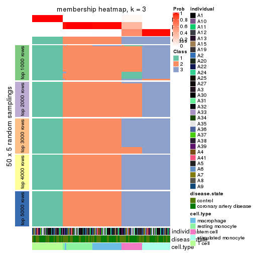</p>

</div>
<div id='tab-MAD-mclust-membership-heatmap-3'>
<pre><code class="r">membership_heatmap(res, k = 4)
</code></pre>

<p></p>

</div>
<div id='tab-MAD-mclust-membership-heatmap-4'>
<pre><code class="r">membership_heatmap(res, k = 5)
</code></pre>

<p></p>

</div>
<div id='tab-MAD-mclust-membership-heatmap-5'>
<pre><code class="r">membership_heatmap(res, k = 6)
</code></pre>

<p></p>

</div>
</div>

As soon as we have had the classes for columns, we can look for signatures
which are significantly different between classes which can be candidate marks
for certain classes. Following are the heatmaps for signatures.


Signature heatmaps where rows are scaled:


<script>
$( function() {
	$( '#tabs-MAD-mclust-get-signatures' ).tabs();
} );
</script>
<div id='tabs-MAD-mclust-get-signatures'>
<ul>
<li><a href='#tab-MAD-mclust-get-signatures-1'>k = 2</a></li>
<li><a href='#tab-MAD-mclust-get-signatures-2'>k = 3</a></li>
<li><a href='#tab-MAD-mclust-get-signatures-3'>k = 4</a></li>
<li><a href='#tab-MAD-mclust-get-signatures-4'>k = 5</a></li>
<li><a href='#tab-MAD-mclust-get-signatures-5'>k = 6</a></li>
</ul>
<div id='tab-MAD-mclust-get-signatures-1'>
<pre><code class="r">get_signatures(res, k = 2)
</code></pre>

<p></p>

</div>
<div id='tab-MAD-mclust-get-signatures-2'>
<pre><code class="r">get_signatures(res, k = 3)
</code></pre>

<p></p>

</div>
<div id='tab-MAD-mclust-get-signatures-3'>
<pre><code class="r">get_signatures(res, k = 4)
</code></pre>

<p></p>

</div>
<div id='tab-MAD-mclust-get-signatures-4'>
<pre><code class="r">get_signatures(res, k = 5)
</code></pre>

<pre><code>#&gt; Error in mat[ceiling(1:nr/h_ratio), ceiling(1:nc/w_ratio), drop = FALSE]: subscript out of bounds
</code></pre>

<p></p>

</div>
<div id='tab-MAD-mclust-get-signatures-5'>
<pre><code class="r">get_signatures(res, k = 6)
</code></pre>

<pre><code>#&gt; Error in mat[ceiling(1:nr/h_ratio), ceiling(1:nc/w_ratio), drop = FALSE]: subscript out of bounds
</code></pre>

<p></p>

</div>
</div>


Signature heatmaps where rows are not scaled:


<script>
$( function() {
	$( '#tabs-MAD-mclust-get-signatures-no-scale' ).tabs();
} );
</script>
<div id='tabs-MAD-mclust-get-signatures-no-scale'>
<ul>
<li><a href='#tab-MAD-mclust-get-signatures-no-scale-1'>k = 2</a></li>
<li><a href='#tab-MAD-mclust-get-signatures-no-scale-2'>k = 3</a></li>
<li><a href='#tab-MAD-mclust-get-signatures-no-scale-3'>k = 4</a></li>
<li><a href='#tab-MAD-mclust-get-signatures-no-scale-4'>k = 5</a></li>
<li><a href='#tab-MAD-mclust-get-signatures-no-scale-5'>k = 6</a></li>
</ul>
<div id='tab-MAD-mclust-get-signatures-no-scale-1'>
<pre><code class="r">get_signatures(res, k = 2, scale_rows = FALSE)
</code></pre>

<p></p>

</div>
<div id='tab-MAD-mclust-get-signatures-no-scale-2'>
<pre><code class="r">get_signatures(res, k = 3, scale_rows = FALSE)
</code></pre>

<p></p>

</div>
<div id='tab-MAD-mclust-get-signatures-no-scale-3'>
<pre><code class="r">get_signatures(res, k = 4, scale_rows = FALSE)
</code></pre>

<p></p>

</div>
<div id='tab-MAD-mclust-get-signatures-no-scale-4'>
<pre><code class="r">get_signatures(res, k = 5, scale_rows = FALSE)
</code></pre>

<pre><code>#&gt; Error in mat[ceiling(1:nr/h_ratio), ceiling(1:nc/w_ratio), drop = FALSE]: subscript out of bounds
</code></pre>

<p>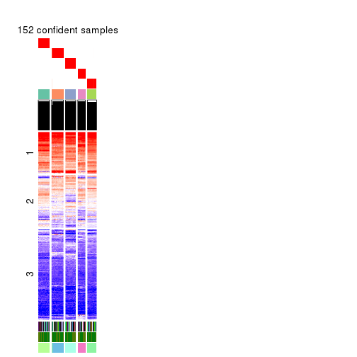</p>

</div>
<div id='tab-MAD-mclust-get-signatures-no-scale-5'>
<pre><code class="r">get_signatures(res, k = 6, scale_rows = FALSE)
</code></pre>

<p></p>

</div>
</div>


Compare the overlap of signatures from different k:

```r
compare_signatures(res)
```


`get_signature()` returns a data frame invisibly. TO get the list of signatures, the function
call should be assigned to a variable explicitly. In following code, if `plot` argument is set
to `FALSE`, no heatmap is plotted while only the differential analysis is performed.

```r
# code only for demonstration
tb = get_signature(res, k = ..., plot = FALSE)
```

An example of the output of `tb` is:

```
#>   which_row         fdr    mean_1    mean_2 scaled_mean_1 scaled_mean_2 km
#> 1        38 0.042760348  8.373488  9.131774    -0.5533452     0.5164555  1
#> 2        40 0.018707592  7.106213  8.469186    -0.6173731     0.5762149  1
#> 3        55 0.019134737 10.221463 11.207825    -0.6159697     0.5749050  1
#> 4        59 0.006059896  5.921854  7.869574    -0.6899429     0.6439467  1
#> 5        60 0.018055526  8.928898 10.211722    -0.6204761     0.5791110  1
#> 6        98 0.009384629 15.714769 14.887706     0.6635654    -0.6193277  2
...
```

The columns in `tb` are:

1. `which_row`: row indices corresponding to the input matrix.
2. `fdr`: FDR for the differential test. 
3. `mean_x`: The mean value in group x.
4. `scaled_mean_x`: The mean value in group x after rows are scaled.
5. `km`: Row groups if k-means clustering is applied to rows.


UMAP plot which shows how samples are separated.


<script>
$( function() {
	$( '#tabs-MAD-mclust-dimension-reduction' ).tabs();
} );
</script>
<div id='tabs-MAD-mclust-dimension-reduction'>
<ul>
<li><a href='#tab-MAD-mclust-dimension-reduction-1'>k = 2</a></li>
<li><a href='#tab-MAD-mclust-dimension-reduction-2'>k = 3</a></li>
<li><a href='#tab-MAD-mclust-dimension-reduction-3'>k = 4</a></li>
<li><a href='#tab-MAD-mclust-dimension-reduction-4'>k = 5</a></li>
<li><a href='#tab-MAD-mclust-dimension-reduction-5'>k = 6</a></li>
</ul>
<div id='tab-MAD-mclust-dimension-reduction-1'>
<pre><code class="r">dimension_reduction(res, k = 2, method = &quot;UMAP&quot;)
</code></pre>

<p>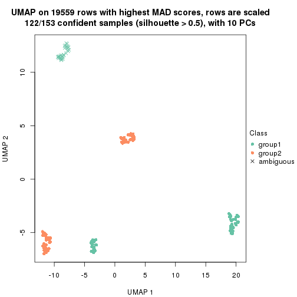</p>

</div>
<div id='tab-MAD-mclust-dimension-reduction-2'>
<pre><code class="r">dimension_reduction(res, k = 3, method = &quot;UMAP&quot;)
</code></pre>

<p></p>

</div>
<div id='tab-MAD-mclust-dimension-reduction-3'>
<pre><code class="r">dimension_reduction(res, k = 4, method = &quot;UMAP&quot;)
</code></pre>

<p></p>

</div>
<div id='tab-MAD-mclust-dimension-reduction-4'>
<pre><code class="r">dimension_reduction(res, k = 5, method = &quot;UMAP&quot;)
</code></pre>

<p>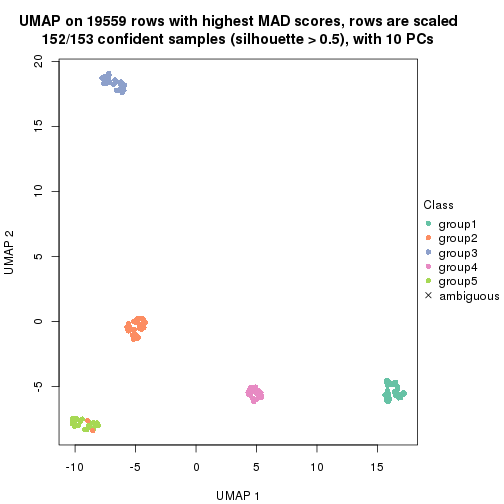</p>

</div>
<div id='tab-MAD-mclust-dimension-reduction-5'>
<pre><code class="r">dimension_reduction(res, k = 6, method = &quot;UMAP&quot;)
</code></pre>

<p></p>

</div>
</div>


Following heatmap shows how subgroups are split when increasing `k`:

```r
collect_classes(res)
```


Test correlation between subgroups and known annotations. If the known
annotation is numeric, one-way ANOVA test is applied, and if the known
annotation is discrete, chi-squared contingency table test is applied.

```r
test_to_known_factors(res)
```

```
#>              n individual(p) disease.state(p) cell.type(p) k
#> MAD:mclust 122             1            1.000     2.86e-26 2
#> MAD:mclust 153             1            0.956     2.17e-61 3
#> MAD:mclust 153             1            0.964     1.16e-90 4
#> MAD:mclust 152             1            0.887    3.04e-115 5
#> MAD:mclust 150             1            0.431    6.60e-113 6
```


If matrix rows can be associated to genes, consider to use `functional_enrichment(res,
...)` to perform function enrichment for the signature genes. See [this vignette](http://bioconductor.org/packages/devel/bioc/vignettes/cola/inst/doc/functional_enrichment.html) for more detailed explanations.


 

---------------------------------------------------


### MAD:NMF**


The object with results only for a single top-value method and a single partition method 
can be extracted as:

```r
res = res_list["MAD", "NMF"]
# you can also extract it by
# res = res_list["MAD:NMF"]
```

A summary of `res` and all the functions that can be applied to it:

```r
res
```

```
#> A 'ConsensusPartition' object with k = 2, 3, 4, 5, 6.
#>   On a matrix with 19559 rows and 153 columns.
#>   Top rows (1000, 2000, 3000, 4000, 5000) are extracted by 'MAD' method.
#>   Subgroups are detected by 'NMF' method.
#>   Performed in total 1250 partitions by row resampling.
#>   Best k for subgroups seems to be 5.
#> 
#> Following methods can be applied to this 'ConsensusPartition' object:
#>  [1] "cola_report"             "collect_classes"         "collect_plots"          
#>  [4] "collect_stats"           "colnames"                "compare_signatures"     
#>  [7] "consensus_heatmap"       "dimension_reduction"     "functional_enrichment"  
#> [10] "get_anno_col"            "get_anno"                "get_classes"            
#> [13] "get_consensus"           "get_matrix"              "get_membership"         
#> [16] "get_param"               "get_signatures"          "get_stats"              
#> [19] "is_best_k"               "is_stable_k"             "membership_heatmap"     
#> [22] "ncol"                    "nrow"                    "plot_ecdf"              
#> [25] "rownames"                "select_partition_number" "show"                   
#> [28] "suggest_best_k"          "test_to_known_factors"
```

`collect_plots()` function collects all the plots made from `res` for all `k` (number of partitions)
into one single page to provide an easy and fast comparison between different `k`.

```r
collect_plots(res)
```


The plots are:

- The first row: a plot of the ECDF (empirical cumulative distribution
  function) curves of the consensus matrix for each `k` and the heatmap of
  predicted classes for each `k`.
- The second row: heatmaps of the consensus matrix for each `k`.
- The third row: heatmaps of the membership matrix for each `k`.
- The fouth row: heatmaps of the signatures for each `k`.

All the plots in panels can be made by individual functions and they are
plotted later in this section.

`select_partition_number()` produces several plots showing different
statistics for choosing "optimized" `k`. There are following statistics:

- ECDF curves of the consensus matrix for each `k`;
- 1-PAC. [The PAC
  score](https://en.wikipedia.org/wiki/Consensus_clustering#Over-interpretation_potential_of_consensus_clustering)
  measures the proportion of the ambiguous subgrouping.
- Mean silhouette score.
- Concordance. The mean probability of fiting the consensus class ids in all
  partitions.
- Area increased. Denote $A_k$ as the area under the ECDF curve for current
  `k`, the area increased is defined as $A_k - A_{k-1}$.
- Rand index. The percent of pairs of samples that are both in a same cluster
  or both are not in a same cluster in the partition of k and k-1.
- Jaccard index. The ratio of pairs of samples are both in a same cluster in
  the partition of k and k-1 and the pairs of samples are both in a same
  cluster in the partition k or k-1.

The detailed explanations of these statistics can be found in [the _cola_
vignette](http://bioconductor.org/packages/devel/bioc/vignettes/cola/inst/doc/cola.html#toc_13).

Generally speaking, lower PAC score, higher mean silhouette score or higher
concordance corresponds to better partition. Rand index and Jaccard index
measure how similar the current partition is compared to partition with `k-1`.
If they are too similar, we won't accept `k` is better than `k-1`.

```r
select_partition_number(res)
```


The numeric values for all these statistics can be obtained by `get_stats()`.

```r
get_stats(res)
```

```
#>   k 1-PAC mean_silhouette concordance area_increased  Rand Jaccard
#> 2 2 1.000           1.000       1.000        0.47112 0.529   0.529
#> 3 3 0.969           0.954       0.977        0.38164 0.827   0.673
#> 4 4 0.877           0.946       0.946        0.10528 0.933   0.811
#> 5 5 1.000           1.000       1.000        0.11471 0.909   0.686
#> 6 6 1.000           0.988       0.990        0.00356 1.000   1.000
```

`suggest_best_k()` suggests the best $k$ based on these statistics. The rules are as follows:

- All $k$ with Jaccard index larger than 0.95 are removed because increasing
  $k$ does not provide enough extra information. If all $k$ are removed, it is
  marked as no subgroup is detected.
- For all $k$ with 1-PAC score larger than 0.9, the maximal $k$ is taken as
  the best $k$, and other $k$ are marked as optional $k$.
- If it does not fit the second rule. The $k$ with the maximal vote of the
  highest 1-PAC score, highest mean silhouette, and highest concordance is
  taken as the best $k$.

```r
suggest_best_k(res)
```

```
#> [1] 5
#> attr(,"optional")
#> [1] 2 3
```

There is also optional best $k$ = 2 3 that is worth to check.

Following shows the table of the partitions (You need to click the **show/hide
code output** link to see it). The membership matrix (columns with name `p*`)
is inferred by
[`clue::cl_consensus()`](https://www.rdocumentation.org/link/cl_consensus?package=clue)
function with the `SE` method. Basically the value in the membership matrix
represents the probability to belong to a certain group. The finall class
label for an item is determined with the group with highest probability it
belongs to.

In `get_classes()` function, the entropy is calculated from the membership
matrix and the silhouette score is calculated from the consensus matrix.


<script>
$( function() {
	$( '#tabs-MAD-NMF-get-classes' ).tabs();
} );
</script>
<div id='tabs-MAD-NMF-get-classes'>
<ul>
<li><a href='#tab-MAD-NMF-get-classes-1'>k = 2</a></li>
<li><a href='#tab-MAD-NMF-get-classes-2'>k = 3</a></li>
<li><a href='#tab-MAD-NMF-get-classes-3'>k = 4</a></li>
<li><a href='#tab-MAD-NMF-get-classes-4'>k = 5</a></li>
<li><a href='#tab-MAD-NMF-get-classes-5'>k = 6</a></li>
</ul>

<div id='tab-MAD-NMF-get-classes-1'>
<p><a id='tab-MAD-NMF-get-classes-1-a' style='color:#0366d6' href='#'>show/hide code output</a></p>
<pre><code class="r">cbind(get_classes(res, k = 2), get_membership(res, k = 2))
</code></pre>

<pre><code>#&gt;           class entropy silhouette p1 p2
#&gt; GSM247795     2       0          1  0  1
#&gt; GSM247854     2       0          1  0  1
#&gt; GSM247758     2       0          1  0  1
#&gt; GSM247742     1       0          1  1  0
#&gt; GSM247755     2       0          1  0  1
#&gt; GSM247841     1       0          1  1  0
#&gt; GSM247703     2       0          1  0  1
#&gt; GSM247739     2       0          1  0  1
#&gt; GSM247715     1       0          1  1  0
#&gt; GSM247829     2       0          1  0  1
#&gt; GSM247842     1       0          1  1  0
#&gt; GSM247805     2       0          1  0  1
#&gt; GSM247786     2       0          1  0  1
#&gt; GSM247812     2       0          1  0  1
#&gt; GSM247776     1       0          1  1  0
#&gt; GSM247850     1       0          1  1  0
#&gt; GSM247717     2       0          1  0  1
#&gt; GSM247784     2       0          1  0  1
#&gt; GSM247834     1       0          1  1  0
#&gt; GSM247783     2       0          1  0  1
#&gt; GSM247846     1       0          1  1  0
#&gt; GSM247822     2       0          1  0  1
#&gt; GSM247710     2       0          1  0  1
#&gt; GSM247713     1       0          1  1  0
#&gt; GSM247840     2       0          1  0  1
#&gt; GSM247733     1       0          1  1  0
#&gt; GSM247852     1       0          1  1  0
#&gt; GSM247790     2       0          1  0  1
#&gt; GSM247730     2       0          1  0  1
#&gt; GSM247824     2       0          1  0  1
#&gt; GSM247770     1       0          1  1  0
#&gt; GSM247711     2       0          1  0  1
#&gt; GSM247782     2       0          1  0  1
#&gt; GSM247836     1       0          1  1  0
#&gt; GSM247785     2       0          1  0  1
#&gt; GSM247847     1       0          1  1  0
#&gt; GSM247750     2       0          1  0  1
#&gt; GSM247788     2       0          1  0  1
#&gt; GSM247849     1       0          1  1  0
#&gt; GSM247772     2       0          1  0  1
#&gt; GSM247760     1       0          1  1  0
#&gt; GSM247764     2       0          1  0  1
#&gt; GSM247851     2       0          1  0  1
#&gt; GSM247714     2       0          1  0  1
#&gt; GSM247828     1       0          1  1  0
#&gt; GSM247704     2       0          1  0  1
#&gt; GSM247818     1       0          1  1  0
#&gt; GSM247823     2       0          1  0  1
#&gt; GSM247706     2       0          1  0  1
#&gt; GSM247835     2       0          1  0  1
#&gt; GSM247734     1       0          1  1  0
#&gt; GSM247819     2       0          1  0  1
#&gt; GSM247809     2       0          1  0  1
#&gt; GSM247830     2       0          1  0  1
#&gt; GSM247833     1       0          1  1  0
#&gt; GSM247738     2       0          1  0  1
#&gt; GSM247716     2       0          1  0  1
#&gt; GSM247747     2       0          1  0  1
#&gt; GSM247722     1       0          1  1  0
#&gt; GSM247816     2       0          1  0  1
#&gt; GSM247839     2       0          1  0  1
#&gt; GSM247821     1       0          1  1  0
#&gt; GSM247798     2       0          1  0  1
#&gt; GSM247838     1       0          1  1  0
#&gt; GSM247721     2       0          1  0  1
#&gt; GSM247781     2       0          1  0  1
#&gt; GSM247762     1       0          1  1  0
#&gt; GSM247825     2       0          1  0  1
#&gt; GSM247777     1       0          1  1  0
#&gt; GSM247761     2       0          1  0  1
#&gt; GSM247720     2       0          1  0  1
#&gt; GSM247814     2       0          1  0  1
#&gt; GSM247732     1       0          1  1  0
#&gt; GSM247708     2       0          1  0  1
#&gt; GSM247740     2       0          1  0  1
#&gt; GSM247749     1       0          1  1  0
#&gt; GSM247767     2       0          1  0  1
#&gt; GSM247748     1       0          1  1  0
#&gt; GSM247705     2       0          1  0  1
#&gt; GSM247746     2       0          1  0  1
#&gt; GSM247752     1       0          1  1  0
#&gt; GSM247769     2       0          1  0  1
#&gt; GSM247753     1       0          1  1  0
#&gt; GSM247723     2       0          1  0  1
#&gt; GSM247779     2       0          1  0  1
#&gt; GSM247756     1       0          1  1  0
#&gt; GSM247826     2       0          1  0  1
#&gt; GSM247775     1       0          1  1  0
#&gt; GSM247741     2       0          1  0  1
#&gt; GSM247799     2       0          1  0  1
#&gt; GSM247778     1       0          1  1  0
#&gt; GSM247806     2       0          1  0  1
#&gt; GSM247815     1       0          1  1  0
#&gt; GSM247735     2       0          1  0  1
#&gt; GSM247831     2       0          1  0  1
#&gt; GSM247845     1       0          1  1  0
#&gt; GSM247791     2       0          1  0  1
#&gt; GSM247780     1       0          1  1  0
#&gt; GSM247853     1       0          1  1  0
#&gt; GSM247800     2       0          1  0  1
#&gt; GSM247729     2       0          1  0  1
#&gt; GSM247810     1       0          1  1  0
#&gt; GSM247844     2       0          1  0  1
#&gt; GSM247793     1       0          1  1  0
#&gt; GSM247759     2       0          1  0  1
#&gt; GSM247724     2       0          1  0  1
#&gt; GSM247817     2       0          1  0  1
#&gt; GSM247727     1       0          1  1  0
#&gt; GSM247796     2       0          1  0  1
#&gt; GSM247725     2       0          1  0  1
#&gt; GSM247801     1       0          1  1  0
#&gt; GSM247731     2       0          1  0  1
#&gt; GSM247765     1       0          1  1  0
#&gt; GSM247792     2       0          1  0  1
#&gt; GSM247726     2       0          1  0  1
#&gt; GSM247803     1       0          1  1  0
#&gt; GSM247728     2       0          1  0  1
#&gt; GSM247768     1       0          1  1  0
#&gt; GSM247745     2       0          1  0  1
#&gt; GSM247855     2       0          1  0  1
#&gt; GSM247804     2       0          1  0  1
#&gt; GSM247774     1       0          1  1  0
#&gt; GSM247807     2       0          1  0  1
#&gt; GSM247813     1       0          1  1  0
#&gt; GSM247736     2       0          1  0  1
#&gt; GSM247712     2       0          1  0  1
#&gt; GSM247797     1       0          1  1  0
#&gt; GSM247743     2       0          1  0  1
#&gt; GSM247719     1       0          1  1  0
#&gt; GSM247707     2       0          1  0  1
#&gt; GSM247737     2       0          1  0  1
#&gt; GSM247827     2       0          1  0  1
#&gt; GSM247848     1       0          1  1  0
#&gt; GSM247794     2       0          1  0  1
#&gt; GSM247757     2       0          1  0  1
#&gt; GSM247744     1       0          1  1  0
#&gt; GSM247751     2       0          1  0  1
#&gt; GSM247837     1       0          1  1  0
#&gt; GSM247754     2       0          1  0  1
#&gt; GSM247789     2       0          1  0  1
#&gt; GSM247802     1       0          1  1  0
#&gt; GSM247771     2       0          1  0  1
#&gt; GSM247763     1       0          1  1  0
#&gt; GSM247808     2       0          1  0  1
#&gt; GSM247787     2       0          1  0  1
#&gt; GSM247843     1       0          1  1  0
#&gt; GSM247811     2       0          1  0  1
#&gt; GSM247773     1       0          1  1  0
#&gt; GSM247766     2       0          1  0  1
#&gt; GSM247718     2       0          1  0  1
#&gt; GSM247832     1       0          1  1  0
#&gt; GSM247709     2       0          1  0  1
#&gt; GSM247820     1       0          1  1  0
</code></pre>

<script>
$('#tab-MAD-NMF-get-classes-1-a').parent().next().next().hide();
$('#tab-MAD-NMF-get-classes-1-a').click(function(){
  $('#tab-MAD-NMF-get-classes-1-a').parent().next().next().toggle();
  return(false);
});
</script>
</div>

<div id='tab-MAD-NMF-get-classes-2'>
<p><a id='tab-MAD-NMF-get-classes-2-a' style='color:#0366d6' href='#'>show/hide code output</a></p>
<pre><code class="r">cbind(get_classes(res, k = 3), get_membership(res, k = 3))
</code></pre>

<pre><code>#&gt;           class entropy silhouette    p1    p2    p3
#&gt; GSM247795     2  0.0000      0.944 0.000 1.000 0.000
#&gt; GSM247854     2  0.0000      0.944 0.000 1.000 0.000
#&gt; GSM247758     2  0.0000      0.944 0.000 1.000 0.000
#&gt; GSM247742     1  0.0000      1.000 1.000 0.000 0.000
#&gt; GSM247755     3  0.0000      1.000 0.000 0.000 1.000
#&gt; GSM247841     1  0.0000      1.000 1.000 0.000 0.000
#&gt; GSM247703     2  0.0747      0.938 0.000 0.984 0.016
#&gt; GSM247739     2  0.0000      0.944 0.000 1.000 0.000
#&gt; GSM247715     1  0.0000      1.000 1.000 0.000 0.000
#&gt; GSM247829     3  0.0000      1.000 0.000 0.000 1.000
#&gt; GSM247842     1  0.0000      1.000 1.000 0.000 0.000
#&gt; GSM247805     2  0.0424      0.941 0.000 0.992 0.008
#&gt; GSM247786     2  0.0000      0.944 0.000 1.000 0.000
#&gt; GSM247812     3  0.0000      1.000 0.000 0.000 1.000
#&gt; GSM247776     1  0.0000      1.000 1.000 0.000 0.000
#&gt; GSM247850     1  0.0000      1.000 1.000 0.000 0.000
#&gt; GSM247717     2  0.0000      0.944 0.000 1.000 0.000
#&gt; GSM247784     2  0.0000      0.944 0.000 1.000 0.000
#&gt; GSM247834     1  0.0000      1.000 1.000 0.000 0.000
#&gt; GSM247783     3  0.0000      1.000 0.000 0.000 1.000
#&gt; GSM247846     1  0.0000      1.000 1.000 0.000 0.000
#&gt; GSM247822     2  0.4654      0.776 0.000 0.792 0.208
#&gt; GSM247710     2  0.0000      0.944 0.000 1.000 0.000
#&gt; GSM247713     1  0.0000      1.000 1.000 0.000 0.000
#&gt; GSM247840     3  0.0000      1.000 0.000 0.000 1.000
#&gt; GSM247733     1  0.0000      1.000 1.000 0.000 0.000
#&gt; GSM247852     1  0.0000      1.000 1.000 0.000 0.000
#&gt; GSM247790     2  0.0000      0.944 0.000 1.000 0.000
#&gt; GSM247730     2  0.0000      0.944 0.000 1.000 0.000
#&gt; GSM247824     3  0.0000      1.000 0.000 0.000 1.000
#&gt; GSM247770     1  0.0000      1.000 1.000 0.000 0.000
#&gt; GSM247711     2  0.0000      0.944 0.000 1.000 0.000
#&gt; GSM247782     2  0.0000      0.944 0.000 1.000 0.000
#&gt; GSM247836     1  0.0000      1.000 1.000 0.000 0.000
#&gt; GSM247785     3  0.0000      1.000 0.000 0.000 1.000
#&gt; GSM247847     1  0.0000      1.000 1.000 0.000 0.000
#&gt; GSM247750     2  0.0000      0.944 0.000 1.000 0.000
#&gt; GSM247788     2  0.0000      0.944 0.000 1.000 0.000
#&gt; GSM247849     1  0.0000      1.000 1.000 0.000 0.000
#&gt; GSM247772     3  0.0000      1.000 0.000 0.000 1.000
#&gt; GSM247760     1  0.0000      1.000 1.000 0.000 0.000
#&gt; GSM247764     2  0.6026      0.503 0.000 0.624 0.376
#&gt; GSM247851     2  0.6062      0.486 0.000 0.616 0.384
#&gt; GSM247714     2  0.0000      0.944 0.000 1.000 0.000
#&gt; GSM247828     1  0.0000      1.000 1.000 0.000 0.000
#&gt; GSM247704     3  0.0000      1.000 0.000 0.000 1.000
#&gt; GSM247818     1  0.0000      1.000 1.000 0.000 0.000
#&gt; GSM247823     2  0.1753      0.920 0.000 0.952 0.048
#&gt; GSM247706     2  0.0000      0.944 0.000 1.000 0.000
#&gt; GSM247835     3  0.0000      1.000 0.000 0.000 1.000
#&gt; GSM247734     1  0.0000      1.000 1.000 0.000 0.000
#&gt; GSM247819     2  0.5926      0.545 0.000 0.644 0.356
#&gt; GSM247809     2  0.0000      0.944 0.000 1.000 0.000
#&gt; GSM247830     3  0.0000      1.000 0.000 0.000 1.000
#&gt; GSM247833     1  0.0000      1.000 1.000 0.000 0.000
#&gt; GSM247738     2  0.0000      0.944 0.000 1.000 0.000
#&gt; GSM247716     2  0.0000      0.944 0.000 1.000 0.000
#&gt; GSM247747     3  0.0000      1.000 0.000 0.000 1.000
#&gt; GSM247722     1  0.0000      1.000 1.000 0.000 0.000
#&gt; GSM247816     2  0.3551      0.854 0.000 0.868 0.132
#&gt; GSM247839     2  0.0000      0.944 0.000 1.000 0.000
#&gt; GSM247821     1  0.0000      1.000 1.000 0.000 0.000
#&gt; GSM247798     3  0.0000      1.000 0.000 0.000 1.000
#&gt; GSM247838     1  0.0000      1.000 1.000 0.000 0.000
#&gt; GSM247721     2  0.0747      0.938 0.000 0.984 0.016
#&gt; GSM247781     2  0.0000      0.944 0.000 1.000 0.000
#&gt; GSM247762     1  0.0000      1.000 1.000 0.000 0.000
#&gt; GSM247825     3  0.0000      1.000 0.000 0.000 1.000
#&gt; GSM247777     1  0.0000      1.000 1.000 0.000 0.000
#&gt; GSM247761     2  0.1753      0.920 0.000 0.952 0.048
#&gt; GSM247720     2  0.0000      0.944 0.000 1.000 0.000
#&gt; GSM247814     3  0.0000      1.000 0.000 0.000 1.000
#&gt; GSM247732     1  0.0000      1.000 1.000 0.000 0.000
#&gt; GSM247708     2  0.1529      0.925 0.000 0.960 0.040
#&gt; GSM247740     2  0.0000      0.944 0.000 1.000 0.000
#&gt; GSM247749     1  0.0000      1.000 1.000 0.000 0.000
#&gt; GSM247767     3  0.0000      1.000 0.000 0.000 1.000
#&gt; GSM247748     1  0.0000      1.000 1.000 0.000 0.000
#&gt; GSM247705     2  0.5529      0.652 0.000 0.704 0.296
#&gt; GSM247746     2  0.0000      0.944 0.000 1.000 0.000
#&gt; GSM247752     1  0.0000      1.000 1.000 0.000 0.000
#&gt; GSM247769     3  0.0000      1.000 0.000 0.000 1.000
#&gt; GSM247753     1  0.0000      1.000 1.000 0.000 0.000
#&gt; GSM247723     2  0.3116      0.876 0.000 0.892 0.108
#&gt; GSM247779     2  0.0000      0.944 0.000 1.000 0.000
#&gt; GSM247756     1  0.0000      1.000 1.000 0.000 0.000
#&gt; GSM247826     3  0.0000      1.000 0.000 0.000 1.000
#&gt; GSM247775     1  0.0000      1.000 1.000 0.000 0.000
#&gt; GSM247741     2  0.2711      0.892 0.000 0.912 0.088
#&gt; GSM247799     2  0.0000      0.944 0.000 1.000 0.000
#&gt; GSM247778     1  0.0000      1.000 1.000 0.000 0.000
#&gt; GSM247806     3  0.0000      1.000 0.000 0.000 1.000
#&gt; GSM247815     1  0.0000      1.000 1.000 0.000 0.000
#&gt; GSM247735     2  0.0424      0.941 0.000 0.992 0.008
#&gt; GSM247831     2  0.0000      0.944 0.000 1.000 0.000
#&gt; GSM247845     1  0.0000      1.000 1.000 0.000 0.000
#&gt; GSM247791     3  0.0000      1.000 0.000 0.000 1.000
#&gt; GSM247780     1  0.0000      1.000 1.000 0.000 0.000
#&gt; GSM247853     1  0.0000      1.000 1.000 0.000 0.000
#&gt; GSM247800     2  0.4796      0.761 0.000 0.780 0.220
#&gt; GSM247729     2  0.0000      0.944 0.000 1.000 0.000
#&gt; GSM247810     1  0.0000      1.000 1.000 0.000 0.000
#&gt; GSM247844     3  0.0000      1.000 0.000 0.000 1.000
#&gt; GSM247793     1  0.0000      1.000 1.000 0.000 0.000
#&gt; GSM247759     2  0.0592      0.939 0.000 0.988 0.012
#&gt; GSM247724     2  0.0000      0.944 0.000 1.000 0.000
#&gt; GSM247817     3  0.0000      1.000 0.000 0.000 1.000
#&gt; GSM247727     1  0.0000      1.000 1.000 0.000 0.000
#&gt; GSM247796     2  0.4796      0.761 0.000 0.780 0.220
#&gt; GSM247725     2  0.0000      0.944 0.000 1.000 0.000
#&gt; GSM247801     1  0.0000      1.000 1.000 0.000 0.000
#&gt; GSM247731     3  0.0000      1.000 0.000 0.000 1.000
#&gt; GSM247765     1  0.0000      1.000 1.000 0.000 0.000
#&gt; GSM247792     2  0.4887      0.751 0.000 0.772 0.228
#&gt; GSM247726     2  0.0000      0.944 0.000 1.000 0.000
#&gt; GSM247803     1  0.0747      0.981 0.984 0.016 0.000
#&gt; GSM247728     3  0.0000      1.000 0.000 0.000 1.000
#&gt; GSM247768     1  0.0000      1.000 1.000 0.000 0.000
#&gt; GSM247745     2  0.0000      0.944 0.000 1.000 0.000
#&gt; GSM247855     2  0.0000      0.944 0.000 1.000 0.000
#&gt; GSM247804     2  0.0000      0.944 0.000 1.000 0.000
#&gt; GSM247774     1  0.0000      1.000 1.000 0.000 0.000
#&gt; GSM247807     3  0.0000      1.000 0.000 0.000 1.000
#&gt; GSM247813     1  0.0000      1.000 1.000 0.000 0.000
#&gt; GSM247736     2  0.0000      0.944 0.000 1.000 0.000
#&gt; GSM247712     2  0.0000      0.944 0.000 1.000 0.000
#&gt; GSM247797     1  0.0000      1.000 1.000 0.000 0.000
#&gt; GSM247743     3  0.0000      1.000 0.000 0.000 1.000
#&gt; GSM247719     1  0.0000      1.000 1.000 0.000 0.000
#&gt; GSM247707     2  0.2066      0.912 0.000 0.940 0.060
#&gt; GSM247737     2  0.0000      0.944 0.000 1.000 0.000
#&gt; GSM247827     3  0.0000      1.000 0.000 0.000 1.000
#&gt; GSM247848     1  0.0000      1.000 1.000 0.000 0.000
#&gt; GSM247794     2  0.2448      0.901 0.000 0.924 0.076
#&gt; GSM247757     2  0.0000      0.944 0.000 1.000 0.000
#&gt; GSM247744     1  0.0000      1.000 1.000 0.000 0.000
#&gt; GSM247751     3  0.0000      1.000 0.000 0.000 1.000
#&gt; GSM247837     1  0.0000      1.000 1.000 0.000 0.000
#&gt; GSM247754     2  0.4399      0.798 0.000 0.812 0.188
#&gt; GSM247789     2  0.0000      0.944 0.000 1.000 0.000
#&gt; GSM247802     1  0.0000      1.000 1.000 0.000 0.000
#&gt; GSM247771     3  0.0000      1.000 0.000 0.000 1.000
#&gt; GSM247763     1  0.0000      1.000 1.000 0.000 0.000
#&gt; GSM247808     2  0.0592      0.939 0.000 0.988 0.012
#&gt; GSM247787     2  0.0000      0.944 0.000 1.000 0.000
#&gt; GSM247843     1  0.0000      1.000 1.000 0.000 0.000
#&gt; GSM247811     3  0.0000      1.000 0.000 0.000 1.000
#&gt; GSM247773     1  0.0000      1.000 1.000 0.000 0.000
#&gt; GSM247766     2  0.6180      0.409 0.000 0.584 0.416
#&gt; GSM247718     2  0.0000      0.944 0.000 1.000 0.000
#&gt; GSM247832     1  0.0000      1.000 1.000 0.000 0.000
#&gt; GSM247709     3  0.0000      1.000 0.000 0.000 1.000
#&gt; GSM247820     1  0.0000      1.000 1.000 0.000 0.000
</code></pre>

<script>
$('#tab-MAD-NMF-get-classes-2-a').parent().next().next().hide();
$('#tab-MAD-NMF-get-classes-2-a').click(function(){
  $('#tab-MAD-NMF-get-classes-2-a').parent().next().next().toggle();
  return(false);
});
</script>
</div>

<div id='tab-MAD-NMF-get-classes-3'>
<p><a id='tab-MAD-NMF-get-classes-3-a' style='color:#0366d6' href='#'>show/hide code output</a></p>
<pre><code class="r">cbind(get_classes(res, k = 4), get_membership(res, k = 4))
</code></pre>

<pre><code>#&gt;           class entropy silhouette    p1    p2    p3    p4
#&gt; GSM247795     2   0.247      0.909 0.000 0.892 0.000 0.108
#&gt; GSM247854     2   0.247      0.909 0.000 0.892 0.000 0.108
#&gt; GSM247758     2   0.000      0.916 0.000 1.000 0.000 0.000
#&gt; GSM247742     4   0.234      0.990 0.100 0.000 0.000 0.900
#&gt; GSM247755     3   0.000      1.000 0.000 0.000 1.000 0.000
#&gt; GSM247841     1   0.000      1.000 1.000 0.000 0.000 0.000
#&gt; GSM247703     2   0.293      0.905 0.000 0.880 0.012 0.108
#&gt; GSM247739     2   0.000      0.916 0.000 1.000 0.000 0.000
#&gt; GSM247715     4   0.234      0.990 0.100 0.000 0.000 0.900
#&gt; GSM247829     3   0.000      1.000 0.000 0.000 1.000 0.000
#&gt; GSM247842     1   0.000      1.000 1.000 0.000 0.000 0.000
#&gt; GSM247805     2   0.247      0.909 0.000 0.892 0.000 0.108
#&gt; GSM247786     2   0.000      0.916 0.000 1.000 0.000 0.000
#&gt; GSM247812     3   0.000      1.000 0.000 0.000 1.000 0.000
#&gt; GSM247776     1   0.000      1.000 1.000 0.000 0.000 0.000
#&gt; GSM247850     1   0.000      1.000 1.000 0.000 0.000 0.000
#&gt; GSM247717     2   0.247      0.909 0.000 0.892 0.000 0.108
#&gt; GSM247784     2   0.000      0.916 0.000 1.000 0.000 0.000
#&gt; GSM247834     4   0.228      0.990 0.096 0.000 0.000 0.904
#&gt; GSM247783     3   0.000      1.000 0.000 0.000 1.000 0.000
#&gt; GSM247846     1   0.000      1.000 1.000 0.000 0.000 0.000
#&gt; GSM247822     2   0.558      0.788 0.000 0.724 0.168 0.108
#&gt; GSM247710     2   0.000      0.916 0.000 1.000 0.000 0.000
#&gt; GSM247713     4   0.228      0.990 0.096 0.000 0.000 0.904
#&gt; GSM247840     3   0.000      1.000 0.000 0.000 1.000 0.000
#&gt; GSM247733     1   0.000      1.000 1.000 0.000 0.000 0.000
#&gt; GSM247852     1   0.000      1.000 1.000 0.000 0.000 0.000
#&gt; GSM247790     2   0.247      0.909 0.000 0.892 0.000 0.108
#&gt; GSM247730     2   0.000      0.916 0.000 1.000 0.000 0.000
#&gt; GSM247824     3   0.000      1.000 0.000 0.000 1.000 0.000
#&gt; GSM247770     1   0.000      1.000 1.000 0.000 0.000 0.000
#&gt; GSM247711     2   0.247      0.909 0.000 0.892 0.000 0.108
#&gt; GSM247782     2   0.000      0.916 0.000 1.000 0.000 0.000
#&gt; GSM247836     4   0.234      0.990 0.100 0.000 0.000 0.900
#&gt; GSM247785     3   0.000      1.000 0.000 0.000 1.000 0.000
#&gt; GSM247847     1   0.000      1.000 1.000 0.000 0.000 0.000
#&gt; GSM247750     2   0.247      0.909 0.000 0.892 0.000 0.108
#&gt; GSM247788     2   0.000      0.916 0.000 1.000 0.000 0.000
#&gt; GSM247849     4   0.234      0.990 0.100 0.000 0.000 0.900
#&gt; GSM247772     3   0.000      1.000 0.000 0.000 1.000 0.000
#&gt; GSM247760     1   0.000      1.000 1.000 0.000 0.000 0.000
#&gt; GSM247764     2   0.643      0.646 0.000 0.620 0.272 0.108
#&gt; GSM247851     2   0.654      0.612 0.000 0.600 0.292 0.108
#&gt; GSM247714     2   0.000      0.916 0.000 1.000 0.000 0.000
#&gt; GSM247828     4   0.234      0.990 0.100 0.000 0.000 0.900
#&gt; GSM247704     3   0.000      1.000 0.000 0.000 1.000 0.000
#&gt; GSM247818     1   0.000      1.000 1.000 0.000 0.000 0.000
#&gt; GSM247823     2   0.327      0.901 0.000 0.868 0.024 0.108
#&gt; GSM247706     2   0.000      0.916 0.000 1.000 0.000 0.000
#&gt; GSM247835     3   0.000      1.000 0.000 0.000 1.000 0.000
#&gt; GSM247734     1   0.000      1.000 1.000 0.000 0.000 0.000
#&gt; GSM247819     2   0.630      0.677 0.000 0.640 0.252 0.108
#&gt; GSM247809     2   0.000      0.916 0.000 1.000 0.000 0.000
#&gt; GSM247830     3   0.000      1.000 0.000 0.000 1.000 0.000
#&gt; GSM247833     1   0.000      1.000 1.000 0.000 0.000 0.000
#&gt; GSM247738     2   0.247      0.909 0.000 0.892 0.000 0.108
#&gt; GSM247716     2   0.000      0.916 0.000 1.000 0.000 0.000
#&gt; GSM247747     3   0.000      1.000 0.000 0.000 1.000 0.000
#&gt; GSM247722     1   0.000      1.000 1.000 0.000 0.000 0.000
#&gt; GSM247816     2   0.390      0.887 0.000 0.840 0.052 0.108
#&gt; GSM247839     2   0.000      0.916 0.000 1.000 0.000 0.000
#&gt; GSM247821     4   0.228      0.990 0.096 0.000 0.000 0.904
#&gt; GSM247798     3   0.000      1.000 0.000 0.000 1.000 0.000
#&gt; GSM247838     1   0.000      1.000 1.000 0.000 0.000 0.000
#&gt; GSM247721     2   0.247      0.909 0.000 0.892 0.000 0.108
#&gt; GSM247781     2   0.000      0.916 0.000 1.000 0.000 0.000
#&gt; GSM247762     4   0.227      0.974 0.076 0.008 0.000 0.916
#&gt; GSM247825     3   0.000      1.000 0.000 0.000 1.000 0.000
#&gt; GSM247777     1   0.000      1.000 1.000 0.000 0.000 0.000
#&gt; GSM247761     2   0.327      0.901 0.000 0.868 0.024 0.108
#&gt; GSM247720     2   0.000      0.916 0.000 1.000 0.000 0.000
#&gt; GSM247814     3   0.000      1.000 0.000 0.000 1.000 0.000
#&gt; GSM247732     1   0.000      1.000 1.000 0.000 0.000 0.000
#&gt; GSM247708     2   0.293      0.905 0.000 0.880 0.012 0.108
#&gt; GSM247740     2   0.000      0.916 0.000 1.000 0.000 0.000
#&gt; GSM247749     4   0.228      0.990 0.096 0.000 0.000 0.904
#&gt; GSM247767     3   0.000      1.000 0.000 0.000 1.000 0.000
#&gt; GSM247748     1   0.000      1.000 1.000 0.000 0.000 0.000
#&gt; GSM247705     2   0.668      0.570 0.000 0.576 0.312 0.112
#&gt; GSM247746     2   0.000      0.916 0.000 1.000 0.000 0.000
#&gt; GSM247752     4   0.197      0.955 0.060 0.008 0.000 0.932
#&gt; GSM247769     3   0.000      1.000 0.000 0.000 1.000 0.000
#&gt; GSM247753     1   0.000      1.000 1.000 0.000 0.000 0.000
#&gt; GSM247723     2   0.346      0.898 0.000 0.860 0.032 0.108
#&gt; GSM247779     2   0.000      0.916 0.000 1.000 0.000 0.000
#&gt; GSM247756     4   0.234      0.990 0.100 0.000 0.000 0.900
#&gt; GSM247826     3   0.000      1.000 0.000 0.000 1.000 0.000
#&gt; GSM247775     1   0.000      1.000 1.000 0.000 0.000 0.000
#&gt; GSM247741     2   0.337      0.900 0.000 0.864 0.028 0.108
#&gt; GSM247799     2   0.000      0.916 0.000 1.000 0.000 0.000
#&gt; GSM247778     4   0.234      0.990 0.100 0.000 0.000 0.900
#&gt; GSM247806     3   0.000      1.000 0.000 0.000 1.000 0.000
#&gt; GSM247815     1   0.000      1.000 1.000 0.000 0.000 0.000
#&gt; GSM247735     2   0.247      0.909 0.000 0.892 0.000 0.108
#&gt; GSM247831     2   0.000      0.916 0.000 1.000 0.000 0.000
#&gt; GSM247845     4   0.234      0.990 0.100 0.000 0.000 0.900
#&gt; GSM247791     3   0.000      1.000 0.000 0.000 1.000 0.000
#&gt; GSM247780     1   0.000      1.000 1.000 0.000 0.000 0.000
#&gt; GSM247853     1   0.000      1.000 1.000 0.000 0.000 0.000
#&gt; GSM247800     2   0.554      0.792 0.000 0.728 0.164 0.108
#&gt; GSM247729     2   0.000      0.916 0.000 1.000 0.000 0.000
#&gt; GSM247810     4   0.222      0.988 0.092 0.000 0.000 0.908
#&gt; GSM247844     3   0.000      1.000 0.000 0.000 1.000 0.000
#&gt; GSM247793     1   0.000      1.000 1.000 0.000 0.000 0.000
#&gt; GSM247759     2   0.247      0.909 0.000 0.892 0.000 0.108
#&gt; GSM247724     2   0.000      0.916 0.000 1.000 0.000 0.000
#&gt; GSM247817     3   0.000      1.000 0.000 0.000 1.000 0.000
#&gt; GSM247727     1   0.000      1.000 1.000 0.000 0.000 0.000
#&gt; GSM247796     2   0.566      0.779 0.000 0.716 0.176 0.108
#&gt; GSM247725     2   0.000      0.916 0.000 1.000 0.000 0.000
#&gt; GSM247801     4   0.222      0.988 0.092 0.000 0.000 0.908
#&gt; GSM247731     3   0.000      1.000 0.000 0.000 1.000 0.000
#&gt; GSM247765     1   0.000      1.000 1.000 0.000 0.000 0.000
#&gt; GSM247792     2   0.571      0.774 0.000 0.712 0.180 0.108
#&gt; GSM247726     2   0.000      0.916 0.000 1.000 0.000 0.000
#&gt; GSM247803     4   0.209      0.943 0.048 0.020 0.000 0.932
#&gt; GSM247728     3   0.000      1.000 0.000 0.000 1.000 0.000
#&gt; GSM247768     1   0.000      1.000 1.000 0.000 0.000 0.000
#&gt; GSM247745     2   0.247      0.909 0.000 0.892 0.000 0.108
#&gt; GSM247855     2   0.247      0.909 0.000 0.892 0.000 0.108
#&gt; GSM247804     2   0.000      0.916 0.000 1.000 0.000 0.000
#&gt; GSM247774     4   0.222      0.988 0.092 0.000 0.000 0.908
#&gt; GSM247807     3   0.000      1.000 0.000 0.000 1.000 0.000
#&gt; GSM247813     1   0.000      1.000 1.000 0.000 0.000 0.000
#&gt; GSM247736     2   0.247      0.909 0.000 0.892 0.000 0.108
#&gt; GSM247712     2   0.000      0.916 0.000 1.000 0.000 0.000
#&gt; GSM247797     4   0.222      0.988 0.092 0.000 0.000 0.908
#&gt; GSM247743     3   0.000      1.000 0.000 0.000 1.000 0.000
#&gt; GSM247719     1   0.000      1.000 1.000 0.000 0.000 0.000
#&gt; GSM247707     2   0.337      0.900 0.000 0.864 0.028 0.108
#&gt; GSM247737     2   0.000      0.916 0.000 1.000 0.000 0.000
#&gt; GSM247827     3   0.000      1.000 0.000 0.000 1.000 0.000
#&gt; GSM247848     1   0.000      1.000 1.000 0.000 0.000 0.000
#&gt; GSM247794     2   0.398      0.885 0.000 0.836 0.056 0.108
#&gt; GSM247757     2   0.000      0.916 0.000 1.000 0.000 0.000
#&gt; GSM247744     4   0.228      0.990 0.096 0.000 0.000 0.904
#&gt; GSM247751     3   0.000      1.000 0.000 0.000 1.000 0.000
#&gt; GSM247837     1   0.000      1.000 1.000 0.000 0.000 0.000
#&gt; GSM247754     2   0.496      0.839 0.000 0.776 0.116 0.108
#&gt; GSM247789     2   0.000      0.916 0.000 1.000 0.000 0.000
#&gt; GSM247802     4   0.234      0.990 0.100 0.000 0.000 0.900
#&gt; GSM247771     3   0.000      1.000 0.000 0.000 1.000 0.000
#&gt; GSM247763     1   0.000      1.000 1.000 0.000 0.000 0.000
#&gt; GSM247808     2   0.247      0.909 0.000 0.892 0.000 0.108
#&gt; GSM247787     2   0.000      0.916 0.000 1.000 0.000 0.000
#&gt; GSM247843     4   0.234      0.990 0.100 0.000 0.000 0.900
#&gt; GSM247811     3   0.000      1.000 0.000 0.000 1.000 0.000
#&gt; GSM247773     1   0.000      1.000 1.000 0.000 0.000 0.000
#&gt; GSM247766     2   0.665      0.546 0.000 0.568 0.328 0.104
#&gt; GSM247718     2   0.000      0.916 0.000 1.000 0.000 0.000
#&gt; GSM247832     4   0.234      0.990 0.100 0.000 0.000 0.900
#&gt; GSM247709     3   0.000      1.000 0.000 0.000 1.000 0.000
#&gt; GSM247820     1   0.000      1.000 1.000 0.000 0.000 0.000
</code></pre>

<script>
$('#tab-MAD-NMF-get-classes-3-a').parent().next().next().hide();
$('#tab-MAD-NMF-get-classes-3-a').click(function(){
  $('#tab-MAD-NMF-get-classes-3-a').parent().next().next().toggle();
  return(false);
});
</script>
</div>

<div id='tab-MAD-NMF-get-classes-4'>
<p><a id='tab-MAD-NMF-get-classes-4-a' style='color:#0366d6' href='#'>show/hide code output</a></p>
<pre><code class="r">cbind(get_classes(res, k = 5), get_membership(res, k = 5))
</code></pre>

<pre><code>#&gt;           class entropy silhouette p1 p2 p3 p4 p5
#&gt; GSM247795     2       0          1  0  1  0  0  0
#&gt; GSM247854     2       0          1  0  1  0  0  0
#&gt; GSM247758     5       0          1  0  0  0  0  1
#&gt; GSM247742     4       0          1  0  0  0  1  0
#&gt; GSM247755     3       0          1  0  0  1  0  0
#&gt; GSM247841     1       0          1  1  0  0  0  0
#&gt; GSM247703     2       0          1  0  1  0  0  0
#&gt; GSM247739     5       0          1  0  0  0  0  1
#&gt; GSM247715     4       0          1  0  0  0  1  0
#&gt; GSM247829     3       0          1  0  0  1  0  0
#&gt; GSM247842     1       0          1  1  0  0  0  0
#&gt; GSM247805     2       0          1  0  1  0  0  0
#&gt; GSM247786     5       0          1  0  0  0  0  1
#&gt; GSM247812     3       0          1  0  0  1  0  0
#&gt; GSM247776     1       0          1  1  0  0  0  0
#&gt; GSM247850     1       0          1  1  0  0  0  0
#&gt; GSM247717     2       0          1  0  1  0  0  0
#&gt; GSM247784     5       0          1  0  0  0  0  1
#&gt; GSM247834     4       0          1  0  0  0  1  0
#&gt; GSM247783     3       0          1  0  0  1  0  0
#&gt; GSM247846     1       0          1  1  0  0  0  0
#&gt; GSM247822     2       0          1  0  1  0  0  0
#&gt; GSM247710     5       0          1  0  0  0  0  1
#&gt; GSM247713     4       0          1  0  0  0  1  0
#&gt; GSM247840     3       0          1  0  0  1  0  0
#&gt; GSM247733     1       0          1  1  0  0  0  0
#&gt; GSM247852     1       0          1  1  0  0  0  0
#&gt; GSM247790     2       0          1  0  1  0  0  0
#&gt; GSM247730     5       0          1  0  0  0  0  1
#&gt; GSM247824     3       0          1  0  0  1  0  0
#&gt; GSM247770     1       0          1  1  0  0  0  0
#&gt; GSM247711     2       0          1  0  1  0  0  0
#&gt; GSM247782     5       0          1  0  0  0  0  1
#&gt; GSM247836     4       0          1  0  0  0  1  0
#&gt; GSM247785     3       0          1  0  0  1  0  0
#&gt; GSM247847     1       0          1  1  0  0  0  0
#&gt; GSM247750     2       0          1  0  1  0  0  0
#&gt; GSM247788     5       0          1  0  0  0  0  1
#&gt; GSM247849     4       0          1  0  0  0  1  0
#&gt; GSM247772     3       0          1  0  0  1  0  0
#&gt; GSM247760     1       0          1  1  0  0  0  0
#&gt; GSM247764     2       0          1  0  1  0  0  0
#&gt; GSM247851     2       0          1  0  1  0  0  0
#&gt; GSM247714     5       0          1  0  0  0  0  1
#&gt; GSM247828     4       0          1  0  0  0  1  0
#&gt; GSM247704     3       0          1  0  0  1  0  0
#&gt; GSM247818     1       0          1  1  0  0  0  0
#&gt; GSM247823     2       0          1  0  1  0  0  0
#&gt; GSM247706     5       0          1  0  0  0  0  1
#&gt; GSM247835     3       0          1  0  0  1  0  0
#&gt; GSM247734     1       0          1  1  0  0  0  0
#&gt; GSM247819     2       0          1  0  1  0  0  0
#&gt; GSM247809     5       0          1  0  0  0  0  1
#&gt; GSM247830     3       0          1  0  0  1  0  0
#&gt; GSM247833     1       0          1  1  0  0  0  0
#&gt; GSM247738     2       0          1  0  1  0  0  0
#&gt; GSM247716     5       0          1  0  0  0  0  1
#&gt; GSM247747     3       0          1  0  0  1  0  0
#&gt; GSM247722     1       0          1  1  0  0  0  0
#&gt; GSM247816     2       0          1  0  1  0  0  0
#&gt; GSM247839     5       0          1  0  0  0  0  1
#&gt; GSM247821     4       0          1  0  0  0  1  0
#&gt; GSM247798     3       0          1  0  0  1  0  0
#&gt; GSM247838     1       0          1  1  0  0  0  0
#&gt; GSM247721     2       0          1  0  1  0  0  0
#&gt; GSM247781     5       0          1  0  0  0  0  1
#&gt; GSM247762     4       0          1  0  0  0  1  0
#&gt; GSM247825     3       0          1  0  0  1  0  0
#&gt; GSM247777     1       0          1  1  0  0  0  0
#&gt; GSM247761     2       0          1  0  1  0  0  0
#&gt; GSM247720     5       0          1  0  0  0  0  1
#&gt; GSM247814     3       0          1  0  0  1  0  0
#&gt; GSM247732     1       0          1  1  0  0  0  0
#&gt; GSM247708     2       0          1  0  1  0  0  0
#&gt; GSM247740     5       0          1  0  0  0  0  1
#&gt; GSM247749     4       0          1  0  0  0  1  0
#&gt; GSM247767     3       0          1  0  0  1  0  0
#&gt; GSM247748     1       0          1  1  0  0  0  0
#&gt; GSM247705     2       0          1  0  1  0  0  0
#&gt; GSM247746     5       0          1  0  0  0  0  1
#&gt; GSM247752     4       0          1  0  0  0  1  0
#&gt; GSM247769     3       0          1  0  0  1  0  0
#&gt; GSM247753     1       0          1  1  0  0  0  0
#&gt; GSM247723     2       0          1  0  1  0  0  0
#&gt; GSM247779     5       0          1  0  0  0  0  1
#&gt; GSM247756     4       0          1  0  0  0  1  0
#&gt; GSM247826     3       0          1  0  0  1  0  0
#&gt; GSM247775     1       0          1  1  0  0  0  0
#&gt; GSM247741     2       0          1  0  1  0  0  0
#&gt; GSM247799     5       0          1  0  0  0  0  1
#&gt; GSM247778     4       0          1  0  0  0  1  0
#&gt; GSM247806     3       0          1  0  0  1  0  0
#&gt; GSM247815     1       0          1  1  0  0  0  0
#&gt; GSM247735     2       0          1  0  1  0  0  0
#&gt; GSM247831     5       0          1  0  0  0  0  1
#&gt; GSM247845     4       0          1  0  0  0  1  0
#&gt; GSM247791     3       0          1  0  0  1  0  0
#&gt; GSM247780     1       0          1  1  0  0  0  0
#&gt; GSM247853     1       0          1  1  0  0  0  0
#&gt; GSM247800     2       0          1  0  1  0  0  0
#&gt; GSM247729     5       0          1  0  0  0  0  1
#&gt; GSM247810     4       0          1  0  0  0  1  0
#&gt; GSM247844     3       0          1  0  0  1  0  0
#&gt; GSM247793     1       0          1  1  0  0  0  0
#&gt; GSM247759     2       0          1  0  1  0  0  0
#&gt; GSM247724     5       0          1  0  0  0  0  1
#&gt; GSM247817     3       0          1  0  0  1  0  0
#&gt; GSM247727     1       0          1  1  0  0  0  0
#&gt; GSM247796     2       0          1  0  1  0  0  0
#&gt; GSM247725     5       0          1  0  0  0  0  1
#&gt; GSM247801     4       0          1  0  0  0  1  0
#&gt; GSM247731     3       0          1  0  0  1  0  0
#&gt; GSM247765     1       0          1  1  0  0  0  0
#&gt; GSM247792     2       0          1  0  1  0  0  0
#&gt; GSM247726     5       0          1  0  0  0  0  1
#&gt; GSM247803     4       0          1  0  0  0  1  0
#&gt; GSM247728     3       0          1  0  0  1  0  0
#&gt; GSM247768     1       0          1  1  0  0  0  0
#&gt; GSM247745     2       0          1  0  1  0  0  0
#&gt; GSM247855     2       0          1  0  1  0  0  0
#&gt; GSM247804     5       0          1  0  0  0  0  1
#&gt; GSM247774     4       0          1  0  0  0  1  0
#&gt; GSM247807     3       0          1  0  0  1  0  0
#&gt; GSM247813     1       0          1  1  0  0  0  0
#&gt; GSM247736     2       0          1  0  1  0  0  0
#&gt; GSM247712     5       0          1  0  0  0  0  1
#&gt; GSM247797     4       0          1  0  0  0  1  0
#&gt; GSM247743     3       0          1  0  0  1  0  0
#&gt; GSM247719     1       0          1  1  0  0  0  0
#&gt; GSM247707     2       0          1  0  1  0  0  0
#&gt; GSM247737     5       0          1  0  0  0  0  1
#&gt; GSM247827     3       0          1  0  0  1  0  0
#&gt; GSM247848     1       0          1  1  0  0  0  0
#&gt; GSM247794     2       0          1  0  1  0  0  0
#&gt; GSM247757     5       0          1  0  0  0  0  1
#&gt; GSM247744     4       0          1  0  0  0  1  0
#&gt; GSM247751     3       0          1  0  0  1  0  0
#&gt; GSM247837     1       0          1  1  0  0  0  0
#&gt; GSM247754     2       0          1  0  1  0  0  0
#&gt; GSM247789     5       0          1  0  0  0  0  1
#&gt; GSM247802     4       0          1  0  0  0  1  0
#&gt; GSM247771     3       0          1  0  0  1  0  0
#&gt; GSM247763     1       0          1  1  0  0  0  0
#&gt; GSM247808     2       0          1  0  1  0  0  0
#&gt; GSM247787     5       0          1  0  0  0  0  1
#&gt; GSM247843     4       0          1  0  0  0  1  0
#&gt; GSM247811     3       0          1  0  0  1  0  0
#&gt; GSM247773     1       0          1  1  0  0  0  0
#&gt; GSM247766     2       0          1  0  1  0  0  0
#&gt; GSM247718     5       0          1  0  0  0  0  1
#&gt; GSM247832     4       0          1  0  0  0  1  0
#&gt; GSM247709     3       0          1  0  0  1  0  0
#&gt; GSM247820     1       0          1  1  0  0  0  0
</code></pre>

<script>
$('#tab-MAD-NMF-get-classes-4-a').parent().next().next().hide();
$('#tab-MAD-NMF-get-classes-4-a').click(function(){
  $('#tab-MAD-NMF-get-classes-4-a').parent().next().next().toggle();
  return(false);
});
</script>
</div>

<div id='tab-MAD-NMF-get-classes-5'>
<p><a id='tab-MAD-NMF-get-classes-5-a' style='color:#0366d6' href='#'>show/hide code output</a></p>
<pre><code class="r">cbind(get_classes(res, k = 6), get_membership(res, k = 6))
</code></pre>

<pre><code>#&gt;           class entropy silhouette    p1    p2 p3    p4    p5 p6
#&gt; GSM247795     2  0.0260      0.994 0.000 0.992  0 0.000 0.000 NA
#&gt; GSM247854     2  0.0260      0.994 0.000 0.992  0 0.000 0.000 NA
#&gt; GSM247758     5  0.0146      0.988 0.000 0.000  0 0.000 0.996 NA
#&gt; GSM247742     4  0.0146      0.978 0.000 0.000  0 0.996 0.000 NA
#&gt; GSM247755     3  0.0000      1.000 0.000 0.000  1 0.000 0.000 NA
#&gt; GSM247841     1  0.0146      0.997 0.996 0.000  0 0.000 0.000 NA
#&gt; GSM247703     2  0.0146      0.995 0.000 0.996  0 0.000 0.000 NA
#&gt; GSM247739     5  0.0000      0.989 0.000 0.000  0 0.000 1.000 NA
#&gt; GSM247715     4  0.0146      0.977 0.000 0.000  0 0.996 0.000 NA
#&gt; GSM247829     3  0.0000      1.000 0.000 0.000  1 0.000 0.000 NA
#&gt; GSM247842     1  0.0000      0.998 1.000 0.000  0 0.000 0.000 NA
#&gt; GSM247805     2  0.0146      0.995 0.000 0.996  0 0.000 0.000 NA
#&gt; GSM247786     5  0.0000      0.989 0.000 0.000  0 0.000 1.000 NA
#&gt; GSM247812     3  0.0000      1.000 0.000 0.000  1 0.000 0.000 NA
#&gt; GSM247776     1  0.0146      0.997 0.996 0.000  0 0.000 0.000 NA
#&gt; GSM247850     1  0.0000      0.998 1.000 0.000  0 0.000 0.000 NA
#&gt; GSM247717     2  0.0146      0.995 0.000 0.996  0 0.000 0.000 NA
#&gt; GSM247784     5  0.0146      0.988 0.000 0.000  0 0.000 0.996 NA
#&gt; GSM247834     4  0.0146      0.977 0.000 0.000  0 0.996 0.000 NA
#&gt; GSM247783     3  0.0000      1.000 0.000 0.000  1 0.000 0.000 NA
#&gt; GSM247846     1  0.0146      0.997 0.996 0.000  0 0.000 0.000 NA
#&gt; GSM247822     2  0.0260      0.995 0.000 0.992  0 0.000 0.000 NA
#&gt; GSM247710     5  0.0000      0.989 0.000 0.000  0 0.000 1.000 NA
#&gt; GSM247713     4  0.0146      0.977 0.000 0.000  0 0.996 0.000 NA
#&gt; GSM247840     3  0.0000      1.000 0.000 0.000  1 0.000 0.000 NA
#&gt; GSM247733     1  0.0000      0.998 1.000 0.000  0 0.000 0.000 NA
#&gt; GSM247852     1  0.0146      0.997 0.996 0.000  0 0.000 0.000 NA
#&gt; GSM247790     2  0.0260      0.994 0.000 0.992  0 0.000 0.000 NA
#&gt; GSM247730     5  0.0146      0.988 0.000 0.000  0 0.000 0.996 NA
#&gt; GSM247824     3  0.0000      1.000 0.000 0.000  1 0.000 0.000 NA
#&gt; GSM247770     1  0.0260      0.995 0.992 0.000  0 0.000 0.000 NA
#&gt; GSM247711     2  0.0146      0.995 0.000 0.996  0 0.000 0.000 NA
#&gt; GSM247782     5  0.0000      0.989 0.000 0.000  0 0.000 1.000 NA
#&gt; GSM247836     4  0.0146      0.978 0.000 0.000  0 0.996 0.000 NA
#&gt; GSM247785     3  0.0000      1.000 0.000 0.000  1 0.000 0.000 NA
#&gt; GSM247847     1  0.0000      0.998 1.000 0.000  0 0.000 0.000 NA
#&gt; GSM247750     2  0.0458      0.991 0.000 0.984  0 0.000 0.000 NA
#&gt; GSM247788     5  0.0000      0.989 0.000 0.000  0 0.000 1.000 NA
#&gt; GSM247849     4  0.0146      0.978 0.000 0.000  0 0.996 0.000 NA
#&gt; GSM247772     3  0.0000      1.000 0.000 0.000  1 0.000 0.000 NA
#&gt; GSM247760     1  0.0146      0.997 0.996 0.000  0 0.000 0.000 NA
#&gt; GSM247764     2  0.0363      0.993 0.000 0.988  0 0.000 0.000 NA
#&gt; GSM247851     2  0.0363      0.993 0.000 0.988  0 0.000 0.000 NA
#&gt; GSM247714     5  0.0146      0.988 0.000 0.000  0 0.000 0.996 NA
#&gt; GSM247828     4  0.0146      0.978 0.000 0.000  0 0.996 0.000 NA
#&gt; GSM247704     3  0.0000      1.000 0.000 0.000  1 0.000 0.000 NA
#&gt; GSM247818     1  0.0146      0.997 0.996 0.000  0 0.000 0.000 NA
#&gt; GSM247823     2  0.0260      0.994 0.000 0.992  0 0.000 0.000 NA
#&gt; GSM247706     5  0.0000      0.989 0.000 0.000  0 0.000 1.000 NA
#&gt; GSM247835     3  0.0000      1.000 0.000 0.000  1 0.000 0.000 NA
#&gt; GSM247734     1  0.0146      0.997 0.996 0.000  0 0.000 0.000 NA
#&gt; GSM247819     2  0.0260      0.994 0.000 0.992  0 0.000 0.000 NA
#&gt; GSM247809     5  0.0363      0.985 0.000 0.000  0 0.000 0.988 NA
#&gt; GSM247830     3  0.0000      1.000 0.000 0.000  1 0.000 0.000 NA
#&gt; GSM247833     1  0.0000      0.998 1.000 0.000  0 0.000 0.000 NA
#&gt; GSM247738     2  0.0260      0.995 0.000 0.992  0 0.000 0.000 NA
#&gt; GSM247716     5  0.0363      0.985 0.000 0.000  0 0.000 0.988 NA
#&gt; GSM247747     3  0.0000      1.000 0.000 0.000  1 0.000 0.000 NA
#&gt; GSM247722     1  0.0146      0.997 0.996 0.000  0 0.000 0.000 NA
#&gt; GSM247816     2  0.0000      0.995 0.000 1.000  0 0.000 0.000 NA
#&gt; GSM247839     5  0.0363      0.985 0.000 0.000  0 0.000 0.988 NA
#&gt; GSM247821     4  0.0260      0.976 0.000 0.000  0 0.992 0.000 NA
#&gt; GSM247798     3  0.0000      1.000 0.000 0.000  1 0.000 0.000 NA
#&gt; GSM247838     1  0.0146      0.997 0.996 0.000  0 0.000 0.000 NA
#&gt; GSM247721     2  0.0260      0.994 0.000 0.992  0 0.000 0.000 NA
#&gt; GSM247781     5  0.0146      0.988 0.000 0.000  0 0.000 0.996 NA
#&gt; GSM247762     4  0.1267      0.948 0.000 0.000  0 0.940 0.000 NA
#&gt; GSM247825     3  0.0000      1.000 0.000 0.000  1 0.000 0.000 NA
#&gt; GSM247777     1  0.0146      0.997 0.996 0.000  0 0.000 0.000 NA
#&gt; GSM247761     2  0.0146      0.995 0.000 0.996  0 0.000 0.000 NA
#&gt; GSM247720     5  0.0000      0.989 0.000 0.000  0 0.000 1.000 NA
#&gt; GSM247814     3  0.0000      1.000 0.000 0.000  1 0.000 0.000 NA
#&gt; GSM247732     1  0.0000      0.998 1.000 0.000  0 0.000 0.000 NA
#&gt; GSM247708     2  0.0146      0.995 0.000 0.996  0 0.000 0.000 NA
#&gt; GSM247740     5  0.0146      0.988 0.000 0.000  0 0.000 0.996 NA
#&gt; GSM247749     4  0.0146      0.977 0.000 0.000  0 0.996 0.000 NA
#&gt; GSM247767     3  0.0000      1.000 0.000 0.000  1 0.000 0.000 NA
#&gt; GSM247748     1  0.0000      0.998 1.000 0.000  0 0.000 0.000 NA
#&gt; GSM247705     2  0.0260      0.994 0.000 0.992  0 0.000 0.000 NA
#&gt; GSM247746     5  0.0146      0.988 0.000 0.000  0 0.000 0.996 NA
#&gt; GSM247752     4  0.3101      0.830 0.000 0.000  0 0.756 0.000 NA
#&gt; GSM247769     3  0.0000      1.000 0.000 0.000  1 0.000 0.000 NA
#&gt; GSM247753     1  0.0000      0.998 1.000 0.000  0 0.000 0.000 NA
#&gt; GSM247723     2  0.0260      0.994 0.000 0.992  0 0.000 0.000 NA
#&gt; GSM247779     5  0.0146      0.988 0.000 0.000  0 0.000 0.996 NA
#&gt; GSM247756     4  0.0146      0.978 0.000 0.000  0 0.996 0.000 NA
#&gt; GSM247826     3  0.0000      1.000 0.000 0.000  1 0.000 0.000 NA
#&gt; GSM247775     1  0.0000      0.998 1.000 0.000  0 0.000 0.000 NA
#&gt; GSM247741     2  0.0000      0.995 0.000 1.000  0 0.000 0.000 NA
#&gt; GSM247799     5  0.0000      0.989 0.000 0.000  0 0.000 1.000 NA
#&gt; GSM247778     4  0.0146      0.977 0.000 0.000  0 0.996 0.000 NA
#&gt; GSM247806     3  0.0000      1.000 0.000 0.000  1 0.000 0.000 NA
#&gt; GSM247815     1  0.0146      0.997 0.996 0.000  0 0.000 0.000 NA
#&gt; GSM247735     2  0.0260      0.994 0.000 0.992  0 0.000 0.000 NA
#&gt; GSM247831     5  0.0000      0.989 0.000 0.000  0 0.000 1.000 NA
#&gt; GSM247845     4  0.0146      0.978 0.000 0.000  0 0.996 0.000 NA
#&gt; GSM247791     3  0.0000      1.000 0.000 0.000  1 0.000 0.000 NA
#&gt; GSM247780     1  0.0146      0.997 0.996 0.000  0 0.000 0.000 NA
#&gt; GSM247853     1  0.0146      0.997 0.996 0.000  0 0.000 0.000 NA
#&gt; GSM247800     2  0.0146      0.995 0.000 0.996  0 0.000 0.000 NA
#&gt; GSM247729     5  0.0146      0.988 0.000 0.000  0 0.000 0.996 NA
#&gt; GSM247810     4  0.0146      0.977 0.000 0.000  0 0.996 0.000 NA
#&gt; GSM247844     3  0.0000      1.000 0.000 0.000  1 0.000 0.000 NA
#&gt; GSM247793     1  0.0146      0.997 0.996 0.000  0 0.000 0.000 NA
#&gt; GSM247759     2  0.0146      0.995 0.000 0.996  0 0.000 0.000 NA
#&gt; GSM247724     5  0.0260      0.987 0.000 0.000  0 0.000 0.992 NA
#&gt; GSM247817     3  0.0000      1.000 0.000 0.000  1 0.000 0.000 NA
#&gt; GSM247727     1  0.0000      0.998 1.000 0.000  0 0.000 0.000 NA
#&gt; GSM247796     2  0.0363      0.993 0.000 0.988  0 0.000 0.000 NA
#&gt; GSM247725     5  0.0146      0.988 0.000 0.000  0 0.000 0.996 NA
#&gt; GSM247801     4  0.0000      0.978 0.000 0.000  0 1.000 0.000 NA
#&gt; GSM247731     3  0.0000      1.000 0.000 0.000  1 0.000 0.000 NA
#&gt; GSM247765     1  0.0146      0.997 0.996 0.000  0 0.000 0.000 NA
#&gt; GSM247792     2  0.0260      0.995 0.000 0.992  0 0.000 0.000 NA
#&gt; GSM247726     5  0.3547      0.681 0.000 0.000  0 0.000 0.668 NA
#&gt; GSM247803     4  0.3672      0.737 0.000 0.000  0 0.632 0.000 NA
#&gt; GSM247728     3  0.0000      1.000 0.000 0.000  1 0.000 0.000 NA
#&gt; GSM247768     1  0.0260      0.995 0.992 0.000  0 0.000 0.000 NA
#&gt; GSM247745     2  0.0260      0.994 0.000 0.992  0 0.000 0.000 NA
#&gt; GSM247855     2  0.0363      0.993 0.000 0.988  0 0.000 0.000 NA
#&gt; GSM247804     5  0.0260      0.987 0.000 0.000  0 0.000 0.992 NA
#&gt; GSM247774     4  0.0146      0.978 0.000 0.000  0 0.996 0.000 NA
#&gt; GSM247807     3  0.0000      1.000 0.000 0.000  1 0.000 0.000 NA
#&gt; GSM247813     1  0.0000      0.998 1.000 0.000  0 0.000 0.000 NA
#&gt; GSM247736     2  0.0260      0.994 0.000 0.992  0 0.000 0.000 NA
#&gt; GSM247712     5  0.0260      0.986 0.000 0.000  0 0.000 0.992 NA
#&gt; GSM247797     4  0.0000      0.978 0.000 0.000  0 1.000 0.000 NA
#&gt; GSM247743     3  0.0000      1.000 0.000 0.000  1 0.000 0.000 NA
#&gt; GSM247719     1  0.0146      0.997 0.996 0.000  0 0.000 0.000 NA
#&gt; GSM247707     2  0.0146      0.995 0.000 0.996  0 0.000 0.000 NA
#&gt; GSM247737     5  0.0146      0.988 0.000 0.000  0 0.000 0.996 NA
#&gt; GSM247827     3  0.0000      1.000 0.000 0.000  1 0.000 0.000 NA
#&gt; GSM247848     1  0.0146      0.997 0.996 0.000  0 0.000 0.000 NA
#&gt; GSM247794     2  0.0260      0.994 0.000 0.992  0 0.000 0.000 NA
#&gt; GSM247757     5  0.0146      0.988 0.000 0.000  0 0.000 0.996 NA
#&gt; GSM247744     4  0.0146      0.978 0.000 0.000  0 0.996 0.000 NA
#&gt; GSM247751     3  0.0000      1.000 0.000 0.000  1 0.000 0.000 NA
#&gt; GSM247837     1  0.0146      0.997 0.996 0.000  0 0.000 0.000 NA
#&gt; GSM247754     2  0.0146      0.995 0.000 0.996  0 0.000 0.000 NA
#&gt; GSM247789     5  0.0000      0.989 0.000 0.000  0 0.000 1.000 NA
#&gt; GSM247802     4  0.0000      0.978 0.000 0.000  0 1.000 0.000 NA
#&gt; GSM247771     3  0.0000      1.000 0.000 0.000  1 0.000 0.000 NA
#&gt; GSM247763     1  0.0146      0.997 0.996 0.000  0 0.000 0.000 NA
#&gt; GSM247808     2  0.0000      0.995 0.000 1.000  0 0.000 0.000 NA
#&gt; GSM247787     5  0.0000      0.989 0.000 0.000  0 0.000 1.000 NA
#&gt; GSM247843     4  0.0146      0.978 0.000 0.000  0 0.996 0.000 NA
#&gt; GSM247811     3  0.0000      1.000 0.000 0.000  1 0.000 0.000 NA
#&gt; GSM247773     1  0.0000      0.998 1.000 0.000  0 0.000 0.000 NA
#&gt; GSM247766     2  0.0146      0.995 0.000 0.996  0 0.000 0.000 NA
#&gt; GSM247718     5  0.0146      0.988 0.000 0.000  0 0.000 0.996 NA
#&gt; GSM247832     4  0.0146      0.978 0.000 0.000  0 0.996 0.000 NA
#&gt; GSM247709     3  0.0000      1.000 0.000 0.000  1 0.000 0.000 NA
#&gt; GSM247820     1  0.0146      0.997 0.996 0.000  0 0.000 0.000 NA
</code></pre>

<script>
$('#tab-MAD-NMF-get-classes-5-a').parent().next().next().hide();
$('#tab-MAD-NMF-get-classes-5-a').click(function(){
  $('#tab-MAD-NMF-get-classes-5-a').parent().next().next().toggle();
  return(false);
});
</script>
</div>
</div>

Heatmaps for the consensus matrix. It visualizes the probability of two
samples to be in a same group.


<script>
$( function() {
	$( '#tabs-MAD-NMF-consensus-heatmap' ).tabs();
} );
</script>
<div id='tabs-MAD-NMF-consensus-heatmap'>
<ul>
<li><a href='#tab-MAD-NMF-consensus-heatmap-1'>k = 2</a></li>
<li><a href='#tab-MAD-NMF-consensus-heatmap-2'>k = 3</a></li>
<li><a href='#tab-MAD-NMF-consensus-heatmap-3'>k = 4</a></li>
<li><a href='#tab-MAD-NMF-consensus-heatmap-4'>k = 5</a></li>
<li><a href='#tab-MAD-NMF-consensus-heatmap-5'>k = 6</a></li>
</ul>
<div id='tab-MAD-NMF-consensus-heatmap-1'>
<pre><code class="r">consensus_heatmap(res, k = 2)
</code></pre>

<p></p>

</div>
<div id='tab-MAD-NMF-consensus-heatmap-2'>
<pre><code class="r">consensus_heatmap(res, k = 3)
</code></pre>

<p></p>

</div>
<div id='tab-MAD-NMF-consensus-heatmap-3'>
<pre><code class="r">consensus_heatmap(res, k = 4)
</code></pre>

<p></p>

</div>
<div id='tab-MAD-NMF-consensus-heatmap-4'>
<pre><code class="r">consensus_heatmap(res, k = 5)
</code></pre>

<p></p>

</div>
<div id='tab-MAD-NMF-consensus-heatmap-5'>
<pre><code class="r">consensus_heatmap(res, k = 6)
</code></pre>

<p></p>

</div>
</div>

Heatmaps for the membership of samples in all partitions to see how consistent they are:


<script>
$( function() {
	$( '#tabs-MAD-NMF-membership-heatmap' ).tabs();
} );
</script>
<div id='tabs-MAD-NMF-membership-heatmap'>
<ul>
<li><a href='#tab-MAD-NMF-membership-heatmap-1'>k = 2</a></li>
<li><a href='#tab-MAD-NMF-membership-heatmap-2'>k = 3</a></li>
<li><a href='#tab-MAD-NMF-membership-heatmap-3'>k = 4</a></li>
<li><a href='#tab-MAD-NMF-membership-heatmap-4'>k = 5</a></li>
<li><a href='#tab-MAD-NMF-membership-heatmap-5'>k = 6</a></li>
</ul>
<div id='tab-MAD-NMF-membership-heatmap-1'>
<pre><code class="r">membership_heatmap(res, k = 2)
</code></pre>

<p></p>

</div>
<div id='tab-MAD-NMF-membership-heatmap-2'>
<pre><code class="r">membership_heatmap(res, k = 3)
</code></pre>

<p></p>

</div>
<div id='tab-MAD-NMF-membership-heatmap-3'>
<pre><code class="r">membership_heatmap(res, k = 4)
</code></pre>

<p></p>

</div>
<div id='tab-MAD-NMF-membership-heatmap-4'>
<pre><code class="r">membership_heatmap(res, k = 5)
</code></pre>

<p></p>

</div>
<div id='tab-MAD-NMF-membership-heatmap-5'>
<pre><code class="r">membership_heatmap(res, k = 6)
</code></pre>

<p></p>

</div>
</div>

As soon as we have had the classes for columns, we can look for signatures
which are significantly different between classes which can be candidate marks
for certain classes. Following are the heatmaps for signatures.


Signature heatmaps where rows are scaled:


<script>
$( function() {
	$( '#tabs-MAD-NMF-get-signatures' ).tabs();
} );
</script>
<div id='tabs-MAD-NMF-get-signatures'>
<ul>
<li><a href='#tab-MAD-NMF-get-signatures-1'>k = 2</a></li>
<li><a href='#tab-MAD-NMF-get-signatures-2'>k = 3</a></li>
<li><a href='#tab-MAD-NMF-get-signatures-3'>k = 4</a></li>
<li><a href='#tab-MAD-NMF-get-signatures-4'>k = 5</a></li>
<li><a href='#tab-MAD-NMF-get-signatures-5'>k = 6</a></li>
</ul>
<div id='tab-MAD-NMF-get-signatures-1'>
<pre><code class="r">get_signatures(res, k = 2)
</code></pre>

<p></p>

</div>
<div id='tab-MAD-NMF-get-signatures-2'>
<pre><code class="r">get_signatures(res, k = 3)
</code></pre>

<pre><code>#&gt; Error in mat[ceiling(1:nr/h_ratio), ceiling(1:nc/w_ratio), drop = FALSE]: subscript out of bounds
</code></pre>

<p></p>

</div>
<div id='tab-MAD-NMF-get-signatures-3'>
<pre><code class="r">get_signatures(res, k = 4)
</code></pre>

<p></p>

</div>
<div id='tab-MAD-NMF-get-signatures-4'>
<pre><code class="r">get_signatures(res, k = 5)
</code></pre>

<p></p>

</div>
<div id='tab-MAD-NMF-get-signatures-5'>
<pre><code class="r">get_signatures(res, k = 6)
</code></pre>

<p></p>

</div>
</div>


Signature heatmaps where rows are not scaled:


<script>
$( function() {
	$( '#tabs-MAD-NMF-get-signatures-no-scale' ).tabs();
} );
</script>
<div id='tabs-MAD-NMF-get-signatures-no-scale'>
<ul>
<li><a href='#tab-MAD-NMF-get-signatures-no-scale-1'>k = 2</a></li>
<li><a href='#tab-MAD-NMF-get-signatures-no-scale-2'>k = 3</a></li>
<li><a href='#tab-MAD-NMF-get-signatures-no-scale-3'>k = 4</a></li>
<li><a href='#tab-MAD-NMF-get-signatures-no-scale-4'>k = 5</a></li>
<li><a href='#tab-MAD-NMF-get-signatures-no-scale-5'>k = 6</a></li>
</ul>
<div id='tab-MAD-NMF-get-signatures-no-scale-1'>
<pre><code class="r">get_signatures(res, k = 2, scale_rows = FALSE)
</code></pre>

<p></p>

</div>
<div id='tab-MAD-NMF-get-signatures-no-scale-2'>
<pre><code class="r">get_signatures(res, k = 3, scale_rows = FALSE)
</code></pre>

<p></p>

</div>
<div id='tab-MAD-NMF-get-signatures-no-scale-3'>
<pre><code class="r">get_signatures(res, k = 4, scale_rows = FALSE)
</code></pre>

<p></p>

</div>
<div id='tab-MAD-NMF-get-signatures-no-scale-4'>
<pre><code class="r">get_signatures(res, k = 5, scale_rows = FALSE)
</code></pre>

<p></p>

</div>
<div id='tab-MAD-NMF-get-signatures-no-scale-5'>
<pre><code class="r">get_signatures(res, k = 6, scale_rows = FALSE)
</code></pre>

<p></p>

</div>
</div>


Compare the overlap of signatures from different k:

```r
compare_signatures(res)
```


`get_signature()` returns a data frame invisibly. TO get the list of signatures, the function
call should be assigned to a variable explicitly. In following code, if `plot` argument is set
to `FALSE`, no heatmap is plotted while only the differential analysis is performed.

```r
# code only for demonstration
tb = get_signature(res, k = ..., plot = FALSE)
```

An example of the output of `tb` is:

```
#>   which_row         fdr    mean_1    mean_2 scaled_mean_1 scaled_mean_2 km
#> 1        38 0.042760348  8.373488  9.131774    -0.5533452     0.5164555  1
#> 2        40 0.018707592  7.106213  8.469186    -0.6173731     0.5762149  1
#> 3        55 0.019134737 10.221463 11.207825    -0.6159697     0.5749050  1
#> 4        59 0.006059896  5.921854  7.869574    -0.6899429     0.6439467  1
#> 5        60 0.018055526  8.928898 10.211722    -0.6204761     0.5791110  1
#> 6        98 0.009384629 15.714769 14.887706     0.6635654    -0.6193277  2
...
```

The columns in `tb` are:

1. `which_row`: row indices corresponding to the input matrix.
2. `fdr`: FDR for the differential test. 
3. `mean_x`: The mean value in group x.
4. `scaled_mean_x`: The mean value in group x after rows are scaled.
5. `km`: Row groups if k-means clustering is applied to rows.


UMAP plot which shows how samples are separated.


<script>
$( function() {
	$( '#tabs-MAD-NMF-dimension-reduction' ).tabs();
} );
</script>
<div id='tabs-MAD-NMF-dimension-reduction'>
<ul>
<li><a href='#tab-MAD-NMF-dimension-reduction-1'>k = 2</a></li>
<li><a href='#tab-MAD-NMF-dimension-reduction-2'>k = 3</a></li>
<li><a href='#tab-MAD-NMF-dimension-reduction-3'>k = 4</a></li>
<li><a href='#tab-MAD-NMF-dimension-reduction-4'>k = 5</a></li>
<li><a href='#tab-MAD-NMF-dimension-reduction-5'>k = 6</a></li>
</ul>
<div id='tab-MAD-NMF-dimension-reduction-1'>
<pre><code class="r">dimension_reduction(res, k = 2, method = &quot;UMAP&quot;)
</code></pre>

<p></p>

</div>
<div id='tab-MAD-NMF-dimension-reduction-2'>
<pre><code class="r">dimension_reduction(res, k = 3, method = &quot;UMAP&quot;)
</code></pre>

<p></p>

</div>
<div id='tab-MAD-NMF-dimension-reduction-3'>
<pre><code class="r">dimension_reduction(res, k = 4, method = &quot;UMAP&quot;)
</code></pre>

<p>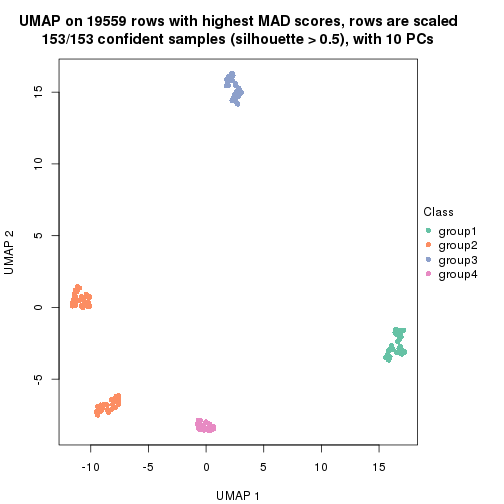</p>

</div>
<div id='tab-MAD-NMF-dimension-reduction-4'>
<pre><code class="r">dimension_reduction(res, k = 5, method = &quot;UMAP&quot;)
</code></pre>

<p></p>

</div>
<div id='tab-MAD-NMF-dimension-reduction-5'>
<pre><code class="r">dimension_reduction(res, k = 6, method = &quot;UMAP&quot;)
</code></pre>

<p></p>

</div>
</div>


Following heatmap shows how subgroups are split when increasing `k`:

```r
collect_classes(res)
```


Test correlation between subgroups and known annotations. If the known
annotation is numeric, one-way ANOVA test is applied, and if the known
annotation is discrete, chi-squared contingency table test is applied.

```r
test_to_known_factors(res)
```

```
#>           n individual(p) disease.state(p) cell.type(p) k
#> MAD:NMF 153             1            1.000     4.63e-32 2
#> MAD:NMF 151             1            0.984     1.55e-60 3
#> MAD:NMF 153             1            0.964     1.16e-90 4
#> MAD:NMF 153             1            0.989    6.51e-120 5
#> MAD:NMF 153             1            0.989    6.51e-120 6
```


If matrix rows can be associated to genes, consider to use `functional_enrichment(res,
...)` to perform function enrichment for the signature genes. See [this vignette](http://bioconductor.org/packages/devel/bioc/vignettes/cola/inst/doc/functional_enrichment.html) for more detailed explanations.


 

---------------------------------------------------


### ATC:hclust**


The object with results only for a single top-value method and a single partition method 
can be extracted as:

```r
res = res_list["ATC", "hclust"]
# you can also extract it by
# res = res_list["ATC:hclust"]
```

A summary of `res` and all the functions that can be applied to it:

```r
res
```

```
#> A 'ConsensusPartition' object with k = 2, 3, 4, 5, 6.
#>   On a matrix with 19559 rows and 153 columns.
#>   Top rows (1000, 2000, 3000, 4000, 5000) are extracted by 'ATC' method.
#>   Subgroups are detected by 'hclust' method.
#>   Performed in total 1250 partitions by row resampling.
#>   Best k for subgroups seems to be 3.
#> 
#> Following methods can be applied to this 'ConsensusPartition' object:
#>  [1] "cola_report"             "collect_classes"         "collect_plots"          
#>  [4] "collect_stats"           "colnames"                "compare_signatures"     
#>  [7] "consensus_heatmap"       "dimension_reduction"     "functional_enrichment"  
#> [10] "get_anno_col"            "get_anno"                "get_classes"            
#> [13] "get_consensus"           "get_matrix"              "get_membership"         
#> [16] "get_param"               "get_signatures"          "get_stats"              
#> [19] "is_best_k"               "is_stable_k"             "membership_heatmap"     
#> [22] "ncol"                    "nrow"                    "plot_ecdf"              
#> [25] "rownames"                "select_partition_number" "show"                   
#> [28] "suggest_best_k"          "test_to_known_factors"
```

`collect_plots()` function collects all the plots made from `res` for all `k` (number of partitions)
into one single page to provide an easy and fast comparison between different `k`.

```r
collect_plots(res)
```


The plots are:

- The first row: a plot of the ECDF (empirical cumulative distribution
  function) curves of the consensus matrix for each `k` and the heatmap of
  predicted classes for each `k`.
- The second row: heatmaps of the consensus matrix for each `k`.
- The third row: heatmaps of the membership matrix for each `k`.
- The fouth row: heatmaps of the signatures for each `k`.

All the plots in panels can be made by individual functions and they are
plotted later in this section.

`select_partition_number()` produces several plots showing different
statistics for choosing "optimized" `k`. There are following statistics:

- ECDF curves of the consensus matrix for each `k`;
- 1-PAC. [The PAC
  score](https://en.wikipedia.org/wiki/Consensus_clustering#Over-interpretation_potential_of_consensus_clustering)
  measures the proportion of the ambiguous subgrouping.
- Mean silhouette score.
- Concordance. The mean probability of fiting the consensus class ids in all
  partitions.
- Area increased. Denote $A_k$ as the area under the ECDF curve for current
  `k`, the area increased is defined as $A_k - A_{k-1}$.
- Rand index. The percent of pairs of samples that are both in a same cluster
  or both are not in a same cluster in the partition of k and k-1.
- Jaccard index. The ratio of pairs of samples are both in a same cluster in
  the partition of k and k-1 and the pairs of samples are both in a same
  cluster in the partition k or k-1.

The detailed explanations of these statistics can be found in [the _cola_
vignette](http://bioconductor.org/packages/devel/bioc/vignettes/cola/inst/doc/cola.html#toc_13).

Generally speaking, lower PAC score, higher mean silhouette score or higher
concordance corresponds to better partition. Rand index and Jaccard index
measure how similar the current partition is compared to partition with `k-1`.
If they are too similar, we won't accept `k` is better than `k-1`.

```r
select_partition_number(res)
```


The numeric values for all these statistics can be obtained by `get_stats()`.

```r
get_stats(res)
```

```
#>   k 1-PAC mean_silhouette concordance area_increased  Rand Jaccard
#> 2 2 1.000           1.000       1.000         0.3259 0.675   0.675
#> 3 3 1.000           0.997       0.999         0.9719 0.683   0.530
#> 4 4 1.000           0.997       0.999         0.0157 0.989   0.969
#> 5 5 0.821           0.909       0.891         0.1144 0.909   0.739
#> 6 6 0.847           0.959       0.903         0.0599 0.939   0.760
```

`suggest_best_k()` suggests the best $k$ based on these statistics. The rules are as follows:

- All $k$ with Jaccard index larger than 0.95 are removed because increasing
  $k$ does not provide enough extra information. If all $k$ are removed, it is
  marked as no subgroup is detected.
- For all $k$ with 1-PAC score larger than 0.9, the maximal $k$ is taken as
  the best $k$, and other $k$ are marked as optional $k$.
- If it does not fit the second rule. The $k$ with the maximal vote of the
  highest 1-PAC score, highest mean silhouette, and highest concordance is
  taken as the best $k$.

```r
suggest_best_k(res)
```

```
#> [1] 3
#> attr(,"optional")
#> [1] 2
```

There is also optional best $k$ = 2 that is worth to check.

Following shows the table of the partitions (You need to click the **show/hide
code output** link to see it). The membership matrix (columns with name `p*`)
is inferred by
[`clue::cl_consensus()`](https://www.rdocumentation.org/link/cl_consensus?package=clue)
function with the `SE` method. Basically the value in the membership matrix
represents the probability to belong to a certain group. The finall class
label for an item is determined with the group with highest probability it
belongs to.

In `get_classes()` function, the entropy is calculated from the membership
matrix and the silhouette score is calculated from the consensus matrix.


<script>
$( function() {
	$( '#tabs-ATC-hclust-get-classes' ).tabs();
} );
</script>
<div id='tabs-ATC-hclust-get-classes'>
<ul>
<li><a href='#tab-ATC-hclust-get-classes-1'>k = 2</a></li>
<li><a href='#tab-ATC-hclust-get-classes-2'>k = 3</a></li>
<li><a href='#tab-ATC-hclust-get-classes-3'>k = 4</a></li>
<li><a href='#tab-ATC-hclust-get-classes-4'>k = 5</a></li>
<li><a href='#tab-ATC-hclust-get-classes-5'>k = 6</a></li>
</ul>

<div id='tab-ATC-hclust-get-classes-1'>
<p><a id='tab-ATC-hclust-get-classes-1-a' style='color:#0366d6' href='#'>show/hide code output</a></p>
<pre><code class="r">cbind(get_classes(res, k = 2), get_membership(res, k = 2))
</code></pre>

<pre><code>#&gt;           class entropy silhouette p1 p2
#&gt; GSM247795     1       0          1  1  0
#&gt; GSM247854     1       0          1  1  0
#&gt; GSM247758     1       0          1  1  0
#&gt; GSM247742     1       0          1  1  0
#&gt; GSM247755     2       0          1  0  1
#&gt; GSM247841     1       0          1  1  0
#&gt; GSM247703     1       0          1  1  0
#&gt; GSM247739     1       0          1  1  0
#&gt; GSM247715     1       0          1  1  0
#&gt; GSM247829     2       0          1  0  1
#&gt; GSM247842     1       0          1  1  0
#&gt; GSM247805     1       0          1  1  0
#&gt; GSM247786     1       0          1  1  0
#&gt; GSM247812     2       0          1  0  1
#&gt; GSM247776     1       0          1  1  0
#&gt; GSM247850     1       0          1  1  0
#&gt; GSM247717     1       0          1  1  0
#&gt; GSM247784     1       0          1  1  0
#&gt; GSM247834     1       0          1  1  0
#&gt; GSM247783     2       0          1  0  1
#&gt; GSM247846     1       0          1  1  0
#&gt; GSM247822     1       0          1  1  0
#&gt; GSM247710     1       0          1  1  0
#&gt; GSM247713     1       0          1  1  0
#&gt; GSM247840     2       0          1  0  1
#&gt; GSM247733     1       0          1  1  0
#&gt; GSM247852     1       0          1  1  0
#&gt; GSM247790     1       0          1  1  0
#&gt; GSM247730     1       0          1  1  0
#&gt; GSM247824     2       0          1  0  1
#&gt; GSM247770     1       0          1  1  0
#&gt; GSM247711     1       0          1  1  0
#&gt; GSM247782     1       0          1  1  0
#&gt; GSM247836     1       0          1  1  0
#&gt; GSM247785     2       0          1  0  1
#&gt; GSM247847     1       0          1  1  0
#&gt; GSM247750     1       0          1  1  0
#&gt; GSM247788     1       0          1  1  0
#&gt; GSM247849     1       0          1  1  0
#&gt; GSM247772     2       0          1  0  1
#&gt; GSM247760     1       0          1  1  0
#&gt; GSM247764     1       0          1  1  0
#&gt; GSM247851     1       0          1  1  0
#&gt; GSM247714     1       0          1  1  0
#&gt; GSM247828     1       0          1  1  0
#&gt; GSM247704     2       0          1  0  1
#&gt; GSM247818     1       0          1  1  0
#&gt; GSM247823     1       0          1  1  0
#&gt; GSM247706     1       0          1  1  0
#&gt; GSM247835     2       0          1  0  1
#&gt; GSM247734     1       0          1  1  0
#&gt; GSM247819     1       0          1  1  0
#&gt; GSM247809     1       0          1  1  0
#&gt; GSM247830     2       0          1  0  1
#&gt; GSM247833     1       0          1  1  0
#&gt; GSM247738     1       0          1  1  0
#&gt; GSM247716     1       0          1  1  0
#&gt; GSM247747     2       0          1  0  1
#&gt; GSM247722     1       0          1  1  0
#&gt; GSM247816     1       0          1  1  0
#&gt; GSM247839     1       0          1  1  0
#&gt; GSM247821     1       0          1  1  0
#&gt; GSM247798     2       0          1  0  1
#&gt; GSM247838     1       0          1  1  0
#&gt; GSM247721     1       0          1  1  0
#&gt; GSM247781     1       0          1  1  0
#&gt; GSM247762     1       0          1  1  0
#&gt; GSM247825     2       0          1  0  1
#&gt; GSM247777     1       0          1  1  0
#&gt; GSM247761     1       0          1  1  0
#&gt; GSM247720     1       0          1  1  0
#&gt; GSM247814     2       0          1  0  1
#&gt; GSM247732     1       0          1  1  0
#&gt; GSM247708     1       0          1  1  0
#&gt; GSM247740     1       0          1  1  0
#&gt; GSM247749     1       0          1  1  0
#&gt; GSM247767     2       0          1  0  1
#&gt; GSM247748     1       0          1  1  0
#&gt; GSM247705     1       0          1  1  0
#&gt; GSM247746     1       0          1  1  0
#&gt; GSM247752     1       0          1  1  0
#&gt; GSM247769     2       0          1  0  1
#&gt; GSM247753     1       0          1  1  0
#&gt; GSM247723     1       0          1  1  0
#&gt; GSM247779     1       0          1  1  0
#&gt; GSM247756     1       0          1  1  0
#&gt; GSM247826     2       0          1  0  1
#&gt; GSM247775     1       0          1  1  0
#&gt; GSM247741     1       0          1  1  0
#&gt; GSM247799     1       0          1  1  0
#&gt; GSM247778     1       0          1  1  0
#&gt; GSM247806     2       0          1  0  1
#&gt; GSM247815     1       0          1  1  0
#&gt; GSM247735     1       0          1  1  0
#&gt; GSM247831     1       0          1  1  0
#&gt; GSM247845     1       0          1  1  0
#&gt; GSM247791     2       0          1  0  1
#&gt; GSM247780     1       0          1  1  0
#&gt; GSM247853     1       0          1  1  0
#&gt; GSM247800     1       0          1  1  0
#&gt; GSM247729     1       0          1  1  0
#&gt; GSM247810     1       0          1  1  0
#&gt; GSM247844     2       0          1  0  1
#&gt; GSM247793     1       0          1  1  0
#&gt; GSM247759     1       0          1  1  0
#&gt; GSM247724     1       0          1  1  0
#&gt; GSM247817     2       0          1  0  1
#&gt; GSM247727     1       0          1  1  0
#&gt; GSM247796     1       0          1  1  0
#&gt; GSM247725     1       0          1  1  0
#&gt; GSM247801     1       0          1  1  0
#&gt; GSM247731     2       0          1  0  1
#&gt; GSM247765     1       0          1  1  0
#&gt; GSM247792     1       0          1  1  0
#&gt; GSM247726     1       0          1  1  0
#&gt; GSM247803     1       0          1  1  0
#&gt; GSM247728     2       0          1  0  1
#&gt; GSM247768     1       0          1  1  0
#&gt; GSM247745     1       0          1  1  0
#&gt; GSM247855     1       0          1  1  0
#&gt; GSM247804     1       0          1  1  0
#&gt; GSM247774     1       0          1  1  0
#&gt; GSM247807     2       0          1  0  1
#&gt; GSM247813     1       0          1  1  0
#&gt; GSM247736     1       0          1  1  0
#&gt; GSM247712     1       0          1  1  0
#&gt; GSM247797     1       0          1  1  0
#&gt; GSM247743     2       0          1  0  1
#&gt; GSM247719     1       0          1  1  0
#&gt; GSM247707     1       0          1  1  0
#&gt; GSM247737     1       0          1  1  0
#&gt; GSM247827     2       0          1  0  1
#&gt; GSM247848     1       0          1  1  0
#&gt; GSM247794     1       0          1  1  0
#&gt; GSM247757     1       0          1  1  0
#&gt; GSM247744     1       0          1  1  0
#&gt; GSM247751     2       0          1  0  1
#&gt; GSM247837     1       0          1  1  0
#&gt; GSM247754     1       0          1  1  0
#&gt; GSM247789     1       0          1  1  0
#&gt; GSM247802     1       0          1  1  0
#&gt; GSM247771     2       0          1  0  1
#&gt; GSM247763     1       0          1  1  0
#&gt; GSM247808     1       0          1  1  0
#&gt; GSM247787     1       0          1  1  0
#&gt; GSM247843     1       0          1  1  0
#&gt; GSM247811     2       0          1  0  1
#&gt; GSM247773     1       0          1  1  0
#&gt; GSM247766     1       0          1  1  0
#&gt; GSM247718     1       0          1  1  0
#&gt; GSM247832     1       0          1  1  0
#&gt; GSM247709     2       0          1  0  1
#&gt; GSM247820     1       0          1  1  0
</code></pre>

<script>
$('#tab-ATC-hclust-get-classes-1-a').parent().next().next().hide();
$('#tab-ATC-hclust-get-classes-1-a').click(function(){
  $('#tab-ATC-hclust-get-classes-1-a').parent().next().next().toggle();
  return(false);
});
</script>
</div>

<div id='tab-ATC-hclust-get-classes-2'>
<p><a id='tab-ATC-hclust-get-classes-2-a' style='color:#0366d6' href='#'>show/hide code output</a></p>
<pre><code class="r">cbind(get_classes(res, k = 3), get_membership(res, k = 3))
</code></pre>

<pre><code>#&gt;           class entropy silhouette    p1    p2 p3
#&gt; GSM247795     2   0.000      0.997 0.000 1.000  0
#&gt; GSM247854     2   0.000      0.997 0.000 1.000  0
#&gt; GSM247758     2   0.000      0.997 0.000 1.000  0
#&gt; GSM247742     1   0.000      1.000 1.000 0.000  0
#&gt; GSM247755     3   0.000      1.000 0.000 0.000  1
#&gt; GSM247841     1   0.000      1.000 1.000 0.000  0
#&gt; GSM247703     2   0.000      0.997 0.000 1.000  0
#&gt; GSM247739     2   0.000      0.997 0.000 1.000  0
#&gt; GSM247715     1   0.000      1.000 1.000 0.000  0
#&gt; GSM247829     3   0.000      1.000 0.000 0.000  1
#&gt; GSM247842     1   0.000      1.000 1.000 0.000  0
#&gt; GSM247805     2   0.000      0.997 0.000 1.000  0
#&gt; GSM247786     2   0.000      0.997 0.000 1.000  0
#&gt; GSM247812     3   0.000      1.000 0.000 0.000  1
#&gt; GSM247776     1   0.000      1.000 1.000 0.000  0
#&gt; GSM247850     1   0.000      1.000 1.000 0.000  0
#&gt; GSM247717     2   0.000      0.997 0.000 1.000  0
#&gt; GSM247784     2   0.000      0.997 0.000 1.000  0
#&gt; GSM247834     1   0.000      1.000 1.000 0.000  0
#&gt; GSM247783     3   0.000      1.000 0.000 0.000  1
#&gt; GSM247846     1   0.000      1.000 1.000 0.000  0
#&gt; GSM247822     2   0.000      0.997 0.000 1.000  0
#&gt; GSM247710     2   0.000      0.997 0.000 1.000  0
#&gt; GSM247713     1   0.000      1.000 1.000 0.000  0
#&gt; GSM247840     3   0.000      1.000 0.000 0.000  1
#&gt; GSM247733     1   0.000      1.000 1.000 0.000  0
#&gt; GSM247852     1   0.000      1.000 1.000 0.000  0
#&gt; GSM247790     2   0.000      0.997 0.000 1.000  0
#&gt; GSM247730     2   0.000      0.997 0.000 1.000  0
#&gt; GSM247824     3   0.000      1.000 0.000 0.000  1
#&gt; GSM247770     1   0.000      1.000 1.000 0.000  0
#&gt; GSM247711     2   0.000      0.997 0.000 1.000  0
#&gt; GSM247782     2   0.000      0.997 0.000 1.000  0
#&gt; GSM247836     1   0.000      1.000 1.000 0.000  0
#&gt; GSM247785     3   0.000      1.000 0.000 0.000  1
#&gt; GSM247847     1   0.000      1.000 1.000 0.000  0
#&gt; GSM247750     2   0.000      0.997 0.000 1.000  0
#&gt; GSM247788     2   0.000      0.997 0.000 1.000  0
#&gt; GSM247849     1   0.000      1.000 1.000 0.000  0
#&gt; GSM247772     3   0.000      1.000 0.000 0.000  1
#&gt; GSM247760     1   0.000      1.000 1.000 0.000  0
#&gt; GSM247764     2   0.000      0.997 0.000 1.000  0
#&gt; GSM247851     2   0.000      0.997 0.000 1.000  0
#&gt; GSM247714     2   0.000      0.997 0.000 1.000  0
#&gt; GSM247828     1   0.000      1.000 1.000 0.000  0
#&gt; GSM247704     3   0.000      1.000 0.000 0.000  1
#&gt; GSM247818     1   0.000      1.000 1.000 0.000  0
#&gt; GSM247823     2   0.000      0.997 0.000 1.000  0
#&gt; GSM247706     2   0.000      0.997 0.000 1.000  0
#&gt; GSM247835     3   0.000      1.000 0.000 0.000  1
#&gt; GSM247734     1   0.000      1.000 1.000 0.000  0
#&gt; GSM247819     2   0.000      0.997 0.000 1.000  0
#&gt; GSM247809     2   0.000      0.997 0.000 1.000  0
#&gt; GSM247830     3   0.000      1.000 0.000 0.000  1
#&gt; GSM247833     1   0.000      1.000 1.000 0.000  0
#&gt; GSM247738     2   0.000      0.997 0.000 1.000  0
#&gt; GSM247716     2   0.000      0.997 0.000 1.000  0
#&gt; GSM247747     3   0.000      1.000 0.000 0.000  1
#&gt; GSM247722     1   0.000      1.000 1.000 0.000  0
#&gt; GSM247816     2   0.000      0.997 0.000 1.000  0
#&gt; GSM247839     2   0.000      0.997 0.000 1.000  0
#&gt; GSM247821     1   0.000      1.000 1.000 0.000  0
#&gt; GSM247798     3   0.000      1.000 0.000 0.000  1
#&gt; GSM247838     1   0.000      1.000 1.000 0.000  0
#&gt; GSM247721     2   0.000      0.997 0.000 1.000  0
#&gt; GSM247781     2   0.000      0.997 0.000 1.000  0
#&gt; GSM247762     1   0.000      1.000 1.000 0.000  0
#&gt; GSM247825     3   0.000      1.000 0.000 0.000  1
#&gt; GSM247777     1   0.000      1.000 1.000 0.000  0
#&gt; GSM247761     2   0.000      0.997 0.000 1.000  0
#&gt; GSM247720     2   0.000      0.997 0.000 1.000  0
#&gt; GSM247814     3   0.000      1.000 0.000 0.000  1
#&gt; GSM247732     1   0.000      1.000 1.000 0.000  0
#&gt; GSM247708     2   0.000      0.997 0.000 1.000  0
#&gt; GSM247740     2   0.000      0.997 0.000 1.000  0
#&gt; GSM247749     1   0.000      1.000 1.000 0.000  0
#&gt; GSM247767     3   0.000      1.000 0.000 0.000  1
#&gt; GSM247748     1   0.000      1.000 1.000 0.000  0
#&gt; GSM247705     2   0.000      0.997 0.000 1.000  0
#&gt; GSM247746     2   0.000      0.997 0.000 1.000  0
#&gt; GSM247752     2   0.445      0.759 0.192 0.808  0
#&gt; GSM247769     3   0.000      1.000 0.000 0.000  1
#&gt; GSM247753     1   0.000      1.000 1.000 0.000  0
#&gt; GSM247723     2   0.000      0.997 0.000 1.000  0
#&gt; GSM247779     2   0.000      0.997 0.000 1.000  0
#&gt; GSM247756     1   0.000      1.000 1.000 0.000  0
#&gt; GSM247826     3   0.000      1.000 0.000 0.000  1
#&gt; GSM247775     1   0.000      1.000 1.000 0.000  0
#&gt; GSM247741     2   0.000      0.997 0.000 1.000  0
#&gt; GSM247799     2   0.000      0.997 0.000 1.000  0
#&gt; GSM247778     1   0.000      1.000 1.000 0.000  0
#&gt; GSM247806     3   0.000      1.000 0.000 0.000  1
#&gt; GSM247815     1   0.000      1.000 1.000 0.000  0
#&gt; GSM247735     2   0.000      0.997 0.000 1.000  0
#&gt; GSM247831     2   0.000      0.997 0.000 1.000  0
#&gt; GSM247845     1   0.000      1.000 1.000 0.000  0
#&gt; GSM247791     3   0.000      1.000 0.000 0.000  1
#&gt; GSM247780     1   0.000      1.000 1.000 0.000  0
#&gt; GSM247853     1   0.000      1.000 1.000 0.000  0
#&gt; GSM247800     2   0.000      0.997 0.000 1.000  0
#&gt; GSM247729     2   0.000      0.997 0.000 1.000  0
#&gt; GSM247810     1   0.000      1.000 1.000 0.000  0
#&gt; GSM247844     3   0.000      1.000 0.000 0.000  1
#&gt; GSM247793     1   0.000      1.000 1.000 0.000  0
#&gt; GSM247759     2   0.000      0.997 0.000 1.000  0
#&gt; GSM247724     2   0.000      0.997 0.000 1.000  0
#&gt; GSM247817     3   0.000      1.000 0.000 0.000  1
#&gt; GSM247727     1   0.000      1.000 1.000 0.000  0
#&gt; GSM247796     2   0.000      0.997 0.000 1.000  0
#&gt; GSM247725     2   0.000      0.997 0.000 1.000  0
#&gt; GSM247801     1   0.000      1.000 1.000 0.000  0
#&gt; GSM247731     3   0.000      1.000 0.000 0.000  1
#&gt; GSM247765     1   0.000      1.000 1.000 0.000  0
#&gt; GSM247792     2   0.000      0.997 0.000 1.000  0
#&gt; GSM247726     2   0.000      0.997 0.000 1.000  0
#&gt; GSM247803     2   0.000      0.997 0.000 1.000  0
#&gt; GSM247728     3   0.000      1.000 0.000 0.000  1
#&gt; GSM247768     1   0.000      1.000 1.000 0.000  0
#&gt; GSM247745     2   0.000      0.997 0.000 1.000  0
#&gt; GSM247855     2   0.000      0.997 0.000 1.000  0
#&gt; GSM247804     2   0.000      0.997 0.000 1.000  0
#&gt; GSM247774     1   0.000      1.000 1.000 0.000  0
#&gt; GSM247807     3   0.000      1.000 0.000 0.000  1
#&gt; GSM247813     1   0.000      1.000 1.000 0.000  0
#&gt; GSM247736     2   0.000      0.997 0.000 1.000  0
#&gt; GSM247712     2   0.000      0.997 0.000 1.000  0
#&gt; GSM247797     1   0.000      1.000 1.000 0.000  0
#&gt; GSM247743     3   0.000      1.000 0.000 0.000  1
#&gt; GSM247719     1   0.000      1.000 1.000 0.000  0
#&gt; GSM247707     2   0.000      0.997 0.000 1.000  0
#&gt; GSM247737     2   0.000      0.997 0.000 1.000  0
#&gt; GSM247827     3   0.000      1.000 0.000 0.000  1
#&gt; GSM247848     1   0.000      1.000 1.000 0.000  0
#&gt; GSM247794     2   0.000      0.997 0.000 1.000  0
#&gt; GSM247757     2   0.000      0.997 0.000 1.000  0
#&gt; GSM247744     1   0.000      1.000 1.000 0.000  0
#&gt; GSM247751     3   0.000      1.000 0.000 0.000  1
#&gt; GSM247837     1   0.000      1.000 1.000 0.000  0
#&gt; GSM247754     2   0.000      0.997 0.000 1.000  0
#&gt; GSM247789     2   0.000      0.997 0.000 1.000  0
#&gt; GSM247802     1   0.000      1.000 1.000 0.000  0
#&gt; GSM247771     3   0.000      1.000 0.000 0.000  1
#&gt; GSM247763     1   0.000      1.000 1.000 0.000  0
#&gt; GSM247808     2   0.000      0.997 0.000 1.000  0
#&gt; GSM247787     2   0.000      0.997 0.000 1.000  0
#&gt; GSM247843     1   0.000      1.000 1.000 0.000  0
#&gt; GSM247811     3   0.000      1.000 0.000 0.000  1
#&gt; GSM247773     1   0.000      1.000 1.000 0.000  0
#&gt; GSM247766     2   0.000      0.997 0.000 1.000  0
#&gt; GSM247718     2   0.000      0.997 0.000 1.000  0
#&gt; GSM247832     1   0.000      1.000 1.000 0.000  0
#&gt; GSM247709     3   0.000      1.000 0.000 0.000  1
#&gt; GSM247820     1   0.000      1.000 1.000 0.000  0
</code></pre>

<script>
$('#tab-ATC-hclust-get-classes-2-a').parent().next().next().hide();
$('#tab-ATC-hclust-get-classes-2-a').click(function(){
  $('#tab-ATC-hclust-get-classes-2-a').parent().next().next().toggle();
  return(false);
});
</script>
</div>

<div id='tab-ATC-hclust-get-classes-3'>
<p><a id='tab-ATC-hclust-get-classes-3-a' style='color:#0366d6' href='#'>show/hide code output</a></p>
<pre><code class="r">cbind(get_classes(res, k = 4), get_membership(res, k = 4))
</code></pre>

<pre><code>#&gt;           class entropy silhouette    p1 p2 p3    p4
#&gt; GSM247795     2   0.000      1.000 0.000  1  0 0.000
#&gt; GSM247854     2   0.000      1.000 0.000  1  0 0.000
#&gt; GSM247758     2   0.000      1.000 0.000  1  0 0.000
#&gt; GSM247742     1   0.000      1.000 1.000  0  0 0.000
#&gt; GSM247755     3   0.000      1.000 0.000  0  1 0.000
#&gt; GSM247841     1   0.000      1.000 1.000  0  0 0.000
#&gt; GSM247703     2   0.000      1.000 0.000  1  0 0.000
#&gt; GSM247739     2   0.000      1.000 0.000  1  0 0.000
#&gt; GSM247715     1   0.000      1.000 1.000  0  0 0.000
#&gt; GSM247829     3   0.000      1.000 0.000  0  1 0.000
#&gt; GSM247842     1   0.000      1.000 1.000  0  0 0.000
#&gt; GSM247805     2   0.000      1.000 0.000  1  0 0.000
#&gt; GSM247786     2   0.000      1.000 0.000  1  0 0.000
#&gt; GSM247812     3   0.000      1.000 0.000  0  1 0.000
#&gt; GSM247776     1   0.000      1.000 1.000  0  0 0.000
#&gt; GSM247850     1   0.000      1.000 1.000  0  0 0.000
#&gt; GSM247717     2   0.000      1.000 0.000  1  0 0.000
#&gt; GSM247784     2   0.000      1.000 0.000  1  0 0.000
#&gt; GSM247834     1   0.000      1.000 1.000  0  0 0.000
#&gt; GSM247783     3   0.000      1.000 0.000  0  1 0.000
#&gt; GSM247846     1   0.000      1.000 1.000  0  0 0.000
#&gt; GSM247822     2   0.000      1.000 0.000  1  0 0.000
#&gt; GSM247710     2   0.000      1.000 0.000  1  0 0.000
#&gt; GSM247713     1   0.000      1.000 1.000  0  0 0.000
#&gt; GSM247840     3   0.000      1.000 0.000  0  1 0.000
#&gt; GSM247733     1   0.000      1.000 1.000  0  0 0.000
#&gt; GSM247852     1   0.000      1.000 1.000  0  0 0.000
#&gt; GSM247790     2   0.000      1.000 0.000  1  0 0.000
#&gt; GSM247730     2   0.000      1.000 0.000  1  0 0.000
#&gt; GSM247824     3   0.000      1.000 0.000  0  1 0.000
#&gt; GSM247770     1   0.000      1.000 1.000  0  0 0.000
#&gt; GSM247711     2   0.000      1.000 0.000  1  0 0.000
#&gt; GSM247782     2   0.000      1.000 0.000  1  0 0.000
#&gt; GSM247836     1   0.000      1.000 1.000  0  0 0.000
#&gt; GSM247785     3   0.000      1.000 0.000  0  1 0.000
#&gt; GSM247847     1   0.000      1.000 1.000  0  0 0.000
#&gt; GSM247750     2   0.000      1.000 0.000  1  0 0.000
#&gt; GSM247788     2   0.000      1.000 0.000  1  0 0.000
#&gt; GSM247849     1   0.000      1.000 1.000  0  0 0.000
#&gt; GSM247772     3   0.000      1.000 0.000  0  1 0.000
#&gt; GSM247760     1   0.000      1.000 1.000  0  0 0.000
#&gt; GSM247764     2   0.000      1.000 0.000  1  0 0.000
#&gt; GSM247851     2   0.000      1.000 0.000  1  0 0.000
#&gt; GSM247714     2   0.000      1.000 0.000  1  0 0.000
#&gt; GSM247828     1   0.000      1.000 1.000  0  0 0.000
#&gt; GSM247704     3   0.000      1.000 0.000  0  1 0.000
#&gt; GSM247818     1   0.000      1.000 1.000  0  0 0.000
#&gt; GSM247823     2   0.000      1.000 0.000  1  0 0.000
#&gt; GSM247706     2   0.000      1.000 0.000  1  0 0.000
#&gt; GSM247835     3   0.000      1.000 0.000  0  1 0.000
#&gt; GSM247734     1   0.000      1.000 1.000  0  0 0.000
#&gt; GSM247819     2   0.000      1.000 0.000  1  0 0.000
#&gt; GSM247809     2   0.000      1.000 0.000  1  0 0.000
#&gt; GSM247830     3   0.000      1.000 0.000  0  1 0.000
#&gt; GSM247833     1   0.000      1.000 1.000  0  0 0.000
#&gt; GSM247738     2   0.000      1.000 0.000  1  0 0.000
#&gt; GSM247716     2   0.000      1.000 0.000  1  0 0.000
#&gt; GSM247747     3   0.000      1.000 0.000  0  1 0.000
#&gt; GSM247722     1   0.000      1.000 1.000  0  0 0.000
#&gt; GSM247816     2   0.000      1.000 0.000  1  0 0.000
#&gt; GSM247839     2   0.000      1.000 0.000  1  0 0.000
#&gt; GSM247821     1   0.000      1.000 1.000  0  0 0.000
#&gt; GSM247798     3   0.000      1.000 0.000  0  1 0.000
#&gt; GSM247838     1   0.000      1.000 1.000  0  0 0.000
#&gt; GSM247721     2   0.000      1.000 0.000  1  0 0.000
#&gt; GSM247781     2   0.000      1.000 0.000  1  0 0.000
#&gt; GSM247762     1   0.000      1.000 1.000  0  0 0.000
#&gt; GSM247825     3   0.000      1.000 0.000  0  1 0.000
#&gt; GSM247777     1   0.000      1.000 1.000  0  0 0.000
#&gt; GSM247761     2   0.000      1.000 0.000  1  0 0.000
#&gt; GSM247720     2   0.000      1.000 0.000  1  0 0.000
#&gt; GSM247814     3   0.000      1.000 0.000  0  1 0.000
#&gt; GSM247732     1   0.000      1.000 1.000  0  0 0.000
#&gt; GSM247708     2   0.000      1.000 0.000  1  0 0.000
#&gt; GSM247740     2   0.000      1.000 0.000  1  0 0.000
#&gt; GSM247749     1   0.000      1.000 1.000  0  0 0.000
#&gt; GSM247767     3   0.000      1.000 0.000  0  1 0.000
#&gt; GSM247748     1   0.000      1.000 1.000  0  0 0.000
#&gt; GSM247705     2   0.000      1.000 0.000  1  0 0.000
#&gt; GSM247746     2   0.000      1.000 0.000  1  0 0.000
#&gt; GSM247752     4   0.353      0.754 0.192  0  0 0.808
#&gt; GSM247769     3   0.000      1.000 0.000  0  1 0.000
#&gt; GSM247753     1   0.000      1.000 1.000  0  0 0.000
#&gt; GSM247723     2   0.000      1.000 0.000  1  0 0.000
#&gt; GSM247779     2   0.000      1.000 0.000  1  0 0.000
#&gt; GSM247756     1   0.000      1.000 1.000  0  0 0.000
#&gt; GSM247826     3   0.000      1.000 0.000  0  1 0.000
#&gt; GSM247775     1   0.000      1.000 1.000  0  0 0.000
#&gt; GSM247741     2   0.000      1.000 0.000  1  0 0.000
#&gt; GSM247799     2   0.000      1.000 0.000  1  0 0.000
#&gt; GSM247778     1   0.000      1.000 1.000  0  0 0.000
#&gt; GSM247806     3   0.000      1.000 0.000  0  1 0.000
#&gt; GSM247815     1   0.000      1.000 1.000  0  0 0.000
#&gt; GSM247735     2   0.000      1.000 0.000  1  0 0.000
#&gt; GSM247831     2   0.000      1.000 0.000  1  0 0.000
#&gt; GSM247845     1   0.000      1.000 1.000  0  0 0.000
#&gt; GSM247791     3   0.000      1.000 0.000  0  1 0.000
#&gt; GSM247780     1   0.000      1.000 1.000  0  0 0.000
#&gt; GSM247853     1   0.000      1.000 1.000  0  0 0.000
#&gt; GSM247800     2   0.000      1.000 0.000  1  0 0.000
#&gt; GSM247729     2   0.000      1.000 0.000  1  0 0.000
#&gt; GSM247810     1   0.000      1.000 1.000  0  0 0.000
#&gt; GSM247844     3   0.000      1.000 0.000  0  1 0.000
#&gt; GSM247793     1   0.000      1.000 1.000  0  0 0.000
#&gt; GSM247759     2   0.000      1.000 0.000  1  0 0.000
#&gt; GSM247724     2   0.000      1.000 0.000  1  0 0.000
#&gt; GSM247817     3   0.000      1.000 0.000  0  1 0.000
#&gt; GSM247727     1   0.000      1.000 1.000  0  0 0.000
#&gt; GSM247796     2   0.000      1.000 0.000  1  0 0.000
#&gt; GSM247725     2   0.000      1.000 0.000  1  0 0.000
#&gt; GSM247801     1   0.000      1.000 1.000  0  0 0.000
#&gt; GSM247731     3   0.000      1.000 0.000  0  1 0.000
#&gt; GSM247765     1   0.000      1.000 1.000  0  0 0.000
#&gt; GSM247792     2   0.000      1.000 0.000  1  0 0.000
#&gt; GSM247726     2   0.000      1.000 0.000  1  0 0.000
#&gt; GSM247803     4   0.000      0.746 0.000  0  0 1.000
#&gt; GSM247728     3   0.000      1.000 0.000  0  1 0.000
#&gt; GSM247768     1   0.000      1.000 1.000  0  0 0.000
#&gt; GSM247745     2   0.000      1.000 0.000  1  0 0.000
#&gt; GSM247855     2   0.000      1.000 0.000  1  0 0.000
#&gt; GSM247804     2   0.000      1.000 0.000  1  0 0.000
#&gt; GSM247774     1   0.000      1.000 1.000  0  0 0.000
#&gt; GSM247807     3   0.000      1.000 0.000  0  1 0.000
#&gt; GSM247813     1   0.000      1.000 1.000  0  0 0.000
#&gt; GSM247736     2   0.000      1.000 0.000  1  0 0.000
#&gt; GSM247712     2   0.000      1.000 0.000  1  0 0.000
#&gt; GSM247797     1   0.000      1.000 1.000  0  0 0.000
#&gt; GSM247743     3   0.000      1.000 0.000  0  1 0.000
#&gt; GSM247719     1   0.000      1.000 1.000  0  0 0.000
#&gt; GSM247707     2   0.000      1.000 0.000  1  0 0.000
#&gt; GSM247737     2   0.000      1.000 0.000  1  0 0.000
#&gt; GSM247827     3   0.000      1.000 0.000  0  1 0.000
#&gt; GSM247848     1   0.000      1.000 1.000  0  0 0.000
#&gt; GSM247794     2   0.000      1.000 0.000  1  0 0.000
#&gt; GSM247757     2   0.000      1.000 0.000  1  0 0.000
#&gt; GSM247744     1   0.000      1.000 1.000  0  0 0.000
#&gt; GSM247751     3   0.000      1.000 0.000  0  1 0.000
#&gt; GSM247837     1   0.000      1.000 1.000  0  0 0.000
#&gt; GSM247754     2   0.000      1.000 0.000  1  0 0.000
#&gt; GSM247789     2   0.000      1.000 0.000  1  0 0.000
#&gt; GSM247802     1   0.000      1.000 1.000  0  0 0.000
#&gt; GSM247771     3   0.000      1.000 0.000  0  1 0.000
#&gt; GSM247763     1   0.000      1.000 1.000  0  0 0.000
#&gt; GSM247808     2   0.000      1.000 0.000  1  0 0.000
#&gt; GSM247787     2   0.000      1.000 0.000  1  0 0.000
#&gt; GSM247843     1   0.000      1.000 1.000  0  0 0.000
#&gt; GSM247811     3   0.000      1.000 0.000  0  1 0.000
#&gt; GSM247773     1   0.000      1.000 1.000  0  0 0.000
#&gt; GSM247766     2   0.000      1.000 0.000  1  0 0.000
#&gt; GSM247718     2   0.000      1.000 0.000  1  0 0.000
#&gt; GSM247832     1   0.000      1.000 1.000  0  0 0.000
#&gt; GSM247709     3   0.000      1.000 0.000  0  1 0.000
#&gt; GSM247820     1   0.000      1.000 1.000  0  0 0.000
</code></pre>

<script>
$('#tab-ATC-hclust-get-classes-3-a').parent().next().next().hide();
$('#tab-ATC-hclust-get-classes-3-a').click(function(){
  $('#tab-ATC-hclust-get-classes-3-a').parent().next().next().toggle();
  return(false);
});
</script>
</div>

<div id='tab-ATC-hclust-get-classes-4'>
<p><a id='tab-ATC-hclust-get-classes-4-a' style='color:#0366d6' href='#'>show/hide code output</a></p>
<pre><code class="r">cbind(get_classes(res, k = 5), get_membership(res, k = 5))
</code></pre>

<pre><code>#&gt;           class entropy silhouette    p1    p2 p3    p4    p5
#&gt; GSM247795     2  0.2179      0.805 0.000 0.888  0 0.000 0.112
#&gt; GSM247854     2  0.2179      0.805 0.000 0.888  0 0.000 0.112
#&gt; GSM247758     5  0.4101      1.000 0.000 0.372  0 0.000 0.628
#&gt; GSM247742     1  0.0000      0.839 1.000 0.000  0 0.000 0.000
#&gt; GSM247755     3  0.0000      1.000 0.000 0.000  1 0.000 0.000
#&gt; GSM247841     1  0.3143      0.906 0.796 0.000  0 0.204 0.000
#&gt; GSM247703     2  0.1908      0.822 0.000 0.908  0 0.000 0.092
#&gt; GSM247739     5  0.4101      1.000 0.000 0.372  0 0.000 0.628
#&gt; GSM247715     1  0.0000      0.839 1.000 0.000  0 0.000 0.000
#&gt; GSM247829     3  0.0000      1.000 0.000 0.000  1 0.000 0.000
#&gt; GSM247842     1  0.3143      0.906 0.796 0.000  0 0.204 0.000
#&gt; GSM247805     2  0.2179      0.805 0.000 0.888  0 0.000 0.112
#&gt; GSM247786     5  0.4101      1.000 0.000 0.372  0 0.000 0.628
#&gt; GSM247812     3  0.0000      1.000 0.000 0.000  1 0.000 0.000
#&gt; GSM247776     1  0.3143      0.906 0.796 0.000  0 0.204 0.000
#&gt; GSM247850     1  0.3143      0.906 0.796 0.000  0 0.204 0.000
#&gt; GSM247717     2  0.1908      0.822 0.000 0.908  0 0.000 0.092
#&gt; GSM247784     5  0.4101      1.000 0.000 0.372  0 0.000 0.628
#&gt; GSM247834     1  0.0000      0.839 1.000 0.000  0 0.000 0.000
#&gt; GSM247783     3  0.0000      1.000 0.000 0.000  1 0.000 0.000
#&gt; GSM247846     1  0.3143      0.906 0.796 0.000  0 0.204 0.000
#&gt; GSM247822     2  0.2813      0.739 0.000 0.832  0 0.168 0.000
#&gt; GSM247710     5  0.4101      1.000 0.000 0.372  0 0.000 0.628
#&gt; GSM247713     1  0.0000      0.839 1.000 0.000  0 0.000 0.000
#&gt; GSM247840     3  0.0000      1.000 0.000 0.000  1 0.000 0.000
#&gt; GSM247733     1  0.3143      0.906 0.796 0.000  0 0.204 0.000
#&gt; GSM247852     1  0.3143      0.906 0.796 0.000  0 0.204 0.000
#&gt; GSM247790     2  0.2179      0.805 0.000 0.888  0 0.000 0.112
#&gt; GSM247730     5  0.4101      1.000 0.000 0.372  0 0.000 0.628
#&gt; GSM247824     3  0.0000      1.000 0.000 0.000  1 0.000 0.000
#&gt; GSM247770     1  0.3143      0.906 0.796 0.000  0 0.204 0.000
#&gt; GSM247711     2  0.0000      0.834 0.000 1.000  0 0.000 0.000
#&gt; GSM247782     5  0.4101      1.000 0.000 0.372  0 0.000 0.628
#&gt; GSM247836     1  0.0000      0.839 1.000 0.000  0 0.000 0.000
#&gt; GSM247785     3  0.0000      1.000 0.000 0.000  1 0.000 0.000
#&gt; GSM247847     1  0.3143      0.906 0.796 0.000  0 0.204 0.000
#&gt; GSM247750     2  0.2179      0.805 0.000 0.888  0 0.000 0.112
#&gt; GSM247788     5  0.4101      1.000 0.000 0.372  0 0.000 0.628
#&gt; GSM247849     1  0.0000      0.839 1.000 0.000  0 0.000 0.000
#&gt; GSM247772     3  0.0000      1.000 0.000 0.000  1 0.000 0.000
#&gt; GSM247760     1  0.3143      0.906 0.796 0.000  0 0.204 0.000
#&gt; GSM247764     2  0.2813      0.739 0.000 0.832  0 0.168 0.000
#&gt; GSM247851     2  0.2813      0.739 0.000 0.832  0 0.168 0.000
#&gt; GSM247714     5  0.4101      1.000 0.000 0.372  0 0.000 0.628
#&gt; GSM247828     1  0.0000      0.839 1.000 0.000  0 0.000 0.000
#&gt; GSM247704     3  0.0000      1.000 0.000 0.000  1 0.000 0.000
#&gt; GSM247818     1  0.3143      0.906 0.796 0.000  0 0.204 0.000
#&gt; GSM247823     2  0.2179      0.805 0.000 0.888  0 0.000 0.112
#&gt; GSM247706     5  0.4101      1.000 0.000 0.372  0 0.000 0.628
#&gt; GSM247835     3  0.0000      1.000 0.000 0.000  1 0.000 0.000
#&gt; GSM247734     1  0.3143      0.906 0.796 0.000  0 0.204 0.000
#&gt; GSM247819     2  0.2813      0.739 0.000 0.832  0 0.168 0.000
#&gt; GSM247809     5  0.4101      1.000 0.000 0.372  0 0.000 0.628
#&gt; GSM247830     3  0.0000      1.000 0.000 0.000  1 0.000 0.000
#&gt; GSM247833     1  0.3143      0.906 0.796 0.000  0 0.204 0.000
#&gt; GSM247738     2  0.2179      0.805 0.000 0.888  0 0.000 0.112
#&gt; GSM247716     5  0.4101      1.000 0.000 0.372  0 0.000 0.628
#&gt; GSM247747     3  0.0000      1.000 0.000 0.000  1 0.000 0.000
#&gt; GSM247722     1  0.3143      0.906 0.796 0.000  0 0.204 0.000
#&gt; GSM247816     2  0.1908      0.822 0.000 0.908  0 0.000 0.092
#&gt; GSM247839     5  0.4101      1.000 0.000 0.372  0 0.000 0.628
#&gt; GSM247821     1  0.0000      0.839 1.000 0.000  0 0.000 0.000
#&gt; GSM247798     3  0.0000      1.000 0.000 0.000  1 0.000 0.000
#&gt; GSM247838     1  0.3143      0.906 0.796 0.000  0 0.204 0.000
#&gt; GSM247721     2  0.1792      0.826 0.000 0.916  0 0.000 0.084
#&gt; GSM247781     5  0.4101      1.000 0.000 0.372  0 0.000 0.628
#&gt; GSM247762     1  0.0000      0.839 1.000 0.000  0 0.000 0.000
#&gt; GSM247825     3  0.0000      1.000 0.000 0.000  1 0.000 0.000
#&gt; GSM247777     1  0.3143      0.906 0.796 0.000  0 0.204 0.000
#&gt; GSM247761     2  0.2179      0.805 0.000 0.888  0 0.000 0.112
#&gt; GSM247720     5  0.4101      1.000 0.000 0.372  0 0.000 0.628
#&gt; GSM247814     3  0.0000      1.000 0.000 0.000  1 0.000 0.000
#&gt; GSM247732     1  0.3143      0.906 0.796 0.000  0 0.204 0.000
#&gt; GSM247708     2  0.0000      0.834 0.000 1.000  0 0.000 0.000
#&gt; GSM247740     5  0.4101      1.000 0.000 0.372  0 0.000 0.628
#&gt; GSM247749     1  0.0000      0.839 1.000 0.000  0 0.000 0.000
#&gt; GSM247767     3  0.0000      1.000 0.000 0.000  1 0.000 0.000
#&gt; GSM247748     1  0.3143      0.906 0.796 0.000  0 0.204 0.000
#&gt; GSM247705     2  0.2020      0.816 0.000 0.900  0 0.000 0.100
#&gt; GSM247746     5  0.4101      1.000 0.000 0.372  0 0.000 0.628
#&gt; GSM247752     4  0.5928      0.734 0.192 0.000  0 0.596 0.212
#&gt; GSM247769     3  0.0000      1.000 0.000 0.000  1 0.000 0.000
#&gt; GSM247753     1  0.3143      0.906 0.796 0.000  0 0.204 0.000
#&gt; GSM247723     2  0.0880      0.836 0.000 0.968  0 0.000 0.032
#&gt; GSM247779     5  0.4101      1.000 0.000 0.372  0 0.000 0.628
#&gt; GSM247756     1  0.0000      0.839 1.000 0.000  0 0.000 0.000
#&gt; GSM247826     3  0.0000      1.000 0.000 0.000  1 0.000 0.000
#&gt; GSM247775     1  0.3143      0.906 0.796 0.000  0 0.204 0.000
#&gt; GSM247741     2  0.0794      0.836 0.000 0.972  0 0.000 0.028
#&gt; GSM247799     5  0.4101      1.000 0.000 0.372  0 0.000 0.628
#&gt; GSM247778     1  0.0000      0.839 1.000 0.000  0 0.000 0.000
#&gt; GSM247806     3  0.0000      1.000 0.000 0.000  1 0.000 0.000
#&gt; GSM247815     1  0.3143      0.906 0.796 0.000  0 0.204 0.000
#&gt; GSM247735     2  0.2813      0.739 0.000 0.832  0 0.168 0.000
#&gt; GSM247831     5  0.4101      1.000 0.000 0.372  0 0.000 0.628
#&gt; GSM247845     1  0.0000      0.839 1.000 0.000  0 0.000 0.000
#&gt; GSM247791     3  0.0000      1.000 0.000 0.000  1 0.000 0.000
#&gt; GSM247780     1  0.3143      0.906 0.796 0.000  0 0.204 0.000
#&gt; GSM247853     1  0.3143      0.906 0.796 0.000  0 0.204 0.000
#&gt; GSM247800     2  0.2813      0.739 0.000 0.832  0 0.168 0.000
#&gt; GSM247729     5  0.4101      1.000 0.000 0.372  0 0.000 0.628
#&gt; GSM247810     1  0.0000      0.839 1.000 0.000  0 0.000 0.000
#&gt; GSM247844     3  0.0000      1.000 0.000 0.000  1 0.000 0.000
#&gt; GSM247793     1  0.3143      0.906 0.796 0.000  0 0.204 0.000
#&gt; GSM247759     2  0.1908      0.822 0.000 0.908  0 0.000 0.092
#&gt; GSM247724     5  0.4101      1.000 0.000 0.372  0 0.000 0.628
#&gt; GSM247817     3  0.0000      1.000 0.000 0.000  1 0.000 0.000
#&gt; GSM247727     1  0.3143      0.906 0.796 0.000  0 0.204 0.000
#&gt; GSM247796     2  0.2813      0.739 0.000 0.832  0 0.168 0.000
#&gt; GSM247725     5  0.4101      1.000 0.000 0.372  0 0.000 0.628
#&gt; GSM247801     1  0.0000      0.839 1.000 0.000  0 0.000 0.000
#&gt; GSM247731     3  0.0000      1.000 0.000 0.000  1 0.000 0.000
#&gt; GSM247765     1  0.3143      0.906 0.796 0.000  0 0.204 0.000
#&gt; GSM247792     2  0.2813      0.739 0.000 0.832  0 0.168 0.000
#&gt; GSM247726     5  0.4101      1.000 0.000 0.372  0 0.000 0.628
#&gt; GSM247803     4  0.4101      0.746 0.000 0.000  0 0.628 0.372
#&gt; GSM247728     3  0.0000      1.000 0.000 0.000  1 0.000 0.000
#&gt; GSM247768     1  0.3143      0.906 0.796 0.000  0 0.204 0.000
#&gt; GSM247745     2  0.0000      0.834 0.000 1.000  0 0.000 0.000
#&gt; GSM247855     2  0.0000      0.834 0.000 1.000  0 0.000 0.000
#&gt; GSM247804     5  0.4101      1.000 0.000 0.372  0 0.000 0.628
#&gt; GSM247774     1  0.0000      0.839 1.000 0.000  0 0.000 0.000
#&gt; GSM247807     3  0.0000      1.000 0.000 0.000  1 0.000 0.000
#&gt; GSM247813     1  0.3143      0.906 0.796 0.000  0 0.204 0.000
#&gt; GSM247736     2  0.1851      0.824 0.000 0.912  0 0.000 0.088
#&gt; GSM247712     5  0.4101      1.000 0.000 0.372  0 0.000 0.628
#&gt; GSM247797     1  0.0000      0.839 1.000 0.000  0 0.000 0.000
#&gt; GSM247743     3  0.0000      1.000 0.000 0.000  1 0.000 0.000
#&gt; GSM247719     1  0.3143      0.906 0.796 0.000  0 0.204 0.000
#&gt; GSM247707     2  0.0162      0.835 0.000 0.996  0 0.000 0.004
#&gt; GSM247737     5  0.4101      1.000 0.000 0.372  0 0.000 0.628
#&gt; GSM247827     3  0.0000      1.000 0.000 0.000  1 0.000 0.000
#&gt; GSM247848     1  0.3143      0.906 0.796 0.000  0 0.204 0.000
#&gt; GSM247794     2  0.2179      0.805 0.000 0.888  0 0.000 0.112
#&gt; GSM247757     5  0.4101      1.000 0.000 0.372  0 0.000 0.628
#&gt; GSM247744     1  0.0000      0.839 1.000 0.000  0 0.000 0.000
#&gt; GSM247751     3  0.0000      1.000 0.000 0.000  1 0.000 0.000
#&gt; GSM247837     1  0.3143      0.906 0.796 0.000  0 0.204 0.000
#&gt; GSM247754     2  0.0880      0.836 0.000 0.968  0 0.000 0.032
#&gt; GSM247789     5  0.4101      1.000 0.000 0.372  0 0.000 0.628
#&gt; GSM247802     1  0.0000      0.839 1.000 0.000  0 0.000 0.000
#&gt; GSM247771     3  0.0000      1.000 0.000 0.000  1 0.000 0.000
#&gt; GSM247763     1  0.3143      0.906 0.796 0.000  0 0.204 0.000
#&gt; GSM247808     2  0.0000      0.834 0.000 1.000  0 0.000 0.000
#&gt; GSM247787     5  0.4101      1.000 0.000 0.372  0 0.000 0.628
#&gt; GSM247843     1  0.0000      0.839 1.000 0.000  0 0.000 0.000
#&gt; GSM247811     3  0.0000      1.000 0.000 0.000  1 0.000 0.000
#&gt; GSM247773     1  0.3143      0.906 0.796 0.000  0 0.204 0.000
#&gt; GSM247766     2  0.2813      0.739 0.000 0.832  0 0.168 0.000
#&gt; GSM247718     5  0.4101      1.000 0.000 0.372  0 0.000 0.628
#&gt; GSM247832     1  0.0000      0.839 1.000 0.000  0 0.000 0.000
#&gt; GSM247709     3  0.0000      1.000 0.000 0.000  1 0.000 0.000
#&gt; GSM247820     1  0.3143      0.906 0.796 0.000  0 0.204 0.000
</code></pre>

<script>
$('#tab-ATC-hclust-get-classes-4-a').parent().next().next().hide();
$('#tab-ATC-hclust-get-classes-4-a').click(function(){
  $('#tab-ATC-hclust-get-classes-4-a').parent().next().next().toggle();
  return(false);
});
</script>
</div>

<div id='tab-ATC-hclust-get-classes-5'>
<p><a id='tab-ATC-hclust-get-classes-5-a' style='color:#0366d6' href='#'>show/hide code output</a></p>
<pre><code class="r">cbind(get_classes(res, k = 6), get_membership(res, k = 6))
</code></pre>

<pre><code>#&gt;           class entropy silhouette    p1    p2 p3    p4    p5    p6
#&gt; GSM247795     2   0.331      0.855 0.000 0.720  0 0.000 0.280 0.000
#&gt; GSM247854     2   0.331      0.855 0.000 0.720  0 0.000 0.280 0.000
#&gt; GSM247758     5   0.000      1.000 0.000 0.000  0 0.000 1.000 0.000
#&gt; GSM247742     4   0.377      0.998 0.404 0.000  0 0.596 0.000 0.000
#&gt; GSM247755     3   0.000      1.000 0.000 0.000  1 0.000 0.000 0.000
#&gt; GSM247841     1   0.000      1.000 1.000 0.000  0 0.000 0.000 0.000
#&gt; GSM247703     2   0.320      0.865 0.000 0.740  0 0.000 0.260 0.000
#&gt; GSM247739     5   0.000      1.000 0.000 0.000  0 0.000 1.000 0.000
#&gt; GSM247715     4   0.377      0.998 0.404 0.000  0 0.596 0.000 0.000
#&gt; GSM247829     3   0.000      1.000 0.000 0.000  1 0.000 0.000 0.000
#&gt; GSM247842     1   0.000      1.000 1.000 0.000  0 0.000 0.000 0.000
#&gt; GSM247805     2   0.331      0.855 0.000 0.720  0 0.000 0.280 0.000
#&gt; GSM247786     5   0.000      1.000 0.000 0.000  0 0.000 1.000 0.000
#&gt; GSM247812     3   0.000      1.000 0.000 0.000  1 0.000 0.000 0.000
#&gt; GSM247776     1   0.000      1.000 1.000 0.000  0 0.000 0.000 0.000
#&gt; GSM247850     1   0.000      1.000 1.000 0.000  0 0.000 0.000 0.000
#&gt; GSM247717     2   0.320      0.865 0.000 0.740  0 0.000 0.260 0.000
#&gt; GSM247784     5   0.000      1.000 0.000 0.000  0 0.000 1.000 0.000
#&gt; GSM247834     4   0.377      0.998 0.404 0.000  0 0.596 0.000 0.000
#&gt; GSM247783     3   0.000      1.000 0.000 0.000  1 0.000 0.000 0.000
#&gt; GSM247846     1   0.000      1.000 1.000 0.000  0 0.000 0.000 0.000
#&gt; GSM247822     2   0.000      0.726 0.000 1.000  0 0.000 0.000 0.000
#&gt; GSM247710     5   0.000      1.000 0.000 0.000  0 0.000 1.000 0.000
#&gt; GSM247713     4   0.377      0.998 0.404 0.000  0 0.596 0.000 0.000
#&gt; GSM247840     3   0.000      1.000 0.000 0.000  1 0.000 0.000 0.000
#&gt; GSM247733     1   0.000      1.000 1.000 0.000  0 0.000 0.000 0.000
#&gt; GSM247852     1   0.000      1.000 1.000 0.000  0 0.000 0.000 0.000
#&gt; GSM247790     2   0.331      0.855 0.000 0.720  0 0.000 0.280 0.000
#&gt; GSM247730     5   0.000      1.000 0.000 0.000  0 0.000 1.000 0.000
#&gt; GSM247824     3   0.000      1.000 0.000 0.000  1 0.000 0.000 0.000
#&gt; GSM247770     1   0.000      1.000 1.000 0.000  0 0.000 0.000 0.000
#&gt; GSM247711     2   0.253      0.858 0.000 0.832  0 0.000 0.168 0.000
#&gt; GSM247782     5   0.000      1.000 0.000 0.000  0 0.000 1.000 0.000
#&gt; GSM247836     4   0.377      0.998 0.404 0.000  0 0.596 0.000 0.000
#&gt; GSM247785     3   0.000      1.000 0.000 0.000  1 0.000 0.000 0.000
#&gt; GSM247847     1   0.000      1.000 1.000 0.000  0 0.000 0.000 0.000
#&gt; GSM247750     2   0.331      0.855 0.000 0.720  0 0.000 0.280 0.000
#&gt; GSM247788     5   0.000      1.000 0.000 0.000  0 0.000 1.000 0.000
#&gt; GSM247849     4   0.377      0.998 0.404 0.000  0 0.596 0.000 0.000
#&gt; GSM247772     3   0.000      1.000 0.000 0.000  1 0.000 0.000 0.000
#&gt; GSM247760     1   0.000      1.000 1.000 0.000  0 0.000 0.000 0.000
#&gt; GSM247764     2   0.000      0.726 0.000 1.000  0 0.000 0.000 0.000
#&gt; GSM247851     2   0.000      0.726 0.000 1.000  0 0.000 0.000 0.000
#&gt; GSM247714     5   0.000      1.000 0.000 0.000  0 0.000 1.000 0.000
#&gt; GSM247828     4   0.377      0.998 0.404 0.000  0 0.596 0.000 0.000
#&gt; GSM247704     3   0.000      1.000 0.000 0.000  1 0.000 0.000 0.000
#&gt; GSM247818     1   0.000      1.000 1.000 0.000  0 0.000 0.000 0.000
#&gt; GSM247823     2   0.331      0.855 0.000 0.720  0 0.000 0.280 0.000
#&gt; GSM247706     5   0.000      1.000 0.000 0.000  0 0.000 1.000 0.000
#&gt; GSM247835     3   0.000      1.000 0.000 0.000  1 0.000 0.000 0.000
#&gt; GSM247734     1   0.000      1.000 1.000 0.000  0 0.000 0.000 0.000
#&gt; GSM247819     2   0.000      0.726 0.000 1.000  0 0.000 0.000 0.000
#&gt; GSM247809     5   0.000      1.000 0.000 0.000  0 0.000 1.000 0.000
#&gt; GSM247830     3   0.000      1.000 0.000 0.000  1 0.000 0.000 0.000
#&gt; GSM247833     1   0.000      1.000 1.000 0.000  0 0.000 0.000 0.000
#&gt; GSM247738     2   0.331      0.855 0.000 0.720  0 0.000 0.280 0.000
#&gt; GSM247716     5   0.000      1.000 0.000 0.000  0 0.000 1.000 0.000
#&gt; GSM247747     3   0.000      1.000 0.000 0.000  1 0.000 0.000 0.000
#&gt; GSM247722     1   0.000      1.000 1.000 0.000  0 0.000 0.000 0.000
#&gt; GSM247816     2   0.320      0.865 0.000 0.740  0 0.000 0.260 0.000
#&gt; GSM247839     5   0.000      1.000 0.000 0.000  0 0.000 1.000 0.000
#&gt; GSM247821     4   0.377      0.998 0.404 0.000  0 0.596 0.000 0.000
#&gt; GSM247798     3   0.000      1.000 0.000 0.000  1 0.000 0.000 0.000
#&gt; GSM247838     1   0.000      1.000 1.000 0.000  0 0.000 0.000 0.000
#&gt; GSM247721     2   0.315      0.866 0.000 0.748  0 0.000 0.252 0.000
#&gt; GSM247781     5   0.000      1.000 0.000 0.000  0 0.000 1.000 0.000
#&gt; GSM247762     4   0.427      0.960 0.380 0.000  0 0.596 0.000 0.024
#&gt; GSM247825     3   0.000      1.000 0.000 0.000  1 0.000 0.000 0.000
#&gt; GSM247777     1   0.000      1.000 1.000 0.000  0 0.000 0.000 0.000
#&gt; GSM247761     2   0.331      0.855 0.000 0.720  0 0.000 0.280 0.000
#&gt; GSM247720     5   0.000      1.000 0.000 0.000  0 0.000 1.000 0.000
#&gt; GSM247814     3   0.000      1.000 0.000 0.000  1 0.000 0.000 0.000
#&gt; GSM247732     1   0.000      1.000 1.000 0.000  0 0.000 0.000 0.000
#&gt; GSM247708     2   0.253      0.858 0.000 0.832  0 0.000 0.168 0.000
#&gt; GSM247740     5   0.000      1.000 0.000 0.000  0 0.000 1.000 0.000
#&gt; GSM247749     4   0.377      0.998 0.404 0.000  0 0.596 0.000 0.000
#&gt; GSM247767     3   0.000      1.000 0.000 0.000  1 0.000 0.000 0.000
#&gt; GSM247748     1   0.000      1.000 1.000 0.000  0 0.000 0.000 0.000
#&gt; GSM247705     2   0.324      0.861 0.000 0.732  0 0.000 0.268 0.000
#&gt; GSM247746     5   0.000      1.000 0.000 0.000  0 0.000 1.000 0.000
#&gt; GSM247752     6   0.000      0.891 0.000 0.000  0 0.000 0.000 1.000
#&gt; GSM247769     3   0.000      1.000 0.000 0.000  1 0.000 0.000 0.000
#&gt; GSM247753     1   0.000      1.000 1.000 0.000  0 0.000 0.000 0.000
#&gt; GSM247723     2   0.279      0.866 0.000 0.800  0 0.000 0.200 0.000
#&gt; GSM247779     5   0.000      1.000 0.000 0.000  0 0.000 1.000 0.000
#&gt; GSM247756     4   0.377      0.998 0.404 0.000  0 0.596 0.000 0.000
#&gt; GSM247826     3   0.000      1.000 0.000 0.000  1 0.000 0.000 0.000
#&gt; GSM247775     1   0.000      1.000 1.000 0.000  0 0.000 0.000 0.000
#&gt; GSM247741     2   0.276      0.865 0.000 0.804  0 0.000 0.196 0.000
#&gt; GSM247799     5   0.000      1.000 0.000 0.000  0 0.000 1.000 0.000
#&gt; GSM247778     4   0.377      0.998 0.404 0.000  0 0.596 0.000 0.000
#&gt; GSM247806     3   0.000      1.000 0.000 0.000  1 0.000 0.000 0.000
#&gt; GSM247815     1   0.000      1.000 1.000 0.000  0 0.000 0.000 0.000
#&gt; GSM247735     2   0.000      0.726 0.000 1.000  0 0.000 0.000 0.000
#&gt; GSM247831     5   0.000      1.000 0.000 0.000  0 0.000 1.000 0.000
#&gt; GSM247845     4   0.377      0.998 0.404 0.000  0 0.596 0.000 0.000
#&gt; GSM247791     3   0.000      1.000 0.000 0.000  1 0.000 0.000 0.000
#&gt; GSM247780     1   0.000      1.000 1.000 0.000  0 0.000 0.000 0.000
#&gt; GSM247853     1   0.000      1.000 1.000 0.000  0 0.000 0.000 0.000
#&gt; GSM247800     2   0.000      0.726 0.000 1.000  0 0.000 0.000 0.000
#&gt; GSM247729     5   0.000      1.000 0.000 0.000  0 0.000 1.000 0.000
#&gt; GSM247810     4   0.377      0.998 0.404 0.000  0 0.596 0.000 0.000
#&gt; GSM247844     3   0.000      1.000 0.000 0.000  1 0.000 0.000 0.000
#&gt; GSM247793     1   0.000      1.000 1.000 0.000  0 0.000 0.000 0.000
#&gt; GSM247759     2   0.320      0.865 0.000 0.740  0 0.000 0.260 0.000
#&gt; GSM247724     5   0.000      1.000 0.000 0.000  0 0.000 1.000 0.000
#&gt; GSM247817     3   0.000      1.000 0.000 0.000  1 0.000 0.000 0.000
#&gt; GSM247727     1   0.000      1.000 1.000 0.000  0 0.000 0.000 0.000
#&gt; GSM247796     2   0.000      0.726 0.000 1.000  0 0.000 0.000 0.000
#&gt; GSM247725     5   0.000      1.000 0.000 0.000  0 0.000 1.000 0.000
#&gt; GSM247801     4   0.377      0.998 0.404 0.000  0 0.596 0.000 0.000
#&gt; GSM247731     3   0.000      1.000 0.000 0.000  1 0.000 0.000 0.000
#&gt; GSM247765     1   0.000      1.000 1.000 0.000  0 0.000 0.000 0.000
#&gt; GSM247792     2   0.000      0.726 0.000 1.000  0 0.000 0.000 0.000
#&gt; GSM247726     5   0.000      1.000 0.000 0.000  0 0.000 1.000 0.000
#&gt; GSM247803     6   0.377      0.892 0.000 0.000  0 0.404 0.000 0.596
#&gt; GSM247728     3   0.000      1.000 0.000 0.000  1 0.000 0.000 0.000
#&gt; GSM247768     1   0.000      1.000 1.000 0.000  0 0.000 0.000 0.000
#&gt; GSM247745     2   0.253      0.858 0.000 0.832  0 0.000 0.168 0.000
#&gt; GSM247855     2   0.253      0.858 0.000 0.832  0 0.000 0.168 0.000
#&gt; GSM247804     5   0.000      1.000 0.000 0.000  0 0.000 1.000 0.000
#&gt; GSM247774     4   0.377      0.998 0.404 0.000  0 0.596 0.000 0.000
#&gt; GSM247807     3   0.000      1.000 0.000 0.000  1 0.000 0.000 0.000
#&gt; GSM247813     1   0.000      1.000 1.000 0.000  0 0.000 0.000 0.000
#&gt; GSM247736     2   0.317      0.865 0.000 0.744  0 0.000 0.256 0.000
#&gt; GSM247712     5   0.000      1.000 0.000 0.000  0 0.000 1.000 0.000
#&gt; GSM247797     4   0.377      0.998 0.404 0.000  0 0.596 0.000 0.000
#&gt; GSM247743     3   0.000      1.000 0.000 0.000  1 0.000 0.000 0.000
#&gt; GSM247719     1   0.000      1.000 1.000 0.000  0 0.000 0.000 0.000
#&gt; GSM247707     2   0.256      0.860 0.000 0.828  0 0.000 0.172 0.000
#&gt; GSM247737     5   0.000      1.000 0.000 0.000  0 0.000 1.000 0.000
#&gt; GSM247827     3   0.000      1.000 0.000 0.000  1 0.000 0.000 0.000
#&gt; GSM247848     1   0.000      1.000 1.000 0.000  0 0.000 0.000 0.000
#&gt; GSM247794     2   0.331      0.855 0.000 0.720  0 0.000 0.280 0.000
#&gt; GSM247757     5   0.000      1.000 0.000 0.000  0 0.000 1.000 0.000
#&gt; GSM247744     4   0.377      0.998 0.404 0.000  0 0.596 0.000 0.000
#&gt; GSM247751     3   0.000      1.000 0.000 0.000  1 0.000 0.000 0.000
#&gt; GSM247837     1   0.000      1.000 1.000 0.000  0 0.000 0.000 0.000
#&gt; GSM247754     2   0.279      0.866 0.000 0.800  0 0.000 0.200 0.000
#&gt; GSM247789     5   0.000      1.000 0.000 0.000  0 0.000 1.000 0.000
#&gt; GSM247802     4   0.377      0.998 0.404 0.000  0 0.596 0.000 0.000
#&gt; GSM247771     3   0.000      1.000 0.000 0.000  1 0.000 0.000 0.000
#&gt; GSM247763     1   0.000      1.000 1.000 0.000  0 0.000 0.000 0.000
#&gt; GSM247808     2   0.253      0.858 0.000 0.832  0 0.000 0.168 0.000
#&gt; GSM247787     5   0.000      1.000 0.000 0.000  0 0.000 1.000 0.000
#&gt; GSM247843     4   0.377      0.998 0.404 0.000  0 0.596 0.000 0.000
#&gt; GSM247811     3   0.000      1.000 0.000 0.000  1 0.000 0.000 0.000
#&gt; GSM247773     1   0.000      1.000 1.000 0.000  0 0.000 0.000 0.000
#&gt; GSM247766     2   0.000      0.726 0.000 1.000  0 0.000 0.000 0.000
#&gt; GSM247718     5   0.000      1.000 0.000 0.000  0 0.000 1.000 0.000
#&gt; GSM247832     4   0.377      0.998 0.404 0.000  0 0.596 0.000 0.000
#&gt; GSM247709     3   0.000      1.000 0.000 0.000  1 0.000 0.000 0.000
#&gt; GSM247820     1   0.000      1.000 1.000 0.000  0 0.000 0.000 0.000
</code></pre>

<script>
$('#tab-ATC-hclust-get-classes-5-a').parent().next().next().hide();
$('#tab-ATC-hclust-get-classes-5-a').click(function(){
  $('#tab-ATC-hclust-get-classes-5-a').parent().next().next().toggle();
  return(false);
});
</script>
</div>
</div>

Heatmaps for the consensus matrix. It visualizes the probability of two
samples to be in a same group.


<script>
$( function() {
	$( '#tabs-ATC-hclust-consensus-heatmap' ).tabs();
} );
</script>
<div id='tabs-ATC-hclust-consensus-heatmap'>
<ul>
<li><a href='#tab-ATC-hclust-consensus-heatmap-1'>k = 2</a></li>
<li><a href='#tab-ATC-hclust-consensus-heatmap-2'>k = 3</a></li>
<li><a href='#tab-ATC-hclust-consensus-heatmap-3'>k = 4</a></li>
<li><a href='#tab-ATC-hclust-consensus-heatmap-4'>k = 5</a></li>
<li><a href='#tab-ATC-hclust-consensus-heatmap-5'>k = 6</a></li>
</ul>
<div id='tab-ATC-hclust-consensus-heatmap-1'>
<pre><code class="r">consensus_heatmap(res, k = 2)
</code></pre>

<p></p>

</div>
<div id='tab-ATC-hclust-consensus-heatmap-2'>
<pre><code class="r">consensus_heatmap(res, k = 3)
</code></pre>

<p></p>

</div>
<div id='tab-ATC-hclust-consensus-heatmap-3'>
<pre><code class="r">consensus_heatmap(res, k = 4)
</code></pre>

<p></p>

</div>
<div id='tab-ATC-hclust-consensus-heatmap-4'>
<pre><code class="r">consensus_heatmap(res, k = 5)
</code></pre>

<p></p>

</div>
<div id='tab-ATC-hclust-consensus-heatmap-5'>
<pre><code class="r">consensus_heatmap(res, k = 6)
</code></pre>

<p></p>

</div>
</div>

Heatmaps for the membership of samples in all partitions to see how consistent they are:


<script>
$( function() {
	$( '#tabs-ATC-hclust-membership-heatmap' ).tabs();
} );
</script>
<div id='tabs-ATC-hclust-membership-heatmap'>
<ul>
<li><a href='#tab-ATC-hclust-membership-heatmap-1'>k = 2</a></li>
<li><a href='#tab-ATC-hclust-membership-heatmap-2'>k = 3</a></li>
<li><a href='#tab-ATC-hclust-membership-heatmap-3'>k = 4</a></li>
<li><a href='#tab-ATC-hclust-membership-heatmap-4'>k = 5</a></li>
<li><a href='#tab-ATC-hclust-membership-heatmap-5'>k = 6</a></li>
</ul>
<div id='tab-ATC-hclust-membership-heatmap-1'>
<pre><code class="r">membership_heatmap(res, k = 2)
</code></pre>

<p></p>

</div>
<div id='tab-ATC-hclust-membership-heatmap-2'>
<pre><code class="r">membership_heatmap(res, k = 3)
</code></pre>

<p></p>

</div>
<div id='tab-ATC-hclust-membership-heatmap-3'>
<pre><code class="r">membership_heatmap(res, k = 4)
</code></pre>

<p></p>

</div>
<div id='tab-ATC-hclust-membership-heatmap-4'>
<pre><code class="r">membership_heatmap(res, k = 5)
</code></pre>

<p></p>

</div>
<div id='tab-ATC-hclust-membership-heatmap-5'>
<pre><code class="r">membership_heatmap(res, k = 6)
</code></pre>

<p></p>

</div>
</div>

As soon as we have had the classes for columns, we can look for signatures
which are significantly different between classes which can be candidate marks
for certain classes. Following are the heatmaps for signatures.


Signature heatmaps where rows are scaled:


<script>
$( function() {
	$( '#tabs-ATC-hclust-get-signatures' ).tabs();
} );
</script>
<div id='tabs-ATC-hclust-get-signatures'>
<ul>
<li><a href='#tab-ATC-hclust-get-signatures-1'>k = 2</a></li>
<li><a href='#tab-ATC-hclust-get-signatures-2'>k = 3</a></li>
<li><a href='#tab-ATC-hclust-get-signatures-3'>k = 4</a></li>
<li><a href='#tab-ATC-hclust-get-signatures-4'>k = 5</a></li>
<li><a href='#tab-ATC-hclust-get-signatures-5'>k = 6</a></li>
</ul>
<div id='tab-ATC-hclust-get-signatures-1'>
<pre><code class="r">get_signatures(res, k = 2)
</code></pre>

<p></p>

</div>
<div id='tab-ATC-hclust-get-signatures-2'>
<pre><code class="r">get_signatures(res, k = 3)
</code></pre>

<p>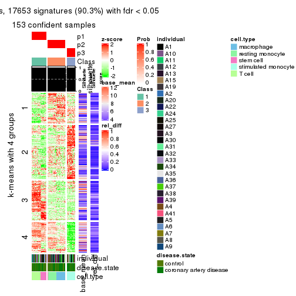</p>

</div>
<div id='tab-ATC-hclust-get-signatures-3'>
<pre><code class="r">get_signatures(res, k = 4)
</code></pre>

<pre><code>#&gt; Error in mat[ceiling(1:nr/h_ratio), ceiling(1:nc/w_ratio), drop = FALSE]: subscript out of bounds
</code></pre>

<p></p>

</div>
<div id='tab-ATC-hclust-get-signatures-4'>
<pre><code class="r">get_signatures(res, k = 5)
</code></pre>

<pre><code>#&gt; Error in mat[ceiling(1:nr/h_ratio), ceiling(1:nc/w_ratio), drop = FALSE]: subscript out of bounds
</code></pre>

<p></p>

</div>
<div id='tab-ATC-hclust-get-signatures-5'>
<pre><code class="r">get_signatures(res, k = 6)
</code></pre>

<pre><code>#&gt; Error in mat[ceiling(1:nr/h_ratio), ceiling(1:nc/w_ratio), drop = FALSE]: subscript out of bounds
</code></pre>

<p></p>

</div>
</div>


Signature heatmaps where rows are not scaled:


<script>
$( function() {
	$( '#tabs-ATC-hclust-get-signatures-no-scale' ).tabs();
} );
</script>
<div id='tabs-ATC-hclust-get-signatures-no-scale'>
<ul>
<li><a href='#tab-ATC-hclust-get-signatures-no-scale-1'>k = 2</a></li>
<li><a href='#tab-ATC-hclust-get-signatures-no-scale-2'>k = 3</a></li>
<li><a href='#tab-ATC-hclust-get-signatures-no-scale-3'>k = 4</a></li>
<li><a href='#tab-ATC-hclust-get-signatures-no-scale-4'>k = 5</a></li>
<li><a href='#tab-ATC-hclust-get-signatures-no-scale-5'>k = 6</a></li>
</ul>
<div id='tab-ATC-hclust-get-signatures-no-scale-1'>
<pre><code class="r">get_signatures(res, k = 2, scale_rows = FALSE)
</code></pre>

<p></p>

</div>
<div id='tab-ATC-hclust-get-signatures-no-scale-2'>
<pre><code class="r">get_signatures(res, k = 3, scale_rows = FALSE)
</code></pre>

<p></p>

</div>
<div id='tab-ATC-hclust-get-signatures-no-scale-3'>
<pre><code class="r">get_signatures(res, k = 4, scale_rows = FALSE)
</code></pre>

<p></p>

</div>
<div id='tab-ATC-hclust-get-signatures-no-scale-4'>
<pre><code class="r">get_signatures(res, k = 5, scale_rows = FALSE)
</code></pre>

<p></p>

</div>
<div id='tab-ATC-hclust-get-signatures-no-scale-5'>
<pre><code class="r">get_signatures(res, k = 6, scale_rows = FALSE)
</code></pre>

<p></p>

</div>
</div>


Compare the overlap of signatures from different k:

```r
compare_signatures(res)
```


`get_signature()` returns a data frame invisibly. TO get the list of signatures, the function
call should be assigned to a variable explicitly. In following code, if `plot` argument is set
to `FALSE`, no heatmap is plotted while only the differential analysis is performed.

```r
# code only for demonstration
tb = get_signature(res, k = ..., plot = FALSE)
```

An example of the output of `tb` is:

```
#>   which_row         fdr    mean_1    mean_2 scaled_mean_1 scaled_mean_2 km
#> 1        38 0.042760348  8.373488  9.131774    -0.5533452     0.5164555  1
#> 2        40 0.018707592  7.106213  8.469186    -0.6173731     0.5762149  1
#> 3        55 0.019134737 10.221463 11.207825    -0.6159697     0.5749050  1
#> 4        59 0.006059896  5.921854  7.869574    -0.6899429     0.6439467  1
#> 5        60 0.018055526  8.928898 10.211722    -0.6204761     0.5791110  1
#> 6        98 0.009384629 15.714769 14.887706     0.6635654    -0.6193277  2
...
```

The columns in `tb` are:

1. `which_row`: row indices corresponding to the input matrix.
2. `fdr`: FDR for the differential test. 
3. `mean_x`: The mean value in group x.
4. `scaled_mean_x`: The mean value in group x after rows are scaled.
5. `km`: Row groups if k-means clustering is applied to rows.


UMAP plot which shows how samples are separated.


<script>
$( function() {
	$( '#tabs-ATC-hclust-dimension-reduction' ).tabs();
} );
</script>
<div id='tabs-ATC-hclust-dimension-reduction'>
<ul>
<li><a href='#tab-ATC-hclust-dimension-reduction-1'>k = 2</a></li>
<li><a href='#tab-ATC-hclust-dimension-reduction-2'>k = 3</a></li>
<li><a href='#tab-ATC-hclust-dimension-reduction-3'>k = 4</a></li>
<li><a href='#tab-ATC-hclust-dimension-reduction-4'>k = 5</a></li>
<li><a href='#tab-ATC-hclust-dimension-reduction-5'>k = 6</a></li>
</ul>
<div id='tab-ATC-hclust-dimension-reduction-1'>
<pre><code class="r">dimension_reduction(res, k = 2, method = &quot;UMAP&quot;)
</code></pre>

<p></p>

</div>
<div id='tab-ATC-hclust-dimension-reduction-2'>
<pre><code class="r">dimension_reduction(res, k = 3, method = &quot;UMAP&quot;)
</code></pre>

<p></p>

</div>
<div id='tab-ATC-hclust-dimension-reduction-3'>
<pre><code class="r">dimension_reduction(res, k = 4, method = &quot;UMAP&quot;)
</code></pre>

<p></p>

</div>
<div id='tab-ATC-hclust-dimension-reduction-4'>
<pre><code class="r">dimension_reduction(res, k = 5, method = &quot;UMAP&quot;)
</code></pre>

<p></p>

</div>
<div id='tab-ATC-hclust-dimension-reduction-5'>
<pre><code class="r">dimension_reduction(res, k = 6, method = &quot;UMAP&quot;)
</code></pre>

<p></p>

</div>
</div>


Following heatmap shows how subgroups are split when increasing `k`:

```r
collect_classes(res)
```


Test correlation between subgroups and known annotations. If the known
annotation is numeric, one-way ANOVA test is applied, and if the known
annotation is discrete, chi-squared contingency table test is applied.

```r
test_to_known_factors(res)
```

```
#>              n individual(p) disease.state(p) cell.type(p) k
#> ATC:hclust 153             1            1.000     4.63e-32 2
#> ATC:hclust 153             1            0.937     2.02e-59 3
#> ATC:hclust 153             1            0.441     4.82e-60 4
#> ATC:hclust 153             1            0.605     2.71e-89 5
#> ATC:hclust 153             1            0.740    8.52e-117 6
```


If matrix rows can be associated to genes, consider to use `functional_enrichment(res,
...)` to perform function enrichment for the signature genes. See [this vignette](http://bioconductor.org/packages/devel/bioc/vignettes/cola/inst/doc/functional_enrichment.html) for more detailed explanations.


 

---------------------------------------------------


### ATC:kmeans


The object with results only for a single top-value method and a single partition method 
can be extracted as:

```r
res = res_list["ATC", "kmeans"]
# you can also extract it by
# res = res_list["ATC:kmeans"]
```

A summary of `res` and all the functions that can be applied to it:

```r
res
```

```
#> A 'ConsensusPartition' object with k = 2, 3, 4, 5, 6.
#>   On a matrix with 19559 rows and 153 columns.
#>   Top rows (1000, 2000, 3000, 4000, 5000) are extracted by 'ATC' method.
#>   Subgroups are detected by 'kmeans' method.
#>   Performed in total 1250 partitions by row resampling.
#>   Best k for subgroups seems to be 3.
#> 
#> Following methods can be applied to this 'ConsensusPartition' object:
#>  [1] "cola_report"             "collect_classes"         "collect_plots"          
#>  [4] "collect_stats"           "colnames"                "compare_signatures"     
#>  [7] "consensus_heatmap"       "dimension_reduction"     "functional_enrichment"  
#> [10] "get_anno_col"            "get_anno"                "get_classes"            
#> [13] "get_consensus"           "get_matrix"              "get_membership"         
#> [16] "get_param"               "get_signatures"          "get_stats"              
#> [19] "is_best_k"               "is_stable_k"             "membership_heatmap"     
#> [22] "ncol"                    "nrow"                    "plot_ecdf"              
#> [25] "rownames"                "select_partition_number" "show"                   
#> [28] "suggest_best_k"          "test_to_known_factors"
```

`collect_plots()` function collects all the plots made from `res` for all `k` (number of partitions)
into one single page to provide an easy and fast comparison between different `k`.

```r
collect_plots(res)
```


The plots are:

- The first row: a plot of the ECDF (empirical cumulative distribution
  function) curves of the consensus matrix for each `k` and the heatmap of
  predicted classes for each `k`.
- The second row: heatmaps of the consensus matrix for each `k`.
- The third row: heatmaps of the membership matrix for each `k`.
- The fouth row: heatmaps of the signatures for each `k`.

All the plots in panels can be made by individual functions and they are
plotted later in this section.

`select_partition_number()` produces several plots showing different
statistics for choosing "optimized" `k`. There are following statistics:

- ECDF curves of the consensus matrix for each `k`;
- 1-PAC. [The PAC
  score](https://en.wikipedia.org/wiki/Consensus_clustering#Over-interpretation_potential_of_consensus_clustering)
  measures the proportion of the ambiguous subgrouping.
- Mean silhouette score.
- Concordance. The mean probability of fiting the consensus class ids in all
  partitions.
- Area increased. Denote $A_k$ as the area under the ECDF curve for current
  `k`, the area increased is defined as $A_k - A_{k-1}$.
- Rand index. The percent of pairs of samples that are both in a same cluster
  or both are not in a same cluster in the partition of k and k-1.
- Jaccard index. The ratio of pairs of samples are both in a same cluster in
  the partition of k and k-1 and the pairs of samples are both in a same
  cluster in the partition k or k-1.

The detailed explanations of these statistics can be found in [the _cola_
vignette](http://bioconductor.org/packages/devel/bioc/vignettes/cola/inst/doc/cola.html#toc_13).

Generally speaking, lower PAC score, higher mean silhouette score or higher
concordance corresponds to better partition. Rand index and Jaccard index
measure how similar the current partition is compared to partition with `k-1`.
If they are too similar, we won't accept `k` is better than `k-1`.

```r
select_partition_number(res)
```


The numeric values for all these statistics can be obtained by `get_stats()`.

```r
get_stats(res)
```

```
#>   k 1-PAC mean_silhouette concordance area_increased  Rand Jaccard
#> 2 2 0.506           0.725       0.796         0.3888 0.675   0.675
#> 3 3 0.758           0.966       0.912         0.5688 0.682   0.529
#> 4 4 0.831           0.830       0.812         0.1472 1.000   1.000
#> 5 5 0.783           0.942       0.791         0.0693 0.842   0.558
#> 6 6 0.757           0.907       0.829         0.0511 1.000   1.000
```

`suggest_best_k()` suggests the best $k$ based on these statistics. The rules are as follows:

- All $k$ with Jaccard index larger than 0.95 are removed because increasing
  $k$ does not provide enough extra information. If all $k$ are removed, it is
  marked as no subgroup is detected.
- For all $k$ with 1-PAC score larger than 0.9, the maximal $k$ is taken as
  the best $k$, and other $k$ are marked as optional $k$.
- If it does not fit the second rule. The $k$ with the maximal vote of the
  highest 1-PAC score, highest mean silhouette, and highest concordance is
  taken as the best $k$.

```r
suggest_best_k(res)
```

```
#> [1] 3
```


Following shows the table of the partitions (You need to click the **show/hide
code output** link to see it). The membership matrix (columns with name `p*`)
is inferred by
[`clue::cl_consensus()`](https://www.rdocumentation.org/link/cl_consensus?package=clue)
function with the `SE` method. Basically the value in the membership matrix
represents the probability to belong to a certain group. The finall class
label for an item is determined with the group with highest probability it
belongs to.

In `get_classes()` function, the entropy is calculated from the membership
matrix and the silhouette score is calculated from the consensus matrix.


<script>
$( function() {
	$( '#tabs-ATC-kmeans-get-classes' ).tabs();
} );
</script>
<div id='tabs-ATC-kmeans-get-classes'>
<ul>
<li><a href='#tab-ATC-kmeans-get-classes-1'>k = 2</a></li>
<li><a href='#tab-ATC-kmeans-get-classes-2'>k = 3</a></li>
<li><a href='#tab-ATC-kmeans-get-classes-3'>k = 4</a></li>
<li><a href='#tab-ATC-kmeans-get-classes-4'>k = 5</a></li>
<li><a href='#tab-ATC-kmeans-get-classes-5'>k = 6</a></li>
</ul>

<div id='tab-ATC-kmeans-get-classes-1'>
<p><a id='tab-ATC-kmeans-get-classes-1-a' style='color:#0366d6' href='#'>show/hide code output</a></p>
<pre><code class="r">cbind(get_classes(res, k = 2), get_membership(res, k = 2))
</code></pre>

<pre><code>#&gt;           class entropy silhouette    p1    p2
#&gt; GSM247795     1   0.991      0.630 0.556 0.444
#&gt; GSM247854     1   0.991      0.630 0.556 0.444
#&gt; GSM247758     1   0.990      0.634 0.560 0.440
#&gt; GSM247742     1   0.000      0.683 1.000 0.000
#&gt; GSM247755     2   0.000      1.000 0.000 1.000
#&gt; GSM247841     1   0.000      0.683 1.000 0.000
#&gt; GSM247703     1   0.990      0.634 0.560 0.440
#&gt; GSM247739     1   0.990      0.634 0.560 0.440
#&gt; GSM247715     1   0.000      0.683 1.000 0.000
#&gt; GSM247829     2   0.000      1.000 0.000 1.000
#&gt; GSM247842     1   0.000      0.683 1.000 0.000
#&gt; GSM247805     1   0.990      0.634 0.560 0.440
#&gt; GSM247786     1   0.990      0.634 0.560 0.440
#&gt; GSM247812     2   0.000      1.000 0.000 1.000
#&gt; GSM247776     1   0.000      0.683 1.000 0.000
#&gt; GSM247850     1   0.000      0.683 1.000 0.000
#&gt; GSM247717     1   0.991      0.630 0.556 0.444
#&gt; GSM247784     1   0.990      0.634 0.560 0.440
#&gt; GSM247834     1   0.000      0.683 1.000 0.000
#&gt; GSM247783     2   0.000      1.000 0.000 1.000
#&gt; GSM247846     1   0.000      0.683 1.000 0.000
#&gt; GSM247822     1   0.991      0.630 0.556 0.444
#&gt; GSM247710     1   0.990      0.634 0.560 0.440
#&gt; GSM247713     1   0.000      0.683 1.000 0.000
#&gt; GSM247840     2   0.000      1.000 0.000 1.000
#&gt; GSM247733     1   0.000      0.683 1.000 0.000
#&gt; GSM247852     1   0.000      0.683 1.000 0.000
#&gt; GSM247790     1   0.990      0.634 0.560 0.440
#&gt; GSM247730     1   0.990      0.634 0.560 0.440
#&gt; GSM247824     2   0.000      1.000 0.000 1.000
#&gt; GSM247770     1   0.000      0.683 1.000 0.000
#&gt; GSM247711     1   0.991      0.630 0.556 0.444
#&gt; GSM247782     1   0.990      0.634 0.560 0.440
#&gt; GSM247836     1   0.000      0.683 1.000 0.000
#&gt; GSM247785     2   0.000      1.000 0.000 1.000
#&gt; GSM247847     1   0.000      0.683 1.000 0.000
#&gt; GSM247750     1   0.990      0.634 0.560 0.440
#&gt; GSM247788     1   0.990      0.634 0.560 0.440
#&gt; GSM247849     1   0.000      0.683 1.000 0.000
#&gt; GSM247772     2   0.000      1.000 0.000 1.000
#&gt; GSM247760     1   0.000      0.683 1.000 0.000
#&gt; GSM247764     1   0.991      0.630 0.556 0.444
#&gt; GSM247851     1   0.991      0.630 0.556 0.444
#&gt; GSM247714     1   0.990      0.634 0.560 0.440
#&gt; GSM247828     1   0.000      0.683 1.000 0.000
#&gt; GSM247704     2   0.000      1.000 0.000 1.000
#&gt; GSM247818     1   0.000      0.683 1.000 0.000
#&gt; GSM247823     1   0.991      0.630 0.556 0.444
#&gt; GSM247706     1   0.990      0.634 0.560 0.440
#&gt; GSM247835     2   0.000      1.000 0.000 1.000
#&gt; GSM247734     1   0.000      0.683 1.000 0.000
#&gt; GSM247819     1   0.991      0.630 0.556 0.444
#&gt; GSM247809     1   0.990      0.634 0.560 0.440
#&gt; GSM247830     2   0.000      1.000 0.000 1.000
#&gt; GSM247833     1   0.000      0.683 1.000 0.000
#&gt; GSM247738     1   0.990      0.634 0.560 0.440
#&gt; GSM247716     1   0.990      0.634 0.560 0.440
#&gt; GSM247747     2   0.000      1.000 0.000 1.000
#&gt; GSM247722     1   0.000      0.683 1.000 0.000
#&gt; GSM247816     1   0.991      0.630 0.556 0.444
#&gt; GSM247839     1   0.990      0.634 0.560 0.440
#&gt; GSM247821     1   0.000      0.683 1.000 0.000
#&gt; GSM247798     2   0.000      1.000 0.000 1.000
#&gt; GSM247838     1   0.000      0.683 1.000 0.000
#&gt; GSM247721     1   0.991      0.630 0.556 0.444
#&gt; GSM247781     1   0.990      0.634 0.560 0.440
#&gt; GSM247762     1   0.000      0.683 1.000 0.000
#&gt; GSM247825     2   0.000      1.000 0.000 1.000
#&gt; GSM247777     1   0.000      0.683 1.000 0.000
#&gt; GSM247761     1   0.991      0.630 0.556 0.444
#&gt; GSM247720     1   0.990      0.634 0.560 0.440
#&gt; GSM247814     2   0.000      1.000 0.000 1.000
#&gt; GSM247732     1   0.000      0.683 1.000 0.000
#&gt; GSM247708     1   0.991      0.630 0.556 0.444
#&gt; GSM247740     1   0.990      0.634 0.560 0.440
#&gt; GSM247749     1   0.000      0.683 1.000 0.000
#&gt; GSM247767     2   0.000      1.000 0.000 1.000
#&gt; GSM247748     1   0.000      0.683 1.000 0.000
#&gt; GSM247705     1   0.991      0.630 0.556 0.444
#&gt; GSM247746     1   0.990      0.634 0.560 0.440
#&gt; GSM247752     1   0.000      0.683 1.000 0.000
#&gt; GSM247769     2   0.000      1.000 0.000 1.000
#&gt; GSM247753     1   0.000      0.683 1.000 0.000
#&gt; GSM247723     1   0.991      0.630 0.556 0.444
#&gt; GSM247779     1   0.990      0.634 0.560 0.440
#&gt; GSM247756     1   0.000      0.683 1.000 0.000
#&gt; GSM247826     2   0.000      1.000 0.000 1.000
#&gt; GSM247775     1   0.000      0.683 1.000 0.000
#&gt; GSM247741     1   0.991      0.630 0.556 0.444
#&gt; GSM247799     1   0.990      0.634 0.560 0.440
#&gt; GSM247778     1   0.000      0.683 1.000 0.000
#&gt; GSM247806     2   0.000      1.000 0.000 1.000
#&gt; GSM247815     1   0.000      0.683 1.000 0.000
#&gt; GSM247735     1   0.991      0.630 0.556 0.444
#&gt; GSM247831     1   0.990      0.634 0.560 0.440
#&gt; GSM247845     1   0.000      0.683 1.000 0.000
#&gt; GSM247791     2   0.000      1.000 0.000 1.000
#&gt; GSM247780     1   0.000      0.683 1.000 0.000
#&gt; GSM247853     1   0.000      0.683 1.000 0.000
#&gt; GSM247800     1   0.991      0.630 0.556 0.444
#&gt; GSM247729     1   0.990      0.634 0.560 0.440
#&gt; GSM247810     1   0.000      0.683 1.000 0.000
#&gt; GSM247844     2   0.000      1.000 0.000 1.000
#&gt; GSM247793     1   0.000      0.683 1.000 0.000
#&gt; GSM247759     1   0.991      0.630 0.556 0.444
#&gt; GSM247724     1   0.990      0.634 0.560 0.440
#&gt; GSM247817     2   0.000      1.000 0.000 1.000
#&gt; GSM247727     1   0.000      0.683 1.000 0.000
#&gt; GSM247796     1   0.991      0.630 0.556 0.444
#&gt; GSM247725     1   0.990      0.634 0.560 0.440
#&gt; GSM247801     1   0.000      0.683 1.000 0.000
#&gt; GSM247731     2   0.000      1.000 0.000 1.000
#&gt; GSM247765     1   0.000      0.683 1.000 0.000
#&gt; GSM247792     1   0.991      0.630 0.556 0.444
#&gt; GSM247726     1   0.990      0.634 0.560 0.440
#&gt; GSM247803     1   0.990      0.634 0.560 0.440
#&gt; GSM247728     2   0.000      1.000 0.000 1.000
#&gt; GSM247768     1   0.000      0.683 1.000 0.000
#&gt; GSM247745     1   0.991      0.630 0.556 0.444
#&gt; GSM247855     1   0.991      0.630 0.556 0.444
#&gt; GSM247804     1   0.990      0.634 0.560 0.440
#&gt; GSM247774     1   0.000      0.683 1.000 0.000
#&gt; GSM247807     2   0.000      1.000 0.000 1.000
#&gt; GSM247813     1   0.000      0.683 1.000 0.000
#&gt; GSM247736     1   0.991      0.630 0.556 0.444
#&gt; GSM247712     1   0.990      0.634 0.560 0.440
#&gt; GSM247797     1   0.000      0.683 1.000 0.000
#&gt; GSM247743     2   0.000      1.000 0.000 1.000
#&gt; GSM247719     1   0.000      0.683 1.000 0.000
#&gt; GSM247707     1   0.991      0.630 0.556 0.444
#&gt; GSM247737     1   0.990      0.634 0.560 0.440
#&gt; GSM247827     2   0.000      1.000 0.000 1.000
#&gt; GSM247848     1   0.000      0.683 1.000 0.000
#&gt; GSM247794     1   0.990      0.634 0.560 0.440
#&gt; GSM247757     1   0.990      0.634 0.560 0.440
#&gt; GSM247744     1   0.000      0.683 1.000 0.000
#&gt; GSM247751     2   0.000      1.000 0.000 1.000
#&gt; GSM247837     1   0.000      0.683 1.000 0.000
#&gt; GSM247754     1   0.991      0.630 0.556 0.444
#&gt; GSM247789     1   0.990      0.634 0.560 0.440
#&gt; GSM247802     1   0.000      0.683 1.000 0.000
#&gt; GSM247771     2   0.000      1.000 0.000 1.000
#&gt; GSM247763     1   0.000      0.683 1.000 0.000
#&gt; GSM247808     1   0.991      0.630 0.556 0.444
#&gt; GSM247787     1   0.990      0.634 0.560 0.440
#&gt; GSM247843     1   0.000      0.683 1.000 0.000
#&gt; GSM247811     2   0.000      1.000 0.000 1.000
#&gt; GSM247773     1   0.000      0.683 1.000 0.000
#&gt; GSM247766     1   0.991      0.630 0.556 0.444
#&gt; GSM247718     1   0.990      0.634 0.560 0.440
#&gt; GSM247832     1   0.000      0.683 1.000 0.000
#&gt; GSM247709     2   0.000      1.000 0.000 1.000
#&gt; GSM247820     1   0.000      0.683 1.000 0.000
</code></pre>

<script>
$('#tab-ATC-kmeans-get-classes-1-a').parent().next().next().hide();
$('#tab-ATC-kmeans-get-classes-1-a').click(function(){
  $('#tab-ATC-kmeans-get-classes-1-a').parent().next().next().toggle();
  return(false);
});
</script>
</div>

<div id='tab-ATC-kmeans-get-classes-2'>
<p><a id='tab-ATC-kmeans-get-classes-2-a' style='color:#0366d6' href='#'>show/hide code output</a></p>
<pre><code class="r">cbind(get_classes(res, k = 3), get_membership(res, k = 3))
</code></pre>

<pre><code>#&gt;           class entropy silhouette    p1   p2    p3
#&gt; GSM247795     2   0.000      0.999 0.000 1.00 0.000
#&gt; GSM247854     2   0.000      0.999 0.000 1.00 0.000
#&gt; GSM247758     2   0.000      0.999 0.000 1.00 0.000
#&gt; GSM247742     1   0.600      0.893 0.760 0.04 0.200
#&gt; GSM247755     3   0.554      0.987 0.024 0.20 0.776
#&gt; GSM247841     1   0.153      0.933 0.960 0.04 0.000
#&gt; GSM247703     2   0.000      0.999 0.000 1.00 0.000
#&gt; GSM247739     2   0.000      0.999 0.000 1.00 0.000
#&gt; GSM247715     1   0.600      0.893 0.760 0.04 0.200
#&gt; GSM247829     3   0.566      0.987 0.028 0.20 0.772
#&gt; GSM247842     1   0.153      0.933 0.960 0.04 0.000
#&gt; GSM247805     2   0.000      0.999 0.000 1.00 0.000
#&gt; GSM247786     2   0.000      0.999 0.000 1.00 0.000
#&gt; GSM247812     3   0.512      0.988 0.012 0.20 0.788
#&gt; GSM247776     1   0.153      0.933 0.960 0.04 0.000
#&gt; GSM247850     1   0.153      0.933 0.960 0.04 0.000
#&gt; GSM247717     2   0.000      0.999 0.000 1.00 0.000
#&gt; GSM247784     2   0.000      0.999 0.000 1.00 0.000
#&gt; GSM247834     1   0.600      0.893 0.760 0.04 0.200
#&gt; GSM247783     3   0.455      0.989 0.000 0.20 0.800
#&gt; GSM247846     1   0.153      0.933 0.960 0.04 0.000
#&gt; GSM247822     2   0.000      0.999 0.000 1.00 0.000
#&gt; GSM247710     2   0.000      0.999 0.000 1.00 0.000
#&gt; GSM247713     1   0.600      0.893 0.760 0.04 0.200
#&gt; GSM247840     3   0.512      0.988 0.012 0.20 0.788
#&gt; GSM247733     1   0.153      0.933 0.960 0.04 0.000
#&gt; GSM247852     1   0.153      0.933 0.960 0.04 0.000
#&gt; GSM247790     2   0.000      0.999 0.000 1.00 0.000
#&gt; GSM247730     2   0.000      0.999 0.000 1.00 0.000
#&gt; GSM247824     3   0.496      0.989 0.008 0.20 0.792
#&gt; GSM247770     1   0.153      0.933 0.960 0.04 0.000
#&gt; GSM247711     2   0.000      0.999 0.000 1.00 0.000
#&gt; GSM247782     2   0.000      0.999 0.000 1.00 0.000
#&gt; GSM247836     1   0.600      0.893 0.760 0.04 0.200
#&gt; GSM247785     3   0.455      0.989 0.000 0.20 0.800
#&gt; GSM247847     1   0.153      0.933 0.960 0.04 0.000
#&gt; GSM247750     2   0.000      0.999 0.000 1.00 0.000
#&gt; GSM247788     2   0.000      0.999 0.000 1.00 0.000
#&gt; GSM247849     1   0.600      0.893 0.760 0.04 0.200
#&gt; GSM247772     3   0.566      0.987 0.028 0.20 0.772
#&gt; GSM247760     1   0.153      0.933 0.960 0.04 0.000
#&gt; GSM247764     2   0.000      0.999 0.000 1.00 0.000
#&gt; GSM247851     2   0.000      0.999 0.000 1.00 0.000
#&gt; GSM247714     2   0.000      0.999 0.000 1.00 0.000
#&gt; GSM247828     1   0.600      0.893 0.760 0.04 0.200
#&gt; GSM247704     3   0.527      0.988 0.016 0.20 0.784
#&gt; GSM247818     1   0.153      0.933 0.960 0.04 0.000
#&gt; GSM247823     2   0.000      0.999 0.000 1.00 0.000
#&gt; GSM247706     2   0.000      0.999 0.000 1.00 0.000
#&gt; GSM247835     3   0.554      0.987 0.024 0.20 0.776
#&gt; GSM247734     1   0.153      0.933 0.960 0.04 0.000
#&gt; GSM247819     2   0.000      0.999 0.000 1.00 0.000
#&gt; GSM247809     2   0.000      0.999 0.000 1.00 0.000
#&gt; GSM247830     3   0.512      0.989 0.012 0.20 0.788
#&gt; GSM247833     1   0.153      0.933 0.960 0.04 0.000
#&gt; GSM247738     2   0.000      0.999 0.000 1.00 0.000
#&gt; GSM247716     2   0.000      0.999 0.000 1.00 0.000
#&gt; GSM247747     3   0.566      0.987 0.028 0.20 0.772
#&gt; GSM247722     1   0.153      0.933 0.960 0.04 0.000
#&gt; GSM247816     2   0.000      0.999 0.000 1.00 0.000
#&gt; GSM247839     2   0.000      0.999 0.000 1.00 0.000
#&gt; GSM247821     1   0.600      0.893 0.760 0.04 0.200
#&gt; GSM247798     3   0.527      0.988 0.016 0.20 0.784
#&gt; GSM247838     1   0.153      0.933 0.960 0.04 0.000
#&gt; GSM247721     2   0.000      0.999 0.000 1.00 0.000
#&gt; GSM247781     2   0.000      0.999 0.000 1.00 0.000
#&gt; GSM247762     1   0.600      0.893 0.760 0.04 0.200
#&gt; GSM247825     3   0.566      0.987 0.028 0.20 0.772
#&gt; GSM247777     1   0.153      0.933 0.960 0.04 0.000
#&gt; GSM247761     2   0.000      0.999 0.000 1.00 0.000
#&gt; GSM247720     2   0.000      0.999 0.000 1.00 0.000
#&gt; GSM247814     3   0.566      0.987 0.028 0.20 0.772
#&gt; GSM247732     1   0.153      0.933 0.960 0.04 0.000
#&gt; GSM247708     2   0.000      0.999 0.000 1.00 0.000
#&gt; GSM247740     2   0.000      0.999 0.000 1.00 0.000
#&gt; GSM247749     1   0.600      0.893 0.760 0.04 0.200
#&gt; GSM247767     3   0.512      0.988 0.012 0.20 0.788
#&gt; GSM247748     1   0.153      0.933 0.960 0.04 0.000
#&gt; GSM247705     2   0.000      0.999 0.000 1.00 0.000
#&gt; GSM247746     2   0.000      0.999 0.000 1.00 0.000
#&gt; GSM247752     1   0.600      0.893 0.760 0.04 0.200
#&gt; GSM247769     3   0.496      0.989 0.008 0.20 0.792
#&gt; GSM247753     1   0.153      0.933 0.960 0.04 0.000
#&gt; GSM247723     2   0.000      0.999 0.000 1.00 0.000
#&gt; GSM247779     2   0.000      0.999 0.000 1.00 0.000
#&gt; GSM247756     1   0.600      0.893 0.760 0.04 0.200
#&gt; GSM247826     3   0.554      0.987 0.024 0.20 0.776
#&gt; GSM247775     1   0.153      0.933 0.960 0.04 0.000
#&gt; GSM247741     2   0.000      0.999 0.000 1.00 0.000
#&gt; GSM247799     2   0.000      0.999 0.000 1.00 0.000
#&gt; GSM247778     1   0.600      0.893 0.760 0.04 0.200
#&gt; GSM247806     3   0.512      0.989 0.012 0.20 0.788
#&gt; GSM247815     1   0.153      0.933 0.960 0.04 0.000
#&gt; GSM247735     2   0.000      0.999 0.000 1.00 0.000
#&gt; GSM247831     2   0.000      0.999 0.000 1.00 0.000
#&gt; GSM247845     1   0.600      0.893 0.760 0.04 0.200
#&gt; GSM247791     3   0.512      0.988 0.012 0.20 0.788
#&gt; GSM247780     1   0.153      0.933 0.960 0.04 0.000
#&gt; GSM247853     1   0.153      0.933 0.960 0.04 0.000
#&gt; GSM247800     2   0.000      0.999 0.000 1.00 0.000
#&gt; GSM247729     2   0.000      0.999 0.000 1.00 0.000
#&gt; GSM247810     1   0.600      0.893 0.760 0.04 0.200
#&gt; GSM247844     3   0.578      0.988 0.032 0.20 0.768
#&gt; GSM247793     1   0.153      0.933 0.960 0.04 0.000
#&gt; GSM247759     2   0.000      0.999 0.000 1.00 0.000
#&gt; GSM247724     2   0.000      0.999 0.000 1.00 0.000
#&gt; GSM247817     3   0.566      0.987 0.028 0.20 0.772
#&gt; GSM247727     1   0.153      0.933 0.960 0.04 0.000
#&gt; GSM247796     2   0.000      0.999 0.000 1.00 0.000
#&gt; GSM247725     2   0.000      0.999 0.000 1.00 0.000
#&gt; GSM247801     1   0.600      0.893 0.760 0.04 0.200
#&gt; GSM247731     3   0.478      0.989 0.004 0.20 0.796
#&gt; GSM247765     1   0.153      0.933 0.960 0.04 0.000
#&gt; GSM247792     2   0.000      0.999 0.000 1.00 0.000
#&gt; GSM247726     2   0.000      0.999 0.000 1.00 0.000
#&gt; GSM247803     2   0.207      0.914 0.000 0.94 0.060
#&gt; GSM247728     3   0.478      0.989 0.004 0.20 0.796
#&gt; GSM247768     1   0.153      0.933 0.960 0.04 0.000
#&gt; GSM247745     2   0.000      0.999 0.000 1.00 0.000
#&gt; GSM247855     2   0.000      0.999 0.000 1.00 0.000
#&gt; GSM247804     2   0.000      0.999 0.000 1.00 0.000
#&gt; GSM247774     1   0.600      0.893 0.760 0.04 0.200
#&gt; GSM247807     3   0.566      0.988 0.028 0.20 0.772
#&gt; GSM247813     1   0.153      0.933 0.960 0.04 0.000
#&gt; GSM247736     2   0.000      0.999 0.000 1.00 0.000
#&gt; GSM247712     2   0.000      0.999 0.000 1.00 0.000
#&gt; GSM247797     1   0.600      0.893 0.760 0.04 0.200
#&gt; GSM247743     3   0.566      0.987 0.028 0.20 0.772
#&gt; GSM247719     1   0.153      0.933 0.960 0.04 0.000
#&gt; GSM247707     2   0.000      0.999 0.000 1.00 0.000
#&gt; GSM247737     2   0.000      0.999 0.000 1.00 0.000
#&gt; GSM247827     3   0.554      0.987 0.024 0.20 0.776
#&gt; GSM247848     1   0.153      0.933 0.960 0.04 0.000
#&gt; GSM247794     2   0.000      0.999 0.000 1.00 0.000
#&gt; GSM247757     2   0.000      0.999 0.000 1.00 0.000
#&gt; GSM247744     1   0.600      0.893 0.760 0.04 0.200
#&gt; GSM247751     3   0.541      0.989 0.020 0.20 0.780
#&gt; GSM247837     1   0.153      0.933 0.960 0.04 0.000
#&gt; GSM247754     2   0.000      0.999 0.000 1.00 0.000
#&gt; GSM247789     2   0.000      0.999 0.000 1.00 0.000
#&gt; GSM247802     1   0.600      0.893 0.760 0.04 0.200
#&gt; GSM247771     3   0.478      0.989 0.004 0.20 0.796
#&gt; GSM247763     1   0.153      0.933 0.960 0.04 0.000
#&gt; GSM247808     2   0.000      0.999 0.000 1.00 0.000
#&gt; GSM247787     2   0.000      0.999 0.000 1.00 0.000
#&gt; GSM247843     1   0.600      0.893 0.760 0.04 0.200
#&gt; GSM247811     3   0.512      0.988 0.012 0.20 0.788
#&gt; GSM247773     1   0.153      0.933 0.960 0.04 0.000
#&gt; GSM247766     2   0.000      0.999 0.000 1.00 0.000
#&gt; GSM247718     2   0.000      0.999 0.000 1.00 0.000
#&gt; GSM247832     1   0.600      0.893 0.760 0.04 0.200
#&gt; GSM247709     3   0.527      0.988 0.016 0.20 0.784
#&gt; GSM247820     1   0.153      0.933 0.960 0.04 0.000
</code></pre>

<script>
$('#tab-ATC-kmeans-get-classes-2-a').parent().next().next().hide();
$('#tab-ATC-kmeans-get-classes-2-a').click(function(){
  $('#tab-ATC-kmeans-get-classes-2-a').parent().next().next().toggle();
  return(false);
});
</script>
</div>

<div id='tab-ATC-kmeans-get-classes-3'>
<p><a id='tab-ATC-kmeans-get-classes-3-a' style='color:#0366d6' href='#'>show/hide code output</a></p>
<pre><code class="r">cbind(get_classes(res, k = 4), get_membership(res, k = 4))
</code></pre>

<pre><code>#&gt;           class entropy silhouette    p1    p2    p3 p4
#&gt; GSM247795     2  0.4855      0.795 0.000 0.600 0.000 NA
#&gt; GSM247854     2  0.4855      0.795 0.000 0.600 0.000 NA
#&gt; GSM247758     2  0.0000      0.779 0.000 1.000 0.000 NA
#&gt; GSM247742     1  0.0000      0.757 1.000 0.000 0.000 NA
#&gt; GSM247755     3  0.3966      0.957 0.000 0.072 0.840 NA
#&gt; GSM247841     1  0.4898      0.848 0.584 0.000 0.000 NA
#&gt; GSM247703     2  0.4855      0.795 0.000 0.600 0.000 NA
#&gt; GSM247739     2  0.0000      0.779 0.000 1.000 0.000 NA
#&gt; GSM247715     1  0.1118      0.756 0.964 0.000 0.036 NA
#&gt; GSM247829     3  0.4552      0.952 0.000 0.072 0.800 NA
#&gt; GSM247842     1  0.5060      0.848 0.584 0.000 0.004 NA
#&gt; GSM247805     2  0.4855      0.795 0.000 0.600 0.000 NA
#&gt; GSM247786     2  0.0000      0.779 0.000 1.000 0.000 NA
#&gt; GSM247812     3  0.2563      0.960 0.000 0.072 0.908 NA
#&gt; GSM247776     1  0.4898      0.848 0.584 0.000 0.000 NA
#&gt; GSM247850     1  0.4898      0.848 0.584 0.000 0.000 NA
#&gt; GSM247717     2  0.4855      0.795 0.000 0.600 0.000 NA
#&gt; GSM247784     2  0.0000      0.779 0.000 1.000 0.000 NA
#&gt; GSM247834     1  0.1118      0.756 0.964 0.000 0.036 NA
#&gt; GSM247783     3  0.2450      0.963 0.000 0.072 0.912 NA
#&gt; GSM247846     1  0.5060      0.848 0.584 0.000 0.004 NA
#&gt; GSM247822     2  0.4855      0.795 0.000 0.600 0.000 NA
#&gt; GSM247710     2  0.0000      0.779 0.000 1.000 0.000 NA
#&gt; GSM247713     1  0.1118      0.756 0.964 0.000 0.036 NA
#&gt; GSM247840     3  0.2450      0.961 0.000 0.072 0.912 NA
#&gt; GSM247733     1  0.4898      0.848 0.584 0.000 0.000 NA
#&gt; GSM247852     1  0.5183      0.848 0.584 0.000 0.008 NA
#&gt; GSM247790     2  0.4855      0.795 0.000 0.600 0.000 NA
#&gt; GSM247730     2  0.0000      0.779 0.000 1.000 0.000 NA
#&gt; GSM247824     3  0.2450      0.961 0.000 0.072 0.912 NA
#&gt; GSM247770     1  0.4898      0.848 0.584 0.000 0.000 NA
#&gt; GSM247711     2  0.4855      0.795 0.000 0.600 0.000 NA
#&gt; GSM247782     2  0.0000      0.779 0.000 1.000 0.000 NA
#&gt; GSM247836     1  0.0188      0.757 0.996 0.000 0.004 NA
#&gt; GSM247785     3  0.2450      0.963 0.000 0.072 0.912 NA
#&gt; GSM247847     1  0.4898      0.848 0.584 0.000 0.000 NA
#&gt; GSM247750     2  0.4855      0.795 0.000 0.600 0.000 NA
#&gt; GSM247788     2  0.0000      0.779 0.000 1.000 0.000 NA
#&gt; GSM247849     1  0.0000      0.757 1.000 0.000 0.000 NA
#&gt; GSM247772     3  0.4444      0.953 0.000 0.072 0.808 NA
#&gt; GSM247760     1  0.4898      0.848 0.584 0.000 0.000 NA
#&gt; GSM247764     2  0.4855      0.795 0.000 0.600 0.000 NA
#&gt; GSM247851     2  0.4855      0.795 0.000 0.600 0.000 NA
#&gt; GSM247714     2  0.0000      0.779 0.000 1.000 0.000 NA
#&gt; GSM247828     1  0.0000      0.757 1.000 0.000 0.000 NA
#&gt; GSM247704     3  0.3900      0.953 0.000 0.072 0.844 NA
#&gt; GSM247818     1  0.4898      0.848 0.584 0.000 0.000 NA
#&gt; GSM247823     2  0.4855      0.795 0.000 0.600 0.000 NA
#&gt; GSM247706     2  0.0000      0.779 0.000 1.000 0.000 NA
#&gt; GSM247835     3  0.3966      0.957 0.000 0.072 0.840 NA
#&gt; GSM247734     1  0.4898      0.848 0.584 0.000 0.000 NA
#&gt; GSM247819     2  0.4855      0.795 0.000 0.600 0.000 NA
#&gt; GSM247809     2  0.0000      0.779 0.000 1.000 0.000 NA
#&gt; GSM247830     3  0.2871      0.961 0.000 0.072 0.896 NA
#&gt; GSM247833     1  0.5781      0.845 0.584 0.000 0.036 NA
#&gt; GSM247738     2  0.4855      0.795 0.000 0.600 0.000 NA
#&gt; GSM247716     2  0.0000      0.779 0.000 1.000 0.000 NA
#&gt; GSM247747     3  0.4030      0.957 0.000 0.072 0.836 NA
#&gt; GSM247722     1  0.5781      0.845 0.584 0.000 0.036 NA
#&gt; GSM247816     2  0.4855      0.795 0.000 0.600 0.000 NA
#&gt; GSM247839     2  0.0000      0.779 0.000 1.000 0.000 NA
#&gt; GSM247821     1  0.0592      0.757 0.984 0.000 0.016 NA
#&gt; GSM247798     3  0.3471      0.955 0.000 0.072 0.868 NA
#&gt; GSM247838     1  0.5781      0.845 0.584 0.000 0.036 NA
#&gt; GSM247721     2  0.4855      0.795 0.000 0.600 0.000 NA
#&gt; GSM247781     2  0.0000      0.779 0.000 1.000 0.000 NA
#&gt; GSM247762     1  0.0000      0.757 1.000 0.000 0.000 NA
#&gt; GSM247825     3  0.4444      0.953 0.000 0.072 0.808 NA
#&gt; GSM247777     1  0.5781      0.845 0.584 0.000 0.036 NA
#&gt; GSM247761     2  0.4855      0.795 0.000 0.600 0.000 NA
#&gt; GSM247720     2  0.0000      0.779 0.000 1.000 0.000 NA
#&gt; GSM247814     3  0.4552      0.952 0.000 0.072 0.800 NA
#&gt; GSM247732     1  0.5781      0.845 0.584 0.000 0.036 NA
#&gt; GSM247708     2  0.4855      0.795 0.000 0.600 0.000 NA
#&gt; GSM247740     2  0.0000      0.779 0.000 1.000 0.000 NA
#&gt; GSM247749     1  0.1022      0.756 0.968 0.000 0.032 NA
#&gt; GSM247767     3  0.2563      0.960 0.000 0.072 0.908 NA
#&gt; GSM247748     1  0.4898      0.848 0.584 0.000 0.000 NA
#&gt; GSM247705     2  0.4855      0.795 0.000 0.600 0.000 NA
#&gt; GSM247746     2  0.0000      0.779 0.000 1.000 0.000 NA
#&gt; GSM247752     1  0.1820      0.744 0.944 0.000 0.036 NA
#&gt; GSM247769     3  0.2773      0.960 0.000 0.072 0.900 NA
#&gt; GSM247753     1  0.4898      0.848 0.584 0.000 0.000 NA
#&gt; GSM247723     2  0.4855      0.795 0.000 0.600 0.000 NA
#&gt; GSM247779     2  0.0000      0.779 0.000 1.000 0.000 NA
#&gt; GSM247756     1  0.0000      0.757 1.000 0.000 0.000 NA
#&gt; GSM247826     3  0.3966      0.957 0.000 0.072 0.840 NA
#&gt; GSM247775     1  0.4898      0.848 0.584 0.000 0.000 NA
#&gt; GSM247741     2  0.4855      0.795 0.000 0.600 0.000 NA
#&gt; GSM247799     2  0.0000      0.779 0.000 1.000 0.000 NA
#&gt; GSM247778     1  0.1022      0.756 0.968 0.000 0.032 NA
#&gt; GSM247806     3  0.3547      0.960 0.000 0.072 0.864 NA
#&gt; GSM247815     1  0.4898      0.848 0.584 0.000 0.000 NA
#&gt; GSM247735     2  0.4855      0.795 0.000 0.600 0.000 NA
#&gt; GSM247831     2  0.0000      0.779 0.000 1.000 0.000 NA
#&gt; GSM247845     1  0.0000      0.757 1.000 0.000 0.000 NA
#&gt; GSM247791     3  0.2563      0.960 0.000 0.072 0.908 NA
#&gt; GSM247780     1  0.5781      0.845 0.584 0.000 0.036 NA
#&gt; GSM247853     1  0.5781      0.845 0.584 0.000 0.036 NA
#&gt; GSM247800     2  0.4855      0.795 0.000 0.600 0.000 NA
#&gt; GSM247729     2  0.0000      0.779 0.000 1.000 0.000 NA
#&gt; GSM247810     1  0.1118      0.756 0.964 0.000 0.036 NA
#&gt; GSM247844     3  0.4389      0.954 0.000 0.072 0.812 NA
#&gt; GSM247793     1  0.5183      0.848 0.584 0.000 0.008 NA
#&gt; GSM247759     2  0.4855      0.795 0.000 0.600 0.000 NA
#&gt; GSM247724     2  0.0000      0.779 0.000 1.000 0.000 NA
#&gt; GSM247817     3  0.4605      0.951 0.000 0.072 0.796 NA
#&gt; GSM247727     1  0.5781      0.845 0.584 0.000 0.036 NA
#&gt; GSM247796     2  0.4855      0.795 0.000 0.600 0.000 NA
#&gt; GSM247725     2  0.0000      0.779 0.000 1.000 0.000 NA
#&gt; GSM247801     1  0.0000      0.757 1.000 0.000 0.000 NA
#&gt; GSM247731     3  0.1867      0.962 0.000 0.072 0.928 NA
#&gt; GSM247765     1  0.4898      0.848 0.584 0.000 0.000 NA
#&gt; GSM247792     2  0.4855      0.795 0.000 0.600 0.000 NA
#&gt; GSM247726     2  0.0000      0.779 0.000 1.000 0.000 NA
#&gt; GSM247803     2  0.2324      0.727 0.028 0.932 0.020 NA
#&gt; GSM247728     3  0.2450      0.962 0.000 0.072 0.912 NA
#&gt; GSM247768     1  0.4898      0.848 0.584 0.000 0.000 NA
#&gt; GSM247745     2  0.4855      0.795 0.000 0.600 0.000 NA
#&gt; GSM247855     2  0.4855      0.795 0.000 0.600 0.000 NA
#&gt; GSM247804     2  0.0000      0.779 0.000 1.000 0.000 NA
#&gt; GSM247774     1  0.0000      0.757 1.000 0.000 0.000 NA
#&gt; GSM247807     3  0.3966      0.961 0.000 0.072 0.840 NA
#&gt; GSM247813     1  0.5781      0.845 0.584 0.000 0.036 NA
#&gt; GSM247736     2  0.4855      0.795 0.000 0.600 0.000 NA
#&gt; GSM247712     2  0.0000      0.779 0.000 1.000 0.000 NA
#&gt; GSM247797     1  0.0000      0.757 1.000 0.000 0.000 NA
#&gt; GSM247743     3  0.4093      0.957 0.000 0.072 0.832 NA
#&gt; GSM247719     1  0.5781      0.845 0.584 0.000 0.036 NA
#&gt; GSM247707     2  0.4855      0.795 0.000 0.600 0.000 NA
#&gt; GSM247737     2  0.0000      0.779 0.000 1.000 0.000 NA
#&gt; GSM247827     3  0.3966      0.957 0.000 0.072 0.840 NA
#&gt; GSM247848     1  0.4898      0.848 0.584 0.000 0.000 NA
#&gt; GSM247794     2  0.4855      0.795 0.000 0.600 0.000 NA
#&gt; GSM247757     2  0.0000      0.779 0.000 1.000 0.000 NA
#&gt; GSM247744     1  0.0000      0.757 1.000 0.000 0.000 NA
#&gt; GSM247751     3  0.3833      0.961 0.000 0.072 0.848 NA
#&gt; GSM247837     1  0.4898      0.848 0.584 0.000 0.000 NA
#&gt; GSM247754     2  0.4855      0.795 0.000 0.600 0.000 NA
#&gt; GSM247789     2  0.0000      0.779 0.000 1.000 0.000 NA
#&gt; GSM247802     1  0.1022      0.756 0.968 0.000 0.032 NA
#&gt; GSM247771     3  0.1867      0.962 0.000 0.072 0.928 NA
#&gt; GSM247763     1  0.4898      0.848 0.584 0.000 0.000 NA
#&gt; GSM247808     2  0.4855      0.795 0.000 0.600 0.000 NA
#&gt; GSM247787     2  0.0000      0.779 0.000 1.000 0.000 NA
#&gt; GSM247843     1  0.1022      0.756 0.968 0.000 0.032 NA
#&gt; GSM247811     3  0.3312      0.955 0.000 0.072 0.876 NA
#&gt; GSM247773     1  0.4898      0.848 0.584 0.000 0.000 NA
#&gt; GSM247766     2  0.4855      0.795 0.000 0.600 0.000 NA
#&gt; GSM247718     2  0.0000      0.779 0.000 1.000 0.000 NA
#&gt; GSM247832     1  0.0000      0.757 1.000 0.000 0.000 NA
#&gt; GSM247709     3  0.3900      0.953 0.000 0.072 0.844 NA
#&gt; GSM247820     1  0.5781      0.845 0.584 0.000 0.036 NA
</code></pre>

<script>
$('#tab-ATC-kmeans-get-classes-3-a').parent().next().next().hide();
$('#tab-ATC-kmeans-get-classes-3-a').click(function(){
  $('#tab-ATC-kmeans-get-classes-3-a').parent().next().next().toggle();
  return(false);
});
</script>
</div>

<div id='tab-ATC-kmeans-get-classes-4'>
<p><a id='tab-ATC-kmeans-get-classes-4-a' style='color:#0366d6' href='#'>show/hide code output</a></p>
<pre><code class="r">cbind(get_classes(res, k = 5), get_membership(res, k = 5))
</code></pre>

<pre><code>#&gt;           class entropy silhouette    p1    p2    p3    p4    p5
#&gt; GSM247795     2  0.4171      0.947 0.000 0.604 0.000 0.000 0.396
#&gt; GSM247854     2  0.4171      0.947 0.000 0.604 0.000 0.000 0.396
#&gt; GSM247758     5  0.0290      0.981 0.000 0.000 0.000 0.008 0.992
#&gt; GSM247742     4  0.4547      0.966 0.400 0.012 0.000 0.588 0.000
#&gt; GSM247755     3  0.3405      0.922 0.000 0.024 0.848 0.108 0.020
#&gt; GSM247841     1  0.0162      0.944 0.996 0.000 0.004 0.000 0.000
#&gt; GSM247703     2  0.4171      0.947 0.000 0.604 0.000 0.000 0.396
#&gt; GSM247739     5  0.0404      0.978 0.000 0.000 0.000 0.012 0.988
#&gt; GSM247715     4  0.5106      0.962 0.400 0.032 0.004 0.564 0.000
#&gt; GSM247829     3  0.4312      0.911 0.000 0.040 0.780 0.160 0.020
#&gt; GSM247842     1  0.1012      0.941 0.968 0.020 0.012 0.000 0.000
#&gt; GSM247805     2  0.4171      0.947 0.000 0.604 0.000 0.000 0.396
#&gt; GSM247786     5  0.0609      0.975 0.000 0.000 0.000 0.020 0.980
#&gt; GSM247812     3  0.2400      0.921 0.000 0.048 0.912 0.020 0.020
#&gt; GSM247776     1  0.0451      0.945 0.988 0.008 0.004 0.000 0.000
#&gt; GSM247850     1  0.0404      0.943 0.988 0.000 0.012 0.000 0.000
#&gt; GSM247717     2  0.4171      0.947 0.000 0.604 0.000 0.000 0.396
#&gt; GSM247784     5  0.0000      0.982 0.000 0.000 0.000 0.000 1.000
#&gt; GSM247834     4  0.5106      0.962 0.400 0.032 0.004 0.564 0.000
#&gt; GSM247783     3  0.1405      0.929 0.000 0.008 0.956 0.016 0.020
#&gt; GSM247846     1  0.1012      0.941 0.968 0.020 0.012 0.000 0.000
#&gt; GSM247822     2  0.5934      0.924 0.000 0.496 0.000 0.108 0.396
#&gt; GSM247710     5  0.0000      0.982 0.000 0.000 0.000 0.000 1.000
#&gt; GSM247713     4  0.5106      0.962 0.400 0.032 0.004 0.564 0.000
#&gt; GSM247840     3  0.2400      0.921 0.000 0.048 0.912 0.020 0.020
#&gt; GSM247733     1  0.0451      0.945 0.988 0.008 0.004 0.000 0.000
#&gt; GSM247852     1  0.1444      0.936 0.948 0.040 0.012 0.000 0.000
#&gt; GSM247790     2  0.4436      0.942 0.000 0.596 0.000 0.008 0.396
#&gt; GSM247730     5  0.0000      0.982 0.000 0.000 0.000 0.000 1.000
#&gt; GSM247824     3  0.1989      0.923 0.000 0.032 0.932 0.016 0.020
#&gt; GSM247770     1  0.0162      0.944 0.996 0.000 0.004 0.000 0.000
#&gt; GSM247711     2  0.5086      0.946 0.000 0.564 0.000 0.040 0.396
#&gt; GSM247782     5  0.0000      0.982 0.000 0.000 0.000 0.000 1.000
#&gt; GSM247836     4  0.4331      0.968 0.400 0.004 0.000 0.596 0.000
#&gt; GSM247785     3  0.1503      0.929 0.000 0.008 0.952 0.020 0.020
#&gt; GSM247847     1  0.0404      0.943 0.988 0.000 0.012 0.000 0.000
#&gt; GSM247750     2  0.4321      0.945 0.000 0.600 0.000 0.004 0.396
#&gt; GSM247788     5  0.0000      0.982 0.000 0.000 0.000 0.000 1.000
#&gt; GSM247849     4  0.4547      0.966 0.400 0.012 0.000 0.588 0.000
#&gt; GSM247772     3  0.4148      0.913 0.000 0.040 0.796 0.144 0.020
#&gt; GSM247760     1  0.0451      0.945 0.988 0.008 0.004 0.000 0.000
#&gt; GSM247764     2  0.5934      0.924 0.000 0.496 0.000 0.108 0.396
#&gt; GSM247851     2  0.5934      0.924 0.000 0.496 0.000 0.108 0.396
#&gt; GSM247714     5  0.0000      0.982 0.000 0.000 0.000 0.000 1.000
#&gt; GSM247828     4  0.4182      0.968 0.400 0.000 0.000 0.600 0.000
#&gt; GSM247704     3  0.4288      0.908 0.000 0.092 0.800 0.088 0.020
#&gt; GSM247818     1  0.0162      0.944 0.996 0.000 0.004 0.000 0.000
#&gt; GSM247823     2  0.4171      0.947 0.000 0.604 0.000 0.000 0.396
#&gt; GSM247706     5  0.0000      0.982 0.000 0.000 0.000 0.000 1.000
#&gt; GSM247835     3  0.3405      0.922 0.000 0.024 0.848 0.108 0.020
#&gt; GSM247734     1  0.0451      0.945 0.988 0.008 0.004 0.000 0.000
#&gt; GSM247819     2  0.5934      0.924 0.000 0.496 0.000 0.108 0.396
#&gt; GSM247809     5  0.0290      0.981 0.000 0.000 0.000 0.008 0.992
#&gt; GSM247830     3  0.2418      0.922 0.000 0.044 0.912 0.024 0.020
#&gt; GSM247833     1  0.2127      0.910 0.892 0.108 0.000 0.000 0.000
#&gt; GSM247738     2  0.4171      0.947 0.000 0.604 0.000 0.000 0.396
#&gt; GSM247716     5  0.0290      0.981 0.000 0.000 0.000 0.008 0.992
#&gt; GSM247747     3  0.3455      0.922 0.000 0.024 0.844 0.112 0.020
#&gt; GSM247722     1  0.2127      0.910 0.892 0.108 0.000 0.000 0.000
#&gt; GSM247816     2  0.4171      0.947 0.000 0.604 0.000 0.000 0.396
#&gt; GSM247839     5  0.0290      0.981 0.000 0.000 0.000 0.008 0.992
#&gt; GSM247821     4  0.4547      0.967 0.400 0.012 0.000 0.588 0.000
#&gt; GSM247798     3  0.3977      0.909 0.000 0.100 0.820 0.060 0.020
#&gt; GSM247838     1  0.2127      0.910 0.892 0.108 0.000 0.000 0.000
#&gt; GSM247721     2  0.4171      0.947 0.000 0.604 0.000 0.000 0.396
#&gt; GSM247781     5  0.0000      0.982 0.000 0.000 0.000 0.000 1.000
#&gt; GSM247762     4  0.4547      0.966 0.400 0.012 0.000 0.588 0.000
#&gt; GSM247825     3  0.4272      0.911 0.000 0.040 0.784 0.156 0.020
#&gt; GSM247777     1  0.2074      0.909 0.896 0.104 0.000 0.000 0.000
#&gt; GSM247761     2  0.4171      0.947 0.000 0.604 0.000 0.000 0.396
#&gt; GSM247720     5  0.0609      0.975 0.000 0.000 0.000 0.020 0.980
#&gt; GSM247814     3  0.4156      0.914 0.000 0.036 0.792 0.152 0.020
#&gt; GSM247732     1  0.2127      0.910 0.892 0.108 0.000 0.000 0.000
#&gt; GSM247708     2  0.5086      0.946 0.000 0.564 0.000 0.040 0.396
#&gt; GSM247740     5  0.0404      0.978 0.000 0.000 0.000 0.012 0.988
#&gt; GSM247749     4  0.5106      0.962 0.400 0.032 0.004 0.564 0.000
#&gt; GSM247767     3  0.2374      0.921 0.000 0.052 0.912 0.016 0.020
#&gt; GSM247748     1  0.0451      0.945 0.988 0.008 0.004 0.000 0.000
#&gt; GSM247705     2  0.4171      0.947 0.000 0.604 0.000 0.000 0.396
#&gt; GSM247746     5  0.0404      0.979 0.000 0.000 0.000 0.012 0.988
#&gt; GSM247752     4  0.6177      0.755 0.316 0.140 0.004 0.540 0.000
#&gt; GSM247769     3  0.2302      0.922 0.000 0.048 0.916 0.016 0.020
#&gt; GSM247753     1  0.0451      0.945 0.988 0.008 0.004 0.000 0.000
#&gt; GSM247723     2  0.5815      0.929 0.000 0.508 0.000 0.096 0.396
#&gt; GSM247779     5  0.0000      0.982 0.000 0.000 0.000 0.000 1.000
#&gt; GSM247756     4  0.4182      0.968 0.400 0.000 0.000 0.600 0.000
#&gt; GSM247826     3  0.3405      0.922 0.000 0.024 0.848 0.108 0.020
#&gt; GSM247775     1  0.0451      0.945 0.988 0.008 0.004 0.000 0.000
#&gt; GSM247741     2  0.5934      0.924 0.000 0.496 0.000 0.108 0.396
#&gt; GSM247799     5  0.0290      0.981 0.000 0.000 0.000 0.008 0.992
#&gt; GSM247778     4  0.5106      0.962 0.400 0.032 0.004 0.564 0.000
#&gt; GSM247806     3  0.2513      0.927 0.000 0.016 0.904 0.060 0.020
#&gt; GSM247815     1  0.0451      0.945 0.988 0.008 0.004 0.000 0.000
#&gt; GSM247735     2  0.5934      0.924 0.000 0.496 0.000 0.108 0.396
#&gt; GSM247831     5  0.0000      0.982 0.000 0.000 0.000 0.000 1.000
#&gt; GSM247845     4  0.4182      0.968 0.400 0.000 0.000 0.600 0.000
#&gt; GSM247791     3  0.2400      0.921 0.000 0.048 0.912 0.020 0.020
#&gt; GSM247780     1  0.2074      0.909 0.896 0.104 0.000 0.000 0.000
#&gt; GSM247853     1  0.2179      0.909 0.896 0.100 0.004 0.000 0.000
#&gt; GSM247800     2  0.5934      0.924 0.000 0.496 0.000 0.108 0.396
#&gt; GSM247729     5  0.0000      0.982 0.000 0.000 0.000 0.000 1.000
#&gt; GSM247810     4  0.5106      0.962 0.400 0.032 0.004 0.564 0.000
#&gt; GSM247844     3  0.4892      0.905 0.000 0.120 0.752 0.108 0.020
#&gt; GSM247793     1  0.1444      0.936 0.948 0.040 0.012 0.000 0.000
#&gt; GSM247759     2  0.4171      0.947 0.000 0.604 0.000 0.000 0.396
#&gt; GSM247724     5  0.0290      0.981 0.000 0.000 0.000 0.008 0.992
#&gt; GSM247817     3  0.4272      0.913 0.000 0.040 0.784 0.156 0.020
#&gt; GSM247727     1  0.2179      0.908 0.888 0.112 0.000 0.000 0.000
#&gt; GSM247796     2  0.5934      0.924 0.000 0.496 0.000 0.108 0.396
#&gt; GSM247725     5  0.0000      0.982 0.000 0.000 0.000 0.000 1.000
#&gt; GSM247801     4  0.4547      0.966 0.400 0.012 0.000 0.588 0.000
#&gt; GSM247731     3  0.1216      0.927 0.000 0.020 0.960 0.000 0.020
#&gt; GSM247765     1  0.0162      0.944 0.996 0.000 0.004 0.000 0.000
#&gt; GSM247792     2  0.5934      0.924 0.000 0.496 0.000 0.108 0.396
#&gt; GSM247726     5  0.0290      0.981 0.000 0.000 0.000 0.008 0.992
#&gt; GSM247803     5  0.4519      0.659 0.000 0.120 0.004 0.112 0.764
#&gt; GSM247728     3  0.1405      0.927 0.000 0.016 0.956 0.008 0.020
#&gt; GSM247768     1  0.0162      0.944 0.996 0.000 0.004 0.000 0.000
#&gt; GSM247745     2  0.5086      0.946 0.000 0.564 0.000 0.040 0.396
#&gt; GSM247855     2  0.5086      0.946 0.000 0.564 0.000 0.040 0.396
#&gt; GSM247804     5  0.0000      0.982 0.000 0.000 0.000 0.000 1.000
#&gt; GSM247774     4  0.4547      0.966 0.400 0.012 0.000 0.588 0.000
#&gt; GSM247807     3  0.4139      0.923 0.000 0.052 0.804 0.124 0.020
#&gt; GSM247813     1  0.2074      0.909 0.896 0.104 0.000 0.000 0.000
#&gt; GSM247736     2  0.4171      0.947 0.000 0.604 0.000 0.000 0.396
#&gt; GSM247712     5  0.0609      0.975 0.000 0.000 0.000 0.020 0.980
#&gt; GSM247797     4  0.4547      0.966 0.400 0.012 0.000 0.588 0.000
#&gt; GSM247743     3  0.3455      0.922 0.000 0.024 0.844 0.112 0.020
#&gt; GSM247719     1  0.2127      0.910 0.892 0.108 0.000 0.000 0.000
#&gt; GSM247707     2  0.5086      0.946 0.000 0.564 0.000 0.040 0.396
#&gt; GSM247737     5  0.0000      0.982 0.000 0.000 0.000 0.000 1.000
#&gt; GSM247827     3  0.3405      0.922 0.000 0.024 0.848 0.108 0.020
#&gt; GSM247848     1  0.0404      0.943 0.988 0.000 0.012 0.000 0.000
#&gt; GSM247794     2  0.4171      0.947 0.000 0.604 0.000 0.000 0.396
#&gt; GSM247757     5  0.0000      0.982 0.000 0.000 0.000 0.000 1.000
#&gt; GSM247744     4  0.4182      0.968 0.400 0.000 0.000 0.600 0.000
#&gt; GSM247751     3  0.3496      0.926 0.000 0.036 0.848 0.096 0.020
#&gt; GSM247837     1  0.0162      0.944 0.996 0.000 0.004 0.000 0.000
#&gt; GSM247754     2  0.5019      0.946 0.000 0.568 0.000 0.036 0.396
#&gt; GSM247789     5  0.0000      0.982 0.000 0.000 0.000 0.000 1.000
#&gt; GSM247802     4  0.5106      0.962 0.400 0.032 0.004 0.564 0.000
#&gt; GSM247771     3  0.1216      0.927 0.000 0.020 0.960 0.000 0.020
#&gt; GSM247763     1  0.0451      0.945 0.988 0.008 0.004 0.000 0.000
#&gt; GSM247808     2  0.5895      0.926 0.000 0.500 0.000 0.104 0.396
#&gt; GSM247787     5  0.0609      0.975 0.000 0.000 0.000 0.020 0.980
#&gt; GSM247843     4  0.5106      0.962 0.400 0.032 0.004 0.564 0.000
#&gt; GSM247811     3  0.3753      0.910 0.000 0.104 0.832 0.044 0.020
#&gt; GSM247773     1  0.0451      0.945 0.988 0.008 0.004 0.000 0.000
#&gt; GSM247766     2  0.5934      0.924 0.000 0.496 0.000 0.108 0.396
#&gt; GSM247718     5  0.0609      0.975 0.000 0.000 0.000 0.020 0.980
#&gt; GSM247832     4  0.4547      0.966 0.400 0.012 0.000 0.588 0.000
#&gt; GSM247709     3  0.4494      0.904 0.000 0.108 0.784 0.088 0.020
#&gt; GSM247820     1  0.2179      0.908 0.888 0.112 0.000 0.000 0.000
</code></pre>

<script>
$('#tab-ATC-kmeans-get-classes-4-a').parent().next().next().hide();
$('#tab-ATC-kmeans-get-classes-4-a').click(function(){
  $('#tab-ATC-kmeans-get-classes-4-a').parent().next().next().toggle();
  return(false);
});
</script>
</div>

<div id='tab-ATC-kmeans-get-classes-5'>
<p><a id='tab-ATC-kmeans-get-classes-5-a' style='color:#0366d6' href='#'>show/hide code output</a></p>
<pre><code class="r">cbind(get_classes(res, k = 6), get_membership(res, k = 6))
</code></pre>

<pre><code>#&gt;           class entropy silhouette    p1    p2    p3    p4    p5 p6
#&gt; GSM247795     2  0.1643      0.894 0.000 0.924 0.000 0.008 0.000 NA
#&gt; GSM247854     2  0.1643      0.894 0.000 0.924 0.000 0.008 0.000 NA
#&gt; GSM247758     5  0.3265      0.962 0.000 0.248 0.000 0.000 0.748 NA
#&gt; GSM247742     4  0.3708      0.924 0.220 0.000 0.000 0.752 0.008 NA
#&gt; GSM247755     3  0.3109      0.883 0.000 0.000 0.772 0.004 0.000 NA
#&gt; GSM247841     1  0.0622      0.938 0.980 0.000 0.000 0.000 0.012 NA
#&gt; GSM247703     2  0.1838      0.894 0.000 0.916 0.000 0.016 0.000 NA
#&gt; GSM247739     5  0.4136      0.950 0.000 0.248 0.000 0.004 0.708 NA
#&gt; GSM247715     4  0.5460      0.915 0.220 0.000 0.000 0.644 0.052 NA
#&gt; GSM247829     3  0.3508      0.870 0.000 0.000 0.704 0.000 0.004 NA
#&gt; GSM247842     1  0.0972      0.938 0.964 0.000 0.000 0.000 0.008 NA
#&gt; GSM247805     2  0.1838      0.894 0.000 0.916 0.000 0.016 0.000 NA
#&gt; GSM247786     5  0.4685      0.939 0.000 0.248 0.000 0.012 0.676 NA
#&gt; GSM247812     3  0.1369      0.892 0.000 0.000 0.952 0.016 0.016 NA
#&gt; GSM247776     1  0.0508      0.940 0.984 0.000 0.000 0.000 0.004 NA
#&gt; GSM247850     1  0.0146      0.940 0.996 0.000 0.000 0.000 0.000 NA
#&gt; GSM247717     2  0.1838      0.894 0.000 0.916 0.000 0.016 0.000 NA
#&gt; GSM247784     5  0.3265      0.962 0.000 0.248 0.000 0.000 0.748 NA
#&gt; GSM247834     4  0.5460      0.915 0.220 0.000 0.000 0.644 0.052 NA
#&gt; GSM247783     3  0.1411      0.898 0.000 0.000 0.936 0.000 0.004 NA
#&gt; GSM247846     1  0.0972      0.938 0.964 0.000 0.000 0.000 0.008 NA
#&gt; GSM247822     2  0.3139      0.843 0.000 0.816 0.000 0.032 0.000 NA
#&gt; GSM247710     5  0.3126      0.962 0.000 0.248 0.000 0.000 0.752 NA
#&gt; GSM247713     4  0.5460      0.915 0.220 0.000 0.000 0.644 0.052 NA
#&gt; GSM247840     3  0.1369      0.892 0.000 0.000 0.952 0.016 0.016 NA
#&gt; GSM247733     1  0.0622      0.940 0.980 0.000 0.000 0.000 0.008 NA
#&gt; GSM247852     1  0.1333      0.934 0.944 0.000 0.000 0.000 0.008 NA
#&gt; GSM247790     2  0.1757      0.891 0.000 0.916 0.000 0.008 0.000 NA
#&gt; GSM247730     5  0.3265      0.962 0.000 0.248 0.000 0.000 0.748 NA
#&gt; GSM247824     3  0.0964      0.891 0.000 0.000 0.968 0.012 0.004 NA
#&gt; GSM247770     1  0.0405      0.940 0.988 0.000 0.000 0.000 0.004 NA
#&gt; GSM247711     2  0.0622      0.892 0.000 0.980 0.000 0.008 0.000 NA
#&gt; GSM247782     5  0.3265      0.962 0.000 0.248 0.000 0.000 0.748 NA
#&gt; GSM247836     4  0.4024      0.928 0.220 0.000 0.000 0.732 0.004 NA
#&gt; GSM247785     3  0.1327      0.898 0.000 0.000 0.936 0.000 0.000 NA
#&gt; GSM247847     1  0.0146      0.940 0.996 0.000 0.000 0.000 0.000 NA
#&gt; GSM247750     2  0.1745      0.894 0.000 0.920 0.000 0.012 0.000 NA
#&gt; GSM247788     5  0.3265      0.962 0.000 0.248 0.000 0.000 0.748 NA
#&gt; GSM247849     4  0.3708      0.924 0.220 0.000 0.000 0.752 0.008 NA
#&gt; GSM247772     3  0.3371      0.870 0.000 0.000 0.708 0.000 0.000 NA
#&gt; GSM247760     1  0.0508      0.940 0.984 0.000 0.000 0.000 0.004 NA
#&gt; GSM247764     2  0.3139      0.843 0.000 0.816 0.000 0.032 0.000 NA
#&gt; GSM247851     2  0.3139      0.843 0.000 0.816 0.000 0.032 0.000 NA
#&gt; GSM247714     5  0.3126      0.962 0.000 0.248 0.000 0.000 0.752 NA
#&gt; GSM247828     4  0.2941      0.929 0.220 0.000 0.000 0.780 0.000 NA
#&gt; GSM247704     3  0.3648      0.873 0.000 0.000 0.808 0.040 0.024 NA
#&gt; GSM247818     1  0.0622      0.938 0.980 0.000 0.000 0.000 0.012 NA
#&gt; GSM247823     2  0.1838      0.894 0.000 0.916 0.000 0.016 0.000 NA
#&gt; GSM247706     5  0.3126      0.962 0.000 0.248 0.000 0.000 0.752 NA
#&gt; GSM247835     3  0.3109      0.883 0.000 0.000 0.772 0.004 0.000 NA
#&gt; GSM247734     1  0.0508      0.940 0.984 0.000 0.000 0.000 0.004 NA
#&gt; GSM247819     2  0.3139      0.843 0.000 0.816 0.000 0.032 0.000 NA
#&gt; GSM247809     5  0.4110      0.954 0.000 0.248 0.000 0.008 0.712 NA
#&gt; GSM247830     3  0.1251      0.892 0.000 0.000 0.956 0.012 0.008 NA
#&gt; GSM247833     1  0.2667      0.898 0.852 0.000 0.000 0.000 0.020 NA
#&gt; GSM247738     2  0.1838      0.894 0.000 0.916 0.000 0.016 0.000 NA
#&gt; GSM247716     5  0.4110      0.954 0.000 0.248 0.000 0.008 0.712 NA
#&gt; GSM247747     3  0.3163      0.882 0.000 0.000 0.764 0.004 0.000 NA
#&gt; GSM247722     1  0.2667      0.898 0.852 0.000 0.000 0.000 0.020 NA
#&gt; GSM247816     2  0.1838      0.894 0.000 0.916 0.000 0.016 0.000 NA
#&gt; GSM247839     5  0.4110      0.954 0.000 0.248 0.000 0.008 0.712 NA
#&gt; GSM247821     4  0.4762      0.924 0.220 0.000 0.000 0.692 0.024 NA
#&gt; GSM247798     3  0.2954      0.877 0.000 0.000 0.868 0.044 0.028 NA
#&gt; GSM247838     1  0.2667      0.898 0.852 0.000 0.000 0.000 0.020 NA
#&gt; GSM247721     2  0.1745      0.894 0.000 0.920 0.000 0.012 0.000 NA
#&gt; GSM247781     5  0.3265      0.962 0.000 0.248 0.000 0.000 0.748 NA
#&gt; GSM247762     4  0.3906      0.921 0.216 0.000 0.000 0.744 0.008 NA
#&gt; GSM247825     3  0.3489      0.871 0.000 0.000 0.708 0.000 0.004 NA
#&gt; GSM247777     1  0.2667      0.896 0.852 0.000 0.000 0.000 0.020 NA
#&gt; GSM247761     2  0.1838      0.894 0.000 0.916 0.000 0.016 0.000 NA
#&gt; GSM247720     5  0.4685      0.939 0.000 0.248 0.000 0.012 0.676 NA
#&gt; GSM247814     3  0.3330      0.873 0.000 0.000 0.716 0.000 0.000 NA
#&gt; GSM247732     1  0.2667      0.898 0.852 0.000 0.000 0.000 0.020 NA
#&gt; GSM247708     2  0.0622      0.892 0.000 0.980 0.000 0.008 0.000 NA
#&gt; GSM247740     5  0.4199      0.949 0.000 0.248 0.000 0.004 0.704 NA
#&gt; GSM247749     4  0.5309      0.918 0.220 0.000 0.000 0.656 0.048 NA
#&gt; GSM247767     3  0.1173      0.891 0.000 0.000 0.960 0.016 0.008 NA
#&gt; GSM247748     1  0.0622      0.940 0.980 0.000 0.000 0.000 0.012 NA
#&gt; GSM247705     2  0.1838      0.894 0.000 0.916 0.000 0.016 0.000 NA
#&gt; GSM247746     5  0.4110      0.954 0.000 0.248 0.000 0.008 0.712 NA
#&gt; GSM247752     4  0.6653      0.656 0.116 0.000 0.000 0.536 0.164 NA
#&gt; GSM247769     3  0.1167      0.890 0.000 0.000 0.960 0.012 0.008 NA
#&gt; GSM247753     1  0.0622      0.940 0.980 0.000 0.000 0.000 0.008 NA
#&gt; GSM247723     2  0.2662      0.860 0.000 0.856 0.000 0.024 0.000 NA
#&gt; GSM247779     5  0.3265      0.962 0.000 0.248 0.000 0.000 0.748 NA
#&gt; GSM247756     4  0.2941      0.929 0.220 0.000 0.000 0.780 0.000 NA
#&gt; GSM247826     3  0.3109      0.883 0.000 0.000 0.772 0.004 0.000 NA
#&gt; GSM247775     1  0.0622      0.940 0.980 0.000 0.000 0.000 0.008 NA
#&gt; GSM247741     2  0.3139      0.843 0.000 0.816 0.000 0.032 0.000 NA
#&gt; GSM247799     5  0.3932      0.956 0.000 0.248 0.000 0.004 0.720 NA
#&gt; GSM247778     4  0.5309      0.918 0.220 0.000 0.000 0.656 0.048 NA
#&gt; GSM247806     3  0.2320      0.892 0.000 0.000 0.864 0.004 0.000 NA
#&gt; GSM247815     1  0.0508      0.940 0.984 0.000 0.000 0.000 0.004 NA
#&gt; GSM247735     2  0.3139      0.843 0.000 0.816 0.000 0.032 0.000 NA
#&gt; GSM247831     5  0.3265      0.962 0.000 0.248 0.000 0.000 0.748 NA
#&gt; GSM247845     4  0.2941      0.929 0.220 0.000 0.000 0.780 0.000 NA
#&gt; GSM247791     3  0.1369      0.892 0.000 0.000 0.952 0.016 0.016 NA
#&gt; GSM247780     1  0.2667      0.896 0.852 0.000 0.000 0.000 0.020 NA
#&gt; GSM247853     1  0.2667      0.896 0.852 0.000 0.000 0.000 0.020 NA
#&gt; GSM247800     2  0.3139      0.843 0.000 0.816 0.000 0.032 0.000 NA
#&gt; GSM247729     5  0.3265      0.962 0.000 0.248 0.000 0.000 0.748 NA
#&gt; GSM247810     4  0.5460      0.915 0.220 0.000 0.000 0.644 0.052 NA
#&gt; GSM247844     3  0.4196      0.869 0.000 0.000 0.756 0.044 0.028 NA
#&gt; GSM247793     1  0.1367      0.935 0.944 0.000 0.000 0.000 0.012 NA
#&gt; GSM247759     2  0.1838      0.894 0.000 0.916 0.000 0.016 0.000 NA
#&gt; GSM247724     5  0.4110      0.954 0.000 0.248 0.000 0.008 0.712 NA
#&gt; GSM247817     3  0.3489      0.872 0.000 0.000 0.708 0.000 0.004 NA
#&gt; GSM247727     1  0.2750      0.896 0.844 0.000 0.000 0.000 0.020 NA
#&gt; GSM247796     2  0.3139      0.843 0.000 0.816 0.000 0.032 0.000 NA
#&gt; GSM247725     5  0.3126      0.962 0.000 0.248 0.000 0.000 0.752 NA
#&gt; GSM247801     4  0.3708      0.924 0.220 0.000 0.000 0.752 0.008 NA
#&gt; GSM247731     3  0.0291      0.896 0.000 0.000 0.992 0.000 0.004 NA
#&gt; GSM247765     1  0.0622      0.938 0.980 0.000 0.000 0.000 0.012 NA
#&gt; GSM247792     2  0.3139      0.843 0.000 0.816 0.000 0.032 0.000 NA
#&gt; GSM247726     5  0.4367      0.947 0.000 0.248 0.000 0.008 0.696 NA
#&gt; GSM247803     5  0.6085      0.512 0.000 0.096 0.000 0.128 0.608 NA
#&gt; GSM247728     3  0.0146      0.896 0.000 0.000 0.996 0.000 0.000 NA
#&gt; GSM247768     1  0.0622      0.938 0.980 0.000 0.000 0.000 0.012 NA
#&gt; GSM247745     2  0.0622      0.892 0.000 0.980 0.000 0.008 0.000 NA
#&gt; GSM247855     2  0.0622      0.892 0.000 0.980 0.000 0.008 0.000 NA
#&gt; GSM247804     5  0.3265      0.962 0.000 0.248 0.000 0.000 0.748 NA
#&gt; GSM247774     4  0.3708      0.924 0.220 0.000 0.000 0.752 0.008 NA
#&gt; GSM247807     3  0.3484      0.890 0.000 0.000 0.784 0.012 0.016 NA
#&gt; GSM247813     1  0.2667      0.896 0.852 0.000 0.000 0.000 0.020 NA
#&gt; GSM247736     2  0.1643      0.894 0.000 0.924 0.000 0.008 0.000 NA
#&gt; GSM247712     5  0.4685      0.939 0.000 0.248 0.000 0.012 0.676 NA
#&gt; GSM247797     4  0.3708      0.924 0.220 0.000 0.000 0.752 0.008 NA
#&gt; GSM247743     3  0.3163      0.882 0.000 0.000 0.764 0.004 0.000 NA
#&gt; GSM247719     1  0.2667      0.898 0.852 0.000 0.000 0.000 0.020 NA
#&gt; GSM247707     2  0.0508      0.892 0.000 0.984 0.000 0.004 0.000 NA
#&gt; GSM247737     5  0.3265      0.962 0.000 0.248 0.000 0.000 0.748 NA
#&gt; GSM247827     3  0.3109      0.883 0.000 0.000 0.772 0.004 0.000 NA
#&gt; GSM247848     1  0.0405      0.939 0.988 0.000 0.000 0.000 0.008 NA
#&gt; GSM247794     2  0.1838      0.894 0.000 0.916 0.000 0.016 0.000 NA
#&gt; GSM247757     5  0.3126      0.962 0.000 0.248 0.000 0.000 0.752 NA
#&gt; GSM247744     4  0.2941      0.929 0.220 0.000 0.000 0.780 0.000 NA
#&gt; GSM247751     3  0.2902      0.892 0.000 0.000 0.800 0.000 0.004 NA
#&gt; GSM247837     1  0.0622      0.938 0.980 0.000 0.000 0.000 0.012 NA
#&gt; GSM247754     2  0.0260      0.894 0.000 0.992 0.000 0.008 0.000 NA
#&gt; GSM247789     5  0.3265      0.962 0.000 0.248 0.000 0.000 0.748 NA
#&gt; GSM247802     4  0.5309      0.918 0.220 0.000 0.000 0.656 0.048 NA
#&gt; GSM247771     3  0.0291      0.896 0.000 0.000 0.992 0.000 0.004 NA
#&gt; GSM247763     1  0.0508      0.940 0.984 0.000 0.000 0.000 0.004 NA
#&gt; GSM247808     2  0.2771      0.856 0.000 0.852 0.000 0.032 0.000 NA
#&gt; GSM247787     5  0.4685      0.939 0.000 0.248 0.000 0.012 0.676 NA
#&gt; GSM247843     4  0.5309      0.918 0.220 0.000 0.000 0.656 0.048 NA
#&gt; GSM247811     3  0.2911      0.878 0.000 0.000 0.872 0.040 0.036 NA
#&gt; GSM247773     1  0.0622      0.940 0.980 0.000 0.000 0.000 0.012 NA
#&gt; GSM247766     2  0.3139      0.843 0.000 0.816 0.000 0.032 0.000 NA
#&gt; GSM247718     5  0.4685      0.939 0.000 0.248 0.000 0.012 0.676 NA
#&gt; GSM247832     4  0.3708      0.924 0.220 0.000 0.000 0.752 0.008 NA
#&gt; GSM247709     3  0.3886      0.869 0.000 0.000 0.796 0.048 0.032 NA
#&gt; GSM247820     1  0.2750      0.896 0.844 0.000 0.000 0.000 0.020 NA
</code></pre>

<script>
$('#tab-ATC-kmeans-get-classes-5-a').parent().next().next().hide();
$('#tab-ATC-kmeans-get-classes-5-a').click(function(){
  $('#tab-ATC-kmeans-get-classes-5-a').parent().next().next().toggle();
  return(false);
});
</script>
</div>
</div>

Heatmaps for the consensus matrix. It visualizes the probability of two
samples to be in a same group.


<script>
$( function() {
	$( '#tabs-ATC-kmeans-consensus-heatmap' ).tabs();
} );
</script>
<div id='tabs-ATC-kmeans-consensus-heatmap'>
<ul>
<li><a href='#tab-ATC-kmeans-consensus-heatmap-1'>k = 2</a></li>
<li><a href='#tab-ATC-kmeans-consensus-heatmap-2'>k = 3</a></li>
<li><a href='#tab-ATC-kmeans-consensus-heatmap-3'>k = 4</a></li>
<li><a href='#tab-ATC-kmeans-consensus-heatmap-4'>k = 5</a></li>
<li><a href='#tab-ATC-kmeans-consensus-heatmap-5'>k = 6</a></li>
</ul>
<div id='tab-ATC-kmeans-consensus-heatmap-1'>
<pre><code class="r">consensus_heatmap(res, k = 2)
</code></pre>

<p></p>

</div>
<div id='tab-ATC-kmeans-consensus-heatmap-2'>
<pre><code class="r">consensus_heatmap(res, k = 3)
</code></pre>

<p></p>

</div>
<div id='tab-ATC-kmeans-consensus-heatmap-3'>
<pre><code class="r">consensus_heatmap(res, k = 4)
</code></pre>

<p></p>

</div>
<div id='tab-ATC-kmeans-consensus-heatmap-4'>
<pre><code class="r">consensus_heatmap(res, k = 5)
</code></pre>

<p></p>

</div>
<div id='tab-ATC-kmeans-consensus-heatmap-5'>
<pre><code class="r">consensus_heatmap(res, k = 6)
</code></pre>

<p></p>

</div>
</div>

Heatmaps for the membership of samples in all partitions to see how consistent they are:


<script>
$( function() {
	$( '#tabs-ATC-kmeans-membership-heatmap' ).tabs();
} );
</script>
<div id='tabs-ATC-kmeans-membership-heatmap'>
<ul>
<li><a href='#tab-ATC-kmeans-membership-heatmap-1'>k = 2</a></li>
<li><a href='#tab-ATC-kmeans-membership-heatmap-2'>k = 3</a></li>
<li><a href='#tab-ATC-kmeans-membership-heatmap-3'>k = 4</a></li>
<li><a href='#tab-ATC-kmeans-membership-heatmap-4'>k = 5</a></li>
<li><a href='#tab-ATC-kmeans-membership-heatmap-5'>k = 6</a></li>
</ul>
<div id='tab-ATC-kmeans-membership-heatmap-1'>
<pre><code class="r">membership_heatmap(res, k = 2)
</code></pre>

<p></p>

</div>
<div id='tab-ATC-kmeans-membership-heatmap-2'>
<pre><code class="r">membership_heatmap(res, k = 3)
</code></pre>

<p></p>

</div>
<div id='tab-ATC-kmeans-membership-heatmap-3'>
<pre><code class="r">membership_heatmap(res, k = 4)
</code></pre>

<p></p>

</div>
<div id='tab-ATC-kmeans-membership-heatmap-4'>
<pre><code class="r">membership_heatmap(res, k = 5)
</code></pre>

<p></p>

</div>
<div id='tab-ATC-kmeans-membership-heatmap-5'>
<pre><code class="r">membership_heatmap(res, k = 6)
</code></pre>

<p></p>

</div>
</div>

As soon as we have had the classes for columns, we can look for signatures
which are significantly different between classes which can be candidate marks
for certain classes. Following are the heatmaps for signatures.


Signature heatmaps where rows are scaled:


<script>
$( function() {
	$( '#tabs-ATC-kmeans-get-signatures' ).tabs();
} );
</script>
<div id='tabs-ATC-kmeans-get-signatures'>
<ul>
<li><a href='#tab-ATC-kmeans-get-signatures-1'>k = 2</a></li>
<li><a href='#tab-ATC-kmeans-get-signatures-2'>k = 3</a></li>
<li><a href='#tab-ATC-kmeans-get-signatures-3'>k = 4</a></li>
<li><a href='#tab-ATC-kmeans-get-signatures-4'>k = 5</a></li>
<li><a href='#tab-ATC-kmeans-get-signatures-5'>k = 6</a></li>
</ul>
<div id='tab-ATC-kmeans-get-signatures-1'>
<pre><code class="r">get_signatures(res, k = 2)
</code></pre>

<p></p>

</div>
<div id='tab-ATC-kmeans-get-signatures-2'>
<pre><code class="r">get_signatures(res, k = 3)
</code></pre>

<p></p>

</div>
<div id='tab-ATC-kmeans-get-signatures-3'>
<pre><code class="r">get_signatures(res, k = 4)
</code></pre>

<p></p>

</div>
<div id='tab-ATC-kmeans-get-signatures-4'>
<pre><code class="r">get_signatures(res, k = 5)
</code></pre>

<p></p>

</div>
<div id='tab-ATC-kmeans-get-signatures-5'>
<pre><code class="r">get_signatures(res, k = 6)
</code></pre>

<p></p>

</div>
</div>


Signature heatmaps where rows are not scaled:


<script>
$( function() {
	$( '#tabs-ATC-kmeans-get-signatures-no-scale' ).tabs();
} );
</script>
<div id='tabs-ATC-kmeans-get-signatures-no-scale'>
<ul>
<li><a href='#tab-ATC-kmeans-get-signatures-no-scale-1'>k = 2</a></li>
<li><a href='#tab-ATC-kmeans-get-signatures-no-scale-2'>k = 3</a></li>
<li><a href='#tab-ATC-kmeans-get-signatures-no-scale-3'>k = 4</a></li>
<li><a href='#tab-ATC-kmeans-get-signatures-no-scale-4'>k = 5</a></li>
<li><a href='#tab-ATC-kmeans-get-signatures-no-scale-5'>k = 6</a></li>
</ul>
<div id='tab-ATC-kmeans-get-signatures-no-scale-1'>
<pre><code class="r">get_signatures(res, k = 2, scale_rows = FALSE)
</code></pre>

<p></p>

</div>
<div id='tab-ATC-kmeans-get-signatures-no-scale-2'>
<pre><code class="r">get_signatures(res, k = 3, scale_rows = FALSE)
</code></pre>

<p></p>

</div>
<div id='tab-ATC-kmeans-get-signatures-no-scale-3'>
<pre><code class="r">get_signatures(res, k = 4, scale_rows = FALSE)
</code></pre>

<p></p>

</div>
<div id='tab-ATC-kmeans-get-signatures-no-scale-4'>
<pre><code class="r">get_signatures(res, k = 5, scale_rows = FALSE)
</code></pre>

<p></p>

</div>
<div id='tab-ATC-kmeans-get-signatures-no-scale-5'>
<pre><code class="r">get_signatures(res, k = 6, scale_rows = FALSE)
</code></pre>

<p></p>

</div>
</div>


Compare the overlap of signatures from different k:

```r
compare_signatures(res)
```


`get_signature()` returns a data frame invisibly. TO get the list of signatures, the function
call should be assigned to a variable explicitly. In following code, if `plot` argument is set
to `FALSE`, no heatmap is plotted while only the differential analysis is performed.

```r
# code only for demonstration
tb = get_signature(res, k = ..., plot = FALSE)
```

An example of the output of `tb` is:

```
#>   which_row         fdr    mean_1    mean_2 scaled_mean_1 scaled_mean_2 km
#> 1        38 0.042760348  8.373488  9.131774    -0.5533452     0.5164555  1
#> 2        40 0.018707592  7.106213  8.469186    -0.6173731     0.5762149  1
#> 3        55 0.019134737 10.221463 11.207825    -0.6159697     0.5749050  1
#> 4        59 0.006059896  5.921854  7.869574    -0.6899429     0.6439467  1
#> 5        60 0.018055526  8.928898 10.211722    -0.6204761     0.5791110  1
#> 6        98 0.009384629 15.714769 14.887706     0.6635654    -0.6193277  2
...
```

The columns in `tb` are:

1. `which_row`: row indices corresponding to the input matrix.
2. `fdr`: FDR for the differential test. 
3. `mean_x`: The mean value in group x.
4. `scaled_mean_x`: The mean value in group x after rows are scaled.
5. `km`: Row groups if k-means clustering is applied to rows.


UMAP plot which shows how samples are separated.


<script>
$( function() {
	$( '#tabs-ATC-kmeans-dimension-reduction' ).tabs();
} );
</script>
<div id='tabs-ATC-kmeans-dimension-reduction'>
<ul>
<li><a href='#tab-ATC-kmeans-dimension-reduction-1'>k = 2</a></li>
<li><a href='#tab-ATC-kmeans-dimension-reduction-2'>k = 3</a></li>
<li><a href='#tab-ATC-kmeans-dimension-reduction-3'>k = 4</a></li>
<li><a href='#tab-ATC-kmeans-dimension-reduction-4'>k = 5</a></li>
<li><a href='#tab-ATC-kmeans-dimension-reduction-5'>k = 6</a></li>
</ul>
<div id='tab-ATC-kmeans-dimension-reduction-1'>
<pre><code class="r">dimension_reduction(res, k = 2, method = &quot;UMAP&quot;)
</code></pre>

<p></p>

</div>
<div id='tab-ATC-kmeans-dimension-reduction-2'>
<pre><code class="r">dimension_reduction(res, k = 3, method = &quot;UMAP&quot;)
</code></pre>

<p></p>

</div>
<div id='tab-ATC-kmeans-dimension-reduction-3'>
<pre><code class="r">dimension_reduction(res, k = 4, method = &quot;UMAP&quot;)
</code></pre>

<p></p>

</div>
<div id='tab-ATC-kmeans-dimension-reduction-4'>
<pre><code class="r">dimension_reduction(res, k = 5, method = &quot;UMAP&quot;)
</code></pre>

<p></p>

</div>
<div id='tab-ATC-kmeans-dimension-reduction-5'>
<pre><code class="r">dimension_reduction(res, k = 6, method = &quot;UMAP&quot;)
</code></pre>

<p></p>

</div>
</div>


Following heatmap shows how subgroups are split when increasing `k`:

```r
collect_classes(res)
```


Test correlation between subgroups and known annotations. If the known
annotation is numeric, one-way ANOVA test is applied, and if the known
annotation is discrete, chi-squared contingency table test is applied.

```r
test_to_known_factors(res)
```

```
#>              n individual(p) disease.state(p) cell.type(p) k
#> ATC:kmeans 153             1            1.000     4.63e-32 2
#> ATC:kmeans 153             1            0.981     2.32e-60 3
#> ATC:kmeans 153             1            0.981     2.32e-60 4
#> ATC:kmeans 153             1            0.998    1.57e-117 5
#> ATC:kmeans 153             1            0.998    1.57e-117 6
```


If matrix rows can be associated to genes, consider to use `functional_enrichment(res,
...)` to perform function enrichment for the signature genes. See [this vignette](http://bioconductor.org/packages/devel/bioc/vignettes/cola/inst/doc/functional_enrichment.html) for more detailed explanations.


 

---------------------------------------------------


### ATC:skmeans*


The object with results only for a single top-value method and a single partition method 
can be extracted as:

```r
res = res_list["ATC", "skmeans"]
# you can also extract it by
# res = res_list["ATC:skmeans"]
```

A summary of `res` and all the functions that can be applied to it:

```r
res
```

```
#> A 'ConsensusPartition' object with k = 2, 3, 4, 5, 6.
#>   On a matrix with 19559 rows and 153 columns.
#>   Top rows (1000, 2000, 3000, 4000, 5000) are extracted by 'ATC' method.
#>   Subgroups are detected by 'skmeans' method.
#>   Performed in total 1250 partitions by row resampling.
#>   Best k for subgroups seems to be 5.
#> 
#> Following methods can be applied to this 'ConsensusPartition' object:
#>  [1] "cola_report"             "collect_classes"         "collect_plots"          
#>  [4] "collect_stats"           "colnames"                "compare_signatures"     
#>  [7] "consensus_heatmap"       "dimension_reduction"     "functional_enrichment"  
#> [10] "get_anno_col"            "get_anno"                "get_classes"            
#> [13] "get_consensus"           "get_matrix"              "get_membership"         
#> [16] "get_param"               "get_signatures"          "get_stats"              
#> [19] "is_best_k"               "is_stable_k"             "membership_heatmap"     
#> [22] "ncol"                    "nrow"                    "plot_ecdf"              
#> [25] "rownames"                "select_partition_number" "show"                   
#> [28] "suggest_best_k"          "test_to_known_factors"
```

`collect_plots()` function collects all the plots made from `res` for all `k` (number of partitions)
into one single page to provide an easy and fast comparison between different `k`.

```r
collect_plots(res)
```


The plots are:

- The first row: a plot of the ECDF (empirical cumulative distribution
  function) curves of the consensus matrix for each `k` and the heatmap of
  predicted classes for each `k`.
- The second row: heatmaps of the consensus matrix for each `k`.
- The third row: heatmaps of the membership matrix for each `k`.
- The fouth row: heatmaps of the signatures for each `k`.

All the plots in panels can be made by individual functions and they are
plotted later in this section.

`select_partition_number()` produces several plots showing different
statistics for choosing "optimized" `k`. There are following statistics:

- ECDF curves of the consensus matrix for each `k`;
- 1-PAC. [The PAC
  score](https://en.wikipedia.org/wiki/Consensus_clustering#Over-interpretation_potential_of_consensus_clustering)
  measures the proportion of the ambiguous subgrouping.
- Mean silhouette score.
- Concordance. The mean probability of fiting the consensus class ids in all
  partitions.
- Area increased. Denote $A_k$ as the area under the ECDF curve for current
  `k`, the area increased is defined as $A_k - A_{k-1}$.
- Rand index. The percent of pairs of samples that are both in a same cluster
  or both are not in a same cluster in the partition of k and k-1.
- Jaccard index. The ratio of pairs of samples are both in a same cluster in
  the partition of k and k-1 and the pairs of samples are both in a same
  cluster in the partition k or k-1.

The detailed explanations of these statistics can be found in [the _cola_
vignette](http://bioconductor.org/packages/devel/bioc/vignettes/cola/inst/doc/cola.html#toc_13).

Generally speaking, lower PAC score, higher mean silhouette score or higher
concordance corresponds to better partition. Rand index and Jaccard index
measure how similar the current partition is compared to partition with `k-1`.
If they are too similar, we won't accept `k` is better than `k-1`.

```r
select_partition_number(res)
```


The numeric values for all these statistics can be obtained by `get_stats()`.

```r
get_stats(res)
```

```
#>   k 1-PAC mean_silhouette concordance area_increased  Rand Jaccard
#> 2 2 0.751           0.955       0.972         0.4761 0.529   0.529
#> 3 3 0.829           0.871       0.939         0.3812 0.807   0.636
#> 4 4 1.000           1.000       1.000         0.1174 0.890   0.691
#> 5 5 0.908           0.981       0.946         0.0782 0.933   0.747
#> 6 6 0.898           0.973       0.911         0.0238 0.975   0.875
```

`suggest_best_k()` suggests the best $k$ based on these statistics. The rules are as follows:

- All $k$ with Jaccard index larger than 0.95 are removed because increasing
  $k$ does not provide enough extra information. If all $k$ are removed, it is
  marked as no subgroup is detected.
- For all $k$ with 1-PAC score larger than 0.9, the maximal $k$ is taken as
  the best $k$, and other $k$ are marked as optional $k$.
- If it does not fit the second rule. The $k$ with the maximal vote of the
  highest 1-PAC score, highest mean silhouette, and highest concordance is
  taken as the best $k$.

```r
suggest_best_k(res)
```

```
#> [1] 5
#> attr(,"optional")
#> [1] 4
```

There is also optional best $k$ = 4 that is worth to check.

Following shows the table of the partitions (You need to click the **show/hide
code output** link to see it). The membership matrix (columns with name `p*`)
is inferred by
[`clue::cl_consensus()`](https://www.rdocumentation.org/link/cl_consensus?package=clue)
function with the `SE` method. Basically the value in the membership matrix
represents the probability to belong to a certain group. The finall class
label for an item is determined with the group with highest probability it
belongs to.

In `get_classes()` function, the entropy is calculated from the membership
matrix and the silhouette score is calculated from the consensus matrix.


<script>
$( function() {
	$( '#tabs-ATC-skmeans-get-classes' ).tabs();
} );
</script>
<div id='tabs-ATC-skmeans-get-classes'>
<ul>
<li><a href='#tab-ATC-skmeans-get-classes-1'>k = 2</a></li>
<li><a href='#tab-ATC-skmeans-get-classes-2'>k = 3</a></li>
<li><a href='#tab-ATC-skmeans-get-classes-3'>k = 4</a></li>
<li><a href='#tab-ATC-skmeans-get-classes-4'>k = 5</a></li>
<li><a href='#tab-ATC-skmeans-get-classes-5'>k = 6</a></li>
</ul>

<div id='tab-ATC-skmeans-get-classes-1'>
<p><a id='tab-ATC-skmeans-get-classes-1-a' style='color:#0366d6' href='#'>show/hide code output</a></p>
<pre><code class="r">cbind(get_classes(res, k = 2), get_membership(res, k = 2))
</code></pre>

<pre><code>#&gt;           class entropy silhouette    p1    p2
#&gt; GSM247795     2  0.0000      0.954 0.000 1.000
#&gt; GSM247854     2  0.0000      0.954 0.000 1.000
#&gt; GSM247758     2  0.5178      0.896 0.116 0.884
#&gt; GSM247742     1  0.0000      1.000 1.000 0.000
#&gt; GSM247755     2  0.0000      0.954 0.000 1.000
#&gt; GSM247841     1  0.0000      1.000 1.000 0.000
#&gt; GSM247703     2  0.0000      0.954 0.000 1.000
#&gt; GSM247739     2  0.6531      0.850 0.168 0.832
#&gt; GSM247715     1  0.0000      1.000 1.000 0.000
#&gt; GSM247829     2  0.0000      0.954 0.000 1.000
#&gt; GSM247842     1  0.0000      1.000 1.000 0.000
#&gt; GSM247805     2  0.0000      0.954 0.000 1.000
#&gt; GSM247786     2  0.6887      0.833 0.184 0.816
#&gt; GSM247812     2  0.0000      0.954 0.000 1.000
#&gt; GSM247776     1  0.0000      1.000 1.000 0.000
#&gt; GSM247850     1  0.0000      1.000 1.000 0.000
#&gt; GSM247717     2  0.0000      0.954 0.000 1.000
#&gt; GSM247784     2  0.5178      0.896 0.116 0.884
#&gt; GSM247834     1  0.0000      1.000 1.000 0.000
#&gt; GSM247783     2  0.0000      0.954 0.000 1.000
#&gt; GSM247846     1  0.0000      1.000 1.000 0.000
#&gt; GSM247822     2  0.0000      0.954 0.000 1.000
#&gt; GSM247710     2  0.6247      0.862 0.156 0.844
#&gt; GSM247713     1  0.0000      1.000 1.000 0.000
#&gt; GSM247840     2  0.0000      0.954 0.000 1.000
#&gt; GSM247733     1  0.0000      1.000 1.000 0.000
#&gt; GSM247852     1  0.0000      1.000 1.000 0.000
#&gt; GSM247790     2  0.0672      0.951 0.008 0.992
#&gt; GSM247730     2  0.5059      0.898 0.112 0.888
#&gt; GSM247824     2  0.0000      0.954 0.000 1.000
#&gt; GSM247770     1  0.0000      1.000 1.000 0.000
#&gt; GSM247711     2  0.0000      0.954 0.000 1.000
#&gt; GSM247782     2  0.6247      0.862 0.156 0.844
#&gt; GSM247836     1  0.0000      1.000 1.000 0.000
#&gt; GSM247785     2  0.0000      0.954 0.000 1.000
#&gt; GSM247847     1  0.0000      1.000 1.000 0.000
#&gt; GSM247750     2  0.0000      0.954 0.000 1.000
#&gt; GSM247788     2  0.5178      0.896 0.116 0.884
#&gt; GSM247849     1  0.0000      1.000 1.000 0.000
#&gt; GSM247772     2  0.0000      0.954 0.000 1.000
#&gt; GSM247760     1  0.0000      1.000 1.000 0.000
#&gt; GSM247764     2  0.0000      0.954 0.000 1.000
#&gt; GSM247851     2  0.0000      0.954 0.000 1.000
#&gt; GSM247714     2  0.5294      0.893 0.120 0.880
#&gt; GSM247828     1  0.0000      1.000 1.000 0.000
#&gt; GSM247704     2  0.0000      0.954 0.000 1.000
#&gt; GSM247818     1  0.0000      1.000 1.000 0.000
#&gt; GSM247823     2  0.0000      0.954 0.000 1.000
#&gt; GSM247706     2  0.6438      0.854 0.164 0.836
#&gt; GSM247835     2  0.0000      0.954 0.000 1.000
#&gt; GSM247734     1  0.0000      1.000 1.000 0.000
#&gt; GSM247819     2  0.0000      0.954 0.000 1.000
#&gt; GSM247809     2  0.5519      0.887 0.128 0.872
#&gt; GSM247830     2  0.0000      0.954 0.000 1.000
#&gt; GSM247833     1  0.0000      1.000 1.000 0.000
#&gt; GSM247738     2  0.0000      0.954 0.000 1.000
#&gt; GSM247716     2  0.7299      0.810 0.204 0.796
#&gt; GSM247747     2  0.0000      0.954 0.000 1.000
#&gt; GSM247722     1  0.0000      1.000 1.000 0.000
#&gt; GSM247816     2  0.0000      0.954 0.000 1.000
#&gt; GSM247839     2  0.6438      0.854 0.164 0.836
#&gt; GSM247821     1  0.0000      1.000 1.000 0.000
#&gt; GSM247798     2  0.0000      0.954 0.000 1.000
#&gt; GSM247838     1  0.0000      1.000 1.000 0.000
#&gt; GSM247721     2  0.0000      0.954 0.000 1.000
#&gt; GSM247781     2  0.5178      0.896 0.116 0.884
#&gt; GSM247762     1  0.0000      1.000 1.000 0.000
#&gt; GSM247825     2  0.0000      0.954 0.000 1.000
#&gt; GSM247777     1  0.0000      1.000 1.000 0.000
#&gt; GSM247761     2  0.0000      0.954 0.000 1.000
#&gt; GSM247720     2  0.7299      0.810 0.204 0.796
#&gt; GSM247814     2  0.0000      0.954 0.000 1.000
#&gt; GSM247732     1  0.0000      1.000 1.000 0.000
#&gt; GSM247708     2  0.0000      0.954 0.000 1.000
#&gt; GSM247740     2  0.7299      0.810 0.204 0.796
#&gt; GSM247749     1  0.0000      1.000 1.000 0.000
#&gt; GSM247767     2  0.0000      0.954 0.000 1.000
#&gt; GSM247748     1  0.0000      1.000 1.000 0.000
#&gt; GSM247705     2  0.0000      0.954 0.000 1.000
#&gt; GSM247746     2  0.5178      0.896 0.116 0.884
#&gt; GSM247752     1  0.0000      1.000 1.000 0.000
#&gt; GSM247769     2  0.0000      0.954 0.000 1.000
#&gt; GSM247753     1  0.0000      1.000 1.000 0.000
#&gt; GSM247723     2  0.0000      0.954 0.000 1.000
#&gt; GSM247779     2  0.5178      0.896 0.116 0.884
#&gt; GSM247756     1  0.0000      1.000 1.000 0.000
#&gt; GSM247826     2  0.0000      0.954 0.000 1.000
#&gt; GSM247775     1  0.0000      1.000 1.000 0.000
#&gt; GSM247741     2  0.0000      0.954 0.000 1.000
#&gt; GSM247799     2  0.7299      0.810 0.204 0.796
#&gt; GSM247778     1  0.0000      1.000 1.000 0.000
#&gt; GSM247806     2  0.0000      0.954 0.000 1.000
#&gt; GSM247815     1  0.0000      1.000 1.000 0.000
#&gt; GSM247735     2  0.0000      0.954 0.000 1.000
#&gt; GSM247831     2  0.5178      0.896 0.116 0.884
#&gt; GSM247845     1  0.0000      1.000 1.000 0.000
#&gt; GSM247791     2  0.0000      0.954 0.000 1.000
#&gt; GSM247780     1  0.0000      1.000 1.000 0.000
#&gt; GSM247853     1  0.0000      1.000 1.000 0.000
#&gt; GSM247800     2  0.0000      0.954 0.000 1.000
#&gt; GSM247729     2  0.5294      0.893 0.120 0.880
#&gt; GSM247810     1  0.0000      1.000 1.000 0.000
#&gt; GSM247844     2  0.0000      0.954 0.000 1.000
#&gt; GSM247793     1  0.0000      1.000 1.000 0.000
#&gt; GSM247759     2  0.0000      0.954 0.000 1.000
#&gt; GSM247724     2  0.7299      0.810 0.204 0.796
#&gt; GSM247817     2  0.0000      0.954 0.000 1.000
#&gt; GSM247727     1  0.0000      1.000 1.000 0.000
#&gt; GSM247796     2  0.0000      0.954 0.000 1.000
#&gt; GSM247725     2  0.5178      0.896 0.116 0.884
#&gt; GSM247801     1  0.0000      1.000 1.000 0.000
#&gt; GSM247731     2  0.0000      0.954 0.000 1.000
#&gt; GSM247765     1  0.0000      1.000 1.000 0.000
#&gt; GSM247792     2  0.0000      0.954 0.000 1.000
#&gt; GSM247726     2  0.0000      0.954 0.000 1.000
#&gt; GSM247803     1  0.0000      1.000 1.000 0.000
#&gt; GSM247728     2  0.0000      0.954 0.000 1.000
#&gt; GSM247768     1  0.0000      1.000 1.000 0.000
#&gt; GSM247745     2  0.0000      0.954 0.000 1.000
#&gt; GSM247855     2  0.0000      0.954 0.000 1.000
#&gt; GSM247804     2  0.5178      0.896 0.116 0.884
#&gt; GSM247774     1  0.0000      1.000 1.000 0.000
#&gt; GSM247807     2  0.0000      0.954 0.000 1.000
#&gt; GSM247813     1  0.0000      1.000 1.000 0.000
#&gt; GSM247736     2  0.0000      0.954 0.000 1.000
#&gt; GSM247712     2  0.7299      0.810 0.204 0.796
#&gt; GSM247797     1  0.0000      1.000 1.000 0.000
#&gt; GSM247743     2  0.0000      0.954 0.000 1.000
#&gt; GSM247719     1  0.0000      1.000 1.000 0.000
#&gt; GSM247707     2  0.0000      0.954 0.000 1.000
#&gt; GSM247737     2  0.5178      0.896 0.116 0.884
#&gt; GSM247827     2  0.0000      0.954 0.000 1.000
#&gt; GSM247848     1  0.0000      1.000 1.000 0.000
#&gt; GSM247794     2  0.0000      0.954 0.000 1.000
#&gt; GSM247757     2  0.5178      0.896 0.116 0.884
#&gt; GSM247744     1  0.0000      1.000 1.000 0.000
#&gt; GSM247751     2  0.0000      0.954 0.000 1.000
#&gt; GSM247837     1  0.0000      1.000 1.000 0.000
#&gt; GSM247754     2  0.0000      0.954 0.000 1.000
#&gt; GSM247789     2  0.5178      0.896 0.116 0.884
#&gt; GSM247802     1  0.0000      1.000 1.000 0.000
#&gt; GSM247771     2  0.0000      0.954 0.000 1.000
#&gt; GSM247763     1  0.0000      1.000 1.000 0.000
#&gt; GSM247808     2  0.0000      0.954 0.000 1.000
#&gt; GSM247787     2  0.6623      0.846 0.172 0.828
#&gt; GSM247843     1  0.0000      1.000 1.000 0.000
#&gt; GSM247811     2  0.0000      0.954 0.000 1.000
#&gt; GSM247773     1  0.0000      1.000 1.000 0.000
#&gt; GSM247766     2  0.0000      0.954 0.000 1.000
#&gt; GSM247718     2  0.0000      0.954 0.000 1.000
#&gt; GSM247832     1  0.0000      1.000 1.000 0.000
#&gt; GSM247709     2  0.0000      0.954 0.000 1.000
#&gt; GSM247820     1  0.0000      1.000 1.000 0.000
</code></pre>

<script>
$('#tab-ATC-skmeans-get-classes-1-a').parent().next().next().hide();
$('#tab-ATC-skmeans-get-classes-1-a').click(function(){
  $('#tab-ATC-skmeans-get-classes-1-a').parent().next().next().toggle();
  return(false);
});
</script>
</div>

<div id='tab-ATC-skmeans-get-classes-2'>
<p><a id='tab-ATC-skmeans-get-classes-2-a' style='color:#0366d6' href='#'>show/hide code output</a></p>
<pre><code class="r">cbind(get_classes(res, k = 3), get_membership(res, k = 3))
</code></pre>

<pre><code>#&gt;           class entropy silhouette p1    p2    p3
#&gt; GSM247795     2   0.610      0.511  0 0.608 0.392
#&gt; GSM247854     2   0.610      0.511  0 0.608 0.392
#&gt; GSM247758     2   0.000      0.839  0 1.000 0.000
#&gt; GSM247742     1   0.000      1.000  1 0.000 0.000
#&gt; GSM247755     3   0.000      0.935  0 0.000 1.000
#&gt; GSM247841     1   0.000      1.000  1 0.000 0.000
#&gt; GSM247703     2   0.000      0.839  0 1.000 0.000
#&gt; GSM247739     2   0.000      0.839  0 1.000 0.000
#&gt; GSM247715     1   0.000      1.000  1 0.000 0.000
#&gt; GSM247829     3   0.000      0.935  0 0.000 1.000
#&gt; GSM247842     1   0.000      1.000  1 0.000 0.000
#&gt; GSM247805     2   0.000      0.839  0 1.000 0.000
#&gt; GSM247786     2   0.000      0.839  0 1.000 0.000
#&gt; GSM247812     3   0.000      0.935  0 0.000 1.000
#&gt; GSM247776     1   0.000      1.000  1 0.000 0.000
#&gt; GSM247850     1   0.000      1.000  1 0.000 0.000
#&gt; GSM247717     2   0.601      0.537  0 0.628 0.372
#&gt; GSM247784     2   0.000      0.839  0 1.000 0.000
#&gt; GSM247834     1   0.000      1.000  1 0.000 0.000
#&gt; GSM247783     3   0.000      0.935  0 0.000 1.000
#&gt; GSM247846     1   0.000      1.000  1 0.000 0.000
#&gt; GSM247822     3   0.475      0.712  0 0.216 0.784
#&gt; GSM247710     2   0.000      0.839  0 1.000 0.000
#&gt; GSM247713     1   0.000      1.000  1 0.000 0.000
#&gt; GSM247840     3   0.000      0.935  0 0.000 1.000
#&gt; GSM247733     1   0.000      1.000  1 0.000 0.000
#&gt; GSM247852     1   0.000      1.000  1 0.000 0.000
#&gt; GSM247790     2   0.000      0.839  0 1.000 0.000
#&gt; GSM247730     2   0.000      0.839  0 1.000 0.000
#&gt; GSM247824     3   0.000      0.935  0 0.000 1.000
#&gt; GSM247770     1   0.000      1.000  1 0.000 0.000
#&gt; GSM247711     2   0.610      0.511  0 0.608 0.392
#&gt; GSM247782     2   0.000      0.839  0 1.000 0.000
#&gt; GSM247836     1   0.000      1.000  1 0.000 0.000
#&gt; GSM247785     3   0.000      0.935  0 0.000 1.000
#&gt; GSM247847     1   0.000      1.000  1 0.000 0.000
#&gt; GSM247750     2   0.000      0.839  0 1.000 0.000
#&gt; GSM247788     2   0.000      0.839  0 1.000 0.000
#&gt; GSM247849     1   0.000      1.000  1 0.000 0.000
#&gt; GSM247772     3   0.000      0.935  0 0.000 1.000
#&gt; GSM247760     1   0.000      1.000  1 0.000 0.000
#&gt; GSM247764     3   0.475      0.712  0 0.216 0.784
#&gt; GSM247851     3   0.475      0.712  0 0.216 0.784
#&gt; GSM247714     2   0.000      0.839  0 1.000 0.000
#&gt; GSM247828     1   0.000      1.000  1 0.000 0.000
#&gt; GSM247704     3   0.000      0.935  0 0.000 1.000
#&gt; GSM247818     1   0.000      1.000  1 0.000 0.000
#&gt; GSM247823     2   0.601      0.537  0 0.628 0.372
#&gt; GSM247706     2   0.000      0.839  0 1.000 0.000
#&gt; GSM247835     3   0.000      0.935  0 0.000 1.000
#&gt; GSM247734     1   0.000      1.000  1 0.000 0.000
#&gt; GSM247819     3   0.475      0.712  0 0.216 0.784
#&gt; GSM247809     2   0.000      0.839  0 1.000 0.000
#&gt; GSM247830     3   0.000      0.935  0 0.000 1.000
#&gt; GSM247833     1   0.000      1.000  1 0.000 0.000
#&gt; GSM247738     2   0.000      0.839  0 1.000 0.000
#&gt; GSM247716     2   0.000      0.839  0 1.000 0.000
#&gt; GSM247747     3   0.000      0.935  0 0.000 1.000
#&gt; GSM247722     1   0.000      1.000  1 0.000 0.000
#&gt; GSM247816     2   0.610      0.511  0 0.608 0.392
#&gt; GSM247839     2   0.000      0.839  0 1.000 0.000
#&gt; GSM247821     1   0.000      1.000  1 0.000 0.000
#&gt; GSM247798     3   0.000      0.935  0 0.000 1.000
#&gt; GSM247838     1   0.000      1.000  1 0.000 0.000
#&gt; GSM247721     2   0.610      0.511  0 0.608 0.392
#&gt; GSM247781     2   0.000      0.839  0 1.000 0.000
#&gt; GSM247762     1   0.000      1.000  1 0.000 0.000
#&gt; GSM247825     3   0.000      0.935  0 0.000 1.000
#&gt; GSM247777     1   0.000      1.000  1 0.000 0.000
#&gt; GSM247761     2   0.540      0.637  0 0.720 0.280
#&gt; GSM247720     2   0.000      0.839  0 1.000 0.000
#&gt; GSM247814     3   0.000      0.935  0 0.000 1.000
#&gt; GSM247732     1   0.000      1.000  1 0.000 0.000
#&gt; GSM247708     2   0.610      0.511  0 0.608 0.392
#&gt; GSM247740     2   0.000      0.839  0 1.000 0.000
#&gt; GSM247749     1   0.000      1.000  1 0.000 0.000
#&gt; GSM247767     3   0.000      0.935  0 0.000 1.000
#&gt; GSM247748     1   0.000      1.000  1 0.000 0.000
#&gt; GSM247705     2   0.610      0.511  0 0.608 0.392
#&gt; GSM247746     2   0.000      0.839  0 1.000 0.000
#&gt; GSM247752     1   0.000      1.000  1 0.000 0.000
#&gt; GSM247769     3   0.000      0.935  0 0.000 1.000
#&gt; GSM247753     1   0.000      1.000  1 0.000 0.000
#&gt; GSM247723     2   0.610      0.511  0 0.608 0.392
#&gt; GSM247779     2   0.000      0.839  0 1.000 0.000
#&gt; GSM247756     1   0.000      1.000  1 0.000 0.000
#&gt; GSM247826     3   0.000      0.935  0 0.000 1.000
#&gt; GSM247775     1   0.000      1.000  1 0.000 0.000
#&gt; GSM247741     2   0.614      0.485  0 0.596 0.404
#&gt; GSM247799     2   0.000      0.839  0 1.000 0.000
#&gt; GSM247778     1   0.000      1.000  1 0.000 0.000
#&gt; GSM247806     3   0.000      0.935  0 0.000 1.000
#&gt; GSM247815     1   0.000      1.000  1 0.000 0.000
#&gt; GSM247735     3   0.475      0.712  0 0.216 0.784
#&gt; GSM247831     2   0.000      0.839  0 1.000 0.000
#&gt; GSM247845     1   0.000      1.000  1 0.000 0.000
#&gt; GSM247791     3   0.000      0.935  0 0.000 1.000
#&gt; GSM247780     1   0.000      1.000  1 0.000 0.000
#&gt; GSM247853     1   0.000      1.000  1 0.000 0.000
#&gt; GSM247800     3   0.475      0.712  0 0.216 0.784
#&gt; GSM247729     2   0.000      0.839  0 1.000 0.000
#&gt; GSM247810     1   0.000      1.000  1 0.000 0.000
#&gt; GSM247844     3   0.000      0.935  0 0.000 1.000
#&gt; GSM247793     1   0.000      1.000  1 0.000 0.000
#&gt; GSM247759     2   0.610      0.511  0 0.608 0.392
#&gt; GSM247724     2   0.000      0.839  0 1.000 0.000
#&gt; GSM247817     3   0.000      0.935  0 0.000 1.000
#&gt; GSM247727     1   0.000      1.000  1 0.000 0.000
#&gt; GSM247796     3   0.475      0.712  0 0.216 0.784
#&gt; GSM247725     2   0.000      0.839  0 1.000 0.000
#&gt; GSM247801     1   0.000      1.000  1 0.000 0.000
#&gt; GSM247731     3   0.000      0.935  0 0.000 1.000
#&gt; GSM247765     1   0.000      1.000  1 0.000 0.000
#&gt; GSM247792     3   0.475      0.712  0 0.216 0.784
#&gt; GSM247726     2   0.000      0.839  0 1.000 0.000
#&gt; GSM247803     1   0.000      1.000  1 0.000 0.000
#&gt; GSM247728     3   0.000      0.935  0 0.000 1.000
#&gt; GSM247768     1   0.000      1.000  1 0.000 0.000
#&gt; GSM247745     2   0.610      0.511  0 0.608 0.392
#&gt; GSM247855     2   0.610      0.511  0 0.608 0.392
#&gt; GSM247804     2   0.000      0.839  0 1.000 0.000
#&gt; GSM247774     1   0.000      1.000  1 0.000 0.000
#&gt; GSM247807     3   0.000      0.935  0 0.000 1.000
#&gt; GSM247813     1   0.000      1.000  1 0.000 0.000
#&gt; GSM247736     2   0.610      0.511  0 0.608 0.392
#&gt; GSM247712     2   0.000      0.839  0 1.000 0.000
#&gt; GSM247797     1   0.000      1.000  1 0.000 0.000
#&gt; GSM247743     3   0.000      0.935  0 0.000 1.000
#&gt; GSM247719     1   0.000      1.000  1 0.000 0.000
#&gt; GSM247707     2   0.610      0.511  0 0.608 0.392
#&gt; GSM247737     2   0.000      0.839  0 1.000 0.000
#&gt; GSM247827     3   0.000      0.935  0 0.000 1.000
#&gt; GSM247848     1   0.000      1.000  1 0.000 0.000
#&gt; GSM247794     2   0.236      0.799  0 0.928 0.072
#&gt; GSM247757     2   0.000      0.839  0 1.000 0.000
#&gt; GSM247744     1   0.000      1.000  1 0.000 0.000
#&gt; GSM247751     3   0.000      0.935  0 0.000 1.000
#&gt; GSM247837     1   0.000      1.000  1 0.000 0.000
#&gt; GSM247754     2   0.610      0.511  0 0.608 0.392
#&gt; GSM247789     2   0.000      0.839  0 1.000 0.000
#&gt; GSM247802     1   0.000      1.000  1 0.000 0.000
#&gt; GSM247771     3   0.000      0.935  0 0.000 1.000
#&gt; GSM247763     1   0.000      1.000  1 0.000 0.000
#&gt; GSM247808     2   0.614      0.485  0 0.596 0.404
#&gt; GSM247787     2   0.000      0.839  0 1.000 0.000
#&gt; GSM247843     1   0.000      1.000  1 0.000 0.000
#&gt; GSM247811     3   0.000      0.935  0 0.000 1.000
#&gt; GSM247773     1   0.000      1.000  1 0.000 0.000
#&gt; GSM247766     3   0.475      0.712  0 0.216 0.784
#&gt; GSM247718     2   0.000      0.839  0 1.000 0.000
#&gt; GSM247832     1   0.000      1.000  1 0.000 0.000
#&gt; GSM247709     3   0.000      0.935  0 0.000 1.000
#&gt; GSM247820     1   0.000      1.000  1 0.000 0.000
</code></pre>

<script>
$('#tab-ATC-skmeans-get-classes-2-a').parent().next().next().hide();
$('#tab-ATC-skmeans-get-classes-2-a').click(function(){
  $('#tab-ATC-skmeans-get-classes-2-a').parent().next().next().toggle();
  return(false);
});
</script>
</div>

<div id='tab-ATC-skmeans-get-classes-3'>
<p><a id='tab-ATC-skmeans-get-classes-3-a' style='color:#0366d6' href='#'>show/hide code output</a></p>
<pre><code class="r">cbind(get_classes(res, k = 4), get_membership(res, k = 4))
</code></pre>

<pre><code>#&gt;           class entropy silhouette p1 p2 p3 p4
#&gt; GSM247795     2       0          1  0  1  0  0
#&gt; GSM247854     2       0          1  0  1  0  0
#&gt; GSM247758     4       0          1  0  0  0  1
#&gt; GSM247742     1       0          1  1  0  0  0
#&gt; GSM247755     3       0          1  0  0  1  0
#&gt; GSM247841     1       0          1  1  0  0  0
#&gt; GSM247703     2       0          1  0  1  0  0
#&gt; GSM247739     4       0          1  0  0  0  1
#&gt; GSM247715     1       0          1  1  0  0  0
#&gt; GSM247829     3       0          1  0  0  1  0
#&gt; GSM247842     1       0          1  1  0  0  0
#&gt; GSM247805     2       0          1  0  1  0  0
#&gt; GSM247786     4       0          1  0  0  0  1
#&gt; GSM247812     3       0          1  0  0  1  0
#&gt; GSM247776     1       0          1  1  0  0  0
#&gt; GSM247850     1       0          1  1  0  0  0
#&gt; GSM247717     2       0          1  0  1  0  0
#&gt; GSM247784     4       0          1  0  0  0  1
#&gt; GSM247834     1       0          1  1  0  0  0
#&gt; GSM247783     3       0          1  0  0  1  0
#&gt; GSM247846     1       0          1  1  0  0  0
#&gt; GSM247822     2       0          1  0  1  0  0
#&gt; GSM247710     4       0          1  0  0  0  1
#&gt; GSM247713     1       0          1  1  0  0  0
#&gt; GSM247840     3       0          1  0  0  1  0
#&gt; GSM247733     1       0          1  1  0  0  0
#&gt; GSM247852     1       0          1  1  0  0  0
#&gt; GSM247790     2       0          1  0  1  0  0
#&gt; GSM247730     4       0          1  0  0  0  1
#&gt; GSM247824     3       0          1  0  0  1  0
#&gt; GSM247770     1       0          1  1  0  0  0
#&gt; GSM247711     2       0          1  0  1  0  0
#&gt; GSM247782     4       0          1  0  0  0  1
#&gt; GSM247836     1       0          1  1  0  0  0
#&gt; GSM247785     3       0          1  0  0  1  0
#&gt; GSM247847     1       0          1  1  0  0  0
#&gt; GSM247750     2       0          1  0  1  0  0
#&gt; GSM247788     4       0          1  0  0  0  1
#&gt; GSM247849     1       0          1  1  0  0  0
#&gt; GSM247772     3       0          1  0  0  1  0
#&gt; GSM247760     1       0          1  1  0  0  0
#&gt; GSM247764     2       0          1  0  1  0  0
#&gt; GSM247851     2       0          1  0  1  0  0
#&gt; GSM247714     4       0          1  0  0  0  1
#&gt; GSM247828     1       0          1  1  0  0  0
#&gt; GSM247704     3       0          1  0  0  1  0
#&gt; GSM247818     1       0          1  1  0  0  0
#&gt; GSM247823     2       0          1  0  1  0  0
#&gt; GSM247706     4       0          1  0  0  0  1
#&gt; GSM247835     3       0          1  0  0  1  0
#&gt; GSM247734     1       0          1  1  0  0  0
#&gt; GSM247819     2       0          1  0  1  0  0
#&gt; GSM247809     4       0          1  0  0  0  1
#&gt; GSM247830     3       0          1  0  0  1  0
#&gt; GSM247833     1       0          1  1  0  0  0
#&gt; GSM247738     2       0          1  0  1  0  0
#&gt; GSM247716     4       0          1  0  0  0  1
#&gt; GSM247747     3       0          1  0  0  1  0
#&gt; GSM247722     1       0          1  1  0  0  0
#&gt; GSM247816     2       0          1  0  1  0  0
#&gt; GSM247839     4       0          1  0  0  0  1
#&gt; GSM247821     1       0          1  1  0  0  0
#&gt; GSM247798     3       0          1  0  0  1  0
#&gt; GSM247838     1       0          1  1  0  0  0
#&gt; GSM247721     2       0          1  0  1  0  0
#&gt; GSM247781     4       0          1  0  0  0  1
#&gt; GSM247762     1       0          1  1  0  0  0
#&gt; GSM247825     3       0          1  0  0  1  0
#&gt; GSM247777     1       0          1  1  0  0  0
#&gt; GSM247761     2       0          1  0  1  0  0
#&gt; GSM247720     4       0          1  0  0  0  1
#&gt; GSM247814     3       0          1  0  0  1  0
#&gt; GSM247732     1       0          1  1  0  0  0
#&gt; GSM247708     2       0          1  0  1  0  0
#&gt; GSM247740     4       0          1  0  0  0  1
#&gt; GSM247749     1       0          1  1  0  0  0
#&gt; GSM247767     3       0          1  0  0  1  0
#&gt; GSM247748     1       0          1  1  0  0  0
#&gt; GSM247705     2       0          1  0  1  0  0
#&gt; GSM247746     4       0          1  0  0  0  1
#&gt; GSM247752     1       0          1  1  0  0  0
#&gt; GSM247769     3       0          1  0  0  1  0
#&gt; GSM247753     1       0          1  1  0  0  0
#&gt; GSM247723     2       0          1  0  1  0  0
#&gt; GSM247779     4       0          1  0  0  0  1
#&gt; GSM247756     1       0          1  1  0  0  0
#&gt; GSM247826     3       0          1  0  0  1  0
#&gt; GSM247775     1       0          1  1  0  0  0
#&gt; GSM247741     2       0          1  0  1  0  0
#&gt; GSM247799     4       0          1  0  0  0  1
#&gt; GSM247778     1       0          1  1  0  0  0
#&gt; GSM247806     3       0          1  0  0  1  0
#&gt; GSM247815     1       0          1  1  0  0  0
#&gt; GSM247735     2       0          1  0  1  0  0
#&gt; GSM247831     4       0          1  0  0  0  1
#&gt; GSM247845     1       0          1  1  0  0  0
#&gt; GSM247791     3       0          1  0  0  1  0
#&gt; GSM247780     1       0          1  1  0  0  0
#&gt; GSM247853     1       0          1  1  0  0  0
#&gt; GSM247800     2       0          1  0  1  0  0
#&gt; GSM247729     4       0          1  0  0  0  1
#&gt; GSM247810     1       0          1  1  0  0  0
#&gt; GSM247844     3       0          1  0  0  1  0
#&gt; GSM247793     1       0          1  1  0  0  0
#&gt; GSM247759     2       0          1  0  1  0  0
#&gt; GSM247724     4       0          1  0  0  0  1
#&gt; GSM247817     3       0          1  0  0  1  0
#&gt; GSM247727     1       0          1  1  0  0  0
#&gt; GSM247796     2       0          1  0  1  0  0
#&gt; GSM247725     4       0          1  0  0  0  1
#&gt; GSM247801     1       0          1  1  0  0  0
#&gt; GSM247731     3       0          1  0  0  1  0
#&gt; GSM247765     1       0          1  1  0  0  0
#&gt; GSM247792     2       0          1  0  1  0  0
#&gt; GSM247726     4       0          1  0  0  0  1
#&gt; GSM247803     1       0          1  1  0  0  0
#&gt; GSM247728     3       0          1  0  0  1  0
#&gt; GSM247768     1       0          1  1  0  0  0
#&gt; GSM247745     2       0          1  0  1  0  0
#&gt; GSM247855     2       0          1  0  1  0  0
#&gt; GSM247804     4       0          1  0  0  0  1
#&gt; GSM247774     1       0          1  1  0  0  0
#&gt; GSM247807     3       0          1  0  0  1  0
#&gt; GSM247813     1       0          1  1  0  0  0
#&gt; GSM247736     2       0          1  0  1  0  0
#&gt; GSM247712     4       0          1  0  0  0  1
#&gt; GSM247797     1       0          1  1  0  0  0
#&gt; GSM247743     3       0          1  0  0  1  0
#&gt; GSM247719     1       0          1  1  0  0  0
#&gt; GSM247707     2       0          1  0  1  0  0
#&gt; GSM247737     4       0          1  0  0  0  1
#&gt; GSM247827     3       0          1  0  0  1  0
#&gt; GSM247848     1       0          1  1  0  0  0
#&gt; GSM247794     2       0          1  0  1  0  0
#&gt; GSM247757     4       0          1  0  0  0  1
#&gt; GSM247744     1       0          1  1  0  0  0
#&gt; GSM247751     3       0          1  0  0  1  0
#&gt; GSM247837     1       0          1  1  0  0  0
#&gt; GSM247754     2       0          1  0  1  0  0
#&gt; GSM247789     4       0          1  0  0  0  1
#&gt; GSM247802     1       0          1  1  0  0  0
#&gt; GSM247771     3       0          1  0  0  1  0
#&gt; GSM247763     1       0          1  1  0  0  0
#&gt; GSM247808     2       0          1  0  1  0  0
#&gt; GSM247787     4       0          1  0  0  0  1
#&gt; GSM247843     1       0          1  1  0  0  0
#&gt; GSM247811     3       0          1  0  0  1  0
#&gt; GSM247773     1       0          1  1  0  0  0
#&gt; GSM247766     2       0          1  0  1  0  0
#&gt; GSM247718     4       0          1  0  0  0  1
#&gt; GSM247832     1       0          1  1  0  0  0
#&gt; GSM247709     3       0          1  0  0  1  0
#&gt; GSM247820     1       0          1  1  0  0  0
</code></pre>

<script>
$('#tab-ATC-skmeans-get-classes-3-a').parent().next().next().hide();
$('#tab-ATC-skmeans-get-classes-3-a').click(function(){
  $('#tab-ATC-skmeans-get-classes-3-a').parent().next().next().toggle();
  return(false);
});
</script>
</div>

<div id='tab-ATC-skmeans-get-classes-4'>
<p><a id='tab-ATC-skmeans-get-classes-4-a' style='color:#0366d6' href='#'>show/hide code output</a></p>
<pre><code class="r">cbind(get_classes(res, k = 5), get_membership(res, k = 5))
</code></pre>

<pre><code>#&gt;           class entropy silhouette    p1    p2 p3    p4    p5
#&gt; GSM247795     2   0.000      0.919 0.000 1.000  0 0.000 0.000
#&gt; GSM247854     2   0.029      0.919 0.000 0.992  0 0.008 0.000
#&gt; GSM247758     5   0.000      0.996 0.000 0.000  0 0.000 1.000
#&gt; GSM247742     4   0.327      0.999 0.220 0.000  0 0.780 0.000
#&gt; GSM247755     3   0.000      1.000 0.000 0.000  1 0.000 0.000
#&gt; GSM247841     1   0.000      1.000 1.000 0.000  0 0.000 0.000
#&gt; GSM247703     2   0.000      0.919 0.000 1.000  0 0.000 0.000
#&gt; GSM247739     5   0.051      0.990 0.000 0.000  0 0.016 0.984
#&gt; GSM247715     4   0.327      0.999 0.220 0.000  0 0.780 0.000
#&gt; GSM247829     3   0.000      1.000 0.000 0.000  1 0.000 0.000
#&gt; GSM247842     1   0.000      1.000 1.000 0.000  0 0.000 0.000
#&gt; GSM247805     2   0.000      0.919 0.000 1.000  0 0.000 0.000
#&gt; GSM247786     5   0.051      0.990 0.000 0.000  0 0.016 0.984
#&gt; GSM247812     3   0.000      1.000 0.000 0.000  1 0.000 0.000
#&gt; GSM247776     1   0.000      1.000 1.000 0.000  0 0.000 0.000
#&gt; GSM247850     1   0.000      1.000 1.000 0.000  0 0.000 0.000
#&gt; GSM247717     2   0.000      0.919 0.000 1.000  0 0.000 0.000
#&gt; GSM247784     5   0.000      0.996 0.000 0.000  0 0.000 1.000
#&gt; GSM247834     4   0.327      0.999 0.220 0.000  0 0.780 0.000
#&gt; GSM247783     3   0.000      1.000 0.000 0.000  1 0.000 0.000
#&gt; GSM247846     1   0.000      1.000 1.000 0.000  0 0.000 0.000
#&gt; GSM247822     2   0.300      0.927 0.000 0.812  0 0.188 0.000
#&gt; GSM247710     5   0.000      0.996 0.000 0.000  0 0.000 1.000
#&gt; GSM247713     4   0.327      0.999 0.220 0.000  0 0.780 0.000
#&gt; GSM247840     3   0.000      1.000 0.000 0.000  1 0.000 0.000
#&gt; GSM247733     1   0.000      1.000 1.000 0.000  0 0.000 0.000
#&gt; GSM247852     1   0.000      1.000 1.000 0.000  0 0.000 0.000
#&gt; GSM247790     2   0.000      0.919 0.000 1.000  0 0.000 0.000
#&gt; GSM247730     5   0.000      0.996 0.000 0.000  0 0.000 1.000
#&gt; GSM247824     3   0.000      1.000 0.000 0.000  1 0.000 0.000
#&gt; GSM247770     1   0.000      1.000 1.000 0.000  0 0.000 0.000
#&gt; GSM247711     2   0.300      0.927 0.000 0.812  0 0.188 0.000
#&gt; GSM247782     5   0.000      0.996 0.000 0.000  0 0.000 1.000
#&gt; GSM247836     4   0.327      0.999 0.220 0.000  0 0.780 0.000
#&gt; GSM247785     3   0.000      1.000 0.000 0.000  1 0.000 0.000
#&gt; GSM247847     1   0.000      1.000 1.000 0.000  0 0.000 0.000
#&gt; GSM247750     2   0.000      0.919 0.000 1.000  0 0.000 0.000
#&gt; GSM247788     5   0.000      0.996 0.000 0.000  0 0.000 1.000
#&gt; GSM247849     4   0.327      0.999 0.220 0.000  0 0.780 0.000
#&gt; GSM247772     3   0.000      1.000 0.000 0.000  1 0.000 0.000
#&gt; GSM247760     1   0.000      1.000 1.000 0.000  0 0.000 0.000
#&gt; GSM247764     2   0.300      0.927 0.000 0.812  0 0.188 0.000
#&gt; GSM247851     2   0.300      0.927 0.000 0.812  0 0.188 0.000
#&gt; GSM247714     5   0.000      0.996 0.000 0.000  0 0.000 1.000
#&gt; GSM247828     4   0.327      0.999 0.220 0.000  0 0.780 0.000
#&gt; GSM247704     3   0.000      1.000 0.000 0.000  1 0.000 0.000
#&gt; GSM247818     1   0.000      1.000 1.000 0.000  0 0.000 0.000
#&gt; GSM247823     2   0.000      0.919 0.000 1.000  0 0.000 0.000
#&gt; GSM247706     5   0.000      0.996 0.000 0.000  0 0.000 1.000
#&gt; GSM247835     3   0.000      1.000 0.000 0.000  1 0.000 0.000
#&gt; GSM247734     1   0.000      1.000 1.000 0.000  0 0.000 0.000
#&gt; GSM247819     2   0.300      0.927 0.000 0.812  0 0.188 0.000
#&gt; GSM247809     5   0.000      0.996 0.000 0.000  0 0.000 1.000
#&gt; GSM247830     3   0.000      1.000 0.000 0.000  1 0.000 0.000
#&gt; GSM247833     1   0.000      1.000 1.000 0.000  0 0.000 0.000
#&gt; GSM247738     2   0.000      0.919 0.000 1.000  0 0.000 0.000
#&gt; GSM247716     5   0.000      0.996 0.000 0.000  0 0.000 1.000
#&gt; GSM247747     3   0.000      1.000 0.000 0.000  1 0.000 0.000
#&gt; GSM247722     1   0.000      1.000 1.000 0.000  0 0.000 0.000
#&gt; GSM247816     2   0.000      0.919 0.000 1.000  0 0.000 0.000
#&gt; GSM247839     5   0.000      0.996 0.000 0.000  0 0.000 1.000
#&gt; GSM247821     4   0.327      0.999 0.220 0.000  0 0.780 0.000
#&gt; GSM247798     3   0.000      1.000 0.000 0.000  1 0.000 0.000
#&gt; GSM247838     1   0.000      1.000 1.000 0.000  0 0.000 0.000
#&gt; GSM247721     2   0.000      0.919 0.000 1.000  0 0.000 0.000
#&gt; GSM247781     5   0.000      0.996 0.000 0.000  0 0.000 1.000
#&gt; GSM247762     4   0.327      0.999 0.220 0.000  0 0.780 0.000
#&gt; GSM247825     3   0.000      1.000 0.000 0.000  1 0.000 0.000
#&gt; GSM247777     1   0.000      1.000 1.000 0.000  0 0.000 0.000
#&gt; GSM247761     2   0.000      0.919 0.000 1.000  0 0.000 0.000
#&gt; GSM247720     5   0.051      0.990 0.000 0.000  0 0.016 0.984
#&gt; GSM247814     3   0.000      1.000 0.000 0.000  1 0.000 0.000
#&gt; GSM247732     1   0.000      1.000 1.000 0.000  0 0.000 0.000
#&gt; GSM247708     2   0.300      0.927 0.000 0.812  0 0.188 0.000
#&gt; GSM247740     5   0.051      0.990 0.000 0.000  0 0.016 0.984
#&gt; GSM247749     4   0.327      0.999 0.220 0.000  0 0.780 0.000
#&gt; GSM247767     3   0.000      1.000 0.000 0.000  1 0.000 0.000
#&gt; GSM247748     1   0.000      1.000 1.000 0.000  0 0.000 0.000
#&gt; GSM247705     2   0.000      0.919 0.000 1.000  0 0.000 0.000
#&gt; GSM247746     5   0.000      0.996 0.000 0.000  0 0.000 1.000
#&gt; GSM247752     4   0.321      0.990 0.212 0.000  0 0.788 0.000
#&gt; GSM247769     3   0.000      1.000 0.000 0.000  1 0.000 0.000
#&gt; GSM247753     1   0.000      1.000 1.000 0.000  0 0.000 0.000
#&gt; GSM247723     2   0.289      0.927 0.000 0.824  0 0.176 0.000
#&gt; GSM247779     5   0.000      0.996 0.000 0.000  0 0.000 1.000
#&gt; GSM247756     4   0.327      0.999 0.220 0.000  0 0.780 0.000
#&gt; GSM247826     3   0.000      1.000 0.000 0.000  1 0.000 0.000
#&gt; GSM247775     1   0.000      1.000 1.000 0.000  0 0.000 0.000
#&gt; GSM247741     2   0.300      0.927 0.000 0.812  0 0.188 0.000
#&gt; GSM247799     5   0.000      0.996 0.000 0.000  0 0.000 1.000
#&gt; GSM247778     4   0.327      0.999 0.220 0.000  0 0.780 0.000
#&gt; GSM247806     3   0.000      1.000 0.000 0.000  1 0.000 0.000
#&gt; GSM247815     1   0.000      1.000 1.000 0.000  0 0.000 0.000
#&gt; GSM247735     2   0.300      0.927 0.000 0.812  0 0.188 0.000
#&gt; GSM247831     5   0.000      0.996 0.000 0.000  0 0.000 1.000
#&gt; GSM247845     4   0.327      0.999 0.220 0.000  0 0.780 0.000
#&gt; GSM247791     3   0.000      1.000 0.000 0.000  1 0.000 0.000
#&gt; GSM247780     1   0.000      1.000 1.000 0.000  0 0.000 0.000
#&gt; GSM247853     1   0.000      1.000 1.000 0.000  0 0.000 0.000
#&gt; GSM247800     2   0.300      0.927 0.000 0.812  0 0.188 0.000
#&gt; GSM247729     5   0.000      0.996 0.000 0.000  0 0.000 1.000
#&gt; GSM247810     4   0.327      0.999 0.220 0.000  0 0.780 0.000
#&gt; GSM247844     3   0.000      1.000 0.000 0.000  1 0.000 0.000
#&gt; GSM247793     1   0.000      1.000 1.000 0.000  0 0.000 0.000
#&gt; GSM247759     2   0.000      0.919 0.000 1.000  0 0.000 0.000
#&gt; GSM247724     5   0.000      0.996 0.000 0.000  0 0.000 1.000
#&gt; GSM247817     3   0.000      1.000 0.000 0.000  1 0.000 0.000
#&gt; GSM247727     1   0.000      1.000 1.000 0.000  0 0.000 0.000
#&gt; GSM247796     2   0.300      0.927 0.000 0.812  0 0.188 0.000
#&gt; GSM247725     5   0.000      0.996 0.000 0.000  0 0.000 1.000
#&gt; GSM247801     4   0.327      0.999 0.220 0.000  0 0.780 0.000
#&gt; GSM247731     3   0.000      1.000 0.000 0.000  1 0.000 0.000
#&gt; GSM247765     1   0.000      1.000 1.000 0.000  0 0.000 0.000
#&gt; GSM247792     2   0.300      0.927 0.000 0.812  0 0.188 0.000
#&gt; GSM247726     5   0.088      0.981 0.000 0.000  0 0.032 0.968
#&gt; GSM247803     4   0.314      0.980 0.204 0.000  0 0.796 0.000
#&gt; GSM247728     3   0.000      1.000 0.000 0.000  1 0.000 0.000
#&gt; GSM247768     1   0.000      1.000 1.000 0.000  0 0.000 0.000
#&gt; GSM247745     2   0.300      0.927 0.000 0.812  0 0.188 0.000
#&gt; GSM247855     2   0.300      0.927 0.000 0.812  0 0.188 0.000
#&gt; GSM247804     5   0.000      0.996 0.000 0.000  0 0.000 1.000
#&gt; GSM247774     4   0.327      0.999 0.220 0.000  0 0.780 0.000
#&gt; GSM247807     3   0.000      1.000 0.000 0.000  1 0.000 0.000
#&gt; GSM247813     1   0.000      1.000 1.000 0.000  0 0.000 0.000
#&gt; GSM247736     2   0.000      0.919 0.000 1.000  0 0.000 0.000
#&gt; GSM247712     5   0.051      0.990 0.000 0.000  0 0.016 0.984
#&gt; GSM247797     4   0.327      0.999 0.220 0.000  0 0.780 0.000
#&gt; GSM247743     3   0.000      1.000 0.000 0.000  1 0.000 0.000
#&gt; GSM247719     1   0.000      1.000 1.000 0.000  0 0.000 0.000
#&gt; GSM247707     2   0.300      0.927 0.000 0.812  0 0.188 0.000
#&gt; GSM247737     5   0.000      0.996 0.000 0.000  0 0.000 1.000
#&gt; GSM247827     3   0.000      1.000 0.000 0.000  1 0.000 0.000
#&gt; GSM247848     1   0.000      1.000 1.000 0.000  0 0.000 0.000
#&gt; GSM247794     2   0.000      0.919 0.000 1.000  0 0.000 0.000
#&gt; GSM247757     5   0.000      0.996 0.000 0.000  0 0.000 1.000
#&gt; GSM247744     4   0.327      0.999 0.220 0.000  0 0.780 0.000
#&gt; GSM247751     3   0.000      1.000 0.000 0.000  1 0.000 0.000
#&gt; GSM247837     1   0.000      1.000 1.000 0.000  0 0.000 0.000
#&gt; GSM247754     2   0.289      0.927 0.000 0.824  0 0.176 0.000
#&gt; GSM247789     5   0.000      0.996 0.000 0.000  0 0.000 1.000
#&gt; GSM247802     4   0.327      0.999 0.220 0.000  0 0.780 0.000
#&gt; GSM247771     3   0.000      1.000 0.000 0.000  1 0.000 0.000
#&gt; GSM247763     1   0.000      1.000 1.000 0.000  0 0.000 0.000
#&gt; GSM247808     2   0.300      0.927 0.000 0.812  0 0.188 0.000
#&gt; GSM247787     5   0.051      0.990 0.000 0.000  0 0.016 0.984
#&gt; GSM247843     4   0.327      0.999 0.220 0.000  0 0.780 0.000
#&gt; GSM247811     3   0.000      1.000 0.000 0.000  1 0.000 0.000
#&gt; GSM247773     1   0.000      1.000 1.000 0.000  0 0.000 0.000
#&gt; GSM247766     2   0.300      0.927 0.000 0.812  0 0.188 0.000
#&gt; GSM247718     5   0.051      0.990 0.000 0.000  0 0.016 0.984
#&gt; GSM247832     4   0.327      0.999 0.220 0.000  0 0.780 0.000
#&gt; GSM247709     3   0.000      1.000 0.000 0.000  1 0.000 0.000
#&gt; GSM247820     1   0.000      1.000 1.000 0.000  0 0.000 0.000
</code></pre>

<script>
$('#tab-ATC-skmeans-get-classes-4-a').parent().next().next().hide();
$('#tab-ATC-skmeans-get-classes-4-a').click(function(){
  $('#tab-ATC-skmeans-get-classes-4-a').parent().next().next().toggle();
  return(false);
});
</script>
</div>

<div id='tab-ATC-skmeans-get-classes-5'>
<p><a id='tab-ATC-skmeans-get-classes-5-a' style='color:#0366d6' href='#'>show/hide code output</a></p>
<pre><code class="r">cbind(get_classes(res, k = 6), get_membership(res, k = 6))
</code></pre>

<pre><code>#&gt;           class entropy silhouette    p1    p2 p3    p4    p5    p6
#&gt; GSM247795     6  0.3833      0.979 0.000 0.444  0 0.000 0.000 0.556
#&gt; GSM247854     6  0.3838      0.974 0.000 0.448  0 0.000 0.000 0.552
#&gt; GSM247758     5  0.0260      0.943 0.000 0.000  0 0.008 0.992 0.000
#&gt; GSM247742     4  0.2454      0.983 0.160 0.000  0 0.840 0.000 0.000
#&gt; GSM247755     3  0.0000      1.000 0.000 0.000  1 0.000 0.000 0.000
#&gt; GSM247841     1  0.0000      0.996 1.000 0.000  0 0.000 0.000 0.000
#&gt; GSM247703     6  0.3810      0.988 0.000 0.428  0 0.000 0.000 0.572
#&gt; GSM247739     5  0.3354      0.868 0.000 0.000  0 0.060 0.812 0.128
#&gt; GSM247715     4  0.2595      0.982 0.160 0.000  0 0.836 0.000 0.004
#&gt; GSM247829     3  0.0000      1.000 0.000 0.000  1 0.000 0.000 0.000
#&gt; GSM247842     1  0.0000      0.996 1.000 0.000  0 0.000 0.000 0.000
#&gt; GSM247805     6  0.3810      0.988 0.000 0.428  0 0.000 0.000 0.572
#&gt; GSM247786     5  0.3588      0.862 0.000 0.000  0 0.060 0.788 0.152
#&gt; GSM247812     3  0.0000      1.000 0.000 0.000  1 0.000 0.000 0.000
#&gt; GSM247776     1  0.0000      0.996 1.000 0.000  0 0.000 0.000 0.000
#&gt; GSM247850     1  0.0000      0.996 1.000 0.000  0 0.000 0.000 0.000
#&gt; GSM247717     6  0.3810      0.988 0.000 0.428  0 0.000 0.000 0.572
#&gt; GSM247784     5  0.0000      0.944 0.000 0.000  0 0.000 1.000 0.000
#&gt; GSM247834     4  0.2595      0.982 0.160 0.000  0 0.836 0.000 0.004
#&gt; GSM247783     3  0.0000      1.000 0.000 0.000  1 0.000 0.000 0.000
#&gt; GSM247846     1  0.0000      0.996 1.000 0.000  0 0.000 0.000 0.000
#&gt; GSM247822     2  0.0000      0.993 0.000 1.000  0 0.000 0.000 0.000
#&gt; GSM247710     5  0.0000      0.944 0.000 0.000  0 0.000 1.000 0.000
#&gt; GSM247713     4  0.2595      0.982 0.160 0.000  0 0.836 0.000 0.004
#&gt; GSM247840     3  0.0000      1.000 0.000 0.000  1 0.000 0.000 0.000
#&gt; GSM247733     1  0.0000      0.996 1.000 0.000  0 0.000 0.000 0.000
#&gt; GSM247852     1  0.0000      0.996 1.000 0.000  0 0.000 0.000 0.000
#&gt; GSM247790     6  0.3810      0.988 0.000 0.428  0 0.000 0.000 0.572
#&gt; GSM247730     5  0.0000      0.944 0.000 0.000  0 0.000 1.000 0.000
#&gt; GSM247824     3  0.0000      1.000 0.000 0.000  1 0.000 0.000 0.000
#&gt; GSM247770     1  0.0000      0.996 1.000 0.000  0 0.000 0.000 0.000
#&gt; GSM247711     2  0.0363      0.984 0.000 0.988  0 0.000 0.000 0.012
#&gt; GSM247782     5  0.0000      0.944 0.000 0.000  0 0.000 1.000 0.000
#&gt; GSM247836     4  0.2454      0.983 0.160 0.000  0 0.840 0.000 0.000
#&gt; GSM247785     3  0.0000      1.000 0.000 0.000  1 0.000 0.000 0.000
#&gt; GSM247847     1  0.0000      0.996 1.000 0.000  0 0.000 0.000 0.000
#&gt; GSM247750     6  0.3823      0.986 0.000 0.436  0 0.000 0.000 0.564
#&gt; GSM247788     5  0.0000      0.944 0.000 0.000  0 0.000 1.000 0.000
#&gt; GSM247849     4  0.2454      0.983 0.160 0.000  0 0.840 0.000 0.000
#&gt; GSM247772     3  0.0000      1.000 0.000 0.000  1 0.000 0.000 0.000
#&gt; GSM247760     1  0.0000      0.996 1.000 0.000  0 0.000 0.000 0.000
#&gt; GSM247764     2  0.0000      0.993 0.000 1.000  0 0.000 0.000 0.000
#&gt; GSM247851     2  0.0000      0.993 0.000 1.000  0 0.000 0.000 0.000
#&gt; GSM247714     5  0.0000      0.944 0.000 0.000  0 0.000 1.000 0.000
#&gt; GSM247828     4  0.2454      0.983 0.160 0.000  0 0.840 0.000 0.000
#&gt; GSM247704     3  0.0000      1.000 0.000 0.000  1 0.000 0.000 0.000
#&gt; GSM247818     1  0.0000      0.996 1.000 0.000  0 0.000 0.000 0.000
#&gt; GSM247823     6  0.3810      0.988 0.000 0.428  0 0.000 0.000 0.572
#&gt; GSM247706     5  0.0000      0.944 0.000 0.000  0 0.000 1.000 0.000
#&gt; GSM247835     3  0.0000      1.000 0.000 0.000  1 0.000 0.000 0.000
#&gt; GSM247734     1  0.0000      0.996 1.000 0.000  0 0.000 0.000 0.000
#&gt; GSM247819     2  0.0000      0.993 0.000 1.000  0 0.000 0.000 0.000
#&gt; GSM247809     5  0.0972      0.938 0.000 0.000  0 0.008 0.964 0.028
#&gt; GSM247830     3  0.0000      1.000 0.000 0.000  1 0.000 0.000 0.000
#&gt; GSM247833     1  0.0363      0.992 0.988 0.000  0 0.000 0.000 0.012
#&gt; GSM247738     6  0.3810      0.988 0.000 0.428  0 0.000 0.000 0.572
#&gt; GSM247716     5  0.0972      0.938 0.000 0.000  0 0.008 0.964 0.028
#&gt; GSM247747     3  0.0000      1.000 0.000 0.000  1 0.000 0.000 0.000
#&gt; GSM247722     1  0.0363      0.992 0.988 0.000  0 0.000 0.000 0.012
#&gt; GSM247816     6  0.3823      0.986 0.000 0.436  0 0.000 0.000 0.564
#&gt; GSM247839     5  0.0972      0.938 0.000 0.000  0 0.008 0.964 0.028
#&gt; GSM247821     4  0.2595      0.982 0.160 0.000  0 0.836 0.000 0.004
#&gt; GSM247798     3  0.0000      1.000 0.000 0.000  1 0.000 0.000 0.000
#&gt; GSM247838     1  0.0363      0.992 0.988 0.000  0 0.000 0.000 0.012
#&gt; GSM247721     6  0.3843      0.967 0.000 0.452  0 0.000 0.000 0.548
#&gt; GSM247781     5  0.0000      0.944 0.000 0.000  0 0.000 1.000 0.000
#&gt; GSM247762     4  0.2454      0.983 0.160 0.000  0 0.840 0.000 0.000
#&gt; GSM247825     3  0.0000      1.000 0.000 0.000  1 0.000 0.000 0.000
#&gt; GSM247777     1  0.0363      0.992 0.988 0.000  0 0.000 0.000 0.012
#&gt; GSM247761     6  0.3810      0.988 0.000 0.428  0 0.000 0.000 0.572
#&gt; GSM247720     5  0.3588      0.862 0.000 0.000  0 0.060 0.788 0.152
#&gt; GSM247814     3  0.0000      1.000 0.000 0.000  1 0.000 0.000 0.000
#&gt; GSM247732     1  0.0363      0.992 0.988 0.000  0 0.000 0.000 0.012
#&gt; GSM247708     2  0.0363      0.984 0.000 0.988  0 0.000 0.000 0.012
#&gt; GSM247740     5  0.3354      0.868 0.000 0.000  0 0.060 0.812 0.128
#&gt; GSM247749     4  0.2595      0.982 0.160 0.000  0 0.836 0.000 0.004
#&gt; GSM247767     3  0.0000      1.000 0.000 0.000  1 0.000 0.000 0.000
#&gt; GSM247748     1  0.0000      0.996 1.000 0.000  0 0.000 0.000 0.000
#&gt; GSM247705     6  0.3817      0.985 0.000 0.432  0 0.000 0.000 0.568
#&gt; GSM247746     5  0.1049      0.937 0.000 0.000  0 0.008 0.960 0.032
#&gt; GSM247752     4  0.3700      0.933 0.152 0.000  0 0.780 0.000 0.068
#&gt; GSM247769     3  0.0000      1.000 0.000 0.000  1 0.000 0.000 0.000
#&gt; GSM247753     1  0.0000      0.996 1.000 0.000  0 0.000 0.000 0.000
#&gt; GSM247723     2  0.0146      0.990 0.000 0.996  0 0.000 0.000 0.004
#&gt; GSM247779     5  0.0000      0.944 0.000 0.000  0 0.000 1.000 0.000
#&gt; GSM247756     4  0.2454      0.983 0.160 0.000  0 0.840 0.000 0.000
#&gt; GSM247826     3  0.0000      1.000 0.000 0.000  1 0.000 0.000 0.000
#&gt; GSM247775     1  0.0000      0.996 1.000 0.000  0 0.000 0.000 0.000
#&gt; GSM247741     2  0.0000      0.993 0.000 1.000  0 0.000 0.000 0.000
#&gt; GSM247799     5  0.0972      0.938 0.000 0.000  0 0.008 0.964 0.028
#&gt; GSM247778     4  0.2595      0.982 0.160 0.000  0 0.836 0.000 0.004
#&gt; GSM247806     3  0.0000      1.000 0.000 0.000  1 0.000 0.000 0.000
#&gt; GSM247815     1  0.0000      0.996 1.000 0.000  0 0.000 0.000 0.000
#&gt; GSM247735     2  0.0000      0.993 0.000 1.000  0 0.000 0.000 0.000
#&gt; GSM247831     5  0.0000      0.944 0.000 0.000  0 0.000 1.000 0.000
#&gt; GSM247845     4  0.2454      0.983 0.160 0.000  0 0.840 0.000 0.000
#&gt; GSM247791     3  0.0000      1.000 0.000 0.000  1 0.000 0.000 0.000
#&gt; GSM247780     1  0.0363      0.992 0.988 0.000  0 0.000 0.000 0.012
#&gt; GSM247853     1  0.0363      0.992 0.988 0.000  0 0.000 0.000 0.012
#&gt; GSM247800     2  0.0000      0.993 0.000 1.000  0 0.000 0.000 0.000
#&gt; GSM247729     5  0.0000      0.944 0.000 0.000  0 0.000 1.000 0.000
#&gt; GSM247810     4  0.2595      0.982 0.160 0.000  0 0.836 0.000 0.004
#&gt; GSM247844     3  0.0000      1.000 0.000 0.000  1 0.000 0.000 0.000
#&gt; GSM247793     1  0.0000      0.996 1.000 0.000  0 0.000 0.000 0.000
#&gt; GSM247759     6  0.3823      0.986 0.000 0.436  0 0.000 0.000 0.564
#&gt; GSM247724     5  0.0972      0.938 0.000 0.000  0 0.008 0.964 0.028
#&gt; GSM247817     3  0.0000      1.000 0.000 0.000  1 0.000 0.000 0.000
#&gt; GSM247727     1  0.0363      0.992 0.988 0.000  0 0.000 0.000 0.012
#&gt; GSM247796     2  0.0000      0.993 0.000 1.000  0 0.000 0.000 0.000
#&gt; GSM247725     5  0.0000      0.944 0.000 0.000  0 0.000 1.000 0.000
#&gt; GSM247801     4  0.2454      0.983 0.160 0.000  0 0.840 0.000 0.000
#&gt; GSM247731     3  0.0000      1.000 0.000 0.000  1 0.000 0.000 0.000
#&gt; GSM247765     1  0.0000      0.996 1.000 0.000  0 0.000 0.000 0.000
#&gt; GSM247792     2  0.0000      0.993 0.000 1.000  0 0.000 0.000 0.000
#&gt; GSM247726     5  0.5645      0.522 0.000 0.000  0 0.152 0.456 0.392
#&gt; GSM247803     4  0.4382      0.664 0.060 0.000  0 0.676 0.000 0.264
#&gt; GSM247728     3  0.0000      1.000 0.000 0.000  1 0.000 0.000 0.000
#&gt; GSM247768     1  0.0000      0.996 1.000 0.000  0 0.000 0.000 0.000
#&gt; GSM247745     2  0.0363      0.984 0.000 0.988  0 0.000 0.000 0.012
#&gt; GSM247855     2  0.0363      0.984 0.000 0.988  0 0.000 0.000 0.012
#&gt; GSM247804     5  0.0000      0.944 0.000 0.000  0 0.000 1.000 0.000
#&gt; GSM247774     4  0.2454      0.983 0.160 0.000  0 0.840 0.000 0.000
#&gt; GSM247807     3  0.0000      1.000 0.000 0.000  1 0.000 0.000 0.000
#&gt; GSM247813     1  0.0363      0.992 0.988 0.000  0 0.000 0.000 0.012
#&gt; GSM247736     6  0.3833      0.979 0.000 0.444  0 0.000 0.000 0.556
#&gt; GSM247712     5  0.3588      0.862 0.000 0.000  0 0.060 0.788 0.152
#&gt; GSM247797     4  0.2454      0.983 0.160 0.000  0 0.840 0.000 0.000
#&gt; GSM247743     3  0.0000      1.000 0.000 0.000  1 0.000 0.000 0.000
#&gt; GSM247719     1  0.0363      0.992 0.988 0.000  0 0.000 0.000 0.012
#&gt; GSM247707     2  0.0363      0.984 0.000 0.988  0 0.000 0.000 0.012
#&gt; GSM247737     5  0.0000      0.944 0.000 0.000  0 0.000 1.000 0.000
#&gt; GSM247827     3  0.0000      1.000 0.000 0.000  1 0.000 0.000 0.000
#&gt; GSM247848     1  0.0000      0.996 1.000 0.000  0 0.000 0.000 0.000
#&gt; GSM247794     6  0.3810      0.988 0.000 0.428  0 0.000 0.000 0.572
#&gt; GSM247757     5  0.0000      0.944 0.000 0.000  0 0.000 1.000 0.000
#&gt; GSM247744     4  0.2454      0.983 0.160 0.000  0 0.840 0.000 0.000
#&gt; GSM247751     3  0.0000      1.000 0.000 0.000  1 0.000 0.000 0.000
#&gt; GSM247837     1  0.0000      0.996 1.000 0.000  0 0.000 0.000 0.000
#&gt; GSM247754     2  0.0260      0.988 0.000 0.992  0 0.000 0.000 0.008
#&gt; GSM247789     5  0.0000      0.944 0.000 0.000  0 0.000 1.000 0.000
#&gt; GSM247802     4  0.2595      0.982 0.160 0.000  0 0.836 0.000 0.004
#&gt; GSM247771     3  0.0000      1.000 0.000 0.000  1 0.000 0.000 0.000
#&gt; GSM247763     1  0.0000      0.996 1.000 0.000  0 0.000 0.000 0.000
#&gt; GSM247808     2  0.0000      0.993 0.000 1.000  0 0.000 0.000 0.000
#&gt; GSM247787     5  0.3588      0.862 0.000 0.000  0 0.060 0.788 0.152
#&gt; GSM247843     4  0.2595      0.982 0.160 0.000  0 0.836 0.000 0.004
#&gt; GSM247811     3  0.0000      1.000 0.000 0.000  1 0.000 0.000 0.000
#&gt; GSM247773     1  0.0000      0.996 1.000 0.000  0 0.000 0.000 0.000
#&gt; GSM247766     2  0.0000      0.993 0.000 1.000  0 0.000 0.000 0.000
#&gt; GSM247718     5  0.3588      0.862 0.000 0.000  0 0.060 0.788 0.152
#&gt; GSM247832     4  0.2454      0.983 0.160 0.000  0 0.840 0.000 0.000
#&gt; GSM247709     3  0.0000      1.000 0.000 0.000  1 0.000 0.000 0.000
#&gt; GSM247820     1  0.0363      0.992 0.988 0.000  0 0.000 0.000 0.012
</code></pre>

<script>
$('#tab-ATC-skmeans-get-classes-5-a').parent().next().next().hide();
$('#tab-ATC-skmeans-get-classes-5-a').click(function(){
  $('#tab-ATC-skmeans-get-classes-5-a').parent().next().next().toggle();
  return(false);
});
</script>
</div>
</div>

Heatmaps for the consensus matrix. It visualizes the probability of two
samples to be in a same group.


<script>
$( function() {
	$( '#tabs-ATC-skmeans-consensus-heatmap' ).tabs();
} );
</script>
<div id='tabs-ATC-skmeans-consensus-heatmap'>
<ul>
<li><a href='#tab-ATC-skmeans-consensus-heatmap-1'>k = 2</a></li>
<li><a href='#tab-ATC-skmeans-consensus-heatmap-2'>k = 3</a></li>
<li><a href='#tab-ATC-skmeans-consensus-heatmap-3'>k = 4</a></li>
<li><a href='#tab-ATC-skmeans-consensus-heatmap-4'>k = 5</a></li>
<li><a href='#tab-ATC-skmeans-consensus-heatmap-5'>k = 6</a></li>
</ul>
<div id='tab-ATC-skmeans-consensus-heatmap-1'>
<pre><code class="r">consensus_heatmap(res, k = 2)
</code></pre>

<p></p>

</div>
<div id='tab-ATC-skmeans-consensus-heatmap-2'>
<pre><code class="r">consensus_heatmap(res, k = 3)
</code></pre>

<p></p>

</div>
<div id='tab-ATC-skmeans-consensus-heatmap-3'>
<pre><code class="r">consensus_heatmap(res, k = 4)
</code></pre>

<p></p>

</div>
<div id='tab-ATC-skmeans-consensus-heatmap-4'>
<pre><code class="r">consensus_heatmap(res, k = 5)
</code></pre>

<p></p>

</div>
<div id='tab-ATC-skmeans-consensus-heatmap-5'>
<pre><code class="r">consensus_heatmap(res, k = 6)
</code></pre>

<p></p>

</div>
</div>

Heatmaps for the membership of samples in all partitions to see how consistent they are:


<script>
$( function() {
	$( '#tabs-ATC-skmeans-membership-heatmap' ).tabs();
} );
</script>
<div id='tabs-ATC-skmeans-membership-heatmap'>
<ul>
<li><a href='#tab-ATC-skmeans-membership-heatmap-1'>k = 2</a></li>
<li><a href='#tab-ATC-skmeans-membership-heatmap-2'>k = 3</a></li>
<li><a href='#tab-ATC-skmeans-membership-heatmap-3'>k = 4</a></li>
<li><a href='#tab-ATC-skmeans-membership-heatmap-4'>k = 5</a></li>
<li><a href='#tab-ATC-skmeans-membership-heatmap-5'>k = 6</a></li>
</ul>
<div id='tab-ATC-skmeans-membership-heatmap-1'>
<pre><code class="r">membership_heatmap(res, k = 2)
</code></pre>

<p></p>

</div>
<div id='tab-ATC-skmeans-membership-heatmap-2'>
<pre><code class="r">membership_heatmap(res, k = 3)
</code></pre>

<p></p>

</div>
<div id='tab-ATC-skmeans-membership-heatmap-3'>
<pre><code class="r">membership_heatmap(res, k = 4)
</code></pre>

<p></p>

</div>
<div id='tab-ATC-skmeans-membership-heatmap-4'>
<pre><code class="r">membership_heatmap(res, k = 5)
</code></pre>

<p></p>

</div>
<div id='tab-ATC-skmeans-membership-heatmap-5'>
<pre><code class="r">membership_heatmap(res, k = 6)
</code></pre>

<p></p>

</div>
</div>

As soon as we have had the classes for columns, we can look for signatures
which are significantly different between classes which can be candidate marks
for certain classes. Following are the heatmaps for signatures.


Signature heatmaps where rows are scaled:


<script>
$( function() {
	$( '#tabs-ATC-skmeans-get-signatures' ).tabs();
} );
</script>
<div id='tabs-ATC-skmeans-get-signatures'>
<ul>
<li><a href='#tab-ATC-skmeans-get-signatures-1'>k = 2</a></li>
<li><a href='#tab-ATC-skmeans-get-signatures-2'>k = 3</a></li>
<li><a href='#tab-ATC-skmeans-get-signatures-3'>k = 4</a></li>
<li><a href='#tab-ATC-skmeans-get-signatures-4'>k = 5</a></li>
<li><a href='#tab-ATC-skmeans-get-signatures-5'>k = 6</a></li>
</ul>
<div id='tab-ATC-skmeans-get-signatures-1'>
<pre><code class="r">get_signatures(res, k = 2)
</code></pre>

<p></p>

</div>
<div id='tab-ATC-skmeans-get-signatures-2'>
<pre><code class="r">get_signatures(res, k = 3)
</code></pre>

<pre><code>#&gt; Error in mat[ceiling(1:nr/h_ratio), ceiling(1:nc/w_ratio), drop = FALSE]: subscript out of bounds
</code></pre>

<p></p>

</div>
<div id='tab-ATC-skmeans-get-signatures-3'>
<pre><code class="r">get_signatures(res, k = 4)
</code></pre>

<p></p>

</div>
<div id='tab-ATC-skmeans-get-signatures-4'>
<pre><code class="r">get_signatures(res, k = 5)
</code></pre>

<p></p>

</div>
<div id='tab-ATC-skmeans-get-signatures-5'>
<pre><code class="r">get_signatures(res, k = 6)
</code></pre>

<p></p>

</div>
</div>


Signature heatmaps where rows are not scaled:


<script>
$( function() {
	$( '#tabs-ATC-skmeans-get-signatures-no-scale' ).tabs();
} );
</script>
<div id='tabs-ATC-skmeans-get-signatures-no-scale'>
<ul>
<li><a href='#tab-ATC-skmeans-get-signatures-no-scale-1'>k = 2</a></li>
<li><a href='#tab-ATC-skmeans-get-signatures-no-scale-2'>k = 3</a></li>
<li><a href='#tab-ATC-skmeans-get-signatures-no-scale-3'>k = 4</a></li>
<li><a href='#tab-ATC-skmeans-get-signatures-no-scale-4'>k = 5</a></li>
<li><a href='#tab-ATC-skmeans-get-signatures-no-scale-5'>k = 6</a></li>
</ul>
<div id='tab-ATC-skmeans-get-signatures-no-scale-1'>
<pre><code class="r">get_signatures(res, k = 2, scale_rows = FALSE)
</code></pre>

<p></p>

</div>
<div id='tab-ATC-skmeans-get-signatures-no-scale-2'>
<pre><code class="r">get_signatures(res, k = 3, scale_rows = FALSE)
</code></pre>

<p></p>

</div>
<div id='tab-ATC-skmeans-get-signatures-no-scale-3'>
<pre><code class="r">get_signatures(res, k = 4, scale_rows = FALSE)
</code></pre>

<p></p>

</div>
<div id='tab-ATC-skmeans-get-signatures-no-scale-4'>
<pre><code class="r">get_signatures(res, k = 5, scale_rows = FALSE)
</code></pre>

<p></p>

</div>
<div id='tab-ATC-skmeans-get-signatures-no-scale-5'>
<pre><code class="r">get_signatures(res, k = 6, scale_rows = FALSE)
</code></pre>

<p></p>

</div>
</div>


Compare the overlap of signatures from different k:

```r
compare_signatures(res)
```


`get_signature()` returns a data frame invisibly. TO get the list of signatures, the function
call should be assigned to a variable explicitly. In following code, if `plot` argument is set
to `FALSE`, no heatmap is plotted while only the differential analysis is performed.

```r
# code only for demonstration
tb = get_signature(res, k = ..., plot = FALSE)
```

An example of the output of `tb` is:

```
#>   which_row         fdr    mean_1    mean_2 scaled_mean_1 scaled_mean_2 km
#> 1        38 0.042760348  8.373488  9.131774    -0.5533452     0.5164555  1
#> 2        40 0.018707592  7.106213  8.469186    -0.6173731     0.5762149  1
#> 3        55 0.019134737 10.221463 11.207825    -0.6159697     0.5749050  1
#> 4        59 0.006059896  5.921854  7.869574    -0.6899429     0.6439467  1
#> 5        60 0.018055526  8.928898 10.211722    -0.6204761     0.5791110  1
#> 6        98 0.009384629 15.714769 14.887706     0.6635654    -0.6193277  2
...
```

The columns in `tb` are:

1. `which_row`: row indices corresponding to the input matrix.
2. `fdr`: FDR for the differential test. 
3. `mean_x`: The mean value in group x.
4. `scaled_mean_x`: The mean value in group x after rows are scaled.
5. `km`: Row groups if k-means clustering is applied to rows.


UMAP plot which shows how samples are separated.


<script>
$( function() {
	$( '#tabs-ATC-skmeans-dimension-reduction' ).tabs();
} );
</script>
<div id='tabs-ATC-skmeans-dimension-reduction'>
<ul>
<li><a href='#tab-ATC-skmeans-dimension-reduction-1'>k = 2</a></li>
<li><a href='#tab-ATC-skmeans-dimension-reduction-2'>k = 3</a></li>
<li><a href='#tab-ATC-skmeans-dimension-reduction-3'>k = 4</a></li>
<li><a href='#tab-ATC-skmeans-dimension-reduction-4'>k = 5</a></li>
<li><a href='#tab-ATC-skmeans-dimension-reduction-5'>k = 6</a></li>
</ul>
<div id='tab-ATC-skmeans-dimension-reduction-1'>
<pre><code class="r">dimension_reduction(res, k = 2, method = &quot;UMAP&quot;)
</code></pre>

<p></p>

</div>
<div id='tab-ATC-skmeans-dimension-reduction-2'>
<pre><code class="r">dimension_reduction(res, k = 3, method = &quot;UMAP&quot;)
</code></pre>

<p></p>

</div>
<div id='tab-ATC-skmeans-dimension-reduction-3'>
<pre><code class="r">dimension_reduction(res, k = 4, method = &quot;UMAP&quot;)
</code></pre>

<p></p>

</div>
<div id='tab-ATC-skmeans-dimension-reduction-4'>
<pre><code class="r">dimension_reduction(res, k = 5, method = &quot;UMAP&quot;)
</code></pre>

<p></p>

</div>
<div id='tab-ATC-skmeans-dimension-reduction-5'>
<pre><code class="r">dimension_reduction(res, k = 6, method = &quot;UMAP&quot;)
</code></pre>

<p></p>

</div>
</div>


Following heatmap shows how subgroups are split when increasing `k`:

```r
collect_classes(res)
```


Test correlation between subgroups and known annotations. If the known
annotation is numeric, one-way ANOVA test is applied, and if the known
annotation is discrete, chi-squared contingency table test is applied.

```r
test_to_known_factors(res)
```

```
#>               n individual(p) disease.state(p) cell.type(p) k
#> ATC:skmeans 153             1            1.000     4.63e-32 2
#> ATC:skmeans 151             1            0.900     1.67e-51 3
#> ATC:skmeans 153             1            0.996     1.16e-90 4
#> ATC:skmeans 153             1            0.989    6.51e-120 5
#> ATC:skmeans 153             1            0.981    8.52e-117 6
```


If matrix rows can be associated to genes, consider to use `functional_enrichment(res,
...)` to perform function enrichment for the signature genes. See [this vignette](http://bioconductor.org/packages/devel/bioc/vignettes/cola/inst/doc/functional_enrichment.html) for more detailed explanations.


 

---------------------------------------------------


### ATC:pam**


The object with results only for a single top-value method and a single partition method 
can be extracted as:

```r
res = res_list["ATC", "pam"]
# you can also extract it by
# res = res_list["ATC:pam"]
```

A summary of `res` and all the functions that can be applied to it:

```r
res
```

```
#> A 'ConsensusPartition' object with k = 2, 3, 4, 5, 6.
#>   On a matrix with 19559 rows and 153 columns.
#>   Top rows (1000, 2000, 3000, 4000, 5000) are extracted by 'ATC' method.
#>   Subgroups are detected by 'pam' method.
#>   Performed in total 1250 partitions by row resampling.
#>   Best k for subgroups seems to be 6.
#> 
#> Following methods can be applied to this 'ConsensusPartition' object:
#>  [1] "cola_report"             "collect_classes"         "collect_plots"          
#>  [4] "collect_stats"           "colnames"                "compare_signatures"     
#>  [7] "consensus_heatmap"       "dimension_reduction"     "functional_enrichment"  
#> [10] "get_anno_col"            "get_anno"                "get_classes"            
#> [13] "get_consensus"           "get_matrix"              "get_membership"         
#> [16] "get_param"               "get_signatures"          "get_stats"              
#> [19] "is_best_k"               "is_stable_k"             "membership_heatmap"     
#> [22] "ncol"                    "nrow"                    "plot_ecdf"              
#> [25] "rownames"                "select_partition_number" "show"                   
#> [28] "suggest_best_k"          "test_to_known_factors"
```

`collect_plots()` function collects all the plots made from `res` for all `k` (number of partitions)
into one single page to provide an easy and fast comparison between different `k`.

```r
collect_plots(res)
```

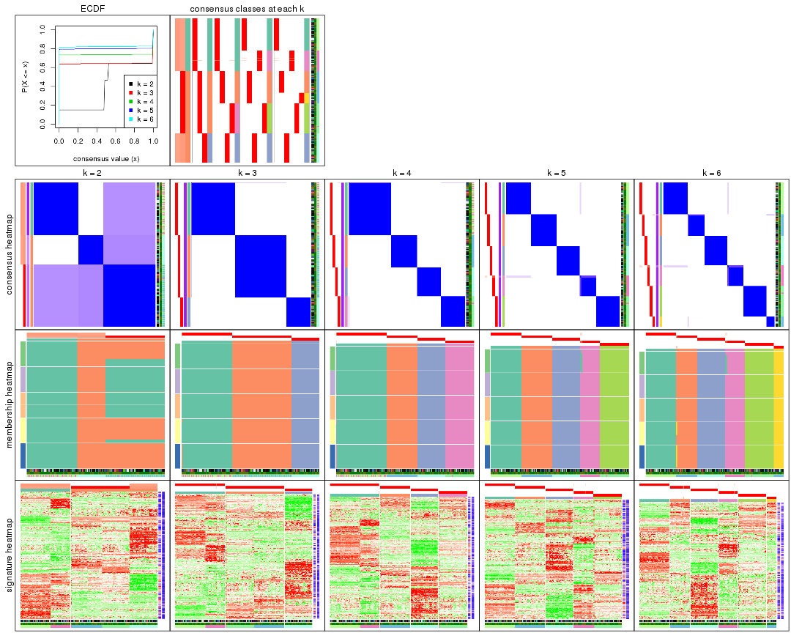

The plots are:

- The first row: a plot of the ECDF (empirical cumulative distribution
  function) curves of the consensus matrix for each `k` and the heatmap of
  predicted classes for each `k`.
- The second row: heatmaps of the consensus matrix for each `k`.
- The third row: heatmaps of the membership matrix for each `k`.
- The fouth row: heatmaps of the signatures for each `k`.

All the plots in panels can be made by individual functions and they are
plotted later in this section.

`select_partition_number()` produces several plots showing different
statistics for choosing "optimized" `k`. There are following statistics:

- ECDF curves of the consensus matrix for each `k`;
- 1-PAC. [The PAC
  score](https://en.wikipedia.org/wiki/Consensus_clustering#Over-interpretation_potential_of_consensus_clustering)
  measures the proportion of the ambiguous subgrouping.
- Mean silhouette score.
- Concordance. The mean probability of fiting the consensus class ids in all
  partitions.
- Area increased. Denote $A_k$ as the area under the ECDF curve for current
  `k`, the area increased is defined as $A_k - A_{k-1}$.
- Rand index. The percent of pairs of samples that are both in a same cluster
  or both are not in a same cluster in the partition of k and k-1.
- Jaccard index. The ratio of pairs of samples are both in a same cluster in
  the partition of k and k-1 and the pairs of samples are both in a same
  cluster in the partition k or k-1.

The detailed explanations of these statistics can be found in [the _cola_
vignette](http://bioconductor.org/packages/devel/bioc/vignettes/cola/inst/doc/cola.html#toc_13).

Generally speaking, lower PAC score, higher mean silhouette score or higher
concordance corresponds to better partition. Rand index and Jaccard index
measure how similar the current partition is compared to partition with `k-1`.
If they are too similar, we won't accept `k` is better than `k-1`.

```r
select_partition_number(res)
```


The numeric values for all these statistics can be obtained by `get_stats()`.

```r
get_stats(res)
```

```
#>   k 1-PAC mean_silhouette concordance area_increased  Rand Jaccard
#> 2 2 0.506           0.783       0.793         0.3996 0.533   0.533
#> 3 3 1.000           0.996       0.999         0.6095 0.824   0.670
#> 4 4 1.000           0.997       0.999         0.1463 0.906   0.738
#> 5 5 1.000           0.995       0.998         0.0860 0.936   0.756
#> 6 6 1.000           0.989       0.996         0.0275 0.978   0.891
```

`suggest_best_k()` suggests the best $k$ based on these statistics. The rules are as follows:

- All $k$ with Jaccard index larger than 0.95 are removed because increasing
  $k$ does not provide enough extra information. If all $k$ are removed, it is
  marked as no subgroup is detected.
- For all $k$ with 1-PAC score larger than 0.9, the maximal $k$ is taken as
  the best $k$, and other $k$ are marked as optional $k$.
- If it does not fit the second rule. The $k$ with the maximal vote of the
  highest 1-PAC score, highest mean silhouette, and highest concordance is
  taken as the best $k$.

```r
suggest_best_k(res)
```

```
#> [1] 6
#> attr(,"optional")
#> [1] 3 4 5
```

There is also optional best $k$ = 3 4 5 that is worth to check.

Following shows the table of the partitions (You need to click the **show/hide
code output** link to see it). The membership matrix (columns with name `p*`)
is inferred by
[`clue::cl_consensus()`](https://www.rdocumentation.org/link/cl_consensus?package=clue)
function with the `SE` method. Basically the value in the membership matrix
represents the probability to belong to a certain group. The finall class
label for an item is determined with the group with highest probability it
belongs to.

In `get_classes()` function, the entropy is calculated from the membership
matrix and the silhouette score is calculated from the consensus matrix.


<script>
$( function() {
	$( '#tabs-ATC-pam-get-classes' ).tabs();
} );
</script>
<div id='tabs-ATC-pam-get-classes'>
<ul>
<li><a href='#tab-ATC-pam-get-classes-1'>k = 2</a></li>
<li><a href='#tab-ATC-pam-get-classes-2'>k = 3</a></li>
<li><a href='#tab-ATC-pam-get-classes-3'>k = 4</a></li>
<li><a href='#tab-ATC-pam-get-classes-4'>k = 5</a></li>
<li><a href='#tab-ATC-pam-get-classes-5'>k = 6</a></li>
</ul>

<div id='tab-ATC-pam-get-classes-1'>
<p><a id='tab-ATC-pam-get-classes-1-a' style='color:#0366d6' href='#'>show/hide code output</a></p>
<pre><code class="r">cbind(get_classes(res, k = 2), get_membership(res, k = 2))
</code></pre>

<pre><code>#&gt;           class entropy silhouette   p1   p2
#&gt; GSM247795     2   0.000      0.702 0.00 1.00
#&gt; GSM247854     2   0.000      0.702 0.00 1.00
#&gt; GSM247758     2   0.000      0.702 0.00 1.00
#&gt; GSM247742     1   0.999      1.000 0.52 0.48
#&gt; GSM247755     2   0.999      0.563 0.48 0.52
#&gt; GSM247841     1   0.999      1.000 0.52 0.48
#&gt; GSM247703     2   0.000      0.702 0.00 1.00
#&gt; GSM247739     2   0.000      0.702 0.00 1.00
#&gt; GSM247715     1   0.999      1.000 0.52 0.48
#&gt; GSM247829     2   0.999      0.563 0.48 0.52
#&gt; GSM247842     1   0.999      1.000 0.52 0.48
#&gt; GSM247805     2   0.000      0.702 0.00 1.00
#&gt; GSM247786     2   0.000      0.702 0.00 1.00
#&gt; GSM247812     2   0.999      0.563 0.48 0.52
#&gt; GSM247776     1   0.999      1.000 0.52 0.48
#&gt; GSM247850     1   0.999      1.000 0.52 0.48
#&gt; GSM247717     2   0.000      0.702 0.00 1.00
#&gt; GSM247784     2   0.000      0.702 0.00 1.00
#&gt; GSM247834     1   0.999      1.000 0.52 0.48
#&gt; GSM247783     2   0.999      0.563 0.48 0.52
#&gt; GSM247846     1   0.999      1.000 0.52 0.48
#&gt; GSM247822     2   0.000      0.702 0.00 1.00
#&gt; GSM247710     2   0.000      0.702 0.00 1.00
#&gt; GSM247713     1   0.999      1.000 0.52 0.48
#&gt; GSM247840     2   0.999      0.563 0.48 0.52
#&gt; GSM247733     1   0.999      1.000 0.52 0.48
#&gt; GSM247852     1   0.999      1.000 0.52 0.48
#&gt; GSM247790     2   0.000      0.702 0.00 1.00
#&gt; GSM247730     2   0.000      0.702 0.00 1.00
#&gt; GSM247824     2   0.999      0.563 0.48 0.52
#&gt; GSM247770     1   0.999      1.000 0.52 0.48
#&gt; GSM247711     2   0.000      0.702 0.00 1.00
#&gt; GSM247782     2   0.000      0.702 0.00 1.00
#&gt; GSM247836     1   0.999      1.000 0.52 0.48
#&gt; GSM247785     2   0.999      0.563 0.48 0.52
#&gt; GSM247847     1   0.999      1.000 0.52 0.48
#&gt; GSM247750     2   0.000      0.702 0.00 1.00
#&gt; GSM247788     2   0.000      0.702 0.00 1.00
#&gt; GSM247849     1   0.999      1.000 0.52 0.48
#&gt; GSM247772     2   0.999      0.563 0.48 0.52
#&gt; GSM247760     1   0.999      1.000 0.52 0.48
#&gt; GSM247764     2   0.000      0.702 0.00 1.00
#&gt; GSM247851     2   0.000      0.702 0.00 1.00
#&gt; GSM247714     2   0.000      0.702 0.00 1.00
#&gt; GSM247828     1   0.999      1.000 0.52 0.48
#&gt; GSM247704     2   0.999      0.563 0.48 0.52
#&gt; GSM247818     1   0.999      1.000 0.52 0.48
#&gt; GSM247823     2   0.000      0.702 0.00 1.00
#&gt; GSM247706     2   0.000      0.702 0.00 1.00
#&gt; GSM247835     2   0.999      0.563 0.48 0.52
#&gt; GSM247734     1   0.999      1.000 0.52 0.48
#&gt; GSM247819     2   0.000      0.702 0.00 1.00
#&gt; GSM247809     2   0.000      0.702 0.00 1.00
#&gt; GSM247830     2   0.999      0.563 0.48 0.52
#&gt; GSM247833     1   0.999      1.000 0.52 0.48
#&gt; GSM247738     2   0.000      0.702 0.00 1.00
#&gt; GSM247716     2   0.000      0.702 0.00 1.00
#&gt; GSM247747     2   0.999      0.563 0.48 0.52
#&gt; GSM247722     1   0.999      1.000 0.52 0.48
#&gt; GSM247816     2   0.000      0.702 0.00 1.00
#&gt; GSM247839     2   0.000      0.702 0.00 1.00
#&gt; GSM247821     1   0.999      1.000 0.52 0.48
#&gt; GSM247798     2   0.999      0.563 0.48 0.52
#&gt; GSM247838     1   0.999      1.000 0.52 0.48
#&gt; GSM247721     2   0.000      0.702 0.00 1.00
#&gt; GSM247781     2   0.000      0.702 0.00 1.00
#&gt; GSM247762     1   0.999      1.000 0.52 0.48
#&gt; GSM247825     2   0.999      0.563 0.48 0.52
#&gt; GSM247777     1   0.999      1.000 0.52 0.48
#&gt; GSM247761     2   0.000      0.702 0.00 1.00
#&gt; GSM247720     2   0.000      0.702 0.00 1.00
#&gt; GSM247814     2   0.999      0.563 0.48 0.52
#&gt; GSM247732     1   0.999      1.000 0.52 0.48
#&gt; GSM247708     2   0.000      0.702 0.00 1.00
#&gt; GSM247740     2   0.000      0.702 0.00 1.00
#&gt; GSM247749     1   0.999      1.000 0.52 0.48
#&gt; GSM247767     2   0.999      0.563 0.48 0.52
#&gt; GSM247748     1   0.999      1.000 0.52 0.48
#&gt; GSM247705     2   0.000      0.702 0.00 1.00
#&gt; GSM247746     2   0.000      0.702 0.00 1.00
#&gt; GSM247752     1   0.999      1.000 0.52 0.48
#&gt; GSM247769     2   0.999      0.563 0.48 0.52
#&gt; GSM247753     1   0.999      1.000 0.52 0.48
#&gt; GSM247723     2   0.000      0.702 0.00 1.00
#&gt; GSM247779     2   0.000      0.702 0.00 1.00
#&gt; GSM247756     1   0.999      1.000 0.52 0.48
#&gt; GSM247826     2   0.999      0.563 0.48 0.52
#&gt; GSM247775     1   0.999      1.000 0.52 0.48
#&gt; GSM247741     2   0.000      0.702 0.00 1.00
#&gt; GSM247799     2   0.000      0.702 0.00 1.00
#&gt; GSM247778     1   0.999      1.000 0.52 0.48
#&gt; GSM247806     2   0.999      0.563 0.48 0.52
#&gt; GSM247815     1   0.999      1.000 0.52 0.48
#&gt; GSM247735     2   0.000      0.702 0.00 1.00
#&gt; GSM247831     2   0.000      0.702 0.00 1.00
#&gt; GSM247845     1   0.999      1.000 0.52 0.48
#&gt; GSM247791     2   0.999      0.563 0.48 0.52
#&gt; GSM247780     1   0.999      1.000 0.52 0.48
#&gt; GSM247853     1   0.999      1.000 0.52 0.48
#&gt; GSM247800     2   0.000      0.702 0.00 1.00
#&gt; GSM247729     2   0.000      0.702 0.00 1.00
#&gt; GSM247810     1   0.999      1.000 0.52 0.48
#&gt; GSM247844     2   0.999      0.563 0.48 0.52
#&gt; GSM247793     1   0.999      1.000 0.52 0.48
#&gt; GSM247759     2   0.000      0.702 0.00 1.00
#&gt; GSM247724     2   0.000      0.702 0.00 1.00
#&gt; GSM247817     2   0.999      0.563 0.48 0.52
#&gt; GSM247727     1   0.999      1.000 0.52 0.48
#&gt; GSM247796     2   0.000      0.702 0.00 1.00
#&gt; GSM247725     2   0.000      0.702 0.00 1.00
#&gt; GSM247801     1   0.999      1.000 0.52 0.48
#&gt; GSM247731     2   0.999      0.563 0.48 0.52
#&gt; GSM247765     1   0.999      1.000 0.52 0.48
#&gt; GSM247792     2   0.000      0.702 0.00 1.00
#&gt; GSM247726     2   0.000      0.702 0.00 1.00
#&gt; GSM247803     2   0.000      0.702 0.00 1.00
#&gt; GSM247728     2   0.999      0.563 0.48 0.52
#&gt; GSM247768     1   0.999      1.000 0.52 0.48
#&gt; GSM247745     2   0.000      0.702 0.00 1.00
#&gt; GSM247855     2   0.000      0.702 0.00 1.00
#&gt; GSM247804     2   0.000      0.702 0.00 1.00
#&gt; GSM247774     1   0.999      1.000 0.52 0.48
#&gt; GSM247807     2   0.999      0.563 0.48 0.52
#&gt; GSM247813     1   0.999      1.000 0.52 0.48
#&gt; GSM247736     2   0.000      0.702 0.00 1.00
#&gt; GSM247712     2   0.000      0.702 0.00 1.00
#&gt; GSM247797     1   0.999      1.000 0.52 0.48
#&gt; GSM247743     2   0.999      0.563 0.48 0.52
#&gt; GSM247719     1   0.999      1.000 0.52 0.48
#&gt; GSM247707     2   0.000      0.702 0.00 1.00
#&gt; GSM247737     2   0.000      0.702 0.00 1.00
#&gt; GSM247827     2   0.999      0.563 0.48 0.52
#&gt; GSM247848     1   0.999      1.000 0.52 0.48
#&gt; GSM247794     2   0.000      0.702 0.00 1.00
#&gt; GSM247757     2   0.000      0.702 0.00 1.00
#&gt; GSM247744     1   0.999      1.000 0.52 0.48
#&gt; GSM247751     2   0.999      0.563 0.48 0.52
#&gt; GSM247837     1   0.999      1.000 0.52 0.48
#&gt; GSM247754     2   0.000      0.702 0.00 1.00
#&gt; GSM247789     2   0.000      0.702 0.00 1.00
#&gt; GSM247802     1   0.999      1.000 0.52 0.48
#&gt; GSM247771     2   0.999      0.563 0.48 0.52
#&gt; GSM247763     1   0.999      1.000 0.52 0.48
#&gt; GSM247808     2   0.000      0.702 0.00 1.00
#&gt; GSM247787     2   0.000      0.702 0.00 1.00
#&gt; GSM247843     1   0.999      1.000 0.52 0.48
#&gt; GSM247811     2   0.999      0.563 0.48 0.52
#&gt; GSM247773     1   0.999      1.000 0.52 0.48
#&gt; GSM247766     2   0.000      0.702 0.00 1.00
#&gt; GSM247718     2   0.000      0.702 0.00 1.00
#&gt; GSM247832     1   0.999      1.000 0.52 0.48
#&gt; GSM247709     2   0.999      0.563 0.48 0.52
#&gt; GSM247820     1   0.999      1.000 0.52 0.48
</code></pre>

<script>
$('#tab-ATC-pam-get-classes-1-a').parent().next().next().hide();
$('#tab-ATC-pam-get-classes-1-a').click(function(){
  $('#tab-ATC-pam-get-classes-1-a').parent().next().next().toggle();
  return(false);
});
</script>
</div>

<div id='tab-ATC-pam-get-classes-2'>
<p><a id='tab-ATC-pam-get-classes-2-a' style='color:#0366d6' href='#'>show/hide code output</a></p>
<pre><code class="r">cbind(get_classes(res, k = 3), get_membership(res, k = 3))
</code></pre>

<pre><code>#&gt;           class entropy silhouette    p1    p2 p3
#&gt; GSM247795     2   0.000      1.000 0.000 1.000  0
#&gt; GSM247854     2   0.000      1.000 0.000 1.000  0
#&gt; GSM247758     2   0.000      1.000 0.000 1.000  0
#&gt; GSM247742     1   0.000      0.995 1.000 0.000  0
#&gt; GSM247755     3   0.000      1.000 0.000 0.000  1
#&gt; GSM247841     1   0.000      0.995 1.000 0.000  0
#&gt; GSM247703     2   0.000      1.000 0.000 1.000  0
#&gt; GSM247739     2   0.000      1.000 0.000 1.000  0
#&gt; GSM247715     1   0.000      0.995 1.000 0.000  0
#&gt; GSM247829     3   0.000      1.000 0.000 0.000  1
#&gt; GSM247842     1   0.000      0.995 1.000 0.000  0
#&gt; GSM247805     2   0.000      1.000 0.000 1.000  0
#&gt; GSM247786     2   0.000      1.000 0.000 1.000  0
#&gt; GSM247812     3   0.000      1.000 0.000 0.000  1
#&gt; GSM247776     1   0.000      0.995 1.000 0.000  0
#&gt; GSM247850     1   0.000      0.995 1.000 0.000  0
#&gt; GSM247717     2   0.000      1.000 0.000 1.000  0
#&gt; GSM247784     2   0.000      1.000 0.000 1.000  0
#&gt; GSM247834     1   0.000      0.995 1.000 0.000  0
#&gt; GSM247783     3   0.000      1.000 0.000 0.000  1
#&gt; GSM247846     1   0.000      0.995 1.000 0.000  0
#&gt; GSM247822     2   0.000      1.000 0.000 1.000  0
#&gt; GSM247710     2   0.000      1.000 0.000 1.000  0
#&gt; GSM247713     1   0.000      0.995 1.000 0.000  0
#&gt; GSM247840     3   0.000      1.000 0.000 0.000  1
#&gt; GSM247733     1   0.000      0.995 1.000 0.000  0
#&gt; GSM247852     1   0.000      0.995 1.000 0.000  0
#&gt; GSM247790     2   0.000      1.000 0.000 1.000  0
#&gt; GSM247730     2   0.000      1.000 0.000 1.000  0
#&gt; GSM247824     3   0.000      1.000 0.000 0.000  1
#&gt; GSM247770     1   0.000      0.995 1.000 0.000  0
#&gt; GSM247711     2   0.000      1.000 0.000 1.000  0
#&gt; GSM247782     2   0.000      1.000 0.000 1.000  0
#&gt; GSM247836     1   0.000      0.995 1.000 0.000  0
#&gt; GSM247785     3   0.000      1.000 0.000 0.000  1
#&gt; GSM247847     1   0.000      0.995 1.000 0.000  0
#&gt; GSM247750     2   0.000      1.000 0.000 1.000  0
#&gt; GSM247788     2   0.000      1.000 0.000 1.000  0
#&gt; GSM247849     1   0.000      0.995 1.000 0.000  0
#&gt; GSM247772     3   0.000      1.000 0.000 0.000  1
#&gt; GSM247760     1   0.000      0.995 1.000 0.000  0
#&gt; GSM247764     2   0.000      1.000 0.000 1.000  0
#&gt; GSM247851     2   0.000      1.000 0.000 1.000  0
#&gt; GSM247714     2   0.000      1.000 0.000 1.000  0
#&gt; GSM247828     1   0.000      0.995 1.000 0.000  0
#&gt; GSM247704     3   0.000      1.000 0.000 0.000  1
#&gt; GSM247818     1   0.000      0.995 1.000 0.000  0
#&gt; GSM247823     2   0.000      1.000 0.000 1.000  0
#&gt; GSM247706     2   0.000      1.000 0.000 1.000  0
#&gt; GSM247835     3   0.000      1.000 0.000 0.000  1
#&gt; GSM247734     1   0.000      0.995 1.000 0.000  0
#&gt; GSM247819     2   0.000      1.000 0.000 1.000  0
#&gt; GSM247809     2   0.000      1.000 0.000 1.000  0
#&gt; GSM247830     3   0.000      1.000 0.000 0.000  1
#&gt; GSM247833     1   0.000      0.995 1.000 0.000  0
#&gt; GSM247738     2   0.000      1.000 0.000 1.000  0
#&gt; GSM247716     2   0.000      1.000 0.000 1.000  0
#&gt; GSM247747     3   0.000      1.000 0.000 0.000  1
#&gt; GSM247722     1   0.000      0.995 1.000 0.000  0
#&gt; GSM247816     2   0.000      1.000 0.000 1.000  0
#&gt; GSM247839     2   0.000      1.000 0.000 1.000  0
#&gt; GSM247821     1   0.000      0.995 1.000 0.000  0
#&gt; GSM247798     3   0.000      1.000 0.000 0.000  1
#&gt; GSM247838     1   0.000      0.995 1.000 0.000  0
#&gt; GSM247721     2   0.000      1.000 0.000 1.000  0
#&gt; GSM247781     2   0.000      1.000 0.000 1.000  0
#&gt; GSM247762     1   0.000      0.995 1.000 0.000  0
#&gt; GSM247825     3   0.000      1.000 0.000 0.000  1
#&gt; GSM247777     1   0.000      0.995 1.000 0.000  0
#&gt; GSM247761     2   0.000      1.000 0.000 1.000  0
#&gt; GSM247720     2   0.000      1.000 0.000 1.000  0
#&gt; GSM247814     3   0.000      1.000 0.000 0.000  1
#&gt; GSM247732     1   0.000      0.995 1.000 0.000  0
#&gt; GSM247708     2   0.000      1.000 0.000 1.000  0
#&gt; GSM247740     2   0.000      1.000 0.000 1.000  0
#&gt; GSM247749     1   0.000      0.995 1.000 0.000  0
#&gt; GSM247767     3   0.000      1.000 0.000 0.000  1
#&gt; GSM247748     1   0.000      0.995 1.000 0.000  0
#&gt; GSM247705     2   0.000      1.000 0.000 1.000  0
#&gt; GSM247746     2   0.000      1.000 0.000 1.000  0
#&gt; GSM247752     1   0.489      0.695 0.772 0.228  0
#&gt; GSM247769     3   0.000      1.000 0.000 0.000  1
#&gt; GSM247753     1   0.000      0.995 1.000 0.000  0
#&gt; GSM247723     2   0.000      1.000 0.000 1.000  0
#&gt; GSM247779     2   0.000      1.000 0.000 1.000  0
#&gt; GSM247756     1   0.000      0.995 1.000 0.000  0
#&gt; GSM247826     3   0.000      1.000 0.000 0.000  1
#&gt; GSM247775     1   0.000      0.995 1.000 0.000  0
#&gt; GSM247741     2   0.000      1.000 0.000 1.000  0
#&gt; GSM247799     2   0.000      1.000 0.000 1.000  0
#&gt; GSM247778     1   0.000      0.995 1.000 0.000  0
#&gt; GSM247806     3   0.000      1.000 0.000 0.000  1
#&gt; GSM247815     1   0.000      0.995 1.000 0.000  0
#&gt; GSM247735     2   0.000      1.000 0.000 1.000  0
#&gt; GSM247831     2   0.000      1.000 0.000 1.000  0
#&gt; GSM247845     1   0.000      0.995 1.000 0.000  0
#&gt; GSM247791     3   0.000      1.000 0.000 0.000  1
#&gt; GSM247780     1   0.000      0.995 1.000 0.000  0
#&gt; GSM247853     1   0.000      0.995 1.000 0.000  0
#&gt; GSM247800     2   0.000      1.000 0.000 1.000  0
#&gt; GSM247729     2   0.000      1.000 0.000 1.000  0
#&gt; GSM247810     1   0.000      0.995 1.000 0.000  0
#&gt; GSM247844     3   0.000      1.000 0.000 0.000  1
#&gt; GSM247793     1   0.000      0.995 1.000 0.000  0
#&gt; GSM247759     2   0.000      1.000 0.000 1.000  0
#&gt; GSM247724     2   0.000      1.000 0.000 1.000  0
#&gt; GSM247817     3   0.000      1.000 0.000 0.000  1
#&gt; GSM247727     1   0.000      0.995 1.000 0.000  0
#&gt; GSM247796     2   0.000      1.000 0.000 1.000  0
#&gt; GSM247725     2   0.000      1.000 0.000 1.000  0
#&gt; GSM247801     1   0.000      0.995 1.000 0.000  0
#&gt; GSM247731     3   0.000      1.000 0.000 0.000  1
#&gt; GSM247765     1   0.000      0.995 1.000 0.000  0
#&gt; GSM247792     2   0.000      1.000 0.000 1.000  0
#&gt; GSM247726     2   0.000      1.000 0.000 1.000  0
#&gt; GSM247803     2   0.000      1.000 0.000 1.000  0
#&gt; GSM247728     3   0.000      1.000 0.000 0.000  1
#&gt; GSM247768     1   0.000      0.995 1.000 0.000  0
#&gt; GSM247745     2   0.000      1.000 0.000 1.000  0
#&gt; GSM247855     2   0.000      1.000 0.000 1.000  0
#&gt; GSM247804     2   0.000      1.000 0.000 1.000  0
#&gt; GSM247774     1   0.000      0.995 1.000 0.000  0
#&gt; GSM247807     3   0.000      1.000 0.000 0.000  1
#&gt; GSM247813     1   0.000      0.995 1.000 0.000  0
#&gt; GSM247736     2   0.000      1.000 0.000 1.000  0
#&gt; GSM247712     2   0.000      1.000 0.000 1.000  0
#&gt; GSM247797     1   0.000      0.995 1.000 0.000  0
#&gt; GSM247743     3   0.000      1.000 0.000 0.000  1
#&gt; GSM247719     1   0.000      0.995 1.000 0.000  0
#&gt; GSM247707     2   0.000      1.000 0.000 1.000  0
#&gt; GSM247737     2   0.000      1.000 0.000 1.000  0
#&gt; GSM247827     3   0.000      1.000 0.000 0.000  1
#&gt; GSM247848     1   0.000      0.995 1.000 0.000  0
#&gt; GSM247794     2   0.000      1.000 0.000 1.000  0
#&gt; GSM247757     2   0.000      1.000 0.000 1.000  0
#&gt; GSM247744     1   0.000      0.995 1.000 0.000  0
#&gt; GSM247751     3   0.000      1.000 0.000 0.000  1
#&gt; GSM247837     1   0.000      0.995 1.000 0.000  0
#&gt; GSM247754     2   0.000      1.000 0.000 1.000  0
#&gt; GSM247789     2   0.000      1.000 0.000 1.000  0
#&gt; GSM247802     1   0.000      0.995 1.000 0.000  0
#&gt; GSM247771     3   0.000      1.000 0.000 0.000  1
#&gt; GSM247763     1   0.000      0.995 1.000 0.000  0
#&gt; GSM247808     2   0.000      1.000 0.000 1.000  0
#&gt; GSM247787     2   0.000      1.000 0.000 1.000  0
#&gt; GSM247843     1   0.000      0.995 1.000 0.000  0
#&gt; GSM247811     3   0.000      1.000 0.000 0.000  1
#&gt; GSM247773     1   0.000      0.995 1.000 0.000  0
#&gt; GSM247766     2   0.000      1.000 0.000 1.000  0
#&gt; GSM247718     2   0.000      1.000 0.000 1.000  0
#&gt; GSM247832     1   0.000      0.995 1.000 0.000  0
#&gt; GSM247709     3   0.000      1.000 0.000 0.000  1
#&gt; GSM247820     1   0.000      0.995 1.000 0.000  0
</code></pre>

<script>
$('#tab-ATC-pam-get-classes-2-a').parent().next().next().hide();
$('#tab-ATC-pam-get-classes-2-a').click(function(){
  $('#tab-ATC-pam-get-classes-2-a').parent().next().next().toggle();
  return(false);
});
</script>
</div>

<div id='tab-ATC-pam-get-classes-3'>
<p><a id='tab-ATC-pam-get-classes-3-a' style='color:#0366d6' href='#'>show/hide code output</a></p>
<pre><code class="r">cbind(get_classes(res, k = 4), get_membership(res, k = 4))
</code></pre>

<pre><code>#&gt;           class entropy silhouette    p1 p2 p3    p4
#&gt; GSM247795     2   0.000      1.000 0.000  1  0 0.000
#&gt; GSM247854     2   0.000      1.000 0.000  1  0 0.000
#&gt; GSM247758     4   0.000      1.000 0.000  0  0 1.000
#&gt; GSM247742     1   0.000      0.996 1.000  0  0 0.000
#&gt; GSM247755     3   0.000      1.000 0.000  0  1 0.000
#&gt; GSM247841     1   0.000      0.996 1.000  0  0 0.000
#&gt; GSM247703     2   0.000      1.000 0.000  1  0 0.000
#&gt; GSM247739     4   0.000      1.000 0.000  0  0 1.000
#&gt; GSM247715     1   0.000      0.996 1.000  0  0 0.000
#&gt; GSM247829     3   0.000      1.000 0.000  0  1 0.000
#&gt; GSM247842     1   0.000      0.996 1.000  0  0 0.000
#&gt; GSM247805     2   0.000      1.000 0.000  1  0 0.000
#&gt; GSM247786     4   0.000      1.000 0.000  0  0 1.000
#&gt; GSM247812     3   0.000      1.000 0.000  0  1 0.000
#&gt; GSM247776     1   0.000      0.996 1.000  0  0 0.000
#&gt; GSM247850     1   0.000      0.996 1.000  0  0 0.000
#&gt; GSM247717     2   0.000      1.000 0.000  1  0 0.000
#&gt; GSM247784     4   0.000      1.000 0.000  0  0 1.000
#&gt; GSM247834     1   0.000      0.996 1.000  0  0 0.000
#&gt; GSM247783     3   0.000      1.000 0.000  0  1 0.000
#&gt; GSM247846     1   0.000      0.996 1.000  0  0 0.000
#&gt; GSM247822     2   0.000      1.000 0.000  1  0 0.000
#&gt; GSM247710     4   0.000      1.000 0.000  0  0 1.000
#&gt; GSM247713     1   0.000      0.996 1.000  0  0 0.000
#&gt; GSM247840     3   0.000      1.000 0.000  0  1 0.000
#&gt; GSM247733     1   0.000      0.996 1.000  0  0 0.000
#&gt; GSM247852     1   0.000      0.996 1.000  0  0 0.000
#&gt; GSM247790     2   0.000      1.000 0.000  1  0 0.000
#&gt; GSM247730     4   0.000      1.000 0.000  0  0 1.000
#&gt; GSM247824     3   0.000      1.000 0.000  0  1 0.000
#&gt; GSM247770     1   0.000      0.996 1.000  0  0 0.000
#&gt; GSM247711     2   0.000      1.000 0.000  1  0 0.000
#&gt; GSM247782     4   0.000      1.000 0.000  0  0 1.000
#&gt; GSM247836     1   0.000      0.996 1.000  0  0 0.000
#&gt; GSM247785     3   0.000      1.000 0.000  0  1 0.000
#&gt; GSM247847     1   0.000      0.996 1.000  0  0 0.000
#&gt; GSM247750     2   0.000      1.000 0.000  1  0 0.000
#&gt; GSM247788     4   0.000      1.000 0.000  0  0 1.000
#&gt; GSM247849     1   0.000      0.996 1.000  0  0 0.000
#&gt; GSM247772     3   0.000      1.000 0.000  0  1 0.000
#&gt; GSM247760     1   0.000      0.996 1.000  0  0 0.000
#&gt; GSM247764     2   0.000      1.000 0.000  1  0 0.000
#&gt; GSM247851     2   0.000      1.000 0.000  1  0 0.000
#&gt; GSM247714     4   0.000      1.000 0.000  0  0 1.000
#&gt; GSM247828     1   0.000      0.996 1.000  0  0 0.000
#&gt; GSM247704     3   0.000      1.000 0.000  0  1 0.000
#&gt; GSM247818     1   0.000      0.996 1.000  0  0 0.000
#&gt; GSM247823     2   0.000      1.000 0.000  1  0 0.000
#&gt; GSM247706     4   0.000      1.000 0.000  0  0 1.000
#&gt; GSM247835     3   0.000      1.000 0.000  0  1 0.000
#&gt; GSM247734     1   0.000      0.996 1.000  0  0 0.000
#&gt; GSM247819     2   0.000      1.000 0.000  1  0 0.000
#&gt; GSM247809     4   0.000      1.000 0.000  0  0 1.000
#&gt; GSM247830     3   0.000      1.000 0.000  0  1 0.000
#&gt; GSM247833     1   0.000      0.996 1.000  0  0 0.000
#&gt; GSM247738     2   0.000      1.000 0.000  1  0 0.000
#&gt; GSM247716     4   0.000      1.000 0.000  0  0 1.000
#&gt; GSM247747     3   0.000      1.000 0.000  0  1 0.000
#&gt; GSM247722     1   0.000      0.996 1.000  0  0 0.000
#&gt; GSM247816     2   0.000      1.000 0.000  1  0 0.000
#&gt; GSM247839     4   0.000      1.000 0.000  0  0 1.000
#&gt; GSM247821     1   0.000      0.996 1.000  0  0 0.000
#&gt; GSM247798     3   0.000      1.000 0.000  0  1 0.000
#&gt; GSM247838     1   0.000      0.996 1.000  0  0 0.000
#&gt; GSM247721     2   0.000      1.000 0.000  1  0 0.000
#&gt; GSM247781     4   0.000      1.000 0.000  0  0 1.000
#&gt; GSM247762     1   0.000      0.996 1.000  0  0 0.000
#&gt; GSM247825     3   0.000      1.000 0.000  0  1 0.000
#&gt; GSM247777     1   0.000      0.996 1.000  0  0 0.000
#&gt; GSM247761     2   0.000      1.000 0.000  1  0 0.000
#&gt; GSM247720     4   0.000      1.000 0.000  0  0 1.000
#&gt; GSM247814     3   0.000      1.000 0.000  0  1 0.000
#&gt; GSM247732     1   0.000      0.996 1.000  0  0 0.000
#&gt; GSM247708     2   0.000      1.000 0.000  1  0 0.000
#&gt; GSM247740     4   0.000      1.000 0.000  0  0 1.000
#&gt; GSM247749     1   0.000      0.996 1.000  0  0 0.000
#&gt; GSM247767     3   0.000      1.000 0.000  0  1 0.000
#&gt; GSM247748     1   0.000      0.996 1.000  0  0 0.000
#&gt; GSM247705     2   0.000      1.000 0.000  1  0 0.000
#&gt; GSM247746     4   0.000      1.000 0.000  0  0 1.000
#&gt; GSM247752     1   0.387      0.705 0.772  0  0 0.228
#&gt; GSM247769     3   0.000      1.000 0.000  0  1 0.000
#&gt; GSM247753     1   0.000      0.996 1.000  0  0 0.000
#&gt; GSM247723     2   0.000      1.000 0.000  1  0 0.000
#&gt; GSM247779     4   0.000      1.000 0.000  0  0 1.000
#&gt; GSM247756     1   0.000      0.996 1.000  0  0 0.000
#&gt; GSM247826     3   0.000      1.000 0.000  0  1 0.000
#&gt; GSM247775     1   0.000      0.996 1.000  0  0 0.000
#&gt; GSM247741     2   0.000      1.000 0.000  1  0 0.000
#&gt; GSM247799     4   0.000      1.000 0.000  0  0 1.000
#&gt; GSM247778     1   0.000      0.996 1.000  0  0 0.000
#&gt; GSM247806     3   0.000      1.000 0.000  0  1 0.000
#&gt; GSM247815     1   0.000      0.996 1.000  0  0 0.000
#&gt; GSM247735     2   0.000      1.000 0.000  1  0 0.000
#&gt; GSM247831     4   0.000      1.000 0.000  0  0 1.000
#&gt; GSM247845     1   0.000      0.996 1.000  0  0 0.000
#&gt; GSM247791     3   0.000      1.000 0.000  0  1 0.000
#&gt; GSM247780     1   0.000      0.996 1.000  0  0 0.000
#&gt; GSM247853     1   0.000      0.996 1.000  0  0 0.000
#&gt; GSM247800     2   0.000      1.000 0.000  1  0 0.000
#&gt; GSM247729     4   0.000      1.000 0.000  0  0 1.000
#&gt; GSM247810     1   0.000      0.996 1.000  0  0 0.000
#&gt; GSM247844     3   0.000      1.000 0.000  0  1 0.000
#&gt; GSM247793     1   0.000      0.996 1.000  0  0 0.000
#&gt; GSM247759     2   0.000      1.000 0.000  1  0 0.000
#&gt; GSM247724     4   0.000      1.000 0.000  0  0 1.000
#&gt; GSM247817     3   0.000      1.000 0.000  0  1 0.000
#&gt; GSM247727     1   0.000      0.996 1.000  0  0 0.000
#&gt; GSM247796     2   0.000      1.000 0.000  1  0 0.000
#&gt; GSM247725     4   0.000      1.000 0.000  0  0 1.000
#&gt; GSM247801     1   0.000      0.996 1.000  0  0 0.000
#&gt; GSM247731     3   0.000      1.000 0.000  0  1 0.000
#&gt; GSM247765     1   0.000      0.996 1.000  0  0 0.000
#&gt; GSM247792     2   0.000      1.000 0.000  1  0 0.000
#&gt; GSM247726     4   0.000      1.000 0.000  0  0 1.000
#&gt; GSM247803     4   0.000      1.000 0.000  0  0 1.000
#&gt; GSM247728     3   0.000      1.000 0.000  0  1 0.000
#&gt; GSM247768     1   0.000      0.996 1.000  0  0 0.000
#&gt; GSM247745     2   0.000      1.000 0.000  1  0 0.000
#&gt; GSM247855     2   0.000      1.000 0.000  1  0 0.000
#&gt; GSM247804     4   0.000      1.000 0.000  0  0 1.000
#&gt; GSM247774     1   0.000      0.996 1.000  0  0 0.000
#&gt; GSM247807     3   0.000      1.000 0.000  0  1 0.000
#&gt; GSM247813     1   0.000      0.996 1.000  0  0 0.000
#&gt; GSM247736     2   0.000      1.000 0.000  1  0 0.000
#&gt; GSM247712     4   0.000      1.000 0.000  0  0 1.000
#&gt; GSM247797     1   0.000      0.996 1.000  0  0 0.000
#&gt; GSM247743     3   0.000      1.000 0.000  0  1 0.000
#&gt; GSM247719     1   0.000      0.996 1.000  0  0 0.000
#&gt; GSM247707     2   0.000      1.000 0.000  1  0 0.000
#&gt; GSM247737     4   0.000      1.000 0.000  0  0 1.000
#&gt; GSM247827     3   0.000      1.000 0.000  0  1 0.000
#&gt; GSM247848     1   0.000      0.996 1.000  0  0 0.000
#&gt; GSM247794     2   0.000      1.000 0.000  1  0 0.000
#&gt; GSM247757     4   0.000      1.000 0.000  0  0 1.000
#&gt; GSM247744     1   0.000      0.996 1.000  0  0 0.000
#&gt; GSM247751     3   0.000      1.000 0.000  0  1 0.000
#&gt; GSM247837     1   0.000      0.996 1.000  0  0 0.000
#&gt; GSM247754     2   0.000      1.000 0.000  1  0 0.000
#&gt; GSM247789     4   0.000      1.000 0.000  0  0 1.000
#&gt; GSM247802     1   0.000      0.996 1.000  0  0 0.000
#&gt; GSM247771     3   0.000      1.000 0.000  0  1 0.000
#&gt; GSM247763     1   0.000      0.996 1.000  0  0 0.000
#&gt; GSM247808     2   0.000      1.000 0.000  1  0 0.000
#&gt; GSM247787     4   0.000      1.000 0.000  0  0 1.000
#&gt; GSM247843     1   0.000      0.996 1.000  0  0 0.000
#&gt; GSM247811     3   0.000      1.000 0.000  0  1 0.000
#&gt; GSM247773     1   0.000      0.996 1.000  0  0 0.000
#&gt; GSM247766     2   0.000      1.000 0.000  1  0 0.000
#&gt; GSM247718     4   0.000      1.000 0.000  0  0 1.000
#&gt; GSM247832     1   0.000      0.996 1.000  0  0 0.000
#&gt; GSM247709     3   0.000      1.000 0.000  0  1 0.000
#&gt; GSM247820     1   0.000      0.996 1.000  0  0 0.000
</code></pre>

<script>
$('#tab-ATC-pam-get-classes-3-a').parent().next().next().hide();
$('#tab-ATC-pam-get-classes-3-a').click(function(){
  $('#tab-ATC-pam-get-classes-3-a').parent().next().next().toggle();
  return(false);
});
</script>
</div>

<div id='tab-ATC-pam-get-classes-4'>
<p><a id='tab-ATC-pam-get-classes-4-a' style='color:#0366d6' href='#'>show/hide code output</a></p>
<pre><code class="r">cbind(get_classes(res, k = 5), get_membership(res, k = 5))
</code></pre>

<pre><code>#&gt;           class entropy silhouette    p1 p2 p3    p4 p5
#&gt; GSM247795     2   0.000      1.000 0.000  1  0 0.000  0
#&gt; GSM247854     2   0.000      1.000 0.000  1  0 0.000  0
#&gt; GSM247758     5   0.000      1.000 0.000  0  0 0.000  1
#&gt; GSM247742     4   0.000      0.983 0.000  0  0 1.000  0
#&gt; GSM247755     3   0.000      1.000 0.000  0  1 0.000  0
#&gt; GSM247841     1   0.000      1.000 1.000  0  0 0.000  0
#&gt; GSM247703     2   0.000      1.000 0.000  1  0 0.000  0
#&gt; GSM247739     5   0.000      1.000 0.000  0  0 0.000  1
#&gt; GSM247715     4   0.000      0.983 0.000  0  0 1.000  0
#&gt; GSM247829     3   0.000      1.000 0.000  0  1 0.000  0
#&gt; GSM247842     1   0.000      1.000 1.000  0  0 0.000  0
#&gt; GSM247805     2   0.000      1.000 0.000  1  0 0.000  0
#&gt; GSM247786     5   0.000      1.000 0.000  0  0 0.000  1
#&gt; GSM247812     3   0.000      1.000 0.000  0  1 0.000  0
#&gt; GSM247776     1   0.000      1.000 1.000  0  0 0.000  0
#&gt; GSM247850     1   0.000      1.000 1.000  0  0 0.000  0
#&gt; GSM247717     2   0.000      1.000 0.000  1  0 0.000  0
#&gt; GSM247784     5   0.000      1.000 0.000  0  0 0.000  1
#&gt; GSM247834     4   0.000      0.983 0.000  0  0 1.000  0
#&gt; GSM247783     3   0.000      1.000 0.000  0  1 0.000  0
#&gt; GSM247846     1   0.000      1.000 1.000  0  0 0.000  0
#&gt; GSM247822     2   0.000      1.000 0.000  1  0 0.000  0
#&gt; GSM247710     5   0.000      1.000 0.000  0  0 0.000  1
#&gt; GSM247713     4   0.000      0.983 0.000  0  0 1.000  0
#&gt; GSM247840     3   0.000      1.000 0.000  0  1 0.000  0
#&gt; GSM247733     1   0.000      1.000 1.000  0  0 0.000  0
#&gt; GSM247852     1   0.000      1.000 1.000  0  0 0.000  0
#&gt; GSM247790     2   0.000      1.000 0.000  1  0 0.000  0
#&gt; GSM247730     5   0.000      1.000 0.000  0  0 0.000  1
#&gt; GSM247824     3   0.000      1.000 0.000  0  1 0.000  0
#&gt; GSM247770     1   0.000      1.000 1.000  0  0 0.000  0
#&gt; GSM247711     2   0.000      1.000 0.000  1  0 0.000  0
#&gt; GSM247782     5   0.000      1.000 0.000  0  0 0.000  1
#&gt; GSM247836     4   0.000      0.983 0.000  0  0 1.000  0
#&gt; GSM247785     3   0.000      1.000 0.000  0  1 0.000  0
#&gt; GSM247847     1   0.000      1.000 1.000  0  0 0.000  0
#&gt; GSM247750     2   0.000      1.000 0.000  1  0 0.000  0
#&gt; GSM247788     5   0.000      1.000 0.000  0  0 0.000  1
#&gt; GSM247849     4   0.029      0.976 0.008  0  0 0.992  0
#&gt; GSM247772     3   0.000      1.000 0.000  0  1 0.000  0
#&gt; GSM247760     1   0.000      1.000 1.000  0  0 0.000  0
#&gt; GSM247764     2   0.000      1.000 0.000  1  0 0.000  0
#&gt; GSM247851     2   0.000      1.000 0.000  1  0 0.000  0
#&gt; GSM247714     5   0.000      1.000 0.000  0  0 0.000  1
#&gt; GSM247828     4   0.000      0.983 0.000  0  0 1.000  0
#&gt; GSM247704     3   0.000      1.000 0.000  0  1 0.000  0
#&gt; GSM247818     1   0.000      1.000 1.000  0  0 0.000  0
#&gt; GSM247823     2   0.000      1.000 0.000  1  0 0.000  0
#&gt; GSM247706     5   0.000      1.000 0.000  0  0 0.000  1
#&gt; GSM247835     3   0.000      1.000 0.000  0  1 0.000  0
#&gt; GSM247734     1   0.000      1.000 1.000  0  0 0.000  0
#&gt; GSM247819     2   0.000      1.000 0.000  1  0 0.000  0
#&gt; GSM247809     5   0.000      1.000 0.000  0  0 0.000  1
#&gt; GSM247830     3   0.000      1.000 0.000  0  1 0.000  0
#&gt; GSM247833     1   0.000      1.000 1.000  0  0 0.000  0
#&gt; GSM247738     2   0.000      1.000 0.000  1  0 0.000  0
#&gt; GSM247716     5   0.000      1.000 0.000  0  0 0.000  1
#&gt; GSM247747     3   0.000      1.000 0.000  0  1 0.000  0
#&gt; GSM247722     1   0.000      1.000 1.000  0  0 0.000  0
#&gt; GSM247816     2   0.000      1.000 0.000  1  0 0.000  0
#&gt; GSM247839     5   0.000      1.000 0.000  0  0 0.000  1
#&gt; GSM247821     4   0.000      0.983 0.000  0  0 1.000  0
#&gt; GSM247798     3   0.000      1.000 0.000  0  1 0.000  0
#&gt; GSM247838     1   0.000      1.000 1.000  0  0 0.000  0
#&gt; GSM247721     2   0.000      1.000 0.000  1  0 0.000  0
#&gt; GSM247781     5   0.000      1.000 0.000  0  0 0.000  1
#&gt; GSM247762     4   0.277      0.813 0.164  0  0 0.836  0
#&gt; GSM247825     3   0.000      1.000 0.000  0  1 0.000  0
#&gt; GSM247777     1   0.000      1.000 1.000  0  0 0.000  0
#&gt; GSM247761     2   0.000      1.000 0.000  1  0 0.000  0
#&gt; GSM247720     5   0.000      1.000 0.000  0  0 0.000  1
#&gt; GSM247814     3   0.000      1.000 0.000  0  1 0.000  0
#&gt; GSM247732     1   0.000      1.000 1.000  0  0 0.000  0
#&gt; GSM247708     2   0.000      1.000 0.000  1  0 0.000  0
#&gt; GSM247740     5   0.000      1.000 0.000  0  0 0.000  1
#&gt; GSM247749     4   0.000      0.983 0.000  0  0 1.000  0
#&gt; GSM247767     3   0.000      1.000 0.000  0  1 0.000  0
#&gt; GSM247748     1   0.000      1.000 1.000  0  0 0.000  0
#&gt; GSM247705     2   0.000      1.000 0.000  1  0 0.000  0
#&gt; GSM247746     5   0.000      1.000 0.000  0  0 0.000  1
#&gt; GSM247752     4   0.293      0.791 0.180  0  0 0.820  0
#&gt; GSM247769     3   0.000      1.000 0.000  0  1 0.000  0
#&gt; GSM247753     1   0.000      1.000 1.000  0  0 0.000  0
#&gt; GSM247723     2   0.000      1.000 0.000  1  0 0.000  0
#&gt; GSM247779     5   0.000      1.000 0.000  0  0 0.000  1
#&gt; GSM247756     4   0.000      0.983 0.000  0  0 1.000  0
#&gt; GSM247826     3   0.000      1.000 0.000  0  1 0.000  0
#&gt; GSM247775     1   0.000      1.000 1.000  0  0 0.000  0
#&gt; GSM247741     2   0.000      1.000 0.000  1  0 0.000  0
#&gt; GSM247799     5   0.000      1.000 0.000  0  0 0.000  1
#&gt; GSM247778     4   0.000      0.983 0.000  0  0 1.000  0
#&gt; GSM247806     3   0.000      1.000 0.000  0  1 0.000  0
#&gt; GSM247815     1   0.000      1.000 1.000  0  0 0.000  0
#&gt; GSM247735     2   0.000      1.000 0.000  1  0 0.000  0
#&gt; GSM247831     5   0.000      1.000 0.000  0  0 0.000  1
#&gt; GSM247845     4   0.000      0.983 0.000  0  0 1.000  0
#&gt; GSM247791     3   0.000      1.000 0.000  0  1 0.000  0
#&gt; GSM247780     1   0.000      1.000 1.000  0  0 0.000  0
#&gt; GSM247853     1   0.000      1.000 1.000  0  0 0.000  0
#&gt; GSM247800     2   0.000      1.000 0.000  1  0 0.000  0
#&gt; GSM247729     5   0.000      1.000 0.000  0  0 0.000  1
#&gt; GSM247810     4   0.000      0.983 0.000  0  0 1.000  0
#&gt; GSM247844     3   0.000      1.000 0.000  0  1 0.000  0
#&gt; GSM247793     1   0.000      1.000 1.000  0  0 0.000  0
#&gt; GSM247759     2   0.000      1.000 0.000  1  0 0.000  0
#&gt; GSM247724     5   0.000      1.000 0.000  0  0 0.000  1
#&gt; GSM247817     3   0.000      1.000 0.000  0  1 0.000  0
#&gt; GSM247727     1   0.000      1.000 1.000  0  0 0.000  0
#&gt; GSM247796     2   0.000      1.000 0.000  1  0 0.000  0
#&gt; GSM247725     5   0.000      1.000 0.000  0  0 0.000  1
#&gt; GSM247801     4   0.000      0.983 0.000  0  0 1.000  0
#&gt; GSM247731     3   0.000      1.000 0.000  0  1 0.000  0
#&gt; GSM247765     1   0.000      1.000 1.000  0  0 0.000  0
#&gt; GSM247792     2   0.000      1.000 0.000  1  0 0.000  0
#&gt; GSM247726     5   0.000      1.000 0.000  0  0 0.000  1
#&gt; GSM247803     5   0.000      1.000 0.000  0  0 0.000  1
#&gt; GSM247728     3   0.000      1.000 0.000  0  1 0.000  0
#&gt; GSM247768     1   0.000      1.000 1.000  0  0 0.000  0
#&gt; GSM247745     2   0.000      1.000 0.000  1  0 0.000  0
#&gt; GSM247855     2   0.000      1.000 0.000  1  0 0.000  0
#&gt; GSM247804     5   0.000      1.000 0.000  0  0 0.000  1
#&gt; GSM247774     4   0.000      0.983 0.000  0  0 1.000  0
#&gt; GSM247807     3   0.000      1.000 0.000  0  1 0.000  0
#&gt; GSM247813     1   0.000      1.000 1.000  0  0 0.000  0
#&gt; GSM247736     2   0.000      1.000 0.000  1  0 0.000  0
#&gt; GSM247712     5   0.000      1.000 0.000  0  0 0.000  1
#&gt; GSM247797     4   0.000      0.983 0.000  0  0 1.000  0
#&gt; GSM247743     3   0.000      1.000 0.000  0  1 0.000  0
#&gt; GSM247719     1   0.000      1.000 1.000  0  0 0.000  0
#&gt; GSM247707     2   0.000      1.000 0.000  1  0 0.000  0
#&gt; GSM247737     5   0.000      1.000 0.000  0  0 0.000  1
#&gt; GSM247827     3   0.000      1.000 0.000  0  1 0.000  0
#&gt; GSM247848     1   0.000      1.000 1.000  0  0 0.000  0
#&gt; GSM247794     2   0.000      1.000 0.000  1  0 0.000  0
#&gt; GSM247757     5   0.000      1.000 0.000  0  0 0.000  1
#&gt; GSM247744     4   0.000      0.983 0.000  0  0 1.000  0
#&gt; GSM247751     3   0.000      1.000 0.000  0  1 0.000  0
#&gt; GSM247837     1   0.000      1.000 1.000  0  0 0.000  0
#&gt; GSM247754     2   0.000      1.000 0.000  1  0 0.000  0
#&gt; GSM247789     5   0.000      1.000 0.000  0  0 0.000  1
#&gt; GSM247802     4   0.000      0.983 0.000  0  0 1.000  0
#&gt; GSM247771     3   0.000      1.000 0.000  0  1 0.000  0
#&gt; GSM247763     1   0.000      1.000 1.000  0  0 0.000  0
#&gt; GSM247808     2   0.000      1.000 0.000  1  0 0.000  0
#&gt; GSM247787     5   0.000      1.000 0.000  0  0 0.000  1
#&gt; GSM247843     4   0.000      0.983 0.000  0  0 1.000  0
#&gt; GSM247811     3   0.000      1.000 0.000  0  1 0.000  0
#&gt; GSM247773     1   0.000      1.000 1.000  0  0 0.000  0
#&gt; GSM247766     2   0.000      1.000 0.000  1  0 0.000  0
#&gt; GSM247718     5   0.000      1.000 0.000  0  0 0.000  1
#&gt; GSM247832     4   0.000      0.983 0.000  0  0 1.000  0
#&gt; GSM247709     3   0.000      1.000 0.000  0  1 0.000  0
#&gt; GSM247820     1   0.000      1.000 1.000  0  0 0.000  0
</code></pre>

<script>
$('#tab-ATC-pam-get-classes-4-a').parent().next().next().hide();
$('#tab-ATC-pam-get-classes-4-a').click(function(){
  $('#tab-ATC-pam-get-classes-4-a').parent().next().next().toggle();
  return(false);
});
</script>
</div>

<div id='tab-ATC-pam-get-classes-5'>
<p><a id='tab-ATC-pam-get-classes-5-a' style='color:#0366d6' href='#'>show/hide code output</a></p>
<pre><code class="r">cbind(get_classes(res, k = 6), get_membership(res, k = 6))
</code></pre>

<pre><code>#&gt;           class entropy silhouette    p1    p2 p3    p4 p5    p6
#&gt; GSM247795     2  0.0000      0.986 0.000 1.000  0 0.000  0 0.000
#&gt; GSM247854     2  0.0000      0.986 0.000 1.000  0 0.000  0 0.000
#&gt; GSM247758     5  0.0000      1.000 0.000 0.000  0 0.000  1 0.000
#&gt; GSM247742     4  0.0000      0.978 0.000 0.000  0 1.000  0 0.000
#&gt; GSM247755     3  0.0000      1.000 0.000 0.000  1 0.000  0 0.000
#&gt; GSM247841     1  0.0000      1.000 1.000 0.000  0 0.000  0 0.000
#&gt; GSM247703     2  0.0000      0.986 0.000 1.000  0 0.000  0 0.000
#&gt; GSM247739     5  0.0000      1.000 0.000 0.000  0 0.000  1 0.000
#&gt; GSM247715     4  0.0000      0.978 0.000 0.000  0 1.000  0 0.000
#&gt; GSM247829     3  0.0000      1.000 0.000 0.000  1 0.000  0 0.000
#&gt; GSM247842     1  0.0000      1.000 1.000 0.000  0 0.000  0 0.000
#&gt; GSM247805     2  0.0000      0.986 0.000 1.000  0 0.000  0 0.000
#&gt; GSM247786     5  0.0000      1.000 0.000 0.000  0 0.000  1 0.000
#&gt; GSM247812     3  0.0000      1.000 0.000 0.000  1 0.000  0 0.000
#&gt; GSM247776     1  0.0000      1.000 1.000 0.000  0 0.000  0 0.000
#&gt; GSM247850     1  0.0000      1.000 1.000 0.000  0 0.000  0 0.000
#&gt; GSM247717     2  0.0000      0.986 0.000 1.000  0 0.000  0 0.000
#&gt; GSM247784     5  0.0000      1.000 0.000 0.000  0 0.000  1 0.000
#&gt; GSM247834     4  0.0000      0.978 0.000 0.000  0 1.000  0 0.000
#&gt; GSM247783     3  0.0000      1.000 0.000 0.000  1 0.000  0 0.000
#&gt; GSM247846     1  0.0000      1.000 1.000 0.000  0 0.000  0 0.000
#&gt; GSM247822     6  0.0000      0.999 0.000 0.000  0 0.000  0 1.000
#&gt; GSM247710     5  0.0000      1.000 0.000 0.000  0 0.000  1 0.000
#&gt; GSM247713     4  0.0000      0.978 0.000 0.000  0 1.000  0 0.000
#&gt; GSM247840     3  0.0000      1.000 0.000 0.000  1 0.000  0 0.000
#&gt; GSM247733     1  0.0000      1.000 1.000 0.000  0 0.000  0 0.000
#&gt; GSM247852     1  0.0000      1.000 1.000 0.000  0 0.000  0 0.000
#&gt; GSM247790     2  0.0000      0.986 0.000 1.000  0 0.000  0 0.000
#&gt; GSM247730     5  0.0000      1.000 0.000 0.000  0 0.000  1 0.000
#&gt; GSM247824     3  0.0000      1.000 0.000 0.000  1 0.000  0 0.000
#&gt; GSM247770     1  0.0000      1.000 1.000 0.000  0 0.000  0 0.000
#&gt; GSM247711     2  0.0000      0.986 0.000 1.000  0 0.000  0 0.000
#&gt; GSM247782     5  0.0000      1.000 0.000 0.000  0 0.000  1 0.000
#&gt; GSM247836     4  0.0000      0.978 0.000 0.000  0 1.000  0 0.000
#&gt; GSM247785     3  0.0000      1.000 0.000 0.000  1 0.000  0 0.000
#&gt; GSM247847     1  0.0000      1.000 1.000 0.000  0 0.000  0 0.000
#&gt; GSM247750     2  0.0000      0.986 0.000 1.000  0 0.000  0 0.000
#&gt; GSM247788     5  0.0000      1.000 0.000 0.000  0 0.000  1 0.000
#&gt; GSM247849     4  0.0260      0.970 0.008 0.000  0 0.992  0 0.000
#&gt; GSM247772     3  0.0000      1.000 0.000 0.000  1 0.000  0 0.000
#&gt; GSM247760     1  0.0000      1.000 1.000 0.000  0 0.000  0 0.000
#&gt; GSM247764     6  0.0000      0.999 0.000 0.000  0 0.000  0 1.000
#&gt; GSM247851     6  0.0000      0.999 0.000 0.000  0 0.000  0 1.000
#&gt; GSM247714     5  0.0000      1.000 0.000 0.000  0 0.000  1 0.000
#&gt; GSM247828     4  0.0000      0.978 0.000 0.000  0 1.000  0 0.000
#&gt; GSM247704     3  0.0000      1.000 0.000 0.000  1 0.000  0 0.000
#&gt; GSM247818     1  0.0000      1.000 1.000 0.000  0 0.000  0 0.000
#&gt; GSM247823     2  0.0000      0.986 0.000 1.000  0 0.000  0 0.000
#&gt; GSM247706     5  0.0000      1.000 0.000 0.000  0 0.000  1 0.000
#&gt; GSM247835     3  0.0000      1.000 0.000 0.000  1 0.000  0 0.000
#&gt; GSM247734     1  0.0000      1.000 1.000 0.000  0 0.000  0 0.000
#&gt; GSM247819     6  0.0000      0.999 0.000 0.000  0 0.000  0 1.000
#&gt; GSM247809     5  0.0000      1.000 0.000 0.000  0 0.000  1 0.000
#&gt; GSM247830     3  0.0000      1.000 0.000 0.000  1 0.000  0 0.000
#&gt; GSM247833     1  0.0000      1.000 1.000 0.000  0 0.000  0 0.000
#&gt; GSM247738     2  0.0000      0.986 0.000 1.000  0 0.000  0 0.000
#&gt; GSM247716     5  0.0000      1.000 0.000 0.000  0 0.000  1 0.000
#&gt; GSM247747     3  0.0000      1.000 0.000 0.000  1 0.000  0 0.000
#&gt; GSM247722     1  0.0000      1.000 1.000 0.000  0 0.000  0 0.000
#&gt; GSM247816     2  0.0000      0.986 0.000 1.000  0 0.000  0 0.000
#&gt; GSM247839     5  0.0000      1.000 0.000 0.000  0 0.000  1 0.000
#&gt; GSM247821     4  0.0000      0.978 0.000 0.000  0 1.000  0 0.000
#&gt; GSM247798     3  0.0000      1.000 0.000 0.000  1 0.000  0 0.000
#&gt; GSM247838     1  0.0000      1.000 1.000 0.000  0 0.000  0 0.000
#&gt; GSM247721     2  0.0000      0.986 0.000 1.000  0 0.000  0 0.000
#&gt; GSM247781     5  0.0000      1.000 0.000 0.000  0 0.000  1 0.000
#&gt; GSM247762     4  0.2491      0.779 0.164 0.000  0 0.836  0 0.000
#&gt; GSM247825     3  0.0000      1.000 0.000 0.000  1 0.000  0 0.000
#&gt; GSM247777     1  0.0000      1.000 1.000 0.000  0 0.000  0 0.000
#&gt; GSM247761     2  0.0000      0.986 0.000 1.000  0 0.000  0 0.000
#&gt; GSM247720     5  0.0000      1.000 0.000 0.000  0 0.000  1 0.000
#&gt; GSM247814     3  0.0000      1.000 0.000 0.000  1 0.000  0 0.000
#&gt; GSM247732     1  0.0000      1.000 1.000 0.000  0 0.000  0 0.000
#&gt; GSM247708     2  0.0000      0.986 0.000 1.000  0 0.000  0 0.000
#&gt; GSM247740     5  0.0000      1.000 0.000 0.000  0 0.000  1 0.000
#&gt; GSM247749     4  0.0000      0.978 0.000 0.000  0 1.000  0 0.000
#&gt; GSM247767     3  0.0000      1.000 0.000 0.000  1 0.000  0 0.000
#&gt; GSM247748     1  0.0000      1.000 1.000 0.000  0 0.000  0 0.000
#&gt; GSM247705     2  0.0000      0.986 0.000 1.000  0 0.000  0 0.000
#&gt; GSM247746     5  0.0000      1.000 0.000 0.000  0 0.000  1 0.000
#&gt; GSM247752     4  0.2631      0.756 0.180 0.000  0 0.820  0 0.000
#&gt; GSM247769     3  0.0000      1.000 0.000 0.000  1 0.000  0 0.000
#&gt; GSM247753     1  0.0000      1.000 1.000 0.000  0 0.000  0 0.000
#&gt; GSM247723     6  0.0146      0.996 0.000 0.004  0 0.000  0 0.996
#&gt; GSM247779     5  0.0000      1.000 0.000 0.000  0 0.000  1 0.000
#&gt; GSM247756     4  0.0000      0.978 0.000 0.000  0 1.000  0 0.000
#&gt; GSM247826     3  0.0000      1.000 0.000 0.000  1 0.000  0 0.000
#&gt; GSM247775     1  0.0000      1.000 1.000 0.000  0 0.000  0 0.000
#&gt; GSM247741     6  0.0146      0.996 0.000 0.004  0 0.000  0 0.996
#&gt; GSM247799     5  0.0000      1.000 0.000 0.000  0 0.000  1 0.000
#&gt; GSM247778     4  0.0000      0.978 0.000 0.000  0 1.000  0 0.000
#&gt; GSM247806     3  0.0000      1.000 0.000 0.000  1 0.000  0 0.000
#&gt; GSM247815     1  0.0000      1.000 1.000 0.000  0 0.000  0 0.000
#&gt; GSM247735     6  0.0000      0.999 0.000 0.000  0 0.000  0 1.000
#&gt; GSM247831     5  0.0000      1.000 0.000 0.000  0 0.000  1 0.000
#&gt; GSM247845     4  0.0000      0.978 0.000 0.000  0 1.000  0 0.000
#&gt; GSM247791     3  0.0000      1.000 0.000 0.000  1 0.000  0 0.000
#&gt; GSM247780     1  0.0000      1.000 1.000 0.000  0 0.000  0 0.000
#&gt; GSM247853     1  0.0000      1.000 1.000 0.000  0 0.000  0 0.000
#&gt; GSM247800     6  0.0000      0.999 0.000 0.000  0 0.000  0 1.000
#&gt; GSM247729     5  0.0000      1.000 0.000 0.000  0 0.000  1 0.000
#&gt; GSM247810     4  0.0000      0.978 0.000 0.000  0 1.000  0 0.000
#&gt; GSM247844     3  0.0000      1.000 0.000 0.000  1 0.000  0 0.000
#&gt; GSM247793     1  0.0000      1.000 1.000 0.000  0 0.000  0 0.000
#&gt; GSM247759     2  0.0000      0.986 0.000 1.000  0 0.000  0 0.000
#&gt; GSM247724     5  0.0000      1.000 0.000 0.000  0 0.000  1 0.000
#&gt; GSM247817     3  0.0000      1.000 0.000 0.000  1 0.000  0 0.000
#&gt; GSM247727     1  0.0000      1.000 1.000 0.000  0 0.000  0 0.000
#&gt; GSM247796     6  0.0000      0.999 0.000 0.000  0 0.000  0 1.000
#&gt; GSM247725     5  0.0000      1.000 0.000 0.000  0 0.000  1 0.000
#&gt; GSM247801     4  0.0000      0.978 0.000 0.000  0 1.000  0 0.000
#&gt; GSM247731     3  0.0000      1.000 0.000 0.000  1 0.000  0 0.000
#&gt; GSM247765     1  0.0000      1.000 1.000 0.000  0 0.000  0 0.000
#&gt; GSM247792     6  0.0000      0.999 0.000 0.000  0 0.000  0 1.000
#&gt; GSM247726     5  0.0000      1.000 0.000 0.000  0 0.000  1 0.000
#&gt; GSM247803     5  0.0000      1.000 0.000 0.000  0 0.000  1 0.000
#&gt; GSM247728     3  0.0000      1.000 0.000 0.000  1 0.000  0 0.000
#&gt; GSM247768     1  0.0000      1.000 1.000 0.000  0 0.000  0 0.000
#&gt; GSM247745     2  0.0000      0.986 0.000 1.000  0 0.000  0 0.000
#&gt; GSM247855     2  0.0000      0.986 0.000 1.000  0 0.000  0 0.000
#&gt; GSM247804     5  0.0000      1.000 0.000 0.000  0 0.000  1 0.000
#&gt; GSM247774     4  0.0000      0.978 0.000 0.000  0 1.000  0 0.000
#&gt; GSM247807     3  0.0000      1.000 0.000 0.000  1 0.000  0 0.000
#&gt; GSM247813     1  0.0000      1.000 1.000 0.000  0 0.000  0 0.000
#&gt; GSM247736     2  0.0000      0.986 0.000 1.000  0 0.000  0 0.000
#&gt; GSM247712     5  0.0000      1.000 0.000 0.000  0 0.000  1 0.000
#&gt; GSM247797     4  0.0000      0.978 0.000 0.000  0 1.000  0 0.000
#&gt; GSM247743     3  0.0000      1.000 0.000 0.000  1 0.000  0 0.000
#&gt; GSM247719     1  0.0000      1.000 1.000 0.000  0 0.000  0 0.000
#&gt; GSM247707     2  0.0000      0.986 0.000 1.000  0 0.000  0 0.000
#&gt; GSM247737     5  0.0000      1.000 0.000 0.000  0 0.000  1 0.000
#&gt; GSM247827     3  0.0000      1.000 0.000 0.000  1 0.000  0 0.000
#&gt; GSM247848     1  0.0000      1.000 1.000 0.000  0 0.000  0 0.000
#&gt; GSM247794     2  0.0000      0.986 0.000 1.000  0 0.000  0 0.000
#&gt; GSM247757     5  0.0000      1.000 0.000 0.000  0 0.000  1 0.000
#&gt; GSM247744     4  0.0000      0.978 0.000 0.000  0 1.000  0 0.000
#&gt; GSM247751     3  0.0000      1.000 0.000 0.000  1 0.000  0 0.000
#&gt; GSM247837     1  0.0000      1.000 1.000 0.000  0 0.000  0 0.000
#&gt; GSM247754     2  0.0000      0.986 0.000 1.000  0 0.000  0 0.000
#&gt; GSM247789     5  0.0000      1.000 0.000 0.000  0 0.000  1 0.000
#&gt; GSM247802     4  0.0000      0.978 0.000 0.000  0 1.000  0 0.000
#&gt; GSM247771     3  0.0000      1.000 0.000 0.000  1 0.000  0 0.000
#&gt; GSM247763     1  0.0000      1.000 1.000 0.000  0 0.000  0 0.000
#&gt; GSM247808     2  0.3428      0.563 0.000 0.696  0 0.000  0 0.304
#&gt; GSM247787     5  0.0000      1.000 0.000 0.000  0 0.000  1 0.000
#&gt; GSM247843     4  0.0000      0.978 0.000 0.000  0 1.000  0 0.000
#&gt; GSM247811     3  0.0000      1.000 0.000 0.000  1 0.000  0 0.000
#&gt; GSM247773     1  0.0000      1.000 1.000 0.000  0 0.000  0 0.000
#&gt; GSM247766     6  0.0000      0.999 0.000 0.000  0 0.000  0 1.000
#&gt; GSM247718     5  0.0000      1.000 0.000 0.000  0 0.000  1 0.000
#&gt; GSM247832     4  0.0000      0.978 0.000 0.000  0 1.000  0 0.000
#&gt; GSM247709     3  0.0000      1.000 0.000 0.000  1 0.000  0 0.000
#&gt; GSM247820     1  0.0000      1.000 1.000 0.000  0 0.000  0 0.000
</code></pre>

<script>
$('#tab-ATC-pam-get-classes-5-a').parent().next().next().hide();
$('#tab-ATC-pam-get-classes-5-a').click(function(){
  $('#tab-ATC-pam-get-classes-5-a').parent().next().next().toggle();
  return(false);
});
</script>
</div>
</div>

Heatmaps for the consensus matrix. It visualizes the probability of two
samples to be in a same group.


<script>
$( function() {
	$( '#tabs-ATC-pam-consensus-heatmap' ).tabs();
} );
</script>
<div id='tabs-ATC-pam-consensus-heatmap'>
<ul>
<li><a href='#tab-ATC-pam-consensus-heatmap-1'>k = 2</a></li>
<li><a href='#tab-ATC-pam-consensus-heatmap-2'>k = 3</a></li>
<li><a href='#tab-ATC-pam-consensus-heatmap-3'>k = 4</a></li>
<li><a href='#tab-ATC-pam-consensus-heatmap-4'>k = 5</a></li>
<li><a href='#tab-ATC-pam-consensus-heatmap-5'>k = 6</a></li>
</ul>
<div id='tab-ATC-pam-consensus-heatmap-1'>
<pre><code class="r">consensus_heatmap(res, k = 2)
</code></pre>

<p></p>

</div>
<div id='tab-ATC-pam-consensus-heatmap-2'>
<pre><code class="r">consensus_heatmap(res, k = 3)
</code></pre>

<p></p>

</div>
<div id='tab-ATC-pam-consensus-heatmap-3'>
<pre><code class="r">consensus_heatmap(res, k = 4)
</code></pre>

<p></p>

</div>
<div id='tab-ATC-pam-consensus-heatmap-4'>
<pre><code class="r">consensus_heatmap(res, k = 5)
</code></pre>

<p></p>

</div>
<div id='tab-ATC-pam-consensus-heatmap-5'>
<pre><code class="r">consensus_heatmap(res, k = 6)
</code></pre>

<p></p>

</div>
</div>

Heatmaps for the membership of samples in all partitions to see how consistent they are:


<script>
$( function() {
	$( '#tabs-ATC-pam-membership-heatmap' ).tabs();
} );
</script>
<div id='tabs-ATC-pam-membership-heatmap'>
<ul>
<li><a href='#tab-ATC-pam-membership-heatmap-1'>k = 2</a></li>
<li><a href='#tab-ATC-pam-membership-heatmap-2'>k = 3</a></li>
<li><a href='#tab-ATC-pam-membership-heatmap-3'>k = 4</a></li>
<li><a href='#tab-ATC-pam-membership-heatmap-4'>k = 5</a></li>
<li><a href='#tab-ATC-pam-membership-heatmap-5'>k = 6</a></li>
</ul>
<div id='tab-ATC-pam-membership-heatmap-1'>
<pre><code class="r">membership_heatmap(res, k = 2)
</code></pre>

<p></p>

</div>
<div id='tab-ATC-pam-membership-heatmap-2'>
<pre><code class="r">membership_heatmap(res, k = 3)
</code></pre>

<p></p>

</div>
<div id='tab-ATC-pam-membership-heatmap-3'>
<pre><code class="r">membership_heatmap(res, k = 4)
</code></pre>

<p></p>

</div>
<div id='tab-ATC-pam-membership-heatmap-4'>
<pre><code class="r">membership_heatmap(res, k = 5)
</code></pre>

<p></p>

</div>
<div id='tab-ATC-pam-membership-heatmap-5'>
<pre><code class="r">membership_heatmap(res, k = 6)
</code></pre>

<p></p>

</div>
</div>

As soon as we have had the classes for columns, we can look for signatures
which are significantly different between classes which can be candidate marks
for certain classes. Following are the heatmaps for signatures.


Signature heatmaps where rows are scaled:


<script>
$( function() {
	$( '#tabs-ATC-pam-get-signatures' ).tabs();
} );
</script>
<div id='tabs-ATC-pam-get-signatures'>
<ul>
<li><a href='#tab-ATC-pam-get-signatures-1'>k = 2</a></li>
<li><a href='#tab-ATC-pam-get-signatures-2'>k = 3</a></li>
<li><a href='#tab-ATC-pam-get-signatures-3'>k = 4</a></li>
<li><a href='#tab-ATC-pam-get-signatures-4'>k = 5</a></li>
<li><a href='#tab-ATC-pam-get-signatures-5'>k = 6</a></li>
</ul>
<div id='tab-ATC-pam-get-signatures-1'>
<pre><code class="r">get_signatures(res, k = 2)
</code></pre>

<p></p>

</div>
<div id='tab-ATC-pam-get-signatures-2'>
<pre><code class="r">get_signatures(res, k = 3)
</code></pre>

<p></p>

</div>
<div id='tab-ATC-pam-get-signatures-3'>
<pre><code class="r">get_signatures(res, k = 4)
</code></pre>

<p></p>

</div>
<div id='tab-ATC-pam-get-signatures-4'>
<pre><code class="r">get_signatures(res, k = 5)
</code></pre>

<p></p>

</div>
<div id='tab-ATC-pam-get-signatures-5'>
<pre><code class="r">get_signatures(res, k = 6)
</code></pre>

<p></p>

</div>
</div>


Signature heatmaps where rows are not scaled:


<script>
$( function() {
	$( '#tabs-ATC-pam-get-signatures-no-scale' ).tabs();
} );
</script>
<div id='tabs-ATC-pam-get-signatures-no-scale'>
<ul>
<li><a href='#tab-ATC-pam-get-signatures-no-scale-1'>k = 2</a></li>
<li><a href='#tab-ATC-pam-get-signatures-no-scale-2'>k = 3</a></li>
<li><a href='#tab-ATC-pam-get-signatures-no-scale-3'>k = 4</a></li>
<li><a href='#tab-ATC-pam-get-signatures-no-scale-4'>k = 5</a></li>
<li><a href='#tab-ATC-pam-get-signatures-no-scale-5'>k = 6</a></li>
</ul>
<div id='tab-ATC-pam-get-signatures-no-scale-1'>
<pre><code class="r">get_signatures(res, k = 2, scale_rows = FALSE)
</code></pre>

<p></p>

</div>
<div id='tab-ATC-pam-get-signatures-no-scale-2'>
<pre><code class="r">get_signatures(res, k = 3, scale_rows = FALSE)
</code></pre>

<p></p>

</div>
<div id='tab-ATC-pam-get-signatures-no-scale-3'>
<pre><code class="r">get_signatures(res, k = 4, scale_rows = FALSE)
</code></pre>

<p></p>

</div>
<div id='tab-ATC-pam-get-signatures-no-scale-4'>
<pre><code class="r">get_signatures(res, k = 5, scale_rows = FALSE)
</code></pre>

<p></p>

</div>
<div id='tab-ATC-pam-get-signatures-no-scale-5'>
<pre><code class="r">get_signatures(res, k = 6, scale_rows = FALSE)
</code></pre>

<p></p>

</div>
</div>


Compare the overlap of signatures from different k:

```r
compare_signatures(res)
```


`get_signature()` returns a data frame invisibly. TO get the list of signatures, the function
call should be assigned to a variable explicitly. In following code, if `plot` argument is set
to `FALSE`, no heatmap is plotted while only the differential analysis is performed.

```r
# code only for demonstration
tb = get_signature(res, k = ..., plot = FALSE)
```

An example of the output of `tb` is:

```
#>   which_row         fdr    mean_1    mean_2 scaled_mean_1 scaled_mean_2 km
#> 1        38 0.042760348  8.373488  9.131774    -0.5533452     0.5164555  1
#> 2        40 0.018707592  7.106213  8.469186    -0.6173731     0.5762149  1
#> 3        55 0.019134737 10.221463 11.207825    -0.6159697     0.5749050  1
#> 4        59 0.006059896  5.921854  7.869574    -0.6899429     0.6439467  1
#> 5        60 0.018055526  8.928898 10.211722    -0.6204761     0.5791110  1
#> 6        98 0.009384629 15.714769 14.887706     0.6635654    -0.6193277  2
...
```

The columns in `tb` are:

1. `which_row`: row indices corresponding to the input matrix.
2. `fdr`: FDR for the differential test. 
3. `mean_x`: The mean value in group x.
4. `scaled_mean_x`: The mean value in group x after rows are scaled.
5. `km`: Row groups if k-means clustering is applied to rows.


UMAP plot which shows how samples are separated.


<script>
$( function() {
	$( '#tabs-ATC-pam-dimension-reduction' ).tabs();
} );
</script>
<div id='tabs-ATC-pam-dimension-reduction'>
<ul>
<li><a href='#tab-ATC-pam-dimension-reduction-1'>k = 2</a></li>
<li><a href='#tab-ATC-pam-dimension-reduction-2'>k = 3</a></li>
<li><a href='#tab-ATC-pam-dimension-reduction-3'>k = 4</a></li>
<li><a href='#tab-ATC-pam-dimension-reduction-4'>k = 5</a></li>
<li><a href='#tab-ATC-pam-dimension-reduction-5'>k = 6</a></li>
</ul>
<div id='tab-ATC-pam-dimension-reduction-1'>
<pre><code class="r">dimension_reduction(res, k = 2, method = &quot;UMAP&quot;)
</code></pre>

<p></p>

</div>
<div id='tab-ATC-pam-dimension-reduction-2'>
<pre><code class="r">dimension_reduction(res, k = 3, method = &quot;UMAP&quot;)
</code></pre>

<p></p>

</div>
<div id='tab-ATC-pam-dimension-reduction-3'>
<pre><code class="r">dimension_reduction(res, k = 4, method = &quot;UMAP&quot;)
</code></pre>

<p></p>

</div>
<div id='tab-ATC-pam-dimension-reduction-4'>
<pre><code class="r">dimension_reduction(res, k = 5, method = &quot;UMAP&quot;)
</code></pre>

<p></p>

</div>
<div id='tab-ATC-pam-dimension-reduction-5'>
<pre><code class="r">dimension_reduction(res, k = 6, method = &quot;UMAP&quot;)
</code></pre>

<p></p>

</div>
</div>


Following heatmap shows how subgroups are split when increasing `k`:

```r
collect_classes(res)
```


Test correlation between subgroups and known annotations. If the known
annotation is numeric, one-way ANOVA test is applied, and if the known
annotation is discrete, chi-squared contingency table test is applied.

```r
test_to_known_factors(res)
```

```
#>           n individual(p) disease.state(p) cell.type(p) k
#> ATC:pam 153             1            1.000     3.54e-31 2
#> ATC:pam 153             1            0.981     2.32e-60 3
#> ATC:pam 153             1            0.998     3.89e-89 4
#> ATC:pam 153             1            0.998    1.57e-117 5
#> ATC:pam 153             1            0.847    1.98e-114 6
```


If matrix rows can be associated to genes, consider to use `functional_enrichment(res,
...)` to perform function enrichment for the signature genes. See [this vignette](http://bioconductor.org/packages/devel/bioc/vignettes/cola/inst/doc/functional_enrichment.html) for more detailed explanations.


 

---------------------------------------------------


### ATC:mclust**


The object with results only for a single top-value method and a single partition method 
can be extracted as:

```r
res = res_list["ATC", "mclust"]
# you can also extract it by
# res = res_list["ATC:mclust"]
```

A summary of `res` and all the functions that can be applied to it:

```r
res
```

```
#> A 'ConsensusPartition' object with k = 2, 3, 4, 5, 6.
#>   On a matrix with 19559 rows and 153 columns.
#>   Top rows (1000, 2000, 3000, 4000, 5000) are extracted by 'ATC' method.
#>   Subgroups are detected by 'mclust' method.
#>   Performed in total 1250 partitions by row resampling.
#>   Best k for subgroups seems to be 6.
#> 
#> Following methods can be applied to this 'ConsensusPartition' object:
#>  [1] "cola_report"             "collect_classes"         "collect_plots"          
#>  [4] "collect_stats"           "colnames"                "compare_signatures"     
#>  [7] "consensus_heatmap"       "dimension_reduction"     "functional_enrichment"  
#> [10] "get_anno_col"            "get_anno"                "get_classes"            
#> [13] "get_consensus"           "get_matrix"              "get_membership"         
#> [16] "get_param"               "get_signatures"          "get_stats"              
#> [19] "is_best_k"               "is_stable_k"             "membership_heatmap"     
#> [22] "ncol"                    "nrow"                    "plot_ecdf"              
#> [25] "rownames"                "select_partition_number" "show"                   
#> [28] "suggest_best_k"          "test_to_known_factors"
```

`collect_plots()` function collects all the plots made from `res` for all `k` (number of partitions)
into one single page to provide an easy and fast comparison between different `k`.

```r
collect_plots(res)
```


The plots are:

- The first row: a plot of the ECDF (empirical cumulative distribution
  function) curves of the consensus matrix for each `k` and the heatmap of
  predicted classes for each `k`.
- The second row: heatmaps of the consensus matrix for each `k`.
- The third row: heatmaps of the membership matrix for each `k`.
- The fouth row: heatmaps of the signatures for each `k`.

All the plots in panels can be made by individual functions and they are
plotted later in this section.

`select_partition_number()` produces several plots showing different
statistics for choosing "optimized" `k`. There are following statistics:

- ECDF curves of the consensus matrix for each `k`;
- 1-PAC. [The PAC
  score](https://en.wikipedia.org/wiki/Consensus_clustering#Over-interpretation_potential_of_consensus_clustering)
  measures the proportion of the ambiguous subgrouping.
- Mean silhouette score.
- Concordance. The mean probability of fiting the consensus class ids in all
  partitions.
- Area increased. Denote $A_k$ as the area under the ECDF curve for current
  `k`, the area increased is defined as $A_k - A_{k-1}$.
- Rand index. The percent of pairs of samples that are both in a same cluster
  or both are not in a same cluster in the partition of k and k-1.
- Jaccard index. The ratio of pairs of samples are both in a same cluster in
  the partition of k and k-1 and the pairs of samples are both in a same
  cluster in the partition k or k-1.

The detailed explanations of these statistics can be found in [the _cola_
vignette](http://bioconductor.org/packages/devel/bioc/vignettes/cola/inst/doc/cola.html#toc_13).

Generally speaking, lower PAC score, higher mean silhouette score or higher
concordance corresponds to better partition. Rand index and Jaccard index
measure how similar the current partition is compared to partition with `k-1`.
If they are too similar, we won't accept `k` is better than `k-1`.

```r
select_partition_number(res)
```


The numeric values for all these statistics can be obtained by `get_stats()`.

```r
get_stats(res)
```

```
#>   k 1-PAC mean_silhouette concordance area_increased  Rand Jaccard
#> 2 2 0.291           0.765       0.839         0.4773 0.506   0.506
#> 3 3 0.816           0.948       0.969         0.3314 0.717   0.505
#> 4 4 1.000           0.989       0.984         0.1217 0.930   0.802
#> 5 5 1.000           0.960       0.984         0.1235 0.910   0.687
#> 6 6 0.973           0.914       0.953         0.0151 0.986   0.929
```

`suggest_best_k()` suggests the best $k$ based on these statistics. The rules are as follows:

- All $k$ with Jaccard index larger than 0.95 are removed because increasing
  $k$ does not provide enough extra information. If all $k$ are removed, it is
  marked as no subgroup is detected.
- For all $k$ with 1-PAC score larger than 0.9, the maximal $k$ is taken as
  the best $k$, and other $k$ are marked as optional $k$.
- If it does not fit the second rule. The $k$ with the maximal vote of the
  highest 1-PAC score, highest mean silhouette, and highest concordance is
  taken as the best $k$.

```r
suggest_best_k(res)
```

```
#> [1] 6
#> attr(,"optional")
#> [1] 4 5
```

There is also optional best $k$ = 4 5 that is worth to check.

Following shows the table of the partitions (You need to click the **show/hide
code output** link to see it). The membership matrix (columns with name `p*`)
is inferred by
[`clue::cl_consensus()`](https://www.rdocumentation.org/link/cl_consensus?package=clue)
function with the `SE` method. Basically the value in the membership matrix
represents the probability to belong to a certain group. The finall class
label for an item is determined with the group with highest probability it
belongs to.

In `get_classes()` function, the entropy is calculated from the membership
matrix and the silhouette score is calculated from the consensus matrix.


<script>
$( function() {
	$( '#tabs-ATC-mclust-get-classes' ).tabs();
} );
</script>
<div id='tabs-ATC-mclust-get-classes'>
<ul>
<li><a href='#tab-ATC-mclust-get-classes-1'>k = 2</a></li>
<li><a href='#tab-ATC-mclust-get-classes-2'>k = 3</a></li>
<li><a href='#tab-ATC-mclust-get-classes-3'>k = 4</a></li>
<li><a href='#tab-ATC-mclust-get-classes-4'>k = 5</a></li>
<li><a href='#tab-ATC-mclust-get-classes-5'>k = 6</a></li>
</ul>

<div id='tab-ATC-mclust-get-classes-1'>
<p><a id='tab-ATC-mclust-get-classes-1-a' style='color:#0366d6' href='#'>show/hide code output</a></p>
<pre><code class="r">cbind(get_classes(res, k = 2), get_membership(res, k = 2))
</code></pre>

<pre><code>#&gt;           class entropy silhouette    p1    p2
#&gt; GSM247795     2   0.000      0.853 0.000 1.000
#&gt; GSM247854     2   0.000      0.853 0.000 1.000
#&gt; GSM247758     2   0.163      0.856 0.024 0.976
#&gt; GSM247742     2   0.992      0.449 0.448 0.552
#&gt; GSM247755     1   0.795      0.781 0.760 0.240
#&gt; GSM247841     1   0.469      0.811 0.900 0.100
#&gt; GSM247703     2   0.000      0.853 0.000 1.000
#&gt; GSM247739     2   0.163      0.856 0.024 0.976
#&gt; GSM247715     2   0.992      0.449 0.448 0.552
#&gt; GSM247829     1   0.795      0.781 0.760 0.240
#&gt; GSM247842     1   0.469      0.811 0.900 0.100
#&gt; GSM247805     2   0.000      0.853 0.000 1.000
#&gt; GSM247786     2   0.163      0.856 0.024 0.976
#&gt; GSM247812     1   0.795      0.781 0.760 0.240
#&gt; GSM247776     1   0.469      0.811 0.900 0.100
#&gt; GSM247850     1   0.469      0.811 0.900 0.100
#&gt; GSM247717     2   0.000      0.853 0.000 1.000
#&gt; GSM247784     2   0.163      0.856 0.024 0.976
#&gt; GSM247834     2   0.992      0.449 0.448 0.552
#&gt; GSM247783     1   0.795      0.781 0.760 0.240
#&gt; GSM247846     1   0.469      0.811 0.900 0.100
#&gt; GSM247822     2   0.000      0.853 0.000 1.000
#&gt; GSM247710     2   0.163      0.856 0.024 0.976
#&gt; GSM247713     2   0.992      0.449 0.448 0.552
#&gt; GSM247840     1   0.795      0.781 0.760 0.240
#&gt; GSM247733     1   0.469      0.811 0.900 0.100
#&gt; GSM247852     1   0.469      0.811 0.900 0.100
#&gt; GSM247790     2   0.000      0.853 0.000 1.000
#&gt; GSM247730     2   0.163      0.856 0.024 0.976
#&gt; GSM247824     1   0.795      0.781 0.760 0.240
#&gt; GSM247770     1   0.469      0.811 0.900 0.100
#&gt; GSM247711     2   0.000      0.853 0.000 1.000
#&gt; GSM247782     2   0.163      0.856 0.024 0.976
#&gt; GSM247836     2   0.992      0.449 0.448 0.552
#&gt; GSM247785     1   0.795      0.781 0.760 0.240
#&gt; GSM247847     1   0.469      0.811 0.900 0.100
#&gt; GSM247750     2   0.000      0.853 0.000 1.000
#&gt; GSM247788     2   0.163      0.856 0.024 0.976
#&gt; GSM247849     2   0.988      0.454 0.436 0.564
#&gt; GSM247772     1   0.795      0.781 0.760 0.240
#&gt; GSM247760     1   0.469      0.811 0.900 0.100
#&gt; GSM247764     2   0.000      0.853 0.000 1.000
#&gt; GSM247851     2   0.000      0.853 0.000 1.000
#&gt; GSM247714     2   0.163      0.856 0.024 0.976
#&gt; GSM247828     2   0.992      0.449 0.448 0.552
#&gt; GSM247704     1   0.795      0.781 0.760 0.240
#&gt; GSM247818     1   0.469      0.811 0.900 0.100
#&gt; GSM247823     2   0.000      0.853 0.000 1.000
#&gt; GSM247706     2   0.163      0.856 0.024 0.976
#&gt; GSM247835     1   0.795      0.781 0.760 0.240
#&gt; GSM247734     1   0.469      0.811 0.900 0.100
#&gt; GSM247819     2   0.000      0.853 0.000 1.000
#&gt; GSM247809     2   0.163      0.856 0.024 0.976
#&gt; GSM247830     1   0.795      0.781 0.760 0.240
#&gt; GSM247833     1   0.469      0.811 0.900 0.100
#&gt; GSM247738     2   0.000      0.853 0.000 1.000
#&gt; GSM247716     2   0.163      0.856 0.024 0.976
#&gt; GSM247747     1   0.795      0.781 0.760 0.240
#&gt; GSM247722     1   0.469      0.811 0.900 0.100
#&gt; GSM247816     2   0.000      0.853 0.000 1.000
#&gt; GSM247839     2   0.163      0.856 0.024 0.976
#&gt; GSM247821     2   0.992      0.449 0.448 0.552
#&gt; GSM247798     1   0.795      0.781 0.760 0.240
#&gt; GSM247838     1   0.469      0.811 0.900 0.100
#&gt; GSM247721     2   0.000      0.853 0.000 1.000
#&gt; GSM247781     2   0.163      0.856 0.024 0.976
#&gt; GSM247762     2   0.992      0.449 0.448 0.552
#&gt; GSM247825     1   0.795      0.781 0.760 0.240
#&gt; GSM247777     1   0.469      0.811 0.900 0.100
#&gt; GSM247761     2   0.000      0.853 0.000 1.000
#&gt; GSM247720     2   0.163      0.856 0.024 0.976
#&gt; GSM247814     1   0.795      0.781 0.760 0.240
#&gt; GSM247732     1   0.469      0.811 0.900 0.100
#&gt; GSM247708     2   0.000      0.853 0.000 1.000
#&gt; GSM247740     2   0.163      0.856 0.024 0.976
#&gt; GSM247749     2   0.992      0.449 0.448 0.552
#&gt; GSM247767     1   0.795      0.781 0.760 0.240
#&gt; GSM247748     1   0.469      0.811 0.900 0.100
#&gt; GSM247705     2   0.000      0.853 0.000 1.000
#&gt; GSM247746     2   0.163      0.856 0.024 0.976
#&gt; GSM247752     2   0.992      0.449 0.448 0.552
#&gt; GSM247769     1   0.795      0.781 0.760 0.240
#&gt; GSM247753     1   0.469      0.811 0.900 0.100
#&gt; GSM247723     2   0.000      0.853 0.000 1.000
#&gt; GSM247779     2   0.163      0.856 0.024 0.976
#&gt; GSM247756     2   0.992      0.449 0.448 0.552
#&gt; GSM247826     1   0.795      0.781 0.760 0.240
#&gt; GSM247775     1   0.469      0.811 0.900 0.100
#&gt; GSM247741     2   0.000      0.853 0.000 1.000
#&gt; GSM247799     2   0.163      0.856 0.024 0.976
#&gt; GSM247778     2   0.992      0.449 0.448 0.552
#&gt; GSM247806     1   0.795      0.781 0.760 0.240
#&gt; GSM247815     1   0.469      0.811 0.900 0.100
#&gt; GSM247735     2   0.000      0.853 0.000 1.000
#&gt; GSM247831     2   0.163      0.856 0.024 0.976
#&gt; GSM247845     2   0.992      0.449 0.448 0.552
#&gt; GSM247791     1   0.795      0.781 0.760 0.240
#&gt; GSM247780     1   0.469      0.811 0.900 0.100
#&gt; GSM247853     1   0.469      0.811 0.900 0.100
#&gt; GSM247800     2   0.000      0.853 0.000 1.000
#&gt; GSM247729     2   0.163      0.856 0.024 0.976
#&gt; GSM247810     2   0.992      0.449 0.448 0.552
#&gt; GSM247844     1   0.795      0.781 0.760 0.240
#&gt; GSM247793     1   0.469      0.811 0.900 0.100
#&gt; GSM247759     2   0.000      0.853 0.000 1.000
#&gt; GSM247724     2   0.163      0.856 0.024 0.976
#&gt; GSM247817     1   0.795      0.781 0.760 0.240
#&gt; GSM247727     1   0.469      0.811 0.900 0.100
#&gt; GSM247796     2   0.000      0.853 0.000 1.000
#&gt; GSM247725     2   0.163      0.856 0.024 0.976
#&gt; GSM247801     2   0.992      0.449 0.448 0.552
#&gt; GSM247731     1   0.795      0.781 0.760 0.240
#&gt; GSM247765     1   0.469      0.811 0.900 0.100
#&gt; GSM247792     2   0.000      0.853 0.000 1.000
#&gt; GSM247726     2   0.184      0.855 0.028 0.972
#&gt; GSM247803     1   0.996     -0.119 0.536 0.464
#&gt; GSM247728     1   0.795      0.781 0.760 0.240
#&gt; GSM247768     1   0.469      0.811 0.900 0.100
#&gt; GSM247745     2   0.000      0.853 0.000 1.000
#&gt; GSM247855     2   0.000      0.853 0.000 1.000
#&gt; GSM247804     2   0.163      0.856 0.024 0.976
#&gt; GSM247774     2   0.992      0.449 0.448 0.552
#&gt; GSM247807     1   0.795      0.781 0.760 0.240
#&gt; GSM247813     1   0.469      0.811 0.900 0.100
#&gt; GSM247736     2   0.000      0.853 0.000 1.000
#&gt; GSM247712     2   0.163      0.856 0.024 0.976
#&gt; GSM247797     2   0.992      0.449 0.448 0.552
#&gt; GSM247743     1   0.795      0.781 0.760 0.240
#&gt; GSM247719     1   0.469      0.811 0.900 0.100
#&gt; GSM247707     2   0.000      0.853 0.000 1.000
#&gt; GSM247737     2   0.163      0.856 0.024 0.976
#&gt; GSM247827     1   0.795      0.781 0.760 0.240
#&gt; GSM247848     1   0.469      0.811 0.900 0.100
#&gt; GSM247794     2   0.000      0.853 0.000 1.000
#&gt; GSM247757     2   0.163      0.856 0.024 0.976
#&gt; GSM247744     2   0.992      0.449 0.448 0.552
#&gt; GSM247751     1   0.795      0.781 0.760 0.240
#&gt; GSM247837     1   0.469      0.811 0.900 0.100
#&gt; GSM247754     2   0.000      0.853 0.000 1.000
#&gt; GSM247789     2   0.163      0.856 0.024 0.976
#&gt; GSM247802     2   0.992      0.449 0.448 0.552
#&gt; GSM247771     1   0.795      0.781 0.760 0.240
#&gt; GSM247763     1   0.469      0.811 0.900 0.100
#&gt; GSM247808     2   0.000      0.853 0.000 1.000
#&gt; GSM247787     2   0.163      0.856 0.024 0.976
#&gt; GSM247843     2   0.992      0.449 0.448 0.552
#&gt; GSM247811     1   0.795      0.781 0.760 0.240
#&gt; GSM247773     1   0.469      0.811 0.900 0.100
#&gt; GSM247766     2   0.000      0.853 0.000 1.000
#&gt; GSM247718     2   0.163      0.856 0.024 0.976
#&gt; GSM247832     2   0.992      0.449 0.448 0.552
#&gt; GSM247709     1   0.795      0.781 0.760 0.240
#&gt; GSM247820     1   0.469      0.811 0.900 0.100
</code></pre>

<script>
$('#tab-ATC-mclust-get-classes-1-a').parent().next().next().hide();
$('#tab-ATC-mclust-get-classes-1-a').click(function(){
  $('#tab-ATC-mclust-get-classes-1-a').parent().next().next().toggle();
  return(false);
});
</script>
</div>

<div id='tab-ATC-mclust-get-classes-2'>
<p><a id='tab-ATC-mclust-get-classes-2-a' style='color:#0366d6' href='#'>show/hide code output</a></p>
<pre><code class="r">cbind(get_classes(res, k = 3), get_membership(res, k = 3))
</code></pre>

<pre><code>#&gt;           class entropy silhouette    p1    p2    p3
#&gt; GSM247795     2  0.0237      0.997 0.000 0.996 0.004
#&gt; GSM247854     2  0.0237      0.997 0.000 0.996 0.004
#&gt; GSM247758     2  0.0000      0.997 0.000 1.000 0.000
#&gt; GSM247742     1  0.4504      0.843 0.804 0.196 0.000
#&gt; GSM247755     3  0.0000      0.983 0.000 0.000 1.000
#&gt; GSM247841     1  0.0000      0.905 1.000 0.000 0.000
#&gt; GSM247703     2  0.0237      0.997 0.000 0.996 0.004
#&gt; GSM247739     2  0.0000      0.997 0.000 1.000 0.000
#&gt; GSM247715     1  0.4504      0.843 0.804 0.196 0.000
#&gt; GSM247829     3  0.0000      0.983 0.000 0.000 1.000
#&gt; GSM247842     1  0.0000      0.905 1.000 0.000 0.000
#&gt; GSM247805     2  0.0237      0.997 0.000 0.996 0.004
#&gt; GSM247786     2  0.0000      0.997 0.000 1.000 0.000
#&gt; GSM247812     3  0.0000      0.983 0.000 0.000 1.000
#&gt; GSM247776     1  0.0000      0.905 1.000 0.000 0.000
#&gt; GSM247850     1  0.0000      0.905 1.000 0.000 0.000
#&gt; GSM247717     2  0.0237      0.997 0.000 0.996 0.004
#&gt; GSM247784     2  0.0000      0.997 0.000 1.000 0.000
#&gt; GSM247834     1  0.4504      0.843 0.804 0.196 0.000
#&gt; GSM247783     3  0.0000      0.983 0.000 0.000 1.000
#&gt; GSM247846     1  0.0000      0.905 1.000 0.000 0.000
#&gt; GSM247822     2  0.0747      0.987 0.000 0.984 0.016
#&gt; GSM247710     2  0.0000      0.997 0.000 1.000 0.000
#&gt; GSM247713     1  0.4504      0.843 0.804 0.196 0.000
#&gt; GSM247840     3  0.0000      0.983 0.000 0.000 1.000
#&gt; GSM247733     1  0.0000      0.905 1.000 0.000 0.000
#&gt; GSM247852     1  0.0000      0.905 1.000 0.000 0.000
#&gt; GSM247790     2  0.0237      0.997 0.000 0.996 0.004
#&gt; GSM247730     2  0.0000      0.997 0.000 1.000 0.000
#&gt; GSM247824     3  0.0000      0.983 0.000 0.000 1.000
#&gt; GSM247770     1  0.0000      0.905 1.000 0.000 0.000
#&gt; GSM247711     2  0.0237      0.997 0.000 0.996 0.004
#&gt; GSM247782     2  0.0000      0.997 0.000 1.000 0.000
#&gt; GSM247836     1  0.4504      0.843 0.804 0.196 0.000
#&gt; GSM247785     3  0.0000      0.983 0.000 0.000 1.000
#&gt; GSM247847     1  0.0000      0.905 1.000 0.000 0.000
#&gt; GSM247750     2  0.0237      0.997 0.000 0.996 0.004
#&gt; GSM247788     2  0.0000      0.997 0.000 1.000 0.000
#&gt; GSM247849     1  0.4504      0.843 0.804 0.196 0.000
#&gt; GSM247772     3  0.0000      0.983 0.000 0.000 1.000
#&gt; GSM247760     1  0.0000      0.905 1.000 0.000 0.000
#&gt; GSM247764     2  0.0424      0.995 0.000 0.992 0.008
#&gt; GSM247851     2  0.0424      0.995 0.000 0.992 0.008
#&gt; GSM247714     2  0.0000      0.997 0.000 1.000 0.000
#&gt; GSM247828     1  0.4504      0.843 0.804 0.196 0.000
#&gt; GSM247704     3  0.0000      0.983 0.000 0.000 1.000
#&gt; GSM247818     1  0.0000      0.905 1.000 0.000 0.000
#&gt; GSM247823     2  0.0237      0.997 0.000 0.996 0.004
#&gt; GSM247706     2  0.0000      0.997 0.000 1.000 0.000
#&gt; GSM247835     3  0.0000      0.983 0.000 0.000 1.000
#&gt; GSM247734     1  0.0000      0.905 1.000 0.000 0.000
#&gt; GSM247819     2  0.0424      0.995 0.000 0.992 0.008
#&gt; GSM247809     2  0.0000      0.997 0.000 1.000 0.000
#&gt; GSM247830     3  0.0000      0.983 0.000 0.000 1.000
#&gt; GSM247833     1  0.0000      0.905 1.000 0.000 0.000
#&gt; GSM247738     2  0.0237      0.997 0.000 0.996 0.004
#&gt; GSM247716     2  0.0000      0.997 0.000 1.000 0.000
#&gt; GSM247747     3  0.0000      0.983 0.000 0.000 1.000
#&gt; GSM247722     1  0.0000      0.905 1.000 0.000 0.000
#&gt; GSM247816     2  0.0237      0.997 0.000 0.996 0.004
#&gt; GSM247839     2  0.0000      0.997 0.000 1.000 0.000
#&gt; GSM247821     1  0.4504      0.843 0.804 0.196 0.000
#&gt; GSM247798     3  0.0000      0.983 0.000 0.000 1.000
#&gt; GSM247838     1  0.0000      0.905 1.000 0.000 0.000
#&gt; GSM247721     2  0.0237      0.997 0.000 0.996 0.004
#&gt; GSM247781     2  0.0000      0.997 0.000 1.000 0.000
#&gt; GSM247762     1  0.4504      0.843 0.804 0.196 0.000
#&gt; GSM247825     3  0.0000      0.983 0.000 0.000 1.000
#&gt; GSM247777     1  0.0000      0.905 1.000 0.000 0.000
#&gt; GSM247761     2  0.0237      0.997 0.000 0.996 0.004
#&gt; GSM247720     2  0.0000      0.997 0.000 1.000 0.000
#&gt; GSM247814     3  0.0000      0.983 0.000 0.000 1.000
#&gt; GSM247732     1  0.0000      0.905 1.000 0.000 0.000
#&gt; GSM247708     2  0.0237      0.997 0.000 0.996 0.004
#&gt; GSM247740     2  0.0000      0.997 0.000 1.000 0.000
#&gt; GSM247749     1  0.4504      0.843 0.804 0.196 0.000
#&gt; GSM247767     3  0.0000      0.983 0.000 0.000 1.000
#&gt; GSM247748     1  0.0000      0.905 1.000 0.000 0.000
#&gt; GSM247705     2  0.0237      0.997 0.000 0.996 0.004
#&gt; GSM247746     2  0.0000      0.997 0.000 1.000 0.000
#&gt; GSM247752     3  0.6585      0.666 0.064 0.200 0.736
#&gt; GSM247769     3  0.0000      0.983 0.000 0.000 1.000
#&gt; GSM247753     1  0.0000      0.905 1.000 0.000 0.000
#&gt; GSM247723     2  0.0237      0.997 0.000 0.996 0.004
#&gt; GSM247779     2  0.0000      0.997 0.000 1.000 0.000
#&gt; GSM247756     1  0.4504      0.843 0.804 0.196 0.000
#&gt; GSM247826     3  0.0000      0.983 0.000 0.000 1.000
#&gt; GSM247775     1  0.0000      0.905 1.000 0.000 0.000
#&gt; GSM247741     2  0.0237      0.997 0.000 0.996 0.004
#&gt; GSM247799     2  0.0000      0.997 0.000 1.000 0.000
#&gt; GSM247778     1  0.4504      0.843 0.804 0.196 0.000
#&gt; GSM247806     3  0.0000      0.983 0.000 0.000 1.000
#&gt; GSM247815     1  0.0000      0.905 1.000 0.000 0.000
#&gt; GSM247735     2  0.0592      0.991 0.000 0.988 0.012
#&gt; GSM247831     2  0.0000      0.997 0.000 1.000 0.000
#&gt; GSM247845     1  0.4504      0.843 0.804 0.196 0.000
#&gt; GSM247791     3  0.0000      0.983 0.000 0.000 1.000
#&gt; GSM247780     1  0.0000      0.905 1.000 0.000 0.000
#&gt; GSM247853     1  0.0000      0.905 1.000 0.000 0.000
#&gt; GSM247800     2  0.0237      0.997 0.000 0.996 0.004
#&gt; GSM247729     2  0.0000      0.997 0.000 1.000 0.000
#&gt; GSM247810     1  0.4504      0.843 0.804 0.196 0.000
#&gt; GSM247844     3  0.0000      0.983 0.000 0.000 1.000
#&gt; GSM247793     1  0.0000      0.905 1.000 0.000 0.000
#&gt; GSM247759     2  0.0237      0.997 0.000 0.996 0.004
#&gt; GSM247724     2  0.0000      0.997 0.000 1.000 0.000
#&gt; GSM247817     3  0.0000      0.983 0.000 0.000 1.000
#&gt; GSM247727     1  0.0000      0.905 1.000 0.000 0.000
#&gt; GSM247796     2  0.0237      0.997 0.000 0.996 0.004
#&gt; GSM247725     2  0.0000      0.997 0.000 1.000 0.000
#&gt; GSM247801     1  0.4504      0.843 0.804 0.196 0.000
#&gt; GSM247731     3  0.0000      0.983 0.000 0.000 1.000
#&gt; GSM247765     1  0.0000      0.905 1.000 0.000 0.000
#&gt; GSM247792     2  0.0237      0.997 0.000 0.996 0.004
#&gt; GSM247726     2  0.0000      0.997 0.000 1.000 0.000
#&gt; GSM247803     3  0.6106      0.690 0.044 0.200 0.756
#&gt; GSM247728     3  0.0000      0.983 0.000 0.000 1.000
#&gt; GSM247768     1  0.0000      0.905 1.000 0.000 0.000
#&gt; GSM247745     2  0.0237      0.997 0.000 0.996 0.004
#&gt; GSM247855     2  0.0237      0.997 0.000 0.996 0.004
#&gt; GSM247804     2  0.0000      0.997 0.000 1.000 0.000
#&gt; GSM247774     1  0.4504      0.843 0.804 0.196 0.000
#&gt; GSM247807     3  0.0000      0.983 0.000 0.000 1.000
#&gt; GSM247813     1  0.0000      0.905 1.000 0.000 0.000
#&gt; GSM247736     2  0.0237      0.997 0.000 0.996 0.004
#&gt; GSM247712     2  0.0000      0.997 0.000 1.000 0.000
#&gt; GSM247797     1  0.4504      0.843 0.804 0.196 0.000
#&gt; GSM247743     3  0.0000      0.983 0.000 0.000 1.000
#&gt; GSM247719     1  0.0000      0.905 1.000 0.000 0.000
#&gt; GSM247707     2  0.0237      0.997 0.000 0.996 0.004
#&gt; GSM247737     2  0.0000      0.997 0.000 1.000 0.000
#&gt; GSM247827     3  0.0000      0.983 0.000 0.000 1.000
#&gt; GSM247848     1  0.0000      0.905 1.000 0.000 0.000
#&gt; GSM247794     2  0.0237      0.997 0.000 0.996 0.004
#&gt; GSM247757     2  0.0000      0.997 0.000 1.000 0.000
#&gt; GSM247744     1  0.4504      0.843 0.804 0.196 0.000
#&gt; GSM247751     3  0.0000      0.983 0.000 0.000 1.000
#&gt; GSM247837     1  0.0000      0.905 1.000 0.000 0.000
#&gt; GSM247754     2  0.0237      0.997 0.000 0.996 0.004
#&gt; GSM247789     2  0.0000      0.997 0.000 1.000 0.000
#&gt; GSM247802     1  0.4504      0.843 0.804 0.196 0.000
#&gt; GSM247771     3  0.0000      0.983 0.000 0.000 1.000
#&gt; GSM247763     1  0.0000      0.905 1.000 0.000 0.000
#&gt; GSM247808     2  0.0237      0.997 0.000 0.996 0.004
#&gt; GSM247787     2  0.0000      0.997 0.000 1.000 0.000
#&gt; GSM247843     1  0.4504      0.843 0.804 0.196 0.000
#&gt; GSM247811     3  0.0000      0.983 0.000 0.000 1.000
#&gt; GSM247773     1  0.0000      0.905 1.000 0.000 0.000
#&gt; GSM247766     2  0.0747      0.987 0.000 0.984 0.016
#&gt; GSM247718     2  0.0000      0.997 0.000 1.000 0.000
#&gt; GSM247832     1  0.4504      0.843 0.804 0.196 0.000
#&gt; GSM247709     3  0.0000      0.983 0.000 0.000 1.000
#&gt; GSM247820     1  0.0000      0.905 1.000 0.000 0.000
</code></pre>

<script>
$('#tab-ATC-mclust-get-classes-2-a').parent().next().next().hide();
$('#tab-ATC-mclust-get-classes-2-a').click(function(){
  $('#tab-ATC-mclust-get-classes-2-a').parent().next().next().toggle();
  return(false);
});
</script>
</div>

<div id='tab-ATC-mclust-get-classes-3'>
<p><a id='tab-ATC-mclust-get-classes-3-a' style='color:#0366d6' href='#'>show/hide code output</a></p>
<pre><code class="r">cbind(get_classes(res, k = 4), get_membership(res, k = 4))
</code></pre>

<pre><code>#&gt;           class entropy silhouette    p1    p2 p3    p4
#&gt; GSM247795     2  0.0188      0.978 0.000 0.996  0 0.004
#&gt; GSM247854     2  0.0188      0.978 0.000 0.996  0 0.004
#&gt; GSM247758     2  0.1389      0.975 0.000 0.952  0 0.048
#&gt; GSM247742     4  0.1118      0.998 0.036 0.000  0 0.964
#&gt; GSM247755     3  0.0000      1.000 0.000 0.000  1 0.000
#&gt; GSM247841     1  0.0000      1.000 1.000 0.000  0 0.000
#&gt; GSM247703     2  0.0188      0.978 0.000 0.996  0 0.004
#&gt; GSM247739     2  0.1389      0.975 0.000 0.952  0 0.048
#&gt; GSM247715     4  0.1118      0.998 0.036 0.000  0 0.964
#&gt; GSM247829     3  0.0000      1.000 0.000 0.000  1 0.000
#&gt; GSM247842     1  0.0000      1.000 1.000 0.000  0 0.000
#&gt; GSM247805     2  0.0188      0.978 0.000 0.996  0 0.004
#&gt; GSM247786     2  0.1389      0.975 0.000 0.952  0 0.048
#&gt; GSM247812     3  0.0000      1.000 0.000 0.000  1 0.000
#&gt; GSM247776     1  0.0000      1.000 1.000 0.000  0 0.000
#&gt; GSM247850     1  0.0000      1.000 1.000 0.000  0 0.000
#&gt; GSM247717     2  0.0188      0.978 0.000 0.996  0 0.004
#&gt; GSM247784     2  0.1389      0.975 0.000 0.952  0 0.048
#&gt; GSM247834     4  0.1118      0.998 0.036 0.000  0 0.964
#&gt; GSM247783     3  0.0000      1.000 0.000 0.000  1 0.000
#&gt; GSM247846     1  0.0000      1.000 1.000 0.000  0 0.000
#&gt; GSM247822     2  0.0188      0.978 0.000 0.996  0 0.004
#&gt; GSM247710     2  0.1389      0.975 0.000 0.952  0 0.048
#&gt; GSM247713     4  0.1118      0.998 0.036 0.000  0 0.964
#&gt; GSM247840     3  0.0000      1.000 0.000 0.000  1 0.000
#&gt; GSM247733     1  0.0000      1.000 1.000 0.000  0 0.000
#&gt; GSM247852     1  0.0000      1.000 1.000 0.000  0 0.000
#&gt; GSM247790     2  0.0188      0.978 0.000 0.996  0 0.004
#&gt; GSM247730     2  0.1389      0.975 0.000 0.952  0 0.048
#&gt; GSM247824     3  0.0000      1.000 0.000 0.000  1 0.000
#&gt; GSM247770     1  0.0188      0.995 0.996 0.000  0 0.004
#&gt; GSM247711     2  0.0188      0.978 0.000 0.996  0 0.004
#&gt; GSM247782     2  0.1389      0.975 0.000 0.952  0 0.048
#&gt; GSM247836     4  0.1118      0.998 0.036 0.000  0 0.964
#&gt; GSM247785     3  0.0000      1.000 0.000 0.000  1 0.000
#&gt; GSM247847     1  0.0000      1.000 1.000 0.000  0 0.000
#&gt; GSM247750     2  0.0188      0.978 0.000 0.996  0 0.004
#&gt; GSM247788     2  0.1389      0.975 0.000 0.952  0 0.048
#&gt; GSM247849     4  0.1118      0.998 0.036 0.000  0 0.964
#&gt; GSM247772     3  0.0000      1.000 0.000 0.000  1 0.000
#&gt; GSM247760     1  0.0000      1.000 1.000 0.000  0 0.000
#&gt; GSM247764     2  0.0188      0.978 0.000 0.996  0 0.004
#&gt; GSM247851     2  0.0188      0.978 0.000 0.996  0 0.004
#&gt; GSM247714     2  0.1389      0.975 0.000 0.952  0 0.048
#&gt; GSM247828     4  0.1118      0.998 0.036 0.000  0 0.964
#&gt; GSM247704     3  0.0000      1.000 0.000 0.000  1 0.000
#&gt; GSM247818     1  0.0000      1.000 1.000 0.000  0 0.000
#&gt; GSM247823     2  0.0188      0.978 0.000 0.996  0 0.004
#&gt; GSM247706     2  0.1389      0.975 0.000 0.952  0 0.048
#&gt; GSM247835     3  0.0000      1.000 0.000 0.000  1 0.000
#&gt; GSM247734     1  0.0000      1.000 1.000 0.000  0 0.000
#&gt; GSM247819     2  0.0188      0.978 0.000 0.996  0 0.004
#&gt; GSM247809     2  0.1389      0.975 0.000 0.952  0 0.048
#&gt; GSM247830     3  0.0000      1.000 0.000 0.000  1 0.000
#&gt; GSM247833     1  0.0000      1.000 1.000 0.000  0 0.000
#&gt; GSM247738     2  0.0188      0.978 0.000 0.996  0 0.004
#&gt; GSM247716     2  0.1389      0.975 0.000 0.952  0 0.048
#&gt; GSM247747     3  0.0000      1.000 0.000 0.000  1 0.000
#&gt; GSM247722     1  0.0000      1.000 1.000 0.000  0 0.000
#&gt; GSM247816     2  0.0188      0.978 0.000 0.996  0 0.004
#&gt; GSM247839     2  0.1389      0.975 0.000 0.952  0 0.048
#&gt; GSM247821     4  0.1118      0.998 0.036 0.000  0 0.964
#&gt; GSM247798     3  0.0000      1.000 0.000 0.000  1 0.000
#&gt; GSM247838     1  0.0000      1.000 1.000 0.000  0 0.000
#&gt; GSM247721     2  0.0188      0.978 0.000 0.996  0 0.004
#&gt; GSM247781     2  0.1389      0.975 0.000 0.952  0 0.048
#&gt; GSM247762     4  0.1022      0.994 0.032 0.000  0 0.968
#&gt; GSM247825     3  0.0000      1.000 0.000 0.000  1 0.000
#&gt; GSM247777     1  0.0000      1.000 1.000 0.000  0 0.000
#&gt; GSM247761     2  0.0188      0.978 0.000 0.996  0 0.004
#&gt; GSM247720     2  0.1389      0.975 0.000 0.952  0 0.048
#&gt; GSM247814     3  0.0000      1.000 0.000 0.000  1 0.000
#&gt; GSM247732     1  0.0000      1.000 1.000 0.000  0 0.000
#&gt; GSM247708     2  0.0188      0.978 0.000 0.996  0 0.004
#&gt; GSM247740     2  0.1389      0.975 0.000 0.952  0 0.048
#&gt; GSM247749     4  0.1118      0.998 0.036 0.000  0 0.964
#&gt; GSM247767     3  0.0000      1.000 0.000 0.000  1 0.000
#&gt; GSM247748     1  0.0000      1.000 1.000 0.000  0 0.000
#&gt; GSM247705     2  0.0188      0.978 0.000 0.996  0 0.004
#&gt; GSM247746     2  0.1389      0.975 0.000 0.952  0 0.048
#&gt; GSM247752     4  0.1022      0.994 0.032 0.000  0 0.968
#&gt; GSM247769     3  0.0000      1.000 0.000 0.000  1 0.000
#&gt; GSM247753     1  0.0000      1.000 1.000 0.000  0 0.000
#&gt; GSM247723     2  0.0188      0.978 0.000 0.996  0 0.004
#&gt; GSM247779     2  0.1389      0.975 0.000 0.952  0 0.048
#&gt; GSM247756     4  0.1118      0.998 0.036 0.000  0 0.964
#&gt; GSM247826     3  0.0000      1.000 0.000 0.000  1 0.000
#&gt; GSM247775     1  0.0000      1.000 1.000 0.000  0 0.000
#&gt; GSM247741     2  0.0188      0.978 0.000 0.996  0 0.004
#&gt; GSM247799     2  0.1389      0.975 0.000 0.952  0 0.048
#&gt; GSM247778     4  0.1118      0.998 0.036 0.000  0 0.964
#&gt; GSM247806     3  0.0000      1.000 0.000 0.000  1 0.000
#&gt; GSM247815     1  0.0000      1.000 1.000 0.000  0 0.000
#&gt; GSM247735     2  0.0188      0.978 0.000 0.996  0 0.004
#&gt; GSM247831     2  0.1389      0.975 0.000 0.952  0 0.048
#&gt; GSM247845     4  0.1118      0.998 0.036 0.000  0 0.964
#&gt; GSM247791     3  0.0000      1.000 0.000 0.000  1 0.000
#&gt; GSM247780     1  0.0000      1.000 1.000 0.000  0 0.000
#&gt; GSM247853     1  0.0000      1.000 1.000 0.000  0 0.000
#&gt; GSM247800     2  0.0188      0.978 0.000 0.996  0 0.004
#&gt; GSM247729     2  0.1389      0.975 0.000 0.952  0 0.048
#&gt; GSM247810     4  0.1118      0.998 0.036 0.000  0 0.964
#&gt; GSM247844     3  0.0000      1.000 0.000 0.000  1 0.000
#&gt; GSM247793     1  0.0000      1.000 1.000 0.000  0 0.000
#&gt; GSM247759     2  0.0188      0.978 0.000 0.996  0 0.004
#&gt; GSM247724     2  0.1389      0.975 0.000 0.952  0 0.048
#&gt; GSM247817     3  0.0000      1.000 0.000 0.000  1 0.000
#&gt; GSM247727     1  0.0000      1.000 1.000 0.000  0 0.000
#&gt; GSM247796     2  0.0188      0.978 0.000 0.996  0 0.004
#&gt; GSM247725     2  0.1389      0.975 0.000 0.952  0 0.048
#&gt; GSM247801     4  0.1022      0.994 0.032 0.000  0 0.968
#&gt; GSM247731     3  0.0000      1.000 0.000 0.000  1 0.000
#&gt; GSM247765     1  0.0000      1.000 1.000 0.000  0 0.000
#&gt; GSM247792     2  0.0188      0.978 0.000 0.996  0 0.004
#&gt; GSM247726     2  0.1474      0.975 0.000 0.948  0 0.052
#&gt; GSM247803     4  0.1042      0.973 0.020 0.008  0 0.972
#&gt; GSM247728     3  0.0000      1.000 0.000 0.000  1 0.000
#&gt; GSM247768     1  0.0000      1.000 1.000 0.000  0 0.000
#&gt; GSM247745     2  0.0188      0.978 0.000 0.996  0 0.004
#&gt; GSM247855     2  0.0188      0.978 0.000 0.996  0 0.004
#&gt; GSM247804     2  0.1389      0.975 0.000 0.952  0 0.048
#&gt; GSM247774     4  0.1118      0.998 0.036 0.000  0 0.964
#&gt; GSM247807     3  0.0000      1.000 0.000 0.000  1 0.000
#&gt; GSM247813     1  0.0000      1.000 1.000 0.000  0 0.000
#&gt; GSM247736     2  0.0188      0.978 0.000 0.996  0 0.004
#&gt; GSM247712     2  0.1389      0.975 0.000 0.952  0 0.048
#&gt; GSM247797     4  0.1118      0.998 0.036 0.000  0 0.964
#&gt; GSM247743     3  0.0000      1.000 0.000 0.000  1 0.000
#&gt; GSM247719     1  0.0000      1.000 1.000 0.000  0 0.000
#&gt; GSM247707     2  0.0188      0.978 0.000 0.996  0 0.004
#&gt; GSM247737     2  0.1389      0.975 0.000 0.952  0 0.048
#&gt; GSM247827     3  0.0000      1.000 0.000 0.000  1 0.000
#&gt; GSM247848     1  0.0000      1.000 1.000 0.000  0 0.000
#&gt; GSM247794     2  0.0188      0.978 0.000 0.996  0 0.004
#&gt; GSM247757     2  0.1389      0.975 0.000 0.952  0 0.048
#&gt; GSM247744     4  0.1118      0.998 0.036 0.000  0 0.964
#&gt; GSM247751     3  0.0000      1.000 0.000 0.000  1 0.000
#&gt; GSM247837     1  0.0000      1.000 1.000 0.000  0 0.000
#&gt; GSM247754     2  0.0188      0.978 0.000 0.996  0 0.004
#&gt; GSM247789     2  0.1389      0.975 0.000 0.952  0 0.048
#&gt; GSM247802     4  0.1118      0.998 0.036 0.000  0 0.964
#&gt; GSM247771     3  0.0000      1.000 0.000 0.000  1 0.000
#&gt; GSM247763     1  0.0000      1.000 1.000 0.000  0 0.000
#&gt; GSM247808     2  0.0188      0.978 0.000 0.996  0 0.004
#&gt; GSM247787     2  0.1389      0.975 0.000 0.952  0 0.048
#&gt; GSM247843     4  0.1118      0.998 0.036 0.000  0 0.964
#&gt; GSM247811     3  0.0000      1.000 0.000 0.000  1 0.000
#&gt; GSM247773     1  0.0000      1.000 1.000 0.000  0 0.000
#&gt; GSM247766     2  0.0188      0.978 0.000 0.996  0 0.004
#&gt; GSM247718     2  0.1389      0.975 0.000 0.952  0 0.048
#&gt; GSM247832     4  0.1118      0.998 0.036 0.000  0 0.964
#&gt; GSM247709     3  0.0000      1.000 0.000 0.000  1 0.000
#&gt; GSM247820     1  0.0000      1.000 1.000 0.000  0 0.000
</code></pre>

<script>
$('#tab-ATC-mclust-get-classes-3-a').parent().next().next().hide();
$('#tab-ATC-mclust-get-classes-3-a').click(function(){
  $('#tab-ATC-mclust-get-classes-3-a').parent().next().next().toggle();
  return(false);
});
</script>
</div>

<div id='tab-ATC-mclust-get-classes-4'>
<p><a id='tab-ATC-mclust-get-classes-4-a' style='color:#0366d6' href='#'>show/hide code output</a></p>
<pre><code class="r">cbind(get_classes(res, k = 5), get_membership(res, k = 5))
</code></pre>

<pre><code>#&gt;           class entropy silhouette    p1    p2    p3    p4    p5
#&gt; GSM247795     2  0.0000     0.9649 0.000 1.000 0.000 0.000 0.000
#&gt; GSM247854     2  0.0000     0.9649 0.000 1.000 0.000 0.000 0.000
#&gt; GSM247758     5  0.0290     0.9634 0.000 0.008 0.000 0.000 0.992
#&gt; GSM247742     4  0.0000     0.9970 0.000 0.000 0.000 1.000 0.000
#&gt; GSM247755     3  0.0000     1.0000 0.000 0.000 1.000 0.000 0.000
#&gt; GSM247841     1  0.0000     0.9973 1.000 0.000 0.000 0.000 0.000
#&gt; GSM247703     2  0.0000     0.9649 0.000 1.000 0.000 0.000 0.000
#&gt; GSM247739     5  0.1121     0.9290 0.000 0.044 0.000 0.000 0.956
#&gt; GSM247715     4  0.0451     0.9917 0.008 0.000 0.000 0.988 0.004
#&gt; GSM247829     3  0.0000     1.0000 0.000 0.000 1.000 0.000 0.000
#&gt; GSM247842     1  0.0000     0.9973 1.000 0.000 0.000 0.000 0.000
#&gt; GSM247805     2  0.0000     0.9649 0.000 1.000 0.000 0.000 0.000
#&gt; GSM247786     5  0.0290     0.9634 0.000 0.008 0.000 0.000 0.992
#&gt; GSM247812     3  0.0000     1.0000 0.000 0.000 1.000 0.000 0.000
#&gt; GSM247776     1  0.0000     0.9973 1.000 0.000 0.000 0.000 0.000
#&gt; GSM247850     1  0.0000     0.9973 1.000 0.000 0.000 0.000 0.000
#&gt; GSM247717     2  0.0000     0.9649 0.000 1.000 0.000 0.000 0.000
#&gt; GSM247784     5  0.0290     0.9634 0.000 0.008 0.000 0.000 0.992
#&gt; GSM247834     4  0.0451     0.9934 0.004 0.000 0.000 0.988 0.008
#&gt; GSM247783     3  0.0000     1.0000 0.000 0.000 1.000 0.000 0.000
#&gt; GSM247846     1  0.0000     0.9973 1.000 0.000 0.000 0.000 0.000
#&gt; GSM247822     2  0.0000     0.9649 0.000 1.000 0.000 0.000 0.000
#&gt; GSM247710     5  0.0290     0.9634 0.000 0.008 0.000 0.000 0.992
#&gt; GSM247713     4  0.0324     0.9946 0.004 0.000 0.000 0.992 0.004
#&gt; GSM247840     3  0.0000     1.0000 0.000 0.000 1.000 0.000 0.000
#&gt; GSM247733     1  0.0000     0.9973 1.000 0.000 0.000 0.000 0.000
#&gt; GSM247852     1  0.0000     0.9973 1.000 0.000 0.000 0.000 0.000
#&gt; GSM247790     2  0.3876     0.5275 0.000 0.684 0.000 0.000 0.316
#&gt; GSM247730     5  0.0290     0.9634 0.000 0.008 0.000 0.000 0.992
#&gt; GSM247824     3  0.0000     1.0000 0.000 0.000 1.000 0.000 0.000
#&gt; GSM247770     1  0.1732     0.9135 0.920 0.000 0.000 0.080 0.000
#&gt; GSM247711     2  0.0000     0.9649 0.000 1.000 0.000 0.000 0.000
#&gt; GSM247782     5  0.0290     0.9634 0.000 0.008 0.000 0.000 0.992
#&gt; GSM247836     4  0.0000     0.9970 0.000 0.000 0.000 1.000 0.000
#&gt; GSM247785     3  0.0000     1.0000 0.000 0.000 1.000 0.000 0.000
#&gt; GSM247847     1  0.0000     0.9973 1.000 0.000 0.000 0.000 0.000
#&gt; GSM247750     2  0.4126     0.3790 0.000 0.620 0.000 0.000 0.380
#&gt; GSM247788     5  0.0290     0.9634 0.000 0.008 0.000 0.000 0.992
#&gt; GSM247849     4  0.0000     0.9970 0.000 0.000 0.000 1.000 0.000
#&gt; GSM247772     3  0.0000     1.0000 0.000 0.000 1.000 0.000 0.000
#&gt; GSM247760     1  0.0000     0.9973 1.000 0.000 0.000 0.000 0.000
#&gt; GSM247764     2  0.0000     0.9649 0.000 1.000 0.000 0.000 0.000
#&gt; GSM247851     2  0.0000     0.9649 0.000 1.000 0.000 0.000 0.000
#&gt; GSM247714     5  0.0290     0.9634 0.000 0.008 0.000 0.000 0.992
#&gt; GSM247828     4  0.0000     0.9970 0.000 0.000 0.000 1.000 0.000
#&gt; GSM247704     3  0.0000     1.0000 0.000 0.000 1.000 0.000 0.000
#&gt; GSM247818     1  0.0000     0.9973 1.000 0.000 0.000 0.000 0.000
#&gt; GSM247823     2  0.0000     0.9649 0.000 1.000 0.000 0.000 0.000
#&gt; GSM247706     5  0.0290     0.9634 0.000 0.008 0.000 0.000 0.992
#&gt; GSM247835     3  0.0000     1.0000 0.000 0.000 1.000 0.000 0.000
#&gt; GSM247734     1  0.0000     0.9973 1.000 0.000 0.000 0.000 0.000
#&gt; GSM247819     2  0.0000     0.9649 0.000 1.000 0.000 0.000 0.000
#&gt; GSM247809     5  0.0290     0.9634 0.000 0.008 0.000 0.000 0.992
#&gt; GSM247830     3  0.0000     1.0000 0.000 0.000 1.000 0.000 0.000
#&gt; GSM247833     1  0.0000     0.9973 1.000 0.000 0.000 0.000 0.000
#&gt; GSM247738     2  0.0162     0.9613 0.000 0.996 0.000 0.000 0.004
#&gt; GSM247716     5  0.0290     0.9634 0.000 0.008 0.000 0.000 0.992
#&gt; GSM247747     3  0.0000     1.0000 0.000 0.000 1.000 0.000 0.000
#&gt; GSM247722     1  0.0000     0.9973 1.000 0.000 0.000 0.000 0.000
#&gt; GSM247816     2  0.0000     0.9649 0.000 1.000 0.000 0.000 0.000
#&gt; GSM247839     5  0.0290     0.9634 0.000 0.008 0.000 0.000 0.992
#&gt; GSM247821     4  0.0000     0.9970 0.000 0.000 0.000 1.000 0.000
#&gt; GSM247798     3  0.0000     1.0000 0.000 0.000 1.000 0.000 0.000
#&gt; GSM247838     1  0.0000     0.9973 1.000 0.000 0.000 0.000 0.000
#&gt; GSM247721     2  0.0000     0.9649 0.000 1.000 0.000 0.000 0.000
#&gt; GSM247781     5  0.0290     0.9634 0.000 0.008 0.000 0.000 0.992
#&gt; GSM247762     4  0.0162     0.9952 0.004 0.000 0.000 0.996 0.000
#&gt; GSM247825     3  0.0000     1.0000 0.000 0.000 1.000 0.000 0.000
#&gt; GSM247777     1  0.0000     0.9973 1.000 0.000 0.000 0.000 0.000
#&gt; GSM247761     2  0.0000     0.9649 0.000 1.000 0.000 0.000 0.000
#&gt; GSM247720     5  0.0290     0.9634 0.000 0.008 0.000 0.000 0.992
#&gt; GSM247814     3  0.0000     1.0000 0.000 0.000 1.000 0.000 0.000
#&gt; GSM247732     1  0.0000     0.9973 1.000 0.000 0.000 0.000 0.000
#&gt; GSM247708     2  0.0000     0.9649 0.000 1.000 0.000 0.000 0.000
#&gt; GSM247740     5  0.4302     0.0666 0.000 0.480 0.000 0.000 0.520
#&gt; GSM247749     4  0.0290     0.9950 0.000 0.000 0.000 0.992 0.008
#&gt; GSM247767     3  0.0000     1.0000 0.000 0.000 1.000 0.000 0.000
#&gt; GSM247748     1  0.0000     0.9973 1.000 0.000 0.000 0.000 0.000
#&gt; GSM247705     2  0.0000     0.9649 0.000 1.000 0.000 0.000 0.000
#&gt; GSM247746     5  0.0290     0.9634 0.000 0.008 0.000 0.000 0.992
#&gt; GSM247752     4  0.0451     0.9934 0.004 0.000 0.000 0.988 0.008
#&gt; GSM247769     3  0.0000     1.0000 0.000 0.000 1.000 0.000 0.000
#&gt; GSM247753     1  0.0000     0.9973 1.000 0.000 0.000 0.000 0.000
#&gt; GSM247723     2  0.0000     0.9649 0.000 1.000 0.000 0.000 0.000
#&gt; GSM247779     5  0.0290     0.9634 0.000 0.008 0.000 0.000 0.992
#&gt; GSM247756     4  0.0000     0.9970 0.000 0.000 0.000 1.000 0.000
#&gt; GSM247826     3  0.0000     1.0000 0.000 0.000 1.000 0.000 0.000
#&gt; GSM247775     1  0.0000     0.9973 1.000 0.000 0.000 0.000 0.000
#&gt; GSM247741     2  0.0000     0.9649 0.000 1.000 0.000 0.000 0.000
#&gt; GSM247799     5  0.0290     0.9634 0.000 0.008 0.000 0.000 0.992
#&gt; GSM247778     4  0.0162     0.9962 0.000 0.000 0.000 0.996 0.004
#&gt; GSM247806     3  0.0000     1.0000 0.000 0.000 1.000 0.000 0.000
#&gt; GSM247815     1  0.0000     0.9973 1.000 0.000 0.000 0.000 0.000
#&gt; GSM247735     2  0.0000     0.9649 0.000 1.000 0.000 0.000 0.000
#&gt; GSM247831     5  0.0290     0.9634 0.000 0.008 0.000 0.000 0.992
#&gt; GSM247845     4  0.0000     0.9970 0.000 0.000 0.000 1.000 0.000
#&gt; GSM247791     3  0.0000     1.0000 0.000 0.000 1.000 0.000 0.000
#&gt; GSM247780     1  0.0000     0.9973 1.000 0.000 0.000 0.000 0.000
#&gt; GSM247853     1  0.0000     0.9973 1.000 0.000 0.000 0.000 0.000
#&gt; GSM247800     2  0.0000     0.9649 0.000 1.000 0.000 0.000 0.000
#&gt; GSM247729     5  0.0290     0.9634 0.000 0.008 0.000 0.000 0.992
#&gt; GSM247810     4  0.0162     0.9962 0.000 0.000 0.000 0.996 0.004
#&gt; GSM247844     3  0.0000     1.0000 0.000 0.000 1.000 0.000 0.000
#&gt; GSM247793     1  0.0000     0.9973 1.000 0.000 0.000 0.000 0.000
#&gt; GSM247759     2  0.0000     0.9649 0.000 1.000 0.000 0.000 0.000
#&gt; GSM247724     5  0.0290     0.9634 0.000 0.008 0.000 0.000 0.992
#&gt; GSM247817     3  0.0000     1.0000 0.000 0.000 1.000 0.000 0.000
#&gt; GSM247727     1  0.0000     0.9973 1.000 0.000 0.000 0.000 0.000
#&gt; GSM247796     2  0.0000     0.9649 0.000 1.000 0.000 0.000 0.000
#&gt; GSM247725     5  0.0290     0.9634 0.000 0.008 0.000 0.000 0.992
#&gt; GSM247801     4  0.0000     0.9970 0.000 0.000 0.000 1.000 0.000
#&gt; GSM247731     3  0.0000     1.0000 0.000 0.000 1.000 0.000 0.000
#&gt; GSM247765     1  0.0000     0.9973 1.000 0.000 0.000 0.000 0.000
#&gt; GSM247792     2  0.0000     0.9649 0.000 1.000 0.000 0.000 0.000
#&gt; GSM247726     2  0.4242     0.2217 0.000 0.572 0.000 0.000 0.428
#&gt; GSM247803     4  0.1029     0.9825 0.008 0.008 0.004 0.972 0.008
#&gt; GSM247728     3  0.0000     1.0000 0.000 0.000 1.000 0.000 0.000
#&gt; GSM247768     1  0.0000     0.9973 1.000 0.000 0.000 0.000 0.000
#&gt; GSM247745     2  0.0000     0.9649 0.000 1.000 0.000 0.000 0.000
#&gt; GSM247855     2  0.0000     0.9649 0.000 1.000 0.000 0.000 0.000
#&gt; GSM247804     5  0.0290     0.9634 0.000 0.008 0.000 0.000 0.992
#&gt; GSM247774     4  0.0000     0.9970 0.000 0.000 0.000 1.000 0.000
#&gt; GSM247807     3  0.0000     1.0000 0.000 0.000 1.000 0.000 0.000
#&gt; GSM247813     1  0.0000     0.9973 1.000 0.000 0.000 0.000 0.000
#&gt; GSM247736     2  0.0000     0.9649 0.000 1.000 0.000 0.000 0.000
#&gt; GSM247712     5  0.0290     0.9634 0.000 0.008 0.000 0.000 0.992
#&gt; GSM247797     4  0.0000     0.9970 0.000 0.000 0.000 1.000 0.000
#&gt; GSM247743     3  0.0000     1.0000 0.000 0.000 1.000 0.000 0.000
#&gt; GSM247719     1  0.0000     0.9973 1.000 0.000 0.000 0.000 0.000
#&gt; GSM247707     2  0.0000     0.9649 0.000 1.000 0.000 0.000 0.000
#&gt; GSM247737     5  0.0290     0.9634 0.000 0.008 0.000 0.000 0.992
#&gt; GSM247827     3  0.0000     1.0000 0.000 0.000 1.000 0.000 0.000
#&gt; GSM247848     1  0.0000     0.9973 1.000 0.000 0.000 0.000 0.000
#&gt; GSM247794     2  0.0000     0.9649 0.000 1.000 0.000 0.000 0.000
#&gt; GSM247757     5  0.0290     0.9634 0.000 0.008 0.000 0.000 0.992
#&gt; GSM247744     4  0.0000     0.9970 0.000 0.000 0.000 1.000 0.000
#&gt; GSM247751     3  0.0000     1.0000 0.000 0.000 1.000 0.000 0.000
#&gt; GSM247837     1  0.0000     0.9973 1.000 0.000 0.000 0.000 0.000
#&gt; GSM247754     2  0.0000     0.9649 0.000 1.000 0.000 0.000 0.000
#&gt; GSM247789     5  0.0290     0.9634 0.000 0.008 0.000 0.000 0.992
#&gt; GSM247802     4  0.0000     0.9970 0.000 0.000 0.000 1.000 0.000
#&gt; GSM247771     3  0.0000     1.0000 0.000 0.000 1.000 0.000 0.000
#&gt; GSM247763     1  0.0290     0.9899 0.992 0.000 0.000 0.008 0.000
#&gt; GSM247808     2  0.0000     0.9649 0.000 1.000 0.000 0.000 0.000
#&gt; GSM247787     5  0.0290     0.9634 0.000 0.008 0.000 0.000 0.992
#&gt; GSM247843     4  0.0162     0.9962 0.000 0.000 0.000 0.996 0.004
#&gt; GSM247811     3  0.0000     1.0000 0.000 0.000 1.000 0.000 0.000
#&gt; GSM247773     1  0.0000     0.9973 1.000 0.000 0.000 0.000 0.000
#&gt; GSM247766     2  0.0000     0.9649 0.000 1.000 0.000 0.000 0.000
#&gt; GSM247718     5  0.4291     0.1225 0.000 0.464 0.000 0.000 0.536
#&gt; GSM247832     4  0.0000     0.9970 0.000 0.000 0.000 1.000 0.000
#&gt; GSM247709     3  0.0000     1.0000 0.000 0.000 1.000 0.000 0.000
#&gt; GSM247820     1  0.0000     0.9973 1.000 0.000 0.000 0.000 0.000
</code></pre>

<script>
$('#tab-ATC-mclust-get-classes-4-a').parent().next().next().hide();
$('#tab-ATC-mclust-get-classes-4-a').click(function(){
  $('#tab-ATC-mclust-get-classes-4-a').parent().next().next().toggle();
  return(false);
});
</script>
</div>

<div id='tab-ATC-mclust-get-classes-5'>
<p><a id='tab-ATC-mclust-get-classes-5-a' style='color:#0366d6' href='#'>show/hide code output</a></p>
<pre><code class="r">cbind(get_classes(res, k = 6), get_membership(res, k = 6))
</code></pre>

<pre><code>#&gt;           class entropy silhouette    p1    p2    p3    p4    p5    p6
#&gt; GSM247795     2  0.0291      0.907 0.000 0.992 0.000 0.000 0.004 0.004
#&gt; GSM247854     2  0.0291      0.907 0.000 0.992 0.000 0.000 0.004 0.004
#&gt; GSM247758     5  0.0458      0.925 0.000 0.000 0.000 0.000 0.984 0.016
#&gt; GSM247742     4  0.1556      0.873 0.000 0.000 0.000 0.920 0.000 0.080
#&gt; GSM247755     3  0.0000      1.000 0.000 0.000 1.000 0.000 0.000 0.000
#&gt; GSM247841     1  0.0000      0.997 1.000 0.000 0.000 0.000 0.000 0.000
#&gt; GSM247703     2  0.3198      0.761 0.000 0.740 0.000 0.000 0.000 0.260
#&gt; GSM247739     5  0.1908      0.853 0.000 0.004 0.000 0.000 0.900 0.096
#&gt; GSM247715     4  0.2431      0.694 0.008 0.000 0.000 0.860 0.000 0.132
#&gt; GSM247829     3  0.0000      1.000 0.000 0.000 1.000 0.000 0.000 0.000
#&gt; GSM247842     1  0.0000      0.997 1.000 0.000 0.000 0.000 0.000 0.000
#&gt; GSM247805     2  0.3198      0.761 0.000 0.740 0.000 0.000 0.000 0.260
#&gt; GSM247786     5  0.0146      0.933 0.000 0.000 0.000 0.000 0.996 0.004
#&gt; GSM247812     3  0.0000      1.000 0.000 0.000 1.000 0.000 0.000 0.000
#&gt; GSM247776     1  0.0000      0.997 1.000 0.000 0.000 0.000 0.000 0.000
#&gt; GSM247850     1  0.0000      0.997 1.000 0.000 0.000 0.000 0.000 0.000
#&gt; GSM247717     2  0.3101      0.774 0.000 0.756 0.000 0.000 0.000 0.244
#&gt; GSM247784     5  0.0000      0.933 0.000 0.000 0.000 0.000 1.000 0.000
#&gt; GSM247834     4  0.1663      0.797 0.000 0.000 0.000 0.912 0.000 0.088
#&gt; GSM247783     3  0.0000      1.000 0.000 0.000 1.000 0.000 0.000 0.000
#&gt; GSM247846     1  0.0000      0.997 1.000 0.000 0.000 0.000 0.000 0.000
#&gt; GSM247822     2  0.1010      0.899 0.000 0.960 0.000 0.000 0.004 0.036
#&gt; GSM247710     5  0.0000      0.933 0.000 0.000 0.000 0.000 1.000 0.000
#&gt; GSM247713     4  0.0000      0.888 0.000 0.000 0.000 1.000 0.000 0.000
#&gt; GSM247840     3  0.0000      1.000 0.000 0.000 1.000 0.000 0.000 0.000
#&gt; GSM247733     1  0.0000      0.997 1.000 0.000 0.000 0.000 0.000 0.000
#&gt; GSM247852     1  0.0000      0.997 1.000 0.000 0.000 0.000 0.000 0.000
#&gt; GSM247790     2  0.5508      0.047 0.000 0.444 0.000 0.000 0.428 0.128
#&gt; GSM247730     5  0.0260      0.930 0.000 0.000 0.000 0.000 0.992 0.008
#&gt; GSM247824     3  0.0000      1.000 0.000 0.000 1.000 0.000 0.000 0.000
#&gt; GSM247770     1  0.1921      0.910 0.916 0.000 0.000 0.032 0.000 0.052
#&gt; GSM247711     2  0.0291      0.907 0.000 0.992 0.000 0.000 0.004 0.004
#&gt; GSM247782     5  0.0000      0.933 0.000 0.000 0.000 0.000 1.000 0.000
#&gt; GSM247836     4  0.0000      0.888 0.000 0.000 0.000 1.000 0.000 0.000
#&gt; GSM247785     3  0.0000      1.000 0.000 0.000 1.000 0.000 0.000 0.000
#&gt; GSM247847     1  0.0146      0.994 0.996 0.000 0.000 0.000 0.000 0.004
#&gt; GSM247750     5  0.5238      0.108 0.000 0.408 0.000 0.000 0.496 0.096
#&gt; GSM247788     5  0.0000      0.933 0.000 0.000 0.000 0.000 1.000 0.000
#&gt; GSM247849     4  0.1556      0.873 0.000 0.000 0.000 0.920 0.000 0.080
#&gt; GSM247772     3  0.0000      1.000 0.000 0.000 1.000 0.000 0.000 0.000
#&gt; GSM247760     1  0.0000      0.997 1.000 0.000 0.000 0.000 0.000 0.000
#&gt; GSM247764     2  0.1010      0.899 0.000 0.960 0.000 0.000 0.004 0.036
#&gt; GSM247851     2  0.1010      0.899 0.000 0.960 0.000 0.000 0.004 0.036
#&gt; GSM247714     5  0.0000      0.933 0.000 0.000 0.000 0.000 1.000 0.000
#&gt; GSM247828     4  0.1327      0.879 0.000 0.000 0.000 0.936 0.000 0.064
#&gt; GSM247704     3  0.0000      1.000 0.000 0.000 1.000 0.000 0.000 0.000
#&gt; GSM247818     1  0.0000      0.997 1.000 0.000 0.000 0.000 0.000 0.000
#&gt; GSM247823     2  0.2520      0.834 0.000 0.844 0.000 0.000 0.004 0.152
#&gt; GSM247706     5  0.0000      0.933 0.000 0.000 0.000 0.000 1.000 0.000
#&gt; GSM247835     3  0.0000      1.000 0.000 0.000 1.000 0.000 0.000 0.000
#&gt; GSM247734     1  0.0000      0.997 1.000 0.000 0.000 0.000 0.000 0.000
#&gt; GSM247819     2  0.1010      0.899 0.000 0.960 0.000 0.000 0.004 0.036
#&gt; GSM247809     5  0.0146      0.933 0.000 0.000 0.000 0.000 0.996 0.004
#&gt; GSM247830     3  0.0000      1.000 0.000 0.000 1.000 0.000 0.000 0.000
#&gt; GSM247833     1  0.0000      0.997 1.000 0.000 0.000 0.000 0.000 0.000
#&gt; GSM247738     2  0.3290      0.771 0.000 0.744 0.000 0.000 0.004 0.252
#&gt; GSM247716     5  0.0146      0.933 0.000 0.000 0.000 0.000 0.996 0.004
#&gt; GSM247747     3  0.0000      1.000 0.000 0.000 1.000 0.000 0.000 0.000
#&gt; GSM247722     1  0.0000      0.997 1.000 0.000 0.000 0.000 0.000 0.000
#&gt; GSM247816     2  0.0291      0.907 0.000 0.992 0.000 0.000 0.004 0.004
#&gt; GSM247839     5  0.0000      0.933 0.000 0.000 0.000 0.000 1.000 0.000
#&gt; GSM247821     4  0.0000      0.888 0.000 0.000 0.000 1.000 0.000 0.000
#&gt; GSM247798     3  0.0000      1.000 0.000 0.000 1.000 0.000 0.000 0.000
#&gt; GSM247838     1  0.0000      0.997 1.000 0.000 0.000 0.000 0.000 0.000
#&gt; GSM247721     2  0.0291      0.907 0.000 0.992 0.000 0.000 0.004 0.004
#&gt; GSM247781     5  0.0000      0.933 0.000 0.000 0.000 0.000 1.000 0.000
#&gt; GSM247762     4  0.2491      0.607 0.000 0.000 0.000 0.836 0.000 0.164
#&gt; GSM247825     3  0.0000      1.000 0.000 0.000 1.000 0.000 0.000 0.000
#&gt; GSM247777     1  0.0000      0.997 1.000 0.000 0.000 0.000 0.000 0.000
#&gt; GSM247761     2  0.3175      0.765 0.000 0.744 0.000 0.000 0.000 0.256
#&gt; GSM247720     5  0.0146      0.933 0.000 0.000 0.000 0.000 0.996 0.004
#&gt; GSM247814     3  0.0000      1.000 0.000 0.000 1.000 0.000 0.000 0.000
#&gt; GSM247732     1  0.0000      0.997 1.000 0.000 0.000 0.000 0.000 0.000
#&gt; GSM247708     2  0.0146      0.907 0.000 0.996 0.000 0.000 0.004 0.000
#&gt; GSM247740     5  0.4691      0.601 0.000 0.124 0.000 0.000 0.680 0.196
#&gt; GSM247749     4  0.2340      0.673 0.000 0.000 0.000 0.852 0.000 0.148
#&gt; GSM247767     3  0.0000      1.000 0.000 0.000 1.000 0.000 0.000 0.000
#&gt; GSM247748     1  0.0000      0.997 1.000 0.000 0.000 0.000 0.000 0.000
#&gt; GSM247705     2  0.3584      0.711 0.000 0.688 0.000 0.000 0.004 0.308
#&gt; GSM247746     5  0.0146      0.933 0.000 0.000 0.000 0.000 0.996 0.004
#&gt; GSM247752     6  0.3817      0.963 0.000 0.000 0.000 0.432 0.000 0.568
#&gt; GSM247769     3  0.0000      1.000 0.000 0.000 1.000 0.000 0.000 0.000
#&gt; GSM247753     1  0.0000      0.997 1.000 0.000 0.000 0.000 0.000 0.000
#&gt; GSM247723     2  0.0937      0.893 0.000 0.960 0.000 0.000 0.000 0.040
#&gt; GSM247779     5  0.0000      0.933 0.000 0.000 0.000 0.000 1.000 0.000
#&gt; GSM247756     4  0.1387      0.877 0.000 0.000 0.000 0.932 0.000 0.068
#&gt; GSM247826     3  0.0000      1.000 0.000 0.000 1.000 0.000 0.000 0.000
#&gt; GSM247775     1  0.0000      0.997 1.000 0.000 0.000 0.000 0.000 0.000
#&gt; GSM247741     2  0.0146      0.907 0.000 0.996 0.000 0.000 0.004 0.000
#&gt; GSM247799     5  0.0865      0.910 0.000 0.000 0.000 0.000 0.964 0.036
#&gt; GSM247778     4  0.0146      0.887 0.000 0.000 0.000 0.996 0.000 0.004
#&gt; GSM247806     3  0.0000      1.000 0.000 0.000 1.000 0.000 0.000 0.000
#&gt; GSM247815     1  0.0000      0.997 1.000 0.000 0.000 0.000 0.000 0.000
#&gt; GSM247735     2  0.1010      0.899 0.000 0.960 0.000 0.000 0.004 0.036
#&gt; GSM247831     5  0.0000      0.933 0.000 0.000 0.000 0.000 1.000 0.000
#&gt; GSM247845     4  0.1387      0.877 0.000 0.000 0.000 0.932 0.000 0.068
#&gt; GSM247791     3  0.0000      1.000 0.000 0.000 1.000 0.000 0.000 0.000
#&gt; GSM247780     1  0.0000      0.997 1.000 0.000 0.000 0.000 0.000 0.000
#&gt; GSM247853     1  0.0000      0.997 1.000 0.000 0.000 0.000 0.000 0.000
#&gt; GSM247800     2  0.1010      0.899 0.000 0.960 0.000 0.000 0.004 0.036
#&gt; GSM247729     5  0.0000      0.933 0.000 0.000 0.000 0.000 1.000 0.000
#&gt; GSM247810     4  0.1327      0.832 0.000 0.000 0.000 0.936 0.000 0.064
#&gt; GSM247844     3  0.0363      0.988 0.000 0.000 0.988 0.000 0.000 0.012
#&gt; GSM247793     1  0.0000      0.997 1.000 0.000 0.000 0.000 0.000 0.000
#&gt; GSM247759     2  0.0291      0.907 0.000 0.992 0.000 0.000 0.004 0.004
#&gt; GSM247724     5  0.0146      0.933 0.000 0.000 0.000 0.000 0.996 0.004
#&gt; GSM247817     3  0.0000      1.000 0.000 0.000 1.000 0.000 0.000 0.000
#&gt; GSM247727     1  0.0000      0.997 1.000 0.000 0.000 0.000 0.000 0.000
#&gt; GSM247796     2  0.1010      0.899 0.000 0.960 0.000 0.000 0.004 0.036
#&gt; GSM247725     5  0.0000      0.933 0.000 0.000 0.000 0.000 1.000 0.000
#&gt; GSM247801     4  0.1204      0.858 0.000 0.000 0.000 0.944 0.000 0.056
#&gt; GSM247731     3  0.0000      1.000 0.000 0.000 1.000 0.000 0.000 0.000
#&gt; GSM247765     1  0.0000      0.997 1.000 0.000 0.000 0.000 0.000 0.000
#&gt; GSM247792     2  0.1010      0.899 0.000 0.960 0.000 0.000 0.004 0.036
#&gt; GSM247726     5  0.5829      0.249 0.000 0.164 0.000 0.004 0.456 0.376
#&gt; GSM247803     6  0.4025      0.964 0.008 0.000 0.000 0.416 0.000 0.576
#&gt; GSM247728     3  0.0000      1.000 0.000 0.000 1.000 0.000 0.000 0.000
#&gt; GSM247768     1  0.0000      0.997 1.000 0.000 0.000 0.000 0.000 0.000
#&gt; GSM247745     2  0.0291      0.907 0.000 0.992 0.000 0.000 0.004 0.004
#&gt; GSM247855     2  0.0291      0.907 0.000 0.992 0.000 0.000 0.004 0.004
#&gt; GSM247804     5  0.0146      0.932 0.000 0.000 0.000 0.000 0.996 0.004
#&gt; GSM247774     4  0.1556      0.873 0.000 0.000 0.000 0.920 0.000 0.080
#&gt; GSM247807     3  0.0000      1.000 0.000 0.000 1.000 0.000 0.000 0.000
#&gt; GSM247813     1  0.0000      0.997 1.000 0.000 0.000 0.000 0.000 0.000
#&gt; GSM247736     2  0.0146      0.907 0.000 0.996 0.000 0.000 0.004 0.000
#&gt; GSM247712     5  0.0146      0.933 0.000 0.000 0.000 0.000 0.996 0.004
#&gt; GSM247797     4  0.0000      0.888 0.000 0.000 0.000 1.000 0.000 0.000
#&gt; GSM247743     3  0.0000      1.000 0.000 0.000 1.000 0.000 0.000 0.000
#&gt; GSM247719     1  0.0000      0.997 1.000 0.000 0.000 0.000 0.000 0.000
#&gt; GSM247707     2  0.0291      0.907 0.000 0.992 0.000 0.000 0.004 0.004
#&gt; GSM247737     5  0.0000      0.933 0.000 0.000 0.000 0.000 1.000 0.000
#&gt; GSM247827     3  0.0000      1.000 0.000 0.000 1.000 0.000 0.000 0.000
#&gt; GSM247848     1  0.0000      0.997 1.000 0.000 0.000 0.000 0.000 0.000
#&gt; GSM247794     2  0.3221      0.758 0.000 0.736 0.000 0.000 0.000 0.264
#&gt; GSM247757     5  0.0000      0.933 0.000 0.000 0.000 0.000 1.000 0.000
#&gt; GSM247744     4  0.1387      0.877 0.000 0.000 0.000 0.932 0.000 0.068
#&gt; GSM247751     3  0.0000      1.000 0.000 0.000 1.000 0.000 0.000 0.000
#&gt; GSM247837     1  0.0000      0.997 1.000 0.000 0.000 0.000 0.000 0.000
#&gt; GSM247754     2  0.0291      0.907 0.000 0.992 0.000 0.000 0.004 0.004
#&gt; GSM247789     5  0.0000      0.933 0.000 0.000 0.000 0.000 1.000 0.000
#&gt; GSM247802     4  0.0000      0.888 0.000 0.000 0.000 1.000 0.000 0.000
#&gt; GSM247771     3  0.0000      1.000 0.000 0.000 1.000 0.000 0.000 0.000
#&gt; GSM247763     1  0.0000      0.997 1.000 0.000 0.000 0.000 0.000 0.000
#&gt; GSM247808     2  0.0291      0.907 0.000 0.992 0.000 0.000 0.004 0.004
#&gt; GSM247787     5  0.0146      0.933 0.000 0.000 0.000 0.000 0.996 0.004
#&gt; GSM247843     4  0.0000      0.888 0.000 0.000 0.000 1.000 0.000 0.000
#&gt; GSM247811     3  0.0000      1.000 0.000 0.000 1.000 0.000 0.000 0.000
#&gt; GSM247773     1  0.0000      0.997 1.000 0.000 0.000 0.000 0.000 0.000
#&gt; GSM247766     2  0.1010      0.899 0.000 0.960 0.000 0.000 0.004 0.036
#&gt; GSM247718     5  0.5022      0.538 0.000 0.204 0.000 0.000 0.640 0.156
#&gt; GSM247832     4  0.1556      0.873 0.000 0.000 0.000 0.920 0.000 0.080
#&gt; GSM247709     3  0.0000      1.000 0.000 0.000 1.000 0.000 0.000 0.000
#&gt; GSM247820     1  0.0000      0.997 1.000 0.000 0.000 0.000 0.000 0.000
</code></pre>

<script>
$('#tab-ATC-mclust-get-classes-5-a').parent().next().next().hide();
$('#tab-ATC-mclust-get-classes-5-a').click(function(){
  $('#tab-ATC-mclust-get-classes-5-a').parent().next().next().toggle();
  return(false);
});
</script>
</div>
</div>

Heatmaps for the consensus matrix. It visualizes the probability of two
samples to be in a same group.


<script>
$( function() {
	$( '#tabs-ATC-mclust-consensus-heatmap' ).tabs();
} );
</script>
<div id='tabs-ATC-mclust-consensus-heatmap'>
<ul>
<li><a href='#tab-ATC-mclust-consensus-heatmap-1'>k = 2</a></li>
<li><a href='#tab-ATC-mclust-consensus-heatmap-2'>k = 3</a></li>
<li><a href='#tab-ATC-mclust-consensus-heatmap-3'>k = 4</a></li>
<li><a href='#tab-ATC-mclust-consensus-heatmap-4'>k = 5</a></li>
<li><a href='#tab-ATC-mclust-consensus-heatmap-5'>k = 6</a></li>
</ul>
<div id='tab-ATC-mclust-consensus-heatmap-1'>
<pre><code class="r">consensus_heatmap(res, k = 2)
</code></pre>

<p></p>

</div>
<div id='tab-ATC-mclust-consensus-heatmap-2'>
<pre><code class="r">consensus_heatmap(res, k = 3)
</code></pre>

<p></p>

</div>
<div id='tab-ATC-mclust-consensus-heatmap-3'>
<pre><code class="r">consensus_heatmap(res, k = 4)
</code></pre>

<p></p>

</div>
<div id='tab-ATC-mclust-consensus-heatmap-4'>
<pre><code class="r">consensus_heatmap(res, k = 5)
</code></pre>

<p></p>

</div>
<div id='tab-ATC-mclust-consensus-heatmap-5'>
<pre><code class="r">consensus_heatmap(res, k = 6)
</code></pre>

<p></p>

</div>
</div>

Heatmaps for the membership of samples in all partitions to see how consistent they are:


<script>
$( function() {
	$( '#tabs-ATC-mclust-membership-heatmap' ).tabs();
} );
</script>
<div id='tabs-ATC-mclust-membership-heatmap'>
<ul>
<li><a href='#tab-ATC-mclust-membership-heatmap-1'>k = 2</a></li>
<li><a href='#tab-ATC-mclust-membership-heatmap-2'>k = 3</a></li>
<li><a href='#tab-ATC-mclust-membership-heatmap-3'>k = 4</a></li>
<li><a href='#tab-ATC-mclust-membership-heatmap-4'>k = 5</a></li>
<li><a href='#tab-ATC-mclust-membership-heatmap-5'>k = 6</a></li>
</ul>
<div id='tab-ATC-mclust-membership-heatmap-1'>
<pre><code class="r">membership_heatmap(res, k = 2)
</code></pre>

<p></p>

</div>
<div id='tab-ATC-mclust-membership-heatmap-2'>
<pre><code class="r">membership_heatmap(res, k = 3)
</code></pre>

<p></p>

</div>
<div id='tab-ATC-mclust-membership-heatmap-3'>
<pre><code class="r">membership_heatmap(res, k = 4)
</code></pre>

<p></p>

</div>
<div id='tab-ATC-mclust-membership-heatmap-4'>
<pre><code class="r">membership_heatmap(res, k = 5)
</code></pre>

<p></p>

</div>
<div id='tab-ATC-mclust-membership-heatmap-5'>
<pre><code class="r">membership_heatmap(res, k = 6)
</code></pre>

<p></p>

</div>
</div>

As soon as we have had the classes for columns, we can look for signatures
which are significantly different between classes which can be candidate marks
for certain classes. Following are the heatmaps for signatures.


Signature heatmaps where rows are scaled:


<script>
$( function() {
	$( '#tabs-ATC-mclust-get-signatures' ).tabs();
} );
</script>
<div id='tabs-ATC-mclust-get-signatures'>
<ul>
<li><a href='#tab-ATC-mclust-get-signatures-1'>k = 2</a></li>
<li><a href='#tab-ATC-mclust-get-signatures-2'>k = 3</a></li>
<li><a href='#tab-ATC-mclust-get-signatures-3'>k = 4</a></li>
<li><a href='#tab-ATC-mclust-get-signatures-4'>k = 5</a></li>
<li><a href='#tab-ATC-mclust-get-signatures-5'>k = 6</a></li>
</ul>
<div id='tab-ATC-mclust-get-signatures-1'>
<pre><code class="r">get_signatures(res, k = 2)
</code></pre>

<p></p>

</div>
<div id='tab-ATC-mclust-get-signatures-2'>
<pre><code class="r">get_signatures(res, k = 3)
</code></pre>

<p></p>

</div>
<div id='tab-ATC-mclust-get-signatures-3'>
<pre><code class="r">get_signatures(res, k = 4)
</code></pre>

<p></p>

</div>
<div id='tab-ATC-mclust-get-signatures-4'>
<pre><code class="r">get_signatures(res, k = 5)
</code></pre>

<p></p>

</div>
<div id='tab-ATC-mclust-get-signatures-5'>
<pre><code class="r">get_signatures(res, k = 6)
</code></pre>

<pre><code>#&gt; Error in mat[ceiling(1:nr/h_ratio), ceiling(1:nc/w_ratio), drop = FALSE]: subscript out of bounds
</code></pre>

<p></p>

</div>
</div>


Signature heatmaps where rows are not scaled:


<script>
$( function() {
	$( '#tabs-ATC-mclust-get-signatures-no-scale' ).tabs();
} );
</script>
<div id='tabs-ATC-mclust-get-signatures-no-scale'>
<ul>
<li><a href='#tab-ATC-mclust-get-signatures-no-scale-1'>k = 2</a></li>
<li><a href='#tab-ATC-mclust-get-signatures-no-scale-2'>k = 3</a></li>
<li><a href='#tab-ATC-mclust-get-signatures-no-scale-3'>k = 4</a></li>
<li><a href='#tab-ATC-mclust-get-signatures-no-scale-4'>k = 5</a></li>
<li><a href='#tab-ATC-mclust-get-signatures-no-scale-5'>k = 6</a></li>
</ul>
<div id='tab-ATC-mclust-get-signatures-no-scale-1'>
<pre><code class="r">get_signatures(res, k = 2, scale_rows = FALSE)
</code></pre>

<p>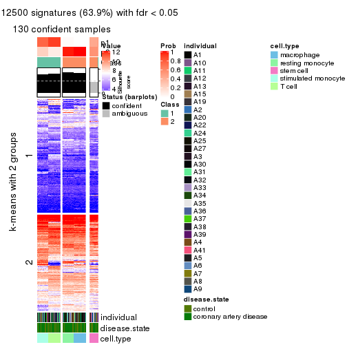</p>

</div>
<div id='tab-ATC-mclust-get-signatures-no-scale-2'>
<pre><code class="r">get_signatures(res, k = 3, scale_rows = FALSE)
</code></pre>

<p></p>

</div>
<div id='tab-ATC-mclust-get-signatures-no-scale-3'>
<pre><code class="r">get_signatures(res, k = 4, scale_rows = FALSE)
</code></pre>

<p></p>

</div>
<div id='tab-ATC-mclust-get-signatures-no-scale-4'>
<pre><code class="r">get_signatures(res, k = 5, scale_rows = FALSE)
</code></pre>

<p></p>

</div>
<div id='tab-ATC-mclust-get-signatures-no-scale-5'>
<pre><code class="r">get_signatures(res, k = 6, scale_rows = FALSE)
</code></pre>

<pre><code>#&gt; Error in mat[ceiling(1:nr/h_ratio), ceiling(1:nc/w_ratio), drop = FALSE]: subscript out of bounds
</code></pre>

<p></p>

</div>
</div>


Compare the overlap of signatures from different k:

```r
compare_signatures(res)
```


`get_signature()` returns a data frame invisibly. TO get the list of signatures, the function
call should be assigned to a variable explicitly. In following code, if `plot` argument is set
to `FALSE`, no heatmap is plotted while only the differential analysis is performed.

```r
# code only for demonstration
tb = get_signature(res, k = ..., plot = FALSE)
```

An example of the output of `tb` is:

```
#>   which_row         fdr    mean_1    mean_2 scaled_mean_1 scaled_mean_2 km
#> 1        38 0.042760348  8.373488  9.131774    -0.5533452     0.5164555  1
#> 2        40 0.018707592  7.106213  8.469186    -0.6173731     0.5762149  1
#> 3        55 0.019134737 10.221463 11.207825    -0.6159697     0.5749050  1
#> 4        59 0.006059896  5.921854  7.869574    -0.6899429     0.6439467  1
#> 5        60 0.018055526  8.928898 10.211722    -0.6204761     0.5791110  1
#> 6        98 0.009384629 15.714769 14.887706     0.6635654    -0.6193277  2
...
```

The columns in `tb` are:

1. `which_row`: row indices corresponding to the input matrix.
2. `fdr`: FDR for the differential test. 
3. `mean_x`: The mean value in group x.
4. `scaled_mean_x`: The mean value in group x after rows are scaled.
5. `km`: Row groups if k-means clustering is applied to rows.


UMAP plot which shows how samples are separated.


<script>
$( function() {
	$( '#tabs-ATC-mclust-dimension-reduction' ).tabs();
} );
</script>
<div id='tabs-ATC-mclust-dimension-reduction'>
<ul>
<li><a href='#tab-ATC-mclust-dimension-reduction-1'>k = 2</a></li>
<li><a href='#tab-ATC-mclust-dimension-reduction-2'>k = 3</a></li>
<li><a href='#tab-ATC-mclust-dimension-reduction-3'>k = 4</a></li>
<li><a href='#tab-ATC-mclust-dimension-reduction-4'>k = 5</a></li>
<li><a href='#tab-ATC-mclust-dimension-reduction-5'>k = 6</a></li>
</ul>
<div id='tab-ATC-mclust-dimension-reduction-1'>
<pre><code class="r">dimension_reduction(res, k = 2, method = &quot;UMAP&quot;)
</code></pre>

<p></p>

</div>
<div id='tab-ATC-mclust-dimension-reduction-2'>
<pre><code class="r">dimension_reduction(res, k = 3, method = &quot;UMAP&quot;)
</code></pre>

<p></p>

</div>
<div id='tab-ATC-mclust-dimension-reduction-3'>
<pre><code class="r">dimension_reduction(res, k = 4, method = &quot;UMAP&quot;)
</code></pre>

<p></p>

</div>
<div id='tab-ATC-mclust-dimension-reduction-4'>
<pre><code class="r">dimension_reduction(res, k = 5, method = &quot;UMAP&quot;)
</code></pre>

<p>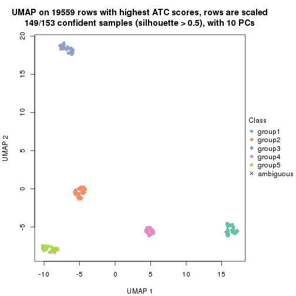</p>

</div>
<div id='tab-ATC-mclust-dimension-reduction-5'>
<pre><code class="r">dimension_reduction(res, k = 6, method = &quot;UMAP&quot;)
</code></pre>

<p></p>

</div>
</div>


Following heatmap shows how subgroups are split when increasing `k`:

```r
collect_classes(res)
```


Test correlation between subgroups and known annotations. If the known
annotation is numeric, one-way ANOVA test is applied, and if the known
annotation is discrete, chi-squared contingency table test is applied.

```r
test_to_known_factors(res)
```

```
#>              n individual(p) disease.state(p) cell.type(p) k
#> ATC:mclust 130             1            1.000     5.41e-28 2
#> ATC:mclust 153             1            0.946     1.66e-58 3
#> ATC:mclust 153             1            0.964     1.16e-90 4
#> ATC:mclust 149             1            0.982    1.61e-116 5
#> ATC:mclust 150             1            0.726    2.88e-114 6
```


If matrix rows can be associated to genes, consider to use `functional_enrichment(res,
...)` to perform function enrichment for the signature genes. See [this vignette](http://bioconductor.org/packages/devel/bioc/vignettes/cola/inst/doc/functional_enrichment.html) for more detailed explanations.


 

---------------------------------------------------


### ATC:NMF*


The object with results only for a single top-value method and a single partition method 
can be extracted as:

```r
res = res_list["ATC", "NMF"]
# you can also extract it by
# res = res_list["ATC:NMF"]
```

A summary of `res` and all the functions that can be applied to it:

```r
res
```

```
#> A 'ConsensusPartition' object with k = 2, 3, 4, 5, 6.
#>   On a matrix with 19559 rows and 153 columns.
#>   Top rows (1000, 2000, 3000, 4000, 5000) are extracted by 'ATC' method.
#>   Subgroups are detected by 'NMF' method.
#>   Performed in total 1250 partitions by row resampling.
#>   Best k for subgroups seems to be 4.
#> 
#> Following methods can be applied to this 'ConsensusPartition' object:
#>  [1] "cola_report"             "collect_classes"         "collect_plots"          
#>  [4] "collect_stats"           "colnames"                "compare_signatures"     
#>  [7] "consensus_heatmap"       "dimension_reduction"     "functional_enrichment"  
#> [10] "get_anno_col"            "get_anno"                "get_classes"            
#> [13] "get_consensus"           "get_matrix"              "get_membership"         
#> [16] "get_param"               "get_signatures"          "get_stats"              
#> [19] "is_best_k"               "is_stable_k"             "membership_heatmap"     
#> [22] "ncol"                    "nrow"                    "plot_ecdf"              
#> [25] "rownames"                "select_partition_number" "show"                   
#> [28] "suggest_best_k"          "test_to_known_factors"
```

`collect_plots()` function collects all the plots made from `res` for all `k` (number of partitions)
into one single page to provide an easy and fast comparison between different `k`.

```r
collect_plots(res)
```


The plots are:

- The first row: a plot of the ECDF (empirical cumulative distribution
  function) curves of the consensus matrix for each `k` and the heatmap of
  predicted classes for each `k`.
- The second row: heatmaps of the consensus matrix for each `k`.
- The third row: heatmaps of the membership matrix for each `k`.
- The fouth row: heatmaps of the signatures for each `k`.

All the plots in panels can be made by individual functions and they are
plotted later in this section.

`select_partition_number()` produces several plots showing different
statistics for choosing "optimized" `k`. There are following statistics:

- ECDF curves of the consensus matrix for each `k`;
- 1-PAC. [The PAC
  score](https://en.wikipedia.org/wiki/Consensus_clustering#Over-interpretation_potential_of_consensus_clustering)
  measures the proportion of the ambiguous subgrouping.
- Mean silhouette score.
- Concordance. The mean probability of fiting the consensus class ids in all
  partitions.
- Area increased. Denote $A_k$ as the area under the ECDF curve for current
  `k`, the area increased is defined as $A_k - A_{k-1}$.
- Rand index. The percent of pairs of samples that are both in a same cluster
  or both are not in a same cluster in the partition of k and k-1.
- Jaccard index. The ratio of pairs of samples are both in a same cluster in
  the partition of k and k-1 and the pairs of samples are both in a same
  cluster in the partition k or k-1.

The detailed explanations of these statistics can be found in [the _cola_
vignette](http://bioconductor.org/packages/devel/bioc/vignettes/cola/inst/doc/cola.html#toc_13).

Generally speaking, lower PAC score, higher mean silhouette score or higher
concordance corresponds to better partition. Rand index and Jaccard index
measure how similar the current partition is compared to partition with `k-1`.
If they are too similar, we won't accept `k` is better than `k-1`.

```r
select_partition_number(res)
```


The numeric values for all these statistics can be obtained by `get_stats()`.

```r
get_stats(res)
```

```
#>   k 1-PAC mean_silhouette concordance area_increased  Rand Jaccard
#> 2 2 0.933           0.930       0.972         0.4418 0.557   0.557
#> 3 3 1.000           1.000       1.000         0.4581 0.649   0.444
#> 4 4 0.932           0.978       0.913         0.0665 0.933   0.811
#> 5 5 0.851           0.973       0.895         0.1183 0.909   0.686
#> 6 6 0.943           0.958       0.938         0.0316 0.998   0.990
```

`suggest_best_k()` suggests the best $k$ based on these statistics. The rules are as follows:

- All $k$ with Jaccard index larger than 0.95 are removed because increasing
  $k$ does not provide enough extra information. If all $k$ are removed, it is
  marked as no subgroup is detected.
- For all $k$ with 1-PAC score larger than 0.9, the maximal $k$ is taken as
  the best $k$, and other $k$ are marked as optional $k$.
- If it does not fit the second rule. The $k$ with the maximal vote of the
  highest 1-PAC score, highest mean silhouette, and highest concordance is
  taken as the best $k$.

```r
suggest_best_k(res)
```

```
#> [1] 4
#> attr(,"optional")
#> [1] 2 3
```

There is also optional best $k$ = 2 3 that is worth to check.

Following shows the table of the partitions (You need to click the **show/hide
code output** link to see it). The membership matrix (columns with name `p*`)
is inferred by
[`clue::cl_consensus()`](https://www.rdocumentation.org/link/cl_consensus?package=clue)
function with the `SE` method. Basically the value in the membership matrix
represents the probability to belong to a certain group. The finall class
label for an item is determined with the group with highest probability it
belongs to.

In `get_classes()` function, the entropy is calculated from the membership
matrix and the silhouette score is calculated from the consensus matrix.


<script>
$( function() {
	$( '#tabs-ATC-NMF-get-classes' ).tabs();
} );
</script>
<div id='tabs-ATC-NMF-get-classes'>
<ul>
<li><a href='#tab-ATC-NMF-get-classes-1'>k = 2</a></li>
<li><a href='#tab-ATC-NMF-get-classes-2'>k = 3</a></li>
<li><a href='#tab-ATC-NMF-get-classes-3'>k = 4</a></li>
<li><a href='#tab-ATC-NMF-get-classes-4'>k = 5</a></li>
<li><a href='#tab-ATC-NMF-get-classes-5'>k = 6</a></li>
</ul>

<div id='tab-ATC-NMF-get-classes-1'>
<p><a id='tab-ATC-NMF-get-classes-1-a' style='color:#0366d6' href='#'>show/hide code output</a></p>
<pre><code class="r">cbind(get_classes(res, k = 2), get_membership(res, k = 2))
</code></pre>

<pre><code>#&gt;           class entropy silhouette    p1    p2
#&gt; GSM247795     1   0.671     0.7749 0.824 0.176
#&gt; GSM247854     1   0.917     0.4918 0.668 0.332
#&gt; GSM247758     1   0.000     0.9774 1.000 0.000
#&gt; GSM247742     1   0.000     0.9774 1.000 0.000
#&gt; GSM247755     2   0.000     0.9559 0.000 1.000
#&gt; GSM247841     1   0.000     0.9774 1.000 0.000
#&gt; GSM247703     1   0.000     0.9774 1.000 0.000
#&gt; GSM247739     1   0.000     0.9774 1.000 0.000
#&gt; GSM247715     1   0.000     0.9774 1.000 0.000
#&gt; GSM247829     2   0.000     0.9559 0.000 1.000
#&gt; GSM247842     1   0.000     0.9774 1.000 0.000
#&gt; GSM247805     1   0.000     0.9774 1.000 0.000
#&gt; GSM247786     1   0.000     0.9774 1.000 0.000
#&gt; GSM247812     2   0.000     0.9559 0.000 1.000
#&gt; GSM247776     1   0.000     0.9774 1.000 0.000
#&gt; GSM247850     1   0.000     0.9774 1.000 0.000
#&gt; GSM247717     1   0.456     0.8789 0.904 0.096
#&gt; GSM247784     1   0.000     0.9774 1.000 0.000
#&gt; GSM247834     1   0.000     0.9774 1.000 0.000
#&gt; GSM247783     2   0.000     0.9559 0.000 1.000
#&gt; GSM247846     1   0.000     0.9774 1.000 0.000
#&gt; GSM247822     2   0.000     0.9559 0.000 1.000
#&gt; GSM247710     1   0.000     0.9774 1.000 0.000
#&gt; GSM247713     1   0.000     0.9774 1.000 0.000
#&gt; GSM247840     2   0.000     0.9559 0.000 1.000
#&gt; GSM247733     1   0.000     0.9774 1.000 0.000
#&gt; GSM247852     1   0.000     0.9774 1.000 0.000
#&gt; GSM247790     1   0.000     0.9774 1.000 0.000
#&gt; GSM247730     1   0.000     0.9774 1.000 0.000
#&gt; GSM247824     2   0.000     0.9559 0.000 1.000
#&gt; GSM247770     1   0.000     0.9774 1.000 0.000
#&gt; GSM247711     2   0.605     0.8124 0.148 0.852
#&gt; GSM247782     1   0.000     0.9774 1.000 0.000
#&gt; GSM247836     1   0.000     0.9774 1.000 0.000
#&gt; GSM247785     2   0.000     0.9559 0.000 1.000
#&gt; GSM247847     1   0.000     0.9774 1.000 0.000
#&gt; GSM247750     1   0.000     0.9774 1.000 0.000
#&gt; GSM247788     1   0.000     0.9774 1.000 0.000
#&gt; GSM247849     1   0.000     0.9774 1.000 0.000
#&gt; GSM247772     2   0.000     0.9559 0.000 1.000
#&gt; GSM247760     1   0.000     0.9774 1.000 0.000
#&gt; GSM247764     2   0.000     0.9559 0.000 1.000
#&gt; GSM247851     2   0.000     0.9559 0.000 1.000
#&gt; GSM247714     1   0.000     0.9774 1.000 0.000
#&gt; GSM247828     1   0.000     0.9774 1.000 0.000
#&gt; GSM247704     2   0.000     0.9559 0.000 1.000
#&gt; GSM247818     1   0.000     0.9774 1.000 0.000
#&gt; GSM247823     1   0.416     0.8925 0.916 0.084
#&gt; GSM247706     1   0.000     0.9774 1.000 0.000
#&gt; GSM247835     2   0.000     0.9559 0.000 1.000
#&gt; GSM247734     1   0.000     0.9774 1.000 0.000
#&gt; GSM247819     2   0.000     0.9559 0.000 1.000
#&gt; GSM247809     1   0.000     0.9774 1.000 0.000
#&gt; GSM247830     2   0.000     0.9559 0.000 1.000
#&gt; GSM247833     1   0.000     0.9774 1.000 0.000
#&gt; GSM247738     1   0.000     0.9774 1.000 0.000
#&gt; GSM247716     1   0.000     0.9774 1.000 0.000
#&gt; GSM247747     2   0.000     0.9559 0.000 1.000
#&gt; GSM247722     1   0.000     0.9774 1.000 0.000
#&gt; GSM247816     2   1.000     0.0312 0.496 0.504
#&gt; GSM247839     1   0.000     0.9774 1.000 0.000
#&gt; GSM247821     1   0.000     0.9774 1.000 0.000
#&gt; GSM247798     2   0.000     0.9559 0.000 1.000
#&gt; GSM247838     1   0.000     0.9774 1.000 0.000
#&gt; GSM247721     1   0.895     0.5359 0.688 0.312
#&gt; GSM247781     1   0.000     0.9774 1.000 0.000
#&gt; GSM247762     1   0.000     0.9774 1.000 0.000
#&gt; GSM247825     2   0.000     0.9559 0.000 1.000
#&gt; GSM247777     1   0.000     0.9774 1.000 0.000
#&gt; GSM247761     1   0.430     0.8881 0.912 0.088
#&gt; GSM247720     1   0.000     0.9774 1.000 0.000
#&gt; GSM247814     2   0.000     0.9559 0.000 1.000
#&gt; GSM247732     1   0.000     0.9774 1.000 0.000
#&gt; GSM247708     2   0.706     0.7559 0.192 0.808
#&gt; GSM247740     1   0.000     0.9774 1.000 0.000
#&gt; GSM247749     1   0.000     0.9774 1.000 0.000
#&gt; GSM247767     2   0.000     0.9559 0.000 1.000
#&gt; GSM247748     1   0.000     0.9774 1.000 0.000
#&gt; GSM247705     1   0.997     0.0852 0.532 0.468
#&gt; GSM247746     1   0.000     0.9774 1.000 0.000
#&gt; GSM247752     1   0.000     0.9774 1.000 0.000
#&gt; GSM247769     2   0.000     0.9559 0.000 1.000
#&gt; GSM247753     1   0.000     0.9774 1.000 0.000
#&gt; GSM247723     2   0.000     0.9559 0.000 1.000
#&gt; GSM247779     1   0.000     0.9774 1.000 0.000
#&gt; GSM247756     1   0.000     0.9774 1.000 0.000
#&gt; GSM247826     2   0.000     0.9559 0.000 1.000
#&gt; GSM247775     1   0.000     0.9774 1.000 0.000
#&gt; GSM247741     2   0.000     0.9559 0.000 1.000
#&gt; GSM247799     1   0.000     0.9774 1.000 0.000
#&gt; GSM247778     1   0.000     0.9774 1.000 0.000
#&gt; GSM247806     2   0.000     0.9559 0.000 1.000
#&gt; GSM247815     1   0.000     0.9774 1.000 0.000
#&gt; GSM247735     2   0.000     0.9559 0.000 1.000
#&gt; GSM247831     1   0.000     0.9774 1.000 0.000
#&gt; GSM247845     1   0.000     0.9774 1.000 0.000
#&gt; GSM247791     2   0.000     0.9559 0.000 1.000
#&gt; GSM247780     1   0.000     0.9774 1.000 0.000
#&gt; GSM247853     1   0.000     0.9774 1.000 0.000
#&gt; GSM247800     2   0.000     0.9559 0.000 1.000
#&gt; GSM247729     1   0.000     0.9774 1.000 0.000
#&gt; GSM247810     1   0.000     0.9774 1.000 0.000
#&gt; GSM247844     2   0.000     0.9559 0.000 1.000
#&gt; GSM247793     1   0.000     0.9774 1.000 0.000
#&gt; GSM247759     1   0.917     0.4916 0.668 0.332
#&gt; GSM247724     1   0.000     0.9774 1.000 0.000
#&gt; GSM247817     2   0.000     0.9559 0.000 1.000
#&gt; GSM247727     1   0.000     0.9774 1.000 0.000
#&gt; GSM247796     2   0.000     0.9559 0.000 1.000
#&gt; GSM247725     1   0.000     0.9774 1.000 0.000
#&gt; GSM247801     1   0.000     0.9774 1.000 0.000
#&gt; GSM247731     2   0.000     0.9559 0.000 1.000
#&gt; GSM247765     1   0.000     0.9774 1.000 0.000
#&gt; GSM247792     2   0.000     0.9559 0.000 1.000
#&gt; GSM247726     1   0.000     0.9774 1.000 0.000
#&gt; GSM247803     1   0.000     0.9774 1.000 0.000
#&gt; GSM247728     2   0.000     0.9559 0.000 1.000
#&gt; GSM247768     1   0.000     0.9774 1.000 0.000
#&gt; GSM247745     2   0.999     0.0929 0.480 0.520
#&gt; GSM247855     2   0.722     0.7446 0.200 0.800
#&gt; GSM247804     1   0.000     0.9774 1.000 0.000
#&gt; GSM247774     1   0.000     0.9774 1.000 0.000
#&gt; GSM247807     2   0.000     0.9559 0.000 1.000
#&gt; GSM247813     1   0.000     0.9774 1.000 0.000
#&gt; GSM247736     1   0.844     0.6162 0.728 0.272
#&gt; GSM247712     1   0.000     0.9774 1.000 0.000
#&gt; GSM247797     1   0.000     0.9774 1.000 0.000
#&gt; GSM247743     2   0.000     0.9559 0.000 1.000
#&gt; GSM247719     1   0.000     0.9774 1.000 0.000
#&gt; GSM247707     2   0.978     0.3123 0.412 0.588
#&gt; GSM247737     1   0.000     0.9774 1.000 0.000
#&gt; GSM247827     2   0.000     0.9559 0.000 1.000
#&gt; GSM247848     1   0.000     0.9774 1.000 0.000
#&gt; GSM247794     1   0.000     0.9774 1.000 0.000
#&gt; GSM247757     1   0.000     0.9774 1.000 0.000
#&gt; GSM247744     1   0.000     0.9774 1.000 0.000
#&gt; GSM247751     2   0.000     0.9559 0.000 1.000
#&gt; GSM247837     1   0.000     0.9774 1.000 0.000
#&gt; GSM247754     2   0.563     0.8310 0.132 0.868
#&gt; GSM247789     1   0.000     0.9774 1.000 0.000
#&gt; GSM247802     1   0.000     0.9774 1.000 0.000
#&gt; GSM247771     2   0.000     0.9559 0.000 1.000
#&gt; GSM247763     1   0.000     0.9774 1.000 0.000
#&gt; GSM247808     2   0.000     0.9559 0.000 1.000
#&gt; GSM247787     1   0.000     0.9774 1.000 0.000
#&gt; GSM247843     1   0.000     0.9774 1.000 0.000
#&gt; GSM247811     2   0.000     0.9559 0.000 1.000
#&gt; GSM247773     1   0.000     0.9774 1.000 0.000
#&gt; GSM247766     2   0.000     0.9559 0.000 1.000
#&gt; GSM247718     1   0.000     0.9774 1.000 0.000
#&gt; GSM247832     1   0.000     0.9774 1.000 0.000
#&gt; GSM247709     2   0.000     0.9559 0.000 1.000
#&gt; GSM247820     1   0.000     0.9774 1.000 0.000
</code></pre>

<script>
$('#tab-ATC-NMF-get-classes-1-a').parent().next().next().hide();
$('#tab-ATC-NMF-get-classes-1-a').click(function(){
  $('#tab-ATC-NMF-get-classes-1-a').parent().next().next().toggle();
  return(false);
});
</script>
</div>

<div id='tab-ATC-NMF-get-classes-2'>
<p><a id='tab-ATC-NMF-get-classes-2-a' style='color:#0366d6' href='#'>show/hide code output</a></p>
<pre><code class="r">cbind(get_classes(res, k = 3), get_membership(res, k = 3))
</code></pre>

<pre><code>#&gt;           class entropy silhouette p1 p2 p3
#&gt; GSM247795     2       0          1  0  1  0
#&gt; GSM247854     2       0          1  0  1  0
#&gt; GSM247758     2       0          1  0  1  0
#&gt; GSM247742     1       0          1  1  0  0
#&gt; GSM247755     3       0          1  0  0  1
#&gt; GSM247841     1       0          1  1  0  0
#&gt; GSM247703     2       0          1  0  1  0
#&gt; GSM247739     2       0          1  0  1  0
#&gt; GSM247715     1       0          1  1  0  0
#&gt; GSM247829     3       0          1  0  0  1
#&gt; GSM247842     1       0          1  1  0  0
#&gt; GSM247805     2       0          1  0  1  0
#&gt; GSM247786     2       0          1  0  1  0
#&gt; GSM247812     3       0          1  0  0  1
#&gt; GSM247776     1       0          1  1  0  0
#&gt; GSM247850     1       0          1  1  0  0
#&gt; GSM247717     2       0          1  0  1  0
#&gt; GSM247784     2       0          1  0  1  0
#&gt; GSM247834     1       0          1  1  0  0
#&gt; GSM247783     3       0          1  0  0  1
#&gt; GSM247846     1       0          1  1  0  0
#&gt; GSM247822     2       0          1  0  1  0
#&gt; GSM247710     2       0          1  0  1  0
#&gt; GSM247713     1       0          1  1  0  0
#&gt; GSM247840     3       0          1  0  0  1
#&gt; GSM247733     1       0          1  1  0  0
#&gt; GSM247852     1       0          1  1  0  0
#&gt; GSM247790     2       0          1  0  1  0
#&gt; GSM247730     2       0          1  0  1  0
#&gt; GSM247824     3       0          1  0  0  1
#&gt; GSM247770     1       0          1  1  0  0
#&gt; GSM247711     2       0          1  0  1  0
#&gt; GSM247782     2       0          1  0  1  0
#&gt; GSM247836     1       0          1  1  0  0
#&gt; GSM247785     3       0          1  0  0  1
#&gt; GSM247847     1       0          1  1  0  0
#&gt; GSM247750     2       0          1  0  1  0
#&gt; GSM247788     2       0          1  0  1  0
#&gt; GSM247849     1       0          1  1  0  0
#&gt; GSM247772     3       0          1  0  0  1
#&gt; GSM247760     1       0          1  1  0  0
#&gt; GSM247764     2       0          1  0  1  0
#&gt; GSM247851     2       0          1  0  1  0
#&gt; GSM247714     2       0          1  0  1  0
#&gt; GSM247828     1       0          1  1  0  0
#&gt; GSM247704     3       0          1  0  0  1
#&gt; GSM247818     1       0          1  1  0  0
#&gt; GSM247823     2       0          1  0  1  0
#&gt; GSM247706     2       0          1  0  1  0
#&gt; GSM247835     3       0          1  0  0  1
#&gt; GSM247734     1       0          1  1  0  0
#&gt; GSM247819     2       0          1  0  1  0
#&gt; GSM247809     2       0          1  0  1  0
#&gt; GSM247830     3       0          1  0  0  1
#&gt; GSM247833     1       0          1  1  0  0
#&gt; GSM247738     2       0          1  0  1  0
#&gt; GSM247716     2       0          1  0  1  0
#&gt; GSM247747     3       0          1  0  0  1
#&gt; GSM247722     1       0          1  1  0  0
#&gt; GSM247816     2       0          1  0  1  0
#&gt; GSM247839     2       0          1  0  1  0
#&gt; GSM247821     1       0          1  1  0  0
#&gt; GSM247798     3       0          1  0  0  1
#&gt; GSM247838     1       0          1  1  0  0
#&gt; GSM247721     2       0          1  0  1  0
#&gt; GSM247781     2       0          1  0  1  0
#&gt; GSM247762     1       0          1  1  0  0
#&gt; GSM247825     3       0          1  0  0  1
#&gt; GSM247777     1       0          1  1  0  0
#&gt; GSM247761     2       0          1  0  1  0
#&gt; GSM247720     2       0          1  0  1  0
#&gt; GSM247814     3       0          1  0  0  1
#&gt; GSM247732     1       0          1  1  0  0
#&gt; GSM247708     2       0          1  0  1  0
#&gt; GSM247740     2       0          1  0  1  0
#&gt; GSM247749     1       0          1  1  0  0
#&gt; GSM247767     3       0          1  0  0  1
#&gt; GSM247748     1       0          1  1  0  0
#&gt; GSM247705     2       0          1  0  1  0
#&gt; GSM247746     2       0          1  0  1  0
#&gt; GSM247752     1       0          1  1  0  0
#&gt; GSM247769     3       0          1  0  0  1
#&gt; GSM247753     1       0          1  1  0  0
#&gt; GSM247723     2       0          1  0  1  0
#&gt; GSM247779     2       0          1  0  1  0
#&gt; GSM247756     1       0          1  1  0  0
#&gt; GSM247826     3       0          1  0  0  1
#&gt; GSM247775     1       0          1  1  0  0
#&gt; GSM247741     2       0          1  0  1  0
#&gt; GSM247799     2       0          1  0  1  0
#&gt; GSM247778     1       0          1  1  0  0
#&gt; GSM247806     3       0          1  0  0  1
#&gt; GSM247815     1       0          1  1  0  0
#&gt; GSM247735     2       0          1  0  1  0
#&gt; GSM247831     2       0          1  0  1  0
#&gt; GSM247845     1       0          1  1  0  0
#&gt; GSM247791     3       0          1  0  0  1
#&gt; GSM247780     1       0          1  1  0  0
#&gt; GSM247853     1       0          1  1  0  0
#&gt; GSM247800     2       0          1  0  1  0
#&gt; GSM247729     2       0          1  0  1  0
#&gt; GSM247810     1       0          1  1  0  0
#&gt; GSM247844     3       0          1  0  0  1
#&gt; GSM247793     1       0          1  1  0  0
#&gt; GSM247759     2       0          1  0  1  0
#&gt; GSM247724     2       0          1  0  1  0
#&gt; GSM247817     3       0          1  0  0  1
#&gt; GSM247727     1       0          1  1  0  0
#&gt; GSM247796     2       0          1  0  1  0
#&gt; GSM247725     2       0          1  0  1  0
#&gt; GSM247801     1       0          1  1  0  0
#&gt; GSM247731     3       0          1  0  0  1
#&gt; GSM247765     1       0          1  1  0  0
#&gt; GSM247792     2       0          1  0  1  0
#&gt; GSM247726     2       0          1  0  1  0
#&gt; GSM247803     1       0          1  1  0  0
#&gt; GSM247728     3       0          1  0  0  1
#&gt; GSM247768     1       0          1  1  0  0
#&gt; GSM247745     2       0          1  0  1  0
#&gt; GSM247855     2       0          1  0  1  0
#&gt; GSM247804     2       0          1  0  1  0
#&gt; GSM247774     1       0          1  1  0  0
#&gt; GSM247807     3       0          1  0  0  1
#&gt; GSM247813     1       0          1  1  0  0
#&gt; GSM247736     2       0          1  0  1  0
#&gt; GSM247712     2       0          1  0  1  0
#&gt; GSM247797     1       0          1  1  0  0
#&gt; GSM247743     3       0          1  0  0  1
#&gt; GSM247719     1       0          1  1  0  0
#&gt; GSM247707     2       0          1  0  1  0
#&gt; GSM247737     2       0          1  0  1  0
#&gt; GSM247827     3       0          1  0  0  1
#&gt; GSM247848     1       0          1  1  0  0
#&gt; GSM247794     2       0          1  0  1  0
#&gt; GSM247757     2       0          1  0  1  0
#&gt; GSM247744     1       0          1  1  0  0
#&gt; GSM247751     3       0          1  0  0  1
#&gt; GSM247837     1       0          1  1  0  0
#&gt; GSM247754     2       0          1  0  1  0
#&gt; GSM247789     2       0          1  0  1  0
#&gt; GSM247802     1       0          1  1  0  0
#&gt; GSM247771     3       0          1  0  0  1
#&gt; GSM247763     1       0          1  1  0  0
#&gt; GSM247808     2       0          1  0  1  0
#&gt; GSM247787     2       0          1  0  1  0
#&gt; GSM247843     1       0          1  1  0  0
#&gt; GSM247811     3       0          1  0  0  1
#&gt; GSM247773     1       0          1  1  0  0
#&gt; GSM247766     2       0          1  0  1  0
#&gt; GSM247718     2       0          1  0  1  0
#&gt; GSM247832     1       0          1  1  0  0
#&gt; GSM247709     3       0          1  0  0  1
#&gt; GSM247820     1       0          1  1  0  0
</code></pre>

<script>
$('#tab-ATC-NMF-get-classes-2-a').parent().next().next().hide();
$('#tab-ATC-NMF-get-classes-2-a').click(function(){
  $('#tab-ATC-NMF-get-classes-2-a').parent().next().next().toggle();
  return(false);
});
</script>
</div>

<div id='tab-ATC-NMF-get-classes-3'>
<p><a id='tab-ATC-NMF-get-classes-3-a' style='color:#0366d6' href='#'>show/hide code output</a></p>
<pre><code class="r">cbind(get_classes(res, k = 4), get_membership(res, k = 4))
</code></pre>

<pre><code>#&gt;           class entropy silhouette    p1    p2    p3    p4
#&gt; GSM247795     2  0.0000      0.975 0.000 1.000 0.000 0.000
#&gt; GSM247854     2  0.0000      0.975 0.000 1.000 0.000 0.000
#&gt; GSM247758     2  0.1474      0.970 0.052 0.948 0.000 0.000
#&gt; GSM247742     4  0.0592      0.960 0.016 0.000 0.000 0.984
#&gt; GSM247755     3  0.0000      1.000 0.000 0.000 1.000 0.000
#&gt; GSM247841     1  0.4985      0.983 0.532 0.000 0.000 0.468
#&gt; GSM247703     2  0.0000      0.975 0.000 1.000 0.000 0.000
#&gt; GSM247739     2  0.1474      0.970 0.052 0.948 0.000 0.000
#&gt; GSM247715     4  0.0000      0.982 0.000 0.000 0.000 1.000
#&gt; GSM247829     3  0.0000      1.000 0.000 0.000 1.000 0.000
#&gt; GSM247842     1  0.4994      0.984 0.520 0.000 0.000 0.480
#&gt; GSM247805     2  0.0000      0.975 0.000 1.000 0.000 0.000
#&gt; GSM247786     2  0.1389      0.970 0.048 0.952 0.000 0.000
#&gt; GSM247812     3  0.0000      1.000 0.000 0.000 1.000 0.000
#&gt; GSM247776     1  0.4985      0.983 0.532 0.000 0.000 0.468
#&gt; GSM247850     1  0.4985      0.983 0.532 0.000 0.000 0.468
#&gt; GSM247717     2  0.0000      0.975 0.000 1.000 0.000 0.000
#&gt; GSM247784     2  0.1867      0.964 0.072 0.928 0.000 0.000
#&gt; GSM247834     4  0.0188      0.979 0.004 0.000 0.000 0.996
#&gt; GSM247783     3  0.0000      1.000 0.000 0.000 1.000 0.000
#&gt; GSM247846     1  0.4989      0.985 0.528 0.000 0.000 0.472
#&gt; GSM247822     2  0.0000      0.975 0.000 1.000 0.000 0.000
#&gt; GSM247710     2  0.1637      0.968 0.060 0.940 0.000 0.000
#&gt; GSM247713     4  0.0188      0.979 0.004 0.000 0.000 0.996
#&gt; GSM247840     3  0.0000      1.000 0.000 0.000 1.000 0.000
#&gt; GSM247733     1  0.4989      0.985 0.528 0.000 0.000 0.472
#&gt; GSM247852     1  0.4989      0.985 0.528 0.000 0.000 0.472
#&gt; GSM247790     2  0.0000      0.975 0.000 1.000 0.000 0.000
#&gt; GSM247730     2  0.1716      0.967 0.064 0.936 0.000 0.000
#&gt; GSM247824     3  0.0000      1.000 0.000 0.000 1.000 0.000
#&gt; GSM247770     1  0.4985      0.983 0.532 0.000 0.000 0.468
#&gt; GSM247711     2  0.0000      0.975 0.000 1.000 0.000 0.000
#&gt; GSM247782     2  0.2216      0.954 0.092 0.908 0.000 0.000
#&gt; GSM247836     4  0.0000      0.982 0.000 0.000 0.000 1.000
#&gt; GSM247785     3  0.0000      1.000 0.000 0.000 1.000 0.000
#&gt; GSM247847     1  0.4981      0.977 0.536 0.000 0.000 0.464
#&gt; GSM247750     2  0.0000      0.975 0.000 1.000 0.000 0.000
#&gt; GSM247788     2  0.1940      0.962 0.076 0.924 0.000 0.000
#&gt; GSM247849     4  0.2469      0.742 0.108 0.000 0.000 0.892
#&gt; GSM247772     3  0.0000      1.000 0.000 0.000 1.000 0.000
#&gt; GSM247760     1  0.4989      0.985 0.528 0.000 0.000 0.472
#&gt; GSM247764     2  0.0000      0.975 0.000 1.000 0.000 0.000
#&gt; GSM247851     2  0.0000      0.975 0.000 1.000 0.000 0.000
#&gt; GSM247714     2  0.1637      0.968 0.060 0.940 0.000 0.000
#&gt; GSM247828     4  0.0000      0.982 0.000 0.000 0.000 1.000
#&gt; GSM247704     3  0.0000      1.000 0.000 0.000 1.000 0.000
#&gt; GSM247818     1  0.4989      0.985 0.528 0.000 0.000 0.472
#&gt; GSM247823     2  0.0000      0.975 0.000 1.000 0.000 0.000
#&gt; GSM247706     2  0.1716      0.967 0.064 0.936 0.000 0.000
#&gt; GSM247835     3  0.0000      1.000 0.000 0.000 1.000 0.000
#&gt; GSM247734     1  0.4985      0.983 0.532 0.000 0.000 0.468
#&gt; GSM247819     2  0.0000      0.975 0.000 1.000 0.000 0.000
#&gt; GSM247809     2  0.1557      0.969 0.056 0.944 0.000 0.000
#&gt; GSM247830     3  0.0000      1.000 0.000 0.000 1.000 0.000
#&gt; GSM247833     1  0.4998      0.979 0.512 0.000 0.000 0.488
#&gt; GSM247738     2  0.0000      0.975 0.000 1.000 0.000 0.000
#&gt; GSM247716     2  0.1661      0.969 0.052 0.944 0.000 0.004
#&gt; GSM247747     3  0.0000      1.000 0.000 0.000 1.000 0.000
#&gt; GSM247722     1  0.4998      0.979 0.512 0.000 0.000 0.488
#&gt; GSM247816     2  0.0000      0.975 0.000 1.000 0.000 0.000
#&gt; GSM247839     2  0.1970      0.966 0.060 0.932 0.000 0.008
#&gt; GSM247821     4  0.0000      0.982 0.000 0.000 0.000 1.000
#&gt; GSM247798     3  0.0000      1.000 0.000 0.000 1.000 0.000
#&gt; GSM247838     1  0.4998      0.979 0.512 0.000 0.000 0.488
#&gt; GSM247721     2  0.0000      0.975 0.000 1.000 0.000 0.000
#&gt; GSM247781     2  0.2081      0.958 0.084 0.916 0.000 0.000
#&gt; GSM247762     4  0.0000      0.982 0.000 0.000 0.000 1.000
#&gt; GSM247825     3  0.0000      1.000 0.000 0.000 1.000 0.000
#&gt; GSM247777     1  0.4998      0.979 0.512 0.000 0.000 0.488
#&gt; GSM247761     2  0.0000      0.975 0.000 1.000 0.000 0.000
#&gt; GSM247720     2  0.1389      0.970 0.048 0.952 0.000 0.000
#&gt; GSM247814     3  0.0000      1.000 0.000 0.000 1.000 0.000
#&gt; GSM247732     1  0.4998      0.979 0.512 0.000 0.000 0.488
#&gt; GSM247708     2  0.0000      0.975 0.000 1.000 0.000 0.000
#&gt; GSM247740     2  0.1661      0.970 0.052 0.944 0.000 0.004
#&gt; GSM247749     4  0.0188      0.979 0.004 0.000 0.000 0.996
#&gt; GSM247767     3  0.0000      1.000 0.000 0.000 1.000 0.000
#&gt; GSM247748     1  0.4989      0.985 0.528 0.000 0.000 0.472
#&gt; GSM247705     2  0.0000      0.975 0.000 1.000 0.000 0.000
#&gt; GSM247746     2  0.1389      0.970 0.048 0.952 0.000 0.000
#&gt; GSM247752     4  0.0188      0.979 0.004 0.000 0.000 0.996
#&gt; GSM247769     3  0.0000      1.000 0.000 0.000 1.000 0.000
#&gt; GSM247753     1  0.4996      0.983 0.516 0.000 0.000 0.484
#&gt; GSM247723     2  0.0000      0.975 0.000 1.000 0.000 0.000
#&gt; GSM247779     2  0.2714      0.938 0.112 0.884 0.000 0.004
#&gt; GSM247756     4  0.0000      0.982 0.000 0.000 0.000 1.000
#&gt; GSM247826     3  0.0000      1.000 0.000 0.000 1.000 0.000
#&gt; GSM247775     1  0.4985      0.983 0.532 0.000 0.000 0.468
#&gt; GSM247741     2  0.0000      0.975 0.000 1.000 0.000 0.000
#&gt; GSM247799     2  0.1637      0.968 0.060 0.940 0.000 0.000
#&gt; GSM247778     4  0.0000      0.982 0.000 0.000 0.000 1.000
#&gt; GSM247806     3  0.0000      1.000 0.000 0.000 1.000 0.000
#&gt; GSM247815     1  0.4992      0.985 0.524 0.000 0.000 0.476
#&gt; GSM247735     2  0.0000      0.975 0.000 1.000 0.000 0.000
#&gt; GSM247831     2  0.1637      0.968 0.060 0.940 0.000 0.000
#&gt; GSM247845     4  0.0000      0.982 0.000 0.000 0.000 1.000
#&gt; GSM247791     3  0.0000      1.000 0.000 0.000 1.000 0.000
#&gt; GSM247780     1  0.4996      0.983 0.516 0.000 0.000 0.484
#&gt; GSM247853     1  0.4996      0.983 0.516 0.000 0.000 0.484
#&gt; GSM247800     2  0.0000      0.975 0.000 1.000 0.000 0.000
#&gt; GSM247729     2  0.1792      0.965 0.068 0.932 0.000 0.000
#&gt; GSM247810     4  0.0188      0.979 0.004 0.000 0.000 0.996
#&gt; GSM247844     3  0.0000      1.000 0.000 0.000 1.000 0.000
#&gt; GSM247793     1  0.4996      0.983 0.516 0.000 0.000 0.484
#&gt; GSM247759     2  0.0000      0.975 0.000 1.000 0.000 0.000
#&gt; GSM247724     2  0.1389      0.970 0.048 0.952 0.000 0.000
#&gt; GSM247817     3  0.0000      1.000 0.000 0.000 1.000 0.000
#&gt; GSM247727     1  0.4998      0.979 0.512 0.000 0.000 0.488
#&gt; GSM247796     2  0.0000      0.975 0.000 1.000 0.000 0.000
#&gt; GSM247725     2  0.1716      0.967 0.064 0.936 0.000 0.000
#&gt; GSM247801     4  0.0000      0.982 0.000 0.000 0.000 1.000
#&gt; GSM247731     3  0.0000      1.000 0.000 0.000 1.000 0.000
#&gt; GSM247765     1  0.4985      0.983 0.532 0.000 0.000 0.468
#&gt; GSM247792     2  0.0000      0.975 0.000 1.000 0.000 0.000
#&gt; GSM247726     2  0.2563      0.952 0.072 0.908 0.000 0.020
#&gt; GSM247803     4  0.1661      0.919 0.052 0.000 0.004 0.944
#&gt; GSM247728     3  0.0000      1.000 0.000 0.000 1.000 0.000
#&gt; GSM247768     1  0.4985      0.983 0.532 0.000 0.000 0.468
#&gt; GSM247745     2  0.0000      0.975 0.000 1.000 0.000 0.000
#&gt; GSM247855     2  0.0000      0.975 0.000 1.000 0.000 0.000
#&gt; GSM247804     2  0.3545      0.893 0.164 0.828 0.000 0.008
#&gt; GSM247774     4  0.0188      0.977 0.004 0.000 0.000 0.996
#&gt; GSM247807     3  0.0000      1.000 0.000 0.000 1.000 0.000
#&gt; GSM247813     1  0.4996      0.983 0.516 0.000 0.000 0.484
#&gt; GSM247736     2  0.0000      0.975 0.000 1.000 0.000 0.000
#&gt; GSM247712     2  0.1389      0.970 0.048 0.952 0.000 0.000
#&gt; GSM247797     4  0.0000      0.982 0.000 0.000 0.000 1.000
#&gt; GSM247743     3  0.0000      1.000 0.000 0.000 1.000 0.000
#&gt; GSM247719     1  0.4998      0.979 0.512 0.000 0.000 0.488
#&gt; GSM247707     2  0.0000      0.975 0.000 1.000 0.000 0.000
#&gt; GSM247737     2  0.2814      0.926 0.132 0.868 0.000 0.000
#&gt; GSM247827     3  0.0000      1.000 0.000 0.000 1.000 0.000
#&gt; GSM247848     1  0.4989      0.985 0.528 0.000 0.000 0.472
#&gt; GSM247794     2  0.0000      0.975 0.000 1.000 0.000 0.000
#&gt; GSM247757     2  0.1716      0.967 0.064 0.936 0.000 0.000
#&gt; GSM247744     4  0.0000      0.982 0.000 0.000 0.000 1.000
#&gt; GSM247751     3  0.0000      1.000 0.000 0.000 1.000 0.000
#&gt; GSM247837     1  0.4985      0.983 0.532 0.000 0.000 0.468
#&gt; GSM247754     2  0.0000      0.975 0.000 1.000 0.000 0.000
#&gt; GSM247789     2  0.1867      0.964 0.072 0.928 0.000 0.000
#&gt; GSM247802     4  0.0000      0.982 0.000 0.000 0.000 1.000
#&gt; GSM247771     3  0.0000      1.000 0.000 0.000 1.000 0.000
#&gt; GSM247763     1  0.4996      0.983 0.516 0.000 0.000 0.484
#&gt; GSM247808     2  0.0000      0.975 0.000 1.000 0.000 0.000
#&gt; GSM247787     2  0.1474      0.970 0.052 0.948 0.000 0.000
#&gt; GSM247843     4  0.0000      0.982 0.000 0.000 0.000 1.000
#&gt; GSM247811     3  0.0000      1.000 0.000 0.000 1.000 0.000
#&gt; GSM247773     1  0.4989      0.985 0.528 0.000 0.000 0.472
#&gt; GSM247766     2  0.0000      0.975 0.000 1.000 0.000 0.000
#&gt; GSM247718     2  0.1474      0.970 0.052 0.948 0.000 0.000
#&gt; GSM247832     4  0.0592      0.960 0.016 0.000 0.000 0.984
#&gt; GSM247709     3  0.0000      1.000 0.000 0.000 1.000 0.000
#&gt; GSM247820     1  0.4998      0.979 0.512 0.000 0.000 0.488
</code></pre>

<script>
$('#tab-ATC-NMF-get-classes-3-a').parent().next().next().hide();
$('#tab-ATC-NMF-get-classes-3-a').click(function(){
  $('#tab-ATC-NMF-get-classes-3-a').parent().next().next().toggle();
  return(false);
});
</script>
</div>

<div id='tab-ATC-NMF-get-classes-4'>
<p><a id='tab-ATC-NMF-get-classes-4-a' style='color:#0366d6' href='#'>show/hide code output</a></p>
<pre><code class="r">cbind(get_classes(res, k = 5), get_membership(res, k = 5))
</code></pre>

<pre><code>#&gt;           class entropy silhouette    p1    p2    p3    p4    p5
#&gt; GSM247795     2  0.0162      0.996 0.000 0.996 0.000 0.000 0.004
#&gt; GSM247854     2  0.0162      0.996 0.000 0.996 0.000 0.000 0.004
#&gt; GSM247758     5  0.3177      0.928 0.000 0.208 0.000 0.000 0.792
#&gt; GSM247742     4  0.4030      0.960 0.352 0.000 0.000 0.648 0.000
#&gt; GSM247755     3  0.0000      0.999 0.000 0.000 1.000 0.000 0.000
#&gt; GSM247841     1  0.0404      0.977 0.988 0.000 0.000 0.012 0.000
#&gt; GSM247703     2  0.0000      0.995 0.000 1.000 0.000 0.000 0.000
#&gt; GSM247739     5  0.2629      0.961 0.000 0.136 0.000 0.004 0.860
#&gt; GSM247715     4  0.4030      0.960 0.352 0.000 0.000 0.648 0.000
#&gt; GSM247829     3  0.0162      0.998 0.000 0.000 0.996 0.004 0.000
#&gt; GSM247842     1  0.0162      0.985 0.996 0.000 0.000 0.004 0.000
#&gt; GSM247805     2  0.0324      0.993 0.000 0.992 0.000 0.004 0.004
#&gt; GSM247786     5  0.3242      0.920 0.000 0.216 0.000 0.000 0.784
#&gt; GSM247812     3  0.0000      0.999 0.000 0.000 1.000 0.000 0.000
#&gt; GSM247776     1  0.0162      0.983 0.996 0.000 0.000 0.004 0.000
#&gt; GSM247850     1  0.0162      0.983 0.996 0.000 0.000 0.004 0.000
#&gt; GSM247717     2  0.0000      0.995 0.000 1.000 0.000 0.000 0.000
#&gt; GSM247784     5  0.2377      0.958 0.000 0.128 0.000 0.000 0.872
#&gt; GSM247834     4  0.4015      0.958 0.348 0.000 0.000 0.652 0.000
#&gt; GSM247783     3  0.0000      0.999 0.000 0.000 1.000 0.000 0.000
#&gt; GSM247846     1  0.0000      0.985 1.000 0.000 0.000 0.000 0.000
#&gt; GSM247822     2  0.0162      0.992 0.000 0.996 0.000 0.004 0.000
#&gt; GSM247710     5  0.2648      0.961 0.000 0.152 0.000 0.000 0.848
#&gt; GSM247713     4  0.4015      0.958 0.348 0.000 0.000 0.652 0.000
#&gt; GSM247840     3  0.0000      0.999 0.000 0.000 1.000 0.000 0.000
#&gt; GSM247733     1  0.0000      0.985 1.000 0.000 0.000 0.000 0.000
#&gt; GSM247852     1  0.0162      0.985 0.996 0.000 0.000 0.004 0.000
#&gt; GSM247790     2  0.0162      0.996 0.000 0.996 0.000 0.000 0.004
#&gt; GSM247730     5  0.2280      0.953 0.000 0.120 0.000 0.000 0.880
#&gt; GSM247824     3  0.0000      0.999 0.000 0.000 1.000 0.000 0.000
#&gt; GSM247770     1  0.0566      0.973 0.984 0.000 0.000 0.012 0.004
#&gt; GSM247711     2  0.0162      0.996 0.000 0.996 0.000 0.000 0.004
#&gt; GSM247782     5  0.2536      0.958 0.000 0.128 0.000 0.004 0.868
#&gt; GSM247836     4  0.4030      0.960 0.352 0.000 0.000 0.648 0.000
#&gt; GSM247785     3  0.0000      0.999 0.000 0.000 1.000 0.000 0.000
#&gt; GSM247847     1  0.0404      0.977 0.988 0.000 0.000 0.012 0.000
#&gt; GSM247750     2  0.0162      0.996 0.000 0.996 0.000 0.000 0.004
#&gt; GSM247788     5  0.2329      0.956 0.000 0.124 0.000 0.000 0.876
#&gt; GSM247849     4  0.4030      0.960 0.352 0.000 0.000 0.648 0.000
#&gt; GSM247772     3  0.0162      0.998 0.000 0.000 0.996 0.004 0.000
#&gt; GSM247760     1  0.0162      0.985 0.996 0.000 0.000 0.004 0.000
#&gt; GSM247764     2  0.0000      0.995 0.000 1.000 0.000 0.000 0.000
#&gt; GSM247851     2  0.0000      0.995 0.000 1.000 0.000 0.000 0.000
#&gt; GSM247714     5  0.2516      0.961 0.000 0.140 0.000 0.000 0.860
#&gt; GSM247828     4  0.4030      0.960 0.352 0.000 0.000 0.648 0.000
#&gt; GSM247704     3  0.0000      0.999 0.000 0.000 1.000 0.000 0.000
#&gt; GSM247818     1  0.0290      0.981 0.992 0.000 0.000 0.008 0.000
#&gt; GSM247823     2  0.0290      0.993 0.000 0.992 0.000 0.000 0.008
#&gt; GSM247706     5  0.2813      0.956 0.000 0.168 0.000 0.000 0.832
#&gt; GSM247835     3  0.0000      0.999 0.000 0.000 1.000 0.000 0.000
#&gt; GSM247734     1  0.0162      0.983 0.996 0.000 0.000 0.004 0.000
#&gt; GSM247819     2  0.0162      0.996 0.000 0.996 0.000 0.000 0.004
#&gt; GSM247809     5  0.2690      0.961 0.000 0.156 0.000 0.000 0.844
#&gt; GSM247830     3  0.0000      0.999 0.000 0.000 1.000 0.000 0.000
#&gt; GSM247833     1  0.0510      0.981 0.984 0.000 0.000 0.016 0.000
#&gt; GSM247738     2  0.0404      0.990 0.000 0.988 0.000 0.000 0.012
#&gt; GSM247716     5  0.2719      0.962 0.000 0.144 0.000 0.004 0.852
#&gt; GSM247747     3  0.0000      0.999 0.000 0.000 1.000 0.000 0.000
#&gt; GSM247722     1  0.0510      0.981 0.984 0.000 0.000 0.016 0.000
#&gt; GSM247816     2  0.0162      0.996 0.000 0.996 0.000 0.000 0.004
#&gt; GSM247839     5  0.2471      0.960 0.000 0.136 0.000 0.000 0.864
#&gt; GSM247821     4  0.4030      0.960 0.352 0.000 0.000 0.648 0.000
#&gt; GSM247798     3  0.0000      0.999 0.000 0.000 1.000 0.000 0.000
#&gt; GSM247838     1  0.0510      0.981 0.984 0.000 0.000 0.016 0.000
#&gt; GSM247721     2  0.0162      0.996 0.000 0.996 0.000 0.000 0.004
#&gt; GSM247781     5  0.2280      0.953 0.000 0.120 0.000 0.000 0.880
#&gt; GSM247762     4  0.4015      0.958 0.348 0.000 0.000 0.652 0.000
#&gt; GSM247825     3  0.0162      0.998 0.000 0.000 0.996 0.004 0.000
#&gt; GSM247777     1  0.0609      0.977 0.980 0.000 0.000 0.020 0.000
#&gt; GSM247761     2  0.0162      0.994 0.000 0.996 0.000 0.000 0.004
#&gt; GSM247720     5  0.3210      0.924 0.000 0.212 0.000 0.000 0.788
#&gt; GSM247814     3  0.0162      0.998 0.000 0.000 0.996 0.004 0.000
#&gt; GSM247732     1  0.0510      0.981 0.984 0.000 0.000 0.016 0.000
#&gt; GSM247708     2  0.0162      0.996 0.000 0.996 0.000 0.000 0.004
#&gt; GSM247740     5  0.2970      0.956 0.000 0.168 0.000 0.004 0.828
#&gt; GSM247749     4  0.4015      0.958 0.348 0.000 0.000 0.652 0.000
#&gt; GSM247767     3  0.0162      0.997 0.000 0.000 0.996 0.004 0.000
#&gt; GSM247748     1  0.0162      0.985 0.996 0.000 0.000 0.004 0.000
#&gt; GSM247705     2  0.0324      0.993 0.000 0.992 0.000 0.004 0.004
#&gt; GSM247746     5  0.2891      0.953 0.000 0.176 0.000 0.000 0.824
#&gt; GSM247752     4  0.5611      0.737 0.196 0.004 0.000 0.652 0.148
#&gt; GSM247769     3  0.0000      0.999 0.000 0.000 1.000 0.000 0.000
#&gt; GSM247753     1  0.0510      0.981 0.984 0.000 0.000 0.016 0.000
#&gt; GSM247723     2  0.0162      0.993 0.000 0.996 0.000 0.004 0.000
#&gt; GSM247779     5  0.2179      0.947 0.000 0.112 0.000 0.000 0.888
#&gt; GSM247756     4  0.4030      0.960 0.352 0.000 0.000 0.648 0.000
#&gt; GSM247826     3  0.0000      0.999 0.000 0.000 1.000 0.000 0.000
#&gt; GSM247775     1  0.0404      0.982 0.988 0.000 0.000 0.012 0.000
#&gt; GSM247741     2  0.0162      0.996 0.000 0.996 0.000 0.000 0.004
#&gt; GSM247799     5  0.3074      0.939 0.000 0.196 0.000 0.000 0.804
#&gt; GSM247778     4  0.4030      0.960 0.352 0.000 0.000 0.648 0.000
#&gt; GSM247806     3  0.0000      0.999 0.000 0.000 1.000 0.000 0.000
#&gt; GSM247815     1  0.0290      0.985 0.992 0.000 0.000 0.008 0.000
#&gt; GSM247735     2  0.0162      0.996 0.000 0.996 0.000 0.000 0.004
#&gt; GSM247831     5  0.2605      0.962 0.000 0.148 0.000 0.000 0.852
#&gt; GSM247845     4  0.4030      0.960 0.352 0.000 0.000 0.648 0.000
#&gt; GSM247791     3  0.0162      0.997 0.000 0.000 0.996 0.004 0.000
#&gt; GSM247780     1  0.0404      0.983 0.988 0.000 0.000 0.012 0.000
#&gt; GSM247853     1  0.0290      0.985 0.992 0.000 0.000 0.008 0.000
#&gt; GSM247800     2  0.0000      0.995 0.000 1.000 0.000 0.000 0.000
#&gt; GSM247729     5  0.2583      0.960 0.000 0.132 0.000 0.004 0.864
#&gt; GSM247810     4  0.4015      0.958 0.348 0.000 0.000 0.652 0.000
#&gt; GSM247844     3  0.0162      0.998 0.000 0.000 0.996 0.004 0.000
#&gt; GSM247793     1  0.0404      0.983 0.988 0.000 0.000 0.012 0.000
#&gt; GSM247759     2  0.0162      0.996 0.000 0.996 0.000 0.000 0.004
#&gt; GSM247724     5  0.2813      0.957 0.000 0.168 0.000 0.000 0.832
#&gt; GSM247817     3  0.0000      0.999 0.000 0.000 1.000 0.000 0.000
#&gt; GSM247727     1  0.0510      0.981 0.984 0.000 0.000 0.016 0.000
#&gt; GSM247796     2  0.0000      0.995 0.000 1.000 0.000 0.000 0.000
#&gt; GSM247725     5  0.2690      0.961 0.000 0.156 0.000 0.000 0.844
#&gt; GSM247801     4  0.4030      0.960 0.352 0.000 0.000 0.648 0.000
#&gt; GSM247731     3  0.0000      0.999 0.000 0.000 1.000 0.000 0.000
#&gt; GSM247765     1  0.0566      0.973 0.984 0.000 0.000 0.012 0.004
#&gt; GSM247792     2  0.0000      0.995 0.000 1.000 0.000 0.000 0.000
#&gt; GSM247726     5  0.1670      0.887 0.000 0.052 0.000 0.012 0.936
#&gt; GSM247803     4  0.5822      0.505 0.108 0.000 0.000 0.548 0.344
#&gt; GSM247728     3  0.0000      0.999 0.000 0.000 1.000 0.000 0.000
#&gt; GSM247768     1  0.0404      0.977 0.988 0.000 0.000 0.012 0.000
#&gt; GSM247745     2  0.0566      0.989 0.000 0.984 0.000 0.004 0.012
#&gt; GSM247855     2  0.0579      0.990 0.000 0.984 0.000 0.008 0.008
#&gt; GSM247804     5  0.1956      0.911 0.000 0.076 0.000 0.008 0.916
#&gt; GSM247774     4  0.4030      0.960 0.352 0.000 0.000 0.648 0.000
#&gt; GSM247807     3  0.0162      0.998 0.000 0.000 0.996 0.004 0.000
#&gt; GSM247813     1  0.0404      0.983 0.988 0.000 0.000 0.012 0.000
#&gt; GSM247736     2  0.0162      0.996 0.000 0.996 0.000 0.000 0.004
#&gt; GSM247712     5  0.3636      0.845 0.000 0.272 0.000 0.000 0.728
#&gt; GSM247797     4  0.4015      0.958 0.348 0.000 0.000 0.652 0.000
#&gt; GSM247743     3  0.0000      0.999 0.000 0.000 1.000 0.000 0.000
#&gt; GSM247719     1  0.0510      0.981 0.984 0.000 0.000 0.016 0.000
#&gt; GSM247707     2  0.0162      0.993 0.000 0.996 0.000 0.004 0.000
#&gt; GSM247737     5  0.1965      0.934 0.000 0.096 0.000 0.000 0.904
#&gt; GSM247827     3  0.0000      0.999 0.000 0.000 1.000 0.000 0.000
#&gt; GSM247848     1  0.0162      0.983 0.996 0.000 0.000 0.004 0.000
#&gt; GSM247794     2  0.0162      0.993 0.000 0.996 0.000 0.004 0.000
#&gt; GSM247757     5  0.2690      0.961 0.000 0.156 0.000 0.000 0.844
#&gt; GSM247744     4  0.4030      0.960 0.352 0.000 0.000 0.648 0.000
#&gt; GSM247751     3  0.0162      0.998 0.000 0.000 0.996 0.004 0.000
#&gt; GSM247837     1  0.0290      0.981 0.992 0.000 0.000 0.008 0.000
#&gt; GSM247754     2  0.0000      0.995 0.000 1.000 0.000 0.000 0.000
#&gt; GSM247789     5  0.2516      0.961 0.000 0.140 0.000 0.000 0.860
#&gt; GSM247802     4  0.4030      0.960 0.352 0.000 0.000 0.648 0.000
#&gt; GSM247771     3  0.0000      0.999 0.000 0.000 1.000 0.000 0.000
#&gt; GSM247763     1  0.0510      0.981 0.984 0.000 0.000 0.016 0.000
#&gt; GSM247808     2  0.0162      0.996 0.000 0.996 0.000 0.000 0.004
#&gt; GSM247787     5  0.3003      0.945 0.000 0.188 0.000 0.000 0.812
#&gt; GSM247843     4  0.4030      0.960 0.352 0.000 0.000 0.648 0.000
#&gt; GSM247811     3  0.0162      0.997 0.000 0.000 0.996 0.004 0.000
#&gt; GSM247773     1  0.0000      0.985 1.000 0.000 0.000 0.000 0.000
#&gt; GSM247766     2  0.0162      0.994 0.000 0.996 0.004 0.000 0.000
#&gt; GSM247718     5  0.3074      0.939 0.000 0.196 0.000 0.000 0.804
#&gt; GSM247832     4  0.4030      0.960 0.352 0.000 0.000 0.648 0.000
#&gt; GSM247709     3  0.0000      0.999 0.000 0.000 1.000 0.000 0.000
#&gt; GSM247820     1  0.0880      0.962 0.968 0.000 0.000 0.032 0.000
</code></pre>

<script>
$('#tab-ATC-NMF-get-classes-4-a').parent().next().next().hide();
$('#tab-ATC-NMF-get-classes-4-a').click(function(){
  $('#tab-ATC-NMF-get-classes-4-a').parent().next().next().toggle();
  return(false);
});
</script>
</div>

<div id='tab-ATC-NMF-get-classes-5'>
<p><a id='tab-ATC-NMF-get-classes-5-a' style='color:#0366d6' href='#'>show/hide code output</a></p>
<pre><code class="r">cbind(get_classes(res, k = 6), get_membership(res, k = 6))
</code></pre>

<pre><code>#&gt;           class entropy silhouette    p1    p2    p3    p4    p5    p6
#&gt; GSM247795     2  0.1616      0.948 0.000 0.932 0.000 0.000 0.048 0.020
#&gt; GSM247854     2  0.1633      0.950 0.000 0.932 0.000 0.000 0.044 0.024
#&gt; GSM247758     5  0.0993      0.958 0.000 0.024 0.000 0.000 0.964 0.012
#&gt; GSM247742     4  0.3215      0.914 0.240 0.000 0.000 0.756 0.000 0.004
#&gt; GSM247755     3  0.0146      0.995 0.000 0.000 0.996 0.004 0.000 0.000
#&gt; GSM247841     1  0.0405      0.981 0.988 0.000 0.000 0.008 0.000 0.004
#&gt; GSM247703     2  0.0508      0.981 0.000 0.984 0.000 0.000 0.012 0.004
#&gt; GSM247739     5  0.1480      0.951 0.000 0.020 0.000 0.000 0.940 0.040
#&gt; GSM247715     4  0.3078      0.939 0.192 0.000 0.000 0.796 0.000 0.012
#&gt; GSM247829     3  0.0146      0.995 0.000 0.000 0.996 0.004 0.000 0.000
#&gt; GSM247842     1  0.0458      0.983 0.984 0.000 0.000 0.016 0.000 0.000
#&gt; GSM247805     2  0.0436      0.980 0.000 0.988 0.000 0.004 0.004 0.004
#&gt; GSM247786     5  0.0993      0.958 0.000 0.024 0.000 0.000 0.964 0.012
#&gt; GSM247812     3  0.0260      0.994 0.000 0.000 0.992 0.000 0.000 0.008
#&gt; GSM247776     1  0.0260      0.980 0.992 0.000 0.000 0.000 0.000 0.008
#&gt; GSM247850     1  0.0000      0.982 1.000 0.000 0.000 0.000 0.000 0.000
#&gt; GSM247717     2  0.0260      0.981 0.000 0.992 0.000 0.000 0.008 0.000
#&gt; GSM247784     5  0.1168      0.954 0.000 0.016 0.000 0.000 0.956 0.028
#&gt; GSM247834     4  0.3014      0.932 0.184 0.000 0.000 0.804 0.000 0.012
#&gt; GSM247783     3  0.0000      0.997 0.000 0.000 1.000 0.000 0.000 0.000
#&gt; GSM247846     1  0.0458      0.983 0.984 0.000 0.000 0.016 0.000 0.000
#&gt; GSM247822     2  0.0665      0.977 0.000 0.980 0.008 0.000 0.008 0.004
#&gt; GSM247710     5  0.0632      0.960 0.000 0.024 0.000 0.000 0.976 0.000
#&gt; GSM247713     4  0.2980      0.927 0.180 0.000 0.000 0.808 0.000 0.012
#&gt; GSM247840     3  0.0000      0.997 0.000 0.000 1.000 0.000 0.000 0.000
#&gt; GSM247733     1  0.0146      0.983 0.996 0.000 0.000 0.004 0.000 0.000
#&gt; GSM247852     1  0.0547      0.983 0.980 0.000 0.000 0.020 0.000 0.000
#&gt; GSM247790     2  0.1492      0.959 0.000 0.940 0.000 0.000 0.036 0.024
#&gt; GSM247730     5  0.1719      0.935 0.000 0.016 0.000 0.000 0.924 0.060
#&gt; GSM247824     3  0.0146      0.996 0.000 0.000 0.996 0.000 0.000 0.004
#&gt; GSM247770     1  0.0508      0.971 0.984 0.000 0.000 0.012 0.000 0.004
#&gt; GSM247711     2  0.0870      0.980 0.000 0.972 0.000 0.004 0.012 0.012
#&gt; GSM247782     5  0.1059      0.958 0.000 0.016 0.000 0.004 0.964 0.016
#&gt; GSM247836     4  0.2994      0.943 0.208 0.000 0.000 0.788 0.000 0.004
#&gt; GSM247785     3  0.0000      0.997 0.000 0.000 1.000 0.000 0.000 0.000
#&gt; GSM247847     1  0.0260      0.980 0.992 0.000 0.000 0.000 0.000 0.008
#&gt; GSM247750     2  0.1334      0.965 0.000 0.948 0.000 0.000 0.032 0.020
#&gt; GSM247788     5  0.1528      0.944 0.000 0.016 0.000 0.000 0.936 0.048
#&gt; GSM247849     4  0.3426      0.857 0.276 0.000 0.000 0.720 0.000 0.004
#&gt; GSM247772     3  0.0146      0.995 0.000 0.000 0.996 0.004 0.000 0.000
#&gt; GSM247760     1  0.0508      0.984 0.984 0.000 0.000 0.012 0.000 0.004
#&gt; GSM247764     2  0.0665      0.978 0.000 0.980 0.008 0.000 0.004 0.008
#&gt; GSM247851     2  0.0665      0.979 0.000 0.980 0.008 0.000 0.004 0.008
#&gt; GSM247714     5  0.0547      0.960 0.000 0.020 0.000 0.000 0.980 0.000
#&gt; GSM247828     4  0.2994      0.943 0.208 0.000 0.000 0.788 0.000 0.004
#&gt; GSM247704     3  0.0000      0.997 0.000 0.000 1.000 0.000 0.000 0.000
#&gt; GSM247818     1  0.0291      0.979 0.992 0.004 0.000 0.004 0.000 0.000
#&gt; GSM247823     2  0.0622      0.981 0.000 0.980 0.000 0.000 0.012 0.008
#&gt; GSM247706     5  0.0891      0.960 0.000 0.024 0.000 0.000 0.968 0.008
#&gt; GSM247835     3  0.0000      0.997 0.000 0.000 1.000 0.000 0.000 0.000
#&gt; GSM247734     1  0.0291      0.980 0.992 0.000 0.000 0.004 0.000 0.004
#&gt; GSM247819     2  0.0520      0.981 0.000 0.984 0.000 0.000 0.008 0.008
#&gt; GSM247809     5  0.1088      0.957 0.000 0.024 0.000 0.000 0.960 0.016
#&gt; GSM247830     3  0.0000      0.997 0.000 0.000 1.000 0.000 0.000 0.000
#&gt; GSM247833     1  0.0790      0.974 0.968 0.000 0.000 0.032 0.000 0.000
#&gt; GSM247738     2  0.1333      0.953 0.000 0.944 0.000 0.000 0.048 0.008
#&gt; GSM247716     5  0.0458      0.960 0.000 0.016 0.000 0.000 0.984 0.000
#&gt; GSM247747     3  0.0000      0.997 0.000 0.000 1.000 0.000 0.000 0.000
#&gt; GSM247722     1  0.0713      0.977 0.972 0.000 0.000 0.028 0.000 0.000
#&gt; GSM247816     2  0.0820      0.978 0.000 0.972 0.000 0.000 0.016 0.012
#&gt; GSM247839     5  0.0603      0.960 0.000 0.016 0.000 0.000 0.980 0.004
#&gt; GSM247821     4  0.3012      0.943 0.196 0.000 0.000 0.796 0.000 0.008
#&gt; GSM247798     3  0.0260      0.994 0.000 0.000 0.992 0.000 0.000 0.008
#&gt; GSM247838     1  0.0547      0.982 0.980 0.000 0.000 0.020 0.000 0.000
#&gt; GSM247721     2  0.0914      0.976 0.000 0.968 0.000 0.000 0.016 0.016
#&gt; GSM247781     5  0.1245      0.952 0.000 0.016 0.000 0.000 0.952 0.032
#&gt; GSM247762     4  0.2664      0.938 0.184 0.000 0.000 0.816 0.000 0.000
#&gt; GSM247825     3  0.0146      0.995 0.000 0.000 0.996 0.004 0.000 0.000
#&gt; GSM247777     1  0.1074      0.972 0.960 0.000 0.000 0.028 0.000 0.012
#&gt; GSM247761     2  0.0405      0.981 0.000 0.988 0.000 0.000 0.008 0.004
#&gt; GSM247720     5  0.1341      0.951 0.000 0.024 0.000 0.000 0.948 0.028
#&gt; GSM247814     3  0.0000      0.997 0.000 0.000 1.000 0.000 0.000 0.000
#&gt; GSM247732     1  0.0632      0.980 0.976 0.000 0.000 0.024 0.000 0.000
#&gt; GSM247708     2  0.0508      0.981 0.000 0.984 0.000 0.000 0.012 0.004
#&gt; GSM247740     5  0.0972      0.960 0.000 0.028 0.000 0.000 0.964 0.008
#&gt; GSM247749     4  0.2805      0.936 0.184 0.000 0.000 0.812 0.000 0.004
#&gt; GSM247767     3  0.0363      0.992 0.000 0.000 0.988 0.000 0.000 0.012
#&gt; GSM247748     1  0.0363      0.983 0.988 0.000 0.000 0.012 0.000 0.000
#&gt; GSM247705     2  0.0405      0.975 0.000 0.988 0.000 0.008 0.000 0.004
#&gt; GSM247746     5  0.1564      0.944 0.000 0.024 0.000 0.000 0.936 0.040
#&gt; GSM247752     4  0.4233      0.652 0.104 0.004 0.000 0.768 0.012 0.112
#&gt; GSM247769     3  0.0146      0.996 0.000 0.000 0.996 0.000 0.000 0.004
#&gt; GSM247753     1  0.0458      0.983 0.984 0.000 0.000 0.016 0.000 0.000
#&gt; GSM247723     2  0.0291      0.978 0.000 0.992 0.000 0.004 0.000 0.004
#&gt; GSM247779     5  0.1367      0.944 0.000 0.012 0.000 0.000 0.944 0.044
#&gt; GSM247756     4  0.3081      0.936 0.220 0.000 0.000 0.776 0.000 0.004
#&gt; GSM247826     3  0.0000      0.997 0.000 0.000 1.000 0.000 0.000 0.000
#&gt; GSM247775     1  0.0260      0.980 0.992 0.000 0.000 0.000 0.000 0.008
#&gt; GSM247741     2  0.0508      0.981 0.000 0.984 0.000 0.000 0.012 0.004
#&gt; GSM247799     5  0.1492      0.946 0.000 0.024 0.000 0.000 0.940 0.036
#&gt; GSM247778     4  0.3012      0.942 0.196 0.000 0.000 0.796 0.000 0.008
#&gt; GSM247806     3  0.0146      0.996 0.000 0.000 0.996 0.000 0.000 0.004
#&gt; GSM247815     1  0.0260      0.980 0.992 0.000 0.000 0.000 0.000 0.008
#&gt; GSM247735     2  0.0665      0.980 0.000 0.980 0.004 0.000 0.008 0.008
#&gt; GSM247831     5  0.0806      0.960 0.000 0.020 0.000 0.000 0.972 0.008
#&gt; GSM247845     4  0.3109      0.931 0.224 0.000 0.000 0.772 0.000 0.004
#&gt; GSM247791     3  0.0363      0.992 0.000 0.000 0.988 0.000 0.000 0.012
#&gt; GSM247780     1  0.0891      0.980 0.968 0.000 0.000 0.024 0.000 0.008
#&gt; GSM247853     1  0.1176      0.973 0.956 0.000 0.000 0.024 0.000 0.020
#&gt; GSM247800     2  0.0622      0.981 0.000 0.980 0.000 0.000 0.008 0.012
#&gt; GSM247729     5  0.1297      0.946 0.000 0.012 0.000 0.000 0.948 0.040
#&gt; GSM247810     4  0.2980      0.927 0.180 0.000 0.000 0.808 0.000 0.012
#&gt; GSM247844     3  0.0000      0.997 0.000 0.000 1.000 0.000 0.000 0.000
#&gt; GSM247793     1  0.0458      0.983 0.984 0.000 0.000 0.016 0.000 0.000
#&gt; GSM247759     2  0.0622      0.981 0.000 0.980 0.000 0.000 0.012 0.008
#&gt; GSM247724     5  0.0891      0.959 0.000 0.024 0.000 0.000 0.968 0.008
#&gt; GSM247817     3  0.0000      0.997 0.000 0.000 1.000 0.000 0.000 0.000
#&gt; GSM247727     1  0.0777      0.978 0.972 0.000 0.000 0.024 0.000 0.004
#&gt; GSM247796     2  0.0436      0.981 0.000 0.988 0.004 0.000 0.004 0.004
#&gt; GSM247725     5  0.0891      0.960 0.000 0.024 0.000 0.000 0.968 0.008
#&gt; GSM247801     4  0.2994      0.943 0.208 0.000 0.000 0.788 0.000 0.004
#&gt; GSM247731     3  0.0146      0.996 0.000 0.000 0.996 0.000 0.000 0.004
#&gt; GSM247765     1  0.0405      0.975 0.988 0.000 0.000 0.008 0.000 0.004
#&gt; GSM247792     2  0.0665      0.979 0.000 0.980 0.008 0.000 0.004 0.008
#&gt; GSM247726     5  0.4187      0.492 0.000 0.012 0.000 0.012 0.652 0.324
#&gt; GSM247803     6  0.5384      0.000 0.020 0.004 0.004 0.260 0.080 0.632
#&gt; GSM247728     3  0.0000      0.997 0.000 0.000 1.000 0.000 0.000 0.000
#&gt; GSM247768     1  0.0146      0.980 0.996 0.000 0.000 0.004 0.000 0.000
#&gt; GSM247745     2  0.1138      0.974 0.000 0.960 0.000 0.004 0.024 0.012
#&gt; GSM247855     2  0.1148      0.976 0.000 0.960 0.000 0.004 0.020 0.016
#&gt; GSM247804     5  0.1812      0.912 0.000 0.008 0.000 0.000 0.912 0.080
#&gt; GSM247774     4  0.3509      0.894 0.240 0.000 0.000 0.744 0.000 0.016
#&gt; GSM247807     3  0.0000      0.997 0.000 0.000 1.000 0.000 0.000 0.000
#&gt; GSM247813     1  0.0777      0.978 0.972 0.000 0.000 0.024 0.000 0.004
#&gt; GSM247736     2  0.1168      0.971 0.000 0.956 0.000 0.000 0.028 0.016
#&gt; GSM247712     5  0.2113      0.920 0.000 0.028 0.000 0.004 0.908 0.060
#&gt; GSM247797     4  0.2838      0.939 0.188 0.000 0.000 0.808 0.000 0.004
#&gt; GSM247743     3  0.0000      0.997 0.000 0.000 1.000 0.000 0.000 0.000
#&gt; GSM247719     1  0.0713      0.977 0.972 0.000 0.000 0.028 0.000 0.000
#&gt; GSM247707     2  0.0520      0.980 0.000 0.984 0.000 0.000 0.008 0.008
#&gt; GSM247737     5  0.1643      0.923 0.000 0.008 0.000 0.000 0.924 0.068
#&gt; GSM247827     3  0.0146      0.996 0.000 0.000 0.996 0.000 0.000 0.004
#&gt; GSM247848     1  0.0146      0.983 0.996 0.000 0.000 0.004 0.000 0.000
#&gt; GSM247794     2  0.0291      0.978 0.000 0.992 0.000 0.004 0.000 0.004
#&gt; GSM247757     5  0.0777      0.960 0.000 0.024 0.000 0.000 0.972 0.004
#&gt; GSM247744     4  0.3023      0.941 0.212 0.000 0.000 0.784 0.000 0.004
#&gt; GSM247751     3  0.0000      0.997 0.000 0.000 1.000 0.000 0.000 0.000
#&gt; GSM247837     1  0.0146      0.980 0.996 0.000 0.000 0.004 0.000 0.000
#&gt; GSM247754     2  0.0405      0.981 0.000 0.988 0.000 0.000 0.008 0.004
#&gt; GSM247789     5  0.0806      0.960 0.000 0.020 0.000 0.000 0.972 0.008
#&gt; GSM247802     4  0.2980      0.941 0.192 0.000 0.000 0.800 0.000 0.008
#&gt; GSM247771     3  0.0146      0.996 0.000 0.000 0.996 0.000 0.000 0.004
#&gt; GSM247763     1  0.0622      0.983 0.980 0.000 0.000 0.012 0.000 0.008
#&gt; GSM247808     2  0.0870      0.980 0.000 0.972 0.000 0.004 0.012 0.012
#&gt; GSM247787     5  0.0632      0.960 0.000 0.024 0.000 0.000 0.976 0.000
#&gt; GSM247843     4  0.2994      0.944 0.208 0.000 0.000 0.788 0.000 0.004
#&gt; GSM247811     3  0.0363      0.992 0.000 0.000 0.988 0.000 0.000 0.012
#&gt; GSM247773     1  0.0260      0.984 0.992 0.000 0.000 0.008 0.000 0.000
#&gt; GSM247766     2  0.0870      0.977 0.000 0.972 0.012 0.000 0.004 0.012
#&gt; GSM247718     5  0.0713      0.960 0.000 0.028 0.000 0.000 0.972 0.000
#&gt; GSM247832     4  0.3215      0.912 0.240 0.000 0.000 0.756 0.000 0.004
#&gt; GSM247709     3  0.0146      0.996 0.000 0.000 0.996 0.000 0.000 0.004
#&gt; GSM247820     1  0.1219      0.954 0.948 0.000 0.000 0.048 0.000 0.004
</code></pre>

<script>
$('#tab-ATC-NMF-get-classes-5-a').parent().next().next().hide();
$('#tab-ATC-NMF-get-classes-5-a').click(function(){
  $('#tab-ATC-NMF-get-classes-5-a').parent().next().next().toggle();
  return(false);
});
</script>
</div>
</div>

Heatmaps for the consensus matrix. It visualizes the probability of two
samples to be in a same group.


<script>
$( function() {
	$( '#tabs-ATC-NMF-consensus-heatmap' ).tabs();
} );
</script>
<div id='tabs-ATC-NMF-consensus-heatmap'>
<ul>
<li><a href='#tab-ATC-NMF-consensus-heatmap-1'>k = 2</a></li>
<li><a href='#tab-ATC-NMF-consensus-heatmap-2'>k = 3</a></li>
<li><a href='#tab-ATC-NMF-consensus-heatmap-3'>k = 4</a></li>
<li><a href='#tab-ATC-NMF-consensus-heatmap-4'>k = 5</a></li>
<li><a href='#tab-ATC-NMF-consensus-heatmap-5'>k = 6</a></li>
</ul>
<div id='tab-ATC-NMF-consensus-heatmap-1'>
<pre><code class="r">consensus_heatmap(res, k = 2)
</code></pre>

<p></p>

</div>
<div id='tab-ATC-NMF-consensus-heatmap-2'>
<pre><code class="r">consensus_heatmap(res, k = 3)
</code></pre>

<p></p>

</div>
<div id='tab-ATC-NMF-consensus-heatmap-3'>
<pre><code class="r">consensus_heatmap(res, k = 4)
</code></pre>

<p></p>

</div>
<div id='tab-ATC-NMF-consensus-heatmap-4'>
<pre><code class="r">consensus_heatmap(res, k = 5)
</code></pre>

<p></p>

</div>
<div id='tab-ATC-NMF-consensus-heatmap-5'>
<pre><code class="r">consensus_heatmap(res, k = 6)
</code></pre>

<p></p>

</div>
</div>

Heatmaps for the membership of samples in all partitions to see how consistent they are:


<script>
$( function() {
	$( '#tabs-ATC-NMF-membership-heatmap' ).tabs();
} );
</script>
<div id='tabs-ATC-NMF-membership-heatmap'>
<ul>
<li><a href='#tab-ATC-NMF-membership-heatmap-1'>k = 2</a></li>
<li><a href='#tab-ATC-NMF-membership-heatmap-2'>k = 3</a></li>
<li><a href='#tab-ATC-NMF-membership-heatmap-3'>k = 4</a></li>
<li><a href='#tab-ATC-NMF-membership-heatmap-4'>k = 5</a></li>
<li><a href='#tab-ATC-NMF-membership-heatmap-5'>k = 6</a></li>
</ul>
<div id='tab-ATC-NMF-membership-heatmap-1'>
<pre><code class="r">membership_heatmap(res, k = 2)
</code></pre>

<p></p>

</div>
<div id='tab-ATC-NMF-membership-heatmap-2'>
<pre><code class="r">membership_heatmap(res, k = 3)
</code></pre>

<p></p>

</div>
<div id='tab-ATC-NMF-membership-heatmap-3'>
<pre><code class="r">membership_heatmap(res, k = 4)
</code></pre>

<p></p>

</div>
<div id='tab-ATC-NMF-membership-heatmap-4'>
<pre><code class="r">membership_heatmap(res, k = 5)
</code></pre>

<p></p>

</div>
<div id='tab-ATC-NMF-membership-heatmap-5'>
<pre><code class="r">membership_heatmap(res, k = 6)
</code></pre>

<p></p>

</div>
</div>

As soon as we have had the classes for columns, we can look for signatures
which are significantly different between classes which can be candidate marks
for certain classes. Following are the heatmaps for signatures.


Signature heatmaps where rows are scaled:


<script>
$( function() {
	$( '#tabs-ATC-NMF-get-signatures' ).tabs();
} );
</script>
<div id='tabs-ATC-NMF-get-signatures'>
<ul>
<li><a href='#tab-ATC-NMF-get-signatures-1'>k = 2</a></li>
<li><a href='#tab-ATC-NMF-get-signatures-2'>k = 3</a></li>
<li><a href='#tab-ATC-NMF-get-signatures-3'>k = 4</a></li>
<li><a href='#tab-ATC-NMF-get-signatures-4'>k = 5</a></li>
<li><a href='#tab-ATC-NMF-get-signatures-5'>k = 6</a></li>
</ul>
<div id='tab-ATC-NMF-get-signatures-1'>
<pre><code class="r">get_signatures(res, k = 2)
</code></pre>

<p></p>

</div>
<div id='tab-ATC-NMF-get-signatures-2'>
<pre><code class="r">get_signatures(res, k = 3)
</code></pre>

<p></p>

</div>
<div id='tab-ATC-NMF-get-signatures-3'>
<pre><code class="r">get_signatures(res, k = 4)
</code></pre>

<p></p>

</div>
<div id='tab-ATC-NMF-get-signatures-4'>
<pre><code class="r">get_signatures(res, k = 5)
</code></pre>

<p></p>

</div>
<div id='tab-ATC-NMF-get-signatures-5'>
<pre><code class="r">get_signatures(res, k = 6)
</code></pre>

<pre><code>#&gt; Error in mat[ceiling(1:nr/h_ratio), ceiling(1:nc/w_ratio), drop = FALSE]: subscript out of bounds
</code></pre>

<p></p>

</div>
</div>


Signature heatmaps where rows are not scaled:


<script>
$( function() {
	$( '#tabs-ATC-NMF-get-signatures-no-scale' ).tabs();
} );
</script>
<div id='tabs-ATC-NMF-get-signatures-no-scale'>
<ul>
<li><a href='#tab-ATC-NMF-get-signatures-no-scale-1'>k = 2</a></li>
<li><a href='#tab-ATC-NMF-get-signatures-no-scale-2'>k = 3</a></li>
<li><a href='#tab-ATC-NMF-get-signatures-no-scale-3'>k = 4</a></li>
<li><a href='#tab-ATC-NMF-get-signatures-no-scale-4'>k = 5</a></li>
<li><a href='#tab-ATC-NMF-get-signatures-no-scale-5'>k = 6</a></li>
</ul>
<div id='tab-ATC-NMF-get-signatures-no-scale-1'>
<pre><code class="r">get_signatures(res, k = 2, scale_rows = FALSE)
</code></pre>

<p></p>

</div>
<div id='tab-ATC-NMF-get-signatures-no-scale-2'>
<pre><code class="r">get_signatures(res, k = 3, scale_rows = FALSE)
</code></pre>

<p></p>

</div>
<div id='tab-ATC-NMF-get-signatures-no-scale-3'>
<pre><code class="r">get_signatures(res, k = 4, scale_rows = FALSE)
</code></pre>

<p></p>

</div>
<div id='tab-ATC-NMF-get-signatures-no-scale-4'>
<pre><code class="r">get_signatures(res, k = 5, scale_rows = FALSE)
</code></pre>

<p></p>

</div>
<div id='tab-ATC-NMF-get-signatures-no-scale-5'>
<pre><code class="r">get_signatures(res, k = 6, scale_rows = FALSE)
</code></pre>

<p></p>

</div>
</div>


Compare the overlap of signatures from different k:

```r
compare_signatures(res)
```


`get_signature()` returns a data frame invisibly. TO get the list of signatures, the function
call should be assigned to a variable explicitly. In following code, if `plot` argument is set
to `FALSE`, no heatmap is plotted while only the differential analysis is performed.

```r
# code only for demonstration
tb = get_signature(res, k = ..., plot = FALSE)
```

An example of the output of `tb` is:

```
#>   which_row         fdr    mean_1    mean_2 scaled_mean_1 scaled_mean_2 km
#> 1        38 0.042760348  8.373488  9.131774    -0.5533452     0.5164555  1
#> 2        40 0.018707592  7.106213  8.469186    -0.6173731     0.5762149  1
#> 3        55 0.019134737 10.221463 11.207825    -0.6159697     0.5749050  1
#> 4        59 0.006059896  5.921854  7.869574    -0.6899429     0.6439467  1
#> 5        60 0.018055526  8.928898 10.211722    -0.6204761     0.5791110  1
#> 6        98 0.009384629 15.714769 14.887706     0.6635654    -0.6193277  2
...
```

The columns in `tb` are:

1. `which_row`: row indices corresponding to the input matrix.
2. `fdr`: FDR for the differential test. 
3. `mean_x`: The mean value in group x.
4. `scaled_mean_x`: The mean value in group x after rows are scaled.
5. `km`: Row groups if k-means clustering is applied to rows.


UMAP plot which shows how samples are separated.


<script>
$( function() {
	$( '#tabs-ATC-NMF-dimension-reduction' ).tabs();
} );
</script>
<div id='tabs-ATC-NMF-dimension-reduction'>
<ul>
<li><a href='#tab-ATC-NMF-dimension-reduction-1'>k = 2</a></li>
<li><a href='#tab-ATC-NMF-dimension-reduction-2'>k = 3</a></li>
<li><a href='#tab-ATC-NMF-dimension-reduction-3'>k = 4</a></li>
<li><a href='#tab-ATC-NMF-dimension-reduction-4'>k = 5</a></li>
<li><a href='#tab-ATC-NMF-dimension-reduction-5'>k = 6</a></li>
</ul>
<div id='tab-ATC-NMF-dimension-reduction-1'>
<pre><code class="r">dimension_reduction(res, k = 2, method = &quot;UMAP&quot;)
</code></pre>

<p></p>

</div>
<div id='tab-ATC-NMF-dimension-reduction-2'>
<pre><code class="r">dimension_reduction(res, k = 3, method = &quot;UMAP&quot;)
</code></pre>

<p></p>

</div>
<div id='tab-ATC-NMF-dimension-reduction-3'>
<pre><code class="r">dimension_reduction(res, k = 4, method = &quot;UMAP&quot;)
</code></pre>

<p></p>

</div>
<div id='tab-ATC-NMF-dimension-reduction-4'>
<pre><code class="r">dimension_reduction(res, k = 5, method = &quot;UMAP&quot;)
</code></pre>

<p></p>

</div>
<div id='tab-ATC-NMF-dimension-reduction-5'>
<pre><code class="r">dimension_reduction(res, k = 6, method = &quot;UMAP&quot;)
</code></pre>

<p></p>

</div>
</div>


Following heatmap shows how subgroups are split when increasing `k`:

```r
collect_classes(res)
```


Test correlation between subgroups and known annotations. If the known
annotation is numeric, one-way ANOVA test is applied, and if the known
annotation is discrete, chi-squared contingency table test is applied.

```r
test_to_known_factors(res)
```

```
#>           n individual(p) disease.state(p) cell.type(p) k
#> ATC:NMF 147             1            0.636     4.95e-24 2
#> ATC:NMF 153             1            0.985     2.17e-61 3
#> ATC:NMF 153             1            0.964     1.16e-90 4
#> ATC:NMF 153             1            0.989    6.51e-120 5
#> ATC:NMF 151             1            0.994    3.24e-118 6
```


If matrix rows can be associated to genes, consider to use `functional_enrichment(res,
...)` to perform function enrichment for the signature genes. See [this vignette](http://bioconductor.org/packages/devel/bioc/vignettes/cola/inst/doc/functional_enrichment.html) for more detailed explanations.


 

## Session info


```r
sessionInfo()
```

```
#> R version 3.6.0 (2019-04-26)
#> Platform: x86_64-pc-linux-gnu (64-bit)
#> Running under: CentOS Linux 7 (Core)
#> 
#> Matrix products: default
#> BLAS:   /usr/lib64/libblas.so.3.4.2
#> LAPACK: /usr/lib64/liblapack.so.3.4.2
#> 
#> locale:
#>  [1] LC_CTYPE=en_GB.UTF-8       LC_NUMERIC=C               LC_TIME=en_GB.UTF-8       
#>  [4] LC_COLLATE=en_GB.UTF-8     LC_MONETARY=en_GB.UTF-8    LC_MESSAGES=en_GB.UTF-8   
#>  [7] LC_PAPER=en_GB.UTF-8       LC_NAME=C                  LC_ADDRESS=C              
#> [10] LC_TELEPHONE=C             LC_MEASUREMENT=en_GB.UTF-8 LC_IDENTIFICATION=C       
#> 
#> attached base packages:
#> [1] grid      stats     graphics  grDevices utils     datasets  methods   base     
#> 
#> other attached packages:
#> [1] genefilter_1.66.0    ComplexHeatmap_2.3.1 markdown_1.1         knitr_1.26          
#> [5] GetoptLong_0.1.7     cola_1.3.2          
#> 
#> loaded via a namespace (and not attached):
#>  [1] circlize_0.4.8       shape_1.4.4          xfun_0.11            slam_0.1-46         
#>  [5] lattice_0.20-38      splines_3.6.0        colorspace_1.4-1     vctrs_0.2.0         
#>  [9] stats4_3.6.0         blob_1.2.0           XML_3.98-1.20        survival_2.44-1.1   
#> [13] rlang_0.4.2          pillar_1.4.2         DBI_1.0.0            BiocGenerics_0.30.0 
#> [17] bit64_0.9-7          RColorBrewer_1.1-2   matrixStats_0.55.0   stringr_1.4.0       
#> [21] GlobalOptions_0.1.1  evaluate_0.14        memoise_1.1.0        Biobase_2.44.0      
#> [25] IRanges_2.18.3       parallel_3.6.0       AnnotationDbi_1.46.1 highr_0.8           
#> [29] Rcpp_1.0.3           xtable_1.8-4         backports_1.1.5      S4Vectors_0.22.1    
#> [33] annotate_1.62.0      skmeans_0.2-11       bit_1.1-14           microbenchmark_1.4-7
#> [37] brew_1.0-6           impute_1.58.0        rjson_0.2.20         png_0.1-7           
#> [41] digest_0.6.23        stringi_1.4.3        polyclip_1.10-0      clue_0.3-57         
#> [45] tools_3.6.0          bitops_1.0-6         magrittr_1.5         eulerr_6.0.0        
#> [49] RCurl_1.95-4.12      RSQLite_2.1.4        tibble_2.1.3         cluster_2.1.0       
#> [53] crayon_1.3.4         pkgconfig_2.0.3      zeallot_0.1.0        Matrix_1.2-17       
#> [57] xml2_1.2.2           httr_1.4.1           R6_2.4.1             mclust_5.4.5        
#> [61] compiler_3.6.0
```


